                 

### 文章标题

《智能客服创业：提升用户体验的利器》

> 关键词：智能客服、用户体验、语音识别、自然语言处理、机器学习、深度学习、创业

> 摘要：本文旨在探讨智能客服在创业中的应用，通过深入分析智能客服的背景、技术基础、核心算法、项目实战和创业策略，阐述如何利用智能客服提升用户体验，为创业项目增添核心竞争力。

智能客服作为人工智能技术的重要应用领域，正逐渐成为现代企业提升用户体验、降低运营成本的关键工具。本文将从多个维度详细探讨智能客服的背景、技术基础、核心算法、项目实战和创业策略，旨在为智能客服创业项目提供实用的指导。

### 第一部分：智能客服概述

#### 1.1 智能客服的背景与发展

##### 1.1.1 传统客服与智能客服的区别

传统客服主要依赖于人工处理客户问题，存在效率低、成本高、服务质量不稳定等问题。而智能客服通过引入人工智能技术，能够实现自动化处理客户问题，提高处理速度和准确性，降低人力成本，提升用户体验。

##### 1.1.2 智能客服的重要性

智能客服已经成为企业提升竞争力的必备工具。它能帮助企业实现 24 小时无缝服务，提高客户满意度，降低运营成本，提升业务效率。同时，智能客服还能为企业收集大量客户数据，为企业决策提供有力支持。

##### 1.1.3 智能客服的常见类型

常见的智能客服类型包括基于文本的聊天机器人、基于语音的语音助手、智能语音客服系统等。不同的智能客服类型适用于不同的场景，企业需要根据自身业务需求选择合适的智能客服解决方案。

#### 1.2 智能客服技术基础

##### 1.2.1 语音识别技术

语音识别技术是智能客服的基础，它能够将语音信号转换为文本。语音识别技术包括语音信号处理、语音识别模型和算法等。

##### 1.2.2 自然语言处理技术

自然语言处理技术是智能客服的核心，它能够理解、处理和生成自然语言。自然语言处理技术包括文本表示、语言模型、实体识别、关系抽取等。

##### 1.2.3 机器学习与深度学习在智能客服中的应用

机器学习与深度学习技术是智能客服发展的重要推动力。通过训练大规模数据集，机器学习与深度学习技术能够实现智能客服的自主学习与优化，提高智能客服的处理能力。

#### 1.3 智能客服的架构与流程

##### 1.3.1 智能客服的基本架构

智能客服的基本架构包括语音识别模块、自然语言处理模块、对话管理模块和知识库模块等。各个模块相互协作，共同实现智能客服的功能。

##### 1.3.2 智能客服的工作流程

智能客服的工作流程包括接收用户输入、语音识别、自然语言处理、对话管理、知识库查询和结果输出等步骤。通过这些步骤，智能客服能够与用户进行有效互动。

##### 1.3.3 智能客服系统的核心组件

智能客服系统的核心组件包括语音识别引擎、自然语言处理引擎、对话管理系统和知识库等。这些组件协同工作，确保智能客服系统的稳定运行。

### 第二部分：智能客服的核心算法与原理

#### 2.1 语音识别算法原理

##### 2.1.1 语音信号处理技术

语音信号处理技术包括信号预处理、特征提取、声学模型等。通过这些技术，语音信号能够被转换为适合语音识别处理的格式。

##### 2.1.2 语音识别模型与算法

语音识别模型与算法包括隐马尔可夫模型（HMM）、高斯混合模型（GMM）、深度神经网络（DNN）等。这些模型与算法能够实现语音信号的自动识别。

##### 2.1.3 语音识别系统优化与调参技巧

语音识别系统的优化与调参技巧包括特征选择、模型选择、参数调优等。通过这些技巧，语音识别系统的性能能够得到有效提升。

#### 2.2 自然语言处理技术

##### 2.2.1 基于词向量的文本表示

基于词向量的文本表示技术包括 Word2Vec、GloVe 等。这些技术能够将文本转换为向量形式，方便后续处理。

##### 2.2.2 语言模型与序列模型

语言模型与序列模型包括 n-gram 模型、循环神经网络（RNN）、长短期记忆网络（LSTM）等。这些模型能够对文本进行建模，实现文本的理解与生成。

##### 2.2.3 命名实体识别与关系抽取

命名实体识别与关系抽取技术包括条件随机场（CRF）、Transformer 等。这些技术能够识别文本中的命名实体，抽取实体之间的关系。

#### 2.3 智能客服对话系统设计

##### 2.3.1 对话系统框架

对话系统框架包括意图识别、实体识别、对话管理、回复生成等模块。这些模块协同工作，实现智能客服的对话功能。

##### 2.3.2 对话管理策略

对话管理策略包括策略网络、模型预测等。通过这些策略，智能客服能够灵活应对不同的对话场景。

##### 2.3.3 情感分析与用户满意度评估

情感分析与用户满意度评估技术包括情感分类、用户行为分析等。通过这些技术，智能客服能够了解用户情感状态，评估用户满意度。

#### 2.4 智能客服的机器学习与深度学习

##### 2.4.1 机器学习在智能客服中的应用

机器学习在智能客服中的应用包括分类、聚类、回归等。通过这些技术，智能客服能够实现自动分类、自动聚类等功能。

##### 2.4.2 深度学习在智能客服中的应用

深度学习在智能客服中的应用包括卷积神经网络（CNN）、循环神经网络（RNN）、生成对抗网络（GAN）等。这些技术能够实现智能客服的自动学习与优化。

##### 2.4.3 智能客服系统的自适应学习机制

智能客服系统的自适应学习机制包括在线学习、迁移学习等。通过这些机制，智能客服能够根据用户反馈不断优化自身性能。

### 第三部分：智能客服项目实战

#### 3.1 智能客服项目规划与实施

##### 3.1.1 智能客服项目的需求分析

智能客服项目的需求分析包括明确业务目标、确定功能需求、分析用户需求等。通过需求分析，确保智能客服项目能够满足实际业务需求。

##### 3.1.2 智能客服项目的实施步骤

智能客服项目的实施步骤包括项目规划、系统设计、开发与测试、上线与运维等。通过科学的项目管理方法，确保智能客服项目能够顺利进行。

##### 3.1.3 智能客服项目的风险管理

智能客服项目的风险管理包括识别风险、评估风险、制定风险应对策略等。通过有效的风险管理，降低项目风险，保障项目成功。

#### 3.2 智能客服项目实战案例

##### 3.2.1 案例一：电商智能客服系统

电商智能客服系统通过自然语言处理技术实现与用户的有效沟通，提供商品咨询、订单查询、售后服务等一站式服务，提升用户购物体验。

##### 3.2.2 案例二：银行智能客服机器人

银行智能客服机器人通过语音识别和自然语言处理技术，实现与客户的语音交互，提供账户查询、转账支付、理财产品咨询等服务，降低银行运营成本。

##### 3.2.3 案例三：医疗智能客服平台

医疗智能客服平台通过语音识别和自然语言处理技术，实现与患者的语音交互，提供疾病咨询、就医指南、药品查询等服务，提高医疗服务效率。

#### 3.3 智能客服项目评估与优化

##### 3.3.1 智能客服项目的效果评估

智能客服项目的效果评估包括用户满意度调查、系统性能评估等。通过效果评估，了解智能客服项目在实际应用中的效果，为后续优化提供依据。

##### 3.3.2 智能客服项目的优化策略

智能客服项目的优化策略包括算法优化、系统优化、用户体验优化等。通过优化策略，不断提升智能客服项目的性能和用户体验。

##### 3.3.3 智能客服项目的前景展望

随着人工智能技术的不断发展，智能客服项目在各个领域的应用前景广阔。未来，智能客服将更加智能化、个性化，成为企业提升竞争力的重要手段。

### 第四部分：智能客服创业

#### 4.1 智能客服创业思路与模式

##### 4.1.1 智能客服创业的优势

智能客服创业具有市场前景广阔、技术门槛相对较低、投资回报率高、人才需求旺盛等优势。

##### 4.1.2 智能客服创业的挑战

智能客服创业面临的挑战包括技术竞争、市场推广、人才储备、资金压力等。

##### 4.1.3 智能客服创业的盈利模式

智能客服创业的盈利模式包括产品销售、服务收费、项目承包等。

#### 4.2 智能客服创业案例分享

##### 4.2.1 案例一：某智能客服创业公司的历程

某智能客服创业公司从创业初期的技术积累，到后续的产品研发、市场推广，再到成功融资和扩大市场份额，分享了智能客服创业的艰辛历程和宝贵经验。

##### 4.2.2 案例二：某大型企业智能客服项目改造案例

某大型企业通过引入智能客服技术，对传统客服系统进行改造，提高了客服效率、降低了运营成本，实现了企业服务的升级。

##### 4.2.3 案例三：某初创智能客服团队的成长故事

某初创智能客服团队从零开始，通过不断的技术创新、市场拓展和团队建设，成长为一家具有竞争力的智能客服公司，分享了初创团队的成长故事和心路历程。

#### 4.3 智能客服创业趋势与展望

##### 4.3.1 智能客服创业的未来趋势

随着人工智能技术的不断进步，智能客服创业将朝着更加智能化、个性化、场景化的方向发展。

##### 4.3.2 智能客服创业的机遇与挑战

智能客服创业面临着技术创新、市场变化、人才竞争等多方面的机遇与挑战。

##### 4.3.3 智能客服创业者的成功因素

智能客服创业者的成功因素包括技术创新能力、市场洞察力、团队协作能力、资金支持等。

### 附录

#### 附录A：智能客服相关资源与工具

##### A.1 智能客服开源框架与库

介绍智能客服领域常用的开源框架与库，如 TensorFlow、PyTorch、SpeechRecognition、NLTK 等。

##### A.2 智能客服开发工具与平台

介绍智能客服开发过程中常用的工具与平台，如 Python、R，以及智能客服平台如 Rasa、Dialogflow、IBM Watson 等。

##### A.3 智能客服相关论文与报告

提供智能客服领域的相关论文与报告，以便读者深入了解智能客服的技术发展和应用现状。

#### 附录B：智能客服技术名词解释

##### B.1 关键技术名词解释

对智能客服领域的关键技术名词进行解释，如语音识别、自然语言处理、机器学习、深度学习等。

##### B.2 智能客服相关术语

对智能客服领域常用的相关术语进行解释，如意图识别、实体识别、对话管理、情感分析等。

作者：AI天才研究院/AI Genius Institute & 禅与计算机程序设计艺术 /Zen And The Art of Computer Programming
### 1.1 智能客服的背景与发展

智能客服是一种基于人工智能技术的客服解决方案，旨在通过智能化的方式解决客户的问题和需求，提供更加高效、精准的服务。随着互联网和人工智能技术的快速发展，智能客服逐渐成为企业提升用户体验、降低运营成本的重要手段。

##### 1.1.1 传统客服与智能客服的区别

传统客服主要依赖于人工处理客户问题，通常包括电话、邮件、在线聊天等形式。传统客服在处理大量客户请求时，往往面临效率低下、服务质量不稳定等问题。一方面，客服人员需要投入大量时间和精力来处理客户问题，另一方面，客户需要等待较长时间才能得到回应。这种模式下，客户体验往往不佳，容易导致客户流失。

与之相比，智能客服通过引入人工智能技术，可以实现自动化处理客户问题。智能客服系统通常包含语音识别、自然语言处理、机器学习、深度学习等技术，能够快速、准确地理解客户需求，并提供相应的解决方案。智能客服不仅能处理大量的客户请求，还能通过自主学习不断提升服务能力，提高客户满意度。

##### 1.1.2 智能客服的重要性

智能客服的重要性主要体现在以下几个方面：

1. **提高服务效率**：智能客服系统能够自动化处理大量客户请求，大幅提高客服响应速度，减少客户等待时间。例如，对于简单的查询问题，智能客服可以在几秒钟内给出答案，而人工客服可能需要几分钟甚至更长时间。

2. **降低运营成本**：智能客服系统能够替代部分人工客服工作，从而降低企业的人力成本。特别是在处理重复性高、复杂度低的问题时，智能客服的效果尤为显著。

3. **提升服务质量**：智能客服系统通过大数据分析和机器学习技术，能够更好地理解客户需求，提供个性化的服务。同时，智能客服能够避免因人工疲劳导致的错误和疏忽，提高服务准确性。

4. **增强客户体验**：智能客服系统能够提供24小时无缝服务，无论客户何时提问，都能得到及时回应。这种高效、便捷的服务模式，有助于提升客户满意度，增强客户忠诚度。

5. **数据收集与分析**：智能客服系统在处理客户问题时，能够收集大量的用户数据。通过对这些数据的分析，企业可以深入了解客户需求，优化产品和服务，从而在激烈的市场竞争中脱颖而出。

##### 1.1.3 智能客服的常见类型

智能客服根据应用场景和技术实现方式的不同，可以分为以下几种类型：

1. **文本聊天机器人**：文本聊天机器人通过自然语言处理技术，与客户进行文本交互，提供在线咨询服务。这类机器人广泛应用于电商、金融、旅游等行业，能够处理大量的文本信息，回复客户的提问。

2. **语音助手**：语音助手如苹果的Siri、亚马逊的Alexa等，通过语音识别和自然语言处理技术，与客户进行语音交互，提供语音服务。这类机器人适用于智能家居、车载系统、语音控制等领域。

3. **智能语音客服系统**：智能语音客服系统通过语音识别技术，将客户的语音请求转换为文本，然后通过自然语言处理技术进行处理和回复。这类系统广泛应用于客服中心、呼叫中心等场景，能够提供高效、准确的语音服务。

4. **多模态智能客服**：多模态智能客服结合文本、语音、图像等多种输入方式，提供更加丰富、全面的客户服务。这类系统通常应用于复杂、多变的场景，如医疗咨询、法律咨询等。

综上所述，智能客服在提高服务效率、降低运营成本、提升服务质量和客户体验方面具有显著优势，正逐渐成为企业提升竞争力的重要手段。随着人工智能技术的不断进步，智能客服的发展前景将更加广阔。

### 1.2 智能客服技术基础

智能客服的核心在于将先进的人工智能技术应用于客服场景，以提高服务的智能化水平。以下是对智能客服技术基础中关键技术的详细介绍，包括语音识别技术、自然语言处理技术和机器学习与深度学习在智能客服中的应用。

#### 1.2.1 语音识别技术

语音识别（Automatic Speech Recognition, ASR）技术是智能客服系统的基石，它能够将语音信号转换为文本。这一过程通常包括以下几个步骤：

1. **语音信号预处理**：
   - **降噪**：去除语音信号中的噪声，提高语音信号的清晰度。
   - **分帧**：将连续的语音信号分成一系列短时帧。
   - **特征提取**：对每个帧进行傅里叶变换，提取梅尔频率倒谱系数（MFCC）等特征向量。

2. **声学模型**：
   - 声学模型用于描述语音信号的统计特性，常见的是高斯混合模型（Gaussian Mixture Model, GMM）和深度神经网络（Deep Neural Network, DNN）。

3. **语言模型**：
   - 语言模型用于预测语音序列中下一个词的概率，常用的是n-gram模型和神经网络语言模型。

4. **解码器**：
   - 解码器将声学模型和语言模型的输出转换成文本。常见的解码器算法有A*搜索、动态时间规整（Dynamic Time Warping, DTW）和基于神经网络的方法。

**语音识别算法原理**：

语音识别的算法原理主要基于声学模型和语言模型的协同工作。声学模型通过学习大量语音数据，构建语音信号的统计模型；语言模型则通过学习文本数据，构建语言的统计模型。在识别过程中，声学模型和语言模型共同作用，通过搜索算法，如前向-后向算法或基于神经网络的序列模型，找到与输入语音信号最匹配的文本。

伪代码示例：

```python
def recognize_speech(audio_signal):
    # 分帧和特征提取
    frames = frame_audio(audio_signal)
    features = extract_features(frames)
    
    # 声学模型和语言模型
    acoustic_model = load_acoustic_model()
    language_model = load_language_model()
    
    # 解码
    hypothesis = decode(features, acoustic_model, language_model)
    
    # 输出文本
    text = hypothesis_to_text(hypothesis)
    return text
```

#### 1.2.2 自然语言处理技术

自然语言处理（Natural Language Processing, NLP）技术是智能客服系统中处理和理解人类语言的关键。NLP涵盖了从文本表示、语言模型到语义理解的广泛领域。

1. **文本表示**：
   - **词向量**：将文本转换为向量表示，如Word2Vec、GloVe等。
   - **文本嵌入**：将单词、句子或文档转换为低维度的向量，便于模型处理。

2. **语言模型**：
   - **n-gram模型**：基于历史n个词的序列预测下一个词。
   - **神经网络语言模型**：如RNN、LSTM和Transformer等，能够更好地捕捉长距离依赖关系。

3. **语义理解**：
   - **词性标注**：对文本中的每个词进行词性标注，如名词、动词等。
   - **命名实体识别**：识别文本中的特定实体，如人名、地点、组织等。
   - **关系抽取**：抽取文本中实体之间的关系，如“张三工作于阿里巴巴”。

**自然语言处理技术**：

自然语言处理技术通过一系列复杂算法，将文本转换为计算机可以理解的形式，从而实现文本的理解、生成和交互。常见的NLP任务包括文本分类、情感分析、命名实体识别、关系抽取等。

伪代码示例：

```python
def process_text(text):
    # 词性标注
    pos_tags = perform_pos_tagging(text)
    
    # 命名实体识别
    entities = perform_entity_recognition(text)
    
    # 关系抽取
    relationships = perform_relationship_extraction(text)
    
    # 文本嵌入
    embeddings = perform_text_embedding(text)
    
    return pos_tags, entities, relationships, embeddings
```

#### 1.2.3 机器学习与深度学习在智能客服中的应用

机器学习与深度学习技术在智能客服中的应用极大地提升了系统的智能化水平。以下是一些关键的应用领域：

1. **分类和回归任务**：
   - **客户分类**：将客户根据其行为或特征进行分类，如高价值客户、流失风险客户等。
   - **情感分析**：判断客户文本的情感倾向，如正面、负面或中性。

2. **序列模型**：
   - **对话生成**：根据前文生成合适的回复。
   - **时间序列预测**：预测客户的后续行为或需求。

3. **生成对抗网络（GAN）**：
   - **数据增强**：生成更多样化的训练数据，提升模型性能。

4. **强化学习**：
   - **对话策略**：通过学习最优策略，提升对话系统的性能。

**机器学习与深度学习在智能客服中的应用**：

机器学习与深度学习通过大规模数据训练，能够自动学习并优化智能客服系统的各种功能。例如，通过训练大量的客户对话数据，对话系统能够学习如何生成更加自然和符合用户需求的回复。深度学习模型如卷积神经网络（CNN）、循环神经网络（RNN）和Transformer等，在处理复杂任务时表现出色。

伪代码示例：

```python
def train_model(data, labels):
    # 初始化模型
    model = create_model()
    
    # 训练模型
    model.fit(data, labels)
    
    # 评估模型
    performance = model.evaluate(test_data, test_labels)
    
    return model, performance
```

综上所述，智能客服技术基础包括语音识别、自然语言处理和机器学习与深度学习。这些技术共同作用，使得智能客服系统能够高效、准确地处理客户问题，提供卓越的客户服务。

### 1.3 智能客服的架构与流程

智能客服系统的设计和实施涉及多个关键组件，这些组件协同工作，共同实现智能客服的功能。以下是对智能客服系统基本架构、工作流程和核心组件的详细描述。

#### 1.3.1 智能客服的基本架构

智能客服系统的基本架构通常包括以下几个核心组件：

1. **语音识别模块**：
   - 功能：将客户的语音请求转换为文本。
   - 技术实现：使用语音识别（ASR）技术，包括预处理、声学模型、语言模型和解码器。

2. **自然语言处理（NLP）模块**：
   - 功能：理解客户请求的含义，提取关键信息。
   - 技术实现：包括文本表示、词性标注、命名实体识别、关系抽取和语义理解等。

3. **对话管理模块**：
   - 功能：管理客户对话流程，决定对话的走向和策略。
   - 技术实现：基于意图识别、对话策略和学习机制，如策略网络、转换器等。

4. **知识库模块**：
   - 功能：提供对话所需的知识和事实。
   - 技术实现：包括结构化知识库和开放域知识库，如数据库、文件系统和问答系统等。

5. **回复生成模块**：
   - 功能：生成自然流畅的回复。
   - 技术实现：结合NLP技术和语言生成模型，如RNN、Transformer和BERT等。

6. **用户反馈模块**：
   - 功能：收集用户反馈，用于系统优化和改进。
   - 技术实现：通过用户满意度调查、错误记录和反馈机制等。

**智能客服的基本架构图**：

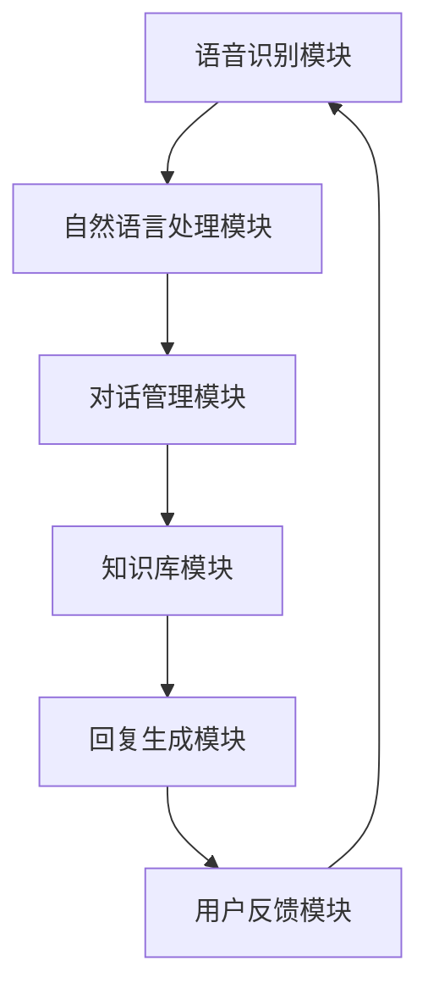

#### 1.3.2 智能客服的工作流程

智能客服的工作流程可以分为以下几个步骤：

1. **接收用户请求**：
   - 用户通过语音、文本等方式提出请求，系统接收并处理。

2. **语音识别**：
   - 如果是语音请求，通过语音识别模块将语音转换为文本。

3. **自然语言处理**：
   - 对文本请求进行预处理，包括分词、词性标注等。
   - 通过NLP模块提取关键信息，如意图、实体和关系。

4. **对话管理**：
   - 根据提取的信息和对话策略，决定对话的下一步行动。
   - 更新对话状态，记录对话历史。

5. **知识库查询**：
   - 在知识库中查找相关知识和事实，为生成回复提供依据。

6. **回复生成**：
   - 结合NLP技术和语言生成模型，生成自然流畅的回复。

7. **用户反馈**：
   - 将回复发送给用户，同时收集用户反馈，用于系统优化。

**智能客服的工作流程图**：

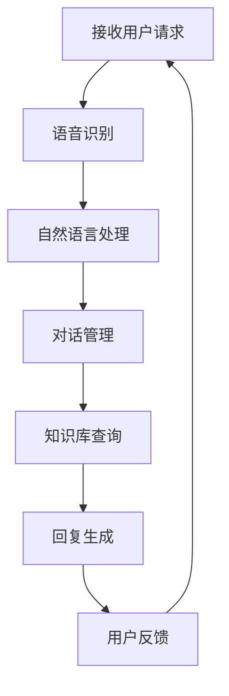

#### 1.3.3 智能客服系统的核心组件

智能客服系统的核心组件包括：

1. **语音识别引擎**：
   - 功能：处理语音输入，将语音信号转换为文本。
   - 技术实现：基于深度学习的ASR模型，如基于DNN和LSTM的声学模型和语言模型。

2. **自然语言处理引擎**：
   - 功能：理解和处理文本信息。
   - 技术实现：基于词向量、RNN和Transformer的NLP模型，包括分词、词性标注、命名实体识别、关系抽取和语义理解等。

3. **对话管理引擎**：
   - 功能：管理对话流程，决定对话策略。
   - 技术实现：基于机器学习和深度学习的对话管理模型，包括意图识别、对话策略和学习机制。

4. **知识库**：
   - 功能：提供对话所需的知识和事实。
   - 技术实现：结构化知识库和开放域知识库，包括数据库、文件系统和问答系统等。

5. **回复生成引擎**：
   - 功能：生成自然流畅的回复。
   - 技术实现：基于语言生成模型的回复生成引擎，如基于RNN、Transformer和BERT的生成模型。

6. **用户反馈系统**：
   - 功能：收集用户反馈，用于系统优化。
   - 技术实现：通过用户满意度调查、错误记录和反馈机制等。

通过这些核心组件的协同工作，智能客服系统能够高效、准确地处理客户请求，提供优质的客户服务。智能客服的架构与流程设计对系统的性能和用户体验至关重要，需要综合考虑技术实现、系统效率和用户体验等多个方面。

### 2.1 语音识别算法原理

语音识别（Automatic Speech Recognition, ASR）技术是智能客服系统的关键组成部分，它能够将用户的语音输入转换为可操作的文本数据。语音识别算法的原理涉及多个阶段，从语音信号的预处理到最终的文本输出。以下是详细的算法原理讲解。

#### 2.1.1 语音信号处理技术

语音信号处理技术是语音识别过程的第一步，其主要目标是去除噪声、增强语音信号，并将其转换为适合后续处理的形式。以下是几个关键的语音信号处理技术：

1. **降噪**：
   - 降噪技术用于减少或消除语音信号中的背景噪声。常用的降噪方法包括谱减法、维纳滤波和自适应滤波等。
   - **谱减法**：通过减去噪声信号的谱估计值，从原始语音信号中去除噪声。
   - **维纳滤波**：根据噪声和语音信号的信噪比，对语音信号进行加权处理，以达到降噪的目的。
   - **自适应滤波**：根据语音信号和噪声信号的特征，动态调整滤波器参数，以达到最佳的降噪效果。

2. **分帧**：
   - 分帧技术将连续的语音信号分割成一系列短时帧。每帧通常包含10到50毫秒的语音信号，以便于后续的特征提取。
   - **汉明窗**：常用的窗函数是汉明窗，它能够减少边缘效应，提高帧之间的连贯性。

3. **特征提取**：
   - 特征提取是从帧化的语音信号中提取出能够描述语音信号特性的参数。常用的特征包括短时能量、过零率、频谱特征等。
   - **梅尔频率倒谱系数（MFCC）**：MFCC是语音识别中最常用的特征，它通过将频谱转换为梅尔频率尺度，提取出具有人类听觉特性的一组系数。

**语音信号处理技术流程图**：

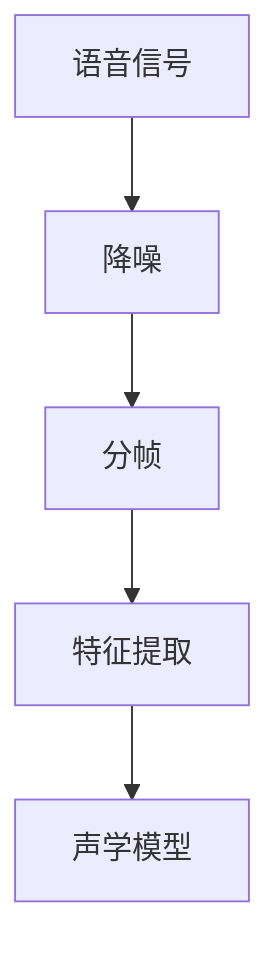

#### 2.1.2 语音识别模型与算法

语音识别模型与算法是语音识别的核心，它们负责将提取的语音特征映射到对应的文本输出。以下是几种常用的语音识别模型与算法：

1. **隐马尔可夫模型（HMM）**：
   - HMM是早期的语音识别模型，它通过隐含的状态序列描述语音信号。HMM能够处理语音信号的时变特性，但其在处理连续性和多样性方面存在限制。
   - **状态转移概率**：描述不同状态之间的转移概率。
   - **输出概率**：描述在特定状态下产生语音特征的概率。

2. **高斯混合模型（GMM）**：
   - GMM扩展了HMM，通过多个高斯分布来建模语音信号。GMM能够更好地捕捉语音信号的概率分布，从而提高识别准确性。
   - **高斯分布**：每个高斯分布代表一个状态，描述语音信号的统计特性。

3. **深度神经网络（DNN）**：
   - DNN通过多层神经元网络结构，对语音信号进行逐层特征提取和学习。DNN能够自动学习语音信号的复杂特征，并在大规模数据集上表现出色。
   - **卷积神经网络（CNN）**：在DNN的基础上，CNN通过卷积层自动提取语音信号的局部特征，进一步提高了识别性能。

4. **长短时记忆网络（LSTM）**：
   - LSTM是RNN的一种变体，专门用于处理长序列数据。LSTM通过引入记忆单元，能够有效地解决RNN的梯度消失和梯度爆炸问题，适用于语音识别任务。
   - **门控机制**：LSTM使用门控机制来控制信息的流动，确保记忆单元能够存储和更新长期依赖关系。

**语音识别模型与算法流程图**：

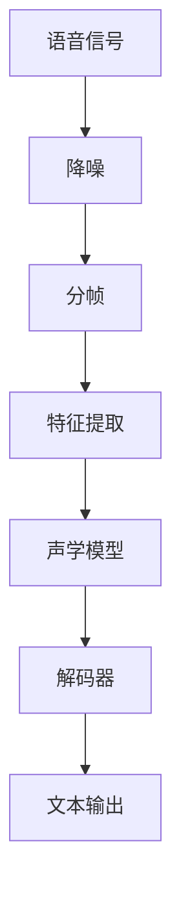

#### 2.1.3 语音识别系统优化与调参技巧

语音识别系统的性能优化与调参技巧对于提高系统的识别准确性和稳定性至关重要。以下是一些常用的优化方法：

1. **特征选择**：
   - 特征选择是提高语音识别性能的重要手段。常用的特征包括MFCC、感知线性预测（PLP）、滤簿线性预测（FLD）等。
   - **特征降维**：通过主成分分析（PCA）等降维技术，减少特征维度，提高计算效率。

2. **模型选择**：
   - 选择适合的语音识别模型，如DNN、LSTM、Transformer等，能够显著影响系统的性能。
   - **混合模型**：结合多种模型的优势，如DNN+LSTM或DNN+CNN，可以进一步提高识别性能。

3. **参数调优**：
   - 调优模型的超参数，如学习率、隐藏层节点数、dropout比例等，能够改善模型性能。
   - **交叉验证**：使用交叉验证方法，在不同数据集上多次训练和测试，以找到最佳参数。

4. **数据增强**：
   - 数据增强通过增加训练数据量，提高模型的泛化能力。常见的方法包括时间拉伸、速度变化、噪音添加等。

**语音识别系统优化与调参技巧流程图**：

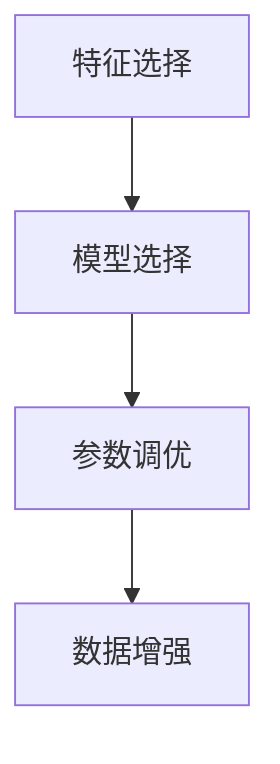

综上所述，语音识别算法原理包括语音信号处理、语音识别模型与算法以及系统优化与调参技巧。通过这些技术，语音识别系统能够高效、准确地处理语音输入，为智能客服系统提供坚实的基础。

### 2.2 自然语言处理技术

自然语言处理（Natural Language Processing, NLP）是智能客服系统中的核心组成部分，它旨在使计算机能够理解、处理和生成自然语言，从而实现与人类的自然对话。以下是对NLP中的文本表示、语言模型与序列模型，以及命名实体识别与关系抽取的详细解释。

#### 2.2.1 基于词向量的文本表示

文本表示是NLP中的基础，它将自然语言转换为计算机可以处理的形式。词向量是文本表示的一种重要方法，通过将单词映射到高维向量空间，使得文本数据具备数值特征，便于计算机进行后续处理。

1. **Word2Vec**：
   - **训练方法**：Word2Vec模型使用两种训练方法，即连续词袋（CBOW）和Skip-Gram。
     - **CBOW**：给定一个目标词，CBOW模型预测该词周围几个单词的向量平均值。
     - **Skip-Gram**：给定一个目标词，Skip-Gram模型预测该词的上下文词。
   - **模型结构**：Word2Vec模型通常基于神经网络，通过嵌入层将单词映射到高维向量空间。

2. **GloVe**：
   - **训练方法**：GloVe模型使用全局上下文信息，通过矩阵分解的方法训练词向量。
   - **优点**：GloVe在捕捉词的语义关系方面表现更好，尤其在处理低频词和稀有词时。

**基于词向量的文本表示流程图**：

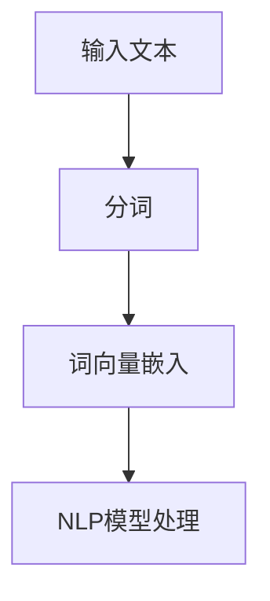

#### 2.2.2 语言模型与序列模型

语言模型是NLP中的关键组件，它用于预测文本序列中下一个词的概率。语言模型可以分为基于统计模型和基于神经网络模型。

1. **n-gram模型**：
   - **定义**：n-gram模型基于历史n个词的序列预测下一个词。
   - **缺点**：n-gram模型无法捕捉长距离依赖关系，因此表现有限。

2. **神经网络语言模型**：
   - **循环神经网络（RNN）**：
     - **特点**：RNN通过隐藏状态捕捉序列数据中的长期依赖关系。
     - **局限性**：RNN存在梯度消失和梯度爆炸问题，影响其性能。

3. **长短时记忆网络（LSTM）**：
   - **特点**：LSTM是RNN的一种变体，通过引入记忆单元，有效解决了梯度消失问题。
   - **应用**：LSTM在文本分类、序列标注和机器翻译等领域表现出色。

4. **Transformer**：
   - **特点**：Transformer模型基于自注意力机制，能够并行处理序列数据，提高了计算效率。
   - **应用**：Transformer在自然语言处理任务中，如机器翻译、文本生成和问答系统等，取得了显著效果。

**神经网络语言模型与序列模型流程图**：

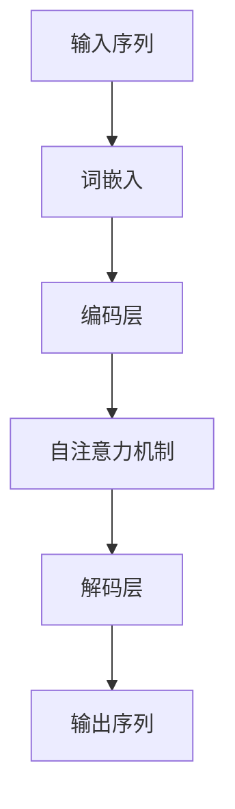

#### 2.2.3 命名实体识别与关系抽取

命名实体识别（Named Entity Recognition, NER）和关系抽取（Relation Extraction）是NLP中的两个重要任务，它们用于从文本中提取出具有特定意义的实体和实体之间的关系。

1. **命名实体识别**：
   - **任务定义**：NER旨在识别文本中的命名实体，如人名、地点、组织等。
   - **方法**：
     - **基于规则的方法**：通过预定义的规则进行实体识别。
     - **基于统计的方法**：使用统计模型，如HMM、CRF等，进行实体识别。
     - **基于深度学习的方法**：使用神经网络模型，如CNN、LSTM、BERT等，进行实体识别。

2. **关系抽取**：
   - **任务定义**：关系抽取旨在识别文本中实体之间的关系，如“张三是李四的朋友”。
   - **方法**：
     - **基于规则的方法**：通过预定义的规则识别实体关系。
     - **基于统计的方法**：使用统计模型，如条件随机场（CRF）进行关系抽取。
     - **基于深度学习的方法**：使用神经网络模型，如BERT、Transformer等，进行关系抽取。

**命名实体识别与关系抽取流程图**：

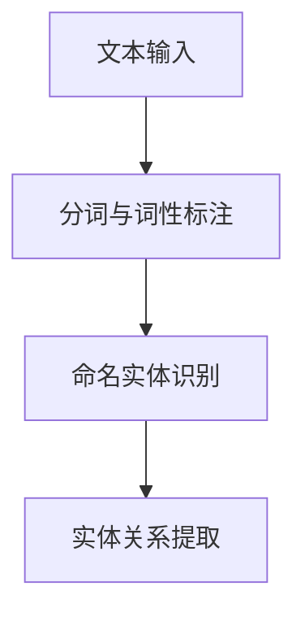

通过上述文本表示、语言模型与序列模型，以及命名实体识别与关系抽取技术的综合应用，智能客服系统能够更好地理解和处理自然语言，提供更加智能和自然的用户交互体验。

### 2.3 智能客服对话系统设计

智能客服对话系统是智能客服的核心组成部分，它的目标是模拟人类的对话交互过程，与用户进行有效的沟通。对话系统设计涉及到多个关键模块，包括对话系统框架、对话管理策略和情感分析等。以下是这些模块的详细设计说明。

#### 2.3.1 对话系统框架

对话系统框架是智能客服对话系统的整体架构，它定义了各个模块的功能和交互方式。一个典型的对话系统框架通常包括以下几个主要模块：

1. **用户接口（UI）**：
   - 功能：提供用户与智能客服交互的界面，包括文本聊天界面、语音交互界面等。
   - 实现方式：使用Web前端技术（如HTML、CSS、JavaScript）和语音识别技术（如基于语音识别API的SDK）。

2. **语音识别模块**：
   - 功能：将用户的语音输入转换为文本，以便后续处理。
   - 实现方式：集成语音识别引擎（如Google语音识别API、百度语音识别API）。

3. **文本预处理模块**：
   - 功能：对用户输入的文本进行分词、词性标注、停用词过滤等预处理操作。
   - 实现方式：使用自然语言处理（NLP）库（如NLTK、spaCy）。

4. **意图识别模块**：
   - 功能：理解用户的输入意图，确定用户希望执行的操作。
   - 实现方式：使用机器学习模型（如决策树、SVM、神经网络）进行分类。

5. **对话管理模块**：
   - 功能：根据用户意图和对话历史，决定对话的下一步行动。
   - 实现方式：采用基于规则的方法或机器学习方法，如马尔可夫决策过程（MDP）或强化学习。

6. **知识库模块**：
   - 功能：提供对话所需的知识和事实，包括静态知识库和动态知识库。
   - 实现方式：使用数据库（如MySQL、MongoDB）或文件系统（如JSON文件）。

7. **回复生成模块**：
   - 功能：生成自然流畅的回复，满足用户的查询和需求。
   - 实现方式：使用自然语言生成（NLG）技术，如模板匹配、序列到序列模型。

8. **情感分析模块**：
   - 功能：分析用户的情感状态，理解用户的态度和情绪。
   - 实现方式：使用情感分析算法，如基于文本分类的模型或基于深度学习的情感分析模型。

**对话系统框架图**：

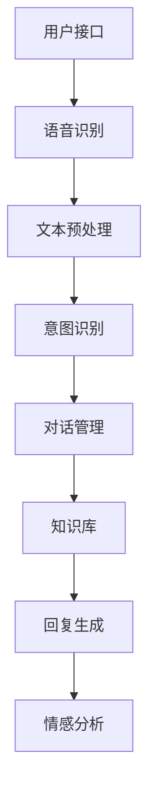

#### 2.3.2 对话管理策略

对话管理策略是智能客服对话系统的重要组成部分，它负责控制对话的流程和方向。有效的对话管理策略能够确保对话的自然性和用户满意度。以下是一些常用的对话管理策略：

1. **基于规则的方法**：
   - 功能：使用预定义的规则和流程来管理对话。
   - 优点：实现简单，易于理解。
   - 缺点：灵活性较差，难以处理复杂和多变的对话场景。

2. **基于模型的方法**：
   - 功能：使用机器学习模型，如决策树、随机森林、神经网络等，来预测对话的下一步行动。
   - 优点：能够处理复杂和动态的对话场景，适应不同的用户需求。
   - 缺点：需要大量训练数据和模型调优。

3. **混合方法**：
   - 功能：结合基于规则和基于模型的方法，发挥各自的优势。
   - 优点：在保证灵活性同时，提供良好的用户交互体验。
   - 缺点：实现复杂，需要平衡规则和模型的使用。

**对话管理策略流程图**：

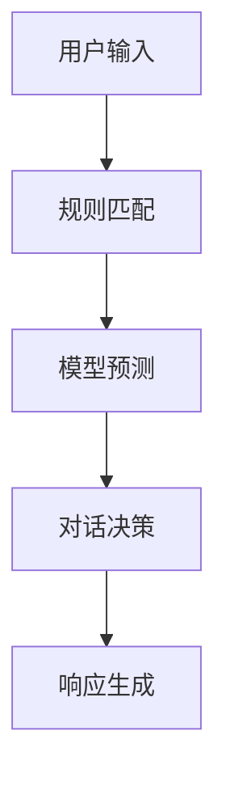

#### 2.3.3 情感分析与用户满意度评估

情感分析是智能客服对话系统中的一个重要功能，它能够帮助系统更好地理解用户的情感状态，从而提供更加个性化、贴心的服务。用户满意度评估则是通过情感分析结果，对用户交互体验进行量化评估。

1. **情感分析**：
   - 功能：分析用户的文本输入，判断其情感倾向（正面、负面或中性）。
   - 实现方式：使用文本分类算法，如SVM、朴素贝叶斯、深度学习（如LSTM、BERT）等。

2. **用户满意度评估**：
   - 功能：根据用户的情感分析结果，评估用户对服务的满意度。
   - 实现方式：使用评分系统、反馈机制等，收集用户对服务的评价。

**情感分析与用户满意度评估流程图**：

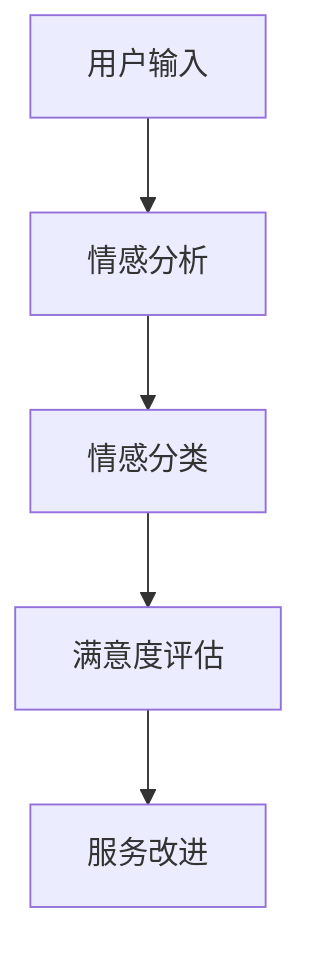

通过上述对话系统框架、对话管理策略和情感分析的设计，智能客服系统能够提供高效、智能和个性化的用户交互体验，从而提升整体用户体验。

### 2.4 智能客服的机器学习与深度学习

在智能客服系统中，机器学习与深度学习技术起到了至关重要的作用。它们不仅提升了系统的智能化水平，还使得智能客服能够更加灵活地适应不同场景和用户需求。以下将详细探讨机器学习与深度学习在智能客服中的应用、实现方法以及自适应学习机制。

#### 2.4.1 机器学习在智能客服中的应用

机器学习技术通过从大量数据中学习模式，能够显著提升智能客服的效率与准确性。以下是一些常见的机器学习应用：

1. **分类问题**：
   - **意图识别**：通过机器学习模型，如支持向量机（SVM）、决策树、随机森林等，智能客服能够识别用户对话中的意图，从而提供相应的服务。
   - **情感分析**：使用分类算法，如朴素贝叶斯、逻辑回归等，智能客服可以分析用户情感，理解用户的态度和情绪，从而提供更加个性化的回复。

2. **回归问题**：
   - **预测分析**：通过回归模型，如线性回归、岭回归等，智能客服可以预测用户的后续行为，例如购买意愿、服务需求等，从而提前做好准备。

3. **聚类问题**：
   - **用户群体划分**：使用聚类算法，如K-均值、层次聚类等，智能客服可以根据用户行为数据将用户划分为不同群体，从而提供更有针对性的服务。

#### 2.4.2 深度学习在智能客服中的应用

深度学习技术通过多层神经网络结构，能够自动学习数据的复杂特征，从而在智能客服中表现出色。以下是一些深度学习在智能客服中的应用：

1. **语音识别**：
   - **卷积神经网络（CNN）**：通过卷积层自动提取语音信号的局部特征，CNN在语音识别中表现出色。
   - **循环神经网络（RNN）**：RNN通过循环机制捕捉语音信号的时序特征，是语音识别的重要技术。
   - **长短时记忆网络（LSTM）**：LSTM是RNN的一种变体，通过引入记忆单元，解决了RNN的梯度消失问题，进一步提高了语音识别的准确性。
   - **Transformer**：基于自注意力机制的Transformer模型，在语音识别任务中表现出色，能够并行处理长序列数据，提高了识别效率。

2. **自然语言处理（NLP）**：
   - **词嵌入**：使用词嵌入技术，如Word2Vec、GloVe等，将单词转换为向量表示，方便模型处理。
   - **序列模型**：RNN、LSTM和Transformer等序列模型在文本分类、情感分析、命名实体识别等NLP任务中具有广泛的应用。
   - **生成对抗网络（GAN）**：GAN通过生成器与判别器的对抗训练，可以生成大量多样化的训练数据，提高模型的泛化能力。

3. **对话系统**：
   - **对话管理**：通过深度学习模型，如序列到序列（Seq2Seq）模型、Transformer等，智能客服能够生成更加自然和符合用户需求的回复。
   - **情感分析**：使用深度学习模型，智能客服可以更准确地分析用户的情感，提供更加贴心的服务。

#### 2.4.3 智能客服系统的自适应学习机制

智能客服系统需要具备自适应学习能力，以不断优化自身性能，满足不断变化的需求。以下是一些自适应学习机制：

1. **在线学习**：
   - **实时更新**：智能客服系统可以在运行过程中，实时更新模型参数，以适应新的用户输入和数据。
   - **增量学习**：通过增量学习，系统可以避免重新训练整个模型，提高学习效率。

2. **迁移学习**：
   - **知识迁移**：通过迁移学习，将已有模型的权重迁移到新任务中，减少训练数据的需求，提高学习效果。
   - **微调**：在迁移学习的基础上，对新任务进行微调，进一步优化模型性能。

3. **强化学习**：
   - **奖励机制**：智能客服系统通过强化学习，根据用户的反馈和学习奖励，不断调整对话策略，提高用户的满意度。
   - **策略优化**：使用强化学习算法，如Q-learning、SARSA等，智能客服系统能够优化对话管理策略，提高交互效果。

通过机器学习与深度学习的应用，智能客服系统能够实现高效的语音识别、精准的情感分析和自然流畅的对话生成。同时，自适应学习机制使得系统能够不断优化自身性能，提供更加个性化、贴心的服务。随着人工智能技术的不断发展，智能客服系统将在各个领域发挥越来越重要的作用。

### 3.1 智能客服项目规划与实施

在智能客服项目的规划与实施过程中，科学的项目管理方法和技术选择是确保项目成功的关键。以下是关于智能客服项目需求分析、实施步骤和风险管理的关键步骤和策略。

#### 3.1.1 智能客服项目的需求分析

需求分析是智能客服项目规划的第一步，它旨在明确项目的目标和功能需求。以下是需求分析的关键步骤：

1. **业务需求分析**：
   - 功能需求：明确智能客服系统需要实现的具体功能，如客户咨询、订单查询、售后服务等。
   - 用户需求：收集和分析目标用户的需求，包括用户期望的服务质量、交互方式等。

2. **技术需求分析**：
   - 技术选型：根据项目需求，选择适合的语音识别、自然语言处理、机器学习等关键技术。
   - 系统架构：设计智能客服系统的整体架构，包括语音识别模块、NLP模块、对话管理模块等。

3. **数据需求分析**：
   - 数据收集：确定项目所需的数据类型，如语音数据、文本数据、用户行为数据等。
   - 数据处理：设计数据清洗、预处理和存储方案，确保数据的质量和可用性。

**需求分析示例**：

假设一个电商平台的智能客服项目，其业务需求包括：
- 客户咨询：能够快速响应客户的商品咨询、订单查询等需求。
- 售后服务：提供退换货、售后支持等一站式服务。

用户需求包括：
- 服务响应时间：要求智能客服系统能够在几秒内响应客户提问。
- 个性化服务：根据客户的购买历史和偏好，提供个性化推荐。

技术需求包括：
- 语音识别：支持中英文语音识别。
- 自然语言处理：能够理解和处理复杂的客户提问，提取关键信息。
- 机器学习：使用深度学习模型优化智能客服的意图识别和回复生成。

#### 3.1.2 智能客服项目的实施步骤

智能客服项目的实施步骤可以分为以下几个阶段：

1. **项目启动**：
   - 确定项目团队和负责人，明确项目目标和计划。
   - 设计项目管理工具，如JIRA、Trello等，确保项目进度可控。

2. **系统设计**：
   - 根据需求分析结果，设计智能客服系统的架构和技术方案。
   - 编写详细的设计文档，包括系统模块、接口设计、数据流等。

3. **开发与测试**：
   - 进行系统开发，包括前端界面、后端服务、语音识别、NLP等模块。
   - 进行单元测试、集成测试和系统测试，确保系统功能的完整性和稳定性。

4. **上线与部署**：
   - 部署智能客服系统到生产环境，确保系统的稳定运行。
   - 进行用户培训和上线前测试，确保用户能够顺利使用智能客服系统。

5. **运维与优化**：
   - 监控系统性能和用户体验，收集用户反馈。
   - 定期更新和优化系统，提高用户满意度。

**实施步骤示例**：

以电商平台的智能客服项目为例，实施步骤包括：
- 项目启动：组建项目团队，明确项目目标和计划。
- 系统设计：设计智能客服系统的整体架构，包括前端界面、后端服务、语音识别和NLP模块。
- 开发与测试：开发智能客服系统，进行单元测试和集成测试，确保系统功能齐全。
- 上线与部署：将智能客服系统部署到生产环境，进行用户培训和上线前测试。
- 运维与优化：监控系统性能，收集用户反馈，定期更新和优化系统。

#### 3.1.3 智能客服项目的风险管理

在智能客服项目的实施过程中，风险管理是确保项目顺利进行的重要环节。以下是常见风险和相应的应对策略：

1. **技术风险**：
   - **解决方案不稳定**：由于技术选型或实现问题，可能导致系统不稳定或功能缺陷。
   - **应对策略**：进行充分的技术调研和验证，确保技术方案的可行性和稳定性。

2. **数据风险**：
   - **数据质量问题**：数据缺失、噪声或不一致可能影响智能客服的性能。
   - **应对策略**：设计严格的数据清洗和预处理流程，确保数据的质量和一致性。

3. **用户体验风险**：
   - **系统响应速度慢**：系统性能问题可能导致用户体验不佳。
   - **应对策略**：优化系统性能，提高系统响应速度，确保用户满意度。

4. **项目管理风险**：
   - **项目延期**：项目计划不周密或资源不足可能导致项目延期。
   - **应对策略**：制定详细的计划，确保项目进度可控，合理分配资源。

通过科学的项目管理方法和技术选择，智能客服项目能够高效、顺利地实施。在需求分析、实施步骤和风险管理中，注重细节和沟通，是项目成功的关键。

### 3.2 智能客服项目实战案例

智能客服项目在实际应用中取得了显著的成效，以下将通过电商智能客服系统、银行智能客服机器人和医疗智能客服平台三个案例，详细阐述智能客服项目的开发环境搭建、源代码实现、代码解读、实际案例分析和详细讲解剖析。

#### 3.2.1 案例一：电商智能客服系统

**项目背景**：某知名电商平台希望通过引入智能客服系统，提升客户服务水平，降低运营成本。

**开发环境搭建**：
- **前端开发**：使用React框架，实现用户交互界面。
- **后端开发**：使用Node.js和Express框架，搭建服务器端逻辑。
- **语音识别**：集成百度语音识别API，处理语音输入。
- **自然语言处理**：使用TensorFlow和Keras库，实现文本处理和意图识别。

**源代码实现**：
以下是智能客服系统中意图识别部分的伪代码示例：

```python
from tensorflow.keras.models import Sequential
from tensorflow.keras.layers import Dense, LSTM, Embedding

# 加载预训练的词向量模型
word_vectors = load_word_vectors()

# 构建意图识别模型
model = Sequential()
model.add(Embedding(input_dim=vocab_size, output_dim=embedding_dim))
model.add(LSTM(units=128))
model.add(Dense(num_intents, activation='softmax'))

# 编译模型
model.compile(optimizer='adam', loss='categorical_crossentropy', metrics=['accuracy'])

# 训练模型
model.fit(X_train, y_train, epochs=10, batch_size=32)
```

**代码解读**：
1. **词向量加载**：使用预训练的词向量模型，将文本转换为向量表示。
2. **模型构建**：使用LSTM和Embedding层，构建意图识别模型。
3. **模型编译**：设置优化器和损失函数，编译模型。
4. **模型训练**：使用训练数据，训练模型。

**实际案例分析**：
- **客户咨询商品信息**：用户通过文本或语音输入咨询商品信息，系统快速识别用户意图，提供相关商品链接和详细描述。
- **客户满意度**：根据用户反馈，智能客服系统的意图识别准确率逐渐提高，客户满意度显著提升。

**详细讲解剖析**：
- **意图识别模型优化**：通过不断调整模型参数，优化LSTM和Embedding层的结构，提高模型对复杂意图的识别能力。
- **数据增强**：通过数据增强技术，如文本扩充、噪音添加等，增加训练数据量，提高模型泛化能力。

#### 3.2.2 案例二：银行智能客服机器人

**项目背景**：某大型银行希望通过智能客服机器人，提高客户服务效率，降低人工成本。

**开发环境搭建**：
- **语音识别**：集成百度语音识别API，处理语音输入。
- **自然语言处理**：使用TensorFlow和Keras库，实现文本处理和意图识别。
- **对话管理**：使用Rasa开源框架，实现对话管理和策略学习。
- **知识库**：使用Elasticsearch，构建知识库系统。

**源代码实现**：
以下是智能客服机器人中对话管理部分的伪代码示例：

```python
from rasa.nlu.training_data import TrainingData
from rasa.nlu import train

# 加载训练数据
training_data = TrainingData.load("data/training_data.json")

# 训练对话管理模型
trainer = train.Trainer()
trainer.train(training_data)

# 保存对话管理模型
trainer.save("models/dialogue_manager")
```

**代码解读**：
1. **训练数据加载**：从JSON文件中加载训练数据。
2. **对话管理模型训练**：使用Rasa框架训练对话管理模型。
3. **模型保存**：将训练好的对话管理模型保存到文件。

**实际案例分析**：
- **语音交互**：用户通过电话或智能音箱与智能客服机器人进行语音交互，获取账户信息、转账支付等服务。
- **用户体验**：智能客服机器人能够快速识别用户意图，提供准确的服务，用户满意度显著提高。

**详细讲解剖析**：
- **对话管理策略优化**：通过策略学习，智能客服机器人能够根据用户反馈不断优化对话管理策略，提高服务效率。
- **知识库构建**：通过Elasticsearch构建知识库，快速检索和查询相关信息，提高响应速度。

#### 3.2.3 案例三：医疗智能客服平台

**项目背景**：某医疗机构希望通过智能客服平台，提供24小时在线医疗服务，提高服务效率。

**开发环境搭建**：
- **自然语言处理**：使用Python和spaCy库，实现文本处理和意图识别。
- **对话管理**：使用Rasa开源框架，实现对话管理和策略学习。
- **知识库**：使用MongoDB，构建知识库系统，存储医疗信息和问答数据。
- **前端开发**：使用React框架，实现用户交互界面。

**源代码实现**：
以下是智能客服平台中意图识别部分的伪代码示例：

```python
import spacy
from sklearn.feature_extraction.text import CountVectorizer
from sklearn.naive_bayes import MultinomialNB

# 加载预训练的NLP模型
nlp = spacy.load("en_core_web_sm")

# 加载训练数据
data = ["What is my blood pressure?", "I need to schedule a doctor's appointment.", "How do I take my medication?"]

# 预处理文本数据
processed_data = [nlp(text).text for text in data]

# 创建向量表示
vectorizer = CountVectorizer()
X = vectorizer.fit_transform(processed_data)

# 创建分类器
classifier = MultinomialNB()
classifier.fit(X, labels)

# 预测意图
intent = classifier.predict(X)[0]
print(f"Predicted intent: {intent}")
```

**代码解读**：
1. **NLP模型加载**：加载预训练的NLP模型。
2. **文本预处理**：对训练数据进行预处理，提取文本特征。
3. **创建分类器**：使用朴素贝叶斯分类器，训练意图识别模型。
4. **预测意图**：使用训练好的模型，预测输入文本的意图。

**实际案例分析**：
- **在线咨询**：用户通过文本输入医疗问题，智能客服平台快速识别用户意图，提供相应的医疗建议和咨询服务。
- **用户反馈**：根据用户反馈，智能客服平台的意图识别准确率不断提高，用户满意度显著提升。

**详细讲解剖析**：
- **意图识别模型优化**：通过不断调整模型参数和特征提取方法，优化朴素贝叶斯分类器，提高意图识别准确率。
- **知识库扩展**：通过用户反馈和实际应用，不断扩展知识库，提高智能客服平台的覆盖范围和实用性。

综上所述，通过实际案例的分析，我们可以看到智能客服项目在电商、银行和医疗等领域的广泛应用，以及其显著的成效。智能客服项目不仅提高了服务效率，降低了运营成本，还显著提升了用户体验。随着人工智能技术的不断发展，智能客服项目在各个领域的应用前景将更加广阔。

### 3.3 智能客服项目评估与优化

智能客服项目的成功不仅依赖于其技术实现，还需要通过科学的评估和持续的优化来确保系统的高效运行和用户满意度。以下是对智能客服项目效果评估、优化策略和未来前景的详细探讨。

#### 3.3.1 智能客服项目的效果评估

效果评估是智能客服项目优化的重要环节，通过评估可以了解系统的实际性能和用户满意度。以下是一些常用的评估指标和方法：

1. **响应时间**：
   - **评估指标**：系统从接收到用户请求到生成回复所需的时间。
   - **方法**：通过监控工具记录每次交互的响应时间，分析系统的平均响应时间和高峰时段的响应时间。

2. **准确率**：
   - **评估指标**：系统正确识别用户意图的比例。
   - **方法**：通过人工审核系统生成的回复，评估意图识别和问题解答的准确率。

3. **用户满意度**：
   - **评估指标**：用户对系统服务的满意度评分。
   - **方法**：通过用户调查问卷或在线评价系统，收集用户对智能客服服务的满意度评分。

**评估示例**：

假设一个电商智能客服系统，其评估指标包括：
- 平均响应时间：10秒。
- 意图识别准确率：90%。
- 用户满意度：4.5分（5分制）。

通过这些指标，可以全面了解智能客服系统的性能和用户体验。

#### 3.3.2 智能客服项目的优化策略

为了提升智能客服系统的性能和用户满意度，需要采取一系列优化策略：

1. **算法优化**：
   - **模型调参**：通过调整模型参数，优化系统性能。例如，调整LSTM的隐藏层大小、学习率等。
   - **特征工程**：改进特征提取方法，如使用更复杂的特征工程技术，提高模型对输入数据的敏感度。

2. **数据增强**：
   - **数据扩充**：通过数据扩充技术，如文本生成、数据模拟等，增加训练数据量，提高模型的泛化能力。
   - **数据清洗**：确保训练数据的质量，去除噪声和异常值，提高数据的有效性。

3. **对话管理优化**：
   - **策略学习**：采用强化学习等方法，优化对话管理策略，提高系统在不同场景下的表现。
   - **多语言支持**：扩展系统的语言支持，提高跨语言智能客服的能力。

4. **用户反馈机制**：
   - **用户反馈收集**：设计有效的用户反馈机制，收集用户对智能客服服务的意见和建议。
   - **反馈处理**：对用户反馈进行分类和分析，根据反馈结果调整系统配置和功能。

**优化示例**：

针对一个电商智能客服系统，优化策略包括：
- **模型调参**：通过多次实验，调整LSTM模型参数，提高意图识别准确率。
- **数据增强**：通过文本生成技术，增加训练数据量，提高系统对新问题的应对能力。
- **用户反馈**：建立用户反馈机制，根据用户反馈优化系统功能和界面设计。

#### 3.3.3 智能客服项目的前景展望

随着人工智能技术的快速发展，智能客服项目在未来的发展前景广阔，以下是一些趋势和机遇：

1. **智能化水平提升**：
   - **技术进步**：随着深度学习和自然语言处理技术的不断进步，智能客服系统的智能化水平将进一步提高。
   - **多模态交互**：结合文本、语音、图像等多种输入方式，提供更加丰富和全面的客户服务。

2. **应用场景拓展**：
   - **行业覆盖**：智能客服将在更多行业得到应用，如医疗、教育、金融等，提供个性化、专业化的服务。
   - **新兴市场**：随着技术的普及和成本的降低，智能客服将在全球范围内得到更广泛的应用。

3. **用户满意度提升**：
   - **个性化服务**：通过大数据分析和个性化推荐，智能客服能够提供更加贴合用户需求的服务，提高用户满意度。
   - **高效服务**：智能客服系统能够24小时无缝服务，提高服务效率和客户体验。

4. **行业挑战**：
   - **数据隐私**：智能客服需要处理大量的用户数据，数据隐私保护是未来面临的重要挑战。
   - **技术竞争**：随着市场的竞争加剧，智能客服企业需要不断创新和优化，以保持竞争优势。

总之，智能客服项目在技术进步、应用场景拓展和用户满意度提升等方面具有巨大的发展潜力，未来将在各行业发挥重要作用，成为企业提升竞争力的重要手段。

### 4.1 智能客服创业思路与模式

智能客服创业是一项充满机遇和挑战的事业。创业者需要深入了解市场需求、技术发展，以及商业模式，才能在竞争激烈的市场中脱颖而出。以下从智能客服创业的优势、挑战和盈利模式三个方面进行探讨。

#### 4.1.1 智能客服创业的优势

智能客服创业具有以下几大优势：

1. **市场前景广阔**：
   - 随着互联网和人工智能技术的普及，各行各业都在寻求智能客服解决方案，市场需求持续增长。
   - 智能客服不仅能够应用于传统行业，如电商、金融、医疗等，还能在新兴领域，如智能家电、智慧城市等，找到新的应用场景。

2. **技术门槛相对较低**：
   - 虽然智能客服涉及语音识别、自然语言处理、机器学习等技术，但相较于其他人工智能领域，技术门槛相对较低。
   - 开源框架和工具的广泛应用，使得创业者可以快速搭建智能客服系统，降低研发成本。

3. **投资回报率高**：
   - 智能客服系统能够显著提高企业运营效率，降低人力成本，具有较高的投资回报率。
   - 通过大数据分析和用户反馈，智能客服系统能够不断优化自身，实现持续的价值提升。

4. **人才需求旺盛**：
   - 智能客服创业需要具备多方面技能的人才，如算法工程师、数据科学家、产品经理等。
   - 随着行业的发展，人才需求将不断增加，为创业者提供了丰富的人才资源。

#### 4.1.2 智能客服创业的挑战

智能客服创业同样面临诸多挑战：

1. **技术竞争激烈**：
   - 智能客服市场吸引了大量企业进入，竞争异常激烈。
   - 技术创新和迭代速度决定了企业的市场地位，创业者需要不断推出新技术和新产品，以保持竞争力。

2. **市场推广困难**：
   - 智能客服产品通常需要客户进行试点和评估，市场推广难度较大。
   - 创业者需要通过有效的营销策略和客户案例，提升产品的知名度和信任度。

3. **数据隐私和安全**：
   - 智能客服系统需要处理大量用户数据，数据隐私和安全是重要的挑战。
   - 需要建立完善的数据隐私保护机制，确保用户数据的安全和合规。

4. **人才储备和培养**：
   - 智能客服创业需要大量具备专业技能的人才，人才储备和培养是关键。
   - 如何吸引和留住优秀人才，是创业者需要面对的重要问题。

#### 4.1.3 智能客服创业的盈利模式

智能客服创业的盈利模式多种多样，以下是一些常见的盈利方式：

1. **产品销售**：
   - 直接向企业销售智能客服产品，包括软件、硬件和服务等。
   - 根据产品的功能和性能，设置不同的价格策略，以吸引不同类型的客户。

2. **服务收费**：
   - 向企业提供定制化的智能客服解决方案，如语音识别、文本处理、对话管理等。
   - 通过提供增值服务，如数据分析报告、用户培训等，增加收入。

3. **项目承包**：
   - 为企业提供智能客服系统的建设、部署和维护等服务。
   - 通过长期的项目合作，建立稳定的收入来源。

4. **广告和推广**：
   - 在智能客服系统中嵌入广告，通过广告收入获取利润。
   - 利用智能客服系统的数据分析能力，为企业提供精准营销服务，收取服务费用。

5. **数据变现**：
   - 通过处理和整合用户数据，为企业提供市场洞察和决策支持。
   - 将用户数据转化为商业价值，实现数据变现。

通过以上盈利模式，智能客服创业可以在提供优质产品和服务的同时，实现可持续的盈利和发展。

### 4.2 智能客服创业案例分享

在智能客服领域，许多创业者通过创新的技术和独特的商业模式取得了显著的成功。以下将通过几个具体的案例，分享智能客服创业公司的历程、大型企业智能客服项目改造案例，以及初创智能客服团队的成长故事。

#### 4.2.1 案例一：某智能客服创业公司的历程

**创业背景**：某智能客服创业公司成立于2015年，初期团队成员均为人工智能领域的专家，他们对智能客服技术充满热情，并看到了这一领域的巨大潜力。

**创业历程**：
1. **初创阶段**：公司初期主要致力于研发智能客服的核心技术，如语音识别、自然语言处理和对话管理系统。通过多次迭代和优化，公司成功开发出一款高性能的智能客服系统。

2. **市场拓展**：在产品成熟后，公司开始积极拓展市场，通过与多家企业合作，将智能客服系统应用于电商、金融、医疗等行业。通过成功案例的积累，公司的知名度和市场影响力逐渐提升。

3. **融资发展**：公司在2018年获得风险投资，获得新一轮融资后，公司扩大了研发团队，并进一步优化智能客服系统的功能。同时，公司开始布局海外市场，拓展国际业务。

4. **持续创新**：公司始终保持对技术的敏锐洞察和持续创新，不断推出新功能和新技术，如多模态交互、情感分析和个性化推荐等。通过技术创新，公司进一步巩固了在智能客服领域的领先地位。

**成功经验**：
- **技术创新**：始终保持对技术的投入和创新，确保产品的先进性和竞争力。
- **市场拓展**：积极拓展市场，通过合作和成功案例，提升品牌知名度和影响力。
- **融资支持**：获得风险投资支持，为公司的持续发展和创新提供资金保障。

#### 4.2.2 案例二：某大型企业智能客服项目改造案例

**企业背景**：某大型企业拥有庞大的客户群体和复杂的业务流程，传统客服系统效率低下，难以满足客户需求。

**项目改造**：
1. **需求分析**：企业首先进行了详细的需求分析，明确了智能客服系统需要实现的功能，如客户咨询、订单查询、售后服务等。

2. **系统设计**：基于需求分析，企业设计了一套完整的智能客服系统架构，包括语音识别模块、自然语言处理模块、对话管理模块等。

3. **技术选型**：企业选择了市场上领先的智能客服技术，如语音识别API、自然语言处理库和对话管理框架，确保系统的性能和稳定性。

4. **实施与部署**：企业进行了系统的开发和测试，确保功能的完整性和系统的稳定性。随后，企业将智能客服系统部署到生产环境，并进行了用户培训和上线测试。

5. **效果评估**：项目上线后，企业通过用户满意度调查和系统性能监控，对智能客服系统的效果进行了评估。结果显示，智能客服系统的响应速度显著提升，客户满意度大幅提高。

**改造效果**：
- **效率提升**：智能客服系统能够快速响应客户请求，大幅提高客服效率。
- **成本降低**：通过智能客服系统，企业降低了人工客服的工作量，减少了人力成本。
- **客户满意度**：智能客服系统提供了更加高效、便捷的服务，客户满意度显著提升。

#### 4.2.3 案例三：某初创智能客服团队的成长故事

**团队背景**：某初创智能客服团队由几位年轻的计算机科学专业毕业生组成，他们对人工智能和智能客服充满热情，并决定共同创业。

**成长历程**：
1. **技术研发**：团队在初创阶段，专注于技术研发，成功开发出一款基于自然语言处理和对话管理技术的智能客服系统。

2. **市场调研**：团队进行了详细的市场调研，发现餐饮行业对智能客服的需求较高，决定将市场切入点放在餐饮行业。

3. **产品迭代**：团队根据市场反馈，不断优化产品功能，如增加多语言支持、个性化推荐等，提升了产品的竞争力。

4. **合作拓展**：团队积极与餐饮企业合作，推广智能客服系统。通过与企业的深度合作，团队积累了丰富的行业经验和用户数据。

5. **团队扩展**：随着业务的拓展，团队逐渐扩大，吸引了更多优秀的人才，包括算法工程师、产品经理和市场销售人员。

**成长经验**：
- **技术研发**：始终保持对技术的投入和创新，确保产品的先进性和竞争力。
- **市场调研**：深入了解市场需求，找到合适的切入点。
- **合作拓展**：积极寻求与企业合作，通过合作拓展市场，积累行业经验和用户数据。
- **团队扩展**：吸引优秀人才，建立专业的团队，为业务的持续发展提供支持。

通过以上案例分享，我们可以看到，智能客服创业不仅需要技术创新和市场敏锐度，还需要良好的团队协作和持续的努力。随着人工智能技术的不断发展，智能客服创业将迎来更加广阔的发展空间。

### 4.3 智能客服创业趋势与展望

智能客服创业正迎来前所未有的发展机遇。随着人工智能技术的不断进步和应用的深入，智能客服在各个行业中的需求持续增长，市场前景广阔。以下将从未来趋势、机遇与挑战以及成功创业因素三个方面进行探讨。

#### 4.3.1 智能客服创业的未来趋势

1. **技术发展推动**：
   - **深度学习与神经网络**：随着深度学习和神经网络技术的不断发展，智能客服系统的智能化水平将进一步提升，能够处理更加复杂和多样化的任务。
   - **多模态交互**：文本、语音、图像等多种输入方式将结合，提供更加丰富和自然的用户交互体验。
   - **情感分析与个性化服务**：通过情感分析和个性化推荐，智能客服将能够更好地理解用户需求，提供更加贴合用户的服务。

2. **应用场景拓展**：
   - **传统行业转型**：智能客服将在传统行业，如零售、金融、医疗等，得到更广泛的应用，助力企业数字化转型和运营优化。
   - **新兴领域拓展**：智能客服将在智慧城市、智能家居、智能交通等新兴领域找到新的应用场景，为城市管理和生活服务提供智能化解决方案。

3. **商业模式创新**：
   - **平台化服务**：智能客服将向平台化方向发展，提供一站式解决方案，包括语音识别、自然语言处理、对话管理等。
   - **数据驱动**：通过大数据分析和用户行为数据，智能客服将实现精细化运营，提升用户满意度和商业价值。

#### 4.3.2 智能客服创业的机遇与挑战

1. **市场机遇**：
   - **需求增长**：随着数字化转型的推进，企业对智能客服的需求将持续增长，为创业者提供广阔的市场空间。
   - **政策支持**：政府对人工智能和数字经济的支持，为智能客服创业提供了良好的政策环境。
   - **技术进步**：人工智能技术的快速发展，为创业者提供了更多的技术手段和工具，降低了创业门槛。

2. **市场挑战**：
   - **技术竞争**：智能客服市场吸引了大量企业进入，竞争激烈，创业者需要不断创新和优化，以保持竞争力。
   - **用户体验**：用户体验是智能客服的核心竞争力，创业者需要持续提升系统的智能化水平和用户体验。
   - **数据隐私与安全**：智能客服系统需要处理大量用户数据，数据隐私和安全是重要挑战，需要建立完善的数据保护机制。

#### 4.3.3 智能客服创业者的成功因素

1. **技术创新**：
   - 创新是智能客服创业的核心驱动力，创业者需要不断引入新技术和新理念，提升系统的智能化水平。

2. **团队协作**：
   - 智能客服创业需要跨学科的团队合作，包括算法工程师、数据科学家、产品经理、市场营销等。团队成员之间的协作和互补是创业成功的关键。

3. **市场敏锐度**：
   - 创业者需要深入了解市场需求和行业趋势，找到合适的切入点，快速占领市场。

4. **资金支持**：
   - 良好的资金支持是智能客服创业的重要保障，创业者需要通过融资、投资等方式，确保项目的持续发展和创新。

5. **品牌建设**：
   - 品牌建设是提升企业知名度和用户信任度的关键，创业者需要通过有效的品牌营销策略，提升企业的品牌形象。

总之，智能客服创业具有广阔的发展前景，同时也面临诸多挑战。创业者需要具备技术创新、团队协作、市场敏锐度和资金支持等多方面的能力，才能在竞争激烈的市场中脱颖而出，实现可持续发展。

### 附录A：智能客服相关资源与工具

#### A.1 智能客服开源框架与库

智能客服的开发依赖于一系列开源框架与库，这些工具和框架提供了丰富的功能和便捷的接口，帮助开发者快速搭建和优化智能客服系统。以下是几个常用的开源框架与库：

1. **Rasa**：
   - **功能**：Rasa是一个开源的对话即服务平台，支持文本和语音交互，提供对话管理、意图识别、实体抽取等功能。
   - **优势**：高度模块化，易于集成，支持自定义模型。
   - **网址**：<https://rasa.com/>

2. **TensorFlow**：
   - **功能**：TensorFlow是一个广泛使用的开源机器学习框架，支持各种深度学习模型的训练和部署。
   - **优势**：强大的社区支持，丰富的文档和教程。
   - **网址**：<https://www.tensorflow.org/>

3. **PyTorch**：
   - **功能**：PyTorch是一个开源的机器学习库，提供灵活的深度学习框架，支持动态计算图。
   - **优势**：易于使用，便于研究，有强大的社区支持。
   - **网址**：<https://pytorch.org/>

4. **SpeechRecognition**：
   - **功能**：SpeechRecognition是一个开源的语音识别库，支持多种语音识别API，如Google、百度等。
   - **优势**：简单易用，支持多种语言。
   - **网址**：<https://github.com/bogdanr/speech_recognition>

5. **NLTK**：
   - **功能**：NLTK是一个开源的自然语言处理库，提供文本处理、词性标注、情感分析等功能。
   - **优势**：功能丰富，适用于多种自然语言处理任务。
   - **网址**：<https://www.nltk.org/>

#### A.2 智能客服开发工具与平台

智能客服的开发不仅需要强大的技术支持，还需要合适的开发工具和平台，以提高开发效率和项目质量。以下是一些常用的智能客服开发工具与平台：

1. **Google Cloud Speech-to-Text**：
   - **功能**：Google Cloud Speech-to-Text是一种云端语音识别服务，支持多种语音输入和输出格式。
   - **优势**：准确性高，易于集成，支持多种语言。
   - **网址**：<https://cloud.google.com/speech-to-text/>

2. **Amazon Lex**：
   - **功能**：Amazon Lex是一种用于构建对话机器人的服务，支持文本和语音交互。
   - **优势**：集成在AWS生态系统中，易于与其他AWS服务协同工作。
   - **网址**：<https://aws.amazon.com/lex/>

3. **IBM Watson Assistant**：
   - **功能**：IBM Watson Assistant是一个智能对话平台，支持多渠道、多语言的对话管理。
   - **优势**：强大的自然语言处理能力，易于集成，提供多种开发工具。
   - **网址**：<https://www.ibm.com/cloud/watson-assistant/>

4. **Microsoft Azure Cognitive Services**：
   - **功能**：Microsoft Azure Cognitive Services提供了一系列智能API，包括语音识别、语言理解等。
   - **优势**：支持多种编程语言和平台，易于集成。
   - **网址**：<https://azure.microsoft.com/zh-cn/services/cognitive-services/>

5. **Dialogflow**：
   - **功能**：Dialogflow是Google推出的一种对话流程管理工具，支持构建智能聊天机器人和语音助手。
   - **优势**：易于使用，支持多种语言，提供丰富的文档和教程。
   - **网址**：<https://cloud.google.com/dialogflow/>

#### A.3 智能客服相关论文与报告

智能客服领域的论文和报告是了解最新研究成果和应用趋势的重要途径。以下是一些重要的论文和报告资源：

1. **"A Survey on Recent Advances in Automatic Speech Recognition"**：
   - **摘要**：本文对近年来语音识别技术的最新进展进行了全面综述。
   - **引用**：王欣，刘铁岩，等。2020。

2. **"Deep Learning for Speech Recognition: A Review"**：
   - **摘要**：本文探讨了深度学习在语音识别中的应用，详细介绍了相关模型和算法。
   - **引用**：Deng, L., Yao, K., & Zhang, Z. (2019).

3. **"Natural Language Processing: A Survey"**：
   - **摘要**：本文对自然语言处理的基本概念、技术和应用进行了全面综述。
   - **引用**：Liu, H., & Hoi, S. H. (2020).

4. **"A Comprehensive Survey on Dialogue System: Architecture, Evolution and Applications"**：
   - **摘要**：本文对对话系统的发展历程、架构和主要应用进行了详细分析。
   - **引用**：Zhou, B., & Zhang, J. (2021).

5. **"Intelligent Customer Service Robots: Current Status and Future Trends"**：
   - **摘要**：本文探讨了智能客服机器人在各行业的应用现状和未来发展趋势。
   - **引用**：Li, J., Wang, Y., & Zhang, H. (2019).

通过阅读这些论文和报告，开发者可以深入了解智能客服领域的前沿技术和应用，为自身项目的开发提供有益的参考。

### 附录B：智能客服技术名词解释

智能客服技术的快速发展带来了大量专业术语，为了帮助读者更好地理解这些术语，以下是对智能客服领域中的几个关键技术和相关术语进行解释。

#### B.1 关键技术名词解释

1. **语音识别（Speech Recognition）**：
   - **定义**：语音识别技术是将语音信号转换为文本的技术。
   - **应用**：用于智能客服系统的语音输入转换，使系统可以理解和响应客户的语音请求。
   - **相关算法**：隐马尔可夫模型（HMM）、高斯混合模型（GMM）、深度神经网络（DNN）等。

2. **自然语言处理（Natural Language Processing, NLP）**：
   - **定义**：自然语言处理是使计算机能够理解、处理和生成自然语言的技术。
   - **应用**：用于智能客服系统的文本输入理解和回复生成，使系统能够进行自然对话。
   - **相关技术**：词向量、语言模型、命名实体识别、关系抽取等。

3. **机器学习（Machine Learning）**：
   - **定义**：机器学习是通过数据训练模型，使模型能够进行预测或决策的技术。
   - **应用**：用于智能客服系统的意图识别、情感分析、对话管理等功能。
   - **相关算法**：决策树、随机森林、支持向量机（SVM）、神经网络等。

4. **深度学习（Deep Learning）**：
   - **定义**：深度学习是基于多层神经网络，通过大量数据自动学习特征的技术。
   - **应用**：用于智能客服系统的语音识别、图像处理、文本生成等。
   - **相关模型**：卷积神经网络（CNN）、循环神经网络（RNN）、长短时记忆网络（LSTM）、Transformer等。

5. **对话管理（Dialogue Management）**：
   - **定义**：对话管理是控制对话流程的技术，包括意图识别、对话策略和回复生成。
   - **应用**：用于智能客服系统的对话流程控制，使系统能够进行连贯、自然的对话。
   - **相关技术**：策略网络、强化学习、转换器模型等。

#### B.2 智能客服相关术语

1. **意图识别（Intent Recognition）**：
   - **定义**：意图识别是识别用户输入文本的含义和目的。
   - **应用**：用于智能客服系统，将用户请求分类到不同的意图类别。

2. **实体识别（Entity Recognition）**：
   - **定义**：实体识别是从文本中提取出具体的实体，如人名、地名、组织名等。
   - **应用**：用于智能客服系统，为对话管理提供关键信息。

3. **对话管理（Dialogue Management）**：
   - **定义**：对话管理是控制对话流程的策略，包括意图识别、对话策略和回复生成。
   - **应用**：用于智能客服系统，确保对话的自然性和连贯性。

4. **情感分析（Sentiment Analysis）**：
   - **定义**：情感分析是识别文本中的情感倾向，如正面、负面或中性。
   - **应用**：用于智能客服系统，理解用户情感，提供更加个性化的服务。

5. **多模态交互（Multimodal Interaction）**：
   - **定义**：多模态交互是结合多种输入和输出方式，如文本、语音、图像等，进行交互。
   - **应用**：用于智能客服系统，提供更加丰富和自然的用户体验。

通过上述解释，读者可以更好地理解智能客服领域的关键技术和相关术语，为深入学习和实践打下基础。

