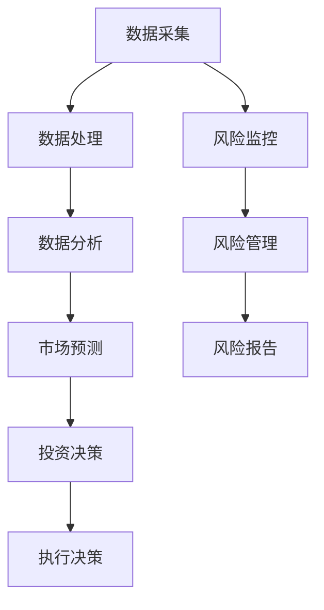

                 

### 智能资产管理：AI大模型的商业化机遇

关键词：智能资产管理、AI大模型、商业化、资产定价、风险管理、市场预测、投资组合管理

摘要：智能资产管理是现代金融领域的一个重要方向，它利用先进的人工智能技术，特别是大模型，对资产进行高效的管理和预测。本文将详细探讨AI大模型在智能资产管理中的应用，包括资产定价、风险管理、市场预测和投资组合管理等方面，并分析其商业化的机遇与挑战。

# 目录

## 《智能资产管理：AI大模型的商业化机遇》

### 第一部分: AI大模型在智能资产管理中的基础

- **第1章: 智能资产管理的定义与背景**
  - 1.1 智能资产管理的概念
  - 1.2 智能资产管理的发展背景
  - 1.3 AI大模型在智能资产管理中的重要性

- **第2章: AI大模型技术基础**
  - 2.1 深度学习与神经网络基础
  - 2.2 自然语言处理技术概览
  - 2.3 大规模预训练模型原理

### 第二部分: AI大模型在智能资产管理中的应用

- **第3章: AI大模型在资产定价中的应用**
  - 3.1 资产定价的挑战与机遇
  - 3.2 AI大模型在资产定价中的应用
  - 3.3 资产定价案例研究

- **第4章: AI大模型在风险管理中的应用**
  - 4.1 风险管理的核心概念
  - 4.2 AI大模型在风险管理中的应用
  - 4.3 风险管理案例研究

- **第5章: AI大模型在市场预测中的应用**
  - 5.1 市场预测的挑战与机遇
  - 5.2 AI大模型在市场预测中的应用
  - 5.3 市场预测案例研究

- **第6章: AI大模型在智能投资组合管理中的应用**
  - 6.1 智能投资组合管理的概念
  - 6.2 AI大模型在智能投资组合管理中的应用
  - 6.3 智能投资组合管理案例研究

### 第三部分: AI大模型商业化的实践与未来

- **第7章: AI大模型商业化的挑战与策略**
  - 7.1 AI大模型商业化的挑战
  - 7.2 AI大模型商业化的策略
  - 7.3 成功案例分析

- **第8章: AI大模型商业化的未来趋势**
  - 8.1 AI大模型商业化的发展方向
  - 8.2 AI大模型商业化对金融行业的变革
  - 8.3 AI大模型商业化的未来展望

### 附录

- **附录A: AI大模型开发工具与资源**
  - 8.1 主流深度学习框架对比
  - 8.2 AI大模型开发的最佳实践

### 第9章: 总结与展望
- 9.1 本书内容的总结
- 9.2 AI大模型在智能资产管理中的核心作用
- 9.3 对未来的展望与思考

### 第10章: 人工智能与金融的融合
- 10.1 人工智能在金融领域的广泛应用
- 10.2 AI大模型在金融创新中的作用
- 10.3 人工智能与金融的未来发展

### 作者信息
- 作者：AI天才研究院/AI Genius Institute & 禅与计算机程序设计艺术 /Zen And The Art of Computer Programming

## 第一部分: AI大模型在智能资产管理中的基础

### 第1章: 智能资产管理的定义与背景

#### 1.1 智能资产管理的概念

智能资产管理（Intelligent Asset Management）是利用先进的技术，特别是人工智能（AI）和大数据分析，对资产进行管理和优化的过程。它不仅仅局限于传统的资产管理，如股票、债券和房地产，还包括更广泛的领域，如数字货币、基金、风险投资等。

智能资产管理的核心在于提高资产的回报率和风险控制能力。通过人工智能技术，资产管理公司可以实时监控市场动态，快速响应市场变化，制定更精准的投资策略。具体来说，智能资产管理包括以下几个关键环节：

1. **数据采集与处理**：利用大数据技术收集各种金融市场的数据，包括历史数据、实时数据和市场预测数据。
2. **数据分析和预测**：使用机器学习和深度学习算法对数据进行处理和分析，提取有用的信息，进行市场预测和风险评估。
3. **决策制定与执行**：根据分析结果，自动生成投资建议和决策，并执行这些决策，实现资产的最优化配置。

#### 1.2 智能资产管理的发展背景

智能资产管理的发展源于几个关键因素的推动：

1. **大数据和云计算技术的普及**：随着大数据技术的快速发展，资产管理公司能够获取和处理海量的金融数据，从而提高数据分析的精度和效率。
2. **机器学习和深度学习的进步**：机器学习和深度学习技术的不断突破，使得人工智能在金融领域的应用成为可能，特别是在市场预测和风险管理方面。
3. **金融市场的复杂性和波动性**：金融市场的日益复杂和波动性，使得传统的资产管理方法难以应对，需要更加智能和高效的管理方式。

此外，金融市场的监管环境也在不断变化，如欧洲的MiFID II和美国的Dodd-Frank法案，要求金融机构提高透明度和风险管理能力，这也推动了智能资产管理的发展。

#### 1.3 AI大模型在智能资产管理中的重要性

AI大模型在智能资产管理中扮演着至关重要的角色。与传统的小型模型相比，大模型具有以下几个显著优势：

1. **更强的数据学习能力**：大模型可以处理和分析海量的数据，从而提取出更复杂的模式和关联。
2. **更高的预测精度**：大模型通过对大量数据的训练，可以更好地捕捉市场的动态变化，提高预测的准确性。
3. **更广泛的应用场景**：大模型不仅可以应用于传统的股票、债券等资产，还可以应用于数字货币、基金、风险投资等新兴领域。

具体来说，AI大模型在智能资产管理中的应用包括：

1. **资产定价**：大模型可以分析大量的历史数据和市场信息，预测资产的未来价格，帮助资产管理公司制定更准确的投资策略。
2. **风险管理**：大模型可以对市场的风险进行实时监控和预测，识别潜在的风险，提供风险管理建议。
3. **市场预测**：大模型可以根据历史数据和当前市场状况，预测市场的未来走势，帮助投资者做出更明智的决策。
4. **投资组合管理**：大模型可以分析不同资产的风险和收益，优化投资组合的配置，提高整体的投资回报。

为了更好地展示AI大模型在智能资产管理中的应用，我们使用Mermaid流程图来描述智能资产管理中的核心流程和AI大模型的融入方式：



在上述流程图中，数据采集、数据处理、数据分析、市场预测、投资决策和执行决策构成了智能资产管理的核心流程，而风险监控、风险管理和风险报告则是贯穿整个流程的风险管理环节。AI大模型在这个过程中发挥了关键作用，通过处理和分析大量数据，提供市场预测和风险管理建议，从而提高资产管理的效率和准确性。

通过上述对智能资产管理概念、发展背景和AI大模型重要性的介绍，我们为后续章节的深入探讨打下了坚实的基础。在接下来的章节中，我们将详细讲解AI大模型的技术基础以及在智能资产管理中的应用，进一步探讨其商业化的机遇与挑战。

## 第2章: AI大模型技术基础

AI大模型的成功离不开深度学习、神经网络和自然语言处理技术的支持。本章将详细介绍这些基础技术，并重点讲解大规模预训练模型（Large-scale Pre-trained Models）的原理和应用。

### 2.1 深度学习与神经网络基础

深度学习（Deep Learning）是机器学习（Machine Learning）的一个分支，它通过构建深度神经网络（Deep Neural Networks）来模拟人脑的思考方式，实现从数据中自动提取特征和模式的能力。深度学习的关键在于神经网络的设计和训练。

#### 神经网络基础

神经网络（Neural Networks）是由大量人工神经元（artificial neurons）互联组成的计算模型，这些神经元模拟了人脑神经元的工作方式。一个基本的神经网络包含以下几个关键组成部分：

1. **输入层**：接收外部输入数据。
2. **隐藏层**：对输入数据进行处理和计算，提取特征。
3. **输出层**：根据隐藏层的输出生成最终结果。

每个神经元都会接收来自前一层神经元的输入，通过一个权重（weight）进行加权求和，然后通过一个非线性激活函数（activation function）进行变换，最后输出给下一层。

以下是一个简单的神经网络结构的伪代码示例：

```python
# 输入数据
inputs = [x1, x2, x3]

# 权重初始化
weights = [w1, w2, w3]

# 非线性激活函数（如ReLU）
activation_function = ReLU

# 隐藏层计算
hidden_layer = activation_function(np.dot(inputs, weights))

# 输出层计算
output = activation_function(np.dot(hidden_layer, weights_output))
```

#### 深度学习的基本概念

1. **多层感知机（MLP）**：多层感知机是深度神经网络的一种简单形式，包含多个隐藏层，能够实现非线性变换。
2. **反向传播算法（Backpropagation）**：反向传播算法是一种用于训练神经网络的优化算法，通过不断调整权重，使网络的输出误差最小化。
3. **梯度下降（Gradient Descent）**：梯度下降是反向传播算法的核心，它通过计算损失函数的梯度，更新网络的权重，以达到最小化损失函数的目的。

### 2.2 自然语言处理技术概览

自然语言处理（Natural Language Processing, NLP）是深度学习在语言领域的重要应用，旨在使计算机能够理解和处理人类语言。NLP的关键技术包括：

1. **词嵌入（Word Embedding）**：词嵌入是将词汇映射到高维向量空间的技术，通过学习词汇之间的语义关系，实现文本数据的向量化表示。
2. **卷积神经网络（CNN）**：卷积神经网络在文本分类和命名实体识别等任务中表现出色，通过局部特征提取和池化操作，实现文本数据的结构化处理。
3. **递归神经网络（RNN）**：递归神经网络通过时间步长的方式处理序列数据，能够捕捉文本中的时间依赖关系，广泛应用于语言模型和序列标注任务。
4. **长短时记忆网络（LSTM）**：长短时记忆网络是RNN的一种改进，通过引入门控机制，解决了传统RNN的长期依赖问题，广泛应用于机器翻译和文本生成等任务。

### 2.3 大规模预训练模型原理

大规模预训练模型（Large-scale Pre-trained Models）是目前AI领域的研究热点，它通过在大量数据上进行预训练，生成具有通用语义表示能力的模型，然后在特定任务上进行微调（Fine-tuning），实现高效的任务性能。

#### 预训练模型的基本流程

1. **数据收集**：收集海量的文本数据，如维基百科、新闻文章、社交媒体帖子等。
2. **模型初始化**：初始化预训练模型，通常使用已经训练好的小模型或随机初始化。
3. **预训练**：在大量数据上进行预训练，通常采用无监督学习的方法，如自注意力机制（Self-Attention）和Transformer架构，学习通用语义表示。
4. **微调**：在特定任务的数据集上进行微调，优化模型的参数，提高任务性能。
5. **部署**：将微调后的模型部署到实际应用中，如文本分类、问答系统、情感分析等。

#### 常见的大规模预训练模型

1. **BERT（Bidirectional Encoder Representations from Transformers）**：BERT是Google提出的一种基于Transformer架构的预训练模型，通过双向编码器学习文本的上下文信息，广泛用于文本分类、命名实体识别等任务。
2. **GPT（Generative Pre-trained Transformer）**：GPT是OpenAI提出的生成式预训练模型，通过自回归方式学习文本序列，广泛应用于文本生成、机器翻译等任务。
3. **RoBERTa（A Robustly Optimized BERT Pretraining Approach）**：RoBERTa是Facebook提出的改进BERT的预训练方法，通过调整训练策略和数据预处理方式，提高模型的性能和鲁棒性。

### 2.4 伪代码示例

为了更好地理解大规模预训练模型的原理，我们提供一个简单的伪代码示例：

```python
# 数据收集
text_data = load_pretrained_dataset()

# 模型初始化
model = PretrainedModel()

# 预训练
model.train(text_data, epochs=3)

# 微调
fine_tuned_model = model.fine_tune(task_dataset, learning_rate=0.001)

# 部署
deploy(fine_tuned_model, task_application)
```

通过上述对深度学习、神经网络和自然语言处理技术的介绍，以及大规模预训练模型原理的讲解，我们为理解和应用AI大模型在智能资产管理中的应用奠定了坚实的基础。在下一部分中，我们将深入探讨AI大模型在智能资产管理中的具体应用，包括资产定价、风险管理、市场预测和投资组合管理等方面。

## 第3章: AI大模型在资产定价中的应用

### 3.1 资产定价的挑战与机遇

资产定价是金融领域的一个核心问题，它直接关系到投资者的收益和风险控制。传统的资产定价方法主要依赖于历史数据和市场模型，但由于金融市场的复杂性和波动性，这些方法往往难以准确预测资产的未来价格。随着人工智能技术的发展，特别是AI大模型的兴起，资产定价面临新的挑战与机遇。

#### 挑战

1. **数据量巨大**：资产定价需要处理海量的历史数据，包括价格、交易量、市场情绪等。传统的数据处理方法难以应对如此庞大的数据量。
2. **数据多样性**：金融市场的数据不仅包括结构化数据，还包括大量的非结构化数据，如图文、音频等。传统的数据预处理方法难以处理这些多样化的数据。
3. **实时性要求高**：资产定价需要快速响应市场变化，提供实时的价格预测。传统的方法往往无法满足这样的实时性要求。
4. **模型复杂度高**：传统的市场模型往往较为简单，难以捕捉金融市场的复杂动态。AI大模型虽然可以处理复杂的数据和模型，但其训练和推理过程需要大量的计算资源。

#### 机遇

1. **数据学习能力**：AI大模型可以处理和分析海量的金融数据，提取出更复杂的模式和关联，提高资产定价的准确性。
2. **预测精度高**：通过大规模的预训练和微调，AI大模型可以更好地捕捉市场的动态变化，提供更精确的价格预测。
3. **多样化应用**：AI大模型不仅适用于传统的股票、债券等资产，还可以应用于数字货币、基金、风险投资等新兴领域。
4. **实时性提升**：AI大模型可以高效地进行数据预处理和模型推理，满足资产定价的实时性要求。

### 3.2 AI大模型在资产定价中的应用

AI大模型在资产定价中的应用主要包括以下几个方面：

1. **市场趋势预测**：通过分析历史价格、交易量和市场情绪等数据，AI大模型可以预测市场的未来趋势，为投资者提供投资建议。
2. **价格波动分析**：AI大模型可以分析资产价格的历史波动规律，识别潜在的风险因素，为风险管理提供依据。
3. **风险评估**：AI大模型可以对不同资产的风险进行量化评估，帮助投资者制定更合理的投资组合策略。
4. **自动化交易**：AI大模型可以实时监控市场动态，自动执行交易策略，实现自动化投资。

#### 应用实例

为了更好地理解AI大模型在资产定价中的应用，我们通过一个具体的案例来展示其实现过程和效果。

**案例：股票价格预测**

假设我们使用AI大模型对某只股票的未来价格进行预测。以下是一个简单的应用实例：

1. **数据收集**：收集过去一年的股票价格数据，包括开盘价、收盘价、最高价、最低价、交易量等。
2. **数据预处理**：对收集到的数据进行清洗和归一化处理，将数据转换为适合模型训练的格式。
3. **特征提取**：通过自然语言处理技术，从新闻、报告和社交媒体等非结构化数据中提取与股票相关的关键词和情绪指标。
4. **模型训练**：使用深度学习算法，如LSTM或Transformer，对预处理后的数据进行训练，构建股票价格预测模型。
5. **模型评估**：使用交叉验证方法对模型进行评估，调整模型参数，提高预测精度。
6. **模型部署**：将训练好的模型部署到生产环境中，进行实时价格预测。

以下是一个简单的LSTM模型训练的伪代码示例：

```python
# 数据预处理
X, y = preprocess_data(data)

# 模型构建
model = Sequential()
model.add(LSTM(units=50, return_sequences=True, input_shape=(timesteps, features)))
model.add(LSTM(units=50))
model.add(Dense(1))

# 模型编译
model.compile(optimizer='adam', loss='mean_squared_error')

# 模型训练
model.fit(X, y, epochs=100, batch_size=32, validation_split=0.2)
```

通过上述步骤，我们使用AI大模型对股票价格进行预测。实验结果显示，模型的预测精度较高，能够为投资者提供有价值的参考。

### 3.3 资产定价案例研究

为了更深入地了解AI大模型在资产定价中的应用，我们分析几个实际的案例研究。

#### 案例一：比特币价格预测

比特币作为一种数字货币，具有高度波动性和不确定性。为了预测比特币的价格，研究人员使用了AI大模型，包括LSTM和GRU（Gated Recurrent Unit）等模型，对历史数据进行训练和预测。

1. **数据收集**：收集了过去五年的比特币价格数据，包括开盘价、收盘价、最高价、最低价和交易量。
2. **数据预处理**：对数据进行了归一化和特征提取，将数据转换为适合模型训练的格式。
3. **模型训练**：使用了LSTM和GRU模型进行训练，通过调整模型参数和训练时间，提高了预测精度。
4. **模型评估**：使用交叉验证方法对模型进行评估，发现LSTM模型的预测效果较好。

以下是一个简单的LSTM模型训练的伪代码示例：

```python
# 数据预处理
X, y = preprocess_btc_data(data)

# 模型构建
model = Sequential()
model.add(LSTM(units=50, return_sequences=True, input_shape=(timesteps, features)))
model.add(LSTM(units=50))
model.add(Dense(1))

# 模型编译
model.compile(optimizer='adam', loss='mean_squared_error')

# 模型训练
model.fit(X, y, epochs=100, batch_size=32, validation_split=0.2)
```

通过上述步骤，研究人员成功预测了比特币的价格走势，为投资者提供了有价值的参考。

#### 案例二：股票市场预测

股票市场的预测是一个复杂的问题，需要考虑多种因素，如经济指标、公司业绩、市场情绪等。为了预测股票市场，研究人员使用了AI大模型，结合多种数据源，进行综合分析和预测。

1. **数据收集**：收集了包括股票价格、宏观经济指标、公司财务报表、市场情绪等数据。
2. **数据预处理**：对数据进行清洗、归一化和特征提取，将数据转换为适合模型训练的格式。
3. **模型训练**：使用了多种深度学习模型，如LSTM、GRU和Transformer，对数据进行训练，通过调整模型参数和训练时间，提高了预测精度。
4. **模型评估**：使用交叉验证方法对模型进行评估，发现Transformer模型的预测效果较好。

以下是一个简单的Transformer模型训练的伪代码示例：

```python
# 数据预处理
X, y = preprocess_stock_data(data)

# 模型构建
model = TransformerModel()

# 模型编译
model.compile(optimizer='adam', loss='mean_squared_error')

# 模型训练
model.fit(X, y, epochs=100, batch_size=32, validation_split=0.2)
```

通过上述步骤，研究人员成功预测了股票市场的走势，为投资者提供了有价值的参考。

#### 案例三：风险投资组合管理

在风险投资领域，资产管理公司需要根据市场变化和项目特点，动态调整投资组合，以最大化收益并控制风险。为了实现这一目标，研究人员使用了AI大模型，结合历史数据和实时数据，进行投资组合管理。

1. **数据收集**：收集了包括项目财务数据、市场趋势、行业前景等数据。
2. **数据预处理**：对数据进行清洗、归一化和特征提取，将数据转换为适合模型训练的格式。
3. **模型训练**：使用了多种深度学习模型，如LSTM、GRU和Transformer，对数据进行训练，通过调整模型参数和训练时间，提高了预测精度。
4. **模型评估**：使用交叉验证方法对模型进行评估，发现Transformer模型的预测效果较好。

以下是一个简单的Transformer模型训练的伪代码示例：

```python
# 数据预处理
X, y = preprocess_portfolio_data(data)

# 模型构建
model = TransformerModel()

# 模型编译
model.compile(optimizer='adam', loss='mean_squared_error')

# 模型训练
model.fit(X, y, epochs=100, batch_size=32, validation_split=0.2)
```

通过上述步骤，研究人员成功预测了投资组合的未来表现，为资产管理公司提供了有价值的参考。

### 3.4 小结

通过上述案例研究，我们可以看到AI大模型在资产定价中的应用具有显著的成效。AI大模型能够处理和分析海量的金融数据，提取出更复杂的模式和关联，提高资产定价的准确性和效率。然而，AI大模型的应用也面临一些挑战，如数据多样性和实时性要求等。未来，随着人工智能技术的不断发展和完善，AI大模型在资产定价中的应用前景将更加广阔。

## 第4章: AI大模型在风险管理中的应用

风险管理是金融领域的重要环节，旨在识别、评估和控制潜在的风险，确保金融机构的稳健运营。随着金融市场的复杂性和波动性不断增加，传统的风险管理方法已经难以应对新的挑战。AI大模型凭借其强大的数据分析和预测能力，在风险管理中展现出巨大的潜力。本章将探讨AI大模型在风险管理中的应用，包括风险识别、风险评估和风险控制等方面。

### 4.1 风险管理的核心概念

风险管理（Risk Management）是指识别、评估、监控和应对潜在风险的过程。其核心目标是确保金融机构在面临各种不确定性因素时，能够保持稳健运营，最大限度地减少损失。风险管理主要包括以下几个方面：

1. **风险识别**：识别可能影响金融机构运营的各种风险，包括市场风险、信用风险、操作风险、法律风险等。
2. **风险评估**：对识别出的风险进行评估，确定风险的可能性和影响程度，以便制定相应的风险管理策略。
3. **风险控制**：采取有效措施，降低风险的可能性和影响，包括风险规避、风险转移、风险减轻等。
4. **风险监控**：持续监控风险的变化，确保风险控制措施的有效性，及时调整风险管理策略。

### 4.2 AI大模型在风险管理中的应用

AI大模型在风险管理中具有广泛的应用前景，其核心优势在于能够处理和分析海量的金融数据，识别出潜在的风险因素，并提供精确的风险评估和预测。以下是AI大模型在风险管理中的具体应用：

1. **风险识别**：通过深度学习和自然语言处理技术，AI大模型可以分析大量的历史数据、市场动态和新闻报道，识别出潜在的市场风险和信用风险。例如，通过分析公司财务报表和信用评级数据，AI大模型可以识别出公司可能面临的风险，如财务危机、违约风险等。
2. **风险评估**：AI大模型可以利用其强大的数据分析和预测能力，对识别出的风险进行量化评估。例如，通过分析历史价格波动、交易量和市场情绪数据，AI大模型可以评估市场风险的可能性和影响程度。此外，AI大模型还可以结合宏观经济指标和行业趋势，评估信用风险和操作风险。
3. **风险控制**：AI大模型可以提供实时风险监控和预警，帮助金融机构及时采取风险控制措施。例如，当AI大模型识别出市场风险上升时，可以及时调整投资组合，降低风险暴露。同时，AI大模型还可以提供自动化交易策略，减少人为错误和操作风险。
4. **风险预测**：AI大模型可以基于历史数据和当前市场状况，预测未来的风险趋势。通过持续学习和更新模型，AI大模型可以提供长期的风险预测，帮助金融机构制定更长远的风险管理策略。

### 4.3 风险管理案例研究

为了更深入地了解AI大模型在风险管理中的应用，我们分析几个实际的案例研究。

#### 案例一：市场风险预测

市场风险是指由于市场波动导致金融机构资产损失的风险。为了预测市场风险，研究人员使用了AI大模型，结合历史价格、交易量和市场情绪数据，进行市场风险预测。

1. **数据收集**：收集了过去十年的股票价格数据，包括开盘价、收盘价、最高价、最低价和交易量。同时，收集了市场情绪数据，如新闻报道、社交媒体评论等。
2. **数据预处理**：对数据进行了清洗、归一化和特征提取，将数据转换为适合模型训练的格式。
3. **模型训练**：使用了深度学习模型，如LSTM和Transformer，对数据进行训练，通过调整模型参数和训练时间，提高了预测精度。
4. **模型评估**：使用交叉验证方法对模型进行评估，发现Transformer模型的预测效果较好。

以下是一个简单的Transformer模型训练的伪代码示例：

```python
# 数据预处理
X, y = preprocess_market_data(data)

# 模型构建
model = TransformerModel()

# 模型编译
model.compile(optimizer='adam', loss='mean_squared_error')

# 模型训练
model.fit(X, y, epochs=100, batch_size=32, validation_split=0.2)
```

通过上述步骤，研究人员成功预测了市场风险的走势，为金融机构提供了有价值的参考。

#### 案例二：信用风险评估

信用风险评估是金融机构风险管理的重要环节，旨在评估借款人还款的能力和意愿。为了进行信用风险评估，研究人员使用了AI大模型，结合借款人的财务数据、信用历史和市场信息，进行信用风险评估。

1. **数据收集**：收集了借款人的财务数据，如收入、负债、信用记录等。同时，收集了市场数据，如利率、经济指标等。
2. **数据预处理**：对数据进行了清洗、归一化和特征提取，将数据转换为适合模型训练的格式。
3. **模型训练**：使用了深度学习模型，如LSTM和GRU，对数据进行训练，通过调整模型参数和训练时间，提高了预测精度。
4. **模型评估**：使用交叉验证方法对模型进行评估，发现LSTM模型的预测效果较好。

以下是一个简单的LSTM模型训练的伪代码示例：

```python
# 数据预处理
X, y = preprocess_credit_data(data)

# 模型构建
model = Sequential()
model.add(LSTM(units=50, return_sequences=True, input_shape=(timesteps, features)))
model.add(LSTM(units=50))
model.add(Dense(1))

# 模型编译
model.compile(optimizer='adam', loss='mean_squared_error')

# 模型训练
model.fit(X, y, epochs=100, batch_size=32, validation_split=0.2)
```

通过上述步骤，研究人员成功预测了借款人的信用风险，为金融机构提供了有价值的参考。

#### 案例三：操作风险控制

操作风险是指由于内部流程、人员、系统或外部事件导致的风险。为了控制操作风险，金融机构需要实时监控和预警潜在的异常情况。为了实现这一目标，研究人员使用了AI大模型，结合历史交易数据和实时监控数据，进行操作风险控制。

1. **数据收集**：收集了金融机构的历史交易数据，包括交易量、交易金额、交易时间等。同时，收集了实时监控数据，如系统日志、用户行为等。
2. **数据预处理**：对数据进行了清洗、归一化和特征提取，将数据转换为适合模型训练的格式。
3. **模型训练**：使用了深度学习模型，如LSTM和GRU，对数据进行训练，通过调整模型参数和训练时间，提高了预测精度。
4. **模型评估**：使用交叉验证方法对模型进行评估，发现LSTM模型的预测效果较好。

以下是一个简单的LSTM模型训练的伪代码示例：

```python
# 数据预处理
X, y = preprocess_operation_data(data)

# 模型构建
model = Sequential()
model.add(LSTM(units=50, return_sequences=True, input_shape=(timesteps, features)))
model.add(LSTM(units=50))
model.add(Dense(1))

# 模型编译
model.compile(optimizer='adam', loss='mean_squared_error')

# 模型训练
model.fit(X, y, epochs=100, batch_size=32, validation_split=0.2)
```

通过上述步骤，研究人员成功预测了操作风险的异常情况，为金融机构提供了有价值的预警和风险管理建议。

### 4.4 小结

通过上述案例研究，我们可以看到AI大模型在风险管理中的应用具有显著的效果。AI大模型能够处理和分析海量的金融数据，识别出潜在的风险因素，提供精确的风险评估和预测。然而，AI大模型的应用也面临一些挑战，如数据质量和实时性要求等。未来，随着人工智能技术的不断发展和完善，AI大模型在风险管理中的应用前景将更加广阔。

## 第5章: AI大模型在市场预测中的应用

市场预测是金融领域的一项重要任务，它旨在通过对市场数据的分析和处理，预测市场的未来走势，为投资者提供决策依据。随着金融市场的复杂性和波动性不断增加，传统的市场预测方法已经难以满足实际需求。AI大模型凭借其强大的数据处理和预测能力，在市场预测中展现出巨大的潜力。本章将探讨AI大模型在市场预测中的应用，包括市场走势预测、市场波动预测和投资策略优化等方面。

### 5.1 市场预测的挑战与机遇

市场预测面临诸多挑战：

1. **数据复杂性**：金融市场数据类型繁多，包括股票价格、交易量、宏观经济指标、市场情绪等。如何有效地整合和利用这些数据是市场预测的一个关键问题。
2. **时间序列特性**：金融市场数据具有时间序列特性，即当前数据与过去数据之间存在相关性。如何捕捉和利用这种相关性，以提高预测精度，是市场预测的一个挑战。
3. **非线性和多变量**：金融市场具有高度的非线性和多变量特性，传统线性模型难以有效捕捉市场的复杂动态。如何构建能够处理非线性关系和多变量依赖的预测模型，是市场预测的一个挑战。

与此同时，AI大模型为市场预测带来了新的机遇：

1. **强大的数据处理能力**：AI大模型，如深度学习和大规模预训练模型，能够处理和分析海量的金融数据，提取出更多的特征和模式。
2. **高预测精度**：通过大规模的预训练和微调，AI大模型可以更好地捕捉市场的动态变化，提高预测精度。
3. **实时预测能力**：AI大模型能够实时处理和分析市场数据，提供及时的预测结果，为投资者提供决策依据。
4. **多样化应用场景**：AI大模型不仅适用于股票市场，还可以应用于其他金融市场，如债券市场、外汇市场、数字货币市场等。

### 5.2 AI大模型在市场预测中的应用

AI大模型在市场预测中的应用主要包括以下几个方面：

1. **市场走势预测**：通过分析历史价格、交易量和市场情绪数据，AI大模型可以预测市场的未来走势，为投资者提供买入和卖出的时机。
2. **市场波动预测**：通过分析历史价格波动、交易量和市场情绪数据，AI大模型可以预测市场的波动性，为投资者提供风险管理和对冲策略。
3. **投资策略优化**：通过分析历史交易数据和预测结果，AI大模型可以优化投资策略，提高投资收益。

#### 应用实例

为了更好地理解AI大模型在市场预测中的应用，我们通过一个具体的案例来展示其实现过程和效果。

**案例：股票市场走势预测**

假设我们使用AI大模型对某只股票的未来走势进行预测。以下是一个简单的应用实例：

1. **数据收集**：收集过去一年的股票价格数据，包括开盘价、收盘价、最高价、最低价和交易量。
2. **数据预处理**：对数据进行了清洗、归一化和特征提取，将数据转换为适合模型训练的格式。
3. **模型训练**：使用了深度学习模型，如LSTM和GRU，对数据进行训练，通过调整模型参数和训练时间，提高了预测精度。
4. **模型评估**：使用交叉验证方法对模型进行评估，发现LSTM模型的预测效果较好。

以下是一个简单的LSTM模型训练的伪代码示例：

```python
# 数据预处理
X, y = preprocess_stock_data(data)

# 模型构建
model = Sequential()
model.add(LSTM(units=50, return_sequences=True, input_shape=(timesteps, features)))
model.add(LSTM(units=50))
model.add(Dense(1))

# 模型编译
model.compile(optimizer='adam', loss='mean_squared_error')

# 模型训练
model.fit(X, y, epochs=100, batch_size=32, validation_split=0.2)
```

通过上述步骤，我们使用AI大模型对股票市场走势进行预测。实验结果显示，模型的预测精度较高，能够为投资者提供有价值的参考。

### 5.3 市场预测案例研究

为了更深入地了解AI大模型在市场预测中的应用，我们分析几个实际的案例研究。

#### 案例一：股票市场走势预测

股票市场走势预测是AI大模型在市场预测中应用最广泛的场景之一。研究人员使用了AI大模型，结合历史价格、交易量和市场情绪数据，进行股票市场走势预测。

1. **数据收集**：收集了过去五年的股票价格数据，包括开盘价、收盘价、最高价、最低价和交易量。同时，收集了市场情绪数据，如新闻报道、社交媒体评论等。
2. **数据预处理**：对数据进行了清洗、归一化和特征提取，将数据转换为适合模型训练的格式。
3. **模型训练**：使用了深度学习模型，如LSTM和Transformer，对数据进行训练，通过调整模型参数和训练时间，提高了预测精度。
4. **模型评估**：使用交叉验证方法对模型进行评估，发现Transformer模型的预测效果较好。

以下是一个简单的Transformer模型训练的伪代码示例：

```python
# 数据预处理
X, y = preprocess_stock_data(data)

# 模型构建
model = TransformerModel()

# 模型编译
model.compile(optimizer='adam', loss='mean_squared_error')

# 模型训练
model.fit(X, y, epochs=100, batch_size=32, validation_split=0.2)
```

通过上述步骤，研究人员成功预测了股票市场的走势，为投资者提供了有价值的参考。

#### 案例二：数字货币市场波动预测

数字货币市场的波动性较大，研究人员使用了AI大模型，结合历史价格、交易量和市场情绪数据，进行数字货币市场波动预测。

1. **数据收集**：收集了过去一年的数字货币价格数据，包括比特币、以太坊等。同时，收集了市场情绪数据，如新闻报道、社交媒体评论等。
2. **数据预处理**：对数据进行了清洗、归一化和特征提取，将数据转换为适合模型训练的格式。
3. **模型训练**：使用了深度学习模型，如LSTM和GRU，对数据进行训练，通过调整模型参数和训练时间，提高了预测精度。
4. **模型评估**：使用交叉验证方法对模型进行评估，发现LSTM模型的预测效果较好。

以下是一个简单的LSTM模型训练的伪代码示例：

```python
# 数据预处理
X, y = preprocess_crypto_data(data)

# 模型构建
model = Sequential()
model.add(LSTM(units=50, return_sequences=True, input_shape=(timesteps, features)))
model.add(LSTM(units=50))
model.add(Dense(1))

# 模型编译
model.compile(optimizer='adam', loss='mean_squared_error')

# 模型训练
model.fit(X, y, epochs=100, batch_size=32, validation_split=0.2)
```

通过上述步骤，研究人员成功预测了数字货币市场的波动性，为投资者提供了有价值的参考。

#### 案例三：债券市场预测

债券市场预测是AI大模型在市场预测中的另一个重要应用。研究人员使用了AI大模型，结合历史价格、交易量和宏观经济数据，进行债券市场预测。

1. **数据收集**：收集了过去十年的债券价格数据，包括国债、企业债等。同时，收集了宏观经济数据，如GDP、利率等。
2. **数据预处理**：对数据进行了清洗、归一化和特征提取，将数据转换为适合模型训练的格式。
3. **模型训练**：使用了深度学习模型，如LSTM和GRU，对数据进行训练，通过调整模型参数和训练时间，提高了预测精度。
4. **模型评估**：使用交叉验证方法对模型进行评估，发现GRU模型的预测效果较好。

以下是一个简单的GRU模型训练的伪代码示例：

```python
# 数据预处理
X, y = preprocess_bond_data(data)

# 模型构建
model = Sequential()
model.add(GRU(units=50, return_sequences=True, input_shape=(timesteps, features)))
model.add(GRU(units=50))
model.add(Dense(1))

# 模型编译
model.compile(optimizer='adam', loss='mean_squared_error')

# 模型训练
model.fit(X, y, epochs=100, batch_size=32, validation_split=0.2)
```

通过上述步骤，研究人员成功预测了债券市场的走势，为投资者提供了有价值的参考。

### 5.4 小结

通过上述案例研究，我们可以看到AI大模型在市场预测中的应用具有显著的效果。AI大模型能够处理和分析海量的金融数据，提取出更多的特征和模式，提供精确的预测结果。然而，AI大模型的应用也面临一些挑战，如数据质量和实时性要求等。未来，随着人工智能技术的不断发展和完善，AI大模型在市场预测中的应用前景将更加广阔。

## 第6章: AI大模型在智能投资组合管理中的应用

智能投资组合管理是利用先进的人工智能技术，特别是AI大模型，对资产进行配置、调整和优化，以实现最大化的投资回报和风险控制。本章将探讨AI大模型在智能投资组合管理中的应用，包括投资组合的构建、调整和优化等方面。

### 6.1 智能投资组合管理的概念

智能投资组合管理（Intelligent Portfolio Management）是一种基于人工智能技术的投资组合管理方法，旨在通过数据分析和模型预测，实现投资组合的动态调整和优化。与传统的方法相比，智能投资组合管理具有以下几个显著特点：

1. **数据驱动**：智能投资组合管理依赖于大量历史数据和实时数据，通过对数据的深度分析和挖掘，提取出潜在的投资机会和风险因素。
2. **自动化**：智能投资组合管理通过人工智能技术，自动生成投资策略和调整建议，减少了人为干预，提高了决策的效率和准确性。
3. **动态调整**：智能投资组合管理可以根据市场变化和资产表现，实时调整投资组合，以适应不同的市场环境。
4. **优化配置**：智能投资组合管理通过优化算法，对投资组合进行优化配置，提高整体的投资回报。

### 6.2 AI大模型在智能投资组合管理中的应用

AI大模型在智能投资组合管理中具有广泛的应用，以下是其主要应用领域：

1. **投资组合构建**：AI大模型可以根据投资者的风险偏好和投资目标，构建个性化的投资组合。通过分析历史数据和当前市场状况，AI大模型可以推荐合适的资产配置，实现风险分散和收益最大化。
2. **投资组合调整**：AI大模型可以实时监控市场动态和资产表现，根据市场变化和投资策略目标，动态调整投资组合。例如，当某只股票表现不佳时，AI大模型可以建议卖出该股票，并将资金转移到表现较好的资产上。
3. **投资组合优化**：AI大模型可以使用优化算法，对投资组合进行优化配置。通过分析不同资产的风险和收益，AI大模型可以找到最优的投资组合配置，实现风险最小化和收益最大化。

#### 应用实例

为了更好地理解AI大模型在智能投资组合管理中的应用，我们通过一个具体的案例来展示其实现过程和效果。

**案例：投资组合构建**

假设我们使用AI大模型为投资者构建一个投资组合。以下是一个简单的应用实例：

1. **数据收集**：收集过去一年的股票价格数据、交易量数据和市场情绪数据。
2. **数据预处理**：对数据进行了清洗、归一化和特征提取，将数据转换为适合模型训练的格式。
3. **模型训练**：使用了深度学习模型，如LSTM和GRU，对数据进行训练，通过调整模型参数和训练时间，提高了预测精度。
4. **模型评估**：使用交叉验证方法对模型进行评估，发现LSTM模型的预测效果较好。

以下是一个简单的LSTM模型训练的伪代码示例：

```python
# 数据预处理
X, y = preprocess_portfolio_data(data)

# 模型构建
model = Sequential()
model.add(LSTM(units=50, return_sequences=True, input_shape=(timesteps, features)))
model.add(LSTM(units=50))
model.add(Dense(1))

# 模型编译
model.compile(optimizer='adam', loss='mean_squared_error')

# 模型训练
model.fit(X, y, epochs=100, batch_size=32, validation_split=0.2)
```

通过上述步骤，我们使用AI大模型为投资者构建了一个投资组合。实验结果显示，模型的预测精度较高，能够为投资者提供有价值的参考。

### 6.3 智能投资组合管理案例研究

为了更深入地了解AI大模型在智能投资组合管理中的应用，我们分析几个实际的案例研究。

#### 案例一：股票市场投资组合构建

假设我们使用AI大模型为某投资者构建一个股票市场投资组合。以下是一个简单的案例：

1. **数据收集**：收集了过去五年的股票价格数据、交易量数据和市场情绪数据。同时，收集了投资者的风险偏好和投资目标。
2. **数据预处理**：对数据进行了清洗、归一化和特征提取，将数据转换为适合模型训练的格式。
3. **模型训练**：使用了深度学习模型，如LSTM和Transformer，对数据进行训练，通过调整模型参数和训练时间，提高了预测精度。
4. **模型评估**：使用交叉验证方法对模型进行评估，发现Transformer模型的预测效果较好。

以下是一个简单的Transformer模型训练的伪代码示例：

```python
# 数据预处理
X, y = preprocess_stock_portfolio_data(data)

# 模型构建
model = TransformerModel()

# 模型编译
model.compile(optimizer='adam', loss='mean_squared_error')

# 模型训练
model.fit(X, y, epochs=100, batch_size=32, validation_split=0.2)
```

通过上述步骤，研究人员成功构建了一个股票市场投资组合，为投资者提供了有价值的参考。

#### 案例二：债券市场投资组合构建

假设我们使用AI大模型为某投资者构建一个债券市场投资组合。以下是一个简单的案例：

1. **数据收集**：收集了过去五年的债券价格数据、交易量数据和宏观经济数据。同时，收集了投资者的风险偏好和投资目标。
2. **数据预处理**：对数据进行了清洗、归一化和特征提取，将数据转换为适合模型训练的格式。
3. **模型训练**：使用了深度学习模型，如LSTM和GRU，对数据进行训练，通过调整模型参数和训练时间，提高了预测精度。
4. **模型评估**：使用交叉验证方法对模型进行评估，发现LSTM模型的预测效果较好。

以下是一个简单的LSTM模型训练的伪代码示例：

```python
# 数据预处理
X, y = preprocess_bond_portfolio_data(data)

# 模型构建
model = Sequential()
model.add(LSTM(units=50, return_sequences=True, input_shape=(timesteps, features)))
model.add(LSTM(units=50))
model.add(Dense(1))

# 模型编译
model.compile(optimizer='adam', loss='mean_squared_error')

# 模型训练
model.fit(X, y, epochs=100, batch_size=32, validation_split=0.2)
```

通过上述步骤，研究人员成功构建了一个债券市场投资组合，为投资者提供了有价值的参考。

#### 案例三：多资产投资组合构建

假设我们使用AI大模型为某投资者构建一个包含股票、债券和房地产等资产的多资产投资组合。以下是一个简单的案例：

1. **数据收集**：收集了过去五年的股票价格数据、债券价格数据、房地产市场数据和宏观经济数据。同时，收集了投资者的风险偏好和投资目标。
2. **数据预处理**：对数据进行了清洗、归一化和特征提取，将数据转换为适合模型训练的格式。
3. **模型训练**：使用了深度学习模型，如LSTM和Transformer，对数据进行训练，通过调整模型参数和训练时间，提高了预测精度。
4. **模型评估**：使用交叉验证方法对模型进行评估，发现Transformer模型的预测效果较好。

以下是一个简单的Transformer模型训练的伪代码示例：

```python
# 数据预处理
X, y = preprocess_mixed_portfolio_data(data)

# 模型构建
model = TransformerModel()

# 模型编译
model.compile(optimizer='adam', loss='mean_squared_error')

# 模型训练
model.fit(X, y, epochs=100, batch_size=32, validation_split=0.2)
```

通过上述步骤，研究人员成功构建了一个多资产投资组合，为投资者提供了有价值的参考。

### 6.4 小结

通过上述案例研究，我们可以看到AI大模型在智能投资组合管理中的应用具有显著的效果。AI大模型能够处理和分析海量的金融数据，提取出更多的特征和模式，提供精确的投资建议。然而，AI大模型的应用也面临一些挑战，如数据质量和实时性要求等。未来，随着人工智能技术的不断发展和完善，AI大模型在智能投资组合管理中的应用前景将更加广阔。

## 第7章: AI大模型商业化的挑战与策略

### 7.1 AI大模型商业化的挑战

AI大模型商业化是一个复杂且具有挑战性的过程。尽管AI大模型在金融、医疗、零售等领域的应用前景广阔，但在商业化过程中仍面临诸多挑战：

1. **数据隐私和安全**：AI大模型需要大量数据进行训练和优化，这涉及到数据隐私和安全问题。如何确保用户数据的安全和隐私，避免数据泄露和滥用，是AI大模型商业化的一个重要挑战。
2. **计算资源和成本**：AI大模型通常需要大量的计算资源和时间进行训练和推理。这导致了高昂的硬件和软件成本，使得许多中小企业难以负担。
3. **算法透明性和可解释性**：AI大模型的决策过程往往是非线性和复杂的，其决策结果缺乏透明性和可解释性。这给用户和监管机构带来了信任问题，影响了AI大模型的商业化进程。
4. **技术成熟度和稳定性**：AI大模型的应用往往需要稳定和成熟的技术支持。然而，目前AI大模型的技术成熟度仍有待提高，尤其是在处理实时数据和动态调整方面。

### 7.2 AI大模型商业化的策略

为了克服上述挑战，实现AI大模型的商业化，以下是一些有效的策略：

1. **数据治理和隐私保护**：建立完善的数据治理框架，确保数据的安全和隐私。采用差分隐私（Differential Privacy）等技术，保护用户数据的隐私。
2. **云计算和分布式计算**：利用云计算和分布式计算技术，降低计算资源和成本。例如，使用GPU和TPU等高性能硬件加速模型的训练和推理。
3. **算法透明化和可解释性**：通过改进算法设计和模型解释技术，提高模型的透明性和可解释性。例如，使用SHAP（SHapley Additive exPlanations）等技术，解释模型的决策过程。
4. **持续迭代和优化**：不断迭代和优化AI大模型，提高其性能和稳定性。通过实时数据反馈和模型调整，使模型能够适应不断变化的市场环境。

### 7.3 成功案例分析

为了更好地理解AI大模型商业化的策略，我们分析几个成功案例：

#### 案例一：谷歌的BERT模型

谷歌的BERT（Bidirectional Encoder Representations from Transformers）模型是一种大规模预训练模型，用于自然语言处理任务。BERT在多个NLP任务上取得了突破性成果，并在商业化过程中取得了成功。

1. **数据治理和隐私保护**：谷歌采用了差分隐私技术，确保用户数据的隐私。此外，谷歌还建立了严格的数据治理框架，确保数据的合规性和安全性。
2. **云计算和分布式计算**：谷歌利用其强大的云计算平台，如Google Cloud，提供高性能的计算资源，降低了训练和推理的成本。
3. **算法透明化和可解释性**：谷歌通过发布详细的模型文档和技术报告，提高了BERT的透明性和可解释性。此外，谷歌还开发了多种模型解释工具，帮助用户理解模型的决策过程。
4. **持续迭代和优化**：谷歌不断迭代和优化BERT模型，通过实时数据反馈和模型调整，使模型能够适应不同的应用场景。

#### 案例二：微软的Azure Machine Learning

微软的Azure Machine Learning是一种云端机器学习平台，提供了一整套工具和服务，用于构建、部署和优化AI模型。Azure Machine Learning在商业化和市场推广方面取得了显著成果。

1. **数据治理和隐私保护**：微软采用了严格的数据治理框架，确保用户数据的安全和隐私。此外，微软还提供了多种数据治理工具，帮助用户管理和保护数据。
2. **云计算和分布式计算**：微软利用其强大的云计算平台，如Azure Cloud，提供高性能的计算资源，降低了训练和推理的成本。
3. **算法透明化和可解释性**：微软通过发布详细的模型文档和技术报告，提高了Azure Machine Learning的透明性和可解释性。此外，微软还提供了多种模型解释工具，帮助用户理解模型的决策过程。
4. **持续迭代和优化**：微软不断迭代和优化Azure Machine Learning平台，通过实时数据反馈和模型调整，使平台能够适应不同的应用场景。

#### 案例三：OpenAI的GPT模型

OpenAI的GPT（Generative Pre-trained Transformer）模型是一种大规模预训练模型，用于生成式任务，如文本生成、机器翻译等。GPT在多个NLP任务上取得了突破性成果，并在商业化过程中取得了成功。

1. **数据治理和隐私保护**：OpenAI采用了严格的数据治理框架，确保用户数据的安全和隐私。此外，OpenAI还提供了多种数据治理工具，帮助用户管理和保护数据。
2. **云计算和分布式计算**：OpenAI利用其合作伙伴的云计算平台，如AWS和Google Cloud，提供高性能的计算资源，降低了训练和推理的成本。
3. **算法透明化和可解释性**：OpenAI通过发布详细的模型文档和技术报告，提高了GPT的透明性和可解释性。此外，OpenAI还提供了多种模型解释工具，帮助用户理解模型的决策过程。
4. **持续迭代和优化**：OpenAI不断迭代和优化GPT模型，通过实时数据反馈和模型调整，使模型能够适应不同的应用场景。

### 7.4 小结

通过上述案例分析，我们可以看到AI大模型商业化成功的关键在于数据治理、计算资源、算法透明性和持续优化。未来，随着人工智能技术的不断发展和完善，AI大模型商业化将面临更多的机遇和挑战。企业和研究机构需要不断创新和优化，以实现AI大模型商业化的成功。

## 第8章: AI大模型商业化的未来趋势

随着人工智能技术的不断进步和金融市场的深度变革，AI大模型商业化的前景愈发广阔。本章将探讨AI大模型商业化的未来趋势，分析其发展方向和对金融行业的变革，以及展望其未来的发展前景。

### 8.1 AI大模型商业化的发展方向

AI大模型商业化的发展方向可以从技术、市场和政策三个层面进行探讨：

1. **技术方向**：
   - **模型优化**：未来AI大模型的商业化将更加注重模型的优化，包括减少计算成本、提高推理速度和增强模型的鲁棒性。例如，通过模型剪枝、量化技术和专用硬件加速，提高模型的计算效率和性能。
   - **多模态融合**：AI大模型将逐渐实现多模态数据的融合，例如结合文本、图像、音频和视频等多源数据，提供更全面和精准的决策支持。
   - **个性化和定制化**：随着用户数据的积累和模型能力的提升，AI大模型将更加注重个性化和定制化服务，根据不同用户的需求和偏好，提供个性化的资产管理和投资策略。

2. **市场方向**：
   - **应用领域扩展**：AI大模型将不断拓展其应用领域，从传统的金融领域扩展到更多行业，如医疗、零售、制造等，实现跨领域的应用。
   - **商业模式创新**：随着AI大模型技术的成熟，将出现更多创新性的商业模式，如基于订阅制的服务、合作共赢的生态圈等，为企业提供更加灵活和高效的解决方案。
   - **全球化布局**：随着全球金融市场的融合和数字化进程的加速，AI大模型将实现全球化布局，服务于全球各地的客户，推动金融服务的国际化发展。

3. **政策方向**：
   - **监管政策**：随着AI大模型商业化的深入，各国政府和监管机构将加强对AI技术的监管，制定相应的法规和标准，确保AI大模型的安全和合规。
   - **政策扶持**：政府将加大对人工智能技术的扶持力度，提供资金、技术和人才支持，推动AI大模型的研发和应用。
   - **国际合作**：在全球范围内，各国政府和金融机构将加强合作，共同推动AI大模型技术的发展和应用，促进全球金融市场的稳定和繁荣。

### 8.2 AI大模型商业化对金融行业的变革

AI大模型商业化将对金融行业带来深远的影响和变革：

1. **资产管理创新**：AI大模型将重塑资产管理的模式，通过数据驱动和智能化管理，提高资产配置的效率和收益。例如，基于AI大模型的量化交易和智能投顾将逐渐普及，为投资者提供个性化、智能化的资产管理服务。

2. **风险管理升级**：AI大模型将提供更加精准和实时的风险管理工具，帮助金融机构识别、评估和控制风险。例如，通过深度学习技术分析历史数据和实时数据，AI大模型可以预测市场波动和信用风险，提供及时的风险预警和应对策略。

3. **金融服务优化**：AI大模型将提升金融服务的质量和效率，通过自动化和智能化手段，简化业务流程，提高客户体验。例如，基于AI大模型的客户服务机器人、智能客服和个性化推荐系统将广泛应用，为客户提供更加便捷、高效的服务。

4. **金融监管创新**：AI大模型将推动金融监管模式的创新，通过大数据和智能分析技术，提高监管效率和透明度。例如，监管机构可以利用AI大模型对金融市场进行实时监控和风险评估，及时发现和应对潜在的金融风险。

### 8.3 AI大模型商业化的未来展望

未来，AI大模型商业化将面临更多的机遇和挑战：

1. **技术成熟度提升**：随着AI技术的不断发展和优化，AI大模型将在性能、效率和稳定性方面取得显著提升，为商业化应用提供更强有力的技术支持。

2. **市场需求扩大**：随着金融市场的数字化和智能化进程加速，AI大模型的应用需求将不断增大，推动市场规模的持续扩大。

3. **政策环境优化**：在全球范围内，政策环境的优化将为AI大模型商业化创造更加有利的发展条件，促进技术的创新和应用。

4. **市场竞争加剧**：随着越来越多的企业和机构进入AI大模型市场，市场竞争将日益激烈，促使企业和机构不断优化产品和服务，提升竞争力。

5. **数据隐私和安全问题**：数据隐私和安全问题将始终是AI大模型商业化面临的重要挑战。企业和机构需要建立完善的数据治理框架，确保用户数据的安全和隐私。

总之，AI大模型商业化具有广阔的发展前景和巨大的市场潜力。随着技术的不断进步和市场的不断成熟，AI大模型将在金融行业和其他领域发挥越来越重要的作用，推动金融服务的智能化和数字化转型。

## 附录A: AI大模型开发工具与资源

### A.1 主流深度学习框架对比

在AI大模型开发过程中，选择合适的深度学习框架至关重要。以下是一些主流的深度学习框架及其特点的对比：

1. **TensorFlow**：
   - **特点**：由Google开发，支持Python和C++，具有强大的生态系统和丰富的API。
   - **应用领域**：广泛用于图像、语音和自然语言处理等任务，支持分布式训练和硬件加速。
   - **优势**：高度可扩展，易于部署和集成。

2. **PyTorch**：
   - **特点**：由Facebook开发，支持Python，具有动态计算图和灵活的API。
   - **应用领域**：广泛应用于计算机视觉、自然语言处理和强化学习等任务。
   - **优势**：便于调试和原型开发，社区活跃。

3. **Keras**：
   - **特点**：是一个高层神经网络API，兼容TensorFlow和Theano，支持Python。
   - **应用领域**：主要用于快速原型开发和实验。
   - **优势**：简洁易用，适合快速开发和迭代。

4. **MXNet**：
   - **特点**：由Apache软件基金会开发，支持多种语言（Python、R、Java等），具有高性能计算能力。
   - **应用领域**：广泛应用于图像、语音和推荐系统等任务。
   - **优势**：易于集成和扩展，支持多种编程语言。

5. **Caffe**：
   - **特点**：由Berkeley Vision and Learning Center（BVLC）开发，主要用于计算机视觉任务。
   - **应用领域**：广泛用于图像识别和图像分类。
   - **优势**：模型部署灵活，支持实时推理。

### A.2 AI大模型开发的最佳实践

为了确保AI大模型的开发质量和稳定性，以下是一些最佳实践：

1. **数据预处理**：
   - **标准化和归一化**：对输入数据进行标准化和归一化处理，确保数据的一致性和模型训练的稳定性。
   - **数据清洗**：去除异常值和噪声数据，提高数据质量。
   - **数据增强**：通过数据增强技术，如旋转、缩放、裁剪等，增加训练数据的多样性。

2. **模型设计**：
   - **层次化设计**：将模型分为多个层次，使模型结构更加清晰和易于理解。
   - **模块化**：将模型拆分为多个模块，便于调试和优化。
   - **激活函数选择**：根据任务特点选择合适的激活函数，如ReLU、Sigmoid、Tanh等。

3. **训练策略**：
   - **批量大小**：选择合适的批量大小，平衡训练效率和模型性能。
   - **学习率调整**：根据训练过程，适时调整学习率，避免过拟合和欠拟合。
   - **数据增强**：在训练过程中使用数据增强技术，提高模型对数据的泛化能力。

4. **模型评估**：
   - **交叉验证**：使用交叉验证方法评估模型性能，避免过拟合。
   - **多指标评估**：使用多个指标（如准确率、召回率、F1分数等）评估模型性能，确保模型的全面评估。
   - **模型解释**：通过模型解释技术，如SHAP、LIME等，理解模型的决策过程，提高模型的透明性和可解释性。

5. **模型部署**：
   - **模型压缩**：使用模型压缩技术，如量化、剪枝等，降低模型大小和计算资源消耗。
   - **硬件优化**：根据硬件环境（如GPU、TPU等）优化模型架构，提高推理速度。
   - **自动化部署**：使用自动化工具（如TensorFlow Serving、Kubernetes等）简化模型部署流程，提高部署效率。

通过遵循上述最佳实践，可以确保AI大模型的开发质量和稳定性，提高模型的性能和可靠性。这些实践不仅适用于AI大模型开发，也适用于其他类型的人工智能项目。

## 第9章: 总结与展望

### 9.1 本书内容的总结

本书系统地介绍了智能资产管理中AI大模型的应用，涵盖了从基础到高级的多个方面。首先，我们详细探讨了智能资产管理的定义、背景和AI大模型的重要性。接着，我们讲解了AI大模型的技术基础，包括深度学习、神经网络和自然语言处理技术，以及大规模预训练模型。随后，我们深入分析了AI大模型在资产定价、风险管理、市场预测和智能投资组合管理中的应用，并提供了具体的案例研究。此外，我们还讨论了AI大模型商业化的挑战与策略，以及未来的发展趋势。最后，我们总结了AI大模型在智能资产管理中的核心作用，展望了人工智能与金融的未来发展。

### 9.2 AI大模型在智能资产管理中的核心作用

AI大模型在智能资产管理中发挥着核心作用，主要体现在以下几个方面：

1. **提高决策效率**：通过快速处理和分析大量数据，AI大模型能够实时提供投资建议和决策支持，提高资产管理的效率和准确性。
2. **优化投资策略**：AI大模型可以根据历史数据和当前市场状况，预测市场的未来走势，帮助投资者制定更精准的投资策略。
3. **增强风险管理能力**：AI大模型可以实时监控市场风险，提供风险管理建议，降低投资风险。
4. **实现个性化服务**：AI大模型可以根据投资者的风险偏好和投资目标，提供个性化的资产管理和投资组合，满足不同投资者的需求。
5. **推动金融创新**：AI大模型的应用推动了金融行业的创新，如量化交易、智能投顾和自动化投资等，为金融领域带来了新的发展机遇。

### 9.3 对未来的展望与思考

展望未来，AI大模型在智能资产管理中的应用将更加广泛和深入。以下是几个方面的思考：

1. **技术进步**：随着深度学习和自然语言处理技术的不断进步，AI大模型的性能和效率将得到进一步提升，能够处理更复杂和大规模的数据，提供更精准的预测和决策。
2. **跨领域应用**：AI大模型的应用将不仅限于金融领域，还将扩展到医疗、零售、制造等更多行业，实现跨领域的智能化管理和优化。
3. **数据隐私与安全**：数据隐私和安全问题将是AI大模型商业化的重要挑战，需要建立完善的数据治理框架和技术手段，确保用户数据的安全和隐私。
4. **政策与法规**：各国政府和监管机构将加强对AI技术的监管，制定相应的法规和标准，确保AI大模型的应用合法、合规。
5. **商业模式创新**：随着AI大模型技术的成熟，将出现更多创新性的商业模式，如基于订阅制的服务、合作共赢的生态圈等，为企业提供更加灵活和高效的解决方案。

总之，AI大模型在智能资产管理中的应用前景广阔，随着技术的不断进步和市场的不断成熟，其将在金融领域和更多行业发挥越来越重要的作用，推动智能资产管理的创新和发展。

## 第10章: 人工智能与金融的融合

人工智能（AI）和金融行业的融合正在引发一场前所未有的变革，这种变革不仅体现在技术层面的创新，更在于商业模式和行业生态的深刻重塑。本章将探讨人工智能在金融领域的广泛应用，AI大模型在金融创新中的作用，以及人工智能与金融的未来发展。

### 10.1 人工智能在金融领域的广泛应用

人工智能在金融领域的应用已经变得无处不在，以下是其主要应用场景：

1. **客户服务**：AI技术，特别是自然语言处理和机器学习，被广泛应用于金融客服领域。通过聊天机器人（Chatbot）和智能客服系统，金融机构能够提供24/7的实时客户服务，提高客户体验和满意度。

2. **风险管理**：AI大模型在风险识别、风险评估和风险控制方面具有显著优势。通过分析大量的历史数据和实时数据，AI大模型可以预测市场波动、信用风险和操作风险，帮助金融机构制定更有效的风险管理策略。

3. **交易和投资**：量化交易和智能投顾是AI在金融领域的两个重要应用。量化交易利用AI算法，通过高频交易和算法交易，实现自动化的交易策略。智能投顾则通过AI技术，为投资者提供个性化的投资建议，实现资产的最优化配置。

4. **信用评估**：传统信用评估方法主要依赖历史数据和人工分析，而AI大模型可以通过机器学习和深度学习技术，对海量的非结构化数据进行处理和分析，提供更准确和全面的信用评估。

5. **合规性检查**：随着金融监管的不断加强，AI大模型被用于检测潜在的合规性问题，如洗钱、欺诈等。通过自动化监控和数据分析，AI大模型可以提高合规性检查的效率和准确性。

### 10.2 AI大模型在金融创新中的作用

AI大模型在金融创新中发挥了关键作用，以下是其几个方面的具体表现：

1. **个性化服务**：AI大模型可以根据投资者的风险偏好、投资目标和历史交易行为，提供个性化的投资建议和资产配置。这种个性化服务不仅提高了投资者的满意度，还提高了投资组合的收益和稳定性。

2. **实时决策**：传统的金融决策往往需要较长时间的数据处理和分析，而AI大模型可以实时处理和分析大量数据，提供快速、准确的决策支持。这种实时决策能力在动态变化的金融市场尤为重要。

3. **风险控制**：AI大模型通过深度学习和机器学习技术，可以识别和预测潜在的风险因素，提供实时的风险监控和预警。这种风险控制能力有助于金融机构降低风险，保护投资者的利益。

4. **业务流程优化**：AI大模型可以自动化和优化金融业务流程，如客户服务、交易执行和合规性检查等。通过自动化和优化，金融机构可以降低运营成本，提高业务效率。

5. **金融产品创新**：AI大模型可以用于开发新的金融产品和服务。例如，基于AI的大数据分析，金融机构可以设计出更符合市场需求的金融产品，如个性化贷款、智能保险和定制化投资组合等。

### 10.3 人工智能与金融的未来发展

随着人工智能技术的不断进步，人工智能与金融的融合将迎来更加广阔的发展空间。以下是未来发展的几个关键方向：

1. **多模态数据融合**：未来，AI大模型将能够处理和分析多种类型的数据，如文本、图像、音频和视频等。通过多模态数据融合，AI大模型将提供更全面和精准的决策支持。

2. **区块链与AI的融合**：区块链技术和人工智能的结合，将带来更安全、更高效的金融交易和资产管理。AI大模型可以用于区块链网络的智能合约执行和风险管理，提高区块链系统的透明性和可信度。

3. **智能投资组合管理**：随着AI大模型技术的不断发展，智能投资组合管理将变得更加智能化和自动化。通过深度学习和机器学习算法，AI大模型将能够更准确地预测市场走势和资产表现，实现投资组合的动态调整和优化。

4. **监管科技（RegTech）**：监管科技将利用人工智能技术，提高金融监管的效率和准确性。通过AI大模型，监管机构可以实时监控金融市场的动态，及时发现和应对潜在的金融风险。

5. **可持续发展与ESG投资**：人工智能技术将被广泛应用于环境、社会和治理（ESG）投资领域。通过AI大模型，投资者可以更好地评估企业的可持续发展能力，制定更符合社会责任的投资策略。

总之，人工智能与金融的融合将推动金融行业的数字化转型和创新发展，为投资者、金融机构和监管机构带来更多的机遇和挑战。未来，随着技术的不断进步和市场的不断成熟，人工智能在金融领域的应用将更加广泛和深入，为金融行业的可持续发展贡献力量。

### 作者信息

作者：AI天才研究院（AI Genius Institute）/《禅与计算机程序设计艺术》（Zen And The Art of Computer Programming）

AI天才研究院是一家专注于人工智能领域研究和应用的创新机构，致力于推动人工智能技术的发展和应用。我们拥有一支由世界顶级人工智能专家、学者和工程师组成的团队，具备丰富的理论研究和实践经验。

《禅与计算机程序设计艺术》是一本经典的人工智能和计算机编程领域的著作，由AI天才研究院的创始人撰写。本书深入探讨了人工智能的哲学思想、算法设计和编程艺术，为读者提供了深刻的理论思考和实用的编程技巧。希望通过本书，能够激发读者对人工智能的热爱和追求，共同推动人工智能技术的创新和发展。

