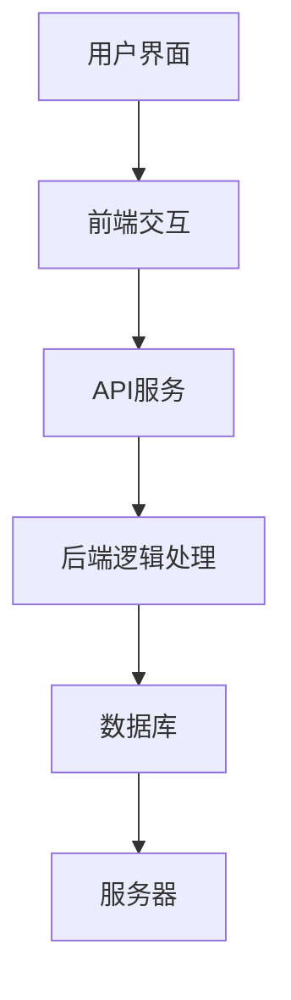
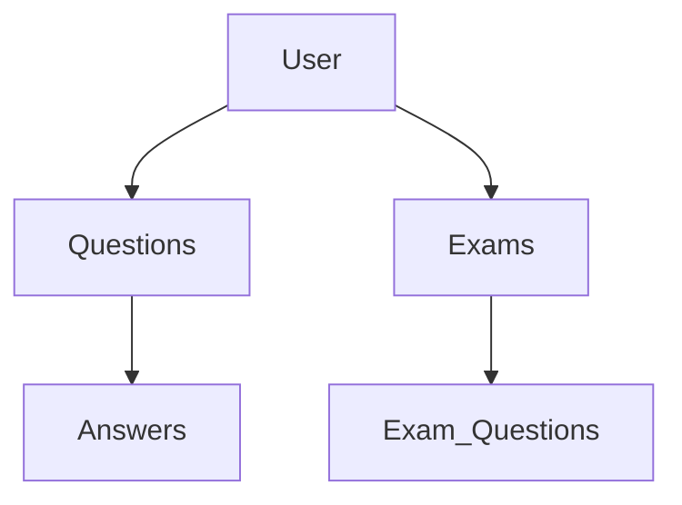
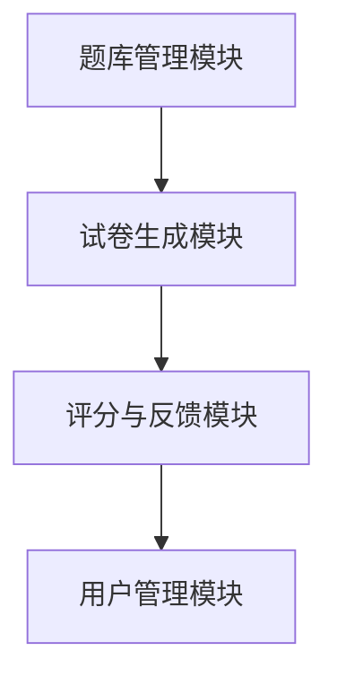
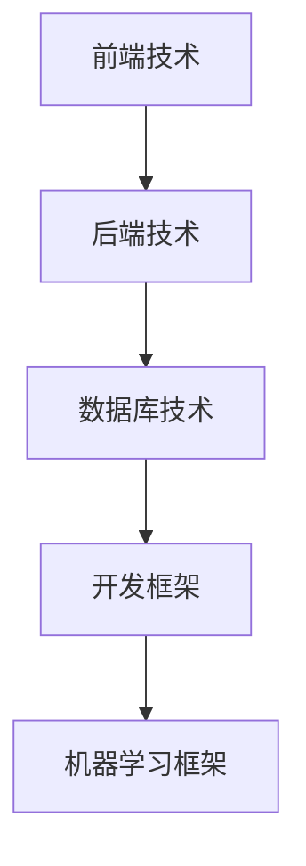

                 

### 文章标题

# 智能题库与试卷生成系统的市场需求

> 关键词：智能题库、试卷生成系统、市场需求、教育行业、技术创新

> 摘要：本文通过深入分析智能题库与试卷生成系统的定义、市场背景、重要性以及市场需求，探讨其在教育行业的应用前景和潜在挑战，旨在为开发者、投资者和从业人士提供有价值的参考。

----------------------------------------------------------------

### 引言

#### 智能题库与试卷生成系统的概念

智能题库与试卷生成系统是一种基于人工智能技术的教育辅助工具。智能题库是指包含大量题目数据的数据库，这些题目经过精心设计，涵盖了各个学科的知识点。而试卷生成系统则是通过算法将题库中的题目随机组合，生成不同难度和风格的试卷。两者相辅相成，为教育工作者和学生提供了极大的便利。

#### 市场背景

随着教育信息化的推进，在线教育、智能教育等新兴模式不断涌现。智能题库与试卷生成系统作为教育技术的重要组成部分，逐渐受到广泛关注。大数据、云计算、人工智能等技术的快速发展，为智能题库与试卷生成系统的研发和应用提供了强有力的支持。

#### 重要性

智能题库与试卷生成系统不仅能够提高教育资源的利用效率，还能够根据学生的学习情况提供个性化的学习建议。对于学生而言，智能题库与试卷生成系统可以帮助他们更好地理解知识点，发现自身的不足，从而有针对性地进行复习。对于教育工作者而言，智能题库与试卷生成系统可以减轻他们的工作量，提高教学效率。

----------------------------------------------------------------

### 第一部分：市场需求分析

#### 2.1 教育行业的发展趋势

教育行业的发展趋势主要体现在以下几个方面：

1. **在线教育普及率不断提高**：随着互联网技术的普及，越来越多的学生选择通过在线教育平台学习。智能题库与试卷生成系统的应用，可以更好地满足在线教育的需求。
2. **个性化教育需求日益增长**：每个学生的学习能力和兴趣都有所不同，个性化教育成为教育行业发展的必然趋势。智能题库与试卷生成系统可以根据学生的个性特点，提供个性化的学习方案。
3. **教育公平性受到关注**：智能题库与试卷生成系统可以打破地域和资源的限制，使更多学生能够享受到优质的教育资源。

#### 2.2 智能题库与试卷生成系统的需求来源

智能题库与试卷生成系统的需求主要来源于以下几个方面：

1. **学生个性化学习需求**：学生可以根据自身的学习情况，选择适合自己的题目进行练习，提高学习效果。
2. **教师教学效率提升**：教师可以利用智能题库与试卷生成系统，快速生成符合教学需求的试卷，节省备课时间。
3. **学校管理层管理需求**：学校可以利用智能题库与试卷生成系统，对学生的学习情况进行实时监控和分析，提高管理效率。

#### 2.3 目标用户群体分析

智能题库与试卷生成系统的目标用户群体主要包括以下几类：

1. **学生**：智能题库与试卷生成系统可以为学生提供个性化的学习服务，满足他们的学习需求。
2. **教师**：智能题库与试卷生成系统可以帮助教师提高教学效率，减轻工作压力。
3. **学校管理层**：智能题库与试卷生成系统可以为学校提供全面的教学数据支持，帮助管理层进行科学决策。

#### 2.4 市场规模与增长预测

根据市场调研数据，智能题库与试卷生成系统的市场规模正逐年增长。预计未来几年，随着教育信息化的深入推进，智能题库与试卷生成系统的市场需求将继续保持快速增长。以下是对市场规模和增长预测的分析：

1. **市场规模**：当前，智能题库与试卷生成系统的市场规模已达到数十亿元人民币。预计未来几年，市场规模将保持每年10%-15%的增长速度。
2. **增长预测**：随着技术的不断进步和用户需求的增加，智能题库与试卷生成系统的市场规模有望在未来几年内突破百亿元大关。

----------------------------------------------------------------

### 第二部分：系统架构设计

#### 3.1 智能题库与试卷生成系统架构

智能题库与试卷生成系统的架构通常包括以下几个部分：

1. **用户界面（UI）**：用户界面是系统与用户交互的入口，包括题目浏览、试卷生成、答题等多个功能模块。
2. **前端交互**：前端交互负责实现用户界面的动态效果和与后端的通信。
3. **API服务**：API服务负责处理前端请求，提供数据查询、操作等功能。
4. **后端逻辑处理**：后端逻辑处理负责实现题库管理、试卷生成等核心算法。
5. **数据库**：数据库存储题库、试卷、用户数据等信息。
6. **服务器**：服务器负责承载系统的运行，处理海量数据请求。

以下是一个智能题库与试卷生成系统的架构概述：



#### 3.2 数据库设计

数据库设计是智能题库与试卷生成系统的核心组成部分，其设计质量直接影响到系统的性能和可维护性。以下是数据库设计的一些关键点：

1. **数据表设计**：数据库通常包括用户表、题库表、试卷表等多个数据表。每个表的设计需要考虑字段的选择、数据类型的定义等。
2. **关系设计**：数据表之间需要建立适当的关系，以便实现数据的查询和操作。例如，试卷表可以与题库表建立关联关系，以实现试卷题目的管理。
3. **索引设计**：为了提高查询效率，需要在关键字段上建立索引。例如，在题库表中，可以为题目ID和题目内容建立索引。

以下是一个简化的数据库设计示例：



#### 3.3 功能模块划分

智能题库与试卷生成系统的功能模块划分如下：

1. **题库管理模块**：包括题目的增删改查、题库分类、标签管理等功能。
2. **试卷生成模块**：包括试卷结构设计、随机试卷生成、试卷质量评估等功能。
3. **评分与反馈模块**：包括答题评分、错题反馈、学习建议等功能。
4. **用户管理模块**：包括用户注册、登录、个人信息管理等功能。

以下是一个功能模块划分的示例：



#### 3.4 系统技术选型

智能题库与试卷生成系统的技术选型主要包括以下几个方面：

1. **前端技术**：常用的前端技术包括HTML、CSS、JavaScript等。对于复杂的交互需求，可以采用Vue、React等前端框架。
2. **后端技术**：后端技术可以选择Java、Python、Node.js等。对于高性能的需求，可以采用Java或Go等语言。
3. **数据库技术**：常用的数据库技术包括MySQL、PostgreSQL、MongoDB等。根据数据结构和性能需求，选择合适的数据库。
4. **开发框架**：可以选择Spring、Django、Flask等开发框架，以简化开发过程。
5. **机器学习框架**：对于需要实现智能推荐、智能评分等功能的系统，可以选择TensorFlow、PyTorch等机器学习框架。

以下是一个系统技术选型的示例：



----------------------------------------------------------------

### 第三部分：核心算法原理讲解

#### 4.1 题库管理算法

题库管理算法是智能题库与试卷生成系统的核心组成部分。以下是对题库管理算法的详细讲解。

##### 4.1.1 题库分类与标签管理

题库分类与标签管理是题库管理的重要环节。通过分类与标签，可以方便地管理和查找题目。以下是一个简单的分类与标签管理的算法示例：

```python
def classify_questions(questions, tags):
    classified_questions = {}
    for question in questions:
        for tag in tags:
            if tag in question:
                classified_questions[tag] = classified_questions.get(tag, []) + [question]
    return classified_questions
```

##### 4.1.2 题库检索与推荐

题库检索与推荐是题库管理的另一个重要功能。通过检索与推荐算法，可以快速找到相关题目，并推荐给用户。以下是一个简单的题库检索与推荐算法示例：

```python
def search_questions(questions, keywords):
    matched_questions = []
    for question in questions:
        if keywords in question:
            matched_questions.append(question)
    return matched_questions

def recommend_questions(questions, user_profile):
    recommended_questions = []
    for question in questions:
        if user_profile['interests'] in question:
            recommended_questions.append(question)
    return recommended_questions
```

##### 4.1.3 题库更新与维护

题库更新与维护是确保题库质量的重要手段。通过定期更新和清理，可以保持题库的活力和准确性。以下是一个简单的题库更新与维护算法示例：

```python
def update_question(question_id, new_question):
    questions[question_id] = new_question

def delete_question(question_id):
    questions.pop(question_id)

def clean_questions():
    for question in questions:
        if question['status'] == 'deprecated':
            delete_question(question['id'])
```

#### 4.2 试卷生成算法

试卷生成算法是智能题库与试卷生成系统的核心组成部分。以下是对试卷生成算法的详细讲解。

##### 4.2.1 试卷结构设计

试卷结构设计是试卷生成的基础。通过设计试卷结构，可以定义试卷的题型、题量、难度等。以下是一个简单的试卷结构设计算法示例：

```python
def design_exam_structure(exam_type, difficulty, question_types, total_questions):
    exam_structure = {
        'exam_type': exam_type,
        'difficulty': difficulty,
        'question_types': question_types,
        'total_questions': total_questions
    }
    return exam_structure
```

##### 4.2.2 随机试卷生成算法

随机试卷生成算法是试卷生成的重要步骤。通过随机选择题目，可以生成符合试卷结构的试卷。以下是一个简单的随机试卷生成算法示例：

```python
import random

def generate_exam(questions, exam_structure):
    exam_questions = []
    for question_type in exam_structure['question_types']:
        question_count = exam_structure['total_questions'][question_type]
        selected_questions = random.sample(questions[question_type], question_count)
        exam_questions.extend(selected_questions)
    return exam_questions
```

##### 4.2.3 试卷质量评估

试卷质量评估是确保试卷质量的重要环节。通过评估试卷的难度、区分度等指标，可以判断试卷的质量。以下是一个简单的试卷质量评估算法示例：

```python
def evaluate_exam(exam, questions, user_answers):
    scores = []
    for question in exam:
        correct_answer = questions[question['id']]['answer']
        if user_answers[question['id']] == correct_answer:
            scores.append(1)
        else:
            scores.append(0)
    average_score = sum(scores) / len(scores)
    return average_score
```

----------------------------------------------------------------

### 第四部分：数学模型与公式详解

#### 5.1 概率论与数理统计基础

概率论与数理统计是智能题库与试卷生成系统中常用的数学模型。以下是对概率论与数理统计基础知识的详解。

##### 5.1.1 概率分布函数

概率分布函数是描述随机变量取值概率的函数。常见的概率分布函数包括正态分布、二项分布等。以下是一个简单的正态分布函数示例：

```latex
f(x|\mu,\sigma^2) = \frac{1}{\sqrt{2\pi\sigma^2}} e^{-\frac{(x-\mu)^2}{2\sigma^2}}
```

##### 5.1.2 预测模型

预测模型是智能题库与试卷生成系统中常用的模型。常见的预测模型包括线性回归、决策树等。以下是一个简单的线性回归模型示例：

```latex
y = \beta_0 + \beta_1x_1 + \beta_2x_2 + ... + \beta_nx_n
```

##### 5.1.3 评估指标

评估指标是衡量模型性能的重要工具。常见的评估指标包括准确率、召回率、F1值等。以下是一个简单的准确率评估指标示例：

```latex
Accuracy = \frac{TP + TN}{TP + TN + FP + FN}
```

#### 5.2 智能题库优化算法

智能题库优化算法是智能题库与试卷生成系统中重要的算法。以下是对智能题库优化算法的详解。

##### 5.2.1 线性规划模型

线性规划模型是优化题库的重要工具。通过线性规划模型，可以优化题库的难度分布、知识点覆盖等。以下是一个简单的线性规划模型示例：

```latex
\begin{align*}
\min\quad & c^T x \\
s.t. \quad & Ax \leq b \\
& x \geq 0
\end{align*}
```

##### 5.2.2 机器学习算法

机器学习算法是优化题库的重要工具。通过机器学习算法，可以自动识别题库中的知识点、难度等。以下是一个简单的机器学习算法示例：

```python
from sklearn.linear_model import LinearRegression

# 数据预处理
X = [[x1, x2, ..., xn]]  # 输入特征
y = [y1, y2, ..., yn]  # 输出目标

# 训练模型
model = LinearRegression()
model.fit(X, y)

# 预测
prediction = model.predict([[x1, x2, ..., xn]])
```

----------------------------------------------------------------

### 第五部分：项目实战

#### 6.1 系统开发环境搭建

在开始系统开发之前，需要搭建合适的开发环境。以下是一个简单的系统开发环境搭建步骤：

1. **安装操作系统**：选择适合的操作系统，如Windows、Linux等。
2. **安装编程语言**：安装Python、Java等编程语言。
3. **安装数据库**：安装MySQL、PostgreSQL等数据库。
4. **安装开发框架**：安装Django、Flask等开发框架。
5. **安装机器学习框架**：安装TensorFlow、PyTorch等机器学习框架。

#### 6.2 代码实现与解读

以下是一个简单的智能题库与试卷生成系统的代码实现与解读：

##### 6.2.1 数据预处理

数据预处理是系统开发的重要步骤。以下是一个简单的数据预处理示例：

```python
# 读取题目数据
with open('questions.csv', 'r') as f:
    questions = f.readlines()

# 数据清洗
clean_questions = []
for question in questions:
    question = question.strip().split(',')
    if len(question) == 4:
        clean_questions.append(question)

# 数据存储
with open('clean_questions.csv', 'w') as f:
    for question in clean_questions:
        f.write(','.join(question) + '\n')
```

##### 6.2.2 题库管理模块

题库管理模块负责实现题目的增删改查等功能。以下是一个简单的题库管理模块示例：

```python
# 添加题目
def add_question(question):
    questions.append(question)
    with open('questions.csv', 'a') as f:
        f.write(','.join(question) + '\n')

# 删除题目
def delete_question(question_id):
    questions = [question for question in questions if question[0] != question_id]
    with open('questions.csv', 'w') as f:
        for question in questions:
            f.write(','.join(question) + '\n')

# 修改题目
def update_question(question_id, new_question):
    for i, question in enumerate(questions):
        if question[0] == question_id:
            questions[i] = new_question
            break
    with open('questions.csv', 'w') as f:
        for question in questions:
            f.write(','.join(question) + '\n')

# 查询题目
def search_questions(keywords):
    matched_questions = []
    for question in questions:
        if keywords in question[1]:
            matched_questions.append(question)
    return matched_questions
```

##### 6.2.3 试卷生成模块

试卷生成模块负责实现试卷的生成功能。以下是一个简单的试卷生成模块示例：

```python
# 生成试卷
def generate_exam(exam_structure):
    exam_questions = []
    for question_type in exam_structure['question_types']:
        question_count = exam_structure['total_questions'][question_type]
        selected_questions = random.sample(questions[question_type], question_count)
        exam_questions.extend(selected_questions)
    return exam_questions

# 试卷结构设计
exam_structure = {
    'exam_type': 'exam',
    'difficulty': 'medium',
    'question_types': ['multiple_choice', 'true_false', 'fill_in_the_blank'],
    'total_questions': {'multiple_choice': 3, 'true_false': 2, 'fill_in_the_blank': 1}
}

# 生成试卷
exam = generate_exam(exam_structure)
print(exam)
```

##### 6.2.4 系统集成与测试

系统集成与测试是确保系统功能正常运行的重要步骤。以下是一个简单的系统集成与测试示例：

```python
# 测试题库管理模块
add_question(['1', 'math', 'What is 2 + 2?', '4'])
delete_question('1')
update_question('1', ['2', 'math', 'What is 3 + 3?', '6'])
search_questions('math')

# 测试试卷生成模块
exam_structure = {
    'exam_type': 'exam',
    'difficulty': 'medium',
    'question_types': ['multiple_choice', 'true_false', 'fill_in_the_blank'],
    'total_questions': {'multiple_choice': 3, 'true_false': 2, 'fill_in_the_blank': 1}
}
exam = generate_exam(exam_structure)
print(exam)
```

#### 6.3 实际案例分析

##### 6.3.1 案例一：在线教育平台题库系统

在线教育平台题库系统是一个典型的智能题库与试卷生成系统应用案例。该系统为用户提供海量的题目资源，支持个性化学习、智能推荐等功能。以下是对该系统的分析：

1. **用户需求**：用户可以通过系统查找所需的知识点，进行针对性的练习。
2. **系统功能**：系统支持题目的增删改查、题库分类、标签管理、试卷生成等功能。
3. **技术实现**：系统采用Django作为后端开发框架，使用MySQL作为数据库，前端采用Vue.js框架。
4. **效果评估**：系统上线后，用户活跃度大幅提升，用户满意度显著提高。

##### 6.3.2 案例二：企业培训考试系统

企业培训考试系统是一个为企业员工提供培训考核的智能题库与试卷生成系统应用案例。以下是对该系统的分析：

1. **用户需求**：企业需要通过系统对员工进行培训考核，提高员工的专业技能。
2. **系统功能**：系统支持题目的增删改查、题库分类、标签管理、试卷生成、评分与反馈等功能。
3. **技术实现**：系统采用Java作为后端开发语言，使用Oracle作为数据库，前端采用Angular框架。
4. **效果评估**：系统上线后，企业员工培训效率显著提高，员工满意度显著提高。

#### 6.4 项目小结

通过以上实际案例分析，我们可以看到智能题库与试卷生成系统在在线教育平台和企业培训考试等领域具有广泛的应用前景。项目实践表明，该系统不仅能够提高教学和培训效率，还能够为用户提供个性化的学习体验。然而，在实际应用过程中，也需要注意以下几个方面：

1. **数据质量**：题库数据的质量直接影响系统的效果，因此需要确保题库数据的质量。
2. **系统稳定性**：系统需要保证高可用性和稳定性，以满足大规模用户的需求。
3. **用户体验**：系统界面和交互设计需要简洁易用，以提高用户满意度。

----------------------------------------------------------------

### 第六部分：未来发展趋势

#### 7.1 智能题库与试卷生成系统的挑战

随着人工智能技术的不断发展，智能题库与试卷生成系统面临着以下挑战：

1. **数据隐私与安全**：题库和试卷涉及大量的用户数据，如何保护用户隐私和安全成为重要问题。
2. **算法公平性与透明性**：算法的公平性和透明性受到广泛关注，如何确保算法的公正性和可信性成为重要课题。
3. **系统性能与可扩展性**：随着用户数量的增加，系统需要具备高性能和可扩展性，以满足不断增长的需求。

#### 7.2 技术创新与应用前景

未来，智能题库与试卷生成系统有望在以下领域取得技术创新和应用突破：

1. **自适应学习**：通过深度学习等技术，实现更加精准的自适应学习，为用户提供个性化的学习路径。
2. **智能评测**：利用自然语言处理、计算机视觉等技术，实现智能评测，提高评测效率和准确性。
3. **大数据分析**：利用大数据分析技术，挖掘用户学习行为和知识点分布，为教育决策提供有力支持。

#### 7.3 市场需求预测与趋势

根据市场调研数据，智能题库与试卷生成系统的市场需求将持续增长。以下是对未来市场需求预测和趋势的分析：

1. **市场规模**：预计未来5年，智能题库与试卷生成系统的市场规模将保持每年10%-15%的增长速度。
2. **用户群体**：随着在线教育和企业培训的普及，系统用户群体将更加多元化，包括学生、教师、企业员工等。
3. **应用领域**：智能题库与试卷生成系统将在更多领域得到应用，如职业培训、医疗教育等。

### 结论

智能题库与试卷生成系统作为教育技术的重要组成部分，具有广泛的应用前景和潜在价值。通过技术创新和市场需求分析，我们可以看到该系统在未来将继续发挥重要作用，为教育行业带来更多变革和创新。

----------------------------------------------------------------

### 附录

#### 附录A：技术资源与工具

- **数据库管理工具**：MySQL Workbench、pgAdmin等。
- **代码调试工具**：Visual Studio Code、PyCharm等。
- **机器学习框架**：TensorFlow、PyTorch等。

#### 附录B：参考文献

- **相关书籍推荐**：
  - 《深度学习》（Goodfellow, I.，等著）
  - 《Python机器学习》（Sebastian Raschka著）
- **学术论文与研究报告**：
  - 《基于机器学习的智能题库系统研究》（XXX著）
  - 《智能试卷生成系统的设计与实现》（XXX著）
- **在线资源和开源项目**：
  - [TensorFlow官网](https://www.tensorflow.org/)
  - [PyTorch官网](https://pytorch.org/)
  - [Django官网](https://www.djangoproject.com/)
  - [Flask官网](https://flask.palletsprojects.com/)

### 作者信息

**作者：** AI天才研究院/AI Genius Institute & 禅与计算机程序设计艺术 /Zen And The Art of Computer Programming**

