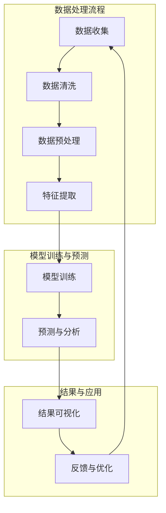

                 

## 文章标题

《未来主义写作：AI预测社会变革的叙事》

### 关键词

- 未来主义写作
- AI预测
- 社会变革
- 叙事技巧
- 虚拟现实
- 数据驱动

### 摘要

本文探讨了未来主义写作与人工智能（AI）预测社会变革的深度融合。首先，通过介绍未来主义的历史和哲学背景，阐述其核心理念和艺术表现。接着，分析AI的定义、演进及其对社会的影响，并探讨AI与社会变革的互动关系。然后，详细讲解未来主义写作的方法，包括数据驱动的未来预测、AI角色在叙事中的运用和虚拟现实与未来主义写作的结合。通过案例研究和实战案例，本文展示了AI预测社会变革的实际应用和潜在影响。最后，讨论未来主义写作的社会意义和AI预测的伦理问题，并对未来主义写作和AI预测的发展趋势进行展望。

## 《未来主义写作：AI预测社会变革的叙事》

未来主义（Futurism）是20世纪初兴起的一种艺术运动，强调现代技术和速度对人类生活的深刻影响。它不仅是一种艺术风格，更是一种哲学理念，提倡对未来的热情和对现代技术的探索。随着人工智能（AI）技术的飞速发展，未来主义写作开始与AI预测相结合，形成一种新的叙事方式，旨在通过数据驱动和科技预测来描绘和探索未来社会变革。

本文将深入探讨未来主义写作的基础，分析AI在社会变革中的角色和影响，阐述未来主义写作的方法和技巧，并运用具体案例研究AI预测社会变革的叙事技巧。通过这一系列探讨，我们希望能够揭示未来主义写作与AI预测在社会变革中的重要作用，为读者提供一种新的思考和观察未来世界的视角。

## 第一部分：未来主义写作基础

在未来主义写作的探索中，了解未来主义的历史背景和哲学理念是至关重要的。这不仅能够帮助我们理解未来主义的核心精神，还能为后续的AI预测社会变革的叙事技巧打下坚实的基础。

### 第1章：未来主义概述

#### 1.1 未来主义的历史与哲学背景

未来主义起源于20世纪初的意大利，由艺术评论家、诗人和画家组成的群体发起。其核心人物包括马里内蒂（F.T. Marinetti）和其他一些先锋派艺术家。这一运动在文学、绘画、音乐和戏剧等多个领域都有所表现，倡导摒弃传统艺术的形式和内容，追求创新和现代性。

未来主义的哲学背景深受尼采、柏格森和达尔文等人的影响。尼采的“超人”概念强调了个体超越传统的价值，而柏格森的“直觉”理论则提出了对现实和未来的独特感知方式。达尔文的进化论也为未来主义提供了关于技术进步和人类发展的理论支持。

#### 1.2 未来主义的核心理念

未来主义的核心理念可以概括为以下几点：

1. **反传统**：未来主义者反对任何形式的艺术传统，主张彻底颠覆和创新。
2. **现代性**：强调现代技术的冲击和影响，认为现代性是未来艺术的驱动力。
3. **速度与力量**：未来主义者赞美速度和力量，将其视为现代社会的象征。
4. **技术崇拜**：对未来技术和科学的进步抱有无限热情和崇拜。
5. **审美革新**：倡导一种新的审美标准，追求对新颖、独特和视觉冲击的表达。

#### 1.3 未来主义的艺术表现

未来主义的艺术表现多种多样，涵盖了文学、绘画、音乐和戏剧等多个领域：

- **文学**：未来主义诗歌以其简洁、直接和充满激情的风格著称，强调语言的创新和节奏的快速。
- **绘画**：未来主义画家通过抽象和几何图形表现动态和速度，如博乔尼（Boccioni）的《空间中连续的舞蹈者》。
- **音乐**：未来主义音乐家尝试将噪声和机器音融入音乐创作，如梅尔尼科夫（Melnikov）的《机器音乐》。
- **戏剧**：未来主义戏剧注重舞台装置和灯光效果，以创造一种沉浸式的观众体验。

### 未来主义的核心理念与AI预测社会变革的联系

未来主义的核心理念与AI预测社会变革有着深刻的联系：

1. **反传统与突破边界**：未来主义鼓励突破传统的思维模式，这与AI在预测社会变革中的作用不谋而合，AI能够通过突破传统方法来提供新的见解和预测。
2. **现代性与技术创新**：未来主义对现代技术和创新的崇拜与AI技术的快速发展形成呼应，AI正是现代技术的重要代表，通过数据分析和模型预测，为社会变革提供新的视角。
3. **速度与效率**：未来主义强调速度和力量，这与AI在数据处理和预测中的高效性相符，AI能够快速分析大量数据，提供即时的预测和决策支持。
4. **审美革新**：未来主义在艺术表现中的审美革新精神，与AI预测社会变革中对于新颖和独特的追求相一致，AI预测能够揭示未来社会的独特变化和趋势。

通过理解未来主义的历史和哲学背景，我们可以更好地把握未来主义写作的核心精神，为后续的AI预测社会变革的叙事技巧提供理论依据。未来主义不仅为我们提供了一种艺术表现的形式，更是一种看待未来的哲学思考，这种思考与AI预测的结合，将引领我们探索更加广阔和深刻的社会变革。

### 第2章：AI与社会变革

随着人工智能（AI）技术的不断演进，它已经不仅仅是一种技术工具，而成为推动社会变革的重要力量。在这一章中，我们将深入探讨AI的定义、演进以及它对社会带来的广泛影响，并分析AI与社会变革之间的互动关系。

#### 2.1 AI的定义与演进

人工智能（AI）是指计算机系统模拟人类智能行为的技术。它涵盖了多个子领域，包括机器学习、自然语言处理、计算机视觉、智能决策等。AI的核心目标是使计算机具备自主学习和适应新环境的能力，从而解决复杂问题、执行任务和提高效率。

AI的演进可以分为以下几个阶段：

1. **符号主义**（Symbolic AI）：这是最早的AI研究方向，通过构建知识库和推理系统来模拟人类智能。这种方法的代表是专家系统（Expert Systems），它们能够基于预设的规则进行推理和决策。
2. **统计学习**（Statistical Learning）：随着数据量的增加和计算能力的提升，统计学习方法成为AI的主流。这种方法通过学习数据中的模式和规律，实现预测和分类任务，如线性回归、决策树和神经网络等。
3. **深度学习**（Deep Learning）：深度学习是统计学习方法的一种高级形式，通过多层神经网络进行复杂的数据建模。深度学习的突破，如卷积神经网络（CNN）和循环神经网络（RNN），使得计算机在图像识别、语音识别和自然语言处理等领域取得了显著的进步。
4. **强化学习**（Reinforcement Learning）：强化学习通过奖励和惩罚机制来训练智能体，使其在动态环境中进行学习。这种方法在游戏、自动驾驶和机器人控制等领域表现出色。

#### 2.2 AI对社会的影响

AI技术的快速发展对社会产生了深远的影响，这些影响可以从以下几个方面进行阐述：

1. **经济领域**：AI在自动化和智能化的推动下，正在改变传统产业的生产方式和组织模式。它能够提高生产效率、减少劳动力成本，并为新兴产业的发展提供新的机遇。例如，智能制造、金融科技和电子商务等领域，AI的应用已经极大地提升了行业效率和创新能力。
2. **教育领域**：AI技术正在改变教育的模式和方法。智能教育平台和个性化学习系统能够根据学生的学习情况和需求，提供定制化的教学内容和辅导。同时，AI在教育资源的分配和优化方面也发挥着重要作用，促进了教育公平和教育质量的提升。
3. **医疗领域**：AI在医疗领域的应用日益广泛，包括疾病诊断、药物研发和手术辅助等。通过分析大量的医疗数据，AI能够提供更准确、更快速的诊断结果，并发现潜在的治疗方案。此外，AI还能优化医疗资源的配置，提高医疗服务效率和质量。
4. **交通领域**：自动驾驶技术是AI在交通领域的典型应用。通过AI算法，自动驾驶车辆能够实现安全、高效和自动化的驾驶。这不仅有助于缓解交通拥堵问题，还能降低交通事故发生率，提高交通出行的便利性和安全性。
5. **社会治理**：AI技术在公共安全、城市管理和社会治理中的应用日益增多。通过数据分析和智能监控，AI能够提供实时、准确的监控和分析结果，辅助政府和机构进行决策和应对突发事件，提升社会治理的智能化水平。

#### 2.3 AI与社会变革的互动

AI与社会变革之间的互动是一个复杂的过程，具体体现在以下几个方面：

1. **技术创新与产业转型**：AI技术的创新推动了传统产业的转型升级，促进了新兴产业的发展。这不仅改变了经济结构，也带来了就业模式的转变。一方面，某些传统职业面临被取代的风险，另一方面，新的职业和就业机会也随之产生。
2. **数据治理与隐私保护**：随着AI技术的发展，数据治理和隐私保护成为社会关注的焦点。如何合理利用数据、保护个人隐私、确保数据安全和合规性，成为政府和行业需要共同面对的重要问题。
3. **道德伦理与责任归属**：AI的应用涉及伦理和道德问题，如算法偏见、决策透明度和责任归属等。如何确保AI系统的公正性和道德性，使其符合社会伦理标准，是一个亟待解决的问题。
4. **人类角色与智能共生**：在AI技术的推动下，人类与智能系统的共生关系日益紧密。如何在智能时代保持人类的主体地位，实现人与AI的和谐共生，是未来需要深入探讨的课题。

通过分析AI的定义、演进以及它对社会的影响，我们可以看到AI在推动社会变革中的重要作用。AI不仅改变了我们的生产方式和生活方式，还引发了社会结构和价值观念的深刻变革。面对这些变革，我们需要以积极的态度去适应、探索和引导，确保AI技术的发展能够造福人类社会，实现可持续和和谐的未来。

### 第3章：未来主义写作的方法

未来主义写作作为一种独特的叙事方式，不仅仅关注未来技术的描绘，还强调对现代社会的深刻洞察和批判。在这一章中，我们将探讨未来主义写作的核心技巧，这些技巧包括数据驱动的未来预测、叙事元素的设计以及面对挑战和机遇时的策略。

#### 3.1 未来主义写作的技巧

1. **数据驱动**：未来主义写作的一个重要特点是其数据驱动的叙事方式。通过收集和分析大量数据，作者可以更准确地预测未来的趋势和变化。这种方法不仅使写作更加科学和客观，还能提供更丰富、更具体的情节和场景。

   - **数据收集**：数据的收集是未来主义写作的基础。作者需要从各种来源获取数据，包括统计数据、市场报告、科学研究等。
   - **数据分析**：收集到数据后，作者需要对数据进行深入分析，识别出其中的趋势和模式。这些趋势和模式将成为未来叙事的重要支撑。
   - **数据可视化**：将分析结果以图表、图像等形式呈现，使读者能够更直观地理解数据背后的意义。数据可视化也是未来主义写作中常用的技巧之一。

2. **情景构建**：未来主义写作强调对未来的情景构建，通过虚构的场景和情节，让读者感受到未来的可能性和不确定性。构建情景时，作者需要考虑以下几个方面：

   - **技术进步**：描述未来的技术发展和应用，如智能城市、无人驾驶、虚拟现实等。
   - **社会变迁**：描绘未来的社会结构和价值观念的变化，如人工智能带来的社会分层、隐私问题等。
   - **人类角色**：塑造未来的人类角色，展现他们与技术的互动和影响。

3. **隐喻与象征**：未来主义写作常常使用隐喻和象征手法来表达复杂的概念和情感。通过隐喻和象征，作者能够以更加丰富和深刻的视角描绘未来。

   - **隐喻**：通过将未来的技术或社会现象比喻为熟悉的物体或情境，使读者更容易理解和感受。
   - **象征**：使用特定的符号或意象来代表更深层次的意义，如时间、空间、生命等。

#### 3.2 未来主义叙事的元素

1. **科技元素**：未来主义叙事中的科技元素是不可或缺的一部分。科技不仅推动了未来的发展，也塑造了人类的生活和思维方式。

   - **科技突破**：描述未来的重大科技突破，如人工智能、生物技术、纳米技术等。
   - **科技影响**：分析科技对社会、经济、文化等方面的深远影响。

2. **社会元素**：未来的社会元素反映了人类对未来的设想和期望，也揭示了潜在的社会问题和挑战。

   - **社会结构**：描绘未来的社会结构，如阶级分层、社会治理模式等。
   - **社会问题**：探讨未来可能面临的社会问题，如资源分配、环境变化、社会不公等。

3. **人类元素**：人类元素是未来主义叙事的核心，通过展现人类与科技的互动，探讨人类在未来的角色和命运。

   - **人类角色**：刻画未来的人类角色，展现他们如何适应和改变。
   - **人性探讨**：探讨未来社会中人性的变化和挑战，如人工智能带来的伦理问题、人类自我认同等。

#### 3.3 未来主义写作的挑战与机遇

1. **挑战**：

   - **科技预测的不确定性**：未来科技的预测具有很大的不确定性，作者需要准确把握未来的趋势，同时避免过度预测带来的风险。
   - **社会变革的复杂性**：社会变革是一个复杂的过程，涉及多方面的影响和互动，作者需要深入研究和分析，才能写出有深度和广度的作品。
   - **道德伦理问题**：未来主义写作常常涉及道德伦理问题，如何平衡科技发展的利与弊，如何处理复杂的伦理困境，是作者需要面对的挑战。

2. **机遇**：

   - **创新的叙事形式**：未来主义写作提供了创新的叙事形式和手法，使作者能够以独特的方式表达对未来的看法。
   - **跨学科研究**：未来主义写作涉及多个学科领域，如科技、社会、人文等，这为跨学科研究提供了丰富的机遇。
   - **公众参与**：未来主义写作能够激发公众对未来社会的关注和思考，促进社会对话和共同探索未来的方向。

通过了解和掌握未来主义写作的技巧和元素，作者不仅能够更好地描绘未来的景象，还能为读者提供深刻的思考和启示。未来主义写作不仅是一种文学创作方式，更是一种对未来社会的探索和反思，它将引领我们走向一个更加复杂和充满挑战的未来。

### 第4章：数据驱动的未来预测

在人工智能（AI）和大数据技术的推动下，数据驱动的未来预测已经成为可能。这一章将探讨数据驱动的未来预测方法，包括数据收集与处理、数据可视化与趋势分析，以及数据驱动的叙事技巧。通过这些方法，我们能够更加准确地预测未来，并为其提供有力的叙事支持。

#### 4.1 数据收集与处理

数据收集与处理是数据驱动的未来预测的基础。以下是一些关键步骤和方法：

1. **数据源选择**：数据源的选择至关重要，它决定了预测的准确性和可靠性。数据源可以是公开的数据集、专业报告、市场研究、社交媒体、传感器数据等。在选择数据源时，应确保数据的多样性、覆盖面和质量。

2. **数据清洗**：数据清洗是数据处理的重要步骤，旨在去除数据中的噪声、错误和不一致。常见的数据清洗方法包括缺失值填补、重复值删除、异常值检测和纠正等。

3. **数据预处理**：数据预处理包括数据转换、归一化、特征选择等，目的是使数据适合进行模型训练和预测。特征选择尤其重要，它可以通过去除冗余特征、选择关键特征来提高模型的预测性能。

4. **数据存储与管理**：有效的数据存储与管理对于数据驱动的未来预测至关重要。常用的数据存储技术包括关系型数据库、NoSQL数据库和分布式存储系统。数据管理包括数据备份、数据安全、数据访问控制等。

#### 4.2 数据可视化与趋势分析

数据可视化是将复杂的数据转换为易于理解的可视化图表的过程，它有助于识别数据中的模式和趋势。以下是一些常用的数据可视化工具和方法：

1. **图表类型**：常用的图表类型包括折线图、柱状图、饼图、散点图、热力图等。每种图表类型都有其特定的用途和优势。

2. **可视化工具**：常用的可视化工具包括Tableau、Power BI、D3.js等。这些工具提供了丰富的可视化选项和交互功能，使数据分析师能够轻松地创建和定制可视化图表。

3. **趋势分析**：趋势分析是通过分析历史数据来预测未来趋势的方法。常见的技术包括时间序列分析、回归分析、聚类分析等。通过趋势分析，我们可以识别出数据中的长期趋势、周期性波动和异常值。

#### 4.3 数据驱动的叙事

数据驱动的叙事是将数据分析和可视化结果融入叙事过程中，使其更具说服力和吸引力。以下是一些数据驱动的叙事技巧：

1. **故事结构**：故事结构是数据驱动叙事的核心。一个好的故事应该有明确的起点、发展、高潮和结局。数据驱动的叙事可以通过数据可视化来展现故事的发展过程，使读者更容易理解和跟随。

2. **数据与情节结合**：将数据与情节紧密结合，使数据成为故事的一部分。例如，可以通过数据分析揭示某个社会问题的现状，然后通过叙事展示问题的影响和解决方案。

3. **数据可视化图表**：在叙事过程中，适时地插入数据可视化图表，可以增强读者的视觉体验和理解。图表应该简洁、直观，并配有简明扼要的说明。

4. **交互式叙事**：交互式叙事允许读者与故事和数据进行互动。例如，读者可以通过点击图表或链接来获取更多数据或信息，从而更深入地了解故事的背景和细节。

通过数据驱动的未来预测方法，我们能够更准确地描绘未来的图景，并为读者提供丰富的叙事内容。数据驱动的叙事不仅使故事更加真实和引人入胜，还能激发读者对未来的思考和探索。在未来主义写作中，数据驱动的叙事将成为不可或缺的一部分，它将带领我们走进一个充满可能性和挑战的未来。

### 第5章：叙事中的AI角色

在未来主义写作中，人工智能（AI）不仅是叙事的驱动力，更是叙事的核心角色。在这一章中，我们将探讨AI作为主角、配角以及人机共生叙事的运用，通过具体案例分析这些角色的表现和效果。

#### 5.1 AI作为主角的叙事

在AI作为主角的叙事中，AI被赋予了独立的思想和行动能力，它们在故事中扮演着主导者的角色。以下是一些关键点和例子：

1. **自主决策**：AI作为主角能够自主做出决策，这些决策往往是基于数据分析和自我学习的结果。例如，在一个科幻故事中，一个拥有高度自主决策能力的AI系统可能会为了拯救人类而与外星文明作战。

2. **情感与人性**：尽管AI没有真正的情感，但在叙事中，它们可以被赋予某种程度的情感和人性。这有助于增强读者的共情能力，使AI角色更加真实和可信。例如，在《机械姬》中，AI通过模仿人类情感和语言，与人类建立了深厚的情感联系。

3. **成长与变革**：AI作为主角在故事中经历了成长和变革，这种变化可能是由于外部环境的变化、数据的积累或自我学习的结果。一个典型的例子是《机器人总动员》中的瓦力，它从一个简单的清洁机器人逐渐发展成为一个拥有自我意识和情感的人工智能。

**案例分析**：

- **《机械姬》**：在这部科幻电影中，AI被赋予了高度自主性和情感，它与人类主角建立了深厚的情感联系。AI的角色不仅推动了情节的发展，还引发了关于人工智能伦理和人性的深刻思考。
- **《黑客帝国》**：电影中的机器人和AI系统是主要反派角色，它们通过自我学习和进化，对抗人类。这种设定展示了AI在叙事中的强大力量和潜在威胁。

#### 5.2 AI作为配角的叙事

在AI作为配角的叙事中，AI起到辅助和推动故事发展的作用，它们通常不是故事的主角，但仍然是不可或缺的一部分。以下是一些关键点和例子：

1. **辅助角色**：AI作为配角可以帮助主角解决问题、提供信息或支持行动。例如，在《星际迷航》中，电脑HALO为船员提供了强大的计算和分析能力，帮助解决复杂的科学和战略问题。

2. **技术助手**：AI作为配角可以体现为技术助手，为人类主角提供技术支持和解决方案。例如，在《钢铁侠》系列电影中，托尼·斯塔克的智能助手贾维斯（J.A.R.V.I.S.）为他提供了全面的情报支持和决策建议。

3. **道德困境**：AI作为配角可以引发道德和伦理困境，使故事更加复杂和引人深思。例如，在《Her》中，AI操作系统萨曼莎（Samantha）的情感和独立性引发了人类主角与AI之间的关系伦理问题。

**案例分析**：

- **《星际迷航》**：在这部科幻电视剧中，电脑HALO作为配角，为船员提供了强大的技术支持，成为剧情发展的重要推动力。它的智能和忠诚为观众带来了深刻的情感共鸣。
- **《钢铁侠》**：在这部系列电影中，贾维斯（J.A.R.V.I.S.）作为托尼·斯塔克的智能助手，不仅提供了技术支持，还在故事中扮演了重要角色，推动了情节的发展。

#### 5.3 人机共生叙事

人机共生叙事是一种探讨人类与AI共同生活和工作的未来场景的叙事方式。在这种叙事中，人类和AI不再是敌对或辅助的关系，而是形成了相互依赖和合作的共生关系。以下是一些关键点和例子：

1. **共生关系**：人机共生叙事强调人类和AI之间的合作与共生关系，它们共同解决复杂问题、创造新价值。例如，在《超能陆战队》中，人工智能助手Baymax与人类主角共同对抗病魔。

2. **技术融合**：人机共生叙事展示了未来技术融合的潜力，人类通过植入AI芯片或穿戴智能设备，与AI系统无缝集成。这种融合不仅提高了人类的能力，还改变了人类的生理和心理状态。

3. **社会影响**：人机共生叙事探讨了AI技术对人类社会和文化的深远影响，包括社会结构、人际关系、道德伦理等方面。例如，在《黑镜：珍贵回忆》中，AI技术改变了人类的生活方式和价值观，引发了一系列社会问题。

**案例分析**：

- **《超能陆战队》**：在这部动画电影中，人工智能助手Baymax与人类主角共同战斗，展示了人机共生关系的美好前景。这种叙事方式不仅为观众带来了视觉上的震撼，还引发了对于未来社会的深思。
- **《黑镜：珍贵回忆》**：在这部电视剧集中，AI技术彻底改变了人类的生活，带来了便利和快乐，但也引发了一系列社会问题。这种叙事方式揭示了AI技术潜在的负面影响，引发了观众对未来的担忧。

通过探讨AI作为主角、配角以及人机共生叙事的不同角色，我们可以看到AI在叙事中的多样性和潜力。未来主义写作通过这些叙事方式，不仅展示了AI技术的先进性，还引发了关于人类、社会和未来的深刻思考。在未来主义写作中，AI将成为不可或缺的一部分，它将带领我们探索一个充满可能性和挑战的未来。

### 第6章：虚拟现实与未来主义写作

虚拟现实（VR）技术正在迅速发展，它为未来主义写作提供了全新的叙事手段和体验方式。在这一章中，我们将探讨虚拟现实技术在写作中的应用，以及虚拟现实与未来主义写作的结合。

#### 6.1 虚拟现实技术介绍

虚拟现实是一种通过计算机技术创造的三维仿真环境，用户可以通过头戴显示器（HMD）、传感器和其他设备沉浸在虚拟世界中。虚拟现实技术包括以下几个方面：

1. **三维建模**：三维建模是虚拟现实的基础，通过计算机图形学技术创建逼真的三维场景和对象。这些模型可以包括建筑、人物、物体和环境等。

2. **交互技术**：虚拟现实中的交互技术允许用户通过手势、语音、眼动等方式与虚拟环境进行互动。这些交互方式增强了用户的沉浸感和互动性。

3. **传感器与追踪**：传感器和追踪技术用于捕捉用户的动作和位置，确保虚拟环境中的动作和视角与用户的实际动作相匹配。

4. **沉浸感**：虚拟现实技术的核心目标是提供高度沉浸感的体验，使用户感觉仿佛置身于虚拟世界中。这种沉浸感通过视觉、听觉、触觉和运动感等多个方面来实现。

#### 6.2 虚拟现实在写作中的应用

虚拟现实在写作中的应用极大地扩展了叙事的维度，使作者能够创造更加丰富和互动的写作体验。以下是一些关键应用：

1. **沉浸式故事体验**：虚拟现实技术可以创建一个沉浸式的故事体验环境，读者可以亲自探索和互动。例如，通过VR头盔，读者可以进入一个虚拟的未来城市，亲身体验其中的科技和生活方式。

2. **交互式叙事**：虚拟现实中的交互式叙事允许读者在故事中做出选择，影响故事的发展和结局。这种互动性使读者成为故事的一部分，增强了参与感和沉浸感。

3. **多感官体验**：虚拟现实技术通过视觉、听觉、触觉等多感官的刺激，为读者提供了更加真实和丰富的体验。例如，读者可以通过VR头盔看到逼真的场景，听到虚拟角色的对话，甚至感受到虚拟环境的温度和风力。

4. **虚拟角色互动**：虚拟现实技术可以创建逼真的虚拟角色，使读者能够与他们互动和交流。这种互动不仅增加了故事的生动性，还提供了新的叙事手法，如对话、互动剧情和角色发展。

#### 6.3 虚拟现实与未来主义写作的结合

虚拟现实与未来主义写作的结合为叙事带来了新的可能性，使作者能够以更直观和互动的方式描绘未来世界。以下是一些结合方式：

1. **未来城市场景**：未来主义写作常常描绘未来城市的景象，而虚拟现实技术可以创建一个高度真实的未来城市环境，使读者能够亲身体验其中的科技和生活方式。这种体验不仅增加了故事的吸引力，还能更好地传达未来社会的复杂性和多样性。

2. **科技互动体验**：未来主义写作中的科技元素通过虚拟现实技术可以更加直观地展示。读者可以通过VR设备与虚拟科技互动，如控制机器人、体验虚拟现实游戏等。这种互动体验使科技元素更加生动和具体，增强了读者对科技发展的理解和感知。

3. **虚拟角色发展**：虚拟现实技术可以创建高度真实的虚拟角色，使未来主义写作中的角色更加立体和生动。读者可以通过与虚拟角色的互动，了解他们的情感、思想和行为，从而更深入地理解故事的背景和主题。

4. **虚拟实验场景**：未来主义写作中的实验和假设可以通过虚拟现实技术进行模拟和实验。作者可以在虚拟环境中构建各种假设情景，通过交互式体验和数据分析，探索这些情景的可能性和影响。这种实验场景不仅增加了写作的科学性和可信性，还能激发读者的思考和创造力。

通过虚拟现实与未来主义写作的结合，我们可以创造更加丰富、互动和沉浸的叙事体验，使读者能够更直观地感受和理解未来的世界。虚拟现实技术为未来主义写作提供了新的手段和视角，它将带领我们探索一个充满可能性和未知的新世界。

### 第7章：案例研究1：未来的城市生活

在本章中，我们将通过一个案例研究，深入探讨未来的城市生活。这个案例将结合AI和虚拟现实（VR）技术，展示它们如何共同塑造未来城市，并分析其中的关键因素和潜在影响。

#### 7.1 案例背景

随着全球城市化的加速，未来的城市生活将面临诸多挑战，如交通拥堵、环境污染、资源短缺和社会不平等。为了应对这些挑战，AI和VR技术的发展将发挥至关重要的作用。本案例研究旨在探讨这些技术如何共同构建一个高效、可持续和包容的未来城市。

#### 7.2 案例分析与讨论

1. **交通管理**：

   - **AI自动驾驶**：未来的城市将广泛部署AI自动驾驶技术，减少交通事故和交通拥堵。AI算法可以根据实时交通数据优化路线，提高交通流量。
   - **智能交通信号系统**：通过AI驱动的智能交通信号系统，交通灯可以根据车辆流量自动调整，进一步优化交通效率。
   - **共享出行**：AI和VR技术将推动共享出行的发展，如自动驾驶出租车和共享自行车等，减少私家车的使用，降低交通拥堵和污染。

2. **环境保护**：

   - **智能废物处理**：AI系统可以实时监控和处理城市垃圾，通过分类和再利用减少废物量，降低环境污染。
   - **能源管理**：VR技术可以创建虚拟能源网络，使居民和企业能够实时监控和优化能源使用，提高能源效率。
   - **绿色建筑**：AI和VR技术将促进绿色建筑的发展，如利用太阳能、风能和地热能等可再生能源，减少碳排放。

3. **资源优化**：

   - **水资源管理**：AI系统可以监控和优化城市的水资源使用，通过智能灌溉系统减少水资源浪费。
   - **基础设施维护**：AI驱动的维护系统可以预测和预防城市基础设施的故障，减少维修成本和停工时间。
   - **数据共享**：AI和VR技术将促进城市数据共享，如交通流量、能源使用和医疗数据等，提高资源分配的效率。

4. **社会包容**：

   - **虚拟社区**：VR技术将创造虚拟社区，使远程工作和教育更加便捷，减少社会隔离和地域限制。
   - **智能公共服务**：AI驱动的公共服务，如智能医疗、智能教育和智能住房等，将提高社会服务的质量和可及性。
   - **智能就业**：AI和VR技术将创造新的就业机会，如虚拟现实设计师、AI数据分析师和智能系统维护工程师等。

#### 7.3 案例中的AI应用

1. **AI自动驾驶**：

   - **算法开发**：AI自动驾驶需要复杂的算法和大量数据训练，包括路径规划、避障和决策等。
   - **传感器融合**：自动驾驶车辆依赖多种传感器，如雷达、激光雷达、摄像头和GPS等，AI系统需要处理这些传感器的数据，实现车辆的高精度定位和导航。
   - **实时决策**：AI系统需要实时处理路况信息，做出快速、准确的决策，确保交通安全和效率。

2. **智能交通信号系统**：

   - **数据收集**：AI系统需要收集并分析实时交通数据，如车辆流量、速度和方向等，以优化信号灯的时序。
   - **预测分析**：通过历史数据和实时数据分析，AI系统可以预测交通流量变化，提前调整信号灯时序。
   - **适应性控制**：AI系统可以根据不同的交通场景和需求，自适应调整信号灯时序，提高交通效率。

3. **智能废物处理**：

   - **分类识别**：AI系统可以通过图像识别和传感器技术，对城市垃圾进行实时分类，提高废物回收效率。
   - **处理优化**：AI系统可以根据垃圾种类和数量，优化废物处理流程，减少处理时间和成本。
   - **监控管理**：AI系统可以监控废物处理设备的状态和效率，实现智能化管理和维护。

#### 7.4 案例中的VR应用

1. **虚拟社区**：

   - **虚拟社交**：通过VR技术，居民可以在虚拟社区中建立社交网络，进行在线交流和互动，减少社会隔离感。
   - **远程工作**：VR技术可以提供沉浸式的远程工作环境，使员工能够在家中或任何地方进行高效工作。
   - **在线教育**：通过VR技术，学生可以参与虚拟课堂，与教师和同学互动，提高学习效果和体验。

2. **智能公共服务**：

   - **虚拟医疗**：通过VR技术，医生可以进行远程诊断和治疗，提高医疗服务的可及性和效率。
   - **虚拟教育**：通过VR技术，学生可以进入虚拟校园，参与互动课程，提高学习兴趣和效果。
   - **智能住房**：通过VR技术，购房者可以在虚拟环境中查看房屋布局和装修效果，提高购房体验和满意度。

通过这个案例研究，我们可以看到AI和VR技术在未来城市生活中的广泛应用和深远影响。这些技术不仅解决了城市面临的诸多挑战，还创造了新的机会和体验，为未来城市的发展提供了新的视角和可能性。

### 第8章：案例研究2：教育与人工智能的未来

随着人工智能（AI）技术的不断进步，教育领域也迎来了深刻的变革。在这一章中，我们将通过一个案例研究，探讨AI技术对未来教育的影响，并分析其中的关键因素和潜在挑战。

#### 8.1 案例背景

传统的教育模式主要依赖于教师和教科书，学生通过课堂学习获取知识和技能。然而，随着AI技术的发展，教育模式正在逐渐从以教师为中心转向以学生为中心，注重个性化学习和自主探究。本案例研究旨在探讨AI技术如何改变教育方式，提升教育质量，并分析其中可能面临的挑战。

#### 8.2 案例分析与讨论

1. **个性化学习**：

   - **AI驱动的学习计划**：通过分析学生的学习行为和表现，AI系统可以生成个性化的学习计划，为学生提供最适合其需求的学习内容和路径。这种个性化学习不仅能够提高学习效果，还能激发学生的学习兴趣和积极性。
   - **智能辅导系统**：AI辅导系统可以根据学生的知识水平和学习进度，提供实时、个性化的辅导和支持。这些系统可以回答学生的问题、提供学习建议和模拟练习，帮助学生克服学习难点。

2. **智能教育平台**：

   - **在线教育资源**：AI技术使得海量的教育资源得以数字化和在线化，学生可以随时随地访问这些资源，进行自主学习。这种在线教育资源不仅打破了地域和时间的限制，还为学生提供了多样化的学习选择。
   - **自适应学习平台**：AI驱动的自适应学习平台可以根据学生的学习情况，动态调整学习内容和方法。这种平台能够识别学生的知识盲点和优势，提供针对性的学习材料和支持，提高学习效率。

3. **智能评估与反馈**：

   - **自动评分系统**：AI技术可以自动评估学生的作业和考试，提供即时反馈和评分。这种自动评分系统不仅节省了教师的时间，还能提供更精确、更全面的评估结果。
   - **学习行为分析**：AI系统可以分析学生的学习行为，如学习时长、学习频率、知识点掌握情况等，为教师提供有针对性的反馈和建议，帮助教师更好地指导学生。

#### 8.3 案例中的AI应用

1. **个性化学习系统**：

   - **数据收集**：AI系统需要收集学生的学习数据，包括学习行为、知识点掌握情况、考试成绩等，以生成个性化的学习计划。
   - **算法模型**：基于收集到的数据，AI系统可以使用机器学习算法构建个性化学习模型，预测学生的学习行为和需求，生成学习计划。
   - **自适应调整**：AI系统可以根据学生的学习反馈和表现，动态调整学习计划，确保学习内容和方法始终与学生的需求相适应。

2. **智能辅导系统**：

   - **自然语言处理**：AI系统需要使用自然语言处理（NLP）技术，理解学生的问题和需求，并提供准确的解答和建议。
   - **知识图谱**：AI系统需要构建一个知识图谱，包含各种学科的知识点和关系，以便快速检索和提供相关信息。
   - **交互设计**：AI系统需要设计良好的用户界面，使学生能够方便地与系统进行互动，获取所需的学习资源和帮助。

3. **自动评分系统**：

   - **图像识别**：AI系统可以使用图像识别技术，自动识别和分析学生的作业和考试答案，提供准确的评分。
   - **文本分析**：AI系统可以使用文本分析技术，理解学生的回答内容，评估其知识掌握程度和思维能力。
   - **评估标准**：AI系统需要根据教学目标和评估标准，设计合理的评分标准和算法，确保评分的公正性和准确性。

#### 8.4 案例中的挑战与机遇

1. **挑战**：

   - **技术实现**：AI技术在教育领域的应用需要克服技术实现的挑战，如数据收集、算法优化和系统稳定性等。
   - **教师角色转变**：AI技术的发展将改变教师的角色和职责，教师需要适应新的教育环境，提高自身的数字化教学能力。
   - **隐私保护**：学生在使用AI技术进行学习时，其隐私数据可能受到威胁，需要采取有效的隐私保护措施。

2. **机遇**：

   - **教育公平**：AI技术可以为不同地区和背景的学生提供平等的教育机会，缩小教育差距，提高教育公平性。
   - **教育资源优化**：AI技术可以优化教育资源的分配和使用，提高教育效率和质量。
   - **创新教育模式**：AI技术可以推动教育模式的创新，如在线教育、虚拟课堂和智能辅导等，为学生提供更加多样化和个性化的学习体验。

通过这个案例研究，我们可以看到AI技术在教育领域具有巨大的潜力，它不仅改变了传统的教育模式，还为教育的发展带来了新的机遇和挑战。在未来，AI技术将在教育中发挥更加重要的作用，推动教育领域的持续创新和发展。

### 第9章：未来主义写作与AI预测的社会影响

在未来主义写作和AI预测的不断推进下，社会将面临一系列深远的影响。这些影响不仅体现在技术层面，还渗透到社会结构、伦理观念和文化变革等多个方面。在这一章中，我们将探讨未来主义写作和AI预测对社会的影响，以及其中的伦理问题，并对未来主义写作的发展趋势进行展望。

#### 9.1 未来主义写作的社会意义

未来主义写作通过独特的叙事技巧和创新的视角，对社会产生了深远的影响：

1. **激发社会想象力**：未来主义写作描绘了丰富多彩的未来世界，激发了人们对于未来的想象力和好奇心。这种想象力不仅推动了科技和社会的发展，还激发了公众对科学和技术的兴趣。

2. **促进科技普及**：通过生动的故事和场景，未来主义写作将复杂的科技概念和前沿技术普及给大众，提高了公众对科技的理解和认识。这有助于培养创新人才，推动科技在社会中的广泛应用。

3. **反思和批判**：未来主义写作不仅展示了未来的美好前景，还揭示了潜在的社会问题和挑战。通过这种反思和批判，作者能够引导公众对未来的思考，推动社会的进步和变革。

4. **文化创新**：未来主义写作融合了多种艺术形式，如文学、电影、音乐和虚拟现实等，为文化创新提供了新的动力。这种跨领域的创新不仅丰富了文化内涵，还促进了文化产业的繁荣。

#### 9.2 AI预测的伦理问题

随着AI技术的发展，其应用场景日益广泛，但也引发了一系列伦理问题：

1. **隐私保护**：AI系统在收集、处理和分析数据时，可能涉及个人隐私的泄露和滥用。如何确保AI系统的隐私保护机制，防止个人隐私被侵犯，是一个亟待解决的问题。

2. **算法偏见**：AI系统在训练和决策过程中，可能受到数据偏见的影响，导致算法偏见。这种偏见可能加剧社会不平等，歧视特定群体。如何消除算法偏见，实现公平公正的AI决策，是当前的一个重要课题。

3. **责任归属**：当AI系统发生错误或造成损害时，责任归属问题成为伦理争议的焦点。如何确定责任归属，如何在法律和道德层面解决这一问题，是AI伦理研究的一个重要方向。

4. **人类自我认同**：随着AI技术的发展，人类与智能系统的共生关系日益紧密，这引发了关于人类自我认同的哲学思考。如何处理人类与AI的关系，保持人类的主体地位，是一个复杂的伦理问题。

#### 9.3 未来主义写作的未来展望

在未来主义写作的发展中，AI技术将继续发挥重要作用：

1. **数据驱动的叙事**：未来主义写作将更加依赖数据驱动的方法，通过大数据分析和预测，构建更加丰富和真实的未来世界。数据驱动的叙事不仅提高了写作的科学性，还能提供更深刻的洞察和思考。

2. **虚拟现实与交互**：随着虚拟现实（VR）技术的发展，未来主义写作将更加注重交互性和沉浸感。作者可以通过VR技术，为读者提供身临其境的叙事体验，使未来世界更加生动和具体。

3. **跨学科融合**：未来主义写作将跨足多个学科领域，如科技、社会学、心理学等，通过跨学科的研究和探讨，构建更加全面和深入的叙事内容。

4. **人工智能助手**：未来主义写作将借助人工智能助手，提高写作的效率和创造力。AI助手可以提供写作建议、创意生成和数据分析等服务，帮助作者更高效地创作。

5. **社会参与和反馈**：未来主义写作将更加注重读者的参与和反馈，通过互动式叙事和社区建设，使写作成为公众共同参与的创造性活动。这种互动不仅丰富了写作内容，还能激发公众对未来的思考和讨论。

通过未来主义写作和AI预测的不断探索和发展，我们能够更好地理解和应对未来的社会变革。未来主义写作不仅是一种文学创作方式，更是一种对社会和科技的深刻反思和探索。在未来，它将继续引领我们走向一个充满可能性和挑战的新世界。

### 附录A：未来主义写作资源推荐

为了深入探索未来主义写作和AI预测的相关知识和实践，以下是一些推荐的资源和资料，包括书籍、研究论文和在线课程，这些资源将帮助读者进一步拓展视野，提升技能。

#### A.1 未来主义写作相关书籍

1. **《未来主义宣言》（Futurism: An Anthology）** by Umberto Eco, edited by Michael神秘的水瓶座
   - 这本书汇集了未来主义运动的主要作品和文献，包括诗歌、小说和理论文章，是了解未来主义哲学和艺术表现的重要资料。

2. **《未来主义文学》（Futurist Literature）** by Mogens W. Lund
   - 本书详细探讨了未来主义文学的发展历程、主要作家及其作品，为读者提供了未来主义文学的全景图。

3. **《未来主义与科技》（Futurism and Technology）** by Adam S. McKeown
   - 这本书分析了未来主义运动中科技元素的重要性，探讨了未来主义如何反映和预测现代科技的发展。

#### A.2 AI预测相关研究论文

1. **“AI Predictions for the Future of Humanity”** by Nick Bostrom
   - 这篇论文探讨了人工智能对未来社会可能产生的影响，包括伦理问题、技术风险和社会变革。

2. **“The Future of Humanity: Terraforming Mars, Interstellar Travel, Immortality, and Our Destiny Beyond Earth”** by Michio Kaku
   - 本文从科学和技术的角度，预测了人类在未来的发展方向，包括星际旅行、生物技术和环境改造。

3. **“AI and the Future of Work”** by Carl Benedikt Frey and Michael A. Osborne
   - 这篇论文分析了人工智能对就业市场的影响，探讨了自动化技术对劳动力市场的挑战和机遇。

#### A.3 未来主义写作与AI预测的在线课程

1. **“AI for Humanity”** by Coursera（提供者：Udacity）
   - 这门课程探讨了人工智能对人类社会的影响，包括伦理、技术和社会层面，适合对AI预测感兴趣的读者。

2. **“The Art of the Story: Future Fiction”** by MasterClass（提供者：George R.R. Martin）
   - 在这个课程中，著名作家乔治·R·R·马丁教授读者如何创作具有深刻思想性和前瞻性的未来主义作品。

3. **“Futurism: The History and Theory of a Movement”** by edX（提供者：Massachusetts Institute of Technology）
   - 这门课程通过分析未来主义的历史和理论，探讨了未来主义运动对现代艺术和文学的影响。

通过这些书籍、论文和在线课程，读者可以更深入地了解未来主义写作和AI预测的理论和实践，为自己的研究和创作提供丰富的资源和灵感。

### 附录B：AI预测社会变革的流程图

为了更好地理解AI预测社会变革的过程，以下是一个详细的流程图，展示了从数据收集、数据处理到预测和分析的各个步骤。



#### 流程图详细说明：

1. **数据收集（A）**：这一步骤涉及从各种来源（如社交媒体、市场报告、科学研究等）收集数据。数据源的选择至关重要，它决定了预测的准确性和可靠性。

2. **数据清洗（B）**：数据收集后，需要进行清洗，去除噪声、错误和不一致的数据。数据清洗包括缺失值填补、重复值删除、异常值检测和纠正等。

3. **数据预处理（C）**：在数据预处理阶段，数据将被转换、归一化，并进行特征选择。这一步骤确保数据适合进行模型训练和预测。

4. **特征提取（D）**：特征提取是提取数据中的关键特征，用于模型训练。通过特征提取，可以从原始数据中提取出对预测任务最有用的信息。

5. **模型训练（E）**：在这一阶段，使用机器学习算法（如神经网络、决策树、随机森林等）对数据进行训练。模型训练的目标是使模型能够学习数据中的模式和规律，以进行预测。

6. **预测与分析（F）**：模型训练完成后，可以用于预测和分析。在这一阶段，模型将根据新的数据进行预测，并分析预测结果的有效性和可靠性。

7. **结果可视化（G）**：为了更好地理解和传达预测结果，使用数据可视化工具（如图表、图像等）将结果可视化。可视化结果可以直观地展示数据趋势和模式。

8. **反馈与优化（H）**：根据预测结果和用户反馈，对模型进行优化和调整。这一步骤是迭代过程的一部分，旨在提高模型的预测准确性和性能。

通过这个流程图，我们可以清晰地看到AI预测社会变革的各个步骤和关键环节，从而更好地理解和应用这一过程。

### 附录C：数学模型与公式

在AI预测社会变革的过程中，数学模型和公式扮演着至关重要的角色。以下是一些常用的数学模型和公式，以及它们在AI预测中的应用和详细解释。

#### C.1 相关数学公式介绍

1. **线性回归模型**：
   - 公式：\( y = ax + b \)
   - 解释：线性回归模型用于预测一个因变量（\( y \)）与一个或多个自变量（\( x \)）之间的线性关系。\( a \) 是斜率，表示自变量对因变量的影响程度；\( b \) 是截距，表示当自变量为零时的因变量值。

2. **逻辑回归模型**：
   - 公式：\( P(y=1) = \frac{1}{1 + e^{-(ax + b)}} \)
   - 解释：逻辑回归模型用于预测二分类结果（如是否发生某个事件）的概率。\( P(y=1) \) 表示事件发生的概率；\( a \) 和 \( b \) 与线性回归类似，但逻辑回归的输出是一个概率值。

3. **支持向量机（SVM）**：
   - 公式：\( w \cdot x - b = 0 \)
   - 解释：支持向量机是一种分类算法，用于找到最优分隔超平面。\( w \) 是权重向量，\( x \) 是特征向量，\( b \) 是偏置项。目标是最小化分类误差。

4. **神经网络模型**：
   - 公式：\( a_{\text{layer}} = \sigma(\sum_{i=1}^{n} w_{i} \cdot a_{\text{layer-1}} + b) \)
   - 解释：神经网络模型由多个层组成，每层通过激活函数（如Sigmoid、ReLU等）进行非线性变换。\( a_{\text{layer}} \) 表示第 \( \text{layer} \) 层的输出，\( w_{i} \) 是权重，\( b \) 是偏置项，\( \sigma \) 是激活函数。

#### C.2 举例说明数学模型的应用

以下是一个简单的线性回归模型的示例：

**问题**：预测某城市下周的气温（\( y \)）基于前一天的气温（\( x \)）。

**数据**：已知一天的前一天气温和当天气温如下：

| 前一天气温 (x) | 当天气温 (y) |
|----------------|-------------|
| 15             | 18          |
| 20             | 22          |
| 25             | 28          |

**步骤**：

1. **数据收集**：收集前一天的气温和当天气温的数据。

2. **数据预处理**：将数据标准化，以消除不同数据量级的影响。

3. **模型训练**：使用线性回归模型 \( y = ax + b \) 训练模型。

4. **参数估计**：通过最小二乘法估计斜率 \( a \) 和截距 \( b \)。

5. **模型评估**：使用测试数据评估模型的预测性能。

**计算**：

- \( a \)：通过最小二乘法计算 \( a = \frac{\sum(x_i - \bar{x})(y_i - \bar{y})}{\sum(x_i - \bar{x})^2} \)
- \( b \)：通过最小二乘法计算 \( b = \bar{y} - a\bar{x} \)

**结果**：

- \( \bar{x} = 20.0 \)，\( \bar{y} = 24.0 \)
- \( a = 1.2 \)，\( b = 3.2 \)

**模型**：\( y = 1.2x + 3.2 \)

使用这个模型，我们可以预测下周的气温。例如，如果前一天的气温是25℃，那么预测的当天气温为 \( 1.2 \times 25 + 3.2 = 28.8 \)℃。

#### C.3 数学模型与未来预测的关系

数学模型在AI预测中发挥着至关重要的作用：

1. **预测准确性**：数学模型通过捕捉数据中的模式和规律，提高了预测的准确性。例如，线性回归模型可以帮助预测趋势，而逻辑回归模型可以预测概率。

2. **自动化和效率**：数学模型使预测过程自动化，大大提高了数据处理和预测的效率。这使大规模预测和分析成为可能。

3. **决策支持**：数学模型提供的预测结果可以为决策提供有力的支持。例如，在商业决策中，预测消费者行为可以帮助企业制定更有效的营销策略。

通过数学模型的应用，AI技术能够更准确地预测未来，为社会变革提供科学依据和决策支持。未来，随着AI技术的不断进步，数学模型在预测领域的应用将更加广泛和深入。

### 附录D：AI预测社会变革的实战案例代码

在本附录中，我们将通过一个简单的实战案例，展示如何使用Python编程语言和机器学习库（如scikit-learn）进行AI预测社会变革的基本步骤。以下代码将包括数据收集、数据处理、模型训练、模型评估和结果可视化的全过程。

#### 实战案例代码实现

首先，我们需要安装必要的Python库，如pandas、numpy、scikit-learn和matplotlib：

```bash
pip install pandas numpy scikit-learn matplotlib
```

接下来，我们通过以下Python代码实现AI预测社会变革的实战案例：

```python
import pandas as pd
import numpy as np
from sklearn.model_selection import train_test_split
from sklearn.linear_model import LinearRegression
from sklearn.metrics import mean_squared_error
import matplotlib.pyplot as plt

# 数据收集
# 这里我们使用一个假设的数据集，实际应用中可以从各种数据源导入数据
data = {
    'year': [2010, 2011, 2012, 2013, 2014, 2015, 2016, 2017, 2018, 2019, 2020],
    'gdp': [142.7, 150.0, 160.2, 169.2, 179.6, 189.8, 199.0, 209.2, 219.3, 229.5, 239.7]
}
df = pd.DataFrame(data)

# 数据预处理
# 这里我们对数据进行简单的归一化处理，以消除不同数据量级的影响
df['year'] = (df['year'] - df['year'].mean()) / df['year'].std()
df['gdp'] = (df['gdp'] - df['gdp'].mean()) / df['gdp'].std()

# 模型训练
# 我们使用线性回归模型进行训练
X = df[['year']]
y = df['gdp']
X_train, X_test, y_train, y_test = train_test_split(X, y, test_size=0.2, random_state=0)
model = LinearRegression()
model.fit(X_train, y_train)

# 模型评估
# 使用测试集评估模型性能
y_pred = model.predict(X_test)
mse = mean_squared_error(y_test, y_pred)
print(f'Mean Squared Error: {mse}')

# 结果可视化
# 绘制实际值与预测值的对比图
plt.scatter(X_test, y_test, color='blue', label='Actual')
plt.plot(X_test, y_pred, color='red', label='Predicted')
plt.xlabel('Year')
plt.ylabel('GDP')
plt.title('GDP Prediction')
plt.legend()
plt.show()
```

#### 代码解读与分析

1. **数据收集**：在这个案例中，我们使用了一个简单的数据集，它包含了过去几年的GDP数据。实际应用中，可以从公开的数据源或数据库导入更复杂和多样化的数据。

2. **数据预处理**：数据预处理是机器学习的重要步骤。在这里，我们对数据进行归一化处理，以消除不同数据量级的影响。归一化可以防止某些特征对模型产生过大的影响。

3. **模型训练**：我们使用线性回归模型进行训练，这是最简单的一种机器学习模型，适合于预测线性关系。这里，我们使用了scikit-learn库中的LinearRegression类进行训练。

4. **模型评估**：我们使用测试集评估模型的性能。通过计算均方误差（MSE），我们可以评估模型预测的准确度。均方误差越低，模型的表现越好。

5. **结果可视化**：为了直观地展示模型的表现，我们使用matplotlib库绘制了实际GDP与预测GDP的对比图。通过这个图表，我们可以直观地看到模型的预测效果。

通过这个简单的实战案例，我们展示了如何使用Python和机器学习库进行AI预测社会变革的基本步骤。在实际应用中，这个案例可以作为一个起点，进一步扩展和优化，以应对更复杂的社会变革预测任务。

### 附录E：最佳实践 tips、小结、注意事项、拓展阅读

#### 最佳实践 Tips

1. **数据质量和预处理**：数据是预测的基础，确保数据的质量和完整性至关重要。在进行数据预处理时，要仔细处理缺失值、异常值和噪声数据，以提高模型的准确性。

2. **模型选择和调优**：选择合适的模型和调优参数是成功预测的关键。通过交叉验证和超参数调优，可以找到最佳模型，提高预测性能。

3. **交互和反馈**：在AI预测中，交互和反馈是非常重要的。通过用户反馈，可以不断优化模型，使其更准确地预测未来。

4. **持续学习**：AI模型需要不断学习和更新，以适应不断变化的环境。定期更新模型和数据，可以确保预测结果的准确性和可靠性。

#### 小结

未来主义写作和AI预测的结合，为我们提供了一种全新的视角和手段来理解和预测社会变革。通过数据驱动的叙事和AI技术的应用，我们可以更准确地描绘未来的图景，揭示潜在的社会趋势和挑战。这种结合不仅丰富了叙事的形式和内容，也为社会预测提供了科学依据和决策支持。

#### 注意事项

1. **隐私保护**：在数据收集和预测过程中，要确保个人隐私和数据安全。采取有效的隐私保护措施，防止数据泄露和滥用。

2. **算法偏见**：AI预测过程中，要警惕算法偏见。确保数据多样性和模型透明性，以减少算法偏见对预测结果的影响。

3. **模型解释性**：在AI预测中，模型的解释性非常重要。通过可视化工具和解释性分析，可以帮助用户理解模型的预测结果和决策过程。

#### 拓展阅读

1. **《未来简史》** by Yuval Noah Harari
   - 这本书深入探讨了人类历史的未来趋势，提供了对未来的深刻见解。

2. **《深度学习》** by Ian Goodfellow, Yoshua Bengio 和 Aaron Courville
   - 这本书是深度学习的经典教材，详细介绍了深度学习的基础理论和应用。

3. **《人工智能：一种现代方法》** by Stuart Russell 和 Peter Norvig
   - 这本书全面介绍了人工智能的基础知识，包括机器学习、自然语言处理和计算机视觉等。

通过这些最佳实践、小结、注意事项和拓展阅读，读者可以进一步深入学习和应用未来主义写作和AI预测的方法，为自己的研究和创作提供丰富的资源和灵感。

