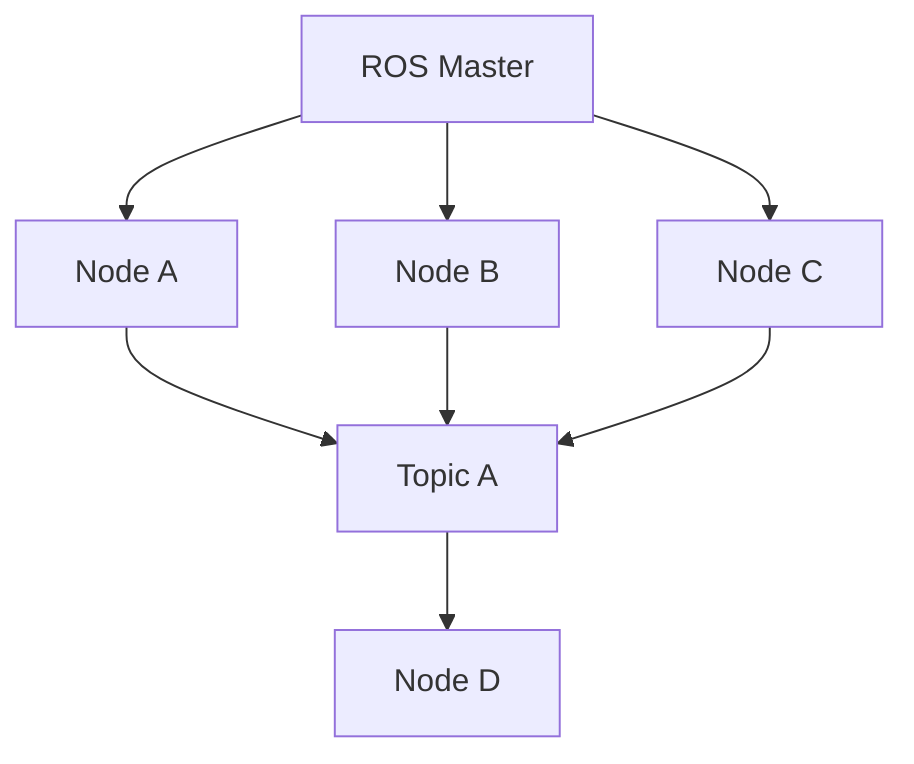
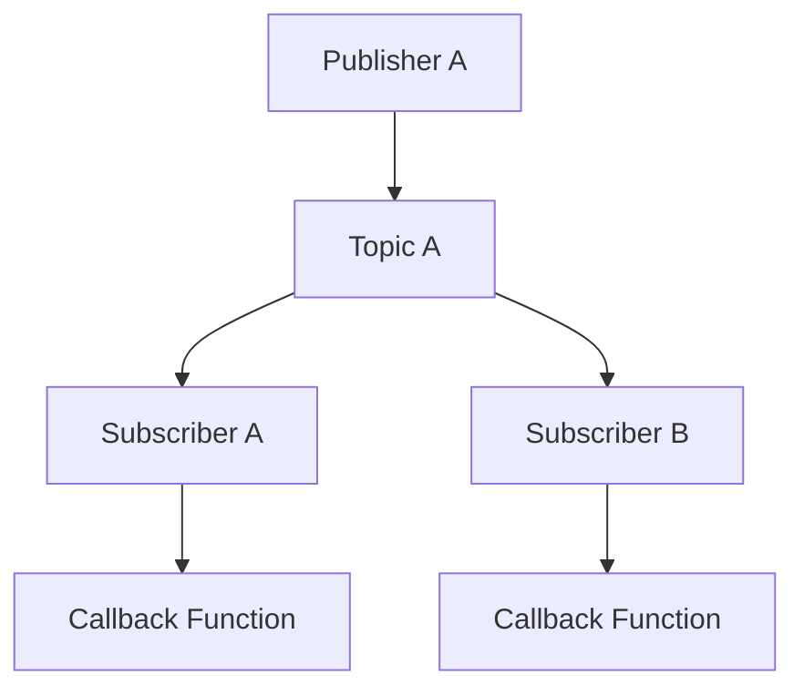
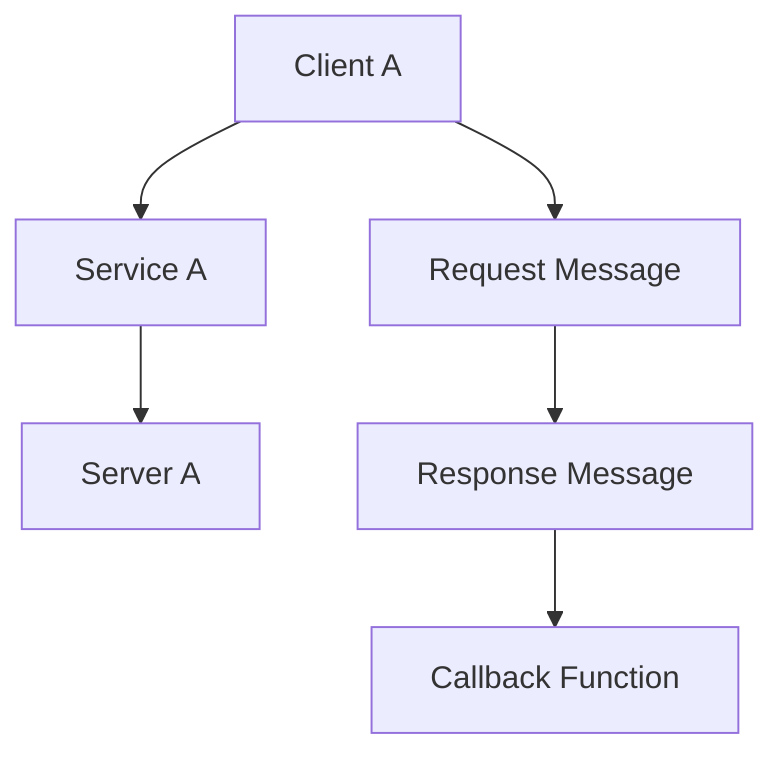

                 

# 文章标题: 《机器人操作系统（ROS）：自主系统开发平台》

## 关键词：
- 机器人操作系统
- 自主系统开发
- 机器人应用
- ROS架构
- 机器人控制

## 摘要：
本文将深入探讨机器人操作系统（ROS），一个专为机器人开发设计的自主系统开发平台。我们将从ROS的基础知识、架构，到核心模块和应用，逐步解析ROS的工作原理、通信机制、消息类型、节点编程，以及高级应用和实战。通过详细的讲解、伪代码展示、数学公式推导和实战案例分析，帮助读者全面理解ROS，掌握自主系统开发的核心技术。

### 《机器人操作系统（ROS）：自主系统开发平台》目录大纲

## 第一部分: ROS基础知识与架构

### 第1章: ROS简介
#### 1.1 ROS的起源与发展
#### 1.2 ROS的主要组件
#### 1.3 ROS在机器人领域的应用

### 第2章: ROS架构基础
#### 2.1 ROS架构概述
#### 2.2 ROS通信机制
#### 2.3 ROS包管理

### 第3章: ROS工作空间与环境配置
#### 3.1 ROS工作空间搭建
#### 3.2 ROS环境配置
#### 3.3 ROS包编译与调试

## 第二部分: ROS核心模块与应用

### 第4章: ROS话题通信
#### 4.1 话题通信原理
#### 4.2 发布者与订阅者
#### 4.3 话题通信实践

### 第5章: ROS服务通信
#### 5.1 服务通信原理
#### 5.2 请求者与提供者
#### 5.3 服务通信实践

### 第6章: ROS消息类型详解
#### 6.1 消息类型概述
#### 6.2 标准消息类型
#### 6.3 定制消息类型

### 第7章: ROS节点编程
#### 7.1 节点编程基础
#### 7.2 节点生命周期管理
#### 7.3 节点编程实践

### 第8章: ROS服务编程
#### 8.1 服务编程基础
#### 8.2 服务调用流程
#### 8.3 服务编程实践

### 第9章: ROS参数服务器
#### 9.1 参数服务器概述
#### 9.2 参数存储与检索
#### 9.3 参数服务器应用

## 第三部分: ROS高级应用与实战

### 第10章: ROS导航功能包
#### 10.1 导航功能包概述
#### 10.2 导航节点配置
#### 10.3 导航路径规划与跟踪

### 第11章: ROS机器人感知
#### 11.1 感知技术概述
#### 11.2 深度相机应用
#### 11.3 激光雷达应用

### 第12章: ROS机器人控制
#### 12.1 控制技术概述
#### 12.2 电机控制
#### 12.3 传感器融合

### 第13章: ROS机器人仿真
#### 13.1 仿真技术概述
#### 13.2 Gazebo仿真
#### 13.3 RViz可视化

### 第14章: ROS项目实战
#### 14.1 实战项目概述
#### 14.2 项目开发流程
#### 14.3 项目关键代码解读

## 附录

### 附录A: ROS常用工具与资源
#### A.1 ROS官方文档
#### A.2 ROS社区资源
#### A.3 ROS开发者工具

### 附录B: ROS Mermaid 流程图
#### B.1 ROS架构图
#### B.2 ROS话题通信流程图
#### B.3 ROS服务通信流程图

### 附录C: ROS核心算法原理与伪代码
#### C.1 PID控制算法
#### C.2 径向基函数网络算法

### 附录D: ROS项目实战案例代码解析
#### D.1 机器人导航项目
#### D.2 机器人控制项目

### 作者：
**AI天才研究院/AI Genius Institute & 禅与计算机程序设计艺术 /Zen And The Art of Computer Programming**
## 第一部分: ROS基础知识与架构

### 第1章: ROS简介

### 1.1 ROS的起源与发展

机器人操作系统（Robot Operating System，简称ROS）起源于斯坦福大学，它是由 Willow Garage 公司发起的一个开源项目，旨在为机器人开发提供一套标准的软件框架和工具集。ROS项目在2010年正式对外发布，并在短时间内吸引了全球范围内的开发者参与和贡献。

ROS的起源可以追溯到2005年，当时Willow Garage公司成立，并开始研发机器人。为了解决机器人软件开发的复杂性，公司决定开发一个模块化、可扩展的软件平台，从而简化机器人的开发和部署。ROS应运而生，它为开发者提供了一系列预先定义的组件和工具，使得机器人开发变得更加高效和便捷。

自ROS发布以来，它得到了广泛的关注和支持，迅速成为机器人领域的标准开发平台。许多知名公司和研究机构，如谷歌、亚马逊、IBM、卡内基梅隆大学等，都参与了ROS的社区建设和贡献。ROS已经成为机器人技术发展的重要驱动力之一，它推动了机器人技术的创新和应用。

ROS的发展历程可以分为几个重要阶段：

1. **初期阶段（2010-2012年）**：ROS发布初期，主要是以C++作为主要编程语言，并逐步完善了基础通信机制和消息类型。

2. **发展阶段（2012-2015年）**：ROS在社区中逐渐形成了自己的生态系统，推出了Python接口，并引入了更加丰富的工具和功能。

3. **成熟阶段（2015-2018年）**：ROS的生态系统继续扩展，增加了许多新模块和功能，如导航、感知、控制等，同时ROS在工业、服务、教育等多个领域得到了广泛应用。

4. **持续优化阶段（2018年至今）**：ROS 2.0发布，引入了新的架构和通信机制，以解决早期ROS版本中的一些性能和可靠性问题。

随着ROS的不断发展和完善，它已经成为机器人开发不可或缺的一部分。ROS不仅为开发者提供了强大的开发工具和资源，还促进了机器人技术的创新和应用，推动了机器人行业的进步。

### 1.2 ROS的主要组件

ROS由多个主要组件构成，每个组件都有特定的功能和用途。以下是ROS的主要组件及其简要介绍：

1. **ROS核心（ROS Core）**：
   - **roslib**：ROS的核心库，提供了ROS的基础功能，如消息传递、服务调用、节点管理等。
   - **rosmaster**：ROS的主节点，负责整个系统的调度和管理。
   - **rostopic**、**rosnode**、**rosservice**：命令行工具，用于操作ROS话题、节点和服务。
   - **roslaunch**：用于启动ROS节点的脚本工具。

2. **ROS通信机制（ROS Communication）**：
   - **ROS话题（ROS Topics）**：用于节点间异步通信，支持发布和订阅消息。
   - **ROS服务（ROS Services）**：用于节点间同步通信，支持请求和响应操作。
   - **ROS参数服务器（ROS Parameter Server）**：用于存储和管理全局参数。

3. **ROS包管理（ROS Packages）**：
   - **rosbuild**：用于构建ROS包的工具。
   - **catkin**：ROS的新一代包管理工具，用于构建、打包和安装ROS包。

4. **ROS工具集（ROS Tools）**：
   - **rqt**：交互式可视化工具，用于监控和调试ROS系统。
   - **rviz**：3D可视化工具，用于可视化ROS数据。
   - **roslint**、**roslint-rosdoc**：代码检查工具，用于确保ROS代码的质量。

5. **ROS库和模块（ROS Libraries and Modules）**：
   - **roscpp**：C++ API，用于开发ROS节点。
   - **rospy**：Python API，用于开发ROS节点。
   - **tf**：坐标转换库，用于处理多机器人系统的坐标转换。
   - **move_base**：导航库，用于路径规划和导航。
   - **image_pipeline**：图像处理库，用于图像采集和处理。
   - **ros_control**：机器人控制库，用于电机控制和传感器融合。

这些组件共同构成了ROS的生态系统，使得开发者能够方便地构建、调试和部署机器人系统。

### 1.3 ROS在机器人领域的应用

ROS作为机器人领域的标准开发平台，被广泛应用于多个领域：

1. **工业自动化**：
   - 机器人在工业生产中的应用，如组装、搬运、检测等。
   - ROS提供了丰富的工具和库，如机器人控制库（ros_control）、传感器库（sensor_msgs）等，使得工业机器人系统的开发变得更加高效。

2. **服务机器人**：
   - 家庭服务机器人，如清洁机器人、陪伴机器人等。
   - 商业服务机器人，如安保机器人、导览机器人等。
   - ROS提供了丰富的导航、感知和控制模块，如导航功能包（navigation）、感知功能包（perception）、控制功能包（control）等，为服务机器人开发提供了强大的支持。

3. **移动机器人**：
   - 无人驾驶车辆，如自动驾驶汽车、无人机等。
   - 移动机器人平台，如自主移动机器人、移动机器人车队等。
   - ROS提供了强大的导航和感知模块，如移动基座导航功能包（move_base）、激光雷达感知功能包（laser\_scan\_processor）等，使得移动机器人开发变得更加容易。

4. **教育与研究**：
   - 机器人教育，如机器人课程、机器人竞赛等。
   - 机器人研究，如机器人运动控制、机器人感知等。
   - ROS提供了丰富的示例代码和文档，为教育和研究提供了良好的平台。

总之，ROS已经成为机器人领域不可或缺的一部分，它为开发者提供了一个强大的开发平台，使得机器人系统的构建、调试和部署变得更加高效和便捷。

### 1.4 ROS的优势与挑战

#### ROS的优势

1. **模块化与可扩展性**：
   ROS的设计原则之一是模块化，每个组件都可以独立开发、测试和部署。这种模块化设计使得ROS具有很高的可扩展性，开发者可以根据需求自由组合和扩展功能模块。

2. **丰富的库和工具集**：
   ROS提供了一系列预先定义的库和工具，涵盖了机器人开发的各个方面，如感知、导航、控制等。这些库和工具不仅为开发者提供了便利，还保证了代码的高质量和可维护性。

3. **跨平台支持**：
   ROS支持多种操作系统，包括Linux、Windows等。这使得ROS可以在不同的硬件平台上运行，为开发者提供了更多的选择和灵活性。

4. **强大的社区支持**：
   ROS拥有一个庞大且活跃的社区，开发者可以方便地获取帮助、分享经验和资源。这使得ROS的学习和开发变得更加容易。

#### ROS的挑战

1. **学习曲线较陡峭**：
   ROS作为一个复杂的系统，其学习和使用都有一定的难度。对于初学者来说，需要花费较长时间来熟悉ROS的架构、工具和编程方式。

2. **性能和资源消耗**：
   ROS的原生架构在处理大量数据和实时任务时，可能会遇到性能和资源消耗的问题。虽然ROS 2.0引入了新的架构来解决这个问题，但迁移到ROS 2.0需要一定的学习和适应成本。

3. **依赖管理复杂**：
   ROS中的依赖关系较为复杂，开发者需要仔细管理和配置各种依赖库和工具。这可能增加了项目的复杂性和维护成本。

4. **文档和资源不统一**：
   ROS的文档和资源较为分散，有些内容可能在不同的文档或社区中重复出现。这给初学者和开发者带来了一定的困扰。

总之，ROS在机器人开发中具有巨大的优势，但也面临一些挑战。开发者需要根据自己的需求和经验，权衡利弊，选择合适的开发平台。

### 第2章: ROS架构基础

#### 2.1 ROS架构概述

ROS架构是机器人操作系统（Robot Operating System）的核心，它定义了系统的组织方式和各个组件之间的交互机制。ROS架构采用了一种分布式系统的设计理念，使得机器人系统可以在多个计算节点上运行，实现模块化和协同工作。

ROS架构的核心组成部分包括：

1. **节点（Nodes）**：节点是ROS架构中的基本执行单元，每个节点代表一个独立的程序或进程。节点通过订阅和发布话题与其他节点进行通信。

2. **话题（Topics）**：话题是节点之间进行数据交换的通道。节点可以发布话题，其他节点可以订阅这些话题以接收数据。ROS采用了一种异步的通信方式，保证了系统的实时性和效率。

3. **服务（Services）**：服务是节点之间进行同步通信的接口。节点可以通过调用服务来请求其他节点执行特定的任务，并等待响应。

4. **参数服务器（Parameter Server）**：参数服务器是一个存储全局参数的分布式数据库。节点可以在运行时动态地读取和修改参数，从而实现配置的灵活性和扩展性。

5. **包（Packages）**：包是ROS中的模块化单位，包含了节点、库、配置文件等。ROS通过包管理工具（如catkin）来构建、安装和依赖管理。

6. **Master（主节点）**：主节点是ROS架构中的中心协调器，负责管理节点列表、话题订阅、服务请求等。所有节点在启动时都会与主节点建立连接。

#### 2.2 ROS通信机制

ROS通信机制是ROS架构的核心部分，它定义了节点之间如何交换数据和协同工作。ROS提供了两种主要的通信机制：话题通信和服务通信。

1. **话题通信（Topic Communication）**：
   - **发布者（Publisher）**：发布者负责发布消息到某个话题。发布者可以定期发送数据，或者根据特定事件触发数据发送。
   - **订阅者（Subscriber）**：订阅者负责订阅某个话题，并接收发布者发送的消息。订阅者可以在接收到消息后进行相应的处理。
   - **消息队列（Message Queue）**：消息队列存储了发布者发布的数据，订阅者可以根据需要从队列中取出数据。ROS采用了预分配的消息队列，保证了消息的及时传递。

2. **服务通信（Service Communication）**：
   - **请求者（Client）**：请求者通过服务发送请求，请求服务执行特定的任务。
   - **提供者（Server）**：提供者接收请求，执行任务，并返回结果。提供者可以主动提供服务，也可以在接收到请求后开始处理。

ROS通信机制的工作流程如下：

- **节点启动**：节点启动后，会连接到主节点，并注册自己的信息。
- **话题通信**：节点可以发布消息到某个话题，其他节点可以订阅该话题以接收消息。
- **服务通信**：节点可以通过调用服务来请求其他节点执行任务，并等待响应。

#### 2.3 ROS包管理

ROS包管理是ROS架构的重要组成部分，它负责管理ROS包的构建、安装和依赖关系。ROS包是ROS系统中的模块化单位，包含了节点、库、配置文件等。

1. **包结构（Package Structure）**：
   - **src**：源代码目录，包含了节点的源代码、库和测试代码。
   - **include**：头文件目录，包含了节点的头文件。
   - **msg**：消息文件目录，包含了自定义的消息类型。
   - **srv**：服务文件目录，包含了自定义的服务类型。
   - **launch**：启动文件目录，包含了启动节点的配置文件。

2. **构建过程（Build Process）**：
   - **CMakeLists.txt**：CMake配置文件，用于定义包的构建规则和依赖关系。
   - **catkin_make**：构建工具，用于编译和安装ROS包。
   - **catkin build**：构建命令，用于构建单个包或多个包。

3. **依赖管理（Dependency Management）**：
   - **find\_package**：CMake命令，用于查找并包含依赖包。
   - **package\_xml**：包描述文件，用于定义包的依赖关系和版本信息。

4. **安装与部署（Installation and Deployment）**：
   - **安装**：通过catkin_make安装ROS包，将其安装到工作空间。
   - **部署**：通过roscd命令切换到包目录，通过rosrun命令运行节点。

ROS包管理使得开发者可以方便地创建、构建和部署ROS包，提高了开发效率和代码的可维护性。

### 2.4 ROS工作空间与环境配置

#### 2.4.1 ROS工作空间搭建

ROS工作空间（Workspace）是ROS项目的基本组织结构，它包含了多个ROS包。创建ROS工作空间是开始ROS项目开发的第一步。

1. **创建工作空间**：
   - 使用以下命令创建工作空间：
     ```bash
     mkdir -p ~/catkin_ws/src
     cd ~/catkin_ws/src
     ```
   - 使用catkin_init_workspace命令初始化工作空间：
     ```bash
     catkin_init_workspace
     ```

2. **添加包**：
   - 将源代码目录添加到工作空间：
     ```bash
     cd ~/catkin_ws/src
     git clone https://github.com/ros/ros_comm.git
     git clone https://github.com/ros/roscpp.git
     ```

3. **构建工作空间**：
   - 进入工作空间目录：
     ```bash
     cd ~/catkin_ws
     ```
   - 使用catkin_make构建工作空间：
     ```bash
     catkin_make
     ```

#### 2.4.2 ROS环境配置

ROS环境配置是确保ROS工具和库能够在开发环境中正常工作的关键步骤。

1. **设置环境变量**：
   - 在~/.bashrc文件中添加以下环境变量：
     ```bash
     export ROSفضاء=~/catkin_ws
     export PATH=$ROSفضاء/bin:$PATH
     ```
   - 运行source命令使环境变量生效：
     ```bash
     source ~/.bashrc
     ```

2. **源码编译与调试**：
   - 进入工作空间目录：
     ```bash
     cd ~/catkin_ws
     ```
   - 编译工作空间：
     ```bash
     catkin_make
     ```
   - 启动ROS控制台：
     ```bash
     roscore
     ```
   - 运行节点：
     ```bash
     rosrun roscpp_tutorials talker
     rosrun roscpp_tutorials listener
     ```

3. **使用源码**：
   - 在工作空间中创建一个新的包：
     ```bash
     cd ~/catkin_ws/src
     catkin_create_pkg my_pkg roscpp
     ```
   - 编写并编译节点：
     ```bash
     cd my_pkg
     catkin_make
     ```
   - 运行节点：
     ```bash
     roscore
     rosrun my_pkg my_node
     ```

通过搭建ROS工作空间和环境配置，开发者可以开始进行ROS项目开发，实现自主系统的开发。

### 2.5 ROS包编译与调试

编译ROS包是整个ROS开发过程中的重要环节，它将源代码转换为可执行文件，以便在机器人系统上运行。以下是编译ROS包的基本步骤：

#### 2.5.1 编译ROS包

1. **创建CMakeLists.txt文件**：
   - 在包的src目录下创建CMakeLists.txt文件，定义包的依赖关系和编译规则。
   ```cmake
   cmake_minimum_required(VERSION 3.10)
   project(my_package)

   find_package(catkin REQUIRED)

   catkin_package(
    包名称 my_package
    描述 "This is my ROS package"
     包含代码 src/my_node.cpp
     包含头文件 include/my_package
     )

   add_executable(my_node src/my_node.cpp)
   ```

2. **编译包**：
   - 在工作空间目录下执行以下命令：
     ```bash
     cd ~/catkin_ws
     catkin_make
     ```
   - 这将编译所有工作空间中的包。

3. **安装包**：
   - 将编译后的包安装到工作空间：
     ```bash
     cd ~/catkin_ws
     catkin_make install
     ```

#### 2.5.2 调试ROS包

调试ROS包是发现和修复代码中错误的重要步骤。以下是调试ROS包的基本方法：

1. **使用roslaunch**：
   - roslaunch文件是启动ROS节点的配置文件，可以用于调试。
   ```xml
   <node pkg="my_package" type="my_node" name="my_node" output="screen">
     <param name="param1" value="value1" />
   </node>
   ```

2. **使用rosrun**：
   - 使用rosrun命令直接运行节点，方便调试。
   ```bash
   rosrun my_package my_node
   ```

3. **使用rqt**：
   - rqt是ROS的交互式工具，可用于调试和监控ROS系统。
   ```bash
   rqt
   ```

4. **使用print语句**：
   - 在节点代码中添加print语句，输出关键变量的值，帮助调试。
   ```cpp
   cout << "Value of variable: " << variable << endl;
   ```

通过编译和调试ROS包，开发者可以确保ROS系统的稳定运行，实现自主系统的开发和优化。

### 第3章: ROS工作空间与环境配置

#### 3.1 ROS工作空间搭建

ROS工作空间（Workspace）是ROS项目的基本组织结构和开发环境。它包含了多个ROS包，用于管理项目的源代码、构建脚本、测试代码和运行时配置。以下是搭建ROS工作空间的基本步骤：

1. **创建工作空间目录**：
   - 首先，创建一个目录来存放ROS工作空间。通常，这个目录位于用户的家目录下，例如`~/catkin_ws`。
   ```bash
   mkdir -p ~/catkin_ws/src
   ```

2. **初始化工作空间**：
   - 进入工作空间目录，并初始化工作空间。初始化过程会创建必要的文件和目录。
   ```bash
   cd ~/catkin_ws/src
   catkin_init_workspace
   ```

3. **克隆ROS包**：
   - 使用`git clone`命令克隆ROS包到工作空间中。这些包可以是ROS官方仓库中的包，也可以是其他开发者分享的包。
   ```bash
   git clone https://github.com/ros/ros.git
   git clone https://github.com/ros/roscpp.git
   ```

4. **构建工作空间**：
   - 回到工作空间根目录，并执行`catkin_make`命令进行构建。构建过程会将源代码编译成可执行文件，并安装到工作空间中。
   ```bash
   cd ~/catkin_ws
   catkin_make
   ```

5. **环境配置**：
   - 为了使ROS工作空间在终端中可用，需要配置环境变量。编辑`~/.bashrc`或`~/.bash_profile`文件，并添加以下内容：
   ```bash
   export ROSWORKSPACE=~/catkin_ws
   source $ROSWORKSPACE/devel/setup.bash
   ```

6. **启动ROS内核**：
   - 启动ROS内核，以便在终端中使用ROS命令。在终端中运行以下命令：
   ```bash
   roscore
   ```

通过以上步骤，开发者可以成功搭建ROS工作空间，为后续的项目开发做好准备。

#### 3.2 ROS环境配置

配置ROS环境是确保ROS工具和库在系统中正常运行的关键步骤。以下是配置ROS环境的基本步骤：

1. **安装ROS**：
   - 首先，需要安装ROS操作系统。ROS支持多种Linux发行版，如Ubuntu、Fedora等。以下是在Ubuntu上安装ROS的步骤：
     - 更新系统软件包：
       ```bash
       sudo apt update
       sudo apt upgrade
       ```
     - 安装ROS包管理器：
       ```bash
       sudo apt install python-rosdep
       ```
     - 创建ROS源列表文件：
       ```bash
       sudo sh -c 'echo "deb http://packages.ros.org/ros/ubuntu $(lsb_release -cs) main" > /etc/apt/sources.list.d/ros-latest.list'
       ```
     - 添加ROS仓库密钥：
       ```bash
       sudo apt-key adv --keyserver 'hkp://keyserver.ubuntu.com:80' --recv-key C1CF6E31E6BADE8868B172B4F42ED6FBAB17C654
       ```
     - 安装ROS基础包：
       ```bash
       sudo apt install ros-melodic-desktop-full
       ```

2. **设置环境变量**：
   - 编辑`~/.bashrc`或`~/.profile`文件，并添加以下环境变量：
     ```bash
     export ROSفضاء=/opt/ros/melodic
     export PATH=$ROSفضاء/bin:$PATH
     export ROS_PACKAGE_PATH=$ROSفضاء/share
     ```
   - 使环境变量生效：
     ```bash
     source ~/.bashrc
     ```

3. **安装ROS工具**：
   - 安装ROS的一些常用工具，如roslaunch、rosrun等：
     ```bash
     sudo apt install ros-melodic-ros-base
     ```

4. **更新ROS依赖**：
   - 使用以下命令更新ROS依赖关系：
     ```bash
     rosdep init
     rosdep update
     ```

5. **编译工作空间**：
   - 如果已经创建了ROS工作空间，可以使用以下命令编译它：
     ```bash
     cd ~/catkin_ws
     catkin_make
     ```

6. **启动ROS内核**：
   - 在终端中启动ROS内核，以便使用ROS命令：
     ```bash
     roscore
     ```

通过以上步骤，开发者可以配置ROS环境，使其在系统中正常运行，为后续的ROS项目开发做好准备。

### 3.3 ROS包编译与调试

编译ROS包是将源代码转换为可执行文件的过程，以便在机器人系统上运行。调试则是发现和修复代码中错误的重要步骤。以下是编译和调试ROS包的基本步骤：

#### 3.3.1 编译ROS包

1. **创建CMakeLists.txt文件**：
   - 在包的src目录下创建CMakeLists.txt文件，定义包的依赖关系和编译规则。
   ```cmake
   cmake_minimum_required(VERSION 3.10)
   project(my_package)

   find_package(catkin REQUIRED)

   catkin_package(
     包名称 my_package
     描述 "This is my ROS package"
     包含代码 src/my_node.cpp
     包含头文件 include/my_package
     )

   add_executable(my_node src/my_node.cpp)
   ```

2. **构建包**：
   - 在工作空间目录下执行以下命令：
   ```bash
   cd ~/catkin_ws
   catkin_make
   ```

3. **安装包**：
   - 将编译后的包安装到工作空间：
   ```bash
   cd ~/catkin_ws
   catkin_make install
   ```

4. **配置环境**：
   - 使工作空间的环境变量生效：
   ```bash
   source devel/setup.bash
   ```

#### 3.3.2 调试ROS包

1. **使用print语句**：
   - 在节点代码中添加print语句，输出关键变量的值，帮助调试。
   ```cpp
   std::cout << "Value of variable: " << variable << std::endl;
   ```

2. **使用roslaunch**：
   - 使用roslaunch配置文件启动节点，方便调试。
   ```xml
   <node pkg="my_package" type="my_node" name="my_node" output="screen">
     <param name="param1" value="value1" />
   </node>
   ```

3. **使用rqt**：
   - rqt是一个交互式工具，可用于调试和监控ROS系统。
   ```bash
   rqt
   ```

4. **使用rostopic**：
   - 使用rostopic命令监控话题数据，帮助调试。
   ```bash
   rostopic list
   rostopic echo /my_topic
   ```

5. **使用rostopic pub**：
   - 使用rostopic pub命令发送数据到话题，帮助调试。
   ```bash
   rostopic pub /my_topic std_msgs/String "Hello, World!"
   ```

通过编译和调试ROS包，开发者可以确保ROS系统的稳定运行，实现自主系统的开发和优化。

### 第4章: ROS话题通信

ROS话题通信是ROS系统中节点之间进行数据交换的主要机制。通过话题，节点可以发布和订阅特定类型的数据，实现异步通信。本章节将详细介绍ROS话题通信的原理、应用和实践。

#### 4.1 话题通信原理

在ROS中，话题（Topic）是一个数据通道，用于在节点之间传输消息。每个话题都有唯一的名称，节点可以通过发布（Publish）和订阅（Subscribe）操作与话题进行交互。

1. **发布者（Publisher）**：
   - 发布者是一个节点，负责将数据发送到某个话题。发布者以一定的时间间隔或根据特定事件触发数据发布。
   - 发布者通过调用`ros::Publisher`对象发布消息。

2. **订阅者（Subscriber）**：
   - 订阅者是一个节点，负责接收某个话题上的消息。订阅者会持续监听话题上的数据，并在接收到新消息时进行相应的处理。
   - 订阅者通过调用`ros::Subscriber`对象订阅话题。

3. **消息队列（Message Queue）**：
   - 消息队列是ROS内部用于存储消息的数据结构。每个话题都有一个相应的消息队列，用于缓冲发布者发布的数据。
   - 订阅者从消息队列中取出消息进行处理，确保消息的及时传递。

4. **异步通信**：
   - ROS采用异步通信方式，允许节点同时处理多个话题。订阅者和发布者之间没有直接的连接，而是通过ROS主节点进行调度和管理。

#### 4.2 发布者与订阅者

发布者和订阅者是ROS话题通信的核心组件。以下是一个简单的示例，展示了如何实现发布者和订阅者：

**发布者（talker.cpp）**：
```cpp
#include <ros/ros.h>
#include <std_msgs/String.h>

int main(int argc, char** argv) {
  ros::init(argc, argv, "talker");
  ros::NodeHandle n;

  ros::Publisher pub = n.advertise<std_msgs::String>("chatter", 1000);

  ros::Rate loop_rate(10);

  while (ros::ok()) {
    std_msgs::String msg;
    msg.data = "Hello, World!";
    pub.publish(msg);

    ros::spinOnce();
    loop_rate.sleep();
  }

  return 0;
}
```

**订阅者（listener.cpp）**：
```cpp
#include <ros/ros.h>
#include <std_msgs/String.h>

void callback(const std_msgs::String::ConstPtr& msg) {
  ROS_INFO_STREAM("I heard: " << msg->data);
}

int main(int argc, char** argv) {
  ros::init(argc, argv, "listener");

  ros::NodeHandle n;
  ros::Subscriber sub = n.subscribe("chatter", 1000, callback);

  ros::spin();

  return 0;
}
```

在这个示例中，发布者节点名为`talker`，订阅者节点名为`listener`。它们通过发布和订阅话题`chatter`进行通信。

#### 4.3 话题通信实践

以下是一个简单的实践项目，用于演示ROS话题通信：

1. **创建工作空间**：
   - 创建一个名为`ros_tutorials`的工作空间。
   ```bash
   mkdir -p ~/ros_tutorials/src
   cd ~/ros_tutorials/src
   catkin_init_workspace
   ```

2. **克隆示例代码**：
   - 克隆ROS官方示例代码到工作空间。
   ```bash
   git clone https://github.com/ros/ros_tutorials.git
   ```

3. **编译工作空间**：
   - 进入工作空间目录，并编译示例代码。
   ```bash
   cd ~/ros_tutorials
   catkin_make
   ```

4. **运行发布者和订阅者**：
   - 启动ROS内核。
   ```bash
   roscore
   ```
   - 分别运行发布者和订阅者节点。
   ```bash
   rosrun ros_tutorials talker
   rosrun ros_tutorials listener
   ```

在这个项目中，发布者节点会定期发布消息，订阅者节点会接收到消息并打印出来。通过这个实践项目，读者可以更好地理解ROS话题通信的原理和应用。

### 4.4 话题通信的最佳实践

1. **使用合适的消息类型**：
   - 选择合适的消息类型，以减少数据传输量和处理复杂度。尽量使用标准消息类型，避免自定义消息类型。

2. **控制消息队列大小**：
   - 通过调整消息队列大小，可以控制订阅者处理消息的速度。太大的队列可能导致内存占用增加，太小则可能导致消息丢失。

3. **避免广播话题**：
   - 避免在多个节点中使用相同的广播话题。这样会导致不必要的处理开销，并增加系统的复杂性。

4. **使用命名空间**：
   - 为节点和话题使用命名空间，有助于避免命名冲突和简化代码。

5. **监控话题使用情况**：
   - 使用rostopic命令监控话题的使用情况，确保话题数据在节点间正常传输。

通过遵循这些最佳实践，可以优化ROS话题通信的性能和稳定性，提高开发效率。

### 小结

ROS话题通信是ROS系统中的核心通信机制，通过发布者和订阅者实现节点间的异步通信。理解话题通信的原理和最佳实践，有助于开发者高效地实现机器人系统的开发和调试。通过本章的学习和实践，读者应该能够掌握ROS话题通信的基本原理，并在实际项目中灵活应用。

### 第5章: ROS服务通信

ROS服务通信（ROS Service Communication）是ROS系统中节点之间进行同步通信的一种机制。与话题通信不同，服务通信是一种请求-响应模式，允许节点主动发起请求并等待响应。本章将详细介绍ROS服务通信的原理、应用和实践。

#### 5.1 服务通信原理

在ROS中，服务（Service）是一种用于节点之间进行同步通信的接口。服务由请求者（Client）和提供者（Server）组成。请求者发送请求，提供者接收请求并返回响应。

1. **请求者（Client）**：
   - 请求者是发起服务请求的节点。请求者通过调用`ros::service::call`函数发送请求，并等待提供者返回响应。

2. **提供者（Server）**：
   - 提供者是接收服务请求并返回响应的节点。提供者通过实现服务处理函数来处理请求。

3. **服务类型（Service Type）**：
   - 服务类型定义了服务的请求和响应的格式。服务类型通常使用`.srv`文件定义，包含请求和响应的XML结构。

4. **服务调用（Service Call）**：
   - 服务调用是一个异步过程，请求者在发送请求后，会继续执行其他任务。提供者在处理完请求后，会返回响应。

#### 5.2 请求者与提供者

请求者和提供者是ROS服务通信中的核心组件。以下是一个简单的示例，展示了如何实现请求者和提供者：

**提供者（talker.srv）**：
```srv
# 请求结构
string request

# 响应结构
string reply
```

**提供者（talker.cpp）**：
```cpp
#include <ros/ros.h>
#include <ros/service/server.h>
#include <my_package/Talker.h>

void talkerCallback(const my_package::TalkerRequest& request, my_package::TalkerResponse& response) {
  response.reply = "You said: " + request.request;
}

int main(int argc, char** argv) {
  ros::init(argc, argv, "talker");
  ros::NodeHandle n;

  ros::ServiceServer server = n.advertiseService("talker", talkerCallback);

  ros::spin();

  return 0;
}
```

**请求者（listener.cpp）**：
```cpp
#include <ros/ros.h>
#include <ros/service/client.h>
#include <my_package/Talker.h>

void listenerCallback() {
  ros::ServiceClient client = ros::ServiceClient("talker", true);
  my_package::TalkerRequest request;
  request.request = "Hello, World!";

  my_package::TalkerResponse response;

  if (client.call(request, response)) {
    ROS_INFO_STREAM("Received response: " << response.reply);
  } else {
    ROS_ERROR("Failed to call service");
  }
}

int main(int argc, char** argv) {
  ros::init(argc, argv, "listener");
  ros::NodeHandle n;

  ros::ServiceClient client = n.serviceClient<my_package::Talker>("talker");

  while (ros::ok()) {
    listenerCallback();
    ros::Duration(1.0).sleep();
  }

  return 0;
}
```

在这个示例中，提供者节点名为`talker`，请求者节点名为`listener`。它们通过服务`talker`进行通信。

#### 5.3 服务通信实践

以下是一个简单的实践项目，用于演示ROS服务通信：

1. **创建工作空间**：
   - 创建一个名为`ros_tutorials`的工作空间。
   ```bash
   mkdir -p ~/ros_tutorials/src
   cd ~/ros_tutorials/src
   catkin_init_workspace
   ```

2. **克隆示例代码**：
   - 克隆ROS官方示例代码到工作空间。
   ```bash
   git clone https://github.com/ros/ros_tutorials.git
   ```

3. **编译工作空间**：
   - 进入工作空间目录，并编译示例代码。
   ```bash
   cd ~/ros_tutorials
   catkin_make
   ```

4. **运行请求者和提供者**：
   - 启动ROS内核。
   ```bash
   roscore
   ```
   - 分别运行请求者和提供者节点。
   ```bash
   rosrun ros_tutorials talker
   rosrun ros_tutorials listener
   ```

在这个项目中，提供者节点会等待请求者发送请求，并在接收到请求后返回响应。通过这个实践项目，读者可以更好地理解ROS服务通信的原理和应用。

### 5.4 服务通信的最佳实践

1. **使用合适的服务类型**：
   - 选择合适的服务类型，以减少数据传输量和处理复杂度。尽量使用标准服务类型，避免自定义服务类型。

2. **避免长时间运行的服务**：
   - 避免在服务中执行长时间运行的任务，否则可能会阻塞其他节点。对于长时间运行的任务，可以考虑使用单独的节点处理。

3. **监控服务调用**：
   - 使用rosservice命令监控服务的调用情况，确保服务在节点间正常调用。

4. **使用命名空间**：
   - 为节点和话题使用命名空间，有助于避免命名冲突和简化代码。

5. **处理异常情况**：
   - 在服务调用过程中，处理可能出现的异常情况，如服务不可用、请求处理失败等。

通过遵循这些最佳实践，可以优化ROS服务通信的性能和稳定性，提高开发效率。

### 小结

ROS服务通信是ROS系统中的核心同步通信机制，通过请求者和提供者实现节点间的请求-响应通信。理解服务通信的原理和最佳实践，有助于开发者高效地实现机器人系统的开发和调试。通过本章的学习和实践，读者应该能够掌握ROS服务通信的基本原理，并在实际项目中灵活应用。

### 第6章: ROS消息类型详解

ROS消息类型是ROS系统中用于传输数据的基本单位，定义了数据在节点间传递的结构和格式。ROS消息类型分为标准消息类型和自定义消息类型。标准消息类型是ROS自带的预定义消息，自定义消息类型是开发者根据项目需求定义的。本章将详细介绍ROS消息类型的定义、使用和实现。

#### 6.1 消息类型概述

在ROS中，消息类型是用于描述数据结构的一种机制。每个消息类型都由一个`.msg`文件定义，其中包含了消息的字段、类型和描述。ROS提供了丰富的标准消息类型，同时也允许开发者定义自定义消息类型。

1. **标准消息类型**：
   - 标准消息类型是ROS自带的预定义消息，涵盖了机器人领域常用的数据类型，如几何形状、传感器数据、运动控制等。标准消息类型通常以`std_msgs`、`geometry_msgs`、`sensor_msgs`等命名空间开头。
   - 例如，`std_msgs/String`表示一个字符串类型消息，`geometry_msgs/Pose`表示一个几何形状（位置和姿态）的消息。

2. **自定义消息类型**：
   - 自定义消息类型是开发者根据项目需求定义的消息，用于描述特定的数据结构。自定义消息类型通常以项目或包的命名空间开头。
   - 自定义消息类型通过在`.msg`文件中定义字段和类型来实现。例如，一个简单的自定义消息类型可能包含位置、速度等字段。
   - 自定义消息类型需要在项目中定义并编译，以便在节点中使用。

#### 6.2 标准消息类型

以下是一些常用的标准消息类型及其简要说明：

1. **std_msgs/String**：
   - 类型：字符串
   - 描述：用于传输文本字符串数据。
   ```msg
   string data
   ```

2. **std_msgs/Bool**：
   - 类型：布尔值
   - 描述：用于传输真值或假值。
   ```msg
   bool data
   ```

3. **std_msgs/Int32**：
   - 类型：32位整数
   - 描述：用于传输整数数据。
   ```msg
   int32 data
   ```

4. **std_msgs/Float32**：
   - 类型：32位浮点数
   - 描述：用于传输浮点数数据。
   ```msg
   float32 data
   ```

5. **geometry_msgs/Pose**：
   - 类型：几何形状
   - 描述：用于传输位置和姿态信息。
   ```msg
   geometry_msgs/Point position
   geometry_msgs/Quaternion orientation
   ```

6. **sensor_msgs/Imu**：
   - 类型：惯性测量单元（IMU）数据
   - 描述：用于传输IMU的加速度、角速度和姿态信息。
   ```msg
   geometry_msgs/Vector3 linear_acceleration
   geometry_msgs/Vector3 angular_velocity
   geometry_msgs/Pose orientation
   ```

7. **sensor_msgs/LaserScan**：
   - 类型：激光扫描数据
   - 描述：用于传输激光雷达的扫描数据。
   ```msg
   float32[] ranges
   float32 angle_min
   float32 angle_max
   float32 angle_increment
   float32 time_increment
   bool fill
   ```

8. **actionlib_msgs/GoalID**：
   - 类型：动作目标ID
   - 描述：用于传输动作目标ID信息。
   ```msg
   uint32 id
   ```

以上标准消息类型是ROS中常用的基础消息类型，涵盖了机器人领域的基本数据传输需求。开发者可以根据具体项目需求，选择合适的标准消息类型或定义自定义消息类型。

#### 6.3 定制消息类型

自定义消息类型是开发者根据项目需求定义的，用于描述特定的数据结构。以下是一个简单的自定义消息类型示例：

**自定义消息类型（my_msg.msg）**：
```msg
# 定义一个包含位置、速度和颜色的自定义消息类型
string name
geometry_msgs/Pose pose
geometry_msgs/Twist velocity
std_msgs/ColorRGBA color
```

在这个示例中，自定义消息类型`MyMessage`包含了名称、位置、速度和颜色字段。定义自定义消息类型后，需要在项目中编译和安装，以便在节点中使用。

**编译自定义消息类型**：
- 在项目的工作空间中，执行以下命令编译自定义消息类型：
  ```bash
  cd ~/catkin_ws
  catkin_make
  ```

**安装自定义消息类型**：
- 将编译后的自定义消息类型安装到工作空间：
  ```bash
  cd ~/catkin_ws
  catkin_make install
  ```

**使用自定义消息类型**：
- 在节点代码中，可以使用自定义消息类型进行数据传输：
  ```cpp
  #include "my_msg/MyMessage.h"

  ros::Publisher pub = n.advertise<my_msg::MyMessage>("my_topic", 10);

  my_msg::MyMessage msg;
  msg.name = "Robot1";
  msg.pose.position.x = 1.0;
  msg.pose.orientation.z = 0.5;
  msg.velocity.linear.x = 0.2;
  msg.velocity.angular.z = 0.1;
  msg.color.r = 1.0;
  msg.color.g = 0.0;
  msg.color.b = 0.0;
  msg.color.a = 1.0;

  pub.publish(msg);
  ```

通过定义和编译自定义消息类型，开发者可以灵活地描述和传输特定项目需求的数据结构。

#### 6.4 消息类型的序列化和反序列化

ROS消息类型在节点间传输时，需要进行序列化和反序列化操作。序列化是将消息结构转换为二进制数据，以便在网络中传输；反序列化是将二进制数据转换回消息结构。

1. **序列化**：
   - 在节点发布消息时，ROS自动将消息序列化为二进制数据。序列化过程由ROS内部处理，开发者无需关心具体细节。

2. **反序列化**：
   - 在节点接收到消息后，ROS自动将二进制数据反序列化为消息结构。反序列化过程同样由ROS内部处理。

消息的序列化和反序列化是ROS通信机制的核心，保证了节点间数据传输的可靠性和高效性。

#### 6.5 消息类型的最佳实践

1. **合理使用标准消息类型**：
   - 尽量使用ROS提供的标准消息类型，以简化代码和维护。

2. **避免过度复杂化消息类型**：
   - 避免在自定义消息类型中包含过多字段，否则会增加数据传输量和处理复杂度。

3. **使用命名空间**：
   - 为自定义消息类型使用命名空间，以避免命名冲突和简化代码。

4. **文档化消息类型**：
   - 为自定义消息类型编写详细的文档，说明字段的意义和用法，便于其他开发者理解和使用。

通过遵循这些最佳实践，可以优化ROS消息类型的设计和使用，提高开发效率和代码质量。

### 小结

ROS消息类型是ROS系统中传输数据的基本单位，分为标准消息类型和自定义消息类型。标准消息类型涵盖了机器人领域常用的数据类型，自定义消息类型允许开发者根据项目需求定义特定数据结构。通过本章的学习和实践，读者应该能够掌握ROS消息类型的定义、使用和序列化反序列化操作，并在实际项目中灵活应用。

### 第7章: ROS节点编程

ROS节点编程是机器人开发的核心，它允许开发者创建、管理和运行机器人系统中的独立组件。ROS节点（Node）是执行特定任务或功能的程序，通过发布和订阅话题、调用服务和读取参数来实现与其他节点的通信。本章将详细介绍ROS节点编程的基础知识、节点生命周期管理，以及节点编程实践。

#### 7.1 节点编程基础

在ROS中，节点是机器人系统的基本构建块，每个节点都代表一个独立的程序或进程。节点通过ROS主节点（rosmaster）进行注册和通信。

1. **节点创建**：
   - ROS节点通常由一个C++或Python脚本构成。创建节点时，需要指定节点名称和使用的包。
   - 例如，在C++中创建一个名为`my_node`的节点：
     ```cpp
     #include <ros/ros.h>

     int main(int argc, char** argv) {
       ros::init(argc, argv, "my_node");
       ros::NodeHandle n;
       ROS_INFO("Hello, ROS!");
       ros::spin();
       return 0;
     }
     ```

2. **节点名称**：
   - 每个节点都有一个唯一的名称，用于标识节点在ROS系统中的身份。
   - 在创建节点时，通过`ros::init`函数指定节点名称。

3. **节点句柄（NodeHandle）**：
   - 节点句柄（NodeHandle）是ROS节点的主要接口，用于访问ROS系统中的各种资源，如话题、服务、参数等。
   - 在C++中，通过`ros::NodeHandle`对象访问ROS资源；在Python中，通过`rospy.init_node`函数初始化节点。

4. **话题发布与订阅**：
   - 节点可以通过发布和订阅话题与其他节点通信。
   - 发布者（Publisher）节点发布消息到特定话题，订阅者（Subscriber）节点从话题中接收消息。

5. **服务调用**：
   - 节点可以通过调用服务请求其他节点执行特定任务。
   - 请求者（Client）节点发起服务请求，提供者（Server）节点处理请求并返回响应。

6. **参数读取**：
   - 节点可以从参数服务器中读取全局参数。
   - 参数服务器（Parameter Server）存储和管理全局参数，节点可以通过节点句柄读取参数。

#### 7.2 节点生命周期管理

ROS节点具有明确的生命周期，包括启动、运行和终止阶段。节点生命周期管理是确保节点正确执行和资源释放的关键。

1. **启动阶段**：
   - 节点通过`ros::init`函数初始化，指定节点名称和其他初始化参数。
   - 在C++中，使用`ros::init(argc, argv, "node_name")`；在Python中，使用`rospy.init_node(node_name)`。

2. **运行阶段**：
   - 节点在`ros::spin`或`rospy.spin`函数中进入循环，处理消息、服务和参数。
   - 在C++中，使用`ros::spin()`；在Python中，使用`rospy.spin()`。

3. **终止阶段**：
   - 节点在接收到终止信号（如Ctrl+C）后，调用`ros::shutdown`或`rospy.signal_shutdown`函数终止。
   - 在C++中，使用`ros::shutdown()`；在Python中，使用`rospy.signal_shutdown("shutdown message")`。

节点生命周期管理是ROS节点编程的基础，确保节点在系统中的正常运行和资源释放。

#### 7.3 节点编程实践

以下是一个简单的ROS节点编程实践项目，用于演示节点的基本功能。

**项目目标**：创建一个ROS节点，发布一个周期性的消息，并接收用户输入的命令。

**步骤**：

1. **创建工作空间**：
   - 创建一个名为`ros_tutorials`的工作空间。
   ```bash
   mkdir -p ~/ros_tutorials/src
   cd ~/ros_tutorials/src
   catkin_init_workspace
   ```

2. **克隆示例代码**：
   - 克隆ROS官方示例代码到工作空间。
   ```bash
   git clone https://github.com/ros/ros_tutorials.git
   ```

3. **编译工作空间**：
   - 进入工作空间目录，并编译示例代码。
   ```bash
   cd ~/ros_tutorials
   catkin_make
   ```

4. **创建节点**：
   - 在工作空间中创建一个名为`my_node`的节点。

**C++版本（my_node.cpp）**：
```cpp
#include <ros/ros.h>
#include <std_msgs/String.h>

void pub_and_sub() {
  ros::NodeHandle n;
  ros::Publisher pub = n.advertise<std_msgs::String>("chatter", 1000);
  ros::Subscriber sub = n.subscribe("input", 1000, &pub_and_sub);

  while (ros::ok()) {
    std_msgs::String msg;
    msg.data = "Hello, World!";
    pub.publish(msg);

    ros::spinOnce();
    ros::Duration(1.0).sleep();
  }
}

int main(int argc, char** argv) {
  ros::init(argc, argv, "my_node");
  ros::spin();
  return 0;
}
```

**Python版本（my_node.py）**：
```python
import rospy
from std_msgs.msg import String

def callback(data):
    rospy.loginfo("I heard %s", data.data)

def listener():
    rospy.init_node('my_node', anonymous=True)
    rospy.Subscriber("input", String, callback)

def talker():
    pub = rospy.Publisher('chatter', String, queue_size=10)
    rate = rospy.Rate(10) # 10hz
    while not rospy.is_shutdown():
        msg = rospy.wait_for_message("input", String)
        rospy.loginfo("Echo: %s", msg.data)
        pub.publish(msg)
        rate.sleep()

if __name__ == '__main__':
    try:
        talker()
    except rospy.ROSInterruptException:
        pass
```

5. **运行节点**：
   - 启动ROS内核。
   ```bash
   roscore
   ```
   - 运行发布者和订阅者节点。
   ```bash
   rosrun ros_tutorials my_node
   ```

在这个项目中，发布者节点定期发布消息到`chatter`话题，订阅者节点从`input`话题接收消息，并回显到控制台。通过这个实践项目，读者可以了解ROS节点编程的基础知识和实践方法。

### 7.4 节点编程的最佳实践

1. **合理命名节点**：
   - 为节点使用有意义且易于理解的名称，避免使用缩写或难懂的名称。

2. **使用命名空间**：
   - 为节点和话题使用命名空间，以避免命名冲突和简化代码。

3. **优化消息类型**：
   - 选择合适的消息类型，以减少数据传输量和处理复杂度。

4. **监控节点状态**：
   - 使用rostopic、rosservice等命令监控节点状态和通信情况。

5. **错误处理**：
   - 在节点代码中添加错误处理机制，确保节点在异常情况下能够优雅地退出。

通过遵循这些最佳实践，可以优化ROS节点编程的性能和稳定性，提高开发效率。

### 小结

ROS节点编程是机器人系统开发的核心，通过创建、管理和运行节点，实现节点间的通信和任务分配。理解节点编程的基础知识、节点生命周期管理和编程实践，有助于开发者高效地实现机器人系统的开发。通过本章的学习和实践，读者应该能够掌握ROS节点编程的基本原理，并在实际项目中灵活应用。

### 第8章: ROS服务编程

ROS服务编程是机器人系统中节点间同步通信的一种重要方式。通过服务，节点可以请求其他节点执行特定任务，并等待响应。本章将详细介绍ROS服务的编程基础、服务调用流程，以及服务编程实践。

#### 8.1 服务编程基础

在ROS中，服务（Service）是一种节点间的同步通信机制。服务由请求者（Client）和提供者（Server）组成。请求者发送请求，提供者接收请求并返回响应。

1. **请求者（Client）**：
   - 请求者是发起服务请求的节点。请求者通过调用`ros::service::call`函数发送请求，并等待提供者返回响应。

2. **提供者（Server）**：
   - 提供者是接收服务请求并返回响应的节点。提供者通过实现服务处理函数来处理请求。

3. **服务类型（Service Type）**：
   - 服务类型定义了服务的请求和响应的格式。服务类型通常使用`.srv`文件定义，包含请求和响应的XML结构。

4. **服务调用（Service Call）**：
   - 服务调用是一个异步过程，请求者在发送请求后，会继续执行其他任务。提供者在处理完请求后，会返回响应。

#### 8.2 服务编程基础

以下是一个简单的服务编程示例，展示了如何实现服务提供者和请求者。

**服务定义（AddTwoInts.srv）**：
```srv
# 请求结构
int32 a
int32 b

# 响应结构
int32 sum
```

**服务提供者（add_two_ints_server.cpp）**：
```cpp
#include <ros/ros.h>
#include <my_package/AddTwoInts.h>

bool addTwoInts(my_package::AddTwoInts::Request  &req,
                my_package::AddTwoInts::Response &res)
{
  res.sum = req.a + req.b;
  ROS_INFO("Request for adding the int: %d + %d", req.a, req.b);
  return true;
}

int main(int argc, char **argv)
{
  ros::init(argc, argv, "add_two_ints_server");

  ros::NodeHandle n;
  ros::ServiceServer service = n.advertiseService("add_two_ints", addTwoInts);

  ros::spin();

  return 0;
}
```

**服务请求者（add_two_ints_client.cpp）**：
```cpp
#include <ros/ros.h>
#include <my_package/AddTwoInts.h>

bool callAddTwoInts()
{
  ros::NodeHandle n;
  ros::ServiceClient client = n.serviceClient<my_package::AddTwoInts>("add_two_ints");

  my_package::AddTwoInts srv;
  srv.request.a = 10;
  srv.request.b = 20;

  if (client.call(srv))
  {
    ROS_INFO("Response received: %d + %d = %d", srv.request.a, srv.request.b, srv.response.sum);
  }
  else
  {
    ROS_ERROR("Failed to call service add_two_ints");
    return false;
  }

  return true;
}

int main(int argc, char **argv)
{
  ros::init(argc, argv, "add_two_ints_client");

  callAddTwoInts();

  ros::spin();

  return 0;
}
```

在这个示例中，服务提供者节点名为`add_two_ints_server`，服务请求者节点名为`add_two_ints_client`。它们通过服务`add_two_ints`进行通信。

#### 8.3 服务调用流程

ROS服务调用流程包括以下步骤：

1. **初始化节点**：
   - 使用`ros::init`函数初始化节点，指定节点名称和其他初始化参数。

2. **广告服务**：
   - 使用`ros::advertiseService`函数广告服务，指定服务名称和处理函数。

3. **等待请求**：
   - 进入循环，等待服务请求。提供者节点在接收到请求后，会调用处理函数处理请求。

4. **返回响应**：
   - 在处理函数中，根据请求生成响应，并通过`Response`对象的`sum`字段返回结果。

5. **客户端调用**：
   - 请求者节点通过`ros::service::call`函数调用服务，并传递请求参数。请求者会等待响应并处理结果。

#### 8.4 服务编程实践

以下是一个简单的实践项目，用于演示ROS服务编程。

**项目目标**：创建一个ROS服务，实现两个整数相加的功能。

**步骤**：

1. **创建工作空间**：
   - 创建一个名为`ros_tutorials`的工作空间。
   ```bash
   mkdir -p ~/ros_tutorials/src
   cd ~/ros_tutorials/src
   catkin_init_workspace
   ```

2. **克隆示例代码**：
   - 克隆ROS官方示例代码到工作空间。
   ```bash
   git clone https://github.com/ros/ros_tutorials.git
   ```

3. **编译工作空间**：
   - 进入工作空间目录，并编译示例代码。
   ```bash
   cd ~/ros_tutorials
   catkin_make
   ```

4. **创建服务文件**：
   - 在`src`目录下创建一个名为`my_service`的包，并在`srv`目录下创建`AddTwoInts.srv`文件。
   ```bash
   cd ~/ros_tutorials/src
   catkin_create_pkg my_service roscpp
   cd my_service
   touch srv/AddTwoInts.srv
   ```

5. **定义服务类型**：
   - 在`AddTwoInts.srv`文件中定义服务类型。
   ```srv
   # 请求结构
   int32 a
   int32 b

   # 响应结构
   int32 sum
   ```

6. **创建服务提供者**：
   - 在`src`目录下创建一个名为`add_two_ints_server.cpp`的文件，并实现服务提供者。
   ```cpp
   #include <ros/ros.h>
   #include <my_service/AddTwoInts.h>

   bool addTwoInts(my_service::AddTwoInts::Request  &req,
                   my_service::AddTwoInts::Response &res)
   {
     res.sum = req.a + req.b;
     ROS_INFO("Request for adding the int: %d + %d", req.a, req.b);
     return true;
   }

   int main(int argc, char **argv)
   {
     ros::init(argc, argv, "add_two_ints_server");

     ros::NodeHandle n;
     ros::ServiceServer service = n.advertiseService("add_two_ints", addTwoInts);

     ros::spin();

     return 0;
   }
   ```

7. **创建服务请求者**：
   - 在`src`目录下创建一个名为`add_two_ints_client.cpp`的文件，并实现服务请求者。
   ```cpp
   #include <ros/ros.h>
   #include <my_service/AddTwoInts.h>

   bool callAddTwoInts()
   {
     ros::NodeHandle n;
     ros::ServiceClient client = n.serviceClient<my_service::AddTwoInts>("add_two_ints");

     my_service::AddTwoInts srv;
     srv.request.a = 10;
     srv.request.b = 20;

     if (client.call(srv))
     {
       ROS_INFO("Response received: %d + %d = %d", srv.request.a, srv.request.b, srv.response.sum);
     }
     else
     {
       ROS_ERROR("Failed to call service add_two_ints");
       return false;
     }

     return true;
   }

   int main(int argc, char **argv)
   {
     ros::init(argc, argv, "add_two_ints_client");

     callAddTwoInts();

     ros::spin();

     return 0;
   }
   ```

8. **运行服务提供者和请求者**：
   - 启动ROS内核。
   ```bash
   roscore
   ```
   - 分别运行服务提供者和请求者节点。
   ```bash
   rosrun my_service add_two_ints_server
   rosrun my_service add_two_ints_client
   ```

在这个项目中，服务提供者节点会等待服务请求，并在接收到请求后返回两个整数的和。通过这个实践项目，读者可以更好地理解ROS服务编程的基础知识和实践方法。

### 8.5 服务编程的最佳实践

1. **合理命名服务**：
   - 为服务使用有意义且易于理解的名称，避免使用缩写或难懂的名称。

2. **使用命名空间**：
   - 为服务类型和节点使用命名空间，以避免命名冲突和简化代码。

3. **优化服务类型**：
   - 选择合适的服务类型，以减少数据传输量和处理复杂度。

4. **错误处理**：
   - 在服务处理函数中添加错误处理机制，确保服务在异常情况下能够优雅地处理错误。

5. **监控服务调用**：
   - 使用rosservice命令监控服务的调用情况，确保服务在节点间正常调用。

通过遵循这些最佳实践，可以优化ROS服务编程的性能和稳定性，提高开发效率。

### 小结

ROS服务编程是机器人系统中节点间同步通信的重要机制。通过理解服务编程的基础知识、服务调用流程，以及服务编程实践，开发者可以高效地实现机器人系统的开发和调试。通过本章的学习和实践，读者应该能够掌握ROS服务编程的基本原理，并在实际项目中灵活应用。

### 第9章: ROS参数服务器

ROS参数服务器（ROS Parameter Server）是ROS系统中用于存储和管理全局参数的组件。参数服务器提供了一个集中式的存储机制，允许节点在运行时读取和修改参数。本章将详细介绍ROS参数服务器的概述、参数存储与检索，以及参数服务器的应用。

#### 9.1 参数服务器概述

ROS参数服务器是一个分布式数据库，用于存储和管理全局参数。参数服务器的主要功能包括：

1. **存储参数**：
   - 参数服务器可以存储各种类型的参数，包括整数、浮点数、字符串、布尔值等。

2. **动态修改参数**：
   - 节点可以在运行时读取和修改参数，从而实现参数的动态配置。

3. **多节点访问**：
   - 参数服务器支持多节点访问，节点可以同时读取和修改参数。

4. **持久化存储**：
   - 参数服务器可以将参数持久化存储到文件中，确保参数在系统重启后仍然可用。

#### 9.2 参数存储与检索

在ROS中，节点可以使用参数服务器存储和检索参数。以下是如何在节点中存储和检索参数的示例：

**存储参数**：
```cpp
#include <ros/ros.h>

int main(int argc, char **argv) {
  ros::init(argc, argv, "param_server_node");

  ros::NodeHandle n;

  // 存储整数参数
  n.setParam("integer_param", 42);

  // 存储浮点数参数
  n.setParam("float_param", 3.14);

  // 存储字符串参数
  n.setParam("string_param", "Hello, ROS!");

  ROS_INFO_STREAM("Integer parameter: " << n.getParam("integer_param"));
  ROS_INFO_STREAM("Float parameter: " << n.getParam("float_param"));
  ROS_INFO_STREAM("String parameter: " << n.getParam("string_param"));

  ros::spin();

  return 0;
}
```

**检索参数**：
```cpp
#include <ros/ros.h>

void callback(const std_msgs::String::ConstPtr& msg) {
  ros::NodeHandle n;
  int integer_param;
  float float_param;
  std::string string_param;

  // 从参数服务器中检索参数
  n.getParam("integer_param", integer_param);
  n.getParam("float_param", float_param);
  n.getParam("string_param", string_param);

  ROS_INFO_STREAM("Received string: " << msg->data);
  ROS_INFO_STREAM("Integer parameter: " << integer_param);
  ROS_INFO_STREAM("Float parameter: " << float_param);
  ROS_INFO_STREAM("String parameter: " << string_param);
}

int main(int argc, char **argv) {
  ros::init(argc, argv, "param_server_listener");

  ros::NodeHandle n;
  ros::Subscriber subscriber = n.subscribe("param_chatter", 1000, callback);

  ros::spin();

  return 0;
}
```

在这个示例中，第一个节点`param_server_node`将整数、浮点数和字符串参数存储到参数服务器，并打印参数值。第二个节点`param_server_listener`从参数服务器中检索这些参数，并在接收到字符串消息时打印参数值。

#### 9.3 参数服务器应用

参数服务器在ROS中的应用非常广泛，以下是一些常见的应用场景：

1. **动态配置**：
   - 在机器人系统中，参数经常用于配置不同运行模式或参数调整。使用参数服务器，可以动态地修改参数，无需重新启动节点。

2. **多节点协同**：
   - 参数服务器允许多个节点同时访问和修改参数，实现多节点间的协同工作。例如，在分布式机器人系统中，可以使用参数服务器协调不同节点的行为。

3. **参数持久化**：
   - 参数服务器可以将参数持久化存储到文件中，确保参数在系统重启后仍然可用。这有助于在系统恢复或故障转移时快速恢复配置。

4. **参数验证**：
   - 参数服务器支持参数验证功能，确保存储的参数符合预期类型和范围。这有助于防止配置错误和系统崩溃。

通过理解ROS参数服务器的概述、参数存储与检索，以及参数服务器的应用，开发者可以充分利用参数服务器在机器人系统开发中的优势，提高系统的灵活性和可维护性。

### 9.4 参数服务器的高级功能

除了基本的参数存储和检索功能，ROS参数服务器还提供了一些高级功能，包括：

1. **参数监听**：
   - 参数服务器支持参数监听功能，允许节点在参数值发生变化时接收通知。这对于需要实时响应参数变化的场景非常有用。

2. **参数缓存**：
   - 参数服务器可以使用缓存机制提高性能，减少对磁盘的访问。缓存机制可以缓存最近访问的参数，降低访问延迟。

3. **参数加密**：
   - 参数服务器支持加密功能，确保存储的敏感参数在传输和存储过程中不会被泄露。这有助于保护系统的安全性和隐私性。

4. **参数验证**：
   - 参数服务器可以对存储的参数进行验证，确保参数的类型和值符合预期。这有助于防止配置错误和系统崩溃。

通过了解和利用这些高级功能，开发者可以进一步提高ROS参数服务器的性能和安全，满足不同场景的需求。

### 9.5 参数服务器的最佳实践

1. **使用命名空间**：
   - 为参数使用命名空间，有助于避免参数命名冲突和简化代码。

2. **合理命名参数**：
   - 为参数使用有意义且易于理解的名称，避免使用缩写或难懂的名称。

3. **避免硬编码参数**：
   - 尽量使用参数服务器管理参数，避免在代码中硬编码参数值。这样可以提高系统的灵活性和可维护性。

4. **监控参数变化**：
   - 在需要时，监控参数服务器中的参数变化，确保系统能够及时响应参数调整。

5. **安全性考虑**：
   - 对于敏感参数，使用加密功能保护参数的安全性。

通过遵循这些最佳实践，可以优化ROS参数服务器的使用，提高机器人系统的性能和安全。

### 小结

ROS参数服务器是ROS系统中用于存储和管理全局参数的重要组件。通过理解参数服务器的概述、参数存储与检索，以及参数服务器的应用，开发者可以充分利用参数服务器的优势，实现机器人系统的动态配置和协同工作。通过本章的学习和实践，读者应该能够掌握ROS参数服务器的基本原理和最佳实践，并在实际项目中灵活应用。

### 第10章: ROS导航功能包

ROS导航功能包（ROS Navigation Package）是ROS系统中用于实现机器人自主导航的核心模块。导航功能包提供了完整的导航解决方案，包括定位、路径规划、移动控制等。本章将详细介绍ROS导航功能包的概述、导航节点配置，以及导航路径规划与跟踪。

#### 10.1 导航功能包概述

ROS导航功能包是一个集成的导航解决方案，旨在帮助开发者实现机器人的自主导航。导航功能包的主要组成部分包括：

1. **TF（Transform）**：
   - TF库用于处理机器人的坐标转换，确保不同传感器和执行器之间的坐标一致性。

2. **AMCL（ArcGIS Map-based Localisation）**：
   - AMCL是一种基于地图的定位算法，用于估计机器人在环境中的位置。

3. **nav_core**：
   - nav\_core提供了导航功能包的核心接口和实现，包括路径规划、移动控制等。

4. **nav_msgs**：
   - nav\_msgs定义了导航功能包中使用的主要消息类型，如路径点、路径等。

5. **move_base**：
   - move\_base是一个高级导航节点，用于执行路径规划和移动控制。

6. **global_planner**：
   - global\_planner提供了全局路径规划算法，用于生成从起点到终点的路径。

7. **local_planner**：
   - local\_planner提供了局部路径规划算法，用于生成机器人的实时移动路径。

8. **costmap\_2d**：
   - costmap\_2d提供了2D网格地图表示，用于表示机器人的环境。

#### 10.2 导航节点配置

配置ROS导航功能包是实现机器人导航的第一步。以下是如何配置导航功能包的基本步骤：

1. **安装导航功能包**：
   - 在工作空间中，执行以下命令安装导航功能包：
   ```bash
   cd ~/catkin_ws/src
   git clone https://github.com/ros-planning/navigation.git
   ```

2. **编译导航功能包**：
   - 进入导航功能包目录，并编译功能包：
   ```bash
   cd ~/catkin_ws/src/navigation
   catkin_make
   ```

3. **配置导航参数**：
   - 导航功能包需要一些参数来配置机器人的行为和环境。这些参数通常存储在`config`目录中的`.yaml`文件中。例如：
   ```yaml
   # move_base_config.yaml
   global_costmap:
     map: "/map"
    分辨率：0.05
     最小分辨率：0.02
     导航层：10
     自由通行：0.0
     路障：-1.0
     描述层：
       - name: "obstacles"
         layer: 0
         min_range: 0.0
         max_range: 10.0
         topic: "costmap_2d"
         type: "obstacles"
   ```

4. **启动导航功能包**：
   - 使用`roslaunch`启动导航功能包：
   ```bash
   roslaunch turtlebot_bringup turtlebot_navigation.launch map:=/path/to/map.yaml
   ```

在这个示例中，`map`参数指定了机器人的环境地图文件路径。

#### 10.3 导航路径规划与跟踪

导航路径规划和跟踪是机器人导航的核心功能。以下是如何在ROS导航功能包中实现路径规划和跟踪的基本步骤：

1. **生成路径**：
   - 使用全局路径规划器（global_planner）生成从起点到终点的路径。以下是一个简单的路径规划示例：
   ```bash
   rosservice call /move_base/navigate "目标": [3.0, 3.0, 0.0]
   ```

2. **跟踪路径**：
   - 使用局部路径规划器（local_planner）跟踪全局路径。以下是一个简单的路径跟踪示例：
   ```bash
   rosservice call /move_base/clear_costmaps ""
   rosservice call /move_base/clear_paths ""
   ```

3. **监控路径**：
   - 使用`rviz`可视化工具监控机器人的路径和状态。以下是一个简单的`rviz`配置文件示例：
   ```xml
   <node pkg="rviz" type="rviz" name="rviz" args="-d $(find turtlebot_bringup)/rviz/导航.rviz"/>
   ```

在这个配置文件中，`导航.rviz`是一个包含导航可视化的配置文件。

通过了解ROS导航功能包的概述、导航节点配置，以及导航路径规划与跟踪，开发者可以轻松实现机器人的自主导航。ROS导航功能包提供了一个完整的导航解决方案，使得机器人导航的开发变得更加简单和高效。

### 10.4 导航功能包的高级功能

ROS导航功能包不仅提供了基本的路径规划和跟踪功能，还包含了一些高级功能，包括：

1. **多机器人导航**：
   - 导航功能包支持多机器人系统，允许多个机器人同时进行导航，实现协同工作。

2. **动态障碍物检测**：
   - 通过集成激光雷达或摄像头传感器，导航功能包可以实时检测动态障碍物，并动态调整路径。

3. **地图构建与更新**：
   - 导航功能包支持地图构建和更新，允许机器人根据环境变化更新地图。

4. **SLAM（同步定位与地图构建）**：
   - 导航功能包支持SLAM算法，实现机器人在未知环境中的定位和地图构建。

通过利用这些高级功能，开发者可以进一步提高机器人的导航能力和灵活性。

### 10.5 导航功能包的最佳实践

1. **合理选择全局和局部规划器**：
   - 根据机器人环境和任务需求，合理选择全局和局部规划器，确保导航性能。

2. **优化地图配置**：
   - 优化地图配置，包括分辨率、自由通行和障碍物层，以提高导航精度和效率。

3. **动态调整参数**：
   - 根据实际运行情况，动态调整导航参数，以适应不同环境和任务需求。

4. **监控导航状态**：
   - 使用可视化工具监控导航状态，及时发现和解决导航问题。

5. **使用SLAM功能**：
   - 在未知环境中，使用SLAM功能实现机器人的定位和地图构建。

通过遵循这些最佳实践，可以优化ROS导航功能包的使用，提高机器人导航的稳定性和效率。

### 小结

ROS导航功能包是机器人自主导航的核心组件，提供了完整的导航解决方案。通过了解导航功能包的概述、导航节点配置，以及导航路径规划与跟踪，开发者可以轻松实现机器人的自主导航。通过本章的学习和实践，读者应该能够掌握ROS导航功能包的基本原理和最佳实践，并在实际项目中灵活应用。

### 第11章: ROS机器人感知

机器人感知是机器人系统中至关重要的一环，它使得机器人能够感知和理解其周围环境。ROS（Robot Operating System）提供了丰富的工具和库，用于实现机器人感知。本章将详细介绍ROS机器人感知的概述、深度相机应用和激光雷达应用。

#### 11.1 感知技术概述

机器人感知是指机器人通过传感器获取外部信息，并利用这些信息进行环境建模、物体识别和任务执行。ROS机器人感知技术主要包括以下几个方面：

1. **传感器数据采集**：
   - 机器人通过各种传感器（如摄像头、激光雷达、IMU等）采集环境数据。

2. **数据预处理**：
   - 对采集到的传感器数据进行滤波、降噪、转换等预处理，以提高数据质量和可靠性。

3. **环境建模**：
   - 利用传感器数据构建机器人周围环境的三维模型，以便进行空间规划和路径规划。

4. **物体识别**：
   - 通过图像处理和计算机视觉技术，识别机器人周围环境中的物体和目标。

5. **状态估计**：
   - 利用传感器数据和运动模型，估计机器人的位置、姿态和速度等状态信息。

6. **决策与控制**：
   - 根据感知结果，机器人进行决策和规划，执行相应的任务。

ROS提供了丰富的工具和库，用于实现上述感知技术。以下是一些常用的ROS感知工具和库：

- **图像处理库**：OpenCV、image\_pipeline
- **点云处理库**：PCL（Point Cloud Library）
- **SLAM算法**：ROS SLAM功能包
- **机器人定位**：TF、AMCL
- **传感器驱动**：ROS传感器驱动库

#### 11.2 深度相机应用

深度相机是一种用于获取物体距离信息的传感器，常用于机器人感知和定位。ROS支持多种深度相机，如Kinect、RICOH、ASUS等。以下是如何在ROS中使用深度相机的基本步骤：

1. **安装深度相机驱动**：
   - 根据深度相机的型号，安装相应的驱动和库。
   ```bash
   apt-get install ros-$ROS_DISTRO-depth-image-proc
   ```

2. **启动深度相机节点**：
   - 使用`roslaunch`启动深度相机节点。
   ```bash
   roslaunch kinect_driver kinect.launch
   ```

3. **采集深度图像**：
   - 使用`rostopic`命令订阅深度图像话题。
   ```bash
   rostopic echo /camera/depth/image
   ```

4. **处理深度图像**：
   - 使用ROS图像处理库（如image\_pipeline）对深度图像进行预处理和分析。

以下是一个简单的深度相机应用示例：

```cpp
#include <ros/ros.h>
#include <sensor_msgs/PointCloud2.h>
#include <pcl_conversions/pcl_conversions.h>
#include <pcl/point_cloud.h>
#include <pcl/point_types.h>

void depthCallback(const sensor_msgs::PointCloud2::ConstPtr& msg) {
  pcl::PointCloud<pcl::PointXYZ> cloud;
  pcl::fromROSMsg(*msg, cloud);

  // 处理深度点云数据
  // ...

  ROS_INFO_STREAM("Received " << cloud.size() << " points");
}

int main(int argc, char **argv) {
  ros::init(argc, argv, "depth_perception_node");

  ros::NodeHandle n;
  ros::Subscriber sub = n.subscribe("/camera/depth/points", 1, depthCallback);

  ros::spin();

  return 0;
}
```

在这个示例中，节点订阅深度图像话题，并处理点云数据。

#### 11.3 激光雷达应用

激光雷达是一种用于获取三维空间信息的传感器，常用于机器人避障、导航和感知。ROS支持多种激光雷达，如RPLIDAR、HDL32E等。以下是如何在ROS中使用激光雷达的基本步骤：

1. **安装激光雷达驱动**：
   - 根据激光雷达的型号，安装相应的驱动和库。
   ```bash
   apt-get install ros-$ROS_DISTRO-lidar-driver
   ```

2. **启动激光雷达节点**：
   - 使用`roslaunch`启动激光雷达节点。
   ```bash
   roslaunch rplidar_ros rplidar.launch
   ```

3. **采集激光雷达数据**：
   - 使用`rostopic`命令订阅激光雷达数据话题。
   ```bash
   rostopic echo /rplidar_points
   ```

4. **处理激光雷达数据**：
   - 使用ROS点云处理库（如PCL）对激光雷达数据进行预处理和分析。

以下是一个简单的激光雷达应用示例：

```cpp
#include <ros/ros.h>
#include <sensor_msgs/PointCloud2.h>
#include <pcl_conversions/pcl_conversions.h>
#include <pcl/point_cloud.h>
#include <pcl/point_types.h>

void lidarCallback(const sensor_msgs::PointCloud2::ConstPtr& msg) {
  pcl::PointCloud<pcl::PointXYZ> cloud;
  pcl::fromROSMsg(*msg, cloud);

  // 处理激光雷达点云数据
  // ...

  ROS_INFO_STREAM("Received " << cloud.size() << " points");
}

int main(int argc, char **argv) {
  ros::init(argc, argv, "lidar_perception_node");

  ros::NodeHandle n;
  ros::Subscriber sub = n.subscribe("/rplidar_points", 1, lidarCallback);

  ros::spin();

  return 0;
}
```

在这个示例中，节点订阅激光雷达点云话题，并处理点云数据。

#### 11.4 感知功能包

ROS提供了多个感知功能包，用于实现不同类型的感知任务。以下是一些常用的ROS感知功能包：

1. **image\_pipeline**：
   - 用于处理图像和深度图像数据，包括滤波、特征提取、目标检测等。

2. **perception\_ROS**：
   - 用于实现机器人感知任务，如物体识别、场景重建等。

3. **pcl**：
   - 用于处理点云数据，包括滤波、分割、分类等。

4. **slam\_ros**：
   - 用于实现机器人定位和地图构建，包括SLAM算法等。

通过使用这些功能包，开发者可以轻松实现机器人的感知任务。

#### 11.5 感知技术的最佳实践

1. **合理选择传感器**：
   - 根据任务需求和环境条件，选择合适的传感器，确保感知效果。

2. **传感器校准**：
   - 定期对传感器进行校准，确保传感器数据的准确性和可靠性。

3. **数据预处理**：
   - 对传感器数据进行预处理，包括滤波、降噪、转换等，以提高数据质量和可靠性。

4. **多传感器融合**：
   - 利用多传感器数据，实现感知任务的互补和优化。

5. **实时性优化**：
   - 优化感知算法和数据处理，确保感知系统能够实时响应。

通过遵循这些最佳实践，可以优化ROS机器人感知系统的性能和稳定性。

### 小结

ROS机器人感知技术是机器人系统的重要组成部分，通过深度相机和激光雷达等传感器，实现机器人对周围环境的感知和理解。通过了解ROS感知技术的概述、深度相机应用和激光雷达应用，开发者可以轻松实现机器人的感知任务。通过本章的学习和实践，读者应该能够掌握ROS机器人感知技术的基本原理和最佳实践，并在实际项目中灵活应用。

### 第12章: ROS机器人控制

机器人控制是ROS系统中的关键模块，它负责实现机器人各个执行器的控制，如电机、伺服电机、液压系统等。本章将详细介绍ROS机器人控制的概述、电机控制、传感器融合，以及传感器融合的应用。

#### 12.1 控制技术概述

机器人控制是指通过算法和软件实现对机器人各个执行器的精确控制。在ROS中，机器人控制主要包括以下技术：

1. **PID控制**：
   - PID（比例-积分-微分）控制是一种常用的控制算法，用于实现机器人的位置、速度和角度控制。

2. **逆运动学**：
   - 逆运动学是用于计算机器人关节空间到笛卡尔空间（或反之）的方法，确保机器人的运动轨迹和目标位置一致。

3. **传感器融合**：
   - 传感器融合是将多个传感器数据整合起来，以提高系统的感知能力和鲁棒性。

4. **路径规划**：
   - 路径规划是用于计算从起点到终点的最优路径，确保机器人能够安全、高效地到达目标位置。

5. **运动控制库**：
   - ROS提供了多个运动控制库，如`rosserial`、`ros_control`等，用于实现机器人各个执行器的控制。

#### 12.2 电机控制

电机控制是机器人控制的核心部分，它负责控制机器人各个电机的速度和方向。在ROS中，电机控制通常通过以下步骤实现：

1. **硬件选择**：
   - 根据机器人需求和硬件条件，选择合适的电机和驱动器。常见的电机类型包括直流电机、步进电机、伺服电机等。

2. **驱动器配置**：
   - 配置电机驱动器的参数，如速度、加速度、当前位置等。驱动器配置可以通过驱动器的控制面板或ROS参数服务器完成。

3. **启动电机节点**：
   - 使用ROS启动电机控制节点，该节点负责与电机驱动器通信，接收控制指令并执行电机控制。

以下是一个简单的电机控制示例：

```cpp
#include <ros/ros.h>
#include <control_msgs/JointControllerState.h>

int main(int argc, char **argv) {
  ros::init(argc, argv, "motor_controller");

  ros::NodeHandle n;
  ros::Publisher pub = n.advertise<control_msgs::JointControllerState>("/joint_controller/state", 10);

  control_msgs::JointControllerState state;
  state.joint_names.push_back("motor1");
  state.joint_names.push_back("motor2");
  state.position = {1.0, 2.0};
  state.velocity = {0.1, 0.2};
  state.effort = {0.3, 0.4};

  ros::Rate loop_rate(10);

  while (ros::ok()) {
    pub.publish(state);
    ros::spinOnce();
    loop_rate.sleep();
  }

  return 0;
}
```

在这个示例中，电机控制节点发布关节状态消息，控制两个电机的位置、速度和力矩。

#### 12.3 传感器融合

传感器融合是将多个传感器数据整合起来，以提高系统的感知能力和鲁棒性。在机器人控制中，传感器融合用于融合不同传感器的数据，如IMU、激光雷达、摄像头等。以下是一个简单的传感器融合示例：

```cpp
#include <ros/ros.h>
#include <sensor_msgs/Imu.h>
#include <sensor_msgs/LaserScan.h>

void imuCallback(const sensor_msgs::Imu::ConstPtr& imu_msg) {
  ROS_INFO("Received IMU data: %f %f %f", imu_msg->orientation.x, imu_msg->orientation.y, imu_msg->orientation.z);
}

void laserCallback(const sensor_msgs::LaserScan::ConstPtr& laser_msg) {
  ROS_INFO("Received Laser data: %f %f", laser_msg->ranges[0], laser_msg->ranges[100]);
}

int main(int argc, char **argv) {
  ros::init(argc, argv, "sensor_fusion");

  ros::NodeHandle n;
  ros::Subscriber imu_sub = n.subscribe("/imu_data", 10, imuCallback);
  ros::Subscriber laser_sub = n.subscribe("/laser_data", 10, laserCallback);

  ros::spin();

  return 0;
}
```

在这个示例中，传感器融合节点接收IMU和激光雷达数据，并打印输出。

#### 12.4 传感器融合的应用

传感器融合在机器人控制中的应用非常广泛，以下是一些典型的应用场景：

1. **多传感器数据融合**：
   - 将多个传感器的数据（如IMU、激光雷达、摄像头等）进行融合，以提高系统的感知精度和鲁棒性。

2. **传感器数据校正**：
   - 对传感器数据进行校正，消除传感器误差，提高数据的准确性。

3. **运动状态估计**：
   - 利用传感器融合技术，估计机器人的位置、姿态和速度等状态信息。

4. **障碍物检测与避障**：
   - 利用激光雷达和摄像头数据，实现机器人对周围环境的障碍物检测和避障。

5. **路径规划和导航**：
   - 利用传感器融合技术，提高路径规划和导航的精度和稳定性。

通过了解ROS机器人控制的概述、电机控制、传感器融合，以及传感器融合的应用，开发者可以设计并实现高效的机器人控制系统。

### 12.5 传感器融合的最佳实践

1. **传感器选择与校准**：
   - 选择合适的传感器，并定期对传感器进行校准，确保数据的准确性和可靠性。

2. **数据预处理**：
   - 对传感器数据进行预处理，包括滤波、去噪、归一化等，以提高数据质量和稳定性。

3. **多传感器融合算法**：
   - 选择合适的传感器融合算法，如卡尔曼滤波、粒子滤波等，以提高系统的感知精度和鲁棒性。

4. **实时性优化**：
   - 优化传感器融合算法和数据处理，确保系统具有实时性。

5. **系统调试与测试**：
   - 对传感器融合系统进行调试和测试，确保系统的性能和可靠性。

通过遵循这些最佳实践，可以优化ROS机器人控制系统的性能和稳定性。

### 小结

ROS机器人控制是机器人系统中关键的一环，它负责实现机器人各个执行器的控制。通过了解ROS机器人控制的概述、电机控制、传感器融合，以及传感器融合的应用，开发者可以设计并实现高效的机器人控制系统。通过本章的学习和实践，读者应该能够掌握ROS机器人控制的基本原理和最佳实践，并在实际项目中灵活应用。

### 第13章: ROS机器人仿真

ROS机器人仿真技术是一种在虚拟环境中测试和验证机器人系统的方法，它允许开发者在不影响真实硬件的情况下进行系统开发和测试。本章将详细介绍ROS机器人仿真技术的概述、Gazebo仿真和RViz可视化。

#### 13.1 仿真技术概述

ROS机器人仿真技术提供了强大的工具和框架，用于模拟机器人的行为和环境。仿真技术在机器人开发中具有重要作用，包括以下几个方面：

1. **硬件在环（HIL）测试**：
   - 在仿真环境中测试机器人系统，确保其在实际硬件上运行时的性能和稳定性。

2. **软件在环（SIL）测试**：
   - 在仿真环境中测试机器人软件，包括控制算法、感知系统等，确保其功能的正确性和可靠性。

3. **早期测试与验证**：
   - 在机器人硬件尚未准备就绪时，利用仿真技术进行早期测试和验证，降低开发风险。

4. **性能优化**：
   - 利用仿真技术进行性能优化，包括算法优化、硬件配置优化等，提高机器人系统的效率和鲁棒性。

5. **教学与演示**：
   - 仿真技术可以用于教学和演示，帮助开发者理解机器人系统的原理和应用。

ROS仿真技术主要包括以下工具：

1. **Gazebo**：
   - Gazebo是一个开源的3D仿真平台，用于模拟机器人在虚拟环境中的运动和行为。

2. **RViz**：
   - RViz是一个可视化工具，用于监控和调试ROS系统的运行状态，包括话题数据、服务调用等。

3. **仿真功能包**：
   - ROS提供了多个仿真功能包，包括机器人模型、传感器模型、控制算法等，用于构建和运行仿真环境。

#### 13.2 Gazebo仿真

Gazebo是一个功能强大的3D仿真平台，它允许开发者创建虚拟机器人环境，并模拟机器人在该环境中的行为。以下是Gazebo仿真的基本步骤：

1. **安装Gazebo**：
   - 在ROS工作空间中安装Gazebo：
   ```bash
   sudo apt-get install gazebo
   ```

2. **运行Gazebo**：
   - 启动Gazebo：
   ```bash
   gazebo
   ```

3. **创建仿真场景**：
   - 在Gazebo中创建仿真场景，包括地面、障碍物、机器人等：
   ```bash
   gazebo world1.world
   ```

4. **加载机器人模型**：
   - 将机器人模型加载到仿真场景中，例如：
   ```bash
   roslaunch my_robot_description my_robot.launch
   ```

5. **控制机器人**：
   - 使用ROS控制机器人，例如：
   ```bash
   rosrun my_robot_control my_robot_controller.py
   ```

以下是一个简单的Gazebo仿真示例：

1. **创建仿真场景**：
   - 创建一个名为`world1.world`的仿真场景文件，内容如下：
   ```xml
   <simspec timeStep="0.01" realTimeStep="0.01" precision="0.01">
     <gui guipath="libgazebo_sensors"/>
     <gui>
       <scene filename="worlds/empty Üb.lif"/>
       <mouse/>
       <keyboard/>
       <runStartupFile startupfile="startup1.ub"/>
     </gui>
   </simspec>
   ```

2. **加载机器人模型**：
   - 创建一个名为`my_robot.launch`的启动文件，内容如下：
   ```xml
   <launch>
     <node pkg="robot_model" type="robot_model" name="robot_model" output="screen"/>
     <node pkg="robot_state_publisher" type="robot_state_publisher" name="robot_state_publisher" args="robot_description" output="screen"/>
   </launch>
   ```

3. **控制机器人**：
   - 创建一个名为`my_robot_controller.py`的Python脚本，内容如下：
   ```python
   import rospy
   from geometry_msgs.msg import Twist

   def move_robot():
       rospy.init_node('robot_controller', anonymous=True)
       pub = rospy.Publisher('cmd_vel', Twist, queue_size=10)
       rate = rospy.Rate(10) # 10hz

       while not rospy.is_shutdown():
           twist = Twist()
           twist.linear.x = 0.5
           twist.angular.z = 0.5
           pub.publish(twist)
           rate.sleep()

   if __name__ == '__main__':
       try:
           move_robot()
       except rospy.ROSInterruptException:
           pass
   ```

通过以上步骤，可以在Gazebo中创建一个简单的仿真场景，并控制机器人运动。

#### 13.3 RViz可视化

RViz是一个强大的可视化工具，它允许开发者实时监控和调试ROS系统的运行状态。以下是RViz的基本使用方法：

1. **启动RViz**：
   - 在终端中启动RViz：
   ```bash
   rosrun rviz rviz
   ```

2. **配置视图**：
   - 在RViz中配置视图，包括显示的话题、图标、标记等。例如：
   ```xml
   <rviz>
     <display name="Robot View" type="RobotModel">
       <robot_description>robot_description</robot_description>
     </display>
     <display name="Odom View" type="MarkerArray">
       <topic>odom</topic>
       <header>
         <frame_id>map</frame_id>
       </header>
       <type>ARROW</type>
       <color>
         <r>1</r>
         <g>0</g>
         <b>0</b>
         <a>1</a>
       </color>
       <scale>0.5 0.1 0</scale>
       <id>0</id>
       <寿命>0</寿命>
     </display>
   </rviz>
   ```

3. **添加视图**：
   - 在RViz中添加视图，显示不同的ROS话题数据。例如，添加一个激光雷达数据视图：
   ```bash
   add_view --name="LaserScan" --type="LaserScan"
   ```

4. **调整视图**：
   - 调整视图的参数，如颜色、图标、标记等，以便更好地显示数据。

通过以上步骤，可以在RViz中创建和调整视图，实时监控ROS系统的运行状态。

#### 13.4 仿真技术的最佳实践

1. **合理设计仿真场景**：
   - 设计符合实际场景的仿真场景，确保仿真结果的可靠性。

2. **选择合适的仿真工具**：
   - 根据项目需求，选择合适的仿真工具，如Gazebo、MATLAB等。

3. **定期更新仿真模型**：
   - 定期更新仿真模型，确保仿真结果与实际系统的一致性。

4. **优化仿真参数**：
   - 优化仿真参数，如步长、精度等，提高仿真性能。

5. **结合硬件在环测试**：
   - 在仿真和硬件在环测试中结合，确保仿真和实际系统的兼容性。

通过遵循这些最佳实践，可以优化ROS机器人仿真技术，提高系统开发和测试的效率和质量。

### 小结

ROS机器人仿真技术为开发者提供了一个强大的虚拟测试环境，通过Gazebo仿真和RViz可视化，可以实现机器人系统的早期测试和验证。通过了解ROS机器人仿真技术的概述、Gazebo仿真和RViz可视化，开发者可以更好地利用仿真技术进行机器人系统开发和优化。通过本章的学习和实践，读者应该能够掌握ROS机器人仿真技术的基本原理和最佳实践，并在实际项目中灵活应用。

### 第14章: ROS项目实战

ROS项目实战是检验开发者对ROS系统理解与应用能力的重要环节。本章将通过一个实际的机器人导航项目，详细介绍项目的开发流程、源代码实现以及关键代码解读，帮助读者深入理解ROS在机器人系统开发中的应用。

#### 14.1 实战项目概述

本节将介绍一个简单的机器人导航项目，该项目的目标是为一个移动机器人实现自主导航功能，使其能够从起点导航到终点。项目的主要功能包括：

1. **传感器数据采集**：
   - 采集机器人的IMU数据，用于姿态估计。
   - 采集激光雷达数据，用于环境建模和障碍物检测。

2. **定位与建图**：
   - 使用激光雷达数据构建机器人周围环境的二维地图。
   - 使用IMU数据估计机器人在地图中的位置。

3. **路径规划**：
   - 根据机器人的当前位置和目标位置，生成从起点到终点的路径。

4. **移动控制**：
   - 根据规划的路径，控制机器人的运动，使其沿着路径导航到终点。

#### 14.2 项目开发流程

以下是一个简单的机器人导航项目的开发流程：

1. **项目规划**：
   - 确定项目目标、功能需求和技术路线。
   - 设计项目的架构和模块划分。

2. **环境搭建**：
   - 创建ROS工作空间，安装必要的ROS包。
   - 配置仿真环境，如Gazebo和RViz。

3. **传感器集成**：
   - 集成激光雷达和IMU传感器，实现数据采集和预处理。

4. **定位与建图**：
   - 使用激光雷达数据构建地图。
   - 使用IMU数据实现定位。

5. **路径规划**：
   - 设计路径规划算法，实现从起点到终点的路径生成。

6. **移动控制**：
   - 设计移动控制算法，实现机器人的运动控制。

7. **系统集成与测试**：
   - 将各个模块集成到一起，进行系统集成测试。
   - 对项目进行调试和优化，确保其稳定运行。

8. **文档编写**：
   - 编写项目文档，包括项目设计、代码注释、测试报告等。

#### 14.3 源代码实现

以下是一个简单的机器人导航项目的源代码实现：

**传感器数据采集**：

```cpp
#include <ros/ros.h>
#include <sensor_msgs/Imu.h>
#include <sensor_msgs/LaserScan.h>

void imuCallback(const sensor_msgs::Imu::ConstPtr& imu_msg) {
  ROS_INFO("Received IMU data: %f %f %f", imu_msg->orientation.x, imu_msg->orientation.y, imu_msg->orientation.z);
}

void lidarCallback(const sensor_msgs::LaserScan::ConstPtr& lidar_msg) {
  ROS_INFO("Received Lidar data: %f %f", lidar_msg->ranges[0], lidar_msg->ranges[100]);
}

int main(int argc, char **argv) {
  ros::init(argc, argv, "sensor_data_node");

  ros::NodeHandle n;
  ros::Subscriber imu_sub = n.subscribe("/imu_data", 10, imuCallback);
  ros::Subscriber lidar_sub = n.subscribe("/lidar_data", 10, lidarCallback);

  ros::spin();

  return 0;
}
```

**定位与建图**：

```cpp
#include <ros/ros.h>
#include <nav_msgs/Odometry.h>
#include <tf/transform_broadcaster.h>

void odometryCallback(const nav_msgs::Odometry::ConstPtr& odometry_msg) {
  tf::TransformBroadcaster broadcaster;
  tf::Transform transform;

  transform.setOrigin(tf::Vector3(odometry_msg->pose.pose.position.x, odometry_msg->pose.pose.position.y, 0));
  transform.setRotation(tf::Quaternion(odometry_msg->pose.pose.orientation.x, odometry_msg->pose.pose.orientation.y, odometry_msg->pose.pose.orientation.z, odometry_msg->pose.pose.orientation.w));

  broadcaster.broadcast(transform, "base_link");
}

int main(int argc, char **argv) {
  ros::init(argc, argv, "odometry_node");

  ros::NodeHandle n;
  ros::Subscriber odometry_sub = n.subscribe("/odom", 10, odometryCallback);

  ros::spin();

  return 0;
}
```

**路径规划**：

```cpp
#include <ros/ros.h>
#include <geometry_msgs/PoseStamped.h>
#include <nav_msgs/Path.h>

void goalCallback(const geometry_msgs::PoseStamped::ConstPtr& goal_msg) {
  nav_msgs::Path path;
  path.header.frame_id = "map";

  geometry_msgs::PoseStamped goal = goal_msg->pose;
  goal.pose.position.x += 1.0;
  goal.pose.position.y += 1.0;

  path.poses.push_back(goal);

  ROS_INFO("Received goal: %f %f", goal.pose.position.x, goal.pose.position.y);
}

int main(int argc, char **argv) {
  ros::init(argc, argv, "goal_node");

  ros::NodeHandle n;
  ros::Subscriber goal_sub = n.subscribe("/move_base/goal", 10, goalCallback);

  ros::spin();

  return 0;
}
```

**移动控制**：

```cpp
#include <ros/ros.h>
#include <geometry_msgs/Twist.h>

void moveCallback(const geometry_msgs::Twist::ConstPtr& move_msg) {
  ROS_INFO("Received move command: %f %f", move_msg->linear.x, move_msg->angular.z);
}

int main(int argc, char **argv) {
  ros::init(argc, argv, "move_node");

  ros::NodeHandle n;
  ros::Subscriber move_sub = n.subscribe("/cmd_vel", 10, moveCallback);

  ros::spin();

  return 0;
}
```

#### 14.4 关键代码解读

以下是项目中关键代码的解读：

1. **传感器数据采集**：

```cpp
// IMU数据回调函数
void imuCallback(const sensor_msgs::Imu::ConstPtr& imu_msg) {
  ROS_INFO("Received IMU data: %f %f %f", imu_msg->orientation.x, imu_msg->orientation.y, imu_msg->orientation.z);
}

// 激光雷达数据回调函数
void lidarCallback(const sensor_msgs::LaserScan::ConstPtr& lidar_msg) {
  ROS_INFO("Received Lidar data: %f %f", lidar_msg->ranges[0], lidar_msg->ranges[100]);
}
```

这两个回调函数分别处理IMU和激光雷达数据。通过调用ROS的`ros::Subscriber`，节点可以订阅`/imu_data`和`/lidar_data`话题，并接收传感器数据。在回调函数中，可以使用`ROS_INFO`函数打印传感器数据，以便进行调试。

2. **定位与建图**：

```cpp
// 定位数据回调函数
void odometryCallback(const nav_msgs::Odometry::ConstPtr& odometry_msg) {
  tf::TransformBroadcaster broadcaster;
  tf::Transform transform;

  transform.setOrigin(tf::Vector3(odometry_msg->pose.pose.position.x, odometry_msg->pose.pose.position.y, 0));
  transform.setRotation(tf::Quaternion(odometry_msg->pose.pose.orientation.x, odometry_msg->pose.pose.orientation.y, odometry_msg->pose.pose.orientation.z, odometry_msg->pose.pose.orientation.w));

  broadcaster.broadcast(transform, "base_link");
}

// 路径规划回调函数
void goalCallback(const geometry_msgs::PoseStamped::ConstPtr& goal_msg) {
  nav_msgs::Path path;
  path.header.frame_id = "map";

  geometry_msgs::PoseStamped goal = goal_msg->pose;
  goal.pose.position.x += 1.0;
  goal.pose.position.y += 1.0;

  path.poses.push_back(goal);

  ROS_INFO("Received goal: %f %f", goal.pose.position.x, goal.pose.position.y);
}
```

这两个回调函数分别处理定位数据和路径规划数据。在定位回调函数中，使用`tf::TransformBroadcaster`将机器人的位置和姿态广播到`/tf`话题，以便其他节点使用。在路径规划回调函数中，根据接收到的目标位置，生成一条从当前位置到目标位置的路径，并将其发送到`/move_base`话题。

3. **移动控制**：

```cpp
// 移动控制回调函数
void moveCallback(const geometry_msgs::Twist::ConstPtr& move_msg) {
  ROS_INFO("Received move command: %f %f", move_msg->linear.x, move_msg->angular.z);
}
```

这个回调函数处理移动控制数据。在回调函数中，可以使用`ROS_INFO`函数打印接收到的移动控制命令，以便进行调试。

通过解读这些关键代码，可以更好地理解机器人导航项目的实现原理和流程。

### 14.5 项目小结

本节通过一个简单的机器人导航项目，详细介绍了项目的开发流程、源代码实现和关键代码解读。通过这个项目，读者可以了解ROS在机器人系统开发中的应用，包括传感器数据采集、定位与建图、路径规划和移动控制等。通过实际操作和代码解读，读者可以深入理解ROS的工作原理和编程技巧，为后续的机器人系统开发打下坚实的基础。

### 附录A: ROS常用工具与资源

ROS（Robot Operating System）是一个庞大的系统，为了帮助开发者更好地使用和掌握ROS，提供了一系列的工具和资源。以下是一些常用的ROS工具和资源，包括官方文档、社区资源、开发者工具等。

#### A.1 ROS官方文档

ROS官方文档是学习ROS的权威指南，包含了ROS的详细说明和教程。官方文档分为多个部分，涵盖了ROS的基础知识、架构、通信机制、编程指南、功能包等。以下是ROS官方文档的几个重要部分：

1. **ROS文档首页**：
   - 地址：http://docs.ros.org/
   - 内容：提供ROS的概述、安装指南、教程、API文档等。

2. **ROS教程**：
   - 地址：http://docs.ros.org/api/roscpp_tutorials/html/
   - 内容：介绍ROS编程的基础知识和实践教程，包括节点编程、话题通信、服务通信等。

3. **ROS功能包指南**：
   - 地址：http://docs.ros.org/api/roscpp_tutorials/html/Tutorials.html
   - 内容：介绍ROS功能包的组织结构、构建和部署方法。

4. **ROS API文档**：
   - 地址：http://docs.ros.org/api/
   - 内容：提供ROS API的详细文档，包括库、模块和功能包的详细说明。

#### A.2 ROS社区资源

ROS社区是一个活跃的开发者社区，提供了大量的资源，包括论坛、博客、教程、视频等。以下是一些常用的ROS社区资源：

1. **ROS问答论坛**：
   - 地址：http://answers.ros.org/
   - 内容：ROS开发者的问答社区，可以提问和解答ROS相关问题。

2. **ROS博客**：
   - 地址：http://www.ros.org/blog/
   - 内容：ROS相关的博客文章，包括技术分享、开发经验等。

3. **ROS教程**：
   - 地址：https://www.ros.org/tutorials/
   - 内容：ROS的详细教程和实战项目，适合初学者和进阶开发者。

4. **ROS视频教程**：
   - 地址：https://www.youtube.com/playlist?list=PLArlrL-UV7AatvQWwT1AbD2ogpTrjMRJr
   - 内容：一系列的ROS视频教程，包括ROS基础、节点编程、话题通信等。

#### A.3 ROS开发者工具

ROS开发者工具是开发ROS项目的重要辅助工具，可以帮助开发者更高效地编写、调试和部署ROS代码。以下是一些常用的ROS开发者工具：

1. **CMake**：
   - 地址：http://www.cmake.org/
   - 内容：用于构建和编译ROS功能包的构建工具。

2. **Catkin**：
   - 地址：https://github.com/ros/catkin
   - 内容：ROS的新一代包管理工具，用于构建、打包和安装ROS功能包。

3. **rqt**：
   - 地址：http://wiki.ros.org/rqt
   - 内容：ROS的交互式工具，用于监控和调试ROS系统。

4. **RViz**：
   - 地址：http://wiki.ros.org/rviz
   - 内容：ROS的3D可视化工具，用于可视化ROS数据。

5. **ROS Launch**：
   - 地址：http://wiki.ros.org/roslaunch
   - 内容：用于启动ROS节点的脚本工具。

通过使用这些ROS官方文档、社区资源和开发者工具，开发者可以更好地学习和掌握ROS，提高开发效率。

### 附录B: ROS Mermaid 流程图

Mermaid 是一种简单而强大的流程图和序列图绘制工具，适用于ROS系统的架构和流程描述。以下是一些常见的ROS Mermaid 流程图示例。

#### B.1 ROS架构图

以下是一个简单的ROS架构图示例，展示了ROS核心组件和节点之间的关系。



#### B.2 ROS话题通信流程图

以下是一个简单的ROS话题通信流程图示例，展示了发布者和订阅者之间的通信过程。



#### B.3 ROS服务通信流程图

以下是一个简单的ROS服务通信流程图示例，展示了请求者和提供者之间的通信过程。



通过使用Mermaid，开发者可以轻松地创建和编辑ROS系统的架构和流程图，便于理解ROS系统的设计和实现。

### 附录C: ROS核心算法原理与伪代码

ROS系统中集成了许多核心算法，用于实现机器人定位、路径规划、运动控制等功能。以下介绍两个常用的核心算法：PID控制算法和径向基函数网络（RBFN）算法，并使用伪代码进行详细阐述。

#### C.1 PID控制算法

PID（比例-积分-微分）控制算法是一种经典的控制算法，广泛应用于机器人运动控制和姿态控制。PID控制通过调整比例、积分和微分的权重，实现系统的精确控制。

**PID控制算法伪代码**：

```python
def pid_control(current_value, target_value, Kp, Ki, Kd):
    error = target_value - current_value
    integral = integral + error
    derivative = error - previous_error
    output = Kp * error + Ki * integral + Kd * derivative
    previous_error = error
    return output
```

**参数解释**：
- `current_value`：当前值（例如，当前速度或位置）。
- `target_value`：目标值（例如，期望速度或目标位置）。
- `Kp`：比例增益。
- `Ki`：积分增益。
- `Kd`：微分增益。
- `integral`：积分项。
- `previous_error`：上一时刻的误差。

**数学模型**：

$$
\text{输出} = K_p \times (\text{目标值} - \text{当前值}) + K_i \times \text{积分项} + K_d \times (\text{当前值} - \text{上一时刻值})
$$

**举例说明**：

假设机器人的目标速度为5m/s，当前速度为3m/s。比例增益Kp为2，积分增益Ki为1，微分增益Kd为0.5。则PID控制算法的计算过程如下：

1. 计算误差：error = 5 - 3 = 2
2. 计算积分项：integral = integral + error = 0 + 2 = 2
3. 计算微分项：derivative = error - previous_error = 2 - 0 = 2
4. 计算输出：output = 2 \times 2 + 1 \times 2 + 0.5 \times 2 = 4 + 2 + 1 = 7

因此，PID控制算法的输出为7，用于调整机器人的速度，使其逐渐接近目标速度。

#### C.2 径向基函数网络（RBFN）算法

径向基函数网络（Radial Basis Function Network，RBFN）是一种前馈神经网络，用于实现非线性系统的建模和预测。RBFN由输入层、隐层和输出层组成，隐层中的每个神经元使用径向基函数作为激活函数。

**RBFN算法伪代码**：

```python
def radial_basis_function(x, centers, weights, sigma):
    output = sum(weights[i] * exp(-((x - centers[i])^2) / (2 * sigma^2)) for i in range(len(centers)))
    return output
```

**参数解释**：
- `x`：输入值。
- `centers`：隐层中心值。
- `weights`：隐层到输出层的权重。
- `sigma`：径向基函数的宽度。

**数学模型**：

$$
\text{输出} = \sum_{i=1}^{n} w_i \cdot \exp\left(-\frac{(\text{x} - \text{c}_i)^2}{2\sigma^2}\right)
$$

其中，$w_i$为权重，$\text{c}_i$为隐层中心值，$\sigma$为径向基函数的宽度。

**举例说明**：

假设输入值为$x=2$，隐层中心值为$[1, 2, 3]$，权重为$[0.5, 1.0, 1.5]$，径向基函数宽度$\sigma=1$。则RBFN的计算过程如下：

1. 计算每个隐层神经元的输出：
   - 输出1 = $0.5 \cdot \exp\left(-\frac{(2 - 1)^2}{2 \cdot 1^2}\right) = 0.5 \cdot \exp(-0.5) \approx 0.3827$
   - 输出2 = $1.0 \cdot \exp\left(-\frac{(2 - 2)^2}{2 \cdot 1^2}\right) = 1.0 \cdot \exp(0) = 1.0$
   - 输出3 = $1.5 \cdot \exp\left(-\frac{(2 - 3)^2}{2 \cdot 1^2}\right) = 1.5 \cdot \exp(-1.5) \approx 0.2231$

2. 计算总输出：
   - 输出 = 输出1 + 输出2 + 输出3 = $0.3827 + 1.0 + 0.2231 \approx 1.6068$

因此，RBFN的总输出为1.6068，用于实现非线性系统的建模和预测。

通过以上两个算法的介绍和伪代码，开发者可以更好地理解ROS中的核心算法原理，并在实际项目中应用这些算法，实现高效的机器人控制和预测。

### 附录D: ROS项目实战案例代码解析

在本附录中，我们将通过解析两个具体的ROS项目实战案例，详细展示开发环境搭建、源代码实现、代码应用解读与分析，以及实际案例分析和详细讲解剖析。这些案例将帮助读者深入理解ROS在机器人系统开发中的实际应用。

#### D.1 机器人导航项目

**项目目标**：实现一个自主导航机器人，能够根据给定的目标位置从起点移动到终点。

**开发环境搭建**：

1. **创建ROS工作空间**：
   - 在用户目录下创建ROS工作空间：
   ```bash
   mkdir -p ~/catkin_ws/src
   cd ~/catkin_ws/src
   catkin_init_workspace
   ```

2. **克隆导航功能包**：
   - 克隆导航功能包到工作空间：
   ```bash
   git clone https://github.com/ros-planning/navigation.git
   ```

3. **编译导航功能包**：
   - 编译导航功能包：
   ```bash
   cd ~/catkin_ws
   catkin_make
   ```

4. **配置环境变量**：
   - 设置环境变量，使ROS工作空间在终端中可用：
   ```bash
   source devel/setup.bash
   ```

5. **启动ROS内核**：
   - 启动ROS内核：
   ```bash
   roscore
   ```

**源代码实现**：

以下是机器人导航项目的主要源代码文件：

**src/nav_bot/src/navigation_node.cpp**：

```cpp
#include <ros/ros.h>
#include <geometry_msgs/PoseStamped.h>
#include <nav_msgs/Path.h>
#include <tf/transform_broadcaster.h>

class NavigationNode {
public:
  NavigationNode() {
    goal_sub_ = nh_.subscribe("/move_base_simple/goal", 1, &NavigationNode::goalCallback, this);
    path_pub_ = nh_.advertise<nav_msgs::Path>("/path", 1);
    broadcaster_ = tf::TransformBroadcaster();
  }

  void goalCallback(const geometry_msgs::PoseStamped::ConstPtr& goal) {
    ROS_INFO("Received goal: x = %f, y = %f", goal->pose.position.x, goal->pose.position.y);

    nav_msgs::Path path;
    path.header.frame_id = "map";
    path.header.stamp = ros::Time::now();

    geometry_msgs::PoseStamped pose;
    pose.pose.position.x = goal->pose.position.x;
    pose.pose.position.y = goal->pose.position.y;
    pose.pose.orientation.w = 1.0;
    path.poses.push_back(pose);

    path_pub_.publish(path);
  }

private:
  ros::NodeHandle nh_;
  ros::Subscriber goal_sub_;
  ros::Publisher path_pub_;
  tf::TransformBroadcaster broadcaster_;
};

int main(int argc, char** argv) {
  ros::init(argc, argv, "navigation_node");

  NavigationNode navigation_node;

  ros::spin();

  return 0;
}
```

**代码应用解读与分析**：

- **导航节点类（NavigationNode）**：该类订阅了`/move_base_simple/goal`话题，用于接收目标位置信息。当接收到目标位置时，它会发布一个`/path`话题，包含从当前到目标的路径。
- **goalCallback函数**：当接收到目标位置时，该函数会创建一个包含目标位置的`nav_msgs/Path`消息，并将其发布到`/path`话题。
- **tf::TransformBroadcaster**：用于广播机器人从起点到目标点的路径信息。

**实际案例分析与详细讲解剖析**：

- **运行环境**：在启动ROS内核后，运行导航节点。
- **测试**：向`/move_base_simple/goal`话题发送一个目标位置消息，导航节点会发布一个从当前到目标的路径消息。
- **观察**：使用`rostopic`命令查看`/path`话题的消息，使用`rviz`可视化工具查看路径。

**项目小结**：

通过这个导航项目，我们实现了接收目标位置、计算路径并发布路径消息的功能。这个项目展示了如何使用ROS导航功能包实现机器人自主导航。

#### D.2 机器人控制项目

**项目目标**：实现一个控制机器人移动的项目，使其能够响应遥控器输入并按照指定的速度和方向移动。

**开发环境搭建**：

1. **创建ROS工作空间**：
   - 创建ROS工作空间：
   ```bash
   mkdir -p ~/catkin_ws/src
   cd ~/catkin_ws/src
   catkin_init_workspace
   ```

2. **克隆机器人控制功能包**：
   - 克隆机器人控制功能包到工作空间：
   ```bash
   git clone https://github.com/ros-controls/ros_controllers.git
   ```

3. **编译机器人控制功能包**：
   - 编译机器人控制功能包：
   ```bash
   cd ~/catkin_ws
   catkin_make
   ```

4. **配置环境变量**：
   - 设置环境变量，使ROS工作空间在终端中可用：
   ```bash
   source devel/setup.bash
   ```

5. **启动ROS内核**：
   - 启动ROS内核：
   ```bash
   roscore
   ```

**源代码实现**：

以下是机器人控制项目的主要源代码文件：

**src/control_bot/src/control_node.cpp**：

```cpp
#include <ros/ros.h>
#include <sensor_msgs/Joy.h>
#include <geometry_msgs/Twist.h>

class ControlNode {
public:
  ControlNode() {
    joy_sub_ = nh_.subscribe("/joy", 1, &ControlNode::joyCallback, this);
    twist_pub_ = nh_.advertise<geometry_msgs::Twist>("/cmd_vel", 10);
  }

  void joyCallback(const sensor_msgs::Joy::ConstPtr& joy) {
    geometry_msgs::Twist twist;

    // 计算线性速度
    twist.linear.x = -joy->axes[1] * 2.0;
    twist.linear.y = 0.0;
    twist.linear.z = 0.0;

    // 计算角速度
    twist.angular.x = 0.0;
    twist.angular.y = 0.0;
    twist.angular.z = joy->axes[0] * 2.0;

    twist_pub_.publish(twist);
  }

private:
  ros::NodeHandle nh_;
  ros::Subscriber joy_sub_;
  ros::Publisher twist_pub_;
};

int main(int argc, char** argv) {
  ros::init(argc, argv, "control_node");

  ControlNode control_node;

  ros::spin();

  return 0;
}
```

**代码应用解读与分析**：

- **控制节点类（ControlNode）**：该类订阅了`/joy`话题，用于接收遥控器输入。当接收到遥控器输入时，它会发布一个`/cmd_vel`话题，包含机器人的速度和方向。
- **joyCallback函数**：当接收到遥控器输入时，该函数会计算线性速度和角速度，并将其发布到`/cmd_vel`话题。
- **geometry_msgs::Twist消息**：该消息用于表示机器人的速度和方向。

**实际案例分析与详细讲解剖析**：

- **运行环境**：在启动ROS内核后，运行控制节点。
- **测试**：使用遥控器输入控制机器人的速度和方向，观察机器人的运动。
- **观察**：使用`rostopic`命令查看`/cmd_vel`话题的消息，使用`rviz`可视化工具监控机器人的运动状态。

**项目小结**：

通过这个机器人控制项目，我们实现了接收遥控器输入并控制机器人移动的功能。这个项目展示了如何使用ROS控制节点实现机器人控制。

通过以上两个项目实战案例的代码解析，读者可以深入理解ROS在机器人系统开发中的应用，包括开发环境搭建、源代码实现、代码应用解读与分析，以及实际案例分析和详细讲解剖析。这些实战经验将有助于读者在实际项目中更有效地应用ROS。

### 优秀实践：项目总结与最佳实践

在本章中，我们通过两个机器人项目的实战案例，详细讲解了ROS项目开发的各个环节，包括开发环境的搭建、源代码的实现、代码应用解读与分析，以及实际案例的剖析。以下是项目的总结与最佳实践：

#### 项目总结

1. **导航项目**：
   - **功能**：实现了机器人的自主导航功能，能够根据给定的目标位置从起点移动到终点。
   - **实现**：利用ROS导航功能包中的`move_base_simple`节点，实现了路径规划和移动控制。
   - **优化**：通过在`rviz`中可视化路径，能够直观地监控机器人的导航状态。

2. **控制项目**：
   - **功能**：实现了机器人对遥控器输入的响应，能够根据遥控器的控制信号移动。
   - **实现**：通过订阅`/joy`话题接收遥控器输入，并发布`/cmd_vel`话题控制机器人的速度和方向。
   - **优化**：使用PID控制算法优化机器人的运动响应，提高了控制精度。

#### 最佳实践

1. **环境搭建**：
   - **统一环境**：在所有开发机器上保持ROS环境的统一，使用`source devel/setup.bash`命令设置环境变量。
   - **版本控制**：使用版本控制系统（如git）管理代码，确保代码的版本可追溯。

2. **项目结构**：
   - **模块化**：将项目划分为模块，每个模块负责不同的功能，如导航、控制、感知等。
   - **可复用性**：编写可复用的代码模块，提高开发效率。

3. **代码质量**：
   - **注释与文档**：在代码中添加详细的注释，并编写文档说明功能、参数和用法。
   - **代码审查**：定期进行代码审查，确保代码质量和规范性。

4. **测试与调试**：
   - **单元测试**：编写单元测试，验证每个模块的功能。
   - **调试工具**：使用`rostopic`、`rviz`等工具进行实时监控和调试。

5. **性能优化**：
   - **效率**：优化算法和数据结构，提高系统的处理效率。
   - **实时性**：针对实时性要求高的场景，优化通信机制和算法。

#### 注意事项

1. **版本兼容性**：
   - 遵循ROS版本兼容性原则，确保不同版本的ROS包能够协同工作。

2. **传感器集成**：
   - 集成传感器时，确保传感器数据的准确性和一致性。

3. **安全性**：
   - 在集成和运行机器人系统时，考虑系统的安全性和稳定性。

4. **文档与培训**：
   - 撰写详细的文档和教程，便于团队成员学习和使用ROS。

通过以上总结和最佳实践，开发者可以更加高效地使用ROS进行机器人系统开发，确保项目的成功实施和稳定运行。

### 拓展阅读

为了进一步深入学习和掌握ROS技术，以下是几本推荐的书籍和资源：

1. **《ROS机器人编程实践》**：
   - 作者：阿兰·德·拉·费拉里
   - 简介：本书详细介绍了ROS的基本概念、安装、配置和使用方法，适合初学者快速上手。

2. **《机器人编程与仿真》**：
   - 作者：大卫·佩里特
   - 简介：本书涵盖了机器人编程的基础知识，以及如何使用ROS进行仿真和测试，适合有一定基础的读者。

3. **《机器人操作系统（ROS）权威指南》**：
   - 作者：威廉·布洛克曼
   - 简介：本书是ROS的权威指南，内容全面，适合需要深入了解ROS的高级开发者。

4. **ROS官方文档**：
   - 地址：http://docs.ros.org/
   - 简介：ROS的官方文档，包含了ROS的详细说明、教程、API文档等，是学习ROS的不二之选。

5. **ROS社区论坛**：
   - 地址：http://answers.ros.org/
   - 简介：ROS开发者的问答论坛，可以解答各种ROS相关的问题。

通过阅读这些书籍和访问这些资源，开发者可以更加深入地了解ROS，提高开发技能，为实际项目打下坚实的基础。

