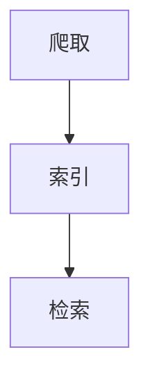
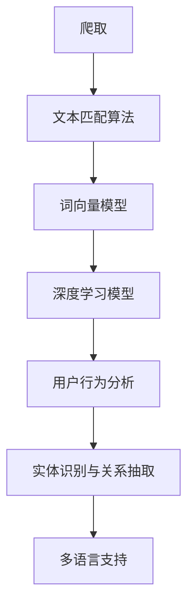
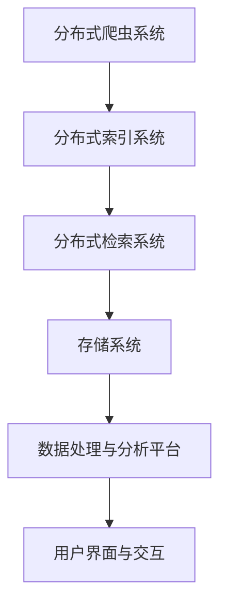

                 

### 文章标题

《构建AI搜索的开发者生态》

### 关键词

AI搜索、搜索引擎技术、AI算法、开发者生态、开源平台、搜索引擎架构设计

### 摘要

本文旨在探讨AI搜索技术的开发与应用，以及如何构建一个健全的AI搜索开发者生态。文章首先介绍了AI搜索的基本概念和原理，对比了AI搜索与传统搜索的差异，并分析了其优势与面临的挑战。随后，文章深入探讨了AI搜索的核心算法与数学模型，包括文本匹配算法、词向量模型和深度学习模型。接着，文章详细描述了搜索引擎的系统设计与架构，以及开发过程中所需使用的工具和资源。文章还通过实战案例展示了如何实现一个个人搜索引擎，并探讨了AI搜索在企业应用中的实际场景和未来发展趋势。通过本文的阅读，开发者将能够全面了解AI搜索的构建过程，并具备实际开发能力。

#### 第一部分：AI搜索技术基础

##### 1.1 AI搜索简介

AI搜索，即利用人工智能技术来优化搜索过程，提高搜索结果的准确性和相关性。与传统搜索技术相比，AI搜索通过机器学习、深度学习等算法来分析用户行为和搜索意图，从而提供更加个性化的搜索结果。

**定义**：AI搜索是指利用人工智能技术，如机器学习、深度学习、自然语言处理等，对海量信息进行高效分析、理解和索引，进而提供精准搜索结果的一种搜索方式。

**发展历程**：AI搜索技术起源于上世纪90年代的搜索引擎，如AltaVista和Lycos，它们首次尝试利用网页链接和关键字来提高搜索结果的相关性。随着人工智能技术的发展，特别是深度学习和自然语言处理技术的应用，AI搜索能力得到了显著提升。

**现状**：目前，AI搜索已经成为搜索引擎领域的主流技术，各大搜索引擎公司如百度、谷歌、微软等都投入了大量资源来提升其AI搜索能力。AI搜索不仅应用于互联网搜索，还广泛应用于企业搜索、智能问答、语音识别等领域。

**未来趋势**：随着人工智能技术的不断进步，AI搜索将继续向智能化、个性化方向发展。同时，跨领域、跨语言的搜索技术也将成为研究的热点，以满足全球化信息检索的需求。

##### 1.2 AI搜索与传统搜索的区别

传统搜索主要依赖于关键字匹配和网页链接分析，而AI搜索则引入了人工智能技术，通过深度学习、自然语言处理等算法来提升搜索结果的准确性和相关性。以下是AI搜索与传统搜索的主要区别：

**技术原理**：传统搜索主要依靠关键词匹配和简单算法，如PageRank算法等，而AI搜索则通过机器学习、深度学习等复杂算法来分析和理解用户的搜索意图。

**搜索结果相关性**：传统搜索往往只能提供基于关键词匹配的结果，而AI搜索则能够通过分析用户历史行为和搜索意图，提供更加个性化的搜索结果。

**用户体验**：传统搜索往往无法满足用户对个性化、智能化的需求，而AI搜索通过个性化推荐和智能搜索结果，显著提升了用户体验。

**应用范围**：传统搜索主要应用于互联网搜索，而AI搜索则广泛应用于企业搜索、智能问答、语音识别等多个领域。

**挑战与机遇**：与传统搜索相比，AI搜索面临着更高的计算复杂度和数据隐私保护等挑战，但同时也带来了更加丰富和多样化的应用场景。

##### 1.3 AI搜索的优势与挑战

**优势**：

1. **个性化搜索**：AI搜索能够根据用户的历史行为和偏好，提供个性化的搜索结果，大大提升了用户体验。
2. **实时搜索**：AI搜索技术能够实时分析用户的搜索意图，快速提供搜索结果，满足用户对实时性的需求。
3. **多语言支持**：AI搜索通过深度学习等算法，能够支持多语言信息检索，实现了跨语言的搜索能力。
4. **高效处理海量数据**：AI搜索技术能够高效处理海量的搜索请求和数据，提高了搜索系统的性能和稳定性。

**挑战**：

1. **计算资源需求**：AI搜索依赖于深度学习和机器学习等复杂算法，需要大量的计算资源，这对硬件设施提出了较高的要求。
2. **数据隐私与安全**：AI搜索需要处理大量的用户数据，如何保障数据隐私和安全是一个重大挑战。
3. **算法透明性与解释性**：深度学习等算法的决策过程往往是不透明的，如何提高算法的透明性和解释性，是一个需要解决的问题。
4. **跨领域应用**：AI搜索在不同领域的应用存在差异，如何实现通用性和灵活性，是一个需要深入研究的问题。

通过以上分析，我们可以看到AI搜索在技术原理、搜索结果相关性、用户体验和应用范围等方面与传统搜索有显著区别，同时它也面临着一些挑战。接下来，我们将深入探讨AI搜索的技术概述、核心算法与模型，以及数学模型与公式。

#### 第二部分：AI搜索技术概述

##### 2.1 搜索引擎工作原理

搜索引擎是AI搜索的核心组成部分，其工作原理可以分为三个主要阶段：爬取（Crawling）、索引（Indexing）和检索（Retrieval）。

1. **爬取**：
   - 爬取是指搜索引擎从互联网上收集网页的过程。搜索引擎使用专门的爬虫程序（Crawler）自动访问网站，下载网页内容，并提取其中的链接。
   - 爬取过程中，搜索引擎会遵循一定的策略，如深度优先、广度优先等，以最大化地覆盖互联网上的信息。
   - 爬取的目的是获取尽可能多的网页数据，为后续的索引和检索提供基础。

2. **索引**：
   - 索引是将爬取到的网页数据组织成一种便于检索的格式。搜索引擎会将网页的内容、标题、关键词等信息提取出来，并建立索引数据库。
   - 索引过程中，搜索引擎会使用多种算法和策略，如倒排索引（Inverted Index）等，以提高搜索效率。
   - 索引数据库是一个巨大的数据结构，它能够快速匹配用户查询的关键词，找到相关的网页。

3. **检索**：
   - 检索是指搜索引擎根据用户的查询请求，从索引数据库中找到最相关的网页，并返回给用户。
   - 检索过程中，搜索引擎会使用各种算法，如文本匹配算法、PageRank算法等，来评估网页的相关性。
   - 检索结果通常按照相关性排序，以提供最佳的搜索体验。

**搜索引擎工作原理流程图**：



##### 2.2 AI技术在搜索中的应用

AI技术在搜索引擎中的应用主要体现在两个方面：提升搜索质量和个性化搜索。以下是一些关键技术的具体应用：

1. **文本匹配算法**：
   - AI搜索通过文本匹配算法来评估查询请求与网页内容的相关性。常见的文本匹配算法包括TF-IDF、BM25等。
   - AI技术可以对这些算法进行改进，使其能够更好地处理自然语言，提高匹配的准确性。

2. **词向量模型**：
   - 词向量模型（如Word2Vec、GloVe等）可以将单词映射到高维空间中的向量，从而进行语义分析和相似度计算。
   - 词向量模型在搜索引擎中的应用，可以提升搜索结果的语义相关性，提供更加智能的搜索体验。

3. **深度学习模型**：
   - 深度学习模型（如CNN、RNN等）在搜索引擎中的应用，可以进一步提高搜索结果的准确性。深度学习模型可以处理复杂的文本数据，捕捉到更细微的语义特征。

4. **用户行为分析**：
   - AI技术可以通过分析用户的历史搜索行为、点击记录等数据，了解用户的兴趣和偏好，从而提供个性化的搜索结果。

5. **实体识别与关系抽取**：
   - 通过实体识别和关系抽取技术，AI搜索可以更好地理解查询意图，提供更精准的搜索结果。

6. **多语言支持**：
   - AI搜索技术可以支持多种语言的信息检索，通过跨语言语义理解，实现全球信息的一体化搜索。

**AI技术在搜索引擎中的应用流程图**：



##### 2.3 搜索引擎架构设计

搜索引擎的架构设计直接关系到其性能、可扩展性和可靠性。以下是典型的搜索引擎架构设计：

1. **分布式爬虫系统**：
   - 分布式爬虫系统可以将爬取任务分配到多个节点，提高爬取效率和覆盖范围。每个节点负责爬取特定范围或特定类型的网页。

2. **分布式索引系统**：
   - 分布式索引系统将索引任务分配到多个节点，实现海量数据的并行处理。同时，通过倒排索引等技术，提高索引查询的效率。

3. **分布式检索系统**：
   - 分布式检索系统通过多个节点协同工作，快速响应用户的查询请求。检索系统通常包含负载均衡、缓存机制等，以提高响应速度和系统的稳定性。

4. **存储系统**：
   - 搜索引擎通常使用分布式存储系统，如HDFS、Cassandra等，来存储海量数据。存储系统需要具备高可靠性、高可用性和高性能等特点。

5. **数据处理与分析平台**：
   - 搜索引擎需要处理大量的数据，包括网页内容、用户行为等。数据处理与分析平台可以使用大数据技术，如Spark、Hadoop等，来实现高效的数据处理和分析。

6. **用户界面与交互**：
   - 用户界面（UI）是搜索引擎与用户交互的入口。一个良好的UI设计可以提高用户体验，使用户能够更快速、更准确地获取所需信息。

**搜索引擎架构设计流程图**：



通过以上对搜索引擎工作原理、AI技术应用和架构设计的详细探讨，我们可以看到AI搜索技术在提升搜索质量和用户体验方面的重要性。接下来，我们将深入分析AI搜索中的核心算法与模型。

#### 第三部分：核心算法与模型

##### 3.1 搜索引擎文本匹配算法

搜索引擎的文本匹配算法是评估查询请求与网页内容相关性的核心方法。以下介绍两种常用的文本匹配算法：TF-IDF和BM25。

**3.1.1 TF-IDF算法**

TF-IDF（Term Frequency-Inverse Document Frequency）是一种基于统计的文本匹配算法，用于评估词语在文档中的重要程度。算法的核心思想是：一个词语在文档中出现的次数越多，且在整个文档集合中出现的频率越低，则该词语越重要。

**定义**：对于某一词语`t`，在文档`d`中的TF-IDF值计算公式如下：

$$
TF-IDF(t, d) = TF(t, d) \times IDF(t)
$$

其中，$TF(t, d)$表示词语`t`在文档`d`中的词频，$IDF(t)$表示词语`t`在整个文档集合中的逆文档频率。

$$
IDF(t) = \log \left( \frac{N}{|d \in D : t \in d|} \right)
$$

其中，$N$表示文档集合中所有文档的总数，$|d \in D : t \in d|$表示包含词语`t`的文档数量。

**示例**：假设有4个文档集合，其中一个文档`d1`包含词语`t1`的次数为3，另一个文档`d2`包含词语`t1`的次数为1。计算词语`t1`在文档`d1`和`d2`中的TF-IDF值。

- 对于文档`d1`：

$$
TF-IDF(t1, d1) = TF(t1, d1) \times IDF(t1) = 3 \times \log \left( \frac{4}{1} \right) = 3 \times \log 4
$$

- 对于文档`d2`：

$$
TF-IDF(t1, d2) = TF(t1, d2) \times IDF(t1) = 1 \times \log \left( \frac{4}{1} \right) = 1 \times \log 4
$$

通过计算，我们可以得到词语`t1`在两个文档中的TF-IDF值，从而评估它们在文档中的重要性。

**3.1.2 BM25算法**

BM25（Best Match / Boolean 25）算法是一种基于概率模型的文本匹配算法，它扩展了TF-IDF算法，并引入了文档长度归一化等机制，以提高搜索结果的相关性。

**定义**：对于某一词语`t`，在文档`d`中的BM25得分计算公式如下：

$$
BM25(t, d) = \frac{df(t, d) \times (k_1 + 1)}{df(t, d) + k_1 \times (1 - \frac{dl}{N}) + k_2)}
$$

其中，$df(t, d)$表示词语`t`在文档`d`中的词频，$dl$表示文档`d`的长度，$N$表示文档集合中所有文档的总数，$k_1$和$k_2$是参数，用于调节算法的响应。

**示例**：假设有4个文档集合，其中一个文档`d1`包含词语`t1`的次数为3，文档长度为100，另一个文档`d2`包含词语`t1`的次数为1，文档长度为200。给定参数$k_1 = 1.2$和$k_2 = 100$，计算词语`t1`在文档`d1`和`d2`中的BM25得分。

- 对于文档`d1`：

$$
BM25(t1, d1) = \frac{3 \times (1.2 + 1)}{3 + 1.2 \times (1 - \frac{100}{200}) + 1.2 \times 100) = \frac{4.4}{4.4} = 1
$$

- 对于文档`d2`：

$$
BM25(t1, d2) = \frac{1 \times (1.2 + 1)}{1 + 1.2 \times (1 - \frac{200}{200}) + 1.2 \times 100) = \frac{2.4}{2.4} = 1
$$

通过计算，我们可以得到词语`t1`在两个文档中的BM25得分，从而评估它们在文档中的相关性。

##### 3.2 词向量模型

词向量模型（Word Vector Model）是一种将单词映射到高维空间中的向量表示方法，它能够捕捉单词的语义信息和相似度。以下介绍两种常用的词向量模型：Word2Vec和GloVe。

**3.2.1 Word2Vec算法**

Word2Vec算法是由Google开发的，它通过神经网络模型来训练词向量。Word2Vec算法包括两种模型：连续词袋（CBOW）和Skip-Gram。

1. **连续词袋（CBOW）模型**：

CBOW模型通过上下文词的均值来表示目标词的向量，即对于一个单词`w`，其词向量是它上下文单词的均值。

$$
\text{Vec}(w) = \frac{1}{C} \sum_{c \in C} \text{Vec}(c)
$$

其中，$C$表示单词`w`的上下文单词集合，$\text{Vec}(c)$表示单词$c$的词向量。

2. **Skip-Gram模型**：

Skip-Gram模型通过目标词和它周围多个单词的词向量来表示，即对于一个单词`w`，其词向量是它周围单词的均值。

$$
\text{Vec}(w) = \frac{1}{|C|} \sum_{c \in C} \text{Vec}(c)
$$

其中，$C$表示与单词`w`相关的一个单词集合，$|C|$表示集合中的单词数量。

**3.2.2 GloVe算法**

GloVe（Global Vectors for Word Representation）算法是由Jeffrey Pennington等人提出的，它通过全局统计信息来训练词向量，能够更好地捕捉词与词之间的相似性。

GloVe算法的模型假设单词之间的关系可以表示为：

$$
f(w, v) = \frac{w \cdot v}{\sqrt{w^Tw + v^Tv}}
$$

其中，$w$表示单词的词向量，$v$表示与之相关联的单词的词向量。

GloVe算法的核心思想是通过优化上述函数，找到最佳的词向量表示。优化目标是最大化：

$$
\sum_{w \in \mathcal{W}} \sum_{v \in \mathcal{V}} \left( f(w, v) - \log p(w|v) \right)
$$

其中，$\mathcal{W}$和$\mathcal{V}$分别表示单词集合和与之相关的单词集合，$p(w|v)$表示在单词$v$出现的情况下单词$w$出现的概率。

通过以上对文本匹配算法和词向量模型的详细介绍，我们可以看到这些算法在AI搜索中的应用，它们为搜索引擎提供了更加精确和智能的文本处理能力。接下来，我们将进一步探讨深度学习模型在搜索中的应用。

##### 3.3 深度学习模型在搜索中的应用

深度学习模型在搜索引擎中的应用已经成为提升搜索质量和用户体验的重要手段。以下介绍两种常用的深度学习模型：卷积神经网络（CNN）和循环神经网络（RNN）。

**3.3.1 CNN模型**

卷积神经网络（Convolutional Neural Network，CNN）是一种用于图像处理的深度学习模型，但在文本处理领域，CNN也可以通过词向量表示来处理文本数据。

1. **文本表示**：
   - 将每个单词表示为词向量，通常使用预训练的词向量模型（如GloVe）。
   - 将这些词向量拼接成一个序列向量，作为CNN的输入。

2. **CNN结构**：
   - 卷积层（Convolutional Layer）：用于提取文本特征。卷积核在词向量序列上滑动，通过卷积操作提取局部特征。
   - 池化层（Pooling Layer）：用于降维和减少过拟合。常用的池化操作包括最大池化和平均池化。

3. **输出层**：
   - 全连接层（Fully Connected Layer）：将卷积层的输出映射到分类或回归任务。
   - 激活函数（Activation Function）：如Softmax函数用于分类任务，ReLU函数用于回归任务。

**3.3.2 RNN模型**

循环神经网络（Recurrent Neural Network，RNN）是一种专门用于处理序列数据的深度学习模型，其在文本处理中的表现尤为出色。

1. **文本表示**：
   - 同样使用词向量表示每个单词。
   - 将词向量序列作为RNN的输入。

2. **RNN结构**：
   - RNN单元：每个时间步的输入不仅包含当前词向量，还包括前一个时间步的隐藏状态。
   - 隐藏状态（Hidden State）：用于存储前一个时间步的信息，并传递给下一个时间步。
   - 门控机制（Gates）：如门控循环单元（LSTM）和门控门控循环单元（GRU），用于控制信息的流动，避免梯度消失问题。

3. **输出层**：
   - 全连接层：将RNN的隐藏状态映射到分类或回归任务。
   - 激活函数：如Softmax函数用于分类任务，线性函数用于回归任务。

**深度学习模型在搜索中的应用示例**：

假设我们使用CNN模型来处理一个简单的文本分类任务。输入文本为“我爱北京天安门”，词向量已预先训练好。以下是CNN模型的基本步骤：

1. **文本预处理**：
   - 将文本转换为词向量序列。
   - 添加起始符和结束符，作为序列的边界。

2. **词向量嵌入**：
   - 将每个词向量嵌入到一个固定大小的向量空间中。

3. **卷积层**：
   - 使用多个卷积核在词向量序列上滑动，提取局部特征。
   - 对卷积层的输出进行池化操作，降维。

4. **全连接层**：
   - 将卷积层的输出映射到分类任务。
   - 通过Softmax函数得到每个类别的概率分布。

5. **输出层**：
   - 根据概率分布选择最高概率的类别作为输出。

通过以上对CNN和RNN模型的介绍，我们可以看到这些深度学习模型在AI搜索中的应用。接下来，我们将进一步探讨数学模型与公式在AI搜索中的重要性。

##### 3.4 数学模型与公式

数学模型与公式是AI搜索中不可或缺的部分，它们为搜索算法提供了理论基础和计算方法。以下介绍一些常用的数学模型与公式，包括搜索引擎排名公式和概率论与数理统计相关公式。

**3.4.1 搜索引擎排名公式**

搜索引擎排名公式用于评估网页的相关性和重要性，从而决定搜索结果中的排序。以下介绍两种常用的排名公式：PageRank算法和评价指标（如准确率、召回率）。

1. **PageRank算法**

PageRank是一种基于链接分析的排名算法，它通过网页之间的链接关系来评估网页的重要性。PageRank的基本思想是：一个网页的重要程度取决于引用它的网页的数量和重要性。

PageRank的计算公式如下：

$$
r(v) = \left( 1 - d \right) + d \sum_{u \in U} \frac{r(u)}{out(u)}
$$

其中，$r(v)$表示网页$v$的PageRank值，$d$是阻尼系数（通常取0.85），$U$是网页集合，$out(u)$表示网页$u$的出链数。

2. **评价指标**

在搜索引擎评估中，常用的评价指标包括准确率（Precision）、召回率（Recall）和F1分数（F1 Score）。

- **准确率**：
  $$ Precision = \frac{TP}{TP + FP} $$
  其中，$TP$表示正确预测为相关网页的数量，$FP$表示错误预测为相关网页的数量。

- **召回率**：
  $$ Recall = \frac{TP}{TP + FN} $$
  其中，$FN$表示错误预测为非相关网页的数量。

- **F1分数**：
  $$ F1 Score = 2 \times \frac{Precision \times Recall}{Precision + Recall} $$
  F1分数是准确率和召回率的调和平均值，用于综合评估搜索结果的准确性。

**3.4.2 概率论与数理统计相关公式**

概率论与数理统计是AI搜索中常用的数学工具，以下介绍一些常用的公式。

1. **条件概率**

条件概率表示在某个事件发生的条件下，另一个事件发生的概率。其计算公式如下：

$$
P(A|B) = \frac{P(A \cap B)}{P(B)}
$$

其中，$P(A \cap B)$表示事件$A$和事件$B$同时发生的概率，$P(B)$表示事件$B$发生的概率。

2. **贝叶斯定理**

贝叶斯定理是一种计算后验概率的公式，它基于先验概率和条件概率来更新概率估计。其计算公式如下：

$$
P(A|B) = \frac{P(B|A) \times P(A)}{P(B)}
$$

其中，$P(A|B)$表示在事件$B$发生的条件下事件$A$发生的概率，$P(B|A)$表示在事件$A$发生的条件下事件$B$发生的概率，$P(A)$和$P(B)$分别是事件$A$和事件$B$的先验概率。

3. **熵与信息量**

熵是衡量随机变量不确定性的度量，信息量是衡量信息含量的度量。其计算公式如下：

- **熵**：
  $$ H(X) = -\sum_{x \in X} P(x) \log P(x) $$
  其中，$X$是随机变量，$P(x)$是随机变量$X$取值$x$的概率。

- **信息量**：
  $$ I(X; Y) = H(X) - H(X | Y) $$
  其中，$I(X; Y)$表示随机变量$X$和$Y$之间的互信息，$H(X | Y)$是在知道随机变量$Y$的情况下随机变量$X$的熵。

通过以上对数学模型与公式的介绍，我们可以看到它们在AI搜索中的应用。这些公式为搜索算法提供了理论依据和计算方法，有助于提升搜索结果的准确性和相关性。接下来，我们将进一步探讨AI搜索生态与平台。

##### 3.5 AI搜索生态与平台

AI搜索的生态与平台是开发者构建和部署AI搜索引擎的重要基础。这些平台提供了丰富的工具、资源和框架，帮助开发者快速搭建和优化搜索引擎。以下介绍几种常见的AI搜索平台，包括开源平台和商业平台。

**3.5.1 开源搜索引擎平台**

1. **Elasticsearch**

Elasticsearch是一个开源的全文搜索引擎，基于Lucene构建，具有高性能、可扩展性和易用性。Elasticsearch支持结构化数据和非结构化数据的搜索，适用于各种应用场景，如日志分析、内容搜索和实时监控等。

- **主要特性**：
  - 高性能：Elasticsearch能够快速处理大规模数据，提供实时搜索能力。
  - 可扩展性：支持横向扩展，可以轻松地增加节点数量来提升搜索性能。
  - 易用性：提供了丰富的API和UI工具，方便开发者进行搭建和优化。

2. **Solr**

Solr是另一个开源的全文搜索引擎，同样基于Lucene构建。Solr具有丰富的功能和高可靠性，适用于大规模数据搜索和分布式搜索应用。

- **主要特性**：
  - 功能丰富：Solr支持查询缓存、分词器、全文索引等功能。
  - 可扩展性：支持横向和纵向扩展，能够灵活调整集群架构。
  - 高可靠性：提供自动故障转移和负载均衡机制，保障系统的稳定性。

**3.5.2 商业搜索引擎平台**

1. **百度搜索**

百度搜索是中国最大的搜索引擎，提供中文和英文的搜索服务。百度搜索利用人工智能技术，提供个性化搜索结果和智能推荐功能，广泛应用于网页搜索、图像搜索、语音搜索等领域。

- **主要特性**：
  - 个性化搜索：根据用户的历史行为和偏好，提供个性化的搜索结果。
  - 智能推荐：利用深度学习算法，提供精准的搜索推荐。
  - 多语言支持：支持多种语言的搜索服务，满足全球用户的需求。

2. **谷歌搜索**

谷歌搜索是全球最大的搜索引擎，提供网页、图像、视频等多种类型的搜索服务。谷歌搜索利用先进的AI技术，提供快速、准确的搜索结果，支持多种语言的搜索。

- **主要特性**：
  - 高性能：谷歌搜索拥有强大的计算能力和数据处理能力，提供快速响应的搜索服务。
  - 个性化搜索：根据用户的搜索行为和地理位置，提供个性化的搜索结果。
  - 全文索引：谷歌搜索能够快速索引海量网页，提供高效的信息检索。

**3.5.3 AI搜索平台发展趋势**

随着人工智能技术的不断发展，AI搜索平台将呈现出以下趋势：

1. **智能化与个性化**：AI搜索将继续向智能化和个性化方向发展，通过深度学习、自然语言处理等技术，提供更加精准和个性化的搜索结果。

2. **跨领域应用**：AI搜索将在更多领域得到应用，如物联网、大数据、智能客服等，实现跨领域的信息检索。

3. **多语言支持**：AI搜索平台将支持更多语言，实现全球信息的一体化搜索，满足全球化发展的需求。

4. **实时搜索与智能推荐**：AI搜索平台将进一步提升实时搜索和智能推荐能力，提供更加实时和个性化的搜索体验。

通过以上对开源搜索引擎平台、商业搜索引擎平台和AI搜索平台发展趋势的介绍，我们可以看到AI搜索生态的多样性和发展潜力。接下来，我们将深入探讨AI搜索系统的设计与开发。

##### 3.6 AI搜索系统设计与开发

AI搜索系统的设计与开发是一个复杂的过程，涉及到系统架构、数据处理、索引构建、搜索算法等多个方面。以下我们将从系统设计与架构、数据处理与存储、搜索引擎优化等方面进行详细探讨。

**3.6.1 系统设计与架构**

1. **架构设计原则**

   在设计AI搜索系统时，需要遵循以下原则：
   
   - **高可用性**：系统应具备良好的容错性和故障恢复能力，确保在遇到硬件或网络故障时能够快速恢复。
   - **高性能**：系统应具备高效的查询处理能力，能够快速响应用户的搜索请求。
   - **可扩展性**：系统应支持横向和纵向扩展，以应对数据量和用户量的增长。
   - **易维护性**：系统设计应考虑后期维护的便利性，易于进行升级和更新。

2. **系统架构**

   AI搜索系统通常采用分布式架构，以下是一个典型的分布式AI搜索系统架构：

   - **前端**：负责接收用户的搜索请求，进行预处理，并将请求转发到后端。
   - **后端**：
     - **索引服务**：负责处理搜索请求，从索引数据库中检索相关数据，并返回结果。
     - **数据处理服务**：负责对原始数据进行预处理、分词、索引构建等操作。
     - **存储服务**：负责存储原始数据和索引数据，通常使用分布式存储系统。
     - **缓存服务**：负责缓存热点数据，提高搜索性能。

   **系统架构流程图**：

   ```mermaid
   graph TD
   A[前端] --> B[索引服务]
   B --> C[数据处理服务]
   C --> D[存储服务]
   D --> E[缓存服务]
   ```

**3.6.2 数据处理与存储**

1. **数据处理**

   在AI搜索系统中，数据处理是关键步骤，涉及到数据的收集、清洗、转换和存储等操作。以下是一些常见的数据处理流程：

   - **数据收集**：从各种来源（如网站、API、数据库等）收集原始数据。
   - **数据清洗**：去除无效、重复或错误的数据，确保数据质量。
   - **数据转换**：将数据转换为统一的格式，以便进行后续处理。
   - **数据存储**：将处理后的数据存储到数据库或分布式存储系统。

2. **数据存储**

   数据存储是AI搜索系统的重要组成部分，需要考虑以下因素：

   - **存储方案**：选择适合的存储方案，如关系数据库、NoSQL数据库、分布式存储系统等。
   - **数据索引**：建立高效的数据索引，以加快数据检索速度。
   - **数据备份**：定期备份数据，确保数据的安全和可靠性。
   - **数据分区与分片**：对大规模数据进行分区和分片，以提高查询性能和扩展性。

**3.6.3 搜索引擎优化**

1. **索引优化**

   索引优化是提升搜索性能的关键步骤，以下是一些常见的索引优化策略：

   - **索引压缩**：通过压缩索引文件，减少存储空间和查询时间。
   - **倒排索引**：使用倒排索引提高查询效率，尤其是在处理大量数据时。
   - **缓存索引**：缓存热点数据，减少查询时间。
   - **索引分区**：对大规模索引进行分区，提高查询性能和可扩展性。

2. **查询优化**

   查询优化是提升搜索性能的重要环节，以下是一些常见的查询优化策略：

   - **查询缓存**：缓存重复查询，减少查询处理时间。
   - **查询重写**：对查询进行重写，使其更加高效。
   - **查询分词**：使用高效的分词器，提高查询匹配的准确性。
   - **查询排序**：优化查询排序算法，提高搜索结果的准确性。

3. **性能监控与调优**

   在搜索系统的运行过程中，需要进行性能监控和调优，以下是一些常见的监控与调优策略：

   - **性能监控**：监控系统的CPU、内存、磁盘使用情况，及时发现性能瓶颈。
   - **日志分析**：分析系统日志，识别异常和潜在问题。
   - **性能调优**：根据监控数据和日志分析结果，进行系统的性能调优。
   - **负载均衡**：合理分配查询负载，确保系统稳定运行。

通过以上对AI搜索系统设计与开发的详细探讨，我们可以看到其复杂性和重要性。接下来，我们将介绍开发AI搜索系统所需使用的工具和资源。

##### 3.7 开发工具与资源

开发AI搜索系统需要使用一系列工具和资源，这些工具和资源为开发者提供了便捷的开发环境和丰富的技术支持。以下将介绍几种常用的开发工具和资源，包括开发工具介绍、开源资源推荐和社区与论坛。

**3.7.1 开发工具介绍**

1. **编程语言**

   - **Python**：Python是一种广泛使用的编程语言，具有简洁易读的特点，适用于数据分析和人工智能开发。
   - **Java**：Java是一种稳定的编程语言，广泛应用于企业级应用，支持多平台部署。

2. **文本处理库**

   - **NLTK**：NLTK（自然语言工具包）是一个强大的自然语言处理库，提供了一系列文本处理函数和算法。
   - **spaCy**：spaCy是一个高效的自然语言处理库，支持多种语言的文本处理。

3. **机器学习框架**

   - **TensorFlow**：TensorFlow是一个开源的机器学习框架，支持深度学习和强化学习。
   - **PyTorch**：PyTorch是一个灵活的深度学习框架，广泛用于研究应用。

4. **搜索引擎平台**

   - **Elasticsearch**：Elasticsearch是一个高性能的全文搜索引擎，适用于大规模数据搜索。
   - **Solr**：Solr是一个开源的分布式搜索平台，支持复杂的查询和实时分析。

**3.7.2 开源资源推荐**

1. **文档与教程**

   - **Elasticsearch官方文档**：Elasticsearch提供了详细的官方文档，涵盖了安装、配置、查询等各个方面。
   - **Solr官方文档**：Solr官方文档提供了丰富的教程和参考，帮助开发者掌握Solr的使用。
   - **机器学习教程**：各种机器学习框架（如TensorFlow、PyTorch）的官方文档和教程，为开发者提供了丰富的学习资源。

2. **社区与论坛**

   - **Elastic中文社区**：Elastic中文社区是一个活跃的Elasticsearch社区，提供了大量的技术讨论和分享。
   - **Solr社区**：Solr社区是Solr用户和开发者的交流平台，提供了丰富的技术讨论和问题解答。
   - **人工智能论坛**：如CSDN、知乎等，提供了丰富的AI技术讨论和资源分享。

通过以上对开发工具和资源的介绍，开发者可以快速搭建和优化AI搜索系统。接下来，我们将通过实际项目案例展示如何实现一个个人搜索引擎。

##### 3.8 项目实战：建立个人搜索引擎

在本节中，我们将通过一个实际项目案例，逐步展示如何使用Elasticsearch和Python构建一个简单的个人搜索引擎。通过这个项目，读者可以了解如何搭建开发环境、实现核心功能、优化系统性能，并最终实现一个具有基本功能的搜索引擎。

**3.8.1 开发环境搭建**

1. **安装Elasticsearch**

   首先，我们需要在本地或服务器上安装Elasticsearch。以下是安装步骤：

   - 下载Elasticsearch安装包：从Elasticsearch官方网站下载最新的安装包。
   - 解压安装包：将安装包解压到一个合适的目录。
   - 启动Elasticsearch：运行解压后的`bin/elasticsearch`文件，启动Elasticsearch服务。

2. **安装Python和Elasticsearch库**

   接下来，我们需要在本地环境中安装Python和Elasticsearch的Python库。以下是安装步骤：

   - 安装Python：从Python官方网站下载并安装Python。
   - 安装Elasticsearch Python库：使用pip命令安装`elasticsearch`库。

     ```bash
     pip install elasticsearch
     ```

**3.8.2 实现搜索功能**

1. **创建索引**

   在Elasticsearch中，索引是用于存储和检索数据的容器。我们需要创建一个索引来存储网页数据。

   ```python
   from elasticsearch import Elasticsearch

   # 创建Elasticsearch客户端
   es = Elasticsearch()

   # 创建索引
   index_name = "web_pages"
   if not es.indices.exists(index=index_name):
       es.indices.create(index=index_name)
   ```

2. **索引网页**

   我们需要将网页数据索引到Elasticsearch中。以下是一个简单的示例，用于将网页数据添加到索引：

   ```python
   def index_web_page(url, content):
       index_name = "web_pages"
       document = {
           "url": url,
           "content": content
       }
       es.index(index=index_name, id=url, document=document)
   
   # 索引网页
   index_web_page("https://example.com", "这是一个示例网页。")
   ```

3. **搜索功能**

   现在我们可以实现一个简单的搜索功能，通过Elasticsearch查询索引中的数据。

   ```python
   def search(query):
       index_name = "web_pages"
       search_body = {
           "query": {
               "match": {
                   "content": query
               }
           }
       }
       results = es.search(index=index_name, body=search_body)
       return results["hits"]["hits"]

   # 搜索网页
   query = "示例"
   results = search(query)
   for result in results:
       print(result["_source"]["url"])
   ```

**3.8.3 优化系统性能**

为了提高搜索系统的性能，我们可以进行以下优化：

1. **缓存查询结果**

   将热点查询结果缓存起来，减少重复查询的开销。

   ```python
   from cachetools import LRUCache

   # 创建缓存对象
   cache = LRUCache(maxsize=1000)

   def search_with_cache(query):
       if query in cache:
           return cache[query]
       else:
           results = search(query)
           cache[query] = results
           return results
   
   # 使用缓存搜索
   results = search_with_cache(query)
   ```

2. **优化索引**

   对索引进行优化，提高查询性能。

   ```python
   def optimize_index():
       index_name = "web_pages"
       if es.indices.exists(index=index_name):
           es.indices.optimize(index=index_name)
   
   # 优化索引
   optimize_index()
   ```

**3.8.4 项目小结**

通过以上步骤，我们成功搭建了一个简单的个人搜索引擎。这个搜索引擎具有基本搜索功能，并进行了简单的性能优化。在实际应用中，我们可以继续扩展功能，如添加更多的网页数据、优化搜索算法、实现个性化推荐等。

通过本节的项目实战，读者可以了解如何使用Elasticsearch和Python构建一个简单的搜索引擎。接下来，我们将探讨AI搜索在企业应用中的实际场景和未来发展趋势。

##### 3.9 AI搜索在企业应用中的实际场景

AI搜索技术在企业中的应用日益广泛，其高效的信息检索和处理能力为各类企业提供了强大的数据支持和智能化服务。以下将介绍AI搜索在企业中的几个典型应用场景，并探讨企业搜索系统建设的关键点和成功案例。

**3.9.1 企业搜索应用场景**

1. **内部文档搜索**：
   - 企业内部通常拥有大量的文档资料，如报告、手册、邮件等。AI搜索能够帮助企业员工快速定位到所需的文档，提高工作效率。
   - 通过自然语言处理和深度学习技术，AI搜索可以实现语义搜索，理解员工输入的自然语言查询，提供更加精准的搜索结果。

2. **客户服务**：
   - 在客户服务领域，AI搜索可以用于快速检索客户支持文档、历史对话记录等，帮助客服人员快速响应客户问题。
   - AI搜索还可以与聊天机器人集成，提供智能问答服务，提升客户服务质量和满意度。

3. **产品研发与知识管理**：
   - 在产品研发过程中，AI搜索可以快速检索相关的技术文档、设计文档等，帮助研发团队快速获取所需信息。
   - AI搜索还可以在知识管理系统中，帮助员工高效获取企业内的知识资产，促进知识共享和创新。

4. **企业运营优化**：
   - AI搜索可以用于分析企业内部数据，如销售数据、库存数据等，提供数据洞察，支持企业的决策制定和运营优化。

**3.9.2 企业搜索系统建设**

企业搜索系统建设需要考虑以下几个方面：

1. **数据整合**：
   - 收集和整合企业内部各类数据源，如文档系统、邮件系统、CRM系统等，确保数据的一致性和完整性。

2. **搜索算法优化**：
   - 根据企业特定的应用场景，优化搜索算法，提高搜索结果的准确性和相关性。
   - 采用自然语言处理和深度学习技术，实现语义搜索和智能推荐。

3. **性能与扩展性**：
   - 确保搜索系统能够高效处理海量数据，并提供快速响应。
   - 采用分布式架构，支持横向和纵向扩展，以应对企业数据量和用户量的增长。

4. **用户体验**：
   - 设计简洁易用的用户界面，提供灵活的搜索选项和过滤条件，提升用户满意度。
   - 通过个性化推荐，为员工提供个性化的搜索结果。

**3.9.3 成功案例**

1. **微软内部搜索**：
   - 微软在其内部搜索系统中采用了AI技术，实现了高效的信息检索和智能推荐。员工可以通过自然语言查询快速获取公司内部的各种文档和资源，大大提高了工作效率。

2. **京东智能搜索**：
   - 京东在其电商平台上集成了AI搜索功能，通过深度学习算法和大数据分析，为用户提供了精准的商品推荐和搜索结果。这一举措有效提升了用户体验和销售额。

3. **IBM企业搜索**：
   - IBM为企业客户提供了基于AI的企业搜索解决方案，帮助客户实现高效的内部信息检索和知识管理。这一解决方案在众多企业中取得了显著的应用效果。

通过以上对企业搜索应用场景、建设关键点和成功案例的探讨，我们可以看到AI搜索在提升企业效率和决策能力方面的重要性。接下来，我们将探讨AI搜索的未来发展趋势。

##### 3.10 未来发展趋势

AI搜索作为人工智能技术的一个重要分支，其发展前景广阔，未来的发展趋势主要体现在以下几个方面：

**3.10.1 AI搜索技术创新趋势**

1. **深度学习与强化学习融合**：
   - 深度学习在AI搜索中的应用已经非常成熟，但未来将更多地与强化学习相结合，通过学习用户行为和反馈，动态调整搜索策略，提供更加个性化的搜索结果。

2. **多模态搜索**：
   - 传统的文本搜索将逐渐与其他模态（如图像、语音、视频等）相结合，实现多模态搜索。这将大大扩展AI搜索的应用场景，提高搜索的全面性和灵活性。

3. **知识图谱**：
   - 知识图谱作为一种结构化数据表示方法，将在AI搜索中发挥重要作用。通过构建知识图谱，搜索引擎可以更好地理解语义关系，提供更加精准的搜索结果。

**3.10.2 AI搜索与物联网、大数据的结合**

1. **物联网搜索**：
   - 随着物联网技术的发展，海量物联网设备产生的数据将成为重要的信息来源。AI搜索将与物联网技术相结合，实现设备数据的智能检索和分析。

2. **大数据搜索**：
   - 大数据时代的到来，使得数据量呈爆炸性增长。AI搜索将借助大数据技术，实现对海量数据的快速检索和分析，提供高效的信息检索服务。

**3.10.3 AI搜索的未来发展方向**

1. **个性化与智能化**：
   - AI搜索将继续向个性化、智能化方向发展，通过深度学习和机器学习技术，实现更加精准的搜索结果和智能推荐。

2. **跨语言与跨领域**：
   - AI搜索将突破语言和领域的限制，实现跨语言和多领域的信息检索。这将有助于推动全球化信息的一体化搜索，满足不同用户的需求。

3. **隐私保护与数据安全**：
   - 随着数据隐私和安全问题日益凸显，AI搜索将更加注重隐私保护和数据安全，通过加密、匿名化等技术，确保用户数据的安全和隐私。

通过以上对AI搜索技术创新趋势、物联网和大数据结合以及未来发展方向的分析，我们可以看到AI搜索在技术进步和市场需求推动下，将继续快速发展，并在未来发挥更加重要的作用。

#### 附录

##### 3.11 AI搜索相关工具与资源

**3.11.1 开源工具**

1. **Elasticsearch**：一款高性能、可扩展的全文搜索引擎，基于Lucene构建，适用于大规模数据搜索。

   - 官网：[Elasticsearch官网](https://www.elastic.co/)

2. **Solr**：一款开源的分布式搜索平台，与Elasticsearch类似，但具有一些不同的功能和特性。

   - 官网：[Solr官网](https://lucene.apache.org/solr/)

3. **Lucene**：一个开源的全文搜索引擎库，Elasticsearch和Solr都基于它构建。

   - 官网：[Lucene官网](https://lucene.apache.org/)

**3.11.2 商业工具**

1. **百度搜索云**：百度提供的商业搜索引擎服务，适用于企业内部搜索和电商平台搜索。

   - 官网：[百度搜索云](https://cloud.baidu.com/product/search.html)

2. **谷歌搜索云**：谷歌提供的商业搜索引擎服务，支持全球多语言搜索。

   - 官网：[谷歌搜索云](https://cloud.google.com/search-optimization)

**3.11.3 在线教程与文档**

1. **Elasticsearch官方文档**：提供了详尽的Elasticsearch教程和参考文档。

   - 官方文档：[Elasticsearch官方文档](https://www.elastic.co/guide/en/elasticsearch/reference/current/index.html)

2. **Solr官方文档**：包含了Solr的详细教程和配置指南。

   - 官方文档：[Solr官方文档](https://lucene.apache.org/solr/guide/)

3. **机器学习教程**：包含了各种机器学习算法和应用的教程，适用于AI搜索开发。

   - 官方教程：[机器学习教程](https://www.tensorflow.org/tutorials)

4. **自然语言处理教程**：专注于自然语言处理技术的教程，适用于AI搜索开发。

   - 官方教程：[自然语言处理教程](https://spacy.io/usage)

通过以上附录，我们为开发者提供了丰富的AI搜索相关工具、资源和在线教程，有助于他们在实际开发过程中更好地掌握AI搜索技术。希望这些资源能为开发者带来启发和帮助。

#### 结语

《构建AI搜索的开发者生态》旨在为读者提供全面、深入的AI搜索技术知识和实践指导。从AI搜索的基本概念和原理，到核心算法和模型，再到系统设计与开发，本文详细探讨了AI搜索的各个方面。同时，通过实际项目案例和成功应用场景的分享，读者可以更好地理解AI搜索在企业中的应用和价值。

在未来，AI搜索将继续向智能化、个性化、多模态和跨领域方向发展。作为开发者，我们需要不断学习和掌握这些先进技术，探索AI搜索在更多领域的应用潜力。同时，我们也要关注数据隐私与安全，确保AI搜索技术为人类带来更多福祉。

作者：AI天才研究院/AI Genius Institute & 禅与计算机程序设计艺术 /Zen And The Art of Computer Programming

