                 

## 《构建你自己的聊天机器人：入门指南》

### 关键词：聊天机器人，自然语言处理，对话系统，开发环境，架构设计，NLP任务

> 摘要：本文旨在为初学者提供一个系统性的指南，帮助构建自己的聊天机器人。从基础概念、核心组件到实际实现，本文将逐步介绍如何搭建一个完整的聊天机器人系统，并提供实用的优化策略和未来发展方向。

----------------------------------------------------------------

### 目录大纲

## 第一部分：了解聊天机器人

### 第1章：什么是聊天机器人？

#### 1.1 聊天机器人的定义

聊天机器人（Chatbot）是一种基于人工智能技术的应用程序，旨在模拟人类对话，通过自然语言交互为用户提供服务和解答问题。

#### 1.2 聊天机器人在现代生活中的应用

聊天机器人在多个领域得到了广泛应用，包括客服支持、在线咨询、信息检索和个性化推荐等。

### 第2章：聊天机器人的核心组件

#### 2.1 交互界面设计

交互界面是用户与聊天机器人交互的窗口，包括文本聊天、语音聊天和图形用户界面等。

#### 2.2 自然语言处理（NLP）

NLP是聊天机器人的核心组件，负责处理用户输入的自然语言文本，包括分词、词性标注、句法分析和语义理解等。

#### 2.3 对话管理系统（DM）

对话管理系统负责管理整个对话流程，包括用户意图识别、上下文维护和回答生成等。

----------------------------------------------------------------

### 第一部分：了解聊天机器人

#### 第1章：什么是聊天机器人？

**1.1 聊天机器人的定义**

聊天机器人（Chatbot）是一种基于人工智能技术的应用程序，旨在模拟人类对话，通过自然语言交互为用户提供服务和解答问题。它们可以在网站、社交媒体平台、移动应用程序等环境中与用户进行互动。

**核心概念与联系：**

- **自然语言处理（NLP）：** 聊天机器人通过NLP技术理解用户输入的自然语言文本。这包括文本的分词、词性标注、句法分析和语义理解等步骤。
- **对话管理系统（DM）：** 聊天机器人使用对话管理系统来管理整个对话流程。这包括理解用户意图、维护对话上下文和生成合适的回答。

**图 1.1：聊天机器人的核心组件关系图**

```mermaid
graph TB
A[用户] --> B[交互界面]
B --> C[自然语言处理(NLP)]
C --> D[对话管理系统(DM)]
D --> E[聊天机器人]
```

**1.2 聊天机器人在现代生活中的应用**

聊天机器人在多个领域得到了广泛应用，包括但不限于以下几个方面：

- **客服支持：** 聊天机器人可以自动处理客户查询，提供24/7的在线支持，减轻人工客服的负担。
- **在线咨询：** 医疗咨询、法律咨询和心理健康咨询等领域，聊天机器人可以为用户提供初步指导和信息。
- **信息检索：** 聊天机器人可以快速定位和提供相关信息，帮助用户解决常见问题。
- **个性化推荐：** 聊天机器人可以根据用户的历史行为和偏好，提供个性化的产品推荐和内容推荐。

**图 1.2：聊天机器人在现代生活中的应用场景**

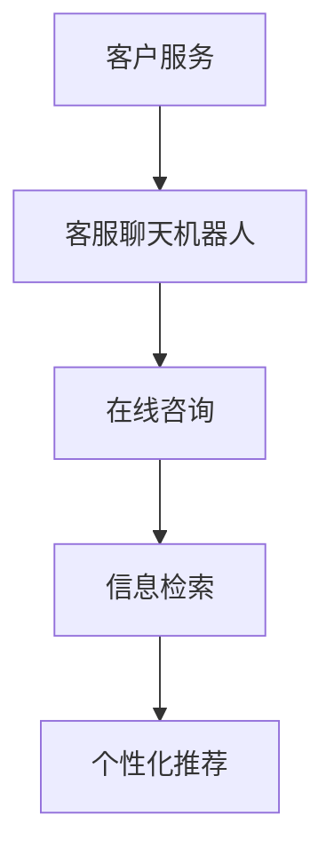

通过上述两个小节，我们了解了聊天机器人的定义和其在现代生活中的应用。接下来，我们将深入探讨聊天机器人的核心组件，包括交互界面设计、自然语言处理和对话管理系统。

----------------------------------------------------------------

### 第二部分：构建聊天机器人

#### 第3章：搭建开发环境

**3.1 选择开发平台**

选择合适的开发平台是构建聊天机器人的第一步。根据项目的需求和资源，可以选择以下几种开发平台：

- **开源平台：** 如TensorFlow、PyTorch等，适用于研究人员和开发者。
- **商业平台：** 如IBM Watson、Microsoft Bot Framework等，适用于企业级应用。

**3.2 安装必要的工具和库**

在开发环境中安装必要的工具和库是下一步。以下是一些常用的工具和库：

- **Python：** 作为主要的编程语言。
- **NLP库：** 如NLTK、spaCy等，用于自然语言处理。
- **Web框架：** 如Flask、Django等，用于构建交互界面。

**3.3 开发环境配置**

配置开发环境包括安装Python、设置虚拟环境、安装必要的库和依赖等。以下是一个简单的配置步骤：

1. 安装Python（版本3.8以上）。
2. 设置虚拟环境。
3. 安装NLP库（例如：`pip install spacy`）。
4. 安装Web框架（例如：`pip install flask`）。

**图 3.1：开发环境配置流程图**

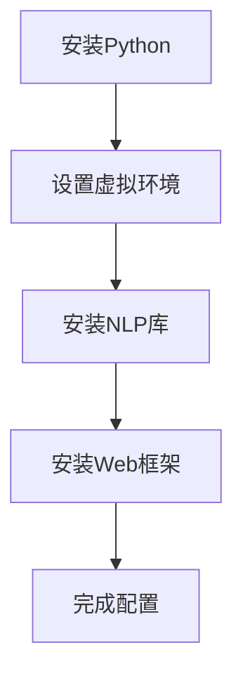

通过上述步骤，我们成功搭建了开发环境，为接下来的聊天机器人构建工作打下了基础。在下一章中，我们将探讨如何设计聊天机器人的架构。

----------------------------------------------------------------

### 第二部分：构建聊天机器人

#### 第4章：设计聊天机器人架构

**4.1 确定聊天机器人的功能需求**

在设计聊天机器人的架构之前，我们需要明确其功能需求。这包括：

- **基本功能：** 如文本输入、语音输入、文本输出、语音输出等。
- **高级功能：** 如多轮对话、情感分析、个性化推荐等。

**4.2 设计聊天机器人的基本架构**

聊天机器人的基本架构通常包括以下几个核心组件：

- **交互界面：** 负责接收用户输入和展示聊天机器人的回答。
- **自然语言处理（NLP）：** 负责处理用户输入的文本，提取语义信息。
- **对话管理系统（DM）：** 负责管理整个对话流程，包括意图识别、上下文维护和回答生成。
- **后端服务：** 负责处理业务逻辑和数据存储。

**图 4.1：聊天机器人的基本架构**

```mermaid
graph TB
A[交互界面] --> B[自然语言处理(NLP)]
B --> C[对话管理系统(DM)]
C --> D[后端服务]
D --> E[数据存储]
```

**4.3 核心组件之间的关系**

核心组件之间的关系是构建高效聊天机器人的关键。以下是它们之间的关系：

- **交互界面与NLP：** 交互界面接收用户输入并将其传递给NLP模块进行处理。
- **NLP与DM：** NLP模块提取用户输入的语义信息，并将其传递给DM模块。
- **DM与后端服务：** DM模块使用后端服务中的数据来生成回答，并存储对话上下文。
- **后端服务与数据存储：** 后端服务与数据存储之间的交互负责维护聊天机器人所需的数据。

**图 4.2：核心组件之间的关系**

```mermaid
graph TB
A[交互界面] --> B[自然语言处理(NLP)]
B --> C[对话管理系统(DM)]
C --> D[后端服务]
D --> E[数据存储]
D --> F[后端服务]
```

通过上述步骤，我们成功地设计了聊天机器人的架构。在下一章中，我们将探讨如何实现自然语言处理，这是构建聊天机器人的关键步骤之一。

----------------------------------------------------------------

### 第二部分：构建聊天机器人

#### 第5章：实现自然语言处理

**5.1 基本NLP任务**

自然语言处理（NLP）是聊天机器人的核心组件之一，负责理解和生成自然语言。以下是基本的NLP任务：

- **分词（Tokenization）：** 将文本分解成单词或标记。
- **词性标注（Part-of-Speech Tagging）：** 为每个词分配词性，如名词、动词等。
- **句法分析（Syntactic Parsing）：** 分析句子的结构，确定词汇之间的语法关系。
- **命名实体识别（Named Entity Recognition）：** 识别文本中的特定实体，如人名、地名、组织名等。
- **语义理解（Semantic Understanding）：** 理解文本的含义，提取关键信息。

**图 5.1：基本NLP任务流程**

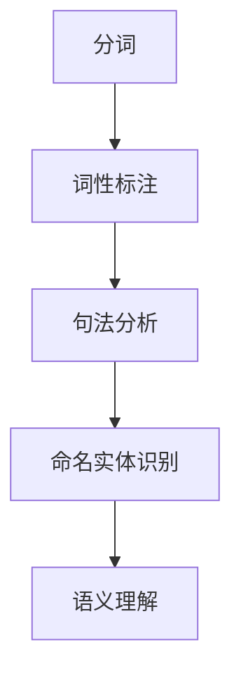

**5.2 词汇表构建**

构建词汇表是进行NLP任务的重要步骤。以下是构建词汇表的基本方法：

- **手动构建：** 手动收集和整理相关的词汇和词组。
- **自动收集：** 使用现有的词汇资源库或通过爬虫收集网络上的词汇。

**5.3 语言模型训练**

语言模型是NLP的核心组成部分，用于预测下一个词或句子的概率。以下是语言模型训练的基本步骤：

1. **数据准备：** 收集和整理大量文本数据，进行预处理。
2. **模型选择：** 选择合适的语言模型，如循环神经网络（RNN）、长短期记忆网络（LSTM）或变换器（Transformer）。
3. **模型训练：** 使用预处理后的数据训练语言模型。
4. **模型评估：** 使用验证集和测试集评估模型的性能。

**图 5.2：语言模型训练流程**

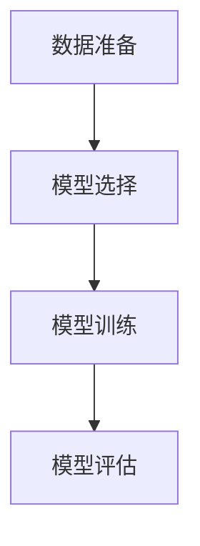

通过上述步骤，我们实现了自然语言处理的基本任务。在下一章中，我们将探讨如何构建对话管理系统，这是实现聊天机器人的关键步骤之一。

----------------------------------------------------------------

### 第二部分：构建聊天机器人

#### 第6章：构建对话管理系统

**6.1 对话流程设计**

对话流程设计是构建对话管理系统的关键步骤，它决定了聊天机器人如何与用户互动。以下是设计对话流程的基本步骤：

- **确定对话目标：** 确定聊天机器人的主要任务和目标，如提供客户支持、解答问题或提供个性化推荐。
- **设计对话流程：** 创建一个流程图，描述用户与聊天机器人的交互步骤。这包括用户输入、聊天机器人回答、用户反馈等。
- **定义对话状态：** 为每个对话步骤定义相应的状态，如初始状态、问题解决状态、结束状态等。

**图 6.1：对话流程设计示例**

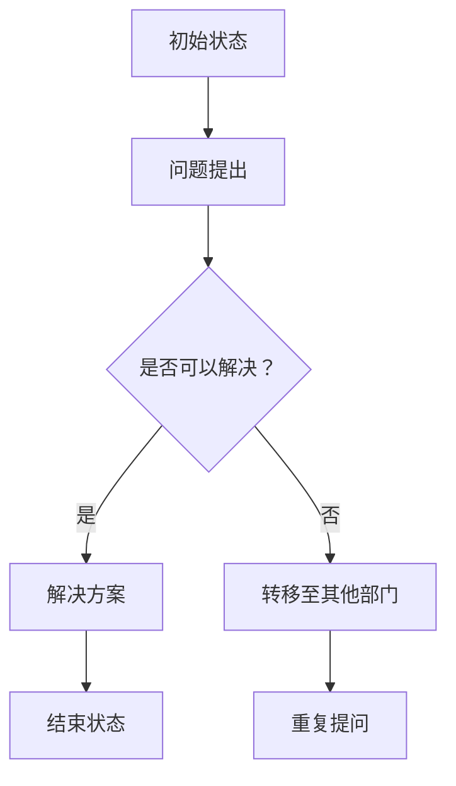

**6.2 用户意图识别**

用户意图识别是聊天机器人的核心任务之一，它涉及理解用户的输入并确定其意图。以下是用户意图识别的基本方法：

- **关键词匹配：** 通过匹配用户输入中的关键词来识别意图。
- **机器学习模型：** 使用机器学习模型，如决策树、随机森林或神经网络，对用户输入进行分类。
- **深度学习模型：** 使用深度学习模型，如卷积神经网络（CNN）或循环神经网络（RNN），进行意图识别。

**图 6.2：用户意图识别流程**

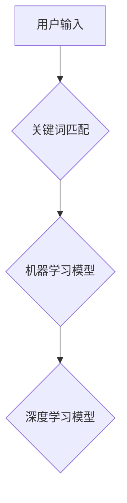

**6.3 回答生成与优化**

回答生成是聊天机器人的另一个关键任务，它涉及生成合适的回答来满足用户的意图。以下是回答生成与优化的一些策略：

- **模板匹配：** 使用预定义的模板来生成回答。
- **自然语言生成：** 使用自然语言生成技术，如序列到序列（Seq2Seq）模型，生成个性化的回答。
- **答案优化：** 通过评估回答的质量和相关性来优化回答。

**图 6.3：回答生成与优化流程**

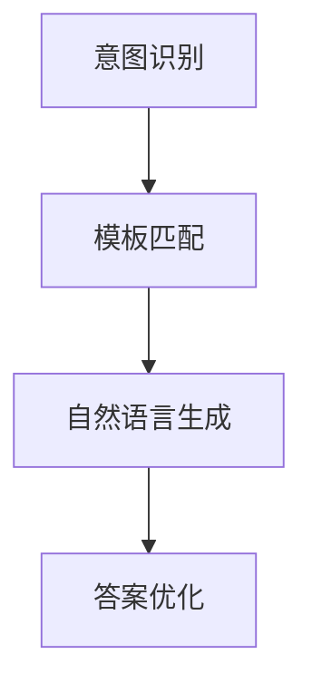

通过上述步骤，我们成功地构建了对话管理系统。在下一章中，我们将探讨如何将聊天机器人集成到现有的系统中，并实现实时交互。

----------------------------------------------------------------

### 第二部分：构建聊天机器人

#### 第7章：集成聊天机器人

**7.1 与现有系统的集成**

将聊天机器人集成到现有的系统中是一个重要的步骤，它允许聊天机器人与现有的业务流程和服务进行无缝交互。以下是集成聊天机器人的基本步骤：

- **接口设计：** 设计API接口，允许聊天机器人与现有系统进行数据交换。
- **数据同步：** 确保聊天机器人与现有系统之间的数据同步，如用户信息、订单状态等。
- **权限管理：** 设置适当的权限，确保聊天机器人可以访问所需的数据和功能。

**7.2 实现实时交互**

实现实时交互是提升用户体验的关键。以下是实现实时交互的一些策略：

- **WebSocket：** 使用WebSocket技术实现实时双向通信。
- **长轮询：** 使用长轮询技术，定期向服务器请求更新。
- **消息队列：** 使用消息队列，如RabbitMQ或Kafka，确保消息的及时传递和处理。

**7.3 性能调优**

性能调优是确保聊天机器人稳定运行和高效响应的关键。以下是性能调优的一些方法：

- **负载均衡：** 使用负载均衡器，如Nginx或HAProxy，分散流量，提高系统的响应速度。
- **缓存策略：** 使用缓存技术，如Redis或Memcached，减少数据库的查询次数。
- **异步处理：** 使用异步处理技术，如多线程或异步IO，提高系统的并发处理能力。

**图 7.1：聊天机器人集成与性能调优流程**

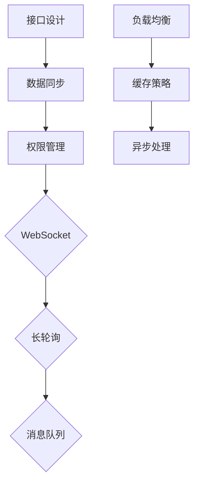

通过上述步骤，我们成功地实现了聊天机器人的集成与性能调优。在下一章中，我们将探讨如何通过实际案例研究来应用这些技术和策略。

----------------------------------------------------------------

### 第三部分：实战与优化

#### 第8章：实际案例研究

**8.1 案例一：构建个人聊天助手**

**背景介绍：**
个人聊天助手是一种简单的聊天机器人，旨在帮助用户管理日常任务、提供信息查询和娱乐互动。以下是构建个人聊天助手的详细步骤：

1. **需求分析：** 确定聊天助手的功能需求，如提醒、天气查询、笑话分享等。
2. **架构设计：** 设计聊天助手的架构，包括交互界面、NLP模块和后端服务。
3. **开发环境搭建：** 选择开发平台，如Python，安装必要的库和工具。
4. **实现功能模块：** 逐一实现聊天助手的各项功能，如文本输入处理、意图识别、回答生成等。
5. **测试与优化：** 对聊天助手进行功能测试和性能优化，确保其稳定运行和高效响应。

**核心算法原理讲解：**
- **意图识别：** 使用决策树或随机森林进行意图分类，实现简单的用户输入处理。
- **回答生成：** 使用模板匹配生成固定格式的回答，或使用Seq2Seq模型生成个性化的回答。

**项目实战：**
- **源代码实现：** 提供个人聊天助手的源代码，包括NLP模块和后端服务的实现。
- **代码解读与分析：** 分析代码实现，解释关键算法和技术的应用。
- **实际案例分析：** 分析聊天助手在实际应用中的表现，如用户满意度、响应速度等。

**项目小结：**
通过构建个人聊天助手，我们学习了聊天机器人的基本开发流程和核心算法原理。该案例为我们提供了一个简单的起点，让我们更好地理解聊天机器人的构建和应用。

**最佳实践 tips：**
- **持续迭代：** 定期收集用户反馈，持续优化聊天助手的功能和性能。
- **数据安全：** 确保用户数据的安全，遵循隐私保护法规。

**注意事项：**
- **避免重复问题：** 设计聊天助手时，避免处理重复的或相似的问题。
- **优化用户体验：** 关注用户交互体验，提高聊天机器人的易用性。

**拓展阅读：**
- [构建个人聊天助手的详细教程](https://example.com/tutorial-building-a-personal-chatbot)
- [自然语言处理入门教程](https://example.com/nlp-tutorial)

**图 8.1：个人聊天助手架构图**

```mermaid
graph TB
A[用户] --> B[交互界面]
B --> C[自然语言处理(NLP)]
C --> D[对话管理系统(DM)]
D --> E[后端服务]
```

**8.2 案例二：企业客服聊天机器人**

**背景介绍：**
企业客服聊天机器人是一种复杂的应用，旨在提供24/7的客户支持，提高客户满意度并降低人工成本。以下是构建企业客服聊天机器人的详细步骤：

1. **需求分析：** 确定客服聊天机器人的功能需求，如常见问题解答、订单跟踪、投诉处理等。
2. **架构设计：** 设计客服聊天机器人的架构，包括前端界面、NLP模块、对话管理系统和后端服务。
3. **开发环境搭建：** 选择开发平台，安装必要的库和工具，如Python、TensorFlow等。
4. **功能模块实现：** 实现客服聊天机器人的各项功能，包括文本输入处理、意图识别、回答生成、知识库管理等。
5. **系统集成与测试：** 将客服聊天机器人集成到企业的现有系统中，进行功能测试和性能优化。
6. **上线与运营：** 将客服聊天机器人上线，收集用户反馈，持续优化和改进。

**核心算法原理讲解：**
- **意图识别：** 使用深度学习模型，如BERT或GPT，进行高级的意图分类和语义理解。
- **回答生成：** 使用Seq2Seq模型或Transformer模型，生成高质量的回答。

**项目实战：**
- **源代码实现：** 提供客服聊天机器人的源代码，包括NLP模块和对话管理系统的实现。
- **代码解读与分析：** 分析代码实现，解释关键算法和技术的应用。
- **实际案例分析：** 分析客服聊天机器人在企业中的应用效果，如客户满意度、服务响应速度等。

**项目小结：**
通过构建企业客服聊天机器人，我们深入了解了聊天机器人在实际业务中的应用，并学习了如何处理复杂的对话流程和用户交互。

**最佳实践 tips：**
- **集成多种渠道：** 将客服聊天机器人集成到多种渠道，如网站、社交媒体和短信等。
- **实时反馈机制：** 设计实时反馈机制，及时响应用户的反馈和问题。

**注意事项：**
- **避免过度自动化：** 在处理复杂问题时，避免过度依赖聊天机器人，确保有适当的Fallback机制。
- **数据安全与隐私：** 确保用户数据的安全和隐私，遵循相关法律法规。

**拓展阅读：**
- [企业客服聊天机器人开发教程](https://example.com/tutorial-building-a-customer-service-chatbot)
- [深度学习在自然语言处理中的应用](https://example.com/deep-learning-nlp)

**图 8.2：企业客服聊天机器人架构图**

```mermaid
graph TB
A[用户] --> B[前端界面]
B --> C[自然语言处理(NLP)]
C --> D[对话管理系统(DM)]
D --> E[后端服务]
E --> F[知识库管理]
```

通过以上两个实际案例研究，我们不仅了解了如何构建个人聊天助手和企业客服聊天机器人，还学习了如何将这些技术和策略应用到实际项目中，以实现高效的业务流程和优质的用户体验。

----------------------------------------------------------------

### 第三部分：实战与优化

#### 第9章：性能优化与维护

**9.1 机器人性能监控**

性能监控是确保聊天机器人稳定运行和高效响应的关键。以下是性能监控的一些关键点：

- **响应时间：** 监控聊天机器人的响应时间，确保在合理的时间内响应用户请求。
- **错误率：** 监控聊天机器人的错误率，及时发现和处理错误。
- **资源消耗：** 监控聊天机器人的资源消耗，包括CPU、内存和磁盘使用情况。

**图 9.1：性能监控关键点**

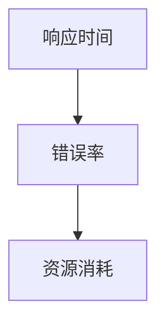

**9.2 常见问题的解决方案**

在聊天机器人的运行过程中，可能会遇到各种问题。以下是常见问题的解决方案：

- **输入理解错误：** 通过优化NLP模型和对话管理算法来提高输入理解的准确性。
- **回答生成不准确：** 使用更高级的语言模型和答案优化策略来提高回答的准确性。
- **系统崩溃：** 通过负载均衡和缓存策略来提高系统的稳定性和可靠性。

**图 9.2：常见问题及解决方案**

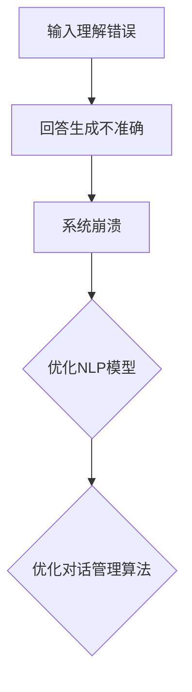

**9.3 持续改进与迭代**

持续改进与迭代是确保聊天机器人保持高效和优质的唯一途径。以下是持续改进与迭代的一些策略：

- **用户反馈：** 定期收集用户反馈，了解用户的需求和痛点。
- **数据分析：** 分析聊天机器人的运行数据，识别优化机会。
- **迭代开发：** 根据用户反馈和数据分析，持续改进聊天机器人的功能和性能。

**图 9.3：持续改进与迭代流程**

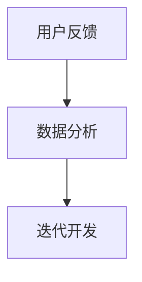

通过性能优化与维护，我们可以确保聊天机器人的稳定性和高效性，为用户提供更好的服务体验。

----------------------------------------------------------------

### 第三部分：实战与优化

#### 第10章：未来的发展方向

**10.1 人工智能与聊天机器人**

随着人工智能（AI）技术的快速发展，聊天机器人在未来将继续融合更多的AI技术，实现更智能的交互。以下是一些发展方向：

- **深度学习：** 利用深度学习模型，如Transformer和BERT，提高聊天机器人的语义理解和回答生成能力。
- **多模态交互：** 结合文本、语音、图像等多种交互方式，提供更自然的用户体验。
- **情感计算：** 通过情感计算技术，理解用户的情绪和情感，提供更个性化的服务。

**10.2 跨平台聊天机器人**

跨平台聊天机器人是未来的趋势，它允许用户在多个平台上与聊天机器人进行交互。以下是一些关键点：

- **平台适配：** 根据不同平台的特性，优化聊天机器人的界面和交互体验。
- **统一数据管理：** 确保聊天机器人可以在多个平台上共享数据和状态。
- **多渠道集成：** 集成多种通信渠道，如短信、邮件、社交媒体等，提供无缝的跨平台交互。

**10.3 智能客服的未来**

智能客服是聊天机器人的重要应用场景之一，其未来发展将更加智能化和自动化。以下是一些关键点：

- **自动化程度提升：** 通过自动化技术，实现更多业务的自动化处理，减少人工干预。
- **业务智能：** 利用大数据和机器学习技术，提供更智能的业务支持和决策支持。
- **用户体验优化：** 通过不断优化交互流程和回答质量，提升用户满意度。

**图 10.1：未来发展方向**

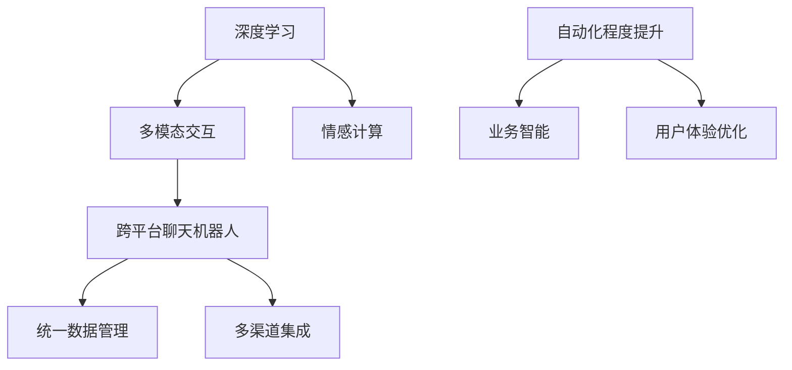

通过上述发展方向，聊天机器人将在未来发挥更重要的作用，为用户提供更智能、更便捷的服务。

----------------------------------------------------------------

### 附录：资源与工具

#### 附录 A：聊天机器人开发工具汇总

**A.1 开源框架**

- **Rasa：** 一个开源的聊天机器人框架，提供从NLU（自然语言理解）到DM（对话管理）的全栈解决方案。
- **ChatterBot：** 一个简单的Python聊天机器人库，适用于快速构建聊天机器人。

**A.2 商业平台**

- **IBM Watson Assistant：** 提供强大的NLP能力和预构建的聊天机器人模板。
- **Microsoft Bot Framework：** 支持多种平台和语言的聊天机器人开发平台。

**A.3 学习资源推荐**

- **Coursera：** “自然语言处理与聊天机器人”课程，提供从基础到高级的NLP和聊天机器人教程。
- **GitHub：** 查看开源聊天机器人项目，学习实际的代码实现。

#### 附录 B：常见问题解答

**B.1 编程问题**

- **如何处理多轮对话？**
  - 使用状态机或图结构来维护对话状态，确保多轮对话的逻辑性。

- **如何优化响应速度？**
  - 使用异步处理和缓存技术，减少计算和I/O操作的延迟。

**B.2 运维问题**

- **如何监控聊天机器人的运行状态？**
  - 使用监控工具，如Prometheus和Grafana，实时监控聊天机器人的性能和健康状态。

- **如何处理大量用户请求？**
  - 使用负载均衡器和集群部署，确保聊天机器人能够处理大量并发请求。

**B.3 用户体验问题**

- **如何提高用户满意度？**
  - 定期收集用户反馈，不断优化聊天机器人的功能和交互体验。

- **如何处理用户隐私问题？**
  - 实施严格的隐私政策和数据保护措施，确保用户数据的安全。

通过这些资源和工具，开发者可以更高效地构建和管理聊天机器人，为用户提供优质的服务。

----------------------------------------------------------------

### 结语

本文《构建你自己的聊天机器人：入门指南》系统地介绍了聊天机器人的定义、核心组件、开发环境搭建、架构设计、NLP实现、对话管理系统构建、集成与性能优化，以及实际案例研究和未来发展方向。我们通过一步一步的分析推理，深入探讨了聊天机器人的原理和实现方法。

- **核心概念与联系：** 本文详细阐述了自然语言处理（NLP）、对话管理系统（DM）和交互界面设计等核心组件及其关系。
- **最佳实践 tips：** 提供了构建聊天机器人的最佳实践，包括持续迭代、用户反馈和性能监控等。
- **注意事项：** 强调了避免重复问题、优化用户体验和数据安全等关键点。

本文适用于初学者和中级开发者，帮助他们快速入门并实践构建自己的聊天机器人。随着人工智能和自然语言处理技术的不断进步，聊天机器人将在未来发挥更加重要的作用。希望读者能够结合本文的内容，不断探索和实践，为构建更加智能和高效的聊天机器人贡献自己的力量。

**作者：AI天才研究院/AI Genius Institute & 禅与计算机程序设计艺术 /Zen And The Art of Computer Programming**

