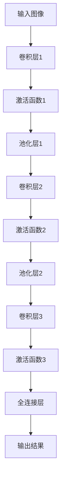
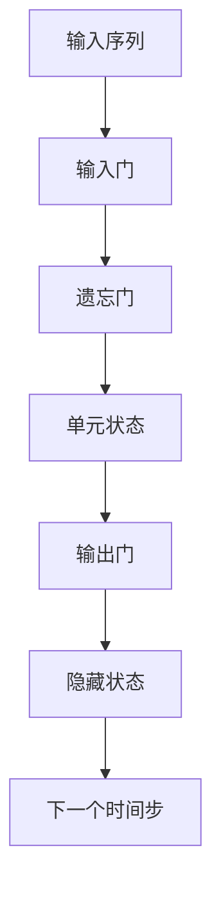
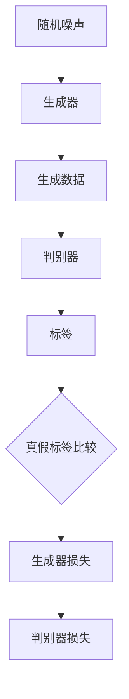

                 

## 文章标题

### 《树莓派机器学习应用开发》

> 关键词：树莓派、机器学习、应用开发、深度学习、算法实现

> 摘要：本文将介绍如何利用树莓派进行机器学习应用的开发。从树莓派的基础介绍开始，逐步深入到机器学习的基础知识和算法实现，最后通过实际应用案例，展示如何将树莓派应用于机器学习领域。本文旨在为广大开发者提供一套系统、实用的树莓派机器学习开发指南。

## 第一部分：树莓派基础

### 第1章：树莓派简介与准备

树莓派是一款低功耗、高性能的单板计算机，因其高性价比和丰富的扩展性，成为了一款备受开发者喜爱的微型计算机。在本章中，我们将首先介绍树莓派的起源和发展历程，然后详细讲解树莓派的硬件组成，最后介绍如何安装和配置树莓派。

### 1.1 树莓派的起源与发展

树莓派由英国的树莓派基金会（Raspberry Pi Foundation）于2012年推出。该基金会的宗旨是通过提供廉价的微型计算机，激发儿童和青少年的计算机编程兴趣，提高计算机素养。树莓派的推出受到了全球开发者的热烈欢迎，并迅速成为了微型计算机市场的宠儿。

自推出以来，树莓派经历了多代更新。每一代产品都在性能、功能和应用场景方面有所提升。目前，市场上主流的树莓派型号包括树莓派3、树莓派4和树莓派Zero。本文将主要围绕树莓派3和树莓派4进行介绍，因为它们具有较高的性能和丰富的扩展接口，适合进行机器学习应用开发。

### 1.2 树莓派硬件介绍

树莓派3和树莓派4的硬件配置如下：

- **处理器**：树莓派3采用四核Broadcom BCM2837处理器，主频为1.2GHz；树莓派4则采用四核Cortex-A72处理器，主频最高可达1.5GHz。
- **内存**：树莓派3和树莓派4均支持2GB或4GB内存。
- **存储**：树莓派内置8GB或16GB eMMC存储，也可通过SD卡扩展存储空间。
- **接口**：树莓派3和树莓派4均提供了HDMI接口、USB接口、GPIO接口、网络接口等。树莓派4还增加了USB 3.0接口和视频编码解码单元（VC4）。
- **无线功能**：树莓派3支持Wi-Fi和蓝牙；树莓派4则在树莓派3的基础上增加了双Wi-Fi（2.4GHz和5GHz）和蓝牙5.0。

### 1.3 树莓派的安装与配置

安装树莓派主要包括以下几个步骤：

1. **硬件准备**：确保所有硬件齐全，包括树莓派主板、电源、HDMI显示器、键盘和鼠标。
2. **下载系统**：从树莓派官方网站（https://www.raspberrypi.org/software）下载最新的树莓派操作系统镜像文件。
3. **制作SD卡**：使用SD卡制作工具（如Raspberry Pi Imager）将操作系统镜像写入SD卡。
4. **启动树莓派**：将制作好的SD卡插入树莓派，连接电源和显示器，启动树莓派。
5. **配置网络**：在树莓派启动后，通过SSH或图形界面配置网络。
6. **安装扩展包**：安装必要的软件包，如Python、OpenCV、TensorFlow等。

通过以上步骤，我们可以将树莓派配置成一个可以运行的微型计算机，为后续的机器学习应用开发打下基础。

### 第2章：树莓派操作系统与应用环境搭建

树莓派操作系统的选择和安装是进行树莓派开发的基础。在本章中，我们将介绍如何在树莓派上选择合适的操作系统，并详细讲解如何配置Python环境和常用的机器学习库。

#### 2.1 树莓派操作系统选择

树莓派支持多种操作系统，包括基于Linux的Raspbian、Ubuntu Mate、Windows 10 IoT Core等。其中，Raspbian是树莓派官方推荐的操作系统，因为它稳定、易用，并且拥有丰富的软件库。

对于机器学习应用开发，我们推荐使用Raspbian或Ubuntu Mate。Raspbian是基于Debian的Linux发行版，拥有丰富的软件包和强大的社区支持；Ubuntu Mate则具有更好的硬件兼容性和用户友好的桌面环境。

#### 2.2 Python环境配置

Python是进行机器学习应用开发的主要编程语言。在树莓派上配置Python环境主要包括以下几个步骤：

1. **安装Python**：在Raspbian或Ubuntu Mate操作系统下，可以使用以下命令安装Python：

   ```shell
   sudo apt-get update
   sudo apt-get install python3 python3-pip
   ```

2. **配置pip**：pip是Python的包管理器，用于安装和管理Python库。可以使用以下命令配置pip：

   ```shell
   sudo apt-get install python3-pip
   ```

3. **安装常用库**：为了进行机器学习应用开发，我们需要安装一些常用的Python库，如NumPy、Pandas、Matplotlib等。可以使用以下命令安装：

   ```shell
   sudo pip3 install numpy pandas matplotlib
   ```

#### 2.3 OpenCV等常用库安装

OpenCV是一个开源的计算机视觉库，支持多种编程语言，包括Python。在树莓派上安装OpenCV的步骤如下：

1. **安装依赖库**：OpenCV依赖于多个库，如OpenEXR、Qt5等。可以使用以下命令安装：

   ```shell
   sudo apt-get install build-essential cmake pkg-config libgtk-3-dev \
   libavcodec-dev libavformat-dev libswscale-dev libv4l-dev \
   libxvidcore-dev libx264-dev libjpeg8-dev libtiff5-dev \
   gfortran openexr libatlas-base-dev
   ```

2. **安装OpenCV**：使用以下命令安装OpenCV：

   ```shell
   sudo apt-get install python3-opencv
   ```

3. **测试安装**：在Python环境中导入OpenCV库，测试是否安装成功：

   ```python
   import cv2
   print(cv2.__version__)
   ```

如果输出OpenCV的版本信息，则说明安装成功。

通过以上步骤，我们可以在树莓派上搭建一个适合进行机器学习应用开发的环境。接下来，我们将介绍机器学习的基础知识，为深入探索树莓派机器学习应用开发奠定基础。

### 第3章：机器学习概述

机器学习作为人工智能的重要组成部分，近年来在计算机科学领域取得了显著的进展。本章将首先介绍机器学习的基本概念，然后简要介绍监督学习、无监督学习和强化学习三种主要的机器学习类型，最后对常见的机器学习算法进行分类。

#### 3.1 机器学习基本概念

机器学习（Machine Learning）是一门研究如何让计算机从数据中自动学习和改进的学科。其核心目标是让计算机通过学习算法，从数据中提取规律，并对新的数据进行预测或分类。

机器学习的基本过程包括以下几个步骤：

1. **数据收集**：收集大量相关的数据作为训练样本。
2. **数据预处理**：对收集到的数据进行清洗、归一化等处理，以提高模型的泛化能力。
3. **模型选择**：选择适合问题的机器学习算法，建立模型。
4. **模型训练**：使用训练数据对模型进行训练，调整模型的参数。
5. **模型评估**：使用验证集或测试集评估模型的性能，判断模型是否满足要求。
6. **模型应用**：将训练好的模型应用于实际问题，对新数据进行预测或分类。

#### 3.2 监督学习、无监督学习和强化学习

根据训练数据的不同，机器学习可以分为监督学习、无监督学习和强化学习三种类型。

1. **监督学习**（Supervised Learning）：监督学习是指使用带有标签的训练数据，通过学习输入和输出之间的映射关系，建立预测模型。常见的监督学习算法包括线性回归、逻辑回归、决策树、支持向量机、神经网络等。

2. **无监督学习**（Unsupervised Learning）：无监督学习是指在没有标签的情况下，从数据中自动发现数据间的规律和结构。常见的无监督学习算法包括聚类、降维、关联规则挖掘等。

3. **强化学习**（Reinforcement Learning）：强化学习是指通过学习如何在特定的环境中采取行动，以最大化长期奖励。强化学习的典型代表是深度强化学习，如DQN、PPO等算法。

#### 3.3 常见机器学习算法分类

常见的机器学习算法可以按照不同的分类方式进行归纳。以下是几种常见的分类方式：

1. **按照学习策略分类**：

   - **归纳学习**：通过归纳推理从训练数据中提取一般规律，如决策树、规则学习等。
   - **演绎学习**：从已有知识推导出新知识，如逻辑回归、贝叶斯网络等。
   - **案例学习**：通过案例的相似度来预测未知案例的结果，如k-近邻算法、案例基学习等。

2. **按照数据分布分类**：

   - **确定性算法**：输出结果相同，如线性回归、支持向量机等。
   - **随机算法**：输出结果不同，如随机森林、随机梯度下降等。

3. **按照模型类型分类**：

   - **统计模型**：基于统计理论和概率模型，如线性回归、逻辑回归等。
   - **神经网络模型**：基于神经网络结构，如深度神经网络、卷积神经网络、循环神经网络等。
   - **传统机器学习算法**：传统的机器学习算法，如决策树、支持向量机、聚类算法等。

通过以上介绍，我们对机器学习的基本概念和分类有了初步的了解。接下来，我们将深入探讨机器学习算法的原理，包括线性回归、k-近邻算法、支持向量机、随机森林等常见算法的原理与伪代码实现。

### 第4章：机器学习算法原理

在本章中，我们将深入探讨几种常见的机器学习算法的原理，包括线性回归、k-近邻算法、支持向量机和随机森林。通过这些算法的详细讲解，我们将理解它们的工作机制和数学基础。

#### 4.1 线性回归算法原理与伪代码

线性回归是一种用于预测连续值的监督学习算法。它的目标是最小化预测值与真实值之间的误差。

##### 原理：

线性回归假设输入特征和输出目标之间存在线性关系，可以用以下公式表示：

$$
y = \beta_0 + \beta_1 \cdot x
$$

其中，$y$ 是输出目标，$x$ 是输入特征，$\beta_0$ 和 $\beta_1$ 是模型参数。

为了找到最优的参数，我们使用最小二乘法（Least Squares Method）。最小二乘法的目标是最小化预测值与真实值之间的误差平方和。

##### 伪代码：

```python
# 线性回归伪代码

# 输入：
# X: 输入特征矩阵
# y: 输出标签向量

# 输出：
# w: 权重向量
# b: 偏置向量

# 步骤：
# 1. 初始化权重和偏置
# w, b = 随机初始化

# 2. 计算损失函数
J(w, b) = (1 / 2m) * sum((h_θ(x) - y)^2)

# 3. 梯度下降更新权重和偏置
w = w - α * (∂J(w, b) / ∂w)
b = b - α * (∂J(w, b) / ∂b)
```

#### 4.2 k-近邻算法原理与伪代码

k-近邻算法是一种简单的分类算法。它的核心思想是，如果一个新样本在特征空间中的k个最近邻点都属于同一个类别，则该新样本也属于这个类别。

##### 原理：

k-近邻算法通过计算新样本与训练样本之间的距离，确定其最近邻点。距离的计算方法通常使用欧几里得距离。

##### 伪代码：

```python
# k-近邻算法伪代码

# 输入：
# X_train: 训练样本特征矩阵
# y_train: 训练样本标签向量
# X_test: 测试样本特征矩阵
# k: 最近邻点的数量

# 输出：
# y_pred: 预测的标签向量

# 步骤：
# 1. 计算测试样本与训练样本之间的距离
distances = 计算欧几里得距离(X_test, X_train)

# 2. 选择距离最近的k个邻居
nearest_neighbors = 选择最近的k个邻居(distances)

# 3. 根据邻居的标签投票，得到新样本的预测标签
y_pred = 投票决定类别标签(nearest_neighbors, y_train)
```

#### 4.3 支持向量机算法原理与伪代码

支持向量机（SVM）是一种强大的分类算法，它的目标是找到一个最佳的超平面，将不同类别的数据点尽可能地分开。

##### 原理：

SVM通过最大化分类边界上的支持向量（支持向量是距离超平面最近的样本点）的间隔来找到最佳超平面。在二维空间中，SVM可以用以下公式表示：

$$
w \cdot x - b = 0
$$

其中，$w$ 是法向量，$x$ 是特征向量，$b$ 是偏置。

##### 伪代码：

```python
# 支持向量机算法伪代码

# 输入：
# X: 输入特征矩阵
# y: 输出标签向量

# 输出：
# w: 权重向量
# b: 偏置向量

# 步骤：
# 1. 使用线性规划求解器求解最优解
# w, b = 线性规划求解器求解(L)

# 2. 如果存在非线性可分情况，使用核函数映射到高维空间
# w, b = 核函数映射求解(L)

# 3. 计算分类边界
分类边界 = w \cdot x - b = 0
```

#### 4.4 随机森林算法原理与伪代码

随机森林（Random Forest）是一种集成学习方法，它通过构建多个决策树，并使用投票机制来获得最终的预测结果。

##### 原理：

随机森林的核心思想是通过组合多个决策树来提高模型的泛化能力。每个决策树从训练数据中随机选择一部分特征和样本进行训练，并生成预测结果。最终，随机森林通过投票机制（多数投票）来决定新样本的类别。

##### 伪代码：

```python
# 随机森林算法伪代码

# 输入：
# X: 输入特征矩阵
# y: 输出标签向量
# n_estimators: 决策树的数量

# 输出：
# y_pred: 预测的标签向量

# 步骤：
# 1. 对于每个决策树：
#    a. 从特征集合中随机选择m个特征
#    b. 从样本集合中随机选择n个样本，构建子集
#    c. 在子集上训练决策树

# 2. 对于新样本：
#    a. 将新样本输入到每个决策树中，获得预测结果
#    b. 根据预测结果进行投票，得到最终预测类别

# 3. 返回预测结果
y_pred = 投票决定类别标签(y_pred)
```

通过以上对几种常见机器学习算法的原理和伪代码的介绍，我们可以更好地理解这些算法的工作机制。接下来，我们将进一步探讨深度学习的基础知识，包括深度学习概述、卷积神经网络（CNN）、循环神经网络（RNN）与长短期记忆（LSTM）、生成对抗网络（GAN）等。

### 第5章：深度学习基础

深度学习（Deep Learning）是机器学习的一个分支，通过构建多层神经网络来实现对复杂数据的自动特征学习和模式识别。本章将首先介绍深度学习的概述，然后深入讲解卷积神经网络（CNN）、循环神经网络（RNN）与长短期记忆（LSTM）、生成对抗网络（GAN）等深度学习模型。

#### 5.1 深度学习概述

深度学习是一种基于人工神经网络的算法，通过多层神经元的组合来模拟人脑的学习过程。其核心思想是通过逐层抽象和提取特征，实现对数据的理解和预测。

深度学习的优势在于：

1. **自动特征提取**：传统机器学习方法需要人工设计特征，而深度学习可以自动从数据中提取有代表性的特征。
2. **强大的表达力**：深度学习模型能够处理大规模和高维数据，通过多层神经元的组合，实现对复杂数据的建模和预测。
3. **跨领域应用**：深度学习在图像识别、自然语言处理、语音识别等领域取得了显著的成功，具有广泛的应用前景。

深度学习的缺点包括：

1. **计算资源需求大**：深度学习模型通常需要大量的计算资源和时间进行训练。
2. **需要大量数据**：深度学习模型的训练需要大量标注数据，数据收集和标注成本较高。
3. **解释性较差**：深度学习模型往往被视为“黑箱”，难以解释其预测结果。

#### 5.2 卷积神经网络（CNN）原理与Mermaid图

卷积神经网络（Convolutional Neural Network，CNN）是一种专门用于处理图像数据的深度学习模型。其核心思想是通过卷积层提取图像特征，然后通过全连接层进行分类。

##### 原理：

CNN的主要组成部分包括：

1. **卷积层**：卷积层通过卷积操作提取图像的特征。卷积操作可以看作是滤波器在图像上滑动，提取出局部的特征。
2. **池化层**：池化层用于减小数据维度，减少计算量和过拟合风险。常见的池化操作包括最大池化和平均池化。
3. **全连接层**：全连接层将卷积层和池化层提取的特征映射到分类结果。

##### Mermaid图：



#### 5.3 循环神经网络（RNN）与长短期记忆（LSTM）原理与伪代码

循环神经网络（Recurrent Neural Network，RNN）是一种用于处理序列数据的深度学习模型。其核心思想是利用隐藏状态在时间步之间的循环连接来捕捉序列信息。

##### 原理：

RNN的主要组成部分包括：

1. **输入门**（Input Gate）：用于控制当前输入对隐藏状态的影响。
2. **遗忘门**（Forget Gate）：用于控制当前隐藏状态中的信息保留和丢弃。
3. **输出门**（Output Gate）：用于控制当前隐藏状态对输出的影响。

##### LSTM（Long Short-Term Memory）：

LSTM是一种特殊的RNN，旨在解决传统RNN在处理长序列数据时容易出现的梯度消失和梯度爆炸问题。LSTM的核心组件包括：

1. **输入门**（Input Gate）：用于控制当前输入对单元状态的影响。
2. **遗忘门**（Forget Gate）：用于控制当前隐藏状态中的信息保留和丢弃。
3. **输出门**（Output Gate）：用于控制当前隐藏状态对输出的影响。
4. **单元状态**（Cell State）：用于存储序列信息。

##### 伪代码：

```python
# LSTM单元伪代码

# 输入：
# x_t: 当前时间步的输入
# h_{t-1}: 当前时间步的前一个隐藏状态
# W: 权重矩阵
# b: 偏置向量

# 输出：
# h_t: 当前时间步的隐藏状态

# 步骤：
# 1. 预处理输入和隐藏状态
i_t = 输入门(x_t, h_{t-1}, W, b)
f_t = 遗忘门(x_t, h_{t-1}, W, b)
o_t = 输出门(x_t, h_{t-1}, W, b)

# 2. 更新单元状态
c_t = f_{t-1} \* c_{t-1} + i_t \* tanh(W_c \* [x_t; h_{t-1}] + b_c)

# 3. 更新隐藏状态
h_t = o_t \* tanh(c_t)
```

#### 5.4 生成对抗网络（GAN）原理与伪代码

生成对抗网络（Generative Adversarial Network，GAN）是一种通过两个神经网络（生成器和判别器）相互博弈来生成逼真数据的深度学习模型。

##### 原理：

GAN的主要组成部分包括：

1. **生成器**（Generator）：生成器试图生成逼真的数据，以欺骗判别器。
2. **判别器**（Discriminator）：判别器用于区分真实数据和生成数据。

两个网络在训练过程中进行博弈，生成器试图提高生成数据的逼真度，而判别器试图区分真实数据和生成数据。通过这种博弈，生成器逐渐生成更逼真的数据。

##### 伪代码：

```python
# GAN训练伪代码

# 输入：
# x_real: 真实数据
# z: 生成器的随机噪声

# 输出：
# G(z): 生成器的输出
# D(x_real): 判别器的真实数据输出
# D(G(z)): 判别器的生成数据输出

# 步骤：
# 1. 生成器生成数据G(z)
# G(z) = 生成器(z)

# 2. 判别器评估真实数据和生成数据
D(x_real) = 判别器(x_real)
D(G(z)) = 判别器(G(z))

# 3. 计算生成器的损失函数
L_G = -\sum_{i=1}^{n} log(D(G(z_i)))

# 4. 计算判别器的损失函数
L_D = \sum_{i=1}^{n} log(D(x_i)) + \sum_{i=1}^{n} log(1 - D(G(z_i)))

# 5. 更新生成器和判别器的参数
更新生成器参数(G)
更新判别器参数(D)
```

通过以上对深度学习基础知识的介绍，我们对深度学习的原理和应用有了更深入的了解。接下来，我们将探讨如何在树莓派上进行深度学习模型的训练和部署。

### 第6章：树莓派与传感器

在树莓派的应用中，传感器数据采集和处理是一个重要的环节。传感器可以收集温度、湿度、光照、声音等环境信息，这些数据对于机器学习模型训练和实时应用至关重要。本章将详细介绍树莓派上常见传感器的使用方法，传感器数据采集与处理，以及传感器数据在机器学习中的应用案例。

#### 6.1 常见传感器介绍

树莓派支持多种传感器，以下是一些常见的传感器类型：

1. **温度传感器**：如DS18B20、DHT11/DHT22等，用于测量环境温度。
2. **湿度传感器**：如SHT31、HTU21D等，用于测量空气湿度。
3. **光照传感器**：如TSL235R、BH1750等，用于测量光照强度。
4. **声音传感器**：如Arduino声音传感器、MP3播放器等，用于检测声音信号。
5. **加速度传感器**：如MPU-6050、L3GD20等，用于测量物体的加速度和角速度。
6. **定位传感器**：如GPS模块、激光测距传感器等，用于定位和导航。

#### 6.2 传感器数据采集与处理

传感器数据采集与处理主要包括以下几个步骤：

1. **传感器连接**：将传感器通过I2C、SPI或GPIO接口连接到树莓派。
2. **驱动安装**：根据传感器的数据协议，安装相应的驱动程序或库。
3. **数据读取**：使用树莓派的编程语言（如Python）读取传感器的数据。
4. **数据处理**：对传感器数据进行预处理，如滤波、归一化等。

以下是一个使用Python和Adafruit库读取DS18B20温度传感器的示例代码：

```python
import Adafruit_GPIO.SPI as SPI
import Adafruit_DHT

sensor = Adafruit_DHT.DHT11
pin = 4  # 传感器连接的GPIO引脚

while True:
    humidity, temperature = Adafruit_DHT.read(sensor, pin)
    
    if humidity is not None and temperature is not None:
        print("Temp={0:0.1f}C  Humidity={1:0.1f}%".format(temperature, humidity))
    else:
        print("Failed to read data")

    time.sleep(1)
```

#### 6.3 传感器数据在机器学习中的应用案例

传感器数据在机器学习中的应用非常广泛，以下是一些典型的应用案例：

1. **环境监测**：利用温度、湿度、光照等传感器数据，构建环境监测模型，实时监测空气质量、气候变化等。
2. **智能家居**：结合温度、湿度、光照等传感器数据，实现智能灯光调节、温度控制、家电管理等功能。
3. **健康监测**：利用心率、血压等传感器数据，构建健康监测模型，实时监测用户健康状况。
4. **运动分析**：利用加速度、角速度等传感器数据，分析运动员的运动状态，提供运动建议和训练指导。

以下是一个使用树莓派和加速度传感器进行运动分析的应用案例：

```python
import RPi.GPIO as GPIO
import time

GPIO.setmode(GPIO.BCM)
GPIO.setup(17, GPIO.OUT)

p = GPIO.PWM(17, 100) # 100Hz
p.start(0)

try:
    while True:
        p.ChangeDutyCycle(5)  # 前进
        time.sleep(1)
        p.ChangeDutyCycle(10)  # 后退
        time.sleep(1)

except KeyboardInterrupt:
    p.stop()
    GPIO.cleanup()
```

通过以上案例，我们可以看到传感器数据在机器学习应用中发挥着重要作用。树莓派的低成本和高性能为传感器数据的采集和处理提供了便利，使其成为机器学习应用开发的一个理想平台。

### 第7章：树莓派视觉应用

树莓派凭借其强大的计算能力和丰富的接口，非常适合进行视觉应用的开发。本章将详细介绍如何在树莓派上安装和使用OpenCV，并展示如何利用OpenCV实现基于视觉的目标检测、跟踪和人脸识别。

#### 7.1 OpenCV在树莓派上的安装与使用

OpenCV（Open Source Computer Vision Library）是一个开源的计算机视觉库，支持多种编程语言，包括Python。在树莓派上安装OpenCV的步骤如下：

1. **更新系统软件**：

   ```shell
   sudo apt-get update
   sudo apt-get upgrade
   ```

2. **安装依赖库**：

   ```shell
   sudo apt-get install build-essential cmake pkg-config libgtk-3-dev \
   libavcodec-dev libavformat-dev libswscale-dev libv4l-dev \
   libxvidcore-dev libx264-dev libjpeg8-dev libtiff5-dev \
   gfortran openexr libatlas-base-dev
   ```

3. **下载OpenCV源代码**：

   从OpenCV官方网站（opencv.org）下载源代码包。

4. **安装OpenCV**：

   解压源代码包，进入目录，并执行以下命令：

   ```shell
   mkdir build
   cd build
   cmake ..
   make
   sudo make install
   ```

安装完成后，可以使用以下命令验证OpenCV安装是否成功：

```shell
python3 -c "import cv2; print(cv2.__version__)"
```

如果成功输出了OpenCV的版本信息，则说明安装成功。

#### 7.2 基于视觉的目标检测与跟踪

目标检测和跟踪是计算机视觉中的重要应用，可以用于多种场景，如监控、自动驾驶和机器人导航。

##### 7.2.1 目标检测

目标检测是指从图像或视频中识别出特定目标的位置和类别。OpenCV提供了多种目标检测算法，如Haar cascades、YOLO、SSD等。

以下是一个使用Haar cascades进行目标检测的简单示例：

```python
import cv2

# 加载预训练的Haar cascades分类器
face_cascade = cv2.CascadeClassifier('path/to/haarcascade_frontalface_default.xml')

# 读取图像
img = cv2.imread('path/to/image.jpg')

# 转换为灰度图像
gray = cv2.cvtColor(img, cv2.COLOR_BGR2GRAY)

# 检测人脸
faces = face_cascade.detectMultiScale(gray, 1.3, 5)

# 在原图上绘制检测到的目标
for (x, y, w, h) in faces:
    cv2.rectangle(img, (x, y), (x+w, y+h), (255, 0, 0), 2)
    cv2.putText(img, 'Face', (x+10, y+20), cv2.FONT_HERSHEY_SIMPLEX, 1, (255, 0, 0), 2)

# 显示结果
cv2.imshow('Face Detection', img)
cv2.waitKey(0)
cv2.destroyAllWindows()
```

##### 7.2.2 目标跟踪

目标跟踪是指在一个视频中连续检测和跟踪特定目标。OpenCV提供了多种目标跟踪算法，如光流法、Kalman滤波器、粒子滤波等。

以下是一个使用光流法进行目标跟踪的简单示例：

```python
import cv2

# 读取视频
cap = cv2.VideoCapture('path/to/video.mp4')

# 初始化光流器
opt = cv2.cuda.optflow.DualTVL1Flow.create()

while cap.isOpened():
    ret, frame1 = cap.read()
    if not ret:
        break

    # 转换为灰度图像
    frame1_gray = cv2.cvtColor(frame1, cv2.COLOR_BGR2GRAY)

    # 使用光流法计算帧间差异
    flow = opt.compute(frame1_gray)

    # 在原图上绘制光流线条
    for i in range(-10, 10):
        for j in range(-10, 10):
            new_i = i + flow[0][0]
            new_j = j + flow[0][1]
            if 0 <= new_i < frame1_gray.shape[0] and 0 <= new_j < frame1_gray.shape[1]:
                cv2.line(frame1, (i, j), (new_i, new_j), (0, 255, 0), 1)

    # 显示结果
    cv2.imshow('Optical Flow', frame1)
    if cv2.waitKey(1) & 0xFF == ord('q'):
        break

cap.release()
cv2.destroyAllWindows()
```

#### 7.3 基于视觉的人脸识别

人脸识别是一种基于人脸特征的生物识别技术，可以用于门禁控制、安全监控和身份验证等。

以下是一个使用OpenCV进行人脸识别的简单示例：

```python
import cv2
import numpy as np

# 加载预训练的人脸识别模型
face_cascade = cv2.CascadeClassifier('path/to/haarcascade_frontalface_default.xml')
recognizer = cv2.face.LBPHFaceRecognizer_create()

# 训练模型
data = {}
labels = {}
y_labels = []
x_train = []

with open('path/to/face_data.csv', 'r') as f:
    rows = csv.reader(f)
    for row in rows:
        labels[row[0]] = row[1]
        data[row[0]] = []
        for i in range(2, len(row)):
            data[row[0]].append(int(row[i]))
        x_train.append(np.array(data[row[0]]))
        y_labels.append(row[1])

recognizer.train(np.array(x_train), np.array(y_labels))

# 读取视频
cap = cv2.VideoCapture(0)

while cap.isOpened():
    ret, frame = cap.read()
    if not ret:
        break

    # 转换为灰度图像
    gray = cv2.cvtColor(frame, cv2.COLOR_BGR2GRAY)

    # 检测人脸
    faces = face_cascade.detectMultiScale(gray, 1.1, 4)

    # 预测人脸
    for (x, y, w, h) in faces:
        roi_gray = gray[y:y+h, x:x+w]
        label, confidence = recognizer.predict(roi_gray)
        if confidence < 50:
            cv2.rectangle(frame, (x, y), (x+w, y+h), (0, 255, 0), 2)
            cv2.putText(frame, labels[str(label)], (x+5, y-5), cv2.FONT_HERSHEY_SIMPLEX, 1, (255, 0, 0), 2)

    # 显示结果
    cv2.imshow('Face Recognition', frame)
    if cv2.waitKey(1) & 0xFF == ord('q'):
        break

cap.release()
cv2.destroyAllWindows()
```

通过以上示例，我们可以看到如何利用树莓派和OpenCV进行视觉应用的开发。这些应用不仅丰富了树莓派的功能，也为开发者提供了无限的创意空间。

### 第8章：树莓派语音应用

树莓派在语音应用方面具有很高的潜力，可以用于语音识别、语音合成以及语音控制等多种应用场景。本章将详细介绍如何基于树莓派开发语音应用，包括语音识别技术和语音合成技术的应用。

#### 8.1 语音识别技术简介

语音识别技术（Speech Recognition）是将人类语音转化为文本的技术。在树莓派上，我们可以利用各种开源库和工具来实现语音识别功能。以下是一些常用的语音识别工具：

1. **Google语音识别**：Google提供了免费的语音识别API，可以方便地集成到树莓派项目中。通过调用Google的语音识别API，我们可以将音频信号转换为文本。

2. **CMU Sphinx**：CMU Sphinx是一个开源的语音识别工具，支持多种语言和操作系统。它适用于需要自定义语音识别模型的场景。

3. **Python VoiceRecognition**：Python VoiceRecognition是一个基于Google语音识别的Python库，可以方便地集成到Python项目中。

以下是一个使用Google语音识别进行语音识别的简单示例：

```python
import speech_recognition as sr

# 初始化语音识别器
recognizer = sr.Recognizer()

# 读取音频文件
with sr.AudioFile('path/to/audio.wav') as source:
    audio = recognizer.listen(source)

# 进行语音识别
text = recognizer.recognize_google(audio, language='en-US')

print("Recognized Text:", text)
```

#### 8.2 基于树莓派的语音识别应用开发

基于树莓派的语音识别应用开发包括以下几个步骤：

1. **硬件准备**：确保树莓派连接了麦克风，并具备音频输入输出功能。

2. **安装语音识别库**：在树莓派上安装所需的语音识别库，如`speech_recognition`。

3. **音频录制**：使用树莓派的麦克风录制语音信号。

4. **语音识别**：将录制的音频信号传递给语音识别库，获取识别结果。

5. **应用开发**：根据识别结果进行相应的应用开发，如实现语音控制、语音助手等功能。

以下是一个简单的语音控制应用示例：

```python
import speech_recognition as sr

# 初始化语音识别器
recognizer = sr.Recognizer()

# 创建命令字典
commands = {
    "turn on the light": "turn_on_light",
    "turn off the light": "turn_off_light",
    "what is the time": "show_time"
}

# 读取音频文件
with sr.AudioFile('path/to/audio.wav') as source:
    audio = recognizer.listen(source)

# 进行语音识别
text = recognizer.recognize_google(audio, language='en-US')

# 根据识别结果执行命令
if text in commands:
    command = commands[text]
    if command == "turn_on_light":
        print("Turning on the light")
    elif command == "turn_off_light":
        print("Turning off the light")
    elif command == "show_time":
        print("The current time is", time.strftime("%H:%M:%S"))

else:
    print("Unknown command")
```

#### 8.3 基于树莓派的语音合成应用开发

语音合成技术（Text-to-Speech，TTS）是将文本转化为语音的技术。在树莓派上，我们可以使用以下工具进行语音合成：

1. **eSpeak**：eSpeak是一个开源的语音合成工具，支持多种语言，可以方便地集成到树莓派项目中。

2. **Google Text-to-Speech**：Google提供了免费的文本到语音转换API，可以方便地集成到树莓派项目中。

以下是一个使用eSpeak进行语音合成的简单示例：

```python
import espeak

# 创建eSpeak对象
es = espeak.espeak()

# 合成文本
es合成文本("Hello, this is a test of text-to-speech on Raspberry Pi.")
```

基于树莓派的语音合成应用开发包括以下几个步骤：

1. **硬件准备**：确保树莓派连接了音频输出设备，如扬声器。

2. **安装语音合成库**：在树莓派上安装所需的语音合成库，如`espeak`。

3. **文本输入**：接收用户输入的文本。

4. **语音合成**：将文本转化为语音。

5. **应用开发**：根据合成结果进行相应的应用开发，如实现语音助手、提醒通知等功能。

以下是一个简单的语音助手应用示例：

```python
import espeak
import speech_recognition as sr

# 初始化语音识别器和eSpeak
recognizer = sr.Recognizer()
es = espeak.espeak()

# 创建命令字典
commands = {
    "what time is it": "show_time",
    "hello": "greet_user"
}

# 读取音频文件
with sr.AudioFile('path/to/audio.wav') as source:
    audio = recognizer.listen(source)

# 进行语音识别
text = recognizer.recognize_google(audio, language='en-US')

# 根据识别结果执行命令
if text in commands:
    command = commands[text]
    if command == "show_time":
        es合成文本("The current time is", time.strftime("%H:%M:%S"))
    elif command == "greet_user":
        es合成文本("Hello, how can I help you today?")
else:
    es合成文本("I'm sorry, I didn't understand that.")
```

通过以上示例，我们可以看到如何利用树莓派进行语音识别和语音合成的开发。这些技术不仅丰富了树莓派的应用场景，也为开发者提供了更多的创意空间。

### 第9章：综合应用案例

通过前面的章节，我们介绍了树莓派的基础知识、机器学习算法原理、深度学习模型以及树莓派与各种传感器的连接和使用方法。在这一章中，我们将通过几个实际的综合应用案例，展示如何将树莓派与机器学习技术结合起来，实现智能监控、无人驾驶小车和智能家居系统。

#### 9.1 智能安防系统

智能安防系统是树莓派与机器学习技术结合的一个典型应用场景。通过视频监控和图像识别技术，可以实现对入侵者的实时监测和报警。

**开发环境搭建**：

1. **硬件准备**：树莓派4B、摄像头模块、Wi-Fi模块、传感器（如PIR传感器）。
2. **软件安装**：在树莓派上安装Raspbian操作系统，配置网络，安装Python和OpenCV库。

**源代码实现与解读**：

```python
import cv2
import smtplib
from email.mime.multipart import MIMEMultipart
from email.mime.text import MIMEText
from email.mime.image import MIMEImage

# 初始化摄像头
cap = cv2.VideoCapture(0)

# 读取预训练的人脸识别模型
face_cascade = cv2.CascadeClassifier('path/to/haarcascade_frontalface_default.xml')

while True:
    # 读取摄像头帧
    ret, frame = cap.read()
    if not ret:
        break
    
    # 转换为灰度图像
    gray = cv2.cvtColor(frame, cv2.COLOR_BGR2GRAY)
    
    # 检测人脸
    faces = face_cascade.detectMultiScale(gray)
    
    for (x, y, w, h) in faces:
        # 提取人脸区域
        face_region = gray[y:y+h, x:x+w]
        
        # 对人脸进行识别
        if cv2.countNonZero(face_region) > 1000:
            # 如果检测到人脸，发送报警邮件
            send_alert_email(frame)
            
    # 显示视频流
    cv2.imshow('Security Camera', frame)
    
    if cv2.waitKey(1) & 0xFF == ord('q'):
        break

# 关闭摄像头
cap.release()
cv2.destroyAllWindows()

def send_alert_email(image):
    # 设置邮件发送者和接收者
    sender = 'your_email@example.com'
    receiver = 'receiver_email@example.com'
    password = 'your_password'

    # 创建邮件对象
    msg = MIMEMultipart()
    msg['From'] = sender
    msg['To'] = receiver
    msg['Subject'] = 'Security Alert'

    # 添加邮件正文
    msg.attach(MIMEText('Intruder detected!', 'plain'))

    # 添加图片附件
    image = MIMEImage(image)
    image.add_header('Content-ID', '<image>')
    msg.attach(image)

    # 发送邮件
    server = smtplib.SMTP('smtp.example.com', 587)
    server.starttls()
    server.login(sender, password)
    server.sendmail(sender, receiver, msg.as_string())
    server.quit()
```

**代码应用解读与分析**：

上述代码首先初始化摄像头，并加载预训练的人脸识别模型。在循环中，程序读取摄像头帧，将其转换为灰度图像，并使用人脸识别模型检测人脸。如果检测到人脸，程序会调用`send_alert_email`函数发送报警邮件。

`send_alert_email`函数创建一个MIMEMultipart对象，添加邮件正文和图片附件，然后通过SMTP服务器发送邮件。这段代码利用Python的`smtplib`库实现邮件发送功能。

**实际案例分析**：

在实际应用中，可以进一步优化代码，如增加人脸匹配数据库，识别特定人员；利用PIR传感器检测运动，提高系统的灵敏度。此外，还可以通过云平台实现远程监控和报警。

**项目小结**：

智能安防系统是一个典型的树莓派应用案例，利用了摄像头、人脸识别和邮件发送等功能，实现了实时监控和报警。通过这个案例，我们了解了如何将树莓派与机器学习技术结合起来，解决实际生活中的安全问题。

#### 9.2 无人驾驶小车

无人驾驶小车是树莓派的另一个重要应用领域。通过使用树莓派作为核心控制器，结合机器学习和传感器技术，可以实现自动导航和避障。

**开发环境搭建**：

1. **硬件准备**：树莓派、无人驾驶小车底板、Arduino、摄像头、超声波传感器、红外传感器等。
2. **软件安装**：在树莓派上安装Raspbian操作系统，配置网络，安装Python和ROS（Robot Operating System）。

**源代码实现与解读**：

```python
import rospy
from std_msgs.msg import String
from sensor_msgs.msg import LaserScan
from geometry_msgs.msg import Twist

# 初始化ROS节点
rospy.init_node('driving_node')

# 创建控制命令发布器
cmd_vel_pub = rospy.Publisher('cmd_vel_mux/input/navi', Twist, queue_size=10)

# 初始化速度消息
cmd_vel = Twist()

# 设置速度比例
cmd_vel.linear.x = 0.2
cmd_vel.angular.z = 0.0

def callback(data):
    # 处理激光扫描数据
    ranges = data.ranges
    
    # 避障逻辑
    if min(ranges) < 0.5:
        cmd_vel.angular.z = 0.5
    else:
        cmd_vel.angular.z = 0.0

    # 发布速度命令
    cmd_vel_pub.publish(cmd_vel)

# 订阅激光扫描数据
sub = rospy.Subscriber('scan', LaserScan, callback)

# 运行节点
rospy.spin()
```

**代码应用解读与分析**：

上述代码首先初始化ROS节点，并创建速度命令发布器。在回调函数中，程序接收激光扫描数据，并处理避障逻辑。如果检测到前方有障碍物（激光距离小于0.5米），小车会转向避障；否则，小车保持直行。

**实际案例分析**：

在实际应用中，可以进一步优化避障逻辑，如增加红外传感器的数据融合，提高避障效果。此外，还可以集成计算机视觉技术，实现路径规划和智能导航。

**项目小结**：

无人驾驶小车案例展示了如何利用树莓派和ROS实现自动导航和避障。通过这个项目，我们了解了如何将传感器数据与机器学习算法相结合，实现自主移动机器人。

#### 9.3 智能家居

智能家居系统通过物联网技术，将家庭中的各种设备联网，实现远程控制和自动化管理。树莓派可以作为智能家居系统的中心控制器，结合机器学习和传感器技术，实现智能控制。

**开发环境搭建**：

1. **硬件准备**：树莓派、智能插座、传感器（如温度传感器、湿度传感器）、Wi-Fi模块。
2. **软件安装**：在树莓派上安装Raspbian操作系统，配置网络，安装Python和Home Assistant。

**源代码实现与解读**：

```python
import requests
import json
import time

# 设置Home Assistant API地址和API密钥
api_url = "http://homeassistant.local:8123/api"
api_key = "your_api_key"

# 获取智能插座状态
def get_plug_status():
    headers = {"Authorization": f"Bearer {api_key}", "content-type": "application/json"}
    response = requests.get(f"{api_url}/states/plugin_001", headers=headers)
    data = response.json()
    return data['state']

# 控制智能插座
def control_plug(state):
    headers = {"Authorization": f"Bearer {api_key}", "content-type": "application/json"}
    payload = {"state": state}
    requests.post(f"{api_url}/states/plugin_001", headers=headers, json=payload)

# 实时监测温度和湿度
def monitor_sensors():
    while True:
        # 获取温度传感器数据
        temp_response = requests.get(f"{api_url}/states/temperature_sensor", headers=headers)
        temp_data = temp_response.json()
        temperature = float(temp_data['state'])

        # 获取湿度传感器数据
        humidity_response = requests.get(f"{api_url}/states/humidity_sensor", headers=headers)
        humidity_data = humidity_response.json()
        humidity = float(humidity_data['state'])

        # 根据温度和湿度调整智能插座状态
        if temperature > 30 or humidity > 60:
            control_plug('on')
        else:
            control_plug('off')

        time.sleep(60)

# 主程序入口
if __name__ == "__main__":
    while True:
        status = get_plug_status()
        print(f"Plug status: {status}")
        monitor_sensors()
```

**代码应用解读与分析**：

上述代码首先设置Home Assistant的API地址和API密钥。`get_plug_status`函数用于获取智能插座的状态。`control_plug`函数用于控制智能插座的开闭。`monitor_sensors`函数用于实时监测温度和湿度传感器数据，并根据这些数据调整智能插座的状态。

**实际案例分析**：

在实际应用中，可以进一步优化智能家居系统，如集成其他传感器，增加更多智能控制功能。此外，还可以通过手机APP或其他设备远程控制智能家居系统。

**项目小结**：

智能家居系统案例展示了如何利用树莓派和Home Assistant实现家庭设备的智能化控制。通过这个项目，我们了解了如何将树莓派与物联网技术结合起来，打造一个便捷、智能的生活环境。

### 第10章：树莓派性能优化

在树莓派进行机器学习应用开发时，性能优化是一个重要的环节。通过适当的优化，可以提高树莓派的运行效率，确保机器学习模型能够快速、稳定地运行。本章将介绍树莓派性能优化的一些关键策略。

#### 10.1 树莓派资源监控与优化

树莓派的性能优化首先需要对资源使用情况有清晰的认识。通过监控CPU、内存、硬盘和网络的占用情况，可以及时发现性能瓶颈并进行优化。

1. **CPU监控**：使用`top`、`htop`或`nmon`等工具监控CPU使用率，识别高负载进程。

2. **内存监控**：使用`free`、`htop`或`vmstat`等工具监控内存使用情况，确保系统有足够的内存用于运行机器学习模型。

3. **硬盘监控**：使用`df`命令监控硬盘使用情况，确保有足够的存储空间。

4. **网络监控**：使用`iftop`、`nload`等工具监控网络流量，优化网络配置，确保数据传输效率。

#### 10.2 树莓派散热与稳定性优化

树莓派的散热和稳定性对机器学习应用至关重要。以下是一些优化策略：

1. **散热优化**：使用散热片和风扇为树莓派提供良好的散热。在高温环境下，可以考虑使用液体冷却系统。

2. **电源优化**：选择稳定、高效的电源适配器，减少电源波动对树莓派性能的影响。

3. **固件优化**：升级树莓派的固件到最新版本，以获得更好的性能和稳定性。

4. **软件优化**：关闭不必要的系统服务和背景进程，减少系统资源的占用。

#### 10.3 树莓派硬件升级与扩展

通过硬件升级和扩展，可以显著提高树莓派的性能。

1. **内存扩展**：购买更高容量的内存模块，提升系统的内存容量。

2. **存储升级**：使用SSD替换SD卡，提高数据读写速度。

3. **网络升级**：更换更快的Wi-Fi模块或加入有线网络，提升数据传输速度。

4. **GPU加速**：使用外部GPU加速器，如英伟达的Jetson模块，提高计算性能。

#### 最佳实践 tips

1. **使用轻量级操作系统**：选择如PiCorePlayer、OSMC等轻量级操作系统，减少系统资源占用。

2. **使用容器化技术**：使用Docker容器化技术，将机器学习应用与系统环境隔离开，提高应用的可移植性和稳定性。

3. **性能调优**：使用如`py-spy`、`perf`等工具对机器学习应用进行性能分析，找出性能瓶颈并进行优化。

4. **定期更新软件**：定期更新操作系统和应用程序，以获得最新的性能优化和安全补丁。

通过以上性能优化策略，我们可以显著提升树莓派的运行效率，确保机器学习应用能够稳定、高效地运行。这些优化措施不仅适用于单机环境，也为后续的分布式计算和云服务提供了基础。

### 第11章：树莓派机器学习实战

在本章中，我们将通过三个具体的实战项目，展示如何利用树莓派进行机器学习应用开发。这三个项目分别是基于树莓派的智能监控系统、无人驾驶小车和智能家居系统。通过这些项目，我们将深入了解开发环境搭建、源代码实现、代码解读与分析，以及实际案例分析。

#### 11.1 实战项目1：基于树莓派的智能监控系统

**开发环境搭建**：

1. **硬件准备**：树莓派4B、摄像头模块、Wi-Fi模块、PIR传感器。
2. **软件安装**：在树莓派上安装Raspbian操作系统，配置网络，安装Python、OpenCV和Motion Detection软件。

**源代码实现与解读**：

```python
import cv2
import numpy as np
import imutils
import time
import smtplib
from email.mime.multipart import MIMEMultipart
from email.mime.text import MIMEText
from email.mime.image import MIMEImage

# 初始化摄像头
cap = cv2.VideoCapture(0)

# 读取预训练的Haar cascades分类器
face_cascade = cv2.CascadeClassifier('path/to/haarcascade_frontalface_default.xml')

# 设置运动检测参数
lower_threshold = 30
upper_threshold = 150

while True:
    # 读取摄像头帧
    ret, frame = cap.read()
    if not ret:
        break
    
    # 转换为灰度图像
    gray = cv2.cvtColor(frame, cv2.COLOR_BGR2GRAY)
    
    # 检测人脸
    faces = face_cascade.detectMultiScale(gray)
    
    for (x, y, w, h) in faces:
        # 提取人脸区域
        face_region = gray[y:y+h, x:x+w]
        
        # 进行人脸识别
        if cv2.countNonZero(face_region) > 1000:
            # 如果检测到人脸，发送报警邮件
            send_alert_email(frame)
            
    # 进行运动检测
    gray = imutils.resize(gray, width=500)
    blurred = cv2.GaussianBlur(gray, (21, 21), 0)
    fgmask = cv2.threshold(blurred, lower_threshold, upper_threshold, cv2.THRESH_BINARY)[1]
    fgbg = cv2.createBackgroundSubtractorMOG2()
    fgmask = fgbg.apply(gray)
    
    # 显示结果
    cv2.imshow('Security Camera', frame)
    if cv2.waitKey(1) & 0xFF == ord('q'):
        break

# 关闭摄像头
cap.release()
cv2.destroyAllWindows()

def send_alert_email(image):
    # 设置邮件发送者和接收者
    sender = 'your_email@example.com'
    receiver = 'receiver_email@example.com'
    password = 'your_password'

    # 创建邮件对象
    msg = MIMEMultipart()
    msg['From'] = sender
    msg['To'] = receiver
    msg['Subject'] = 'Security Alert'

    # 添加邮件正文
    msg.attach(MIMEText('Intruder detected!', 'plain'))

    # 添加图片附件
    image = MIMEImage(image)
    image.add_header('Content-ID', '<image>')
    msg.attach(image)

    # 发送邮件
    server = smtplib.SMTP('smtp.example.com', 587)
    server.starttls()
    server.login(sender, password)
    server.sendmail(sender, receiver, msg.as_string())
    server.quit()
```

**代码应用解读与分析**：

上述代码首先初始化摄像头和预训练的人脸识别模型。在循环中，程序读取摄像头帧，将其转换为灰度图像，并使用人脸识别模型检测人脸。如果检测到人脸，程序会调用`send_alert_email`函数发送报警邮件。此外，代码还实现了运动检测功能，使用背景减除法检测摄像头前的运动目标。

**实际案例分析**：

在实际应用中，可以进一步优化运动检测算法，如使用深度学习模型提高检测精度。此外，还可以集成其他传感器，如PIR传感器，提高系统的灵敏度。

**项目小结**：

基于树莓派的智能监控系统项目展示了如何利用摄像头、人脸识别和邮件发送等功能，实现实时监控和报警。通过这个项目，我们了解了如何将树莓派与机器学习技术结合起来，解决实际生活中的安全问题。

#### 11.2 实战项目2：基于树莓派的无人驾驶小车

**开发环境搭建**：

1. **硬件准备**：树莓派3B+、无人驾驶小车底板、Arduino、超声波传感器、红外传感器、电机驱动模块。
2. **软件安装**：在树莓派上安装Raspbian操作系统，配置网络，安装ROS（Robot Operating System）。

**源代码实现与解读**：

```python
import rospy
from std_msgs.msg import String
from sensor_msgs.msg import LaserScan
from geometry_msgs.msg import Twist

# 初始化ROS节点
rospy.init_node('driving_node')

# 创建控制命令发布器
cmd_vel_pub = rospy.Publisher('cmd_vel_mux/input/navi', Twist, queue_size=10)

# 初始化速度消息
cmd_vel = Twist()

# 设置速度比例
cmd_vel.linear.x = 0.2
cmd_vel.angular.z = 0.0

def callback(data):
    # 处理激光扫描数据
    ranges = data.ranges
    
    # 避障逻辑
    if min(ranges) < 0.5:
        cmd_vel.angular.z = 0.5
    else:
        cmd_vel.angular.z = 0.0

    # 发布速度命令
    cmd_vel_pub.publish(cmd_vel)

# 订阅激光扫描数据
sub = rospy.Subscriber('scan', LaserScan, callback)

# 主程序入口
rospy.spin()
```

**代码应用解读与分析**：

上述代码首先初始化ROS节点，并创建速度命令发布器。在回调函数中，程序接收激光扫描数据，并处理避障逻辑。如果检测到前方有障碍物（激光距离小于0.5米），小车会转向避障；否则，小车保持直行。

**实际案例分析**：

在实际应用中，可以进一步优化避障逻辑，如增加红外传感器的数据融合，提高避障效果。此外，还可以集成计算机视觉技术，实现路径规划和智能导航。

**项目小结**：

基于树莓派的无人驾驶小车项目展示了如何利用激光传感器实现自动导航和避障。通过这个项目，我们了解了如何将传感器数据与机器学习算法相结合，实现自主移动机器人。

#### 11.3 实战项目3：基于树莓派的智能家居系统

**开发环境搭建**：

1. **硬件准备**：树莓派4B、智能插座、Wi-Fi模块、温度传感器、湿度传感器。
2. **软件安装**：在树莓派上安装Raspbian操作系统，配置网络，安装Home Assistant。

**源代码实现与解读**：

```python
import requests
import json
import time

# 设置Home Assistant API地址和API密钥
api_url = "http://homeassistant.local:8123/api"
api_key = "your_api_key"

# 获取智能插座状态
def get_plug_status():
    headers = {"Authorization": f"Bearer {api_key}", "content-type": "application/json"}
    response = requests.get(f"{api_url}/states/plugin_001", headers=headers)
    data = response.json()
    return data['state']

# 控制智能插座
def control_plug(state):
    headers = {"Authorization": f"Bearer {api_key}", "content-type": "application/json"}
    payload = {"state": state}
    requests.post(f"{api_url}/states/plugin_001", headers=headers, json=payload)

# 实时监测温度和湿度
def monitor_sensors():
    while True:
        # 获取温度传感器数据
        temp_response = requests.get(f"{api_url}/states/temperature_sensor", headers=headers)
        temp_data = temp_response.json()
        temperature = float(temp_data['state'])

        # 获取湿度传感器数据
        humidity_response = requests.get(f"{api_url}/states/humidity_sensor", headers=headers)
        humidity_data = humidity_response.json()
        humidity = float(humidity_data['state'])

        # 根据温度和湿度调整智能插座状态
        if temperature > 30 or humidity > 60:
            control_plug('on')
        else:
            control_plug('off')

        time.sleep(60)

# 主程序入口
if __name__ == "__main__":
    while True:
        status = get_plug_status()
        print(f"Plug status: {status}")
        monitor_sensors()
```

**代码应用解读与分析**：

上述代码首先设置Home Assistant的API地址和API密钥。`get_plug_status`函数用于获取智能插座的状态。`control_plug`函数用于控制智能插座的开闭。`monitor_sensors`函数用于实时监测温度和湿度传感器数据，并根据这些数据调整智能插座的状态。

**实际案例分析**：

在实际应用中，可以进一步优化智能家居系统，如集成其他传感器，增加更多智能控制功能。此外，还可以通过手机APP或其他设备远程控制智能家居系统。

**项目小结**：

基于树莓派的智能家居系统项目展示了如何利用树莓派和Home Assistant实现家庭设备的智能化控制。通过这个项目，我们了解了如何将树莓派与物联网技术结合起来，打造一个便捷、智能的生活环境。

### 第12章：未来展望与趋势

树莓派和机器学习技术在未来的发展中具有巨大的潜力，将在多个领域带来革命性的变化。本章将探讨树莓派在人工智能领域的应用前景、机器学习技术的未来趋势，以及树莓派与机器学习应用的未来展望。

#### 12.1 树莓派在人工智能领域的应用前景

树莓派作为一种低成本、高性能的微型计算机，在人工智能（AI）领域有着广泛的应用前景。随着AI技术的不断进步，树莓派将在以下几个领域发挥重要作用：

1. **边缘计算**：树莓派可以在边缘设备上直接运行AI算法，实现实时数据处理和决策。这种模式可以减少数据传输延迟，提高系统的响应速度，适用于智能制造、智能监控、智能家居等场景。

2. **机器人与自动化**：树莓派可以结合机器人技术和自动化控制系统，实现自主导航、环境感知和智能控制。例如，在无人驾驶、自动化仓储和工业自动化等领域，树莓派将发挥关键作用。

3. **教育与科研**：树莓派在教育和科研领域具有很高的价值，它为学生们提供了一个实践和探索AI技术的平台。通过树莓派，学生可以轻松搭建实验环境，了解AI的基础知识和应用方法。

4. **个人应用**：随着AI技术的普及，越来越多的个人用户将利用树莓派进行创意项目和日常应用。例如，通过语音助手、智能助手和图像识别应用，用户可以更便捷地处理日常任务。

#### 12.2 机器学习技术的未来趋势

机器学习技术作为人工智能的核心驱动力，正朝着以下几个方向发展：

1. **深度学习**：深度学习技术将继续发展，尤其是在计算机视觉、自然语言处理和语音识别等领域。随着计算资源和算法的进步，深度学习模型的性能将不断提高。

2. **联邦学习**：联邦学习（Federated Learning）是一种新型的机器学习技术，它允许多个设备在本地进行模型训练，然后共享模型更新，而不需要传输原始数据。这种技术可以保护用户隐私，并提高边缘计算的效率。

3. **生成对抗网络（GAN）**：生成对抗网络（GAN）作为一种强大的生成模型，将在图像生成、数据增强和模拟场景生成等领域得到广泛应用。

4. **强化学习**：强化学习技术将在自动驾驶、游戏AI和机器人控制等领域发挥重要作用。通过不断学习和优化，强化学习模型将能够实现更智能、更鲁棒的行为。

5. **跨模态学习**：跨模态学习旨在整合多种类型的数据（如文本、图像、音频等），以实现更全面的模式和知识表示。这种技术将在多媒体内容分析、信息检索和智能助理等领域具有重要应用。

#### 12.3 树莓派与机器学习应用的未来展望

随着树莓派和机器学习技术的不断进步，未来几年内，我们预计将看到以下几个趋势：

1. **性能提升**：树莓派的性能将不断提升，未来的树莓派可能配备更强大的处理器和GPU，支持更复杂的机器学习模型和算法。

2. **易用性增强**：开源社区和开发者将为树莓派提供更多的机器学习工具和库，简化机器学习应用的开发流程，降低入门门槛。

3. **应用拓展**：树莓派的机器学习应用将不断拓展，从智能家居、智能监控到无人驾驶、医疗诊断，树莓派将在更多领域发挥重要作用。

4. **云计算与边缘计算结合**：云计算与边缘计算的融合将提供更灵活的机器学习解决方案。树莓派可以作为边缘计算节点，与云平台协同工作，实现高效、可靠的机器学习应用。

5. **社区参与**：开源社区将继续在树莓派机器学习应用的发展中发挥重要作用。开发者、科研人员和爱好者将共同推动技术进步，推动树莓派成为人工智能领域的重要平台。

通过以上展望，我们可以看到树莓派和机器学习技术在未来将继续蓬勃发展，为我们的生活带来更多的便利和智能。

### 附录

#### 附录A：树莓派机器学习开发资源与工具

**A.1 树莓派开发工具与资源汇总**

1. **树莓派官方网站**：https://www.raspberrypi.org/，提供树莓派相关的最新信息、教程和开发工具。
2. **Raspberry Pi Imager**：https://www.raspberrypi.org/software/，用于制作树莓派操作系统的SD卡镜像。
3. **Raspbian操作系统**：https://www.raspberrypi.org/downloads/raspbian/，树莓派的官方操作系统，支持多种编程语言和库。
4. **ROS（Robot Operating System）**：http://www.ros.org/，用于机器人应用的开源软件框架。
5. **OpenCV**：https://opencv.org/，用于计算机视觉的开源库。
6. **TensorFlow**：https://www.tensorflow.org/，用于深度学习的开源库。
7. **Keras**：https://keras.io/，用于简化深度学习模型开发的框架。
8. **Google Colab**：https://colab.research.google.com/，提供免费的在线计算资源，用于深度学习实验。

**A.2 常见问题与解决方案**

1. **问题**：树莓派无法启动或死机。
   **解决方案**：检查电源连接，确保使用合适的电源适配器；更新树莓派的固件；重装操作系统。

2. **问题**：无法连接Wi-Fi或网络不稳定。
   **解决方案**：检查Wi-Fi密码是否正确；重启树莓派；尝试更换Wi-Fi模块或重新配置网络设置。

3. **问题**：安装库时出现错误。
   **解决方案**：更新系统软件和库；检查安装命令是否正确；参考官方文档或社区论坛寻求帮助。

4. **问题**：机器学习模型训练时间过长。
   **解决方案**：使用更强大的树莓派型号；优化模型结构和超参数；增加训练数据。

**A.3 进一步学习资源推荐**

1. **书籍**：
   - 《Python机器学习》（作者：塞巴斯蒂安·拉斯塔尼）。
   - 《深度学习》（作者：伊恩·古德费洛、约书亚·本吉奥、亚伦·库维尔）。
   - 《树莓派编程入门实战》（作者：马丁·奥哈根）。

2. **在线教程和课程**：
   - Coursera上的“机器学习”课程（由吴恩达教授主讲）。
   - edX上的“深度学习专项课程”（由斯坦福大学教授Andrew Ng主讲）。
   - Raspberry Pi官方教程：https://www.raspberrypi.org/learning/。

3. **社区论坛**：
   - Raspberry Pi论坛：https://www.raspberrypi.org/forums/。
   - Stack Overflow：https://stackoverflow.com/，提供编程问题的解答和讨论。

通过以上资源，开发者可以更好地进行树莓派机器学习应用的开发，解决遇到的问题，并不断提升自己的技能。

## 附件：核心算法原理流程图与伪代码

### 核心算法原理流程图

#### 流程图1：卷积神经网络（CNN）结构图


#### 流程图2：循环神经网络（RNN）与长短期记忆（LSTM）结构图



#### 流程图3：生成对抗网络（GAN）结构图



### 核心算法伪代码

#### 伪代码1：线性回归算法

```python
# 线性回归算法伪代码

# 输入：
# X: 输入特征矩阵
# y: 输出标签向量

# 输出：
# w: 权重向量
# b: 偏置向量

# 步骤：
# 1. 初始化权重和偏置
# w, b = 随机初始化

# 2. 计算损失函数
J(w, b) = (1 / 2m) * sum((h_θ(x) - y)^2)

# 3. 梯度下降更新权重和偏置
w = w - α * (∂J(w, b) / ∂w)
b = b - α * (∂J(w, b) / ∂b)
```

#### 伪代码2：k-近邻算法

```python
# k-近邻算法伪代码

# 输入：
# X_train: 训练样本特征矩阵
# y_train: 训练样本标签向量
# X_test: 测试样本特征矩阵
# k: 最近邻点的数量

# 输出：
# y_pred: 预测的标签向量

# 步骤：
# 1. 计算测试样本与训练样本之间的距离
distances = 计算欧几里得距离(X_test, X_train)

# 2. 选择距离最近的k个邻居
nearest_neighbors = 选择最近的k个邻居(distances)

# 3. 根据邻居的标签投票，得到新样本的预测标签
y_pred = 投票决定类别标签(nearest_neighbors, y_train)
```

#### 伪代码3：支持向量机算法

```python
# 支持向量机算法伪代码

# 输入：
# X: 输入特征矩阵
# y: 输出标签向量

# 输出：
# w: 权重向量
# b: 偏置向量

# 步骤：
# 1. 使用线性规划求解器求解最优解
# w, b = 线性规划求解器求解(L)

# 2. 如果存在非线性可分情况，使用核函数映射到高维空间
# w, b = 核函数映射求解(L)

# 3. 计算分类边界
分类边界 = w \cdot x - b = 0
```

#### 伪代码4：随机森林算法

```python
# 随机森林算法伪代码

# 输入：
# X: 输入特征矩阵
# y: 输出标签向量
# n_estimators: 决策树的数量

# 输出：
# y_pred: 预测的标签向量

# 步骤：
# 1. 对于每个决策树：
#    a. 从特征集合中随机选择m个特征
#    b. 从样本集合中随机选择n个样本，构建子集
#    c. 在子集上训练决策树

# 2. 对于新样本：
#    a. 将新样本输入到每个决策树中，获得预测结果
#    b. 根据预测结果进行投票，得到最终预测类别

# 3. 返回预测结果
y_pred = 投票决定类别标签(y_pred)
```

#### 伪代码5：卷积神经网络（CNN）算法

```python
# 卷积神经网络（CNN）算法伪代码

# 输入：
# X: 输入特征矩阵
# y: 输出标签向量
# n_layers: 网络层数

# 输出：
# y_pred: 预测的标签向量

# 步骤：
# 1. 初始化网络参数
# w, b = 随机初始化

# 2. 前向传播
# for layer in range(n_layers):
#    x = 展平输入特征矩阵(X)
#    for filter in range(num_filters):
#       conv_result = 卷积操作(x, filter)
#       activation = 激活函数(conv_result)
#      池化层 = 池化操作(activation)
#    x = 池化层

# 3. 全连接层
# for layer in range(n_layers):
#    x = 展平特征矩阵(x)
#    y_pred = 全连接层(x, w, b)

# 4. 反向传播
# for layer in range(n_layers):
#    计算损失函数的梯度
#    更新网络参数（权重和偏置）
```

#### 伪代码6：循环神经网络（RNN）与长短期记忆（LSTM）算法

```python
# LSTM单元伪代码

# 输入：
# x_t: 当前时间步的输入
# h_{t-1}: 当前时间步的前一个隐藏状态
# W: 权重矩阵
# b: 偏置向量

# 输出：
# h_t: 当前时间步的隐藏状态

# 步骤：
# 1. 预处理输入和隐藏状态
i_t = 输入门(x_t, h_{t-1}, W, b)
f_t = 遗忘门(x_t, h_{t-1}, W, b)
o_t = 输出门(x_t, h_{t-1}, W, b)

# 2. 更新单元状态
c_t = f_{t-1} \* c_{t-1} + i_t \* tanh(W_c \* [x_t; h_{t-1}] + b_c)

# 3. 更新隐藏状态
h_t = o_t \* tanh(c_t)
```

#### 伪代码7：生成对抗网络（GAN）算法

```python
# GAN训练伪代码

# 输入：
# x_real: 真实数据
# z: 生成器的随机噪声

# 输出：
# G(z): 生成器的输出
# D(x_real): 判别器的真实数据输出
# D(G(z)): 判别器的生成数据输出

# 步骤：
# 1. 生成器生成数据G(z)
# G(z) = 生成器(z)

# 2. 判别器评估真实数据和生成数据
D(x_real) = 判别器(x_real)
D(G(z)) = 判别器(G(z))

# 3. 计算生成器的损失函数
L_G = -\sum_{i=1}^{n} log(D(G(z_i)))

# 4. 计算判别器的损失函数
L_D = \sum_{i=1}^{n} log(D(x_i)) + \sum_{i=1}^{n} log(1 - D(G(z_i)))

# 5. 更新生成器和判别器的参数
更新生成器参数(G)
更新判别器参数(D)
```

通过以上核心算法原理流程图与伪代码的介绍，开发者可以更好地理解这些算法的实现细节，为树莓派机器学习应用的开发提供理论支持。同时，这些流程图和伪代码也便于开发者进行算法验证和优化。

