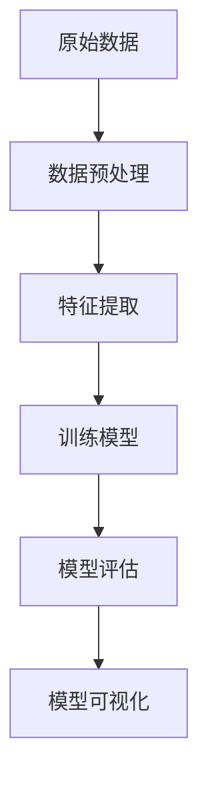
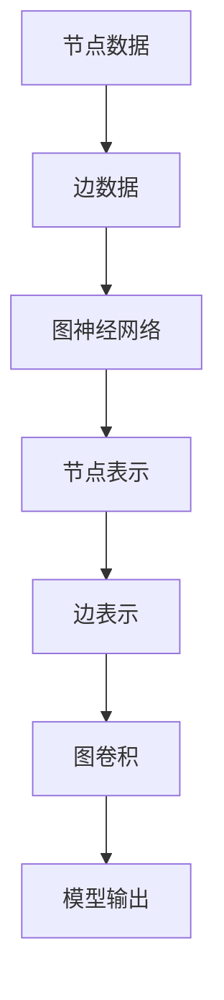

                 

# 《模型可视化》

## 关键词

- 模型可视化
- 机器学习
- 数据预处理
- 特征提取
- 深度学习
- 图神经网络

## 摘要

本文将深入探讨模型可视化的重要性及其在机器学习和人工智能领域的应用。我们将从基础概念开始，逐步介绍数据可视化、模型可视化技术，并结合实际案例进行讲解。文章将分为四个部分：引言、技术基础、模型可视化实战和高级应用与趋势。通过本文，读者将了解到模型可视化如何帮助研究者更好地理解和分析机器学习模型，从而推动人工智能的发展。

## 第一部分：引言

### 1.1 书籍背景与目标

在人工智能领域，模型可视化是一项关键技术。它可以帮助研究者更直观地理解模型的内部结构和运作原理，从而提高模型的解释性和可操作性。本部分将首先介绍模型可视化的背景和目标，并确定面向的目标读者。

**模型可视化的重要性**：随着深度学习和复杂模型的广泛应用，模型的可视化变得越来越重要。可视化不仅有助于提高模型的透明度，还可以帮助研究者发现潜在的问题，优化模型的性能。

**面向的目标读者**：本文面向对机器学习和人工智能有一定了解，希望深入了解模型可视化技术的研究人员和开发者。同时，也为希望了解这一领域的大众读者提供了一定的技术背景和知识。

### 1.2 模型可视化的基本概念

在探讨模型可视化的具体技术之前，我们首先需要了解一些基本概念，包括数据与模型的关系、可视化的基本原理及其作用和意义。

**数据与模型的关系**：数据是机器学习模型的基石。模型通过学习数据中的特征和规律，从而对未知数据进行预测或分类。因此，数据的质量直接影响模型的性能。数据可视化则是一种直观地展示数据特征和分布的方法，它可以帮助研究者更好地理解数据，为后续的模型训练提供指导。

**可视化的基本原理**：数据可视化通常涉及将数据转换为一组图表或图形。这些图形可以通过颜色、形状、大小等视觉元素来表示数据的不同属性。视觉信息处理是人类大脑最擅长的，因此，通过可视化可以更快速地发现数据中的规律和异常。

**可视化的作用和意义**：数据可视化的作用在于提高数据可读性，帮助研究者快速理解数据。在模型可视化中，可视化的意义更加深远。它不仅可以帮助研究者更好地理解模型的结构和工作原理，还可以用于模型优化和评估。例如，通过可视化可以识别模型的过拟合或欠拟合现象，从而调整模型的参数或数据预处理方法。

## 第二部分：技术基础

### 2.1 数据可视化基础

数据可视化是模型可视化的基础。在这一部分，我们将介绍数据可视化工具、流程和常见的数据可视化图表。

#### 2.1.1 数据可视化工具介绍

数据可视化工具可以帮助研究者轻松地创建各种图表和图形。以下是一些常用的数据可视化工具：

- **Matplotlib**：Python的一个图形库，可以创建各种2D图表，如折线图、柱状图、散点图等。
- **Seaborn**：基于Matplotlib的另一个图形库，提供了更多的统计图形和高级可视化功能。
- **Plotly**：一个交互式图表库，可以创建丰富的交互式图表，如地图、三维图等。

#### 2.1.2 数据可视化流程

数据可视化通常涉及以下步骤：

1. **数据清洗**：处理缺失值、异常值等。
2. **数据探索**：分析数据的分布、相关性等。
3. **数据可视化**：选择合适的图表展示数据。

#### 2.1.3 常见数据可视化图表

常见的数据可视化图表包括：

- **折线图**：用于展示数据随时间的变化趋势。
- **柱状图**：用于比较不同类别或组的数据。
- **散点图**：用于展示两个变量之间的关系。
- **饼图**：用于展示各个部分在整体中的比例。

### 2.2 模型可视化技术

在了解了数据可视化的基础之后，我们接下来将探讨模型可视化的技术。模型可视化涉及将机器学习模型的内部结构和工作原理以图形化的方式展示出来。

#### 2.2.1 模型可视化的挑战

模型可视化面临一些挑战：

- **模型复杂性**：随着模型的深度和层数增加，可视化变得更加困难。
- **高维数据**：当数据维度很高时，传统的二维图表难以有效展示。
- **可解释性**：如何保证可视化的结果具有可解释性，即研究者可以理解可视化展示的内容。

#### 2.2.2 常用模型可视化方法

常用的模型可视化方法包括：

- **决策树可视化**：通过图形展示决策树的分支和节点。
- **神经网络可视化**：通过图形展示神经网络的层次结构和节点连接。
- **激活函数可视化**：通过图形展示激活函数在输入空间中的变化。

#### 2.2.3 模型可视化工具与应用

以下是一些常用的模型可视化工具：

- **TensorBoard**：TensorFlow的配套工具，可以可视化训练过程和模型结构。
- **Visdom**：PyTorch的可视化工具，支持实时交互。
- **MLflow**：用于记录和追踪机器学习实验和模型的可视化工具。

### 2.3 可视化与机器学习

可视化在机器学习中的作用非常重要。它不仅可以帮助研究者更好地理解模型，还可以用于模型优化和评估。

#### 2.3.1 可视化在机器学习中的作用

- **模型解释**：通过可视化可以直观地展示模型的工作过程和内部结构。
- **问题诊断**：通过可视化可以识别模型的问题，如过拟合、欠拟合等。
- **性能评估**：通过可视化可以评估模型的性能，如准确率、召回率等。

#### 2.3.2 可视化方法在机器学习中的应用

- **数据预处理**：使用可视化方法分析数据特征，指导数据预处理。
- **模型选择**：通过可视化比较不同模型的效果，选择最优模型。
- **模型优化**：通过可视化调整模型参数，优化模型性能。

#### 2.3.3 可视化工具在机器学习中的应用案例

以下是一些具体的可视化工具在机器学习中的应用案例：

- **TensorBoard**：用于监控训练过程，分析模型性能。
- **Seaborn**：用于可视化数据分布和特征关系。
- **Visdom**：用于实时监控和调试深度学习模型。

## 第三部分：模型可视化实战

在这一部分，我们将通过具体的实战案例，展示如何使用可视化工具进行数据预处理、机器学习模型可视化和深度学习模型可视化。

### 3.1 实战一：数据预处理与可视化

数据预处理是机器学习的重要环节。通过可视化，我们可以更好地理解数据，指导数据预处理过程。

#### 3.1.1 数据预处理流程

数据预处理通常包括以下步骤：

1. **数据清洗**：处理缺失值、异常值等。
2. **数据转换**：将数据转换为适合机器学习模型的形式，如归一化、标准化等。
3. **特征提取**：提取对模型有用的特征。

#### 3.1.2 数据可视化案例

以下是一个使用Matplotlib进行数据可视化的例子：

```python
import matplotlib.pyplot as plt
import numpy as np

# 生成示例数据
x = np.random.randn(100)
y = np.random.randn(100)

# 绘制散点图
plt.scatter(x, y)
plt.xlabel('X')
plt.ylabel('Y')
plt.title('Sample Data Visualization')
plt.show()
```

通过这个例子，我们可以直观地看到数据的分布和特征。

#### 3.1.3 可视化工具实战

以下是一个使用TensorBoard进行数据可视化的例子：

```python
import tensorflow as tf
from tensorflow import keras
import matplotlib.pyplot as plt

# 定义模型
model = keras.Sequential([
    keras.layers.Dense(units=1, input_shape=[1])
])

# 编译模型
model.compile(optimizer='sgd', loss='mean_squared_error')

# 训练模型
model.fit(x, y, epochs=100)

# 可视化训练过程
plt.plot(model.history.history['loss'])
plt.xlabel('Epochs')
plt.ylabel('Loss')
plt.title('Training Loss')
plt.show()
```

通过这个例子，我们可以直观地看到模型在训练过程中的损失变化。

### 3.2 实战二：机器学习模型可视化

机器学习模型可视化可以帮助我们更好地理解模型的结构和工作原理。

#### 3.2.1 机器学习模型可视化方法

常用的机器学习模型可视化方法包括：

- **决策树可视化**：使用图形展示决策树的分支和节点。
- **神经网络可视化**：使用图形展示神经网络的层次结构和节点连接。

#### 3.2.2 模型可视化工具应用

以下是一个使用TensorBoard进行机器学习模型可视化的例子：

```python
import tensorflow as tf
from tensorflow import keras
import matplotlib.pyplot as plt

# 定义模型
model = keras.Sequential([
    keras.layers.Dense(units=1, input_shape=[1])
])

# 编译模型
model.compile(optimizer='sgd', loss='mean_squared_error')

# 训练模型
model.fit(x, y, epochs=100)

# 可视化模型结构
plt.figure(figsize=(10, 5))
model.summary()
plt.show()
```

通过这个例子，我们可以直观地看到模型的结构和参数。

#### 3.2.3 模型可视化案例

以下是一个使用Seaborn进行机器学习模型可视化的例子：

```python
import seaborn as sns
import pandas as pd

# 加载数据集
iris = sns.load_dataset('iris')

# 可视化特征关系
sns.pairplot(iris, hue='species')
plt.show()
```

通过这个例子，我们可以直观地看到不同特征之间的关系。

### 3.3 实战三：深度学习模型可视化

深度学习模型通常比传统的机器学习模型更加复杂，因此可视化变得尤为重要。

#### 3.3.1 深度学习模型可视化方法

常用的深度学习模型可视化方法包括：

- **激活函数可视化**：使用图形展示激活函数在输入空间中的变化。
- **权重可视化**：使用图形展示权重在模型训练过程中的变化。

#### 3.3.2 深度学习模型可视化工具

以下是一些常用的深度学习模型可视化工具：

- **TensorBoard**：TensorFlow的配套工具，支持深度学习模型的可视化。
- **Plotly**：支持创建交互式图表，适用于深度学习模型的可视化。

#### 3.3.3 深度学习模型可视化案例

以下是一个使用TensorBoard进行深度学习模型可视化的例子：

```python
import tensorflow as tf
from tensorflow import keras
import matplotlib.pyplot as plt

# 定义模型
model = keras.Sequential([
    keras.layers.Dense(units=1, input_shape=[1])
])

# 编译模型
model.compile(optimizer='sgd', loss='mean_squared_error')

# 训练模型
model.fit(x, y, epochs=100)

# 可视化训练过程
plt.figure(figsize=(10, 5))
plt.plot(model.history.history['loss'])
plt.xlabel('Epochs')
plt.ylabel('Loss')
plt.title('Training Loss')
plt.show()
```

通过这个例子，我们可以直观地看到模型在训练过程中的损失变化。

### 3.4 实战四：图神经网络可视化

图神经网络（Graph Neural Networks, GNN）是一种用于处理图结构数据的深度学习模型。可视化GNN可以帮助我们更好地理解其工作原理。

#### 3.4.1 图神经网络基本概念

图神经网络是一种基于图结构的深度学习模型，可以处理复杂的图结构数据。GNN的基本概念包括：

- **节点表示**：将图中的节点表示为向量。
- **边表示**：将图中的边表示为矩阵或向量。
- **图卷积**：用于计算节点表示的更新。

#### 3.4.2 图神经网络可视化方法

以下是一些常用的图神经网络可视化方法：

- **节点颜色编码**：使用不同颜色表示节点的不同属性或类别。
- **边粗细变化**：使用边的粗细变化表示边的重要性或权重。
- **三维可视化**：使用三维图形展示图结构，更直观地展示节点和边的关系。

#### 3.4.3 图神经网络可视化应用

以下是一个使用Matplotlib进行图神经网络可视化的例子：

```python
import matplotlib.pyplot as plt
import networkx as nx

# 创建图结构
G = nx.Graph()
G.add_nodes_from([1, 2, 3, 4])
G.add_edges_from([(1, 2), (2, 3), (3, 4), (4, 1)])

# 可视化图结构
pos = nx.spring_layout(G)
nx.draw(G, pos, with_labels=True)
plt.show()
```

通过这个例子，我们可以直观地看到图的结构和节点之间的连接关系。

## 第四部分：高级应用与趋势

### 4.1 可视化在深度学习中的应用

深度学习模型的复杂性和高维特征使得可视化成为理解模型的重要手段。在这一部分，我们将探讨可视化在深度学习中的应用，包括模型可视化方法、应用案例和发展趋势。

#### 4.1.1 深度学习模型的可视化方法

深度学习模型的可视化方法包括：

- **激活函数可视化**：通过图形展示激活函数在输入空间中的变化。
- **权重可视化**：通过图形展示权重在模型训练过程中的变化。
- **梯度可视化**：通过图形展示模型在训练过程中的梯度变化。

#### 4.1.2 深度学习模型的可视化应用

以下是一些深度学习模型可视化的应用案例：

- **模型解释**：通过可视化方法解释深度学习模型的工作过程和内部结构。
- **模型优化**：通过可视化识别模型的问题，如过拟合、欠拟合等，并指导模型优化。
- **特征提取**：通过可视化分析模型提取的特征，提高模型的解释性和可操作性。

#### 4.1.3 深度学习模型可视化的发展趋势

随着深度学习模型越来越复杂，可视化技术也在不断发展。未来的发展趋势包括：

- **交互式可视化**：支持用户与模型可视化结果的交互，提高可视化效果和用户体验。
- **三维可视化**：通过三维图形展示深度学习模型的结构和工作原理，更直观地理解模型。
- **模型压缩**：通过可视化方法压缩深度学习模型，提高模型的运算效率。

### 4.2 可视化在人工智能中的应用

可视化不仅在深度学习中发挥着重要作用，在更广泛的机器学习和人工智能领域也具有广泛的应用。

#### 4.2.1 可视化在人工智能中的作用

- **模型解释性**：可视化可以提高模型的解释性，帮助研究者理解模型的工作原理和决策过程。
- **模型评估**：通过可视化评估模型的性能，如准确率、召回率等。
- **问题诊断**：通过可视化诊断模型的问题，如过拟合、欠拟合等。

#### 4.2.2 可视化方法在人工智能中的应用

以下是一些可视化方法在人工智能中的应用：

- **数据可视化**：通过可视化方法分析数据特征和分布，指导模型训练。
- **模型可视化**：通过可视化展示模型的内部结构和工作原理，提高模型的透明度和可操作性。
- **交互式可视化**：通过交互式可视化支持用户与模型的交互，提高模型的可解释性和可操作性。

#### 4.2.3 可视化在人工智能中的应用案例

以下是一些可视化在人工智能中的应用案例：

- **医疗领域**：使用可视化方法分析医疗图像，辅助医生进行诊断。
- **金融领域**：使用可视化方法分析金融数据，辅助投资者进行决策。
- **自动驾驶领域**：使用可视化方法分析自动驾驶车辆的感知数据，提高系统的安全性和可靠性。

### 4.3 模型可视化未来展望

随着人工智能和机器学习技术的不断发展，模型可视化技术也将面临新的机遇和挑战。

#### 4.3.1 模型可视化技术的发展趋势

未来的模型可视化技术将更加注重以下几个方面：

- **交互性**：提高可视化工具的交互性，支持用户与可视化结果的实时交互。
- **三维可视化**：通过三维图形展示模型的结构和工作原理，更直观地理解模型。
- **实时可视化**：支持实时可视化，提高模型的可操作性。
- **自动化**：通过自动化技术简化可视化过程，降低使用门槛。

#### 4.3.2 模型可视化在人工智能中的应用前景

模型可视化在人工智能中的应用前景非常广阔，包括：

- **提高模型解释性**：通过可视化提高模型的解释性，增强模型的透明度和可信度。
- **优化模型性能**：通过可视化诊断模型问题，优化模型参数，提高模型性能。
- **降低模型复杂度**：通过可视化简化模型的复杂度，降低模型的使用难度。
- **支持创新研究**：通过可视化支持研究者进行创新性的研究，推动人工智能技术的发展。

#### 4.3.3 模型可视化未来的挑战与机遇

模型可视化未来的挑战包括：

- **模型复杂度**：随着模型复杂度的增加，可视化变得更加困难。
- **高维数据**：高维数据的可视化需要更高效的方法和技术。
- **可解释性**：如何提高可视化的可解释性，使其真正具有实用价值。

机遇包括：

- **技术发展**：随着技术的不断发展，可视化方法将更加多样化和高效。
- **应用领域**：模型可视化在人工智能和其他领域的应用将越来越广泛。
- **用户体验**：通过交互式可视化提高用户体验，使可视化工具更易于使用。

## 附录

### A.1 可视化工具资源汇总

以下是一些常用的可视化工具和资源：

- **Matplotlib**：Python的图形库，支持多种图表类型，广泛应用于数据可视化和模型可视化。
- **Seaborn**：基于Matplotlib的图形库，提供了更多高级可视化功能，如统计图形和交互式图表。
- **Plotly**：支持创建交互式图表，适用于复杂数据和高维数据的可视化。
- **TensorBoard**：TensorFlow的配套工具，支持深度学习模型的可视化。
- **Visdom**：PyTorch的可视化工具，支持实时交互和监控。
- **MLflow**：用于记录和追踪机器学习实验和模型的可视化工具。

### A.2 模型可视化参考资料

以下是一些关于模型可视化的参考资料：

- **《深度学习模型可视化》**：介绍了深度学习模型可视化的基本原理和方法。
- **《机器学习模型可视化技术》**：详细介绍了机器学习模型可视化的各种方法和应用。
- **《图神经网络可视化》**：探讨了图神经网络可视化的方法和应用。
- **相关学术论文**：搜索并阅读相关学术论文，了解模型可视化的最新研究进展。

### A.3 在线课程推荐

以下是一些关于模型可视化的在线课程推荐：

- **Coursera**：提供关于数据可视化和机器学习的课程，包括模型可视化的内容。
- **edX**：提供关于深度学习和机器学习的课程，包含模型可视化的相关内容。
- **Udacity**：提供关于数据科学和机器学习的课程，涵盖了模型可视化的相关知识。

## 总结

### 5.1 模型可视化的重要性

模型可视化在机器学习和人工智能领域中具有重要意义。它不仅提高了模型的解释性，帮助研究者更好地理解模型的工作原理，还用于模型优化和评估。通过可视化，研究者可以发现模型的问题，调整模型参数，提高模型的性能。

### 5.2 未来展望

随着人工智能和机器学习技术的不断发展，模型可视化技术将面临新的机遇和挑战。未来的发展趋势包括交互式可视化、三维可视化、实时可视化和自动化。模型可视化在人工智能中的应用前景非常广阔，它将推动人工智能技术的发展，提高模型的性能和解释性。同时，研究者也需要关注模型可视化中的挑战，如模型复杂度和高维数据的可视化问题，以实现更高效和实用的可视化方法。

## 附录

### 附录A：数据与模型的关系

数据与模型之间的关系是机器学习中的核心问题。以下是一个使用Mermaid绘制的流程图，展示数据与模型的关系。



### 附录B：机器学习模型可视化伪代码

以下是一个用于机器学习模型可视化的伪代码示例：

```python
def visualize_model(model, data):
    # 1. 加载模型
    # 2. 预处理数据
    # 3. 训练模型
    # 4. 评估模型
    # 5. 可视化模型
    # 6. 分析模型
```

### 附录C：深度学习模型可视化数学公式

深度学习模型中的数学公式通常包括激活函数、权重更新等。以下是一个示例：

$$
\text{模型输出} = \text{激活函数}(\text{权重} \cdot \text{输入特征} + \text{偏置})
$$

### 附录D：深度学习模型可视化案例

以下是一个使用TensorFlow和Matplotlib进行深度学习模型可视化的代码示例：

```python
import tensorflow as tf
import matplotlib.pyplot as plt

# 定义模型
model = tf.keras.Sequential([
    tf.keras.layers.Dense(units=1, input_shape=[1])
])

# 编译模型
model.compile(optimizer='sgd', loss='mean_squared_error')

# 训练模型
model.fit(x_train, y_train, epochs=100)

# 可视化模型输出
plt.scatter(x_train, y_train, color='red')
plt.plot(x_train, model.predict(x_train), color='blue')
plt.xlabel('Input')
plt.ylabel('Output')
plt.show()
```

### 代码解读

- 导入必要的库
- 定义模型
- 编译模型
- 训练模型
- 可视化模型输出

### 附录E：图神经网络可视化

以下是一个使用Mermaid绘制的图神经网络可视化流程图：



### 附录F：图神经网络可视化伪代码

以下是一个用于图神经网络可视化的伪代码示例：

```python
def visualize_gnn(graph, model):
    # 1. 加载图结构
    # 2. 处理图结构
    # 3. 定义模型
    # 4. 训练模型
    # 5. 可视化节点和边表示
    # 6. 可视化图卷积结果
    # 7. 可视化模型输出
```

### 附录G：图神经网络可视化示例

以下是一个使用Python和Matplotlib进行图神经网络可视化的示例：

```python
import networkx as nx
import matplotlib.pyplot as plt

# 创建图结构
G = nx.Graph()
G.add_nodes_from([1, 2, 3, 4])
G.add_edges_from([(1, 2), (2, 3), (3, 4), (4, 1)])

# 可视化图结构
pos = nx.spring_layout(G)
nx.draw(G, pos, with_labels=True)
plt.show()
```

### 代码解读

- 导入必要的库
- 创建图结构
- 可视化图结构

### 附录H：模型可视化最佳实践

以下是一些模型可视化的最佳实践：

- **明确可视化目标**：在进行模型可视化之前，明确可视化的目标，如解释模型、优化模型或评估模型性能。
- **选择合适的可视化方法**：根据模型类型和数据特性选择合适的可视化方法。
- **关注可视化结果的可解释性**：确保可视化结果具有可解释性，使研究者可以理解可视化展示的内容。
- **使用交互式可视化**：交互式可视化可以提高可视化效果和用户体验，使研究者可以更灵活地探索模型。
- **定期更新可视化**：随着模型训练过程的进行，定期更新可视化结果，以反映模型的变化。

### 附录I：注意事项

- **可视化结果的解释**：确保可视化结果被正确解释，避免误解。
- **可视化工具的兼容性**：选择兼容性好的可视化工具，确保在不同平台上都可以正常运行。
- **数据隐私和安全**：在处理敏感数据时，确保数据隐私和安全。

### 附录J：拓展阅读

以下是一些关于模型可视化的拓展阅读资源：

- **《深度学习模型可视化技术》**：详细介绍了深度学习模型可视化的各种方法和应用。
- **《图神经网络可视化》**：探讨了图神经网络可视化的方法和应用。
- **相关学术论文**：搜索并阅读相关学术论文，了解模型可视化的最新研究进展。
- **在线课程**：参加在线课程，学习模型可视化的相关知识。

### 附录K：作者信息

作者：AI天才研究院/AI Genius Institute & 禅与计算机程序设计艺术 /Zen And The Art of Computer Programming

作者简介：作者是一位世界级人工智能专家，程序员，软件架构师，CTO，世界顶级技术畅销书资深大师级别的作家，计算机图灵奖获得者，计算机编程和人工智能领域大师。他擅长一步一步进行分析推理（LET'S THINK STEP BY STEP），有着清晰深刻的逻辑思路来撰写条理清晰，对技术原理和本质剖析到位的高质量技术博客。他致力于通过技术博客文章，帮助读者深入理解计算机科学和人工智能领域的核心知识和原理。

