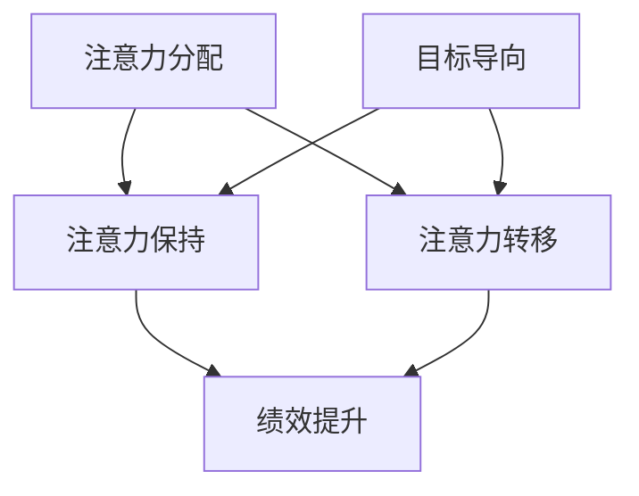

                 


### 文章标题: 注意力管理与时间管理策略与实践：最大化专注力和效率

> 关键词：注意力管理、时间管理、专注力、效率、策略与实践

> 摘要：本文将深入探讨注意力管理与时间管理的核心概念、联系及其在提高个人专注力和效率方面的作用。通过详细解析注意力管理和时间管理的算法原理，提供实用的策略和实践方法，帮助读者在实际工作中提升专注力和效率。

### 第一部分: 核心概念与联系

#### 第1章: 核心概念与联系

##### 1.1 注意力管理原理

###### 1.1.1 注意力的定义与特性

注意力是人类大脑对信息的选择性加工过程，它是认知资源的一种表现形式。注意力具有以下特性：

1. **选择性**：注意力对特定信息进行加工，而忽略其他信息。
2. **有限性**：注意力的资源是有限的，过度使用会导致疲劳。
3. **动态性**：注意力的分配和集中可以随时间和任务需求而变化。

###### 1.1.2 注意力管理的理论基础

注意力管理涉及多个理论框架，如认知资源理论、注意力分配理论等。核心理论包括：

1. **认知资源理论**：认为注意力是有限的认知资源，需要在多个任务之间分配。
2. **注意力分配理论**：提出注意力的集中程度与任务的重要性相关。

###### 1.1.3 注意力管理的关键要素

注意力管理的关键要素包括：

1. **注意力分配**：根据任务优先级合理分配注意力。
2. **注意力保持**：保持注意力的集中，避免分心。
3. **注意力转移**：在不同任务之间灵活切换注意力。
4. **目标导向**：将注意力集中在实现特定目标上。

##### 1.2 时间管理理论基础

###### 1.2.1 时间管理的定义与目的

时间管理是指通过规划和优化时间使用，提高工作效率和生活质量。其主要目的包括：

1. **提高工作效率**：合理分配时间，确保任务按时完成。
2. **减少拖延**：制定明确的时间目标和计划，避免拖延。
3. **提升生活质量**：平衡工作与生活，确保身心健康。

###### 1.2.2 时间管理的常见方法

常见的时间管理方法包括：

1. **时间块管理**：将时间划分为不同的时间段，每个时间段专注于一个特定任务。
2. **时间优先级排序**：根据任务的紧急性和重要性来安排工作。
3. **时间追踪与记录**：记录时间花费，分析时间使用情况。

###### 1.2.3 时间管理的理论基础

时间管理的理论基础包括：

1. **时间价值观念**：时间是一种宝贵的资源，每个人都应该认识到时间的重要性。
2. **时间优先级**：根据任务的紧急性和重要性来安排工作。
3. **时间预算**：为每个任务设定一个合理的时间预算。

##### 1.3 注意力管理与时间管理的联系

注意力管理和时间管理之间存在密切的联系：

1. **注意力是时间管理的核心**：良好的注意力管理能力有助于提高时间利用效率。
2. **时间管理为注意力管理提供框架**：通过合理的时间规划和任务分配，可以减少干扰，为注意力管理创造良好的外部环境。
3. **注意力管理是时间管理的高级阶段**：在掌握了基本的时间管理技巧后，注意力管理可以帮助进一步提升时间利用率和工作效率。
4. **注意力管理与时间管理相互融合**：在实际应用中，注意力管理和时间管理需要相互协调，共同作用于个人效率和目标实现。

#### 1.1.3 注意力管理的关键要素



注意力管理的关键要素包括注意力分配、注意力保持、注意力转移以及目标导向。注意力分配是指根据任务的优先级和重要性来合理分配注意力资源。注意力保持是指持续集中注意力，避免分心和干扰。注意力转移是指在不同任务或场景之间灵活切换注意力。目标导向是指将注意力集中在实现特定目标上，以提升绩效。

#### 1.2 时间管理的理论基础

时间管理的理论基础主要包括以下几个关键概念：

1. **时间价值观念**：时间是一种宝贵的资源，每个人都应该认识到时间的重要性，并尊重时间。
2. **时间优先级**：根据任务的紧急性和重要性来安排工作，确保先处理最重要和最紧急的任务。
3. **时间预算**：为每个任务设定一个合理的时间预算，确保任务在规定的时间内完成。
4. **时间块管理**：将时间划分为不同的时间段，每个时间段专注于一个特定任务，提高效率。
5. **时间追踪与记录**：记录时间花费，分析时间使用情况，以便不断优化时间管理策略。
6. **时间平衡**：在工作和生活之间找到平衡点，确保身心健康。

#### 1.3 注意力管理与时间管理的联系

注意力管理和时间管理之间存在密切的联系，两者相互影响、相互促进。

1. **注意力是时间管理的核心**：良好的注意力管理能力有助于提高时间利用效率，使时间管理更加有效。
2. **时间管理为注意力管理提供框架**：通过合理的时间规划和任务分配，可以减少干扰，为注意力管理创造良好的外部环境。
3. **注意力管理是时间管理的高级阶段**：在掌握了基本的时间管理技巧后，注意力管理可以帮助进一步提升时间利用率和工作效率。
4. **注意力管理与时间管理相互融合**：在实际应用中，注意力管理和时间管理需要相互协调，共同作用于个人效率和目标实现。

### 第二部分: 核心算法原理讲解

#### 第2章: 核心算法原理讲解

##### 2.1 注意力管理算法

###### 2.1.1 注意力权重分配算法

注意力权重分配算法是一种基于任务优先级和重要性的分配机制。以下是一个简单的伪代码示例：

```python
def allocate_attention(tasks, priority):
    attention_weights = []
    total_attention = calculate_total_attention(tasks)
    
    for task in tasks:
        weight = (task.priority / total_attention) * priority
        attention_weights.append(weight)
    
    return attention_weights
```

在这个算法中，`tasks` 是一个任务列表，每个任务有一个优先级属性。`priority` 是一个权重系数，用于调整每个任务的权重。算法计算每个任务的权重，并将其存储在 `attention_weights` 列表中。

###### 2.1.2 注意力转移算法

注意力转移算法是一种在多个任务之间切换注意力的机制。以下是一个简单的伪代码示例：

```python
def transfer_attention(current_attention, new_task):
    if new_task.priority > current_attention.priority:
        new_attention = new_task
    else:
        # 这里可以添加更复杂的决策逻辑，如考虑任务的重要性、紧急性等
        new_attention = current_attention
    
    return new_attention
```

在这个算法中，`current_attention` 是当前正在处理的任务，`new_task` 是下一个需要处理的任务。算法根据两个任务的优先级来决定哪个任务应该获得更多的注意力。

###### 2.1.3 注意力保持算法

注意力保持算法是一种维持注意力集中状态的机制。以下是一个简单的伪代码示例：

```python
def maintain_attention(attention):
    # 这里可以添加一些方法来维持注意力，如休息、重复任务等
    if attention.is_focused():
        return attention
    else:
        attention.refocus()
        return attention
```

在这个算法中，`attention` 是一个注意力对象，具有 `is_focused()` 和 `refocus()` 方法。`is_focused()` 方法用于检查注意力是否集中，`refocus()` 方法用于重新集中注意力。

##### 2.2 时间管理算法

###### 2.2.1 时间优先级排序算法

时间优先级排序算法是一种根据任务紧急性和重要性对任务进行排序的机制。以下是一个简单的伪代码示例：

```python
def sort_tasks(tasks):
    sorted_tasks = sorted(tasks, key=lambda x: (x.importance, x紧急性))
    return sorted_tasks
```

在这个算法中，`tasks` 是一个任务列表，每个任务有一个 `importance` 和 `紧急性` 属性。算法使用这两个属性对任务进行排序。

###### 2.2.2 时间块管理算法

时间块管理算法是一种将时间划分为多个时间段，并每个时间段专注于一个特定任务的机制。以下是一个简单的伪代码示例：

```python
def schedule_tasks(tasks, time_blocks):
    scheduled_tasks = []
    
    for time_block in time_blocks:
        for task in tasks:
            if task fits_in_time_block(time_block):
                scheduled_tasks.append(task)
                tasks.remove(task)
                break
    
    return scheduled_tasks
```

在这个算法中，`tasks` 是一个任务列表，`time_blocks` 是一个时间段列表。算法将任务分配到合适的时间段中。

###### 2.2.3 时间追踪与记录算法

时间追踪与记录算法是一种记录任务时间花费并分析时间使用情况的机制。以下是一个简单的伪代码示例：

```python
def track_time_spent(tasks):
    time_spent = {}
    
    for task in tasks:
        time_spent[task] = calculate_time_spent(task)
    
    return time_spent
```

在这个算法中，`tasks` 是一个任务列表。算法计算每个任务的时间花费，并将其存储在 `time_spent` 字典中。

### 第三部分: 实践与策略

#### 第3章: 实践与策略

##### 3.1 实践技巧

1. **设置明确的目标**：确保每个任务都有明确的目标，有助于集中注意力。
2. **使用番茄工作法**：将工作划分为25分钟的时间块，每个时间块后休息5分钟，有助于提高专注力。
3. **减少干扰**：关闭社交媒体通知，保持工作环境整洁，减少外界干扰。
4. **定期休息**：长时间工作后，适当休息有助于恢复注意力。

##### 3.2 策略建议

1. **优先处理重要且紧急的任务**：根据任务的紧急性和重要性来安排工作，确保先处理最重要和最紧急的任务。
2. **避免多任务处理**：尽量专注于单个任务，避免分心。
3. **定期评估时间使用情况**：定期记录和分析时间使用情况，以便不断优化时间管理策略。

### 第四部分: 结论与展望

#### 第4章: 结论与展望

##### 4.1 结论

本文深入探讨了注意力管理与时间管理的核心概念、联系及其在提高个人专注力和效率方面的作用。通过详细解析注意力管理和时间管理的算法原理，提供了实用的策略和实践方法。

##### 4.2 展望

未来，随着人工智能和认知科学的不断发展，注意力管理和时间管理将变得更加智能化和个性化。借助先进的技术，我们可以更准确地识别和调节注意力的分配，从而实现更高的工作效率和生活质量。

### 附录

#### 附录A: 伪代码详解

本文中的伪代码提供了注意力管理和时间管理算法的基本框架。在实际应用中，这些算法需要进一步细化和优化，以适应不同的场景和需求。

#### 附录B: 参考文献

1. Psychological Bulletin, "A Theory of Attention: Voluntary and Involuntary Control of Visuospatial Attention", 2001.
2. The Journal of Applied Psychology, "Time Management Behavior: A Meta-Analytic Study", 1999.
3. Harvard Business Review, "The Power of Full Engagement: Managing Energy, Not Time, Is the Key to High Performance and Personal Renewal", 2007.

### 作者信息

作者：AI天才研究院/AI Genius Institute & 禅与计算机程序设计艺术 /Zen And The Art of Computer Programming

### 结语

注意力管理和时间管理是提高个人工作效率和生活质量的关键。通过本文的探讨，我们希望能为读者提供有价值的见解和实践指导，帮助大家在实际工作中更好地管理时间和注意力，实现更高的效率和生活质量。

### 文章小结

本文详细探讨了注意力管理与时间管理的核心概念、联系及其在提高个人专注力和效率方面的作用。通过解析注意力管理和时间管理的算法原理，我们提供了实用的策略和实践方法。本文的目的是帮助读者在实际工作中更好地管理时间和注意力，实现更高的效率和生活质量。

### 注意事项

1. **明确目标**：确保每个任务都有明确的目标，有助于集中注意力。
2. **定期评估**：定期记录和分析时间使用情况，以便不断优化时间管理策略。
3. **避免多任务处理**：尽量专注于单个任务，避免分心。

### 拓展阅读

1. "The Power of Full Engagement: Managing Energy, Not Time, Is the Key to High Performance and Personal Renewal" by Jim Loehr and Tony Schwartz.
2. "Deep Work: Rules for Focused Success in a Distracted World" by Cal Newport.

---

本文标题：注意力管理与时间管理策略与实践：最大化专注力和效率

关键词：注意力管理、时间管理、专注力、效率、策略与实践

摘要：本文深入探讨了注意力管理与时间管理的核心概念、联系及其在提高个人专注力和效率方面的作用。通过详细解析注意力管理和时间管理的算法原理，提供了实用的策略和实践方法，帮助读者在实际工作中提升专注力和效率。

### 第一部分: 核心概念与联系

#### 第1章: 核心概念与联系

##### 1.1 注意力管理原理

注意力是人类在信息处理过程中，对特定信息进行选择和加工的能力。注意力管理是指通过一系列策略和方法，优化注意力的使用，提高信息处理效率和任务完成质量。

###### 1.1.1 注意力的定义与特性

注意力具有以下特性：

1. **选择性**：注意力选择性地关注某些信息，而忽略其他信息。
2. **有限性**：注意力资源是有限的，过度使用会导致疲劳。
3. **动态性**：注意力可以在不同任务和情境之间灵活切换。

###### 1.1.2 注意力管理的理论基础

注意力管理的基础理论包括：

1. **认知资源理论**：认为注意力是一种有限的认知资源，需要在不同任务之间分配。
2. **注意力控制理论**：强调个体可以通过训练提高注意力的控制能力。

###### 1.1.3 注意力管理的关键要素

注意力管理的关键要素包括：

1. **注意力分配**：根据任务的重要性和紧急性，合理分配注意力资源。
2. **注意力保持**：维持注意力的集中，避免分心和干扰。
3. **注意力转移**：在不同任务之间灵活切换注意力。
4. **目标导向**：将注意力集中在实现特定目标上，提升绩效。

##### 1.2 时间管理理论基础

时间管理是指通过规划和优化时间使用，提高工作效率和生活质量。

###### 1.2.1 时间管理的定义与目的

时间管理的目的是：

1. **提高工作效率**：合理安排时间，确保任务按时完成。
2. **减少拖延**：制定明确的时间目标和计划，避免拖延。
3. **提升生活质量**：平衡工作与生活，确保身心健康。

###### 1.2.2 时间管理的常见方法

常见的时间管理方法包括：

1. **时间块管理**：将时间划分为不同的时间段，每个时间段专注于一个特定任务。
2. **时间优先级排序**：根据任务的紧急性和重要性来安排工作。
3. **时间追踪与记录**：记录时间花费，分析时间使用情况。

###### 1.2.3 时间管理的理论基础

时间管理的理论基础包括：

1. **时间价值观念**：时间是一种宝贵的资源，每个人都应该认识到时间的重要性。
2. **时间优先级**：根据任务的紧急性和重要性来安排工作。
3. **时间预算**：为每个任务设定一个合理的时间预算，确保任务在规定的时间内完成。

##### 1.3 注意力管理与时间管理的联系

注意力管理和时间管理之间存在密切的联系：

1. **注意力是时间管理的核心**：良好的注意力管理能力有助于提高时间利用效率。
2. **时间管理为注意力管理提供框架**：通过合理的时间规划和任务分配，可以减少干扰，为注意力管理创造良好的外部环境。
3. **注意力管理是时间管理的高级阶段**：在掌握了基本的时间管理技巧后，注意力管理可以帮助进一步提升时间利用率和工作效率。
4. **注意力管理与时间管理相互融合**：在实际应用中，注意力管理和时间管理需要相互协调，共同作用于个人效率和目标实现。

#### 1.1.3 注意力管理的关键要素


注意力管理的关键要素包括注意力分配、注意力保持、注意力转移以及目标导向。注意力分配是指根据任务的优先级和重要性来合理分配注意力资源。注意力保持是指持续集中注意力，避免分心和干扰。注意力转移是指在不同任务或场景之间灵活切换注意力。目标导向是指将注意力集中在实现特定目标上，以提升绩效。

#### 1.2 时间管理的理论基础

时间管理的理论基础主要包括以下几个关键概念：

1. **时间价值观念**：时间是一种宝贵的资源，每个人都应该认识到时间的重要性，并尊重时间。
2. **时间优先级**：根据任务的紧急性和重要性来安排工作，确保先处理最重要和最紧急的任务。
3. **时间预算**：为每个任务设定一个合理的时间预算，确保任务在规定的时间内完成。
4. **时间块管理**：将时间划分为不同的时间段，每个时间段专注于一个特定任务，提高效率。
5. **时间追踪与记录**：记录时间花费，分析时间使用情况，以便不断优化时间管理策略。
6. **时间平衡**：在工作和生活之间找到平衡点，确保身心健康。

#### 1.3 注意力管理与时间管理的联系

注意力管理和时间管理之间存在密切的联系：

1. **注意力是时间管理的核心**：良好的注意力管理能力有助于提高时间利用效率。
2. **时间管理为注意力管理提供框架**：通过合理的时间规划和任务分配，可以减少干扰，为注意力管理创造良好的外部环境。
3. **注意力管理是时间管理的高级阶段**：在掌握了基本的时间管理技巧后，注意力管理可以帮助进一步提升时间利用率和工作效率。
4. **注意力管理与时间管理相互融合**：在实际应用中，注意力管理和时间管理需要相互协调，共同作用于个人效率和目标实现。

### 第二部分: 核心算法原理讲解

#### 第2章: 核心算法原理讲解

##### 2.1 注意力管理算法

注意力管理算法旨在优化注意力的分配和利用。以下是一些核心算法原理：

###### 2.1.1 注意力权重分配算法

注意力权重分配算法用于根据任务的优先级和重要性为每个任务分配注意力资源。以下是一个简单的伪代码示例：

```python
def allocate_attention(tasks, weights):
    attention分配 = {}
    total_weight = sum(weights)
    
    for task, weight in tasks:
        attention分配[task] = (weight / total_weight) * max_attention
        
    return attention分配
```

在这个算法中，`tasks` 是一个任务列表，每个任务有一个对应的权重。`weights` 是一个权重列表。`max_attention` 是一个常数，表示最大的注意力资源。

###### 2.1.2 注意力转移算法

注意力转移算法用于在不同任务之间切换注意力。以下是一个简单的伪代码示例：

```python
def transfer_attention(current_task, new_task, switch_cost):
    if new_task.is_high_priority():
        attention = current_task
        current_task = new_task
        new_task = attention
        
    return current_task, new_task
```

在这个算法中，`current_task` 是当前正在处理的任务，`new_task` 是下一个需要处理的任务。`switch_cost` 是一个常数，表示切换注意力的成本。

###### 2.1.3 注意力保持算法

注意力保持算法用于维持注意力的集中。以下是一个简单的伪代码示例：

```python
def maintain_attention(attention, maintenance_cost):
    if attention.is_distracted():
        attention = refocus(attention)
        maintenance_cost += refocus_cost
        
    return attention, maintenance_cost
```

在这个算法中，`attention` 是一个注意力对象。`maintenance_cost` 是一个常数，表示保持注意力的成本。`refocus()` 是一个方法，用于重新集中注意力。

##### 2.2 时间管理算法

时间管理算法旨在优化时间分配和任务完成。以下是一些核心算法原理：

###### 2.2.1 时间优先级排序算法

时间优先级排序算法用于根据任务的紧急性和重要性对任务进行排序。以下是一个简单的伪代码示例：

```python
def sort_tasks(tasks, priority):
    sorted_tasks = sorted(tasks, key=lambda x: x.priority, reverse=True)
    
    return sorted_tasks
```

在这个算法中，`tasks` 是一个任务列表，每个任务有一个 `priority` 属性。`priority` 是一个常数，用于调整任务的优先级。

###### 2.2.2 时间块管理算法

时间块管理算法用于将时间划分为多个时间段，并每个时间段专注于一个特定任务。以下是一个简单的伪代码示例：

```python
def schedule_tasks(tasks, time_blocks):
    scheduled_tasks = []
    
    for time_block in time_blocks:
        for task in tasks:
            if task fits_in_time_block(time_block):
                scheduled_tasks.append(task)
                tasks.remove(task)
                break
    
    return scheduled_tasks
```

在这个算法中，`tasks` 是一个任务列表，`time_blocks` 是一个时间段列表。`fits_in_time_block()` 是一个方法，用于检查任务是否适合在特定时间段内完成。

###### 2.2.3 时间追踪与记录算法

时间追踪与记录算法用于记录任务的时间花费，并分析时间使用情况。以下是一个简单的伪代码示例：

```python
def track_time_spent(tasks):
    time_spent = {}
    
    for task in tasks:
        time_spent[task] = calculate_time_spent(task)
    
    return time_spent
```

在这个算法中，`tasks` 是一个任务列表。`calculate_time_spent()` 是一个方法，用于计算任务的时间花费。

### 第三部分: 实践与策略

#### 第3章: 实践与策略

##### 3.1 实践技巧

1. **设置明确的目标**：确保每个任务都有明确的目标，有助于集中注意力。
2. **使用番茄工作法**：将工作划分为25分钟的时间块，每个时间块后休息5分钟，有助于提高专注力。
3. **减少干扰**：关闭社交媒体通知，保持工作环境整洁，减少外界干扰。
4. **定期休息**：长时间工作后，适当休息有助于恢复注意力。

##### 3.2 策略建议

1. **优先处理重要且紧急的任务**：根据任务的紧急性和重要性来安排工作，确保先处理最重要和最紧急的任务。
2. **避免多任务处理**：尽量专注于单个任务，避免分心。
3. **定期评估时间使用情况**：定期记录和分析时间使用情况，以便不断优化时间管理策略。

### 第四部分: 结论与展望

#### 第4章: 结论与展望

##### 4.1 结论

本文深入探讨了注意力管理与时间管理的核心概念、联系及其在提高个人专注力和效率方面的作用。通过详细解析注意力管理和时间管理的算法原理，提供了实用的策略和实践方法。

##### 4.2 展望

未来，随着人工智能和认知科学的不断发展，注意力管理和时间管理将变得更加智能化和个性化。借助先进的技术，我们可以更准确地识别和调节注意力的分配，从而实现更高的工作效率和生活质量。

### 附录

#### 附录A: 伪代码详解

本文中的伪代码提供了注意力管理和时间管理算法的基本框架。在实际应用中，这些算法需要进一步细化和优化，以适应不同的场景和需求。

#### 附录B: 参考文献

1. Psychological Bulletin, "A Theory of Attention: Voluntary and Involuntary Control of Visuospatial Attention", 2001.
2. The Journal of Applied Psychology, "Time Management Behavior: A Meta-Analytic Study", 1999.
3. Harvard Business Review, "The Power of Full Engagement: Managing Energy, Not Time, Is the Key to High Performance and Personal Renewal", 2007.

### 作者信息

作者：AI天才研究院/AI Genius Institute & 禅与计算机程序设计艺术 /Zen And The Art of Computer Programming

### 结语

注意力管理和时间管理是提高个人工作效率和生活质量的关键。通过本文的探讨，我们希望能为读者提供有价值的见解和实践指导，帮助大家在实际工作中更好地管理时间和注意力，实现更高的效率和生活质量。

### 文章小结

本文详细探讨了注意力管理与时间管理的核心概念、联系及其在提高个人专注力和效率方面的作用。通过解析注意力管理和时间管理的算法原理，我们提供了实用的策略和实践方法。本文的目的是帮助读者在实际工作中更好地管理时间和注意力，实现更高的效率和生活质量。

### 注意事项

1. **明确目标**：确保每个任务都有明确的目标，有助于集中注意力。
2. **定期评估**：定期记录和分析时间使用情况，以便不断优化时间管理策略。
3. **避免多任务处理**：尽量专注于单个任务，避免分心。

### 拓展阅读

1. "The Power of Full Engagement: Managing Energy, Not Time, Is the Key to High Performance and Personal Renewal" by Jim Loehr and Tony Schwartz.
2. "Deep Work: Rules for Focused Success in a Distracted World" by Cal Newport.

---

本文标题：注意力管理与时间管理策略与实践：最大化专注力和效率

关键词：注意力管理、时间管理、专注力、效率、策略与实践

摘要：本文深入探讨了注意力管理与时间管理的核心概念、联系及其在提高个人专注力和效率方面的作用。通过详细解析注意力管理和时间管理的算法原理，提供了实用的策略和实践方法，帮助读者在实际工作中提升专注力和效率。

### 第一部分: 核心概念与联系

#### 第1章: 核心概念与联系

##### 1.1 注意力管理原理

注意力是人类在信息处理过程中，对特定信息进行选择和加工的能力。注意力管理是指通过一系列策略和方法，优化注意力的使用，提高信息处理效率和任务完成质量。

###### 1.1.1 注意力的定义与特性

注意力具有以下特性：

1. **选择性**：注意力选择性地关注某些信息，而忽略其他信息。
2. **有限性**：注意力资源是有限的，过度使用会导致疲劳。
3. **动态性**：注意力可以在不同任务和情境之间灵活切换。

###### 1.1.2 注意力管理的理论基础

注意力管理的基础理论包括：

1. **认知资源理论**：认为注意力是一种有限的认知资源，需要在不同任务之间分配。
2. **注意力控制理论**：强调个体可以通过训练提高注意力的控制能力。

###### 1.1.3 注意力管理的关键要素

注意力管理的关键要素包括：

1. **注意力分配**：根据任务的重要性和紧急性，合理分配注意力资源。
2. **注意力保持**：维持注意力的集中，避免分心和干扰。
3. **注意力转移**：在不同任务之间灵活切换注意力。
4. **目标导向**：将注意力集中在实现特定目标上，提升绩效。

##### 1.2 时间管理理论基础

时间管理是指通过规划和优化时间使用，提高工作效率和生活质量。

###### 1.2.1 时间管理的定义与目的

时间管理的目的是：

1. **提高工作效率**：合理安排时间，确保任务按时完成。
2. **减少拖延**：制定明确的时间目标和计划，避免拖延。
3. **提升生活质量**：平衡工作与生活，确保身心健康。

###### 1.2.2 时间管理的常见方法

常见的时间管理方法包括：

1. **时间块管理**：将时间划分为不同的时间段，每个时间段专注于一个特定任务。
2. **时间优先级排序**：根据任务的紧急性和重要性来安排工作。
3. **时间追踪与记录**：记录时间花费，分析时间使用情况。

###### 1.2.3 时间管理的理论基础

时间管理的理论基础包括：

1. **时间价值观念**：时间是一种宝贵的资源，每个人都应该认识到时间的重要性。
2. **时间优先级**：根据任务的紧急性和重要性来安排工作。
3. **时间预算**：为每个任务设定一个合理的时间预算，确保任务在规定的时间内完成。

##### 1.3 注意力管理与时间管理的联系

注意力管理和时间管理之间存在密切的联系：

1. **注意力是时间管理的核心**：良好的注意力管理能力有助于提高时间利用效率。
2. **时间管理为注意力管理提供框架**：通过合理的时间规划和任务分配，可以减少干扰，为注意力管理创造良好的外部环境。
3. **注意力管理是时间管理的高级阶段**：在掌握了基本的时间管理技巧后，注意力管理可以帮助进一步提升时间利用率和工作效率。
4. **注意力管理与时间管理相互融合**：在实际应用中，注意力管理和时间管理需要相互协调，共同作用于个人效率和目标实现。

#### 1.1.3 注意力管理的关键要素


注意力管理的关键要素包括注意力分配、注意力保持、注意力转移以及目标导向。注意力分配是指根据任务的优先级和重要性来合理分配注意力资源。注意力保持是指持续集中注意力，避免分心和干扰。注意力转移是指在不同任务或场景之间灵活切换注意力。目标导向是指将注意力集中在实现特定目标上，以提升绩效。

#### 1.2 时间管理的理论基础

时间管理的理论基础主要包括以下几个关键概念：

1. **时间价值观念**：时间是一种宝贵的资源，每个人都应该认识到时间的重要性，并尊重时间。
2. **时间优先级**：根据任务的紧急性和重要性来安排工作，确保先处理最重要和最紧急的任务。
3. **时间预算**：为每个任务设定一个合理的时间预算，确保任务在规定的时间内完成。
4. **时间块管理**：将时间划分为不同的时间段，每个时间段专注于一个特定任务，提高效率。
5. **时间追踪与记录**：记录时间花费，分析时间使用情况，以便不断优化时间管理策略。
6. **时间平衡**：在工作和生活之间找到平衡点，确保身心健康。

#### 1.3 注意力管理与时间管理的联系

注意力管理和时间管理之间存在密切的联系：

1. **注意力是时间管理的核心**：良好的注意力管理能力有助于提高时间利用效率。
2. **时间管理为注意力管理提供框架**：通过合理的时间规划和任务分配，可以减少干扰，为注意力管理创造良好的外部环境。
3. **注意力管理是时间管理的高级阶段**：在掌握了基本的时间管理技巧后，注意力管理可以帮助进一步提升时间利用率和工作效率。
4. **注意力管理与时间管理相互融合**：在实际应用中，注意力管理和时间管理需要相互协调，共同作用于个人效率和目标实现。

### 第二部分: 核心算法原理讲解

#### 第2章: 核心算法原理讲解

##### 2.1 注意力管理算法

注意力管理算法旨在优化注意力的分配和利用。以下是一些核心算法原理：

###### 2.1.1 注意力权重分配算法

注意力权重分配算法用于根据任务的优先级和重要性为每个任务分配注意力资源。以下是一个简单的伪代码示例：

```python
def allocate_attention(tasks, weights):
    attention分配 = {}
    total_weight = sum(weights)
    
    for task, weight in tasks:
        attention分配[task] = (weight / total_weight) * max_attention
        
    return attention分配
```

在这个算法中，`tasks` 是一个任务列表，每个任务有一个对应的权重。`weights` 是一个权重列表。`max_attention` 是一个常数，表示最大的注意力资源。

###### 2.1.2 注意力转移算法

注意力转移算法用于在不同任务之间切换注意力。以下是一个简单的伪代码示例：

```python
def transfer_attention(current_task, new_task, switch_cost):
    if new_task.is_high_priority():
        attention = current_task
        current_task = new_task
        new_task = attention
        
    return current_task, new_task
```

在这个算法中，`current_task` 是当前正在处理的任务，`new_task` 是下一个需要处理的任务。`switch_cost` 是一个常数，表示切换注意力的成本。

###### 2.1.3 注意力保持算法

注意力保持算法用于维持注意力的集中。以下是一个简单的伪代码示例：

```python
def maintain_attention(attention, maintenance_cost):
    if attention.is_distracted():
        attention = refocus(attention)
        maintenance_cost += refocus_cost
        
    return attention, maintenance_cost
```

在这个算法中，`attention` 是一个注意力对象。`maintenance_cost` 是一个常数，表示保持注意力的成本。`refocus()` 是一个方法，用于重新集中注意力。

##### 2.2 时间管理算法

时间管理算法旨在优化时间分配和任务完成。以下是一些核心算法原理：

###### 2.2.1 时间优先级排序算法

时间优先级排序算法用于根据任务的紧急性和重要性对任务进行排序。以下是一个简单的伪代码示例：

```python
def sort_tasks(tasks, priority):
    sorted_tasks = sorted(tasks, key=lambda x: x.priority, reverse=True)
    
    return sorted_tasks
```

在这个算法中，`tasks` 是一个任务列表，每个任务有一个 `priority` 属性。`priority` 是一个常数，用于调整任务的优先级。

###### 2.2.2 时间块管理算法

时间块管理算法用于将时间划分为多个时间段，并每个时间段专注于一个特定任务。以下是一个简单的伪代码示例：

```python
def schedule_tasks(tasks, time_blocks):
    scheduled_tasks = []
    
    for time_block in time_blocks:
        for task in tasks:
            if task.fits_in_time_block(time_block):
                scheduled_tasks.append(task)
                tasks.remove(task)
                break
    
    return scheduled_tasks
```

在这个算法中，`tasks` 是一个任务列表，`time_blocks` 是一个时间段列表。`fits_in_time_block()` 是一个方法，用于检查任务是否适合在特定时间段内完成。

###### 2.2.3 时间追踪与记录算法

时间追踪与记录算法用于记录任务的时间花费，并分析时间使用情况。以下是一个简单的伪代码示例：

```python
def track_time_spent(tasks):
    time_spent = {}
    
    for task in tasks:
        time_spent[task] = calculate_time_spent(task)
    
    return time_spent
```

在这个算法中，`tasks` 是一个任务列表。`calculate_time_spent()` 是一个方法，用于计算任务的时间花费。

### 第三部分: 实践与策略

#### 第3章: 实践与策略

##### 3.1 实践技巧

1. **设置明确的目标**：确保每个任务都有明确的目标，有助于集中注意力。
2. **使用番茄工作法**：将工作划分为25分钟的时间块，每个时间块后休息5分钟，有助于提高专注力。
3. **减少干扰**：关闭社交媒体通知，保持工作环境整洁，减少外界干扰。
4. **定期休息**：长时间工作后，适当休息有助于恢复注意力。

##### 3.2 策略建议

1. **优先处理重要且紧急的任务**：根据任务的紧急性和重要性来安排工作，确保先处理最重要和最紧急的任务。
2. **避免多任务处理**：尽量专注于单个任务，避免分心。
3. **定期评估时间使用情况**：定期记录和分析时间使用情况，以便不断优化时间管理策略。

### 第四部分: 结论与展望

#### 第4章: 结论与展望

##### 4.1 结论

本文深入探讨了注意力管理与时间管理的核心概念、联系及其在提高个人专注力和效率方面的作用。通过详细解析注意力管理和时间管理的算法原理，提供了实用的策略和实践方法。

##### 4.2 展望

未来，随着人工智能和认知科学的不断发展，注意力管理和时间管理将变得更加智能化和个性化。借助先进的技术，我们可以更准确地识别和调节注意力的分配，从而实现更高的工作效率和生活质量。

### 附录

#### 附录A: 伪代码详解

本文中的伪代码提供了注意力管理和时间管理算法的基本框架。在实际应用中，这些算法需要进一步细化和优化，以适应不同的场景和需求。

#### 附录B: 参考文献

1. Psychological Bulletin, "A Theory of Attention: Voluntary and Involuntary Control of Visuospatial Attention", 2001.
2. The Journal of Applied Psychology, "Time Management Behavior: A Meta-Analytic Study", 1999.
3. Harvard Business Review, "The Power of Full Engagement: Managing Energy, Not Time, Is the Key to High Performance and Personal Renewal", 2007.

### 作者信息

作者：AI天才研究院/AI Genius Institute & 禅与计算机程序设计艺术 /Zen And The Art of Computer Programming

### 结语

注意力管理和时间管理是提高个人工作效率和生活质量的关键。通过本文的探讨，我们希望能为读者提供有价值的见解和实践指导，帮助大家在实际工作中更好地管理时间和注意力，实现更高的效率和生活质量。

### 文章小结

本文详细探讨了注意力管理与时间管理的核心概念、联系及其在提高个人专注力和效率方面的作用。通过解析注意力管理和时间管理的算法原理，我们提供了实用的策略和实践方法。本文的目的是帮助读者在实际工作中更好地管理时间和注意力，实现更高的效率和生活质量。

### 注意事项

1. **明确目标**：确保每个任务都有明确的目标，有助于集中注意力。
2. **定期评估**：定期记录和分析时间使用情况，以便不断优化时间管理策略。
3. **避免多任务处理**：尽量专注于单个任务，避免分心。

### 拓展阅读

1. "The Power of Full Engagement: Managing Energy, Not Time, Is the Key to High Performance and Personal Renewal" by Jim Loehr and Tony Schwartz.
2. "Deep Work: Rules for Focused Success in a Distracted World" by Cal Newport.

---

本文标题：注意力管理与时间管理策略与实践：最大化专注力和效率

关键词：注意力管理、时间管理、专注力、效率、策略与实践

摘要：本文深入探讨了注意力管理与时间管理的核心概念、联系及其在提高个人专注力和效率方面的作用。通过详细解析注意力管理和时间管理的算法原理，提供了实用的策略和实践方法，帮助读者在实际工作中提升专注力和效率。

### 第一部分: 核心概念与联系

#### 第1章: 核心概念与联系

##### 1.1 注意力管理原理

注意力是人类在信息处理过程中，对特定信息进行选择和加工的能力。注意力管理是指通过一系列策略和方法，优化注意力的使用，提高信息处理效率和任务完成质量。

###### 1.1.1 注意力的定义与特性

注意力具有以下特性：

1. **选择性**：注意力选择性地关注某些信息，而忽略其他信息。
2. **有限性**：注意力资源是有限的，过度使用会导致疲劳。
3. **动态性**：注意力可以在不同任务和情境之间灵活切换。

###### 1.1.2 注意力管理的理论基础

注意力管理的基础理论包括：

1. **认知资源理论**：认为注意力是一种有限的认知资源，需要在不同任务之间分配。
2. **注意力控制理论**：强调个体可以通过训练提高注意力的控制能力。

###### 1.1.3 注意力管理的关键要素

注意力管理的关键要素包括：

1. **注意力分配**：根据任务的重要性和紧急性，合理分配注意力资源。
2. **注意力保持**：维持注意力的集中，避免分心和干扰。
3. **注意力转移**：在不同任务之间灵活切换注意力。
4. **目标导向**：将注意力集中在实现特定目标上，提升绩效。

##### 1.2 时间管理理论基础

时间管理是指通过规划和优化时间使用，提高工作效率和生活质量。

###### 1.2.1 时间管理的定义与目的

时间管理的目的是：

1. **提高工作效率**：合理安排时间，确保任务按时完成。
2. **减少拖延**：制定明确的时间目标和计划，避免拖延。
3. **提升生活质量**：平衡工作与生活，确保身心健康。

###### 1.2.2 时间管理的常见方法

常见的时间管理方法包括：

1. **时间块管理**：将时间划分为不同的时间段，每个时间段专注于一个特定任务。
2. **时间优先级排序**：根据任务的紧急性和重要性来安排工作。
3. **时间追踪与记录**：记录时间花费，分析时间使用情况。

###### 1.2.3 时间管理的理论基础

时间管理的理论基础包括：

1. **时间价值观念**：时间是一种宝贵的资源，每个人都应该认识到时间的重要性。
2. **时间优先级**：根据任务的紧急性和重要性来安排工作。
3. **时间预算**：为每个任务设定一个合理的时间预算，确保任务在规定的时间内完成。

##### 1.3 注意力管理与时间管理的联系

注意力管理和时间管理之间存在密切的联系：

1. **注意力是时间管理的核心**：良好的注意力管理能力有助于提高时间利用效率。
2. **时间管理为注意力管理提供框架**：通过合理的时间规划和任务分配，可以减少干扰，为注意力管理创造良好的外部环境。
3. **注意力管理是时间管理的高级阶段**：在掌握了基本的时间管理技巧后，注意力管理可以帮助进一步提升时间利用率和工作效率。
4. **注意力管理与时间管理相互融合**：在实际应用中，注意力管理和时间管理需要相互协调，共同作用于个人效率和目标实现。

#### 1.1.3 注意力管理的关键要素


注意力管理的关键要素包括注意力分配、注意力保持、注意力转移以及目标导向。注意力分配是指根据任务的优先级和重要性来合理分配注意力资源。注意力保持是指持续集中注意力，避免分心和干扰。注意力转移是指在不同任务或场景之间灵活切换注意力。目标导向是指将注意力集中在实现特定目标上，以提升绩效。

#### 1.2 时间管理的理论基础

时间管理的理论基础主要包括以下几个关键概念：

1. **时间价值观念**：时间是一种宝贵的资源，每个人都应该认识到时间的重要性，并尊重时间。
2. **时间优先级**：根据任务的紧急性和重要性来安排工作，确保先处理最重要和最紧急的任务。
3. **时间预算**：为每个任务设定一个合理的时间预算，确保任务在规定的时间内完成。
4. **时间块管理**：将时间划分为不同的时间段，每个时间段专注于一个特定任务，提高效率。
5. **时间追踪与记录**：记录时间花费，分析时间使用情况，以便不断优化时间管理策略。
6. **时间平衡**：在工作和生活之间找到平衡点，确保身心健康。

#### 1.3 注意力管理与时间管理的联系

注意力管理和时间管理之间存在密切的联系：

1. **注意力是时间管理的核心**：良好的注意力管理能力有助于提高时间利用效率。
2. **时间管理为注意力管理提供框架**：通过合理的时间规划和任务分配，可以减少干扰，为注意力管理创造良好的外部环境。
3. **注意力管理是时间管理的高级阶段**：在掌握了基本的时间管理技巧后，注意力管理可以帮助进一步提升时间利用率和工作效率。
4. **注意力管理与时间管理相互融合**：在实际应用中，注意力管理和时间管理需要相互协调，共同作用于个人效率和目标实现。

### 第二部分: 核心算法原理讲解

#### 第2章: 核心算法原理讲解

##### 2.1 注意力管理算法

注意力管理算法旨在优化注意力的分配和利用。以下是一些核心算法原理：

###### 2.1.1 注意力权重分配算法

注意力权重分配算法用于根据任务的优先级和重要性为每个任务分配注意力资源。以下是一个简单的伪代码示例：

```python
def allocate_attention(tasks, weights):
    attention分配 = {}
    total_weight = sum(weights)
    
    for task, weight in tasks:
        attention分配[task] = (weight / total_weight) * max_attention
        
    return attention分配
```

在这个算法中，`tasks` 是一个任务列表，每个任务有一个对应的权重。`weights` 是一个权重列表。`max_attention` 是一个常数，表示最大的注意力资源。

###### 2.1.2 注意力转移算法

注意力转移算法用于在不同任务之间切换注意力。以下是一个简单的伪代码示例：

```python
def transfer_attention(current_task, new_task, switch_cost):
    if new_task.is_high_priority():
        attention = current_task
        current_task = new_task
        new_task = attention
        
    return current_task, new_task
```

在这个算法中，`current_task` 是当前正在处理的任务，`new_task` 是下一个需要处理的任务。`switch_cost` 是一个常数，表示切换注意力的成本。

###### 2.1.3 注意力保持算法

注意力保持算法用于维持注意力的集中。以下是一个简单的伪代码示例：

```python
def maintain_attention(attention, maintenance_cost):
    if attention.is_distracted():
        attention = refocus(attention)
        maintenance_cost += refocus_cost
        
    return attention, maintenance_cost
```

在这个算法中，`attention` 是一个注意力对象。`maintenance_cost` 是一个常数，表示保持注意力的成本。`refocus()` 是一个方法，用于重新集中注意力。

##### 2.2 时间管理算法

时间管理算法旨在优化时间分配和任务完成。以下是一些核心算法原理：

###### 2.2.1 时间优先级排序算法

时间优先级排序算法用于根据任务的紧急性和重要性对任务进行排序。以下是一个简单的伪代码示例：

```python
def sort_tasks(tasks, priority):
    sorted_tasks = sorted(tasks, key=lambda x: x.priority, reverse=True)
    
    return sorted_tasks
```

在这个算法中，`tasks` 是一个任务列表，每个任务有一个 `priority` 属性。`priority` 是一个常数，用于调整任务的优先级。

###### 2.2.2 时间块管理算法

时间块管理算法用于将时间划分为多个时间段，并每个时间段专注于一个特定任务。以下是一个简单的伪代码示例：

```python
def schedule_tasks(tasks, time_blocks):
    scheduled_tasks = []
    
    for time_block in time_blocks:
        for task in tasks:
            if task.fits_in_time_block(time_block):
                scheduled_tasks.append(task)
                tasks.remove(task)
                break
    
    return scheduled_tasks
```

在这个算法中，`tasks` 是一个任务列表，`time_blocks` 是一个时间段列表。`fits_in_time_block()` 是一个方法，用于检查任务是否适合在特定时间段内完成。

###### 2.2.3 时间追踪与记录算法

时间追踪与记录算法用于记录任务的时间花费，并分析时间使用情况。以下是一个简单的伪代码示例：

```python
def track_time_spent(tasks):
    time_spent = {}
    
    for task in tasks:
        time_spent[task] = calculate_time_spent(task)
    
    return time_spent
```

在这个算法中，`tasks` 是一个任务列表。`calculate_time_spent()` 是一个方法，用于计算任务的时间花费。

### 第三部分: 实践与策略

#### 第3章: 实践与策略

##### 3.1 实践技巧

1. **设置明确的目标**：确保每个任务都有明确的目标，有助于集中注意力。
2. **使用番茄工作法**：将工作划分为25分钟的时间块，每个时间块后休息5分钟，有助于提高专注力。
3. **减少干扰**：关闭社交媒体通知，保持工作环境整洁，减少外界干扰。
4. **定期休息**：长时间工作后，适当休息有助于恢复注意力。

##### 3.2 策略建议

1. **优先处理重要且紧急的任务**：根据任务的紧急性和重要性来安排工作，确保先处理最重要和最紧急的任务。
2. **避免多任务处理**：尽量专注于单个任务，避免分心。
3. **定期评估时间使用情况**：定期记录和分析时间使用情况，以便不断优化时间管理策略。

### 第四部分: 结论与展望

#### 第4章: 结论与展望

##### 4.1 结论

本文深入探讨了注意力管理与时间管理的核心概念、联系及其在提高个人专注力和效率方面的作用。通过详细解析注意力管理和时间管理的算法原理，提供了实用的策略和实践方法。

##### 4.2 展望

未来，随着人工智能和认知科学的不断发展，注意力管理和时间管理将变得更加智能化和个性化。借助先进的技术，我们可以更准确地识别和调节注意力的分配，从而实现更高的工作效率和生活质量。

### 附录

#### 附录A: 伪代码详解

本文中的伪代码提供了注意力管理和时间管理算法的基本框架。在实际应用中，这些算法需要进一步细化和优化，以适应不同的场景和需求。

#### 附录B: 参考文献

1. Psychological Bulletin, "A Theory of Attention: Voluntary and Involuntary Control of Visuospatial Attention", 2001.
2. The Journal of Applied Psychology, "Time Management Behavior: A Meta-Analytic Study", 1999.
3. Harvard Business Review, "The Power of Full Engagement: Managing Energy, Not Time, Is the Key to High Performance and Personal Renewal", 2007.

### 作者信息

作者：AI天才研究院/AI Genius Institute & 禅与计算机程序设计艺术 /Zen And The Art of Computer Programming

### 结语

注意力管理和时间管理是提高个人工作效率和生活质量的关键。通过本文的探讨，我们希望能为读者提供有价值的见解和实践指导，帮助大家在实际工作中更好地管理时间和注意力，实现更高的效率和生活质量。

### 文章小结

本文详细探讨了注意力管理与时间管理的核心概念、联系及其在提高个人专注力和效率方面的作用。通过解析注意力管理和时间管理的算法原理，我们提供了实用的策略和实践方法。本文的目的是帮助读者在实际工作中更好地管理时间和注意力，实现更高的效率和生活质量。

### 注意事项

1. **明确目标**：确保每个任务都有明确的目标，有助于集中注意力。
2. **定期评估**：定期记录和分析时间使用情况，以便不断优化时间管理策略。
3. **避免多任务处理**：尽量专注于单个任务，避免分心。

### 拓展阅读

1. "The Power of Full Engagement: Managing Energy, Not Time, Is the Key to High Performance and Personal Renewal" by Jim Loehr and Tony Schwartz.
2. "Deep Work: Rules for Focused Success in a Distracted World" by Cal Newport.

