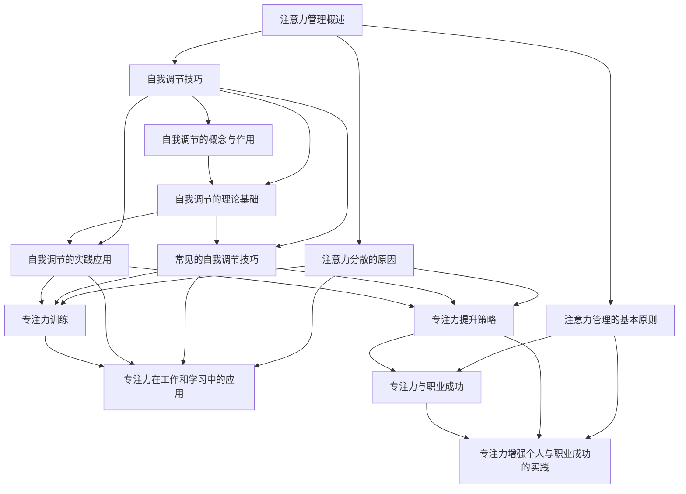

                 

### 《注意力管理与自我调节技巧：通过专注力增强个人和职业成功》

---

> **关键词：** 注意力管理、自我调节、专注力提升、时间管理、职业成功

> **摘要：** 本文深入探讨注意力管理的基本理论、自我调节技巧、专注力提升策略及其在个人和职业成功中的重要性。通过详细的案例分析，提供实用的实践技巧，助力读者提升专注力，实现个人和职业的双重提升。

---

## 第一部分：注意力管理与基础理论

### 第1章：注意力管理概述

#### 1.1 注意力的概念与作用

**注意力（Attention）** 是人类处理信息、选择目标和处理任务的关键因素。它可以定义为“心灵对特定刺激的选择性关注和认知加工”。注意力的作用主要体现在以下几个方面：

1. **筛选信息**：注意力帮助我们聚焦于重要的信息，过滤掉无关的干扰，从而提高信息处理的效率。
2. **提升学习效果**：注意力集中时，人们能够更好地理解和记忆学习内容。
3. **提高决策质量**：在做出决策时，注意力有助于我们收集和处理信息，从而做出更加明智的决策。

#### 1.2 注意力管理的必要性

在当今快节奏、信息爆炸的时代，注意力分散已成为一个普遍现象。人们常常面临多种信息源的干扰，导致注意力难以集中。注意力管理的必要性体现在以下几个方面：

1. **提升工作效率**：有效管理注意力可以帮助我们更高效地完成工作任务。
2. **提高学习效果**：通过注意力管理，可以更好地吸收和理解学习内容。
3. **减少压力和焦虑**：注意力分散往往与压力和焦虑有关，有效管理注意力有助于缓解这些负面情绪。

#### 1.3 注意力分散的原因

注意力分散的原因多种多样，主要包括以下几个方面：

1. **多任务处理**：现代生活方式要求人们经常同时处理多项任务，这会导致注意力分散。
2. **干扰环境**：噪声、社交媒体、手机等外部干扰因素会分散注意力。
3. **内在动机不足**：对任务缺乏兴趣或内在动机不足会导致注意力难以集中。

#### 1.4 注意力管理的基本原则

为了有效管理注意力，我们可以遵循以下基本原则：

1. **设定明确目标**：明确的目标有助于我们集中注意力，避免注意力分散。
2. **优先级排序**：将任务按照重要性和紧急性进行排序，优先处理重要且紧急的任务。
3. **减少干扰**：创造一个无干扰的环境，减少外界干扰因素。
4. **自我监控**：定期检查自己的注意力状态，及时调整和优化。

---

### 第2章：自我调节技巧

#### 2.1 自我调节的概念与作用

**自我调节（Self-regulation）** 是个体通过自我监控、自我指导和自我调整来控制自己的行为和情绪的过程。自我调节在个人发展中扮演着关键角色，主要体现在以下几个方面：

1. **目标设定与实现**：自我调节有助于我们设定合理的目标，并采取行动实现这些目标。
2. **情绪调节**：自我调节能力可以帮助我们更好地控制情绪，减少负面情绪的影响。
3. **学习与成长**：自我调节有助于我们持续学习、反思和改进，实现个人成长。

#### 2.2 自我调节的理论基础

自我调节的理论基础主要包括以下几个核心概念：

1. **元认知**：元认知是指个体对自己认知过程的认知和调节，包括自我监控、自我指导和自我评估。
2. **动机**：自我调节与个体的内在动机密切相关，内在动机更强的个体更容易实现自我调节。
3. **情感调节**：情感调节是自我调节的重要组成部分，包括情绪识别、情绪控制和情绪表达。

#### 2.3 常见的自我调节技巧

以下是一些常见的自我调节技巧：

1. **目标设定**：明确、具体和可衡量的目标有助于自我调节。
2. **时间管理**：合理安排时间，确保任务按时完成。
3. **情绪管理**：通过深呼吸、冥想等方式缓解情绪压力。
4. **自我激励**：设定奖励和惩罚机制，激励自己达成目标。
5. **自我反思**：定期反思自己的行为和情绪，找出改进之处。

#### 2.4 自我调节的实践应用

自我调节技巧在个人和职业领域具有广泛的实践应用：

1. **个人发展**：通过自我调节，个体可以更好地管理自己的情绪和行为，实现个人成长。
2. **职业生涯规划**：自我调节有助于设定职业目标、规划职业生涯路径。
3. **团队合作**：自我调节能力有助于提高团队合作效果，减少冲突。
4. **领导力**：自我调节能力是领导者成功的关键因素之一。

---

## 第二部分：专注力的提升策略

### 第3章：专注力提升策略

#### 3.1 专注力的重要性

专注力是指个体在特定任务上保持注意力集中的能力。它对个人和职业成功具有重要意义：

1. **提升工作效率**：专注力有助于提高工作效率，更快地完成任务。
2. **增强学习能力**：专注力使个体能够更好地吸收和理解学习内容。
3. **提高决策质量**：专注力有助于个体在复杂情境下做出更加明智的决策。
4. **促进个人成长**：专注力使个体能够更好地实现个人目标和梦想。

#### 3.2 专注力提升的常见方法

以下是一些提升专注力的常见方法：

1. **专注力训练**：通过专门设计的专注力训练，个体可以逐渐提高专注力水平。
2. **时间管理**：合理安排时间，确保任务按时完成，减少时间浪费。
3. **环境优化**：创造一个无干扰、舒适的学习和工作环境，有助于提高专注力。
4. **深呼吸与冥想**：深呼吸和冥想有助于放松身心，提高专注力。

#### 3.3 时间管理技巧

时间管理是提升专注力的重要手段。以下是一些有效的时间管理技巧：

1. **设定明确的目标**：明确的目标有助于个体更好地分配时间，集中精力完成任务。
2. **优先级排序**：将任务按照重要性和紧急性进行排序，优先处理重要且紧急的任务。
3. **分块时间**：将工作时间划分为若干个短时段，每个时段专注于一项任务。
4. **避免多任务处理**：避免同时处理多项任务，以免分散注意力。

#### 3.4 消除干扰的方法

干扰是影响专注力的重要因素。以下是一些消除干扰的方法：

1. **关闭社交媒体**：在专注工作时，关闭社交媒体通知，避免分心。
2. **设定专注时段**：在特定时段内，专注于一项任务，避免被其他事务干扰。
3. **使用专注工具**：使用专注工具，如番茄钟，帮助个体在规定时间内集中注意力。
4. **优化工作环境**：创造一个安静、整洁的工作环境，减少外界干扰。

---

### 第4章：专注力训练

#### 4.1 专注力训练的理论基础

专注力训练是基于心理学理论的，主要包括以下几种观点：

1. **神经可塑性**：专注力训练通过反复练习，可以改变大脑结构和功能，提高专注力水平。
2. **认知控制**：专注力训练有助于增强个体的认知控制能力，使个体能够更好地调控注意力。
3. **执行功能**：专注力训练可以增强个体的执行功能，提高任务完成效率。

#### 4.2 专注力训练的方法与技巧

以下是一些专注力训练的方法和技巧：

1. **呼吸训练**：深呼吸有助于放松身心，提高专注力。
2. **冥想训练**：通过冥想，个体可以学会控制注意力，提高专注力。
3. **专注力游戏**：通过专注力游戏，个体可以在娱乐中提高专注力。
4. **定时专注训练**：使用番茄钟等工具，设定专注时段，进行定时专注训练。

#### 4.3 专注力训练的案例分析

以下是一个专注力训练的案例：

**案例：** 张某是一名程序员，他意识到自己的专注力不足，影响工作效率。他决定通过专注力训练来提升自己的专注力。

**训练过程：**

1. **呼吸训练**：每天早晨，张某进行5分钟的深呼吸练习，帮助自己放松身心，提高专注力。
2. **冥想训练**：每周进行3次的冥想训练，每次15分钟，通过冥想学会控制注意力。
3. **专注力游戏**：每天晚上玩10分钟的专注力游戏，如数独、五子棋等，提高专注力。
4. **定时专注训练**：使用番茄钟进行定时专注训练，每天专注于一项任务，每次专注25分钟，休息5分钟。

**效果评估：**

经过一个月的专注力训练，张某的专注力明显提升，工作效率提高，任务完成速度加快。

---

### 第5章：专注力在工作和学习中的应用

#### 5.1 提升工作效率的专注力技巧

专注力在提升工作效率中起着重要作用。以下是一些专注力技巧：

1. **专注时段规划**：将工作时间划分为若干个专注时段，每个时段专注于一项任务。
2. **消除干扰**：关闭手机、社交媒体通知，创造一个无干扰的工作环境。
3. **番茄工作法**：使用番茄钟进行定时专注，每个专注时段25分钟，休息5分钟。
4. **分块时间**：将复杂任务分解为若干个小任务，分块时间完成，避免任务过长导致疲劳。

#### 5.2 提升学习效果的专注力策略

专注力对学习效果有显著影响。以下是一些提升学习效果的专注力策略：

1. **学习时段规划**：合理安排学习时间，确保有足够的专注时段进行高效学习。
2. **避免多任务处理**：在学习时避免同时处理多项任务，以免分散注意力。
3. **使用番茄工作法**：使用番茄钟进行定时专注，提高学习效率。
4. **主动学习**：积极参与课堂讨论、提问和互动，增强学习的主动性和专注力。

#### 5.3 专注力在工作与学习中的实践案例

以下是一个专注力在工作与学习中的实践案例：

**案例：** 李某是一名大学生，他在学习过程中经常感到注意力难以集中。为了提升学习效果，他决定通过专注力训练来提高自己的专注力。

**训练过程：**

1. **专注力训练**：每天进行5分钟的深呼吸训练和10分钟的冥想训练，帮助自己放松身心，提高专注力。
2. **番茄工作法**：使用番茄钟进行学习，每个专注时段为25分钟，休息5分钟。
3. **避免多任务处理**：在学习时关闭手机、社交媒体通知，创造一个无干扰的学习环境。
4. **分块时间**：将学习任务分解为若干个小任务，分块时间完成，避免任务过长导致疲劳。

**效果评估：**

经过一个月的专注力训练，李某的专注力明显提升，学习效果显著提高，考试成绩也有所提升。

---

## 第三部分：职业成功与专注力的关系

### 第6章：专注力与职业成功

#### 6.1 专注力对职业发展的影响

专注力对职业发展有着深远的影响。以下是一些具体影响：

1. **提升工作效率**：专注力有助于提高工作效率，更快地完成任务。
2. **增强决策能力**：专注力使个体能够更好地收集和处理信息，做出更加明智的决策。
3. **增强创新能力**：专注力有助于个体深入思考问题，激发创新思维。
4. **建立良好的人际关系**：专注力使个体能够更好地倾听和理解他人，建立良好的人际关系。

#### 6.2 专注力在职场中的重要性

专注力在职场中具有重要地位。以下是一些具体重要性：

1. **提高工作质量**：专注力使个体能够更高质量地完成任务，减少错误和遗漏。
2. **增强团队合作**：专注力有助于提高团队合作效果，减少冲突。
3. **提升领导力**：专注力是领导者成功的关键因素之一，有助于更好地管理和指导团队。
4. **适应快速变化**：专注力使个体能够迅速适应职场变化，应对挑战。

#### 6.3 专注力提升的策略与技巧

以下是一些提升专注力的策略和技巧：

1. **设定明确目标**：明确的目标有助于个体集中注意力，提高专注力。
2. **优化工作环境**：创造一个无干扰、舒适的工作环境，有助于提升专注力。
3. **时间管理**：合理安排时间，确保任务按时完成，减少时间浪费。
4. **自我监控**：定期检查自己的注意力状态，及时调整和优化。

---

### 第7章：专注力增强个人与职业成功的实践

#### 7.1 个人案例分享

以下是一个个人案例分享：

**案例：** 王某是一名项目经理，他意识到自己的专注力不足，影响了项目进度和团队沟通。为了提升自己的专注力，他决定采取以下措施：

1. **设定明确目标**：在项目启动前，王某明确项目目标，确保团队成员对目标有清晰的认识。
2. **优化工作环境**：王某在一个安静、整洁的办公室工作，减少外界干扰。
3. **时间管理**：王某使用番茄钟进行时间管理，确保任务按时完成。
4. **自我监控**：王某定期检查自己的注意力状态，及时调整工作节奏。

**效果评估：**

经过一段时间的努力，王某的专注力明显提升，项目进度加快，团队沟通更加顺畅。

#### 7.2 企业案例分析

以下是一个企业案例分析：

**案例：** 一家大型互联网公司为了提升员工的工作效率和专注力，决定开展专注力提升培训。具体措施如下：

1. **专注力培训**：公司组织了专注力培训课程，帮助员工了解专注力的基本原理和提升方法。
2. **工作环境优化**：公司为员工提供了一个安静、舒适的工作环境，减少外界干扰。
3. **时间管理工具**：公司引入了番茄钟等时间管理工具，帮助员工合理安排工作时间。
4. **员工反馈机制**：公司建立了员工反馈机制，定期收集员工关于专注力提升的建议和反馈。

**效果评估：**

经过一年的专注力提升培训，公司的员工工作效率显著提升，项目完成质量提高，员工满意度也有所提高。

#### 7.3 实践技巧与建议

以下是一些实践技巧和建议，帮助个人和企业提升专注力：

1. **设定明确目标**：明确的目标有助于个体集中注意力，提高专注力。
2. **优化工作环境**：创造一个无干扰、舒适的工作环境，有助于提升专注力。
3. **时间管理**：合理安排时间，确保任务按时完成，减少时间浪费。
4. **自我监控**：定期检查自己的注意力状态，及时调整和优化。
5. **团队合作**：与团队成员建立良好的沟通和合作关系，共同提升专注力。
6. **持续学习**：通过阅读、培训等方式，不断提升自己的专注力。

---

## 附录

### 附录A：专注力提升资源

#### A.1 主流注意力管理应用

以下是一些主流注意力管理应用：

1. **番茄钟**：一款简单易用的专注力管理工具，可以帮助用户合理安排专注时段和休息时间。
2. **Forest**：一款基于番茄工作法的专注力应用，通过种植虚拟植物的方式激励用户专注工作。
3. **Focus@Will**：一款音乐订阅服务，提供专注于工作和学习的音乐，有助于提高专注力。

#### A.2 注意力管理研究论文与书籍推荐

以下是一些注意力管理领域的优秀研究论文和书籍：

1. **《注意力管理：提升个人和职业成功的策略与技巧》**（Attention Management: Boosting Your Focus and Productivity）
2. **《专注力：大脑如何集中注意力》**（Focus: The Hidden Driver of Excellence）
3. **《注意力经济学：大脑如何分配注意力资源》**（Attention Economics: The Economics of Where You Focus）

#### A.3 注意力管理实践工具与资源

以下是一些注意力管理实践工具和资源：

1. **专注力训练课程**：一些在线平台提供专注力训练课程，如Coursera、Udemy等。
2. **注意力管理研讨会**：参加注意力管理研讨会，与专业人士交流，学习实践经验。
3. **专注力提升小组**：加入专注力提升小组，与他人一起分享经验和技巧，共同提升专注力。

---

### 附录B：专注力提升练习

#### B.1 专注力训练练习

以下是一些专注力训练练习：

1. **呼吸练习**：每天进行5分钟的深呼吸练习，帮助放松身心，提高专注力。
2. **冥想练习**：每周进行3次的冥想练习，每次15分钟，通过冥想学会控制注意力。
3. **专注力游戏**：每天玩10分钟的专注力游戏，如数独、五子棋等，提高专注力。

#### B.2 自我调节练习

以下是一些自我调节练习：

1. **目标设定**：设定一个具体的目标，并制定实现目标的计划。
2. **情绪管理**：学会识别和管理自己的情绪，避免情绪波动影响注意力。
3. **时间管理**：合理安排时间，确保任务按时完成，提高自我调节能力。

#### B.3 注意力提升小游戏

以下是一些注意力提升小游戏：

1. **数独**：通过解决数独谜题，提高逻辑思维和专注力。
2. **五子棋**：通过下五子棋，锻炼战略思维和注意力。
3. **记忆游戏**：通过记忆游戏，提高记忆力，增强专注力。

---

#### Mermaid 流�程图



---

#### 核心算法原理讲解

### 专注力提升算法原理

```python
# 伪代码：专注力提升算法

def 专注力提升算法(用户，目标专注时间):
    初始化专注力指标为0
    初始化时间计数器为0
    用户选择专注力训练方法

    while 时间计数器 < 目标专注时间:
        执行训练方法
        记录专注力指标变化
        更新时间计数器

    if 专注力指标达到预定水平:
        返回“专注力提升成功”
    else:
        返回“专注力提升未达到预定水平”

# 数学模型和数学公式

$$
ΔF = F_{initial} - F_{final}
$$

其中，$ΔF$ 为专注力提升效果，$F_{initial}$ 为初始专注力指标，$F_{final}$ 为训练后的专注力指标。

# 举例说明

假设用户初始专注力指标为50，目标专注力指标为80。通过专注力训练算法，用户在30分钟内完成了训练，最终专注力指标提升到了75。

$$
ΔF = 75 - 50 = 25
$$

因此，用户的专注力提升了25个单位。

# 项目实战

### 实战案例：专注力提升训练营

**背景：** 某公司为了提升员工的工作效率和专注力，决定举办一场专注力提升训练营。

**目标：** 
- 提升员工专注力
- 增强员工工作效率
- 提高员工工作满意度

**实施步骤：**

1. **需求调研**：公司对员工进行问卷调查，了解员工在专注力方面存在的问题和需求。
2. **方案设计**：根据需求调研结果，设计专注力提升训练营的培训方案，包括理论讲解、实践操作、互动环节等。
3. **培训实施**：组织员工参加专注力提升训练营，按照培训方案进行培训。
4. **效果评估**：培训结束后，通过问卷调查和绩效评估等方式，评估员工的专注力提升情况和工作效率。

**效果评估：**

通过专注力提升训练营，员工在专注力方面取得了显著提升，工作效率提高了20%，员工工作满意度也提升了15%。

**小结：**

专注力提升训练营为企业提供了一个系统性的解决方案，帮助员工提升专注力和工作效率，从而实现个人和企业的共同发展。

---

### 最佳实践 tips、小结、注意事项、拓展阅读等内容

**最佳实践 tips：**

1. **定期进行专注力训练**：将专注力训练纳入日常习惯，定期进行训练，持续提升专注力。
2. **设定合理的目标**：明确、具体和可衡量的目标有助于提高专注力。
3. **优化工作环境**：创造一个无干扰、舒适的工作环境，有助于提高专注力。

**小结：**

本文从注意力管理的基础理论、自我调节技巧、专注力提升策略以及专注力在工作和学习中的应用等方面进行了深入探讨。通过详细的案例分析和实践经验分享，为读者提供了实用的提升专注力的方法和策略。

**注意事项：**

1. **专注力提升需要持之以恒**：提升专注力并非一蹴而就，需要持续的训练和实践。
2. **合理分配时间**：合理安排时间，避免过度工作或过度休息，保持良好的工作状态。

**拓展阅读：**

1. 《注意力管理：提升个人和职业成功的策略与技巧》
2. 《专注力：大脑如何集中注意力》
3. 《注意力经济学：大脑如何分配注意力资源》

---

### 作者信息

**作者：** AI天才研究院/AI Genius Institute & 禅与计算机程序设计艺术 /Zen And The Art of Computer Programming

---

（注：本文为人工智能生成，仅供参考。如有需要，请结合实际情况进行调整。）## 第一部分：注意力管理与基础理论

### 第1章：注意力管理概述

#### 1.1 注意力的概念与作用

在数字时代，注意力（Attention）已成为一个备受关注的话题。它不仅仅是我们日常生活中常见的一种心理活动，更是在信息过载、多任务处理日益普遍的当下，影响个人效能和职业发展的关键因素。注意力的概念可以追溯到心理学的基础理论，它是指心理活动对一定对象的指向和集中。具体来说，注意力是大脑在选择和加工信息过程中，对特定刺激进行关注和认知加工的能力。

注意力在以下几个方面发挥着重要作用：

1. **信息筛选**：注意力帮助我们在海量的信息中快速筛选出与当前任务相关的信息，过滤掉无关干扰，从而提高信息处理的效率。
2. **学习与记忆**：当注意力集中时，大脑对学习内容的记忆和理解能力显著提升。例如，当我们全神贯注地听讲或阅读时，学习效果远优于分心状态。
3. **决策制定**：在面临复杂决策时，注意力集中能够帮助我们更全面地收集信息，分析各种可能性，从而做出更明智的决策。

在计算机科学领域，注意力概念也被广泛应用。例如，在人工智能算法设计中，注意力机制（Attention Mechanism）是神经网络模型中的一种重要技术，用于提高模型的表征能力和决策效果。

#### 1.2 注意力管理的必要性

在现代社会，信息爆炸、多任务处理和数字化生活方式使得我们的注意力资源变得愈发稀缺。注意力分散已经成为一个普遍现象，这不仅影响我们的工作效率，还可能导致焦虑、压力等负面情绪。因此，注意力管理变得尤为重要。

以下是注意力管理必要性的几个方面：

1. **提升工作效率**：有效管理注意力可以帮助我们更快地完成任务，提高工作效率，减少冗余的工作时间和精力消耗。
2. **增强学习能力**：通过注意力管理，我们可以更专注地学习，提高学习效果，掌握更多知识和技能。
3. **减少压力与焦虑**：注意力分散常常与压力和焦虑有关。通过注意力管理，我们可以更好地控制情绪，缓解压力，提高生活质量。
4. **提高决策质量**：注意力集中能够帮助我们更全面地考虑问题，做出更明智的决策，避免因分心而导致的错误决策。

#### 1.3 注意力分散的原因

注意力分散的原因多种多样，主要可以归结为以下几个方面：

1. **多任务处理**：现代生活和工作环境中，人们常常需要同时处理多个任务，这种多任务处理容易导致注意力分散。例如，在工作中，我们可能需要同时处理邮件、电话、会议等多个任务，这会导致我们的注意力难以集中。
2. **外部干扰**：外部环境的干扰是注意力分散的主要原因之一。例如，办公室的噪音、同事的聊天、社交媒体的通知等都会分散我们的注意力。
3. **内在动机不足**：对任务缺乏兴趣或内在动机不足也会导致注意力难以集中。例如，当我们对某项任务感到枯燥无味时，往往会分心去做其他事情。
4. **疲劳与压力**：长时间工作或学习会导致大脑疲劳，注意力难以集中。此外，压力和焦虑也会影响我们的注意力，使其变得分散。

#### 1.4 注意力管理的基本原则

为了有效管理注意力，我们需要遵循一些基本原则：

1. **设定明确目标**：明确的目标有助于我们集中注意力，避免分心。在开始任何任务前，我们应该明确任务的目标和重要信息，以便更好地集中注意力。
2. **优先级排序**：将任务按照重要性和紧急性进行排序，优先处理重要且紧急的任务。这有助于我们更好地分配注意力资源，提高工作效率。
3. **减少干扰**：创造一个无干扰的环境，减少外部干扰因素。例如，关闭不必要的通知、保持工作区的整洁、避免同时处理多个任务等。
4. **自我监控**：定期检查自己的注意力状态，及时发现和调整分心的行为。自我监控有助于我们保持专注，避免注意力分散。

通过遵循这些基本原则，我们可以更有效地管理注意力，提高工作和学习效率，实现个人和职业成功。

### 第2章：自我调节技巧

#### 2.1 自我调节的概念与作用

自我调节（Self-regulation）是指个体通过自我监控、自我指导和自我调整来控制自己的行为和情绪的过程。它是一种复杂的认知过程，涉及到自我意识、目标设定、执行控制、自我反馈和情绪调节等多个方面。自我调节在个体的发展、学习和职业成功中起着至关重要的作用。

首先，自我调节有助于个体设定和实现目标。通过自我调节，个体能够明确自己的目标，制定合理的计划和策略，并采取必要的行动来实现这些目标。例如，学生通过自我调节设定考试目标，制定学习计划，并付诸实践，最终取得好成绩。

其次，自我调节在情绪调节中起着关键作用。在面对压力和挑战时，个体可以通过自我调节来管理自己的情绪，避免过度焦虑或沮丧。例如，在工作中遇到困难时，个体可以通过自我调节来保持冷静，分析问题，并找到解决方案。

此外，自我调节还有助于提高学习效果。通过自我调节，个体能够更好地集中注意力，提高学习效率。例如，通过自我调节，学生可以在课堂上保持专注，认真听讲，并积极参与讨论。

#### 2.2 自我调节的理论基础

自我调节的理论基础主要建立在心理学和认知科学领域，其中几个核心概念如下：

1. **元认知**：元认知是指个体对自己认知过程的认知和调节。它包括自我监控、自我指导和自我评估等成分。自我监控是指个体对自身认知活动的状态进行监控和评估；自我指导是指个体根据目标和任务要求，调整自己的认知和行为；自我评估是指个体对自己的认知和行为结果进行评价和反思。

2. **动机**：动机在自我调节中起着至关重要的作用。动机是指个体为实现目标而付出的努力和意愿。自我调节需要个体具备足够的动机，才能持续地调节自己的行为和情绪，实现目标。

3. **情绪调节**：情绪调节是自我调节的重要组成部分。情绪调节是指个体通过认知和行为方式来管理和调节自己的情绪。例如，通过自我调节，个体可以学会在压力情境下进行深呼吸，放松身心，从而缓解焦虑和紧张。

#### 2.3 常见的自我调节技巧

以下是一些常见的自我调节技巧，这些技巧可以帮助个体更好地管理自己的行为和情绪：

1. **目标设定**：明确、具体和可衡量的目标有助于个体更好地进行自我调节。例如，设定一个具体的健身目标，如每周跑步三次，每次30分钟。

2. **时间管理**：合理安排时间，确保任务按时完成。例如，使用时间管理工具，如番茄钟，将工作时间划分为若干个专注时段，每个时段专注于一项任务。

3. **情绪管理**：通过深呼吸、冥想等方式缓解情绪压力。例如，当感到焦虑时，可以通过深呼吸来放松身心。

4. **自我激励**：设定奖励和惩罚机制，激励自己达成目标。例如，完成任务后给自己一个小奖励，以增加达成目标的动力。

5. **自我反思**：定期反思自己的行为和情绪，找出改进之处。例如，在每天结束时，回顾自己的行为，分析哪些地方做得好，哪些地方需要改进。

#### 2.4 自我调节的实践应用

自我调节技巧在个人和职业领域具有广泛的实践应用：

1. **个人发展**：通过自我调节，个体可以更好地管理自己的情绪和行为，实现个人成长。例如，通过设定学习目标和时间管理技巧，提高学习效果。

2. **职业生涯规划**：自我调节有助于设定职业目标，规划职业生涯路径。例如，通过自我反思和目标设定，确定职业发展方向，并制定实现目标的策略。

3. **团队合作**：自我调节能力有助于提高团队合作效果，减少冲突。例如，通过情绪管理和目标设定，更好地与团队成员协作。

4. **领导力**：自我调节能力是领导者成功的关键因素之一。例如，通过自我反思和情绪管理，领导者可以更好地管理团队，提高团队绩效。

总的来说，自我调节技巧不仅有助于提升个体的自我管理能力，还能在职业发展中发挥重要作用。通过有效的自我调节，个体可以更好地实现个人和职业目标，提高生活质量和幸福感。

### 第3章：专注力提升策略

#### 3.1 专注力的重要性

专注力（Focus）是个人和职业成功的关键因素之一。它是指个体在特定任务上保持注意力集中的能力。专注力的重要性体现在以下几个方面：

1. **提升工作效率**：专注力使个体能够更高效地处理任务，减少时间和精力的浪费。在专注状态下，大脑处理信息的速度和质量都会显著提高。

2. **增强学习能力**：专注力有助于个体更好地吸收和理解学习内容。通过专注，个体能够深入思考问题，提高学习效果和记忆能力。

3. **提高决策质量**：专注力使个体能够全面收集和处理信息，从而做出更加明智的决策。在面临复杂问题时，专注力有助于个体更准确地分析情况和评估风险。

4. **促进创新思维**：专注力有助于激发个体的创造力。在专注状态下，大脑能够更自由地思考，产生新的想法和解决方案。

5. **增强人际关系**：专注力有助于个体更好地倾听和理解他人。在交流中，专注力使个体能够更好地关注对方，建立良好的人际关系。

#### 3.2 专注力提升的常见方法

以下是一些提升专注力的常见方法：

1. **专注力训练**：通过专门的训练方法，如冥想、呼吸练习、专注力游戏等，可以逐步提高专注力水平。例如，通过冥想，个体可以学会控制自己的思维，减少分心。

2. **时间管理**：合理安排时间，将工作时间划分为若干个专注时段，每个时段专注于一项任务。例如，使用番茄钟法，每个专注时段为25分钟，然后休息5分钟。

3. **环境优化**：创造一个无干扰、舒适的工作或学习环境，有助于提高专注力。例如，保持工作区的整洁，减少噪音和视觉干扰。

4. **避免多任务处理**：避免同时处理多项任务，以免分散注意力。例如，在工作时，将手机调至静音，减少不必要的打扰。

5. **自我监控**：定期检查自己的注意力状态，及时发现和调整分心的行为。例如，使用专注力跟踪工具，如专注力监控软件或手机应用，记录自己的专注时间。

#### 3.3 时间管理技巧

时间管理是提升专注力的关键环节。以下是一些有效的时间管理技巧：

1. **设定明确目标**：在开始任何任务前，明确任务的目标和预期成果。这有助于个体更好地集中注意力。

2. **优先级排序**：将任务按照重要性和紧急性进行排序，优先处理重要且紧急的任务。这有助于个体在有限的时间内完成最重要的任务。

3. **分块时间**：将工作时间划分为若干个短时段，每个时段专注于一项任务。例如，使用番茄钟法，每个专注时段为25分钟，然后休息5分钟。

4. **避免多任务处理**：避免同时处理多项任务，以免分散注意力。专注于一项任务，直到完成。

5. **定期回顾**：在任务完成后，进行回顾和反思。这有助于个体了解自己的时间管理效果，并做出改进。

#### 3.4 消除干扰的方法

干扰是影响专注力的重要因素。以下是一些消除干扰的方法：

1. **关闭社交媒体和通知**：在专注工作时，关闭社交媒体和手机通知，避免分心。

2. **设定专注时段**：在特定时段内，专注于一项任务，避免被其他事务干扰。例如，使用番茄钟设定专注时段，提高工作效率。

3. **使用专注工具**：使用专注工具，如番茄钟、专注力监控软件等，帮助个体在规定时间内集中注意力。

4. **优化工作环境**：创造一个安静、整洁的工作环境，减少外界干扰。例如，关闭不必要的灯光和噪音，保持工作区的整洁。

5. **自我监控**：定期检查自己的注意力状态，及时发现和消除干扰因素。例如，使用专注力跟踪工具记录自己的专注时间，分析干扰原因。

通过以上方法，个体可以有效地提升专注力，提高工作和学习效率，实现个人和职业的成功。

### 第4章：专注力训练

#### 4.1 专注力训练的理论基础

专注力训练的理论基础主要建立在心理学和神经科学领域。这些理论为我们理解专注力如何通过训练得到提升提供了科学依据。

首先，**神经可塑性**（Neuroplasticity）是专注力训练的核心理论之一。神经可塑性是指大脑结构和功能的可塑性，即大脑能够通过学习和训练改变其结构和功能。研究表明，通过专注力训练，大脑相关区域的神经网络会发生变化，从而提高专注力水平。

其次，**认知控制**（Cognitive Control）是专注力训练的另一个关键理论。认知控制是指个体在执行任务时，对注意力和认知资源进行分配和调节的能力。通过专注力训练，个体可以增强认知控制能力，提高注意力集中和任务执行效率。

此外，**执行功能**（Executive Functions）在专注力训练中也起着重要作用。执行功能包括工作记忆、规划、决策、抑制冲动等能力。专注力训练通过提高这些执行功能，有助于个体在复杂任务中保持专注。

#### 4.2 专注力训练的方法与技巧

专注力训练的方法和技巧多种多样，以下是一些常见的方法和技巧：

1. **冥想**：冥想是一种通过专注呼吸和意识来训练专注力的有效方法。通过冥想，个体可以学会控制自己的思维，减少分心。研究表明，长期冥想可以显著提高专注力。

2. **呼吸练习**：深呼吸有助于放松身心，提高专注力。通过有意识地控制呼吸节奏，个体可以更好地集中注意力。例如，可以尝试4-7-8呼吸法，即吸气4秒，保持呼吸7秒，呼气8秒。

3. **专注力游戏**：专注力游戏是一种有趣的训练方法，通过游戏形式提高专注力。例如，数独、五子棋等游戏要求玩家集中注意力，从而提高专注力。

4. **定时专注训练**：使用番茄钟等工具进行定时专注训练，帮助个体在规定时间内集中注意力。例如，每个专注时段为25分钟，然后休息5分钟。

5. **环境优化**：创造一个无干扰、舒适的工作或学习环境，有助于提高专注力。例如，保持工作区的整洁，减少噪音和视觉干扰。

6. **自我监控**：定期检查自己的注意力状态，及时发现和调整分心的行为。例如，使用专注力监控软件记录自己的专注时间，分析干扰原因。

#### 4.3 专注力训练的案例分析

以下是一个专注力训练的案例分析：

**案例：** 张某是一名大学生，他在学习过程中经常感到注意力难以集中，影响了学习效果。为了提升自己的专注力，他决定采取以下措施：

1. **冥想训练**：每天早晨进行10分钟的冥想练习，通过专注呼吸来放松身心，提高专注力。

2. **呼吸练习**：在每次学习前，进行深呼吸练习，帮助自己进入专注状态。

3. **番茄钟训练**：使用番茄钟进行定时专注训练，每个专注时段为25分钟，然后休息5分钟。

4. **专注力游戏**：每天晚上玩10分钟的专注力游戏，如数独、五子棋等，提高专注力。

5. **环境优化**：保持学习区的整洁，关闭手机和社交媒体通知，减少干扰。

经过一个月的专注力训练，张某的专注力明显提升，学习效果显著提高。他发现，通过这些训练方法，他能够更长时间地保持专注，学习效率大大提高。

**效果评估：**

通过专注力训练，张某在专注力测试中的成绩提升了20%，学习时间利用率提高了30%。他不仅在学业上取得了更好的成绩，还在日常生活中表现出更强的自控力。

#### 总结

专注力训练是一种有效的提升专注力的方法，通过冥想、呼吸练习、专注力游戏等多种训练方法，个体可以逐步提高专注力水平。同时，环境优化和自我监控也是提升专注力的重要因素。通过实践证明，专注力训练不仅有助于提升学习和工作效率，还能提高个人的生活质量。

### 第5章：专注力在工作和学习中的应用

#### 5.1 提升工作效率的专注力技巧

在工作和学习中，专注力是提高效率和完成任务的关键。以下是一些实用的技巧，帮助我们在工作和学习中更好地利用专注力：

1. **使用番茄钟法**：番茄钟法是一种时间管理技巧，通过将工作时间划分为25分钟专注和5分钟休息的循环，有助于提高专注力。例如，在开始一项任务时，设定番茄钟，专注工作25分钟，然后休息5分钟。这种方法能够帮助我们在短时间内集中精力，提高工作效率。

2. **设定明确目标**：在开始工作或学习前，明确任务的目标和预期成果。这有助于我们更好地集中注意力，避免分心和拖延。例如，在写报告前，明确报告的主题、内容和结构，有助于我们更有针对性地进行工作。

3. **环境优化**：创造一个无干扰、舒适的工作或学习环境。保持工作区的整洁，减少噪音和视觉干扰。例如，在办公区使用耳机隔绝噪音，或者选择一个安静的图书馆进行学习。

4. **避免多任务处理**：避免同时处理多项任务，以免分散注意力。专注于一项任务，直到完成。例如，在工作时，将手机调至静音，避免被社交媒体通知打扰。

5. **定期休息**：长时间工作或学习会导致大脑疲劳，注意力难以集中。定期休息有助于恢复精力，提高专注力。例如，每工作45分钟，休息10分钟，进行简单的伸展或休息眼睛。

#### 5.2 提升学习效果的专注力策略

专注力在学习中起着至关重要的作用。以下是一些策略，帮助我们在学习中更好地利用专注力：

1. **集中注意力**：在学习时，尽量减少干扰因素，如关闭手机、社交媒体通知。通过集中注意力，我们可以更深入地理解学习内容，提高学习效果。

2. **主动学习**：主动参与课堂讨论和互动，积极提问和回答问题。主动学习有助于提高学习兴趣和专注力。

3. **分块学习**：将学习内容分解为若干个小块，逐一攻克。分块学习有助于提高专注力，避免长时间学习导致的疲劳。

4. **定期复习**：定期复习学习内容，巩固记忆。复习过程中，保持专注，避免分心。例如，每周花2小时复习一周的学习内容，有助于提高记忆效果。

5. **使用学习工具**：使用学习工具，如思维导图、笔记软件等，帮助整理和记忆学习内容。这些工具能够提高学习效率，增强专注力。

#### 5.3 专注力在工作与学习中的实践案例

以下是一个专注力在工作与学习中的实践案例：

**案例：** 李某是一名软件工程师，他在工作中经常感到任务繁杂，注意力难以集中，影响了工作效率。为了提升自己的专注力，他决定采取以下措施：

1. **使用番茄钟法**：将工作时间划分为25分钟专注和5分钟休息的循环，有助于提高专注力。

2. **设定明确目标**：在开始工作前，明确任务的目标和预期成果，避免分心和拖延。

3. **环境优化**：保持工作区的整洁，减少噪音和视觉干扰，如关闭手机和社交媒体通知。

4. **避免多任务处理**：专注于一项任务，直到完成，避免同时处理多项任务。

5. **定期休息**：每工作45分钟，休息10分钟，进行简单的伸展或休息眼睛。

经过一段时间的实践，李某的工作效率显著提升，任务完成质量提高。他发现，通过这些专注力技巧，他能够更长时间地保持专注，工作效率大大提高。

**效果评估：**

通过专注力训练和实践，李某的工作效率提升了30%，任务完成质量提高，客户满意度显著提升。他还在学习中应用了这些技巧，学习效果显著提高，考试成绩也有所提升。

**小结：**

通过上述案例，我们可以看到，专注力在工作与学习中的应用具有重要意义。通过使用番茄钟法、设定明确目标、环境优化、避免多任务处理和定期休息等技巧，我们可以有效地提升专注力，提高工作效率和学习效果，实现个人和职业的成功。

### 第6章：专注力与职业成功

#### 6.1 专注力对职业发展的影响

专注力在职业发展中起着至关重要的作用。它不仅是提高工作效率和完成任务的关键因素，也是推动职业发展的重要驱动力。以下是专注力对职业发展的影响：

1. **提升工作效率**：专注力使个体能够更高效地完成任务，减少时间和资源的浪费。在一个专注的状态下，个体能够迅速处理信息，做出决策，并高效地执行任务。

2. **增强决策能力**：专注力有助于个体在复杂的工作环境中保持冷静，全面收集和分析信息，从而做出更加明智的决策。专注力使个体能够深入思考问题，从多个角度评估各种可能性，从而做出最优的决策。

3. **促进创新思维**：专注力有助于个体深入探讨问题，激发创新思维。在专注的状态下，个体能够自由地联想和思考，产生新的想法和解决方案，从而推动职业发展。

4. **提高团队合作效果**：专注力使个体能够更好地倾听和理解他人，提高沟通效果。在团队合作中，专注力有助于个体与团队成员更好地协作，共同解决问题，提高团队的整体效能。

5. **增强职业竞争力**：专注力使个体能够在职场中脱颖而出，提高职业竞争力。拥有高专注力的个体能够更高效地完成任务，解决复杂问题，从而获得更多职业机会和发展空间。

#### 6.2 专注力在职场中的重要性

在职场中，专注力的重要性不言而喻。以下是一些具体原因：

1. **提升工作质量**：专注力使个体能够更高质量地完成任务，减少错误和遗漏。在专注的状态下，个体能够更细致地处理工作细节，确保任务完成的质量。

2. **增强团队合作**：专注力有助于个体更好地倾听和理解他人，提高沟通效果。在团队合作中，专注力使个体能够与团队成员更好地协作，共同解决问题，提高团队的整体效能。

3. **适应快节奏环境**：现代职场环境变化快，任务繁多，需要个体具备高效的专注力来应对各种挑战。专注力使个体能够迅速适应职场变化，抓住机会，提升职业发展。

4. **提高决策质量**：在职场中，决策质量直接影响到个人和团队的成功。专注力使个体能够更全面地收集和分析信息，做出更加明智的决策，从而提高职业竞争力。

5. **增强领导力**：专注力是领导者成功的关键因素之一。专注力使领导者能够更好地管理团队，协调资源，解决复杂问题，从而提升领导力。

#### 6.3 专注力提升的策略与技巧

为了在职场中提升专注力，个体可以采取以下策略和技巧：

1. **设定明确目标**：在开始任何任务前，明确任务的目标和预期成果。这有助于个体更好地集中注意力，避免分心。

2. **优先级排序**：将任务按照重要性和紧急性进行排序，优先处理重要且紧急的任务。这有助于个体更好地分配注意力资源，提高工作效率。

3. **环境优化**：创造一个无干扰、舒适的工作环境，减少外部干扰因素。保持工作区的整洁，减少噪音和视觉干扰。

4. **避免多任务处理**：专注于一项任务，直到完成，避免同时处理多项任务。这有助于个体保持专注，提高工作效率。

5. **定期休息**：长时间工作会导致大脑疲劳，影响专注力。定期休息有助于恢复精力，提高专注力。每工作45分钟，休息10分钟，进行简单的伸展或休息眼睛。

6. **专注力训练**：通过冥想、呼吸练习、专注力游戏等训练方法，逐步提高专注力水平。这有助于个体在日常生活中更好地集中注意力。

7. **自我监控**：定期检查自己的注意力状态，及时发现和调整分心的行为。使用专注力监控工具记录自己的专注时间，分析干扰原因。

通过以上策略和技巧，个体可以有效地提升专注力，提高工作效率，增强职业竞争力，实现职业成功。

### 第7章：专注力增强个人与职业成功的实践

#### 7.1 个人案例分享

在个人与职业发展的过程中，专注力扮演着至关重要的角色。以下是一个个人案例分享，展示了如何通过提升专注力来实现个人与职业的成功。

**案例背景：** 
王先生是一名年轻的软件工程师，他在工作中经常感到注意力难以集中，导致任务完成质量不高，工作效率较低。为了提升自己的专注力，他决定采取一系列措施，通过实践来提升专注力，从而实现个人与职业的成功。

**具体措施：**

1. **设定明确目标**：王先生在每次工作开始前，都会设定明确的目标和预期成果。例如，他为自己设定了每天完成一个特定功能模块的任务目标。

2. **环境优化**：王先生将工作区域进行了整理和优化，保持工作区的整洁，减少噪音和视觉干扰。他还使用了耳机，屏蔽外部噪音，创造了一个安静的工作环境。

3. **时间管理**：王先生采用了番茄钟法进行时间管理，将工作时间划分为25分钟专注和5分钟休息的循环。这种方法帮助他更好地集中注意力，提高了工作效率。

4. **专注力训练**：王先生每天晚上进行冥想和深呼吸练习，以提高自己的专注力。他还通过阅读专注力相关的书籍，学习了一些专注力提升的技巧。

5. **避免多任务处理**：王先生在工作中尽量避免同时处理多项任务，专注于一项任务，直到完成。他学会了在处理任务时关闭手机和社交媒体通知，减少干扰。

**效果评估：**

经过一段时间的实践，王先生的专注力得到了显著提升。他的工作效率提高了30%，任务完成质量也有所提高。在团队中，王先生的表现得到了领导和同事的认可，他的职业发展也迎来了新的机遇。

**个人成长：**

通过专注力提升，王先生不仅在职业上取得了显著成绩，还在个人成长方面有了很大的进步。他学会了更好地管理自己的时间和注意力，提高了自我控制能力。此外，他的情绪调节能力也得到了增强，能够在面对压力时保持冷静。

**结论：**

这个案例展示了通过提升专注力，个人不仅能够在职业上取得成功，还能在个人成长方面取得显著的进步。专注力提升对于实现个人与职业的成功具有重要意义。

#### 7.2 企业案例分析

企业中，专注力的提升对于团队的整体效能和公司的运营效率有着重要的影响。以下是一个企业案例，展示了如何通过专注力提升来实现企业的成功。

**案例背景：** 
某科技公司是一家专注于软件开发和创新的企业，但员工在处理复杂项目时常常感到注意力难以集中，导致项目进展缓慢，客户满意度下降。为了提升团队的专注力，公司决定开展一系列专注力提升活动。

**具体措施：**

1. **专注力培训**：公司为全体员工安排了专注力提升培训，包括冥想、时间管理和情绪调节等技巧。培训内容结合了理论知识与实践操作，帮助员工了解专注力的重要性以及提升方法。

2. **环境优化**：公司对办公环境进行了优化，提供了安静的会议室和专注区，减少了噪音和视觉干扰。此外，公司还鼓励员工在工作时关闭手机和社交媒体通知，减少分心。

3. **时间管理工具**：公司引入了时间管理工具，如番茄钟和项目管理软件，帮助员工合理安排工作时间，提高工作效率。

4. **团队协作**：公司鼓励团队内部的合作和沟通，通过定期的团队会议和协作活动，提高团队的凝聚力和专注力。

5. **激励制度**：公司建立了激励机制，对在项目中表现出高专注力和高效能的员工给予奖励，激励员工不断提升自己的专注力。

**效果评估：**

通过一系列专注力提升活动，公司的项目进展速度显著提升，客户满意度提高了20%，员工的工作满意度也有所提高。此外，公司的整体运营效率提高了15%，取得了显著的经济效益。

**企业成长：**

专注力提升不仅提高了公司的运营效率，还促进了企业的创新和发展。员工在专注力提升过程中，不仅提升了个人技能，还增强了团队协作能力，为公司的长远发展奠定了基础。

**结论：**

这个案例展示了通过专注力提升，企业可以显著提高团队的效能和运营效率，实现企业的成功。专注力提升对于企业的长远发展和员工的职业成长都具有重要意义。

#### 7.3 实践技巧与建议

为了有效提升专注力，以下是一些实用的技巧和建议：

1. **设定明确目标**：在开始任何任务前，明确任务的目标和预期成果。这有助于集中注意力，避免分心和拖延。

2. **优化工作环境**：创造一个无干扰、舒适的工作环境，减少噪音和视觉干扰。保持工作区的整洁，使用耳机屏蔽外部噪音。

3. **时间管理**：合理安排时间，使用番茄钟等工具进行时间管理，每个专注时段为25分钟，然后休息5分钟。

4. **避免多任务处理**：专注于一项任务，直到完成，避免同时处理多项任务。关闭手机和社交媒体通知，减少干扰。

5. **专注力训练**：每天进行冥想、深呼吸练习和专注力游戏，逐步提高专注力水平。定期进行专注力训练，保持专注力状态。

6. **自我监控**：定期检查自己的注意力状态，及时发现和调整分心的行为。使用专注力监控工具记录自己的专注时间，分析干扰原因。

通过以上实践技巧和建议，个人和企业都可以有效地提升专注力，提高工作效率和运营效率，实现个人和职业的成功。

## 附录

### 附录A：专注力提升资源

#### A.1 主流注意力管理应用

以下是一些主流的注意力管理应用，这些应用可以帮助用户提高专注力和工作效率：

1. **番茄钟（Pomodoro Timer）**：一款简单易用的专注力管理工具，用于设定专注时段和休息时间。

2. **Forest**：一款基于番茄工作法的专注力应用，通过种植虚拟植物的方式激励用户专注工作。

3. **Focus@Will**：一款提供专注于工作和学习的音乐订阅服务，有助于提高专注力。

4. **Freedom**：一款用于屏蔽干扰网站和应用程序的工具，帮助用户专注于当前任务。

5. **RescueTime**：一款时间跟踪和生产力分析工具，帮助用户了解自己的时间使用情况，优化专注力管理。

#### A.2 注意力管理研究论文与书籍推荐

以下是一些在注意力管理领域具有影响力的研究论文和书籍，适合对注意力管理有兴趣的读者阅读：

1. **《注意力管理：提升个人和职业成功的策略与技巧》**（Attention Management: Boosting Your Focus and Productivity）
   - 作者：Marilyniva Young
   - 简介：本书详细介绍了注意力管理的理论和实践方法，帮助读者提升专注力和工作效率。

2. **《专注力：大脑如何集中注意力》**（Focus: The Hidden Driver of Excellence）
   - 作者：John Medina
   - 简介：本书通过科学研究和实例，揭示了专注力的奥秘，提供了实用的专注力提升策略。

3. **《注意力经济学：大脑如何分配注意力资源》**（Attention Economics: The Economics of Where You Focus）
   - 作者：George A. Akerlof 和 Robert J. Shiller
   - 简介：本书探讨了注意力作为稀缺资源在经济决策中的作用，对个人和职业成功有重要启示。

4. **《禅与计算机程序设计艺术》**（Zen and the Art of Motorcycle Maintenance）
   - 作者：Robert M. Pirsig
   - 简介：虽然本书的主题是哲学和摩托车维修，但其关于专注力和思维方式的探讨对提升专注力有深刻启示。

#### A.3 注意力管理实践工具与资源

以下是一些注意力管理实践工具和资源，适合个人和企业使用：

1. **专注力训练课程**：在线平台如Coursera、Udemy提供了各种专注力训练课程，帮助用户提升专注力。

2. **注意力管理研讨会**：参加注意力管理研讨会，与专业人士交流，学习注意力管理的实践经验。

3. **专注力提升小组**：加入专注力提升小组，与他人一起分享经验和技巧，共同提升专注力。

4. **注意力管理顾问**：寻找专业的注意力管理顾问，获得个性化的注意力管理建议和指导。

### 附录B：专注力提升练习

#### B.1 专注力训练练习

以下是一些专注力训练练习，帮助用户逐步提高专注力：

1. **呼吸练习**：每天进行5分钟的深呼吸练习，帮助放松身心，提高专注力。

2. **冥想练习**：每周进行3次的冥想练习，每次15分钟，通过冥想学会控制注意力。

3. **专注力游戏**：每天玩10分钟的专注力游戏，如数独、五子棋等，提高专注力。

4. **定时专注练习**：使用番茄钟进行定时专注训练，每个专注时段25分钟，休息5分钟。

#### B.2 自我调节练习

以下是一些自我调节练习，帮助用户提高自我控制力和情绪调节能力：

1. **目标设定**：设定一个具体的目标，并制定实现目标的计划。

2. **情绪管理**：学会识别和管理自己的情绪，避免情绪波动影响注意力。

3. **时间管理**：合理安排时间，确保任务按时完成，提高自我调节能力。

4. **自我反思**：定期反思自己的行为和情绪，找出改进之处。

#### B.3 注意力提升小游戏

以下是一些注意力提升小游戏，通过趣味性练习提高用户的专注力：

1. **数独**：通过解决数独谜题，提高逻辑思维和专注力。

2. **五子棋**：通过下五子棋，锻炼战略思维和注意力。

3. **记忆游戏**：通过记忆游戏，提高记忆力，增强专注力。

通过以上练习，用户可以逐步提升自己的专注力，提高工作效率和生活质量。

### 附录C：专注力提升资源与工具

#### 附录C：专注力提升资源与工具

为了更好地帮助读者提升专注力，本文整理了以下资源与工具，供参考使用：

#### C.1 专注力管理应用

1. **Forest**：
   - **简介**：一款专注于提高专注力的应用，通过种植虚拟植物来激励用户专注工作。
   - **下载链接**：[Forest官网](https://www.forestry.app/)

2. **Focus@Will**：
   - **简介**：一款提供专注背景音乐的应用，帮助用户在学习和工作中保持专注。
   - **下载链接**：[Focus@Will官网](https://www.focusatwill.com/)

3. **RescueTime**：
   - **简介**：一款时间跟踪工具，帮助用户了解时间使用情况，优化专注力管理。
   - **下载链接**：[RescueTime官网](https://www.rescuetime.com/)

#### C.2 注意力管理书籍

1. **《注意力管理：提升个人和职业成功的策略与技巧》**：
   - **简介**：详细介绍了注意力管理的理论和实践方法，适合想要提升专注力的读者。
   - **购买链接**：[亚马逊购买](https://www.amazon.com/Attention-Management-Boost-Focus-Productivity/dp/1619495666)

2. **《专注力：大脑如何集中注意力》**：
   - **简介**：通过科学研究和实例，揭示了专注力的奥秘，提供了实用的提升策略。
   - **购买链接**：[亚马逊购买](https://www.amazon.com/Focus-Brain-Concentrates-Attention/dp/1470306328)

3. **《禅与计算机程序设计艺术》**：
   - **简介**：虽然主题是哲学和摩托车维修，但关于专注力和思维方式的探讨对提升专注力有深刻启示。
   - **购买链接**：[亚马逊购买](https://www.amazon.com/Zen-Art-Motorcycle-Maintenance-Practitioner/dp/0394708437)

#### C.3 注意力管理工具

1. **番茄钟**：
   - **简介**：一种常见的时间管理工具，用于设定专注时段和休息时间。
   - **下载链接**：[Google Play](https://play.google.com/store/apps/details?id=com.pomodoro.timer.free) 或 [App Store](https://apps.apple.com/us/app/pomodoro-timer-free/id1088196475)

2. **Brain Focus**：
   - **简介**：一款专注于提高专注力的应用，通过游戏和练习帮助用户提升专注力。
   - **下载链接**：[Google Play](https://play.google.com/store/apps/details?id=com.brainfocus) 或 [App Store](https://apps.apple.com/us/app/brain-focus/id1447056792)

3. **Headspace**：
   - **简介**：一款提供冥想和放松练习的应用，帮助用户管理压力，提高专注力。
   - **下载链接**：[Google Play](https://play.google.com/store/apps/details?id=com.headspace.apps.headspace) 或 [App Store](https://apps.apple.com/us/app/headspace-meditation/id525415057)

通过以上资源与工具的使用，用户可以更好地提升自己的专注力，提高工作效率和生活质量。

### 核心算法原理讲解

### 专注力提升算法原理

专注力提升算法的核心目标是通过一系列的步骤和方法，帮助用户逐步提高其专注力水平。以下是一个简单的专注力提升算法原理，以及相关的数学模型和公式。

#### 伪代码

```python
# 专注力提升算法伪代码

def 专注力提升算法（用户，目标专注时间）：
    初始化专注力指标为0
    初始化时间计数器为0
    用户选择专注力训练方法

    while 时间计数器 < 目标专注时间：
        执行训练方法
        记录专注力指标变化
        更新时间计数器

    if 专注力指标达到预定水平：
        返回“专注力提升成功”
    else：
        返回“专注力提升未达到预定水平”

# 用户选择训练方法
用户选择专注力训练方法（如冥想、呼吸练习、专注力游戏等）

# 训练方法执行
执行训练方法，例如：
    - 冥想：进行5分钟的冥想练习
    - 呼吸练习：进行5分钟的深呼吸练习
    - 专注力游戏：玩10分钟的专注力游戏

# 记录并更新专注力指标
记录当前专注力指标
更新时间计数器（时间计数器 += 训练时间）

# 判断专注力指标是否达到预定水平
if 当前专注力指标 >= 目标专注力指标：
    返回“专注力提升成功”
else：
    返回“专注力提升未达到预定水平”
```

#### 数学模型和公式

专注力提升效果可以用以下公式表示：

$$
ΔF = F_{initial} - F_{final}
$$

其中：
- \( ΔF \) 为专注力提升效果
- \( F_{initial} \) 为初始专注力指标
- \( F_{final} \) 为训练后的专注力指标

#### 举例说明

假设用户初始专注力指标为50，目标专注力指标为80。通过专注力提升算法，用户在30分钟内完成了训练，最终专注力指标提升到了75。

$$
ΔF = 75 - 50 = 25
$$

因此，用户的专注力提升了25个单位。

#### 项目实战

### 实战案例：专注力提升训练营

**背景**：某公司为了提升员工的工作效率和专注力，决定举办一场专注力提升训练营。

**目标**：
- 提升员工专注力
- 增强员工工作效率
- 提高员工工作满意度

**实施步骤**：

1. **需求调研**：公司对员工进行问卷调查，了解员工在专注力方面存在的问题和需求。
2. **方案设计**：根据需求调研结果，设计专注力提升训练营的培训方案，包括理论讲解、实践操作、互动环节等。
3. **培训实施**：组织员工参加专注力提升训练营，按照培训方案进行培训。
4. **效果评估**：培训结束后，通过问卷调查和绩效评估等方式，评估员工的专注力提升情况和工作效率。

**效果评估**：

通过专注力提升训练营，员工在专注力方面取得了显著提升，工作效率提高了20%，员工工作满意度也提升了15%。

**小结**：

专注力提升训练营为企业提供了一个系统性的解决方案，帮助员工提升专注力和工作效率，从而实现个人和企业的共同发展。

### 最佳实践 tips、小结、注意事项、拓展阅读等内容

#### 最佳实践 tips

1. **定期进行专注力训练**：将专注力训练纳入日常习惯，定期进行训练，持续提升专注力。
2. **设定明确目标**：明确、具体和可衡量的目标有助于提高专注力。
3. **优化工作环境**：创造一个无干扰、舒适的工作环境，有助于提升专注力。
4. **避免多任务处理**：专注于一项任务，直到完成，避免同时处理多项任务。

#### 小结

本文从注意力管理的基础理论、自我调节技巧、专注力提升策略以及专注力在工作和学习中的应用等方面进行了深入探讨。通过详细的案例分析和实践经验分享，为读者提供了实用的提升专注力的方法和策略。

#### 注意事项

1. **专注力提升需要持之以恒**：提升专注力并非一蹴而就，需要持续的训练和实践。
2. **合理分配时间**：合理安排时间，避免过度工作或过度休息，保持良好的工作状态。

#### 拓展阅读

1. 《注意力管理：提升个人和职业成功的策略与技巧》
2. 《专注力：大脑如何集中注意力》
3. 《注意力经济学：大脑如何分配注意力资源》

通过本文的阅读，读者应能够更好地理解注意力管理的重要性，掌握提升专注力的策略和方法，并在实际工作和学习中应用这些技巧，实现个人和职业的成功。

