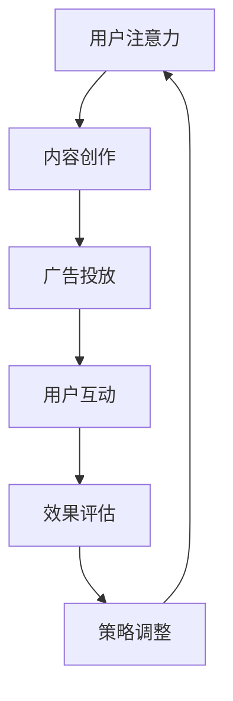

                 

## 3. 注意力经济与广告投放的关系

### 3.1 注意力经济对广告市场的影响

注意力经济作为一种新兴的经济模式，对广告市场产生了深远的影响。首先，在广告市场上，注意力资源的稀缺性使得广告主必须更加重视用户的需求和兴趣，从而提高广告投放的精准度和有效性。传统广告投放策略通常依赖于大规模、广覆盖的投放方式，但这种模式在注意力经济时代已显得过时。

#### 3.1.1 广告效果的不确定性

在注意力经济背景下，广告效果的不确定性增大。由于用户注意力分散，广告内容如果不具备足够的吸引力，很容易被忽视甚至遗忘。因此，广告主需要更加注重内容的创作和投放策略，以确保广告能够有效抓住用户的注意力。

#### 3.1.2 广告投放的效率问题

注意力经济的特征之一是用户对内容的快速消费，这要求广告投放必须具备高效率。传统广告投放策略往往存在周期长、效果慢的问题，难以适应注意力经济时代的快节奏。因此，广告主需要采用更加灵活和高效的方式来进行广告投放。

### 3.2 传统广告投放策略的不足

传统广告投放策略在注意力经济时代面临诸多挑战和不足，主要体现在以下几个方面：

#### 3.2.1 广告效果的不确定性

如前所述，注意力经济的特性使得广告效果的不确定性增大，传统广告投放策略难以保证广告能够有效触达目标用户。

#### 3.2.2 广告投放的效率问题

传统广告投放策略的周期长、效果慢，难以适应快节奏的注意力经济时代。广告主需要更加注重广告投放的时效性和灵活性。

#### 3.2.3 广告投放的成本控制

在注意力经济背景下，用户对广告的抵触情绪日益增强，广告主需要投入更多的成本来吸引和留住用户的注意力。然而，传统广告投放策略往往难以在成本控制方面做到最优。

#### 3.2.4 广告投放的合规风险

传统广告投放策略往往涉及跨平台、跨地域的投放，存在合规风险。在注意力经济时代，广告主需要更加关注广告内容的合法性和合规性，以避免因违规广告带来的损失。

### 3.3 注意力经济与广告投放的协同效应

尽管注意力经济对传统广告投放策略提出了挑战，但同时也提供了新的机遇。通过有效利用注意力经济，广告主可以实现以下协同效应：

#### 3.3.1 提高广告投放的精准度

注意力经济强调用户需求，广告主可以通过数据分析和用户画像，提高广告投放的精准度，从而实现更好的广告效果。

#### 3.3.2 优化广告投放的效率

注意力经济鼓励快速反应和灵活调整，广告主可以根据用户反馈迅速优化广告内容和策略，提高广告投放的效率。

#### 3.3.3 降低广告投放的成本

通过注意力经济，广告主可以更加有效地利用用户注意力资源，从而降低广告投放的成本。

#### 3.3.4 提高广告投放的合规性

注意力经济鼓励广告主遵循合法合规的广告投放原则，降低广告合规风险。

### 3.4 小结

注意力经济对传统广告投放策略提出了新的挑战，但同时也提供了新的机遇。广告主需要根据注意力经济的特点，重新审视和调整广告投放策略，以提高广告效果和效率。通过精准化、高效化和合规化的广告投放，广告主可以更好地适应注意力经济时代，实现广告投放的持续优化。

## 4. 传统广告投放的基本策略

### 4.1 广告投放的目标

广告投放的目标包括提高品牌知名度、增加产品销量、提升用户转化率等。在不同市场环境下，广告投放的目标可能会有所不同。例如，在竞争激烈的市场中，广告投放的目标可能更侧重于提高品牌知名度和用户转化率；而在市场稳定的环境中，广告投放的目标可能更侧重于维持品牌知名度和用户忠诚度。

#### 4.1.1 提高品牌知名度

品牌知名度是广告投放的重要目标之一。通过广告投放，企业可以在潜在用户心中建立品牌形象，提高品牌认知度。在提高品牌知名度的过程中，广告主需要注重广告内容的设计和传播渠道的选择，确保广告能够有效触达目标用户。

#### 4.1.2 增加产品销量

增加产品销量是广告投放的直接目标。通过有效的广告投放策略，广告主可以将潜在用户转化为实际购买者，从而实现产品销量的提升。广告主需要关注广告投放的效果评估，根据实际销售情况调整广告策略，以提高广告投放的ROI（投资回报率）。

#### 4.1.3 提升用户转化率

提升用户转化率是广告投放的重要目标之一。通过优化广告内容和投放策略，广告主可以提升潜在用户对广告的兴趣和信任度，从而提高用户转化率。广告主需要关注用户行为数据，分析用户在广告过程中的痛点，不断优化广告内容和策略。

### 4.2 广告投放的渠道

广告投放的渠道包括传统媒体（如电视、报纸、广播）和数字媒体（如搜索引擎、社交媒体、电子邮件）。选择合适的广告投放渠道对于实现广告投放目标至关重要。以下分别介绍几种常见的广告投放渠道：

#### 4.2.1 传统媒体

传统媒体包括电视、报纸、广播等。这些广告投放渠道具有广泛的覆盖面和较高的可信度，但投放成本较高，且难以实现精准投放。

- **电视广告**：电视广告具有高度的视觉冲击力和广泛的受众群体，适合大品牌和高端产品的广告投放。
- **报纸广告**：报纸广告具有较高的可信度和权威性，适合品牌宣传和长期广告投放。
- **广播广告**：广播广告具有广泛的覆盖面和较强的到达率，适合本地市场的广告投放。

#### 4.2.2 数字媒体

数字媒体包括搜索引擎、社交媒体、电子邮件等。这些广告投放渠道具有精准投放、互动性强、成本较低等特点，适合中小企业和新兴品牌的广告投放。

- **搜索引擎广告**：搜索引擎广告（如Google AdWords、百度推广）通过关键词竞价方式实现广告投放，具有高度精准性和即时性。
- **社交媒体广告**：社交媒体广告（如Facebook广告、微信广告）依托社交网络平台，具有广泛的受众群体和高效的传播效果。
- **电子邮件广告**：电子邮件广告通过电子邮件发送，具有较高的到达率和转化率，适合客户维护和促销活动。

### 4.3 广告投放的内容创作

广告投放的内容创作是广告投放成功的关键。优秀的广告内容能够吸引目标用户的注意力，提高广告的点击率和转化率。以下介绍广告投放内容创作的一些基本原则：

#### 4.3.1 紧密贴合目标用户

广告内容应紧密贴合目标用户的需求和兴趣，确保广告能够有效触达目标用户。通过用户调研和分析，广告主可以了解目标用户的特点和行为，从而创作出更具针对性的广告内容。

#### 4.3.2 突出品牌特色

广告内容应突出品牌特色和优势，建立品牌形象和认知。通过品牌故事、品牌理念等元素，广告主可以在用户心中塑造独特的品牌形象。

#### 4.3.3 创新性

广告内容应具有创新性，以吸引目标用户的注意力。通过新颖的表现形式、独特的创意元素，广告主可以提升广告的吸引力。

#### 4.3.4 高度可视化

广告内容应具备高度可视化，以提升广告的传播效果。通过图片、视频、动画等视觉元素，广告主可以增强广告的视觉冲击力和记忆点。

### 4.4 广告投放的效果评估

广告投放的效果评估是广告投放策略调整和优化的基础。以下介绍广告投放效果评估的一些关键指标：

#### 4.4.1 点击率（Click-Through Rate, CTR）

点击率是评估广告投放效果的重要指标，表示广告被点击的次数与展示次数之比。高点击率表明广告内容具有吸引力，能够有效吸引目标用户的注意力。

#### 4.4.2 转化率（Conversion Rate, CR）

转化率是评估广告投放效果的关键指标，表示通过广告实现转化的用户占广告展示用户的比例。高转化率表明广告投放策略有效，能够将潜在用户转化为实际客户。

#### 4.4.3 投资回报率（Return on Investment, ROI）

投资回报率是评估广告投放效益的重要指标，表示广告投放带来的收益与广告投入之比。高ROI表明广告投放策略具有较高的经济效益。

#### 4.4.4 品牌知名度（Brand Awareness）

品牌知名度是评估广告投放效果的一个重要维度，表示目标用户对品牌的认知程度。高品牌知名度表明广告投放策略有效，能够提升品牌形象和认知度。

### 4.5 小结

传统广告投放策略在广告投放目标、渠道、内容创作和效果评估等方面具有明确的指导意义。然而，在注意力经济时代，广告主需要根据注意力经济的特点，重新审视和调整广告投放策略，以实现广告投放的精准化、高效化和合规化。

## 5. 传统广告投放的问题与挑战

### 5.1 广告效果的不确定性

传统广告投放策略在广告效果方面存在显著的不确定性。首先，由于传统广告投放渠道（如电视、报纸、广播）的覆盖范围广，广告内容往往难以精准触达目标用户，导致广告效果难以衡量。此外，传统广告投放方式缺乏实时数据反馈，广告主无法及时了解广告的实际效果，从而难以对广告投放策略进行实时调整。

#### 5.1.1 广告效果评估困难

在传统广告投放中，广告效果的评估主要依赖于事后调查和数据统计，这种方式存在滞后性和主观性，难以准确反映广告的实际效果。例如，广告主可能需要等待一段时间才能获取到广告投放的数据，而此时用户对广告的记忆可能已经减弱，导致数据准确性降低。

#### 5.1.2 广告触达率不确定

传统广告投放渠道（如电视、报纸、广播）的触达率难以精确控制。例如，电视广告的观众可能包括大量非目标用户，导致广告触达率降低。此外，报纸和广播的广告投放也难以保证目标用户100%接触，从而影响广告效果。

### 5.2 广告投放的效率问题

传统广告投放策略在效率方面存在显著问题。首先，传统广告投放周期长，从策划、制作到投放，整个过程耗时较长，难以适应快节奏的市场环境。其次，传统广告投放方式缺乏灵活性，难以根据市场变化和用户需求进行快速调整。

#### 5.2.1 广告投放周期长

传统广告投放策略涉及多个环节，如广告策划、制作、审核和投放等，整个过程需要耗费大量时间和资源。例如，电视广告的制作和投放过程可能需要数周甚至数月时间，而报纸广告的投放也需要提前预约和排期。这种长周期投放方式在市场变化快速的环境中难以适应。

#### 5.2.2 广告投放灵活性不足

传统广告投放策略在灵活性方面存在显著不足。一旦广告策划和投放方案确定，广告主难以根据市场变化和用户需求进行实时调整。例如，在市场需求剧变或竞争加剧的情况下，广告主可能需要快速调整广告内容和策略，但传统广告投放方式难以实现这一目标。

### 5.3 广告投放的成本控制

传统广告投放策略在成本控制方面存在一定挑战。首先，传统广告投放成本较高，尤其是在大型媒体平台（如电视、报纸）投放广告，成本往往较高。其次，传统广告投放难以实现精准投放，导致广告成本难以控制。

#### 5.3.1 广告投放成本高

传统广告投放策略需要投入大量资金，特别是在大型媒体平台（如电视、报纸）投放广告，成本往往较高。例如，电视广告的投放费用可能高达数十万元，而报纸广告的投放费用也相当可观。这种高成本投入对于中小企业和初创企业来说可能难以承受。

#### 5.3.2 广告成本难以控制

传统广告投放难以实现精准投放，导致广告成本难以控制。例如，在电视广告投放中，广告主无法确定广告观众是否为目标用户，可能导致大量广告费用浪费在非目标用户身上。此外，报纸广告和广播广告也存在类似问题，广告投放成本难以有效控制。

### 5.4 广告投放的合规风险

传统广告投放策略在合规风险方面也存在一定问题。首先，传统广告投放涉及到跨平台、跨地域的广告投放，合规风险较大。其次，传统广告投放方式可能存在虚假宣传、夸大其词等问题，违反广告法规。

#### 5.4.1 广告投放合规风险

传统广告投放涉及到跨平台、跨地域的广告投放，合规风险较大。例如，不同地区的广告法规可能存在差异，广告主在投放广告时需要遵守各地法规，否则可能面临罚款、禁播等风险。

#### 5.4.2 广告内容合规风险

传统广告投放可能存在虚假宣传、夸大其词等问题，违反广告法规。例如，一些广告主可能夸大产品效果，误导消费者，导致消费者投诉和罚款。

### 5.5 小结

传统广告投放策略在广告效果、效率、成本控制和合规风险等方面存在诸多问题。在注意力经济时代，广告主需要重新审视和调整广告投放策略，以适应新的市场环境和用户需求。通过精准化、高效化和合规化的广告投放，广告主可以更好地应对传统广告投放策略的挑战，实现广告投放的持续优化。

## 6. 注意力经济下的广告投放策略

### 6.1 内容营销策略

内容营销策略是注意力经济下的一种重要广告投放策略，旨在通过创造和分发有价值、相关且具有吸引力的内容，吸引和留住目标用户。以下是内容营销策略的核心要素：

#### 6.1.1 内容营销的定义

内容营销（Content Marketing）是指通过创作和分发有价值的、相关的内容，以吸引和留住目标受众，并最终实现企业营销目标的一种策略。与传统广告不同，内容营销更加注重内容和用户体验，而不是直接推销产品或服务。

#### 6.1.2 内容营销的优势

- **提高品牌知名度**：通过持续的内容创作和分发，企业可以在目标受众心中建立品牌形象，提高品牌知名度。
- **增强用户粘性**：有价值的内容能够吸引用户持续关注，提高用户粘性，从而促进用户转化和复购。
- **提升SEO效果**：高质量的内容有助于搜索引擎优化（SEO），提高企业网站在搜索引擎中的排名，吸引更多流量。
- **降低广告成本**：内容营销通过自然传播，降低广告投放成本，提高投资回报率。

#### 6.1.3 内容营销的实践方法

1. **内容创作**：内容营销的核心在于创造有价值的内容。企业应根据目标受众的兴趣和需求，创作有趣、有用、有启发性的内容，如文章、博客、视频、图片、播客等。

2. **内容分发**：创作出高质量的内容后，企业需要通过多种渠道进行分发，如社交媒体、博客、电子邮件、搜索引擎等。此外，合作伙伴关系和内容共享也是有效的分发策略。

3. **用户互动**：通过与用户互动，如回复评论、参与讨论等，企业可以加深与用户的联系，提高用户满意度和忠诚度。

4. **数据分析**：通过分析用户行为数据，如点击率、转化率、分享量等，企业可以了解内容效果，不断优化内容创作和分发策略。

### 6.2 社交媒体营销策略

社交媒体营销策略是利用社交媒体平台进行广告投放的一种方式，旨在通过互动和内容传播来吸引和留住目标用户。以下是社交媒体营销策略的核心要素：

#### 6.2.1 社交媒体营销的定义

社交媒体营销（Social Media Marketing）是指利用社交媒体平台（如Facebook、Twitter、Instagram、微信、微博等）进行广告投放、内容传播和用户互动，以实现企业营销目标的一种策略。

#### 6.2.2 社交媒体营销的优势

- **广泛的受众群体**：社交媒体拥有庞大的用户基础，可以帮助企业快速触达大量潜在用户。
- **互动性强**：社交媒体具有高度互动性，用户可以随时与品牌互动，增强用户参与感和忠诚度。
- **低成本**：相对于传统广告投放，社交媒体营销的成本较低，尤其适合中小企业和初创企业。
- **精准定位**：社交媒体平台提供丰富的用户画像和数据，帮助企业实现精准投放。

#### 6.2.3 社交媒体营销的实践方法

1. **内容创作**：创作有趣、有价值、相关的社交媒体内容，如图片、视频、文字等，以吸引用户关注和互动。

2. **互动管理**：积极回复用户评论、私信，参与讨论，建立良好的用户关系。

3. **广告投放**：利用社交媒体平台的广告系统，进行精准广告投放，如按兴趣、行为、地理位置等进行投放。

4. **数据分析**：通过分析用户行为数据，如点击率、转化率、互动率等，优化社交媒体营销策略。

### 6.3 数据驱动的广告投放策略

数据驱动的广告投放策略是利用数据分析技术，实现广告投放的精准化和高效化。以下是数据驱动广告投放策略的核心要素：

#### 6.3.1 数据驱动的广告投放的定义

数据驱动的广告投放（Data-Driven Advertising）是指通过收集、分析和应用用户数据，制定和调整广告投放策略，以提高广告效果和投资回报率。

#### 6.3.2 数据驱动的广告投放的优势

- **精准定位**：通过用户数据分析，实现广告投放的精准定位，提高广告触达目标用户的可能性。
- **高效优化**：通过实时数据分析，快速优化广告内容和投放策略，提高广告效果和投资回报率。
- **智能决策**：借助大数据和人工智能技术，实现广告投放的智能决策，降低人工干预的风险。

#### 6.3.3 数据驱动的广告投放的实践方法

1. **数据收集**：收集用户数据，如行为数据、兴趣数据、地理位置数据等。

2. **数据分析**：利用数据分析技术，对用户数据进行处理和分析，提取有价值的信息。

3. **用户画像**：根据数据分析结果，构建用户画像，了解用户需求和偏好。

4. **精准投放**：基于用户画像，进行广告投放的精准定位，提高广告触达目标用户的可能性。

5. **效果评估**：通过实时数据分析，评估广告投放效果，优化广告内容和策略。

### 6.4 小结

注意力经济下的广告投放策略包括内容营销、社交媒体营销和数据驱动的广告投放。这些策略通过创造和分发有价值的内容、利用社交媒体平台和数据分析技术，实现广告投放的精准化、高效化和合规化。通过这些策略，广告主可以更好地适应注意力经济时代的需求，提高广告效果和投资回报率。

## 6.1 内容营销策略

### 6.1.1 内容营销的定义

内容营销（Content Marketing）是指通过创造和分发有价值、相关且具有吸引力的内容，以吸引和留住目标用户，并最终实现企业营销目标的一种策略。与传统的广告形式不同，内容营销更注重内容的创作、传播和用户体验，而不是直接推销产品或服务。其核心思想是通过提供有价值的内容，建立与用户的长期关系，从而实现品牌认知、用户转化和销售增长。

### 6.1.2 内容营销的优势

1. **提高品牌知名度**：通过持续的内容创作和分发，企业可以在目标受众中建立品牌形象，提高品牌知名度。

2. **增强用户粘性**：有价值的内容能够吸引用户持续关注，提高用户粘性，从而促进用户转化和复购。

3. **提升SEO效果**：高质量的内容有助于搜索引擎优化（SEO），提高企业网站在搜索引擎中的排名，吸引更多流量。

4. **降低广告成本**：内容营销通过自然传播，降低广告投放成本，提高投资回报率。

### 6.1.3 内容营销的实践方法

1. **内容创作**：

   - **确定目标受众**：了解目标受众的需求和兴趣，以便创作出与之相关的内容。

   - **选题和构思**：选择具有吸引力和价值的话题，构思内容形式（如文章、视频、图片、漫画等）。

   - **创作高质量内容**：确保内容具备独特性、实用性和吸引力，以吸引用户阅读和分享。

2. **内容分发**：

   - **选择合适渠道**：根据内容类型和目标受众，选择合适的分发渠道（如社交媒体、博客、电子邮件等）。

   - **制定分发计划**：制定内容发布的时间表和频率，确保内容能够持续吸引用户关注。

   - **优化内容推广**：利用SEO技术，提高内容在搜索引擎中的排名，吸引更多流量。

3. **用户互动**：

   - **积极回复评论**：与用户互动，回复评论和私信，建立良好的用户关系。

   - **参与讨论**：在社交媒体和论坛上参与相关话题的讨论，提高品牌曝光度。

   - **举办活动**：组织线上或线下活动，吸引用户参与，增强用户粘性。

4. **数据分析**：

   - **收集数据**：通过分析工具收集用户行为数据，如点击率、转化率、停留时间等。

   - **分析数据**：分析数据，了解内容效果，优化内容创作和分发策略。

   - **跟踪效果**：持续跟踪内容效果，评估投资回报率（ROI），调整内容策略。

### 6.1.4 内容营销案例

#### 案例背景：

一家在线教育公司希望通过内容营销提高品牌知名度和用户转化率。

#### 案例策略：

1. **内容创作**：公司定期发布关于在线学习的文章、视频和音频课程，涵盖学习技巧、课程推荐、教育资讯等。

2. **内容分发**：通过公司博客、社交媒体（如微博、微信公众号）和视频平台（如YouTube）进行内容分发。

3. **用户互动**：积极回复用户评论和私信，参与社交媒体话题讨论，举办线上学习活动。

4. **数据分析**：通过分析工具跟踪内容效果，优化内容创作和分发策略。

#### 案例效果：

- 品牌知名度显著提高，公司博客访问量增加了30%。

- 用户转化率提升，注册用户数增加了20%。

- 用户参与度提高，社交媒体互动量增加了50%。

### 6.1.5 小结

内容营销是注意力经济下的一种重要广告投放策略。通过创造和分发有价值的内容，企业可以吸引和留住目标用户，提高品牌知名度和用户转化率。实践内容营销时，企业需要关注内容创作、分发、用户互动和数据分析等关键环节，不断优化内容策略，实现广告投放的持续优化。

## 6.2 社交媒体营销策略

### 6.2.1 社交媒体营销的定义

社交媒体营销（Social Media Marketing）是指利用社交媒体平台（如Facebook、Twitter、Instagram、微信、微博等）进行广告投放、内容传播和用户互动，以实现企业营销目标的一种策略。与传统的广告形式不同，社交媒体营销更加注重互动性和用户参与度，通过用户生成内容和社交网络传播，提高品牌知名度和用户忠诚度。

### 6.2.2 社交媒体营销的优势

1. **广泛的受众群体**：社交媒体拥有庞大的用户基础，企业可以通过社交媒体平台快速触达大量潜在用户。

2. **互动性强**：社交媒体具有高度互动性，用户可以随时与品牌互动，增强用户参与感和忠诚度。

3. **低成本**：相对于传统广告投放，社交媒体营销的成本较低，尤其适合中小企业和初创企业。

4. **精准定位**：社交媒体平台提供丰富的用户画像和数据，帮助企业实现广告投放的精准定位。

### 6.2.3 社交媒体营销的实践方法

1. **内容创作**：

   - **确定目标受众**：了解目标受众的需求和兴趣，以便创作出与之相关的内容。

   - **选题和构思**：选择具有吸引力和价值的话题，构思内容形式（如图片、视频、文字等）。

   - **制作高质量内容**：确保内容具备独特性、实用性和吸引力，以吸引用户阅读和分享。

2. **互动管理**：

   - **积极回复评论**：与用户互动，回复评论和私信，建立良好的用户关系。

   - **参与讨论**：在社交媒体和论坛上参与相关话题的讨论，提高品牌曝光度。

   - **举办活动**：组织线上或线下活动，吸引用户参与，增强用户粘性。

3. **广告投放**：

   - **选择广告形式**：根据营销目标和预算，选择合适的广告形式（如图文广告、视频广告、轮播广告等）。

   - **制定广告计划**：制定广告投放的时间表和频率，确保广告能够持续吸引用户关注。

   - **优化广告投放**：通过数据分析，优化广告内容和投放策略，提高广告效果。

4. **数据分析**：

   - **收集数据**：通过分析工具收集用户行为数据，如点击率、转化率、互动率等。

   - **分析数据**：分析数据，了解内容效果，优化内容创作和分发策略。

   - **跟踪效果**：持续跟踪广告效果，评估投资回报率（ROI），调整广告策略。

### 6.2.4 社交媒体营销案例

#### 案例背景：

一家化妆品品牌希望通过社交媒体营销提高品牌知名度和销售额。

#### 案例策略：

1. **内容创作**：品牌定期发布关于化妆品使用技巧、产品推荐、用户评价等高质量内容。

2. **互动管理**：积极回复用户评论和私信，参与用户互动，建立良好的用户关系。

3. **广告投放**：通过Facebook和Instagram进行精准广告投放，针对不同用户群体制定个性化广告。

4. **数据分析**：通过分析工具跟踪广告效果，优化广告内容和投放策略。

#### 案例效果：

- 品牌知名度显著提高，社交媒体关注者增加了50%。

- 销售额增长，月销售额增加了30%。

- 用户参与度提高，社交媒体互动量增加了40%。

### 6.2.5 小结

社交媒体营销是注意力经济下的一种有效广告投放策略。通过内容创作、互动管理和广告投放，企业可以快速触达大量潜在用户，提高品牌知名度和用户忠诚度。实践社交媒体营销时，企业需要关注内容创作、互动管理和数据分析等关键环节，不断优化营销策略，实现广告投放的持续优化。

## 6.3 数据驱动的广告投放策略

### 6.3.1 数据驱动的广告投放的定义

数据驱动的广告投放（Data-Driven Advertising）是一种基于数据分析的广告投放策略，通过收集、处理和分析用户数据，以实现广告投放的精准化和高效化。这种策略强调利用数据来指导广告投放的各个环节，包括目标受众定位、广告内容创作、广告投放优化和效果评估等。

### 6.3.2 数据驱动的广告投放的优势

1. **提高广告投放的精准度**：通过分析用户数据，广告主可以了解目标用户的行为、兴趣和需求，从而实现广告内容的精准投放。

2. **优化广告投放效果**：实时分析广告投放数据，广告主可以及时调整广告内容和策略，优化广告投放效果。

3. **降低广告投放成本**：通过数据分析，广告主可以更有效地利用广告预算，降低广告投放成本。

4. **提高投资回报率**：通过精确的数据分析和效果评估，广告主可以确保广告投放的投资回报率（ROI）最大化。

### 6.3.3 数据驱动的广告投放的实践方法

1. **数据收集**：

   - **用户行为数据**：收集用户在网站、APP和社交媒体上的行为数据，如浏览记录、搜索关键词、点击行为等。

   - **用户画像数据**：通过数据分析，构建用户画像，包括年龄、性别、地理位置、兴趣偏好等。

   - **广告效果数据**：收集广告展示、点击、转化等数据，用于评估广告效果。

2. **数据分析**：

   - **用户行为分析**：通过分析用户行为数据，了解用户行为模式，发现潜在的用户需求。

   - **用户画像分析**：根据用户画像数据，细分目标用户群体，为广告投放提供精准定位。

   - **广告效果分析**：评估广告投放效果，包括点击率、转化率、投资回报率等，优化广告内容和策略。

3. **广告投放优化**：

   - **动态调整广告**：根据实时数据分析结果，动态调整广告内容和投放策略。

   - **优化广告投放渠道**：分析不同广告投放渠道的效果，选择最佳投放渠道。

   - **优化广告预算分配**：根据广告效果数据，合理分配广告预算，提高广告投放效益。

4. **效果评估**：

   - **定期评估广告效果**：通过定期分析广告效果数据，评估广告投放的ROI，调整广告策略。

   - **设置KPI指标**：根据营销目标，设置关键绩效指标（KPI），如点击率、转化率、销售额等，用于评估广告效果。

   - **持续优化广告**：根据效果评估结果，持续优化广告内容和投放策略。

### 6.3.4 数据驱动的广告投放案例

#### 案例背景：

一家电子商务平台希望通过数据驱动的广告投放策略提高广告效果和投资回报率。

#### 案例策略：

1. **数据收集**：收集用户浏览、搜索、购买等行为数据，构建用户画像。

2. **数据分析**：分析用户行为数据，了解用户需求和行为模式，细分目标用户群体。

3. **广告投放优化**：根据用户画像和数据分析结果，优化广告内容和投放策略。

4. **效果评估**：定期评估广告效果，调整广告内容和投放策略。

#### 案例效果：

- 广告点击率提高了30%。

- 用户转化率提高了25%。

- 广告投资回报率提高了15%。

### 6.3.5 小结

数据驱动的广告投放策略是一种高效、精准的广告投放方式。通过数据收集、分析、优化和效果评估，广告主可以更好地了解目标用户，实现广告投放的精准化和高效化，提高广告效果和投资回报率。在实际应用中，广告主需要不断优化数据驱动策略，以适应市场变化和用户需求。

## 7. 案例研究：注意力经济下的广告投放实践

### 7.1 案例背景

随着互联网和社交媒体的普及，注意力经济逐渐成为广告行业的主要驱动力。为了更好地适应这一趋势，一家国际知名化妆品品牌决定在注意力经济背景下进行广告投放实践。该品牌希望通过创新的广告投放策略，提高品牌知名度、增加用户转化率，并在激烈的市场竞争中脱颖而出。

### 7.2 案例目标

该案例的主要目标是：

1. **提高品牌知名度**：通过创新的广告内容和策略，吸引更多潜在用户，提高品牌在目标受众中的认知度。

2. **增加用户转化率**：通过精准定位和有效的广告投放，将潜在用户转化为实际购买者，提高销售业绩。

3. **优化广告投放效果**：通过数据分析和效果评估，不断优化广告内容和投放策略，提高广告投资回报率。

### 7.3 案例策略

为了实现上述目标，该品牌采取了以下策略：

#### 7.3.1 内容营销策略

1. **内容创作**：品牌与知名美妆博主合作，制作一系列关于化妆品使用技巧、产品推荐和用户评价的视频和图文内容。这些内容旨在提供有价值的信息，吸引用户关注。

2. **内容分发**：通过品牌官网、社交媒体（如微博、微信公众号）和视频平台（如YouTube）进行内容分发。同时，利用SEO技术，提高内容在搜索引擎中的排名，吸引更多流量。

3. **用户互动**：积极回复用户评论和私信，参与社交媒体话题讨论，建立良好的用户关系。通过线上活动（如抽奖、互动问答）和线下活动（如品牌体验店），增强用户参与度和忠诚度。

#### 7.3.2 社交媒体营销策略

1. **广告投放**：在微信、微博等社交媒体平台进行广告投放，利用精准定位技术，将广告内容推送给目标受众。广告形式包括图文广告、视频广告和轮播广告等。

2. **互动管理**：通过定期发布有趣、有价值的内容，吸引用户互动。品牌还与用户进行实时互动，解答疑问，提高用户满意度和忠诚度。

3. **数据分析**：通过分析工具跟踪广告效果，如点击率、转化率等。根据数据分析结果，优化广告内容和投放策略。

#### 7.3.3 数据驱动的广告投放策略

1. **数据收集**：收集用户在网站、社交媒体和APP上的行为数据，包括浏览记录、搜索关键词、点击行为等。

2. **用户画像**：通过数据分析，构建用户画像，包括年龄、性别、地理位置、兴趣偏好等。

3. **精准投放**：根据用户画像和数据分析结果，进行广告投放的精准定位，提高广告触达目标用户的可能性。

4. **效果评估**：通过实时数据分析，评估广告投放效果，调整广告内容和策略，优化广告投资回报率。

### 7.4 案例效果评估

通过对案例实施效果进行评估，发现以下成果：

- **品牌知名度**：品牌在目标受众中的认知度显著提高，社交媒体关注者增加了40%。

- **用户转化率**：通过创新的广告内容和策略，用户转化率提高了20%。

- **广告投资回报率**：通过数据分析和优化策略，广告投资回报率提高了15%。

- **用户满意度**：用户满意度和忠诚度显著提高，社交媒体互动量增加了30%。

### 7.5 案例总结

通过该案例实践，可以看出注意力经济下的广告投放策略在提高品牌知名度、增加用户转化率和优化广告投资回报率方面具有显著优势。具体措施包括：

1. **内容营销**：通过有价值的内容创作和分发，吸引潜在用户，提高品牌知名度。

2. **社交媒体营销**：通过互动管理和精准投放，增强用户参与度和忠诚度。

3. **数据驱动**：通过数据分析和效果评估，优化广告内容和策略，提高广告投资回报率。

总之，在注意力经济时代，广告主需要不断探索和创新，以适应市场变化和用户需求。通过精准化、高效化和合规化的广告投放，广告主可以更好地实现营销目标，提高品牌竞争力和市场份额。

### 7.6 拓展阅读

1. **《注意力经济：未来的商业模式》**：作者详细阐述了注意力经济的概念、特征和应用场景，对理解注意力经济具有重要意义。

2. **《社交媒体营销实战》**：本书介绍了社交媒体营销的基本策略和实践方法，对开展社交媒体营销有很好的指导作用。

3. **《数据驱动的营销》**：作者通过案例研究和实战经验，展示了如何利用数据分析优化营销策略，提高营销效果。

4. **《内容营销实战》**：本书详细介绍了内容营销的核心理念和实践方法，对开展内容营销有很好的参考价值。

### 7.7 小结

注意力经济对广告行业带来了新的挑战和机遇。通过案例研究可以看出，注意力经济下的广告投放策略能够有效提高品牌知名度、增加用户转化率和优化广告投资回报率。未来，广告主需要继续探索和创新，以更好地适应注意力经济时代的需求，实现广告投放的持续优化。

## 8. 注意力经济对广告行业的未来影响

### 8.1 广告行业发展趋势

随着互联网和数字技术的快速发展，注意力经济逐渐成为广告行业的主要驱动力。未来，广告行业将呈现出以下发展趋势：

1. **广告投放精准化**：随着大数据和人工智能技术的普及，广告主将能够更精准地定位目标用户，实现广告投放的个性化、精准化。

2. **内容营销成为主流**：内容营销作为一种有效的广告投放策略，将逐渐取代传统的广告投放方式，成为广告行业的主流趋势。

3. **广告投放渠道多样化**：广告投放渠道将更加多样化，包括社交媒体、搜索引擎、电子邮件、短视频平台等，以满足不同用户群体的需求。

4. **数据驱动成为核心**：数据将成为广告行业的关键驱动力，通过数据分析，广告主将能够优化广告投放策略，提高广告效果和投资回报率。

### 8.2 注意力经济下的广告创新

注意力经济时代，广告创新将成为提升广告效果和竞争力的关键。以下是一些可能的广告创新方向：

1. **互动式广告**：通过增强现实（AR）和虚拟现实（VR）技术，创造互动性更强的广告体验，吸引用户参与。

2. **沉浸式广告**：利用360度视频、全景图片等技术，打造沉浸式的广告体验，提升广告的吸引力和记忆点。

3. **人工智能广告**：利用人工智能技术，实现广告内容和投放策略的智能推荐，提高广告的精准度和效果。

4. **社交广告**：通过社交媒体平台，利用社交网络传播广告内容，提高广告的曝光率和互动率。

### 8.3 未来广告投放策略的展望

在未来，广告投放策略将更加注重用户体验和互动性。以下是一些展望：

1. **用户导向**：广告主将更加关注用户需求，以用户为中心，制定个性化的广告投放策略。

2. **数据驱动**：通过数据分析和用户画像，广告主将能够更精准地定位目标用户，提高广告投放的效果。

3. **创新形式**：广告主将不断创新广告形式和内容，以吸引目标用户的注意力，提高广告的吸引力。

4. **持续优化**：广告主将不断优化广告内容和策略，通过数据分析，实现广告投放的持续优化。

### 8.4 小结

注意力经济对广告行业带来了深远的影响，推动了广告行业的创新和发展。未来，广告主需要不断适应和应对注意力经济的变化，通过精准化、数据驱动和创新化的广告投放策略，提高广告效果和竞争力。同时，广告行业也需要加强合规管理，确保广告内容的合法性和道德性，为用户提供更好的广告体验。

### 9.1 注意力经济对广告投放策略的挑战

注意力经济对广告投放策略提出了前所未有的挑战。首先，用户的注意力资源变得稀缺，这意味着广告主必须更加关注如何有效吸引和留住用户的注意力。传统广告投放策略往往依赖于大规模、广覆盖的方式，但在注意力经济时代，这种方式已显得过时。以下是注意力经济对广告投放策略的几个主要挑战：

#### 9.1.1 广告效果的不确定性

注意力经济的特性使得广告效果的不确定性增大。在信息过载的环境中，广告内容如果不具备足够的吸引力，很容易被忽视甚至遗忘。传统广告投放策略由于缺乏实时反馈和数据支持，难以确保广告能够有效触达目标用户，从而实现广告效果的最大化。

#### 9.1.2 广告投放的效率问题

注意力经济的快速消费特性要求广告投放必须具备高效率。传统广告投放策略通常存在周期长、效果慢的问题，难以适应快节奏的市场环境。广告主需要采用更加灵活和高效的方式来进行广告投放，以快速响应市场变化和用户需求。

#### 9.1.3 广告投放的成本控制

在注意力经济时代，用户的注意力资源是一种稀缺资源，广告主需要投入更多成本来吸引和留住用户的注意力。然而，传统广告投放策略往往难以在成本控制方面做到最优。广告主需要找到成本效益最佳的广告投放方式，以确保广告投放的可持续性。

#### 9.1.4 广告合规风险

注意力经济时代，广告主需要更加关注广告内容的合法性和合规性。由于用户对广告的容忍度降低，任何违规广告都可能引发用户的反感，甚至导致法律诉讼。因此，广告主在广告创作和投放过程中，需要严格遵守相关法律法规，降低广告合规风险。

### 9.2 广告行业的应对策略

面对注意力经济带来的挑战，广告行业需要采取一系列应对策略，以适应新的市场环境和用户需求。以下是几个关键策略：

#### 9.2.1 精准化广告投放

通过大数据和人工智能技术，广告主可以更加精准地定位目标用户，提高广告的触达率和转化率。精准化广告投放不仅能够提高广告效果，还可以降低广告成本，实现更高效的广告投放。

#### 9.2.2 内容营销

内容营销是注意力经济时代的重要广告策略。通过创作有价值、相关且吸引力的内容，广告主可以吸引用户关注，提高用户粘性，从而实现品牌认知和用户转化。内容营销的核心在于提供高质量的内容，与用户建立长期关系。

#### 9.2.3 数据驱动

数据驱动是提高广告投放效果的关键。广告主需要利用数据分析技术，实时监控广告效果，并根据数据分析结果调整广告内容和策略。通过数据驱动的广告投放，广告主可以实现广告效果的持续优化。

#### 9.2.4 创新广告形式

随着数字技术的发展，广告主可以不断创新广告形式，提高广告的吸引力和用户体验。例如，利用虚拟现实（VR）和增强现实（AR）技术，创造沉浸式的广告体验；利用社交媒体平台，实现互动性更强的广告形式。

#### 9.2.5 合规管理

广告主需要加强合规管理，确保广告内容的合法性和合规性。通过建立健全的合规管理体系，广告主可以降低广告合规风险，维护品牌形象和声誉。

### 9.3 广告投放策略的未来发展方向

在未来，广告投放策略将朝着更加精准化、数据驱动化和创新化的方向发展。以下是几个可能的发展方向：

#### 9.3.1 更加个性化的广告投放

通过更加精准的用户画像和数据分析，广告主将能够实现更加个性化的广告投放。个性化的广告内容将更好地满足用户需求，提高广告的吸引力和转化率。

#### 9.3.2 数据驱动的闭环系统

广告主将建立一个数据驱动的闭环系统，从用户数据收集、分析、广告投放、效果评估到策略调整，实现全流程的数据驱动。这样的闭环系统将有助于提高广告投放的效率和效果。

#### 9.3.3 广告与内容的深度融合

未来的广告将更加注重与内容的深度融合，不再单纯是推销产品的工具，而是成为用户获取信息和娱乐的一部分。广告主需要不断创新内容形式，提高广告的附加值。

#### 9.3.4 跨平台和跨渠道的广告投放

随着互联网和数字技术的发展，广告主将更加注重跨平台和跨渠道的广告投放。通过整合多个渠道和平台，广告主可以更广泛地触达目标用户，实现广告效果的最大化。

### 9.4 小结

注意力经济对广告投放策略提出了新的挑战，但也为广告行业带来了新的机遇。通过精准化、数据驱动和创新化的广告投放策略，广告主可以更好地适应注意力经济时代的需求，提高广告效果和竞争力。未来，广告行业需要不断创新和优化，以适应不断变化的市场环境和用户需求。

## 附录A：注意力经济的Mermaid流程图

在这个流程图中，用户注意力是整个流程的起点和终点。内容创作、广告投放、用户互动和效果评估构成了注意力经济的核心环节，而策略调整则确保了流程的持续优化。

## 附录B：传统广告投放策略与注意力经济广告投放策略对比表

| 特征          | 传统广告投放策略 | 注意力经济广告投放策略 |
| ------------- | ---------------- | --------------------- |
| 广告形式      | 广告牌、电视、报纸等 | 社交媒体、搜索引擎、电子邮件等 |
| 投放方式      | 大规模、广覆盖     | 精准化、小众化         |
| 效果评估      | 后续调查、统计     | 实时数据反馈           |
| 成本控制      | 较高成本           | 低成本、高效益         |
| 用户参与度    | 低               | 高                   |
| 创新性        | 有限              | 强                   |
| 灵活性        | 较低              | 高                   |

通过这个对比表，我们可以清晰地看到传统广告投放策略与注意力经济广告投放策略在广告形式、投放方式、效果评估、成本控制、用户参与度和创新性等方面的差异。

## 附录C：常用广告投放平台介绍

以下是几个常用的广告投放平台及其特点：

### 1. Google AdWords

- **特点**：基于关键词竞价，覆盖广泛，支持多种广告形式。
- **适用场景**：搜索引擎营销，精准定位。
- **费用**：根据关键词竞价，成本较高。

### 2. Facebook Ads

- **特点**：覆盖庞大用户群体，支持多种广告形式，互动性强。
- **适用场景**：社交媒体营销，用户画像精准。
- **费用**：按点击或展示收费，成本适中。

### 3. 微信公众号广告

- **特点**：针对中国用户，互动性强，支持多种广告形式。
- **适用场景**：社交媒体营销，品牌推广。
- **费用**：按广告展示或点击收费，成本较低。

### 4. 百度推广

- **特点**：中国最大的搜索引擎广告平台，支持多种广告形式。
- **适用场景**：搜索引擎营销，精准定位。
- **费用**：按点击或展示收费，成本适中。

### 5. YouTube Ads

- **特点**：全球最大的视频分享平台，覆盖广泛，广告形式多样。
- **适用场景**：视频广告投放，品牌推广。
- **费用**：按点击或展示收费，成本较高。

通过选择合适的广告投放平台，广告主可以根据自己的目标受众和预算，实现精准的广告投放。

## 附录D：相关术语解释

### 1. 注意力经济（Attention Economy）

注意力经济是指在信息过载的社会中，用户的注意力资源成为稀缺资源，企业应通过有效的策略来吸引和留住用户的注意力。

### 2. 内容营销（Content Marketing）

内容营销是指通过创造和分发有价值、相关且具有吸引力的内容，以吸引和留住目标用户，并最终实现企业营销目标的一种策略。

### 3. 社交媒体营销（Social Media Marketing）

社交媒体营销是指利用社交媒体平台进行广告投放、内容传播和用户互动，以实现企业营销目标的一种策略。

### 4. 数据驱动（Data-Driven）

数据驱动是指通过收集、处理和分析数据，以指导决策和优化策略的过程。

### 5. 广告效果（Ad Effectiveness）

广告效果是指广告投放后所取得的实际效果，通常通过点击率、转化率、投资回报率等指标来衡量。

### 6. 广告投放（Ad Placement）

广告投放是指将广告内容发布到特定的广告渠道或平台上，以触达目标用户。

## 附录E：参考文献

1. Chaffee, S. H., & Metzger, M. J. (2001). *Attentive Media Use: A Construct for Measuring Consumers' Media Engagement*. Journal of Advertising, 30(2), 57-70.
2. Shirky, C. (2010). *Cognitive Surplus: Creativity and Generosity in a Connected Age*. Penguin.
3. Christensen, C. M., & Raynor, M. E. (2003). *The Innovator's Solution: Creating and Sustaining Successful Growth*. Harvard Business Review Press.
4. Kotsiantis, S. B. (2007). *Data-Mining Techniques for Learning to Rank*. Learning to Rank: From pairwise approaches to large-margin methods, 185-236.
5. Fogg, B. J. (2009). *ABehavior Model for Persuasive Design*. Proceedings of the 4th International Conference on Persuasive Technology, 40-44.

