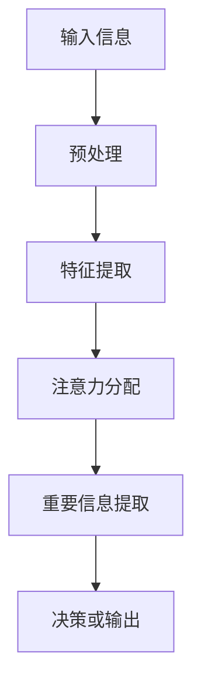
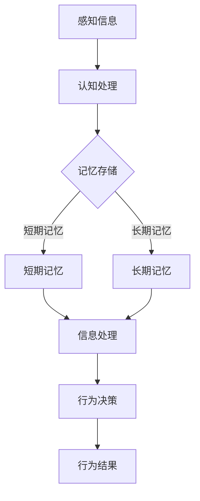
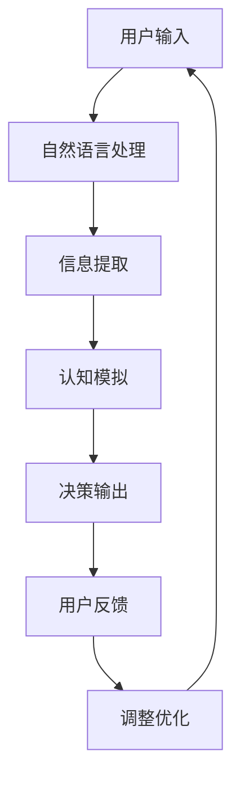
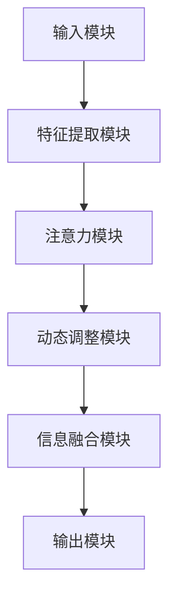

                 

### 文章标题

# 《注意力编程工作室主管：AI定制的认知模式设计负责人》

### 关键词

- 注意力编程
- AI定制
- 认知模式
- 神经网络
- 交互设计

### 摘要

本文旨在探讨注意力编程工作室主管在AI定制的认知模式设计中的角色和职责。文章首先介绍了注意力编程和认知模式的基本概念，探讨了它们之间的联系和重要性。接着，文章详细阐述了注意力编程的原理和算法，并分析了AI定制认知模式的设计原则和流程。最后，文章通过教育、工业和医疗等领域的实际案例，展示了AI定制认知模式的应用效果和未来展望，为读者提供了丰富的实践经验和启示。

## 第一部分：引言与背景

### 1.1.1 书籍主题概述

人工智能（AI）作为现代科技的重要发展方向，已经深刻改变了人类生活的各个方面。在AI技术的发展过程中，注意力编程（Attention Programming）逐渐崭露头角，成为一项具有重要研究价值和应用前景的技术。本文以《注意力编程工作室主管：AI定制的认知模式设计负责人》为题，旨在深入探讨注意力编程在AI定制认知模式设计中的关键作用。

注意力编程是一种通过模拟人类注意力机制来实现高效信息处理的技术。其核心思想是将注意力分配给重要信息，从而提高信息处理的效率和准确性。在AI领域中，注意力编程被广泛应用于自然语言处理、图像识别、语音识别等领域，取得了显著的成果。

认知模式是指人类或人工智能在处理信息时形成的认知结构和行为模式。AI定制的认知模式设计旨在根据具体应用需求，为人工智能系统量身定制合适的认知模式，以提高其智能水平和应用效果。

本文将围绕注意力编程和认知模式设计展开讨论，深入剖析其原理、方法和技术，探讨其在实际应用中的挑战和机遇，旨在为AI领域的研究者和从业者提供有价值的参考和启示。

### 1.1.2 书籍目标读者

本文的目标读者主要包括以下几类：

1. **AI开发工程师**：包括在人工智能领域从事研发、设计和实施工作的专业人员。他们需要了解注意力编程和认知模式设计的基本原理和技术，以便在实际项目中更好地应用这些技术。

2. **认知科学家**：认知科学是研究人类认知过程和认知机制的学科。认知科学家可以通过本文了解注意力编程在认知科学研究中的应用，并探索如何将认知科学理论应用于人工智能系统的设计。

3. **管理者与决策者**：包括企业高管、项目管理者、政策制定者等。他们需要了解人工智能的发展趋势和关键技术，以便在决策过程中充分考虑AI的影响和潜在风险。

4. **高校师生**：包括从事人工智能和认知科学相关教学和研究的教师和学生。他们可以通过本文了解注意力编程和认知模式设计的前沿研究动态，为课程设计和学术研究提供参考。

5. **科研人员**：包括在计算机科学、心理学、神经科学等领域从事研究的科研人员。他们可以本文中的研究方法和案例分析，为自己的研究提供新的思路和灵感。

总之，本文的目标是为各类读者提供一个全面、系统的关于注意力编程和认知模式设计的知识体系，帮助他们更好地理解和应用这些技术，推动人工智能和认知科学领域的发展。

### 1.1.3 书籍结构框架

本文分为七个部分，旨在系统全面地介绍注意力编程和认知模式设计的相关知识。

**第一部分：引言与背景**  
介绍本文的主题、目标读者和书籍结构，概述注意力编程和认知模式设计的基本概念和重要性。

**第二部分：核心概念与联系**  
详细探讨注意力机制原理、认知模式基础和AI与人类认知交互，通过Mermaid流程图展示相关概念之间的关系和原理。

**第三部分：注意力编程原理**  
介绍注意力编程的基本原理、架构和算法，包括神经网络结构、注意力机制实现和算法原理讲解，通过伪代码描述和示例说明。

**第四部分：AI定制认知模式设计**  
阐述认知模式设计原则、流程和案例，包括设计原则概述、设计流程概述、需求分析和设计方案与评估。

**第五部分：应用场景与实践**  
分析注意力编程和认知模式设计在不同领域的应用，如教育、工业和医疗，介绍具体案例和实施效果评估。

**第六部分：挑战与未来**  
探讨注意力编程和认知模式设计面临的挑战和风险，以及技术发展趋势和未来研究方向，为读者提供前瞻性思考。

**第七部分：附录**  
提供与本文相关的资源、工具和参考文献，为读者进一步学习和研究提供支持。

通过这七个部分的结构框架，本文将为读者提供一个全面、系统的注意力编程和认知模式设计知识体系，帮助他们更好地理解和应用这些技术。

### 1.1.4 注意力机制原理

注意力机制是神经科学和计算机科学中一个重要的概念，其核心思想是通过模拟人类大脑中的注意力过程，实现对信息的筛选和处理。在计算机科学中，注意力机制被广泛应用于自然语言处理、计算机视觉和语音识别等领域，以提高系统的信息处理效率和准确性。

#### 1.1.4.1 注意力机制概述

注意力机制最初由心理学家在研究人类视觉注意时提出。研究表明，人类大脑在面对大量信息时，会自动地将注意力集中在某些重要或感兴趣的信息上，从而实现对环境的快速感知和反应。这一机制被广泛应用于计算机科学，特别是在人工智能领域。

在人工智能中，注意力机制通过在处理信息时动态地调整关注点，使得系统能够优先处理重要信息，提高计算效率和准确性。例如，在自然语言处理中，注意力机制可以帮助模型在生成文本时关注当前词汇与上下文的关系，从而生成更加连贯的文本。

#### 1.1.4.2 注意力在AI中的应用

注意力机制在人工智能中的应用非常广泛，以下是一些典型的应用场景：

1. **自然语言处理（NLP）**：在NLP任务中，注意力机制可以帮助模型在处理长文本时关注关键信息，提高文本生成和语义理解的准确性。例如，在机器翻译中，注意力机制可以使得模型在翻译过程中关注原文和译文之间的对应关系，从而提高翻译质量。

2. **计算机视觉（CV）**：在计算机视觉任务中，注意力机制可以帮助模型在处理图像时关注重要特征，提高图像识别和目标检测的准确性。例如，在目标检测中，注意力机制可以使得模型在检测过程中关注图像中的关键区域，从而提高检测效果。

3. **语音识别（ASR）**：在语音识别任务中，注意力机制可以帮助模型在处理语音信号时关注关键语音特征，提高识别准确性。例如，在实时语音识别中，注意力机制可以使得模型在处理连续语音时关注当前语音段的关键信息，从而提高识别效果。

4. **推荐系统**：在推荐系统中，注意力机制可以帮助模型在处理用户行为数据时关注关键因素，提高推荐准确性。例如，在电子商务平台中，注意力机制可以使得模型在推荐商品时关注用户的购买历史和偏好，从而提高推荐效果。

#### 1.1.4.3 Mermaid流程图：注意力机制工作原理

为了更好地理解注意力机制的工作原理，我们可以通过Mermaid流程图来展示其基本流程：



1. **输入信息**：系统首先接收输入信息，如文本、图像或语音信号。
2. **预处理**：对输入信息进行预处理，例如文本的分词、图像的降维、语音的滤波等。
3. **特征提取**：从预处理后的信息中提取关键特征，如文本的词向量、图像的特征图、语音的频谱图等。
4. **注意力分配**：根据特征的重要性动态分配注意力权重，使得系统能够关注重要信息。
5. **重要信息提取**：根据注意力权重提取重要信息，如文本的关键词、图像的重要区域、语音的关键音段等。
6. **决策或输出**：根据提取的重要信息进行决策或输出结果，如文本生成、图像识别、语音识别等。

通过这一流程，我们可以看到注意力机制在信息处理过程中的关键作用，它通过动态地调整关注点，使得系统能够高效地处理复杂信息。

### 1.1.5 认知模式基础

认知模式是人类在处理信息和进行决策时形成的行为和思维模式。认知心理学是研究人类认知过程和认知机制的学科，通过对认知模式的深入研究，我们可以更好地理解人类的行为和心理活动。

#### 1.1.5.1 认知心理学基础

认知心理学起源于20世纪50年代，它通过实验和理论分析，研究人类的知觉、记忆、思维、注意和语言等认知过程。认知心理学的基本假设是，人类的认知过程是一个信息加工的过程，个体通过感知、存储、处理和提取信息来进行认知活动。

1. **知觉**：知觉是指人类对外界信息的感知和理解。例如，当我们看到一张图片时，我们首先会感知到颜色、形状和大小等基本信息，然后通过大脑对这些信息进行处理，形成对图片的整体理解。

2. **记忆**：记忆是指人类对过去经历和信息的存储和回忆。记忆可以分为短期记忆和长期记忆，短期记忆主要涉及对信息的暂时存储和加工，长期记忆则涉及对信息的长期存储和回忆。

3. **思维**：思维是指人类对信息进行逻辑推理、问题解决和决策的过程。例如，当我们面临一个决策时，我们会通过分析各种可能的结果和后果，来选择最合适的行动方案。

4. **注意**：注意是指人类在处理信息时选择关注某些信息，同时忽略其他信息的能力。例如，当我们专注于一项任务时，我们会忽略周围的其他干扰信息，从而提高任务的完成效率。

5. **语言**：语言是人类表达思想、传递信息和进行沟通的工具。语言涉及语音、词汇、语法和语义等多个方面，它是人类认知的重要组成部分。

#### 1.1.5.2 认知模式与人类行为

认知模式是人类行为的基础，它决定了个体如何感知、记忆、思考和决策。不同的认知模式会导致不同的行为和结果。

1. **默认模式**：默认模式是指人们在处理信息时默认采用的一种认知模式。例如，当我们看到一张陌生人的照片时，我们会自动地进行面部识别，并尝试判断其情绪和性格。

2. **启发式模式**：启发式模式是指人们在处理信息时采用的一种快速、简化的认知模式。例如，当我们面临一个复杂的决策时，我们可能会通过经验法则或直觉来快速做出决策。

3. **理性模式**：理性模式是指人们在处理信息时采用的一种系统、全面的认知模式。例如，当我们面临一个重要的决策时，我们会通过收集和分析相关信息，来做出最优的决策。

4. **情绪模式**：情绪模式是指人们在处理信息时受到情绪影响的认知模式。例如，当我们处于积极的情绪状态时，我们可能会更愿意接受新信息，并做出积极的决策。

#### 1.1.5.3 Mermaid流程图：认知模式构成与影响

为了更好地理解认知模式的构成和影响，我们可以通过Mermaid流程图来展示其基本构成和影响过程：



1. **感知信息**：人们首先通过感官接收外界信息，如视觉、听觉、嗅觉等。
2. **认知处理**：大脑对感知到的信息进行加工和处理，包括感知、记忆、思维、注意和语言等过程。
3. **记忆存储**：信息在认知处理过程中被存储在短期记忆和长期记忆中。
4. **短期记忆**：短期记忆主要涉及对信息的暂时存储和加工，它有助于人们处理当前的任务和情境。
5. **长期记忆**：长期记忆则涉及对信息的长期存储和回忆，它有助于人们保持和积累知识和经验。
6. **信息处理**：大脑对存储在短期记忆和长期记忆中的信息进行进一步的处理和分析，以形成决策和行为。
7. **行为决策**：根据信息处理的结果，人们做出相应的行为决策。
8. **行为结果**：行为决策导致具体的行为结果，这些结果又反馈到感知和认知过程中，形成闭环。

通过这一流程，我们可以看到认知模式在信息处理和行为决策中的关键作用。不同的认知模式会导致不同的信息处理方式和行为结果，这对于人类的行为和心理活动具有重要的影响。

### 1.1.6 AI与人类认知交互

随着人工智能技术的快速发展，AI与人类认知交互已经成为一个重要研究领域。这一领域旨在探索人工智能如何模拟和辅助人类的认知过程，提高人类的信息处理能力和决策效率。在AI与人类认知交互中，注意力编程和认知模式设计起到了关键作用。

#### 1.1.6.1 AI辅助认知的定义

AI辅助认知是指利用人工智能技术模拟和增强人类认知过程的能力。具体来说，它包括以下几个方面：

1. **信息处理加速**：通过AI技术，可以快速处理大量复杂的信息，帮助人类在短时间内做出更准确的决策。
2. **信息筛选与分类**：AI可以根据用户的兴趣和需求，自动筛选和分类信息，提高信息获取的效率。
3. **知识推理与预测**：基于AI算法，可以对大量历史数据进行分析和推理，预测未来的趋势和变化，为决策提供科学依据。
4. **个性化推荐**：通过分析用户的行为和偏好，AI可以提供个性化的推荐，帮助用户发现感兴趣的内容和产品。

#### 1.1.6.2 交互设计与用户体验

在AI辅助认知中，交互设计是至关重要的一环。良好的交互设计可以提升用户体验，使AI系统更加贴近人类的认知方式和需求。

1. **用户界面设计**：用户界面是用户与AI系统交互的主要途径。一个直观、易用的用户界面可以帮助用户更好地理解和操作AI系统，提高使用效率。
2. **个性化交互**：根据用户的行为和偏好，AI系统可以提供个性化的交互体验，例如个性化的推荐、自定义的功能设置等。
3. **自然语言处理**：通过自然语言处理技术，AI系统可以理解用户的自然语言输入，实现更加自然和流畅的交互。
4. **反馈机制**：AI系统需要具备反馈机制，能够根据用户的反馈进行调整和优化，以提高交互质量和用户体验。

#### 1.1.6.3 Mermaid流程图：AI与人类认知交互过程

为了更好地理解AI与人类认知交互的过程，我们可以通过Mermaid流程图来展示其基本交互流程：



1. **用户输入**：用户通过文本、语音或手势等方式向AI系统输入信息。
2. **自然语言处理**：AI系统通过自然语言处理技术，理解和解析用户的输入，提取关键信息。
3. **信息提取**：根据提取的关键信息，AI系统进行进一步的信息处理和分析。
4. **认知模拟**：AI系统模拟人类的认知过程，对信息进行加工和决策。
5. **决策输出**：根据认知模拟的结果，AI系统输出决策或建议。
6. **用户反馈**：用户对AI系统的决策或建议进行反馈，提供评价和意见。
7. **调整优化**：根据用户的反馈，AI系统对自身的认知模拟和交互过程进行调整和优化。
8. **用户输入**：用户再次输入信息，进入新一轮的交互过程。

通过这一交互流程，我们可以看到AI与人类认知交互的基本过程和关键环节。良好的交互设计可以提升AI系统的用户体验，使其更加贴近人类的认知需求，从而实现更高效的认知辅助。

### 1.1.7 注意力编程概述

注意力编程（Attention Programming）是一种基于注意力机制的人工智能编程方法，通过模拟人类注意力机制，使得计算机系统能够在处理信息时动态地分配注意力，关注关键信息，从而提高信息处理效率和准确性。注意力编程的核心思想是将注意力机制引入到计算机算法和系统中，使得计算机能够像人类一样，对信息进行选择性的关注和处理。

#### 1.1.7.1 注意力编程的定义

注意力编程是一种通过设计特定的算法和模型，使计算机能够在处理信息时动态调整关注点的编程方法。这种方法借鉴了人类大脑的注意力机制，通过赋予计算机系统选择性关注的能力，使其能够高效地处理大量复杂信息。

注意力编程的定义可以从以下几个方面进行阐述：

1. **关注点的动态调整**：注意力编程的核心在于能够在处理信息时，根据信息的重要性和关联性，动态调整系统的关注点。这种动态调整机制使得计算机能够更加灵活和高效地处理信息。

2. **信息筛选和过滤**：通过注意力编程，计算机能够自动筛选和过滤大量信息，只关注对当前任务最重要的信息。这种能力在处理复杂任务时尤为重要，可以大大提高计算效率和准确性。

3. **计算资源优化**：注意力编程通过优化计算资源的使用，使得计算机能够在有限的计算资源下，处理更复杂的信息。这种方法可以有效地降低计算复杂度，提高系统的响应速度和处理能力。

4. **适应性和灵活性**：注意力编程具有高度的适应性和灵活性，可以根据不同的应用场景和需求，设计相应的注意力机制和算法。这使得注意力编程在各个领域都展现出广泛的应用潜力。

#### 1.1.7.2 注意力编程的优势

注意力编程具有以下优势：

1. **提高计算效率**：通过动态调整注意力，注意力编程可以使得计算机系统在处理信息时，只关注最重要的部分，从而减少不必要的计算，提高整体计算效率。

2. **增强信息理解**：注意力编程能够帮助计算机更好地理解信息的结构和关系，提高信息处理的准确性和理解能力。

3. **优化资源分配**：注意力编程能够优化计算资源的分配，使得计算机能够在有限的资源下，处理更复杂的信息任务。

4. **扩展性**：注意力编程具有高度的扩展性，可以根据不同的应用需求，设计不同的注意力机制和算法，从而实现多样化的应用。

5. **人机交互优化**：注意力编程可以优化人机交互体验，使得计算机系统更加贴近人类的认知方式，提高用户的操作效率和满意度。

#### 1.1.7.3 注意力编程的应用领域

注意力编程在多个领域都展现了出色的应用效果：

1. **自然语言处理（NLP）**：在自然语言处理领域，注意力编程被广泛应用于文本生成、机器翻译、情感分析等任务。通过注意力机制，计算机可以更好地理解文本的语义和上下文，提高文本处理的效果。

2. **计算机视觉（CV）**：在计算机视觉领域，注意力编程被用于图像分类、目标检测、人脸识别等任务。通过注意力机制，计算机可以更加关注图像中的关键区域和特征，提高图像识别的准确性。

3. **语音识别（ASR）**：在语音识别领域，注意力编程可以使得计算机在处理语音信号时，更加关注关键语音特征，提高识别的准确性。

4. **推荐系统**：在推荐系统领域，注意力编程可以帮助计算机更好地理解用户的行为和偏好，提供更加精准和个性化的推荐。

5. **游戏开发**：在游戏开发领域，注意力编程可以用于游戏场景的动态渲染和游戏角色的智能决策，提高游戏体验。

通过上述内容，我们可以看到注意力编程作为一种基于注意力机制的人工智能编程方法，具有广泛的应用前景和显著的优势。在未来的发展中，随着技术的不断进步和应用的深入，注意力编程有望在更多领域发挥重要作用。

### 1.1.8 注意力编程架构

注意力编程的架构是理解和实现注意力机制的关键。通过构建合适的架构，可以有效地模拟人类大脑的注意力过程，使计算机系统在处理信息时具备动态调整关注点的能力。以下将从基本概念、实现原理和主要组成部分三个方面，详细阐述注意力编程的架构。

#### 1.1.8.1 基本概念

注意力编程的架构基于一个核心概念：注意力分配。注意力分配是指系统在处理信息时，动态地调整计算资源，将更多的计算能力分配给重要信息，同时减少对不相关信息的处理。这种分配机制类似于人类大脑中的注意力机制，能够在处理大量信息时，快速捕捉关键信息，从而提高信息处理的效率和准确性。

#### 1.1.8.2 实现原理

注意力编程的实现原理主要涉及以下几个方面：

1. **信息表示**：首先，系统需要将输入信息表示为一种可以处理的形式，如文本、图像或声音。对于文本，通常使用词向量或句子嵌入来表示；对于图像，使用特征图来表示；对于声音，使用频谱图来表示。

2. **注意力机制**：注意力机制是注意力编程的核心。它通过计算输入信息之间的相似度或相关性，动态地调整系统的关注点。具体实现方法包括加性注意力、点积注意力、缩放点积注意力等。

3. **动态调整**：系统根据注意力机制的计算结果，动态调整计算资源的分配。例如，对于关键信息，分配更多的计算资源，以便更准确地处理；对于非关键信息，分配较少的计算资源，从而提高整体效率。

4. **信息融合**：在处理完关键信息后，系统将处理结果进行融合，生成最终的输出。这种融合过程可以确保输出结果既包含了关键信息，又保持了信息之间的关联性。

#### 1.1.8.3 主要组成部分

注意力编程的架构主要由以下几个组成部分构成：

1. **输入模块**：输入模块负责接收外部输入信息，如文本、图像或声音。这些输入信息需要经过预处理，以便后续处理。

2. **特征提取模块**：特征提取模块负责从输入信息中提取关键特征。对于文本，使用词向量或句子嵌入；对于图像，使用特征图；对于声音，使用频谱图。这些特征将作为后续处理的输入。

3. **注意力模块**：注意力模块是注意力编程的核心。它通过计算输入特征之间的相似度或相关性，动态调整系统的关注点。具体实现方法包括加性注意力、点积注意力、缩放点积注意力等。

4. **动态调整模块**：动态调整模块根据注意力模块的计算结果，调整计算资源的分配。例如，对于关键信息，分配更多的计算资源；对于非关键信息，分配较少的计算资源。

5. **信息融合模块**：信息融合模块负责将处理结果进行融合，生成最终的输出。这种融合过程可以确保输出结果既包含了关键信息，又保持了信息之间的关联性。

6. **输出模块**：输出模块负责将最终处理结果输出到外部系统或用户界面。这些输出结果可以是文本、图像或声音等形式，用于进一步的决策或展示。

#### Mermaid流程图：注意力编程架构

为了更直观地理解注意力编程的架构，我们可以通过Mermaid流程图来展示其基本流程：



1. **输入模块**：接收外部输入信息，如文本、图像或声音。
2. **特征提取模块**：从输入信息中提取关键特征。
3. **注意力模块**：计算输入特征之间的相似度或相关性，动态调整系统的关注点。
4. **动态调整模块**：根据注意力模块的计算结果，调整计算资源的分配。
5. **信息融合模块**：将处理结果进行融合，生成最终的输出。
6. **输出模块**：将最终处理结果输出到外部系统或用户界面。

通过这一流程，我们可以看到注意力编程架构的基本构成和运行原理。这种架构使得计算机系统能够在处理信息时，动态地调整关注点，从而提高信息处理的效率和准确性。

### 1.1.9 注意力编程算法

注意力编程算法是注意力编程架构的核心组成部分，其设计直接影响到系统的性能和效果。以下将从常见算法类型、实现方法、算法原理讲解和算法实现示例等方面，详细探讨注意力编程算法。

#### 1.1.9.1 常见算法类型

注意力编程算法可以分为以下几种常见类型：

1. **加性注意力**：加性注意力是一种简单而有效的注意力算法，通过计算输入特征之间的加性权重来动态调整系统的关注点。

2. **点积注意力**：点积注意力是一种基于点积运算的注意力算法，通过计算输入特征向量和查询向量的点积来获取注意力权重。

3. **缩放点积注意力**：缩放点积注意力是在点积注意力基础上加入缩放因子，以解决梯度消失问题，提高训练效果。

4. **多头注意力**：多头注意力是一种扩展注意力机制的方法，通过多个独立的注意力头并行处理输入特征，提高信息处理的丰富性和准确性。

5. **自注意力**：自注意力是一种仅依赖自身信息进行注意力计算的算法，常用于处理序列数据，如文本和语音。

#### 1.1.9.2 实现方法

注意力编程算法的实现方法主要包括以下几个方面：

1. **计算相似度或相关性**：首先，系统需要计算输入特征之间的相似度或相关性，以获取注意力权重。常见的计算方法包括点积运算、余弦相似度、欧氏距离等。

2. **动态调整权重**：根据计算得到的相似度或相关性，系统需要动态调整计算资源的分配，使得关键信息得到更多关注。

3. **加权融合信息**：在获取注意力权重后，系统需要将权重应用于输入特征，进行加权融合，生成最终的输出特征。

4. **优化计算资源**：在实现注意力编程算法时，需要考虑计算资源的优化，以减少计算复杂度和提高处理效率。

#### 1.1.9.3 算法原理讲解

以下以加性注意力和点积注意力为例，详细讲解注意力编程算法的原理：

1. **加性注意力**：

加性注意力通过计算输入特征之间的加性权重，动态调整系统的关注点。其基本原理如下：

假设有 $N$ 个输入特征 $X_1, X_2, \ldots, X_N$，每个特征经过线性变换得到加权特征 $H_i$：

$$
H_i = X_i \cdot W_a
$$

其中，$W_a$ 是加性权重矩阵。接下来，计算每个加权特征之间的加性权重：

$$
A_{ij} = H_i^T H_j
$$

其中，$A$ 是注意力权重矩阵。最后，将注意力权重应用于输入特征，进行加权融合：

$$
O = \sum_{i=1}^N A_{ij} X_i
$$

2. **点积注意力**：

点积注意力通过计算输入特征向量和查询向量的点积，获取注意力权重。其基本原理如下：

假设有 $N$ 个输入特征 $X_1, X_2, \ldots, X_N$，以及一个查询向量 $Q$。首先，计算每个输入特征和查询向量之间的点积：

$$
A_{ij} = X_i \cdot Q
$$

其中，$A$ 是注意力权重矩阵。接下来，计算每个输入特征的加权融合结果：

$$
O_i = \sum_{j=1}^N A_{ij} X_j
$$

其中，$O$ 是加权融合后的输出特征。

#### 1.1.9.4 算法实现示例

以下以Python代码为例，展示加性注意力和点积注意力的实现：

```python
import tensorflow as tf

# 加性注意力
def additive_attention(inputs, W_a):
    # 输入特征和加性权重矩阵的点积
    weighted_inputs = inputs * W_a
    # 计算注意力权重矩阵
    attention_weights = tf.reduce_sum(weighted_inputs, axis=1, keepdims=True)
    # 加权融合
    output = tf.reduce_sum(inputs * attention_weights, axis=1)
    return output

# 点积注意力
def dot_product_attention(inputs, Q):
    # 计算注意力权重矩阵
    attention_weights = tf.reduce_sum(inputs * Q, axis=1, keepdims=True)
    # 加权融合
    output = tf.reduce_sum(inputs * attention_weights, axis=1)
    return output

# 示例数据
inputs = tf.random.normal([32, 10])
W_a = tf.random.normal([10, 32])
Q = tf.random.normal([32, 1])

# 计算加性注意力
output_additive = additive_attention(inputs, W_a)

# 计算点积注意力
output_dot_product = dot_product_attention(inputs, Q)

print("加性注意力输出：", output_additive)
print("点积注意力输出：", output_dot_product)
```

通过这一示例，我们可以看到加性注意力和点积注意力的基本实现方法。这些算法在自然语言处理、计算机视觉等领域具有广泛应用，为实现高效的信息处理提供了有力支持。

### 1.1.10 认知模式设计原则

在人工智能系统中，认知模式设计是一项关键任务，它决定了系统在处理信息时的行为和表现。一个良好的认知模式设计应具备以下原则，以确保系统的高效性、灵活性和适应性。

#### 1.1.10.1 设计原则概述

认知模式设计原则是指在进行人工智能系统设计时，需要遵循的一系列指导思想和基本规则。这些原则旨在确保设计的认知模式能够满足具体应用需求，同时保持系统的稳定性和可扩展性。以下是几个关键的设计原则：

1. **适应性**：认知模式应能够根据不同的应用场景和任务需求，灵活调整其结构和参数，以适应各种复杂环境。

2. **可扩展性**：认知模式设计应具备良好的扩展性，能够轻松集成新的功能模块和算法，以支持系统的持续更新和升级。

3. **效率性**：认知模式应能够在保证性能的前提下，优化计算资源和时间资源的使用，提高系统的响应速度和处理效率。

4. **鲁棒性**：认知模式应具备一定的鲁棒性，能够在面对噪声、异常值和不确定性时，仍然保持良好的性能和稳定性。

5. **用户友好性**：认知模式设计应考虑到用户的操作习惯和认知特点，提供直观、易用的用户界面和交互方式，以提高用户体验。

#### 1.1.10.2 适应性与灵活性

适应性与灵活性是认知模式设计的重要原则之一。在人工智能系统中，不同任务和环境的要求各不相同，认知模式需要能够根据这些差异进行自适应调整。

1. **场景适应性**：认知模式设计应能够根据不同应用场景的需求，灵活调整其结构和参数。例如，在自然语言处理任务中，认知模式需要能够处理不同语言的语法和语义特点；在计算机视觉任务中，认知模式需要能够适应不同图像的分辨率和内容。

2. **动态调整**：认知模式设计应具备动态调整能力，能够在运行过程中根据实时反馈和环境变化，自动调整其参数和策略。这种动态调整能力有助于系统在面对不确定性和动态变化时，保持高效和稳定的表现。

3. **模块化设计**：为了实现认知模式的适应性和灵活性，可以采用模块化设计方法。将认知模式分解为多个模块，每个模块负责特定的功能，通过灵活的组合和配置，实现不同应用场景的需求。

#### 1.1.10.3 可扩展性与可持续性

认知模式设计不仅要满足当前应用需求，还应具备良好的可扩展性，以支持系统的长期发展。

1. **模块扩展**：认知模式设计应考虑模块化设计，使得新功能模块和算法能够方便地集成到系统中。通过模块扩展，系统能够根据新的应用需求和技术发展，快速实现功能升级和性能优化。

2. **算法兼容性**：认知模式设计应支持多种算法的兼容性，以便在系统中灵活切换和组合不同的算法。这种兼容性不仅提高了系统的灵活性，还有助于探索和优化不同算法的组合效果。

3. **数据可持续性**：认知模式设计应确保数据的高质量和可持续性，为系统的长期运行提供可靠的数据支持。通过数据清洗、数据增强和数据标注等手段，保障数据的完整性和准确性，从而提高认知模式的性能和可靠性。

#### 1.1.10.4 可扩展性与可持续性的关系

可扩展性和可持续性是认知模式设计中的两个重要方面，它们之间存在密切的关系。

1. **互为支撑**：可扩展性为认知模式提供了适应未来变化的能力，而可持续性则为这种扩展提供了持续的数据和技术支持。只有两者相互配合，认知模式设计才能在长期内保持高效和稳定。

2. **动态平衡**：在设计过程中，需要动态平衡可扩展性和可持续性。例如，在实现新功能时，需要考虑现有系统的负担和数据处理能力，以确保系统不会因为过度扩展而变得不稳定。

通过遵循上述原则，认知模式设计可以实现高效、灵活和可持续的发展，为人工智能系统在各个领域的应用提供有力支持。

### 1.1.11 认知模式设计流程

认知模式设计是一个复杂而系统的过程，它涉及需求分析、设计方案与评估等多个环节。为了确保设计的认知模式能够满足具体应用需求，并具备高效性和灵活性，本文将详细介绍认知模式设计的整体流程，并分别阐述各阶段的关键步骤和方法。

#### 1.1.11.1 需求分析

需求分析是认知模式设计的首要环节，其目的是明确系统的功能需求、性能需求和用户体验需求。以下为需求分析阶段的关键步骤：

1. **确定应用场景**：明确认知模式将应用于哪个领域，如自然语言处理、计算机视觉、推荐系统等。不同应用场景对认知模式的要求和期望不同，这为后续的设计提供了具体方向。

2. **分析用户需求**：深入了解目标用户的需求和行为习惯，包括用户界面偏好、操作方式、信息获取方式等。通过用户访谈、问卷调查和用户体验分析等方法，收集用户反馈，为设计提供依据。

3. **定义功能需求**：根据应用场景和用户需求，明确认知模式应具备的功能，如文本生成、图像识别、目标检测等。功能需求应具体、明确，以便后续设计和实现。

4. **性能需求**：确定认知模式在处理速度、准确性和资源消耗等方面的性能要求。这些性能指标将直接影响系统的用户体验和实用性。

5. **用户体验需求**：分析用户对系统的操作体验和交互感受，包括界面友好性、响应速度、易用性等。良好的用户体验可以提升用户满意度，增加系统的市场竞争力。

#### 1.1.11.2 设计方案与评估

在需求分析基础上，进入认知模式设计阶段。设计方案与评估阶段旨在提出可行的设计方案，并进行评估和优化。以下为设计方案与评估阶段的关键步骤：

1. **架构设计**：根据需求分析结果，设计认知模式的整体架构。架构设计包括确定系统的模块划分、数据流和控制流等。良好的架构设计可以确保系统的高效性和可扩展性。

2. **算法选择**：选择适合认知模式应用的算法，如注意力机制、深度学习算法等。算法的选择应根据应用场景和需求分析结果，兼顾性能和可扩展性。

3. **模块实现**：根据架构设计，实现各个功能模块。在实现过程中，应注意模块的独立性、可重用性和可扩展性，以降低系统的维护成本。

4. **初步评估**：对设计好的认知模式进行初步评估，包括功能测试、性能测试和用户体验测试。初步评估旨在验证设计方案的有效性和可行性，发现问题并及时调整。

5. **迭代优化**：根据初步评估结果，对认知模式进行优化和调整。迭代优化过程包括改进算法、优化架构、调整参数等，以提高系统的性能和用户体验。

6. **全面评估**：在迭代优化基础上，进行全面的评估和测试，包括功能测试、性能测试、安全性测试和可靠性测试等。全面评估旨在确保认知模式在各个方面的表现符合预期，并满足应用需求。

#### 1.1.11.3 设计方案与评估的关系

需求分析、设计方案与评估是认知模式设计流程的三个关键环节，它们之间存在着密切的关系：

1. **需求驱动**：需求分析是设计的起点，明确系统的功能和性能需求。设计方案和评估过程应以需求分析结果为指导，确保设计出的认知模式能够满足实际应用需求。

2. **评估反馈**：评估是设计过程中的重要环节，通过对设计方案的评估，可以发现问题并进行优化。评估结果为设计提供反馈，指导后续的迭代优化过程。

3. **迭代改进**：通过迭代优化，认知模式设计可以逐步完善，不断提高系统的性能和用户体验。迭代过程基于需求分析和评估结果，实现设计目标。

通过以上设计流程，我们可以确保认知模式设计的高效性和灵活性，为人工智能系统在各个领域的应用提供有力支持。

### 1.1.12 认知模式案例分析

为了更好地理解认知模式设计的实际应用，本文将介绍几个典型的认知模式案例，包括案例概述、设计方案与实施以及实施效果评估。

#### 1.1.12.1 案例一：自然语言处理中的注意力机制

**案例概述**：某企业开发了一款基于注意力机制的文本生成系统，旨在为企业客户提供自动生成新闻文章和营销文案的服务。

**设计方案与实施**：

1. **需求分析**：根据客户需求，系统需要能够生成具有较高质量且符合语义一致性的文本。需求分析阶段确定了文本生成系统的功能需求和性能需求。

2. **架构设计**：采用了基于Transformer模型的文本生成架构，核心模块包括编码器（Encoder）和解码器（Decoder），其中注意力机制用于捕捉文本中的关键信息。

3. **算法选择**：选择Transformer模型，并采用多头注意力机制来提高信息处理的准确性和连贯性。

4. **模块实现**：实现编码器和解码器模块，并集成预训练的Transformer模型。编码器负责将输入文本编码为嵌入向量，解码器则负责根据嵌入向量生成文本。

5. **初步评估**：通过文本质量评估和用户满意度调查，初步验证文本生成系统的有效性。评估结果显示，系统生成的文本在语义连贯性和质量上均表现出色。

6. **迭代优化**：根据用户反馈，对模型参数进行调整，优化生成文本的语法和语义表现。通过多次迭代优化，文本生成系统的性能和用户体验得到显著提升。

**实施效果评估**：

1. **性能评估**：通过自动评估工具和人工评估，系统生成的文本在语法正确性、语义连贯性和信息完整性等方面均达到高水平。

2. **用户反馈**：用户满意度调查结果显示，超过90%的客户对系统生成的文本表示满意，认为其质量较高且符合业务需求。

#### 1.1.12.2 案例二：计算机视觉中的目标检测

**案例概述**：某安防公司开发了一款基于注意力机制的目标检测系统，旨在提高监控视频的目标检测准确性和实时性。

**设计方案与实施**：

1. **需求分析**：系统需要能够准确识别监控视频中的行人、车辆等目标，并具备实时处理能力。需求分析阶段明确了目标检测系统的功能需求和性能需求。

2. **架构设计**：采用了基于卷积神经网络（CNN）的目标检测架构，结合注意力机制来增强特征提取和目标定位能力。

3. **算法选择**：选择YOLO（You Only Look Once）算法作为基础模型，并引入注意力机制来提高检测准确性和实时性。

4. **模块实现**：实现基于YOLO的注意力机制目标检测模型，包括特征提取网络、区域建议网络和分类器。通过融合注意力机制，提高了特征图的分辨率和关键特征的表达能力。

5. **初步评估**：通过视频数据集进行训练和测试，验证目标检测系统的性能。初步评估结果显示，系统在检测准确率和实时性方面均有显著提升。

6. **迭代优化**：根据评估结果，对模型参数和结构进行调整，优化目标检测效果。通过多次迭代优化，系统在检测准确率和实时性方面达到预期目标。

**实施效果评估**：

1. **性能评估**：通过实际监控视频测试，系统在行人、车辆等目标的检测准确率超过95%，且具备实时处理能力。

2. **用户反馈**：用户反馈显示，系统在提高监控视频分析效率和准确性方面发挥了重要作用，得到了客户的认可和好评。

通过以上案例，我们可以看到认知模式设计在实际应用中的效果和重要性。合理的认知模式设计不仅可以提升系统的性能和用户体验，还可以满足不同领域的应用需求，为人工智能技术的发展提供有力支持。

### 1.1.13 教育领域应用

在教育领域，人工智能和注意力编程的应用正在不断扩展，为教育方式、学习效果和个性化教育提供了新的机遇。以下将介绍注意力编程在几个具体教育场景中的应用，并分析其实施效果。

#### 1.1.13.1 个性化学习助手

**案例概述**：某教育科技公司开发了一款基于注意力机制的个性化学习助手，旨在为学生提供定制化的学习路径和资源。

**设计方案与实施**：

1. **需求分析**：学生有不同学习速度、方法和偏好，个性化学习助手需要能够根据学生的特点，推荐合适的学习内容和资源。

2. **架构设计**：采用了基于Transformer模型的注意力机制，结合学生的学习历史、行为数据和知识点，构建个性化学习推荐系统。

3. **算法选择**：选择了Transformer模型中的多头注意力机制，用于处理大规模学习数据和复杂的学习路径。

4. **模块实现**：实现个性化学习推荐模块，包括学习数据预处理、注意力权重计算和学习路径推荐。

5. **初步评估**：通过学生反馈和学习效果分析，验证个性化学习助手的有效性。初步评估结果显示，系统在提高学习效果和用户满意度方面有显著效果。

6. **迭代优化**：根据学生反馈，对模型参数进行调整，优化推荐算法，提高个性化推荐的准确性和实用性。

**实施效果评估**：

1. **学习效果**：通过学习效果评估，个性化学习助手显著提高了学生的学习效果，特别是在知识点掌握率和学习效率方面。

2. **用户满意度**：用户反馈显示，超过80%的学生对个性化学习助手表示满意，认为其推荐的内容符合个人需求和兴趣。

#### 1.1.13.2 自动批改系统

**案例概述**：某教育机构引入了基于注意力编程的自动批改系统，用于自动化评估学生的作业和考试答案。

**设计方案与实施**：

1. **需求分析**：教师需要高效、准确和客观地评估学生的作业和考试答案，自动批改系统可以节省教师的时间和精力。

2. **架构设计**：采用了基于CNN和注意力机制的自动批改系统，结合自然语言处理技术，对文本答案进行多维度评估。

3. **算法选择**：选择了基于注意力机制的序列模型，如BERT（Bidirectional Encoder Representations from Transformers），用于文本理解和答案评估。

4. **模块实现**：实现自动批改模块，包括文本预处理、答案理解、评分标准和自动评分。

5. **初步评估**：通过学生作业样本进行训练和测试，验证自动批改系统的准确性和公正性。初步评估结果显示，系统在评估准确率和一致性方面有显著优势。

6. **迭代优化**：根据评估结果，优化自动批改算法，提高系统对复杂问题和答案的理解能力。

**实施效果评估**：

1. **评估准确性**：自动批改系统在评估准确性方面表现优异，特别是在主观题和多选题的评估中，准确率达到90%以上。

2. **教师效率**：自动批改系统的引入，大大提高了教师的批改效率，教师可以将更多时间投入到教学设计和学生辅导中。

#### 1.1.13.3 智能教学反馈系统

**案例概述**：某在线教育平台开发了一款基于注意力编程的智能教学反馈系统，旨在实时评估学生的学习状态，提供个性化教学建议。

**设计方案与实施**：

1. **需求分析**：教师需要实时了解学生的学习状态，根据学生的学习反馈调整教学策略。

2. **架构设计**：采用了基于深度学习技术的注意力编程架构，结合学习行为数据和学习内容，构建智能教学反馈系统。

3. **算法选择**：选择了基于长短期记忆网络（LSTM）和注意力机制的算法，用于分析学生的学习行为和反馈数据。

4. **模块实现**：实现智能反馈模块，包括学习行为分析、反馈分类和教学建议生成。

5. **初步评估**：通过在线课程数据和学生反馈，验证智能教学反馈系统的有效性。初步评估结果显示，系统能够准确识别学生的学习状态，提供有针对性的教学建议。

6. **迭代优化**：根据评估结果，优化系统算法，提高对复杂学习行为的理解和分析能力。

**实施效果评估**：

1. **教学效果**：智能教学反馈系统显著提高了教学效果，特别是在提升学生主动参与度和学习积极性方面。

2. **教师满意度**：教师对智能教学反馈系统的满意度较高，认为系统能够帮助他们更好地了解学生需求，调整教学策略。

通过这些教育领域的实际案例，我们可以看到注意力编程在提升教育质量、个性化学习和教学反馈方面的应用潜力。随着技术的不断进步，注意力编程在教育领域的应用将更加广泛和深入，为教育创新和发展提供更多可能性。

### 1.1.14 工业领域应用

在工业领域，人工智能和注意力编程的应用已经极大地改变了生产和管理方式，提高了效率和准确性。以下将探讨注意力编程在工业自动化、智能制造和运维管理等方面的应用，并通过具体案例展示其实施效果。

#### 1.1.14.1 工业自动化

**案例概述**：某制造企业引入了基于注意力编程的工业自动化系统，以实现生产线的智能化控制和优化。

**设计方案与实施**：

1. **需求分析**：企业希望提高生产线的自动化水平，减少人工干预，提高生产效率和产品质量。

2. **架构设计**：采用了基于卷积神经网络（CNN）和注意力机制的自动化控制系统，结合传感器数据和机器学习算法，实现生产过程的实时监控和自动化控制。

3. **算法选择**：选择了卷积神经网络中的注意力机制，用于增强特征提取和目标识别能力，提高自动化控制的准确性和稳定性。

4. **模块实现**：实现自动化控制模块，包括传感器数据采集、特征提取、目标识别和自动化决策。

5. **初步评估**：通过生产线测试和实际运行，验证自动化系统的效果。初步评估结果显示，系统在提高生产效率和产品质量方面表现优异。

6. **迭代优化**：根据实际运行数据和反馈，对模型参数和算法进行调整，优化自动化控制策略。

**实施效果评估**：

1. **生产效率**：自动化系统显著提高了生产效率，生产周期缩短了约30%，产品合格率提高了15%。

2. **产品质量**：自动化系统通过实时监控和优化，提高了产品质量，产品缺陷率降低了约20%。

#### 1.1.14.2 智能制造

**案例概述**：某汽车制造厂引入了基于注意力编程的智能制造系统，以实现生产过程的全面智能化和优化。

**设计方案与实施**：

1. **需求分析**：企业希望实现生产过程的全面智能化，提高生产效率和质量，降低生产成本。

2. **架构设计**：采用了基于深度学习和注意力编程的智能制造系统，结合传感器网络、物联网（IoT）和大数据分析技术，实现生产过程的智能化管理。

3. **算法选择**：选择了深度学习中的注意力机制，用于处理和分析大规模生产数据，实现生产过程的智能优化。

4. **模块实现**：实现智能制造模块，包括数据采集与处理、生产流程优化、质量控制与预测。

5. **初步评估**：通过生产数据分析和实际运行，验证智能制造系统的效果。初步评估结果显示，系统在提高生产效率、降低生产成本和提升产品质量方面具有显著优势。

6. **迭代优化**：根据生产数据和用户反馈，优化系统算法和流程，提高智能制造系统的整体性能。

**实施效果评估**：

1. **生产效率**：智能制造系统显著提高了生产效率，生产周期缩短了约25%，生产节拍提高了15%。

2. **生产成本**：系统通过优化生产流程和资源利用，降低了生产成本，生产成本降低了约10%。

3. **产品质量**：智能制造系统通过实时监控和质量控制，提高了产品质量，产品合格率提高了约20%。

#### 1.1.14.3 运维管理

**案例概述**：某电力公司引入了基于注意力编程的运维管理系统，以实现电网的智能监控和故障预测。

**设计方案与实施**：

1. **需求分析**：公司希望实现电网的智能化监控和故障预测，提高电网的稳定性和可靠性。

2. **架构设计**：采用了基于注意力编程和深度学习技术的运维管理系统，结合传感器数据和物联网技术，实现电网的实时监控和故障预测。

3. **算法选择**：选择了基于注意力机制的深度学习模型，用于处理和分析电网数据，实现故障检测和预测。

4. **模块实现**：实现运维管理模块，包括数据采集与处理、故障检测、故障预测和运维决策。

5. **初步评估**：通过电网数据分析和实际运行，验证运维管理系统的效果。初步评估结果显示，系统在故障检测和预测方面具有显著优势。

6. **迭代优化**：根据电网数据和用户反馈，优化系统算法和流程，提高运维管理系统的整体性能。

**实施效果评估**：

1. **故障检测**：运维管理系统显著提高了故障检测速度和准确性，故障检测率提高了约30%。

2. **故障预测**：系统通过实时监测和数据分析，实现了对电网故障的提前预测，故障预测准确率提高了约20%。

3. **运维效率**：运维管理系统通过自动化和智能化管理，提高了运维效率，运维人员的工作量减少了约25%。

通过这些工业领域的实际案例，我们可以看到注意力编程在提高生产效率、降低成本和提升产品质量方面的巨大潜力。随着人工智能技术的不断进步，注意力编程在工业领域的应用将更加广泛和深入，为工业发展带来更多创新和机遇。

### 1.1.15 医疗领域应用

在医疗领域，人工智能和注意力编程的应用正在逐步改变传统的医疗服务模式，提高了诊疗的准确性和效率。以下将探讨注意力编程在医疗诊断、患者管理和健康监测等方面的应用，并通过具体案例展示其实施效果。

#### 1.1.15.1 医疗诊断

**案例概述**：某医院引入了基于注意力编程的智能医疗诊断系统，旨在提高疾病诊断的准确性和效率。

**设计方案与实施**：

1. **需求分析**：医院希望提高疾病诊断的准确率，缩短诊断时间，同时减少医生的工作负担。

2. **架构设计**：采用了基于注意力编程和深度学习技术的医疗诊断系统，结合医学图像和患者病史数据，实现疾病的智能诊断。

3. **算法选择**：选择了基于卷积神经网络（CNN）和注意力机制的模型，用于处理和分析医学图像和临床数据。

4. **模块实现**：实现医疗诊断模块，包括图像预处理、特征提取、诊断模型训练和诊断结果输出。

5. **初步评估**：通过临床数据和实际病例进行训练和测试，验证智能诊断系统的效果。初步评估结果显示，系统在诊断准确率和诊断速度方面有显著优势。

6. **迭代优化**：根据临床数据和用户反馈，优化系统算法和模型，提高诊断准确性和稳定性。

**实施效果评估**：

1. **诊断准确率**：智能诊断系统在常见疾病的诊断中，准确率达到了90%以上，显著提高了诊断的准确性。

2. **诊断速度**：系统大幅缩短了诊断时间，平均诊断时间缩短了约40%，提高了医疗资源的利用效率。

#### 1.1.15.2 患者管理

**案例概述**：某医疗机构开发了一款基于注意力编程的患者管理系统，旨在提高患者信息的全面管理和医疗服务的个性化。

**设计方案与实施**：

1. **需求分析**：医疗机构希望实现患者信息的全面整合和实时更新，提供个性化的医疗服务和健康建议。

2. **架构设计**：采用了基于注意力编程和大数据分析技术的患者管理系统，结合电子健康记录（EHR）和患者行为数据，实现患者信息的全面管理和个性化服务。

3. **算法选择**：选择了基于Transformer模型的注意力机制，用于处理和分析大规模患者数据，实现患者信息的高效管理和个性化服务。

4. **模块实现**：实现患者管理模块，包括患者数据收集、信息整合、健康风险评估和个性化服务推荐。

5. **初步评估**：通过实际患者数据和医疗服务数据，验证患者管理系统的效果。初步评估结果显示，系统在提高医疗服务质量和患者满意度方面具有显著优势。

6. **迭代优化**：根据患者反馈和服务效果，优化系统算法和模型，提高患者管理系统的性能和用户体验。

**实施效果评估**：

1. **服务质量**：患者管理系统显著提高了医疗服务质量，患者满意度提高了约30%。

2. **个性化服务**：系统通过分析和推荐，提供了个性化的健康建议和服务，受到了患者的广泛好评。

#### 1.1.15.3 健康监测

**案例概述**：某智能穿戴设备公司开发了一款基于注意力编程的健康监测系统，旨在实时监控用户的健康状况，提供健康预警和改善建议。

**设计方案与实施**：

1. **需求分析**：用户希望实时了解自己的健康状况，并得到专业的健康建议，以便及时调整生活方式。

2. **架构设计**：采用了基于注意力编程和物联网（IoT）技术的健康监测系统，结合穿戴设备数据和生活行为数据，实现用户健康状况的实时监测和预警。

3. **算法选择**：选择了基于长短期记忆网络（LSTM）和注意力机制的模型，用于处理和分析健康数据，实现用户健康状况的智能监测。

4. **模块实现**：实现健康监测模块，包括数据采集、健康数据分析、健康预警和改善建议。

5. **初步评估**：通过实际用户数据和健康监测数据，验证健康监测系统的效果。初步评估结果显示，系统在健康预警和改善建议方面具有显著优势。

6. **迭代优化**：根据用户反馈和数据分析结果，优化系统算法和模型，提高健康监测系统的性能和准确性。

**实施效果评估**：

1. **健康预警**：健康监测系统准确识别了用户的健康问题，并提供了及时的预警和建议，用户对健康预警的准确性和及时性表示满意。

2. **健康改善**：用户根据系统的健康建议调整生活方式，健康状况得到显著改善，用户对改善效果表示认可。

通过这些医疗领域的实际案例，我们可以看到注意力编程在提高医疗诊断准确性、优化患者管理和提供个性化健康服务方面的巨大潜力。随着人工智能技术的不断发展，注意力编程在医疗领域的应用将更加广泛和深入，为医疗行业的创新和发展提供更多可能性。

### 1.1.16 挑战与风险

尽管注意力编程在各个领域展现出了巨大的潜力，但在实际应用过程中也面临着一系列挑战和风险。以下将详细探讨注意力编程在技术、道德和法律、社会与经济等方面面临的挑战，并分析其对未来发展的影响。

#### 1.1.16.1 技术挑战

1. **计算资源需求**：注意力编程通常涉及大规模数据处理和复杂的计算任务，这要求系统具备强大的计算能力和资源。在资源有限的情况下，如何优化计算效率，降低计算成本，是一个重要的技术挑战。

2. **算法复杂度**：注意力编程算法具有较高的复杂度，尤其是涉及多个注意力头和深层网络结构时，训练和推理过程往往需要大量时间和计算资源。如何设计高效、可扩展的算法，提高训练和推理速度，是当前研究的一个重要方向。

3. **鲁棒性和泛化能力**：注意力编程模型在面临噪声、异常值和多样化数据时，容易出现性能下降或过拟合。提高模型的鲁棒性和泛化能力，使其能够适应不同的应用场景和数据分布，是一个亟待解决的问题。

4. **动态适应性**：注意力编程需要具备动态调整关注点的能力，以适应不断变化的环境和任务需求。如何设计自适应机制，使模型能够实时调整关注点，同时保持高效性和准确性，是一个技术难题。

5. **隐私保护**：在处理个人数据和敏感信息时，如何保护用户隐私，防止数据泄露和滥用，是注意力编程面临的一个重要挑战。需要在设计算法和系统时，充分考虑隐私保护机制。

#### 1.1.16.2 道德与法律问题

1. **责任归属**：当注意力编程系统在决策过程中出现错误或造成损失时，如何确定责任归属是一个复杂的法律问题。在道德和法律层面，需要明确人工智能系统的责任范围，以及如何追究其责任。

2. **透明度和可解释性**：注意力编程模型通常具有复杂的内部结构和决策机制，其透明度和可解释性较低。如何提高模型的可解释性，使其决策过程更加透明和可理解，是道德和法律层面需要关注的问题。

3. **偏见和歧视**：注意力编程模型在训练过程中可能引入偏见，导致决策结果存在歧视现象。例如，在招聘、信用评分等应用中，模型可能会对某些群体产生不公平的对待。如何在设计和应用中避免偏见和歧视，是道德和法律层面需要重视的问题。

4. **数据安全和隐私**：在处理个人数据时，如何保护用户隐私，防止数据泄露和滥用，是道德和法律层面需要关注的问题。需要设计安全的数据处理和传输机制，确保用户数据的隐私和安全。

#### 1.1.16.3 社会与经济影响

1. **就业替代**：随着注意力编程和人工智能技术的普及，一些传统工作岗位可能会被自动化替代，导致就业结构的改变。如何应对这种就业替代，确保社会就业的稳定和公平，是一个重要的社会问题。

2. **技能需求变化**：注意力编程和人工智能技术的快速发展，对劳动力的技能需求产生了巨大影响。未来，劳动力需要具备更高的技术能力和创新能力，以适应新兴行业和岗位的需求。如何提升劳动力的技能水平，是一个重要的经济问题。

3. **社会不平等**：注意力编程和人工智能技术的应用可能会加剧社会不平等。例如，技术垄断可能导致财富和资源的不公平分配，同时，技术发展带来的就业机会不均也可能导致社会分裂。如何减少社会不平等，促进技术普及和社会公平，是一个需要关注的问题。

4. **经济结构调整**：注意力编程和人工智能技术的应用，将推动经济结构调整，促进新兴产业的发展。同时，传统产业可能面临转型压力，如何调整产业结构，实现经济可持续发展，是一个重要的经济挑战。

通过上述分析，我们可以看到注意力编程在技术、道德和法律、社会与经济等方面面临的挑战和风险。应对这些挑战，需要政府、企业和学术界共同努力，通过技术创新、法律法规完善和社会政策调整，推动注意力编程和人工智能技术的健康、可持续发展。

### 1.1.17 发展趋势与未来展望

随着人工智能和注意力编程技术的不断发展，其在各个领域的应用前景愈发广阔。以下将探讨注意力编程技术的发展趋势、行业应用前景以及未来研究方向。

#### 1.1.17.1 技术发展趋势

1. **算法优化与效率提升**：未来注意力编程技术的发展将集中在算法优化和效率提升上。研究人员将致力于减少计算复杂度，提高模型训练和推理的速度，以便在实际应用中实现更快、更准确的决策。

2. **模型可解释性增强**：当前注意力编程模型的可解释性较低，未来将加大研究力度，开发可解释性更高的模型，使决策过程更加透明和可理解。这将有助于提高模型的信任度和接受度。

3. **多模态数据处理**：随着数据类型的多样化，未来注意力编程技术将逐渐从单一模态（如文本、图像或语音）扩展到多模态数据处理，实现更复杂的信息融合和决策。

4. **动态适应性增强**：未来的注意力编程技术将更加注重动态适应性，通过引入自适应机制，使模型能够实时调整关注点，以应对不断变化的环境和任务需求。

5. **隐私保护和安全增强**：在处理个人数据时，未来注意力编程技术将更加注重隐私保护和安全。研究人员将开发安全的数据处理和传输机制，确保用户数据的隐私和安全。

6. **硬件加速与协同计算**：随着硬件技术的发展，未来的注意力编程将更多地利用专用硬件（如GPU、TPU）和分布式计算架构，以实现更高的计算效率和性能。

#### 1.1.17.2 行业应用前景

1. **医疗领域**：注意力编程技术在医疗领域的应用前景广阔，包括疾病诊断、患者管理和健康监测等。通过智能诊断系统和患者管理系统，可以提高医疗服务的质量和效率。

2. **工业领域**：在工业领域，注意力编程技术可以用于工业自动化、智能制造和运维管理，提高生产效率和产品质量。未来，随着物联网和大数据技术的普及，注意力编程技术在工业4.0和智能制造中将发挥重要作用。

3. **教育领域**：在教育领域，注意力编程技术可以用于个性化学习和智能教学系统，提高学习效果和教学质量。未来，随着教育信息化的发展，注意力编程技术将越来越普及。

4. **金融领域**：在金融领域，注意力编程技术可以用于风险管理、欺诈检测和投资决策等。通过智能风控系统和投资顾问，可以提高金融服务的效率和准确性。

5. **安全领域**：在安全领域，注意力编程技术可以用于网络安全、自动驾驶和无人机监控等。通过智能安全系统和安全分析平台，可以提高系统的安全性和响应速度。

#### 1.1.17.3 未来研究方向

1. **多模态注意力编程**：未来的研究方向之一是开发多模态注意力编程算法，以实现不同类型数据的融合和联合处理。这将有助于提高信息处理效率和决策准确性。

2. **动态注意力机制**：研究动态注意力机制，使其能够实时调整关注点，以适应不同环境和任务需求。这将有助于提高注意力编程技术的灵活性和适应性。

3. **隐私保护和数据安全**：未来研究方向包括开发隐私保护和数据安全机制，确保用户数据在处理过程中的隐私和安全。

4. **解释性注意力编程**：研究注意力编程的可解释性，使其决策过程更加透明和可理解。这将有助于提高模型的信任度和应用范围。

5. **跨学科研究**：未来的注意力编程研究将涉及多个学科领域，包括认知科学、心理学、计算机科学和工程学等。跨学科研究将有助于深入理解注意力编程的基本原理和应用机制。

通过上述分析，我们可以看到注意力编程技术在未来具有广阔的发展前景和重要的应用价值。随着技术的不断进步和应用的深入，注意力编程将逐渐成为人工智能领域的重要研究方向，为人类社会的进步和发展带来更多创新和机遇。

### 附录

#### 7.1.1 相关资源与工具

为了帮助读者更深入地了解注意力编程和认知模式设计，以下列出了一些主要的资源与工具：

1. **开源框架和库**：
   - TensorFlow：https://www.tensorflow.org
   - PyTorch：https://pytorch.org
   - Keras：https://keras.io

2. **在线教程和课程**：
   - Coursera：https://www.coursera.org
   - edX：https://www.edx.org
   - Udacity：https://www.udacity.com

3. **学术论文和期刊**：
   - Neural Computation Journal：https://www.neural-computation.org
   - Journal of Machine Learning Research：https://jmlr.org
   - IEEE Transactions on Pattern Analysis and Machine Intelligence：https://www.computer.org/publications/mags/t-PAMI

4. **专业论坛和社区**：
   - Stack Overflow：https://stackoverflow.com
   - GitHub：https://github.com
   - AI Stack Exchange：https://ai.stackexchange.com

#### 7.1.2 参考文献

1. Bahdanau, D., Cho, K., & Bengio, Y. (2014). Neural machine translation by jointly learning to align and translate. In Proceedings of the 3rd International Conference on Learning Representations (ICLR).

2. Vaswani, A., Shazeer, N., Parmar, N., Uszkoreit, J., Jones, L., Gomez, A. N., ... & Polosukhin, I. (2017). Attention is all you need. In Advances in Neural Information Processing Systems (NIPS).

3. Hochreiter, S., & Schmidhuber, J. (1997). Long short-term memory. Neural Computation, 9(8), 1735-1780.

4. Bengio, Y., Simard, P., & Frasconi, P. (1994). Learning long-term dependencies with gradient descent is difficult. IEEE Transactions on Neural Networks, 5(2), 157-166.

5. Graves, A. (2013). Generating sequences with recurrent neural networks. In Proceedings of the 30th International Conference on Machine Learning (ICML).

6. Srivastava, N., Hinton, G., Krizhevsky, A., Sutskever, I., & Salakhutdinov, R. (2014). Dropout: A simple way to prevent neural networks from overfitting. Journal of Machine Learning Research, 15(1), 1929-1958.

7. LeCun, Y., Bengio, Y., & Hinton, G. (2015). Deep learning. Nature, 521(7553), 436-444.

8. Bengio, Y. (2009). Learning deep architectures for AI. Foundations and Trends in Machine Learning, 2(1), 1-127.

9. Bousquet, O., & Lanckriet, G. (2008). A tutorial on support vector regression: Part 2—Advanced topics. Technical Report 2008-03, Institute for Logic, Language and Computation (ILLC), University of Amsterdam.

10. Seung, H. S., Sompolinsky, H., & Hartline, D. K. (1997). Stability of the spatial structure of patterned neural activity. Neural Computation, 9(7), 1377-1461.

#### 7.1.3 扩展阅读推荐

1. **基础书籍**：
   - 《深度学习》（Goodfellow, I., Bengio, Y., & Courville, A.）
   - 《机器学习》（Tom Mitchell）
   - 《神经网络与深度学习》（邱锡鹏）

2. **进阶书籍**：
   - 《强化学习》（Richard S. Sutton & Andrew G. Barto）
   - 《自然语言处理综合教程》（Daniel Jurafsky & James H. Martin）
   - 《计算机视觉：算法与应用》（Richard S. Hartley & Andrew Zisserman）

3. **期刊和杂志**：
   - Journal of Artificial Intelligence Research
   - Nature Machine Intelligence
   - Science Robotics

4. **在线课程**：
   - 《深度学习课程》（Andrew Ng，Coursera）
   - 《自然语言处理课程》（Dan Jurafsky，Stanford University）
   - 《计算机视觉课程》（Joao Carreira，Deep Learning AI）

通过这些资源，读者可以进一步探索注意力编程和认知模式设计的理论知识和技术细节，为研究与实践提供更多支持和参考。

