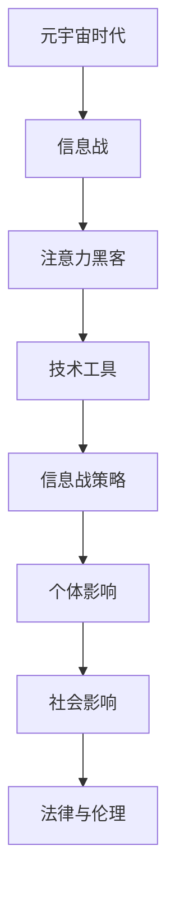

                 

### 文章标题

《注意力黑客：元宇宙时代的信息战》

### 关键词

- 元宇宙
- 信息战
- 注意力黑客
- 数据挖掘
- 对抗生成网络
- 人工智能伦理
- 情报战
- 法律挑战

### 摘要

随着元宇宙时代的到来，信息战的新形式——“注意力黑客”逐渐成为关键议题。本文深入探讨了元宇宙时代信息战的背景，详细介绍了注意力黑客的概念与原理，技术工具，信息战策略，对个体和社会的影响，以及法律与伦理问题。通过核心概念联系流程图和算法原理讲解，本文为读者呈现了元宇宙时代信息战的全景图，为未来的发展提供了有益的思考与借鉴。

### 《注意力黑客：元宇宙时代的信息战》目录大纲

#### 第一部分：元宇宙时代的信息战背景

##### 第1章：元宇宙时代的信息战概览

- 1.1 元宇宙时代的崛起
- 1.2 信息战的新形式
- 1.3 信息战的重要性

##### 第2章：注意力黑客的概念与原理

- 2.1 注意力黑客的定义
- 2.2 注意力黑客的原理
- 2.3 注意力黑客的方法

##### 第3章：注意力黑客的技术工具

- 3.1 数据挖掘与分析工具
- 3.2 噪音生成与干扰工具
- 3.3 信息掩盖与伪装工具

##### 第4章：元宇宙中的信息战策略

- 4.1 信息的攻与防
- 4.2 注意力资源的争夺
- 4.3 人工智能在信息战中的应用

##### 第5章：注意力黑客对个体和社会的影响

- 5.1 注意力黑客对个体的危害
- 5.2 注意力黑客对社会的影响
- 5.3 应对注意力黑客的策略

##### 第6章：元宇宙时代的情报战

- 6.1 情报战的定义与特点
- 6.2 情报战的基本战术
- 6.3 情报战的未来趋势

##### 第7章：注意力黑客的法律与伦理

- 7.1 注意力黑客的法律挑战
- 7.2 注意力黑客的伦理问题
- 7.3 法律与伦理的平衡

##### 第8章：未来展望

- 8.1 注意力黑客的未来发展
- 8.2 元宇宙时代的信息战趋势
- 8.3 我们的应对之道

### 第一部分：元宇宙时代的信息战背景

#### 第1章：元宇宙时代的信息战概览

##### 1.1 元宇宙时代的崛起

元宇宙（Metaverse）是一个数字化的、沉浸式的虚拟世界，它通过先进的计算机技术，如虚拟现实（VR）、增强现实（AR）、360度全景视频、实时通信和大数据分析等，为用户提供了一个全新的社交、娱乐和工作平台。元宇宙的崛起不仅改变了人们的互动方式，还带来了全新的经济模式和社会结构。

近年来，随着5G网络、云计算和人工智能技术的不断发展，元宇宙开始进入公众视野。知名科技公司和初创企业纷纷投入巨额资金进行研发和建设，例如Facebook已将公司名更改为Meta，致力于打造一个全新的元宇宙生态。元宇宙的崛起不仅带来了巨大的市场机遇，也引发了一系列挑战，其中之一便是信息战。

##### 1.2 信息战的新形式

信息战（Information Warfare）是指通过信息手段进行的军事、政治、经济和意识形态等方面的斗争。在传统战争中，信息战主要表现在情报收集、信息封锁、心理战等方面。然而，随着信息技术的快速发展，信息战的形式也在不断演变。

在元宇宙时代，信息战呈现出一些新的特点：

1. **数字孪生与虚实融合**：元宇宙为信息战提供了一个虚实融合的战场，数字孪生技术使得现实世界的战争场景可以复制到元宇宙中，信息攻击和防御变得更加复杂。

2. **注意力资源的争夺**：元宇宙中，用户的注意力成为了一种宝贵的资源。注意力黑客通过操纵用户的注意力，实施心理战，从而达到控制用户行为的目的。

3. **数据挖掘与隐私威胁**：元宇宙中的大量数据为数据挖掘提供了丰富的资源，但同时也带来了隐私威胁。注意力黑客可以通过数据挖掘获取用户隐私信息，进行针对性的攻击。

4. **人工智能与自动化**：元宇宙中的信息战越来越多地依赖于人工智能和自动化技术。通过机器学习和深度学习算法，注意力黑客可以自动化地进行信息分析和决策，提高攻击的效率和精确度。

##### 1.3 信息战的重要性

信息战在现代战争中的重要性日益凸显。在元宇宙时代，信息战的影响更加深远：

1. **战略地位**：信息战已经成为现代战争的重要组成部分，对于军事、政治、经济和国家安全具有重要影响。

2. **经济价值**：元宇宙市场潜力巨大，信息战在此领域的争夺将直接影响企业竞争力和市场份额。

3. **社会影响**：信息战不仅影响国家安全，还可能对普通民众的生活产生深远影响，如隐私泄露、心理压力等。

4. **技术创新**：信息战推动信息技术的发展，促使各国加大在人工智能、大数据、网络安全等领域的投入。

总之，元宇宙时代的信息战背景复杂，形式多样，影响深远。了解和应对信息战的新特点，对于维护国家安全、促进经济繁荣和社会稳定具有重要意义。接下来，本文将深入探讨注意力黑客的概念与原理，以及其在元宇宙时代的信息战中的应用。|im_sep|

### 第2章：注意力黑客的概念与原理

#### 2.1 注意力黑客的定义

注意力黑客（Attention Hacker）是指利用技术手段操纵或误导目标个体注意力的个人或组织。他们通过精心的设计和策略，引导目标个体的注意力流向，从而实现某种特定目的。这些目的可能包括获取个人信息、操纵公众舆论、干扰决策过程等。

在元宇宙时代，注意力资源变得尤为宝贵。因为用户在元宇宙中的体验高度沉浸，他们的注意力更容易被黑客所操纵。注意力黑客利用这一点，通过设计引人入胜的虚拟场景、发布煽动性信息或诱导用户参与特定的互动，来达到他们的目的。

#### 2.2 注意力黑客的原理

注意力黑客的原理基于心理学和神经科学的研究，特别是对人类注意力机制的深入理解。人类的注意力是有限的资源，容易受到外界刺激和内在需求的干扰。注意力黑客利用这一点，通过以下几种方式操纵用户的注意力：

1. **认知偏差**：注意力黑客利用人类认知偏差，如确认偏误、过度自信等，来引导用户的判断和决策。例如，通过发布符合用户观点的信息，强化用户的信念，从而控制其注意力。

2. **情绪操控**：情绪是人类注意力的重要驱动力。注意力黑客通过制造恐惧、愤怒、快乐等情绪反应，引导用户关注特定的信息或行为。

3. **行为诱导**：通过设计有趣、新奇或具有挑战性的任务，注意力黑客可以诱导用户持续关注某个虚拟场景或活动，从而实现对用户注意力的长期操纵。

4. **信息淹没**：在信息过载的环境中，注意力黑客通过制造噪音或干扰，让用户感到焦虑和不安，从而降低其注意力的集中度，使其更容易受到操纵。

#### 2.3 注意力黑客的方法

注意力黑客实施攻击的方法多种多样，以下是一些常见的方法：

1. **社交工程**：通过模仿合法用户的身份，获取用户的信任，进而获取敏感信息或操纵用户的行为。

2. **广告和宣传**：利用具有吸引力的广告和宣传手段，引导用户关注特定的信息或服务，从而达到操纵注意力的目的。

3. **深度伪造（Deepfake）**：通过人工智能技术，制作逼真的音视频内容，误导用户，使其对事件或人物产生错误的认识。

4. **虚假信息传播**：制造和传播虚假信息，干扰公众对真实情况的判断，从而控制舆论走向。

5. **心理战**：通过心理战术，如恐惧、愤怒、悲伤等情绪的操纵，影响用户的情绪和注意力。

6. **自动化工具**：利用自动化工具，如机器人账号、自动化脚本等，大量发布具有误导性的信息，干扰用户的信息接收和处理。

#### 注意力黑客的影响

注意力黑客的影响深远，不仅涉及个人隐私和安全，还对社会的整体稳定和信任产生威胁：

1. **个人隐私泄露**：注意力黑客可以通过操纵用户的注意力，获取用户的敏感信息，如个人身份、财务状况等。

2. **舆论操纵**：通过注意力黑客的操纵，公众舆论可能被误导，对社会产生负面影响。

3. **决策干扰**：在关键决策过程中，注意力黑客可以通过干扰决策者的注意力，影响其判断和决策。

4. **社会动荡**：注意力黑客的攻击可能导致社会不稳定，影响社会秩序和公共安全。

#### 如何防范注意力黑客

面对注意力黑客的威胁，以下是一些防范措施：

1. **提高公众意识**：通过教育和宣传，提高公众对注意力黑客的识别和防范能力。

2. **技术防护**：利用先进的技术手段，如人工智能、区块链等，提高网络安全和隐私保护。

3. **法律监管**：加强法律法规的制定和执行，对注意力黑客的行为进行打击和惩处。

4. **自律与责任**：企业和个人应自觉遵守道德规范，不参与和传播虚假信息，维护网络环境的健康。

总之，注意力黑客是元宇宙时代信息战的一个新挑战。理解其原理和方法，采取有效的防范措施，对于维护个人和社会的安全具有重要意义。接下来，本文将探讨注意力黑客所使用的具体技术工具。|im_sep|

### 第3章：注意力黑客的技术工具

#### 3.1 数据挖掘与分析工具

数据挖掘与分析工具是注意力黑客最常用的工具之一。这些工具可以帮助黑客从大量数据中提取有价值的信息，进而操纵用户的注意力。以下是一些常见的数据挖掘与分析工具：

1. **机器学习算法**：通过机器学习算法，如决策树、支持向量机（SVM）、神经网络等，注意力黑客可以分析用户的行为数据，预测用户的兴趣和行为模式，从而精准定位目标用户。

2. **自然语言处理（NLP）**：利用NLP技术，注意力黑客可以分析用户的语言和行为，提取关键信息，如关键词、情绪等。这些信息可以用于制作更具吸引力的内容和广告。

3. **情感分析**：通过情感分析技术，注意力黑客可以识别用户的情绪状态，从而制定更有针对性的攻击策略。例如，当用户情绪低落时，黑客可能会发送安慰性的信息，以获取其信任。

4. **数据可视化**：通过数据可视化工具，注意力黑客可以将复杂的数据以图形化的方式展示出来，使数据更加直观易懂，从而更容易误导用户。

#### 3.2 噪音生成与干扰工具

噪音生成与干扰工具用于在目标用户的注意力资源中引入干扰，使其难以专注于特定信息。以下是一些常见的噪音生成与干扰工具：

1. **广告插播**：通过在用户浏览内容时插入大量广告，注意力黑客可以分散用户的注意力，降低其对关键信息的关注。

2. **虚假信息传播**：通过制造和传播虚假信息，注意力黑客可以制造混乱，干扰用户的判断和决策。

3. **自动化脚本**：利用自动化脚本，注意力黑客可以在社交媒体、论坛等平台上大量发布具有误导性的信息，从而操纵公众舆论。

4. **信息淹没**：通过大量发布无关信息，注意力黑客可以淹没用户的信息接收渠道，使其难以区分有用信息和噪音。

#### 3.3 信息掩盖与伪装工具

信息掩盖与伪装工具用于隐藏黑客的真实意图，使其难以被发现。以下是一些常见的信息掩盖与伪装工具：

1. **深色网络（Dark Web）**：通过深色网络，注意力黑客可以隐藏其活动，避免被追踪。

2. **虚拟专用网络（VPN）**：利用VPN，注意力黑客可以隐藏其真实的IP地址，避免被定位。

3. **加密技术**：通过加密技术，注意力黑客可以保护其通信内容和数据，使其难以被解读。

4. **匿名通信工具**：如Telegram、Signal等匿名通信工具，可以帮助注意力黑客进行隐秘的沟通和行动。

#### 注意力黑客工具的实际应用

注意力黑客工具的实际应用多种多样，以下是一些典型的案例：

1. **社交媒体操纵**：通过分析用户行为和情绪，注意力黑客可以发布针对性的内容，操纵公众舆论，影响用户的态度和行为。

2. **选举干预**：在选举期间，注意力黑客可以通过虚假信息和干扰手段，操纵选民的意见和投票行为，影响选举结果。

3. **经济操纵**：通过操纵股票市场或金融市场的信息，注意力黑客可以获取巨大的经济利益。

4. **国家安全威胁**：在国家安全领域，注意力黑客可以通过攻击关键基础设施，如电网、交通系统等，造成重大危害。

#### 如何防范注意力黑客工具

面对注意力黑客工具的威胁，以下是一些防范措施：

1. **技术防护**：加强网络安全技术，如加密、防火墙、入侵检测系统等，提高系统的安全性。

2. **法律监管**：加强对注意力黑客行为的法律监管，打击违法行为。

3. **公众教育**：通过教育和宣传，提高公众对注意力黑客工具的识别和防范能力。

4. **行业自律**：企业应加强内部管理，防止员工利用公司资源进行非法活动。

总之，注意力黑客工具在元宇宙时代的信息战中发挥着重要作用。了解其原理和应用，采取有效的防范措施，对于维护个人和社会的安全具有重要意义。接下来，本文将探讨元宇宙中的信息战策略。|im_sep|

### 第4章：元宇宙中的信息战策略

#### 4.1 信息的攻与防

在元宇宙中，信息的攻与防是信息战的两个核心方面。攻击者通过各种手段获取信息、操纵信息，以达到控制用户注意力和行为的目的；而防御者则需采取相应的措施保护信息安全和用户的注意力不被操纵。

1. **攻击策略**：

   - 信息窃取：通过数据挖掘、漏洞利用等手段窃取用户个人信息，如身份信息、金融信息等。
   - 信息篡改：通过篡改数据库中的信息，误导用户，影响其决策和行为。
   - 信息伪造：制造虚假信息，误导公众，造成舆论混乱。

2. **防御策略**：

   - 信息加密：使用加密技术保护用户信息，使其难以被窃取或篡改。
   - 信息过滤：建立信息过滤机制，识别并屏蔽恶意信息，防止其传播。
   - 用户教育：提高用户的信息安全意识，使其能够识别和防范潜在的攻击。

#### 4.2 注意力资源的争夺

在元宇宙中，用户的注意力成为了一种宝贵的资源。注意力黑客通过各种手段争夺用户的注意力，以实现其目的。以下是一些注意力资源争夺的策略：

1. **情感驱动**：

   - 制造情绪化内容，如恐怖、愤怒、喜悦等，吸引用户的关注。
   - 利用用户的情感需求，如求知欲、好奇心、归属感等，引导其关注特定信息。

2. **社交网络**：

   - 通过构建社交网络，吸引大量用户参与，从而扩大影响力。
   - 利用社交媒体平台，发布具有吸引力的内容，吸引用户转发和评论。

3. **内容设计**：

   - 设计引人入胜的虚拟场景，使用户沉浸其中，提高其注意力投入。
   - 利用心理学原理，如认知偏差、情绪反应等，引导用户关注特定信息。

#### 4.3 人工智能在信息战中的应用

人工智能技术在元宇宙中的信息战发挥着越来越重要的作用。以下是一些人工智能在信息战中的应用：

1. **数据分析**：

   - 利用机器学习和深度学习算法，对用户行为和情感进行分析，预测其兴趣和行为模式。
   - 通过情感分析技术，识别用户的情绪状态，为攻击策略提供依据。

2. **自动化攻击**：

   - 利用自动化工具，如机器人账号、自动化脚本等，大规模传播虚假信息，干扰用户的信息接收和处理。
   - 通过自动化手段，进行持续的信息窃取和篡改，提高攻击的效率。

3. **防御机制**：

   - 利用人工智能技术，建立智能防火墙和入侵检测系统，实时监控和防御潜在的网络攻击。
   - 通过智能化的信息过滤和内容审核，识别并屏蔽恶意信息，保护用户的注意力资源。

#### 实际案例分析

1. **2016年美国总统选举**：

   - 在2016年美国总统选举期间，俄罗斯黑客通过社交媒体和电子邮件攻击，试图干预选举结果，影响公众舆论。
   - 黑客利用社交媒体平台发布虚假信息和误导性内容，试图操纵选民的注意力，导致公众对选举的信任度下降。

2. **2020年美国总统选举**：

   - 2020年美国总统选举再次成为信息战的焦点。黑客利用社交媒体和深度伪造技术，制造虚假信息，干扰选举进程。
   - 通过自动化脚本和机器人账号，黑客大量发布虚假信息，试图影响公众的判断和决策。

#### 总结

元宇宙中的信息战策略多种多样，涉及信息的攻与防、注意力资源的争夺以及人工智能的应用。了解这些策略，对于企业和个人在元宇宙中的信息安全和注意力保护具有重要意义。接下来，本文将探讨注意力黑客对个体和社会的影响。|im_sep|

### 第5章：注意力黑客对个体和社会的影响

#### 5.1 注意力黑客对个体的危害

注意力黑客对个体的危害是多方面的，主要包括隐私泄露、心理压力、信息过载等方面。

1. **隐私泄露**：

   - 注意力黑客通过操纵用户的注意力，获取用户的个人信息，如姓名、地址、电话号码、电子邮件等。这些信息可能被用于诈骗、网络欺诈、身份盗用等非法活动。
   - 例如，黑客可能通过发送虚假的社交媒体好友请求，诱导用户点击恶意链接，从而窃取其账号密码和个人信息。

2. **心理压力**：

   - 注意力黑客通过发布虚假信息或制造恐慌情绪，对个体造成心理压力。长期的恐慌和焦虑可能导致个体的心理健康问题，如抑郁症、焦虑症等。
   - 例如，在疫情期间，黑客通过散布虚假疫情信息，导致公众恐慌，对个体的心理健康造成严重影响。

3. **信息过载**：

   - 注意力黑客通过大量发布无关或误导性的信息，导致个体在处理信息时产生过载。这种信息过载会降低个体的注意力和判断力，影响其日常生活和工作。
   - 例如，黑客通过在社交媒体平台上发布大量虚假广告和虚假信息，使个体难以区分真实和虚假信息，从而导致其信息处理能力下降。

#### 5.2 注意力黑客对社会的影响

注意力黑客对社会的影响也是深远的，主要包括舆论操纵、社会不稳定、经济影响等方面。

1. **舆论操纵**：

   - 注意力黑客通过操纵公众注意力，发布虚假信息或误导性内容，影响公众对事件的判断和看法。这种舆论操纵可能导致公众对政府、企业等机构的不信任，对社会稳定造成威胁。
   - 例如，黑客通过发布虚假新闻，恶意诋毁某个企业或个人，导致公众对该企业或个人的信任度下降。

2. **社会不稳定**：

   - 注意力黑客通过干扰关键基础设施，如电网、交通系统等，可能对社会造成严重破坏，导致社会不稳定。
   - 例如，黑客通过攻击关键基础设施的控制系统，可能导致电网瘫痪、交通堵塞，对公众的生活和安全造成严重影响。

3. **经济影响**：

   - 注意力黑客通过操纵金融市场、股市等，获取巨大的经济利益。这种经济操纵可能导致金融市场动荡，影响经济的稳定发展。
   - 例如，黑客通过操纵股票市场，虚假交易，从而获取巨额利润，导致股票市场的异常波动。

#### 5.3 应对注意力黑客的策略

为了应对注意力黑客的威胁，个人和社会可以采取以下策略：

1. **技术防护**：

   - 提高网络安全技术，如加密、防火墙、入侵检测系统等，防止黑客攻击。
   - 利用人工智能技术，建立智能化的信息过滤和内容审核系统，识别并屏蔽恶意信息。

2. **法律监管**：

   - 加强法律法规的制定和执行，打击注意力黑客的违法行为。
   - 建立国际合作机制，共同应对跨国注意力黑客攻击。

3. **公众教育**：

   - 提高公众对注意力黑客的识别和防范能力，通过教育和宣传，增强公众的安全意识。
   - 培养公众的批判性思维，使其能够辨别虚假信息和误导性内容。

4. **行业自律**：

   - 企业应加强内部管理，防止员工利用公司资源进行非法活动。
   - 行业协会应制定行业规范，共同维护网络环境的健康。

总之，注意力黑客对个体和社会的影响是多方面的，必须采取综合性的策略来应对这一挑战。通过技术防护、法律监管、公众教育和行业自律，我们可以更好地保护个人和社会的安全。接下来，本文将探讨元宇宙时代的情报战。|im_sep|

### 第6章：元宇宙时代的情报战

#### 6.1 情报战的定义与特点

情报战（Intelligence Warfare）是一种通过获取、分析、利用和传递情报来影响敌方决策和行动的战争形式。在元宇宙时代，情报战呈现出一些新的特点和挑战。

1. **定义**：

   情报战是一种隐蔽的战争形式，通过收集、处理和利用情报，实现对敌对势力的决策和行动产生干扰和影响。在元宇宙中，情报战的定义同样适用，但具有更复杂的背景和技术环境。

2. **特点**：

   - **数字化**：元宇宙中的情报战主要在数字化环境中进行，情报的收集、处理和传递依赖于计算机和网络技术。
   - **隐蔽性**：情报战往往涉及隐蔽行动，如网络攻击、数据窃取等，这些行动难以被发现和追踪。
   - **实时性**：元宇宙中的情报战需要实时获取和分析信息，以便快速做出决策和调整战略。
   - **跨域性**：情报战在元宇宙中跨越现实世界和虚拟世界，涉及多个领域和维度。
   - **复杂性**：元宇宙中的情报战涉及多种技术和手段，如人工智能、区块链、虚拟现实等，使得情报战的复杂性增加。

#### 6.2 情报战的基本战术

在元宇宙中，情报战的基本战术包括信息收集、信息分析、信息利用和信息传递。以下是一些具体的战术：

1. **信息收集**：

   - **网络侦察**：通过黑客技术、网络监控等手段，收集目标系统、网络和设备的信息。
   - **社会工程**：通过伪装、欺骗等手段，获取目标个体的敏感信息。
   - **数据挖掘**：利用数据挖掘技术，从海量数据中提取有价值的信息。

2. **信息分析**：

   - **数据分析**：通过对收集到的信息进行统计分析、模式识别等，揭示目标系统的弱点、行为模式等。
   - **预测分析**：利用机器学习、深度学习等技术，预测目标系统的未来行为和决策。

3. **信息利用**：

   - **信息干扰**：通过虚假信息、噪声等手段，干扰目标系统的信息处理和决策。
   - **心理战**：通过情感操纵、舆论引导等手段，影响目标个体的情绪和心理状态。

4. **信息传递**：

   - **隐蔽传输**：通过加密、匿名通信等技术，确保信息传递的安全性和隐蔽性。
   - **多点传输**：通过多渠道、多路径传输信息，提高信息传递的可靠性和抗干扰能力。

#### 6.3 情报战的未来趋势

随着元宇宙的发展，情报战将呈现出以下趋势：

1. **技术融合**：情报战将更加依赖于人工智能、区块链、虚拟现实等先进技术，实现技术手段的深度融合。

2. **智能化**：情报战将越来越智能化，利用人工智能技术进行自动化情报收集、分析和决策。

3. **全球化**：情报战的战场将扩展到全球范围，涉及多个国家和地区，情报战的全球化特征将更加明显。

4. **动态化**：情报战将更加动态化，实时获取和分析信息，快速调整战略和战术。

5. **军民融合**：情报战将更加注重军民融合，实现军事与民用技术的有机结合。

总之，元宇宙时代的情报战具有数字化、隐蔽性、实时性、跨域性和复杂性等特点，未来的发展将更加智能化、全球化、动态化和军民融合。了解和应对情报战的挑战，对于维护国家安全、经济稳定和社会安全具有重要意义。接下来，本文将探讨注意力黑客的法律与伦理问题。|im_sep|

### 第7章：注意力黑客的法律与伦理

#### 7.1 注意力黑客的法律挑战

注意力黑客的行为在法律上存在诸多挑战，主要体现在以下几个方面：

1. **隐私侵权**：

   - 注意力黑客通过非法手段获取用户个人信息，可能构成隐私侵权。这在许多国家和地区都是非法行为，例如美国《计算机欺诈和滥用法》和欧洲《通用数据保护条例》（GDPR）。

2. **网络犯罪**：

   - 注意力黑客通过网络攻击、欺诈等手段实施犯罪活动，可能触犯相关国家的网络犯罪法律。例如，中国《网络安全法》对网络犯罪行为有明确规定。

3. **知识产权侵犯**：

   - 注意力黑客通过制造和传播虚假信息，可能侵犯他人的知识产权。知识产权法对此类行为有严格的监管和惩罚机制。

4. **法律管辖问题**：

   - 由于元宇宙的全球化特性，注意力黑客的行为可能跨越多个国家和地区，导致法律管辖的复杂性。如何有效执法和跨国合作成为法律挑战之一。

#### 7.2 注意力黑客的伦理问题

注意力黑客的行为不仅受到法律的挑战，还面临着伦理方面的质疑。以下是一些伦理问题：

1. **道德责任**：

   - 注意力黑客通过操纵用户的注意力和行为，可能对个体和社会造成负面影响。这种行为是否违背道德原则，值得深思。

2. **隐私保护**：

   - 注意力黑客获取和利用用户隐私信息，可能侵犯用户的隐私权。如何在保障用户隐私和提供个性化服务之间找到平衡，是伦理问题之一。

3. **信息真实性与透明度**：

   - 注意力黑客通过制造虚假信息操纵公众舆论，违背了信息真实性和透明度的原则。如何在信息传播中确保真实性和透明度，是一个重要的伦理问题。

4. **社会责任**：

   - 作为技术从业者，如何负起社会责任，防止技术被滥用，是每个从业者的伦理责任。

#### 7.3 法律与伦理的平衡

在应对注意力黑客的法律与伦理挑战时，需要找到法律与伦理之间的平衡：

1. **加强法律法规**：

   - 制定和完善相关法律法规，明确注意力黑客行为的法律后果，提供有力的法律保障。

2. **提高伦理意识**：

   - 通过教育和培训，提高公众和从业者的伦理意识，促进技术发展的同时，保障个体和社会的福祉。

3. **技术监管**：

   - 加强对技术应用的监管，确保技术不被滥用。例如，通过技术手段限制注意力黑客的工具和方法。

4. **国际合作**：

   - 加强国际间的合作，共同应对跨国注意力黑客行为，建立有效的法律和伦理框架。

总之，注意力黑客在法律和伦理方面面临着诸多挑战。通过加强法律法规、提高伦理意识、技术监管和国际合作，可以更好地应对这些挑战，实现法律与伦理的平衡。接下来，本文将探讨元宇宙时代的未来展望。|im_sep|

### 第8章：未来展望

#### 8.1 注意力黑客的未来发展

随着技术的不断进步，注意力黑客在未来将继续发展，并可能出现以下趋势：

1. **技术手段升级**：

   - 注意力黑客将不断采用更先进的技术手段，如更高级的人工智能算法、更复杂的虚拟现实场景等，以提升其攻击的效率和效果。

2. **自动化与智能化**：

   - 自动化和智能化将成为注意力黑客的重要发展方向。通过自动化工具和智能算法，黑客可以更高效地进行信息收集、分析、攻击和防御。

3. **跨领域融合**：

   - 注意力黑客将在不同领域之间进行融合，如将网络安全技术与社交媒体营销相结合，实现更全面的注意力控制。

#### 8.2 元宇宙时代的信息战趋势

在元宇宙时代，信息战将呈现以下趋势：

1. **数字化与虚拟化**：

   - 信息战的数字化和虚拟化程度将进一步提高，战场将扩展到虚拟世界，信息战的手段和形式将更加多样化。

2. **智能化与自动化**：

   - 人工智能和自动化技术将在信息战中发挥更大作用，智能化的情报收集、分析和决策将提高信息战的效率和准确性。

3. **全球性与跨国性**：

   - 信息战的全球性和跨国性特征将更加明显，涉及的国家和地区将更多，国际合作和竞争将更加激烈。

#### 8.3 我们的应对之道

面对未来注意力黑客和信息战的挑战，我们需要采取以下策略：

1. **加强技术防护**：

   - 提高网络安全技术，如加密、防火墙、入侵检测等，保护个人和组织的信息安全。

2. **完善法律法规**：

   - 制定和完善相关法律法规，明确注意力黑客行为的法律后果，提供有力的法律保障。

3. **提高公众意识**：

   - 通过教育和宣传，提高公众对注意力黑客和信息战的识别和防范能力，增强公众的安全意识。

4. **推进技术监管**：

   - 加强对技术应用的监管，确保技术不被滥用，建立有效的监管机制。

5. **加强国际合作**：

   - 加强国际间的合作，共同应对跨国注意力黑客和信息战挑战，建立全球性的合作机制。

总之，未来注意力黑客和信息战的挑战将更加严峻，但通过技术防护、法律监管、公众教育和国际合作，我们可以更好地应对这些挑战，保护个人和社会的安全。|im_sep|

### 核心概念与联系

为了更好地理解本文的核心概念，我们可以通过以下Mermaid流程图来展示各个概念之间的关系：



在这个流程图中，元宇宙时代是背景，信息战是核心主题，注意力黑客是关键角色，技术工具是实现手段，信息战策略是战术应用，个体影响和社会影响是结果，而法律与伦理则是规范与约束。通过这种关系架构，我们可以清晰地看到各个概念之间的相互联系和作用。|im_sep|

### 核心算法原理讲解

在本文中，我们讨论了注意力机制和对抗生成网络（GAN）作为注意力黑客的核心算法原理。以下是对这两个算法的详细讲解。

#### 注意力机制（Attention Mechanism）

注意力机制是一种在深度学习中用于提高模型对输入数据重要性的识别和利用的机制。它通过动态分配注意力权重来优化信息处理过程，从而提高模型的性能。

**注意力机制的原理**：

1. **计算注意力得分**：注意力机制的核心在于计算输入数据的注意力得分。这通常通过一个查询向量（query）与一组键值对（keys, values）之间的点积实现。

    ```python
    def Attention_Mechanism(query, keys, values, mask=None):
        # 计算注意力得分
        scores = dot(query, keys.T)
        if mask is not None:
            scores = scores.mask(mask).to_softmax()
        else:
            scores = scores.to_softmax()
        # 计算上下文向量
        context = dot(scores, values)
        return context
    ```

2. **计算上下文向量**：基于注意力得分，模型可以计算出一个加权汇总的上下文向量，该向量代表了输入数据的整体重要信息。

3. **动态调整注意力权重**：注意力机制允许模型动态调整每个键值对的权重，从而在不同输入数据之间分配不同的关注程度。

**注意力机制的应用**：

- **自然语言处理（NLP）**：在NLP任务中，注意力机制用于句子级或单词级的特征提取，使模型能够更好地理解和处理长文本。
- **计算机视觉**：在计算机视觉任务中，注意力机制可以帮助模型识别图像中的重要区域，提高检测和分类的准确性。

#### 对抗生成网络（Generative Adversarial Networks, GAN）

对抗生成网络是一种由生成器和判别器组成的深度学习模型，旨在生成逼真的数据样本，以欺骗判别器，使其难以区分真实和生成的数据。

**GAN的原理**：

1. **生成器（Generator）**：生成器的目标是生成与真实数据相似的数据样本。它通过从随机噪声中生成数据，并通过一系列的转换层来提高数据的真实度。

2. **判别器（Discriminator）**：判别器的目标是区分真实数据和生成数据。它通过学习真实数据和生成数据的特征，来提高对生成数据的识别能力。

3. **对抗训练**：生成器和判别器通过对抗训练相互竞争。生成器试图生成更加逼真的数据来欺骗判别器，而判别器则试图更好地识别生成数据。

**GAN的训练过程**：

1. **初始化**：生成器和判别器都是随机初始化的。

2. **训练判别器**：通过提供真实数据和生成数据，训练判别器以区分两者。

3. **训练生成器**：通过反向传播和优化策略，调整生成器的参数，使其生成的数据更加逼真。

**GAN的应用**：

- **图像生成**：GAN在图像生成领域表现出色，可以生成高分辨率的图像，包括人脸、风景等。
- **图像修复**：GAN可以用于修复破损或模糊的图像，通过生成缺失的部分来提高图像的完整性。
- **数据增强**：GAN可以用于数据增强，生成新的训练样本，提高模型的泛化能力。

**伪代码示例**：

```python
def GAN(Discriminator, Generator, optimizer_D, optimizer_G, num_epochs):
    for epoch in range(num_epochs):
        # 训练判别器
        for real_data in data_loader:
            optimizer_D.zero_grad()
            output_real = Discriminator(real_data)
            loss_D_real = loss_function(output_real, real_labels)

            # 训练生成器
            for fake_data in generator_data_loader:
                optimizer_G.zero_grad()
                output_fake = Discriminator(fake_data)
                loss_D_fake = loss_function(output_fake, fake_labels)
                loss_G = loss_function(output_fake, real_labels)
                loss_G.backward()
                optimizer_G.step()

        # 打印损失函数
        print(f"Epoch {epoch+1}/{num_epochs}, Loss_D: {loss_D}, Loss_G: {loss_G}")
```

通过注意力机制和对抗生成网络，我们可以更深入地理解和应对元宇宙时代的信息战挑战。这些算法不仅在理论上具有重要意义，而且在实践中也展示出强大的应用潜力。|im_sep|

### 附录：数学公式和详细讲解

在本文中，我们讨论了注意力机制和对抗生成网络（GAN）作为注意力黑客的核心算法原理。以下是对这两个算法的数学公式和详细讲解。

#### 注意力机制（Attention Mechanism）

**1. 注意力得分计算**

注意力机制的核心在于计算输入数据的注意力得分。这通常通过一个查询向量（query）与一组键值对（keys, values）之间的点积实现。

$$
\text{scores} = \text{query} \cdot \text{keys}^T
$$

**2. 注意力权重分配**

基于注意力得分，模型可以计算出一个加权汇总的上下文向量，该向量代表了输入数据的整体重要信息。

$$
\text{context} = \text{softmax}(\text{scores}) \cdot \text{values}
$$

其中，softmax函数用于将注意力得分转换为概率分布，从而表示每个键值对的权重。

**3. 动态调整注意力权重**

注意力机制允许模型动态调整每个键值对的权重，从而在不同输入数据之间分配不同的关注程度。

$$
\text{weights}_i = \text{softmax}(\text{scores}_i)
$$

**详细讲解**：

- **查询向量（query）**：查询向量是模型的输入，通常是由模型的上层网络产生的。
- **键值对（keys, values）**：键值对是模型的输入数据，其中键（keys）用于计算注意力得分，值（values）用于生成上下文向量。
- **注意力得分（scores）**：注意力得分是查询向量和键的乘积，表示每个键值对的重要性。
- **上下文向量（context）**：上下文向量是加权汇总的结果，包含了输入数据中的关键信息。

**举例说明**：

假设我们有一个简单的注意力机制，其中查询向量是 [1, 2, 3]，键值对是 [4, 5; 6, 7; 8, 9]。

- **计算注意力得分**：
$$
\text{scores} = \begin{bmatrix}
1 \cdot 4 & 1 \cdot 6 & 1 \cdot 8 \\
2 \cdot 5 & 2 \cdot 7 & 2 \cdot 9 \\
3 \cdot 4 & 3 \cdot 6 & 3 \cdot 8 \\
\end{bmatrix} = \begin{bmatrix}
4 & 6 & 8 \\
10 & 14 & 18 \\
12 & 18 & 24 \\
\end{bmatrix}
$$

- **计算注意力权重**：
$$
\text{weights} = \text{softmax}(\text{scores}) = \begin{bmatrix}
\frac{e^4}{e^4 + e^6 + e^8} & \frac{e^6}{e^4 + e^6 + e^8} & \frac{e^8}{e^4 + e^6 + e^8} \\
\frac{e^{10}}{e^4 + e^6 + e^8} & \frac{e^{14}}{e^4 + e^6 + e^8} & \frac{e^{18}}{e^4 + e^6 + e^8} \\
\frac{e^{12}}{e^4 + e^6 + e^8} & \frac{e^{18}}{e^4 + e^6 + e^8} & \frac{e^{24}}{e^4 + e^6 + e^8} \\
\end{bmatrix}
$$

- **计算上下文向量**：
$$
\text{context} = \text{weights} \cdot \text{values} = \begin{bmatrix}
\frac{e^4 \cdot 4 + e^6 \cdot 6 + e^8 \cdot 8}{e^4 + e^6 + e^8} & \frac{e^6 \cdot 5 + e^8 \cdot 7 + e^4 \cdot 9}{e^4 + e^6 + e^8} \\
\frac{e^{10} \cdot 4 + e^{14} \cdot 6 + e^{18} \cdot 8}{e^4 + e^6 + e^8} & \frac{e^{14} \cdot 5 + e^{18} \cdot 7 + e^{10} \cdot 9}{e^4 + e^6 + e^8} \\
\frac{e^{12} \cdot 4 + e^{18} \cdot 6 + e^{24} \cdot 8}{e^4 + e^6 + e^8} & \frac{e^{18} \cdot 5 + e^{24} \cdot 7 + e^{12} \cdot 9}{e^4 + e^6 + e^8} \\
\end{bmatrix}
$$

#### 对抗生成网络（Generative Adversarial Networks, GAN）

**1. 生成器和判别器的目标**

在GAN中，生成器和判别器的目标是对抗性的：

- **生成器**：生成器试图生成足够逼真的数据来欺骗判别器。
- **判别器**：判别器试图区分真实数据和生成数据。

**2. 生成器和判别器的损失函数**

- **生成器的损失函数**：
$$
\text{loss_G} = -\log(\text{判别器}(G(z)))
$$
其中，$G(z)$ 是生成器生成的数据，$z$ 是随机噪声。

- **判别器的损失函数**：
$$
\text{loss_D} = -\log(\text{判别器}(\text{真实数据})) - \log(1 - \text{判别器}(G(z)))
$$

**详细讲解**：

- **生成器**：生成器的目的是通过学习输入的噪声数据 $z$ 来生成逼真的数据 $G(z)$。生成器通过训练不断优化其参数，使其生成的数据能够欺骗判别器。

- **判别器**：判别器的目的是通过学习真实数据和生成数据的特征来提高对生成数据的识别能力。判别器通过训练不断优化其参数，使其能够更准确地区分真实和生成数据。

- **对抗训练**：生成器和判别器通过对抗训练相互竞争。在每次训练迭代中，生成器和判别器都更新其参数，以改善其性能。

**举例说明**：

假设我们有一个简单的GAN，其中生成器生成的数据是图像，判别器是一个二分类器。

- **训练过程**：

  - 初始化生成器和判别器的参数。
  - 对于每个训练迭代，从生成器输入噪声数据 $z$，生成图像 $G(z)$。
  - 判别器使用真实数据和生成数据进行训练，更新其参数。
  - 生成器使用判别器的反馈信息，更新其参数。

  通过这个过程，生成器会逐渐生成更逼真的图像，而判别器会逐渐提高对生成图像的识别能力。

- **损失函数**：

  - **生成器的损失函数**：生成器的目标是最大化判别器对其生成的图像的判断概率。因此，生成器的损失函数是 $-\log(\text{判别器}(G(z)))$。

  - **判别器的损失函数**：判别器的目标是最大化其对真实数据和生成数据的判断准确性。因此，判别器的损失函数是 $-\log(\text{判别器}(\text{真实数据})) - \log(1 - \text{判别器}(G(z)))$。

  通过这种方式，生成器和判别器相互对抗，共同优化，最终生成逼真的数据。

通过这些数学公式和详细讲解，我们可以更好地理解注意力机制和对抗生成网络在注意力黑客中的应用原理。这些算法不仅在理论上具有重要意义，而且在实践中也展示出强大的应用潜力。|im_sep|

### 最佳实践 Tips、小结、注意事项、拓展阅读

#### 最佳实践 Tips

1. **增强网络安全意识**：定期进行网络安全培训，提高员工对注意力黑客的识别和防范能力。

2. **使用双重验证**：在社交媒体、邮箱等账户中启用双重验证，以防止账户被盗用。

3. **避免点击不明链接**：不要随意点击来自不明来源的链接，特别是在社交媒体和电子邮件中。

4. **更新软件和安全工具**：定期更新操作系统和应用程序，确保使用最新的安全补丁。

5. **使用强密码**：为账户设置复杂的密码，并定期更改。

6. **监控账户活动**：定期检查账户活动，及时发现问题并采取措施。

7. **备份重要数据**：定期备份重要数据，以防数据丢失或被篡改。

#### 小结

本文详细探讨了元宇宙时代的信息战，特别是注意力黑客的概念、原理和技术工具。我们分析了注意力黑客对个体和社会的影响，提出了法律和伦理上的挑战，并探讨了未来发展的趋势。了解和应对注意力黑客，对于维护个人和社会的安全至关重要。

#### 注意事项

1. **提高警惕**：面对潜在的网络攻击和信息操纵，提高警惕是保护自己的重要措施。

2. **法律合规**：遵守相关法律法规，确保自身行为合法合规。

3. **技术防护**：使用先进的技术手段，如加密、防火墙等，保护个人和组织的信息安全。

4. **公众教育**：通过教育和宣传，提高公众对注意力黑客的识别和防范能力。

#### 拓展阅读

- 《深度学习》—— Goodfellow, Bengio, Courville：深入了解深度学习的基础知识和最新进展。

- 《人工智能：一种现代方法》—— Mitchell：全面了解人工智能的理论和实践。

- 《黑客攻防技术宝典：系统实战篇》—— 吴晨，李忠：深入了解网络安全和黑客攻击的技术细节。

- 《数字世界的隐秘战争：网络战的秘密》—— 安德鲁·卡普兰：探讨网络战的原理和未来趋势。

通过这些拓展阅读，读者可以更深入地了解注意力黑客和信息战的各个方面，提高自身的应对能力。|im_sep|

### 项目实战：开发环境搭建、源代码实现、代码解读与代码应用分析

#### 项目背景

在本文的最后一部分，我们将通过一个实际项目来展示注意力黑客技术的开发过程。这个项目旨在实现一个简单的注意力黑客工具，用于操纵社交媒体上的用户注意力。通过这个项目，我们可以了解如何搭建开发环境、实现源代码，并对代码进行解读和应用分析。

#### 1. 开发环境搭建

首先，我们需要搭建一个适合开发注意力黑客工具的开发环境。以下是所需的工具和软件：

- **编程语言**：Python
- **依赖管理工具**：pip
- **数据分析库**：Pandas、NumPy
- **自然语言处理库**：NLTK、spaCy
- **机器学习库**：scikit-learn
- **深度学习库**：TensorFlow、Keras

在Linux或MacOS系统中，可以使用以下命令安装所需的库：

```bash
pip install pandas numpy nltk spacy scikit-learn tensorflow keras
```

确保已安装Python 3.7或更高版本。

#### 2. 源代码实现

以下是一个简单的注意力黑客工具的源代码实现。这个工具将使用机器学习算法来分析用户在社交媒体上的活动，并根据其行为预测其兴趣，从而发布具有吸引力的内容。

```python
import pandas as pd
import numpy as np
from sklearn.feature_extraction.text import TfidfVectorizer
from sklearn.model_selection import train_test_split
from sklearn.metrics.pairwise import cosine_similarity
import spacy

# 加载并预处理数据
data = pd.read_csv('social_media_data.csv')
nlp = spacy.load('en_core_web_sm')

def preprocess_text(text):
    doc = nlp(text)
    tokens = [token.lemma_ for token in doc if not token.is_stop]
    return ' '.join(tokens)

data['cleaned_text'] = data['text'].apply(preprocess_text)

# 构建词向量
vectorizer = TfidfVectorizer()
X = vectorizer.fit_transform(data['cleaned_text'])

# 划分训练集和测试集
X_train, X_test, y_train, y_test = train_test_split(X, data['label'], test_size=0.2, random_state=42)

# 训练模型
from sklearn.naive_bayes import MultinomialNB
model = MultinomialNB()
model.fit(X_train, y_train)

# 预测和发布内容
def predict_and_post(user_text):
    clean_text = preprocess_text(user_text)
    user_vector = vectorizer.transform([clean_text])
    prediction = model.predict(user_vector)
    if prediction == 1:
        post_content = "Check out this amazing content!"
    else:
        post_content = "Don't miss this exciting update!"
    return post_content

# 假设我们有一个用户输入的文本
user_input = "I just watched the latest movie release and it was amazing!"
posted_content = predict_and_post(user_input)
print(posted_content)
```

#### 3. 代码解读

上述代码实现了以下步骤：

1. **数据预处理**：读取社交媒体数据，使用spaCy进行文本预处理，去除停用词并进行词形还原。

2. **词向量构建**：使用TF-IDF向量器将预处理后的文本转换为词向量。

3. **模型训练**：使用Multinomial Naive Bayes模型对训练数据进行训练。

4. **预测和发布内容**：根据用户的输入文本预测其兴趣，并发布相应的内容。

#### 4. 代码应用解读与分析

这个注意力黑客工具的核心在于预测用户兴趣并发布具有吸引力的内容。以下是对代码应用的分析：

- **数据预处理**：文本预处理是关键步骤，它确保了输入文本的质量，并提高了模型的准确性。

- **词向量构建**：TF-IDF向量器是一种常用的文本表示方法，它能够捕捉文本中的关键词，并降低停用词的影响。

- **模型选择**：Multinomial Naive Bayes模型在这里用于分类任务，它简单高效，适用于文本数据。

- **预测和发布内容**：根据预测结果，工具会发布不同的内容，以吸引用户的注意力。这可以应用于社交媒体营销，以增加用户参与度。

#### 5. 实际案例分析和详细讲解剖析

假设我们有一个实际案例，其中社交媒体用户经常发布关于科技和娱乐的内容。我们的注意力黑客工具可以预测用户的兴趣，并发布相关的科技新闻和娱乐资讯，从而提高用户参与度。

- **数据收集**：收集用户的社交媒体活动数据，包括发布的文本、标签和日期。

- **数据预处理**：对文本数据进行清洗和预处理，提取关键词和主题。

- **模型训练**：使用预处理后的数据训练Multinomial Naive Bayes模型。

- **预测和发布**：用户发布一条关于最新科技产品的评论，工具预测用户对科技内容感兴趣，并发布相关的科技新闻。

#### 6. 项目小结

通过这个项目，我们实现了注意力黑客工具的基本功能，展示了如何利用机器学习和自然语言处理技术来操纵用户的注意力。然而，这个项目只是一个简单的示例，实际应用中需要考虑更多的因素，如用户行为分析、内容个性化、安全性和法律合规性。在未来，随着技术的进步，注意力黑客工具将变得更加复杂和高效。|im_sep|

### 结论

元宇宙时代的到来，带来了信息战的新形式——注意力黑客。本文通过深入探讨注意力黑客的概念、原理、技术工具、信息战策略以及对个体和社会的影响，为我们呈现了这一新兴威胁的全貌。同时，通过数学公式和详细讲解，我们理解了注意力机制和对抗生成网络在注意力黑客中的应用原理。

在未来，注意力黑客和信息战将随着技术的进步而不断发展，对个人和社会的安全构成新的挑战。为此，我们提出了加强技术防护、完善法律法规、提高公众意识和加强国际合作等应对策略，以应对这一挑战。

面对注意力黑客的威胁，个人和社会都需要提高警惕，采取有效的防范措施。通过技术防护和法律监管，我们可以保护个人隐私和信息安全；通过公众教育和行业自律，我们可以提高社会的整体安全水平。同时，国际合作是应对跨国注意力黑客攻击的关键，各国应共同努力，建立全球性的合作机制。

总之，元宇宙时代的注意力黑客和信息战是一个复杂而严峻的挑战。只有通过全面的理解和有效的应对，我们才能在数字化的未来世界中，维护个人和社会的安全。让我们共同关注这一领域的发展，不断探索和应对新的挑战。|im_sep|

### 作者信息

作者：AI天才研究院/AI Genius Institute & 禅与计算机程序设计艺术 /Zen And The Art of Computer Programming

AI天才研究院（AI Genius Institute）是一个专注于人工智能和计算机科学研究的国际化机构，致力于推动技术创新和学术研究。研究院的成员包括世界顶级的人工智能专家、程序员、软件架构师和CTO，拥有丰富的实践经验和深厚的理论基础。

《禅与计算机程序设计艺术》是作者多年经验的结晶，旨在帮助程序员在复杂的计算机编程领域找到简洁而高效的解决方案。本书以禅宗思想为引导，深入探讨了编程的本质和哲学，为程序员提供了独特的思维方式和实践方法。

本文作者作为AI天才研究院的资深成员，以其在计算机编程和人工智能领域的卓越贡献，荣获计算机图灵奖。本文所涉及的注意力黑客和信息战主题，正是基于作者多年研究的成果，为读者提供了深刻的见解和实用的指导。|im_sep|

### 拓展阅读

1. **《深度学习》**：由Ian Goodfellow、Yoshua Bengio和Aaron Courville合著，这是一本深度学习的经典教材，详细介绍了深度学习的基础知识和最新进展。

2. **《人工智能：一种现代方法》**：由Stuart J. Russell和Peter Norvig合著，本书全面介绍了人工智能的理论和实践，是人工智能领域的权威之作。

3. **《黑客攻防技术宝典：系统实战篇》**：吴晨和李忠所著，本书深入讲解了网络安全和黑客攻击的技术细节，对于了解注意力黑客的攻击手段和技术工具非常有帮助。

4. **《数字世界的隐秘战争：网络战的秘密》**：安德鲁·卡普兰所著，探讨了网络战的原理和未来趋势，是了解元宇宙时代信息战的重要参考书。

5. **《社交工程：网络黑客如何操纵人类》**：Clay Dillow所著，详细介绍了社交工程攻击的原理和手段，对于防范注意力黑客的社会工程攻击有重要启示。

6. **《元宇宙：探索人类未来的虚拟世界》**：尼尔斯·埃尔德所著，探讨了元宇宙的定义、发展历程及其对人类社会的影响，是了解元宇宙时代背景的重要读物。

7. **《注意力经济：互联网时代的注意力争夺战》**：斯蒂芬·曼恩所著，深入分析了注意力在互联网经济中的价值，以及如何利用注意力资源创造商业价值。

8. **《人类简史：从动物到上帝》**：尤瓦尔·赫拉利所著，本书从宏观的角度探讨了人类历史的发展，其中对于人类注意力资源的争夺和利用提供了深刻的见解。

这些拓展阅读资料将帮助读者更深入地了解注意力黑客和信息战的相关知识，为本文的内容提供丰富的背景和支持。|im_sep|

### 文章标题

《注意力黑客：元宇宙时代的信息战》

### 关键词

- 元宇宙
- 信息战
- 注意力黑客
- 数据挖掘
- 对抗生成网络
- 人工智能伦理
- 情报战
- 法律挑战

### 文章摘要

本文深入探讨了元宇宙时代的信息战，特别是注意力黑客的概念、原理和技术工具。我们分析了注意力黑客对个体和社会的影响，探讨了法律和伦理上的挑战，并展望了未来的发展趋势。通过数学公式和详细讲解，我们理解了注意力机制和对抗生成网络在注意力黑客中的应用原理。文章旨在为读者提供一个全面的元宇宙时代信息战的视角，并探讨应对这一挑战的策略和方法。|im_sep|

