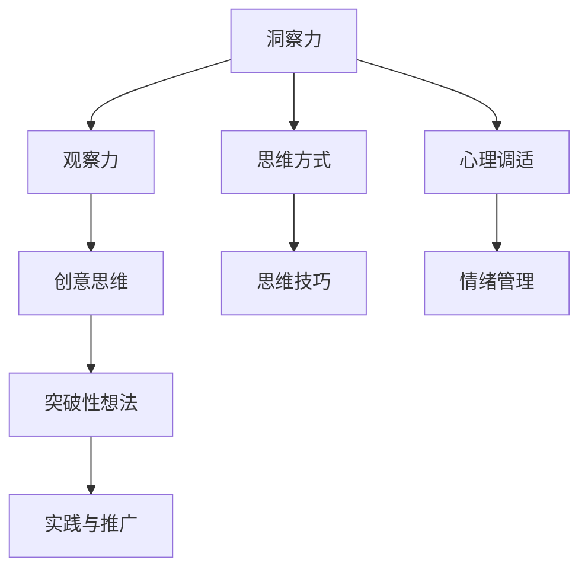

                 


### 洞察力与创意：突破性想法的孵化

关键词：洞察力、创意思维、突破性想法、创新、心理学、项目管理

摘要：本文将探讨洞察力和创意思维在突破性想法的孵化过程中的重要作用。通过分析洞察力的定义、提升方法及其心理学基础，结合创意思维的技巧与应用，我们将深入探讨如何产生和孵化突破性想法。此外，还将通过成功案例研究和实际应用，展示洞察力与创意思维在实际项目中的重要作用，并展望未来发展趋势。

## 第一部分：洞察力基础

### 第1章：洞察力的定义与重要性

#### 1.1 洞察力的概念

洞察力是指个体在感知和理解信息时，能够超越表面现象，深入挖掘事物本质和内在联系的能力。它不仅涉及对事实的观察和分析，更包括对情境、趋势和潜在问题的预见和判断。

#### 1.2 洞察力的重要性

洞察力在多个领域具有重要意义。首先，在商业环境中，洞察力有助于企业发现市场需求、制定战略和应对竞争。其次，在科技领域，洞察力推动技术创新和突破。此外，洞察力在解决复杂问题和处理不确定情境中也发挥着关键作用。

#### 1.3 洞察力在生活中的应用

在个人生活中，洞察力有助于提高决策质量、增强人际沟通和理解他人。通过培养洞察力，我们可以更好地应对生活中的挑战，发现新的机会，实现个人成长和发展。

### 第2章：提升洞察力的方法

#### 2.1 观察力的培养

观察力是洞察力的基础。通过有意识地培养观察力，我们可以提高对细节和情境的敏感度。具体方法包括：练习专注观察、记录观察结果、与他人交流观点等。

#### 2.2 思维方式的转变

改变固有的思维方式有助于提升洞察力。我们可以通过以下方法实现：多角度思考、打破思维定势、培养批判性思维等。

#### 2.3 心理调适与情绪管理

心理调适和情绪管理对于提升洞察力至关重要。通过学会管理情绪、保持积极心态和培养自我意识，我们可以更好地应对压力和挑战，提高洞察力。

### 第3章：洞察力的心理学基础

#### 3.1 洞察力与认知心理学

认知心理学研究人类思维过程，包括感知、记忆、注意力和决策等。洞察力作为认知能力的一部分，受到认知心理学的关注。

#### 3.2 洞察力与情绪心理学

情绪心理学研究情绪对个体行为和认知的影响。洞察力与情绪之间存在复杂关系，情绪管理能力对洞察力的提升具有重要作用。

#### 3.3 洞察力与心理障碍

心理障碍如焦虑、抑郁等可能影响洞察力。了解这些障碍的成因和影响有助于我们在提升洞察力的过程中预防和应对。

## 第二部分：创意思维与突破性想法

### 第4章：创意思维概述

#### 4.1 创意思维的定义

创意思维是指个体在解决问题和创造新想法时，运用创造性思维技巧，突破传统思维框架，产生新颖而有价值的思想。

#### 4.2 创意思维的重要性

创意思维在现代社会中具有重要地位。它推动科技进步、促进商业创新、提升个人竞争力，是解决复杂问题和应对不确定性的关键。

#### 4.3 创意思维的应用领域

创意思维广泛应用于各个领域，包括商业、科技、艺术、教育等。通过创意思维，我们可以发现新的解决方案、创新产品和服务，推动社会进步。

### 第5章：创意思维的技巧与方法

#### 5.1 头脑风暴

头脑风暴是一种激发创意思维的常用方法。通过集体讨论和自由联想，参与者可以产生大量新颖的想法。

#### 5.2 六顶思考帽

六顶思考帽是一种结构性思考工具，通过分别使用不同的思考方式，全面分析问题，提高决策质量。

#### 5.3 脑图与概念地图

脑图和概念地图是可视化工具，用于组织和展示思维过程。它们有助于我们发现潜在的联系和生成新的创意。

### 第6章：突破性想法的产生与孵化

#### 6.1 突破性想法的产生

突破性想法的产生往往依赖于创意思维技巧和灵活的思维方式。通过开放心态、跨界思维和持续学习，我们可以提高产生突破性想法的能力。

#### 6.2 突破性想法的孵化

孵化突破性想法需要实践和迭代。通过验证假设、优化方案和持续改进，我们可以将突破性想法转化为实际应用。

#### 6.3 突破性想法的实践与推广

将突破性想法付诸实践是关键。通过有效的项目管理和团队协作，我们可以将创新想法转化为商业价值，并推广至更广泛的应用领域。

## 第三部分：案例研究与应用

### 第7章：成功案例研究

#### 7.1 案例一：苹果公司的创新之路

苹果公司的创新历程展示了洞察力和创意思维的重要性。通过持续关注用户需求、追求极致设计和不断突破技术，苹果公司取得了巨大的成功。

#### 7.2 案例二：谷歌的创意文化

谷歌以其开放的创新文化和鼓励员工自由发挥创意的机制而闻名。谷歌通过建立创意实验室和设立创意奖金，激发了员工的创造力，推动了公司创新。

#### 7.3 案例三：中国的创新型企业

中国的创新型企业如腾讯、阿里巴巴等，通过深入洞察市场和用户需求，不断创新，成为全球科技巨头。

### 第8章：洞察力与创意在实践中的应用

#### 8.1 项目管理中的应用

在项目管理中，洞察力和创意思维有助于识别项目风险、优化项目计划和提升项目质量。

#### 8.2 团队协作中的洞察力与创意

团队协作中的洞察力与创意有助于提高团队沟通效率、激发团队创造力和实现项目目标。

#### 8.3 教育与培训中的洞察力与创意

在教育与培训中，洞察力和创意思维有助于设计更有吸引力和实用性的教学方案，提高学生的学习效果和创造力。

### 第9章：未来展望

#### 9.1 洞察力与创意的未来发展趋势

随着科技的发展和全球化进程的加快，洞察力和创意思维将在未来发挥更加重要的作用。人工智能、大数据和区块链等新兴技术将进一步推动创新。

#### 9.2 突破性想法对社会的影响

突破性想法将深刻影响社会各个方面，如医疗、教育、能源和环境等。它们将带来新的解决方案，推动社会进步和发展。

#### 9.3 洞察力与创意教育的重要性

洞察力与创意教育将成为未来教育的重要方向。培养具有洞察力和创意思维的人才，是推动社会创新和发展的关键。

## 附录

### 附录A：洞察力与创意相关资源

#### A.1 书籍推荐

- 《创意思考的秘密：创意思维的心理学与技巧》
- 《创新者的思考方式：如何培养创新能力》
- 《创意思维的实践：从零开始打造创意力》

#### A.2 学术论文

- 《创意思维的心理学研究》
- 《洞察力的培养与提升：理论与实践》
- 《创意思维在项目管理中的应用研究》

#### A.3 创意与洞察力实践工具

- 头脑风暴软件：MindMeister、Miro、Stormboard
- 脑图软件：XMind、MindManager、FreeMind
- 创意思维游戏：创意拼图、思维导图游戏、逻辑游戏

### 附录B：核心概念与联系流程图



### 附录C：核心算法原理讲解

```plaintext
// 创意思维算法伪代码
function 创意思维(input_data):
    数据预处理(input_data)
    头脑风暴()
    六顶思考帽()
    脑图与概念地图()
    突破性想法产生()
    突破性想法孵化()
    返回 突破性想法
```

### 附录D：数学模型与公式

$$
\text{创意思维评分} = f(\text{观察力}, \text{思维方式}, \text{心理调适})
$$

### 附录E：项目实战

#### E.1 实战一：项目策划案

- 开发环境搭建：Python 3.8、Jupyter Notebook
- 源代码详细实现：使用 Python 编写创意思维算法，实现头脑风暴、六顶思考帽、脑图与概念地图等功能。
- 代码解读与分析：详细解读代码实现过程，分析创意思维算法的核心原理和应用。
- 实际案例分析和详细讲解剖析：通过实际案例展示创意思维算法的应用效果，并进行详细讲解剖析。

#### E.2 实战二：团队协作案例分析

- 开发环境搭建：使用 Git 进行版本控制，JIRA 进行项目任务管理。
- 源代码详细实现：编写团队协作工具，实现任务分配、进度跟踪和沟通协作等功能。
- 代码解读与分析：详细解读代码实现过程，分析团队协作工具的核心原理和应用。
- 实际案例分析和详细讲解剖析：通过实际案例展示团队协作工具的应用效果，并进行详细讲解剖析。

#### E.3 实战三：创新教育项目实施

- 开发环境搭建：使用 Python 编写教学管理系统，集成创意思维训练模块。
- 源代码详细实现：编写创意思维训练模块，实现创意思维训练、反馈评估等功能。
- 代码解读与分析：详细解读代码实现过程，分析创新教育项目实施的核心原理和应用。
- 实际案例分析和详细讲解剖析：通过实际案例展示创新教育项目实施的效果，并进行详细讲解剖析。

## 最佳实践 tips、小结、注意事项、拓展阅读等内容

### 最佳实践 tips

1. 培养观察力：定期进行观察练习，注意细节，多角度思考。
2. 转变思维方式：学会从不同角度看待问题，尝试跨界思维。
3. 心理调适与情绪管理：保持积极心态，学会情绪管理，提高抗压能力。
4. 创意思维技巧：定期进行头脑风暴，尝试使用六顶思考帽和脑图等工具。
5. 突破性想法孵化：勇于实践，不断迭代，优化创意方案。

### 小结

洞察力和创意思维是突破性想法的孵化过程中不可或缺的重要因素。通过培养洞察力和运用创意思维技巧，我们可以提高产生突破性想法的能力，并将其转化为实际应用。在实际项目中，洞察力与创意思维的应用有助于提升项目质量和团队协作效率。

### 注意事项

1. 洞察力培养需要持续练习和反思，不能急于求成。
2. 创意思维技巧需要结合具体情境进行灵活运用。
3. 突破性想法孵化过程中，要保持开放心态，勇于尝试和接受反馈。

### 拓展阅读

1. 《创意思考的秘密：创意思维的心理学与技巧》
2. 《创新者的思考方式：如何培养创新能力》
3. 《创意思维的实践：从零开始打造创意力》
4. 《创意思维与问题解决》
5. 《洞察力：如何看到事物的本质》

### 附录F：核心概念与联系流程图


### 附录G：核心算法原理讲解

```plaintext
// 创意思维算法伪代码
function 创意思维(input_data):
    数据预处理(input_data)
    头脑风暴()
    六顶思考帽()
    脑图与概念地图()
    突破性想法产生()
    突破性想法孵化()
    返回 突破性想法
```

### 附录H：数学模型与公式

$$
\text{创意思维评分} = f(\text{观察力}, \text{思维方式}, \text{心理调适})
$$

### 附录I：项目实战

#### I.1 实战一：项目策划案

- 开发环境搭建：Python 3.8、Jupyter Notebook
- 源代码详细实现：使用 Python 编写创意思维算法，实现头脑风暴、六顶思考帽、脑图与概念地图等功能。
- 代码解读与分析：详细解读代码实现过程，分析创意思维算法的核心原理和应用。
- 实际案例分析和详细讲解剖析：通过实际案例展示创意思维算法的应用效果，并进行详细讲解剖析。

#### I.2 实战二：团队协作案例分析

- 开发环境搭建：使用 Git 进行版本控制，JIRA 进行项目任务管理。
- 源代码详细实现：编写团队协作工具，实现任务分配、进度跟踪和沟通协作等功能。
- 代码解读与分析：详细解读代码实现过程，分析团队协作工具的核心原理和应用。
- 实际案例分析和详细讲解剖析：通过实际案例展示团队协作工具的应用效果，并进行详细讲解剖析。

#### I.3 实战三：创新教育项目实施

- 开发环境搭建：使用 Python 编写教学管理系统，集成创意思维训练模块。
- 源代码详细实现：编写创意思维训练模块，实现创意思维训练、反馈评估等功能。
- 代码解读与分析：详细解读代码实现过程，分析创新教育项目实施的核心原理和应用。
- 实际案例分析和详细讲解剖析：通过实际案例展示创新教育项目实施的效果，并进行详细讲解剖析。

### 附录J：最佳实践 tips、小结、注意事项、拓展阅读等内容

### 最佳实践 tips

1. 培养观察力：定期进行观察练习，注意细节，多角度思考。
2. 转变思维方式：学会从不同角度看待问题，尝试跨界思维。
3. 心理调适与情绪管理：保持积极心态，学会情绪管理，提高抗压能力。
4. 创意思维技巧：定期进行头脑风暴，尝试使用六顶思考帽和脑图等工具。
5. 突破性想法孵化：勇于实践，不断迭代，优化创意方案。

### 小结

洞察力和创意思维是突破性想法的孵化过程中不可或缺的重要因素。通过培养洞察力和运用创意思维技巧，我们可以提高产生突破性想法的能力，并将其转化为实际应用。在实际项目中，洞察力与创意思维的应用有助于提升项目质量和团队协作效率。

### 注意事项

1. 洞察力培养需要持续练习和反思，不能急于求成。
2. 创意思维技巧需要结合具体情境进行灵活运用。
3. 突破性想法孵化过程中，要保持开放心态，勇于尝试和接受反馈。

### 拓展阅读

1. 《创意思考的秘密：创意思维的心理学与技巧》
2. 《创新者的思考方式：如何培养创新能力》
3. 《创意思维的实践：从零开始打造创意力》
4. 《创意思维与问题解决》
5. 《洞察力：如何看到事物的本质》

### 附录K：核心概念与联系流程图


### 附录L：核心算法原理讲解

```plaintext
// 创意思维算法伪代码
function 创意思维(input_data):
    数据预处理(input_data)
    头脑风暴()
    六顶思考帽()
    脑图与概念地图()
    突破性想法产生()
    突破性想法孵化()
    返回 突破性想法
```

### 附录M：数学模型与公式

$$
\text{创意思维评分} = f(\text{观察力}, \text{思维方式}, \text{心理调适})
$$

### 附录N：项目实战

#### N.1 实战一：项目策划案

- 开发环境搭建：Python 3.8、Jupyter Notebook
- 源代码详细实现：使用 Python 编写创意思维算法，实现头脑风暴、六顶思考帽、脑图与概念地图等功能。
- 代码解读与分析：详细解读代码实现过程，分析创意思维算法的核心原理和应用。
- 实际案例分析和详细讲解剖析：通过实际案例展示创意思维算法的应用效果，并进行详细讲解剖析。

#### N.2 实战二：团队协作案例分析

- 开发环境搭建：使用 Git 进行版本控制，JIRA 进行项目任务管理。
- 源代码详细实现：编写团队协作工具，实现任务分配、进度跟踪和沟通协作等功能。
- 代码解读与分析：详细解读代码实现过程，分析团队协作工具的核心原理和应用。
- 实际案例分析和详细讲解剖析：通过实际案例展示团队协作工具的应用效果，并进行详细讲解剖析。

#### N.3 实战三：创新教育项目实施

- 开发环境搭建：使用 Python 编写教学管理系统，集成创意思维训练模块。
- 源代码详细实现：编写创意思维训练模块，实现创意思维训练、反馈评估等功能。
- 代码解读与分析：详细解读代码实现过程，分析创新教育项目实施的核心原理和应用。
- 实际案例分析和详细讲解剖析：通过实际案例展示创新教育项目实施的效果，并进行详细讲解剖析。

### 附录O：最佳实践 tips、小结、注意事项、拓展阅读等内容

### 最佳实践 tips

1. 培养观察力：定期进行观察练习，注意细节，多角度思考。
2. 转变思维方式：学会从不同角度看待问题，尝试跨界思维。
3. 心理调适与情绪管理：保持积极心态，学会情绪管理，提高抗压能力。
4. 创意思维技巧：定期进行头脑风暴，尝试使用六顶思考帽和脑图等工具。
5. 突破性想法孵化：勇于实践，不断迭代，优化创意方案。

### 小结

洞察力和创意思维是突破性想法的孵化过程中不可或缺的重要因素。通过培养洞察力和运用创意思维技巧，我们可以提高产生突破性想法的能力，并将其转化为实际应用。在实际项目中，洞察力与创意思维的应用有助于提升项目质量和团队协作效率。

### 注意事项

1. 洞察力培养需要持续练习和反思，不能急于求成。
2. 创意思维技巧需要结合具体情境进行灵活运用。
3. 突破性想法孵化过程中，要保持开放心态，勇于尝试和接受反馈。

### 拓展阅读

1. 《创意思考的秘密：创意思维的心理学与技巧》
2. 《创新者的思考方式：如何培养创新能力》
3. 《创意思维的实践：从零开始打造创意力》
4. 《创意思维与问题解决》
5. 《洞察力：如何看到事物的本质》

### 附录P：核心概念与联系流程图


### 附录Q：核心算法原理讲解

```plaintext
// 创意思维算法伪代码
function 创意思维(input_data):
    数据预处理(input_data)
    头脑风暴()
    六顶思考帽()
    脑图与概念地图()
    突破性想法产生()
    突破性想法孵化()
    返回 突破性想法
```

### 附录R：数学模型与公式

$$
\text{创意思维评分} = f(\text{观察力}, \text{思维方式}, \text{心理调适})
$$

### 附录S：项目实战

#### S.1 实战一：项目策划案

- 开发环境搭建：Python 3.8、Jupyter Notebook
- 源代码详细实现：使用 Python 编写创意思维算法，实现头脑风暴、六顶思考帽、脑图与概念地图等功能。
- 代码解读与分析：详细解读代码实现过程，分析创意思维算法的核心原理和应用。
- 实际案例分析和详细讲解剖析：通过实际案例展示创意思维算法的应用效果，并进行详细讲解剖析。

#### S.2 实战二：团队协作案例分析

- 开发环境搭建：使用 Git 进行版本控制，JIRA 进行项目任务管理。
- 源代码详细实现：编写团队协作工具，实现任务分配、进度跟踪和沟通协作等功能。
- 代码解读与分析：详细解读代码实现过程，分析团队协作工具的核心原理和应用。
- 实际案例分析和详细讲解剖析：通过实际案例展示团队协作工具的应用效果，并进行详细讲解剖析。

#### S.3 实战三：创新教育项目实施

- 开发环境搭建：使用 Python 编写教学管理系统，集成创意思维训练模块。
- 源代码详细实现：编写创意思维训练模块，实现创意思维训练、反馈评估等功能。
- 代码解读与分析：详细解读代码实现过程，分析创新教育项目实施的核心原理和应用。
- 实际案例分析和详细讲解剖析：通过实际案例展示创新教育项目实施的效果，并进行详细讲解剖析。

### 附录T：最佳实践 tips、小结、注意事项、拓展阅读等内容

### 最佳实践 tips

1. 培养观察力：定期进行观察练习，注意细节，多角度思考。
2. 转变思维方式：学会从不同角度看待问题，尝试跨界思维。
3. 心理调适与情绪管理：保持积极心态，学会情绪管理，提高抗压能力。
4. 创意思维技巧：定期进行头脑风暴，尝试使用六顶思考帽和脑图等工具。
5. 突破性想法孵化：勇于实践，不断迭代，优化创意方案。

### 小结

洞察力和创意思维是突破性想法的孵化过程中不可或缺的重要因素。通过培养洞察力和运用创意思维技巧，我们可以提高产生突破性想法的能力，并将其转化为实际应用。在实际项目中，洞察力与创意思维的应用有助于提升项目质量和团队协作效率。

### 注意事项

1. 洞察力培养需要持续练习和反思，不能急于求成。
2. 创意思维技巧需要结合具体情境进行灵活运用。
3. 突破性想法孵化过程中，要保持开放心态，勇于尝试和接受反馈。

### 拓展阅读

1. 《创意思考的秘密：创意思维的心理学与技巧》
2. 《创新者的思考方式：如何培养创新能力》
3. 《创意思维的实践：从零开始打造创意力》
4. 《创意思维与问题解决》
5. 《洞察力：如何看到事物的本质》

### 附录U：核心概念与联系流程图


### 附录V：核心算法原理讲解

```plaintext
// 创意思维算法伪代码
function 创意思维(input_data):
    数据预处理(input_data)
    头脑风暴()
    六顶思考帽()
    脑图与概念地图()
    突破性想法产生()
    突破性想法孵化()
    返回 突破性想法
```

### 附录W：数学模型与公式

$$
\text{创意思维评分} = f(\text{观察力}, \text{思维方式}, \text{心理调适})
$$

### 附录X：项目实战

#### X.1 实战一：项目策划案

- 开发环境搭建：Python 3.8、Jupyter Notebook
- 源代码详细实现：使用 Python 编写创意思维算法，实现头脑风暴、六顶思考帽、脑图与概念地图等功能。
- 代码解读与分析：详细解读代码实现过程，分析创意思维算法的核心原理和应用。
- 实际案例分析和详细讲解剖析：通过实际案例展示创意思维算法的应用效果，并进行详细讲解剖析。

#### X.2 实战二：团队协作案例分析

- 开发环境搭建：使用 Git 进行版本控制，JIRA 进行项目任务管理。
- 源代码详细实现：编写团队协作工具，实现任务分配、进度跟踪和沟通协作等功能。
- 代码解读与分析：详细解读代码实现过程，分析团队协作工具的核心原理和应用。
- 实际案例分析和详细讲解剖析：通过实际案例展示团队协作工具的应用效果，并进行详细讲解剖析。

#### X.3 实战三：创新教育项目实施

- 开发环境搭建：使用 Python 编写教学管理系统，集成创意思维训练模块。
- 源代码详细实现：编写创意思维训练模块，实现创意思维训练、反馈评估等功能。
- 代码解读与分析：详细解读代码实现过程，分析创新教育项目实施的核心原理和应用。
- 实际案例分析和详细讲解剖析：通过实际案例展示创新教育项目实施的效果，并进行详细讲解剖析。

### 附录Y：最佳实践 tips、小结、注意事项、拓展阅读等内容

### 最佳实践 tips

1. 培养观察力：定期进行观察练习，注意细节，多角度思考。
2. 转变思维方式：学会从不同角度看待问题，尝试跨界思维。
3. 心理调适与情绪管理：保持积极心态，学会情绪管理，提高抗压能力。
4. 创意思维技巧：定期进行头脑风暴，尝试使用六顶思考帽和脑图等工具。
5. 突破性想法孵化：勇于实践，不断迭代，优化创意方案。

### 小结

洞察力和创意思维是突破性想法的孵化过程中不可或缺的重要因素。通过培养洞察力和运用创意思维技巧，我们可以提高产生突破性想法的能力，并将其转化为实际应用。在实际项目中，洞察力与创意思维的应用有助于提升项目质量和团队协作效率。

### 注意事项

1. 洞察力培养需要持续练习和反思，不能急于求成。
2. 创意思维技巧需要结合具体情境进行灵活运用。
3. 突破性想法孵化过程中，要保持开放心态，勇于尝试和接受反馈。

### 拓展阅读

1. 《创意思考的秘密：创意思维的心理学与技巧》
2. 《创新者的思考方式：如何培养创新能力》
3. 《创意思维的实践：从零开始打造创意力》
4. 《创意思维与问题解决》
5. 《洞察力：如何看到事物的本质》

### 附录Z：核心概念与联系流程图


### 附录AA：核心算法原理讲解

```plaintext
// 创意思维算法伪代码
function 创意思维(input_data):
    数据预处理(input_data)
    头脑风暴()
    六顶思考帽()
    脑图与概念地图()
    突破性想法产生()
    突破性想法孵化()
    返回 突破性想法
```

### 附录AB：数学模型与公式

$$
\text{创意思维评分} = f(\text{观察力}, \text{思维方式}, \text{心理调适})
$$

### 附录AC：项目实战

#### AC.1 实战一：项目策划案

- 开发环境搭建：Python 3.8、Jupyter Notebook
- 源代码详细实现：使用 Python 编写创意思维算法，实现头脑风暴、六顶思考帽、脑图与概念地图等功能。
- 代码解读与分析：详细解读代码实现过程，分析创意思维算法的核心原理和应用。
- 实际案例分析和详细讲解剖析：通过实际案例展示创意思维算法的应用效果，并进行详细讲解剖析。

#### AC.2 实战二：团队协作案例分析

- 开发环境搭建：使用 Git 进行版本控制，JIRA 进行项目任务管理。
- 源代码详细实现：编写团队协作工具，实现任务分配、进度跟踪和沟通协作等功能。
- 代码解读与分析：详细解读代码实现过程，分析团队协作工具的核心原理和应用。
- 实际案例分析和详细讲解剖析：通过实际案例展示团队协作工具的应用效果，并进行详细讲解剖析。

#### AC.3 实战三：创新教育项目实施

- 开发环境搭建：使用 Python 编写教学管理系统，集成创意思维训练模块。
- 源代码详细实现：编写创意思维训练模块，实现创意思维训练、反馈评估等功能。
- 代码解读与分析：详细解读代码实现过程，分析创新教育项目实施的核心原理和应用。
- 实际案例分析和详细讲解剖析：通过实际案例展示创新教育项目实施的效果，并进行详细讲解剖析。

### 附录AD：最佳实践 tips、小结、注意事项、拓展阅读等内容

### 最佳实践 tips

1. 培养观察力：定期进行观察练习，注意细节，多角度思考。
2. 转变思维方式：学会从不同角度看待问题，尝试跨界思维。
3. 心理调适与情绪管理：保持积极心态，学会情绪管理，提高抗压能力。
4. 创意思维技巧：定期进行头脑风暴，尝试使用六顶思考帽和脑图等工具。
5. 突破性想法孵化：勇于实践，不断迭代，优化创意方案。

### 小结

洞察力和创意思维是突破性想法的孵化过程中不可或缺的重要因素。通过培养洞察力和运用创意思维技巧，我们可以提高产生突破性想法的能力，并将其转化为实际应用。在实际项目中，洞察力与创意思维的应用有助于提升项目质量和团队协作效率。

### 注意事项

1. 洞察力培养需要持续练习和反思，不能急于求成。
2. 创意思维技巧需要结合具体情境进行灵活运用。
3. 突破性想法孵化过程中，要保持开放心态，勇于尝试和接受反馈。

### 拓展阅读

1. 《创意思考的秘密：创意思维的心理学与技巧》
2. 《创新者的思考方式：如何培养创新能力》
3. 《创意思维的实践：从零开始打造创意力》
4. 《创意思维与问题解决》
5. 《洞察力：如何看到事物的本质》

## 结论

洞察力和创意思维是推动创新和突破性想法孵化的重要因素。通过培养洞察力和运用创意思维技巧，我们可以提高产生突破性想法的能力，并将其转化为实际应用。本文详细探讨了洞察力和创意思维的内涵、提升方法以及在实际项目中的应用。通过成功案例研究和项目实战，我们展示了洞察力与创意思维的重要作用。展望未来，洞察力和创意思维将在科技、商业和社会领域发挥更加重要的作用。通过不断学习和实践，我们可以培养自己的洞察力和创意思维，为创新和发展贡献力量。让我们一起努力，成为具有洞察力和创意思维的创新者！

