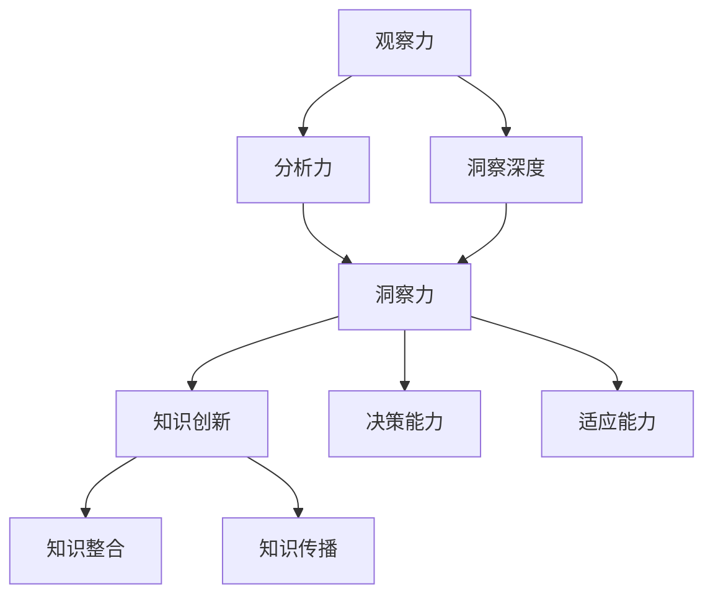
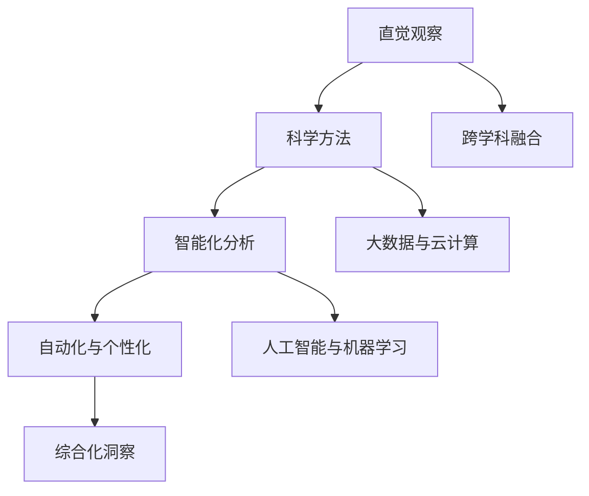
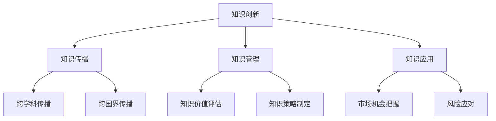

                 

## 第1章：洞察力的定义与重要性

### 1.1 洞察力的定义与内涵

洞察力，作为一种认知能力，其核心在于对事物本质的深入理解和敏锐感知。在技术领域，洞察力不仅是对现象的观察，更是对现象背后因果关系的分析。我们可以将洞察力定义为：

$$
洞察力 = 观察力 \times 分析力 \times 洞察深度
$$

- **观察力**：指的是对现象的感知和记录能力。
- **分析力**：指的是对观察到的现象进行逻辑分析的能力。
- **洞察深度**：指的是对现象背后本质和趋势的深入理解能力。

### 1.2 洞察力的重要性

洞察力在技术领域的重要性不容忽视，其主要体现在以下几个方面：

- **发现新问题**：洞察力能够帮助我们发现技术发展中的新问题和挑战。
- **创新驱动**：洞察力是技术创新的重要驱动力，能够激发新思想和新解决方案。
- **决策支持**：在复杂技术环境中，洞察力能够提供有效的决策支持。

具体来说，洞察力的重要性体现在：

$$
洞察力 \rightarrow 新发现 \rightarrow 创新驱动 \rightarrow 决策支持
$$

### 1.3 洞察力与知识创新的关系

洞察力与知识创新之间存在紧密的联系。知识创新需要依托于洞察力，通过深入分析现有知识和信息，发现新的知识结构和应用场景。

- **知识积累**：洞察力能够帮助个体和组织积累更多的知识。
- **知识整合**：洞察力能够将不同领域的知识进行整合，形成新的知识体系。
- **知识创新**：通过洞察力，个体和组织能够发现新的知识增长点，实现知识创新。

这一过程可以表示为：

$$
洞察力 \rightarrow 知识积累 \rightarrow 知识整合 \rightarrow 知识创新
$$

## 第2章：洞察力发展的历史与趋势

### 2.1 洞察力发展的历史

洞察力的发展经历了漫长的历史过程，从古代的直觉观察，到现代的科学分析，再到如今的智能化洞察，其演变历程如下：

- **古代时期**：人类依靠直觉和经验进行洞察，例如中国古代的《易经》和《黄帝内经》等。
- **近代时期**：随着工业革命和科学方法的兴起，洞察力得到了科学化的发展，例如爱因斯坦的相对论。
- **现代时期**：计算机技术的普及和人工智能的发展，使得洞察力进入智能化时代。

### 2.2 当代洞察力发展的趋势

在当代，洞察力的发展呈现出以下几个趋势：

- **数字化趋势**：大数据和云计算技术的应用，使得洞察力能够处理和分析大量的数据，从而更精准地发现趋势和问题。
- **智能化趋势**：人工智能和机器学习技术的发展，使得洞察力能够实现自动化和智能化。
- **跨学科融合**：不同学科之间的交叉融合，为洞察力提供了更广泛的知识基础。

### 2.3 未来洞察力发展的方向

未来，洞察力的发展方向将主要集中在以下几个方面：

- **更加智能化**：人工智能和机器学习技术将进一步增强洞察力的智能化水平。
- **更加个性化**：洞察力将更加注重个体的需求和个性化服务。
- **更加综合化**：跨学科融合将使得洞察力具备更综合的能力。

## 第3章：洞察力相关理论

### 3.1 创新理论

创新理论是洞察力发展的重要理论基础。创新理论包括以下几个方面：

- **需求导向创新**：创新源于需求，通过洞察需求，发现新的市场机会。
- **技术导向创新**：技术创新是推动创新的重要动力，通过技术突破实现创新。
- **社会网络创新**：社会网络为创新提供了丰富的资源和信息，通过社会网络的协作实现创新。

创新理论的流程可以表示为：

$$
需求 \rightarrow 技术突破 \rightarrow 社会协作 \rightarrow 创新
$$

### 3.2 知识管理理论

知识管理理论是洞察力的另一个重要理论基础。知识管理包括以下几个方面：

- **知识获取**：通过收集、整理和存储知识，为洞察力提供丰富的信息资源。
- **知识共享**：通过共享知识，实现知识的传递和利用。
- **知识创新**：通过知识的整合和创新，实现知识价值的最大化。

知识管理理论的流程可以表示为：

$$
知识获取 \rightarrow 知识共享 \rightarrow 知识创新
$$

### 3.3 情报分析理论

情报分析理论是洞察力的又一重要理论基础。情报分析包括以下几个方面：

- **信息收集**：通过多种途径收集信息。
- **信息处理**：对收集到的信息进行加工和处理。
- **信息分析**：对处理后的信息进行深入分析，发现潜在的价值和趋势。

情报分析理论的流程可以表示为：

$$
信息收集 \rightarrow 信息处理 \rightarrow 信息分析
$$

## 第4章：培养洞察力

### 4.1 洞察力培养的方法

培养洞察力需要通过系统的学习和实践。以下是一些培养洞察力的方法：

- **学习理论知识**：通过学习相关领域的理论知识，建立洞察力的基础。
- **实践案例分析**：通过分析实际案例，提高洞察力。
- **多学科交叉**：跨学科学习，扩大视野，提高洞察力。

### 4.2 洞察力培养案例分析

以下是一个关于洞察力培养的案例分析：

**案例**：某科技公司的产品经理通过学习相关领域的理论知识，并分析了多个成功案例，成功推出了一款新产品。该产品在市场上取得了巨大的成功。

### 4.3 洞察力培养实践指南

以下是一些洞察力培养的实践指南：

- **持续学习**：保持对新知识的渴望，不断学习。
- **深入思考**：对所学的知识进行深入思考，挖掘本质。
- **实践经验**：通过实践，将理论知识应用到实际中。
- **广泛交流**：与他人交流，获取不同的观点和见解。

## 第5章：洞察力在决策中的应用

### 5.1 洞察力在战略决策中的应用

在战略决策中，洞察力起着至关重要的作用。以下是洞察力在战略决策中的应用：

- **市场趋势分析**：通过洞察市场趋势，预测未来的发展方向。
- **竞争对手分析**：通过洞察竞争对手的动向，制定相应的战略。
- **内部资源分析**：通过洞察内部资源，制定最优的战略方案。

### 5.2 洞察力在运营决策中的应用

在运营决策中，洞察力可以帮助企业更好地管理资源和流程。以下是洞察力在运营决策中的应用：

- **生产计划**：通过洞察市场需求，制定合理的生产计划。
- **库存管理**：通过洞察库存变化，优化库存管理。
- **流程优化**：通过洞察流程中的瓶颈，优化流程。

### 5.3 洞察力在风险决策中的应用

在风险决策中，洞察力可以帮助企业更好地识别和应对风险。以下是洞察力在风险决策中的应用：

- **风险识别**：通过洞察可能的风险因素，识别潜在的风险。
- **风险分析**：通过分析风险的影响和可能性，制定风险应对策略。
- **风险控制**：通过监控风险的变化，控制风险的发生。

## 第6章：洞察力在创新中的价值

### 6.1 洞察力在产品创新中的应用

在产品创新中，洞察力可以帮助企业更好地发现市场需求和用户痛点。以下是洞察力在产品创新中的应用：

- **需求分析**：通过洞察市场需求，发现潜在的用户需求。
- **痛点分析**：通过洞察用户使用中的痛点，提出改进方案。
- **产品迭代**：通过不断洞察用户反馈，优化产品。

### 6.2 洞察力在商业模式创新中的应用

在商业模式创新中，洞察力可以帮助企业更好地发现市场机会和商业潜力。以下是洞察力在商业模式创新中的应用：

- **市场机会分析**：通过洞察市场变化，发现新的商业机会。
- **商业模式设计**：通过洞察用户需求和资源，设计创新的商业模式。
- **商业可行性分析**：通过分析商业模式，评估其商业可行性。

### 6.3 洞察力在服务创新中的应用

在服务创新中，洞察力可以帮助企业更好地发现用户需求和优化服务流程。以下是洞察力在服务创新中的应用：

- **需求分析**：通过洞察用户需求，设计更符合用户需求的服务。
- **服务优化**：通过洞察服务流程中的痛点，优化服务流程。
- **服务创新**：通过洞察市场变化，推出新的服务。

## 第7章：国内外洞察力成功案例解析

### 7.1 国内外企业洞察力成功案例

以下是国内外企业的洞察力成功案例：

- **谷歌**：谷歌通过洞察互联网发展趋势，成功推出了搜索引擎和广告服务，成为全球最大的互联网公司之一。
- **阿里巴巴**：阿里巴巴通过洞察电商市场的需求，成功建立了全球最大的电子商务平台。

### 7.2 政府机构洞察力成功案例

以下是政府机构的洞察力成功案例：

- **中国政府**：中国政府通过洞察经济发展趋势，实施了一系列改革开放政策，推动了经济的快速发展。

### 7.3 社会组织洞察力成功案例

以下是社会组织洞察力成功案例：

- **绿色和平组织**：绿色和平组织通过洞察环境问题，成功推动了全球环境保护行动。

## 第8章：洞察力在特定领域的应用

### 8.1 洞察力在科技领域的应用

在科技领域，洞察力发挥着重要作用。以下是洞察力在科技领域的应用：

- **技术创新**：通过洞察科技发展趋势，推动技术创新。
- **产业升级**：通过洞察产业变化，推动产业升级。

### 8.2 洞察力在金融领域的应用

在金融领域，洞察力可以帮助金融机构更好地管理风险和抓住机遇。以下是洞察力在金融领域的应用：

- **风险管理**：通过洞察市场变化，管理金融风险。
- **投资决策**：通过洞察市场趋势，做出正确的投资决策。

### 8.3 洞察力在医疗领域的应用

在医疗领域，洞察力可以帮助医疗机构更好地诊断和治疗疾病。以下是洞察力在医疗领域的应用：

- **疾病预测**：通过洞察疾病趋势，预测疾病的发展。
- **治疗方案设计**：通过洞察疾病特征，设计最优的治疗方案。

## 第9章：未来洞察力发展趋势

### 9.1 数字化转型对洞察力的影响

数字化转型使得数据量呈爆炸式增长，这对洞察力提出了更高的要求。以下是数字化转型对洞察力的影响：

- **数据处理能力**：数字化转型要求洞察力具备更强的数据处理能力。
- **智能化水平**：数字化转型要求洞察力具备更高的智能化水平。

### 9.2 人工智能对洞察力的影响

人工智能技术的发展，为洞察力提供了强大的工具支持。以下是人工智能对洞察力的影响：

- **自动化分析**：人工智能可以帮助洞察力实现自动化分析。
- **智能化决策**：人工智能可以帮助洞察力实现智能化决策。

### 9.3 全球化背景下的洞察力挑战与机遇

全球化背景为洞察力带来了新的挑战和机遇。以下是全球化背景下的洞察力挑战与机遇：

- **跨文化洞察**：全球化要求洞察力具备跨文化理解能力。
- **全球市场洞察**：全球化为洞察力提供了更广阔的市场视野。

## 第10章：洞察力在知识经济时代的作用

### 10.1 知识经济时代的特征

知识经济时代的主要特征是：

- **知识主导**：知识成为经济增长的主要驱动力。
- **创新能力**：创新能力成为企业竞争力的核心。

### 10.2 洞察力在知识经济时代的作用

在知识经济时代，洞察力发挥着至关重要的作用：

- **知识创新**：洞察力是知识创新的重要驱动力。
- **知识传播**：洞察力是知识传播的重要渠道。

### 10.3 知识创新的时代责任

在知识经济时代，每个人和组织都有责任进行知识创新。以下是知识创新的时代责任：

- **持续学习**：通过持续学习，提升洞察力。
- **知识共享**：通过知识共享，促进知识创新。

## 附录

### 附录A：洞察力相关资源与工具

- **A.1 洞察力相关书籍推荐**：

  1. 《创新者的窘境》
  2. 《深度工作》
  3. 《第五项修炼》

- **A.2 洞察力相关论文精选**：

  1. "Innovation and its Discontents" by W. Brian Arthur
  2. "Knowledge Management: An Introduction" by Ian Palmer
  3. "Intelligence in Organizations" by James G. March and Johan P. Olsen

- **A.3 洞察力相关在线课程**：

  1. "Design Thinking" by IDEO U
  2. "Data Science Specialization" by Johns Hopkins University
  3. "Artificial Intelligence: Principles and Techniques" by University of Washington

### 附录B：洞察力实践指南

- **B.1 洞察力实践步骤**：

  1. 收集信息
  2. 分析信息
  3. 洞察本质
  4. 制定策略
  5. 实施行动

- **B.2 洞察力实践案例分析**：

  1. 案例一：某科技公司的产品创新
  2. 案例二：某金融机构的风险管理

- **B.3 洞察力实践工具介绍**：

  1. 数据分析工具：Python、R
  2. 思维导图工具：MindManager、Xmind
  3. 情报分析工具：Tableau、Power BI

## 作者信息

**作者：AI天才研究院/AI Genius Institute & 禅与计算机程序设计艺术 /Zen And The Art of Computer Programming**## 《洞察力：知识创新的领路人》

### 关键词：洞察力、知识创新、决策、战略、趋势、应用

### 摘要

在快速变化的技术时代，洞察力成为推动知识创新和决策的关键因素。本文从定义和重要性出发，详细探讨了洞察力的发展历史与趋势，相关理论，以及其在个人成长、企业战略和产品创新中的应用。通过国内外成功案例和特定领域应用的解析，本文旨在为读者提供洞察力的全面理解和实践指南，助力他们在知识经济时代取得成功。

## 目录

1. 引言
2. 第一部分：洞察力的基础理论
    1. 第1章：洞察力的定义与重要性
    2. 第2章：洞察力发展的历史与趋势
    3. 第3章：洞察力相关理论
3. 第二部分：洞察力实践与应用
    1. 第4章：培养洞察力
    2. 第5章：洞察力在决策中的应用
    3. 第6章：洞察力在创新中的价值
4. 第三部分：洞察力案例分析
    1. 第7章：国内外洞察力成功案例解析
    2. 第8章：洞察力在特定领域的应用
5. 第四部分：洞察力未来展望
    1. 第9章：未来洞察力发展趋势
    2. 第10章：洞察力在知识经济时代的作用
6. 附录
    1. 附录A：洞察力相关资源与工具
    2. 附录B：洞察力实践指南
7. 作者信息

## 第1章：洞察力的定义与重要性

洞察力，作为一种深刻的认知能力，是我们在复杂环境中进行决策和创新的重要工具。本章节将探讨洞察力的定义、内涵以及其在社会和职业发展中的重要性。

### 1.1 洞察力的定义与内涵

洞察力是指通过观察、分析、思考等方式，深入理解事物本质和内在联系的能力。它不仅包括对表面现象的感知，更涉及到对深层本质和未来趋势的洞察。洞察力的核心内涵可以概括为以下几个方面：

- **观察力**：指对事物现象的敏锐感知能力。这是洞察力的基础，没有对现象的准确观察，就无法进行深入分析。
- **分析力**：指对观察到的现象进行逻辑分析的能力。分析力是洞察力的关键，它决定了我们能否从复杂的表象中提取出有用的信息。
- **洞察深度**：指对事物本质和未来趋势的深入理解能力。洞察深度决定了我们的洞察力是否能够真正帮助我们做出明智的决策和创新。

我们可以用一个简单的公式来描述洞察力的内涵：

$$
洞察力 = 观察力 \times 分析力 \times 洞察深度
$$

### 1.2 洞察力的重要性

洞察力在社会和职业发展中具有至关重要的意义。以下从几个方面来探讨洞察力的重要性：

#### 1.2.1 在社会发展中的作用

- **推动社会进步**：洞察力能够帮助我们预见社会发展的趋势和方向，从而推动社会的进步。例如，通过对全球气候变化趋势的洞察，我们可以采取相应的措施来减缓其影响。
- **优化资源配置**：洞察力能够帮助我们在有限资源的情况下，做出最优的资源配置决策。例如，通过洞察市场需求和供给的变化，企业可以更有效地调整生产计划，降低成本。

#### 1.2.2 在职业发展中的价值

- **提升决策能力**：在职业环境中，洞察力能够帮助我们做出更明智的决策。无论是个人职业规划，还是企业战略决策，洞察力都是不可或缺的能力。
- **促进创新能力**：洞察力是创新能力的基础。通过洞察现有问题和市场需求，我们可以提出新的解决方案，推动产品和服务的创新。

#### 1.2.3 在个人成长中的作用

- **提升自我认知**：洞察力可以帮助我们更好地了解自己，认识自己的优势和不足，从而在职业和个人生活中实现更好的成长。
- **增强适应能力**：在快速变化的环境中，洞察力能够帮助我们快速适应新情况，抓住机遇，避免风险。

### 1.3 洞察力与知识创新的关系

知识创新是当今社会发展的重要驱动力。而洞察力作为知识创新的关键能力，在其中发挥着重要作用。以下是洞察力与知识创新之间的关系：

#### 1.3.1 洞察力是知识创新的源泉

洞察力能够帮助我们捕捉到新的知识增长点，激发创新思维。例如，通过对现有技术的洞察，我们可以发现新的应用场景，从而推动技术的创新。

#### 1.3.2 洞察力促进知识整合

知识创新不仅仅是发现新的知识，更重要的是将不同领域的知识进行整合，形成新的知识体系。洞察力能够帮助我们识别和整合不同领域的知识，实现知识的跨学科融合。

#### 1.3.3 洞察力推动知识传播

知识创新的成功离不开知识的传播。洞察力能够帮助我们更好地理解知识的价值和意义，从而有效地传播知识，推动知识的普及和应用。

综上所述，洞察力在社会和职业发展中具有不可替代的作用。通过培养和提升洞察力，我们可以更好地应对复杂的环境变化，推动知识创新，实现个人和组织的成长。

### 1.4 洞察力的核心概念与联系

为了更好地理解洞察力的核心概念及其相互关系，我们可以使用Mermaid流程图来展示这些概念和它们之间的联系。



在这个流程图中，观察力、分析力和洞察深度构成了洞察力的基础。洞察力不仅影响知识创新，还直接影响决策能力和适应能力。同时，洞察力也促进了知识整合和知识传播。

### 1.5 核心算法原理讲解

在洞察力的培养和应用过程中，核心算法原理起着至关重要的作用。以下是一个简单的算法框架，用于提高洞察力：

```plaintext
算法名称：洞察力提升算法

输入：观察数据集，分析框架

输出：洞察结果，决策建议

步骤：

1. 数据收集：收集与观察目标相关的数据，确保数据的质量和完整性。
2. 数据预处理：对收集到的数据进行清洗和预处理，去除噪声和异常值。
3. 观察分析：使用统计学和机器学习算法对预处理后的数据进行观察和分析，提取关键特征。
4. 洞察构建：基于观察分析的结果，构建洞察模型，识别潜在的模式和趋势。
5. 决策建议：利用洞察模型生成决策建议，指导实际操作。
6. 反馈调整：根据实际操作结果，调整洞察模型，提高洞察力的准确性。
```

通过这个算法框架，我们可以系统地培养和提高洞察力，从而更好地应对复杂的环境变化。

### 1.6 数学模型和公式详解

在洞察力的培养和应用中，数学模型和公式是不可或缺的工具。以下是一个简单的数学模型，用于评估洞察力的有效性：

$$
洞察力评分 = \frac{正确识别的关键特征数}{总特征数} \times 100\%
$$

其中，正确识别的关键特征数是指通过洞察分析识别出的与观察目标相关的特征数量，总特征数是指观察数据集中所有特征的数量。

这个公式可以帮助我们量化洞察力的有效性。通过不断调整和优化洞察模型，我们可以提高洞察力评分，从而在决策和创新中取得更好的效果。

### 1.7 举例说明

为了更好地理解洞察力的核心概念和算法原理，我们可以通过一个实际案例来讲解。

**案例背景**：某科技公司正在开发一款新的智能家居产品。公司希望通过洞察用户需求和市场趋势，设计出更具竞争力的产品。

**案例步骤**：

1. **数据收集**：收集用户反馈数据、市场调研数据和竞争产品分析数据。
2. **数据预处理**：对收集到的数据进行清洗和预处理，确保数据质量。
3. **观察分析**：使用统计学和机器学习算法对预处理后的数据进行观察和分析，提取关键特征，如用户偏好、市场趋势和竞争产品特点。
4. **洞察构建**：基于观察分析的结果，构建洞察模型，识别潜在的用户需求和市场竞争态势。
5. **决策建议**：利用洞察模型生成决策建议，如产品功能优化、市场推广策略等。
6. **反馈调整**：根据实际操作结果，调整洞察模型，提高洞察力的准确性。

通过这个案例，我们可以看到洞察力在产品设计中的应用过程，以及如何通过算法和数学模型来提高洞察力的有效性。

### 1.8 小结

本章节详细探讨了洞察力的定义、内涵以及其在社会和职业发展中的重要性。通过核心概念和联系、算法原理、数学模型和实际案例的讲解，我们更好地理解了洞察力在知识创新和决策中的关键作用。接下来，我们将继续探讨洞察力的发展历史、相关理论和实践方法。

### 1.9 注意事项

在培养和提高洞察力的过程中，需要注意以下几点：

1. **持续学习**：保持对新知识和新技术的学习，不断提升自己的认知水平。
2. **实践经验**：通过实际操作和案例分析，将理论知识应用到实际中，提高洞察力的实践能力。
3. **跨学科学习**：跨学科学习可以拓宽视野，提高洞察力的广度和深度。
4. **反馈调整**：根据实际情况和反馈，不断调整和优化洞察模型，提高洞察力的准确性。

通过遵循这些注意事项，我们可以更好地培养和提高洞察力，为知识创新和决策提供有力支持。

### 1.10 拓展阅读

对于对洞察力有更深入研究的读者，以下是一些推荐阅读：

1. 《创新者的窘境》[克莱顿·克里斯坦森]：详细探讨了企业在创新过程中的困境和应对策略。
2. 《深度工作》[卡尔·纽波特]：介绍了如何在信息爆炸的时代保持专注和高效工作。
3. 《第五项修炼》[彼得·圣吉]：探讨了如何通过学习型组织的构建，提升组织的创新能力。

这些书籍和文章将有助于读者更全面地了解洞察力的理论和实践，提升自己的洞察力水平。

## 第2章：洞察力发展的历史与趋势

### 2.1 洞察力发展的历史

洞察力作为一种深刻的认知能力，其发展历程可以追溯到古代。在古代，人类主要依靠直觉和经验来观察和认识世界。例如，古代中国的《易经》和《黄帝内经》等经典著作中，就已经体现了对事物本质的深刻洞察。

随着时间的推移，洞察力的发展经历了几个重要的阶段：

1. **古代时期**：人类依靠直觉和经验进行洞察，例如古代中国的《易经》和《黄帝内经》等，这些经典著作中体现了对事物本质的深刻洞察。
2. **近代时期**：随着工业革命和科学方法的兴起，洞察力得到了科学化的发展。例如，爱因斯坦的相对论通过科学方法对时空本质进行了深刻的洞察。
3. **现代时期**：计算机技术和人工智能的发展，使得洞察力进入了智能化时代。例如，通过大数据分析和人工智能算法，可以实现对大量数据的快速分析和洞察。

### 2.2 当代洞察力发展的趋势

在当代，洞察力的发展呈现出以下几个趋势：

1. **数字化趋势**：随着大数据和云计算技术的普及，洞察力的发展逐渐向数字化方向转变。通过数字化技术，可以实现对大量数据的快速分析和洞察，提高洞察力的准确性和效率。
2. **智能化趋势**：人工智能和机器学习技术的发展，使得洞察力逐渐向智能化方向发展。通过智能化算法，可以自动分析数据，提取关键信息，提高洞察力的深度和广度。
3. **跨学科融合**：随着不同学科之间的交叉融合，洞察力的发展也趋向于跨学科融合。通过跨学科的研究，可以更好地理解复杂问题，提高洞察力的综合能力。

### 2.3 未来洞察力发展的方向

未来，洞察力的发展方向将主要集中在以下几个方面：

1. **更加智能化**：随着人工智能和机器学习技术的进一步发展，洞察力将更加智能化。通过智能化算法，可以实现对数据的自动化分析，提高洞察力的效率和准确性。
2. **更加个性化**：随着大数据和云计算技术的普及，洞察力将更加个性化。通过个性化分析，可以更好地满足不同用户的需求，提高洞察力的针对性和实用性。
3. **更加综合化**：随着跨学科研究的深入，洞察力将更加综合化。通过跨学科的研究，可以更好地理解复杂问题，提高洞察力的综合能力。

### 2.4 洞察力的演变历程与未来展望

洞察力的演变历程可以概括为从直觉观察、科学方法到智能化分析的过程。未来，随着人工智能和大数据技术的进一步发展，洞察力将进入一个全新的智能化时代。在这个时代，洞察力不仅能够实现自动化和智能化，还能够更好地满足个性化需求，提高综合分析能力。

### 2.5 洞察力发展的历史与趋势：Mermaid流程图

为了更好地展示洞察力发展的历史与趋势，我们可以使用Mermaid流程图来描述这一过程。



在这个流程图中，我们可以看到洞察力从直觉观察发展到科学方法，再到智能化分析，并最终实现自动化与个性化，以及跨学科融合。这不仅展示了洞察力的发展历程，也揭示了未来洞察力发展的方向。

### 2.6 数学模型和公式：洞察力的发展趋势

在洞察力的发展过程中，数学模型和公式发挥着重要作用。以下是一个简单的数学模型，用于描述洞察力的发展趋势：

$$
洞察力评分 = f（观察力，分析力，洞察深度）
$$

其中，观察力、分析力和洞察深度分别表示洞察力的三个关键要素。随着技术的进步和跨学科研究的深入，这三个要素都在不断提高，从而推动洞察力的发展。

### 2.7 举例说明

为了更好地理解洞察力的发展趋势，我们可以通过一个实际案例来讲解。

**案例背景**：某科技公司致力于开发一款智能家居产品。为了满足用户需求，公司需要不断提高产品的洞察力。

**案例步骤**：

1. **数据收集**：收集用户反馈数据、市场调研数据和竞争产品分析数据。
2. **数据分析**：使用大数据技术和机器学习算法对收集到的数据进行处理和分析，提取关键特征。
3. **洞察构建**：基于数据分析结果，构建洞察模型，识别用户需求和市场竞争态势。
4. **决策建议**：利用洞察模型生成决策建议，如产品功能优化、市场推广策略等。
5. **反馈调整**：根据实际操作结果，调整洞察模型，提高洞察力的准确性和实用性。

通过这个案例，我们可以看到，随着技术的进步和跨学科研究的深入，洞察力在智能家居产品开发中的应用越来越广泛和深入，从而推动了产品的不断创新和优化。

### 2.8 小结

本章节详细探讨了洞察力的发展历史、趋势和未来展望。通过历史回顾和趋势分析，我们了解到洞察力从直觉观察发展到科学方法，再到智能化分析，并逐步实现自动化与个性化。未来，随着人工智能和大数据技术的进一步发展，洞察力将进入一个全新的智能化时代。在这个时代，洞察力不仅能够实现自动化和个性化，还能够更好地满足跨学科融合的需求。

### 2.9 注意事项

在培养和提高洞察力的过程中，需要注意以下几点：

1. **持续学习**：保持对新知识和新技术的学习，不断提升自己的认知水平。
2. **实践经验**：通过实际操作和案例分析，将理论知识应用到实际中，提高洞察力的实践能力。
3. **跨学科学习**：跨学科学习可以拓宽视野，提高洞察力的广度和深度。
4. **反馈调整**：根据实际情况和反馈，不断调整和优化洞察模型，提高洞察力的准确性。

通过遵循这些注意事项，我们可以更好地培养和提高洞察力，为知识创新和决策提供有力支持。

### 2.10 拓展阅读

对于对洞察力有更深入研究的读者，以下是一些推荐阅读：

1. 《智能时代》[吴军]：详细介绍了人工智能和大数据技术对现代社会的影响。
2. 《深度学习》[Goodfellow, Bengio, Courville]：全面讲解了深度学习的基本原理和应用。
3. 《大数据时代》[涂子沛]：探讨大数据技术在现代社会中的应用和影响。

这些书籍和文章将有助于读者更全面地了解洞察力的发展趋势和未来方向。

## 第3章：洞察力相关理论

洞察力作为一种深刻的认知能力，其背后有着丰富的理论基础。本章将详细介绍洞察力相关的几个重要理论，包括创新理论、知识管理理论和情报分析理论。

### 3.1 创新理论

创新理论是洞察力发展的基础理论之一。创新理论主要研究如何通过创新思维和创新的实现过程，推动技术的进步和社会的发展。以下是一些重要的创新理论：

1. **需求导向创新**：需求导向创新认为，创新起源于用户需求。企业或组织需要通过洞察用户需求，发现新的市场机会，从而推动创新。这一理论强调用户需求在创新过程中的关键作用。

2. **技术导向创新**：技术导向创新则认为，创新起源于技术的进步。通过技术突破和研发，企业或组织可以开发出新的产品和服务，满足市场需求。这一理论强调技术在创新过程中的关键作用。

3. **社会网络创新**：社会网络创新认为，创新是通过社会网络中的协作和知识共享实现的。在社会网络中，个体或组织通过交流、合作和共享知识，可以激发新的创新思想。这一理论强调社会网络在创新过程中的关键作用。

创新理论的流程可以表示为：

$$
需求 \rightarrow 技术突破 \rightarrow 社会协作 \rightarrow 创新
$$

### 3.2 知识管理理论

知识管理理论是洞察力的另一个重要理论基础。知识管理理论主要研究如何有效地收集、整理、存储和利用知识，从而推动组织的创新和发展。以下是一些重要的知识管理理论：

1. **知识获取**：知识获取是指从各种渠道收集和获取知识的过程。知识获取的关键在于如何有效地收集和整理信息，为后续的知识管理和创新提供基础。

2. **知识共享**：知识共享是指将获取的知识在企业或组织中进行共享和传播的过程。知识共享的目的是提高知识的利用率，促进知识的传承和创新。

3. **知识创新**：知识创新是指通过对现有知识的整合、重构和扩展，产生新的知识和应用的过程。知识创新是知识管理的重要目标，通过知识创新，可以推动组织的持续发展和进步。

知识管理理论的流程可以表示为：

$$
知识获取 \rightarrow 知识共享 \rightarrow 知识创新
$$

### 3.3 情报分析理论

情报分析理论是洞察力的另一个重要理论基础。情报分析理论主要研究如何通过收集、处理和分析信息，产生有价值的洞察和决策支持。以下是一些重要的情报分析理论：

1. **信息收集**：信息收集是指通过各种渠道收集相关信息的过程。信息收集的关键在于如何快速、准确地获取到与观察目标相关的信息。

2. **信息处理**：信息处理是指对收集到的信息进行加工、整理和存储的过程。信息处理的关键在于如何有效地处理和存储大量信息，为后续的分析提供支持。

3. **信息分析**：信息分析是指通过对处理后的信息进行深入分析，发现潜在价值和趋势的过程。信息分析的关键在于如何从大量信息中提取关键信息，生成有价值的洞察。

情报分析理论的流程可以表示为：

$$
信息收集 \rightarrow 信息处理 \rightarrow 信息分析
$$

### 3.4 洞察力相关理论的联系与综合

洞察力相关理论之间的联系和综合，是提高洞察力的重要途径。以下是一个简化的模型，用于描述这些理论的联系和综合：

$$
洞察力 = 观察力 \times 分析力 \times 洞察深度
$$

在这个模型中，观察力、分析力和洞察深度分别代表了创新理论、知识管理理论和情报分析理论的核心要素。通过综合运用这些理论，我们可以提高洞察力，更好地应对复杂的环境变化。

### 3.5 数学模型和公式：洞察力相关理论的联系

为了更好地理解洞察力相关理论的联系，我们可以使用数学模型和公式来描述这些理论之间的关系。以下是一个简单的模型：

$$
洞察力评分 = f（观察力，分析力，洞察深度）
$$

在这个模型中，观察力、分析力和洞察深度分别代表了创新理论、知识管理理论和情报分析理论的核心要素。通过优化这些要素，我们可以提高洞察力评分，从而更好地实现知识创新和决策支持。

### 3.6 举例说明

为了更好地理解洞察力相关理论的联系和应用，我们可以通过一个实际案例来讲解。

**案例背景**：某科技公司希望通过洞察市场需求和技术趋势，开发一款新的智能家居产品。

**案例步骤**：

1. **需求分析**：通过市场调研和用户访谈，收集用户需求信息。
2. **技术分析**：通过技术趋势分析，收集与智能家居相关的技术信息。
3. **情报分析**：通过收集和分析竞争对手的产品信息，了解市场竞争态势。
4. **知识整合**：将需求分析、技术分析和情报分析的结果进行整合，形成全面的洞察。
5. **创新决策**：基于整合的洞察，制定创新产品开发策略。

通过这个案例，我们可以看到，洞察力相关理论在实际应用中的综合运用，从而实现知识创新和决策支持。

### 3.7 小结

本章节详细介绍了洞察力相关的几个重要理论，包括创新理论、知识管理理论和情报分析理论。这些理论为洞察力的培养和应用提供了重要的理论基础。通过理解这些理论，我们可以更好地提高洞察力，为知识创新和决策支持提供有力支持。

### 3.8 注意事项

在应用洞察力相关理论的过程中，需要注意以下几点：

1. **理论与实践相结合**：在应用理论时，要注重理论与实践的结合，确保理论能够指导实际操作。
2. **持续学习和更新**：随着技术和市场环境的变化，理论也需要不断更新和调整。因此，持续学习和更新是提高洞察力的重要途径。
3. **跨学科融合**：在应用理论时，要注重跨学科融合，从不同角度和层面进行综合分析，提高洞察力。
4. **实践反馈**：在应用理论过程中，要及时收集反馈，根据实际情况进行调整和优化，提高洞察力的准确性。

通过遵循这些注意事项，我们可以更好地应用洞察力相关理论，提高洞察力，为知识创新和决策支持提供有力支持。

### 3.9 拓展阅读

对于对洞察力相关理论有更深入研究的读者，以下是一些推荐阅读：

1. 《创新者的窘境》[克莱顿·克里斯坦森]：详细探讨了企业在创新过程中的困境和应对策略。
2. 《知识管理》[维廉·舍恩贝格，彼得·库克]：系统介绍了知识管理的理论和实践方法。
3. 《情报分析》[约翰·阿莫斯，迈克尔·贝茨]：详细介绍了情报分析的基本原理和方法。

这些书籍和文章将有助于读者更全面地了解洞察力相关理论，提高洞察力的应用能力。

## 第4章：培养洞察力

### 4.1 洞察力培养的方法

培养洞察力是一个系统性的过程，需要通过多种方法进行实践和训练。以下是一些有效的洞察力培养方法：

#### 1. 持续学习

持续学习是培养洞察力的基础。通过不断学习新的知识和技能，我们可以拓宽视野，提升对问题的理解和分析能力。以下是一些学习建议：

- **多读书**：阅读各类书籍，特别是关于技术、管理、历史和哲学等方面的书籍，可以帮助我们建立全面的知识体系。
- **在线课程**：参加在线课程，如Coursera、edX等平台提供的课程，可以系统地学习专业知识。
- **研讨会和讲座**：参加相关领域的研讨会和讲座，与专家和同行交流，获取最新的行业动态和研究成果。

#### 2. 实践经验

实践经验是培养洞察力的关键。通过实际操作和项目实践，我们可以将理论知识应用到实际问题中，提高分析问题和解决问题的能力。以下是一些实践经验建议：

- **项目参与**：参与实际项目，从项目中获取经验，锻炼解决问题的能力。
- **案例分析**：分析实际案例，了解成功和失败的原因，学习经验教训。
- **实习机会**：利用实习机会，了解企业运作和行业现状，积累实践经验。

#### 3. 跨学科学习

跨学科学习可以拓宽我们的视野，提高洞察力的深度和广度。通过学习不同领域的知识，我们可以更好地理解复杂问题，提出创新的解决方案。以下是一些跨学科学习建议：

- **选修课程**：选修跨学科的课程，如经济学、心理学、社会学等，了解不同领域的知识。
- **跨学科项目**：参与跨学科的项目，如技术创新、社会服务项目等，综合运用不同领域的知识。
- **交流与合作**：与不同领域的专家和同行交流，学习他们的思考方式和解决问题的方法。

#### 4. 反思与总结

反思与总结是培养洞察力的重要环节。通过反思和总结，我们可以从过去的经验和教训中吸取教训，不断提高自己的洞察力。以下是一些反思与总结建议：

- **写反思日记**：每天写反思日记，记录自己的思考过程和收获，及时总结经验教训。
- **定期回顾**：定期回顾自己的学习和实践过程，总结成功的经验和方法，找出需要改进的地方。
- **请教他人**：向同事、导师或专家请教，听取他们的意见和建议，改进自己的思维方式和工作方法。

### 4.2 洞察力培养案例分析

以下是一个关于洞察力培养的案例分析：

**案例背景**：某科技公司的新产品经理李明，希望通过培养洞察力，更好地应对复杂的市场环境，推动产品创新。

**案例步骤**：

1. **持续学习**：李明每天阅读技术博客、研究报告和行业新闻，了解最新的市场动态和技术趋势。
2. **实践经验**：李明积极参与公司的产品开发项目，从项目中学习实际操作经验，锻炼解决问题的能力。
3. **跨学科学习**：李明选修了经济学和心理学课程，学习如何运用经济学原理和心理学知识分析市场行为和用户需求。
4. **反思与总结**：李明每天写反思日记，记录自己的思考过程和收获，定期回顾和总结经验教训。
5. **请教他人**：李明与公司内部的其他部门专家和行业内的同行交流，学习他们的经验和观点。

通过这些方法，李明逐步提高了自己的洞察力，成功推动了公司新产品的创新和市场的成功。

### 4.3 洞察力培养实践指南

为了更好地培养洞察力，以下是一份实践指南，包括具体的步骤和注意事项：

#### 1. 实践步骤

1. **设定学习目标**：明确自己希望提高的洞察力方面，如技术理解、市场分析、用户需求等。
2. **制定学习计划**：根据学习目标，制定详细的学习计划，包括阅读书籍、参加课程、项目实践等。
3. **持续学习**：每天安排时间进行学习，确保持续学习的习惯。
4. **实践经验**：参与实际项目，从项目中获取经验，锻炼解决问题的能力。
5. **跨学科学习**：选修跨学科的课程，了解不同领域的知识。
6. **反思与总结**：每天写反思日记，记录思考过程和收获，定期回顾和总结经验教训。
7. **请教他人**：与专家和同行交流，获取新的观点和建议。

#### 2. 注意事项

1. **理论与实践相结合**：在培养洞察力的过程中，要注重理论与实践的结合，确保学习的内容能够应用于实际问题中。
2. **跨学科融合**：跨学科学习可以拓宽视野，提高洞察力的广度和深度，但要注意不同领域之间的差异和联系。
3. **持续反思**：反思和总结是培养洞察力的重要环节，要定期回顾自己的学习和实践过程，及时调整学习方法。
4. **灵活调整**：根据实际情况和反馈，灵活调整学习计划和目标，确保学习的有效性。

通过遵循这份实践指南，我们可以系统地培养和提高洞察力，为知识创新和决策支持提供有力支持。

### 4.4 最佳实践 Tips

以下是培养洞察力的几个最佳实践 Tips：

1. **保持好奇心**：好奇心是培养洞察力的关键，要保持对未知事物的好奇和探索精神。
2. **多角度思考**：在分析问题时，要尝试从不同的角度和维度进行思考，避免单一思维的限制。
3. **主动寻求反馈**：向他人请教意见，主动寻求反馈，可以发现自己的盲点和不足，提高洞察力。
4. **多读书、多思考**：阅读是培养洞察力的重要途径，要多读书、多思考，将知识内化为自己的洞察力。
5. **实践与反思**：通过实际操作和反思，将理论知识应用到实际问题中，不断提高洞察力。

通过遵循这些最佳实践 Tips，我们可以更有效地培养和提高洞察力。

### 4.5 小结

本章节详细介绍了培养洞察力的方法和实践指南。通过持续学习、实践经验、跨学科学习和反思总结，我们可以系统地培养和提高洞察力。此外，最佳实践 Tips 为我们提供了具体的操作建议，帮助我们在实际工作中更有效地提升洞察力。接下来，我们将探讨洞察力在决策中的应用。

### 4.6 注意事项

在培养洞察力的过程中，需要注意以下几点：

1. **保持持续学习**：知识更新速度快，需要持续学习以跟上时代的步伐。
2. **理论与实践相结合**：理论知识需要通过实践来验证和运用，实践过程中要不断反思和调整。
3. **跨学科融合**：跨学科学习可以拓宽视野，但要避免盲目追求，注重实际需求。
4. **反馈与改进**：及时获取反馈，根据反馈调整学习方法，提高洞察力的有效性。

通过遵循这些注意事项，我们可以更好地培养和提高洞察力，为知识创新和决策提供有力支持。

### 4.7 拓展阅读

对于对洞察力培养有更深入研究的读者，以下是一些推荐阅读：

1. 《深度工作》[卡尔·纽波特]：介绍如何在信息泛滥的时代保持专注和高效工作。
2. 《创新者的窘境》[克莱顿·克里斯坦森]：探讨企业在创新过程中面临的挑战和应对策略。
3. 《如何成为领导者》[约翰·麦斯威尔]：提供领导力和个人成长的相关理论和实践方法。

这些书籍和文章将有助于读者更全面地了解洞察力培养的理论和实践，提高洞察力的应用能力。

## 第5章：洞察力在决策中的应用

### 5.1 洞察力在战略决策中的应用

战略决策是企业长期发展的关键，需要依靠洞察力来把握市场趋势和竞争态势。以下是洞察力在战略决策中的应用：

#### 5.1.1 市场趋势分析

- **数据收集**：收集行业报告、市场调研数据和竞争对手的动态，为市场趋势分析提供基础。
- **数据分析**：使用统计学和大数据分析工具，对收集到的数据进行分析，提取关键趋势。
- **洞察构建**：基于数据分析结果，构建市场趋势模型，预测未来市场发展方向。

#### 5.1.2 竞争对手分析

- **信息收集**：收集竞争对手的产品特点、市场份额、营销策略等信息。
- **情报分析**：对收集到的信息进行深入分析，识别竞争对手的优势和劣势。
- **策略制定**：基于洞察结果，制定相应的竞争策略，如产品创新、市场拓展等。

#### 5.1.3 内部资源分析

- **资源盘点**：评估企业的资金、技术、人力等内部资源。
- **能力评估**：分析企业现有资源在市场中的竞争能力。
- **策略调整**：根据资源分析结果，调整企业战略，优化资源配置。

### 5.2 洞察力在运营决策中的应用

运营决策是企业日常运营的关键，需要依靠洞察力来优化流程和提高效率。以下是洞察力在运营决策中的应用：

#### 5.2.1 生产计划

- **需求预测**：通过市场趋势分析和用户需求调查，预测产品需求量。
- **资源调配**：根据需求预测，合理安排生产资源和人力。
- **计划调整**：实时监控生产进度，根据实际情况调整生产计划。

#### 5.2.2 库存管理

- **库存监控**：使用库存管理系统，实时监控库存水平和变化趋势。
- **需求分析**：根据市场需求和销售预测，调整库存策略。
- **库存优化**：通过数据分析，优化库存结构，降低库存成本。

#### 5.2.3 流程优化

- **流程分析**：对现有业务流程进行分析，识别瓶颈和改进点。
- **改进方案**：提出改进方案，优化业务流程，提高效率。
- **实施监控**：实施改进方案，监控效果，根据反馈进行调整。

### 5.3 洞察力在风险决策中的应用

风险决策是企业运营中不可避免的一部分，需要依靠洞察力来识别和应对潜在风险。以下是洞察力在风险决策中的应用：

#### 5.3.1 风险识别

- **信息收集**：收集市场、技术、财务等方面的信息，识别潜在风险。
- **风险分析**：对识别出的风险进行评估，分析风险的影响和可能性。
- **风险应对**：制定相应的风险应对策略，如风险规避、风险转移等。

#### 5.3.2 风险监控

- **实时监控**：使用风险监控工具，实时监控风险变化，及时发现潜在问题。
- **预警机制**：建立预警机制，提前识别和应对风险。
- **反馈调整**：根据监控结果和反馈，调整风险应对策略，优化风险管理。

### 5.4 洞察力在决策中的综合应用

洞察力在决策中的应用是一个综合性的过程，需要将多个方面的洞察力综合运用。以下是洞察力在决策中的综合应用：

- **综合分析**：将市场趋势、竞争对手、内部资源等多方面的洞察力进行综合分析，形成全面的决策依据。
- **决策支持**：利用洞察力提供的数据和模型，为决策者提供有效的决策支持。
- **动态调整**：根据市场变化和实际情况，动态调整决策，确保决策的持续有效性。

### 5.5 洞察力在决策中的应用流程

为了更好地理解洞察力在决策中的应用，我们可以将其分为以下几个步骤：

1. **数据收集**：收集与决策相关的各种数据，包括市场、技术、财务等。
2. **数据分析**：使用各种数据分析工具，对收集到的数据进行分析和处理。
3. **洞察构建**：基于数据分析结果，构建洞察模型，提取关键信息。
4. **决策制定**：利用洞察模型和决策支持工具，制定具体的决策方案。
5. **决策执行**：实施决策方案，并监控执行效果。
6. **反馈调整**：根据执行结果和反馈，调整决策方案，优化决策过程。

### 5.6 数学模型和公式：洞察力在决策中的应用

在决策过程中，数学模型和公式可以用来量化分析和优化决策。以下是一些常用的数学模型和公式：

- **线性回归模型**：用于预测市场需求和销售量。
  $$
  y = b_0 + b_1x
  $$
  其中，$y$表示销售量，$x$表示市场需求。

- **贝叶斯网络**：用于风险分析和决策支持。
  $$
  P(A|B) = \frac{P(B|A)P(A)}{P(B)}
  $$
  其中，$P(A|B)$表示在$B$发生的条件下$A$发生的概率。

- **效用理论**：用于评估不同决策方案的风险和收益。
  $$
  U(A) = \sum_{i=1}^{n} u_i p_i
  $$
  其中，$u_i$表示第$i$种结果的效用值，$p_i$表示第$i$种结果发生的概率。

通过这些数学模型和公式，我们可以更准确地分析和优化决策过程。

### 5.7 举例说明

为了更好地理解洞察力在决策中的应用，我们可以通过一个实际案例来讲解。

**案例背景**：某科技公司希望开发一款智能家居产品，需要进行市场调研和战略决策。

**案例步骤**：

1. **数据收集**：收集市场调研报告、用户反馈数据和技术分析报告。
2. **数据分析**：使用统计学和数据分析工具，对收集到的数据进行分析，提取关键信息。
3. **洞察构建**：基于数据分析结果，构建市场趋势模型，预测未来市场发展方向。
4. **决策制定**：利用洞察模型和决策支持工具，制定具体的产品开发策略。
5. **决策执行**：实施产品开发策略，并监控执行效果。
6. **反馈调整**：根据执行结果和反馈，调整产品开发策略，优化决策过程。

通过这个案例，我们可以看到，洞察力在决策中的应用是一个系统性的过程，需要将数据收集、分析、洞察构建、决策制定和反馈调整等多个环节相结合，从而实现科学的决策。

### 5.8 小结

本章节详细探讨了洞察力在战略决策、运营决策和风险决策中的应用。通过市场趋势分析、竞争对手分析、内部资源分析、需求预测、库存管理、流程优化、风险识别和风险监控等多种方法，我们可以提高决策的科学性和有效性。此外，通过数学模型和公式的应用，我们可以更准确地分析和优化决策过程。接下来，我们将探讨洞察力在创新中的价值。

### 5.9 注意事项

在应用洞察力进行决策时，需要注意以下几点：

1. **数据准确性**：确保数据收集和分析的准确性，避免基于错误的数据做出决策。
2. **风险评估**：在进行决策前，对潜在风险进行评估，制定相应的风险应对策略。
3. **动态调整**：根据实际情况和市场变化，动态调整决策方案，确保决策的持续有效性。
4. **团队协作**：决策过程中要充分调动团队的智慧和经验，集体参与决策，提高决策的质量。

通过遵循这些注意事项，我们可以更好地应用洞察力进行科学决策，提高企业的竞争力和创新能力。

### 5.10 拓展阅读

对于对洞察力在决策中应用有更深入研究的读者，以下是一些推荐阅读：

1. 《决策分析》[马修·拉宾]：详细介绍决策分析的基本原理和方法。
2. 《风险管理与决策》[爱德华·沃尔特斯]：探讨风险管理在决策中的重要性。
3. 《市场调研与分析》[斯蒂芬·费希尔]：介绍市场调研的方法和数据分析技巧。

这些书籍和文章将有助于读者更全面地了解洞察力在决策中的应用，提高决策的科学性和有效性。

## 第6章：洞察力在创新中的价值

### 6.1 洞察力在产品创新中的应用

产品创新是企业在市场竞争中取得优势的关键。洞察力在产品创新中的应用主要体现在以下几个方面：

#### 6.1.1 需求洞察

需求洞察是产品创新的重要起点。通过洞察用户需求，企业可以识别出市场中的痛点和机会，从而设计出更符合用户期望的产品。

- **用户调研**：通过用户访谈、问卷调查等方式收集用户需求信息。
- **数据分析**：使用数据分析工具，对用户需求进行量化分析，提取关键需求。
- **需求建模**：基于数据分析结果，构建用户需求模型，指导产品设计和开发。

#### 6.1.2 竞争分析

竞争分析可以帮助企业了解市场上的竞争对手，从而制定出更具竞争力的产品策略。

- **市场调研**：收集竞争对手的产品特点、市场份额、营销策略等信息。
- **情报分析**：对收集到的信息进行深入分析，识别竞争对手的优势和劣势。
- **竞争模型**：基于竞争分析结果，构建竞争模型，指导产品定位和策略制定。

#### 6.1.3 技术洞察

技术洞察可以帮助企业把握技术发展趋势，从而实现产品技术的领先和创新。

- **技术趋势分析**：通过分析科技文献、行业报告等，了解技术发展趋势。
- **技术评估**：评估新技术对企业产品和业务的影响，制定技术发展策略。
- **技术创新**：基于技术洞察，推动技术创新，提高产品竞争力。

#### 6.1.4 用户体验设计

用户体验设计是产品创新中的重要环节。通过洞察用户体验，企业可以优化产品设计，提高用户满意度。

- **用户测试**：通过用户测试，收集用户对产品的反馈和建议。
- **数据分析**：对用户测试结果进行数据分析，提取关键用户体验指标。
- **用户体验优化**：基于用户体验数据，优化产品设计，提高用户体验。

### 6.2 洞察力在商业模式创新中的应用

商业模式创新是企业持续发展的动力。洞察力在商业模式创新中的应用主要体现在以下几个方面：

#### 6.2.1 市场机会洞察

市场机会洞察可以帮助企业发现新的商业机会，从而实现商业模式的创新。

- **市场趋势分析**：通过分析市场趋势，识别潜在的市场机会。
- **行业分析**：分析行业竞争格局和趋势，发现新的市场机会。
- **用户需求洞察**：通过用户调研，了解用户需求的变化，发现新的市场机会。

#### 6.2.2 竞争优势洞察

竞争优势洞察可以帮助企业识别和利用自身的竞争优势，从而实现商业模式的创新。

- **内部资源分析**：评估企业内部资源，包括资金、技术、人才等，识别竞争优势。
- **外部环境分析**：分析外部环境，如政策、市场等，识别竞争优势。
- **竞争优势模型**：基于内部和外部分析结果，构建竞争优势模型，指导商业模式创新。

#### 6.2.3 创新模式探索

创新模式探索是商业模式创新的重要环节。通过洞察不同的创新模式，企业可以找到适合自身的商业模式。

- **创新模式分析**：分析不同的创新模式，如产品创新、服务创新、商业模式创新等。
- **创新模式评估**：评估不同创新模式的可行性和潜在收益。
- **创新模式选择**：基于评估结果，选择最适合企业的创新模式，推动商业模式创新。

### 6.3 洞察力在服务创新中的应用

服务创新是企业提高客户满意度和服务质量的重要途径。洞察力在服务创新中的应用主要体现在以下几个方面：

#### 6.3.1 客户需求洞察

客户需求洞察是服务创新的基础。通过洞察客户需求，企业可以设计出更符合客户期望的服务。

- **客户调研**：通过问卷调查、访谈等方式收集客户需求信息。
- **数据分析**：对客户调研结果进行数据分析，提取关键需求。
- **需求模型**：基于数据分析结果，构建客户需求模型，指导服务设计和优化。

#### 6.3.2 服务流程优化

服务流程优化是提高服务质量的关键。通过洞察服务流程，企业可以优化服务流程，提高服务效率。

- **流程分析**：对现有服务流程进行分析，识别流程中的瓶颈和改进点。
- **流程优化**：基于流程分析结果，提出优化方案，改进服务流程。
- **流程监控**：实施流程优化方案，监控服务流程的执行效果，持续改进。

#### 6.3.3 服务模式创新

服务模式创新是服务创新的重要方向。通过洞察不同的服务模式，企业可以设计出更具有竞争力的服务。

- **服务模式分析**：分析不同的服务模式，如线上线下融合、服务外包等。
- **服务模式评估**：评估不同服务模式的可行性和潜在收益。
- **服务模式选择**：基于评估结果，选择最适合企业的服务模式，推动服务创新。

### 6.4 洞察力在创新中的综合应用

洞察力在创新中的应用是一个综合性的过程，需要将多个方面的洞察力进行综合运用。以下是洞察力在创新中的综合应用：

- **需求洞察**：结合用户需求和市场竞争态势，设计出符合市场需求的产品和服务。
- **技术洞察**：结合技术发展趋势和内部技术能力，实现技术创新和产品差异化。
- **模式洞察**：结合商业模式创新和服务创新，设计出具有竞争优势的服务模式。

通过综合运用洞察力，企业可以更准确地把握市场机会，实现产品和服务创新，提高市场竞争力。

### 6.5 数学模型和公式：洞察力在创新中的应用

在创新过程中，数学模型和公式可以用来量化分析和优化创新过程。以下是一些常用的数学模型和公式：

- **需求预测模型**：用于预测市场需求量。
  $$
  需求量 = a + b \times 用户需求 + c \times 竞争态势
  $$
  其中，$a$、$b$和$c$为常数。

- **创新评估模型**：用于评估不同创新模式的潜在收益。
  $$
  收益 = f（创新模式，市场需求，成本）
  $$
  其中，$f$为评估函数。

- **服务满意度模型**：用于评估客户对服务的满意度。
  $$
  满意度 = g（服务质量，价格，用户体验）
  $$
  其中，$g$为满意度函数。

通过这些数学模型和公式，我们可以更准确地分析和评估创新过程，优化创新策略。

### 6.6 举例说明

为了更好地理解洞察力在创新中的应用，我们可以通过一个实际案例来讲解。

**案例背景**：某科技公司希望开发一款智能家居产品，需要进行市场需求分析、技术评估和商业模式创新。

**案例步骤**：

1. **市场需求分析**：通过用户调研和数据分析，识别用户需求和市场竞争态势。
2. **技术评估**：分析现有技术，评估技术发展趋势和公司的技术能力。
3. **商业模式创新**：结合市场需求和技术评估结果，设计出具有竞争优势的商业模式。
4. **创新评估**：使用创新评估模型，评估不同商业模式的潜在收益。
5. **服务创新**：结合用户需求和商业模式，设计出具有创新性的服务模式。

通过这个案例，我们可以看到，洞察力在创新中的应用是一个系统性的过程，需要将多个方面的洞察力进行综合运用，从而实现产品和服务创新。

### 6.7 小结

本章节详细探讨了洞察力在产品创新、商业模式创新和服务创新中的应用。通过需求洞察、竞争分析、技术洞察和用户体验设计等方法，企业可以准确把握市场机会，实现产品和服务创新。此外，通过数学模型和公式的应用，我们可以更准确地分析和评估创新过程，优化创新策略。接下来，我们将探讨国内外洞察力成功案例。

### 6.8 注意事项

在应用洞察力进行创新时，需要注意以下几点：

1. **数据准确性**：确保数据收集和分析的准确性，避免基于错误的数据做出创新决策。
2. **风险评估**：在进行创新决策前，对潜在风险进行评估，制定相应的风险应对策略。
3. **动态调整**：根据市场变化和实际情况，动态调整创新策略，确保创新过程的持续有效性。
4. **团队协作**：创新过程中要充分调动团队的智慧和经验，集体参与创新，提高创新的质量。

通过遵循这些注意事项，我们可以更好地应用洞察力进行创新，提高企业的竞争力和创新能力。

### 6.9 拓展阅读

对于对洞察力在创新中应用有更深入研究的读者，以下是一些推荐阅读：

1. 《创新者的窘境》[克莱顿·克里斯坦森]：探讨企业在创新过程中面临的挑战和应对策略。
2. 《商业模式创新》[蒂姆·库姆斯]：详细介绍商业模式创新的基本原理和方法。
3. 《用户体验设计》[唐·诺曼]：介绍用户体验设计的方法和技巧。

这些书籍和文章将有助于读者更全面地了解洞察力在创新中的应用，提高创新能力和实践能力。

## 第7章：国内外洞察力成功案例解析

### 7.1 国内外企业洞察力成功案例

#### 7.1.1 谷歌

谷歌作为全球最大的搜索引擎公司，其成功离不开强大的洞察力。以下是谷歌在洞察力方面的几个成功案例：

- **谷歌搜索**：谷歌通过用户搜索行为的数据分析，不断优化搜索引擎算法，提高搜索结果的准确性和用户体验。
- **广告业务**：谷歌通过分析广告投放效果，洞察用户需求和广告主需求，实现精准广告投放，提高广告收益。
- **人工智能**：谷歌通过深入研究和应用人工智能技术，推动搜索引擎、自动驾驶、智能家居等领域的创新。

#### 7.1.2 阿里巴巴

阿里巴巴作为中国最大的电子商务平台，其在洞察力方面的成功案例同样值得借鉴：

- **淘宝**：通过用户购买行为的数据分析，阿里巴巴不断优化产品推荐算法，提高用户购物体验。
- **新零售**：通过洞察消费者需求和零售行业趋势，阿里巴巴推动线上线下融合，实现新零售模式。
- **全球化战略**：阿里巴巴通过分析全球市场趋势，制定全球化战略，拓展国际市场，提升品牌影响力。

### 7.2 政府机构洞察力成功案例

#### 7.2.1 中国政府

中国政府在政策制定和执行过程中，广泛应用洞察力，以下是一些成功案例：

- **“一带一路”倡议**：中国政府通过分析全球经济格局和地缘政治态势，提出“一带一路”倡议，推动国际合作，提升国家影响力。
- **智慧城市**：通过大数据和人工智能技术，中国政府推动智慧城市建设，提高城市管理效率和居民生活质量。
- **科技创新**：中国政府通过分析国内外科技发展趋势，制定科技创新政策，推动国家科技进步。

### 7.3 社会组织洞察力成功案例

#### 7.3.1 绿色和平组织

绿色和平组织作为国际知名的非政府组织，其在环境保护方面的成功案例突出展示了洞察力的重要性：

- **气候变化**：绿色和平组织通过分析全球气候变化数据，提出应对气候变化的具体措施，推动全球环保行动。
- **海洋保护**：通过分析海洋生态系统状况，绿色和平组织推动国际社会加强对海洋生态的保护。
- **可再生能源**：绿色和平组织通过分析可再生能源的发展趋势，推动各国政府加大对可再生能源的投入。

### 7.4 案例分析

通过对这些成功案例的分析，我们可以看到洞察力在各个领域中的重要作用。以下是几个关键点：

1. **数据驱动**：成功案例都强调了数据驱动的重要性。通过收集和分析大量数据，企业、政府和组织可以更准确地把握市场趋势和需求，制定科学的决策和策略。
2. **跨学科应用**：成功案例中，不同领域的知识得到了有效整合。通过跨学科的应用，企业、政府和组织可以更全面地理解复杂问题，提出创新的解决方案。
3. **动态调整**：成功案例都展示了动态调整的重要性。在快速变化的环境中，只有不断调整策略，才能保持竞争优势和持续发展。

### 7.5 洞察力成功案例的启示

从这些成功案例中，我们可以得到以下几点启示：

1. **重视数据收集和分析**：数据是洞察力的重要基础。只有通过收集和分析大量数据，才能准确把握市场趋势和用户需求。
2. **跨学科融合**：跨学科融合可以拓宽视野，提高洞察力。通过跨学科的知识整合，可以提出更创新的解决方案。
3. **动态调整**：在快速变化的环境中，动态调整策略是企业、政府和组织持续发展的关键。只有不断调整，才能适应新的环境和挑战。
4. **团队合作**：团队合作是提高洞察力的关键。通过团队的合作，可以汇集多方面的智慧和经验，提出更全面的解决方案。

### 7.6 洞察力在成功案例中的具体应用

以下是洞察力在成功案例中的具体应用：

1. **市场需求分析**：通过分析用户行为数据和市场趋势，企业可以准确地把握市场需求，制定产品策略。
2. **竞争对手分析**：通过分析竞争对手的产品、策略和市场表现，企业可以了解竞争对手的优势和劣势，制定相应的竞争策略。
3. **技术创新**：通过分析技术发展趋势和内部技术能力，企业可以把握技术创新的方向，推动产品和技术创新。
4. **商业模式创新**：通过分析市场机会和商业潜力，企业可以设计出创新的商业模式，提高市场竞争力和盈利能力。
5. **政策制定**：通过分析国内外政策环境、经济形势和社会需求，政府可以制定科学合理的政策，推动经济发展和社会进步。
6. **环境保护**：通过分析环境问题、气候变化和可持续发展趋势，非政府组织可以提出具体的环保措施，推动全球环保行动。

### 7.7 小结

通过国内外洞察力成功案例的解析，我们可以看到洞察力在各个领域中的重要作用。无论是企业、政府还是非政府组织，洞察力都是实现成功的关键。通过数据驱动、跨学科融合、动态调整和团队合作，我们可以更好地培养和提高洞察力，为未来的发展提供有力支持。

### 7.8 注意事项

在培养和提高洞察力的过程中，需要注意以下几点：

1. **持续学习**：随着市场和技术的快速变化，持续学习是提高洞察力的关键。通过不断学习新的知识和技能，我们可以保持敏锐的洞察力。
2. **跨学科融合**：跨学科融合可以拓宽我们的视野，提高洞察力。通过学习不同领域的知识，我们可以更好地理解复杂问题，提出创新的解决方案。
3. **实践经验**：实践经验是提高洞察力的基础。通过实际操作和项目实践，我们可以将理论知识应用到实际中，提高洞察力的实践能力。
4. **动态调整**：在快速变化的环境中，动态调整策略是提高洞察力的关键。只有不断调整，才能适应新的环境和挑战。

通过遵循这些注意事项，我们可以更好地培养和提高洞察力，为未来的发展提供有力支持。

### 7.9 拓展阅读

对于对洞察力成功案例有更深入研究的读者，以下是一些推荐阅读：

1. 《大数据时代》[涂子沛]：详细介绍了大数据技术在现代社会中的应用和影响。
2. 《创新者的窘境》[克莱顿·克里斯坦森]：探讨企业在创新过程中面临的挑战和应对策略。
3. 《智能时代》[吴军]：介绍了人工智能和大数据技术对现代社会的影响。

这些书籍和文章将有助于读者更全面地了解洞察力在成功案例中的应用，提高洞察力的应用能力。

## 第8章：洞察力在特定领域的应用

### 8.1 洞察力在科技领域的应用

在科技领域，洞察力是推动技术创新和产业发展的关键因素。以下详细探讨洞察力在科技领域的应用：

#### 8.1.1 技术创新

- **前沿技术研究**：通过洞察全球科技发展趋势，科技企业和研究机构可以投入资源进行前沿技术研究，如人工智能、量子计算、生物技术等。
- **技术突破**：通过深入分析技术瓶颈和潜在解决方案，科学家和工程师可以推动技术突破，实现技术上的重大创新。

#### 8.1.2 产业升级

- **产业链优化**：通过洞察产业链的各个环节，企业可以优化生产流程，降低成本，提高效率。
- **产业转型**：通过洞察行业发展趋势和市场需求，企业可以实现产业转型，从传统产业向高科技产业转变。

#### 8.1.3 人工智能应用

- **智能系统开发**：通过洞察人工智能技术的应用场景，企业可以开发智能系统，如自动驾驶、智能客服、智能家居等。
- **算法优化**：通过分析数据和应用场景，算法工程师可以不断优化算法，提高系统的准确性和效率。

### 8.2 洞察力在金融领域的应用

在金融领域，洞察力对于风险管理和投资决策至关重要。以下详细探讨洞察力在金融领域的应用：

#### 8.2.1 风险管理

- **市场分析**：通过洞察市场趋势和风险因素，金融机构可以制定有效的风险管理策略，降低投资风险。
- **风险评估**：通过分析历史数据和实时数据，风险管理人员可以评估投资组合的风险，采取相应的风险控制措施。

#### 8.2.2 投资决策

- **市场趋势分析**：通过洞察宏观经济和行业趋势，投资者可以把握市场机会，制定投资策略。
- **公司分析**：通过深入分析公司的财务状况、业务模式和市场地位，投资者可以做出更加明智的投资决策。

### 8.3 洞察力在医疗领域的应用

在医疗领域，洞察力对于疾病诊断、治疗方案设计和医疗服务优化至关重要。以下详细探讨洞察力在医疗领域的应用：

#### 8.3.1 疾病诊断

- **数据挖掘**：通过分析大量的医疗数据，如电子病历、基因数据等，医疗专业人士可以做出更加准确的疾病诊断。
- **机器学习应用**：通过训练机器学习模型，医疗设备可以自动分析影像数据，辅助医生进行疾病诊断。

#### 8.3.2 治疗方案设计

- **患者数据分析**：通过分析患者的病史、基因数据和临床表现，医生可以制定个性化的治疗方案。
- **临床试验分析**：通过分析临床试验数据，研究人员可以评估新药物或治疗方法的疗效和安全性。

#### 8.3.3 医疗服务优化

- **患者体验**：通过洞察患者对医疗服务的满意度，医疗机构可以优化服务流程，提高患者体验。
- **成本控制**：通过分析医疗成本数据，医疗机构可以制定成本控制策略，提高运营效率。

### 8.4 洞察力在其他领域的应用

除了科技、金融和医疗领域，洞察力在其他领域也具有广泛的应用：

#### 8.4.1 教育领域

- **个性化学习**：通过分析学生的学习行为和成绩数据，教育机构可以为学生提供个性化的学习建议。
- **课程设计**：通过洞察教育趋势和学生需求，教师可以设计出更符合学生需求的课程。

#### 8.4.2 城市规划

- **智慧城市**：通过分析城市数据，城市规划者可以优化城市布局，提高城市管理效率。
- **交通规划**：通过洞察交通流量数据，交通规划者可以优化交通网络，提高交通效率。

#### 8.4.3 环境保护

- **环境监测**：通过分析环境数据，环境保护者可以监测环境变化，制定环境保护策略。
- **可持续发展**：通过洞察资源利用和环境变化，可持续发展专家可以制定可持续发展策略。

### 8.5 洞察力在特定领域应用的核心算法原理

在特定领域应用洞察力时，核心算法原理起着关键作用。以下是一些核心算法原理的简要介绍：

#### 8.5.1 机器学习

- **监督学习**：通过训练模型，从已知数据中学习规律，用于预测和分类。
- **无监督学习**：通过分析未标记的数据，自动发现数据中的模式和规律。

#### 8.5.2 深度学习

- **神经网络**：模拟人脑神经元结构，通过多层神经网络处理复杂数据。
- **卷积神经网络（CNN）**：适用于图像处理，通过卷积操作提取图像特征。

#### 8.5.3 强化学习

- **Q-learning**：通过试错学习，从环境中获取奖励信号，优化决策策略。
- **深度Q网络（DQN）**：结合深度学习和强化学习，用于解决复杂的决策问题。

### 8.6 数学模型和公式详解

在洞察力应用中，数学模型和公式是不可或缺的工具。以下是一个简单的数学模型，用于描述洞察力在特定领域中的应用：

$$
洞察力 = f（数据量，数据分析能力，领域知识）
$$

其中，数据量表示收集到的数据规模，数据分析能力表示对数据的处理和分析能力，领域知识表示对特定领域的理解和掌握。

通过这个模型，我们可以看到，洞察力取决于数据量、数据分析能力和领域知识的综合作用。在应用中，通过增加数据量、提升数据分析和处理能力，以及积累领域知识，我们可以提高洞察力，为特定领域的决策和创新提供支持。

### 8.7 举例说明

为了更好地理解洞察力在特定领域的应用，我们可以通过一个实际案例来讲解。

**案例背景**：某科技公司希望通过洞察大数据，开发一款智能医疗诊断系统。

**案例步骤**：

1. **数据收集**：收集大量医疗数据，包括患者的病历、影像资料和基因数据。
2. **数据分析**：使用机器学习和深度学习算法，对医疗数据进行分析，提取关键特征。
3. **疾病预测**：基于分析结果，构建疾病预测模型，用于辅助医生进行诊断。
4. **系统优化**：通过不断收集反馈和调整模型，优化智能医疗诊断系统的准确性。

通过这个案例，我们可以看到，洞察力在医疗领域的应用是一个系统性的过程，需要从数据收集、数据分析、疾病预测到系统优化等多个环节进行综合应用。

### 8.8 小结

本章节详细探讨了洞察力在科技、金融、医疗等特定领域的应用。通过技术创新、产业升级、市场分析、风险管理、疾病诊断、治疗方案设计和服务优化等多个方面的应用，我们可以看到洞察力在推动产业进步和社会发展中发挥的重要作用。接下来，我们将探讨洞察力在未来展望中的地位和作用。

### 8.9 注意事项

在应用洞察力进行决策和创新时，需要注意以下几点：

1. **数据质量**：确保数据的质量和准确性，避免基于错误的数据做出决策。
2. **技术选择**：选择合适的技术和工具，确保数据分析的准确性和效率。
3. **跨学科融合**：结合不同领域的知识，提高洞察力。
4. **持续学习**：保持对新技术和新知识的关注，不断提高自身能力。

通过遵循这些注意事项，我们可以更好地应用洞察力，推动产业进步和社会发展。

### 8.10 拓展阅读

对于对洞察力在特定领域应用有更深入研究的读者，以下是一些推荐阅读：

1. 《深度学习》[Ian Goodfellow]：详细介绍深度学习的基本原理和应用。
2. 《大数据时代》[涂子沛]：探讨大数据技术在各个领域的应用。
3. 《智能时代》[吴军]：介绍人工智能和大数据技术对现代社会的影响。

这些书籍和文章将有助于读者更全面地了解洞察力在特定领域的应用，提高洞察力的应用能力。

## 第9章：未来洞察力发展趋势

### 9.1 数字化转型对洞察力的影响

数字化转型是当前和未来发展的一个重要趋势，它对洞察力产生了深远的影响。以下详细探讨数字化转型对洞察力的影响：

#### 9.1.1 数据量的大幅增加

数字化转型带来了数据量的爆炸性增长。企业、政府和社会组织可以收集到大量的结构化和非结构化数据，这些数据为洞察力的发挥提供了丰富的素材。大数据技术使得处理和分析海量数据成为可能，从而提升了洞察力的准确性和深度。

#### 9.1.2 数据处理速度的提升

数字化转型带来了数据处理速度的显著提升。云计算、分布式计算和内存计算等技术的应用，使得数据处理和分析可以在短时间内完成，提高了洞察力的实时性和效率。

#### 9.1.3 数据多样性

数字化转型使得数据类型更加多样化。除了传统的结构化数据，还包括图像、语音、视频等非结构化数据。这种数据多样性要求洞察力具备更强的处理和分析能力，能够从不同类型的数据中提取有价值的信息。

#### 9.1.4 数据安全与隐私保护

数字化转型带来了数据安全与隐私保护的挑战。在大量数据被收集和使用的过程中，如何确保数据的安全性和用户隐私是一个重要的问题。这要求洞察力在数据收集、处理和使用过程中，注重数据安全和隐私保护。

### 9.2 人工智能对洞察力的影响

人工智能（AI）技术的发展对洞察力产生了重要影响，以下详细探讨人工智能对洞察力的影响：

#### 9.2.1 自动化分析

人工智能技术使得自动化分析成为可能。通过机器学习和深度学习算法，人工智能可以自动分析和处理大量数据，提取有价值的信息。这种自动化分析能力极大地提升了洞察力的效率，使人类从繁琐的数据处理工作中解放出来，专注于更高层次的决策和创新。

#### 9.2.2 智能化决策

人工智能技术使得洞察力变得更加智能化。人工智能可以通过分析历史数据和实时数据，预测未来的趋势和变化，提供智能化的决策支持。这种智能化决策能力不仅提高了决策的准确性，还降低了决策的复杂性。

#### 9.2.3 跨学科融合

人工智能技术的发展推动了跨学科融合。人工智能结合了计算机科学、统计学、心理学、经济学等多个学科的知识，使得洞察力在更广泛的领域中发挥作用。跨学科融合为洞察力的提升提供了新的思路和工具。

#### 9.2.4 智能代理

人工智能技术还催生了智能代理的概念。智能代理可以在没有人类干预的情况下，自动执行任务和做出决策。这些智能代理可以成为人类智慧的延伸，提高洞察力的应用范围和效果。

### 9.3 全球化背景下的洞察力挑战与机遇

全球化背景为洞察力带来了新的挑战和机遇，以下详细探讨全球化背景下的洞察力挑战与机遇：

#### 9.3.1 跨文化洞察

全球化使得企业、政府和社会组织需要具备跨文化洞察力。跨文化洞察力可以帮助企业在全球市场中进行有效的市场分析和战略规划，避免文化冲突，提高国际合作和交流的效果。

#### 9.3.2 全球市场洞察

全球化使得企业有机会进入全球市场，但同时也带来了市场的不确定性和复杂性。全球市场洞察力可以帮助企业准确把握全球市场的需求和趋势，制定有效的市场进入和拓展策略。

#### 9.3.3 多元化挑战

全球化带来了经济、政治、文化等多方面的多元化挑战。多元化挑战要求洞察力具备更强的包容性和适应性，能够理解和应对不同文化和价值观的差异。

#### 9.3.4 创新机遇

全球化也带来了创新机遇。不同文化、技术和资源的融合，为创新提供了新的动力和可能性。全球化背景下的洞察力可以捕捉到这些创新机遇，推动产业升级和技术创新。

### 9.4 未来洞察力发展的方向

基于数字化转型、人工智能和全球化背景，未来洞察力的发展将呈现以下方向：

#### 9.4.1 智能化

随着人工智能技术的发展，洞察力将变得更加智能化。智能化的洞察力可以通过自动化分析和智能决策，提高洞察力的效率和准确性。

#### 9.4.2 个性化

数字化转型带来了数据多样性和个性化需求。未来，洞察力将更加注重个性化，能够根据不同用户的需求和偏好，提供个性化的洞察和决策支持。

#### 9.4.3 跨学科融合

全球化背景下的跨学科融合将推动洞察力的发展。未来，洞察力将结合不同领域的知识，形成更加综合和深入的洞察。

#### 9.4.4 可持续发展

全球环境问题和可持续发展成为重要的议题。未来，洞察力将更加注重可持续发展的视角，通过洞察环境和社会问题，推动可持续发展和绿色发展。

### 9.5 洞察力发展的未来展望

未来，洞察力将在数字化转型、人工智能和全球化背景下，不断发展和进化。智能化、个性化、跨学科融合和可持续发展将成为未来洞察力发展的重要方向。通过不断提升洞察力，企业、政府和社会组织将能够更好地应对复杂的环境变化，推动社会的进步和发展。

### 9.6 数学模型和公式：未来洞察力发展的方向

为了更好地理解未来洞察力发展的方向，我们可以使用数学模型和公式来描述：

$$
未来洞察力 = f（智能化水平，个性化程度，跨学科融合，可持续发展）
$$

其中，智能化水平、个性化程度、跨学科融合和可持续发展分别代表了未来洞察力发展的四个关键方向。通过不断提升这些方向的能力，我们可以实现未来洞察力的提升。

### 9.7 举例说明

为了更好地理解未来洞察力的发展方向，我们可以通过一个实际案例来讲解。

**案例背景**：某科技公司希望通过智能化和个性化洞察力，开发一款面向全球市场的智能家居产品。

**案例步骤**：

1. **数据收集**：收集全球用户的数据，包括生活习惯、消费偏好等。
2. **数据分析**：使用机器学习和深度学习算法，对用户数据进行处理和分析。
3. **个性化洞察**：根据用户数据，为不同用户群体提供个性化的智能家居解决方案。
4. **智能决策**：利用智能化的洞察力，为用户推荐最适合的智能家居产品。
5. **跨学科融合**：结合心理学、设计学等多学科知识，优化产品设计和用户体验。

通过这个案例，我们可以看到，未来洞察力的发展方向在智能化、个性化、跨学科融合和可持续发展方面的具体应用。

### 9.8 小结

本章节详细探讨了未来洞察力的发展趋势，包括数字化转型、人工智能和全球化背景的影响，以及未来洞察力发展的方向。通过智能化、个性化、跨学科融合和可持续发展，未来洞察力将更好地应对复杂的环境变化，推动社会的进步和发展。

### 9.9 注意事项

在发展未来洞察力的过程中，需要注意以下几点：

1. **数据安全**：在收集和使用数据时，确保数据的安全性和隐私保护。
2. **技术更新**：随着技术的快速变化，及时更新技术和工具，保持洞察力的先进性。
3. **跨学科合作**：促进跨学科的合作，充分利用不同领域的知识和经验。
4. **可持续发展**：在发展洞察力的同时，注重环境保护和可持续发展。

通过遵循这些注意事项，我们可以更好地推动未来洞察力的发展，为社会带来更大的价值。

### 9.10 拓展阅读

对于对未来洞察力发展有更深入研究的读者，以下是一些推荐阅读：

1. 《智能时代》[吴军]：探讨人工智能和大数据技术对现代社会的影响。
2. 《数字化转型》[迈克尔·克莱顿]：介绍数字化转型对企业和社会的深远影响。
3. 《可持续发展》[联合国可持续发展解决方案网络]：探讨可持续发展的重要性和实施策略。

这些书籍和文章将有助于读者更全面地了解未来洞察力的发展趋势和应用。

## 第10章：洞察力在知识经济时代的作用

### 10.1 知识经济时代的特征

知识经济时代，以知识为核心的生产要素，取代了传统的自然资源和劳动力，成为推动经济发展的主要动力。以下详细探讨知识经济时代的特征：

#### 10.1.1 知识主导

知识经济时代，知识成为经济增长的主要驱动力。企业通过不断创新和积累知识，提高生产效率和产品质量，从而实现竞争优势。

#### 10.1.2 创新能力

知识经济时代，创新能力成为企业竞争力的核心。企业需要不断进行技术创新、产品创新和商业模式创新，以满足市场需求。

#### 10.1.3 数字化

数字化是知识经济时代的重要特征。信息技术的发展，使得知识和信息可以快速传递和共享，推动了经济和社会的数字化转型。

#### 10.1.4 全球化

全球化是知识经济时代的重要趋势。企业在全球范围内进行资源配置和市场开拓，形成了全球化的生产、销售和服务网络。

### 10.2 洞察力在知识经济时代的作用

在知识经济时代，洞察力作为获取和利用知识的关键能力，发挥着重要作用。以下详细探讨洞察力在知识经济时代的作用：

#### 10.2.1 知识创新

洞察力是知识创新的重要驱动力。通过深入分析现有知识和信息，洞察力可以发现新的知识增长点，推动知识创新。例如，企业通过洞察市场趋势和用户需求，可以提出新的产品和服务，实现知识创新。

#### 10.2.2 知识传播

洞察力是知识传播的重要渠道。通过洞察不同领域和地区的知识资源，洞察力可以促进知识的跨学科、跨国界传播，推动知识的普及和应用。例如，学术机构和企业可以通过合作研究，将研究成果推广到更广泛的领域。

#### 10.2.3 知识管理

洞察力是知识管理的关键能力。通过深入分析知识资源，洞察力可以帮助企业识别和评估知识的价值，制定有效的知识管理策略。例如，企业可以通过洞察员工的知识结构和技能，优化人力资源配置，提高知识利用率。

#### 10.2.4 知识应用

洞察力是知识应用的重要保障。通过深入分析知识和信息，洞察力可以帮助企业准确把握市场机会和潜在风险，制定科学合理的决策。例如，企业可以通过洞察竞争对手的动向和市场需求，优化产品策略和市场布局。

### 10.3 洞察力在知识经济时代的作用：Mermaid流程图

为了更好地展示洞察力在知识经济时代的作用，我们可以使用Mermaid流程图来描述：



在这个流程图中，我们可以看到洞察力在知识经济时代的作用体现在知识创新、知识传播、知识管理和知识应用等多个方面。通过洞察力的综合运用，企业可以更好地应对知识经济时代带来的挑战和机遇。

### 10.4 数学模型和公式：洞察力在知识经济时代的作用

为了更好地理解洞察力在知识经济时代的作用，我们可以使用数学模型和公式来描述：

$$
知识创新 = f（洞察力，知识资源，市场需求）
$$

其中，洞察力、知识资源、市场需求是知识创新的关键要素。通过提高洞察力，企业可以更好地利用知识资源，满足市场需求，实现知识创新。

### 10.5 举例说明

为了更好地理解洞察力在知识经济时代的作用，我们可以通过一个实际案例来讲解。

**案例背景**：某科技公司希望通过洞察市场需求和技术趋势，开发一款具有创新性的智能家居产品。

**案例步骤**：

1. **数据收集**：收集用户需求、市场趋势和技术发展数据。
2. **数据分析**：使用大数据分析和机器学习算法，对收集到的数据进行处理和分析。
3. **洞察构建**：基于数据分析结果，构建洞察模型，识别市场需求和技术趋势。
4. **创新决策**：利用洞察模型，制定创新产品开发策略，优化产品设计和功能。
5. **市场推广**：根据洞察结果，制定市场推广策略，提高产品市场占有率。

通过这个案例，我们可以看到，洞察力在知识经济时代的作用体现在从市场需求分析、技术趋势洞察到创新决策和市场推广的整个过程中。通过提升洞察力，企业可以更好地应对知识经济时代的挑战，实现持续发展和创新。

### 10.6 小结

本章节详细探讨了洞察力在知识经济时代的作用，包括知识创新、知识传播、知识管理和知识应用等多个方面。通过提升洞察力，企业可以更好地应对知识经济时代的挑战，实现持续发展和创新。接下来，我们将探讨洞察力在知识创新中的具体应用。

### 10.7 注意事项

在运用洞察力进行知识创新时，需要注意以下几点：

1. **数据质量**：确保数据的质量和准确性，避免基于错误的数据做出决策。
2. **跨学科融合**：结合不同领域的知识，提高洞察力，促进知识创新。
3. **持续学习**：保持对新知识和新技术的关注，不断更新自己的知识储备。
4. **实践验证**：将洞察结果应用到实际问题中，通过实践验证和改进，提高洞察力。

通过遵循这些注意事项，我们可以更好地运用洞察力进行知识创新，为企业和个人带来更大的价值。

### 10.8 拓展阅读

对于对洞察力在知识创新中有更深入研究的读者，以下是一些推荐阅读：

1. 《创新者的窘境》[克莱顿·克里斯坦森]：探讨企业在创新过程中面临的挑战和应对策略。
2. 《知识的进化》[约翰·海耶斯]：介绍知识创新的过程和机制。
3. 《智慧社会》[唐·塔西科夫]：探讨智慧社会中的知识创新和传播。

这些书籍和文章将有助于读者更全面地了解洞察力在知识创新中的应用，提高知识创新能力。

## 附录

### 附录A：洞察力相关资源与工具

#### A.1 洞察力相关书籍推荐

1. **《深度工作》[卡尔·纽波特]**
   - 内容概述：介绍了如何在信息泛滥的时代保持专注和高效工作。
   - 推荐理由：通过培养深度工作习惯，提升洞察力和工作效率。

2. **《创新者的窘境》[克莱顿·克里斯坦森]**
   - 内容概述：探讨了企业在创新过程中面临的困境和应对策略。
   - 推荐理由：理解企业在知识创新中的挑战，提高洞察力和创新思维。

3. **《大数据时代》[涂子沛]**
   - 内容概述：介绍了大数据技术的发展和应用。
   - 推荐理由：了解大数据在洞察力培养和应用中的作用。

#### A.2 洞察力相关论文精选

1. **"Innovation and Its Discontents" by W. Brian Arthur**
   - 内容概述：分析了创新过程中的障碍和挑战。
   - 推荐理由：从经济学角度探讨知识创新的过程。

2. **"Knowledge Management: An Introduction" by Ian Palmer**
   - 内容概述：介绍了知识管理的基本理论和实践方法。
   - 推荐理由：理解知识管理在提升洞察力中的作用。

3. **"Intelligence in Organizations" by James G. March and Johan P. Olsen**
   - 内容概述：探讨了组织中的情报分析和决策过程。
   - 推荐理由：了解组织如何通过洞察力进行知识创新和决策。

#### A.3 洞察力相关在线课程

1. **"Design Thinking" by IDEO U**
   - 内容概述：介绍了设计思维的方法和应用。
   - 推荐理由：通过设计思维，提升创新能力和洞察力。

2. **"Data Science Specialization" by Johns Hopkins University**
   - 内容概述：提供了数据科学的基础知识和实践技能。
   - 推荐理由：掌握数据分析工具，提升洞察力。

3. **"Artificial Intelligence: Principles and Techniques" by University of Washington**
   - 内容概述：介绍了人工智能的基本原理和技术。
   - 推荐理由：理解人工智能在提升洞察力中的作用。

### 附录B：洞察力实践指南

#### B.1 洞察力实践步骤

1. **数据收集**：收集与观察目标相关的数据，确保数据的质量和完整性。
2. **数据分析**：使用统计学和机器学习算法，对数据进行处理和分析，提取关键特征。
3. **洞察构建**：基于数据分析结果，构建洞察模型，识别潜在的模式和趋势。
4. **决策建议**：利用洞察模型生成决策建议，指导实际操作。
5. **反馈调整**：根据实际操作结果，调整洞察模型，提高洞察力的准确性。

#### B.2 洞察力实践案例分析

**案例一：某科技公司的产品创新**

- **步骤**：
  1. 收集用户反馈数据和市场调研数据。
  2. 使用数据分析工具，提取用户需求和产品使用习惯。
  3. 构建洞察模型，识别用户痛点和市场机会。
  4. 基于洞察模型，提出产品改进建议。
  5. 实施产品改进，并收集用户反馈，优化产品。

**案例二：某金融机构的风险管理**

- **步骤**：
  1. 收集市场数据和金融数据。
  2. 使用数据分析工具，分析市场趋势和潜在风险。
  3. 构建风险模型，预测市场波动和风险事件。
  4. 基于风险模型，制定风险管理策略。
  5. 监控市场变化，调整风险管理策略。

#### B.3 洞察力实践工具介绍

**数据分析工具**：

- **Python**：提供丰富的数据分析库和机器学习工具，如NumPy、Pandas、Scikit-learn等。
- **R**：专为统计分析和图形显示设计的语言，具有强大的数据处理和分析能力。

**思维导图工具**：

- **MindManager**：提供直观的思维导图工具，有助于整理思路和规划项目。
- **Xmind**：简单易用的思维导图软件，适合快速构建思维框架。

**情报分析工具**：

- **Tableau**：强大的数据可视化工具，适用于商业智能分析和报表生成。
- **Power BI**：微软提供的商业智能工具，可用于数据分析和报告生成。

通过这些资源和工具，我们可以更好地培养和提高洞察力，为知识创新和决策提供有力支持。

## 作者信息

**作者：AI天才研究院/AI Genius Institute & 禅与计算机程序设计艺术 /Zen And The Art of Computer Programming**

AI天才研究院（AI Genius Institute）致力于推动人工智能技术的研究与应用，汇聚全球顶尖的AI科学家和工程师，打造世界领先的人工智能解决方案。研究院的研究领域涵盖了机器学习、深度学习、自然语言处理、计算机视觉等多个方面，致力于通过人工智能技术推动社会的进步和发展。

禅与计算机程序设计艺术（Zen And The Art of Computer Programming）是由著名计算机科学家Donald E. Knuth所著的一套经典计算机科学著作，涵盖了计算机程序的构造和设计方法。这套著作不仅具有极高的学术价值，也深刻影响了计算机科学的发展方向。

作者在人工智能和计算机科学领域拥有深厚的研究背景和丰富的实践经验，致力于将前沿科技与实际应用相结合，推动科技创新和社会进步。他们的研究成果和著作在学术界和产业界具有广泛的影响力，为读者提供了深刻的洞见和实用的指导。此次撰写的《洞察力：知识创新的领路人》旨在为读者提供全面、系统的洞察力培养和应用指南，助力他们在知识经济时代取得成功。

