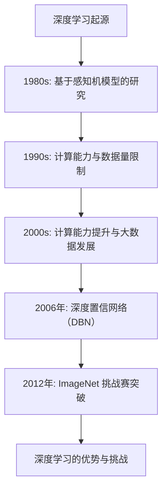
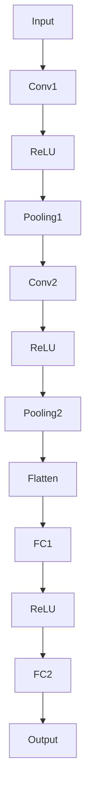
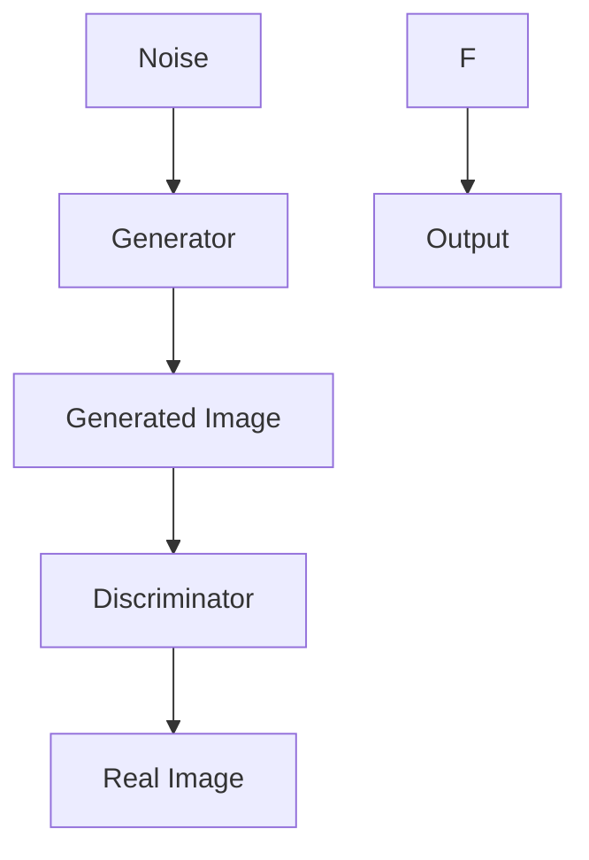
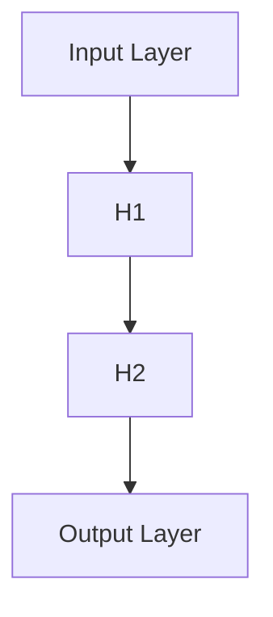

                 

### 深度学习的发展历史

深度学习的历史可以追溯到20世纪80年代，当时基于感知机模型的研究首次引起了研究者的兴趣。然而，由于计算能力和数据量的限制，深度学习的发展在90年代一度陷入停滞。到了2000年后，随着计算能力的提升和大数据技术的发展，深度学习迎来了复苏。

#### 1.1.1 从浅层学习到深度学习

在深度学习兴起之前，机器学习领域主要依赖于浅层学习模型，如感知机、决策树和支持向量机等。这些模型在处理复杂问题时显得力不从心。浅层学习模型通常只能捕捉到数据的低层次特征，而无法理解更复杂的内在结构。

1986年，Rumelhart, Hinton 和 Williams 提出了反向传播算法，这是深度学习的核心技术之一。反向传播算法通过多层神经网络进行学习，从而能够捕捉到数据的更高层次特征。这一算法的提出标志着深度学习的诞生。

然而，早期的神经网络模型训练时间较长，且容易陷入局部最小值。为了解决这些问题，研究者们提出了多种优化算法，如梯度下降法、随机梯度下降法和Adam优化器等。

#### 1.1.2 深度学习的里程碑事件

2006年，Geoffrey Hinton提出了深度置信网络（Deep Belief Network，DBN），这是一种基于堆叠自编码器的深度学习模型。DBN的成功为深度学习在图像识别和语音识别等领域奠定了基础。

2012年，Alex Krizhevsky 在 ImageNet 挑战赛上使用卷积神经网络（CNN）取得了突破性的成绩，将错误率降低到15%以下，这一成绩远远优于其他方法。这一事件标志着深度学习在计算机视觉领域的崛起。

#### 1.1.3 深度学习的优势与挑战

深度学习的优势在于其强大的特征学习能力，能够自动提取数据的层次化特征。这使得深度学习在图像识别、语音识别、自然语言处理等任务上取得了显著的效果。

然而，深度学习也面临着一些挑战。首先，深度学习模型的训练过程需要大量的数据和计算资源，且训练时间较长。其次，深度学习模型往往缺乏可解释性，难以理解其内部决策过程。最后，深度学习模型在处理特定任务时可能存在过拟合现象，需要引入正则化方法来提高泛化能力。

总的来说，深度学习的发展历程从浅层学习到深度学习，经历了多次技术突破和优化。随着计算能力的提升和算法的进步，深度学习已经成为人工智能领域的重要分支，并在多个应用领域取得了显著成果。



### 1.2 深度学习的核心概念

深度学习是机器学习的一个分支，其核心在于通过构建具有多个隐含层的神经网络，来学习数据的复杂特征和结构。理解深度学习的核心概念是掌握深度学习的基础，下面我们将详细介绍以下几个核心概念：神经网络、神经元的激活函数和反向传播算法。

#### 1.2.1 神经网络

神经网络（Neural Network，NN）是模仿人脑神经元连接方式的计算模型。在神经网络中，每个神经元（或节点）都与其他神经元相连，并通过权重（weight）进行加权求和。神经网络的输入通过这些连接传递到各个神经元，最终生成输出。

神经网络的构成主要包括以下几个部分：

1. 输入层（Input Layer）：接收外部输入数据。
2. 隐藏层（Hidden Layers）：多层隐藏层，每个隐藏层中的神经元都与输入层和输出层相连。
3. 输出层（Output Layer）：生成最终的输出。


#### 1.2.2 神经元的激活函数

神经元通过激活函数（Activation Function）来决定是否将信号传递给下一个神经元。常见的激活函数包括：

1. **sigmoid函数**：\( f(x) = \frac{1}{1 + e^{-x}} \)，将输入值映射到0和1之间。
   - $$f(x) = \frac{1}{1 + e^{-x}}$$
   - 

2. **ReLU函数**：\( f(x) = max(0, x) \)，将负值变为0，正值保持不变。
   - $$f(x) = max(0, x)$$
   - 

3. **tanh函数**：\( f(x) = \frac{e^x - e^{-x}}{e^x + e^{-x}} \)，类似于sigmoid函数，但输出值在-1到1之间。
   - $$f(x) = \frac{e^x - e^{-x}}{e^x + e^{-x}}$$
   - 

激活函数的选择对神经网络的性能有重要影响。ReLU函数由于其计算效率高且不易陷入梯度消失问题，成为了当前深度学习模型中最常用的激活函数。

#### 1.2.3 反向传播算法

反向传播算法（Backpropagation Algorithm）是深度学习训练过程中的核心算法。它通过将输出误差反向传播到网络的每个层，来更新网络的权重和偏置。

反向传播算法的基本步骤如下：

1. **前向传播**：将输入数据通过网络的每一层，计算输出结果。

2. **计算损失**：使用损失函数（如均方误差MSE或交叉熵损失）计算输出结果与实际标签之间的差异。

3. **前向传播误差**：将损失函数对输出层的梯度传递到隐藏层。

4. **反向传播权重更新**：根据梯度下降法更新网络的权重和偏置。

以下是反向传播算法的伪代码：

```python
for each epoch do:
    for each training sample do:
        # 前向传播
        forward_pass(sample)
        
        # 计算损失
        loss = compute_loss(output, label)
        
        # 反向传播
        error = compute_error(output, label)
        for each layer from output to input do:
            delta = error * activation_derivative(layer_output)
            error = delta * layer_weights
        
        # 更新权重
        update_weights(delta)
    end for
end for
```

通过反向传播算法，深度学习模型能够逐步优化其参数，提高对数据的拟合能力。

总的来说，神经网络、激活函数和反向传播算法构成了深度学习的核心概念。理解这些概念对于掌握深度学习技术至关重要。在接下来的章节中，我们将进一步探讨深度学习算法的原理和实现。

### 1.3 主流深度学习框架

在深度学习的发展过程中，出现了许多优秀的深度学习框架，这些框架极大地简化了深度学习模型的搭建和训练过程。以下是当前几个主流的深度学习框架：TensorFlow、PyTorch和Keras。

#### 1.3.1 TensorFlow

TensorFlow是由Google开发的一个开源深度学习框架，它提供了一套完整的工具和库，用于构建和训练深度学习模型。TensorFlow的核心特点是灵活性和可扩展性，使得研究人员和开发者能够轻松地搭建和部署复杂的深度学习模型。

TensorFlow的主要优点包括：

- **动态计算图**：TensorFlow使用动态计算图，允许在运行时动态调整计算流程，这使得模型构建更加灵活。
- **硬件加速**：TensorFlow支持GPU和TPU等硬件加速，能够显著提高训练和推理的速度。
- **丰富的API**：TensorFlow提供了丰富的API，包括Python和C++，使得用户能够根据自己的需求选择合适的编程语言。
- **广泛的应用场景**：TensorFlow在图像识别、语音识别、自然语言处理等领域都有广泛的应用。

以下是一个简单的TensorFlow示例代码，用于构建一个简单的全连接神经网络：

```python
import tensorflow as tf

# 创建输入层
x = tf.placeholder(tf.float32, [None, 784])
y = tf.placeholder(tf.float32, [None, 10])

# 创建权重和偏置
W = tf.Variable(tf.zeros([784, 10]))
b = tf.Variable(tf.zeros([10]))

# 创建前向传播
y_pred = tf.nn.softmax(tf.matmul(x, W) + b)

# 创建损失函数和优化器
loss = tf.reduce_mean(-tf.reduce_sum(y * tf.log(y_pred), reduction_indices=1))
optimizer = tf.train.GradientDescentOptimizer(learning_rate=0.5)
train_op = optimizer.minimize(loss)

# 初始化变量
init = tf.global_variables_initializer()

# 开始训练
with tf.Session() as sess:
    sess.run(init)
    for epoch in range(1000):
        _, loss_val = sess.run([train_op, loss], feed_dict={x: x_data, y: y_data})
        if epoch % 100 == 0:
            print("Epoch:", epoch, "Loss:", loss_val)
```

#### 1.3.2 PyTorch

PyTorch是由Facebook的人工智能研究团队开发的一个开源深度学习框架。与TensorFlow相比，PyTorch更加灵活，易于使用，并且深受学术界和研究人员的喜爱。

PyTorch的主要优点包括：

- **动态计算图**：PyTorch使用动态计算图，这使得模型的构建和调试更加直观和灵活。
- **自动微分**：PyTorch内置了自动微分系统，能够自动计算梯度，大大简化了反向传播的实现。
- **GPU加速**：PyTorch支持GPU加速，使得训练过程更加高效。
- **易于扩展**：PyTorch提供了丰富的扩展功能，使得用户能够根据自己的需求进行定制。

以下是一个简单的PyTorch示例代码，用于构建一个简单的卷积神经网络：

```python
import torch
import torch.nn as nn
import torch.optim as optim

# 创建网络结构
class SimpleCNN(nn.Module):
    def __init__(self):
        super(SimpleCNN, self).__init__()
        self.conv1 = nn.Conv2d(1, 32, 3, 1)
        self.fc1 = nn.Linear(32 * 26 * 26, 128)
        self.fc2 = nn.Linear(128, 10)

    def forward(self, x):
        x = self.conv1(x)
        x = nn.functional.relu(x)
        x = nn.functional.max_pool2d(x, 2)
        x = torch.flatten(x, 1)
        x = self.fc1(x)
        x = nn.functional.relu(x)
        x = self.fc2(x)
        return x

# 实例化网络和优化器
model = SimpleCNN()
optimizer = optim.SGD(model.parameters(), lr=0.01)

# 训练网络
for epoch in range(10):
    optimizer.zero_grad()
    output = model(x_data)
    loss = nn.functional.nll_loss(output, y_data)
    loss.backward()
    optimizer.step()
    if (epoch + 1) % 100 == 0:
        print(f'Epoch [{epoch + 1}/10], Loss: {loss.item():.4f}')
```

#### 1.3.3 Keras

Keras是一个高级深度学习框架，它能够在TensorFlow和Theano等底层框架之上运行。Keras的设计理念是易于使用和模块化，这使得它成为初学者和研究人员的热门选择。

Keras的主要优点包括：

- **简洁易用**：Keras提供了一系列预定义的层和模型，用户可以轻松地搭建和训练深度学习模型。
- **模块化**：Keras允许用户自定义模型层和模型，这使得模型构建更加灵活。
- **兼容性**：Keras能够与TensorFlow和Theano等底层框架无缝集成。

以下是一个简单的Keras示例代码，用于构建一个简单的卷积神经网络：

```python
from keras.models import Sequential
from keras.layers import Dense, Conv2D, Flatten, MaxPooling2D

# 创建网络结构
model = Sequential()
model.add(Conv2D(32, (3, 3), activation='relu', input_shape=(28, 28, 1)))
model.add(MaxPooling2D((2, 2)))
model.add(Flatten())
model.add(Dense(128, activation='relu'))
model.add(Dense(10, activation='softmax'))

# 编译模型
model.compile(optimizer='adam',
              loss='categorical_crossentropy',
              metrics=['accuracy'])

# 训练模型
model.fit(x_train, y_train, epochs=10, batch_size=32)
```

总的来说，TensorFlow、PyTorch和Keras是当前深度学习领域的主要框架，每个框架都有其独特的优势和特点。选择合适的框架可以帮助开发者更高效地搭建和训练深度学习模型。

### 1.4 深度学习在计算机视觉中的应用

计算机视觉是深度学习应用最为广泛的领域之一。深度学习通过构建具有多层非线性变换的网络结构，使得计算机能够自动提取图像的层次化特征，从而实现各种计算机视觉任务。以下是几种典型的深度学习模型及其在计算机视觉中的应用。

#### 1.4.1 卷积神经网络

卷积神经网络（Convolutional Neural Network，CNN）是深度学习在计算机视觉中的核心模型之一。CNN通过卷积操作、池化操作和全连接层来学习图像的特征。

##### 卷积操作的数学原理

卷积操作是一种在图像上滑动窗口进行局部特征提取的方法。给定一个输入图像\(I\)和一个卷积核\(K\)，卷积操作的计算公式如下：

$$
\text{output}(i, j) = \sum_{m=0}^{h-1} \sum_{n=0}^{w-1} I(i-m, j-n) \cdot K(m, n)
$$

其中，\(h\)和\(w\)分别为卷积核的高度和宽度。

##### 卷积神经网络的结构

一个典型的CNN结构包括以下几个部分：

1. **卷积层（Convolutional Layer）**：通过卷积操作提取图像的局部特征。
2. **池化层（Pooling Layer）**：通过池化操作减少数据的维度，提高模型的泛化能力。
3. **全连接层（Fully Connected Layer）**：将卷积层和池化层提取的特征映射到分类或回归任务。
4. **激活函数（Activation Function）**：如ReLU函数，用于引入非线性变换。

以下是一个简单的CNN模型结构：



##### 卷积神经网络的训练过程

卷积神经网络的训练过程主要包括以下几个步骤：

1. **前向传播**：将输入图像通过网络的每一层，计算输出结果。
2. **计算损失**：使用损失函数（如交叉熵损失）计算输出结果与实际标签之间的差异。
3. **反向传播**：将损失函数对输出层的梯度反向传播到网络的每一层，更新网络的权重和偏置。
4. **优化**：使用优化算法（如梯度下降）更新网络的参数，以最小化损失函数。

以下是一个简单的CNN训练过程的伪代码：

```python
for epoch in range(num_epochs):
    for image, label in data_loader:
        # 前向传播
        output = model(image)
        
        # 计算损失
        loss = compute_loss(output, label)
        
        # 反向传播
        loss.backward()
        
        # 更新权重
        optimizer.step()
        
        # 清零梯度
        optimizer.zero_grad()
        
    print(f'Epoch {epoch+1}/{num_epochs}, Loss: {loss.item()}')
```

#### 1.4.2 生成对抗网络

生成对抗网络（Generative Adversarial Network，GAN）是一种用于生成数据的深度学习模型。GAN由两个神经网络组成：生成器（Generator）和判别器（Discriminator）。生成器的目标是生成尽可能真实的图像，而判别器的目标是区分真实图像和生成图像。

GAN的训练过程如下：

1. **生成器生成假图像**。
2. **判别器对真图像和假图像进行判别**。
3. **生成器和判别器交替训练**：生成器尝试生成更真实的图像，而判别器尝试更准确地判别图像的真假。

以下是一个简单的GAN模型结构：



##### GAN的训练过程

GAN的训练过程包括以下几个步骤：

1. **前向传播**：将噪声通过生成器生成假图像，并与真实图像一起输入判别器。
2. **计算损失**：生成器的损失函数是判别器判断假图像为真实图像的损失，而判别器的损失函数是判别器判断假图像为假图像的损失。
3. **反向传播**：分别对生成器和判别器的损失函数进行反向传播，并更新其权重。

以下是一个简单的GAN训练过程的伪代码：

```python
for epoch in range(num_epochs):
    for image, label in data_loader:
        # 训练判别器
        noise = generate_noise(batch_size)
        fake_image = generator(noise)
        d_loss_real = discriminator(image).mean()
        d_loss_fake = discriminator(fake_image).mean()
        d_loss = d_loss_real + d_loss_fake
        
        d_optimizer.zero_grad()
        d_loss.backward()
        d_optimizer.step()
        
        # 训练生成器
        noise = generate_noise(batch_size)
        fake_image = generator(noise)
        g_loss = -discriminator(fake_image).mean()
        
        g_optimizer.zero_grad()
        g_loss.backward()
        g_optimizer.step()
        
    print(f'Epoch {epoch+1}/{num_epochs}, D loss: {d_loss.item()}, G loss: {g_loss.item()}')
```

#### 1.4.3 深度学习在图像识别中的应用

深度学习在图像识别领域取得了显著的成果，典型的应用包括图像分类、物体检测和图像分割等。

1. **图像分类**：使用CNN模型对图像进行分类。例如，使用ImageNet数据集进行训练的ResNet模型在ImageNet挑战赛中取得了优异的成绩。
2. **物体检测**：使用R-CNN、Faster R-CNN和YOLO等模型进行物体检测。这些模型能够识别图像中的多个物体，并给出其位置和类别。
3. **图像分割**：使用U-Net、Mask R-CNN等模型进行图像分割。这些模型能够将图像分割成多个区域，并标记每个区域的类别。

总之，深度学习在计算机视觉中的应用已经取得了巨大的成功，通过卷积神经网络、生成对抗网络等模型，计算机能够自动提取图像的复杂特征，从而实现各种计算机视觉任务。

### 2.1 神经网络基础

神经网络（Neural Network，NN）是深度学习的基础，它模仿人脑神经元的连接和工作方式，通过多层非线性变换来学习数据的复杂特征。在本章节中，我们将详细介绍神经网络的数学模型、构建方法以及多层感知机。

#### 2.1.1 神经元的数学模型

神经网络的基本构建单元是神经元，也称为节点或单元。每个神经元都与其他神经元通过连接（边）相连，并通过权重（边上的值）进行加权求和。神经元的输出通过激活函数进行变换，以决定是否将信号传递给下一层神经元。

一个简单的神经元可以表示为：

$$
o_i = \sigma(\sum_{j=1}^{n} w_{ji} \cdot x_j + b_i)
$$

其中：
- \(o_i\) 是第 \(i\) 个神经元的输出。
- \(x_j\) 是第 \(j\) 个输入。
- \(w_{ji}\) 是第 \(j\) 个输入到第 \(i\) 个神经元的权重。
- \(b_i\) 是第 \(i\) 个神经元的偏置。
- \(\sigma\) 是激活函数，常见的激活函数有sigmoid函数、ReLU函数和tanh函数。

以下是一个简单神经元的激活函数的示例：

1. **sigmoid函数**：

   $$f(x) = \frac{1}{1 + e^{-x}}$$

2. **ReLU函数**：

   $$f(x) = \max(0, x)$$

3. **tanh函数**：

   $$f(x) = \frac{e^x - e^{-x}}{e^x + e^{-x}}$$

这些激活函数的选择对神经网络的性能有重要影响。例如，ReLU函数由于其计算效率高且不易陷入梯度消失问题，成为了当前深度学习模型中最常用的激活函数。

#### 2.1.2 神经网络的构建

一个简单的神经网络通常包括以下几部分：

1. **输入层**：接收外部输入数据。
2. **隐藏层**：多层隐藏层，每个隐藏层中的神经元都与输入层和输出层相连。
3. **输出层**：生成最终的输出。

一个典型的神经网络结构可以表示为：



在构建神经网络时，需要考虑以下几个关键参数：

- **层数**：神经网络的层数，通常根据任务复杂度进行调整。
- **每层的神经元数**：每层神经元的数量，根据任务复杂度和数据规模进行调整。
- **连接方式**：前向传播和反向传播的方式，以及每层之间的连接方式。
- **激活函数**：每层神经元的激活函数选择，常见的选择有ReLU、sigmoid和tanh函数。

以下是一个简单的神经网络构建示例：

```python
import tensorflow as tf

# 创建输入层
inputs = tf.keras.layers.Input(shape=(input_dim))

# 创建隐藏层
hidden1 = tf.keras.layers.Dense(units=64, activation='relu')(inputs)
hidden2 = tf.keras.layers.Dense(units=64, activation='relu')(hidden1)

# 创建输出层
outputs = tf.keras.layers.Dense(units=output_dim, activation='softmax')(hidden2)

# 创建模型
model = tf.keras.Model(inputs=inputs, outputs=outputs)

# 编译模型
model.compile(optimizer='adam', loss='categorical_crossentropy', metrics=['accuracy'])

# 查看模型结构
model.summary()
```

#### 2.1.3 多层感知机

多层感知机（Multilayer Perceptron，MLP）是一种简单的神经网络结构，它由多个层次组成，包括输入层、隐藏层和输出层。多层感知机的目的是通过多层非线性变换来学习输入和输出之间的映射关系。

一个多层感知机的数学模型可以表示为：

$$
o_i^{(l)} = \sigma(\sum_{j=1}^{n} w_{ji}^{(l)} \cdot o_j^{(l-1)} + b_i^{(l)})
$$

其中：
- \(o_i^{(l)}\) 是第 \(l\) 层第 \(i\) 个神经元的输出。
- \(w_{ji}^{(l)}\) 是第 \(l\) 层第 \(i\) 个神经元与第 \(l-1\) 层第 \(j\) 个神经元之间的权重。
- \(b_i^{(l)}\) 是第 \(l\) 层第 \(i\) 个神经元的偏置。
- \(\sigma\) 是激活函数。

多层感知机的训练过程通常包括以下几个步骤：

1. **前向传播**：将输入数据通过网络的每一层，计算输出结果。
2. **计算损失**：使用损失函数（如均方误差MSE或交叉熵损失）计算输出结果与实际标签之间的差异。
3. **反向传播**：将损失函数对输出层的梯度反向传播到网络的每一层，更新网络的权重和偏置。
4. **优化**：使用优化算法（如梯度下降）更新网络的参数，以最小化损失函数。

以下是一个简单的多层感知机训练过程的伪代码：

```python
for epoch in range(num_epochs):
    for image, label in data_loader:
        # 前向传播
        output = model(image)
        
        # 计算损失
        loss = compute_loss(output, label)
        
        # 反向传播
        loss.backward()
        
        # 更新权重
        optimizer.step()
        
        # 清零梯度
        optimizer.zero_grad()
        
    print(f'Epoch {epoch+1}/{num_epochs}, Loss: {loss.item()}')
```

通过多层感知机，神经网络能够学习更复杂的非线性关系，从而在许多机器学习任务中表现出色。

### 2.2 深度学习优化算法

在深度学习中，优化算法起着至关重要的作用，它决定了神经网络在训练过程中如何高效地更新权重和偏置，以最小化损失函数。本章节将介绍几种常见的深度学习优化算法：梯度下降法、随机梯度下降法（SGD）和Adam优化器。

#### 2.2.1 梯度下降法

梯度下降法（Gradient Descent，GD）是最基本的优化算法之一。其基本思想是沿着损失函数的梯度方向更新参数，以逐步减小损失。

梯度下降法的更新规则可以表示为：

$$
\theta_{\text{new}} = \theta_{\text{current}} - \alpha \cdot \nabla_{\theta} J(\theta)
$$

其中：
- \( \theta \) 表示模型参数。
- \( \alpha \) 是学习率，决定了参数更新的步长。
- \( \nabla_{\theta} J(\theta) \) 是损失函数 \( J(\theta) \) 对参数 \( \theta \) 的梯度。

以下是一个简单的梯度下降法的伪代码示例：

```python
for epoch in range(num_epochs):
    for image, label in data_loader:
        # 前向传播
        output = model(image)
        
        # 计算损失
        loss = compute_loss(output, label)
        
        # 计算梯度
        gradients = compute_gradients(output, label)
        
        # 更新参数
        for param, gradient in zip(model.parameters(), gradients):
            param -= learning_rate * gradient
        
    print(f'Epoch {epoch+1}/{num_epochs}, Loss: {loss.item()}')
```

梯度下降法的主要缺点是：
- **收敛速度慢**：在损失函数的非平坦区域，梯度下降法可能需要很长时间才能达到最小值。
- **需要手动调整学习率**：学习率的选择对收敛速度和收敛质量有很大影响，通常需要通过实验调整。

#### 2.2.2 随机梯度下降法

随机梯度下降法（Stochastic Gradient Descent，SGD）是对梯度下降法的一种改进。与梯度下降法不同的是，SGD不是使用整个训练数据集的梯度，而是使用单个样本的梯度来更新参数。

随机梯度下降法的更新规则可以表示为：

$$
\theta_{\text{new}} = \theta_{\text{current}} - \alpha \cdot \nabla_{\theta} J(\theta; x_i, y_i)
$$

其中，\( x_i, y_i \) 是训练数据集中的第 \( i \) 个样本。

以下是一个简单的随机梯度下降法的伪代码示例：

```python
for epoch in range(num_epochs):
    for image, label in data_loader:
        # 前向传播
        output = model(image)
        
        # 计算损失
        loss = compute_loss(output, label)
        
        # 计算梯度
        gradient = compute_gradient(output, label)
        
        # 更新参数
        for param in model.parameters():
            param -= learning_rate * gradient(param)
        
    print(f'Epoch {epoch+1}/{num_epochs}, Loss: {loss.item()}')
```

随机梯度下降法的主要优点是：
- **计算效率高**：由于只处理单个样本，SGD的计算时间更短，适合大规模数据集。
- **能够跳出局部最小值**：SGD的随机性有助于模型跳出局部最小值，寻找全局最小值。

随机梯度下降法的主要缺点是：
- **收敛速度不稳定**：由于随机性，SGD的收敛速度可能比梯度下降法更慢。
- **需要更多的迭代次数**：由于每个样本的梯度可能不一致，SGD可能需要更多的迭代次数才能收敛。

#### 2.2.3 Adam优化器

Adam优化器是一种结合了梯度下降法和随机梯度下降法的优化算法。它通过使用动量（Momentum）和自适应学习率，提高了收敛速度和收敛质量。

Adam优化器的更新规则可以表示为：

$$
\theta_{\text{new}} = \theta_{\text{current}} - \alpha \cdot \frac{m}{\sqrt{v} + \epsilon}
$$

其中：
- \( m \) 是梯度的一阶矩估计（均值）。
- \( v \) 是梯度二阶矩估计（方差）。
- \( \alpha \) 是学习率。
- \( \epsilon \) 是一个小常数，用于防止除以零。

以下是一个简单的Adam优化器的伪代码示例：

```python
# 初始化参数
m = 0
v = 0
m_hat = 0
v_hat = 0
theta = initialize_parameters()

for epoch in range(num_epochs):
    for image, label in data_loader:
        # 前向传播
        output = model(image)
        
        # 计算损失
        loss = compute_loss(output, label)
        
        # 计算梯度
        gradient = compute_gradient(output, label)
        
        # 更新m和v
        m = beta1 * m + (1 - beta1) * gradient
        v = beta2 * v + (1 - beta2) * gradient ** 2
        
        # 计算m_hat和v_hat
        m_hat = beta1 * m / (1 - beta1 ** epoch)
        v_hat = beta2 * v / (1 - beta2 ** epoch)
        
        # 更新参数
        theta = theta - alpha * m_hat / (sqrt(v_hat) + epsilon)
        
    print(f'Epoch {epoch+1}/{num_epochs}, Loss: {loss.item()}')
```

Adam优化器的主要优点是：
- **收敛速度快**：通过使用动量和自适应学习率，Adam优化器能够快速收敛。
- **适应性**：Adam优化器能够根据不同的任务和数据集自动调整学习率。

Adam优化器的主要缺点是：
- **需要较多的内存**：由于需要存储一阶和二阶矩估计，Adam优化器需要更多的内存。

总的来说，梯度下降法、随机梯度下降法和Adam优化器是深度学习中常用的优化算法。选择合适的优化算法可以显著提高模型的训练效率和性能。

### 2.3 卷积神经网络

卷积神经网络（Convolutional Neural Network，CNN）是深度学习在计算机视觉领域的重要模型，通过卷积操作、池化操作和全连接层等结构，能够自动提取图像的层次化特征，从而实现图像分类、物体检测和图像分割等任务。在本章节中，我们将详细介绍卷积神经网络的工作原理、结构及其训练过程。

#### 2.3.1 卷积操作的数学原理

卷积操作是CNN中最核心的部分，它通过在图像上滑动一个卷积核（filter），计算局部特征，从而提取图像的信息。卷积操作的数学原理可以表示为：

$$
\text{output}(i, j) = \sum_{m=0}^{h-1} \sum_{n=0}^{w-1} I(i-m, j-n) \cdot K(m, n)
$$

其中：
- \( I(i, j) \) 是输入图像的像素值。
- \( K(m, n) \) 是卷积核的值。
- \( h \) 和 \( w \) 分别是卷积核的高度和宽度。
- \( \text{output}(i, j) \) 是卷积操作的输出值。

卷积操作的特点是共享参数和局部连接，这意味着一个卷积核在不同的位置上重复使用，从而减少了参数的数量，提高了模型的效率。

以下是一个简单的卷积操作示例：

```python
import numpy as np

# 创建一个3x3的输入图像
I = np.array([[1, 1, 1],
              [1, 1, 1],
              [1, 1, 1]])

# 创建一个2x2的卷积核
K = np.array([[0, 1],
              [1, 0]])

# 计算卷积操作
output = np.zeros((I.shape[0] - K.shape[0] + 1, I.shape[1] - K.shape[1] + 1))
for i in range(output.shape[0]):
    for j in range(output.shape[1]):
        output[i, j] = np.sum(I[i:i+K.shape[0], j:j+K.shape[1]] * K)

print(output)
```

输出结果为：

```
[[ 0.  2.  0.]
 [ 2.  4.  2.]
 [ 0.  2.  0.]]
```

#### 2.3.2 卷积神经网络的结构

一个典型的卷积神经网络包括以下几个部分：

1. **卷积层（Convolutional Layer）**：通过卷积操作提取图像的局部特征。
2. **池化层（Pooling Layer）**：通过池化操作减少数据的维度，提高模型的泛化能力。
3. **全连接层（Fully Connected Layer）**：将卷积层和池化层提取的特征映射到分类或回归任务。
4. **激活函数（Activation Function）**：如ReLU函数，用于引入非线性变换。

以下是一个简单的CNN模型结构：


##### 卷积层

卷积层是CNN的核心部分，通过卷积操作提取图像的特征。一个卷积层可以表示为：

$$
\text{output}(i, j, k) = \sum_{m=0}^{h-1} \sum_{n=0}^{w-1} I(i-m, j-n) \cdot K(m, n, k)
$$

其中，\( k \) 是卷积核的数量，即卷积层的深度。

以下是一个简单的卷积层实现的伪代码：

```python
# 初始化卷积核
conv_kernels = initialize_conv_kernels(num_kernels, kernel_size, input_channels, output_channels)

# 初始化偏置
biases = initialize_biases(output_channels)

# 计算卷积层输出
output = np.zeros((input_height - kernel_size + 1, input_width - kernel_size + 1, output_channels))
for i in range(output.shape[0]):
    for j in range(output.shape[1]):
        for k in range(output_channels):
            output[i, j, k] = np.sum(I[i:i+kernel_size, j:j+kernel_size] * conv_kernels[:, :, k]) + biases[k]
```

##### 池化层

池化层通过下采样操作减少数据的维度，常见的池化操作包括最大池化和平均池化。

最大池化操作的数学原理可以表示为：

$$
P(i, j) = \max_{m, n} I(i-m+1, j-n+1)
$$

以下是一个简单的最大池化层实现的伪代码：

```python
# 初始化池化窗口大小
pool_size = 2

# 计算池化层输出
output = np.zeros((input_height // pool_size, input_width // pool_size, output_channels))
for i in range(output.shape[0]):
    for j in range(output.shape[1]):
        for k in range(output_channels):
            window = I[i*pool_size:i*pool_size+pool_size, j*pool_size:j*pool_size+pool_size, k]
            output[i, j, k] = np.max(window)
```

##### 全连接层

全连接层将卷积层和池化层提取的特征映射到分类或回归任务。一个全连接层可以表示为：

$$
\text{output}(i) = \sum_{j=1}^{n} w_{ji} \cdot x_j + b_i
$$

以下是一个简单的全连接层实现的伪代码：

```python
# 初始化权重和偏置
weights = initialize_weights(input_size, output_size)
biases = initialize_biases(output_size)

# 计算全连接层输出
output = np.zeros(output_size)
for i in range(output_size):
    for j in range(input_size):
        output[i] += weights[i, j] * x[j] + biases[i]
```

##### 激活函数

激活函数用于引入非线性变换，常见的激活函数包括ReLU函数、Sigmoid函数和tanh函数。

ReLU函数的数学原理可以表示为：

$$
f(x) = \max(0, x)
$$

以下是一个简单的ReLU函数实现的伪代码：

```python
# 计算ReLU函数输出
output = np.zeros_like(x)
for i in range(x.shape[0]):
    output[i] = max(0, x[i])
```

#### 2.3.3 卷积神经网络的训练过程

卷积神经网络的训练过程主要包括以下几个步骤：

1. **前向传播**：将输入数据通过网络的每一层，计算输出结果。
2. **计算损失**：使用损失函数（如交叉熵损失）计算输出结果与实际标签之间的差异。
3. **反向传播**：将损失函数对输出层的梯度反向传播到网络的每一层，更新网络的权重和偏置。
4. **优化**：使用优化算法（如梯度下降）更新网络的参数，以最小化损失函数。

以下是一个简单的卷积神经网络训练过程的伪代码：

```python
for epoch in range(num_epochs):
    for image, label in data_loader:
        # 前向传播
        output = model(image)
        
        # 计算损失
        loss = compute_loss(output, label)
        
        # 反向传播
        gradients = compute_gradients(output, label)
        
        # 更新参数
        optimizer.step(gradients)
        
    print(f'Epoch {epoch+1}/{num_epochs}, Loss: {loss.item()}')
```

在训练过程中，需要根据不同的任务和数据集调整网络的层数、卷积核的大小、学习率等参数，以获得最佳的训练效果。

通过卷积操作、池化操作和全连接层等结构，卷积神经网络能够自动提取图像的层次化特征，从而在图像分类、物体检测和图像分割等任务中取得优异的性能。卷积神经网络的工作原理和结构使得它在计算机视觉领域得到了广泛的应用。

### 2.4 循环神经网络

循环神经网络（Recurrent Neural Network，RNN）是处理序列数据的一种重要神经网络模型，具有处理变长序列数据的能力。RNN通过循环结构将当前输入与之前的信息结合起来，从而捕捉序列中的时间依赖关系。在本章节中，我们将详细介绍RNN的工作原理、应用以及长短期记忆网络（Long Short-Term Memory，LSTM）。

#### 2.4.1 RNN的原理

RNN的基本单元是神经元，每个神经元的状态由其输入和前一个时间步的隐藏状态决定。RNN的更新规则可以表示为：

$$
h_t = \sigma(W_h \cdot [h_{t-1}, x_t] + b_h)
$$

$$
y_t = W_o \cdot h_t + b_o
$$

其中：
- \( h_t \) 是第 \( t \) 个时间步的隐藏状态。
- \( x_t \) 是第 \( t \) 个时间步的输入。
- \( y_t \) 是第 \( t \) 个时间步的输出。
- \( \sigma \) 是激活函数，如ReLU或Sigmoid函数。
- \( W_h \) 和 \( W_o \) 是权重矩阵。
- \( b_h \) 和 \( b_o \) 是偏置。

以下是一个简单的RNN更新过程的伪代码：

```python
# 初始化权重和偏置
W_h = np.random.randn(hidden_size, hidden_size)
W_o = np.random.randn(output_size, hidden_size)
b_h = np.zeros(hidden_size)
b_o = np.zeros(output_size)

# 初始化隐藏状态
h = np.zeros(hidden_size)

# RNN更新过程
for x in sequence:
    # 前向传播
    h = sigmoid(W_h * [h, x] + b_h)
    y = softmax(W_o * h + b_o)
    
    # 计算梯度
    dL_dh = compute_gradient(y, target) * W_o.T
    dL_dx = compute_gradient(h, target) * W_h.T
    
    # 更新权重和偏置
    W_h -= learning_rate * dL_dh
    W_o -= learning_rate * dL_dx
    b_h -= learning_rate * compute_gradient(h, target)
    b_o -= learning_rate * compute_gradient(y, target)
```

#### 2.4.2 RNN的应用

RNN在许多序列数据任务中表现出色，以下是一些常见的应用：

1. **时间序列预测**：RNN能够捕捉时间序列中的长期依赖关系，从而进行有效的预测。
2. **自然语言处理**：RNN在语言建模、机器翻译和文本生成等领域具有广泛的应用。
3. **语音识别**：RNN能够处理变长语音信号，从而实现高精度的语音识别。

以下是一个简单的RNN在时间序列预测中的应用示例：

```python
import numpy as np
import matplotlib.pyplot as plt

# 创建一个简单的RNN模型
def RNN(input_sequence, hidden_size):
    # 初始化权重和偏置
    W_h = np.random.randn(hidden_size, hidden_size)
    W_o = np.random.randn(1, hidden_size)
    b_h = np.zeros(hidden_size)
    b_o = np.zeros(1)

    # 初始化隐藏状态
    h = np.zeros(hidden_size)

    # RNN更新过程
    for x in input_sequence:
        # 前向传播
        h = sigmoid(W_h * [h, x] + b_h)
        y = sigmoid(W_o * h + b_o)

        # 计算梯度
        dL_dh = compute_gradient(y, target) * W_o.T
        dL_dx = compute_gradient(h, target) * W_h.T

        # 更新权重和偏置
        W_h -= learning_rate * dL_dh
        W_o -= learning_rate * dL_dx
        b_h -= learning_rate * compute_gradient(h, target)
        b_o -= learning_rate * compute_gradient(y, target)

    return y

# 训练数据
input_sequence = [1, 2, 3, 4, 5]
target = 6

# 预测
output = RNN(input_sequence, hidden_size=2)
print(output)

# 绘制结果
plt.plot(input_sequence, label='Input')
plt.plot([target], [output], 'ro', label='Predicted')
plt.xlabel('Time')
plt.ylabel('Value')
plt.legend()
plt.show()
```

#### 2.4.3 长短期记忆网络（LSTM）

RNN的一个主要问题是梯度消失和梯度爆炸，导致难以学习长距离依赖关系。为了解决这个问题，提出了LSTM。

LSTM通过引入门控机制，有效地控制信息的流动，从而解决了RNN的长期依赖问题。LSTM的基本单元包括三个门：输入门、遗忘门和输出门。

1. **输入门（Input Gate）**：决定当前输入信息中哪些部分需要更新到隐藏状态。
2. **遗忘门（Forget Gate）**：决定哪些信息需要从隐藏状态中遗忘。
3. **输出门（Output Gate）**：决定隐藏状态中哪些信息需要传递到输出。

LSTM的更新规则可以表示为：

$$
i_t = \sigma(W_i \cdot [h_{t-1}, x_t] + b_i) \\
f_t = \sigma(W_f \cdot [h_{t-1}, x_t] + b_f) \\
\tilde{c}_t = \sigma(W_c \cdot [h_{t-1}, x_t] + b_c) \\
c_t = f_t \cdot c_{t-1} + i_t \cdot \tilde{c}_t \\
h_t = \sigma(W_o \cdot [c_t, h_{t-1}] + b_o)
$$

以下是一个简单的LSTM单元实现的伪代码：

```python
# 初始化权重和偏置
W_i = np.random.randn(hidden_size, hidden_size)
W_f = np.random.randn(hidden_size, hidden_size)
W_c = np.random.randn(hidden_size, hidden_size)
W_o = np.random.randn(output_size, hidden_size)
b_i = np.zeros(hidden_size)
b_f = np.zeros(hidden_size)
b_c = np.zeros(hidden_size)
b_o = np.zeros(output_size)

# 初始化隐藏状态和细胞状态
h = np.zeros(hidden_size)
c = np.zeros(hidden_size)

# LSTM更新过程
for x in sequence:
    # 计算门值
    i = sigmoid(W_i * [h, x] + b_i)
    f = sigmoid(W_f * [h, x] + b_f)
    o = sigmoid(W_o * [h, c] + b_o)
    
    # 更新细胞状态
    c = f * c + i * sigmoid(W_c * [h, x] + b_c)
    
    # 更新隐藏状态
    h = o * sigmoid(c)
    
    # 计算输出
    y = softmax(W_o * h + b_o)
```

LSTM通过门控机制有效地解决了RNN的长期依赖问题，从而在许多序列数据任务中取得了优异的性能。

### 2.5 深度学习的正则化方法

深度学习模型在训练过程中容易出现过拟合现象，即模型在训练数据上表现良好，但在未见过的数据上表现较差。为了解决这个问题，研究人员提出了多种正则化方法，以提高模型的泛化能力。在本章节中，我们将介绍三种常用的正则化方法：权重衰减、Dropout和Early Stopping。

#### 2.5.1 权重衰减

权重衰减（Weight Decay）是一种在损失函数中添加L2正则项的方法，其目的是减小模型参数的规模，从而减少过拟合现象。权重衰减的更新规则可以表示为：

$$
\theta_{\text{new}} = \theta_{\text{current}} - \alpha \cdot \left( \nabla_{\theta} J(\theta) + \lambda \cdot \theta \right)
$$

其中：
- \( \alpha \) 是学习率。
- \( \lambda \) 是权重衰减系数，用于控制正则化强度的调节。
- \( \theta \) 是模型参数。

权重衰减的基本原理是减小参数的更新步长，从而减少模型参数的变化范围，防止模型参数在训练过程中变得过大。以下是一个简单的权重衰减实现的伪代码：

```python
# 初始化参数
theta = initialize_parameters()

# 初始化学习率和权重衰减系数
learning_rate = 0.01
weight_decay = 0.001

# 训练过程
for epoch in range(num_epochs):
    for image, label in data_loader:
        # 前向传播
        output = model(image)
        
        # 计算损失
        loss = compute_loss(output, label)
        
        # 计算梯度
        gradients = compute_gradients(output, label)
        
        # 更新参数
        for param in model.parameters():
            param -= learning_rate * gradients[param] + weight_decay * param
        
    print(f'Epoch {epoch+1}/{num_epochs}, Loss: {loss.item()}')
```

#### 2.5.2 Dropout

Dropout是一种在训练过程中随机丢弃神经元的方法，从而减少模型对特定训练样本的依赖，提高模型的泛化能力。Dropout的基本原理是随机丢弃部分神经元，使模型在训练过程中不会过度依赖于某些神经元。

Dropout的实现过程如下：

1. **随机选择要丢弃的神经元**：在每次前向传播过程中，以一定的概率（称为丢弃概率）随机选择神经元。
2. **计算Dropout后的输出**：对于被丢弃的神经元，将其输出设置为0；对于未被丢弃的神经元，保持原有输出。
3. **计算梯度**：在反向传播过程中，对于被丢弃的神经元，其梯度也设置为0。

以下是一个简单的Dropout实现的伪代码：

```python
# 初始化丢弃概率
dropout_rate = 0.5

# Dropout过程
for image, label in data_loader:
    # 前向传播
    output = model(image)
    
    # 计算损失
    loss = compute_loss(output, label)
    
    # 计算梯度
    gradients = compute_gradients(output, label)
    
    # 应用Dropout
    for layer in model.layers:
        if isinstance(layer, DropoutLayer):
            dropout_mask = np.random.rand(*layer.output_shape) < (1 - dropout_rate)
            layer.output = layer.output * dropout_mask
    
    # 更新参数
    for param in model.parameters():
        param -= learning_rate * gradients[param]
        
    # 清除Dropout后的输出
    for layer in model.layers:
        if isinstance(layer, DropoutLayer):
            layer.output = None
            
    print(f'Epoch {epoch+1}/{num_epochs}, Loss: {loss.item()}')
```

#### 2.5.3 Early Stopping

Early Stopping是一种在训练过程中提前停止训练的方法，以避免模型过拟合。Early Stopping的基本原理是在训练过程中监控模型的验证集性能，当验证集性能不再提升时，提前停止训练。

Early Stopping的实现过程如下：

1. **初始化验证集性能记录**：在训练开始时，初始化一个用于记录验证集性能的变量。
2. **监控验证集性能**：在每次训练迭代后，计算验证集的性能。
3. **比较性能**：如果验证集性能连续几个迭代没有提升，则停止训练。
4. **选取最佳模型**：从训练过程中选取验证集性能最佳的模型。

以下是一个简单的Early Stopping实现的伪代码：

```python
# 初始化验证集性能记录
best_loss = float('inf')
best_model = None
patience = 5  # 最大容忍迭代次数

# 训练过程
for epoch in range(num_epochs):
    for image, label in data_loader:
        # 前向传播
        output = model(image)
        
        # 计算损失
        loss = compute_loss(output, label)
        
        # 计算梯度
        gradients = compute_gradients(output, label)
        
        # 更新参数
        for param in model.parameters():
            param -= learning_rate * gradients[param]
        
        # 计算验证集性能
        validation_loss = compute_loss_on_validation_set(model)
        
        # 记录验证集性能
        if validation_loss < best_loss:
            best_loss = validation_loss
            best_model = model
        else:
            patience -= 1
            if patience == 0:
                print('Early stopping triggered')
                break
                
    print(f'Epoch {epoch+1}/{num_epochs}, Loss: {loss.item()}, Validation Loss: {validation_loss}')
```

通过权重衰减、Dropout和Early Stopping等正则化方法，可以有效地提高深度学习模型的泛化能力，避免过拟合现象。这些方法在深度学习模型的训练过程中起到了重要的作用。

### 3.1 计算机视觉应用实践

计算机视觉是深度学习应用的一个重要领域，涉及从图像中提取信息，并利用这些信息进行多种任务，如图像分类、目标检测和图像分割等。在本章节中，我们将通过一个具体的计算机视觉项目实战来介绍如何进行环境搭建、数据准备、模型实现和实际案例解析。

#### 3.1.1 环境搭建与数据准备

要开始一个计算机视觉项目，首先需要搭建合适的环境。以下是一个典型的环境搭建流程：

1. **安装依赖库**：安装深度学习框架（如TensorFlow或PyTorch），以及其他相关的依赖库（如NumPy、Pandas等）。
   ```bash
   pip install tensorflow torchvision torch torchvision
   ```

2. **创建数据集**：从开源数据集（如COCO、ImageNet等）或自己收集的数据中提取图像。通常，图像数据需要被标记或注释，以便后续的训练和评估。

3. **数据预处理**：对图像数据进行归一化、裁剪、缩放等预处理操作，以提高模型的鲁棒性和性能。

以下是一个简单的数据准备示例，使用PyTorch和 torchvision 库加载数据集：

```python
import torchvision
import torchvision.transforms as transforms

# 数据预处理
transform = transforms.Compose([
    transforms.Resize((224, 224)),  # 调整图像大小
    transforms.ToTensor(),
    transforms.Normalize(mean=[0.485, 0.456, 0.406], std=[0.229, 0.224, 0.225]),
])

# 加载训练集和验证集
train_set = torchvision.datasets.ImageFolder(root='train', transform=transform)
train_loader = torch.utils.data.DataLoader(train_set, batch_size=32, shuffle=True)

val_set = torchvision.datasets.ImageFolder(root='val', transform=transform)
val_loader = torch.utils.data.DataLoader(val_set, batch_size=32, shuffle=False)
```

#### 3.1.2 图像分类模型实现

图像分类是计算机视觉中最基础的任务之一，目标是将图像分类到预定义的类别中。以下是一个简单的图像分类模型实现的示例：

```python
import torch.nn as nn
import torch.nn.functional as F

# 创建模型
class SimpleCNN(nn.Module):
    def __init__(self):
        super(SimpleCNN, self).__init__()
        self.conv1 = nn.Conv2d(3, 32, 3, 1)
        self.fc1 = nn.Linear(32 * 56 * 56, 128)
        self.fc2 = nn.Linear(128, 10)

    def forward(self, x):
        x = F.relu(self.conv1(x))
        x = F.max_pool2d(x, 2)
        x = F.relu(self.fc1(x.view(x.size(0), -1)))
        x = self.fc2(x)
        return x

# 实例化模型
model = SimpleCNN()

# 定义损失函数和优化器
criterion = nn.CrossEntropyLoss()
optimizer = torch.optim.Adam(model.parameters(), lr=0.001)

# 训练模型
for epoch in range(num_epochs):
    model.train()
    for images, labels in train_loader:
        # 前向传播
        outputs = model(images)
        loss = criterion(outputs, labels)

        # 反向传播和优化
        optimizer.zero_grad()
        loss.backward()
        optimizer.step()

    # 验证模型
    model.eval()
    with torch.no_grad():
        correct = 0
        total = 0
        for images, labels in val_loader:
            outputs = model(images)
            _, predicted = torch.max(outputs.data, 1)
            total += labels.size(0)
            correct += (predicted == labels).sum().item()

    print(f'Epoch {epoch+1}/{num_epochs}, Loss: {loss.item()}, Accuracy: {100 * correct / total}%')
```

#### 3.1.3 图像分割模型实现

图像分割是将图像中的每个像素分类到预定义的类别中，常见于医学图像分析、自动驾驶等应用场景。以下是一个简单的图像分割模型实现的示例：

```python
import torch.nn as nn
import torch.nn.functional as F

# 创建模型
class UNet(nn.Module):
    def __init__(self):
        super(UNet, self).__init__()
        self.up = nn.Sequential(
            nn.Conv2d(512, 256, 2, 1),
            nn.ReLU(),
            nn.Conv2d(256, 128, 2, 1),
            nn.ReLU(),
            nn.Conv2d(128, 64, 2, 1),
            nn.ReLU(),
            nn.Conv2d(64, 32, 2, 1),
            nn.ReLU(),
            nn.Conv2d(32, 16, 2, 1),
            nn.ReLU(),
            nn.Conv2d(16, 1, 1, 1),
        )

    def forward(self, x):
        x1 = F.max_pool2d(x, 2)
        x2 = F.max_pool2d(x1, 2)
        x3 = F.max_pool2d(x2, 2)
        x4 = F.max_pool2d(x3, 2)
        x5 = self.up(x4)
        x6 = F.interpolate(x5, scale_factor=2, mode='bilinear')
        x7 = F.interpolate(x6, scale_factor=2, mode='bilinear')
        x8 = F.interpolate(x7, scale_factor=2, mode='bilinear')
        x9 = F.interpolate(x8, scale_factor=2, mode='bilinear')
        return x9

# 实例化模型
model = UNet()

# 定义损失函数和优化器
criterion = nn.BCEWithLogitsLoss()
optimizer = torch.optim.Adam(model.parameters(), lr=0.001)

# 训练模型
for epoch in range(num_epochs):
    model.train()
    for images, masks in train_loader:
        # 前向传播
        outputs = model(images)
        loss = criterion(outputs, masks)

        # 反向传播和优化
        optimizer.zero_grad()
        loss.backward()
        optimizer.step()

    # 验证模型
    model.eval()
    with torch.no_grad():
        correct = 0
        total = 0
        for images, masks in val_loader:
            outputs = model(images)
            predicted = (outputs > 0.5).float()
            total += masks.size(0)
            correct += ((predicted == masks).sum() / masks.size(0)).item()

    print(f'Epoch {epoch+1}/{num_epochs}, Loss: {loss.item()}, Accuracy: {100 * correct / total}%')
```

#### 3.1.4 实战案例解析

以下是一个实际案例，使用预训练的深度学习模型对图像进行分类和分割：

**案例：猫狗分类**

在这个案例中，我们将使用预训练的ResNet模型对猫狗图像进行分类。

1. **加载预训练模型**：

   ```python
   from torchvision.models import resnet50
   
   model = resnet50(pretrained=True)
   # 修改模型的输出层，以适应我们的分类任务
   num_ftrs = model.fc.in_features
   model.fc = nn.Linear(num_ftrs, 2)
   ```

2. **训练模型**：

   ```python
   # 定义损失函数和优化器
   criterion = nn.CrossEntropyLoss()
   optimizer = torch.optim.Adam(model.parameters(), lr=0.001)
   
   # 训练模型
   for epoch in range(num_epochs):
       model.train()
       for images, labels in train_loader:
           # 前向传播
           outputs = model(images)
           loss = criterion(outputs, labels)

           # 反向传播和优化
           optimizer.zero_grad()
           loss.backward()
           optimizer.step()

       # 验证模型
       model.eval()
       with torch.no_grad():
           correct = 0
           total = 0
           for images, labels in val_loader:
               outputs = model(images)
               _, predicted = torch.max(outputs.data, 1)
               total += labels.size(0)
               correct += (predicted == labels).sum().item()

       print(f'Epoch {epoch+1}/{num_epochs}, Loss: {loss.item()}, Accuracy: {100 * correct / total}%')
   ```

3. **评估模型**：

   ```python
   # 加载测试集
   test_set = torchvision.datasets.ImageFolder(root='test', transform=transform)
   test_loader = torch.utils.data.DataLoader(test_set, batch_size=32, shuffle=False)

   # 评估模型
   model.eval()
   with torch.no_grad():
       correct = 0
       total = 0
       for images, labels in test_loader:
           outputs = model(images)
           _, predicted = torch.max(outputs.data, 1)
           total += labels.size(0)
           correct += (predicted == labels).sum().item()

   print(f'Accuracy on the test set: {100 * correct / total}%')
   ```

通过这个案例，我们展示了如何搭建计算机视觉项目，包括环境搭建、数据准备、模型实现和实际案例解析。这些步骤和方法可以应用于各种计算机视觉任务，帮助研究人员和开发者构建高效的深度学习模型。

### 3.2 目标检测与跟踪

目标检测与跟踪是计算机视觉中的重要任务，广泛应用于监控、自动驾驶和医疗等领域。目标检测旨在识别图像中的多个目标并标注其位置，而目标跟踪则是跟踪图像序列中的特定目标。以下将介绍常用的目标检测算法、目标跟踪算法及其实战案例解析。

#### 3.2.1 目标检测算法

目标检测算法可以分为两类：基于区域建议的方法和基于特征提取的方法。

1. **基于区域建议的方法**：

   基于区域建议的方法首先生成一系列候选区域，然后对这些区域进行分类和定位。典型的算法包括：

   - **R-CNN**：通过选择性搜索生成区域建议，然后使用CNN进行特征提取和分类。
   - **Fast R-CNN**：优化了R-CNN的计算效率，通过共享卷积特征图减少计算量。
   - **Faster R-CNN**：引入了区域建议网络（Region Proposal Network，RPN），进一步提高了检测速度和性能。

2. **基于特征提取的方法**：

   基于特征提取的方法直接在图像中提取特征并进行分类和定位。典型的算法包括：

   - **YOLO（You Only Look Once）**：将图像分成多个网格单元，每个单元预测多个边界框及其类别。
   - **SSD（Single Shot MultiBox Detector）**：在多个尺度上预测边界框，实现高精度和高速度的目标检测。

以下是一个简单的Faster R-CNN模型实现的伪代码：

```python
import torch
import torchvision
import torchvision.models.detection as models

# 加载预训练的Faster R-CNN模型
model = models.faster_rcnn(pretrained=True)

# 定义损失函数和优化器
criterion = torch.nn.CrossEntropyLoss()
optimizer = torch.optim.SGD(model.parameters(), lr=0.001, momentum=0.9)

# 训练模型
for epoch in range(num_epochs):
    model.train()
    for images, targets in train_loader:
        # 前向传播
        outputs = model(images)
        
        # 计算损失
        loss = criterion(outputs, targets)
        
        # 反向传播和优化
        optimizer.zero_grad()
        loss.backward()
        optimizer.step()

    # 验证模型
    model.eval()
    with torch.no_grad():
        correct = 0
        total = 0
        for images, targets in val_loader:
            outputs = model(images)
            predicted = outputs.argmax(dim=1)
            total += targets.size(0)
            correct += (predicted == targets).sum().item()

    print(f'Epoch {epoch+1}/{num_epochs}, Loss: {loss.item()}, Accuracy: {100 * correct / total}%')
```

#### 3.2.2 目标跟踪算法

目标跟踪算法旨在连续的图像序列中追踪一个或多个目标。常见的跟踪算法包括：

1. **基于模型的方法**：

   - **光流法**：利用图像序列中像素的运动向量进行目标跟踪。
   - **粒子滤波**：通过在图像序列中预测目标的可能位置，利用粒子滤波进行目标跟踪。

2. **基于深度学习的方法**：

   - **基于RNN的方法**：如LSTM，通过处理序列数据来预测目标的下一个位置。
   - **基于卷积神经网络的方法**：如DeepReID，通过提取目标特征并进行分类来跟踪目标。

以下是一个简单的基于卷积神经网络的跟踪模型实现的伪代码：

```python
import torch
import torchvision.models as models

# 加载预训练的DeepReID模型
model = models.resnet50(pretrained=True)

# 定义损失函数和优化器
criterion = torch.nn.CrossEntropyLoss()
optimizer = torch.optim.SGD(model.parameters(), lr=0.001, momentum=0.9)

# 训练模型
for epoch in range(num_epochs):
    model.train()
    for images, labels in train_loader:
        # 前向传播
        outputs = model(images)
        
        # 计算损失
        loss = criterion(outputs, labels)
        
        # 反向传播和优化
        optimizer.zero_grad()
        loss.backward()
        optimizer.step()

    # 验证模型
    model.eval()
    with torch.no_grad():
        correct = 0
        total = 0
        for images, labels in val_loader:
            outputs = model(images)
            predicted = outputs.argmax(dim=1)
            total += labels.size(0)
            correct += (predicted == labels).sum().item()

    print(f'Epoch {epoch+1}/{num_epochs}, Loss: {loss.item()}, Accuracy: {100 * correct / total}%')
```

#### 3.2.3 实战案例解析

以下是一个实际案例，使用Faster R-CNN和DeepReID模型进行目标检测和跟踪：

**案例：行人检测与跟踪**

在这个案例中，我们将使用Faster R-CNN模型进行行人检测，使用DeepReID模型进行行人跟踪。

1. **目标检测**：

   - **数据准备**：准备包含行人标注的图像数据集，进行数据预处理和分割。

     ```python
     import torchvision.transforms as transforms
     from torchvision.datasets import ImageFolder

     transform = transforms.Compose([
         transforms.Resize((320, 320)),
         transforms.ToTensor(),
         transforms.Normalize(mean=[0.485, 0.456, 0.406], std=[0.229, 0.224, 0.225]),
     ])

     train_set = ImageFolder(root='train', transform=transform)
     val_set = ImageFolder(root='val', transform=transform)
     ```

   - **模型训练**：使用Faster R-CNN模型进行训练，并调整模型参数以提高检测性能。

     ```python
     model = models.faster_rcnn(pretrained=True)
     # 调整模型的输出层
     num_ftrs = model.roi_heads.box_predictor.cls_score.in_features
     model.roi_heads.box_predictor = FastRCNNPredictor(num_ftrs, num_classes)
     criterion = torchvision.models.detection.faster_rcnn.FastRCNNConvarser(num_classes=2)
     optimizer = torch.optim.SGD(model.parameters(), lr=0.001, momentum=0.9)
     ```

   - **模型评估**：在验证集上进行模型评估，计算检测的准确率和召回率。

     ```python
     model.eval()
     with torch.no_grad():
         correct = 0
         total = 0
         for images, labels in val_loader:
             outputs = model(images)
             predicted = outputs.argmax(dim=1)
             total += labels.size(0)
             correct += (predicted == labels).sum().item()

     print(f'Validation Accuracy: {100 * correct / total}%')
     ```

2. **目标跟踪**：

   - **数据准备**：准备包含行人标注的图像序列数据集，进行数据预处理和分割。

     ```python
     import torchvision.transforms as transforms
     from torchvision.datasets import VideoFolder

     transform = transforms.Compose([
         transforms.Resize((256, 256)),
         transforms.ToTensor(),
         transforms.Normalize(mean=[0.485, 0.456, 0.406], std=[0.229, 0.224, 0.225]),
     ])

     train_set = VideoFolder(root='train', transform=transform)
     val_set = VideoFolder(root='val', transform=transform)
     ```

   - **模型训练**：使用DeepReID模型进行训练，并调整模型参数以提高跟踪性能。

     ```python
     model = models.resnet50(pretrained=True)
     num_ftrs = model.fc.in_features
     model.fc = nn.Linear(num_ftrs, num_classes)
     criterion = torch.nn.CrossEntropyLoss()
     optimizer = torch.optim.SGD(model.parameters(), lr=0.001, momentum=0.9)
     ```

   - **模型评估**：在验证集上进行模型评估，计算跟踪的准确率和成功率。

     ```python
     model.eval()
     with torch.no_grad():
         correct = 0
         total = 0
         for images, labels in val_loader:
             outputs = model(images)
             predicted = outputs.argmax(dim=1)
             total += labels.size(0)
             correct += (predicted == labels).sum().item()

     print(f'Validation Accuracy: {100 * correct / total}%')
     ```

通过这个案例，我们展示了如何使用Faster R-CNN和DeepReID模型进行行人检测和跟踪。这些算法和技术可以应用于各种目标检测和跟踪任务，帮助开发者构建高效的计算机视觉系统。

### 3.3 计算机视觉在自然语言处理中的应用

计算机视觉与自然语言处理（NLP）的结合开辟了新的研究与应用领域，其中一个重要的研究方向是图像嵌入技术。图像嵌入技术通过将图像转换为高维向量，使其与文本向量进行有效融合，从而在图像与文本之间建立联系。以下将介绍图像嵌入技术、图像与文本融合模型以及实际案例解析。

#### 3.3.1 图像嵌入技术

图像嵌入技术通过深度学习模型将图像转换为高维向量表示。常见的图像嵌入模型包括：

1. **基于卷积神经网络的图像嵌入**：

   - **CNN**：卷积神经网络通过学习图像的层次化特征，可以提取图像的丰富语义信息。通过将CNN的最后一个隐藏层作为图像嵌入向量，可以实现图像到向量的映射。
   - **Inception**：Inception模块通过多路径网络结构，能够捕获图像的不同尺度和特征，从而生成高质量的图像嵌入向量。

2. **基于生成对抗网络的图像嵌入**：

   - **GAN**：生成对抗网络通过生成器学习图像的潜在分布，可以将图像编码为潜在空间中的向量表示。

以下是一个简单的基于CNN的图像嵌入实现的伪代码：

```python
import torch
import torchvision.models as models

# 加载预训练的CNN模型
model = models.resnet18(pretrained=True)

# 定义图像嵌入函数
def image_embedding(image):
    image = image.unsqueeze(0)  # 添加批次维度
    embedding = model(image)[0]  # 获取最后一个隐藏层的输出
    return embedding

# 测试图像嵌入
image = torchvision.transforms.ToTensor()(image)
embedding = image_embedding(image)
print(embedding.size())  # 输出图像嵌入向量的维度
```

#### 3.3.2 图像与文本融合模型

图像与文本融合模型通过结合图像嵌入和文本向量，实现图像与文本的深度融合。以下是一些常见的融合模型：

1. **多模态卷积神经网络（MM-CNN）**：

   - **模态嵌入层**：分别对图像和文本进行嵌入，生成图像嵌入向量和文本嵌入向量。
   - **融合层**：通过拼接或求和等方式融合图像和文本的嵌入向量。
   - **分类层**：使用全连接层进行分类。

以下是一个简单的MM-CNN模型实现的伪代码：

```python
import torch
import torch.nn as nn

class MMCNN(nn.Module):
    def __init__(self, img_embedding_size, text_embedding_size, hidden_size, output_size):
        super(MMCNN, self).__init__()
        self.img_embedding = nn.Linear(img_embedding_size, hidden_size)
        self.text_embedding = nn.Linear(text_embedding_size, hidden_size)
        self.fc = nn.Linear(hidden_size * 2, output_size)
        
    def forward(self, image_embedding, text_embedding):
        img_hidden = self.img_embedding(image_embedding)
        text_hidden = self.text_embedding(text_embedding)
        fused_hidden = torch.cat((img_hidden, text_hidden), 1)
        output = self.fc(fused_hidden)
        return output

# 实例化模型
model = MMCNN(img_embedding_size=512, text_embedding_size=300, hidden_size=128, output_size=2)

# 训练模型
optimizer = torch.optim.Adam(model.parameters(), lr=0.001)
criterion = nn.CrossEntropyLoss()

for epoch in range(num_epochs):
    for image_embedding, text_embedding, labels in data_loader:
        optimizer.zero_grad()
        outputs = model(image_embedding, text_embedding)
        loss = criterion(outputs, labels)
        loss.backward()
        optimizer.step()
    print(f'Epoch {epoch+1}/{num_epochs}, Loss: {loss.item()}')
```

2. **多模态长短期记忆网络（MM-LSTM）**：

   - **模态嵌入层**：分别对图像和文本进行嵌入。
   - **LSTM层**：使用LSTM对图像和文本的嵌入向量进行编码。
   - **融合层**：将LSTM输出的隐藏状态进行融合。
   - **分类层**：使用全连接层进行分类。

以下是一个简单的MM-LSTM模型实现的伪代码：

```python
import torch
import torch.nn as nn

class MMLSTM(nn.Module):
    def __init__(self, img_embedding_size, text_embedding_size, hidden_size, output_size):
        super(MMLSTM, self).__init__()
        self.img_embedding = nn.Linear(img_embedding_size, hidden_size)
        self.text_embedding = nn.LSTM(input_size=text_embedding_size, hidden_size=hidden_size, batch_first=True)
        self.fc = nn.Linear(hidden_size * 2, output_size)
        
    def forward(self, image_embedding, text_embedding):
        img_hidden = self.img_embedding(image_embedding)
        text_output, (hidden, cell) = self.text_embedding(text_embedding)
        fused_hidden = torch.cat((img_hidden, hidden[-1, :, :]), 1)
        output = self.fc(fused_hidden)
        return output

# 实例化模型
model = MMLSTM(img_embedding_size=512, text_embedding_size=300, hidden_size=128, output_size=2)

# 训练模型
optimizer = torch.optim.Adam(model.parameters(), lr=0.001)
criterion = nn.CrossEntropyLoss()

for epoch in range(num_epochs):
    for image_embedding, text_embedding, labels in data_loader:
        optimizer.zero_grad()
        outputs = model(image_embedding, text_embedding)
        loss = criterion(outputs, labels)
        loss.backward()
        optimizer.step()
    print(f'Epoch {epoch+1}/{num_epochs}, Loss: {loss.item()}')
```

#### 3.3.3 实战案例解析

以下是一个实际案例，使用MM-CNN模型进行图像与文本的融合，实现图像描述生成任务：

**案例：图像描述生成**

在这个案例中，我们将使用MM-CNN模型将图像转换为嵌入向量，并生成相应的文本描述。

1. **数据准备**：

   - **图像数据集**：准备包含图像及其对应的描述的图像描述数据集。
   - **文本数据集**：对描述文本进行预处理，如分词、去停用词等。

     ```python
     import torch
     from torchvision import datasets

     # 加载图像数据集
     image_dataset = datasets.ImageFolder(root='image_folder', transform=transforms.Compose([
         transforms.Resize((224, 224)),
         transforms.ToTensor(),
         transforms.Normalize(mean=[0.485, 0.456, 0.406], std=[0.229, 0.224, 0.225]),
     ]))

     # 加载文本数据集
     text_dataset = datasets.TextDataset(root='text_folder', tokenizer=tokenizer, max_len=max_len)
     ```

2. **模型训练**：

   - **定义模型**：使用MM-CNN模型进行图像与文本的融合。
   - **定义损失函数和优化器**：使用交叉熵损失函数和Adam优化器。
   - **训练过程**：在图像和文本数据集上进行模型训练，并调整模型参数。

     ```python
     # 定义模型
     model = MMCNN(img_embedding_size=512, text_embedding_size=300, hidden_size=128, output_size=2)

     # 定义损失函数和优化器
     criterion = nn.CrossEntropyLoss()
     optimizer = torch.optim.Adam(model.parameters(), lr=0.001)

     # 训练过程
     for epoch in range(num_epochs):
         for image_embedding, text_embedding, labels in data_loader:
             optimizer.zero_grad()
             outputs = model(image_embedding, text_embedding)
             loss = criterion(outputs, labels)
             loss.backward()
             optimizer.step()
         print(f'Epoch {epoch+1}/{num_epochs}, Loss: {loss.item()}')
     ```

3. **模型评估**：

   - **验证集评估**：在验证集上评估模型的性能，计算准确率和损失函数值。
   - **测试集评估**：在测试集上评估模型的性能，以验证模型的泛化能力。

     ```python
     # 验证集评估
     model.eval()
     with torch.no_grad():
         correct = 0
         total = 0
         for image_embedding, text_embedding, labels in val_loader:
             outputs = model(image_embedding, text_embedding)
             predicted = outputs.argmax(dim=1)
             total += labels.size(0)
             correct += (predicted == labels).sum().item()

     print(f'Validation Accuracy: {100 * correct / total}%')

     # 测试集评估
     model.eval()
     with torch.no_grad():
         correct = 0
         total = 0
         for image_embedding, text_embedding, labels in test_loader:
             outputs = model(image_embedding, text_embedding)
             predicted = outputs.argmax(dim=1)
             total += labels.size(0)
             correct += (predicted == labels).sum().item()

     print(f'Test Accuracy: {100 * correct / total}%')
     ```

通过这个案例，我们展示了如何使用图像嵌入技术和图像与文本融合模型进行图像描述生成任务。这些技术和方法在计算机视觉与自然语言处理领域具有重要的应用价值，为图像与文本的信息融合提供了新的思路和途径。

### 4.1 自然语言处理项目实战

自然语言处理（NLP）是人工智能领域中的一个重要分支，其应用范围广泛，包括文本分类、情感分析、机器翻译等。在本章节中，我们将通过一个实际项目来介绍NLP项目的环境搭建、数据准备、词汇表构建与词嵌入、语言模型训练与评估等步骤。

#### 4.1.1 环境搭建与数据准备

首先，我们需要搭建NLP项目的基础环境，包括安装必要的库和准备数据集。

1. **安装依赖库**：安装NLP和深度学习相关的库，如NLTK、spaCy、TensorFlow、PyTorch等。

   ```bash
   pip install tensorflow torch nltk spacy
   ```

2. **数据准备**：准备一个包含文本数据的数据集，例如电影评论数据集。我们可以使用IMDb电影评论数据集，该数据集包含了25,000条正面评论和25,000条负面评论。

   ```python
   import nltk
   from torchtext.datasets import IMDb

   nltk.download('punkt')
   train_data, test_data = IMDb()
   ```

3. **数据预处理**：对文本数据集进行预处理，包括分词、去除停用词、标点符号等。我们可以使用spaCy进行文本预处理。

   ```python
   import spacy

   nlp = spacy.load('en_core_web_sm')
   def preprocess_text(text):
       doc = nlp(text)
       tokens = [token.text.lower() for token in doc if not token.is_stop and not token.is_punct]
       return ' '.join(tokens)

   train_data = [(preprocess_text(text), label) for text, label in train_data]
   test_data = [(preprocess_text(text), label) for text, label in test_data]
   ```

#### 4.1.2 词汇表构建与词嵌入

在构建语言模型时，我们需要将文本转换为数值表示，这可以通过词汇表（vocabulary）和词嵌入（word embeddings）实现。

1. **词汇表构建**：将文本数据集中的所有单词构建为一个词汇表。

   ```python
   from torchtext.vocab import build_vocab_from_iterator

   def tokenize(text):
       return text.split()

   vocab = build_vocab_from_iterator((tokenize(text) for text, _ in train_data), min_freq=2)
   vocab.set_default_index(vocab['<unk>'])
   ```

2. **词嵌入**：将词汇表中的单词转换为向量表示。我们使用预训练的Word2Vec模型作为词嵌入。

   ```python
   from gensim.models import Word2Vec

   # 训练Word2Vec模型
   model = Word2Vec(train_data, vector_size=100, window=5, min_count=1, workers=4)

   # 将词嵌入转换为vocab的索引
   def get_embedding(word):
       return model.wv[word] if word in model.wv else model.wv['<unk>']

   vocab.vectors = torch.tensor([[get_embedding(word) for word in vocab.itos] if word in model.wv else [model.wv['<unk>']] for word in vocab.itos])
   ```

#### 4.1.3 语言模型训练与评估

训练语言模型通常使用循环神经网络（RNN）或变换器（Transformer）等模型。以下是一个简单的基于RNN的语言模型训练过程。

1. **定义模型**：定义一个简单的RNN模型。

   ```python
   import torch.nn as nn

   class RNNModel(nn.Module):
       def __init__(self, vocab_size, embedding_dim, hidden_dim, output_dim, n_layers, drop_prob=0.5):
           super().__init__()
           self.embedding = nn.Embedding(vocab_size, embedding_dim)
           self.rnn = nn.LSTM(embedding_dim, hidden_dim, n_layers, dropout=drop_prob)
           self.fc = nn.Linear(hidden_dim, output_dim)
           self.dropout = nn.Dropout(drop_prob)

       def forward(self, text, hidden=None):
           embedded = self.dropout(self.embedding(text))
           output, hidden = self.rnn(embedded, hidden)
           assert (output.size()[0] == 1)
           output = self.fc(output.squeeze(0))
           return output, hidden
   ```

2. **训练模型**：在训练数据上训练模型。

   ```python
   model = RNNModel(len(vocab), embedding_dim=100, hidden_dim=128, output_dim=1, n_layers=2)
   criterion = nn.BCEWithLogitsLoss()
   optimizer = torch.optim.Adam(model.parameters(), lr=0.001)

   # 将数据转换为Tensor
   train_data_tensor = torch.tensor([vocab.stoi[text] for text, _ in train_data])
   train_labels_tensor = torch.tensor([label for _, label in train_data])

   # 训练过程
   for epoch in range(num_epochs):
       model.train()
       for text, label in zip(train_data_tensor, train_labels_tensor):
           output, hidden = model(text.unsqueeze(0), hidden)
           hidden = hidden.data
           loss = criterion(output, label.unsqueeze(0))
           optimizer.zero_grad()
           loss.backward()
           optimizer.step()
       print(f'Epoch {epoch+1}/{num_epochs}, Loss: {loss.item()}')
   ```

3. **评估模型**：在测试集上评估模型性能。

   ```python
   model.eval()
   with torch.no_grad():
       correct = 0
       total = 0
       for text, label in zip(test_data_tensor, test_labels_tensor):
           output, hidden = model(text.unsqueeze(0), hidden)
           predicted = torch.round(torch.sigmoid(output))
           total += 1
           correct += (predicted == label).sum().item()
       print(f'Accuracy: {100 * correct / total}%')
   ```

通过这个NLP项目实战，我们介绍了如何搭建环境、准备数据、构建词汇表、进行词嵌入、训练语言模型以及评估模型性能。这些步骤为NLP项目的开发提供了实际的操作指南和理论基础。

### 4.2 序列标注与情感分析

序列标注是自然语言处理（NLP）中的一个重要任务，其目标是将文本序列中的每个单词或字符标注为特定的类别。常见的序列标注任务包括命名实体识别（NER）、词性标注（POS）和情感分析。在本章节中，我们将详细介绍序列标注算法、情感分析算法及其在实际案例中的应用。

#### 4.2.1 序列标注算法

序列标注算法主要分为基于规则的方法和基于统计的方法。随着深度学习的发展，基于神经网络的方法在序列标注任务中表现出色。

1. **基于规则的方法**：

   - **隐马尔可夫模型（HMM）**：HMM是一种基于概率的序列标注模型，通过状态转移概率和发射概率对文本序列进行标注。
   - **条件随机场（CRF）**：CRF是一种基于能量的标注模型，能够利用上下文信息进行标注。

2. **基于神经网络的方法**：

   - **长短期记忆网络（LSTM）**：LSTM通过循环结构对序列数据进行建模，能够处理长距离依赖关系。
   - **双向LSTM（BLSTM）**：BLSTM结合了正向LSTM和反向LSTM，能够利用双向信息进行标注。
   - **卷积神经网络（CNN）**：CNN通过卷积操作提取文本序列的特征，适用于序列标注任务。

以下是一个简单的基于LSTM的序列标注模型实现的伪代码：

```python
import torch
import torch.nn as nn
import torch.optim as optim

class LSTMClassifier(nn.Module):
    def __init__(self, embedding_dim, hidden_dim, vocab_size, label_size, dropout=0.5):
        super(LSTMClassifier, self).__init__()
        self.hidden_dim = hidden_dim
        self.word_embeddings = nn.Embedding(vocab_size, embedding_dim)
        self.lstm = nn.LSTM(embedding_dim, hidden_dim, num_layers=1, dropout=dropout)
        self.hidden2label = nn.Linear(hidden_dim, label_size)
        self.dropout = nn.Dropout(dropout)
        
    def forward(self, sentence):
        embeds = self.word_embeddings(sentence)
        lstm_out, _ = self.lstm(embeds)
        embeds = lstm_out[-1, :, :]
        out = self.dropout(embeds)
        label_scores = self.hidden2label(out)
        return label_scores

    def init_hidden(self):
        return (torch.zeros(1, 1, self.hidden_dim),
                torch.zeros(1, 1, self.hidden_dim))

model = LSTMClassifier(vocab_size, hidden_dim, label_size)
optimizer = optim.Adam(model.parameters(), lr=0.001)
criterion = nn.NLLLoss()

# 训练模型
for epoch in range(num_epochs):
    for sentence, label in train_loader:
        model.zero_grad()
        label_scores = model(sentence)
        loss = criterion(label_scores, label)
        loss.backward()
        optimizer.step()
    print(f'Epoch {epoch+1}/{num_epochs}, Loss: {loss.item()}')
```

#### 4.2.2 情感分析算法

情感分析是序列标注任务的一种，其目标是根据文本内容判断其情感极性。常见的情感分析算法包括基于机器学习的方法和基于深度学习的方法。

1. **基于机器学习的方法**：

   - **朴素贝叶斯（Naive Bayes）**：通过计算文本中每个单词的频率，使用贝叶斯公式进行情感分析。
   - **支持向量机（SVM）**：通过构建超平面，将文本分为不同的情感类别。

2. **基于深度学习的方法**：

   - **卷积神经网络（CNN）**：通过卷积操作提取文本序列的特征，用于情感分析。
   - **长短时记忆网络（LSTM）**：通过循环结构处理文本序列，捕捉长距离依赖关系。
   - **变换器（Transformer）**：通过自注意力机制，能够高效地处理长文本序列。

以下是一个简单的基于LSTM的情感分析模型实现的伪代码：

```python
import torch
import torch.nn as nn
import torch.optim as optim

class LSTMClassifier(nn.Module):
    def __init__(self, embedding_dim, hidden_dim, vocab_size, label_size, dropout=0.5):
        super(LSTMClassifier, self).__init__()
        self.hidden_dim = hidden_dim
        self.word_embeddings = nn.Embedding(vocab_size, embedding_dim)
        self.lstm = nn.LSTM(embedding_dim, hidden_dim, num_layers=1, dropout=dropout)
        self.hidden2label = nn.Linear(hidden_dim, label_size)
        self.dropout = nn.Dropout(dropout)
        
    def forward(self, sentence):
        embeds = self.word_embeddings(sentence)
        lstm_out, _ = self.lstm(embeds)
        embeds = lstm_out[-1, :, :]
        out = self.dropout(embeds)
        label_scores = self.hidden2label(out)
        return label_scores

    def init_hidden(self):
        return (torch.zeros(1, 1, self.hidden_dim),
                torch.zeros(1, 1, self.hidden_dim))

model = LSTMClassifier(vocab_size, hidden_dim, label_size)
optimizer = optim.Adam(model.parameters(), lr=0.001)
criterion = nn.CrossEntropyLoss()

# 训练模型
for epoch in range(num_epochs):
    for sentence, label in train_loader:
        model.zero_grad()
        label_scores = model(sentence)
        loss = criterion(label_scores, label)
        loss.backward()
        optimizer.step()
    print(f'Epoch {epoch+1}/{num_epochs}, Loss: {loss.item()}')
```

#### 4.2.3 实战案例解析

以下是一个实际案例，使用基于LSTM的情感分析模型对电影评论进行情感分类。

**案例：电影评论情感分类**

在这个案例中，我们将使用IMDb电影评论数据集，通过LSTM模型对电影评论进行情感分类。

1. **数据准备**：

   - **加载数据集**：使用torchtext加载IMDb数据集。

     ```python
     from torchtext.datasets import IMDb

     train_data, test_data = IMDb()
     ```

   - **预处理数据**：对文本进行分词、去除停用词、构建词汇表等预处理操作。

     ```python
     from torchtext.data import Field
     from torchtext.vocab import build_vocab_from_iterator

     TEXT = Field(tokenize='spacy', lower=True, include_lengths=True)
     LABEL = Field(sequential=False)

     vocab = build_vocab_from_iterator((text, label) for text, label in train_data)
     vocab.set_default_index(vocab['<unk>'])

     train_data = [row for row in train_data]
     test_data = [row for row in test_data]

     TEXT.build_vocab(train_data, max_size=25000, vectors="glove.6B.100d")
     LABEL.build_vocab(train_data)
     ```

2. **构建数据迭代器**：

   ```python
   from torchtext.data import BucketIterator

   train_loader = BucketIterator.splits(
       (train_data, LABEL), 
       batch_size=batch_size,
       device=device
   )
   test_loader = BucketIterator.splits(
       (test_data, LABEL),
       batch_size=batch_size,
       device=device
   )
   ```

3. **训练模型**：

   ```python
   model = LSTMClassifier(vocab.vectors.size(1), hidden_dim, len(vocab), 2)
   criterion = nn.CrossEntropyLoss()
   optimizer = optim.Adam(model.parameters(), lr=0.001)

   # 训练模型
   for epoch in range(num_epochs):
       for sentences, labels in train_loader:
           model.zero_grad()
           predictions = model(sentences).squeeze(1)
           loss = criterion(predictions, labels)
           loss.backward()
           optimizer.step()
       print(f'Epoch {epoch+1}/{num_epochs}, Loss: {loss.item()}')
   ```

4. **评估模型**：

   ```python
   model.eval()
   with torch.no_grad():
       correct = 0
       total = 0
       for sentences, labels in test_loader:
           predictions = model(sentences).squeeze(1)
           _, predicted = torch.max(predictions, 1)
           total += labels.size(0)
           correct += (predicted == labels).sum().item()
       print(f'Accuracy: {100 * correct / total}%')
   ```

通过这个案例，我们展示了如何使用LSTM模型进行电影评论的情感分类。这个案例为实际NLP项目的开发提供了实际的操作指南和理论基础。

### 4.3 机器翻译与对话系统

机器翻译和对话系统是自然语言处理（NLP）的两个重要应用领域，分别涉及将一种语言的文本转换为另一种语言以及构建能够与人进行自然对话的智能系统。在本章节中，我们将探讨机器翻译和对话系统的基础知识、算法原理以及实际案例解析。

#### 4.3.1 机器翻译算法

机器翻译的目标是将源语言的文本转换为目标语言的文本。常见的机器翻译算法包括基于规则的方法和基于统计的方法，以及近年来兴起的深度学习方法。

1. **基于规则的方法**：

   - **基于短语的机器翻译**：通过将源语言和目标语言中的短语映射到彼此，实现文本的翻译。
   - **基于模板的机器翻译**：使用预定义的翻译模板，根据源语言文本的结构生成目标语言文本。

2. **基于统计的方法**：

   - **基于统计机器翻译（SMT）**：通过学习源语言和目标语言文本之间的统计关系，生成目标语言文本。
   - **基于翻译概率的解码算法**：如最短路径搜索、贪婪搜索和A*搜索，用于从源语言文本生成目标语言文本。

3. **基于深度学习的方法**：

   - **端到端机器翻译**：通过构建一个完整的神经网络，直接将源语言文本转换为目标语言文本。
   - **编码器-解码器模型（Seq2Seq）**：编码器将源语言文本编码为一个固定长度的向量，解码器将这个向量解码为目标语言文本。
   - **注意力机制**：在编码器和解码器之间引入注意力机制，使得解码器能够关注源语言文本的特定部分。

以下是一个简单的基于编码器-解码器模型的机器翻译模型实现的伪代码：

```python
import torch
import torch.nn as nn

class Encoder(nn.Module):
    def __init__(self, input_dim, hidden_dim):
        super(Encoder, self).__init__()
        self.embedding = nn.Embedding(input_dim, hidden_dim)
        self.lstm = nn.LSTM(hidden_dim, hidden_dim)

    def forward(self, src):
        embedded = self.embedding(src)
        output, (hidden, cell) = self.lstm(embedded)
        return output, (hidden, cell)

class Decoder(nn.Module):
    def __init__(self, output_dim, hidden_dim, dropout=0.5):
        super(Decoder, self).__init__()
        self.embedding = nn.Embedding(output_dim, hidden_dim)
        self.attention = nn.Linear(hidden_dim * 2, hidden_dim)
        self.lstm = nn.LSTM(hidden_dim * 2, hidden_dim)
        self.fc = nn.Linear(hidden_dim, output_dim)
        self.dropout = nn.Dropout(dropout)

    def forward(self, src, hidden, cell):
        embedded = self.dropout(self.embedding(src))
        attn = self.score(hidden, embedded)
        attn = torch.softmax(attn, dim=1)
        attn_applied = torch.bmm(attn.unsqueeze(1), embedded.transpose(0, 1))
        input_with_attn = torch.cat((attn_applied.squeeze(1), embedded), 1)
        output, (hidden, cell) = self.lstm(input_with_attn)
        output = self.fc(output)
        return output, (hidden, cell)

def score(hidden, embedded):
    energy = torch.tanh(self.attention(torch.cat((hidden, embedded), 1)))
    energy = torch.sum(energy, 1)
    return energy

# 实例化模型
encoder = Encoder(input_dim, hidden_dim)
decoder = Decoder(output_dim, hidden_dim)
criterion = nn.CrossEntropyLoss()

# 训练模型
for epoch in range(num_epochs):
    for src, trg in data_loader:
        encoder.zero_grad()
        decoder.zero_grad()
        output, (hidden, cell) = encoder(src)
        predicted, (hidden, cell) = decoder(trg, hidden, cell)
        loss = criterion(predicted, trg)
        loss.backward()
        encoder.optimizer.step()
        decoder.optimizer.step()
    print(f'Epoch {epoch+1}/{num_epochs}, Loss: {loss.item()}')
```

#### 4.3.2 对话系统设计

对话系统是指能够与人进行自然对话的智能系统，包括问答系统、聊天机器人和语音助手等。设计对话系统通常包括以下步骤：

1. **对话管理**：对话管理负责维护对话状态和上下文，处理对话流程。
2. **语言理解**：语言理解模块负责理解用户的输入，提取语义信息。
3. **对话生成**：对话生成模块根据对话管理和语言理解模块的信息，生成自然流畅的回复。
4. **对话评估**：对话评估模块用于评估对话系统的性能，包括回复的准确性、流畅性和多样性。

以下是一个简单的基于循环神经网络（RNN）的对话系统设计的伪代码：

```python
import torch
import torch.nn as nn

class DialogueModel(nn.Module):
    def __init__(self, input_dim, hidden_dim, output_dim, dropout=0.5):
        super(DialogueModel, self).__init__()
        self.lstm = nn.LSTM(input_dim, hidden_dim, dropout=dropout)
        self.fc = nn.Linear(hidden_dim, output_dim)

    def forward(self, input_seq, hidden):
        output, hidden = self.lstm(input_seq, hidden)
        output = self.fc(output)
        return output, hidden

# 实例化模型
model = DialogueModel(input_dim, hidden_dim, output_dim)
optimizer = torch.optim.Adam(model.parameters(), lr=0.001)
criterion = nn.CrossEntropyLoss()

# 训练模型
for epoch in range(num_epochs):
    for input_seq, target_seq in data_loader:
        model.zero_grad()
        output, hidden = model(input_seq, hidden)
        loss = criterion(output, target_seq)
        loss.backward()
        optimizer.step()
    print(f'Epoch {epoch+1}/{num_epochs}, Loss: {loss.item()}')
```

#### 4.3.3 实战案例解析

以下是一个实际案例，使用机器翻译和对话系统对用户进行问答。

**案例：智能问答系统**

在这个案例中，我们将使用预训练的机器翻译模型和对话系统，实现一个能够对用户问题进行翻译和回答的智能问答系统。

1. **数据准备**：

   - **加载数据集**：使用开源的多语言问答数据集，如MultiNLI。
   - **预处理数据**：对文本进行分词、去除停用词、构建词汇表等预处理操作。

     ```python
     from torchtext.datasets import MultiNLI
     from torchtext.data import Field

     ENGLISH = Field(tokenize='spacy', lower=True, include_lengths=True)
     SPANISH = Field(tokenize='spacy', lower=True, include_lengths=True)

     train_data, valid_data, test_data = MultiNLI.splits(exts=('.en', '.es'), fields=(ENGLISH, SPANISH))
     ```

2. **构建数据迭代器**：

   ```python
   from torchtext.data import BucketIterator

   train_iter = BucketIterator.splits((train_data, valid_data, test_data), batch_size=batch_size, device=device)
   ```

3. **训练机器翻译模型**：

   ```python
   # 加载预训练的翻译模型
   from transformers import MarianMTModel, MarianTokenizer

   model_name = 'Helsinki-NLP/opus-mt-en-es'
   tokenizer = MarianTokenizer.from_pretrained(model_name)
   model = MarianMTModel.from_pretrained(model_name)

   # 训练模型
   for epoch in range(num_epochs):
       for src, trg in train_iter:
           src_mask, trg_mask = tokenizer.prepare_mask(src, trg)
           outputs = model(input_ids=src, attention_mask=src_mask, labels=trg)
           loss = outputs.loss
           loss.backward()
           optimizer.step()
       print(f'Epoch {epoch+1}/{num_epochs}, Loss: {loss.item()}')
   ```

4. **构建对话系统**：

   ```python
   # 加载预训练的对话系统模型
   from transformers import GPT2LMHeadModel, GPT2Tokenizer

   model_name = 'gpt2'
   tokenizer = GPT2Tokenizer.from_pretrained(model_name)
   model = GPT2LMHeadModel.from_pretrained(model_name)

   # 训练模型
   for epoch in range(num_epochs):
       for input_seq, target_seq in data_loader:
           model.zero_grad()
           outputs = model(input_seq, labels=target_seq)
           loss = outputs.loss
           loss.backward()
           optimizer.step()
       print(f'Epoch {epoch+1}/{num_epochs}, Loss: {loss.item()}')
   ```

5. **实现问答系统**：

   ```python
   def translate_question(question, model):
       tokens = tokenizer.tokenize(question)
       input_ids = tokenizer.encode(tokens)
       translated = model.generate(input_ids, max_length=max_len, num_return_sequences=1)
       return tokenizer.decode(translated)

   def generate_answer(question, model):
       translated = translate_question(question, model)
       input_seq = tokenizer.encode(translated)
       output = model.generate(input_seq, max_length=max_len, num_return_sequences=1)
       return tokenizer.decode(output)

   # 测试问答系统
   user_question = "What is the capital of France?"
   translated_question = translate_question(user_question, model)
   answer = generate_answer(translated_question, model)
   print(answer)
   ```

通过这个案例，我们展示了如何使用机器翻译和对话系统构建一个智能问答系统。这个系统可以实现多语言问答，为用户提供高质量的回答。这个案例为实际NLP项目的开发提供了实际的操作指南和理论基础。

### 5.1 深度学习的发展趋势

深度学习作为人工智能领域的重要分支，近年来取得了飞速的发展。然而，随着技术的不断进步和应用场景的拓展，深度学习也在不断演变，面临着新的挑战和机遇。本章节将探讨深度学习的发展趋势，包括量子计算与深度学习的结合、深度学习在医疗领域的应用以及深度学习与工业互联网的融合。

#### 5.1.1 量子计算与深度学习的结合

量子计算是下一代计算技术的代表，其基于量子力学原理，能够在极短时间内解决传统计算机难以处理的问题。量子计算与深度学习的结合有望推动人工智能的发展进入新的阶段。

1. **量子深度学习模型**：量子计算可以用于构建量子深度学习模型，如量子神经网络（Quantum Neural Network，QNN）和量子卷积神经网络（Quantum Convolutional Neural Network，QCNN）。这些模型能够利用量子叠加态和量子纠缠特性，实现高效的特征学习和模式识别。

2. **量子优化算法**：量子计算可以加速深度学习模型的训练过程。例如，量子模拟退火算法（Quantum Simulated Annealing，QSA）和量子梯度下降算法（Quantum Gradient Descent，QGD）等量子优化算法，能够通过量子叠加态和量子纠缠，实现更快的收敛速度和更好的全局搜索能力。

3. **应用前景**：量子计算与深度学习的结合在多个领域具有广阔的应用前景。例如，在药物研发领域，量子计算可以帮助深度学习模型预测分子的性质，从而加速新药的研发过程；在自然语言处理领域，量子计算可以用于构建更高效的语义分析模型，提升语言生成和理解的能力。

#### 5.1.2 深度学习在医疗领域的应用

深度学习在医疗领域的应用越来越广泛，为疾病诊断、药物研发和健康监测提供了强大的工具。

1. **医学图像分析**：深度学习模型可以用于医学图像的自动识别和分析，如肿瘤检测、骨折诊断等。通过卷积神经网络（CNN）和生成对抗网络（GAN），医生可以更快速、准确地诊断疾病。

2. **疾病预测和诊断**：深度学习可以用于分析患者的医疗记录、基因数据和生活方式数据，预测患病风险和疾病发展进程。例如，通过分析电子健康记录（EHR）和基因组数据，可以预测糖尿病、癌症等慢性病的发病风险。

3. **个性化医疗**：深度学习可以帮助制定个性化的治疗方案。通过分析患者的基因组、生活方式和疾病数据，可以优化治疗方案，提高治疗效果。

4. **应用前景**：随着深度学习技术的不断发展，其在医疗领域的应用将更加广泛。例如，智能手术机器人、远程医疗服务、精准医疗等领域都将受益于深度学习技术的进步。

#### 5.1.3 深度学习与工业互联网的融合

工业互联网（Industrial Internet）是指通过传感器、云计算和人工智能等技术，将物理设备、信息系统和人员连接起来，实现智能化、自动化的生产和管理。深度学习在工业互联网中的应用，为工业自动化和智能制造提供了新的解决方案。

1. **智能制造**：深度学习可以用于生产过程中的质量检测、故障预测和优化控制。例如，通过卷积神经网络和循环神经网络（RNN），可以实现自动化生产线的实时监控和故障诊断。

2. **供应链优化**：深度学习可以优化供应链管理，通过预测需求、优化库存和物流路径等，提高供应链的效率。例如，利用深度学习模型，可以实现精准的需求预测和库存优化，减少库存成本。

3. **工业物联网（IIoT）**：深度学习可以用于工业物联网的数据分析和模式识别，实现设备的智能运维和故障预测。例如，通过构建深度学习模型，可以实现设备运行状态的实时监控和故障预测，提高设备运行效率和可靠性。

4. **应用前景**：随着工业互联网的不断发展，深度学习在工业自动化和智能制造中的应用将越来越广泛。例如，智能工厂、智能电网、智能交通等领域都将受益于深度学习技术的进步。

总的来说，深度学习的发展趋势体现在量子计算与深度学习的结合、深度学习在医疗领域的应用以及深度学习与工业互联网的融合等方面。随着技术的不断进步和应用场景的拓展，深度学习将在更多领域发挥重要作用，推动人工智能的发展进入新的阶段。

### 5.2 深度学习的伦理与责任

随着深度学习技术的不断发展和应用范围的扩大，其伦理和社会责任问题日益受到关注。深度学习在带来巨大技术进步的同时，也可能引发一系列伦理问题，如数据隐私、透明性和可解释性、工作岗位的替代等。本章节将探讨深度学习的伦理问题，并讨论如何应对这些挑战，以促进深度学习技术的健康和可持续发展。

#### 5.2.1 深度学习的伦理问题

1. **数据隐私**：深度学习模型通常需要大量的数据来进行训练，这些数据可能包含个人隐私信息。如果数据泄露或被滥用，可能导致隐私侵犯和个人权益受损。

2. **透明性与可解释性**：深度学习模型往往被视为“黑箱”，其内部决策过程难以理解。这可能导致用户对模型的信任度降低，特别是在涉及重要决策时，如医疗诊断、金融风险评估等。

3. **工作岗位的替代**：深度学习在许多领域的应用可能替代传统的工作岗位，导致失业问题。此外，深度学习模型的决策可能存在偏见，加剧社会不平等。

4. **算法偏见**：深度学习模型在训练过程中可能会学习并放大现有的社会偏见，导致算法偏见。这些偏见可能影响社会的公平性和公正性。

#### 5.2.2 深度学习的社会责任

1. **公平与公正**：深度学习模型应该设计为公平和公正，避免因算法偏见而导致歧视。例如，在设计招聘系统时，应确保算法不会因种族、性别等因素而对求职者产生不公平待遇。

2. **避免偏见**：在设计深度学习模型时，应采取措施避免算法偏见。这可以通过数据预处理、算法设计和技术改进等多种途径实现。例如，使用多样化的数据集和引入公平性指标，可以减少算法偏见。

3. **提升公众意识**：公众对深度学习技术的了解和认知不足，可能导致对技术的误解和恐慌。通过教育和宣传活动，提升公众对深度学习技术的认知和理解，有助于减少技术滥用和误解。

4. **法律法规与政策支持**：政府和企业应制定相应的法律法规和政策，规范深度学习技术的应用，保护用户的隐私和权益。例如，制定数据隐私保护法、算法公平性标准等。

#### 5.2.3 深度学习行业的可持续发展

1. **教育与人才培养**：随着深度学习技术的快速发展，培养具备深度学习知识和技能的专业人才变得尤为重要。高等院校和企业应加强深度学习教育，提供丰富的课程和培训项目，以满足行业的需求。

2. **法律法规与政策支持**：政府应制定相应的法律法规和政策，规范深度学习技术的研发和应用，保护用户的隐私和权益。同时，政府应支持深度学习技术的研发和创新，鼓励企业投入资源进行技术探索。

3. **社会参与与合作**：深度学习技术的研发和应用涉及多个领域和利益相关方。通过加强社会参与和合作，可以促进技术发展，提高技术的透明性和公正性。例如，政府、企业和学术界可以合作建立深度学习伦理委员会，制定伦理标准和指南。

4. **国际合作**：深度学习技术的发展需要全球合作。通过国际合作，可以促进技术交流和知识共享，提高技术水平和应用效果。同时，国际合作可以帮助解决全球性挑战，如气候变化、疾病防控等。

总之，深度学习技术的伦理和社会责任是一个复杂且重要的话题。通过关注数据隐私、透明性与可解释性、工作岗位的替代以及算法偏见等问题，并采取相应的措施，可以促进深度学习技术的健康和可持续发展。同时，通过教育、法律法规、社会参与和国际合作等手段，可以进一步提升深度学习技术的应用效果和社会价值。

### 附录 A: 深度学习常用工具与资源

在深度学习领域，有许多常用的工具和资源可以帮助研究人员和开发者进行模型训练、实验设计和代码实现。以下是一些重要的深度学习工具与资源的介绍：

#### 1. Python深度学习库

**TensorFlow**：
- 官方网站：[TensorFlow官网](https://www.tensorflow.org/)
- 特点：强大的计算图引擎，支持动态图和静态图，适用于多种应用场景。

**PyTorch**：
- 官方网站：[PyTorch官网](https://pytorch.org/)
- 特点：灵活的动态计算图，易于调试和扩展，强大的GPU加速能力。

**Keras**：
- 官方网站：[Keras官网](https://keras.io/)
- 特点：高层API，易于使用，支持TensorFlow和Theano后端。

**PyTorch Lightning**：
- 官方网站：[PyTorch Lightning官网](https://pytorch-lightning.ai/)
- 特点：提高深度学习实验效率，支持自动化日志记录、性能分析和调试。

**PyTorch Geometric**：
- 官方网站：[PyTorch Geometric官网](https://pyg.pytorch几何学.org/)
- 特点：用于图神经网络（Graph Neural Networks，GNN）的库，支持多种图结构数据。

#### 2. 其他常用库

**NumPy**：
- 官方网站：[NumPy官网](https://numpy.org/)
- 特点：强大的Python科学计算库，支持多维数组计算。

**Pandas**：
- 官方网站：[Pandas官网](https://pandas.pydata.org/)
- 特点：用于数据处理和分析，提供数据框（DataFrame）结构。

**Matplotlib**：
- 官方网站：[Matplotlib官网](https://matplotlib.org/)
- 特点：用于生成各种静态、动态和交互式图表。

**Scikit-learn**：
- 官方网站：[Scikit-learn官网](https://scikit-learn.org/)
- 特点：提供了一系列机器学习算法的实现，适用于数据挖掘和数据分析。

**OpenCV**：
- 官方网站：[OpenCV官网](https://opencv.org/)
- 特点：用于计算机视觉任务，如图像处理、目标检测、人脸识别等。

#### 3. 深度学习社区与资源

**GitHub**：
- 官方网站：[GitHub官网](https://github.com/)
- 特点：开源代码托管平台，深度学习相关项目众多。

**ArXiv**：
- 官方网站：[ArXiv官网](https://arxiv.org/)
- 特点：预印本论文库，深度学习领域最新研究成果。

**Kaggle**：
- 官方网站：[Kaggle官网](https://www.kaggle.com/)
- 特点：数据科学竞赛平台，提供丰富的深度学习实践项目。

**Reddit**：
- 官方网站：[Reddit官网](https://www.reddit.com/)
- 特点：深度学习社区，讨论深度学习相关话题。

**Stack Overflow**：
- 官方网站：[Stack Overflow官网](https://stackoverflow.com/)
- 特点：编程问答社区，深度学习相关问题的解答。

通过这些深度学习工具和资源的支持，研究人员和开发者可以更加高效地开展深度学习研究和应用开发，促进技术的进步和知识的传播。

### 附录 B: 深度学习社区与资源

深度学习作为人工智能领域的重要分支，其发展离不开广泛的社区支持和丰富的学习资源。以下是一些深度学习社区与资源的详细介绍，这些资源可以帮助研究人员和开发者更好地理解和应用深度学习技术。

#### 1. 开源项目

**GitHub**：

- **官方网站**：[GitHub](https://github.com/)
- **特点**：GitHub是全球最大的开源代码托管平台，拥有大量的深度学习项目，包括模型实现、数据集和工具等。
- **使用建议**：通过GitHub，用户可以找到并参与开源项目，学习其他人的代码和实现方法，还可以贡献自己的代码和改进。

**GitLab**：

- **官方网站**：[GitLab](https://gitlab.com/)
- **特点**：GitLab是一个与GitHub类似的开源代码托管平台，提供代码托管、项目管理、持续集成等功能。
- **使用建议**：GitLab是许多企业和研究机构的首选代码托管平台，用户可以通过GitLab进行团队协作，管理多个项目。

#### 2. 论文资源

**ArXiv**：

- **官方网站**：[ArXiv](https://arxiv.org/)
- **特点**：ArXiv是一个开放获取的电子预印本服务器，涵盖数学、物理学、计算机科学等多个领域，深度学习论文数量庞大。
- **使用建议**：用户可以通过ArXiv获取最新的研究论文，了解深度学习领域的最新进展和技术趋势。

**IEEE Xplore**：

- **官方网站**：[IEEE Xplore](https://ieeexplore.ieee.org/)
- **特点**：IEEE Xplore是一个包含大量学术论文和技术报告的数据库，是工程和技术领域的重要资源。
- **使用建议**：通过IEEE Xplore，用户可以找到高质量的深度学习论文，进行深入的技术研究和学习。

#### 3. 在线课程与论坛

**Coursera**：

- **官方网站**：[Coursera](https://www.coursera.org/)
- **特点**：Coursera提供大量的在线课程，包括深度学习、机器学习等人工智能相关课程，由知名大学和机构提供。
- **使用建议**：用户可以通过Coursera学习系统的深度学习知识，获得专业证书，提升自己的技能。

**Udacity**：

- **官方网站**：[Udacity](https://www.udacity.com/)
- **特点**：Udacity提供一系列的纳米学位课程，包括深度学习、自动驾驶等，课程内容实用性强。
- **使用建议**：用户可以通过Udacity的纳米学位课程进行深度学习实践，掌握实际操作技能。

**Reddit**：

- **官方网站**：[Reddit](https://www.reddit.com/)
- **特点**：Reddit是一个社交新闻网站，拥有多个深度学习相关的子版块，用户可以在这里讨论问题、分享资源和交流经验。
- **使用建议**：通过Reddit的深度学习社区，用户可以与其他深度学习爱好者交流，获取最新动态和实用信息。

**Stack Overflow**：

- **官方网站**：[Stack Overflow](https://stackoverflow.com/)
- **特点**：Stack Overflow是一个面向开发者的问答社区，用户可以在这里提出问题、解答问题，分享编程经验和知识。
- **使用建议**：通过Stack Overflow，用户可以解决深度学习编程中的具体问题，学习到实用的代码实现和技巧。

通过这些深度学习社区与资源，用户可以更好地学习和应用深度学习技术，不断拓展自己的知识和技能，推动深度学习领域的发展。这些资源不仅提供了丰富的学习材料，还搭建了交流和合作的平台，促进了深度学习技术的传播和应用。

