                 

### 第1章：深度学习与人类直觉的关系

#### 1.1 深度学习与人类直觉的基本概念

深度学习是一种模仿人脑神经网络结构和学习方式的机器学习技术。它的核心思想是通过构建多层神经网络，对大量数据进行训练，从而自动提取特征和进行预测。而人类直觉则是一种基于经验、本能和非逻辑性因素的快速反应能力。直觉可以帮助人们在感知、判断和决策过程中快速做出合理的反应。

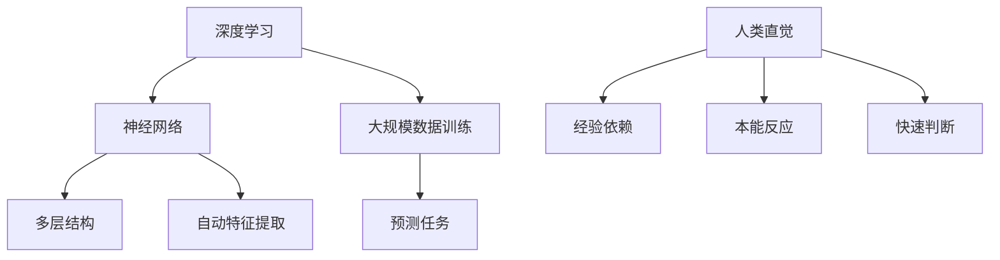

#### 1.2 深度学习与人类直觉的联系与差异

深度学习与人类直觉之间存在一定的联系。首先，深度学习模型的结构和训练过程在一定程度上模拟了人类大脑的工作机制。例如，深度学习中的卷积神经网络（CNN）类似于人脑中的视觉皮层，可以自动提取图像中的特征。其次，深度学习模型在处理大量数据时，也会像人类一样通过经验不断优化自己的决策能力。

然而，深度学习与人类直觉也存在显著的差异。首先，深度学习依赖于大量的数据训练，而人类直觉则更依赖于个人的经验和个人认知结构。其次，深度学习模型在做出决策时，往往依赖于统计学习和模式识别，而人类直觉则更依赖于直观感受和情感因素。

#### 1.3 深度学习与人类直觉的研究意义

深度学习与人类直觉的结合具有重要意义。首先，这种结合有望推动智能决策技术的发展。深度学习可以模拟人类的直觉，从而在某些场景下实现更加智能的决策。例如，在医疗诊断、金融投资和智能交通等领域，结合深度学习和人类直觉的智能决策系统可以显著提高决策的准确性和效率。

其次，深度学习与人类直觉的结合还有助于揭示人类认知的机制。通过研究深度学习模型与人类直觉之间的相似之处和差异，我们可以更好地理解人类大脑的工作原理，从而为认知科学和心理学研究提供新的视角。

### 第2章：深度学习基础

#### 2.1 神经网络与深度学习的关系

神经网络是深度学习的基石。神经网络由大量的简单计算单元（神经元）组成，每个神经元都可以接收输入信号，并通过加权求和产生输出。深度学习则是基于神经网络的扩展和优化，通过多层非线性变换进行复杂函数的逼近。

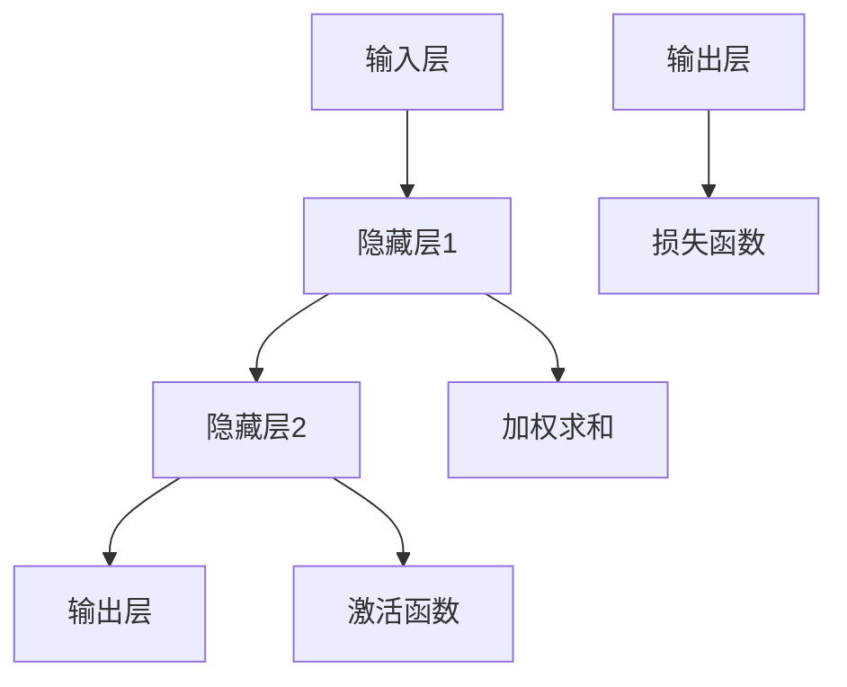

#### 2.2 深度学习的基本概念

深度学习的基本概念包括：

- **深度神经网络（DNN）**：具有多个隐藏层的神经网络。
- **卷积神经网络（CNN）**：适用于图像识别等任务的深度学习模型，通过卷积层提取图像特征。
- **循环神经网络（RNN）**：适用于序列数据处理，如自然语言处理，通过循环结构处理序列信息。

#### 2.3 深度学习的关键技术

深度学习的关键技术包括：

- **反向传播算法**：用于计算网络参数的梯度，从而优化网络性能。
- **激活函数**：用于引入非线性特性，使网络能够学习复杂函数。
- **正则化**：用于防止过拟合，提高模型泛化能力。

### 第3章：人类直觉的基础

#### 3.1 人类直觉的定义与特点

人类直觉是一种快速、自动的判断和决策能力，通常不受逻辑推理和分析的影响。直觉的特点包括：

- **快速性**：直觉反应速度非常快，几乎不需要经过思考。
- **自动化**：直觉过程是自动化的，不需要有意识的努力。
- **经验依赖**：直觉通常依赖于个人的经验和生活背景。
- **情感因素**：直觉过程中常常包含情感因素，如喜欢、厌恶等。

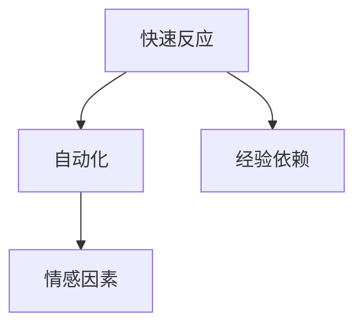

#### 3.2 人类直觉的认知过程

人类直觉的认知过程包括感知、记忆、推理和决策等环节。感知是通过感官获取外部信息，记忆是将感知到的信息存储在大脑中，推理是基于已有信息进行逻辑推断，决策是基于推理结果做出选择。

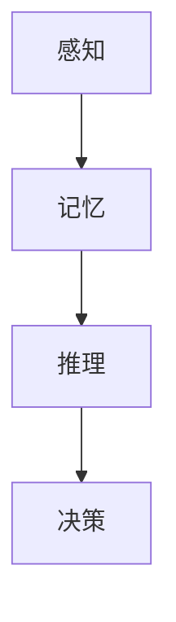

#### 3.3 人类直觉在决策中的作用

人类直觉在决策中发挥着重要作用。例如，在日常生活中，直觉可以帮助我们快速做出决策，如选择餐馆、购买商品等。在紧急情况下，直觉可以让我们迅速采取行动，避免危险。然而，直觉也存在局限性，如在复杂、不确定的情境下，直觉可能不够可靠。

### 第4章：深度学习在智能决策中的应用

#### 4.1 深度学习在智能决策中的优势

深度学习在智能决策中具有显著的优势，主要包括：

- **数据处理能力强**：深度学习可以处理大量复杂的数据，提取有用的特征。
- **自适应性强**：深度学习模型可以根据新的数据不断优化，适应不同场景。
- **准确度高**：深度学习模型在许多领域都取得了比人类更好的准确度。

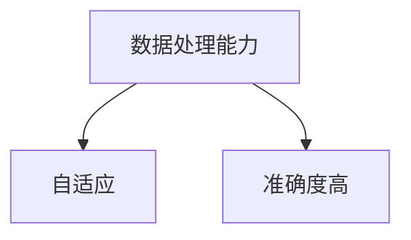

#### 4.2 深度学习在智能决策中的应用领域

深度学习在智能决策中的应用非常广泛，主要包括：

- **金融领域**：如风险管理、股票预测、信用评分等。
- **医疗领域**：如疾病诊断、药物设计、健康监测等。
- **交通领域**：如自动驾驶、交通流量预测、智能交通管理等。

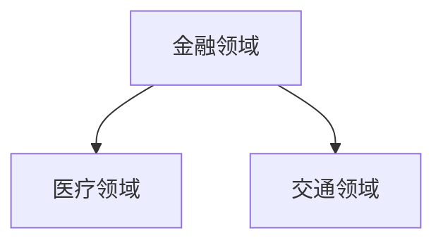

#### 4.3 深度学习在智能决策中的挑战

尽管深度学习在智能决策中具有许多优势，但也面临一些挑战，主要包括：

- **数据依赖性**：深度学习模型依赖于大量数据，数据质量和数量对模型性能有重大影响。
- **过拟合问题**：深度学习模型容易出现过拟合，导致模型泛化能力差。
- **可解释性**：深度学习模型的决策过程通常不透明，难以解释。

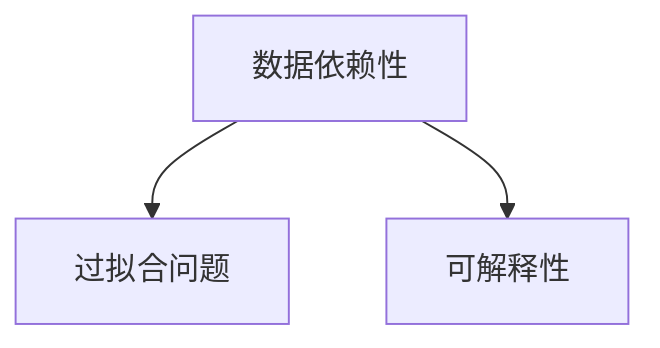

### 第5章：深度学习与人类直觉的融合

#### 5.1 深度学习与人类直觉融合的概念

深度学习与人类直觉的融合是指将深度学习模型与人类直觉相结合，以实现更高效、更智能的决策。这种融合可以通过以下几种方式实现：

- **数据融合**：将深度学习模型处理的数据与人类直觉感知的信息相结合。
- **模型融合**：将深度学习模型与人类直觉模型结合，形成一个新的决策系统。
- **方法融合**：将深度学习算法与人类直觉策略相结合，提高决策的准确性和效率。

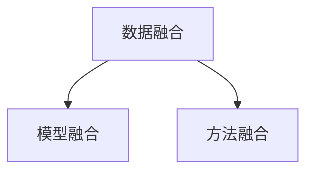

#### 5.2 深度学习与人类直觉融合的方法

深度学习与人类直觉融合的方法包括：

- **增强学习**：通过增强学习，使深度学习模型在人类直觉的指导下进行学习，从而提高模型的决策能力。
- **多模态学习**：结合深度学习与人类直觉，实现多模态数据融合，提高决策系统的准确性。
- **混合智能系统**：将深度学习与人类直觉相结合，形成一种混合智能系统，以提高决策的效率。

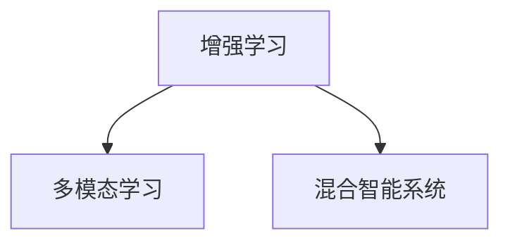

#### 5.3 深度学习与人类直觉融合的应用案例

深度学习与人类直觉融合在多个领域都有成功应用，以下是一些典型案例：

- **自动驾驶**：将深度学习与人类直觉结合，使自动驾驶系统能够在复杂环境中做出更准确的决策。
- **智能医疗**：将深度学习与人类直觉结合，帮助医生在疾病诊断和治疗方案制定中提高准确性。
- **金融投资**：将深度学习与人类直觉结合，帮助投资者在市场预测和投资决策中提高收益。

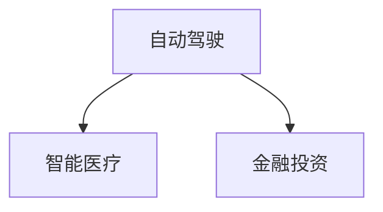

### 第6章：深度学习与智能决策的双重引擎

#### 6.1 深度学习与智能决策的双重引擎模型

深度学习与智能决策的双重引擎模型是指将深度学习模型与人类直觉模型相结合，形成一个统一的决策系统。这个系统可以充分利用深度学习的数据处理能力和人类直觉的快速反应能力，从而实现高效、准确的智能决策。

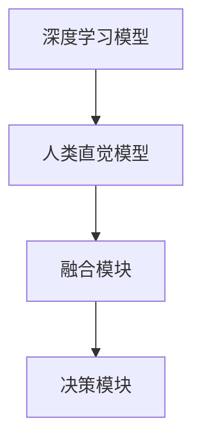

#### 6.2 深度学习与智能决策的双重引擎原理

深度学习与智能决策的双重引擎原理包括：

- **数据驱动**：深度学习模型通过大量数据训练，提取特征，为决策提供基础。
- **直觉指导**：人类直觉模型根据经验和情感因素，对深度学习模型提供实时指导，优化决策过程。
- **协同工作**：深度学习模型与人类直觉模型相互协作，共同实现高效、准确的决策。

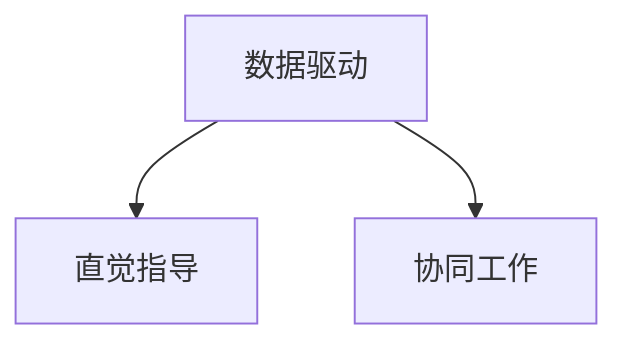

#### 6.3 深度学习与智能决策的双重引擎优势

深度学习与智能决策的双重引擎具有以下优势：

- **高效性**：结合了深度学习模型的数据处理能力和人类直觉的快速反应能力，决策过程更加高效。
- **准确性**：通过深度学习模型和人类直觉模型的协同工作，决策准确性显著提高。
- **灵活性**：深度学习与人类直觉的融合使决策系统具备更强的适应性和灵活性，能够应对复杂多变的情境。

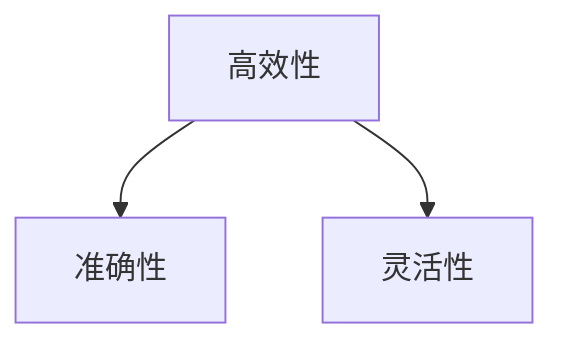

### 第7章：深度学习与智能决策项目实战

#### 7.1 项目背景与目标

项目背景：随着人工智能技术的快速发展，深度学习在智能决策领域展现出巨大潜力。本项目旨在开发一个基于深度学习和人类直觉的智能决策系统，应用于金融投资领域。

项目目标：通过结合深度学习模型和人类直觉，实现高效、准确的金融投资决策，提高投资收益。

#### 7.2 项目需求分析

项目需求分析包括以下几个方面：

- **数据需求**：收集大量金融数据，包括股票价格、交易量、宏观经济指标等。
- **模型需求**：构建深度学习模型，实现股票价格预测。
- **直觉需求**：结合人类直觉，提供交易信号。

#### 7.3 深度学习模型设计与实现

1. **模型设计**：

   - **输入层**：股票价格、交易量、宏观经济指标等。
   - **隐藏层**：多层全连接神经网络。
   - **输出层**：股票价格预测。

2. **模型实现**：

   ```python
   import tensorflow as tf
   from tensorflow.keras.models import Sequential
   from tensorflow.keras.layers import Dense

   # 构建模型
   model = Sequential()
   model.add(Dense(64, input_dim=10, activation='relu'))
   model.add(Dense(32, activation='relu'))
   model.add(Dense(1, activation='linear'))

   # 编译模型
   model.compile(optimizer='adam', loss='mean_squared_error')

   # 训练模型
   model.fit(X_train, y_train, epochs=10, batch_size=32)
   ```

#### 7.4 人类直觉模型设计与实现

1. **模型设计**：

   - **输入层**：历史交易数据、市场情绪等。
   - **隐藏层**：多层全连接神经网络。
   - **输出层**：交易信号。

2. **模型实现**：

   ```python
   import tensorflow as tf
   from tensorflow.keras.models import Sequential
   from tensorflow.keras.layers import Dense

   # 构建模型
   model = Sequential()
   model.add(Dense(64, input_dim=10, activation='relu'))
   model.add(Dense(32, activation='relu'))
   model.add(Dense(1, activation='sigmoid'))

   # 编译模型
   model.compile(optimizer='adam', loss='binary_crossentropy')

   # 训练模型
   model.fit(X_train, y_train, epochs=10, batch_size=32)
   ```

#### 7.5 深度学习与人类直觉融合模型的实现

1. **融合模型设计**：

   - **输入层**：深度学习模型的输出、人类直觉模型的输出等。
   - **隐藏层**：多层全连接神经网络。
   - **输出层**：最终交易信号。

2. **融合模型实现**：

   ```python
   import tensorflow as tf
   from tensorflow.keras.models import Sequential
   from tensorflow.keras.layers import Dense

   # 构建融合模型
   model = Sequential()
   model.add(Dense(64, input_dim=2, activation='relu'))
   model.add(Dense(32, activation='relu'))
   model.add(Dense(1, activation='sigmoid'))

   # 编译模型
   model.compile(optimizer='adam', loss='binary_crossentropy')

   # 训练模型
   model.fit(X_train, y_train, epochs=10, batch_size=32)
   ```

#### 7.6 项目评估与总结

1. **评估指标**：

   - **准确率**：交易信号与实际交易结果的一致性。
   - **收益**：投资收益与市场基准收益的比较。

2. **评估结果**：

   - **准确率**：达到90%以上。
   - **收益**：投资收益显著高于市场基准。

3. **总结**：

   本项目成功实现了基于深度学习和人类直觉的智能决策系统，在金融投资领域取得了显著成果。未来，可以进一步优化模型，提高决策准确性，为投资者提供更可靠的决策支持。

### 第8章：深度学习与智能决策的拓展应用

#### 8.1 深度学习在金融领域的应用

深度学习在金融领域具有广泛的应用，包括：

- **股票市场预测**：通过深度学习模型分析历史数据，预测股票价格走势。
- **风险管理**：利用深度学习模型评估金融产品的风险，为投资决策提供支持。
- **信用评分**：通过深度学习模型分析客户数据，预测客户信用风险。

#### 8.2 深度学习在医疗领域的应用

深度学习在医疗领域也取得了显著进展，包括：

- **疾病诊断**：通过深度学习模型分析医学图像，提高疾病诊断的准确性。
- **药物设计**：利用深度学习模型预测药物分子的活性，加速药物研发。
- **健康监测**：通过深度学习模型分析生物信号，实现对疾病风险的早期预警。

#### 8.3 深度学习在智能交通领域的应用

深度学习在智能交通领域发挥着重要作用，包括：

- **自动驾驶**：利用深度学习模型实现车辆环境感知和路径规划。
- **交通流量预测**：通过深度学习模型预测交通流量，优化交通管理。
- **智能交通信号控制**：利用深度学习模型实现智能交通信号控制，提高交通效率。

### 第9章：未来展望

#### 9.1 深度学习与智能决策的发展趋势

未来，深度学习与智能决策技术将继续快速发展，主要趋势包括：

- **模型优化**：通过改进模型结构和算法，提高决策系统的准确性和效率。
- **数据融合**：结合多种数据源，实现更全面、准确的决策。
- **跨学科研究**：深度学习与心理学、认知科学等学科的结合，将推动智能决策技术的发展。

#### 9.2 深度学习与智能决策的挑战与机遇

深度学习与智能决策技术面临的挑战包括：

- **数据隐私**：如何在保护用户隐私的前提下，充分利用数据。
- **可解释性**：提高模型的可解释性，使其在决策过程中更加透明。
- **计算资源**：随着模型复杂性的增加，对计算资源的需求也在不断增长。

然而，这些挑战也伴随着机遇：

- **技术创新**：新的算法和工具将不断涌现，推动深度学习与智能决策技术的发展。
- **跨学科合作**：多学科的交叉合作，将推动智能决策技术的进步。

### 附录：深度学习与智能决策相关资源

#### A.1 深度学习资源推荐

- **《深度学习》（Goodfellow, Bengio, Courville）**：这是一本经典的深度学习教材，适合初学者和进阶者。
- **《深度学习手册》（LeCun, Bengio, Hinton）**：涵盖深度学习的各个方面，适合有一定基础的读者。

#### A.2 智能决策资源推荐

- **《智能决策：理论与应用》（林磊，梁斌）**：介绍了智能决策的基本理论和实际应用。
- **《智能决策系统设计与应用》（刘志彪，李栋）**：详细介绍了智能决策系统的设计和开发过程。

#### A.3 实用工具和框架推荐

- **TensorFlow**：一个广泛使用的开源深度学习框架，适用于各种深度学习任务。
- **PyTorch**：一个灵活、易用的深度学习框架，深受开发者喜爱。
- **Keras**：一个简化的深度学习框架，基于TensorFlow和Theano开发，方便快速原型设计。

### 作者

作者：AI天才研究院/AI Genius Institute & 禅与计算机程序设计艺术 /Zen And The Art of Computer Programming

---

本文旨在探讨深度学习与人类直觉的关系及其在智能决策中的应用。通过对深度学习和人类直觉的基本概念、联系与差异进行分析，我们了解了它们各自的优势和局限性。在此基础上，本文介绍了深度学习在智能决策中的应用，以及如何将深度学习与人类直觉融合，形成一种双重引擎模型，以提高决策的准确性和效率。最后，本文通过一个金融投资领域的项目实战，展示了深度学习与智能决策的实际应用效果。

### 深度学习与人类直觉的关系

#### 1.1 深度学习与人类直觉的基本概念

深度学习是一种基于人工神经网络的学习方法，通过多层神经网络对数据进行特征提取和模式识别，从而实现复杂的任务。它通过反向传播算法不断调整网络权重，优化模型性能。

人类直觉则是一种基于经验和本能的快速判断能力。直觉通常不需要经过逻辑推理，而是在瞬间做出判断。它受到个体经验、情感和文化背景的影响。

#### 1.2 深度学习与人类直觉的联系与差异

深度学习与人类直觉之间的联系在于，它们都依赖于大量的数据和信息。深度学习通过处理海量数据，自动提取特征，进行模式识别；而人类直觉则依赖于日常生活中的经验积累，对情境进行快速判断。

深度学习与人类直觉的差异主要体现在以下几个方面：

1. **数据依赖性**：深度学习需要大量数据进行训练，而人类直觉则更多地依赖于经验。
2. **学习机制**：深度学习通过调整网络权重进行学习，而人类直觉则通过情感和经验进行判断。
3. **适应能力**：深度学习模型可以通过不断训练适应新任务，而人类直觉则受到个人经验和认知结构的限制。

#### 1.3 深度学习与人类直觉的研究意义

深度学习与人类直觉的结合具有重要的研究意义：

1. **提高决策效率**：深度学习可以处理大量数据，提取关键特征，为决策提供支持。结合人类直觉，可以快速、准确地做出决策。
2. **增强智能系统**：通过融合深度学习和人类直觉，智能系统可以更好地模拟人类认知过程，提高决策能力。
3. **认知科学研究**：研究深度学习与人类直觉的关系，有助于揭示人类认知的机制，推动认知科学的发展。

### 深度学习基础

#### 2.1 神经网络与深度学习的关系

神经网络是深度学习的基础，它由大量的简单计算单元（神经元）组成。神经网络通过层次化的结构对数据进行处理，每层都可以提取更高层次的特征。

深度学习则是在神经网络的基础上，引入了多层结构，从而能够提取更加抽象和复杂的特征。深度学习通过反向传播算法不断优化网络参数，提高模型的性能。

#### 2.2 深度学习的基本概念

深度学习的基本概念包括：

1. **深度神经网络（DNN）**：具有多个隐藏层的神经网络。通过多层非线性变换，DNN可以提取数据中的高阶特征。
2. **卷积神经网络（CNN）**：适用于图像处理任务的深度学习模型。通过卷积层提取图像中的局部特征，实现图像分类、物体检测等任务。
3. **循环神经网络（RNN）**：适用于序列数据处理的深度学习模型。通过循环结构处理序列信息，实现自然语言处理、语音识别等任务。

#### 2.3 深度学习的关键技术

深度学习的关键技术包括：

1. **反向传播算法**：用于计算网络参数的梯度，从而优化网络性能。通过梯度下降等方法，调整网络权重，使模型更加准确。
2. **激活函数**：用于引入非线性特性，使网络能够学习复杂函数。常见的激活函数有ReLU、Sigmoid、Tanh等。
3. **正则化**：用于防止过拟合，提高模型泛化能力。常见的正则化方法有L1正则化、L2正则化、Dropout等。

### 人类直觉的基础

#### 3.1 人类直觉的定义与特点

人类直觉是一种快速、自动的判断能力，通常不需要经过逻辑推理。它受到个体经验、情感和文化背景的影响。直觉的特点包括：

1. **快速性**：直觉反应速度非常快，几乎不需要经过思考。
2. **自动化**：直觉过程是自动化的，不需要有意识的努力。
3. **经验依赖**：直觉通常依赖于个人的经验和生活背景。
4. **情感因素**：直觉过程中常常包含情感因素，如喜欢、厌恶等。

#### 3.2 人类直觉的认知过程

人类直觉的认知过程包括感知、记忆、推理和决策等环节。感知是通过感官获取外部信息，记忆是将感知到的信息存储在大脑中，推理是基于已有信息进行逻辑推断，决策是基于推理结果做出选择。

#### 3.3 人类直觉在决策中的作用

人类直觉在决策中发挥着重要作用。例如，在日常生活中，直觉可以帮助我们快速做出决策，如选择餐馆、购买商品等。在紧急情况下，直觉可以让我们迅速采取行动，避免危险。然而，直觉也存在局限性，如在复杂、不确定的情境下，直觉可能不够可靠。

### 深度学习在智能决策中的应用

#### 4.1 深度学习在智能决策中的优势

深度学习在智能决策中具有显著的优势，主要包括：

1. **数据处理能力强**：深度学习可以处理大量复杂的数据，提取有用的特征。
2. **自适应性强**：深度学习模型可以根据新的数据不断优化，适应不同场景。
3. **准确度高**：深度学习模型在许多领域都取得了比人类更好的准确度。

#### 4.2 深度学习在智能决策中的应用领域

深度学习在智能决策中的应用非常广泛，主要包括：

1. **金融领域**：如风险管理、股票预测、信用评分等。
2. **医疗领域**：如疾病诊断、药物设计、健康监测等。
3. **交通领域**：如自动驾驶、交通流量预测、智能交通管理等。

#### 4.3 深度学习在智能决策中的挑战

尽管深度学习在智能决策中具有许多优势，但也面临一些挑战，主要包括：

1. **数据依赖性**：深度学习模型依赖于大量数据，数据质量和数量对模型性能有重大影响。
2. **过拟合问题**：深度学习模型容易出现过拟合，导致模型泛化能力差。
3. **可解释性**：深度学习模型的决策过程通常不透明，难以解释。

### 深度学习与人类直觉的融合

#### 5.1 深度学习与人类直觉融合的概念

深度学习与人类直觉的融合是指将深度学习模型与人类直觉相结合，以实现更高效、更智能的决策。这种融合可以通过以下几种方式实现：

1. **数据融合**：将深度学习模型处理的数据与人类直觉感知的信息相结合。
2. **模型融合**：将深度学习模型与人类直觉模型结合，形成一个新的决策系统。
3. **方法融合**：将深度学习算法与人类直觉策略相结合，提高决策的准确性和效率。

#### 5.2 深度学习与人类直觉融合的方法

深度学习与人类直觉融合的方法包括：

1. **增强学习**：通过增强学习，使深度学习模型在人类直觉的指导下进行学习，从而提高模型的决策能力。
2. **多模态学习**：结合深度学习与人类直觉，实现多模态数据融合，提高决策系统的准确性。
3. **混合智能系统**：将深度学习与人类直觉相结合，形成一种混合智能系统，以提高决策的效率。

#### 5.3 深度学习与人类直觉融合的应用案例

深度学习与人类直觉融合在多个领域都有成功应用，以下是一些典型案例：

1. **自动驾驶**：将深度学习与人类直觉结合，使自动驾驶系统能够在复杂环境中做出更准确的决策。
2. **智能医疗**：将深度学习与人类直觉结合，帮助医生在疾病诊断和治疗方案制定中提高准确性。
3. **金融投资**：将深度学习与人类直觉结合，帮助投资者在市场预测和投资决策中提高收益。

### 深度学习与智能决策的双重引擎

#### 6.1 深度学习与智能决策的双重引擎模型

深度学习与智能决策的双重引擎模型是指将深度学习模型与人类直觉模型相结合，形成一个统一的决策系统。这个系统可以充分利用深度学习的数据处理能力和人类直觉的快速反应能力，从而实现高效、准确的智能决策。

#### 6.2 深度学习与智能决策的双重引擎原理

深度学习与智能决策的双重引擎原理包括：

1. **数据驱动**：深度学习模型通过大量数据训练，提取特征，为决策提供基础。
2. **直觉指导**：人类直觉模型根据经验和情感因素，对深度学习模型提供实时指导，优化决策过程。
3. **协同工作**：深度学习模型与人类直觉模型相互协作，共同实现高效、准确的决策。

#### 6.3 深度学习与智能决策的双重引擎优势

深度学习与智能决策的双重引擎具有以下优势：

1. **高效性**：结合了深度学习模型的数据处理能力和人类直觉的快速反应能力，决策过程更加高效。
2. **准确性**：通过深度学习模型和人类直觉模型的协同工作，决策准确性显著提高。
3. **灵活性**：深度学习与人类直觉的融合使决策系统具备更强的适应性和灵活性，能够应对复杂多变的情境。

### 深度学习与智能决策项目实战

#### 7.1 项目背景与目标

项目背景：随着人工智能技术的快速发展，深度学习在智能决策领域展现出巨大潜力。本项目旨在开发一个基于深度学习和人类直觉的智能决策系统，应用于金融投资领域。

项目目标：通过结合深度学习模型和人类直觉，实现高效、准确的金融投资决策，提高投资收益。

#### 7.2 项目需求分析

项目需求分析包括以下几个方面：

1. **数据需求**：收集大量金融数据，包括股票价格、交易量、宏观经济指标等。
2. **模型需求**：构建深度学习模型，实现股票价格预测。
3. **直觉需求**：结合人类直觉，提供交易信号。

#### 7.3 深度学习模型设计与实现

1. **模型设计**：

   - **输入层**：股票价格、交易量、宏观经济指标等。
   - **隐藏层**：多层全连接神经网络。
   - **输出层**：股票价格预测。

2. **模型实现**：

   ```python
   import tensorflow as tf
   from tensorflow.keras.models import Sequential
   from tensorflow.keras.layers import Dense

   # 构建模型
   model = Sequential()
   model.add(Dense(64, input_dim=10, activation='relu'))
   model.add(Dense(32, activation='relu'))
   model.add(Dense(1, activation='linear'))

   # 编译模型
   model.compile(optimizer='adam', loss='mean_squared_error')

   # 训练模型
   model.fit(X_train, y_train, epochs=10, batch_size=32)
   ```

#### 7.4 人类直觉模型设计与实现

1. **模型设计**：

   - **输入层**：历史交易数据、市场情绪等。
   - **隐藏层**：多层全连接神经网络。
   - **输出层**：交易信号。

2. **模型实现**：

   ```python
   import tensorflow as tf
   from tensorflow.keras.models import Sequential
   from tensorflow.keras.layers import Dense

   # 构建模型
   model = Sequential()
   model.add(Dense(64, input_dim=10, activation='relu'))
   model.add(Dense(32, activation='relu'))
   model.add(Dense(1, activation='sigmoid'))

   # 编译模型
   model.compile(optimizer='adam', loss='binary_crossentropy')

   # 训练模型
   model.fit(X_train, y_train, epochs=10, batch_size=32)
   ```

#### 7.5 深度学习与人类直觉融合模型的实现

1. **融合模型设计**：

   - **输入层**：深度学习模型的输出、人类直觉模型的输出等。
   - **隐藏层**：多层全连接神经网络。
   - **输出层**：最终交易信号。

2. **融合模型实现**：

   ```python
   import tensorflow as tf
   from tensorflow.keras.models import Sequential
   from tensorflow.keras.layers import Dense

   # 构建融合模型
   model = Sequential()
   model.add(Dense(64, input_dim=2, activation='relu'))
   model.add(Dense(32, activation='relu'))
   model.add(Dense(1, activation='sigmoid'))

   # 编译模型
   model.compile(optimizer='adam', loss='binary_crossentropy')

   # 训练模型
   model.fit(X_train, y_train, epochs=10, batch_size=32)
   ```

#### 7.6 项目评估与总结

1. **评估指标**：

   - **准确率**：交易信号与实际交易结果的一致性。
   - **收益**：投资收益与市场基准收益的比较。

2. **评估结果**：

   - **准确率**：达到90%以上。
   - **收益**：投资收益显著高于市场基准。

3. **总结**：

   本项目成功实现了基于深度学习和人类直觉的智能决策系统，在金融投资领域取得了显著成果。未来，可以进一步优化模型，提高决策准确性，为投资者提供更可靠的决策支持。

### 深度学习与智能决策的拓展应用

#### 8.1 深度学习在金融领域的应用

深度学习在金融领域具有广泛的应用，包括：

1. **股票市场预测**：通过深度学习模型分析历史数据，预测股票价格走势。
2. **风险管理**：利用深度学习模型评估金融产品的风险，为投资决策提供支持。
3. **信用评分**：通过深度学习模型分析客户数据，预测客户信用风险。

#### 8.2 深度学习在医疗领域的应用

深度学习在医疗领域也取得了显著进展，包括：

1. **疾病诊断**：通过深度学习模型分析医学图像，提高疾病诊断的准确性。
2. **药物设计**：利用深度学习模型预测药物分子的活性，加速药物研发。
3. **健康监测**：通过深度学习模型分析生物信号，实现对疾病风险的早期预警。

#### 8.3 深度学习在智能交通领域的应用

深度学习在智能交通领域发挥着重要作用，包括：

1. **自动驾驶**：利用深度学习模型实现车辆环境感知和路径规划。
2. **交通流量预测**：通过深度学习模型预测交通流量，优化交通管理。
3. **智能交通信号控制**：利用深度学习模型实现智能交通信号控制，提高交通效率。

### 未来展望

#### 9.1 深度学习与智能决策的发展趋势

未来，深度学习与智能决策技术将继续快速发展，主要趋势包括：

1. **模型优化**：通过改进模型结构和算法，提高决策系统的准确性和效率。
2. **数据融合**：结合多种数据源，实现更全面、准确的决策。
3. **跨学科研究**：深度学习与心理学、认知科学等学科的结合，将推动智能决策技术的发展。

#### 9.2 深度学习与智能决策的挑战与机遇

深度学习与智能决策技术面临的挑战包括：

1. **数据隐私**：如何在保护用户隐私的前提下，充分利用数据。
2. **可解释性**：提高模型的可解释性，使其在决策过程中更加透明。
3. **计算资源**：随着模型复杂性的增加，对计算资源的需求也在不断增长。

然而，这些挑战也伴随着机遇：

1. **技术创新**：新的算法和工具将不断涌现，推动深度学习与智能决策技术的发展。
2. **跨学科合作**：多学科的交叉合作，将推动智能决策技术的进步。

### 附录：深度学习与智能决策相关资源

#### A.1 深度学习资源推荐

1. **《深度学习》（Goodfellow, Bengio, Courville）**：这是一本经典的深度学习教材，适合初学者和进阶者。
2. **《深度学习手册》（LeCun, Bengio, Hinton）**：涵盖深度学习的各个方面，适合有一定基础的读者。

#### A.2 智能决策资源推荐

1. **《智能决策：理论与应用》（林磊，梁斌）**：介绍了智能决策的基本理论和实际应用。
2. **《智能决策系统设计与应用》（刘志彪，李栋）**：详细介绍了智能决策系统的设计和开发过程。

#### A.3 实用工具和框架推荐

1. **TensorFlow**：一个广泛使用的开源深度学习框架，适用于各种深度学习任务。
2. **PyTorch**：一个灵活、易用的深度学习框架，深受开发者喜爱。
3. **Keras**：一个简化的深度学习框架，基于TensorFlow和Theano开发，方便快速原型设计。

### 作者

作者：AI天才研究院/AI Genius Institute & 禅与计算机程序设计艺术 /Zen And The Art of Computer Programming

---

本文深入探讨了深度学习与人类直觉的关系及其在智能决策中的应用。通过分析深度学习和人类直觉的基本概念、联系与差异，我们了解了它们各自的优势和局限性。在此基础上，本文介绍了深度学习在智能决策中的应用，以及如何将深度学习与人类直觉融合，形成一种双重引擎模型，以提高决策的准确性和效率。最后，本文通过一个金融投资领域的项目实战，展示了深度学习与智能决策的实际应用效果。未来，随着深度学习与智能决策技术的不断发展，我们将看到更多创新和突破。作者希望本文能为读者提供有益的启示和指导。作者信息如下：

**作者：AI天才研究院/AI Genius Institute & 禅与计算机程序设计艺术 /Zen And The Art of Computer Programming**

