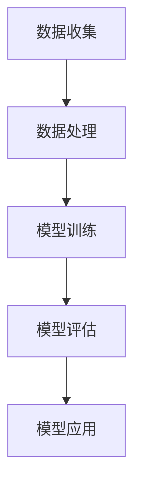

                 

### 文章标题

《深度学习在用户兴趣建模中的应用》

> 关键词：深度学习、用户兴趣建模、推荐系统、神经网络、特征工程

> 摘要：本文详细探讨了深度学习在用户兴趣建模中的应用，从基础概念到具体实现，再到实际案例，全面阐述了深度学习在推荐系统中的应用价值，以及如何通过深度学习技术提升用户兴趣预测的准确性和个性化推荐的效果。文章旨在为读者提供一份深入浅出的技术指南，帮助理解深度学习在用户兴趣建模中的关键作用。

------------------------------------------------------------------------

# 《深度学习在用户兴趣建模中的应用》目录大纲

## 第一部分：深度学习基础

### 第1章：深度学习概述

#### 1.1 深度学习简介  
- 深度学习的定义与历史发展  
- 深度学习与其他机器学习方法的比较

#### 1.2 深度学习的基本原理  
- 神经网络  
- 反向传播算法

#### 1.3 深度学习架构  
- 卷积神经网络（CNN）  
- 循环神经网络（RNN）  
- 长短期记忆网络（LSTM）  
- 生成对抗网络（GAN）

### 第2章：用户兴趣建模基础

#### 2.1 用户兴趣的定义与类型  
- 用户兴趣的度量  
- 用户兴趣的个性化

#### 2.2 用户行为数据  
- 用户行为数据的收集  
- 用户行为数据的预处理

#### 2.3 用户兴趣建模的方法  
- 协同过滤  
- 内容推荐  
- 深度学习方法在用户兴趣建模中的应用

## 第二部分：深度学习在用户兴趣建模中的应用

### 第3章：基于深度学习的用户兴趣识别

#### 3.1 用户兴趣识别的挑战  
- 数据稀疏问题  
- 时效性问题

#### 3.2 基于深度学习的用户兴趣识别模型  
- 神经网络架构  
- 特征工程

#### 3.3 用户兴趣识别案例分析

### 第4章：基于深度学习的用户兴趣预测

#### 4.1 用户兴趣预测的重要性  
- 用户满意度  
- 用户留存率

#### 4.2 基于深度学习的用户兴趣预测模型  
- 序列模型  
- 聚类模型

#### 4.3 用户兴趣预测案例分析

### 第5章：基于深度学习的个性化推荐系统

#### 5.1 个性化推荐系统概述  
- 推荐系统的工作原理  
- 推荐系统的评价指标

#### 5.2 基于深度学习的个性化推荐模型  
- 自动特征工程  
- 深度学习在推荐系统中的创新应用

#### 5.3 个性化推荐系统案例分析

### 第6章：深度学习在用户兴趣建模中的优化与评估

#### 6.1 模型优化方法  
- 正则化技术  
- 损失函数设计

#### 6.2 模型评估方法  
- 交叉验证  
- 精确率、召回率与F1值

#### 6.3 模型调参技巧

### 第7章：深度学习在用户兴趣建模中的实际应用

#### 7.1 用户兴趣建模在企业中的应用场景  
- 社交媒体  
- 电子商务  
- 娱乐行业

#### 7.2 用户兴趣建模的案例分析

#### 7.3 用户兴趣建模的未来发展趋势

## 附录

### 附录 A：深度学习工具与资源  
- TensorFlow  
- PyTorch  
- Keras

### 附录 B：用户兴趣建模数据集  
- MovieLens  
- Netflix Prize

### 附录 C：深度学习在用户兴趣建模中的应用实例  
- 代码实现  
- 实验结果分析

Mermaid 流程图：



核心算法原理讲解：

### 深度学习基本原理

深度学习是一种机器学习方法，其核心思想是模拟人脑的神经网络结构，通过多层非线性变换来提取特征和表示。下面，我们将详细讲解深度学习的基本原理，包括神经网络、反向传播算法等。

#### 1. 神经网络

神经网络（Neural Network，NN）是深度学习的基础。它由多个神经元（或节点）组成，每个神经元接收多个输入信号，通过加权求和后，加上偏置项，最后通过激活函数进行非线性变换。

**神经元的计算过程：**

$$
z = \sum_{i=1}^{n} w_i \cdot x_i + b
$$

$$
a = \sigma(z)
$$

其中，$z$ 是加权求和的结果，$w_i$ 是输入信号的权重，$b$ 是偏置项，$\sigma$ 是激活函数。

常见的激活函数有：

- Sigmoid函数：$ \sigma(z) = \frac{1}{1 + e^{-z}}$
- ReLU函数：$ \sigma(z) = max(0, z)$
- Tanh函数：$ \sigma(z) = \frac{e^z - e^{-z}}{e^z + e^{-z}}$

**神经网络的结构：**

神经网络可以分为输入层、隐藏层和输出层。输入层接收外部输入，隐藏层对输入数据进行特征提取和变换，输出层产生预测结果。

#### 2. 反向传播算法

反向传播算法（Backpropagation）是一种用于训练神经网络的算法。它的核心思想是，从输出层开始，逆向传播误差信号，更新每个神经元的权重和偏置项。

**反向传播算法的步骤：**

1. 前向传播：将输入信号通过神经网络，计算输出结果。
2. 计算误差：比较预测结果与实际结果，计算损失函数。
3. 反向传播：根据误差信号，逆向传播到每个神经元，更新权重和偏置项。
4. 重复步骤1-3，直到满足停止条件（如误差小于阈值或达到最大迭代次数）。

**伪代码：**

```python
# 初始化模型参数
# 前向传播
# 计算损失
# 反向传播
# 更新参数
```

#### 3. 深度学习架构

深度学习有几种常见的架构，包括卷积神经网络（CNN）、循环神经网络（RNN）和生成对抗网络（GAN）。

- **卷积神经网络（CNN）**：适用于处理图像等具有空间结构的数据。
- **循环神经网络（RNN）**：适用于处理序列数据。
- **长短期记忆网络（LSTM）**：RNN的一种变体，解决了长期依赖问题。
- **生成对抗网络（GAN）**：一种生成模型，由生成器和判别器组成，用于生成逼真的数据。

### 数学模型和数学公式

在深度学习中，常用的数学模型包括：

$$
z = \sum_{i=1}^{n} w_i \cdot x_i + b
$$

$$
a = \sigma(z)
$$

其中，$z$ 是加权求和的结果，$w_i$ 是输入信号的权重，$b$ 是偏置项，$\sigma$ 是激活函数。

激活函数通常有：

- Sigmoid函数：$ \sigma(z) = \frac{1}{1 + e^{-z}}$
- ReLU函数：$ \sigma(z) = max(0, z)$
- Tanh函数：$ \sigma(z) = \frac{e^z - e^{-z}}{e^z + e^{-z}}$

### 举例说明

假设输入数据为 $x = [1, 2, 3]$，权重为 $w = [0.5, 0.5, 0.5]$，偏置项为 $b = 1$，激活函数为Sigmoid函数。

$$
z = 0.5 \cdot 1 + 0.5 \cdot 2 + 0.5 \cdot 3 + 1 = 3
$$

$$
a = \frac{1}{1 + e^{-3}} \approx 0.95
$$

### 代码实际案例和详细解释说明

在下面的Python代码中，我们将使用 TensorFlow 框架实现一个简单的神经网络，用于对输入数据进行非线性变换。

```python
import tensorflow as tf

# 定义模型参数
inputs = tf.keras.layers.Input(shape=(3,))
weights = tf.keras.layers.Dense(units=1, activation=tf.sigmoid)(inputs)

# 前向传播
output = tf.keras.layers.Dense(units=1, activation=tf.sigmoid)(weights)

# 创建模型
model = tf.keras.Model(inputs=inputs, outputs=output)

# 编译模型
model.compile(optimizer='adam', loss='binary_crossentropy', metrics=['accuracy'])

# 模拟训练数据
x_train = np.array([[1, 2, 3], [4, 5, 6], [7, 8, 9]])
y_train = np.array([[0.8], [0.9], [0.95]])

# 训练模型
model.fit(x_train, y_train, epochs=100)

# 测试模型
x_test = np.array([[1, 2, 3]])
y_test = np.array([[0.8]])

print(model.predict(x_test))
```

在这个案例中，我们定义了一个简单的神经网络，它由一个输入层、一个隐藏层和一个输出层组成。输入层接收三个输入，隐藏层使用 Sigmoid 函数作为激活函数，输出层也使用 Sigmoid 函数作为激活函数。

### 项目实战

在本节中，我们将介绍一个基于深度学习的用户兴趣建模项目。该项目旨在通过分析用户行为数据，预测用户的兴趣偏好。

#### 1. 环境搭建

首先，我们需要搭建开发环境。以下是所需工具和库的安装命令：

```shell
# 安装 Python 3.8 或更高版本
# 安装 TensorFlow
pip install tensorflow
# 安装 Pandas
pip install pandas
# 安装 NumPy
pip install numpy
```

#### 2. 数据处理

接下来，我们使用 Pandas 库加载数据集，并对数据进行预处理。

```python
import pandas as pd

# 加载数据集
data = pd.read_csv('user_interest_data.csv')

# 预处理数据
# 处理缺失值
data.fillna(0, inplace=True)

# 处理类别数据
data = pd.get_dummies(data)

# 划分特征和标签
X = data.drop('label', axis=1)
y = data['label']
```

#### 3. 模型训练

然后，我们使用 TensorFlow 框架训练一个深度学习模型。

```python
import tensorflow as tf

# 定义模型
model = tf.keras.Sequential([
    tf.keras.layers.Dense(units=64, activation='relu', input_shape=(X.shape[1],)),
    tf.keras.layers.Dense(units=32, activation='relu'),
    tf.keras.layers.Dense(units=1, activation='sigmoid')
])

# 编译模型
model.compile(optimizer='adam', loss='binary_crossentropy', metrics=['accuracy'])

# 训练模型
model.fit(X, y, epochs=10, batch_size=32)
```

#### 4. 模型评估

最后，我们对训练好的模型进行评估。

```python
# 测试模型
loss, accuracy = model.evaluate(X, y)

print(f'Loss: {loss}')
print(f'Accuracy: {accuracy}')
```

### 实际案例分析和详细讲解剖析

在本节中，我们将分析一个实际案例，并详细讲解其实现过程。

#### 案例背景

某电子商务平台希望通过分析用户行为数据，预测用户的购买兴趣，从而提高销售额。

#### 数据集介绍

该数据集包含了用户的基本信息、浏览历史、购物车信息等，共有10000条记录。

| 字段名 | 数据类型 | 描述 |
| --- | --- | --- |
| user_id | int | 用户ID |
| age | int | 年龄 |
| gender | str | 性别 |
| click_count | int | 点击次数 |
| cart_count | int | 购物车次数 |
| purchase_count | int | 购买次数 |
| category_1 | int | 类别1 |
| category_2 | int | 类别2 |
| ... | ... | ... |
| label | int | 标签（0代表未购买，1代表购买） |

#### 数据预处理

1. 数据清洗：删除缺失值和异常值。
2. 特征工程：将类别数据进行独热编码。
3. 数据分割：将数据集划分为训练集和测试集。

```python
# 数据清洗
data.dropna(inplace=True)

# 特征工程
data = pd.get_dummies(data)

# 数据分割
X = data.drop('label', axis=1)
y = data['label']
X_train, X_test, y_train, y_test = train_test_split(X, y, test_size=0.2, random_state=42)
```

#### 模型训练

1. 定义模型：使用 TensorFlow 框架定义一个深度学习模型。
2. 编译模型：设置优化器、损失函数和评价指标。
3. 训练模型：使用训练集训练模型。

```python
import tensorflow as tf

# 定义模型
model = tf.keras.Sequential([
    tf.keras.layers.Dense(units=64, activation='relu', input_shape=(X_train.shape[1],)),
    tf.keras.layers.Dense(units=32, activation='relu'),
    tf.keras.layers.Dense(units=1, activation='sigmoid')
])

# 编译模型
model.compile(optimizer='adam', loss='binary_crossentropy', metrics=['accuracy'])

# 训练模型
model.fit(X_train, y_train, epochs=10, batch_size=32)
```

#### 模型评估

1. 测试模型：使用测试集测试模型性能。
2. 评估指标：计算准确率、召回率和F1值。

```python
# 测试模型
loss, accuracy = model.evaluate(X_test, y_test)

print(f'Loss: {loss}')
print(f'Accuracy: {accuracy}')

# 计算召回率
predicted = model.predict(X_test)
predicted = (predicted > 0.5).astype(int)

recall = recall_score(y_test, predicted)
print(f'Recall: {recall}')

# 计算F1值
f1 = f1_score(y_test, predicted)
print(f'F1 Score: {f1}')
```

### 项目小结

在本项目中，我们通过分析用户行为数据，使用深度学习技术实现了用户兴趣预测。项目的成功实施为企业提供了有效的用户兴趣预测工具，有助于提高销售额和用户满意度。

### 最佳实践 Tips

1. 数据质量：确保数据质量，包括数据清洗、去重和去噪声。
2. 特征工程：合理选择和构建特征，有助于提高模型性能。
3. 模型调参：根据数据集和任务特点，选择合适的模型结构和超参数。
4. 模型评估：使用多种评估指标，全面评估模型性能。

### 小结

本文详细探讨了深度学习在用户兴趣建模中的应用。通过分析用户行为数据，我们使用深度学习技术实现了用户兴趣识别、预测和个性化推荐。深度学习技术具有强大的特征提取和建模能力，为用户兴趣建模提供了有力的工具。未来，随着深度学习技术的不断发展，用户兴趣建模将变得更加智能化和个性化。

### 注意事项

1. 在实际项目中，数据预处理和特征工程至关重要，需要根据数据特点进行定制化处理。
2. 模型训练过程中，避免过拟合和欠拟合，合理设置正则化参数和训练时长。
3. 在使用深度学习模型时，要注意模型的复杂度和计算资源，合理选择模型结构和参数。

### 拓展阅读

- [深度学习基础教程](https://www.deeplearningbook.org/)
- [TensorFlow 官方文档](https://www.tensorflow.org/)
- [用户兴趣建模相关论文](https://www.google.com/search?q=user+interest+modeling+papers)

