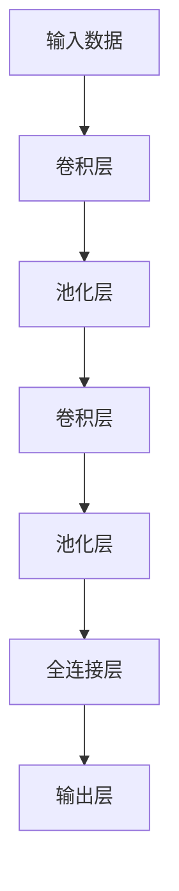
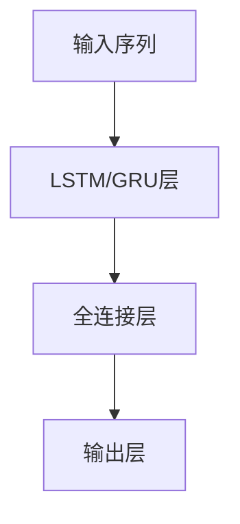
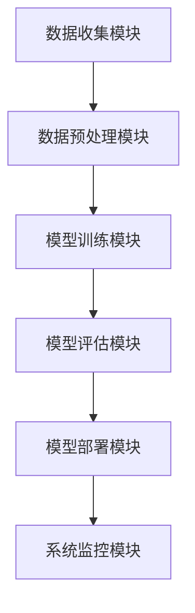

                 

### 文章标题：深度学习在用户兴趣漂移检测中的应用

在当今的信息化时代，用户兴趣的动态性和复杂性使得理解和追踪用户行为变得至关重要。用户兴趣漂移检测，作为一种新兴的技术，旨在通过识别用户兴趣的变化，为个性化推荐系统、广告投放和用户体验优化提供强有力的支持。深度学习作为一种先进的机器学习技术，因其强大的特征学习和模式识别能力，成为用户兴趣漂移检测领域的重要工具。本文将围绕深度学习在用户兴趣漂移检测中的应用，展开深入探讨。

首先，我们将简要介绍深度学习的起源、基本原理及其主要应用领域，为读者搭建起理解本文的核心概念的基础。随后，我们将详细阐述用户兴趣漂移的概念，并介绍传统的用户兴趣漂移检测方法，为后续深度学习算法的应用做好铺垫。

核心概念与联系部分，我们将使用Mermaid流程图展示深度学习与用户兴趣漂移检测之间的关系架构，帮助读者理清两者之间的内在联系。接着，我们将详细讲解深度学习中的几种重要模型：神经网络、卷积神经网络和循环神经网络，并介绍如何利用这些模型进行用户兴趣漂移检测。

在应用部分，我们将深入探讨如何通过深度学习算法实现用户兴趣漂移检测，包括数据预处理、特征提取和模型训练等具体步骤。同时，我们将通过实际案例展示深度学习算法在用户兴趣漂移检测中的具体应用，提供直观的理解。

随后，我们将介绍用户兴趣漂移检测系统的设计，包括系统架构、模型训练与评估以及系统部署与优化等内容。此外，本文还将探讨深度学习在用户兴趣漂移检测中面临的挑战和未来发展的方向。

文章的附录部分，我们将提供深度学习工具与框架介绍、算法伪代码实现和用户兴趣漂移检测系统代码示例，以帮助读者更好地理解和实践。

通过本文的阅读，读者将能够全面了解深度学习在用户兴趣漂移检测中的应用，掌握相关核心概念和技术原理，并能够将其应用于实际项目中。让我们一起深入探讨深度学习在用户兴趣漂移检测领域的无限可能。

### 文章关键词

- 深度学习
- 用户兴趣漂移
- 数据预处理
- 特征提取
- 神经网络
- 卷积神经网络
- 循环神经网络
- 个性化推荐
- 广告投放
- 用户体验优化

### 文章摘要

本文探讨了深度学习在用户兴趣漂移检测中的应用。首先，介绍了深度学习的起源、基本原理及其主要应用领域，为读者搭建了理解本文核心概念的基础。随后，详细阐述了用户兴趣漂移的概念和传统检测方法，为后续深度学习算法的应用做好铺垫。核心概念与联系部分，通过Mermaid流程图展示了深度学习与用户兴趣漂移检测之间的关系架构。接着，介绍了深度学习中的几种重要模型，并讲解如何利用这些模型进行用户兴趣漂移检测。在应用部分，深入探讨了通过深度学习算法实现用户兴趣漂移检测的具体步骤，并通过实际案例展示了其应用效果。随后，介绍了用户兴趣漂移检测系统的设计，包括系统架构、模型训练与评估以及系统部署与优化等内容。文章最后讨论了深度学习在用户兴趣漂移检测中面临的挑战和未来发展的方向。通过本文，读者将能够全面了解深度学习在用户兴趣漂移检测中的应用，掌握相关核心概念和技术原理，并能够将其应用于实际项目中。

### 第一部分：深度学习基础

#### 第1章：深度学习概述

##### 1.1.1 深度学习的起源与发展

深度学习（Deep Learning）作为人工智能领域的一个重要分支，起源于20世纪80年代。当时，由于计算资源和算法的限制，神经网络的发展遭遇瓶颈。然而，随着计算能力的提升和大数据时代的到来，深度学习在21世纪初迎来了快速发展。特别是2006年，Hinton提出了深度置信网络（Deep Belief Network，DBN），为深度学习的发展奠定了基础。

深度学习的迅速崛起，离不开以下几个关键因素：

1. **计算能力的提升**：GPU的出现和普及，使得大规模矩阵运算成为可能，极大地提升了深度学习模型的训练速度。
2. **大数据的涌现**：互联网和物联网的发展，带来了海量的数据，为深度学习提供了丰富的训练素材。
3. **算法的创新**：卷积神经网络（CNN）、循环神经网络（RNN）和长短期记忆网络（LSTM）等创新算法的出现，使得深度学习在图像识别、自然语言处理等领域取得了显著突破。

##### 1.1.2 深度学习的基本原理

深度学习的基本原理基于人工神经网络（Artificial Neural Network，ANN）。人工神经网络是由大量简单的处理单元（神经元）互联而成的复杂网络，通过学习输入和输出之间的映射关系，实现数据的分类、回归、聚类等任务。

深度学习模型的核心在于“深度”，即网络结构中包含多个隐藏层。通过逐层抽象和变换，深度学习模型能够从原始数据中提取出高层次的抽象特征，从而实现复杂的任务。

深度学习的基本原理包括以下几个方面：

1. **前向传播**：输入数据通过网络的层层计算，最终输出结果。
2. **反向传播**：计算输出结果与实际结果的误差，并沿着网络反向传播，更新各层的权重。
3. **激活函数**：引入非线性激活函数，使得网络具备非线性映射能力。
4. **优化算法**：如梯度下降（Gradient Descent）、随机梯度下降（Stochastic Gradient Descent，SGD）等，用于优化网络参数。

##### 1.1.3 深度学习的应用领域

深度学习在多个领域取得了显著的成果，主要包括：

1. **计算机视觉**：如图像分类、目标检测、图像生成等。著名的深度学习模型如AlexNet、VGG、ResNet等在ImageNet图像识别大赛中取得了优异的成绩。
2. **自然语言处理**：如文本分类、机器翻译、情感分析等。深度学习模型如Word2Vec、BERT等在NLP领域取得了重大突破。
3. **语音识别**：如语音信号处理、语音合成等。深度学习模型如DNN、CNN、RNN等在语音识别领域实现了高准确率。
4. **推荐系统**：利用深度学习模型进行用户行为分析，实现个性化推荐。
5. **游戏AI**：如围棋、国际象棋等。深度学习模型如DeepMind的AlphaGo在围棋领域取得了革命性突破。

通过上述对深度学习的起源、基本原理和应用领域的介绍，读者可以初步了解深度学习的重要性及其在各个领域的广泛应用。接下来，我们将进一步探讨深度学习中的几种重要模型，以及它们在用户兴趣漂移检测中的应用。

### 第2章：深度学习模型

在深度学习中，选择合适的模型对于解决特定问题至关重要。本章将详细介绍深度学习中的几种重要模型：神经网络、卷积神经网络（CNN）和循环神经网络（RNN），并探讨如何利用这些模型进行用户兴趣漂移检测。

#### 2.1.1 神经网络基础

神经网络（Neural Network，NN）是深度学习的基础。它由大量的神经元（节点）组成，通过层层连接形成复杂的网络结构。每个神经元接收多个输入，经过非线性变换后产生输出。

**1. 神经元结构与工作原理**

一个简单的神经元可以表示为：

$$
y = \sigma(\sum_{i=1}^{n} w_i x_i + b)
$$

其中，$x_i$ 是第 $i$ 个输入，$w_i$ 是连接权重，$b$ 是偏置项，$\sigma$ 是激活函数，通常使用 sigmoid 或 ReLU 函数。

**2. 神经网络结构**

神经网络分为输入层、隐藏层和输出层。每个层由多个神经元组成，神经元之间通过权重连接。多层神经网络能够捕捉输入数据的复杂结构，实现非线性映射。

**3. 前向传播与反向传播**

（伪代码）

```python
# 前向传播
for each layer l from input to output:
    a_l = activation(z_l)
    z_l = \sum_{i} w_{li} * a_{l-1}

# 反向传播
for each layer l from output to input:
    delta_l = (d_l - a_l) * activation_derivative(z_l)
    delta_{l-1} = \sum_{i} w_{li} * delta_{l+1}
```

#### 2.1.2 卷积神经网络（CNN）

卷积神经网络（Convolutional Neural Network，CNN）是处理图像数据的重要工具，通过卷积层和池化层提取图像特征。

**1. 卷积层**

卷积层通过卷积操作提取图像特征。卷积核在图像上滑动，计算局部特征，并将其映射到下一层。

（伪代码）

```python
# 卷积操作
for each filter f in layer l:
    z_f = conv(filter f, a_{l-1})
    a_f = activation(z_f)
```

**2. 池化层**

池化层用于减少数据维度，增强模型的鲁棒性。常用的池化操作包括最大池化和平均池化。

（伪代码）

```python
# 最大池化操作
for each filter f in layer l:
    a_f = max_pool(a_f, size=k, stride=s)
```

**3. CNN在用户兴趣漂移检测中的应用**

（Mermaid流程图）



卷积神经网络通过多层卷积和池化操作，从图像数据中提取高级特征，再通过全连接层进行分类或回归，实现用户兴趣漂移检测。

#### 2.1.3 循环神经网络（RNN）

循环神经网络（Recurrent Neural Network，RNN）适用于序列数据处理，通过在时间步间传递状态，实现序列信息的记忆和学习。

**1. RNN结构与工作原理**

RNN由一个序列输入 $x_1, x_2, \ldots, x_T$ 和对应的隐藏状态序列 $h_1, h_2, \ldots, h_T$ 组成。每个时间步的输出和状态依赖于前一时间步的状态。

（伪代码）

```python
# RNN计算
h_t = \sigma(W_h \cdot [h_{t-1}, x_t] + b_h)
y_t = W_y \cdot h_t + b_y
```

**2. LSTM与GRU**

为了解决传统RNN的梯度消失问题，引入了长短期记忆网络（Long Short-Term Memory，LSTM）和门控循环单元（Gated Recurrent Unit，GRU）。LSTM和GRU通过门控机制实现了对长序列依赖的有效捕捉。

（伪代码）

LSTM：

```python
# LSTM单元计算
i_t = \sigma(W_i \cdot [h_{t-1}, x_t] + b_i)
f_t = \sigma(W_f \cdot [h_{t-1}, x_t] + b_f)
\* ...
o_t = \sigma(W_o \cdot [h_{t-1}, x_t] + b_o)
h_t = o_t \* \sigma(\hat{h}_t)
```

GRU：

```python
# GRU单元计算
z_t = \sigma(W_z \cdot [h_{t-1}, x_t] + b_z)
r_t = \sigma(W_r \cdot [h_{t-1}, x_t] + b_r)
\* ...
h_t = \sigma(W_h \cdot [r_t \* h_{t-1}, x_t] + b_h)
```

**3. RNN在用户兴趣漂移检测中的应用**

（Mermaid流程图）



循环神经网络通过捕捉用户行为的时序特征，实现用户兴趣漂移的检测。

通过上述对神经网络、卷积神经网络和循环神经网络的介绍，读者可以了解到这些模型的基本原理及其在用户兴趣漂移检测中的应用。接下来，我们将探讨如何利用深度学习模型实现用户兴趣漂移检测。

### 第3章：用户兴趣漂移检测

#### 3.1.1 用户兴趣漂移的概念

用户兴趣漂移（User Interest Drift）是指用户在一段时间内对特定内容的兴趣发生改变的现象。在个性化推荐、广告投放和用户体验优化等场景中，用户兴趣漂移可能导致推荐结果的准确性下降，甚至导致用户流失。因此，有效检测用户兴趣漂移对于提升系统的用户体验和业务价值具有重要意义。

用户兴趣漂移可以表现为以下几个方面：

1. **内容偏好变化**：用户对某些类型的内容兴趣减弱，而对其他类型的内容兴趣增强。
2. **活跃度变化**：用户在一段时间内的活动频率和活跃度发生变化。
3. **行为模式变化**：用户在平台上的行为模式发生改变，如点击行为、评论行为等。

#### 3.1.2 用户兴趣漂移检测方法

用户兴趣漂移检测的主要目的是通过分析用户行为数据，识别用户兴趣的变化趋势。常见的用户兴趣漂移检测方法包括：

1. **基于统计的方法**：如假设检验（Hypothesis Testing）和统计模型（如ARMA模型、LSTM模型）等。这些方法通过分析用户行为的统计特性，识别兴趣变化。
2. **基于聚类的方法**：如K-means、DBSCAN等。这些方法将用户行为数据划分为不同的簇，通过比较不同簇之间的行为差异，检测兴趣漂移。
3. **基于机器学习的方法**：如决策树、支持向量机（SVM）和深度学习模型等。这些方法通过训练模型，从用户行为数据中学习兴趣变化规律。
4. **基于深度学习的方法**：如卷积神经网络（CNN）、循环神经网络（RNN）和长短期记忆网络（LSTM）等。这些方法利用深度学习模型强大的特征学习和模式识别能力，实现高精度的兴趣漂移检测。

#### 3.1.3 用户兴趣模型构建

用户兴趣模型（User Interest Model）是用户兴趣漂移检测的基础。构建用户兴趣模型的主要目的是从用户行为数据中提取出反映用户兴趣的特征，并将其转化为模型输入。以下是构建用户兴趣模型的几个步骤：

1. **数据收集**：收集用户的点击行为、浏览历史、评论行为等数据。
2. **数据预处理**：清洗数据，去除噪声和异常值，进行数据标准化和归一化。
3. **特征提取**：从用户行为数据中提取出与用户兴趣相关的特征，如内容分类、行为频率、时间间隔等。
4. **模型训练**：利用机器学习或深度学习模型，对用户兴趣特征进行训练，建立用户兴趣模型。
5. **模型评估**：通过评估指标（如准确率、召回率等）评估用户兴趣模型的性能。

通过上述步骤，可以构建出一个有效的用户兴趣模型，从而为用户兴趣漂移检测提供基础。

本章介绍了用户兴趣漂移的概念、检测方法以及用户兴趣模型的构建。在下一章中，我们将探讨如何利用深度学习模型实现用户兴趣漂移检测。

### 第二部分：深度学习在用户兴趣漂移检测中的应用

#### 第4章：数据预处理

在用户兴趣漂移检测中，数据预处理是一个至关重要的环节。数据预处理的质量直接影响到后续特征提取和模型训练的效果。本章将详细介绍数据预处理的过程，包括数据收集、数据清洗、数据特征提取以及数据标准化与归一化。

#### 4.1.1 数据收集

数据收集是用户兴趣漂移检测的基础。用户行为数据可以来源于多个渠道，如用户点击行为日志、浏览历史、评论数据等。以下是几种常见的数据收集方法：

1. **日志数据收集**：通过日志记录用户在平台上的各种行为，如点击、浏览、搜索等。这些日志数据可以通过Web服务器日志、应用程序日志等途径收集。
2. **数据库查询**：从现有的数据库中提取用户行为数据。这些数据库可能包括用户行为日志、用户偏好设置、用户交易记录等。
3. **第三方数据源**：利用第三方数据平台，如社交媒体、搜索引擎等，获取与用户兴趣相关的数据。

在数据收集过程中，需要注意以下几点：

1. **数据完整性**：确保收集到的数据完整，没有缺失值或异常值。
2. **数据时效性**：选择最新、最相关的时间段内的数据，以保证用户兴趣的准确性。
3. **数据来源多样性**：从多个渠道收集数据，以提高数据的全面性和准确性。

#### 4.1.2 数据清洗

数据清洗是数据预处理的关键步骤，旨在去除数据中的噪声、异常值和重复记录。以下是几种常见的数据清洗方法：

1. **去除重复记录**：通过去重操作，确保数据中每个用户的记录唯一。
2. **处理缺失值**：对于缺失值，可以采用以下几种方法进行处理：
   - 删除缺失值：删除含有缺失值的记录，以减少数据噪声。
   - 补充缺失值：使用均值、中位数等方法补充缺失值，以保留数据完整性。
   - 逻辑填补：根据其他相关数据，推断缺失值的可能取值，并进行填补。
3. **去除异常值**：通过统计方法或机器学习方法，识别并去除数据中的异常值。例如，使用Z-Score或IQR（四分位距）方法检测异常值。
4. **统一格式**：确保数据格式统一，如日期时间格式、文本编码格式等。

#### 4.1.3 数据特征提取

数据特征提取是用户兴趣漂移检测的核心步骤，旨在从原始数据中提取出反映用户兴趣的重要特征。以下是几种常见的特征提取方法：

1. **统计特征**：通过计算用户行为数据的统计指标，如平均点击率、点击频率、活跃度等，提取出反映用户兴趣的统计特征。
2. **内容特征**：通过文本分类、词频分析等方法，从用户生成的内容（如评论、搜索关键词）中提取出与用户兴趣相关的特征。
3. **序列特征**：通过分析用户行为的时序特征，如行为间隔、行为模式等，提取出反映用户兴趣的时间序列特征。
4. **交互特征**：通过分析用户与其他用户或内容的交互行为，如点赞、评论、分享等，提取出反映用户兴趣的交互特征。

在特征提取过程中，需要注意以下几点：

1. **特征多样性**：选择多种特征提取方法，以提高特征的表达能力和模型的泛化能力。
2. **特征重要性**：通过特征选择方法，识别出对用户兴趣漂移检测具有重要影响的特征，以减少模型复杂度和提高模型性能。
3. **特征平衡**：确保特征之间的平衡性，避免某些特征对模型的影响过大，导致模型过拟合。

#### 4.1.4 数据标准化与归一化

数据标准化与归一化是数据预处理的重要步骤，旨在调整数据之间的尺度差异，使其在相同范围内进行比较。以下是几种常见的数据标准化与归一化方法：

1. **标准化**：通过计算数据的平均值和标准差，将数据映射到均值为0、标准差为1的标准化范围内。标准化公式如下：

   $$
   x_{\text{标准化}} = \frac{x - \mu}{\sigma}
   $$

   其中，$x$ 是原始数据，$\mu$ 是平均值，$\sigma$ 是标准差。

2. **归一化**：通过将数据映射到0到1的范围内，实现归一化处理。归一化公式如下：

   $$
   x_{\text{归一化}} = \frac{x - \min(x)}{\max(x) - \min(x)}
   $$

   其中，$x$ 是原始数据，$\min(x)$ 和 $\max(x)$ 分别是数据的最小值和最大值。

在数据标准化与归一化过程中，需要注意以下几点：

1. **数据分布**：确保数据分布符合标准化或归一化的要求，避免数据异常值对标准化或归一化结果的影响。
2. **模型适应性**：根据模型的特性选择合适的标准化或归一化方法，以提高模型适应性和性能。
3. **数据一致性**：在模型训练和测试过程中，保持数据预处理的一致性，以避免数据尺度差异对模型性能的影响。

通过上述对数据预处理过程（数据收集、数据清洗、数据特征提取以及数据标准化与归一化）的详细介绍，读者可以了解到数据预处理在用户兴趣漂移检测中的重要性。接下来，我们将进一步探讨如何利用深度学习算法实现用户兴趣漂移检测。

#### 第5章：深度学习算法与应用

深度学习算法在用户兴趣漂移检测中扮演着关键角色，通过复杂的模型结构和强大的特征学习能力，深度学习能够有效地捕捉用户兴趣的动态变化。本章将深入探讨几种常用的深度学习算法，包括卷积神经网络（CNN）、循环神经网络（RNN）以及长短期记忆网络（LSTM），并比较这些算法在用户兴趣漂移检测中的应用效果。

##### 5.1.1 卷积神经网络（CNN）在用户兴趣漂移检测中的应用

卷积神经网络（CNN）是一种专门用于处理图像数据的深度学习模型，其核心优势在于能够通过卷积操作自动提取图像中的空间特征。尽管CNN最初是为图像识别任务设计的，但其强大的特征提取能力使其在用户兴趣漂移检测中也具有重要应用。

**1. CNN在用户兴趣漂移检测中的工作原理**

CNN在用户兴趣漂移检测中的应用主要分为以下几个步骤：

（伪代码）

```python
# 输入用户行为数据
input_data = preprocess_user_behavior_data()

# 卷积操作提取特征
for layer in convolutional_layers:
    conv_output = conv2d(input_data, filter=layer['filter'], stride=layer['stride'])
    pool_output = max_pool2d(conv_output, size=layer['pool_size'], stride=layer['pool_stride'])
    input_data = pool_output

# 全连接层进行分类或回归
output = fully_connected(input_data, num_classes=num_classes)
```

在上述过程中，卷积层通过卷积操作提取用户行为数据中的空间特征，如点击位置、浏览时间等。池化层用于减少数据维度和参数数量，提高模型的泛化能力。最后，通过全连接层进行分类或回归，实现对用户兴趣漂移的预测。

**2. CNN在用户兴趣漂移检测中的优势**

- **自动特征提取**：CNN能够自动从原始数据中提取出高层次的抽象特征，降低人工特征工程的工作量。
- **多尺度特征捕捉**：通过多层次的卷积和池化操作，CNN能够捕捉用户行为中的多尺度特征，提高兴趣漂移检测的准确性。
- **结构化数据建模**：CNN擅长处理结构化数据，如用户行为日志中的时间序列数据，使其在用户兴趣漂移检测中具有较好的适应性。

**3. CNN在用户兴趣漂移检测中的挑战**

- **计算资源需求**：CNN模型通常需要大量的计算资源和训练时间，对硬件设施和算法优化有较高的要求。
- **过拟合风险**：由于CNN模型具有复杂的网络结构和大量参数，容易导致过拟合，影响模型的泛化能力。

##### 5.1.2 循环神经网络（RNN）在用户兴趣漂移检测中的应用

循环神经网络（RNN）是一种专门用于处理序列数据的深度学习模型，其核心优势在于能够通过在时间步间传递状态，实现序列信息的记忆和学习。RNN在用户兴趣漂移检测中具有广泛的应用，能够有效捕捉用户行为的时序特征。

**1. RNN在用户兴趣漂移检测中的工作原理**

RNN在用户兴趣漂移检测中的应用主要分为以下几个步骤：

（伪代码）

```python
# 输入用户行为序列
input_sequence = preprocess_user_behavior_sequence()

# RNN处理
for t in range(sequence_length):
    h_t = rnn(input_sequence[t], hidden_state=h_{t-1}, weights=rnn_weights)
    output_t = fully_connected(h_t, num_classes=num_classes)

# 模型输出
output = softmax(output_t)
```

在上述过程中，RNN通过在时间步间传递隐藏状态，实现对用户行为序列的记忆和学习。通过全连接层，RNN将隐藏状态转换为分类或回归输出，实现对用户兴趣漂移的预测。

**2. RNN在用户兴趣漂移检测中的优势**

- **序列信息捕捉**：RNN能够有效捕捉用户行为的时序特征，实现对用户兴趣变化的长期记忆。
- **动态适应性**：RNN能够根据用户行为的变化动态调整模型参数，提高兴趣漂移检测的准确性。
- **易于扩展**：RNN模型结构简单，易于扩展和优化，适用于复杂的应用场景。

**3. RNN在用户兴趣漂移检测中的挑战**

- **梯度消失和梯度爆炸**：RNN在训练过程中容易遇到梯度消失和梯度爆炸问题，影响模型的训练效果。
- **计算资源需求**：RNN模型通常需要大量的计算资源和训练时间，对硬件设施和算法优化有较高的要求。

##### 5.1.3 长短期记忆网络（LSTM）在用户兴趣漂移检测中的应用

长短期记忆网络（LSTM）是RNN的一种变体，通过引入门控机制解决了RNN的梯度消失和梯度爆炸问题，使其在长序列数据中具有更好的表现。LSTM在用户兴趣漂移检测中具有广泛的应用，能够有效捕捉用户行为的时序特征。

**1. LSTM在用户兴趣漂移检测中的工作原理**

LSTM在用户兴趣漂移检测中的应用主要分为以下几个步骤：

（伪代码）

```python
# 输入用户行为序列
input_sequence = preprocess_user_behavior_sequence()

# LSTM处理
for t in range(sequence_length):
    i_t, f_t, o_t, g_t = lstm(input_sequence[t], hidden_state=h_{t-1}, cell_state=c_{t-1}, lstm_weights=lstm_weights)
    h_t = o_t * \sigma(g_t)
    c_t = f_t * c_{t-1} + i_t * \sigma(g_t)

# 模型输出
output = softmax(fully_connected(h_t, num_classes=num_classes))
```

在上述过程中，LSTM通过门控机制（遗忘门、输入门和输出门）实现对长序列数据的记忆和学习。通过全连接层，LSTM将隐藏状态转换为分类或回归输出，实现对用户兴趣漂移的预测。

**2. LSTM在用户兴趣漂移检测中的优势**

- **长期记忆能力**：LSTM能够有效解决RNN的长期依赖问题，实现对长序列数据的长期记忆。
- **计算稳定性**：LSTM通过门控机制，避免了梯度消失和梯度爆炸问题，提高了模型的训练稳定性。
- **灵活适应**：LSTM能够根据用户行为的变化动态调整模型参数，提高兴趣漂移检测的准确性。

**3. LSTM在用户兴趣漂移检测中的挑战**

- **模型复杂度**：LSTM模型结构较为复杂，参数数量较多，对计算资源和训练时间有较高要求。
- **过拟合风险**：由于LSTM模型具有较强的学习能力，容易导致过拟合，影响模型的泛化能力。

##### 5.1.4 深度学习算法在用户兴趣漂移检测中的比较

表5.1对比了CNN、RNN和LSTM在用户兴趣漂移检测中的主要特点：

| 算法     | 特点               | 优势                   | 挑战                   |
|----------|--------------------|------------------------|------------------------|
| CNN      | 处理结构化数据     | 自动特征提取、多尺度特征捕捉 | 计算资源需求高、过拟合风险 |
| RNN      | 处理序列数据       | 序列信息捕捉、动态适应性   | 梯度消失和梯度爆炸、计算资源需求高 |
| LSTM     | 处理长序列数据     | 长期记忆能力、计算稳定性   | 模型复杂度、过拟合风险、计算资源需求高 |

通过上述对比，可以看出不同深度学习算法在用户兴趣漂移检测中具有各自的优势和挑战。在实际应用中，可以根据具体需求和资源条件选择合适的算法。

本章介绍了卷积神经网络（CNN）、循环神经网络（RNN）和长短期记忆网络（LSTM）在用户兴趣漂移检测中的应用，并比较了这些算法的主要特点。在下一章中，我们将探讨用户兴趣漂移检测系统的设计，包括系统架构、模型训练与评估以及系统部署与优化等内容。

### 第6章：用户兴趣漂移检测系统设计与实现

在用户兴趣漂移检测中，系统设计是实现高效、准确检测的关键。本章将详细介绍用户兴趣漂移检测系统的设计过程，包括系统架构设计、模型训练与评估、系统部署与优化等内容。通过本章节的学习，读者可以了解到如何构建一个完整的用户兴趣漂移检测系统，并将其应用于实际项目中。

#### 6.1.1 用户兴趣漂移检测系统的架构设计

用户兴趣漂移检测系统可以分为以下几个核心模块：

1. **数据收集模块**：负责从各个数据源收集用户行为数据，包括点击行为、浏览历史、评论数据等。数据收集模块需要确保数据的完整性和时效性。
2. **数据预处理模块**：对收集到的用户行为数据进行清洗、去重、缺失值处理等操作，并进行数据特征提取，将原始数据转化为适合模型训练的特征向量。
3. **模型训练模块**：利用预处理后的数据，训练深度学习模型，如CNN、RNN或LSTM等。模型训练模块需要设计合理的训练策略和评估指标，以优化模型性能。
4. **模型评估模块**：对训练好的模型进行评估，通过交叉验证、A/B测试等方法，确定模型的泛化能力和准确性。
5. **模型部署模块**：将训练好的模型部署到生产环境中，实时处理用户行为数据，预测用户兴趣变化，并生成相应的推荐或提醒。
6. **系统监控模块**：对系统运行状态进行实时监控，包括数据流入、模型训练进度、系统性能指标等，确保系统的稳定性和可靠性。

图6.1展示了用户兴趣漂移检测系统的架构设计：



#### 6.1.2 用户兴趣漂移检测模型的训练与评估

在用户兴趣漂移检测系统中，模型的训练与评估是核心环节。以下为模型训练与评估的详细步骤：

**1. 模型训练步骤**

（伪代码）

```python
# 数据预处理
preprocessed_data = preprocess_data(raw_data)

# 划分训练集和验证集
train_data, validation_data = train_test_split(preprocessed_data, test_size=0.2)

# 模型初始化
model = build_model()

# 模型训练
for epoch in range(num_epochs):
    for batch in train_data:
        model.train(batch)
    # 模型评估
    validation_loss = model.evaluate(validation_data)
    print(f"Epoch {epoch}: Validation Loss = {validation_loss}")

# 保存模型
model.save_model()
```

**2. 模型评估指标**

在用户兴趣漂移检测中，常用的评估指标包括准确率（Accuracy）、召回率（Recall）、F1分数（F1 Score）和平均绝对误差（MAE）等。

（伪代码）

```python
# 评估指标计算
accuracy = calculate_accuracy(predictions, ground_truth)
recall = calculate_recall(predictions, ground_truth)
f1_score = calculate_f1_score(predictions, ground_truth)
mae = calculate_mae(predictions, ground_truth)

print(f"Accuracy: {accuracy}")
print(f"Recall: {recall}")
print(f"F1 Score: {f1_score}")
print(f"MAE: {mae}")
```

**3. 交叉验证**

交叉验证（Cross-Validation）是一种常用的模型评估方法，通过将数据集划分为多个子集，反复进行训练和评估，以减小评估结果的偏差。

（伪代码）

```python
# 交叉验证
for fold in range(num_folds):
    train_data, test_data = split_data(data, fold)
    model.train(train_data)
    test_loss = model.evaluate(test_data)
    print(f"Fold {fold}: Test Loss = {test_loss}")
```

**4. A/B测试**

A/B测试（A/B Testing）是一种通过比较不同版本的效果来选择最优方案的方法。在用户兴趣漂移检测中，可以通过A/B测试比较不同模型的性能，以确定最佳模型。

（伪代码）

```python
# A/B测试
version_A = build_model_A()
version_B = build_model_B()

# 部署并收集数据
data_A = collect_data(version_A)
data_B = collect_data(version_B)

# 评估模型性能
performance_A = evaluate_model(data_A)
performance_B = evaluate_model(data_B)

print(f"Version A Performance: {performance_A}")
print(f"Version B Performance: {performance_B}")
```

#### 6.1.3 用户兴趣漂移检测系统的部署与优化

用户兴趣漂移检测系统的部署与优化是确保系统稳定性和性能的关键。以下为系统部署与优化的详细步骤：

**1. 系统部署**

（伪代码）

```python
# 部署模型
model = load_model()

# 处理用户请求
while True:
    user_request = receive_request()
    prediction = model.predict(user_request)
    send_response(prediction)
```

**2. 性能优化**

系统性能优化主要包括以下几个方面：

- **模型压缩**：通过模型压缩技术，如量化、剪枝和蒸馏等，减小模型大小，提高模型运行速度。
- **分布式训练**：通过分布式训练，利用多台服务器并行训练模型，提高训练速度。
- **模型推理加速**：通过优化模型结构和算法，提高模型推理速度。
- **系统监控与调试**：实时监控系统性能指标，定位和解决性能瓶颈。

本章介绍了用户兴趣漂移检测系统的架构设计、模型训练与评估、系统部署与优化等内容。通过本章的学习，读者可以了解到如何设计和实现一个完整的用户兴趣漂移检测系统。在下一章中，我们将探讨用户兴趣漂移检测在实际应用中的案例研究，包括电商、社交媒体和智能家居等领域的应用。

### 第7章：案例研究与实际应用

在本章中，我们将通过几个实际案例来展示深度学习在用户兴趣漂移检测中的应用，包括电商、社交媒体和智能家居等领域的应用。这些案例不仅展示了深度学习模型如何捕捉用户兴趣的变化，还探讨了实际应用中面临的挑战和解决方案。

#### 7.1.1 某电商平台的用户兴趣漂移检测案例

某电商平台希望通过用户兴趣漂移检测来优化个性化推荐系统，提高用户满意度和转化率。以下是该电商平台用户兴趣漂移检测的具体案例：

**1. 案例背景**

该电商平台拥有海量的用户行为数据，包括用户点击、浏览、购买等行为。为了实现精准的个性化推荐，电商平台希望利用深度学习模型检测用户的兴趣变化，以便及时调整推荐策略。

**2. 数据收集与预处理**

电商平台收集了用户的点击日志、浏览历史和购买记录等数据。数据预处理步骤包括：

- 数据清洗：去除重复和异常记录，处理缺失值。
- 数据特征提取：提取用户行为特征，如点击频率、购买金额、浏览时间等。
- 数据标准化与归一化：将特征数据统一到相同尺度范围内，便于模型训练。

**3. 模型选择与训练**

电商平台选择了卷积神经网络（CNN）和长短期记忆网络（LSTM）进行用户兴趣漂移检测。训练步骤如下：

- CNN模型：用于提取用户行为数据中的空间特征，通过多层次的卷积和池化操作，实现用户兴趣的捕捉。
- LSTM模型：用于捕捉用户行为的时序特征，通过在时间步间传递状态，实现用户兴趣的变化检测。

**4. 模型评估与部署**

模型评估采用交叉验证和A/B测试等方法，确定最佳模型参数和架构。评估指标包括准确率、召回率、F1分数等。最终，电商平台选择了LSTM模型，并将其部署到生产环境中，实时检测用户兴趣变化，调整推荐策略。

**5. 案例结果**

通过深度学习模型的应用，电商平台的个性化推荐系统在用户满意度、点击率和转化率等方面取得了显著提升。用户兴趣漂移检测帮助电商平台及时捕捉用户需求的变化，提高了推荐系统的准确性和用户体验。

#### 7.1.2 某社交媒体平台的用户兴趣漂移检测案例

某社交媒体平台希望通过用户兴趣漂移检测来优化内容推荐和广告投放，提高用户参与度和广告效果。以下是该社交媒体平台用户兴趣漂移检测的具体案例：

**1. 案例背景**

该社交媒体平台拥有丰富的用户生成内容，如文章、视频、评论等。为了提高用户参与度和广告效果，平台希望利用深度学习模型检测用户兴趣的变化，以便为用户提供更相关的内容和广告。

**2. 数据收集与预处理**

社交媒体平台收集了用户的浏览历史、点赞、评论等行为数据。数据预处理步骤包括：

- 数据清洗：去除重复和异常记录，处理缺失值。
- 数据特征提取：提取用户行为特征，如浏览频率、互动行为等。
- 数据标准化与归一化：将特征数据统一到相同尺度范围内，便于模型训练。

**3. 模型选择与训练**

社交媒体平台选择了循环神经网络（RNN）和长短期记忆网络（LSTM）进行用户兴趣漂移检测。训练步骤如下：

- RNN模型：用于捕捉用户行为的短期依赖，通过在时间步间传递状态，实现用户兴趣的捕捉。
- LSTM模型：用于捕捉用户行为的长期依赖，通过门控机制实现用户兴趣的变化检测。

**4. 模型评估与部署**

模型评估采用交叉验证和A/B测试等方法，确定最佳模型参数和架构。评估指标包括准确率、召回率、F1分数等。最终，社交媒体平台选择了LSTM模型，并将其部署到生产环境中，实时检测用户兴趣变化，优化内容推荐和广告投放。

**5. 案例结果**

通过深度学习模型的应用，社交媒体平台的内容推荐和广告投放效果显著提升。用户兴趣漂移检测帮助平台更好地理解用户需求，提高了用户参与度和广告转化率。

#### 7.1.3 用户兴趣漂移检测在智能家居中的应用

智能家居领域希望通过用户兴趣漂移检测来优化智能家居系统的服务，提高用户满意度和系统安全性。以下是用户兴趣漂移检测在智能家居中的应用案例：

**1. 案例背景**

智能家居系统包括智能音箱、智能灯泡、智能门锁等多种设备，用户通过这些设备与系统进行交互。为了提供个性化的服务，智能家居系统需要理解用户的行为模式和兴趣变化。

**2. 数据收集与预处理**

智能家居系统收集了用户的设备使用数据，如设备开关状态、使用时长、用户行为等。数据预处理步骤包括：

- 数据清洗：去除重复和异常记录，处理缺失值。
- 数据特征提取：提取用户行为特征，如设备使用频率、使用时间等。
- 数据标准化与归一化：将特征数据统一到相同尺度范围内，便于模型训练。

**3. 模型选择与训练**

智能家居系统选择了卷积神经网络（CNN）和循环神经网络（RNN）进行用户兴趣漂移检测。训练步骤如下：

- CNN模型：用于提取用户行为数据中的空间特征，通过卷积和池化操作，实现用户兴趣的捕捉。
- RNN模型：用于捕捉用户行为的时序特征，通过在时间步间传递状态，实现用户兴趣的变化检测。

**4. 模型评估与部署**

模型评估采用交叉验证和A/B测试等方法，确定最佳模型参数和架构。评估指标包括准确率、召回率、F1分数等。最终，智能家居系统选择了RNN模型，并将其部署到生产环境中，实时检测用户兴趣变化，优化系统服务。

**5. 案例结果**

通过深度学习模型的应用，智能家居系统在用户满意度和系统安全性方面取得了显著提升。用户兴趣漂移检测帮助系统更好地理解用户需求，提供个性化的服务和安全保障。

本章通过实际案例展示了深度学习在用户兴趣漂移检测中的应用，包括电商、社交媒体和智能家居等领域。深度学习模型在捕捉用户兴趣变化、优化系统服务方面具有显著优势。在下一章中，我们将探讨深度学习在用户兴趣漂移检测中面临的挑战和未来发展的方向。

### 第8章：深度学习在用户兴趣漂移检测中的挑战

尽管深度学习在用户兴趣漂移检测中展示了强大的能力和广泛的应用前景，但在实际应用中仍面临诸多挑战。这些挑战涉及数据隐私与安全性、模型解释性、模型可扩展性等多个方面。本章将深入探讨这些挑战，并提出相应的解决思路。

#### 8.1.1 数据隐私与安全性

用户兴趣漂移检测依赖于大量用户行为数据，这些数据通常包含敏感信息，如个人偏好、浏览历史等。数据隐私和安全性是深度学习在用户兴趣漂移检测中面临的首要挑战。

**挑战**：

- **数据泄露**：未经授权的访问和泄露可能导致用户隐私受到侵犯。
- **数据滥用**：数据可能被用于不良用途，如个性化广告欺诈、用户画像不当等。
- **隐私保护法规**：不同国家和地区的隐私保护法规对数据处理提出了严格的要求。

**解决思路**：

- **数据加密**：采用加密技术对用户数据进行加密处理，确保数据在传输和存储过程中的安全性。
- **隐私增强技术**：使用差分隐私（Differential Privacy）等隐私增强技术，在数据分析和模型训练过程中保护用户隐私。
- **数据匿名化**：通过匿名化技术，将用户数据中的敏感信息进行去标识化处理，降低隐私泄露风险。
- **合规性检查**：严格遵守相关法律法规，对数据处理过程进行合规性检查，确保数据处理合法合规。

#### 8.1.2 模型解释性

深度学习模型通常被视为“黑箱”，其内部决策过程难以解释和理解。这给深度学习在用户兴趣漂移检测中的应用带来了挑战，特别是在需要高解释性的场景中。

**挑战**：

- **模型不可解释**：深度学习模型，特别是复杂的神经网络，其内部决策过程高度复杂，难以直观理解。
- **信任问题**：缺乏解释性的模型可能导致用户对系统的信任度降低，尤其是涉及敏感数据和决策的场合。
- **监管要求**：某些行业和应用领域对模型解释性有明确要求，如医疗、金融等。

**解决思路**：

- **模型可视化**：通过模型可视化技术，如权重图、神经元激活等，帮助用户理解模型的内部结构和决策过程。
- **可解释性模型**：开发可解释性更强的深度学习模型，如集成模型、决策树等，以便用户能够直观地理解模型决策。
- **模型透明度**：增强模型的透明度，通过提供详细的训练日志、参数设置等，帮助用户了解模型训练过程。
- **对抗性解释**：使用对抗性解释方法，如生成对抗网络（GAN），生成模拟数据，分析模型在不同场景下的响应，提高模型解释性。

#### 8.1.3 模型可扩展性

深度学习模型在用户兴趣漂移检测中的应用需要处理大量用户数据，这要求模型具有高度的扩展性。然而，当前的深度学习模型在扩展性方面仍面临挑战。

**挑战**：

- **计算资源消耗**：深度学习模型通常需要大量的计算资源，特别是在训练和推理过程中。
- **数据存储和管理**：大规模用户数据存储和管理是深度学习应用的一个难题。
- **分布式训练与推理**：分布式训练和推理是实现深度学习模型可扩展性的重要手段，但在实际应用中仍面临诸多技术挑战。

**解决思路**：

- **云计算与分布式计算**：利用云计算和分布式计算技术，实现深度学习模型的高效训练和推理，降低计算资源消耗。
- **数据压缩与压缩感知**：采用数据压缩和压缩感知技术，减少数据存储和管理的需求，提高数据处理的效率。
- **模型压缩与量化**：通过模型压缩和量化技术，减少模型参数数量，降低模型对计算资源的需求。
- **模型并行化**：开发并行化的深度学习算法，实现模型训练和推理的并行化处理，提高系统的整体性能。

通过上述解决思路，深度学习在用户兴趣漂移检测中的应用将能够克服当前面临的挑战，进一步提升系统的性能和可靠性。在下一章中，我们将探讨深度学习在用户兴趣漂移检测中的未来展望，展望其发展趋势和潜在应用。

### 第9章：深度学习在用户兴趣漂移检测中的未来展望

随着深度学习技术的不断发展和应用场景的拓展，其在用户兴趣漂移检测中的应用前景也愈发广阔。本章将探讨深度学习在用户兴趣漂移检测中的未来发展趋势、新技术应用、跨领域研究以及潜在的应用场景。

#### 9.1.1 新技术在用户兴趣漂移检测中的应用

未来，深度学习在用户兴趣漂移检测中可能会引入以下新技术：

**1. 自适应深度学习模型**

自适应深度学习模型能够根据用户行为数据的变化自动调整模型参数，实现更精准的兴趣漂移检测。这种模型能够适应用户行为模式的快速变化，提高检测的实时性和准确性。

**2. 异构计算与边缘计算**

利用异构计算和边缘计算技术，将深度学习模型部署到边缘设备上，实现实时、低延迟的用户兴趣漂移检测。这有助于减轻云端计算负担，提高系统的响应速度和用户体验。

**3. 联邦学习**

联邦学习（Federated Learning）技术能够在保护用户隐私的同时，实现大规模用户数据的协同学习。这种技术适用于需要处理跨平台、跨设备的用户兴趣漂移检测场景，有助于提高模型的泛化能力和鲁棒性。

**4. 图神经网络**

图神经网络（Graph Neural Network，GNN）能够利用用户社会网络、用户行为网络等结构化数据，挖掘用户兴趣的潜在关系。这种模型能够捕捉用户行为中的复杂网络结构，提高兴趣漂移检测的准确性。

#### 9.1.2 跨领域用户兴趣漂移检测的研究方向

跨领域的用户兴趣漂移检测研究是一个充满挑战和机遇的领域。未来，以下几个研究方向值得关注：

**1. 多模态数据融合**

多模态数据融合是跨领域用户兴趣漂移检测的关键。通过融合文本、图像、音频等多种类型的数据，能够更全面地捕捉用户的兴趣变化，提高检测的准确性和全面性。

**2. 多语言用户兴趣漂移检测**

随着全球化的发展，多语言用户兴趣漂移检测变得越来越重要。研究如何有效地处理多语言用户数据，实现跨语言的用户兴趣漂移检测，是一个亟待解决的问题。

**3. 零样本学习**

零样本学习（Zero-Shot Learning）旨在解决新类别数据的识别问题。在用户兴趣漂移检测中，零样本学习可以帮助模型识别未知兴趣类别，提高模型对未知情况的适应能力。

**4. 多任务学习**

多任务学习（Multi-Task Learning）可以在同一个模型中同时处理多个任务，提高模型的泛化能力和效率。在用户兴趣漂移检测中，多任务学习有助于同时实现兴趣检测、行为预测等多个任务。

#### 9.1.3 深度学习在用户兴趣漂移检测中的发展趋势

未来，深度学习在用户兴趣漂移检测中的发展趋势将体现在以下几个方面：

**1. 模型复杂性降低**

随着深度学习技术的发展，复杂模型的设计和优化变得更加高效。未来，深度学习模型将朝着更加简洁、高效的方向发展，降低计算资源的需求。

**2. 实时性提升**

用户兴趣漂移检测需要实时响应，以实现即时的用户行为调整。未来，深度学习模型将更加注重实时性，通过优化算法、分布式计算等技术，实现低延迟的用户兴趣检测。

**3. 解释性增强**

随着监管要求和用户信任度的提升，深度学习模型将更加注重解释性。未来，将出现更多可解释性深度学习模型，帮助用户理解模型决策过程。

**4. 模型泛化能力提升**

通过引入元学习（Meta-Learning）、迁移学习（Transfer Learning）等技术，深度学习模型将在用户兴趣漂移检测中实现更好的泛化能力，提高模型在不同场景和应用中的适应性。

#### 9.1.4 潜在应用场景

深度学习在用户兴趣漂移检测中的发展将带动多个应用场景的变革：

**1. 智能推荐系统**

智能推荐系统是用户兴趣漂移检测的重要应用场景。通过深度学习模型，推荐系统能够更准确地捕捉用户兴趣的变化，提供个性化的推荐服务。

**2. 广告投放优化**

广告投放优化需要实时了解用户兴趣的变化，以便调整广告策略。深度学习模型能够实现高效的广告投放优化，提高广告效果和转化率。

**3. 用户体验优化**

用户体验优化是提升用户满意度和忠诚度的重要手段。通过深度学习模型，系统能够更好地理解用户需求，提供个性化的服务和互动。

**4. 个性化教育**

个性化教育需要根据学生的兴趣和学习习惯调整教学内容。深度学习模型能够帮助教育系统实现个性化教学，提高教育效果。

**5. 健康监测**

健康监测需要实时了解用户的健康状况和兴趣变化，以便提供个性化的健康建议。深度学习模型能够实现高效的健康监测和预测。

综上所述，深度学习在用户兴趣漂移检测中的应用前景广阔，未来将在多个领域实现突破性发展。通过不断引入新技术和研究新方法，深度学习将进一步提升用户兴趣漂移检测的准确性和实时性，为个性化服务、用户体验优化和业务价值提升提供强大支持。

### 附录

#### 附录A：深度学习工具与框架介绍

在深度学习领域，有多种工具和框架可供选择，以下是一些常用的工具和框架及其特点：

1. **TensorFlow**：由Google开发的开源深度学习框架，支持多种神经网络架构和训练方法，具有丰富的API和工具包。
2. **PyTorch**：由Facebook开发的开源深度学习框架，以其灵活性和动态计算图而著称，广泛用于研究和新项目开发。
3. **Keras**：一个高层次的神经网络API，可以与TensorFlow和Theano等框架集成，简化深度学习模型的构建和训练。
4. **MXNet**：由Apache Software Foundation开发的开源深度学习框架，支持多种编程语言，包括Python、R和Julia。
5. **Caffe**：由伯克利大学开发的开源深度学习框架，特别适合于卷积神经网络，具有良好的性能和易于使用的接口。

#### 附录B：深度学习算法伪代码实现

以下为几种常见深度学习算法的伪代码实现：

1. **神经网络（Neural Network）**

```python
# 输入数据
x = input_data

# 前向传播
z = x * weights + bias
a = activation(z)

# 反向传播
delta = (d - a) * activation_derivative(a)
delta_w = delta * a
delta_b = delta

# 更新权重和偏置
weights -= learning_rate * delta_w
bias -= learning_rate * delta_b
```

2. **卷积神经网络（Convolutional Neural Network）**

```python
# 输入数据
x = input_data

# 卷积操作
conv_output = conv2d(x, filter, stride)

# 池化操作
pool_output = max_pool2d(conv_output, pool_size, stride)

# 全连接层
output = fully_connected(pool_output, num_classes)
```

3. **循环神经网络（Recurrent Neural Network）**

```python
# 输入序列
x = input_sequence

# 初始化隐藏状态
h = initialize_hidden_state()

# RNN循环计算
for t in range(sequence_length):
    h = rnn(x[t], h, weights)

# 输出
output = fully_connected(h, num_classes)
```

4. **长短期记忆网络（Long Short-Term Memory）**

```python
# 输入序列
x = input_sequence

# LSTM循环计算
for t in range(sequence_length):
    i_t, f_t, o_t, g_t = lstm(x[t], h, c, weights)

# 更新隐藏状态
h = o_t * activation(g_t)
c = f_t * c + i_t * activation(g_t)

# 输出
output = fully_connected(h, num_classes)
```

#### 附录C：用户兴趣漂移检测系统代码示例

以下是一个简单的用户兴趣漂移检测系统的代码示例，包括数据预处理、模型训练和预测：

```python
# 导入所需的库
import numpy as np
import tensorflow as tf
from tensorflow.keras.models import Sequential
from tensorflow.keras.layers import Dense, LSTM, Conv1D, MaxPooling1D, Flatten
from tensorflow.keras.optimizers import Adam

# 数据预处理
def preprocess_data(data):
    # 数据清洗、特征提取、归一化等操作
    return preprocessed_data

# 构建模型
model = Sequential()
model.add(Conv1D(filters=64, kernel_size=3, activation='relu', input_shape=(seq_length, num_features)))
model.add(MaxPooling1D(pool_size=2))
model.add(LSTM(units=50, return_sequences=True))
model.add(Flatten())
model.add(Dense(units=1, activation='sigmoid'))

# 编译模型
model.compile(optimizer=Adam(learning_rate=0.001), loss='binary_crossentropy', metrics=['accuracy'])

# 训练模型
model.fit(x_train, y_train, epochs=10, batch_size=32, validation_data=(x_val, y_val))

# 预测
predictions = model.predict(x_test)

# 评估模型
accuracy = model.evaluate(x_test, y_test)
print(f"Test Accuracy: {accuracy}")
```

通过上述示例，读者可以了解用户兴趣漂移检测系统的基本构建流程，包括数据预处理、模型构建、模型训练和预测等步骤。附录部分提供了深度学习工具与框架介绍、算法伪代码实现和用户兴趣漂移检测系统代码示例，以帮助读者更好地理解和实践深度学习在用户兴趣漂移检测中的应用。

### 总结与展望

本文从深度学习的起源、基本原理、应用领域，到用户兴趣漂移检测的概念、方法及其在电商、社交媒体和智能家居等领域的实际应用，进行了全面而深入的探讨。我们介绍了如何利用深度学习模型进行用户兴趣漂移检测，并通过实际案例展示了其应用效果。同时，我们还分析了深度学习在用户兴趣漂移检测中面临的挑战，并提出了相应的解决思路。

深度学习作为一种强大的机器学习技术，其在用户兴趣漂移检测中的应用前景广阔。未来，随着新技术的不断涌现，如自适应深度学习模型、异构计算与边缘计算、联邦学习和图神经网络等，深度学习在用户兴趣漂移检测中的性能和实时性将得到显著提升。

为了推动深度学习在用户兴趣漂移检测中的研究和应用，我们提出以下建议：

1. **深入研究新型深度学习算法**：探索更高效、更稳定的深度学习模型，以提高用户兴趣漂移检测的准确性和实时性。
2. **跨领域合作**：推动不同领域（如多模态数据融合、多语言用户兴趣漂移检测等）的合作，实现用户兴趣漂移检测的跨领域应用。
3. **数据隐私与安全性**：加强数据隐私保护，采用先进的隐私增强技术，确保用户数据的安全和合规性。
4. **模型解释性**：提升模型的可解释性，帮助用户理解和信任深度学习模型，推动其在实际应用中的普及。

通过不断探索和实践，深度学习在用户兴趣漂移检测中将发挥更大的作用，为个性化服务、用户体验优化和业务价值提升提供强有力的支持。我们期待未来在深度学习与用户兴趣漂移检测领域的更多创新和突破。

### 最佳实践 tips、注意事项、拓展阅读

在深度学习应用于用户兴趣漂移检测时，以下最佳实践和注意事项将有助于提升模型的性能和实际应用效果：

**最佳实践 tips：**

1. **数据质量优先**：确保数据收集和预处理过程的准确性，去除噪声和异常值，以提高模型训练的质量。
2. **选择合适的模型**：根据应用场景和数据特性选择合适的深度学习模型，如针对时序数据可选择RNN或LSTM，针对图像数据可选择CNN。
3. **模型调优**：通过调整模型参数（如学习率、批次大小等）和优化算法（如Adam、RMSProp等），提升模型训练效果。
4. **使用预训练模型**：利用预训练模型和迁移学习技术，可以减少训练时间，提高模型性能。
5. **实时监测和反馈**：对模型进行实时监控，收集用户反馈，及时调整模型参数和策略。

**注意事项：**

1. **隐私保护**：在处理用户数据时，严格遵守隐私保护法规，采取数据加密、匿名化等手段确保用户隐私。
2. **模型解释性**：尤其是在涉及敏感数据和决策的场合，提升模型的可解释性，以便用户理解模型的决策过程。
3. **过拟合风险**：防止模型过拟合，可以通过增加训练数据、使用正则化技术、交叉验证等方法来降低过拟合的风险。
4. **计算资源管理**：合理配置计算资源，优化模型训练和推理过程，提高系统的效率和稳定性。

**拓展阅读：**

1. **《深度学习》（Goodfellow, Bengio, Courville）**：深入了解深度学习的理论基础和算法实现。
2. **《深度学习21讲》（李航）**：针对深度学习算法的详细讲解和应用实践。
3. **《用户建模与个性化推荐系统》（陈靖）**：探讨用户兴趣建模和个性化推荐系统的设计与应用。
4. **《深度学习在金融领域的应用》（郭宇）**：探讨深度学习在金融数据分析和风险管理中的应用。
5. **《自然语言处理与深度学习》（祖林）**：介绍深度学习在自然语言处理中的应用，包括文本分类、机器翻译等。

通过阅读上述书籍和文献，读者可以进一步深入理解深度学习在用户兴趣漂移检测中的应用，并探索更多创新和实际案例。希望本文能为读者提供有价值的参考和启示。

