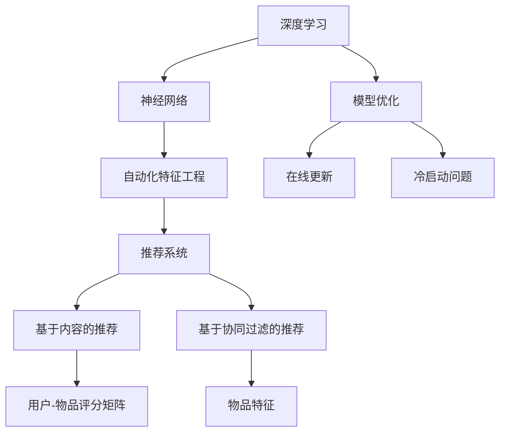

                 

### 文章标题：深度学习如何革新传统推荐算法

关键词：深度学习，推荐系统，传统算法，革新

摘要：本文将探讨深度学习如何通过自动化特征工程、序列模型和图神经网络等创新手段，革新传统推荐算法，提高推荐系统的准确性和用户体验。

---

### 目录大纲

1. 深度学习基础知识
2. 推荐系统基础
3. 深度学习在推荐系统中的应用
4. 深度学习推荐算法
5. 深度学习推荐系统的优化
6. 深度学习推荐系统项目实战
7. 深度学习推荐系统案例分析
8. 深度学习推荐系统的未来趋势
9. 深度学习推荐系统的挑战与机遇
10. 附录

---

## 深度学习基础知识

### 1.1 深度学习的核心概念

深度学习是一种基于人工神经网络的研究方法，它通过模拟人脑中的神经元结构，让计算机具备自主学习、处理和识别信息的能力。深度学习在图像识别、自然语言处理和推荐系统等领域取得了显著的成果。

### 1.2 神经网络基础

神经网络由大量神经元组成，每个神经元接收多个输入，通过权重和偏置计算输出。神经网络的训练过程就是不断调整权重和偏置，使其在给定数据集上的预测误差最小。

### 1.3 深度学习框架简介

深度学习框架如TensorFlow、PyTorch等提供了丰富的神经网络构建、训练和评估工具，极大地方便了研究人员和开发者的工作。

---

## 推荐系统基础

### 2.1 推荐系统的概念

推荐系统是一种通过分析用户的历史行为、偏好和上下文信息，向用户推荐个性化内容或商品的系统。

### 2.2 推荐系统的类型

推荐系统主要分为基于内容的推荐、基于协同过滤的推荐和混合推荐系统。

### 2.3 推荐系统的评估指标

推荐系统的评估指标包括准确率、召回率、F1值等，用于衡量推荐系统的性能。

---

## 深度学习在推荐系统中的应用

### 3.1 基于内容的推荐

深度学习通过自动提取特征，实现基于内容的推荐，提高了推荐的准确性和泛化能力。

### 3.2 基于协同过滤的推荐

深度学习对协同过滤算法进行了改进，通过引入深度神经网络，实现了更高效的模型训练和推荐。

### 3.3 混合推荐系统

深度学习在混合推荐系统中发挥了重要作用，通过整合多种推荐方法，提高了推荐系统的整体性能。

---

## 深度学习推荐算法

### 4.1 自动化特征工程

深度学习通过自动提取特征，减少了人工特征工程的工作量，提高了特征提取的效率和准确性。

### 4.2 序列模型推荐

深度学习通过序列模型，如循环神经网络（RNN）和长短时记忆网络（LSTM），实现了基于用户行为序列的推荐。

### 4.3 图神经网络推荐

深度学习通过图神经网络，实现了基于物品关系和用户行为的推荐，提高了推荐的准确性和个性化程度。

---

## 深度学习推荐系统的优化

### 5.1 深度学习模型的优化

通过优化深度学习模型的结构和参数，可以提高推荐系统的性能和效率。

### 5.2 推荐系统的在线更新

通过在线更新，可以实时调整推荐模型，适应用户行为的变化。

### 5.3 推荐系统的冷启动问题

深度学习通过引入迁移学习和零样本学习等手段，解决了推荐系统的冷启动问题。

---

## 深度学习推荐系统项目实战

### 6.1 项目介绍

本节将通过一个实际项目，介绍如何使用深度学习构建推荐系统。

### 6.2 数据预处理

数据预处理是推荐系统项目的重要步骤，本节将介绍如何进行数据清洗、特征提取和预处理。

### 6.3 模型设计

本节将介绍如何设计深度学习推荐模型，包括选择合适的神经网络结构和优化策略。

### 6.4 模型训练与验证

本节将介绍如何使用训练数据训练模型，并使用验证数据评估模型性能。

### 6.5 模型部署与评估

本节将介绍如何将训练好的模型部署到生产环境，并进行性能评估。

---

## 深度学习推荐系统案例分析

### 7.1 案例一：电商推荐系统

本节将分析一个电商推荐系统的实际案例，探讨深度学习如何提升推荐效果。

### 7.2 案例二：新闻推荐系统

本节将分析一个新闻推荐系统的实际案例，探讨深度学习在新闻推荐中的应用。

### 7.3 案例三：社交网络推荐系统

本节将分析一个社交网络推荐系统的实际案例，探讨深度学习在社交网络中的应用。

---

## 深度学习推荐系统的未来趋势

### 8.1 多模态推荐

多模态推荐是深度学习推荐系统的未来趋势之一，它结合了文本、图像、音频等多种数据类型。

### 8.2 强化学习推荐

强化学习推荐是一种结合了深度学习和强化学习的方法，它通过奖励机制实现更智能的推荐。

### 8.3 交互式推荐

交互式推荐是一种与用户互动的推荐方法，它通过实时反馈调整推荐策略。

---

## 深度学习推荐系统的挑战与机遇

### 9.1 挑战

深度学习推荐系统面临数据隐私、模型可解释性和计算效率等挑战。

### 9.2 机遇

深度学习推荐系统为个性化推荐带来了新的机遇，有望进一步提升用户体验。

### 9.3 发展趋势

随着技术的进步，深度学习推荐系统将在未来继续发挥重要作用，为各个行业提供更智能、更高效的解决方案。

---

## 附录

### 附录A：深度学习推荐系统资源

本附录将推荐一些深度学习推荐系统的文献、开源代码和社区资源，供读者进一步学习和交流。

---

### 核心概念与联系

深度学习（Deep Learning）作为一种强大的机器学习技术，其核心概念包括神经网络（Neural Networks）、自动化特征工程（Automated Feature Engineering）、序列模型（Sequence Models）和图神经网络（Graph Neural Networks）。这些概念之间紧密联系，共同构成了深度学习推荐系统的基础。

#### Mermaid 流程图



通过这个流程图，我们可以看到深度学习如何通过神经网络、自动化特征工程等技术手段，结合推荐系统中的用户-物品评分矩阵和物品特征，实现自动化特征提取和模型优化，从而提高推荐系统的准确性和个性化程度。

#### 深度学习推荐算法伪代码

```python
# 伪代码：基于协同过滤的深度学习推荐算法

def CollaborativeFilteringBasedDeepLearningRecommendation(data, training_samples, validation_samples, test_samples, epochs):
    # 初始化模型
    model = build_model()

    # 训练模型
    for epoch in 1 to epochs:
        for sample in training_samples:
            model.fit(sample)

        # 验证模型
        validation_loss = model.evaluate(validation_samples)

        if validation_loss < previous_validation_loss:
            previous_validation_loss = validation_loss
            best_model = model

    # 测试模型
    test_loss = best_model.evaluate(test_samples)

    return test_loss
```

这段伪代码展示了如何使用深度学习框架构建基于协同过滤的推荐系统。通过训练数据集进行模型训练，并使用验证数据集进行模型评估，选择最优模型进行测试数据集的预测。

#### 数学模型和数学公式

**协同过滤损失函数**

$$
L = \frac{1}{2} \sum_{i,j} (r_{ij} - \hat{r}_{ij})^2
$$

其中，$r_{ij}$ 为用户 $i$ 对物品 $j$ 的真实评分，$\hat{r}_{ij}$ 为模型预测的评分。这个损失函数用于衡量预测评分与真实评分之间的差距，从而优化模型参数。

**深度学习优化算法**

$$
\text{梯度下降：} \quad w_{\text{new}} = w_{\text{old}} - \alpha \cdot \nabla_w J(w)
$$

其中，$w$ 为模型参数，$\alpha$ 为学习率，$\nabla_w J(w)$ 为损失函数对参数 $w$ 的梯度。梯度下降是一种常用的优化算法，用于更新模型参数，以最小化损失函数。

---

### 数学模型和数学公式

#### 协同过滤损失函数

协同过滤损失函数是推荐系统中常用的损失函数，用于衡量预测评分与真实评分之间的差距。一个简单的协同过滤损失函数可以表示为：

$$
L = \frac{1}{2} \sum_{i,j} (r_{ij} - \hat{r}_{ij})^2
$$

其中，$r_{ij}$ 表示用户 $i$ 对物品 $j$ 的真实评分，而 $\hat{r}_{ij}$ 表示模型预测的用户 $i$ 对物品 $j$ 的评分。这个损失函数的目标是最小化预测评分与真实评分之间的平方误差。

在深度学习框架中，可以使用以下伪代码来实现这个损失函数：

```python
# 伪代码：协同过滤损失函数

def collaborative_filtering_loss(y_true, y_pred):
    return 0.5 * np.mean((y_true - y_pred) ** 2)
```

这里，`y_true` 是实际的用户评分，`y_pred` 是模型预测的用户评分。

#### 深度学习优化算法

在深度学习中，优化算法用于更新模型的参数，以最小化损失函数。一个常用的优化算法是梯度下降（Gradient Descent）。梯度下降的基本思想是沿着损失函数的梯度方向更新模型参数，以逐渐减小损失函数的值。

梯度下降算法可以表示为：

$$
\text{梯度下降：} \quad w_{\text{new}} = w_{\text{old}} - \alpha \cdot \nabla_w J(w)
$$

其中，$w$ 是模型参数，$\alpha$ 是学习率（learning rate），$\nabla_w J(w)$ 是损失函数 $J(w)$ 对参数 $w$ 的梯度。

在深度学习框架中，可以使用以下伪代码来实现梯度下降：

```python
# 伪代码：梯度下降

def gradient_descent(model, learning_rate, loss_function, data):
    for parameter in model.parameters():
        gradient = loss_function.derivative(parameter)
        parameter -= learning_rate * gradient
```

这里，`model` 是深度学习模型，`learning_rate` 是学习率，`loss_function` 是损失函数，`data` 是用于训练的数据。

通过迭代地更新模型参数，梯度下降算法可以逐步优化模型的参数，使得模型在训练数据上的表现越来越好。

### 深度学习推荐算法伪代码

深度学习推荐算法的核心在于如何结合用户行为数据和物品特征，通过深度神经网络实现精准的推荐。以下是一个基于协同过滤的深度学习推荐算法的伪代码示例，展示了从数据预处理到模型训练的整个流程：

```python
# 伪代码：基于协同过滤的深度学习推荐算法

# 初始化模型参数
model = initialize_model()

# 准备训练数据
X_train, y_train = prepare_training_data(user_behavior_data, item_features)

# 训练模型
for epoch in range(num_epochs):
    # 前向传播
    predictions = model.forward_pass(X_train)
    
    # 计算损失
    loss = compute_loss(y_train, predictions)
    
    # 反向传播
    gradients = model.backward_pass(loss)
    
    # 更新模型参数
    model.update_parameters(gradients, learning_rate)

# 验证模型
validation_loss = model.evaluate(X_val, y_val)

# 测试模型
test_loss = model.evaluate(X_test, y_test)

# 输出最终结果
print(f"Test Loss: {test_loss}")
```

在这个伪代码中：

- `initialize_model()` 用于初始化神经网络模型。
- `prepare_training_data()` 用于从用户行为数据和物品特征中提取特征，并将其转换为训练数据集。
- `model.forward_pass(X_train)` 表示前向传播，用于计算输入数据通过神经网络的输出。
- `compute_loss(y_train, predictions)` 用于计算预测评分与真实评分之间的损失。
- `model.backward_pass(loss)` 表示反向传播，用于计算损失函数关于模型参数的梯度。
- `model.update_parameters(gradients, learning_rate)` 用于根据梯度更新模型参数。
- `model.evaluate()` 用于评估模型的性能。

通过上述步骤，深度学习推荐算法可以不断迭代优化，提高推荐系统的准确性和效果。这个伪代码提供了一个结构化的框架，可以帮助开发者理解和实现深度学习推荐算法的核心流程。在具体实现时，可以根据不同的应用场景和数据特点，选择合适的神经网络架构、优化算法和损失函数。

