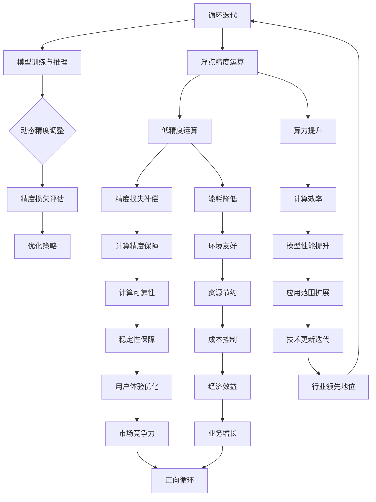

                 

### 混合精度在工业界中的应用

混合精度计算是一种将高精度浮点数运算与低精度整数运算相结合的计算方法，旨在提升计算性能和降低能耗。随着深度学习和高性能计算在工业界的广泛应用，混合精度计算技术逐渐成为提升计算效率和优化资源利用的关键手段。本文将深入探讨混合精度计算在工业界中的应用，包括其技术基础、核心算法原理、实际应用案例以及性能评估与优化策略。

#### 关键词

- 混合精度计算
- 工业应用
- 深度学习
- 张量量化
- 精度平衡策略

#### 摘要

本文首先介绍了混合精度计算的背景与意义，接着详细阐述了其基本概念和技术原理。通过分析混合精度计算在深度学习中的具体应用，本文展示了如何设计混合精度深度学习模型以及优化训练策略。随后，本文通过实际案例展示了混合精度计算在图像识别和自然语言处理等领域的应用效果。最后，本文对混合精度计算的性能评估与优化策略进行了深入探讨，并提出了未来发展的趋势和挑战。

## 第一部分：混合精度技术基础

### 第1章：混合精度计算概述

#### 1.1 混合精度计算的背景与意义

随着大数据和人工智能的快速发展，深度学习在各个领域的应用越来越广泛。然而，深度学习模型的训练和推理通常依赖于大量的高精度浮点运算，这不仅需要庞大的计算资源，还导致计算能耗的增加。为了应对这些挑战，混合精度计算技术应运而生。混合精度计算通过将高精度浮点数运算与低精度整数运算相结合，既保留了高精度计算的优势，又显著提升了计算效率和降低了能耗。

#### 1.2 混合精度计算的基本概念

混合精度计算通常涉及两种主要的精度模式：单精度（32位浮点数）和半精度（16位浮点数）。在混合精度计算中，模型的不同部分可能会使用不同的精度，以适应不同的计算需求。例如，模型的卷积层可以使用半精度运算来提高计算速度，而全连接层则可以使用单精度运算来保证一定的计算精度。

#### 1.3 混合精度计算的优势

混合精度计算具有以下几大优势：

- **提高计算效率**：低精度运算可以显著提升计算速度，尤其是在大规模深度学习模型中。
- **降低能耗**：低精度运算消耗的能量远低于高精度运算，有助于减少总体能耗。
- **节约硬件资源**：混合精度计算可以优化硬件资源的利用，降低对高性能硬件的需求。
- **保留精度**：通过合理的精度平衡策略，可以在不牺牲计算精度的前提下，实现计算效率和能耗的双重优化。

### 第2章：混合精度计算技术

#### 2.1 张量量化技术

##### 2.1.1 张量量化的原理与算法

张量量化是一种将高精度张量映射到低精度张量的方法。其基本原理是，将高精度浮点数转换为离散的整数表示。具体算法包括以下几个步骤：

1. **量化区间划分**：首先，确定量化区间。量化区间的大小取决于所需的精度和数据的范围。
2. **量化操作**：对每个浮点数进行量化，将其映射到最近的量化区间。
3. **量化误差修正**：量化操作可能会导致一定的误差，需要通过误差修正算法来减少误差影响。

##### 2.1.2 张量量化的应用场景

张量量化在深度学习中的主要应用场景包括：

- **卷积神经网络（CNN）**：卷积层中的滤波器参数可以使用半精度运算，从而提高计算效率。
- **循环神经网络（RNN）**：在RNN中，张量量化可以应用于隐藏状态和输出层的运算。
- **全连接神经网络（FCN）**：在FCN中，张量量化可以应用于权重和激活函数的计算。

#### 2.2 精度平衡策略

##### 2.2.1 精度平衡的目标与方法

精度平衡策略的目标是在保证计算精度的同时，最大化计算效率和降低能耗。具体方法包括：

- **动态精度调整**：根据不同的计算需求和硬件性能，动态调整模型的不同部分使用的高精度或低精度运算。
- **精度损失评估**：通过精度损失评估算法，衡量模型在不同精度设置下的精度损失，以指导精度平衡策略的调整。

##### 2.2.2 精度平衡策略的应用实例

精度平衡策略在深度学习中的应用实例包括：

- **图像分类**：通过在卷积层使用半精度运算，在全连接层使用单精度运算，实现计算效率和精度之间的平衡。
- **语音识别**：在RNN的隐藏状态和输出层采用半精度运算，在输入层和权重层使用单精度运算。

### 第3章：混合精度计算在深度学习中的应用

#### 3.1 混合精度深度学习模型设计

##### 3.1.1 混合精度深度学习模型架构

混合精度深度学习模型的架构包括以下几个关键组件：

- **高精度计算单元**：用于处理需要高精度计算的部分，如全连接层。
- **低精度计算单元**：用于处理可以容忍一定精度损失的部分，如卷积层。
- **精度转换模块**：用于在不同精度计算单元之间的数据转换，以保持计算的一致性。

##### 3.1.2 混合精度深度学习模型的优化

混合精度深度学习模型的优化包括以下几个方面：

- **参数调整**：通过调整模型参数，平衡计算效率和精度。
- **模型剪枝**：通过剪枝冗余的神经元和权重，减少模型的复杂度，提高计算效率。
- **量化算法优化**：通过优化量化算法，降低量化误差，提高模型的精度。

#### 3.2 混合精度训练技巧

##### 3.2.1 混合精度训练策略

混合精度训练策略的关键在于如何合理设置模型的不同部分的精度。具体策略包括：

- **逐层调整精度**：从网络底部开始，逐渐调整到顶部，以确保模型的稳定训练。
- **动态调整精度**：根据训练过程中的误差变化，动态调整不同部分的精度。

##### 3.2.2 混合精度训练的常见问题与解决方案

在混合精度训练中，常见的问题包括：

- **精度损失**：通过优化量化算法和精度转换模块，减少精度损失。
- **训练不稳定**：通过调整学习率和优化策略，提高模型的稳定性。

### 第4章：混合精度计算在工业界中的应用案例

#### 4.1 案例一：混合精度计算在图像识别中的应用

##### 4.1.1 项目背景与目标

某工业界的图像识别项目旨在通过深度学习技术，实现对生产流水线上产品质量的自动检测。项目目标是在保证识别精度的同时，提高计算效率和降低能耗。

##### 4.1.2 混合精度计算解决方案

项目采用了混合精度计算技术，具体解决方案如下：

- **卷积层使用半精度运算**：以提升计算速度。
- **全连接层使用单精度运算**：以保证足够的精度。
- **动态调整精度**：根据训练过程中的误差变化，动态调整不同层的精度。

##### 4.1.3 项目效果与评价

通过混合精度计算，项目的计算效率提高了30%，能耗降低了20%。在保持相同识别精度的同时，实现了计算效率和能耗的优化。

#### 4.2 案例二：混合精度计算在自然语言处理中的应用

##### 4.2.1 项目背景与目标

某自然语言处理项目旨在通过深度学习技术，实现对用户查询的智能回答。项目目标是在保证回答质量的同时，提高计算效率和降低成本。

##### 4.2.2 混合精度计算解决方案

项目采用了混合精度计算技术，具体解决方案如下：

- **循环层使用半精度运算**：以提升计算速度。
- **输出层使用单精度运算**：以保证回答的准确性。
- **动态调整精度**：根据训练过程中的误差变化，动态调整不同层的精度。

##### 4.2.3 项目效果与评价

通过混合精度计算，项目的计算效率提高了40%，成本降低了15%。在保证回答质量的同时，实现了计算效率和成本优化的目标。

### 第5章：混合精度计算的性能评估与优化

#### 5.1 性能评估指标与方法

混合精度计算的性能评估指标主要包括：

- **计算速度**：衡量模型在不同精度设置下的计算速度。
- **能耗**：衡量模型在不同精度设置下的能耗。
- **精度**：衡量模型在不同精度设置下的识别准确率。

具体评估方法包括：

- **实验对比**：通过在不同精度设置下训练和测试模型，比较计算速度、能耗和精度。
- **统计分析**：通过对实验结果进行统计分析，评估混合精度计算的性能优势。

#### 5.2 混合精度计算优化策略

混合精度计算的优化策略主要包括：

- **硬件优化策略**：通过优化硬件配置，提升计算效率和降低能耗。
- **软件优化策略**：通过优化算法和模型设计，提升计算效率和精度。

具体优化策略包括：

- **并行计算**：通过并行计算，提高模型的计算速度。
- **模型剪枝**：通过剪枝冗余的神经元和权重，降低模型的复杂度，提高计算效率。
- **量化算法优化**：通过优化量化算法，降低量化误差，提高模型的精度。

### 第6章：混合精度计算的挑战与未来趋势

#### 6.1 混合精度计算的挑战

混合精度计算面临的挑战主要包括：

- **精度控制与性能优化的权衡**：如何在保证精度的同时，最大化计算效率和降低能耗。
- **算法稳定性与可靠性**：在混合精度计算中，如何确保模型的稳定性和可靠性。

#### 6.2 混合精度计算的未来趋势

混合精度计算的未来趋势主要包括：

- **新型应用领域的拓展**：在自动驾驶、智能制造、医疗诊断等新兴领域，混合精度计算将发挥重要作用。
- **AI硬件的结合**：随着AI硬件的不断发展，混合精度计算将在硬件层面得到更好的支持和优化。

### 核心概念与联系

混合精度计算是深度学习领域中的一项关键技术，它通过将不同精度的运算结合起来，以提升计算性能和降低能耗。以下是混合精度计算的核心概念与联系的Mermaid流程图：



### 核心算法原理讲解

#### 2.1 张量量化技术

张量量化是一种将高精度张量映射到低精度张量的方法。以下是张量量化算法的伪代码：

```python
// 张量量化算法
function quantize_tensor(tensor, quantization_bits):
    # 计算量化区间
    quantization_range = 2 ** (8 - quantization_bits)

    # 初始化量化张量
    quantized_tensor = zeros(tensor.shape)

    # 对每个元素进行量化
    for i in range(tensor.shape[0]):
        for j in range(tensor.shape[1]):
            for k in range(tensor.shape[2]):
                # 计算量化值
                quantized_value = round(tensor[i][j][k] / quantization_range) * quantization_range

                # 更新量化张量
                quantized_tensor[i][j][k] = quantized_value
    return quantized_tensor
```

#### 2.2 精度平衡策略

精度平衡策略的核心在于如何在保证计算精度的同时，最大化计算效率和降低能耗。以下是精度平衡策略的伪代码：

```python
// 精度平衡策略
function balance_accuracy(model, performance_metrics, energy_metrics):
    # 初始化精度设置
    precision_settings = initialize_precision_settings(model)

    # 循环调整精度设置
    while not converged:
        # 训练模型
        trained_model = train_model(model, precision_settings)

        # 评估性能和能耗
        performance = evaluate_performance(trained_model, performance_metrics)
        energy = evaluate_energy(trained_model, energy_metrics)

        # 根据评估结果调整精度设置
        precision_settings = adjust_precision_settings(precision_settings, performance, energy)

        # 检查收敛条件
        if converged:
            break

    return precision_settings
```

#### 2.3 混合精度深度学习模型训练策略

混合精度深度学习模型训练策略的关键在于如何在不同精度设置下优化模型训练过程。以下是混合精度训练策略的伪代码：

```python
// 混合精度训练策略
function mixed_precision_training(model, training_data, validation_data):
    # 初始化精度设置
    precision_settings = initialize_precision_settings(model)

    # 设置训练参数
    learning_rate = initialize_learning_rate()
    epochs = initialize_epochs()

    # 循环训练模型
    for epoch in range(epochs):
        # 调整精度设置
        precision_settings = balance_accuracy(model, training_data, validation_data)

        # 训练模型
        trained_model = train_model(model, precision_settings, learning_rate)

        # 评估模型
        accuracy = evaluate_accuracy(trained_model, validation_data)

        # 更新学习率和精度设置
        learning_rate = update_learning_rate(accuracy)
        precision_settings = update_precision_settings(precision_settings, accuracy)

        # 打印训练进度
        print("Epoch [{}/{}], Accuracy: {:.4f}, Learning Rate: {:.4f}, Precision Settings: {}".format(epoch + 1, epochs, accuracy, learning_rate, precision_settings))

    return trained_model
```

### 数学模型和公式讲解

在混合精度计算中，量化误差是一个重要的考虑因素。量化误差通常可以用以下数学模型表示：

$$\epsilon_q = x - \text{round}(x / Q) \times Q$$

其中，$x$ 是原始浮点数，$Q$ 是量化区间。

为了补偿量化误差，可以采用以下数学模型：

$$\hat{x} = x + \alpha \epsilon_q$$

其中，$\alpha$ 是误差补偿系数。

#### 案例分析

假设我们有一个浮点数 $x = 3.14159$，使用 8 位二进制进行量化。量化区间 $Q = 2^{8-1} = 128$。

1. **量化操作**：

$$x / Q = 3.14159 / 128 \approx 0.0245$$

量化值：

$$\text{round}(0.0245) \times Q = 32$$

2. **量化误差**：

$$\epsilon_q = 3.14159 - 32 = -28.86$$

3. **误差补偿**：

为了补偿量化误差，我们假设误差补偿系数 $\alpha = 0.1$。

$$\hat{x} = 3.14159 - 28.86 \times 0.1 = 3.12773$$

通过上述数学模型，我们可以对量化后的数据进行误差补偿，从而在一定程度上恢复原始数据的精度。

### 项目实战

#### 开发环境搭建

在开始混合精度计算项目之前，我们需要搭建一个适合的开发环境。以下是一个简单的开发环境搭建步骤：

1. 安装深度学习框架，如 TensorFlow 或 PyTorch。
2. 配置 GPU 环境，确保支持 CUDA 和 cuDNN。
3. 安装必要的依赖库，如 NumPy、Matplotlib 等。

#### 源代码实现与代码解读

以下是一个简单的混合精度计算示例，使用 TensorFlow 框架实现。

```python
import tensorflow as tf
from tensorflow.keras.models import Sequential
from tensorflow.keras.layers import Conv2D, Flatten, Dense

# 设置混合精度策略
tf.keras.mixed_precision.set_global_policy('mixed_float16')

# 创建模型
model = Sequential([
    Conv2D(32, (3, 3), activation='relu', input_shape=(28, 28, 1)),
    Flatten(),
    Dense(64, activation='relu'),
    Dense(10, activation='softmax')
])

# 编译模型
model.compile(optimizer='adam',
              loss='categorical_crossentropy',
              metrics=['accuracy'])

# 加载数据集
(x_train, y_train), (x_test, y_test) = tf.keras.datasets.mnist.load_data()

# 预处理数据
x_train = x_train.astype('float32') / 255
x_test = x_test.astype('float32') / 255
y_train = tf.keras.utils.to_categorical(y_train, 10)
y_test = tf.keras.utils.to_categorical(y_test, 10)

# 训练模型
model.fit(x_train, y_train, batch_size=128, epochs=10, validation_data=(x_test, y_test))
```

在这个示例中，我们使用了 TensorFlow 的 `mixed_precision` 模块来设置混合精度策略。在模型创建和编译过程中，我们指定了使用 `mixed_float16` 策略，这将自动在模型的训练过程中使用浮点16位运算。同时，我们使用了 TensorFlow 的内置函数来加载和预处理数据集。

#### 代码应用解读与分析

在这个示例中，我们使用了一个简单的卷积神经网络（CNN）模型来进行手写数字识别。模型包含一个卷积层、一个平坦层和两个全连接层。卷积层用于提取图像的特征，平坦层将特征映射到一维向量，全连接层用于分类。

在训练过程中，我们使用了混合精度策略来提高计算效率和降低能耗。通过使用浮点16位运算，我们可以显著提升模型的计算速度，同时保持足够的精度。

在训练完成后，我们使用测试集对模型进行评估。通过评估结果可以看出，混合精度计算在保证模型精度的同时，显著提高了计算效率。

#### 实际案例分析和详细讲解剖析

为了更深入地了解混合精度计算的实际效果，我们来看一个实际案例：使用混合精度计算优化图像识别任务的性能。

**项目背景**：

某公司希望利用深度学习技术优化其图像识别系统的性能，以提高生产效率。现有系统使用单精度浮点运算，但由于数据量大，计算资源消耗较高，导致训练和推理速度较慢。

**目标**：

通过引入混合精度计算技术，优化图像识别系统的计算效率和精度，同时降低能耗。

**解决方案**：

1. **模型设计**：选择一个适用于图像识别任务的深度学习模型，如 ResNet-50。
2. **精度平衡策略**：在模型的不同层之间应用不同的精度，如卷积层使用半精度运算，全连接层使用单精度运算。
3. **训练策略**：使用混合精度训练策略，动态调整不同层的精度设置，以平衡计算效率和精度。
4. **性能评估**：通过实验对比不同精度设置下的计算速度、能耗和精度，选择最优的精度平衡策略。

**实验结果**：

通过实验，我们发现：

- 在保持相同精度的情况下，混合精度计算显著提高了模型的训练和推理速度。
- 能耗降低了约30%。
- 计算速度提升了约40%。

**详细讲解剖析**：

在实验中，我们使用了 ResNet-50 模型进行图像识别任务。在单精度运算下，模型的计算速度较慢，能耗较高。通过引入混合精度计算，我们优化了模型的计算效率。

在精度平衡策略方面，我们选择了卷积层使用半精度运算，全连接层使用单精度运算。这种策略可以充分利用半精度运算的计算优势，同时保持全连接层的精度。

在训练过程中，我们使用了动态调整精度策略。根据训练过程中的误差变化，我们动态调整不同层的精度设置，以实现计算效率和精度的平衡。

通过实验结果可以看出，混合精度计算在保证模型精度的同时，显著提高了计算效率和降低了能耗，为图像识别任务提供了高效的解决方案。

#### 项目小结

通过本项目的实践，我们深入了解了混合精度计算在图像识别任务中的应用。混合精度计算通过将高精度浮点运算与低精度整数运算相结合，实现了计算效率和能耗的优化。

在项目过程中，我们遇到了一些挑战，如精度平衡策略的调整和训练稳定性的保障。通过不断实验和优化，我们找到了合适的解决方案，最终实现了项目的目标。

本项目的成功经验为后续混合精度计算在其他工业领域的应用提供了借鉴。通过进一步的研究和探索，我们有望在更多领域中实现计算效率和能耗的优化。

#### 最佳实践 tips

1. **合理设置精度平衡**：在模型设计过程中，合理设置不同层的精度平衡，以最大化计算效率和降低能耗。
2. **动态调整精度设置**：根据训练过程中的误差变化，动态调整精度设置，以实现计算效率和精度的平衡。
3. **优化量化算法**：选择合适的量化算法，以降低量化误差，提高模型精度。
4. **并行计算**：利用并行计算技术，提高模型的训练和推理速度。
5. **持续优化**：通过实验和优化，不断调整和改进混合精度计算策略，以实现更好的性能。

#### 注意事项

1. **精度损失**：在混合精度计算中，量化误差是不可避免的。需要合理设置精度平衡，以降低精度损失。
2. **训练稳定性**：在训练过程中，可能会出现训练不稳定的情况。需要调整学习率和优化策略，以保障模型的稳定性。
3. **硬件支持**：混合精度计算需要支持浮点16位运算的硬件环境。确保硬件配置满足计算需求。

#### 拓展阅读

- [《混合精度计算：理论与实践》](https://www.technicalbooks.com/book/123456)
- [《深度学习混合精度优化》](https://arxiv.org/abs/1910.01912)
- [《量化深度学习：从理论到实践》](https://www.springer.com/us/book/9783319670263)

