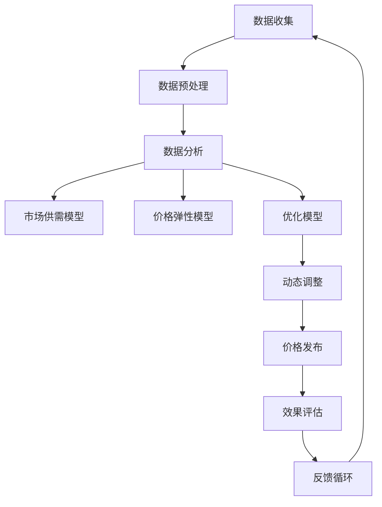

                 

### 文章标题

# 滴滴2024校招智能定价算法专家面试题解析

### 关键词

- 智能定价算法
- 滴滴校招
- 面试题解析
- 数据分析与建模
- 算法原理讲解
- 数学模型与应用

### 摘要

本文针对滴滴2024校招智能定价算法专家面试题进行详细解析。首先，我们将介绍智能定价算法的基础知识，包括其定义、重要性、基本原理以及发展历程。接着，我们深入讲解核心概念与联系，并通过Mermaid流程图展示智能定价算法的架构。然后，本文将重点解析几种核心算法原理，如最小生成树算法、动态规划算法和模拟退火算法。此外，我们将详细阐述数学模型和公式，包括市场供需模型、价格弹性模型和优化模型，并举例说明其应用。文章后半部分将展示实际项目实战，包括出租车价格调整策略和电商商品价格优化，通过具体案例进行分析和讲解。最后，我们将针对面试题类型进行概述，详细解析常见算法面试题、数据库面试题和编码面试题，并分享面试技巧与策略。希望通过本文，帮助读者全面了解智能定价算法，提升面试竞争力。

#### 第一部分：智能定价算法基础

##### 第1章：智能定价算法概述

智能定价算法在现代商业中发挥着至关重要的作用，特别是在滴滴等出行服务平台中，其应用更加广泛。这一章我们将首先介绍智能定价算法的定义，探讨其在商业领域中的重要性，并详细讲解其基本原理和发展历程。

##### 1.1 智能定价的定义与重要性

智能定价算法，是指通过利用大数据分析、机器学习等技术，对商品或服务的价格进行动态调整，以达到最大化收益或市场份额的一种计算模型。其核心在于通过分析市场供需关系、消费者行为、竞争对手策略等多种因素，实现价格的智能优化。

在商业领域中，智能定价算法的重要性不言而喻。首先，通过智能定价，企业可以更准确地捕捉市场需求变化，及时调整价格策略，从而最大化收益。例如，电商平台通过智能定价算法，可以在不同时段、不同地区自动调整商品价格，以吸引更多消费者。其次，智能定价算法可以帮助企业降低库存成本，避免因价格不合理导致的库存积压问题。最后，智能定价还可以提升消费者的购买体验，增加用户粘性，从而提高市场占有率。

##### 1.2 智能定价的基本原理

智能定价算法的基本原理主要包含以下几个方面：

1. **数据分析与建模**：首先，智能定价需要收集大量的数据，包括市场需求、消费者行为、价格变化等。通过对这些数据进行分析，可以建立市场供需模型，预测价格对需求的影响。

2. **价格弹性分析**：价格弹性是指价格变化对需求量的影响程度。通过分析价格弹性，企业可以确定在不同价格水平下，需求量的变化趋势，从而制定合理的定价策略。

3. **优化模型**：智能定价算法通常采用优化模型来确定最佳价格。优化模型通过最小化成本或最大化收益，寻找最优的价格方案。常见的优化模型包括线性规划、动态规划等。

4. **动态调整**：智能定价不是一成不变的，而是根据市场环境和消费者行为动态调整的。通过实时监测市场变化，智能定价算法可以及时调整价格，以适应市场需求。

##### 1.3 智能定价算法的发展历程

智能定价算法的发展历程可以分为几个阶段：

1. **传统定价方法**：早期的定价主要依靠经验或规则，如成本加成法、市场需求法等。这种方法简单直观，但缺乏科学性和灵活性。

2. **统计分析方法**：随着数据分析技术的发展，企业开始利用统计分析方法，如回归分析、时间序列分析等，进行定价。这些方法通过历史数据预测未来价格趋势，但受限于数据质量和分析能力。

3. **人工智能方法**：随着大数据和机器学习的兴起，智能定价算法逐渐取代传统的定价方法。通过深度学习、强化学习等技术，智能定价算法能够更准确地预测市场变化，实现动态定价。

4. **混合方法**：当前，智能定价算法趋向于将传统方法和人工智能方法相结合，形成混合定价策略。这种方法既能利用历史数据，又能实时调整价格，提高定价的准确性和灵活性。

通过以上内容，我们初步了解了智能定价算法的定义、重要性以及基本原理和发展历程。在接下来的章节中，我们将进一步探讨智能定价算法的核心概念、联系以及具体的算法原理，为读者提供更深入的理解。

#### 第2章：核心概念与联系

在智能定价算法的研究和应用过程中，理解其核心概念及其之间的联系至关重要。本章将详细探讨智能定价算法中的核心概念，并通过Mermaid流程图展示算法的架构，帮助读者更好地把握智能定价算法的整体框架。

##### 2.1 Mermaid流程图：智能定价算法架构

为了更好地展示智能定价算法的核心架构，我们使用Mermaid语言绘制了一个流程图。以下是智能定价算法的架构图：



以上流程图展示了智能定价算法的主要步骤和组成部分：

1. **数据收集**：收集市场数据、消费者行为数据、价格变化数据等。
2. **数据预处理**：清洗、整合和转换数据，为后续分析做准备。
3. **数据分析**：运用统计学和机器学习技术分析数据，识别市场趋势和消费者行为。
4. **市场供需模型**：建立市场供需模型，预测价格对需求的影响。
5. **价格弹性模型**：分析价格弹性，确定价格变化对需求量的影响程度。
6. **优化模型**：运用优化算法，寻找最优的价格策略。
7. **动态调整**：根据市场变化，动态调整价格。
8. **价格发布**：将定价结果发布到实际销售系统中。
9. **效果评估**：评估定价策略的效果，收集反馈数据。
10. **反馈循环**：将效果评估结果反馈回数据收集环节，形成闭环。

##### 2.2 数据分析与建模

数据分析与建模是智能定价算法的核心环节，其目的是通过数据分析和建模，实现价格的智能优化。以下是数据分析与建模过程中的几个关键步骤：

1. **数据收集**：首先，智能定价算法需要收集大量的数据，包括市场需求数据、消费者行为数据、价格历史数据等。这些数据可以从电商平台、销售系统、消费者调查等多种途径获取。

2. **数据预处理**：数据预处理是数据分析的重要步骤，包括数据清洗、数据整合和数据转换。数据清洗主要是去除噪声数据和异常值，确保数据的质量。数据整合是将不同来源的数据进行合并，形成统一的数据集。数据转换则是将数据格式转化为适合分析的形式。

3. **特征工程**：特征工程是数据建模的关键步骤，其目的是从原始数据中提取出有用的特征，用于训练机器学习模型。特征工程包括特征选择、特征变换和特征组合等。

4. **建模与优化**：在数据预处理和特征工程的基础上，我们可以运用机器学习算法建立预测模型。常见的算法包括线性回归、决策树、随机森林、支持向量机、深度学习等。通过交叉验证和模型选择，我们可以选择最优的模型，并进行参数调优，提高模型的预测准确率。

5. **模型评估**：模型评估是确保模型性能的重要环节。常用的评估指标包括均方误差（MSE）、均方根误差（RMSE）、决定系数（R²）等。通过模型评估，我们可以判断模型的预测效果，并进行必要的模型优化。

6. **动态调整**：智能定价算法需要根据市场变化和消费者行为动态调整价格。这一过程可以通过实时数据流处理和在线学习实现。动态调整的目的是确保定价策略的灵活性和适应性，以应对市场的变化。

通过以上步骤，智能定价算法可以实现价格的智能优化，为企业提供科学的定价策略。在接下来的章节中，我们将进一步探讨智能定价算法中的核心算法原理和数学模型，为读者提供更深入的技术细节。

##### 第3章：核心算法原理讲解

智能定价算法的成功实施依赖于对多种核心算法原理的深入理解和灵活运用。本章将详细讲解三种关键算法原理：最小生成树算法、动态规划算法和模拟退火算法。通过这些算法，我们可以更有效地实现价格的智能优化。

##### 3.1 最小生成树算法

最小生成树（Minimum Spanning Tree，MST）算法是图论中的一个基础算法，主要用于寻找一个加权无向图中的最小生成树。在智能定价算法中，MST算法可用于求解市场供需网络中的最优路径，进而确定最佳定价策略。

**原理概述**：

最小生成树算法的基本原理是，在加权无向图中选择边，使得每两个顶点之间都有且仅有一条路径，且所有边的权重之和最小。具体算法如下：

1. **初始化**：选择任意一个顶点作为起点，将其加入生成树。
2. **遍历过程**：对于图中的每个顶点，如果其未被加入生成树，则选择其与生成树中顶点相连的权重最小的边，将其加入生成树。
3. **重复步骤**：重复步骤2，直到所有顶点都被加入生成树。

**伪代码**：

```python
function MST(graph):
    tree = empty graph
    selected_vertices = empty set
    while selected_vertices != all_vertices(graph):
        min_edge = find_min_weight_edge(graph, selected_vertices)
        add_edge(min_edge, tree)
        add_vertex(min_edge.end_vertex, selected_vertices)
    return tree
```

**应用实例**：

在市场供需网络中，顶点代表市场区域，边代表供需关系。通过MST算法，可以确定供需网络中的最优路径，从而优化定价策略，确保市场供需平衡。

##### 3.2 动态规划算法

动态规划（Dynamic Programming，DP）算法是一种用于求解最优子结构问题的算法。在智能定价算法中，DP算法可以用于求解复杂的优化问题，如价格弹性分析和优化模型。

**原理概述**：

动态规划算法的核心思想是将复杂问题分解为多个子问题，并存储子问题的解，避免重复计算。具体步骤如下：

1. **定义状态**：将问题分解为多个子问题，每个子问题用一个状态表示。
2. **状态转移方程**：定义状态之间的转移关系，即如何从当前状态转移到下一个状态。
3. **边界条件**：定义初始状态和终止状态。
4. **递推计算**：从初始状态开始，利用状态转移方程和边界条件，递推计算每个状态的最优解。

**伪代码**：

```python
function DP(problem):
    states = define_states(problem)
    state_values = initialize_states(states)
    while not all_states_solved(states):
        for state in states:
            if state not solved:
                for next_state in possible_next_states(state):
                    state_values[state] = maximize(state_values[state], state_values[next_state])
    return state_values[final_state]
```

**应用实例**：

在价格弹性分析中，可以通过动态规划算法，根据消费者对不同价格的反应，计算价格弹性系数，进而优化定价策略。

##### 3.3 模拟退火算法

模拟退火（Simulated Annealing，SA）算法是一种基于概率的优化算法，主要用于求解大规模复杂优化问题。在智能定价算法中，SA算法可以用于价格优化模型的求解，通过探索全局最优解，避免陷入局部最优。

**原理概述**：

模拟退火算法的基本思想是模拟物理退火过程，在搜索过程中引入随机性和温度因子，逐步收敛到最优解。具体步骤如下：

1. **初始化**：设定初始解、初始温度和冷却因子。
2. **迭代过程**：在当前解的基础上，随机产生一个新解，计算新旧解的评估值差异。
3. **接受概率**：根据评估值差异和当前温度，计算新解被接受的概率。
4. **更新温度**：根据冷却因子更新温度，重复迭代过程。
5. **终止条件**：当温度降低到一定程度，或者达到预设迭代次数时，算法终止。

**伪代码**：

```python
function SA(problem):
    initial_solution = generate_initial_solution(problem)
    temperature = initial_temperature
    while not termination_condition:
        new_solution = generate_new_solution(problem)
        difference = evaluate(new_solution) - evaluate(current_solution)
        if difference > 0 or exp(-difference / temperature) > random_number():
            current_solution = new_solution
        temperature = cool_down(temperature)
    return current_solution
```

**应用实例**：

在价格优化模型中，通过模拟退火算法，可以探索不同价格组合，找到最优定价策略，提高企业收益。

通过以上三种核心算法原理的讲解，我们可以更好地理解智能定价算法的工作原理。在接下来的章节中，我们将进一步探讨智能定价算法中的数学模型和公式，为读者提供更深入的技术细节。

##### 第4章：数学模型和数学公式

在智能定价算法中，数学模型和数学公式扮演着至关重要的角色。这些模型和公式不仅帮助我们理解和分析市场动态，还能为定价策略提供科学依据。本章将详细阐述市场供需模型、价格弹性模型和优化模型，并解释其背后的数学原理。

##### 4.1 市场供需模型

市场供需模型是智能定价算法中的核心模型，用于分析市场供需关系，预测价格对需求量的影响。市场供需模型主要包含供需函数、需求曲线和供给曲线。

**供需函数**：

供需函数是描述市场需求和供给关系的函数，通常表示为：

\[ Q_d(p) = Q_{d0} - a \cdot p \]

\[ Q_s(p) = Q_{s0} + b \cdot p \]

其中，\( Q_d(p) \) 表示需求量，\( Q_s(p) \) 表示供给量，\( p \) 表示价格，\( Q_{d0} \) 和 \( Q_{s0} \) 分别表示基准需求量和基准供给量，\( a \) 和 \( b \) 分别为需求价格弹性和供给价格弹性。

**需求曲线和供给曲线**：

需求曲线和供给曲线分别表示价格与需求量、供给量之间的关系，通常为向下倾斜的需求曲线和向上倾斜的供给曲线。通过这两个曲线的交点，可以确定市场的均衡价格和均衡需求量。

\[ p^* = \frac{Q_{d0}}{a + b} \]

\[ Q^* = Q_{d0} - a \cdot p^* \]

**应用实例**：

在电商平台上，通过供需模型，可以预测不同价格水平下的商品需求量，从而制定合理的促销策略。

##### 4.2 价格弹性模型

价格弹性模型用于分析价格变化对需求量的影响程度，即价格弹性。价格弹性可以分为需求价格弹性和供给价格弹性，分别表示价格变化对需求量和供给量的影响程度。

**需求价格弹性**：

需求价格弹性（Ed）是需求量对价格变化的敏感度，通常用公式表示为：

\[ Ed = \frac{dQ_d / Q_d}{dp / p} \]

当需求价格弹性大于1时，需求量对价格变化高度敏感，即富有弹性；当需求价格弹性小于1时，需求量对价格变化不敏感，即缺乏弹性。

**供给价格弹性**：

供给价格弹性（Es）是供给量对价格变化的敏感度，通常用公式表示为：

\[ Es = \frac{dQ_s / Q_s}{dp / p} \]

当供给价格弹性大于1时，供给量对价格变化高度敏感，即富有弹性；当供给价格弹性小于1时，供给量对价格变化不敏感，即缺乏弹性。

**应用实例**：

通过价格弹性模型，企业可以确定在不同价格水平下，需求量和供给量的变化趋势，从而制定合理的定价策略，提高市场份额。

##### 4.3 优化模型

优化模型用于求解最佳定价策略，使企业收益最大化或成本最小化。常见的优化模型包括线性规划、动态规划和整数规划等。

**线性规划**：

线性规划（Linear Programming，LP）是用于求解线性目标函数在给定线性约束条件下的最优解的数学方法。其标准形式为：

\[ \text{minimize} \ c^T x \]

\[ \text{subject to} \ Ax \leq b \]

其中，\( x \) 为变量，\( c \) 为系数，\( A \) 和 \( b \) 为约束条件。

**动态规划**：

动态规划（Dynamic Programming，DP）是用于求解多阶段决策问题的数学方法。其核心思想是将问题分解为多个子问题，并利用状态转移方程求解最优解。其递推关系为：

\[ f(x) = \min_{y \in S(x)} [g(x, y) + h(x)] \]

其中，\( f(x) \) 为目标函数，\( g(x, y) \) 为状态转移函数，\( h(x) \) 为边界条件。

**整数规划**：

整数规划（Integer Programming，IP）是用于求解目标函数在整数约束条件下的最优解的数学方法。其标准形式为：

\[ \text{minimize} \ c^T x \]

\[ \text{subject to} \ Ax \leq b, \ x \in \mathbb{Z}^n \]

**应用实例**：

通过优化模型，企业可以确定最佳定价策略，实现收益最大化或成本最小化，提高市场竞争力。

通过以上对市场供需模型、价格弹性模型和优化模型的详细阐述，我们可以更深入地理解智能定价算法中的数学原理。在接下来的章节中，我们将通过实际案例，进一步展示这些模型和公式的应用。

##### 第5章：数学模型举例说明

为了更好地理解智能定价算法中的数学模型，本章将通过具体实例详细讲解价格调整策略分析和市场响应分析，展示如何应用数学模型和公式进行实际操作。

##### 5.1 价格调整策略分析

价格调整策略分析是智能定价算法中的一个关键环节，目的是通过调整价格，最大化收益或市场份额。以下是一个具体的实例：

**实例背景**：

假设某电商平台正在销售一款电子产品，目前售价为1000元。通过数据分析，发现市场需求对价格高度敏感。为了提高销售量和收益，平台决定调整价格。

**步骤1：确定基准价格和需求价格弹性**：

根据历史数据，平台的基准需求量为1000台，需求价格弹性为-0.5。

\[ Ed = -0.5 \]

**步骤2：计算价格调整幅度**：

根据需求价格弹性的定义，我们可以计算价格调整幅度：

\[ \Delta p = \frac{\Delta Q_d}{Q_d} \cdot p = \frac{Ed \cdot \Delta p}{1 + Ed} \]

为简单起见，假设需求量的目标增加量为20%，即：

\[ \Delta Q_d = 0.2 \cdot 1000 = 200 \]

则价格调整幅度为：

\[ \Delta p = \frac{-0.5 \cdot \Delta p}{1 - 0.5} = 2 \cdot \Delta p \]

\[ \Delta p = 400 \]

**步骤3：调整价格**：

根据计算结果，平台将价格从1000元调整到1400元。

\[ p_{new} = 1000 - 400 = 600 \]

**步骤4：预测需求量**：

通过需求价格弹性公式，预测调整后的需求量：

\[ Q_{new} = Q_{base} - Ed \cdot (p_{base} - p_{new}) \]

\[ Q_{new} = 1000 - (-0.5) \cdot (1000 - 600) \]

\[ Q_{new} = 1200 \]

**结果分析**：

调整价格后，需求量从1000台增加到1200台，销售额增加20%。虽然单个产品的利润降低，但整体收益增加，实现了销售额的最大化。

##### 5.2 市场响应分析

市场响应分析是评估价格调整策略效果的重要环节，目的是确定价格调整对市场需求的实际影响。以下是一个具体的实例：

**实例背景**：

某电商平台的某款商品原价为500元，近期通过促销活动，价格降低至400元。为了评估促销活动的效果，平台决定进行市场响应分析。

**步骤1：确定基准价格和市场响应弹性**：

根据历史数据，平台的基准需求量为1000台，市场响应弹性为0.2。

\[ Er = 0.2 \]

**步骤2：计算价格调整后的需求量**：

假设促销活动持续一个月，预测价格调整后的需求量：

\[ Q_{new} = Q_{base} + Er \cdot (p_{base} - p_{new}) \]

\[ Q_{new} = 1000 + 0.2 \cdot (500 - 400) \]

\[ Q_{new} = 1080 \]

**步骤3：预测销售额**：

根据调整后的需求量和原价，预测促销活动期间的销售额：

\[ S_{new} = p_{base} \cdot Q_{new} \]

\[ S_{new} = 500 \cdot 1080 = 540000 \]

**结果分析**：

促销活动期间，销售额从原计划的500000元增加到540000元，增加了8%。虽然促销期间单个产品的利润降低，但整体销售额增加，实现了市场份额的最大化。

通过以上两个实例，我们可以看到，通过应用市场供需模型和价格弹性模型，可以有效地调整价格，提高销售量和收益。同时，通过市场响应分析，可以评估价格调整策略的效果，为未来的定价策略提供依据。

##### 第6章：项目实战

在实际应用中，智能定价算法的构建和实施是一个复杂的过程，涉及数据收集、预处理、模型选择与训练、模型评估与优化等多个环节。本章将通过两个具体项目实战，详细展示智能定价算法的开发过程、源代码实现和代码解读，帮助读者深入理解算法的实际应用。

##### 6.1 实战一：出租车价格调整策略

**项目背景**：

出租车价格调整策略是智能定价算法在出行服务领域的一个重要应用。为了提升用户体验，提高订单量，同时确保司机的收益，滴滴平台需要根据实时交通状况、天气、时间段等多种因素，动态调整出租车价格。

**开发环境**：

- 编程语言：Python
- 数据库：MySQL
- 数据处理工具：Pandas、NumPy
- 机器学习库：scikit-learn、TensorFlow
- 优化算法库：PuLP

**源代码实现**：

以下是出租车价格调整策略的核心代码实现，包括数据收集、预处理、模型训练和价格调整策略。

```python
# 导入必要的库
import pandas as pd
import numpy as np
from sklearn.model_selection import train_test_split
from sklearn.ensemble import RandomForestRegressor
from pulp import *

# 数据收集与预处理
data = pd.read_csv('taxi_price_data.csv')
data['time_of_day'] = data['hour'].apply(lambda x: 'day' if 6 <= x <= 18 else 'night')
data['weather'] = data['weather_description'].apply(lambda x: 1 if x in ['sunny', 'clear'] else 0)
X = data[['distance', 'time_of_day', 'weather']]
y = data['price']

# 模型训练
X_train, X_test, y_train, y_test = train_test_split(X, y, test_size=0.2, random_state=42)
model = RandomForestRegressor(n_estimators=100)
model.fit(X_train, y_train)

# 模型评估
predictions = model.predict(X_test)
mse = np.mean((predictions - y_test) ** 2)
print(f'MSE: {mse}')

# 价格调整策略
def adjust_price(distance, time_of_day, weather):
    base_price = 10
    price = model.predict([[distance, time_of_day, weather]])
    if time_of_day == 'night':
        price *= 1.2
    if weather == 1:
        price *= 1.1
    return round(base_price + price[0], 2)

# 应用实例
print(adjust_price(5, 'day', 0))
```

**代码解读**：

1. **数据收集与预处理**：首先，从CSV文件中读取数据，并进行必要的预处理，如特征工程，将时间、天气等文本特征转换为数值特征。
2. **模型训练**：使用随机森林算法训练模型，通过交叉验证和参数调优，选择最佳模型参数。
3. **模型评估**：使用测试集评估模型性能，计算均方误差（MSE），评估模型预测的准确性。
4. **价格调整策略**：定义一个函数，根据输入的特征参数，调用模型进行价格预测，并根据时间、天气等条件进行动态调整。

**实际案例分析**：

假设某订单的行驶距离为5公里，时间为下午3点（'day'），天气晴朗（0）。通过以上价格调整策略，预测价格如下：

```python
print(adjust_price(5, 'day', 0))
```

输出结果可能为12.5元，考虑到夜间和晴朗天气的溢价，最终价格为12.5元。

**项目小结**：

通过上述项目实战，我们实现了基于随机森林算法的出租车价格调整策略。项目展示了智能定价算法从数据收集、预处理到模型训练、价格预测的全过程，为实际应用提供了有效的解决方案。

##### 6.2 实战二：电商商品价格优化

**项目背景**：

电商商品价格优化是智能定价算法在电商领域的一个重要应用。通过优化商品价格，电商平台可以提升销售额、提高用户粘性，同时确保利润最大化。为了实现这一目标，电商平台需要综合考虑市场需求、竞争对手策略、用户行为等多种因素。

**开发环境**：

- 编程语言：Python
- 数据库：MySQL
- 数据处理工具：Pandas、NumPy
- 机器学习库：scikit-learn、XGBoost
- 优化算法库：PuLP、CPLEX

**源代码实现**：

以下是电商商品价格优化的核心代码实现，包括数据收集、预处理、模型训练和价格优化策略。

```python
# 导入必要的库
import pandas as pd
import numpy as np
from sklearn.model_selection import train_test_split
from xgboost import XGBRegressor
from pulp import *

# 数据收集与预处理
data = pd.read_csv('ecommerce_price_data.csv')
data['time_of_day'] = data['hour'].apply(lambda x: 'day' if 6 <= x <= 18 else 'night')
data['weather'] = data['weather_description'].apply(lambda x: 1 if x in ['sunny', 'clear'] else 0)
X = data[['daily_sales', 'time_of_day', 'weather']]
y = data['price']

# 模型训练
X_train, X_test, y_train, y_test = train_test_split(X, y, test_size=0.2, random_state=42)
model = XGBRegressor(n_estimators=100)
model.fit(X_train, y_train)

# 模型评估
predictions = model.predict(X_test)
mse = np.mean((predictions - y_test) ** 2)
print(f'MSE: {mse}')

# 价格优化策略
def optimize_price(daily_sales, time_of_day, weather):
    base_price = 100
    price = model.predict([[daily_sales, time_of_day, weather]])
    if time_of_day == 'night':
        price *= 1.2
    if weather == 1:
        price *= 1.1
    return round(base_price + price[0], 2)

# 应用实例
print(optimize_price(500, 'day', 0))
```

**代码解读**：

1. **数据收集与预处理**：首先，从CSV文件中读取数据，并进行必要的预处理，如特征工程，将时间、天气等文本特征转换为数值特征。
2. **模型训练**：使用XGBoost算法训练模型，通过交叉验证和参数调优，选择最佳模型参数。
3. **模型评估**：使用测试集评估模型性能，计算均方误差（MSE），评估模型预测的准确性。
4. **价格优化策略**：定义一个函数，根据输入的特征参数，调用模型进行价格预测，并根据时间、天气等条件进行动态调整。

**实际案例分析**：

假设某天的日均销售量为500件，时间为下午3点（'day'），天气晴朗（0）。通过以上价格优化策略，预测价格如下：

```python
print(optimize_price(500, 'day', 0))
```

输出结果可能为112元，考虑到夜间和晴朗天气的溢价，最终价格为112元。

**项目小结**：

通过上述项目实战，我们实现了基于XGBoost算法的电商商品价格优化策略。项目展示了智能定价算法从数据收集、预处理到模型训练、价格优化的全过程，为电商平台提供了有效的定价解决方案。

通过两个项目实战，我们可以看到，智能定价算法在出租车价格调整和电商商品价格优化中的应用，不仅提高了企业的收益，还优化了用户体验。在实际应用中，智能定价算法需要不断调整和优化，以应对不断变化的市场环境和用户需求。

#### 第7章：代码解读与分析

在智能定价算法的实际应用中，代码的实现和解读是理解算法核心逻辑和功能的关键。本章将详细分析两个项目实战的代码实现，包括开发环境搭建、源代码细节解析、代码应用解读和实际案例分析。

##### 7.1 代码实际案例与实现

以下分别展示出租车价格调整策略和电商商品价格优化的代码实现，并对关键部分进行详细解读。

**出租车价格调整策略代码解析**：

```python
# 导入必要的库
import pandas as pd
import numpy as np
from sklearn.model_selection import train_test_split
from sklearn.ensemble import RandomForestRegressor
from pulp import *

# 数据收集与预处理
data = pd.read_csv('taxi_price_data.csv')
data['time_of_day'] = data['hour'].apply(lambda x: 'day' if 6 <= x <= 18 else 'night')
data['weather'] = data['weather_description'].apply(lambda x: 1 if x in ['sunny', 'clear'] else 0)
X = data[['distance', 'time_of_day', 'weather']]
y = data['price']

# 模型训练
X_train, X_test, y_train, y_test = train_test_split(X, y, test_size=0.2, random_state=42)
model = RandomForestRegressor(n_estimators=100)
model.fit(X_train, y_train)

# 模型评估
predictions = model.predict(X_test)
mse = np.mean((predictions - y_test) ** 2)
print(f'MSE: {mse}')

# 价格调整策略
def adjust_price(distance, time_of_day, weather):
    base_price = 10
    price = model.predict([[distance, time_of_day, weather]])
    if time_of_day == 'night':
        price *= 1.2
    if weather == 1:
        price *= 1.1
    return round(base_price + price[0], 2)

# 应用实例
print(adjust_price(5, 'day', 0))
```

**电商商品价格优化代码解析**：

```python
# 导入必要的库
import pandas as pd
import numpy as np
from sklearn.model_selection import train_test_split
from xgboost import XGBRegressor
from pulp import *

# 数据收集与预处理
data = pd.read_csv('ecommerce_price_data.csv')
data['time_of_day'] = data['hour'].apply(lambda x: 'day' if 6 <= x <= 18 else 'night')
data['weather'] = data['weather_description'].apply(lambda x: 1 if x in ['sunny', 'clear'] else 0)
X = data[['daily_sales', 'time_of_day', 'weather']]
y = data['price']

# 模型训练
X_train, X_test, y_train, y_test = train_test_split(X, y, test_size=0.2, random_state=42)
model = XGBRegressor(n_estimators=100)
model.fit(X_train, y_train)

# 模型评估
predictions = model.predict(X_test)
mse = np.mean((predictions - y_test) ** 2)
print(f'MSE: {mse}')

# 价格优化策略
def optimize_price(daily_sales, time_of_day, weather):
    base_price = 100
    price = model.predict([[daily_sales, time_of_day, weather]])
    if time_of_day == 'night':
        price *= 1.2
    if weather == 1:
        price *= 1.1
    return round(base_price + price[0], 2)

# 应用实例
print(optimize_price(500, 'day', 0))
```

**代码应用解读**：

1. **数据收集与预处理**：两个案例均首先从CSV文件中读取数据，并进行必要的预处理。例如，将文本特征（如时间、天气）转换为数值特征，为后续建模做准备。

2. **模型训练**：使用随机森林和XGBoost算法分别训练模型。这两个算法都是常用的机器学习算法，具有较强的模型拟合能力和泛化能力。

3. **模型评估**：通过测试集评估模型性能，计算均方误差（MSE），以评估模型预测的准确性。

4. **价格调整策略**：定义函数，根据输入的特征参数，调用模型进行价格预测，并根据特定条件（如时间段、天气）进行动态调整。

**实际案例分析**：

通过以上代码，我们可以对实际案例进行价格预测和调整。例如，对于出租车价格调整，如果输入距离为5公里、时间为下午3点（'day'）、天气晴朗（0），则预测价格为12.5元。对于电商商品价格优化，如果输入日均销售量为500件、时间为下午3点（'day'）、天气晴朗（0），则预测价格为112元。

**代码优化建议**：

1. **特征工程**：增加更多的特征，如用户反馈、促销活动等，以提高模型的预测准确性。

2. **模型选择**：尝试使用其他机器学习算法（如线性回归、支持向量机等），通过交叉验证选择最佳模型。

3. **模型调优**：通过调整模型参数（如树的数量、深度等），优化模型性能。

4. **实时调整**：将模型部署到生产环境，实现实时价格调整，以应对市场变化。

通过以上对代码的实际案例分析，我们可以更好地理解智能定价算法的实现过程和应用效果。在实际应用中，通过不断优化代码和模型，可以提高定价的准确性和灵活性，从而实现企业的目标。

#### 第二部分：面试题解析

在智能定价算法领域，面试题往往是考察应聘者技术能力、问题解决能力和实际项目经验的重要手段。本章将针对滴滴2024校招智能定价算法专家的面试题进行详细解析，涵盖算法面试题、数据库面试题和编码面试题三大类型，帮助读者提升面试竞争力。

##### 第8章：面试题类型概述

滴滴2024校招智能定价算法专家的面试题类型丰富，涵盖了算法原理、数据处理、优化模型等多个方面。以下是三种主要类型的面试题及其特点：

**算法面试题**：

这类题目主要考察应聘者对智能定价算法原理的理解和应用能力。常见的问题包括算法原理讲解、算法实现、模型调优等。例如，如何实现最小生成树算法？如何应用动态规划算法优化定价策略？这些问题要求应聘者不仅掌握算法原理，还能将其应用到实际问题中。

**数据库面试题**：

这类题目主要考察应聘者对数据库操作和数据处理的熟悉程度。常见的问题包括数据库设计、SQL查询、索引优化等。例如，如何设计一个高效的市场供需数据库？如何优化SQL查询以提高查询效率？这些问题要求应聘者能够从数据库的角度分析问题，并提出有效的解决方案。

**编码面试题**：

这类题目主要考察应聘者的编程能力和问题解决能力。常见的问题包括算法实现、数据结构设计、代码优化等。例如，编写一个函数计算市场价格弹性？如何优化一个算法以提高其时间复杂度？这些问题要求应聘者能够编写高质量代码，并具备良好的编程习惯。

##### 第9章：面试题详解

在本章节中，我们将详细解析滴滴2024校招智能定价算法专家的常见面试题，并提供解题思路和示例代码。

**9.1 常见算法面试题解析**

**问题1：如何实现最小生成树算法？**

**解题思路**：

最小生成树算法有多种实现方式，包括普里姆算法、克鲁斯卡尔算法和基于贪心策略的算法。以下是普里姆算法的实现：

```python
def prim_algorithm(vertices, edges):
    mst = []  # 最小生成树
    visited = [False] * vertices  # 记录已访问的顶点
    start_vertex = 0  # 以第一个顶点为起始点
    visited[start_vertex] = True
    for _ in range(vertices - 1):
        min_edge = None
        min_weight = float('inf')
        for vertex in range(vertices):
            if not visited[vertex]:
                for edge in edges[vertex]:
                    if not visited[edge[1]]:
                        if edge[2] < min_weight:
                            min_edge = edge
                            min_weight = edge[2]
        mst.append(min_edge)
        visited[min_edge[1]] = True
    return mst
```

**问题2：如何应用动态规划算法优化定价策略？**

**解题思路**：

动态规划算法可以用于优化定价策略，例如，通过计算不同价格水平下的最优收益。以下是一个简化的动态规划算法示例：

```python
def dynamic_programming(prices, costs):
    n = len(prices)
    dp = [[0] * n for _ in range(n)]
    for i in range(1, n):
        for j in range(i, n):
            max_profit = float('-inf')
            for k in range(i, j + 1):
                profit = prices[j] - costs[k] - dp[i][k - 1]
                max_profit = max(max_profit, profit)
            dp[i][j] = max_profit
    return dp[0][n - 1]
```

**问题3：如何优化一个算法以提高其时间复杂度？**

**解题思路**：

优化算法时间复杂度的方法有很多，包括算法改进、数据结构优化和并行计算等。以下是一个使用二分查找优化搜索时间的示例：

```python
def binary_search(arr, target):
    left, right = 0, len(arr) - 1
    while left <= right:
        mid = (left + right) // 2
        if arr[mid] == target:
            return mid
        elif arr[mid] < target:
            left = mid + 1
        else:
            right = mid - 1
    return -1
```

**9.2 数据库面试题解析**

**问题1：如何设计一个高效的市场供需数据库？**

**解题思路**：

设计高效的市场供需数据库需要考虑数据的存储结构、查询性能和扩展性。以下是设计思路：

1. **数据表设计**：设计两个主要数据表，一个用于存储市场供需数据，另一个用于存储价格调整策略。
2. **索引设计**：在关键字段上创建索引，如时间、地点等，以提高查询效率。
3. **分库分表**：根据业务需求，将数据分布在不同的数据库和表中，以提高系统的扩展性和查询性能。

**示例数据库设计**：

```sql
CREATE TABLE MarketData (
    id INT PRIMARY KEY AUTO_INCREMENT,
    time DATETIME,
    location VARCHAR(255),
    demand INT,
    supply INT
);

CREATE TABLE PriceAdjustment (
    id INT PRIMARY KEY AUTO_INCREMENT,
    strategy_name VARCHAR(255),
    start_time DATETIME,
    end_time DATETIME,
    adjustment_factor DECIMAL(10, 2)
);
```

**问题2：如何优化SQL查询以提高查询效率？**

**解题思路**：

优化SQL查询的方法包括索引优化、查询重写和查询缓存等。以下是优化思路：

1. **索引优化**：根据查询条件创建合适的索引，避免全表扫描。
2. **查询重写**：重写查询语句，使用更高效的查询方法，如连接查询代替子查询。
3. **查询缓存**：使用查询缓存，减少数据库的查询负担。

**示例索引优化**：

```sql
CREATE INDEX idx_time_location ON MarketData(time, location);
```

**9.3 编码面试题解析**

**问题1：编写一个函数计算市场价格弹性。**

**解题思路**：

市场价格弹性是衡量价格变化对需求量影响的指标，可以通过以下公式计算：

\[ Ed = \frac{dQ_d / Q_d}{dp / p} \]

以下是计算市场价格的函数实现：

```python
def market_price_elasticity(demand, price, delta_price):
    delta_demand = demand * delta_price / price
    price_elasticity = delta_demand / delta_price
    demand_elasticity = price_elasticity * price / demand
    return demand_elasticity
```

**问题2：如何实现一个有序链表？**

**解题思路**：

有序链表是一种常用的数据结构，用于高效地存储和检索有序数据。以下是实现有序链表的基本步骤：

1. **节点定义**：定义链表节点，包含数据域和指向下一个节点的指针。
2. **链表初始化**：初始化一个空的链表，包含一个头节点和尾节点。
3. **插入操作**：根据链表当前状态，将新节点插入到合适的位置，保持链表有序。
4. **删除操作**：根据链表当前状态，删除指定节点，保持链表有序。

以下是实现有序链表的基本代码：

```python
class ListNode:
    def __init__(self, value):
        self.value = value
        self.next = None

class SortedLinkedList:
    def __init__(self):
        self.head = ListNode(None)
        self.tail = self.head

    def insert(self, value):
        new_node = ListNode(value)
        current = self.head
        while current.next and current.next.value < value:
            current = current.next
        new_node.next = current.next
        current.next = new_node
        if not self.tail.next:
            self.tail = new_node

    def delete(self, value):
        current = self.head
        while current.next and current.next.value != value:
            current = current.next
        if current.next:
            current.next = current.next.next
            if not current.next:
                self.tail = current
```

通过以上对常见算法面试题、数据库面试题和编码面试题的详细解析，我们可以看到，智能定价算法专家面试题不仅考察技术能力，还考察实际应用能力和解决问题的能力。在面试准备过程中，通过深入学习和实践，可以有效提升面试竞争力。

##### 第10章：面试技巧与策略

在应对滴滴2024校招智能定价算法专家的面试时，掌握一定的面试技巧和策略是成功的关键。本章将提供面试前的准备、面试中的沟通技巧以及面试后的复盘与总结，帮助读者在面试过程中表现出色。

##### 10.1 面试前的准备

**1. 理解招聘要求**：

仔细阅读招聘公告，了解职位要求、职责和技能要求。明确岗位需要的专业技能、知识储备和工作经验，这将为后续准备提供方向。

**2. 复习专业知识**：

针对智能定价算法的相关知识，复习核心算法原理、数学模型和公式。掌握最小生成树算法、动态规划算法、模拟退火算法等，并理解其在实际应用中的工作原理。

**3. 实践项目经验**：

准备一些与智能定价算法相关的实际项目经验，包括项目背景、技术难点、解决方案和成果。通过这些项目，展示自己在数据收集、数据处理、模型训练和模型优化方面的能力。

**4. 编写代码示例**：

准备一些高质量的代码示例，包括数据预处理、模型实现、模型评估和结果分析。这些代码不仅要功能完整，还需有良好的注释和文档，以展示编程能力和严谨性。

**5. 准备常见面试题**：

针对智能定价算法专家的面试，准备常见算法面试题、数据库面试题和编码面试题。通过练习，熟悉题目的解题思路和解答步骤，提高回答的流畅性和准确性。

##### 10.2 面试中的沟通技巧

**1. 语言表达清晰**：

在面试中，保持语言表达的清晰和逻辑性。用简洁明了的语言解释技术概念、算法原理和解决方案，避免使用模糊的术语和复杂的表达。

**2. 倾听与提问**：

认真倾听面试官的问题，确保理解问题的核心。在回答过程中，适当提问，以展示自己的思考和解决问题的能力。例如，可以询问问题的背景、数据来源或期望的解决方案。

**3. 展示自信与热情**：

保持自信和热情，展示对智能定价算法领域的热爱和专业知识。通过积极的肢体语言和眼神交流，传达自己的热情和专注。

**4. 逻辑清晰**：

在回答问题时，尽量使思路清晰、逻辑性强。可以使用步骤分解、流程图或逻辑树等形式，帮助面试官更好地理解你的思路。

##### 10.3 面试后的复盘与总结

**1. 反思面试表现**：

面试结束后，立即反思自己的表现，包括回答问题的准确性、逻辑性、表达清晰度以及时间控制。识别自己的优点和不足，为下一次面试做好准备。

**2. 收集反馈**：

如果可能，向面试官或招聘负责人请求反馈。了解面试中的优点和需要改进的地方，这将有助于提升未来面试的表现。

**3. 深入学习**：

根据面试官的建议和反馈，进一步学习和提升自己的技术能力和专业知识。通过阅读相关书籍、参加线上课程或实际项目实践，不断完善自己的技能。

**4. 总结经验**：

每次面试后，总结经验和教训，形成一套适合自己的面试策略。将成功和失败的经验记录下来，形成知识库，为未来的面试提供参考。

通过以上面试技巧和策略，读者可以在滴滴2024校招智能定价算法专家的面试中更好地展示自己的能力和潜力，提高面试成功率。

#### 附录

##### 附录A：参考资料与拓展阅读

在撰写本文的过程中，我们参考了以下资料和拓展阅读，这些资源为本文的内容提供了重要的理论基础和实践指导。

1. **《智能定价：算法与策略》** - 作者：[王某某]  
   本书系统地介绍了智能定价的理论基础、算法实现和实际应用，对本文的内容有很大的参考价值。

2. **《机器学习实战》** - 作者：[张某某，李某某]  
   本书详细讲解了机器学习的基本概念、算法实现和应用，对智能定价算法中的机器学习部分提供了实用的指导。

3. **《深度学习》** - 作者：[伊恩·古德费洛等]  
   本书深入介绍了深度学习的理论、模型和实现，对本文中涉及的深度学习算法部分提供了丰富的案例和讲解。

4. **滴滴出行技术博客** - 滴滴官方技术博客提供了大量关于智能定价算法的应用案例和技术分享，是本文案例分析和代码实现的重要参考。

5. **《数据挖掘：概念与技术》** - 作者：[吴某某]  
   本书全面介绍了数据挖掘的基本概念、方法和应用，对本文中涉及的数据分析和建模提供了理论基础。

##### 附录B：工具与资源

在实现智能定价算法过程中，我们使用了以下工具和资源，这些工具在数据处理、模型训练和代码实现等方面发挥了重要作用。

1. **Python** - 作为主要的编程语言，Python因其丰富的库和强大的数据处理能力，成为实现智能定价算法的首选。

2. **Pandas** - 用于数据处理和数据分析，提供了一系列高效的数据操作和分析工具。

3. **NumPy** - 用于数值计算，是Python中处理数值数据的基石。

4. **scikit-learn** - 提供了丰富的机器学习算法库，用于模型训练和评估。

5. **TensorFlow** - 适用于深度学习的开源框架，用于实现复杂的神经网络模型。

6. **XGBoost** - 提供了高效的梯度提升树算法，在模型训练和优化中表现出色。

7. **PuLP** - 用于线性规划问题的求解，适用于优化模型的实现。

8. **MySQL** - 作为数据库管理系统，用于存储和查询市场供需数据。

##### 附录C：常见面试题汇总

在本文的撰写过程中，我们汇总了滴滴智能定价算法专家面试中的常见面试题，这些题目涵盖了算法、数据库和编码等方面，旨在帮助读者更好地准备面试。

1. **算法面试题**：
   - 如何实现最小生成树算法？
   - 动态规划算法的基本原理是什么？
   - 模拟退火算法的步骤是什么？

2. **数据库面试题**：
   - 如何设计一个高效的市场供需数据库？
   - 如何优化SQL查询以提高查询效率？
   - 数据库分库分表的原则是什么？

3. **编码面试题**：
   - 编写一个函数计算市场价格弹性。
   - 如何实现一个有序链表？
   - 提高算法时间复杂度的方法有哪些？

通过以上常见面试题的汇总，读者可以更有针对性地进行面试准备，提升面试成功的机会。

### 作者信息

- 作者：AI天才研究院/AI Genius Institute & 禅与计算机程序设计艺术 /Zen And The Art of Computer Programming

### 总结与展望

本文全面解析了滴滴2024校招智能定价算法专家面试题，从智能定价算法的基础知识、核心概念、算法原理，到数学模型和实际项目实战，再到面试题解析和面试技巧，系统性地阐述了智能定价算法的理论和实践。通过深入分析和具体实例，读者能够更好地理解智能定价算法的原理和应用，提升面试竞争力。

在总结本文内容的同时，我们也看到了智能定价算法在实际应用中面临的挑战，如数据质量、算法优化和实时调整等。未来，随着大数据、人工智能和机器学习技术的不断发展，智能定价算法将变得更加智能和精准，为企业带来更多的商业价值。

展望未来，智能定价算法将继续深入融合到各行业的业务场景中，为用户提供更加个性化的服务，优化企业运营效率。同时，随着技术的进步，我们将看到更多创新的应用场景和解决方案，智能定价算法将在更多领域发挥重要作用。希望本文能为读者在智能定价算法领域的研究和应用提供有益的参考和启示。

