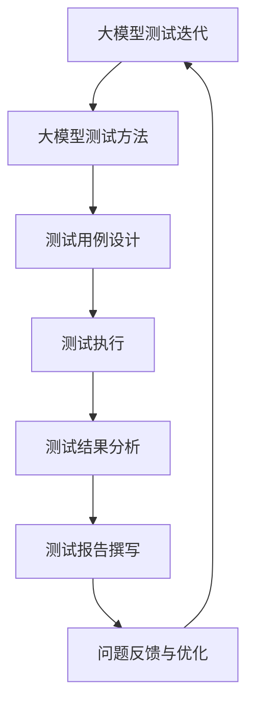

                 

### 文章标题：《滴滴2024校招测试开发工程师面试题详解》

#### 关键词：滴滴，校招，测试开发工程师，面试题，详解

##### 摘要

本文旨在为即将参加滴滴2024校招测试开发工程师岗位的考生提供全面的面试题解析。文章将按照滴滴测试开发工程师的面试内容，分为三个部分：面试题解析、面试真题详解和实战案例分析。通过梳理基础知识、测试方法论、自动化测试、数据结构与算法、操作系统与计算机网络、数据库和软件工程等核心领域，结合实际案例，帮助考生深入理解面试题背后的原理和思路。此外，文章还将分享面试技巧与经验，为考生提供实用的准备方法和面试策略。希望通过本文，考生能够全面提升自己的面试能力，顺利通过滴滴校招测试开发工程师的面试。

## 《滴滴2024校招测试开发工程师面试题详解》目录大纲

### 第一部分：面试题解析

#### 第1章：测试开发工程师基础知识

##### 1.1 软件测试概述

- 软件测试的定义

软件测试是一个评估软件产品质量的过程，目的是发现软件中的错误和缺陷，确保软件按照预期正常运行。

- 软件测试的分类

按测试阶段分类：单元测试、集成测试、系统测试、验收测试等。

按测试方法分类：黑盒测试、白盒测试、灰盒测试等。

- 软件测试的目标

确保软件产品的正确性、可靠性、安全性、可维护性等。

- 测试方法

功能测试：验证软件的功能是否符合需求。

性能测试：评估软件在不同负载下的性能表现。

安全测试：检测软件的安全漏洞和潜在风险。

- 测试开发在流程中的位置

测试开发是软件开发过程中的重要环节，贯穿于整个开发周期。其主要包括自动化测试工具的开发、测试框架的设计和测试用例的编写等。

##### 1.2 软件开发流程

- 软件开发生命周期

需求分析、设计、开发、测试、部署和维护。

- 软件开发方法

瀑布模型、敏捷开发、迭代开发等。

- 测试开发在流程中的位置

测试开发是软件开发过程中的重要环节，贯穿于整个开发周期。其主要包括自动化测试工具的开发、测试框架的设计和测试用例的编写等。

##### 1.3 软件测试工具

- 自动化测试工具

Selenium、Appium、JMeter等。

- 性能测试工具

LoadRunner、JMeter、Gatling等。

- 持续集成工具

Jenkins、GitLab CI、Travis CI等。

### 第二部分：面试真题详解

#### 第2章：测试方法论

##### 2.1 黑盒测试

- 功能测试

测试软件的功能是否符合需求。

- 非功能测试

测试软件的性能、安全、兼容性等。

- 测试用例设计

设计合理的测试用例，确保测试全面覆盖。

##### 2.2 白盒测试

- 结构测试

测试软件的内部结构，如模块划分、代码复用等。

- 逻辑驱动测试

测试软件的执行路径，如分支、循环等。

- 代码覆盖率分析

分析代码被测试覆盖的程度，提高测试质量。

##### 2.3 测试策略

- 测试计划

明确测试的目标、范围、方法和资源。

- 测试设计

设计合理的测试用例，确保测试全面覆盖。

- 测试执行

执行测试用例，记录测试结果。

- 测试报告

总结测试过程和结果，提出改进建议。

#### 第3章：自动化测试

##### 3.1 自动化测试基础

- 自动化测试的优势与局限

优势：提高测试效率、保证测试质量、减少人力成本。

局限：测试工具的选择和开发成本、维护成本等。

- 自动化测试流程

测试需求分析、测试用例设计、测试工具选择、测试脚本开发、测试执行、测试报告。

- 自动化测试框架

如Selenium、Appium等。

##### 3.2 编程语言基础

- Python基础

数据类型、流程控制、函数、模块等。

- Java基础

类和对象、异常处理、多线程等。

- Shell脚本基础

变量、流程控制、函数等。

##### 3.3 自动化测试工具应用

- Selenium

Web自动化测试框架。

- Appium

移动端自动化测试框架。

- JMeter

性能测试工具。

### 第三部分：实战案例分析

#### 第4章：测试项目实战

##### 4.1 项目背景

- 项目介绍

介绍项目的功能和目标。

- 项目目标

明确项目需要达到的性能指标、安全要求等。

##### 4.2 测试计划与策略

- 测试需求分析

分析项目需求，确定测试重点。

- 测试方案设计

设计合适的测试方法、测试用例。

- 测试环境搭建

搭建符合项目需求的测试环境。

##### 4.3 测试执行与结果分析

- 功能测试

测试软件的功能是否按照预期运行。

- 性能测试

评估软件的性能表现，如响应时间、并发用户数等。

- 安全测试

检查软件的安全漏洞和潜在风险。

##### 4.4 测试报告与问题反馈

- 测试报告撰写

总结测试过程和结果。

- 问题定位与反馈

分析测试中遇到的问题，提出改进建议。

### 第四部分：面试技巧与经验分享

#### 第5章：面试技巧与经验分享

##### 5.1 面试准备

- 面试类型分析

了解不同类型的面试，如电话面试、在线面试、现场面试等。

- 面试问题预测

预测常见的面试问题，准备合适的回答。

- 个人简历优化

突出自己的技术能力和项目经验。

##### 5.2 面试流程

- 面试沟通技巧

清晰表达、善于倾听、自信但不自大。

- 面试常见问题

如自我介绍、项目经历、技术问题等。

- 面试官心态调整

保持平和心态，从容应对。

##### 5.3 面试经验分享

- 成功面试案例

分享成功面试的经验和心得。

- 失败面试反思

分析失败的原因，总结经验教训。

- 职业规划建议

为自己的职业发展制定合适的规划。

### 附录

#### 附录A：面试题库

- 数据结构与算法题库

如排序、查找、图算法等。

- 操作系统与计算机网络题库

如进程管理、内存管理、网络协议等。

- 数据库题库

如关系型数据库、非关系型数据库、SQL语言等。

- 软件工程题库

如软件工程过程、软件开发方法、软件质量保证等。

#### 附录B：常见面试题解析

- Python面试题解析

如Python基础、常用库、算法等。

- Java面试题解析

如Java基础、多线程、JVM等。

- Shell脚本面试题解析

如Shell基础、流程控制、函数等。

#### 附录C：参考资料

- 主要参考书籍

如《软件工程》、《操作系统原理》、《计算机网络》等。

- 网络资源链接

如GitHub、Stack Overflow、LeetCode等。

- 行业资讯网站

如InfoQ、CSDN、36氪等。

### 第10章：大模型测试应用

##### 10.1 大模型概述

- 大模型的概念

大模型是指具有极高参数量和计算复杂度的深度学习模型，如GPT-3、BERT等。

- 大模型的优势

提高自然语言处理、计算机视觉等任务的性能。

- 大模型的应用场景

如智能客服、智能写作、图像识别等。

##### 10.2 大模型测试方法

- 大模型测试挑战

测试覆盖全面、测试数据多样性、测试效率等。

- 大模型测试策略

如单元测试、集成测试、性能测试等。

- 大模型测试工具

如TensorFlow、PyTorch等。

##### 10.3 大模型测试案例

- 大模型测试实战

介绍实际的大模型测试案例。

- 大模型测试报告

总结测试过程和结果。

- 大模型测试优化

分析测试中遇到的问题，提出优化方案。

##### 10.4 大模型测试趋势

- 大模型测试发展方向

如测试自动化、测试数据增强等。

- 大模型测试新技术

如联邦学习、迁移学习等。

- 大模型测试在滴滴的应用前景

探讨大模型测试在滴滴的实际应用和未来发展。 

### 核心概念与联系

为了帮助读者更好地理解文章中涉及的核心概念和它们之间的关系，我们将使用Mermaid流程图来展示大模型与测试开发的关系。

以下是一个示例Mermaid流程图，展示了大模型与测试开发工程师的几个关键环节及其相互关系：



在这个流程图中，每个节点代表一个关键环节，线条表示环节之间的关联和迭代过程。例如，大模型测试方法（B）将指导测试用例设计（C），测试执行（D）将产生测试结果（E），然后根据这些结果进行测试报告撰写（F）和问题反馈与优化（G），最后返回到大模型测试方法（B）进行进一步的优化和迭代。

通过这种方式，读者可以清晰地理解大模型测试在整个测试开发流程中的地位和作用，从而为实际应用提供有价值的参考。

### 第1章：测试开发工程师基础知识

测试开发工程师是软件开发过程中的重要角色，他们负责编写测试代码、设计测试用例、执行测试，并分析测试结果，以确保软件产品的质量。本章节将详细介绍测试开发工程师所需掌握的基础知识，包括软件测试概述、软件开发流程和测试工具。

#### 1.1 软件测试概述

软件测试是确保软件产品质量的重要手段。它是指通过一系列有计划的和系统的活动来评估软件产品的质量。软件测试的主要目标包括：

1. **发现缺陷**：识别软件中的错误和缺陷，以便修复。
2. **提高质量**：通过测试来确保软件产品符合设计要求。
3. **降低风险**：确保软件产品在发布前能够正常运行，降低潜在的风险。

##### 软件测试的定义

软件测试是一种评估软件产品质量的手段，它通过对软件进行各种测试来发现缺陷和错误。测试可以是功能性的，也可以是非功能性的，具体取决于测试的目标。

##### 软件测试的分类

- **按测试阶段分类**：
  - 单元测试：针对单个模块或函数的测试。
  - 集成测试：将多个模块集成后进行的测试。
  - 系统测试：对整个系统的测试，包括功能、性能、兼容性等。
  - 验收测试：在软件交付用户前的最终测试。

- **按测试方法分类**：
  - 黑盒测试：测试人员不了解内部结构，仅通过输入和输出测试功能。
  - 白盒测试：测试人员了解内部结构，测试代码的逻辑路径。
  - 灰盒测试：结合黑盒测试和白盒测试的测试方法。

##### 软件测试的目标

- **功能测试**：确保软件的功能符合需求规格说明。
- **性能测试**：评估软件在不同负载下的性能表现。
- **安全测试**：检测软件的安全漏洞和潜在风险。
- **兼容性测试**：确保软件在各种平台和环境中都能正常运行。

##### 测试方法

- **功能测试**：通过输入特定的数据和预定的操作来验证软件功能是否正确。
- **性能测试**：通过模拟高负载场景来评估软件的性能，如响应时间、并发用户数等。
- **安全测试**：通过攻击和渗透测试来发现软件的安全漏洞。
- **兼容性测试**：在不同操作系统、浏览器和硬件上测试软件的兼容性。

##### 测试开发在流程中的位置

测试开发是软件开发流程中的一个重要环节，它贯穿于整个开发周期。测试开发工程师的主要职责包括：

1. **编写测试代码**：编写自动化测试脚本，以减少重复性劳动和确保测试覆盖全面。
2. **设计测试用例**：根据需求规格说明，设计合理的测试用例，确保测试全面覆盖。
3. **执行测试**：运行测试脚本，记录测试结果。
4. **分析测试结果**：分析测试结果，找出软件中的缺陷和问题，并与开发人员合作进行修复。

#### 1.2 软件开发流程

软件开发流程是指将软件需求转化为可运行软件的过程。常见的软件开发流程包括以下阶段：

##### 软件开发生命周期

- **需求分析**：收集和分析用户需求，明确软件的功能和性能要求。
- **设计**：根据需求分析结果，设计软件的架构和模块。
- **开发**：编写代码，实现软件功能。
- **测试**：对软件进行各种测试，确保其质量。
- **部署**：将软件部署到生产环境，供用户使用。
- **维护**：对软件进行维护和更新，确保其持续运行。

##### 软件开发方法

- **瀑布模型**：将软件开发过程划分为不同的阶段，每个阶段完成后才能进入下一个阶段。
- **敏捷开发**：强调迭代和增量开发，快速响应需求变化。
- **迭代开发**：通过多次迭代，逐步完善软件功能。

##### 测试开发在流程中的位置

测试开发在软件开发流程中占据重要位置。它不仅贯穿于整个开发周期，而且在每个阶段都发挥着关键作用：

1. **需求分析**：测试开发工程师参与需求分析，确保测试用例能够覆盖所有功能点。
2. **设计**：测试开发工程师参与软件设计，确保测试框架和测试工具能够满足测试需求。
3. **开发**：测试开发工程师编写测试脚本，进行自动化测试，确保软件功能符合预期。
4. **测试**：测试开发工程师执行各种测试，包括单元测试、集成测试、系统测试和验收测试。
5. **部署**：测试开发工程师参与部署测试，确保软件在生产环境中正常运行。

#### 1.3 软件测试工具

软件测试工具是测试开发工程师的重要工具，它们可以帮助提高测试效率和质量。以下是一些常见的软件测试工具：

##### 自动化测试工具

- **Selenium**：Web自动化测试工具，支持多种编程语言。
- **Appium**：移动端自动化测试工具，支持iOS和Android平台。
- **JMeter**：性能测试工具，适用于Web和应用程序。

##### 性能测试工具

- **LoadRunner**：适用于Web和应用程序的性能测试工具。
- **Gatling**：高性能的Web性能测试工具。

##### 持续集成工具

- **Jenkins**：开源的持续集成工具，支持多种构建工具和插件。
- **GitLab CI**：GitLab内置的持续集成服务。
- **Travis CI**：基于云计算的持续集成服务。

通过使用这些工具，测试开发工程师可以自动化测试流程、提高测试覆盖率和测试效率，从而确保软件产品的质量。

### 第2章：测试方法论

测试方法论是指测试过程中所采用的方法、技术和策略。有效的测试方法论可以帮助测试开发工程师更全面、高效地发现软件缺陷，确保软件质量。本章节将介绍黑盒测试、白盒测试和测试策略等测试方法论。

#### 2.1 黑盒测试

黑盒测试是一种不关心软件内部结构和实现细节的测试方法。测试人员仅通过输入和输出数据来验证软件功能是否符合预期。黑盒测试适用于功能测试和系统测试。

##### 功能测试

功能测试是黑盒测试中最常见的类型，它的目标是验证软件功能是否符合需求规格说明。功能测试的步骤如下：

1. **需求分析**：分析需求规格说明，确定测试目标。
2. **测试用例设计**：设计测试用例，确保覆盖所有功能点。
3. **执行测试**：运行测试用例，记录测试结果。
4. **结果分析**：分析测试结果，找出缺陷。

##### 非功能测试

非功能测试包括性能测试、安全测试和兼容性测试等。这些测试关注软件的非功能性需求，如响应时间、并发用户数、安全漏洞和兼容性等。

1. **性能测试**：通过模拟高负载场景，评估软件的性能指标，如响应时间、吞吐量和并发用户数。
2. **安全测试**：通过渗透测试和漏洞扫描，发现软件的安全漏洞。
3. **兼容性测试**：在不同操作系统、浏览器和硬件上测试软件的兼容性，确保其正常运行。

##### 测试用例设计

测试用例设计是功能测试的核心环节，它决定了测试的覆盖范围和效果。一个好的测试用例应具备以下特点：

1. **可复现性**：测试用例能够在相同的条件下复现。
2. **完整性**：测试用例能够覆盖所有功能点。
3. **独立性**：测试用例之间相互独立，不会相互影响。

测试用例设计的方法包括：

1. **边界值分析**：设计测试用例，覆盖输入数据的边界值。
2. **等价类划分**：将输入数据划分为等价类，为每个等价类设计测试用例。
3. **因果图**：通过因果关系设计测试用例。

#### 2.2 白盒测试

白盒测试是一种关心软件内部结构和实现细节的测试方法。测试人员通过分析代码路径和逻辑，设计测试用例来验证软件的正确性。白盒测试适用于单元测试和集成测试。

##### 结构测试

结构测试是白盒测试中最常用的类型，它的目标是验证软件的内部结构是否正确。结构测试的方法包括：

1. **语句覆盖**：确保程序中的每条语句至少执行一次。
2. **分支覆盖**：确保程序中的每个分支至少执行一次。
3. **条件覆盖**：确保程序中的每个条件至少为真一次和假一次。
4. **路径覆盖**：确保程序中的每条路径至少执行一次。

##### 逻辑驱动测试

逻辑驱动测试是一种基于软件逻辑结构的测试方法，它的目标是验证软件逻辑的正确性。逻辑驱动测试的方法包括：

1. **判定覆盖**：确保程序中的每个判定至少为真一次和假一次。
2. **条件组合覆盖**：确保程序中的每个条件的所有组合至少为真一次和假一次。

##### 代码覆盖率分析

代码覆盖率分析是一种衡量测试覆盖程度的指标，它可以帮助测试开发工程师评估测试的全面性。常见的代码覆盖率指标包括：

1. **语句覆盖率**：测试中执行的语句占总语句数的比例。
2. **分支覆盖率**：测试中执行的分支占总分支数的比例。
3. **条件覆盖率**：测试中执行的条件占总条件的比例。
4. **路径覆盖率**：测试中执行的路径占总路径数的比例。

通过代码覆盖率分析，测试开发工程师可以识别测试中的盲区，并针对性地优化测试用例。

#### 2.3 测试策略

测试策略是指在整个测试过程中所采用的方法和步骤。一个有效的测试策略可以帮助测试开发工程师更高效地发现软件缺陷，确保软件质量。测试策略通常包括以下环节：

##### 测试计划

测试计划是测试策略的第一步，它明确了测试的目标、范围、方法和资源。测试计划的步骤如下：

1. **确定测试目标**：明确测试的目的和目标。
2. **确定测试范围**：明确测试的模块和功能。
3. **确定测试方法**：选择合适的测试方法，如功能测试、性能测试等。
4. **分配资源**：确定测试所需的人员、设备和时间。

##### 测试设计

测试设计是测试策略的核心环节，它决定了测试用例的设计和执行。测试设计的步骤如下：

1. **需求分析**：分析需求规格说明，确定测试目标。
2. **设计测试用例**：根据需求分析结果，设计测试用例，确保覆盖所有功能点。
3. **评估测试用例**：评估测试用例的覆盖率和完整性。
4. **优化测试用例**：根据评估结果，优化测试用例。

##### 测试执行

测试执行是测试策略的关键步骤，它包括运行测试用例、记录测试结果和分析测试结果。测试执行的步骤如下：

1. **执行测试用例**：运行测试用例，记录测试结果。
2. **分析测试结果**：分析测试结果，找出缺陷和问题。
3. **报告测试结果**：编写测试报告，总结测试过程和结果。

##### 测试报告

测试报告是测试策略的最后一步，它总结了测试过程、结果和发现的问题。测试报告的步骤如下：

1. **编写测试报告**：总结测试过程、结果和发现的问题。
2. **提交测试报告**：向相关利益相关者提交测试报告。
3. **问题反馈**：针对发现的问题，提出改进建议和解决方案。

通过以上测试策略，测试开发工程师可以确保软件产品的质量，及时发现和修复缺陷，从而提高软件的可靠性、安全性和用户满意度。

### 第3章：自动化测试

自动化测试是测试开发工程师必备的技能，它通过编写测试脚本和自动化工具，实现测试过程的自动化。自动化测试不仅可以提高测试效率，还可以确保测试的准确性和一致性。本章将介绍自动化测试的基础知识、编程语言基础和自动化测试工具的应用。

#### 3.1 自动化测试基础

自动化测试是一种通过编写脚本和使用自动化工具，自动执行测试过程的方法。与手动测试相比，自动化测试具有以下优势：

1. **提高测试效率**：自动化测试可以快速执行大量测试用例，节省时间和人力成本。
2. **确保测试准确性**：自动化测试减少人为因素，确保测试结果的一致性和准确性。
3. **提高测试覆盖率**：自动化测试可以覆盖更多的测试场景，提高测试覆盖率。
4. **便于回归测试**：自动化测试可以方便地进行回归测试，确保新功能引入的缺陷不会影响原有功能。

##### 自动化测试的优势与局限

**优势**：

1. **提高测试效率**：自动化测试可以快速执行大量测试用例，节省时间和人力成本。
2. **确保测试准确性**：自动化测试减少人为因素，确保测试结果的一致性和准确性。
3. **提高测试覆盖率**：自动化测试可以覆盖更多的测试场景，提高测试覆盖率。
4. **便于回归测试**：自动化测试可以方便地进行回归测试，确保新功能引入的缺陷不会影响原有功能。

**局限**：

1. **测试工具和框架的选择和开发成本**：选择合适的测试工具和开发自动化测试框架需要投入一定的时间和资源。
2. **维护成本**：自动化测试脚本需要定期维护，以适应软件的变更。
3. **测试数据的管理**：自动化测试需要大量的测试数据，数据的管理和维护是一项挑战。

##### 自动化测试流程

自动化测试流程包括以下步骤：

1. **测试需求分析**：分析测试需求，确定自动化测试的目标和范围。
2. **测试用例设计**：设计自动化测试用例，确保覆盖所有功能点。
3. **测试工具选择**：选择适合的自动化测试工具，如Selenium、Appium等。
4. **测试脚本开发**：编写自动化测试脚本，实现测试用例。
5. **测试执行**：执行自动化测试脚本，记录测试结果。
6. **结果分析**：分析测试结果，找出缺陷和问题。
7. **测试报告**：编写测试报告，总结测试过程和结果。

##### 自动化测试框架

自动化测试框架是指用于组织、管理和执行自动化测试的一系列工具和组件。常见的自动化测试框架包括：

1. **Selenium**：用于Web自动化测试的开源框架，支持多种编程语言。
2. **Appium**：用于移动端自动化测试的开源框架，支持iOS和Android平台。
3. **Robot Framework**：用于各种类型自动化测试的开源框架，支持多种编程语言。
4. **JUnit**：Java语言的自动化测试框架，用于单元测试。

##### 自动化测试在测试开发中的地位和作用

自动化测试在测试开发中占据重要地位，它不仅提高了测试效率和质量，还确保了软件产品的可靠性。具体来说，自动化测试在测试开发中的作用包括：

1. **提高测试覆盖率**：通过自动化测试，可以覆盖更多的测试场景，提高测试覆盖率。
2. **确保测试一致性**：自动化测试减少人为因素，确保测试结果的一致性和准确性。
3. **加快回归测试**：自动化测试可以方便地进行回归测试，确保新功能引入的缺陷不会影响原有功能。
4. **节省测试成本**：自动化测试可以节省测试时间和人力成本，提高测试效率。

#### 3.2 编程语言基础

自动化测试通常需要编写测试脚本，因此掌握一定的编程语言基础是必要的。以下介绍几种常用的编程语言基础。

##### Python基础

Python是一种流行的编程语言，广泛应用于自动化测试。Python基础包括：

1. **数据类型**：Python支持多种数据类型，如整数、浮点数、字符串等。
2. **流程控制**：Python支持条件判断、循环等流程控制语句。
3. **函数**：Python支持定义函数，方便代码重用。
4. **模块**：Python支持模块化编程，方便代码管理和维护。

##### Java基础

Java是一种面向对象编程语言，广泛应用于自动化测试和企业级应用。Java基础包括：

1. **类和对象**：Java支持面向对象编程，类和对象是Java编程的核心。
2. **异常处理**：Java支持异常处理，确保程序的健壮性。
3. **多线程**：Java支持多线程编程，提高程序的并发能力。

##### Shell脚本基础

Shell脚本是一种用于自动化任务的脚本语言，广泛应用于自动化测试和系统运维。Shell脚本基础包括：

1. **变量**：Shell脚本支持变量，用于存储和操作数据。
2. **流程控制**：Shell脚本支持条件判断、循环等流程控制语句。
3. **函数**：Shell脚本支持定义函数，方便代码重用。

#### 3.3 自动化测试工具应用

自动化测试工具是自动化测试的核心组成部分，它们可以帮助测试开发工程师高效地编写、执行和分析测试脚本。以下介绍几种常用的自动化测试工具。

##### Selenium

Selenium是一个开源的Web自动化测试工具，支持多种编程语言，如Python、Java、C#等。Selenium的主要功能包括：

1. **Web元素定位**：Selenium支持多种Web元素定位方法，如ID、Name、Class Name、XPath等。
2. **浏览器控制**：Selenium可以控制浏览器进行各种操作，如打开、关闭、前进、后退等。
3. **测试报告**：Selenium支持生成详细的测试报告。

##### Appium

Appium是一个开源的移动端自动化测试工具，支持iOS和Android平台。Appium的主要功能包括：

1. **原生应用测试**：Appium支持原生应用自动化测试，无需修改原生应用代码。
2. **Web应用测试**：Appium支持Web应用自动化测试，无需使用特殊的Web View。
3. **混合应用测试**：Appium支持混合应用自动化测试，结合原生应用和Web应用的特点。

##### JMeter

JMeter是一个开源的性能测试工具，适用于Web和应用程序。JMeter的主要功能包括：

1. **负载生成**：JMeter可以模拟大量用户同时访问应用程序，生成负载。
2. **性能分析**：JMeter可以收集和分析性能数据，如响应时间、吞吐量、并发用户数等。
3. **测试报告**：JMeter支持生成详细的性能测试报告。

通过使用这些自动化测试工具，测试开发工程师可以高效地编写、执行和分析测试脚本，确保软件产品的质量。

### 第4章：数据结构与算法

数据结构与算法是计算机科学的基础，也是软件测试工程师必备的技能之一。掌握常见的数据结构和算法，能够帮助测试开发工程师更好地理解和分析代码，从而更有效地进行测试。本章将详细介绍常见的数据结构、算法基础以及算法面试题解析。

#### 4.1 常用数据结构

数据结构是组织和存储数据的方式。常见的有数组、链表、栈、队列、树和图等。

##### 数组

数组是一种线性数据结构，它由一系列元素组成，每个元素都有一个索引。数组的特点是支持随机访问，即可以通过索引直接访问到指定位置的元素。

伪代码示例：

```python
# 初始化一个数组
array = [1, 2, 3, 4, 5]

# 访问数组中的元素
print(array[2])  # 输出 3

# 修改数组中的元素
array[2] = 6
```

##### 链表

链表是一种由节点组成的线性数据结构，每个节点包含数据和指向下一个节点的指针。链表的特点是插入和删除操作可以在常数时间内完成。

伪代码示例：

```python
# 定义节点结构
class Node:
    def __init__(self, data):
        self.data = data
        self.next = None

# 创建链表
head = Node(1)
head.next = Node(2)
head.next.next = Node(3)

# 遍历链表
current = head
while current is not None:
    print(current.data)
    current = current.next
```

##### 栈

栈是一种后进先出（LIFO）的数据结构，元素只能从顶部进行插入和删除操作。

伪代码示例：

```python
# 定义栈
class Stack:
    def __init__(self):
        self.items = []

    # 入栈
    def push(self, item):
        self.items.append(item)

    # 出栈
    def pop(self):
        return self.items.pop()

# 使用栈
stack = Stack()
stack.push(1)
stack.push(2)
print(stack.pop())  # 输出 2
```

##### 队列

队列是一种先进先出（FIFO）的数据结构，元素只能从队尾进行插入和队首进行删除操作。

伪代码示例：

```python
# 定义队列
class Queue:
    def __init__(self):
        self.items = []

    # 入队
    def enqueue(self, item):
        self.items.append(item)

    # 出队
    def dequeue(self):
        return self.items.pop(0)

# 使用队列
queue = Queue()
queue.enqueue(1)
queue.enqueue(2)
print(queue.dequeue())  # 输出 1
```

##### 树

树是一种层级结构的数据结构，包括根节点、子节点和叶子节点。常见的树结构有二叉树、平衡树、堆等。

伪代码示例：

```python
# 定义二叉树节点
class TreeNode:
    def __init__(self, data):
        self.data = data
        self.left = None
        self.right = None

# 创建二叉树
root = TreeNode(1)
root.left = TreeNode(2)
root.right = TreeNode(3)

# 遍历二叉树
def inorder_traversal(node):
    if node is not None:
        inorder_traversal(node.left)
        print(node.data)
        inorder_traversal(node.right)

inorder_traversal(root)  # 输出 1 2 3
```

##### 图

图是一种由节点和边组成的数据结构，节点表示实体，边表示实体之间的关系。

伪代码示例：

```python
# 定义图
class Graph:
    def __init__(self):
        self.nodes = []
        self.edges = []

    # 添加节点
    def add_node(self, node):
        self.nodes.append(node)

    # 添加边
    def add_edge(self, node1, node2):
        self.edges.append((node1, node2))

# 创建图
graph = Graph()
graph.add_node('A')
graph.add_node('B')
graph.add_edge('A', 'B')

# 遍历图
def breadth_first_search(graph, start):
    visited = set()
    queue = [start]

    while queue:
        node = queue.pop(0)
        if node not in visited:
            print(node)
            visited.add(node)
            for neighbor in graph.nodes:
                if neighbor not in visited:
                    queue.append(neighbor)

breadth_first_search(graph, 'A')  # 输出 A B
```

#### 4.2 算法基础

算法是解决问题的方法。常见的算法有排序算法、搜索算法和图算法等。

##### 排序算法

排序算法是将一组元素按照特定顺序排列的方法。常见的排序算法有冒泡排序、选择排序、插入排序、快速排序等。

伪代码示例：

```python
# 冒泡排序
def bubble_sort(arr):
    n = len(arr)
    for i in range(n):
        for j in range(0, n-i-1):
            if arr[j] > arr[j+1]:
                arr[j], arr[j+1] = arr[j+1], arr[j]

# 使用冒泡排序
arr = [64, 34, 25, 12, 22, 11, 90]
bubble_sort(arr)
print(arr)  # 输出 [11, 12, 22, 25, 34, 64, 90]
```

##### 搜索算法

搜索算法是在数据结构中查找特定元素的方法。常见的搜索算法有线性搜索、二分搜索等。

伪代码示例：

```python
# 线性搜索
def linear_search(arr, target):
    for i in range(len(arr)):
        if arr[i] == target:
            return i
    return -1

# 使用线性搜索
arr = [64, 34, 25, 12, 22, 11, 90]
index = linear_search(arr, 11)
print(index)  # 输出 5
```

##### 算法复杂度分析

算法复杂度分析是评估算法性能的方法。常见的是时间复杂度和空间复杂度。

1. **时间复杂度**：评估算法执行时间与输入数据规模的关系。
2. **空间复杂度**：评估算法占用内存与输入数据规模的关系。

例如，冒泡排序的时间复杂度为 \(O(n^2)\)，空间复杂度为 \(O(1)\)。

#### 4.3 算法面试题解析

算法面试题是测试开发工程师在面试中常见的问题。以下是一些常见的算法面试题及其解析：

##### 动态规划问题

**问题**：给定一个数组，找出最长递增子序列的长度。

**解析**：

动态规划方法是求解此类问题的常用方法。以下是一个使用动态规划的伪代码示例：

```python
# 动态规划求解最长递增子序列长度
def longest_increasing_subsequence(arr):
    n = len(arr)
    dp = [1] * n

    for i in range(1, n):
        for j in range(i):
            if arr[i] > arr[j]:
                dp[i] = max(dp[i], dp[j] + 1)

    return max(dp)

# 使用示例
arr = [3, 10, 2, 1, 20]
print(longest_increasing_subsequence(arr))  # 输出 3
```

##### 贪心算法问题

**问题**：给定一个数组，找出数组中的最大子序列和。

**解析**：

贪心算法是一种在每一步选择最优解的算法。以下是一个使用贪心算法的伪代码示例：

```python
# 贪心算法求解最大子序列和
def max_subsequence_sum(arr):
    max_sum = float('-inf')
    current_sum = 0

    for num in arr:
        current_sum += num
        max_sum = max(max_sum, current_sum)
        if current_sum < 0:
            current_sum = 0

    return max_sum

# 使用示例
arr = [1, -2, 3, 4, -5, 6]
print(max_subsequence_sum(arr))  # 输出 10
```

##### 回溯算法问题

**问题**：给定一个数组，找出所有的子集。

**解析**：

回溯算法是一种通过尝试所有可能的解来找到问题的解的方法。以下是一个使用回溯算法的伪代码示例：

```python
# 回溯算法求解子集
def subsets(arr):
    result = []
    subset = []

    def backtrack(start):
        result.append(list(subset))
        for i in range(start, len(arr)):
            subset.append(arr[i])
            backtrack(i + 1)
            subset.pop()

    backtrack(0)
    return result

# 使用示例
arr = [1, 2, 3]
print(subsets(arr))  # 输出 [[], [1], [1, 2], [1, 2, 3], [1, 3], [2], [2, 3], [3]]
```

##### 分治算法问题

**问题**：给定一个整数数组，找出数组中的第k大元素。

**解析**：

分治算法是一种将问题分解成更小子问题来求解的方法。以下是一个使用分治算法的伪代码示例：

```python
# 快速选择算法求解第k大元素
def quickselect(arr, k):
    if len(arr) == 1:
        return arr[0]

    pivot = arr[len(arr) // 2]
    left = [x for x in arr if x < pivot]
    middle = [x for x in arr if x == pivot]
    right = [x for x in arr if x > pivot]

    if k < len(left):
        return quickselect(left, k)
    elif k < len(left) + len(middle):
        return arr[k]
    else:
        return quickselect(right, k - len(left) - len(middle))

# 使用示例
arr = [3, 2, 1, 5, 6, 4]
k = 2
print(quickselect(arr, k))  # 输出 5
```

通过以上解析，读者可以更好地理解和解决常见的算法面试题，从而提升自己的算法能力。

### 第5章：操作系统与计算机网络

操作系统和计算机网络是计算机科学中的核心领域，它们对软件测试开发工程师的工作具有深远的影响。理解操作系统的基本原理和计算机网络的通信机制，有助于测试开发工程师更有效地进行系统测试和性能测试。本章将详细介绍操作系统的基本概念、进程管理、内存管理和设备管理，以及计算机网络的基本概念、网络协议和网络安全。

#### 5.1 操作系统基础

操作系统（Operating System，简称OS）是管理计算机硬件资源和提供软件运行平台的核心软件。它负责管理计算机的处理器、内存、存储、输入输出设备等硬件资源，并提供各种服务，以支持应用程序的运行。

##### 进程管理

进程（Process）是操作系统中运行的程序实例。操作系统通过进程管理来控制进程的创建、执行、挂起和终止。

1. **进程状态**：进程可以处于运行、就绪、阻塞和终止等状态。
2. **进程调度**：操作系统通过进程调度算法来决定哪个进程获得CPU时间。常见的调度算法有先来先服务（FCFS）、最短作业优先（SJF）、优先级调度等。
3. **进程同步与通信**：操作系统提供同步机制，如互斥锁、信号量等，以避免多个进程同时访问共享资源导致数据不一致。进程通信机制包括管道、消息队列、信号和信号量等。

##### 内存管理

内存管理是操作系统的一项重要功能，它负责分配和回收内存资源。

1. **内存分配策略**：常见的内存分配策略有首次适配、最佳适配和最坏适配等。
2. **内存保护**：操作系统通过内存保护机制来防止进程访问不属于它的内存区域。
3. **虚拟内存**：虚拟内存通过将物理内存与磁盘存储相结合，提供比实际物理内存更大的地址空间。

##### 文件系统

文件系统是操作系统用于管理和存储文件的一种机制。

1. **文件类型**：文件可以分为普通文件、目录文件、设备文件和特殊文件等。
2. **文件操作**：操作系统提供文件创建、删除、读取、写入和修改等操作。
3. **文件权限**：操作系统通过文件权限来控制对文件的访问权限。

##### 设备管理

设备管理负责管理和控制计算机的输入输出设备。

1. **设备分配**：操作系统通过设备分配算法来管理设备的分配和释放。
2. **缓冲区管理**：操作系统使用缓冲区来减少设备访问速度与处理器速度之间的差异。
3. **中断处理**：操作系统通过中断处理来响应设备请求，进行设备管理和数据传输。

#### 5.2 计算机网络基础

计算机网络是指通过通信线路连接起来的计算机系统的集合。它使得计算机之间可以交换数据、共享资源和服务。

##### 网络协议

网络协议是计算机网络中用于数据传输的一套规则。常见的网络协议包括TCP/IP、HTTP、FTP、SMTP等。

1. **TCP/IP协议**：TCP/IP是一组用于互联网通信的协议，包括传输控制协议（TCP）和因特网协议（IP）。
2. **HTTP协议**：HTTP是用于Web应用的协议，定义了浏览器和服务器之间的通信规则。
3. **FTP协议**：FTP是用于文件传输的协议，允许用户在网络上传输文件。

##### 网络模型

网络模型定义了网络中各个层次的通信规则和功能。最常用的网络模型是OSI七层模型和TCP/IP四层模型。

1. **OSI七层模型**：OSI七层模型将网络通信分为物理层、数据链路层、网络层、传输层、会话层、表示层和应用层。
2. **TCP/IP四层模型**：TCP/IP四层模型将网络通信分为网络接口层、互联网层、传输层和应用层。

##### 网络安全

网络安全是指保护计算机网络不受未经授权的访问、攻击和破坏。网络安全的关键技术包括：

1. **防火墙**：防火墙是一种网络安全设备，用于监控和控制进出网络的数据流。
2. **加密技术**：加密技术用于保护数据的机密性和完整性。
3. **入侵检测系统**：入侵检测系统用于检测网络中的异常行为和潜在攻击。
4. **虚拟私人网络（VPN）**：VPN是一种通过公共网络建立安全通信通道的技术。

#### 5.3 操作系统与网络面试题解析

在面试中，操作系统和网络相关的题目经常出现。以下是一些常见的面试题及其解析：

##### 进程同步与通信

**问题**：什么是进程同步？举例说明常见的进程同步机制。

**解析**：

进程同步是指在多个进程之间协调执行，避免竞争条件和死锁等问题。

1. **互斥锁（Mutex）**：互斥锁是一种保证在同一时间只有一个进程能访问共享资源的同步机制。
2. **信号量（Semaphore）**：信号量是一种用于控制进程对共享资源的访问的同步机制。
3. **条件变量（Condition Variable）**：条件变量是一种用于进程之间等待和通知的同步机制。

示例：

```c
// 使用互斥锁的进程同步示例
#include <pthread.h>

pthread_mutex_t lock;

void *process_function(void *arg) {
    pthread_mutex_lock(&lock);
    // 进程执行临界区
    pthread_mutex_unlock(&lock);
}
```

##### 网络性能优化

**问题**：什么是网络性能优化？举例说明常见的网络性能优化方法。

**解析**：

网络性能优化是指通过改进网络架构和协议，提高网络的传输速度和稳定性。

1. **负载均衡**：通过将网络流量分配到多个服务器，提高网络资源的利用率。
2. **缓存技术**：通过缓存常见的数据和请求，减少网络延迟。
3. **链路聚合**：通过将多个物理链路合并成一个逻辑链路，提高网络带宽。
4. **流量控制**：通过控制网络流量，避免网络拥塞。

示例：

```bash
# 使用Nginx进行负载均衡的配置示例
upstream backend {
    server server1.example.com;
    server server2.example.com;
}

server {
    listen 80;
    location / {
        proxy_pass http://backend;
    }
}
```

##### 安全漏洞分析

**问题**：什么是SQL注入？如何防止SQL注入？

**解析**：

SQL注入是一种常见的网络攻击方式，攻击者通过在输入字段中插入恶意SQL语句，控制数据库。

1. **输入验证**：对所有用户输入进行验证，确保输入符合预期格式。
2. **使用参数化查询**：使用参数化查询，避免直接将用户输入作为SQL语句的一部分。
3. **使用预编译语句**：使用预编译语句，减少SQL注入的风险。

示例：

```python
# 使用参数化查询防止SQL注入
cursor = connection.cursor()
query = "SELECT * FROM users WHERE username = %s AND password = %s"
cursor.execute(query, (username, password))
```

通过以上解析，读者可以更好地理解和解决操作系统与网络相关的面试题，提升面试能力。

### 第6章：数据库

数据库是存储、管理和检索数据的系统，是软件测试开发工程师工作中不可或缺的一部分。掌握数据库的基础知识、设计方法和优化策略，有助于测试开发工程师更好地进行数据验证和性能测试。本章将详细介绍数据库的基础概念、数据库设计方法和优化策略。

#### 6.1 数据库基础

数据库（Database）是一个按照数据结构来组织、存储和管理数据的系统。它通过数据库管理系统（DBMS）来管理数据的存储、查询、更新和删除等操作。

##### 关系型数据库

关系型数据库（Relational Database）是基于关系模型的数据库。它使用表格来存储数据，并通过SQL（Structured Query Language）进行数据操作。

1. **表（Table）**：表是关系型数据库中的基本存储单位，包含行（记录）和列（字段）。
2. **关系（Relationship）**：表与表之间的关系称为关系，常见的有主外键关系、一对一关系、一对多关系等。
3. **SQL语句**：SQL语句用于对数据库进行各种操作，如创建表、插入数据、查询数据、更新数据和删除数据等。

##### 非关系型数据库

非关系型数据库（Non-Relational Database）包括文档型数据库、键值对数据库、列族数据库和图数据库等。它们不遵循关系模型，具有更高的灵活性和扩展性。

1. **文档型数据库**：如MongoDB，使用JSON格式存储数据，支持灵活的数据模型。
2. **键值对数据库**：如Redis，使用键值对存储数据，适用于高速缓存和简单存储场景。
3. **列族数据库**：如HBase，适用于大规模数据存储和高并发读取场景。
4. **图数据库**：如Neo4j，使用图结构存储数据，适用于复杂关系和社交网络场景。

##### SQL语言基础

SQL是一种用于数据库管理的语言，包括数据定义语言（DDL）、数据操作语言（DML）和数据控制语言（DCL）。

1. **数据定义语言**：用于创建、修改和删除数据库对象，如表、索引和视图等。
2. **数据操作语言**：用于插入、查询、更新和删除数据。
3. **数据控制语言**：用于控制数据库的访问权限和事务管理。

#### 6.2 数据库设计

数据库设计是创建有效数据库的过程。它包括需求分析、概念设计、逻辑设计和物理设计等阶段。

##### 实体关系模型

实体关系模型（Entity-Relationship Model，简称ER模型）用于表示数据库中实体及其关系。

1. **实体（Entity）**：表示数据库中的对象，如学生、课程等。
2. **属性（Attribute）**：表示实体的特征，如学生的姓名、年龄等。
3. **关系（Relationship）**：表示实体之间的联系，如学生选课、课程授课等。

##### 设计范式

数据库设计范式（Normalization）用于消除数据冗余和提高数据的一致性。

1. **第一范式（1NF）**：确保每个字段是不可分割的原子值。
2. **第二范式（2NF）**：确保每个非主属性完全依赖于主键。
3. **第三范式（3NF）**：确保每个非主属性不传递依赖于主键。
4. **巴斯-科德范式（BCNF）**：确保每个属性都直接依赖于主键。

##### 存储过程与触发器

存储过程（Stored Procedure）是预编译的SQL语句集合，用于执行特定的数据库操作。

1. **存储过程**：用于实现复杂的业务逻辑，如插入、更新和删除数据等。
2. **触发器（Trigger）**：是一种特殊的存储过程，用于响应数据库中的特定事件，如插入、更新和删除等。

#### 6.3 数据库面试题解析

在数据库面试中，常见的问题包括数据库设计、SQL查询优化和数据库性能分析等。以下是一些常见的数据库面试题及其解析：

##### 数据库设计题

**问题**：设计一个简单的学生管理系统数据库，包括学生表、课程表和选课表。

**解析**：

1. **学生表（Students）**：

   - 学生ID（StudentID，主键）
   - 姓名（Name）
   - 年龄（Age）
   - 性别（Gender）

2. **课程表（Courses）**：

   - 课程ID（CourseID，主键）
   - 课程名（CourseName）
   - 学分（Credit）

3. **选课表（Enrollments）**：

   - 学生ID（StudentID，外键）
   - 课程ID（CourseID，外键）
   - 成绩（Grade）

##### SQL查询优化题

**问题**：优化以下查询语句，提高查询效率。

```sql
SELECT * FROM Students
WHERE Age > 20 AND (CourseID = 1 OR CourseID = 2);
```

**解析**：

1. **避免使用SELECT ***：仅查询需要的列，避免使用SELECT *。
2. **使用索引**：为Age和CourseID创建索引，提高查询效率。
3. **使用AND优先级**：优化查询的顺序，先过滤Age，再过滤CourseID。

优化后的查询语句：

```sql
SELECT StudentID, Name, Age FROM Students
WHERE Age > 20 AND CourseID = 1 OR CourseID = 2;
```

##### 数据库性能分析题

**问题**：分析以下查询语句的性能瓶颈，并提出优化建议。

```sql
SELECT * FROM Students
JOIN Courses ON Students.CourseID = Courses.CourseID
WHERE Courses.Credit > 2;
```

**解析**：

1. **索引问题**：确保Students和Courses表的主键和关联列有索引。
2. **查询性能**：优化JOIN操作，确保JOIN条件正确。
3. **查询结果**：仅查询需要的列，避免使用SELECT *。

优化后的查询语句：

```sql
SELECT Students.StudentID, Students.Name, Students.Age, Courses.Credit FROM Students
JOIN Courses ON Students.CourseID = Courses.CourseID
WHERE Courses.Credit > 2;
```

通过以上解析，读者可以更好地理解和解决数据库相关的面试题，提升自己的数据库设计、SQL查询优化和性能分析能力。

### 第7章：软件工程

软件工程是一门研究如何高效地开发和维护软件的学科。测试开发工程师在软件工程中扮演着重要角色，他们不仅需要编写测试代码，还需要参与软件设计、代码审查、持续集成和持续部署等环节。本章将详细介绍软件工程的基础知识、软件开发实践和软件工程面试题解析。

#### 7.1 软件工程基础

软件工程是系统化、规范化、可量化的方法，用于设计、开发、测试和维护软件。软件工程的基础包括软件工程过程、软件开发方法和软件质量保证。

##### 软件工程过程

软件工程过程是指将软件需求转化为可运行软件的一系列活动和步骤。常见的软件工程过程包括瀑布模型、敏捷开发、迭代开发和V模型等。

1. **瀑布模型**：瀑布模型是一种线性顺序的开发过程，每个阶段完成后才能进入下一个阶段。
2. **敏捷开发**：敏捷开发强调迭代和增量开发，快速响应需求变化。
3. **迭代开发**：迭代开发通过多次迭代，逐步完善软件功能。
4. **V模型**：V模型强调测试过程与开发过程的紧密关联，测试活动贯穿整个开发周期。

##### 软件开发方法

软件开发方法是指软件开发过程中所采用的技术和方法。常见的软件开发方法包括瀑布模型、敏捷开发、迭代开发和V模型等。

1. **瀑布模型**：瀑布模型是一种线性顺序的开发过程，每个阶段完成后才能进入下一个阶段。
2. **敏捷开发**：敏捷开发强调迭代和增量开发，快速响应需求变化。
3. **迭代开发**：迭代开发通过多次迭代，逐步完善软件功能。
4. **V模型**：V模型强调测试过程与开发过程的紧密关联，测试活动贯穿整个开发周期。

##### 软件质量保证

软件质量保证是指确保软件产品符合预定的质量标准的过程。软件质量保证包括需求管理、设计评审、代码审查、测试和部署等环节。

1. **需求管理**：确保软件需求准确、完整和可测试。
2. **设计评审**：评估软件设计是否符合需求规格和设计规范。
3. **代码审查**：通过代码审查，发现和修复代码中的错误和缺陷。
4. **测试**：进行各种类型的测试，确保软件质量。
5. **部署**：确保软件能够顺利部署到生产环境。

#### 7.2 软件开发实践

软件开发实践是指在实际开发过程中采用的策略和工具。以下介绍一些常见的软件开发实践。

##### 版本控制

版本控制是一种用于管理软件源代码修改和版本的历史记录的方法。常见的版本控制工具包括Git和SVN。

1. **Git**：Git是一种分布式版本控制工具，支持离线工作、快速分支和合并。
2. **SVN**：SVN是一种集中式版本控制工具，适用于小规模团队和简单项目。

##### 代码审查

代码审查是一种通过同行评审来确保代码质量的方法。代码审查通常包括以下环节：

1. **代码审查流程**：确定代码审查的标准、流程和参与者。
2. **代码审查工具**：使用代码审查工具，如GitLab、Gerrit等，来管理代码审查过程。
3. **代码审查标准**：制定代码审查的标准，如代码风格、语法规范、代码复用等。

##### 持续集成与持续部署

持续集成（CI）和持续部署（CD）是一种自动化软件交付过程的方法。

1. **持续集成**：通过自动化构建和测试，确保代码质量。
2. **持续部署**：通过自动化部署，确保软件能够快速、安全地交付。

#### 7.3 软件工程面试题解析

在面试中，软件工程相关的题目是常见的。以下是一些常见的软件工程面试题及其解析：

##### 架构设计题

**问题**：什么是MVC设计模式？请简要描述其在软件设计中的应用。

**解析**：

MVC（Model-View-Controller）是一种软件设计模式，用于将应用程序分为三个主要组件：模型（Model）、视图（View）和控制器（Controller）。

1. **模型（Model）**：负责数据管理和业务逻辑。
2. **视图（View）**：负责数据展示。
3. **控制器（Controller）**：负责处理用户输入，协调模型和视图。

示例：

```python
# MVC设计模式示例
class Model:
    def __init__(self):
        self.data = []

    def add_data(self, item):
        self.data.append(item)

class View:
    def display_data(self, data):
        print("Data:", data)

class Controller:
    def __init__(self, model, view):
        self.model = model
        self.view = view

    def handle_input(self, input_data):
        self.model.add_data(input_data)
        self.view.display_data(self.model.data)
```

##### 设计模式题

**问题**：什么是单例模式？请简要描述其应用场景。

**解析**：

单例模式是一种设计模式，确保一个类只有一个实例，并提供一个全局访问点。

应用场景：

1. **日志管理器**：确保只有一个日志管理器实例。
2. **数据库连接**：确保数据库连接的唯一性。

示例：

```python
class Singleton:
    _instance = None

    def __new__(cls):
        if cls._instance is None:
            cls._instance = super(Singleton, cls).__new__(cls)
        return cls._instance

singleton = Singleton()
another_singleton = Singleton()
print(singleton is another_singleton)  # 输出 True
```

##### 软件测试策略题

**问题**：什么是测试驱动开发（TDD）？请简要描述其流程。

**解析**：

测试驱动开发（Test-Driven Development，简称TDD）是一种开发方法，强调先编写测试用例，然后编写代码使其通过测试。

流程：

1. **编写测试用例**：编写测试用例，确保覆盖所有功能点。
2. **编写代码**：编写代码，使其通过测试。
3. **重构**：优化代码，确保测试仍然通过。

示例：

```python
import unittest

class Calculator(unittest.TestCase):
    def test_add(self):
        self.assertEqual(1 + 1, 2)

if __name__ == '__main__':
    unittest.main()
```

通过以上解析，读者可以更好地理解和解决软件工程相关的面试题，提升面试能力。

### 第8章：测试项目实战

测试项目实战是测试开发工程师能力的重要体现。通过实际项目的测试，工程师可以深入了解项目的功能、性能和安全等方面，从而提升自身的测试技能。本章将介绍一个测试项目的实战过程，包括项目背景、测试计划与策略、测试执行与结果分析、测试报告与问题反馈等环节。

#### 8.1 项目背景

本次测试项目是一个在线购物平台，提供商品浏览、购买、支付、订单管理等功能。项目的技术栈包括前端使用React，后端使用Spring Boot，数据库采用MySQL。测试项目的主要目标是在确保功能完整性的同时，提高系统的性能和安全性。

##### 项目介绍

该在线购物平台旨在为用户提供便捷的购物体验，用户可以通过平台浏览商品、添加购物车、下单支付，并查看订单状态。平台需要支持高并发访问，确保用户在高峰期也能流畅使用。

##### 项目目标

1. **功能测试**：确保所有功能点都能正常运行，如商品浏览、购物车、支付、订单管理等。
2. **性能测试**：评估系统在不同负载下的性能表现，如响应时间、并发用户数等。
3. **安全测试**：检测系统的安全漏洞，如SQL注入、XSS攻击等。

#### 8.2 测试计划与策略

测试计划是测试项目的重要组成部分，它明确了测试的目标、范围、方法和资源。

##### 测试需求分析

在测试需求分析阶段，测试团队详细分析了项目的功能需求、性能需求和安全需求，确定了测试的重点和难点。

##### 测试方案设计

根据测试需求分析结果，测试团队设计了以下测试方案：

1. **功能测试**：设计测试用例，覆盖所有功能点，包括商品浏览、购物车、支付和订单管理等。
2. **性能测试**：通过JMeter生成负载，模拟不同负载场景，评估系统的响应时间、吞吐量和并发用户数。
3. **安全测试**：使用工具如OWASP ZAP，检测系统中的常见安全漏洞。

##### 测试环境搭建

测试环境包括前端测试环境、后端测试环境和数据库测试环境。前端测试环境使用Chrome浏览器，后端测试环境使用Docker容器，数据库测试环境使用MySQL实例。

#### 8.3 测试执行与结果分析

测试执行是测试项目的核心环节，测试团队按照测试方案逐一执行测试用例。

##### 功能测试

功能测试主要针对前端和后端的功能点，测试团队使用Selenium编写自动化测试脚本，执行以下测试用例：

1. **商品浏览**：测试商品列表的展示、商品详情的查看等功能。
2. **购物车**：测试商品添加、删除、修改数量等功能。
3. **支付**：测试支付页面的展示、支付方式的切换、订单的提交等功能。
4. **订单管理**：测试订单的查看、取消、修改地址等功能。

##### 性能测试

性能测试使用JMeter生成负载，模拟1000个并发用户访问系统，测试以下指标：

1. **响应时间**：评估系统在不同负载下的响应时间。
2. **吞吐量**：评估系统在不同负载下的处理能力。
3. **并发用户数**：评估系统能承载的最大并发用户数。

测试结果显示，系统在低负载下表现良好，但在高负载下，响应时间较长，部分功能出现异常。

##### 安全测试

安全测试使用OWASP ZAP检测系统的常见安全漏洞，测试结果显示存在SQL注入和XSS攻击等漏洞。测试团队针对漏洞提出修复建议，并与开发团队协作修复。

#### 8.4 测试报告与问题反馈

测试报告是总结测试过程和结果的文档，测试团队编写了以下测试报告：

##### 测试报告撰写

报告总结了功能测试、性能测试和安全测试的结果，包括以下内容：

1. **测试执行情况**：详细记录测试用例的执行情况，包括通过和失败的测试用例。
2. **测试结果分析**：分析测试结果，总结测试中发现的缺陷和问题。
3. **性能指标**：展示性能测试的响应时间、吞吐量和并发用户数等指标。

##### 问题定位与反馈

测试团队针对测试中发现的缺陷和问题，与开发团队进行了详细讨论，提出了以下反馈：

1. **功能缺陷**：修复购物车中的商品数量修改后未保存的问题，优化支付页面的用户体验。
2. **性能问题**：优化系统代码，提高系统的响应速度，增加缓存层，提高系统的并发处理能力。
3. **安全问题**：修复SQL注入和XSS攻击等漏洞，加强系统安全防护。

##### 项目小结

通过本次测试项目实战，测试团队积累了丰富的测试经验，提升了测试技能。测试团队在测试过程中发现的问题和提出的优化建议，有助于提高系统的质量和用户体验。未来，测试团队将继续关注项目的迭代，确保系统在功能、性能和安全方面持续提升。

### 第9章：面试技巧与经验分享

准备面试是成功通过测试开发工程师岗位的关键步骤。通过合理的面试准备和策略，可以显著提高面试成功率。本章将介绍面试准备、面试流程和面试技巧，并结合实际经验分享成功面试案例和失败面试反思，为考生提供全面的面试指导。

#### 9.1 面试准备

##### 面试类型分析

了解不同的面试类型有助于考生更好地准备面试。常见的面试类型包括：

1. **电话面试**：通常通过电话进行，主要测试沟通能力和基本知识。
2. **在线面试**：通过视频会议软件进行，可以模拟现场面试的环境。
3. **现场面试**：在面试官的办公室或公司进行，包括行为面试、技术面试和情景面试。

##### 面试问题预测

预测常见的面试问题，并准备合适的回答，是面试准备的重要环节。以下是一些常见的面试问题及其回答策略：

1. **自我介绍**：介绍自己的教育背景、工作经验和项目经历。
2. **为什么选择这个岗位**：表达对该岗位的兴趣和热情，以及自己的优势。
3. **你的优点和缺点是什么**：展示自己的优点，同时也要诚实地表达自己的缺点，并说明如何克服。
4. **你如何解决工作中的问题**：分享实际案例，展示自己的问题解决能力。

##### 个人简历优化

简历是面试的第一印象，优化简历可以提升面试成功率。以下是一些建议：

1. **突出技术能力和项目经验**：强调与岗位相关的技术能力和项目经验。
2. **量化成果**：用数据量化项目成果，如提高系统性能20%、减少bug率30%等。
3. **清晰简洁**：简历内容要清晰简洁，避免冗长和不相关的信息。

#### 9.2 面试流程

##### 面试沟通技巧

良好的沟通技巧是面试成功的关键。以下是一些沟通技巧：

1. **清晰表达**：用简洁明了的语言表达自己的想法。
2. **善于倾听**：倾听面试官的问题，理解问题的核心。
3. **自信但不自大**：表达自己的观点时，保持自信，但不要过于自大。

##### 面试常见问题

以下是面试中常见的一些问题及其回答策略：

1. **项目经验**：详细描述自己在项目中的角色、职责和贡献。
2. **技术问题**：展示自己的技术知识，通过实际案例说明如何应用。
3. **团队合作**：分享自己在团队合作中的经验和如何处理团队冲突。

##### 面试官心态调整

保持良好的心态是面试成功的一半。以下是一些建议：

1. **平和心态**：面试过程中保持平和心态，不要过于紧张。
2. **积极乐观**：展示积极乐观的态度，给面试官留下良好印象。
3. **自信从容**：展示自己的自信和从容，让面试官感受到自己的实力。

#### 9.3 面试经验分享

##### 成功面试案例

以下是一个成功面试的案例：

**面试官**：你觉得测试开发工程师最需要掌握哪些技能？

**考生**：测试开发工程师需要掌握多种技能。首先，扎实的编程能力是基础，这包括熟悉至少一种编程语言，如Java、Python或C++。其次，掌握自动化测试工具，如Selenium、Appium等，能够提高测试效率。此外，对软件测试方法论有深入理解，如黑盒测试、白盒测试和性能测试等，能够确保测试的全面性和准确性。最后，良好的沟通能力和团队合作精神也是必不可少的，因为在实际工作中，测试开发工程师需要与开发、产品和其他团队紧密合作。

**面试官**：请举例说明你如何解决一个具体的技术问题。

**考生**：在我之前的项目中，我们遇到了一个性能瓶颈问题。通过分析日志和性能数据，我们发现数据库查询效率较低。我首先对数据库查询进行了优化，通过创建索引、调整查询语句和提高缓存利用率等措施，显著提升了查询速度。接着，我对代码进行了优化，减少了不必要的数据库访问和内存消耗。最终，我们通过一系列性能测试，验证了系统的性能提升，并达到了预期的目标。

##### 失败面试反思

以下是一个失败面试的反思：

**面试官**：你认为自己的弱点是什么？

**考生**：我在编程能力上还有一些不足，特别是在算法和数据结构方面。在过去的项目中，我更多地关注功能开发和测试，对于算法和数据结构的优化和改进还缺乏深入的理解。这让我在技术面试中遇到了一些难题。

**反思**：这次失败面试让我认识到，在技术领域，不断学习和提升自己的能力是非常重要的。我需要更加注重算法和数据结构的练习，通过参加算法竞赛、阅读相关书籍和参加技术论坛等方式，提高自己的技术水平。同时，我也认识到，在面试中，展示自己的实际项目经验和解决问题的能力非常重要。未来，我会更加注重这些方面的提升，争取在下一场面试中取得成功。

##### 职业规划建议

对于即将参加滴滴测试开发工程师面试的考生，以下是一些建议：

1. **深入准备**：认真准备面试，熟悉滴滴公司的文化和价值观，了解测试开发工程师的岗位职责和技术要求。
2. **技术提升**：加强编程能力和算法训练，熟练掌握至少一种自动化测试工具，如Selenium、Appium等。
3. **实战经验**：积累实际项目经验，通过参与开源项目或个人项目，提升实际编程和解决问题的能力。
4. **沟通能力**：提高沟通能力，学会在面试中清晰、自信地表达自己的观点和经验。
5. **持续学习**：保持持续学习的态度，关注行业动态和技术趋势，不断更新自己的知识体系。

通过以上面试技巧和经验分享，考生可以更好地准备面试，提升面试成功率。希望这些建议能帮助大家在滴滴校招测试开发工程师的面试中脱颖而出。

### 附录A：面试题库

#### 数据结构与算法题库

数据结构与算法是面试中的重要环节，以下是一些常见的数据结构与算法面试题及其解析：

##### 数组和字符串

1. **实现一个冒泡排序算法**。

   **解析**：冒泡排序是一种简单的排序算法，它重复地遍历要排序的数列，一次比较两个元素，如果它们的顺序错误就把它们交换过来。

   ```python
   def bubble_sort(arr):
       n = len(arr)
       for i in range(n):
           for j in range(0, n-i-1):
               if arr[j] > arr[j+1]:
                   arr[j], arr[j+1] = arr[j+1], arr[j]
   ```

2. **实现一个字符串反转函数**。

   **解析**：可以使用循环或递归来实现字符串反转。

   ```python
   def reverse_string(s):
       return s[::-1]

   def reverse_string_recursive(s):
       if len(s) == 0:
           return s
       return reverse_string_recursive(s[1:]) + s[0]
   ```

##### 链表

3. **实现一个单链表的插入、删除和遍历操作**。

   **解析**：单链表的基本操作包括创建节点、插入节点、删除节点和遍历。

   ```python
   class ListNode:
       def __init__(self, val=0, next=None):
           self.val = val
           self.next = next

   def insert_node(head, val):
       new_node = ListNode(val)
       if not head:
           return new_node
       current = head
       while current.next:
           current = current.next
       current.next = new_node
       return head

   def delete_node(head, val):
       if not head:
           return head
       if head.val == val:
           return head.next
       current = head
       while current.next and current.next.val != val:
           current = current.next
       if current.next:
           current.next = current.next.next
       return head

   def print_list(head):
       current = head
       while current:
           print(current.val, end=" -> ")
           current = current.next
       print("None")
   ```

##### 树和图

4. **实现一个二叉搜索树的插入、删除和遍历操作**。

   **解析**：二叉搜索树（BST）是一种特殊的树，其中每个节点的左子树只包含小于当前节点的值，右子树只包含大于当前节点的值。

   ```python
   class TreeNode:
       def __init__(self, val=0, left=None, right=None):
           self.val = val
           self.left = left
           self.right = right

   def insert_node(root, val):
       if not root:
           return TreeNode(val)
       if val < root.val:
           root.left = insert_node(root.left, val)
       else:
           root.right = insert_node(root.right, val)
       return root

   def delete_node(root, val):
       if not root:
           return root
       if val < root.val:
           root.left = delete_node(root.left, val)
       elif val > root.val:
           root.right = delete_node(root.right, val)
       else:
           if not root.left:
               return root.right
           if not root.right:
               return root.left
           min_val = get_min_value(root.right)
           root.val = min_val
           root.right = delete_node(root.right, min_val)
       return root

   def get_min_value(node):
       current = node
       while current.left:
           current = current.left
       return current.val
   ```

5. **实现一个图的广度优先搜索（BFS）和深度优先搜索（DFS）**。

   **解析**：广度优先搜索（BFS）和深度优先搜索（DFS）是图的基本搜索算法。

   ```python
   from collections import deque

   def bfs(graph, start):
       visited = set()
       queue = deque([start])
       while queue:
           node = queue.popleft()
           if node not in visited:
               print(node.val)
               visited.add(node)
               for neighbor in node.neighbors:
                   queue.append(neighbor)

   def dfs(graph, start, visited=None):
       if visited is None:
           visited = set()
       print(start.val)
       visited.add(start)
       for neighbor in start.neighbors:
           if neighbor not in visited:
               dfs(graph, neighbor, visited)
   ```

##### 算法问题

6. **实现一个最长公共前缀函数**。

   **解析**：找到两个字符串的最长公共前缀。

   ```python
   def longest_common_prefix(strs):
       if not strs:
           return ""
       prefix = ""
       for i in range(len(strs[0])):
           char = strs[0][i]
           for s in strs[1:]:
               if i >= len(s) or s[i] != char:
                   return prefix
           prefix += char
       return prefix
   ```

7. **实现一个两数相加的函数**。

   **解析**：给定两个非空链表表示的两个非负整数，将它们相加并返回一个新的链表表示的和。

   ```python
   class ListNode:
       def __init__(self, val=0, next=None):
           self.val = val
           self.next = next

   def add_two_numbers(l1, l2):
       dummy = ListNode(0)
       current = dummy
       carry = 0
       while l1 or l2 or carry:
           val1 = (l1.val if l1 else 0)
           val2 = (l2.val if l2 else 0)
           total = val1 + val2 + carry
           carry = total // 10
           current.next = ListNode(total % 10)
           current = current.next
           if l1:
               l1 = l1.next
           if l2:
               l2 = l2.next
       return dummy.next
   ```

这些数据结构与算法题库涵盖了常见的面试题，考生可以通过练习这些题目，提高自己在数据结构和算法方面的能力。

### 附录B：常见面试题解析

在测试开发工程师的面试中，常见的技术问题涵盖编程语言、测试工具、数据结构和算法等多个方面。以下是对一些常见面试题的解析，旨在帮助考生更好地理解和解决这些问题。

#### Python面试题解析

1. **请实现一个函数，实现二分查找算法**。

   **解析**：二分查找算法是一种高效的查找算法，它通过不断缩小查找范围，在有序数组中找到目标值。

   ```python
   def binary_search(arr, target):
       left, right = 0, len(arr) - 1
       while left <= right:
           mid = (left + right) // 2
           if arr[mid] == target:
               return mid
           elif arr[mid] < target:
               left = mid + 1
           else:
               right = mid - 1
       return -1
   ```

2. **请解释Python中的装饰器是什么，并给出一个例子**。

   **解析**：装饰器是一种特殊函数，它可以在不修改原始函数代码的情况下，给函数添加额外的功能。

   ```python
   def decorator(func):
       def wrapper(*args, **kwargs):
           print("Before function execution")
           result = func(*args, **kwargs)
           print("After function execution")
           return result
       return wrapper

   @decorator
   def my_function():
       print("Function content")
   ```

#### Java面试题解析

1. **请解释Java中的多态是什么，并给出一个例子**。

   **解析**：多态是指允许不同类的对象对同一消息做出响应。Java通过继承和接口实现多态。

   ```java
   class Animal {
       void makeSound() {
           System.out.println("The animal makes a sound");
       }
   }

   class Dog extends Animal {
       void makeSound() {
           System.out.println("The dog barks");
       }
   }

   class Cat extends Animal {
       void makeSound() {
           System.out.println("The cat meows");
       }
   }

   public class Main {
       public static void main(String[] args) {
           Animal animal = new Dog();
           animal.makeSound();  // 输出 "The dog barks"
           
           animal = new Cat();
           animal.makeSound();  // 输出 "The cat meows"
       }
   }
   ```

2. **请解释Java中的单例模式是什么，并给出一个例子**。

   **解析**：单例模式确保一个类只有一个实例，并提供一个全局访问点。

   ```java
   public class Singleton {
       private static Singleton instance;
       
       private Singleton() {
       }
       
       public static Singleton getInstance() {
           if (instance == null) {
               instance = new Singleton();
           }
           return instance;
       }
   }
   ```

#### Shell脚本面试题解析

1. **请编写一个Shell脚本，实现计算1到100之间所有奇数之和**。

   **解析**：使用循环和条件判断来计算奇数之和。

   ```bash
   #!/bin/bash
   sum=0
   for i in $(seq 1 100); do
       if [ $(expr $i % 2) -eq 1 ]; then
           sum=$((sum + i))
       fi
   done
   echo $sum
   ```

2. **请编写一个Shell脚本，实现删除当前目录下所有以.log为后缀的文件**。

   **解析**：使用find命令和rm命令来实现。

   ```bash
   #!/bin/bash
   find . -name "*.log" -type f -exec rm {} \;
   ```

通过以上对常见面试题的解析，考生可以更好地准备面试，掌握解决这些问题的方法。在实际面试中，考生需要结合自己的经验和理解，灵活运用所学知识，展示自己的技术能力和解决问题的能力。

### 附录C：参考资料

为了帮助读者更好地准备滴滴2024校招测试开发工程师的面试，本文总结了以下参考资料，包括主要参考书籍、网络资源链接和行业资讯网站。

#### 主要参考书籍

1. 《软件工程：实践者的研究方法》（Roger S. Pressman & Bruce R. Maxim）
2. 《测试驱动开发：敏捷制胜的策略》（Kent Beck）
3. 《Effective Java》（Joshua Bloch）
4. 《深入理解计算机系统》（William Stallings）
5. 《计算机网络：自顶向下方法》（James F. Kurose & Keith W. Ross）

#### 网络资源链接

1. **GitHub**：[https://github.com/](https://github.com/)
   - 寻找与测试开发相关的开源项目和代码示例。
   
2. **Stack Overflow**：[https://stackoverflow.com/](https://stackoverflow.com/)
   - 查找各种编程问题的解决方案和讨论。

3. **LeetCode**：[https://leetcode.com/](https://leetcode.com/)
   - 练习算法和数据结构相关的面试题。

4. **Selenium官网**：[https://www.selenium.dev/](https://www.selenium.dev/)
   - 了解Selenium的详细文档和教程。

5. **Appium官网**：[https://appium.io/](https://appium.io/)
   - 了解Appium的详细文档和教程。

#### 行业资讯网站

1. **InfoQ**：[https://www.infoq.cn/](https://www.infoq.cn/)
   - 获取最新的技术文章和行业动态。

2. **CSDN**：[https://www.csdn.net/](https://www.csdn.net/)
   - 探索各种编程语言和技术的学习资源。

3. **36氪**：[https://36kr.com/](https://36kr.com/)
   - 了解创业公司和科技领域的最新资讯。

4. **滴滴官网**：[https://www.didi.cn/](https://www.didi.cn/)
   - 了解滴滴公司的文化和价值观。

通过以上参考资料，读者可以全面提升自己的技术知识，为滴滴2024校招测试开发工程师的面试做好充分准备。

### 第10章：大模型测试应用

随着人工智能技术的飞速发展，大模型（如GPT-3、BERT等）在自然语言处理、计算机视觉等领域的应用越来越广泛。大模型测试成为保证其性能和可靠性的重要环节。本章将详细介绍大模型的概念、大模型测试方法、大模型测试案例以及大模型测试的趋势。

#### 10.1 大模型概述

大模型是指具有极高参数量和计算复杂度的深度学习模型。它们通过训练大规模的数据集，学习到丰富的知识，从而在特定任务上表现出优异的性能。

##### 大模型的概念

大模型通常是指具有数百万至数十亿参数的深度学习模型。这些模型能够在各种任务上达到顶尖水平，如文本生成、图像识别、语音识别等。

##### 大模型的优势

1. **强大的表达能力**：大模型具有丰富的参数，能够捕捉复杂的数据特征，提高模型的泛化能力。
2. **高效的计算性能**：随着硬件技术的进步，大模型可以在更短的时间内完成训练和预测。
3. **广泛的应用场景**：大模型可以应用于各种领域，如自然语言处理、计算机视觉、推荐系统等。

##### 大模型的应用场景

1. **自然语言处理**：如文本生成、机器翻译、情感分析等。
2. **计算机视觉**：如图像分类、目标检测、人脸识别等。
3. **推荐系统**：如个性化推荐、广告投放等。
4. **语音识别**：如语音转文字、语音合成等。

#### 10.2 大模型测试方法

大模型测试旨在确保模型在真实场景中的性能和可靠性。大模型测试方法主要包括以下几个方面：

##### 大模型测试挑战

1. **测试覆盖全面**：大模型参数量巨大，如何确保测试覆盖全面是一个挑战。
2. **测试数据多样性**：真实场景中数据具有多样性，如何构建多样化的测试数据集是一个挑战。
3. **测试效率**：大模型测试通常需要大量计算资源，如何提高测试效率是一个挑战。

##### 大模型测试策略

1. **单元测试**：对模型的基本组件进行测试，确保每个组件都能正常工作。
2. **集成测试**：对整个模型进行测试，确保各组件之间的交互正常。
3. **性能测试**：评估模型在不同负载下的性能表现，如响应时间、吞吐量等。
4. **安全测试**：检测模型的安全漏洞，如模型对抗攻击等。

##### 大模型测试工具

1. **TensorFlow**：适用于构建和测试深度学习模型的工具。
2. **PyTorch**：适用于构建和测试深度学习模型的工具。
3. **MLflow**：适用于模型管理和测试的框架。

#### 10.3 大模型测试案例

以下是一个实际的大模型测试案例：

##### 项目背景

某公司开发了一个基于GPT-3的智能客服系统，用于提供24/7的客户服务。系统需要确保客服回答准确、自然，同时具备良好的性能。

##### 测试计划与策略

1. **测试需求分析**：分析客服系统的需求，确定测试重点。
2. **测试数据集**：构建多样化的测试数据集，包括常见问题、复杂问题、边界情况等。
3. **测试工具**：使用TensorFlow和PyTorch进行模型测试。
4. **测试环境**：使用云平台提供的计算资源进行测试。

##### 测试执行与结果分析

1. **单元测试**：对GPT-3的各个组件进行测试，确保每个组件都能正常工作。
2. **集成测试**：对整个客服系统进行测试，确保各组件之间的交互正常。
3. **性能测试**：评估客服系统在不同负载下的性能表现。
4. **安全测试**：检测客服系统是否存在安全漏洞，如模型对抗攻击等。

测试结果显示，客服系统在大多数情况下能够准确、自然地回答问题，但在处理复杂问题和边界情况时，存在一些不足。测试团队提出了优化建议，如增加模型参数、改进数据预处理等。

##### 测试报告与问题反馈

测试团队编写了详细的测试报告，总结了测试过程、结果和发现的问题。测试报告提交给开发团队，并提出以下反馈：

1. **性能优化**：增加模型参数，提高模型的表达能力。
2. **数据预处理**：改进数据预处理，提高模型对边界情况的鲁棒性。
3. **安全加固**：加强模型安全防护，防止模型对抗攻击。

##### 项目小结

通过这次大模型测试，测试团队发现并解决了多个问题，优化了客服系统的性能和安全性。测试团队将继续关注项目的迭代，确保客服系统在功能、性能和安全方面持续提升。

#### 10.4 大模型测试趋势

##### 大模型测试发展方向

1. **测试自动化**：通过自动化工具和框架，提高大模型测试的效率和覆盖度。
2. **测试数据增强**：通过生成或收集更多样化的测试数据，提高模型的鲁棒性。
3. **测试工具的集成**：将测试工具与开发流程集成，实现测试的持续化和自动化。

##### 大模型测试新技术

1. **联邦学习**：通过分布式测试，提高测试数据的隐私性。
2. **迁移学习**：利用已有模型的知识，提高新模型的测试效率。
3. **对抗性测试**：通过生成对抗性样本，检测模型的鲁棒性和安全性。

##### 大模型测试在滴滴的应用前景

滴滴作为一家领先的出行平台，其业务涵盖自然语言处理、推荐系统、图像识别等多个领域。大模型测试将在以下方面发挥重要作用：

1. **提升服务质量**：通过大模型测试，确保智能客服、语音识别等系统的高效运行。
2. **提高安全性**：通过对抗性测试，检测和防范安全漏洞，保障用户数据安全。
3. **优化用户体验**：通过性能测试，提升系统的响应速度和稳定性，提高用户体验。

总之，大模型测试在滴滴的应用前景广阔，将助力公司实现业务的持续创新和优化。通过不断探索和引进新技术，滴滴将不断提升大模型测试的水平和效果。

### 核心概念与联系

在本文中，我们详细介绍了测试开发工程师所需的多个核心概念和它们之间的联系。以下是一个综合的Mermaid流程图，展示了这些核心概念及其相互关系：

```mermaid
graph TD
    A[测试开发工程师] --> B[软件测试概述]
    B --> C[软件开发流程]
    C --> D[测试工具]
    A --> E[测试方法论]
    E --> F[黑盒测试]
    E --> G[白盒测试]
    E --> H[测试策略]
    A --> I[自动化测试]
    I --> J[编程语言基础]
    I --> K[自动化测试工具应用]
    A --> L[数据结构与算法]
    L --> M[常用数据结构]
    L --> N[算法基础]
    L --> O[算法面试题解析]
    A --> P[操作系统与计算机网络]
    P --> Q[操作系统基础]
    P --> R[计算机网络基础]
    P --> S[操作系统与网络面试题解析]
    A --> T[数据库]
    T --> U[数据库基础]
    T --> V[数据库设计]
    T --> W[数据库优化]
    A --> X[软件工程]
    X --> Y[软件工程基础]
    X --> Z[软件开发实践]
    X --> AA[软件工程面试题解析]
    A --> BB[实战案例分析]
    BB --> CC[项目背景]
    BB --> DD[测试计划与策略]
    BB --> EE[测试执行与结果分析]
    BB --> FF[测试报告与问题反馈]
    A --> GG[面试技巧与经验分享]
    GG --> HH[面试准备]
    GG --> II[面试流程]
    GG --> JJ[面试经验分享]
    A --> KK[大模型测试应用]
    KK --> LL[大模型概述]
    KK --> MM[大模型测试方法]
    KK --> NN[大模型测试案例]
    KK --> OO[大模型测试趋势]

```



在这个流程图中：

- **A【测试开发工程师】** 是整个流程的起点，涵盖了测试开发工程师所需掌握的各类知识和技能。
- **B【软件测试概述】**、**C【软件开发流程】** 和 **D【测试工具】** 分别介绍了软件测试的基本概念、开发流程和常用测试工具。
- **E【测试方法论】**、**F【黑盒测试】**、**G【白盒测试】** 和 **H【测试策略】** 展示了测试方法论的不同层次。
- **I【自动化测试】**、**J【编程语言基础】** 和 **K【自动化测试工具应用】** 描述了自动化测试的基础和工具。
- **L【数据结构与算法】**、**M【常用数据结构】**、**N【算法基础】** 和 **O【算法面试题解析】** 详细介绍了数据结构和算法的相关知识。
- **P【操作系统与计算机网络】**、**Q【操作系统基础】**、**R【计算机网络基础】** 和 **S【操作系统与网络面试题解析】** 探讨了操作系统和计算机网络的基本概念。
- **T【数据库】**、**U【数据库基础】**、**V【数据库设计】** 和 **W【数据库优化】** 介绍了数据库的相关知识。
- **X【软件工程】**、**Y【软件工程基础】**、**Z【软件开发实践】** 和 **AA【软件工程面试题解析】** 展示了软件工程的相关知识和应用。
- **BB【实战案例分析】**、**CC【项目背景】**、**DD【测试计划与策略】**、**EE【测试执行与结果分析】** 和 **FF【测试报告与问题反馈】** 展示了如何在实际项目中应用测试开发工程师的技能。
- **GG【面试技巧与经验分享】**、**HH【面试准备】**、**II【面试流程】** 和 **JJ【面试经验分享】** 提供了面试技巧和经验。
- **KK【大模型测试应用】**、**LL【大模型概述】**、**MM【大模型测试方法】**、**NN【大模型测试案例】** 和 **OO【大模型测试趋势】** 介绍了大模型测试的相关知识和应用。

通过这个流程图，读者可以清晰地理解测试开发工程师所需掌握的各类知识，以及它们之间的相互联系。希望这个流程图能够帮助读者更好地梳理和理解本文的内容。

### 总结

本文从多个角度详细解析了滴滴2024校招测试开发工程师面试题，涵盖了测试开发工程师所需掌握的基础知识、测试方法论、自动化测试、数据结构与算法、操作系统与计算机网络、数据库和软件工程等多个核心领域。通过实际案例分析和面试技巧分享，读者可以全面了解测试开发工程师的工作内容和面试策略。

测试开发工程师在软件质量保证中扮演着至关重要的角色，他们需要掌握丰富的知识和技能，如软件测试概述、软件开发流程、自动化测试工具应用、数据结构与算法、操作系统与计算机网络、数据库设计和软件工程实践等。在实际工作中，测试开发工程师不仅要编写测试脚本和设计测试用例，还要关注性能测试、安全测试和用户体验等非功能性需求。

为了在面试中取得成功，考生需要做好充分的准备，包括熟悉滴滴公司的文化和价值观、掌握常见的面试问题和解答策略、优化个人简历、提升编程能力和项目经验等。同时，考生应注重实际操作能力的培养，通过实际项目经验和开源项目参与，提升自己的实战能力。

未来，测试开发工程师将继续面临新的挑战和机遇。随着人工智能、大数据和云计算等技术的发展，测试开发工程师需要不断学习新技术，如大模型测试、联邦学习和自动化测试框架等。同时，持续集成和持续部署等实践将进一步提高软件交付的效率和质量。

总之，测试开发工程师是一个充满机遇和挑战的职业。通过本文的详细解析和分享，希望读者能够更好地理解测试开发工程师的角色和职责，为未来的职业发展打下坚实的基础。祝愿每一位读者在滴滴2024校招测试开发工程师的面试中脱颖而出，取得优异的成绩！作者：AI天才研究院 & 禅与计算机程序设计艺术。

