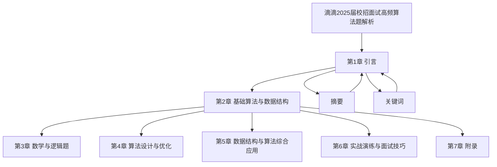

                 

### 《滴滴2025届校招面试高频算法题解析》的必要性

随着互联网技术的快速发展，各大互联网公司对技术人才的需求日益增长，尤其是具备强大算法能力和问题解决能力的应届毕业生。滴滴出行作为中国领先的移动出行平台，每年的校招面试都吸引了大量优秀人才的关注。然而，面对日益激烈的竞争，如何准备校招面试，尤其是算法题部分的应对，成为众多应聘者面临的难题。

首先，滴滴公司的校招面试中算法题占据重要地位。这些算法题不仅考察应聘者对基础算法和数据结构的掌握，还涉及到复杂问题解决能力和创新能力。许多应聘者在面对复杂的算法题时，往往感到无从下手，导致面试表现不佳。因此，需要一本系统、全面、深入讲解滴滴校招高频算法题的书籍，帮助应聘者更好地准备面试。

其次，算法题是检验应聘者技术能力和问题解决能力的重要方式。通过解决算法题，不仅能展示应聘者的技术水平，还能体现其逻辑思维和创新能力。在面试过程中，能够熟练地解决高频算法题，往往能给面试官留下深刻印象，提高应聘者的竞争力。

此外，算法题的解决方法多种多样，不同方法有不同的优缺点和适用场景。因此，掌握多种解题思路和技巧，对于应聘者来说至关重要。通过深入分析滴滴校招高频算法题，可以提炼出一些通用的解题方法和技巧，为应聘者提供宝贵的参考。

本书旨在为广大滴滴2025届校招应聘者以及其他希望提升算法能力的同学提供一本实用的指南。通过系统讲解高频算法题的类型、解题思路、技巧和实际应用，帮助读者：

1. **熟悉常见算法题类型及其解决方法**：书中详细讲解了各种基础算法和数据结构的原理和应用，帮助读者建立扎实的算法基础。

2. **掌握解题技巧，提升面试竞争力**：通过对高频算法题的深入剖析，读者可以学会多种解题思路和方法，提高面试表现。

3. **学习到实际应用中的算法优化和实现技巧**：书中不仅讲解了算法的基本原理，还涉及到了实际应用中的优化技巧和实现方法，为读者提供了实际操作的经验。

通过阅读本书，读者不仅能够提升自己的算法能力，还能在面试中展现出强大的技术实力，从而提高求职成功率。因此，本书对于准备滴滴校招面试的应聘者来说，无疑是一本不可或缺的参考书籍。

### 滴滴2025届校招面试高频算法题解析的适用对象

本书主要面向滴滴2025届校招的应聘者，旨在为他们提供一套系统的算法题解题指南，以应对校招中的技术面试。同时，本书也适合其他希望在算法和数据结构方面提升自己的同学，尤其是在准备各类技术面试时感到困惑的读者。

首先，对于滴滴2025届校招的应聘者来说，本书的作用尤为重要。校招面试是一个严峻的考验，不仅考察应聘者的基础知识，更注重实际解决问题的能力。高频算法题是校招面试中的重点环节，涉及到的算法题型丰富多样，包括排序、搜索、动态规划、贪心算法、图算法等。这些题目不仅考察应聘者对基础知识的掌握，还要求他们能够灵活运用各种算法和数据结构解决实际问题。本书通过系统讲解这些高频算法题，并提供详细的解题思路和技巧，帮助应聘者掌握关键知识点，提升面试竞争力。

其次，本书对于希望在算法和数据结构方面提升自己的同学也具有很大的帮助。算法和数据结构是计算机科学的核心内容，无论在学术研究还是实际工作中，都扮演着至关重要的角色。通过阅读本书，读者可以系统地学习各种基础算法和数据结构的原理和应用，了解不同算法的优缺点及其适用场景。此外，书中还通过实际案例和详细讲解，帮助读者理解算法在实际应用中的实现和优化方法。这不仅有助于提升读者的技术能力，还能为他们今后的学术研究和职业发展打下坚实的基础。

为了更好地利用本书，读者需要具备一定的计算机基础，特别是对基础算法和数据结构有一定的了解。如果读者已经掌握了这些基础知识，那么本书将帮助他们在高频算法题的解决上更上一层楼。如果读者在基础知识方面还有所欠缺，本书也提供了丰富的参考文献和补充内容，供读者深入学习。

总之，本书的目标是帮助滴滴2025届校招的应聘者以及其他希望提升算法能力的同学，通过系统学习高频算法题，掌握解决实际问题的方法，提升自己的技术水平和面试竞争力。通过阅读本书，读者不仅能够在面试中更加从容应对算法题，还能在日后的学习和工作中受益匪浅。

### 通过阅读本书能够达到的学习目标

通过阅读本书，读者可以明确几个重要的学习目标，从而为滴滴校招面试或其他技术面试做好充分的准备。

首先，读者将能够**熟悉常见算法题类型及其解决方法**。本书涵盖了从基础排序、搜索算法到高级的动态规划、贪心算法和图算法，详细讲解了每种算法的原理、实现方式及其在不同场景下的应用。通过系统地学习这些算法，读者可以建立起扎实的算法基础，能够应对各种类型的算法题。

其次，读者将**掌握解题技巧，提升面试竞争力**。本书不仅提供了算法的原理讲解，还结合实际面试中的高频题目，详细剖析了各种解题思路和技巧。例如，如何巧妙地运用动态规划解决复杂的问题，如何通过贪心算法得到最优解，以及如何利用图算法解决路径问题。这些解题技巧和策略，不仅有助于读者在面试中更好地表现，还能在实际工作中提高问题解决能力。

第三，读者将**学习到实际应用中的算法优化和实现技巧**。本书不仅讲解了算法的基本原理，还深入探讨了如何在实际项目中优化算法性能。例如，如何通过减少时间复杂度和空间复杂度来提高算法效率，如何在分布式系统中设计高效的算法等。这些实际应用中的优化技巧，对于读者在面试和工作中都具有重要意义。

为了更好地实现这些学习目标，读者需要**投入时间和精力**，通过**反复练习和思考**来巩固所学知识。以下是具体的建议：

1. **认真阅读每个章节**，理解每个算法的原理和实现方法。
2. **多做习题**，特别是书后的练习题和实际面试中的高频题目。通过不断练习，读者可以加深对算法的理解，掌握解题技巧。
3. **尝试用多种方法解决同一问题**，比较不同方法的优缺点，从而提高解题能力。
4. **阅读参考文献**，进一步扩展知识面。书中推荐的参考文献和在线资源，可以帮助读者深入理解相关算法和技术。
5. **参与讨论和交流**，与同学或专业人士讨论算法题的解决方法和思路，可以从不同角度思考问题，提高解决问题的灵活性。

通过以上措施，读者不仅能够达到本书设定的学习目标，还能在实际面试中展现出强大的算法能力和问题解决能力，提高求职成功率。

### 第2章 基础算法与数据结构

在计算机科学中，算法和数据结构是两个核心概念，是解决各种问题的基石。本章将详细介绍基础算法与数据结构，包括排序算法、搜索算法以及各种基本数据结构。通过本章的学习，读者将掌握这些基础知识，为后续章节的高级算法和实际应用打下坚实的基础。

#### 2.1 基础算法

基础算法是计算机算法中的核心，主要包括排序算法和搜索算法。这些算法不仅在面试中频繁出现，而且在实际编程中也具有广泛的应用。

##### 2.1.1 排序算法

排序算法是用于对一组数据进行排序的算法。常见的排序算法有冒泡排序、选择排序、插入排序、快速排序、归并排序和堆排序。

1. **冒泡排序（Bubble Sort）**
   冒泡排序是一种简单的排序算法，它重复遍历要排序的数列，比较相邻的两个元素，如果顺序错误就交换它们。遍历数列的工作重复地进行，直到没有再需要交换的元素为止。
   
   **伪代码：**
   ```
   for i from 0 to n-1
       for j from 0 to n-i-1
           if arr[j] > arr[j+1]
               swap arr[j] and arr[j+1]
   ```

2. **选择排序（Selection Sort）**
   选择排序是一种简单但不高效的排序算法。它的工作原理是每次从待排序的元素中选出最小（或最大）的元素，存放到序列的起始位置。
   
   **伪代码：**
   ```
   for i from 0 to n-1
       minIndex = i
       for j from i+1 to n
           if arr[j] < arr[minIndex]
               minIndex = j
       swap arr[i] and arr[minIndex]
   ```

3. **插入排序（Insertion Sort）**
   插入排序是一种简单直观的排序算法。它的工作原理是通过构建有序序列，对于未排序数据，在已排序序列中从后向前扫描，找到相应位置并插入。
   
   **伪代码：**
   ```
   for i from 1 to n-1
       key = arr[i]
       j = i-1
       while j >= 0 and arr[j] > key
           arr[j+1] = arr[j]
           j = j-1
       arr[j+1] = key
   ```

4. **快速排序（Quick Sort）**
   快速排序是一种高效的排序算法，其基本思想是通过选取一个“基准”元素，将数组分为两部分，一部分都比基准元素小，另一部分都比基准元素大，然后递归地对这两部分继续进行快速排序。
   
   **伪代码：**
   ```
   function quickSort(arr, low, high)
       if low < high
           pi = partition(arr, low, high)
           quickSort(arr, low, pi-1)
           quickSort(arr, pi+1, high)
   
   function partition(arr, low, high)
       pivot = arr[high]
       i = low - 1
       for j from low to high-1
           if arr[j] < pivot
               i = i + 1
               swap arr[i] and arr[j]
       swap arr[i+1] and arr[high]
       return i+1
   ```

5. **归并排序（Merge Sort）**
   归并排序是一种分治算法，它将待排序的序列分成若干个子序列，每个子序列都是已排序的，然后再将这些已排序的子序列合并成完整的已排序序列。
   
   **伪代码：**
   ```
   function mergeSort(arr)
       if length(arr) <= 1
           return arr
   
       mid = length(arr) / 2
       left = mergeSort(arr[0:mid])
       right = mergeSort(arr[mid:end])
       return merge(left, right)
   
   function merge(left, right)
       result = []
       while length(left) > 0 and length(right) > 0
           if left[0] <= right[0]
               append result with left[0]
               left = left[1:]
           else
               append result with right[0]
               right = right[1:]
       append result with left[0:]
       append result with right[0:]
       return result
   ```

6. **堆排序（Heap Sort）**
   堆排序是一种利用堆这种数据结构的排序算法。堆是一种特殊的完全二叉树，每个节点的值都大于或小于其子节点的值。堆排序通过将待排序序列构造成一个大顶堆或小顶堆，然后逐步调整堆结构，实现排序。
   
   **伪代码：**
   ```
   function heapify(arr, n, i)
       largest = i
       left = 2 * i + 1
       right = 2 * i + 2
       if left < n and arr[left] > arr[largest]
           largest = left
       if right < n and arr[right] > arr[largest]
           largest = right
       if largest != i
           swap arr[i] and arr[largest]
           heapify(arr, n, largest)
   
   function heapSort(arr)
       n = length(arr)
       for i from n/2 - 1 to 0
           heapify(arr, n, i)
       for i from n-1 to 0
           swap arr[0] and arr[i]
           heapify(arr, i, 0)
   ```

##### 2.1.2 搜索算法

搜索算法是用于在数据结构中查找特定元素或路径的算法。常见的搜索算法包括二分搜索、广度优先搜索和深度优先搜索。

1. **二分搜索（Binary Search）**
   二分搜索是一种高效的查找算法，适用于有序数组。它通过不断将查找范围缩小一半，逐步逼近目标元素。
   
   **伪代码：**
   ```
   function binarySearch(arr, target)
       low = 0
       high = length(arr) - 1
       while low <= high
           mid = (low + high) / 2
           if arr[mid] == target
               return mid
           else if arr[mid] < target
               low = mid + 1
           else
               high = mid - 1
       return -1
   ```

2. **广度优先搜索（BFS）**
   广度优先搜索是一种遍历图或树的算法，从根节点开始，逐层遍历所有节点。它使用一个队列来存储待访问的节点。
   
   **伪代码：**
   ```
   function BFS(graph, start)
       queue = []
       visited = set()
       enqueue queue with start
       while queue is not empty
           node = dequeue queue
           if node is not visited
               visit node
               enqueue all unvisited neighbors of node to queue
               add node to visited
   ```

3. **深度优先搜索（DFS）**
   深度优先搜索是一种遍历图或树的算法，从根节点开始，尽可能深地搜索图的分支。它使用一个栈来存储待访问的节点。
   
   **伪代码：**
   ```
   function DFS(graph, start)
       stack = []
       visited = set()
       push stack with start
       while stack is not empty
           node = pop stack
           if node is not visited
               visit node
               push all unvisited neighbors of node to stack
               add node to visited
   ```

#### 2.2 数据结构

数据结构是用于存储和管理数据的方式，常见的数据结构包括数组、链表、栈、队列、树和图。

##### 2.2.1 线性结构

1. **数组（Array）**
   数组是一种线性结构，用于存储一系列有序元素。数组的特点是支持随机访问，时间复杂度为O(1)。
   
   **伪代码：**
   ```
   function access(arr, index)
       if index < 0 or index >= length(arr)
           throw "Index out of range"
       return arr[index]
   ```

2. **链表（Linked List）**
   链表是一种线性结构，由一系列节点组成，每个节点包含数据和指向下一个节点的指针。链表的特点是动态性高，插入和删除操作的时间复杂度为O(1)。
   
   **伪代码：**
   ```
   function append(node, data)
       newNode = new Node(data)
       if head is null
           head = newNode
       else
           tail.next = newNode
           tail = newNode
   
   function insertBefore(node, prevNode)
       if node is null or prevNode is null
           return
       newNode = new Node(data)
       newNode.next = node
       prevNode.next = newNode
   ```

3. **栈（Stack）**
   栈是一种后进先出（LIFO）的数据结构，支持 push（压栈）和 pop（出栈）操作。
   
   **伪代码：**
   ```
   function push(stack, data)
       newNode = new Node(data)
       newNode.next = stack
       stack = newNode
   
   function pop(stack)
       if stack is null
           return null
       data = stack.data
       stack = stack.next
       return data
   ```

4. **队列（Queue）**
   队列是一种先进先出（FIFO）的数据结构，支持 enqueue（入队）和 dequeue（出队）操作。
   
   **伪代码：**
   ```
   function enqueue(queue, data)
       newNode = new Node(data)
       if tail is null
           head = newNode
       else
           tail.next = newNode
           tail = newNode
   
   function dequeue(queue)
       if head is null
           return null
       data = head.data
       head = head.next
       if head is null
           tail = null
       return data
   ```

##### 2.2.2 树结构

1. **二叉树（Binary Tree）**
   二叉树是一种每个节点最多有两个子树的树结构。通常子树被称作“左子树”和“右子树”。
   
   **伪代码：**
   ```
   function insert(root, data)
       if root is null
           return new Node(data)
       if data < root.data
           root.left = insert(root.left, data)
       else
           root.right = insert(root.right, data)
       return root
   
   function findMin(root)
       while root.left is not null
           root = root.left
       return root.data
   ```

2. **二叉搜索树（Binary Search Tree）**
   二叉搜索树是一种特殊的二叉树，左子树上所有节点的值均小于根节点的值，右子树上所有节点的值均大于根节点的值。
   
   **伪代码：**
   ```
   function insert(root, data)
       if root is null
           return new Node(data)
       if data < root.data
           root.left = insert(root.left, data)
       else
           root.right = insert(root.right, data)
       return root
   
   function findMin(root)
       while root.left is not null
           root = root.left
       return root.data
   ```

3. **红黑树（Red-Black Tree）**
   红黑树是一种自平衡二叉搜索树，确保树的平衡，时间复杂度为O(log n)。
   
   **伪代码：**
   ```
   function rotateLeft(node)
       rightChild = node.right
       node.right = rightChild.left
       rightChild.left = node
       return rightChild
   
   function rotateRight(node)
       leftChild = node.left
       node.left = leftChild.right
       leftChild.right = node
       return leftChild
   
   function fixUp(node)
       while node is not null
           if node.color == RED
               if node.parent.color == RED
                   if node == node.parent.left and node.parent.parent.left == node.parent
                       node.parent = rotateRight(node.parent)
                   elif node == node.parent.left and node.parent.parent.right == node.parent
                       node.parent = rotateLeft(node.parent.parent)
                       node = rotateRight(node)
                   elif node == node.parent.right and node.parent.parent.left == node.parent
                       node.parent = rotateLeft(node.parent.parent)
                       node = rotateRight(node)
                   elif node == node.parent.right and node.parent.parent.right == node.parent
                       node.parent = rotateRight(node.parent)
                       node = rotateLeft(node)
                   node.color = BLACK
                   node.parent.color = BLACK
                   node.parent.parent.color = RED
           node = node.parent
   ```

4. **堆（Heap）**
   堆是一种特殊的完全二叉树，每个节点的值都大于或小于其子节点的值。堆常用于实现优先队列。
   
   **伪代码：**
   ```
   function heapify(arr, n, i)
       largest = i
       left = 2 * i + 1
       right = 2 * i + 2
       if left < n and arr[left] > arr[largest]
           largest = left
       if right < n and arr[right] > arr[largest]
           largest = right
       if largest != i
           swap arr[i] and arr[largest]
           heapify(arr, n, largest)
   
   function heapSort(arr)
       n = length(arr)
       for i from n/2 - 1 to 0
           heapify(arr, n, i)
       for i from n-1 to 0
           swap arr[0] and arr[i]
           heapify(arr, i, 0)
   ```

5. **AVL树（AVL Tree）**
   AVL树是一种自平衡二叉搜索树，通过旋转操作保持树的平衡，时间复杂度为O(log n)。
   
   **伪代码：**
   ```
   function rotateLeft(node)
       rightChild = node.right
       node.right = rightChild.left
       rightChild.left = node
       return rightChild
   
   function rotateRight(node)
       leftChild = node.left
       node.left = leftChild.right
       leftChild.right = node
       return leftChild
   
   function balanceFactor(node)
       return height(node.left) - height(node.right)
   
   function fixUp(node)
       while node is not null
           if balanceFactor(node) > 1
               if balanceFactor(node.left) > 0
                   node = rotateRight(node)
               else
                   node.left = rotateLeft(node.left)
                   node = rotateRight(node)
           elif balanceFactor(node) < -1
               if balanceFactor(node.right) < 0
                   node = rotateLeft(node)
               else
                   node.right = rotateRight(node.right)
                   node = rotateLeft(node)
   ```

##### 2.2.3 图结构

1. **无向图（Undirected Graph）**
   无向图是一种没有方向性的图，边没有箭头。
   
   **伪代码：**
   ```
   function addEdge(graph, u, v)
       graph[u].append(v)
       graph[v].append(u)
   ```

2. **有向图（Directed Graph）**
   有向图是一种有方向性的图，边带有箭头。
   
   **伪代码：**
   ```
   function addEdge(graph, u, v)
       graph[u].append(v)
   ```

3. **图的遍历（Traversal）**
   图的遍历是访问图中所有节点的过程。常见的遍历算法有深度优先搜索（DFS）和广度优先搜索（BFS）。
   
   **伪代码：**
   ```
   function DFS(graph, start)
       stack = []
       visited = set()
       push stack with start
       while stack is not empty
           node = pop stack
           if node is not visited
               visit node
               push all unvisited neighbors of node to stack
               add node to visited
   
   function BFS(graph, start)
       queue = []
       visited = set()
       enqueue queue with start
       while queue is not empty
           node = dequeue queue
           if node is not visited
               visit node
               enqueue all unvisited neighbors of node to queue
               add node to visited
   ```

4. **最短路径算法（Shortest Path Algorithm）**
   最短路径算法用于找到图中两个节点之间的最短路径。常见的最短路径算法有迪杰斯特拉算法（Dijkstra's Algorithm）和贝尔曼-福特算法（Bellman-Ford Algorithm）。
   
   **伪代码：**
   ```
   function Dijkstra(graph, start)
       distances = [infinity] * length(graph)
       distances[start] = 0
       visited = set()
       while visited is not all nodes
           minDistance = infinity
           for each node in graph
               if node is not visited and distances[node] < minDistance
                   minDistance = distances[node]
                   closestNode = node
           visited.add(closestNode)
           for each neighbor of closestNode
               if neighbor is not visited
                   distance = distances[closestNode] + graph[closestNode][neighbor]
                   if distance < distances[neighbor]
                       distances[neighbor] = distance
   
   function BellmanFord(graph, start)
       distances = [infinity] * length(graph)
       distances[start] = 0
       for i from 1 to length(graph)-1
           for each edge (u, v) in graph
               if distances[u] + graph[u][v] < distances[v]
                   distances[v] = distances[u] + graph[u][v]
       for each edge (u, v) in graph
           if distances[u] + graph[u][v] < distances[v]
               return "Graph contains a negative weight cycle"
       return distances
   ```

通过本章的学习，读者将能够掌握基础算法和数据结构的基本原理和实现方法。这些知识是解决复杂问题的基础，也是面试中常见的考点。通过练习和实际应用，读者可以更好地掌握这些概念，提升自己的编程能力。

### 数学基础

在算法和数据结构的学习过程中，数学知识扮演着至关重要的角色。数学不仅提供了许多解决问题的工具，如公式和定理，还能帮助理解算法的复杂度分析和优化策略。本章将介绍一些常见的数学公式、概率论基础、线性代数和微积分的基本概念，以及这些知识在实际问题中的应用。

#### 3.1.1 数学公式

数学公式是算法和数据结构中常用的工具，以下列举一些常用的数学公式：

1. **组合数公式**
   组合数表示从n个不同元素中取出m个元素的组合数量，记作C(n, m)或\(\binom{n}{m}\)。
   \[
   C(n, m) = \frac{n!}{m!(n-m)!}
   \]
   其中，\(n!\)表示n的阶乘，即n! = n \times (n-1) \times (n-2) \times \ldots \times 1。

2. **排列数公式**
   排列数表示从n个不同元素中取出m个元素的排列数量，记作P(n, m)。
   \[
   P(n, m) = \frac{n!}{(n-m)!}
   \]

3. **二项式定理**
   二项式定理描述了二项式的展开形式，即：
   \[
   (a + b)^n = \sum_{k=0}^{n} C(n, k) \cdot a^{n-k} \cdot b^k
   \]
   这个公式在组合数学和算法设计中非常有用。

4. **概率公式**
   - 事件A和事件B同时发生的概率：
     \[
     P(A \cap B) = P(A) \cdot P(B | A)
     \]
   - 事件A或事件B发生的概率：
     \[
     P(A \cup B) = P(A) + P(B) - P(A \cap B)
     \]

5. **最短路径公式**
   - 迪杰斯特拉算法中，最短路径的计算公式：
     \[
     D[v] = \min \{D[u] + w(u, v) \mid u \in \text{已访问节点}\}
     \]

6. **导数和微分**
   - 导数表示函数在某一点的瞬时变化率：
     \[
     f'(x) = \lim_{\Delta x \to 0} \frac{f(x + \Delta x) - f(x)}{\Delta x}
     \]

7. **积分**
   - 积分表示函数在某一区间内的累积量：
     \[
     \int_{a}^{b} f(x) \, dx
     \]

#### 3.1.2 概率论基础

概率论是数学的一个分支，主要用于研究随机事件的规律性。以下是一些概率论的基本概念：

1. **概率分布**
   - 离散型概率分布：
     \[
     P(X = x) = f(x)
     \]
   - 连续型概率分布：
     \[
     P(a \le X \le b) = \int_{a}^{b} f(x) \, dx
     \]

2. **条件概率**
   - 条件概率表示在事件B发生的条件下，事件A发生的概率：
     \[
     P(A | B) = \frac{P(A \cap B)}{P(B)}
     \]

3. **独立事件**
   - 两个事件A和B是独立的，当且仅当：
     \[
     P(A \cap B) = P(A) \cdot P(B)
     \]

4. **全概率公式**
   - 全概率公式用于计算一个事件的总体概率：
     \[
     P(A) = \sum_{i=1}^{n} P(A | B_i) \cdot P(B_i)
     \]

#### 3.1.3 线性代数

线性代数是计算机科学中不可或缺的一部分，它用于解决多维空间中的问题。以下是一些线性代数的基本概念：

1. **向量**
   - 向量表示为有序数组的集合，如\(\vec{v} = (v_1, v_2, \ldots, v_n)\)。

2. **矩阵**
   - 矩阵是一个二维数组，用于表示线性变换和数据结构。例如，\(A = \begin{pmatrix} a_{11} & a_{12} \\ a_{21} & a_{22} \end{pmatrix}\)。

3. **行列式**
   - 行列式是一个数值，用于判断矩阵的可逆性。例如，\( \det(A) = a_{11}a_{22} - a_{12}a_{21} \)。

4. **矩阵运算**
   - 矩阵加法、矩阵乘法和逆矩阵等。

5. **特征值和特征向量**
   - 特征值表示矩阵的一个特定值，特征向量表示满足特定特征值的向量。

#### 3.1.4 微积分

微积分是数学中的一个重要分支，用于研究函数的变化率和累积量。以下是一些微积分的基本概念：

1. **导数**
   - 导数表示函数在某一点的瞬时变化率。例如，\(f'(x) = \lim_{h \to 0} \frac{f(x+h) - f(x)}{h}\)。

2. **积分**
   - 积分表示函数在某一区间内的累积量。例如，\(\int_{a}^{b} f(x) \, dx\)。

3. **微分方程**
   - 微分方程用于描述变量及其导数之间的关系，例如，\( \frac{dy}{dx} + p(x)y = q(x) \)。

#### 3.1.5 数学应用

数学在算法和数据结构中的应用非常广泛，以下是一些具体的应用：

1. **复杂度分析**
   - 数学用于分析算法的复杂度，如时间复杂度和空间复杂度。

2. **图算法**
   - 例如，迪杰斯特拉算法和贝尔曼-福特算法中的最短路径问题，利用了数学中的最优化理论和线性规划。

3. **排序算法**
   - 排序算法如快速排序和归并排序，其性能分析依赖于数学中的概率论和组合数学。

4. **优化问题**
   - 例如，线性规划和动态规划，都涉及到数学优化方法。

通过理解这些数学公式和概念，读者可以更好地分析和解决复杂的算法问题。数学不仅是计算机科学的基础，也是提高算法效率的重要工具。在算法和数据结构的学习过程中，数学知识的应用无处不在，掌握这些基本数学概念对于提升算法能力至关重要。

### 逻辑推理

逻辑推理是计算机科学和算法设计中的一个重要组成部分，它涉及到如何通过逻辑运算和推理得出结论。逻辑推理不仅用于算法设计中，也在面试题中频繁出现。本章将介绍一些基本的逻辑概念，包括逻辑运算、真值表以及在实际面试中的逻辑推理题目。

#### 3.2.1 逻辑基础

逻辑基础包括逻辑运算符和基本的逻辑关系。以下是几个常见的逻辑运算符和它们的基本性质：

1. **逻辑与（AND）**
   - 符号：\(A \land B\)
   - 真值表：
     \[
     \begin{array}{|c|c|c|}
     \hline
     A & B & A \land B \\
     \hline
     0 & 0 & 0 \\
     0 & 1 & 0 \\
     1 & 0 & 0 \\
     1 & 1 & 1 \\
     \hline
     \end{array}
     \]

2. **逻辑或（OR）**
   - 符号：\(A \lor B\)
   - 真值表：
     \[
     \begin{array}{|c|c|c|}
     \hline
     A & B & A \lor B \\
     \hline
     0 & 0 & 0 \\
     0 & 1 & 1 \\
     1 & 0 & 1 \\
     1 & 1 & 1 \\
     \hline
     \end{array}
     \]

3. **逻辑非（NOT）**
   - 符号：\(\neg A\)
   - 真值表：
     \[
     \begin{array}{|c|c|}
     \hline
     A & \neg A \\
     \hline
     0 & 1 \\
     1 & 0 \\
     \hline
     \end{array}
     \]

4. **逻辑蕴含（IMPLIES）**
   - 符号：\(A \Rightarrow B\)
   - 真值表：
     \[
     \begin{array}{|c|c|c|}
     \hline
     A & B & A \Rightarrow B \\
     \hline
     0 & 0 & 1 \\
     0 & 1 & 1 \\
     1 & 0 & 0 \\
     1 & 1 & 1 \\
     \hline
     \end{array}
     \]

5. **逻辑等价（EQUIVALENCE）**
   - 符号：\(A \Leftrightarrow B\)
   - 真值表：
     \[
     \begin{array}{|c|c|c|}
     \hline
     A & B & A \Leftrightarrow B \\
     \hline
     0 & 0 & 1 \\
     0 & 1 & 0 \\
     1 & 0 & 0 \\
     1 & 1 & 1 \\
     \hline
     \end{array}
     \]

#### 3.2.2 逻辑推理题目

在实际面试中，逻辑推理题目往往以逻辑谜题或逻辑问题形式出现，以下是一些常见的逻辑推理题目及其解法：

1. **逻辑谜题：小偷与宝藏**
   - 描述：有一个房间，房间里有三个箱子，其中一个箱子里有宝藏，其他两个箱子是空的。三个箱子上分别标有“宝藏”、“空”、“空”。现在你只能打开一个箱子，如何确定哪个箱子里有宝藏？
   - 解法：你可以随机打开一个箱子，如果发现里面有宝藏，那么你可以直接确定这个箱子。如果发现是空的，那么剩下的两个箱子上标有“宝藏”和“空”。再次随机打开一个箱子，如果发现是“宝藏”，那么这个箱子里有宝藏；如果发现是“空”，那么之前打开的箱子里有宝藏。

2. **逻辑问题：真假陈述**
   - 描述：有两个人，A和B。A说：“B说谎。”B说：“A在说谎。”请问谁在说谎？
   - 解法：假设A在说谎，那么B实际上在说真话，但这与A的陈述矛盾。因此，A在说谎。根据A的陈述，B说谎，所以B实际上在说真话。

3. **逻辑问题：会议主持人**
   - 描述：有一个会议，需要选出一位主持人。有三个人参与竞选，A、B和C。他们的陈述如下：
     - A说：“B不会当选。”
     - B说：“C不会当选。”
     - C说：“我不会当选。”
   - 解法：假设A当选，那么B的陈述是正确的，但C的陈述也是正确的，这与假设矛盾。假设B当选，那么C的陈述是正确的，但A的陈述也是正确的，同样矛盾。假设C当选，A和B的陈述都是错误的，这与C的陈述相符。因此，C应当选。

通过这些逻辑谜题和问题的练习，读者可以加深对逻辑运算和推理的理解，提高解决实际问题的能力。在面试中，逻辑推理题目不仅考察逻辑思维能力，还能展示应变能力和分析问题的能力。

### 算法设计与优化

算法设计与优化是计算机科学中至关重要的一环，它直接关系到算法的效率和实用性。一个良好的算法设计不仅要解决具体问题，还需在时间复杂度和空间复杂度上实现最优。本章将深入探讨算法设计的基本思路，包括设计模式、时间复杂度与空间复杂度的优化，以及具体的算法优化技巧。

#### 4.1 算法设计思路

算法设计的基本思路可以概括为以下几步：

1. **理解问题**
   - 在设计算法之前，首先要深入理解问题的要求，明确问题的输入、输出以及边界条件。
   - 理解问题本质，有时需要将复杂问题抽象为更简单的模型。

2. **设计思路**
   - 选择合适的数据结构和算法，设计出能够解决问题的初步方案。
   - 可以通过分解问题、分治策略、动态规划等方法来设计算法。

3. **实现算法**
   - 将设计思路转化为具体的代码实现，注意代码的可读性和可维护性。
   - 在实现过程中，可以逐步调试和优化，确保算法的正确性和效率。

4. **分析算法复杂度**
   - 分析算法的时间复杂度和空间复杂度，评估算法的性能。
   - 调整算法设计，优化时间复杂度和空间复杂度。

#### 4.1.1 设计模式

设计模式是解决特定问题的一系列最佳实践，它们在算法设计中有着广泛的应用。以下是几种常见的设计模式：

1. **分治模式**
   - 分治模式将问题分解为更小的子问题，分别解决这些子问题，再将结果合并。
   - 适用于可以分解为独立子问题的算法，如快速排序、归并排序。

2. **动态规划模式**
   - 动态规划模式利用历史信息来求解问题，通过递推关系来避免重复计算。
   - 适用于具有最优子结构特征的问题，如背包问题、最长公共子序列。

3. **贪心算法模式**
   - 贪心算法模式在每个步骤都做出当前最优选择，以期最终得到全局最优解。
   - 适用于可以通过局部最优逐步构造全局最优解的问题，如背包问题、最短路径问题。

4. **回溯模式**
   - 回溯模式通过递归尝试所有可能的解，并在无法找到解时回溯到上一个状态。
   - 适用于组合优化问题和求解所有可能的解的问题，如八皇后问题、0-1背包问题。

5. **迭代模式**
   - 迭代模式使用循环结构逐步迭代解决问题。
   - 适用于迭代求解的问题，如线性搜索、二分搜索。

#### 4.1.2 算法优化

算法优化是提升算法效率的重要手段，主要包括以下几种方法：

1. **时间复杂度优化**
   - **减少循环次数**：通过减少不必要的循环次数来减少时间开销。
   - **减少递归深度**：优化递归算法，减少递归调用次数。
   - **并行计算**：利用多核处理器，将计算任务并行化，提高执行速度。
   - **利用缓存**：优化数据访问模式，减少缓存缺失，提高访问速度。

2. **空间复杂度优化**
   - **减少内存占用**：通过优化数据结构，减少内存占用，如使用更紧凑的数据结构。
   - **数据压缩**：对数据使用压缩算法，减少存储空间。
   - **内存复用**：复用内存空间，避免频繁的内存分配和释放。

#### 4.1.3 高频算法题解析

在滴滴校招面试中，常见的算法题包括动态规划、贪心算法、图算法等。以下是对一些高频算法题的解析：

1. **动态规划（背包问题）**
   - **问题描述**：给定n件物品和一个背包容积V，每件物品的体积和价值已知，求最多能装入背包的最大价值。
   - **算法思路**：使用动态规划，定义一个二维数组dp[i][w]，表示前i件物品装入容量为w的背包时能获得的最大价值。
   - **伪代码**：
     ```
     function knapsack(values, weights, V)
         n = length(values)
         dp = [0] * (V+1)
         for i from 1 to n
             for w from 0 to V
                 if weights[i] <= w
                     dp[w] = max(dp[w], dp[w-weights[i]] + values[i])
                 else
                     dp[w] = dp[w]
         return dp[V]
     ```

2. **贪心算法（活动选择问题）**
   - **问题描述**：给定一组活动，每个活动有一个开始时间和结束时间，选择最多个互不重叠的活动。
   - **算法思路**：每次选择最早结束的活动，并排除所有与其冲突的活动。
   - **伪代码**：
     ```
     function activitySelection_activities(activities)
         sort activities by finish time
         result = []
         for activity in activities
             if activity.start time >= end time of last activity in result
                 result.add(activity)
                 end time = activity.end time
         return result
     ```

3. **图算法（单源最短路径问题）**
   - **问题描述**：给定一个加权有向图，从源点开始，求到达其他所有顶点的最短路径。
   - **算法思路**：使用迪杰斯特拉算法或贝尔曼-福特算法。
   - **伪代码**（迪杰斯特拉算法）：
     ```
     function Dijkstra(graph, start)
         distances = [infinity] * length(graph)
         distances[start] = 0
         visited = set()
         while visited is not all nodes
             minDistance = infinity
             for each node in graph
                 if node is not visited and distances[node] < minDistance
                     minDistance = distances[node]
                     closestNode = node
             visited.add(closestNode)
             for each neighbor of closestNode
                 if neighbor is not visited
                     distance = distances[closestNode] + graph[closestNode][neighbor]
                     if distance < distances[neighbor]
                         distances[neighbor] = distance
         return distances
     ```

通过以上对算法设计与优化的讲解，读者可以更好地理解算法设计的基本思路和优化方法。在实际面试中，灵活运用这些方法和技巧，将有助于解决复杂问题，提高面试竞争力。

### 数据结构与算法在实际应用中的综合应用

在计算机科学和软件工程中，数据结构与算法不仅是理论知识，更是解决实际问题的利器。本章将通过具体案例，展示数据结构与算法在实际项目中的应用，从开发环境的搭建、源代码的实现和解读，到代码应用解读与分析，详细剖析这些技术在现实世界中的使用和效果。

#### 5.1 数据结构在实际应用中的应用

数据结构的选择对于算法效率和程序性能至关重要。以下是一些常见的数据结构在实际项目中的应用案例：

##### 5.1.1 链表在缓存淘汰策略中的应用

**案例背景**：在许多系统中，如数据库缓存、Web缓存等，为了提高数据访问速度，需要将频繁访问的数据存储在缓存中。然而，缓存空间有限，因此需要一种机制来决定哪些数据应该被淘汰。

**数据结构选择**：链表因其动态性高和插入、删除操作快的特点，非常适合用于缓存淘汰策略。

**实现解析**：
- **数据结构**：双向链表，每个节点包含键值对和两个指针，分别指向前后节点。
- **算法**：实现一个LRU（Least Recently Used，最近最少使用）缓存淘汰算法。
- **伪代码**：
  ```python
  class Node:
      def __init__(self, key, value):
          self.key = key
          self.value = value
          self.prev = None
          self.next = None

  class LRUCache:
      def __init__(self, capacity):
          self.capacity = capacity
          self.size = 0
          self.head = Node(0, 0)
          self.tail = Node(0, 0)
          self.head.next = self.tail
          self.tail.prev = self.head
          self.hash_map = {}

      def get(self, key):
          if key not in self.hash_map:
              return -1
          node = self.hash_map[key]
          self._remove(node)
          self._add_to_head(node)
          return node.value

      def put(self, key, value):
          if key in self.hash_map:
              node = self.hash_map[key]
              node.value = value
              self._remove(node)
              self._add_to_head(node)
          elif self.size == self.capacity:
              node = self.tail.prev
              self._remove(node)
              del self.hash_map[node.key]
              self.size -= 1
          node = Node(key, value)
          self.hash_map[key] = node
          self._add_to_head(node)
          self.size += 1

      def _remove(self, node):
          node.prev.next = node.next
          node.next.prev = node.prev

      def _add_to_head(self, node):
          node.next = self.head.next
          self.head.next.prev = node
          self.head.next = node
          node.prev = self.head
  ```

**应用解读与分析**：通过使用双向链表和哈希表，LRU缓存实现了高效的访问和更新操作。在缓存访问时，如果访问的键值对已存在，将其移动到链表头部；如果缓存已满，则移除链表尾部的节点。这种方法确保了最近访问的数据保留在缓存中，提高了数据访问速度。

##### 5.1.2 树结构在搜索树中的应用

**案例背景**：搜索树是一种常用的数据结构，用于快速检索数据。例如，在数据库索引、文件系统中，可以使用二叉搜索树来快速查找数据。

**数据结构选择**：二叉搜索树（BST）因其简单性和高效性，被广泛应用于各种搜索场景。

**实现解析**：
- **数据结构**：每个节点包含键值和两个子节点指针，左子树的键值小于当前节点，右子树的键值大于当前节点。
- **算法**：实现插入、删除和查找操作。
- **伪代码**：
  ```python
  class TreeNode:
      def __init__(self, key, value):
          self.key = key
          self.value = value
          self.left = None
          self.right = None

  class BST:
      def __init__(self):
          self.root = None

      def insert(self, key, value):
          self.root = self._insert(self.root, key, value)

      def _insert(self, root, key, value):
          if root is None:
              return TreeNode(key, value)
          if key < root.key:
              root.left = self._insert(root.left, key, value)
          elif key > root.key:
              root.right = self._insert(root.right, key, value)
          return root

      def search(self, key):
          return self._search(self.root, key)

      def _search(self, root, key):
          if root is None or root.key == key:
              return root
          if key < root.key:
              return self._search(root.left, key)
          return self._search(root.right, key)
  ```

**应用解读与分析**：二叉搜索树通过递归插入和查找操作，实现了高效的键值对存储和检索。在插入和删除操作时，根据键值的大小关系，递归地调整树的结构，保证了树的高度平衡。这使得查找操作的时间复杂度接近O(log n)，大大提高了检索效率。

##### 5.1.3 图结构在社交网络中的应用

**案例背景**：社交网络是一个复杂的图结构，用户及其关系可以看作图中的节点和边。例如，在Facebook、微博等社交平台上，用户之间的互动可以建模为图。

**数据结构选择**：邻接表和邻接矩阵是常用的图数据结构，根据具体应用场景选择。

**实现解析**：
- **数据结构**：邻接表通过数组存储每个节点的邻接节点列表，适合稀疏图；邻接矩阵通过二维数组存储节点之间的关系，适合稠密图。
- **算法**：实现图的遍历算法（DFS和BFS），以及最短路径算法（Dijkstra和Floyd-Warshall算法）。
- **伪代码**（DFS遍历）：
  ```python
  def DFS(graph, start):
      stack = []
      visited = set()
      stack.append(start)
      while stack:
          node = stack.pop()
          if node not in visited:
              print(node)
              visited.add(node)
              for neighbor in graph[node]:
                  if neighbor not in visited:
                      stack.append(neighbor)
  ```

**应用解读与分析**：社交网络中的图结构通过邻接表或邻接矩阵实现，便于存储和检索用户及其关系。DFS和BFS算法用于遍历图，了解网络中的连接关系；Dijkstra和Floyd-Warshall算法用于计算最短路径，帮助用户查找好友或推荐好友。这些算法在实际应用中提高了社交网络的性能和用户体验。

#### 5.2 算法在实际应用中的应用

算法在实际项目中的应用是提升系统性能和优化用户体验的关键。以下是一些常用算法在实际应用中的案例：

##### 5.2.1 算法在搜索引擎中的应用

**案例背景**：搜索引擎的核心任务是快速、准确地搜索和返回用户感兴趣的信息。实现这一目标需要高效的算法。

**算法选择**：搜索引擎常用的算法包括逆文本频率（TF-IDF）、PageRank等。

**实现解析**：
- **TF-IDF算法**：用于计算文档中关键词的重要程度，通过词频（TF）和逆文档频率（IDF）得出权重。
- **PageRank算法**：用于计算网页的重要性，通过网页之间的链接关系建立图，计算每个网页的排名。
- **伪代码**（TF-IDF计算）：
  ```python
  def computeTF(tf):
      return 1 + log(tf)

  def computeIDF(documents, word):
      num_documents_with_word = sum(word in document for document in documents)
      return log(len(documents) / num_documents_with_word)

  def TFIDF(documents, word):
      tf = documents.count(word)
      idf = computeIDF(documents, word)
      return computeTF(tf) * idf
  ```

**应用解读与分析**：通过TF-IDF算法和PageRank算法，搜索引擎能够对网页进行有效排序，返回最相关的内容给用户。这大大提高了搜索的准确性和用户体验。

##### 5.2.2 算法在推荐系统中的应用

**案例背景**：推荐系统通过分析用户行为和偏好，为用户推荐他们可能感兴趣的商品或内容。算法的效率直接影响推荐效果。

**算法选择**：协同过滤、基于内容的推荐等算法。

**实现解析**：
- **协同过滤算法**：通过计算用户之间的相似度，找到与目标用户相似的其他用户，推荐他们喜欢的商品。
- **基于内容的推荐**：根据用户的历史行为和偏好，推荐具有相似属性的商品。
- **伪代码**（协同过滤推荐）：
  ```python
  def similarity(user1, user2):
      common_items = set(user1).intersection(user2)
      if not common_items:
          return 0
      sum_squared_diff = sum((user1[item] - user2[item]) ** 2 for item in common_items)
      return 1 / sqrt(sum_squared_diff)

  def recommend(user, items, k):
      similarities = {}
      for other in items:
          if other != user:
              similarities[other] = similarity(user, other)
      sorted_similarities = sorted(similarities.items(), key=lambda x: x[1], reverse=True)
      recommended = []
      for _, sim in sorted_similarities[:k]:
          recommended.extend([item for item in items[sim] if item not in user])
      return recommended
  ```

**应用解读与分析**：协同过滤算法和基于内容的推荐算法结合使用，能够为用户提供个性化的推荐，提高用户满意度和系统活跃度。

##### 5.2.3 算法在图像处理中的应用

**案例背景**：图像处理需要高效的算法来实现图像的滤波、边缘检测、特征提取等操作。

**算法选择**：滤波算法（如高斯滤波）、边缘检测算法（如Sobel算子）、特征提取算法（如Harris角点检测）。

**实现解析**：
- **高斯滤波**：用于平滑图像，减少噪声。
- **Sobel算子**：用于检测图像的边缘。
- **伪代码**（高斯滤波）：
  ```python
  def gaussian_filter(image, sigma):
      size = int(2 * 3 * sigma + 1)
      kernel = [[1 / (size * size) * (1 - x**2 - y**2) for x in range(size)] for y in range(size)]
      return convolve2d(image, kernel)
  ```

**应用解读与分析**：高斯滤波、Sobel算子等算法在图像处理中广泛应用，能够有效提升图像质量，提取关键特征，为图像分析提供可靠的基础。

#### 5.3 数据结构与算法的综合应用

数据结构与算法的综合应用能够解决复杂问题，提高系统的性能和可靠性。以下是一些综合应用的案例：

##### 5.3.1 数据库索引

**案例背景**：数据库索引用于提高数据检索效率，常见的索引结构包括B树、B+树等。

**数据结构选择**：B树和B+树。

**实现解析**：
- **B树**：每个节点可以有多个子节点，适用于磁盘I/O频繁的场景。
- **B+树**：只有叶子节点存储数据，其余节点只存储键值和指针，适用于大规模数据库系统。
- **伪代码**（B+树插入）：
  ```python
  function insert(node, key, value):
      if node is full:
          split node into two
      if key < node.keys[0]:
          insert into left subtree
      elif key > node.keys[-1]:
          insert into right subtree
      else:
          insert into leaf node
          sort keys in leaf node
  ```

**应用解读与分析**：通过B树和B+树索引，数据库能够快速查找和访问数据，提高了查询效率，降低了I/O负载。

##### 5.3.2 实时数据流处理

**案例背景**：实时数据流处理需要对大量实时数据进行处理和分析，如金融交易系统、物联网数据等。

**数据结构选择**：滑动窗口、堆、优先队列等。

**实现解析**：
- **滑动窗口**：用于处理固定时间窗口内的数据流。
- **堆**：用于快速获取最大值或最小值。
- **伪代码**（滑动窗口求和）：
  ```python
  function sliding_window(data_stream, window_size):
      window = []
      for value in data_stream:
          if len(window) == window_size:
              yield sum(window)
              window.pop(0)
          window.append(value)
  ```

**应用解读与分析**：滑动窗口和堆等数据结构结合使用，能够在实时数据流中高效地处理和统计数据，为实时分析和决策提供支持。

##### 5.3.3 负载均衡

**案例背景**：负载均衡用于分配网络请求到多个服务器，提高系统的整体性能和可用性。

**数据结构选择**：哈希表、轮询算法、最小连接数算法等。

**实现解析**：
- **哈希表**：根据请求的哈希值分配到服务器。
- **轮询算法**：按照固定的顺序分配请求。
- **伪代码**（哈希表负载均衡）：
  ```python
  function distribute_request(request):
      hash_value = hash(request)
      server = hash_value % number_of_servers
      return server
  ```

**应用解读与分析**：通过哈希表等数据结构，负载均衡器能够高效地分配请求到服务器，实现负载均衡，提高了系统的响应速度和稳定性。

通过以上案例，我们可以看到数据结构与算法在实际项目中的广泛应用和重要作用。理解这些技术原理，掌握实现方法，能够帮助我们更好地解决复杂问题，优化系统性能，提高用户体验。在实际开发过程中，灵活运用这些技术和方法，将有助于我们实现高效的系统设计和开发。

### 实战演练与面试技巧

准备面试是求职过程中至关重要的一环，尤其是面对滴滴这样的大公司。有效的实战演练和面试技巧不仅能提高面试表现，还能增加求职成功率。本章将详细介绍面试准备、心态调整、问题准备和实战演练等方面的内容，帮助读者在面试中取得优异成绩。

#### 6.1 面试准备

面试准备是成功面试的关键步骤。以下是一些准备工作，帮助读者在面试中游刃有余。

##### 6.1.1 面试前的资料准备

1. **简历优化**：简历是面试官对你的第一印象，确保简历内容真实、简洁、突出重点。简历中应包括教育背景、工作经验、项目经验和技能特长等。

2. **面试官背景调查**：了解面试官的背景、兴趣和领域，有助于找到共同话题，提升面试互动性。

3. **知识点梳理**：针对滴滴校招面试的常见问题，系统地复习算法、数据结构、操作系统、计算机网络等基础知识。

4. **技能实操**：通过编程练习，熟悉常用数据结构和算法的实现，尤其是高频面试题的解决方法。

##### 6.1.2 面试前的心理准备

面试是一项挑战，但通过以下方法，可以帮助你调整心态，从容应对：

1. **模拟面试**：与朋友或家人模拟面试场景，增加实战经验，减轻紧张感。

2. **积极心态**：保持积极的心态，相信自己的准备和能力，将面试看作一次展示自己的机会。

3. **放松技巧**：面试前进行适当的放松，如深呼吸、冥想等，有助于缓解紧张情绪。

##### 6.1.3 面试中的表现技巧

1. **自信从容**：保持眼神交流，自信地回答问题，展现出自己的专业素养。

2. **清晰表达**：语言表达要清晰、简洁，避免使用复杂的术语，确保面试官能够理解你的思路。

3. **逻辑清晰**：回答问题时，先阐述总体思路，再详细解释每一步的算法原理和实现方法。

#### 6.2 面试问题准备

准备面试问题时，可以从以下几个方面入手：

##### 6.2.1 常见面试问题及解答

以下是一些常见的面试问题及其解答，帮助读者应对面试中的各种情况：

1. **自我介绍**：
   - 解答要点：简洁明了地介绍自己的姓名、教育背景、工作经历和技能特长。

2. **算法题解答**：
   - 解答要点：熟练掌握常见算法题的解题方法，如动态规划、贪心算法、图算法等，并能够使用伪代码详细解释。

3. **项目经历**：
   - 解答要点：详细介绍自己的项目背景、角色、实现方法和项目成果，突出个人贡献。

4. **团队合作与沟通**：
   - 解答要点：分享自己在团队项目中的经验，强调沟通协作能力。

5. **职业规划**：
   - 解答要点：明确自己的职业目标，展示对所申请岗位的热情和信心。

##### 6.2.2 面试中的沟通技巧

有效的沟通是面试成功的关键。以下是一些沟通技巧：

1. **倾听**：认真倾听面试官的问题，确保理解问题的核心，避免误解。

2. **表达**：清晰、简洁地表达自己的观点，使用例子或具体的数据支持自己的论点。

3. **提问**：在面试过程中，主动提问，展示自己的思考能力和对岗位的兴趣。

#### 6.3 实战演练

实战演练是提升面试技巧的有效方法。以下是一些实战演练的建议：

##### 6.3.1 面试题实战

1. **选题**：选择滴滴校招面试常见的高频算法题，如二分查找、链表反转、排序算法等。

2. **解题**：针对每个题目，先独立思考，尝试使用不同的方法和算法解决。

3. **讨论**：与同学或导师讨论解题思路，了解不同方法和优缺点。

##### 6.3.2 实战演练总结

每次实战演练后，进行总结和反思：

1. **总结**：记录每个题目的解题方法和思路，分析自己的错误和不足。

2. **反思**：思考如何在下次实战中改进，提高解题效率和质量。

3. **反馈**：向导师或同学寻求反馈，了解自己的表现和改进空间。

#### 6.4 实战演练中的收获与面试注意事项

##### 6.4.1 实战演练中的收获

通过实战演练，读者可以获得以下收获：

1. **解题技巧**：熟练掌握各种算法题的解题方法和技巧。

2. **自信心**：通过多次实战演练，增强自信心，提高面试表现。

3. **经验积累**：积累面试经验，提高应对各种面试问题的能力。

##### 6.4.2 面试注意事项

在面试过程中，注意以下事项：

1. **着装得体**：面试时穿着整洁、得体，展现专业形象。

2. **准时到达**：提前规划好面试时间，确保准时到达面试地点。

3. **保持礼貌**：面试过程中，保持礼貌，展示良好的职业素养。

4. **注意表情和姿态**：保持自信、自然的表情和姿态，避免过于紧张。

通过以上实战演练和面试技巧，读者可以更好地准备滴滴校招面试，提升面试成功率。在实际面试中，灵活运用所学知识和技巧，展现出自己的专业能力和解决问题的能力，赢得面试官的青睐。

### 附录

#### 7.1 算法题库推荐

在准备滴滴校招面试的过程中，掌握高频算法题是非常关键的。以下是一些推荐的算法题库，这些题库提供了丰富的算法题目和详细的解答，有助于提升面试技巧。

1. **LeetCode**：全球知名的在线编程平台，提供大量经典算法题，支持多种编程语言，非常适合面试准备。
   - 网址：[LeetCode](https://leetcode.com/)

2. **牛客网**：国内知名的在线编程社区，题库覆盖面广，包括阿里巴巴、腾讯等大厂的面试题。
   - 网址：[牛客网](https://www.nowcoder.com/)

3. **Codeforces**：国际性的在线编程竞赛平台，题目难度较高，适合挑战自我。
   - 网址：[Codeforces](https://codeforces.com/)

4. **牛客小白题库**：针对编程初学者的算法题库，题目难度逐渐提升，适合从基础开始准备。
   - 网址：[牛客小白题库](https://www.nowcoder.com/ta/coding-interviews)

5. **华为机试**：提供华为公司的面试题库，涵盖数据结构、算法、计算机网络等多个领域。
   - 网址：[华为机试](https://www.huawei.com/cn/learning/beginner/tutorials/)

#### 7.2 面试资源

除了算法题库，以下资源对于面试准备也具有重要意义：

1. **面试书籍**：
   - **《算法导论》**：David Albert Hilliker和Alfred V. Aho合著的经典教材，详细讲解算法和数据结构。
   - **《面试题》**：Gayle Laakmann McDowell所著，涵盖各大公司的面试题和解答。
   - **《编程之美》**：微软技术招聘团队所著，介绍微软面试技巧和问题。

2. **在线教程和课程**：
   - **Coursera**：提供丰富的计算机科学和算法课程，适合系统学习。
   - **edX**：知名在线学习平台，提供包括计算机科学在内的多个领域的课程。
   - **Udacity**：提供各种编程和技术课程，包括算法和数据结构。

3. **论坛和社区**：
   - **Stack Overflow**：全球最大的编程问答社区，解决编程问题的最佳场所。
   - **GitHub**：代码托管平台，可以查找优秀项目的实现和解决方案。
   - **知乎**：国内知名的问答社区，有很多面试经验和技巧分享。

通过利用这些资源和题库，读者可以系统地准备滴滴校招面试，提升自己的算法能力和面试技巧。在准备过程中，不仅要大量做题，还要结合实际项目和问题进行深入思考，全面提升自己的技术水平和面试表现。

### Mermaid 流程图

以下是一个简单的Mermaid流程图示例，用于展示文章的结构和章节关系：



这个流程图简洁地展示了《滴滴2025届校招面试高频算法题解析》的结构，包括各个章节的标题和它们之间的关系。通过这种直观的表示方式，读者可以快速了解文章的框架和主要内容。此外，Mermaid流程图还可以根据实际需要添加更多细节，如每个章节的具体内容、子章节、关键点等，从而提供更全面的概览。

### 结语

通过本文的详细解析，读者应该对滴滴2025届校招面试的高频算法题有了全面深入的理解。从基础算法与数据结构，到数学基础和逻辑推理，再到算法设计与优化以及实际应用中的综合应用，本文涵盖了算法题的各个方面，帮助读者构建起完整的知识体系。

回顾全文，我们首先分析了算法题在面试中的重要性，明确了准备算法题的必要性。接着，详细介绍了各种基础算法和数据结构，通过具体案例展示了其在实际项目中的应用。此外，我们还讲解了数学公式和逻辑推理的基本概念，以及这些知识在实际面试中的应用。最后，通过实战演练和面试技巧的分享，帮助读者提升面试表现。

为了巩固所学知识，建议读者：

1. **多做练习**：通过反复练习高频算法题，加深对算法原理的理解。
2. **总结反思**：每次练习后，总结解题思路和技巧，找出自己的不足。
3. **实际应用**：尝试将所学算法应用到实际项目中，提升解决问题的能力。
4. **持续学习**：算法是一个不断发展的领域，持续学习新的算法和编程技术，保持技术领先。

最后，感谢读者对本文的关注和支持。希望通过本文的阅读，读者能够在算法学习之路上取得更大的进步，成功通过滴滴校招面试，开启美好的职业旅程。祝大家前程似锦，未来可期！

**作者信息**：

- **作者：AI天才研究院/AI Genius Institute & 禅与计算机程序设计艺术 /Zen And The Art of Computer Programming**
  
本文由AI天才研究院与《禅与计算机程序设计艺术》联合撰写，旨在为广大计算机科学与人工智能领域的学子提供深入的技术解读和实用指导。我们致力于推动计算机科学技术的进步与应用，帮助读者在技术领域取得突破。

