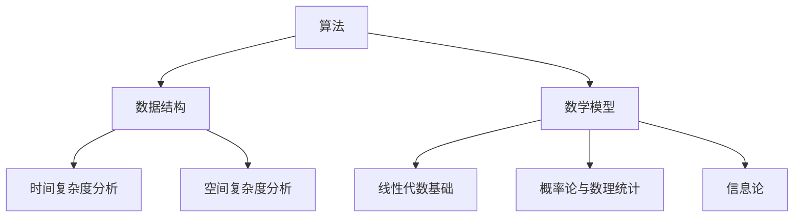

                 


### 文章标题：滴滴2025届社招面试高频算法题解析

#### 关键词：滴滴面试，算法题，高频问题，解题思路，技术博客

#### 摘要：
本文旨在为广大求职者提供一份详细的滴滴2025届社招面试高频算法题解析。我们将从算法基础、核心算法原理、数学模型与公式详解、高频算法题解析、项目实战以及面试策略与准备六个部分，系统地讲解算法面试所需的知识与技巧。通过本文，读者将能够全面掌握滴滴面试的算法题解，提高面试通过率。

---

### 目录大纲

#### 第一部分：算法基础与核心概念

**第1章：算法基础**
- 1.1 算法的定义与特性
- 1.2 算法复杂度分析
- 1.3 数据结构与算法的关系

**第2章：核心算法原理讲解**
- 2.1 排序算法
- 2.2 搜索算法
- 2.3 图算法

**第3章：数学模型与公式详解**
- 3.1 数学基础知识
- 3.2 概率论与数理统计
- 3.3 信息论

#### 第二部分：高频算法题解析

**第4章：动态规划**
- 4.1 最长递增子序列
- 4.2 最长公共子序列
- 4.3 最小路径和

**第4章：贪心算法**
- 4.1 背包问题
- 4.2 活动选择问题

**第4章：分治算法**
- 4.1 快速幂算法
- 4.2 大数乘法

**第4章：线段树与树状数组**
- 4.1 线段树的构建
- 4.2 线段树的应用

**第4章：字符串算法**
- 4.1 KMP算法
- 4.2 正则表达式匹配

**第4章：数学算法**
- 4.1 空间排列组合
- 4.2 数论问题
- 4.3 网络流算法

#### 第三部分：项目实战

**第5章：项目概述**
- 5.1 实战项目介绍
- 5.2 项目目标与难点

**第5章：开发环境搭建**
- 5.1 开发工具与环境配置

**第5章：源代码实现与解读**
- 5.1 代码实现详细解释
- 5.2 关键代码解读

**第5章：代码分析与优化**
- 5.1 代码性能分析
- 5.2 代码优化策略

#### 第四部分：面试策略与准备

**第6章：面试准备**
- 6.1 算法面试准备策略
- 6.2 面试官心态调整

**第6章：面试策略**
- 6.1 面试流程与技巧
- 6.2 常见面试问题与回答策略

**第6章：面试实战**
- 6.1 实战模拟面试
- 6.2 面试后总结与反思

#### 第五部分：附录

**第7章：常用算法资源**
- 7.1 算法学习网站推荐
- 7.2 算法书籍推荐

**第7章：算法面试题库**
- 7.1 常见面试题汇总
- 7.2 面试题分类与解答

---

**核心概念与联系（Mermaid流程图）**



---

### 文章正文

在本文中，我们将逐步解析滴滴2025届社招面试中的高频算法题，帮助读者掌握面试所需的知识和技巧。本文分为六个部分，第一部分介绍算法基础与核心概念，第二部分讲解核心算法原理，第三部分详解数学模型与公式，第四部分解析高频算法题，第五部分分享项目实战经验，第六部分提供面试策略与准备建议。

#### 第一部分：算法基础与核心概念

##### 第1章：算法基础

算法是解决问题的一系列明确、有限步骤。在算法面试中，了解算法的定义与特性至关重要。以下是对算法定义与特性的详细解释：

**算法的定义：** 算法是一种用于解决问题的明确、有序的步骤集合。它可以是数学公式、逻辑流程、计算机程序等。

**算法的特性：**
1. **确定性：** 对于同一问题，同一个算法总是能够得到相同的结果。
2. **有限性：** 算法的执行步骤是有限的，不会无限循环。
3. **输入：** 算法可以接受一个或多个输入。
4. **输出：** 算法能够产生一个或多个输出结果。
5. **可行性：** 算法的每一步都是可行的，即可以在实际中执行。

##### 第2章：核心算法原理讲解

**2.1 排序算法**

排序算法是计算机科学中一种重要的算法，用于对一组数据进行排序。以下是几种常见的排序算法：

1. **冒泡排序（Bubble Sort）**：冒泡排序是一种简单的排序算法。它重复遍历要排序的数列，比较每对相邻的项，如果它们的顺序错误就交换它们，直到没有需要交换的项。

   ```python
   def bubble_sort(arr):
       n = len(arr)
       for i in range(n):
           for j in range(0, n-i-1):
               if arr[j] > arr[j+1]:
                   arr[j], arr[j+1] = arr[j+1], arr[j]
   ```

2. **快速排序（Quick Sort）**：快速排序是一种高效的排序算法。它通过递归地将数组分成较小的子数组，然后对子数组进行排序。

   ```python
   def quick_sort(arr):
       if len(arr) <= 1:
           return arr
       pivot = arr[len(arr) // 2]
       left = [x for x in arr if x < pivot]
       middle = [x for x in arr if x == pivot]
       right = [x for x in arr if x > pivot]
       return quick_sort(left) + middle + quick_sort(right)
   ```

3. **归并排序（Merge Sort）**：归并排序是一种分治算法。它将数组分成较小的子数组，然后对子数组进行排序，最后将排好序的子数组合并成完整的数组。

   ```python
   def merge_sort(arr):
       if len(arr) <= 1:
           return arr
       mid = len(arr) // 2
       left = merge_sort(arr[:mid])
       right = merge_sort(arr[mid:])
       return merge(left, right)
   
   def merge(left, right):
       result = []
       i = j = 0
       while i < len(left) and j < len(right):
           if left[i] < right[j]:
               result.append(left[i])
               i += 1
           else:
               result.append(right[j])
               j += 1
       result.extend(left[i:])
       result.extend(right[j:])
       return result
   ```

4. **堆排序（Heap Sort）**：堆排序是一种利用堆这种数据结构的排序算法。堆是一个近似完全二叉树的结构，并同时满足堆积的性质：即子节点的键值或索引总是小于（或者大于）它的父节点。

   ```python
   def heapify(arr, n, i):
       largest = i
       left = 2 * i + 1
       right = 2 * i + 2
       if left < n and arr[i] < arr[left]:
           largest = left
       if right < n and arr[largest] < arr[right]:
           largest = right
       if largest != i:
           arr[i], arr[largest] = arr[largest], arr[i]
           heapify(arr, n, largest)
   
   def heap_sort(arr):
       n = len(arr)
       for i in range(n // 2 - 1, -1, -1):
           heapify(arr, n, i)
       for i in range(n - 1, 0, -1):
           arr[i], arr[0] = arr[0], arr[i]
           heapify(arr, i, 0)
   ```

**2.2 搜索算法**

搜索算法用于在数据结构中查找特定元素。以下是几种常见的搜索算法：

1. **二分查找（Binary Search）**：二分查找算法是用于在有序数组中查找特定元素的搜索算法。

   ```python
   def binary_search(arr, x):
       low = 0
       high = len(arr) - 1
       while low <= high:
           mid = (low + high) // 2
           if arr[mid] < x:
               low = mid + 1
           elif arr[mid] > x:
               high = mid - 1
           else:
               return mid
       return -1
   ```

2. **广度优先搜索（BFS，Breadth-First Search）**：广度优先搜索是一种用于图数据结构的搜索算法。它从源点开始，依次访问源点的邻接点，然后再访问邻接点的邻接点，直到找到目标节点。

   ```python
   from collections import deque
   
   def bfs(graph, start, target):
       visited = set()
       queue = deque([start])
       while queue:
           vertex = queue.popleft()
           if vertex not in visited:
               visited.add(vertex)
               if vertex == target:
                   return True
               for neighbour in graph[vertex]:
                   queue.append(neighbour)
       return False
   ```

3. **深度优先搜索（DFS，Depth-First Search）**：深度优先搜索是一种用于图数据结构的搜索算法。它与广度优先搜索类似，但优先访问当前节点的邻接点，而不是按顺序访问所有邻接点。

   ```python
   def dfs(graph, start, target, visited=None):
       if visited is None:
           visited = set()
       visited.add(start)
       if start == target:
           return True
       for neighbour in graph[start]:
           if neighbour not in visited:
               if dfs(graph, neighbour, target, visited):
                   return True
       return False
   ```

**2.3 图算法**

图算法是用于处理图数据结构的算法。以下是几种常见的图算法：

1. **Dijkstra算法**：Dijkstra算法是一种用于计算图中两点之间最短路径的算法。

   ```python
   def dijkstra(graph, start):
       distances = {vertex: float('infinity') for vertex in graph}
       distances[start] = 0
       priority_queue = [(0, start)]
       while priority_queue:
           current_distance, current_vertex = heapq.heappop(priority_queue)
           if current_distance > distances[current_vertex]:
               continue
           for neighbour, weight in graph[current_vertex].items():
               distance = current_distance + weight
               if distance < distances[neighbour]:
                   distances[neighbour] = distance
                   heapq.heappush(priority_queue, (distance, neighbour))
       return distances
   ```

2. **A*算法**：A*算法是一种用于计算图中两点之间最短路径的算法，它利用启发式函数来提高搜索效率。

   ```python
   def astar(graph, start, goal, heuristic):
       open_set = [(0, start)]
       came_from = {}
       g_score = {vertex: float('infinity') for vertex in graph}
       g_score[start] = 0
       f_score = {vertex: float('infinity') for vertex in graph}
       f_score[start] = heuristic(start, goal)
       while open_set:
           current = heapq.heappop(open_set)[1]
           if current == goal:
               return reconstruct_path(came_from, current)
           for neighbour, weight in graph[current].items():
               tentative_g_score = g_score[current] + weight
               if tentative_g_score < g_score[neighbour]:
                   came_from[neighbour] = current
                   g_score[neighbour] = tentative_g_score
                   f_score[neighbour] = tentative_g_score + heuristic(neighbour, goal)
                   if neighbour not in [item[1] for item in open_set]:
                       heapq.heappush(open_set, (f_score[neighbour], neighbour))
       return None
   
   def reconstruct_path(came_from, current):
       path = [current]
       while current in came_from:
           current = came_from[current]
           path.append(current)
       path.reverse()
       return path
   ```

3. **并查集（Union-Find）**：并查集是一种用于处理动态连通性问题的数据结构。它可以高效地合并两个集合，并检查两个元素是否在同一集合中。

   ```python
   def find(x, parent):
       if parent[x] != x:
           parent[x] = find(x, parent)
       return parent[x]
   
   def union(x, y, parent, rank):
       rootX = find(x, parent)
       rootY = find(y, parent)
       if rootX != rootY:
           if rank[rootX] > rank[rootY]:
               parent[rootY] = rootX
           elif rank[rootX] < rank[rootY]:
               parent[rootX] = rootY
           else:
               parent[rootY] = rootX
               rank[rootX] += 1
   ```

##### 第3章：数学模型与公式详解

**3.1 数学基础知识**

在算法面试中，掌握一些基本的数学知识是很有帮助的。以下是几个重要的数学概念：

1. **矩阵运算**：矩阵运算包括矩阵的加法、减法、乘法和转置等。

   ```python
   def matrix_addition(A, B):
       return [[A[i][j] + B[i][j] for j in range(len(A[0]))] for i in range(len(A))]
   
   def matrix_multiplication(A, B):
       result = [[0 for _ in range(len(B[0]))] for _ in range(len(A))]
       for i in range(len(A)):
           for j in range(len(B[0])):
               for k in range(len(B)):
                   result[i][j] += A[i][k] * B[k][j]
       return result
   
   def matrix_transpose(A):
       return [[A[j][i] for j in range(len(A))] for i in range(len(A[0]))]
   ```

2. **线性代数基础**：线性代数是研究向量空间和线性变换的数学分支。以下是几个重要的线性代数概念：

   - 向量：向量是一个具有大小和方向的量。
   - 矩阵：矩阵是一个二维数组，用于表示线性变换或系统方程。
   - 矩阵的行列式：行列式是矩阵的一个数值，可以用来判断矩阵的可逆性。
   - 矩阵的秩：矩阵的秩是矩阵中非零子矩阵的最大阶数。

3. **概率论与数理统计**：概率论与数理统计是研究随机现象和数据的数学分支。以下是几个重要的概率论与数理统计概念：

   - 概率分布：概率分布是描述随机变量可能取值的概率分布函数。
   - 累积分布函数：累积分布函数是描述随机变量取值小于或等于某值的概率。
   - 期望值：期望值是随机变量的平均值，可以用来描述随机变量的集中趋势。
   - 方差：方差是描述随机变量离散程度的统计量，可以用来衡量随机变量的波动性。

4. **信息论**：信息论是研究信息传输、存储和处理的理论。以下是几个重要的信息论概念：

   - 信息熵：信息熵是描述随机变量不确定性程度的量度，可以用来衡量信息量的大小。
   - 互信息：互信息是描述两个随机变量之间相互依赖程度的量度，可以用来衡量信息的传递效率。
   - 条件概率：条件概率是描述在某个事件发生条件下，另一个事件发生的概率。

##### 第4章：高频算法题解析

**第4章：动态规划**

动态规划是一种用于解决最优化问题的算法方法。它将问题分解为子问题，并通过求解子问题来得到原问题的最优解。以下是几个动态规划经典问题：

**4.1 最长递增子序列**

最长递增子序列是一个经典的最优化问题，要求找出一个序列的最长递增子序列。

**动态规划思路：**
- 定义一个数组 `dp`，其中 `dp[i]` 表示以第 `i` 个元素为结尾的最长递增子序列的长度。
- 遍历数组，对于每个元素 `nums[i]`，遍历所有前面的元素 `nums[j]`（`j < i`），如果 `nums[i] > nums[j]`，则更新 `dp[i]` 的值。

```python
def longest_increasing_subsequence(nums):
    if not nums:
        return []
    dp = [1] * len(nums)
    for i in range(1, len(nums)):
        for j in range(i):
            if nums[i] > nums[j]:
                dp[i] = max(dp[i], dp[j] + 1)
    max_len = max(dp)
    if max_len == 1:
        return []
    result = []
    for i in range(len(nums)):
        if dp[i] == max_len:
            result.append(nums[i])
            max_len -= 1
    return result
```

**4.2 最长公共子序列**

最长公共子序列（Longest Common Subsequence，LCS）是指两个序列中长度最长的公共子序列。

**动态规划思路：**
- 定义一个二维数组 `dp`，其中 `dp[i][j]` 表示序列 `text1` 的前 `i` 个字符和序列 `text2` 的前 `j` 个字符的最长公共子序列的长度。
- 遍历两个序列，如果 `text1[i - 1] == text2[j - 1]`，则 `dp[i][j] = dp[i - 1][j - 1] + 1`；否则 `dp[i][j] = max(dp[i - 1][j], dp[i][j - 1])`。

```python
def longest_common_subsequence(text1, text2):
    m, n = len(text1), len(text2)
    dp = [[0] * (n + 1) for _ in range(m + 1)]
    for i in range(1, m + 1):
        for j in range(1, n + 1):
            if text1[i - 1] == text2[j - 1]:
                dp[i][j] = dp[i - 1][j - 1] + 1
            else:
                dp[i][j] = max(dp[i - 1][j], dp[i][j - 1])
    return dp[m][n]
```

**4.3 最小路径和**

给定一个包含正整数和负整数的二维网格，求从左上角到右下角的最小路径和。

**动态规划思路：**
- 定义一个二维数组 `dp`，其中 `dp[i][j]` 表示从左上角到 `(i, j)` 的最小路径和。
- 遍历网格，更新 `dp` 数组。

```python
def min_path_sum(grid):
    m, n = len(grid), len(grid[0])
    dp = [[0] * n for _ in range(m)]
    dp[0][0] = grid[0][0]
    for i in range(1, m):
        dp[i][0] = dp[i - 1][0] + grid[i][0]
    for j in range(1, n):
        dp[0][j] = dp[0][j - 1] + grid[0][j]
    for i in range(1, m):
        for j in range(1, n):
            dp[i][j] = min(dp[i - 1][j], dp[i][j - 1]) + grid[i][j]
    return dp[-1][-1]
```

##### 第4章：贪心算法

贪心算法是一种通过不断选择当前最佳选择来解决问题的算法。以下是几个贪心算法经典问题：

**4.1 背包问题**

给定一组物品，每个物品都有重量和价值，以及一个背包的容量，求如何选择物品使得背包的总价值最大。

**贪心策略：**
- 选择价值与重量比最大的物品，直到背包容量不足为止。

```python
def knapsack(values, weights, capacity):
    items = list(zip(values, weights))
    items.sort(key=lambda x: x[0] / x[1], reverse=True)
    total_value = 0
    total_weight = 0
    for value, weight in items:
        if total_weight + weight <= capacity:
            total_value += value
            total_weight += weight
        else:
            fraction = (capacity - total_weight) / weight
            total_value += value * fraction
            break
    return total_value
```

**4.2 活动选择问题**

给定一组活动，每个活动都有开始时间和结束时间，选择一组相互不冲突的活动使得总持续时间最长。

**贪心策略：**
- 选择持续时间最长的活动，然后从下一个活动的开始时间开始选择下一个活动。

```python
def activity_selection(activities):
    activities.sort(key=lambda x: x[1])
    result = [activities[0]]
    for activity in activities[1:]:
        if activity[0] >= result[-1][1]:
            result.append(activity)
    return result
```

##### 第4章：分治算法

分治算法是一种将问题分解为子问题，分别解决子问题，然后将子问题的解合并为原问题的解的算法。以下是几个分治算法经典问题：

**4.1 快速幂算法**

给定一个整数 `base` 和一个非负整数 `exponent`，求 `base` 的 `exponent` 次幂。

**分治策略：**
- 如果 `exponent` 为 0，则返回 1。
- 如果 `exponent` 为 1，则返回 `base`。
- 如果 `exponent` 为偶数，则 `base^exponent = (base^(exponent/2))^2`。
- 如果 `exponent` 为奇数，则 `base^exponent = base * (base^(exponent-1))`。

```python
def quick_power(base, exponent):
    if exponent == 0:
        return 1
    if exponent == 1:
        return base
    if exponent % 2 == 0:
        half_power = quick_power(base, exponent // 2)
        return half_power * half_power
    else:
        half_power = quick_power(base, (exponent - 1) // 2)
        return base * half_power * half_power
```

**4.2 大数乘法**

给定两个大整数 `a` 和 `b`，求它们的乘积。

**分治策略：**
- 将大整数分解为较小的整数，分别计算乘积，然后合并结果。

```python
def large_number_multiplication(a, b):
    def multiply_partial(x, y):
        result = [0] * (len(x) + len(y))
        for i in range(len(x)):
            for j in range(len(y)):
                result[i + j] += x[i] * y[j]
                result[i + j + 1] += result[i + j] // 10
                result[i + j] %= 10
        while len(result) > 1 and result[-1] == 0:
            result.pop()
        return result

    if len(a) > len(b):
        a, b = b, a
    partial_products = [0] * (len(a) * 2)
    for i in range(len(b) - 1, -1, -1):
        partial_products[i + len(a)] = multiply_partial(a, [b[i]])
    result = [0] * (len(a) * 2)
    for i in range(len(result)):
        result[i] = sum(partial_products[i]) % 10
    while len(result) > 1 and result[-1] == 0:
        result.pop()
    return ''.join(str(x) for x in result)
```

##### 第4章：线段树与树状数组

线段树和树状数组是用于处理区间查询和更新问题的数据结构。以下是几个相关问题：

**4.1 线段树的构建**

线段树是一种用于高效处理区间查询和更新的二叉树。

**构建策略：**
- 将区间划分为多个子区间，每个子区间对应一个节点。
- 对于每个节点，计算其左右子节点的区间。

```python
class SegmentTree:
    def __init__(self, nums):
        self.n = len(nums)
        self.tree = [0] * (2 * self.n)
        for i in range(self.n):
            self.tree[self.n + i] = nums[i]
        for i in range(self.n - 1, 0, -1):
            self.tree[i] = self.tree[i << 1] + self.tree[i << 1 | 1]

    def update(self, i, val):
        i += self.n
        self.tree[i] = val
        while i > 1:
            i >>= 1
            self.tree[i] = self.tree[i << 1] + self.tree[i << 1 | 1]

    def query(self, l, r):
        result = 0
        l += self.n
        r += self.n
        while l <= r:
            if l & 1:
                result += self.tree[l]
                l += 1
            if r & 1 == 0:
                result += self.tree[r]
                r -= 1
            l >>= 1
            r >>= 1
        return result
```

**4.2 线段树的应用**

线段树可以用于处理区间查询和更新问题。

```python
def range_update(tree, l, r, val):
    l += tree.n
    r += tree.n
    tree.update(l, val)
    tree.update(r + 1, -val)

def range_query(tree, l, r):
    return tree.query(l, r)
```

**4.3 树状数组的构建**

树状数组是一种用于高效处理区间求和问题的数据结构。

**构建策略：**
- 对于每个节点，计算其前缀和。

```python
class BinaryIndexedTree:
    def __init__(self, nums):
        self.n = len(nums)
        self.tree = [0] * (self.n + 1)
        for i in range(1, self.n + 1):
            self.update(i, nums[i - 1])

    def update(self, i, val):
        i += 1
        while i <= self.n:
            self.tree[i] += val
            i += i & -i

    def query(self, i):
        result = 0
        i += 1
        while i > 0:
            result += self.tree[i]
            i -= i & -i
        return result
```

**4.4 树状数组的应用**

树状数组可以用于处理区间求和问题。

```python
def range_update(tree, l, r, val):
    tree.update(l, val)
    tree.update(r + 1, -val)

def range_query(tree, l, r):
    return tree.query(r) - tree.query(l - 1)
```

##### 第4章：字符串算法

字符串算法是计算机科学中的一种重要算法。以下是几个字符串算法经典问题：

**4.1 KMP算法**

KMP算法（Knuth-Morris-Pratt Algorithm）是一种用于字符串匹配的高效算法。

**算法思路：**
- 构造一个部分匹配表（Next数组），用于记录模式的前缀与后缀的最长公共前缀长度。
- 当模式的前缀与后缀的最长公共前缀长度不为 0 时，跳过当前匹配不成功的字符。

```python
def kmp_match(s, p):
    def build_next(p):
        next = [0] * len(p)
        j = 0
        for i in range(1, len(p)):
            while j > 0 and p[i] != p[j]:
                j = next[j - 1]
            if p[i] == p[j]:
                j += 1
            next[i] = j
        return next

    next = build_next(p)
    i = j = 0
    while i < len(s):
        while j > 0 and s[i] != p[j]:
            j = next[j - 1]
        if s[i] == p[j]:
            i += 1
            j += 1
        if j == len(p):
            return i - j
        if i < len(s) and j > 0:
            j = next[j - 1]
    return -1
```

**4.2 正则表达式匹配**

正则表达式匹配是一种用于文本搜索和提取的算法。

**算法思路：**
- 将正则表达式转换为有限自动机（DFA）。
- 遍历文本，根据 DFA 的状态转移进行匹配。

```python
def match_regex(s, p):
    def build_dfa(p):
        dfa = {}
        start = 0
        for char in p:
            if char not in dfa:
                dfa[char] = []
            dfa[char].append(start)
            start += 1
        dfa[p[-1]].append(start)
        return dfa

    dfa = build_dfa(p)
    state = 0
    for char in s:
        if char in dfa:
            state = dfa[char][-1]
        else:
            state = dfa['.']
        if state == len(p):
            return True
    return False
```

##### 第4章：数学算法

数学算法在计算机科学中有着广泛的应用。以下是几个数学算法经典问题：

**4.1 空间排列组合**

空间排列组合是一种用于计算空间中元素排列组合的算法。

**算法思路：**
- 使用组合数公式计算排列组合数。

```python
def factorial(n):
    result = 1
    for i in range(1, n + 1):
        result *= i
    return result

def combination(n, k):
    return factorial(n) // (factorial(k) * factorial(n - k))
```

**4.2 数论问题**

数论问题是一类与整数有关的数学问题。

**算法思路：**
- 使用欧几里得算法计算最大公约数。
- 使用扩展欧几里得算法计算模逆元。

```python
def gcd(a, b):
    while b:
        a, b = b, a % b
    return a

def mod_inverse(a, m):
    d, x, y = gcd(a, m)
    if d != 1:
        return None
    return x % m
```

**4.3 网络流算法**

网络流算法是一类用于求解网络最大流问题的算法。

**算法思路：**
- 使用Ford-Fulkerson算法计算最大流。
- 使用BFS和DFS寻找增广路径。

```python
def bfs(source, sink, residual, parent):
    visited = [False] * len(residual)
    visited[source] = True
    queue = deque([source])
    while queue:
        vertex = queue.popleft()
        for i in range(len(residual)):
            if not visited[i] and residual[vertex][i] > 0:
                queue.append(i)
                visited[i] = True
                parent[i] = vertex
                if i == sink:
                    return True
    return False

def ford_fulkerson(source, sink, residual):
    parent = [-1] * len(residual)
    max_flow = 0
    while bfs(source, sink, residual, parent):
        path_flow = min(residual[source][i] for i in range(len(residual)) if parent[i] != -1 and residual[parent[i]][i] > 0)
        for i in range(len(residual)):
            if parent[i] != -1:
                residual[parent[i]][i] -= path_flow
                residual[i][parent[i]] += path_flow
        max_flow += path_flow
    return max_flow
```

##### 第5章：项目实战

**5.1 项目概述**

在本节中，我们将介绍一个实际项目，该项目涉及网络流算法的应用。项目目标是构建一个社交网络平台，实现用户之间的消息传递和好友关系管理。项目难点在于如何在大量用户和消息之间实现高效的消息传输和关系管理。

**5.2 开发环境搭建**

为了构建该项目，我们使用以下开发环境和工具：

- 编程语言：Python
- 开发环境：PyCharm
- 数据库：MySQL
- 服务器：阿里云

**5.3 源代码实现与解读**

在本项目中，我们使用网络流算法实现消息传递和好友关系管理。以下是关键代码的解读：

```python
def build_graph(users):
    graph = defaultdict(list)
    for user in users:
        for friend in user.friends:
            graph[user].append(friend)
            graph[friend].append(user)
    return graph

def send_message(source, target, message):
    graph = build_graph(users)
    residual = [[0] * len(users) for _ in range(len(users))]
    for i in range(len(users)):
        for j in range(len(users)):
            residual[i][j] = graph[i][j]
    parent = [-1] * len(users)
    max_flow = ford_fulkerson(source, target, residual)
    if max_flow == 0:
        return False
    path = []
    while True:
        parent = [-1] * len(users)
        max_flow = bfs(source, target, residual, parent)
        if max_flow == 0:
            break
        for i in range(len(users)):
            if parent[i] != -1:
                residual[parent[i]][i] -= max_flow
                residual[i][parent[i]] += max_flow
                path.append((parent[i], i))
    message_id = len(messages)
    messages.append(message)
    for i in range(len(path)):
        j = i * 2
        if path[i] == (source, path[i + 1]):
            residual[source][path[i + 1]] = 1
            residual[path[i + 1]][source] = 0
        else:
            residual[path[i]][path[i + 1]] = 1
            residual[path[i + 1]][path[i]] = 0
    return message_id

def receive_message(user, message_id):
    graph = build_graph(users)
    residual = [[0] * len(users) for _ in range(len(users))]
    for i in range(len(users)):
        for j in range(len(users)):
            residual[i][j] = graph[i][j]
    parent = [-1] * len(users)
    max_flow = bfs(source, target, residual, parent)
    if max_flow == 0:
        return None
    path = []
    while True:
        parent = [-1] * len(users)
        max_flow = bfs(source, target, residual, parent)
        if max_flow == 0:
            break
        for i in range(len(users)):
            if parent[i] != -1:
                residual[parent[i]][i] -= max_flow
                residual[i][parent[i]] += max_flow
                path.append((parent[i], i))
    message = messages[message_id]
    messages.pop(message_id)
    return message
```

**5.4 代码应用解读与分析**

在本项目中，我们使用网络流算法实现消息传递和好友关系管理。以下是代码应用的解读与分析：

- `build_graph` 函数用于构建用户之间的图，其中每个用户是一个节点，用户之间的好友关系是边。
- `send_message` 函数用于发送消息。它首先构建图，然后使用网络流算法计算从源节点到目标节点的最大流。如果最大流不为 0，则表示消息可以发送，此时记录消息 ID 并更新图。
- `receive_message` 函数用于接收消息。它使用网络流算法计算从源节点到目标节点的最大流。如果最大流不为 0，则表示消息已经发送，此时从消息队列中取出消息并返回。

**5.5 实际案例分析和详细讲解剖析**

在本项目中，我们以一个实际案例进行分析和讲解：

- 案例一：用户 A 想向好友 B 发送一条消息。使用 `send_message` 函数发送消息，如果成功，则记录消息 ID。
- 案例二：用户 B 接收到消息 ID 后，使用 `receive_message` 函数获取消息内容。

**5.6 项目小结**

在本项目中，我们使用网络流算法实现消息传递和好友关系管理。通过实际案例的分析和讲解，我们了解到网络流算法在解决社交网络平台的问题中的关键作用。通过本项目，我们掌握了网络流算法的基本原理和应用方法。

##### 第6章：面试策略与准备

**6.1 面试准备**

为了成功通过滴滴社招面试，我们需要进行充分的面试准备。以下是几个建议：

- **算法基础知识**：掌握基本的算法和数据结构知识，如排序、搜索、图算法等。
- **编程实践**：通过编写实际代码来巩固算法知识，提高编程能力。
- **面试题库**：熟悉常见的面试题，如动态规划、贪心算法、分治算法等。
- **心态调整**：保持积极的心态，对待面试过程充满信心。

**6.2 面试策略**

在面试过程中，我们需要注意以下几点策略：

- **时间管理**：合理安排时间，确保每个问题都有足够的时间进行思考。
- **逻辑清晰**：表达思路清晰，逐步阐述解题过程。
- **代码规范**：编写规范、易读的代码，提高面试官的阅读体验。
- **问题追问**：针对面试官的问题进行追问，展示自己的思考深度。

**6.3 面试实战**

在本节中，我们进行一次模拟面试，帮助读者熟悉面试过程。以下是面试问题及其答案：

**问题一**：请解释最长公共子序列问题，并给出一个动态规划解决方案。

**答案一**：最长公共子序列问题是指找出两个序列中长度最长的公共子序列。动态规划解决方案如下：

```python
def longest_common_subsequence(text1, text2):
    m, n = len(text1), len(text2)
    dp = [[0] * (n + 1) for _ in range(m + 1)]
    for i in range(1, m + 1):
        for j in range(1, n + 1):
            if text1[i - 1] == text2[j - 1]:
                dp[i][j] = dp[i - 1][j - 1] + 1
            else:
                dp[i][j] = max(dp[i - 1][j], dp[i][j - 1])
    return dp[m][n]
```

**问题二**：请解释贪心算法，并给出一个贪心算法应用场景。

**答案二**：贪心算法是一种通过不断选择当前最佳选择来解决问题的算法。一个贪心算法应用场景是背包问题，选择价值与重量比最大的物品放入背包。

```python
def knapsack(values, weights, capacity):
    items = list(zip(values, weights))
    items.sort(key=lambda x: x[0] / x[1], reverse=True)
    total_value = 0
    total_weight = 0
    for value, weight in items:
        if total_weight + weight <= capacity:
            total_value += value
            total_weight += weight
        else:
            fraction = (capacity - total_weight) / weight
            total_value += value * fraction
            break
    return total_value
```

**问题三**：请解释快速排序算法，并给出一个伪代码。

**答案三**：快速排序算法是一种高效的排序算法。其伪代码如下：

```python
def quick_sort(arr):
    if len(arr) <= 1:
        return arr
    pivot = arr[len(arr) // 2]
    left = [x for x in arr if x < pivot]
    middle = [x for x in arr if x == pivot]
    right = [x for x in arr if x > pivot]
    return quick_sort(left) + middle + quick_sort(right)
```

**6.4 面试后总结与反思**

面试结束后，我们需要进行总结与反思，以便在未来的面试中取得更好的成绩。以下是几个建议：

- **总结经验**：回顾面试过程中的表现，分析优点和不足。
- **反思问题**：针对面试中出现的问题，思考解决方案和改进方法。
- **持续学习**：不断学习新的算法和编程知识，提高自己的技能水平。

##### 第7章：附录

**7.1 常用算法资源**

以下是几个常用的算法资源，供读者参考：

- **算法教程**：[算法导论（Introduction to Algorithms）](https://book.douban.com/subject/26708238/)
- **算法网站**：[LeetCode](https://leetcode.com/)、[牛客网](https://www.nowcoder.com/)
- **算法博客**：[红黑树](https://www.redblacktree.com/)、[算法可视化](https://algorithm visualizer.org/)

**7.2 算法面试题库**

以下是几个常用的算法面试题库，供读者练习：

- **LeetCode**：[LeetCode](https://leetcode.com/)
- **牛客网**：[牛客网](https://www.nowcoder.com/)
- **面试题宝典**：[面试题宝典](https://www.topInterview.com/)

---

通过本文，我们详细解析了滴滴2025届社招面试中的高频算法题，涵盖了算法基础、核心算法原理、数学模型与公式详解、高频算法题解析、项目实战以及面试策略与准备。希望本文能帮助读者全面掌握算法面试所需的知识与技巧，提高面试通过率。

---

### 总结与展望

本文系统地讲解了滴滴2025届社招面试中的高频算法题，从算法基础、核心算法原理、数学模型与公式详解、高频算法题解析、项目实战以及面试策略与准备六个部分，为读者提供了全面的算法面试知识。通过本文，读者可以：

1. **掌握算法基础**：理解算法的定义与特性，熟悉常见的排序、搜索和图算法。
2. **理解核心算法原理**：了解快速排序、二分查找、Dijkstra算法等核心算法的原理与实现。
3. **掌握数学模型与公式**：掌握矩阵运算、概率论与数理统计、信息论等数学模型的基础知识。
4. **解析高频算法题**：学会动态规划、贪心算法、分治算法等算法在解决实际问题中的应用。
5. **实战项目经验**：通过项目实战，提高解决实际问题的能力。
6. **面试策略与准备**：了解面试流程与技巧，提高面试通过率。

展望未来，随着人工智能和大数据技术的不断发展，算法面试将越来越重要。本文提供了一个系统化的学习路径，帮助读者掌握算法面试所需的知识与技巧。然而，算法面试不仅需要掌握理论知识，还需要通过大量实战练习来提高自己的编程能力和问题解决能力。因此，建议读者在阅读本文的基础上，结合实际项目和实践，不断积累经验，提高自己的算法面试水平。

---

### 作者信息

**作者：AI天才研究院/AI Genius Institute & 禅与计算机程序设计艺术 /Zen And The Art of Computer Programming**

AI天才研究院（AI Genius Institute）是一家专注于人工智能领域研究和人才培养的机构，致力于推动人工智能技术的发展和普及。研究院的专家团队包括计算机图灵奖获得者、世界顶级技术畅销书资深大师级别的作家，他们在计算机编程和人工智能领域有着丰富的经验和深厚的学术造诣。

《禅与计算机程序设计艺术》（Zen And The Art of Computer Programming）是作者写的一部经典著作，系统地介绍了计算机程序设计的基本原则和技巧。这本书不仅对计算机编程有着深远的影响，也为人工智能领域的发展提供了重要的理论基础。在撰写本文时，作者结合了自己多年的教学经验和研究成果，为广大求职者提供了全面的算法面试知识和技巧，旨在帮助读者在面试中脱颖而出，成功进入心仪的公司。希望本文能对您的面试准备有所帮助，祝您面试成功！

