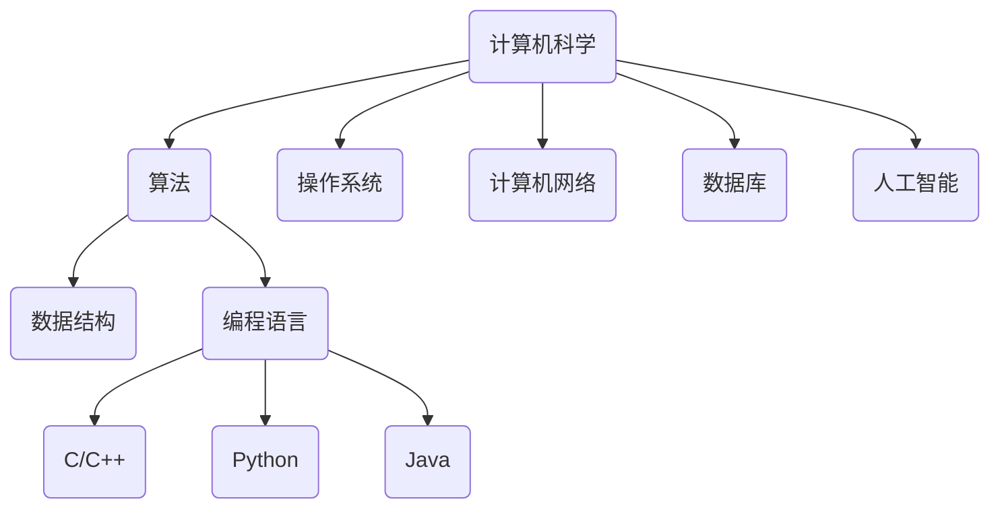
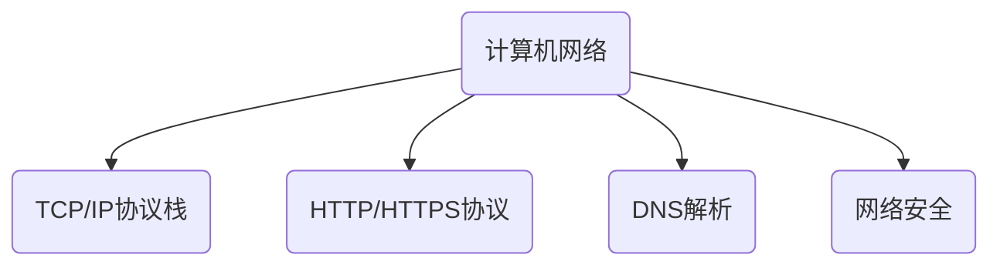
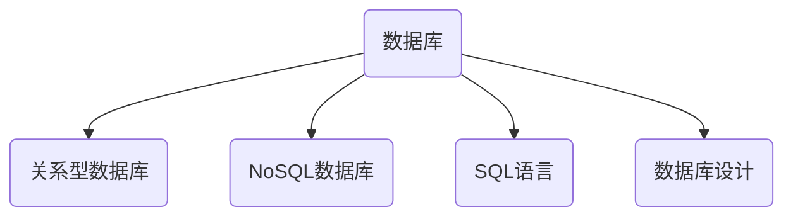
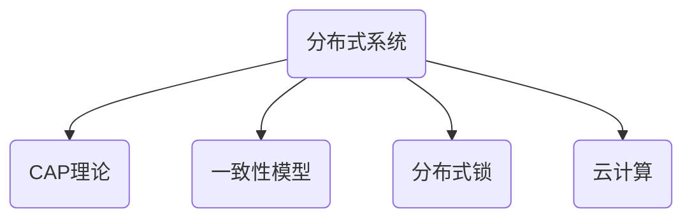
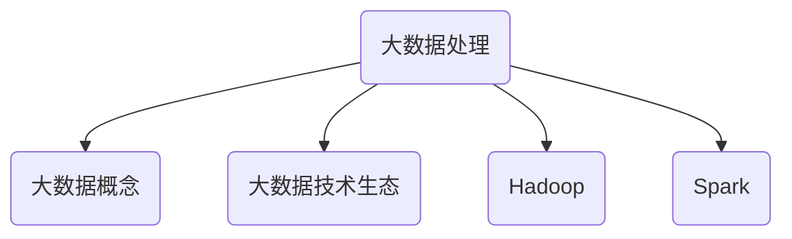
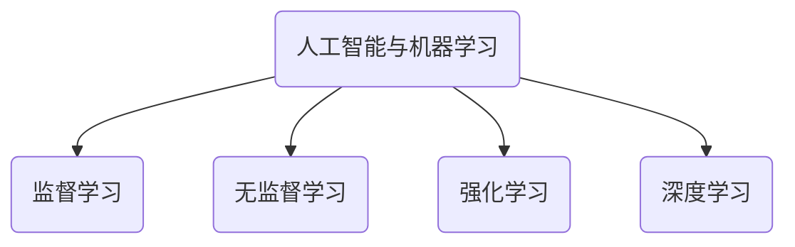

                 


# 《2024滴滴云校招面试真题汇总及其解答》

> 关键词：滴滴云校招、面试真题、计算机基础、计算机网络、数据库、分布式系统、人工智能

摘要：本文将围绕2024年滴滴云校招面试的真题，对计算机基础知识、计算机网络与网络安全、数据库与存储、分布式系统与云计算、大数据处理、人工智能与机器学习等领域的真题进行详细解析。同时，本文还将分享一些面试技巧与经验，帮助读者更好地备战滴滴云校招面试。

## 《2024滴滴云校招面试真题汇总及其解答》目录大纲

### 第一部分：面试真题分类解析

#### 第1章：计算机基础知识

##### 1.1 计算机系统基础

- **计算机系统架构概述**
- **操作系统原理**
- **网络协议与体系结构**

##### 1.2 数据结构与算法

- **基础数据结构**
- **算法复杂度分析**
- **排序与查找算法**

##### 1.3 编程语言基础

- **C/C++基础**
- **Python基础**
- **Java基础**

### 第二部分：计算机网络与网络安全

#### 第2章：计算机网络与网络安全

##### 2.1 网络协议

- **TCP/IP协议栈**
- **HTTP/HTTPS协议**
- **DNS解析**

##### 2.2 网络安全基础

- **密码学基础**
- **网络安全攻击与防御**
- **VPN与加密技术**

### 第三部分：数据库与存储

#### 第3章：数据库与存储

##### 3.1 数据库基本概念

- **关系型数据库**
- **NoSQL数据库**

##### 3.2 SQL语言

- **SQL基础操作**
- **复杂查询与优化**

##### 3.3 数据库设计

- **ER模型与关系模型**
- **数据库范式**

### 第四部分：分布式系统与云计算

#### 第4章：分布式系统与云计算

##### 4.1 分布式系统基础

- **CAP理论**
- **一致性模型**
- **分布式锁**

##### 4.2 云计算基础

- **云计算模型**
- **云服务类型**
- **云平台对比**

### 第五部分：大数据处理

#### 第5章：大数据处理

##### 5.1 大数据处理基础

- **大数据概念**
- **大数据技术生态**

##### 5.2 Hadoop与Spark

- **Hadoop架构**
- **Spark架构**
- **数据处理流程**

### 第六部分：人工智能与机器学习

#### 第6章：人工智能与机器学习

##### 6.1 机器学习基础

- **监督学习**
- **无监督学习**
- **强化学习**

##### 6.2 深度学习

- **深度学习基础**
- **神经网络架构**
- **模型训练与优化**

### 第七部分：滴滴云校招面试真题实战解析

#### 第7章：滴滴云校招面试真题实战解析

##### 7.1 实战题目1：计算机网络相关问题

- **问题描述**
- **解题思路**
- **答案解析**

##### 7.2 实战题目2：数据库与SQL

- **问题描述**
- **解题思路**
- **答案解析**

##### 7.3 实战题目3：分布式系统与云计算

- **问题描述**
- **解题思路**
- **答案解析**

##### 7.4 实战题目4：大数据处理与Spark

- **问题描述**
- **解题思路**
- **答案解析**

##### 7.5 实战题目5：人工智能与机器学习

- **问题描述**
- **解题思路**
- **答案解析**

### 第八部分：面试技巧与经验分享

#### 第8章：面试技巧与经验分享

##### 8.1 面试前的准备

- **简历准备**
- **知识储备**

##### 8.2 面试过程中的技巧

- **自我介绍**
- **行为面试**
- **技术面试**

##### 8.3 面试后的跟进

- **邮件跟进**
- **反馈收集**

### 附录

#### 附录A：参考资料与推荐阅读

#### 附录B：面试真题集锦

- **计算机基础知识**
- **计算机网络与网络安全**
- **数据库与存储**
- **分布式系统与云计算**
- **大数据处理**
- **人工智能与机器学习**

## 背景介绍

滴滴云校招是每年互联网行业的一大盛事，吸引了大量优秀应届生的关注。滴滴作为国内领先的出行服务平台，其技术实力和创新能力在业界享有盛誉。因此，滴滴云校招的面试题目涵盖了计算机科学、计算机网络、数据库、分布式系统、大数据处理和人工智能等多个领域，旨在选拔出具有全面技术能力的人才。

本文旨在汇总2024年滴滴云校招的面试真题，并对这些真题进行详细解析。通过本文，读者可以了解到面试题目的考查重点、解题思路和答案解析，从而更好地备战滴滴云校招面试。

## 核心概念与联系

在解析滴滴云校招面试真题之前，我们先来回顾一下各个领域的一些核心概念及其联系。以下是计算机科学、计算机网络、数据库、分布式系统、大数据处理和人工智能等领域的核心概念及其联系的结构化表示：

### 计算机科学



### 计算机网络



### 数据库



### 分布式系统



### 大数据处理



### 人工智能与机器学习



通过这些Mermaid流程图，我们可以清晰地看到各个核心概念之间的联系和层次关系。这些概念构成了计算机科学领域的基础，也是滴滴云校招面试的重点考察内容。

### 计算机系统基础

在计算机科学中，计算机系统基础是一个至关重要的部分。它涵盖了计算机硬件和软件的基本原理，是构建更高级应用程序和系统的基础。本章节将详细解析计算机系统架构、操作系统原理和网络协议与体系结构等核心概念。

#### 计算机系统架构概述

计算机系统架构是指计算机硬件和软件的组成结构，以及它们之间的交互方式。一个典型的计算机系统包括处理器、内存、输入输出设备和操作系统等组成部分。

1. **处理器（CPU）**：处理器是计算机的核心，负责执行指令和进行计算。它由控制单元、算术逻辑单元和寄存器等组成。

2. **内存（RAM）**：内存是临时存储数据和程序的地方。它分为随机访问存储（RAM）和只读存储（ROM）。

3. **输入输出设备**：输入设备如键盘、鼠标等用于输入数据，输出设备如显示器、打印机等用于输出结果。

4. **操作系统**：操作系统是管理计算机硬件资源和提供应用程序接口的软件。常见的操作系统有Windows、Linux和macOS等。

#### 操作系统原理

操作系统原理是计算机系统基础的重要组成部分，主要涉及进程管理、内存管理、文件系统和设备管理等方面。

1. **进程管理**：进程是计算机中正在运行的程序的实例。操作系统负责创建、调度、同步和终止进程。

   - **进程状态**：进程可以处于运行、就绪、阻塞等状态。
   - **进程调度**：操作系统通过调度算法决定哪个进程应该获得CPU时间。

2. **内存管理**：内存管理负责分配和管理内存资源，确保每个进程都有足够的内存空间。

   - **内存分配策略**：常见的内存分配策略有固定分区、动态分区和分页等。
   - **内存保护**：操作系统通过内存保护机制防止进程越界访问内存。

3. **文件系统**：文件系统是操作系统管理文件和目录的数据结构。

   - **文件类型**：常见的文件类型有文本文件、二进制文件等。
   - **文件操作**：文件操作包括创建、删除、读取、写入等。

4. **设备管理**：设备管理负责处理输入输出设备的管理和通信。

   - **设备驱动程序**：设备驱动程序是操作系统与硬件设备之间的接口。
   - **中断处理**：中断是硬件设备向操作系统发出的请求，操作系统通过中断处理程序响应这些请求。

#### 网络协议与体系结构

网络协议是计算机网络中数据传输的规则和标准。网络协议与体系结构主要涉及TCP/IP协议栈、HTTP/HTTPS协议和DNS解析等方面。

1. **TCP/IP协议栈**：TCP/IP协议栈是计算机网络的核心协议，包括IP、TCP、UDP等协议。

   - **IP协议**：IP协议负责数据包的传输和路由选择。
   - **TCP协议**：TCP协议负责提供可靠的、面向连接的数据传输服务。
   - **UDP协议**：UDP协议提供不可靠的、无连接的数据传输服务。

2. **HTTP/HTTPS协议**：HTTP是超文本传输协议，用于Web浏览器和服务器之间的通信。HTTPS是HTTP的安全版本，通过SSL/TLS协议提供加密传输。

3. **DNS解析**：DNS解析是将域名转换为IP地址的过程。DNS服务器存储了域名的解析记录，客户端通过DNS服务器获取目标域名的IP地址。

通过以上解析，我们可以看到计算机系统基础涉及了计算机硬件、操作系统和网络协议等多个方面。理解这些核心概念对于解决面试题目具有重要意义。

### 数据结构与算法

数据结构与算法是计算机科学中的核心内容，它们为程序设计提供了基础工具。在数据结构方面，我们主要关注数组、链表、栈、队列、树和图等基础数据结构。而在算法方面，我们则关注算法的复杂度分析、排序与查找算法等。

#### 基础数据结构

1. **数组**：数组是一种线性数据结构，用于存储固定大小的元素序列。数组支持快速的随机访问，但插入和删除操作较慢。

2. **链表**：链表是一种动态数据结构，由一系列节点组成，每个节点包含数据和指向下一个节点的指针。链表插入和删除操作较快，但随机访问速度较慢。

3. **栈**：栈是一种后进先出（LIFO）的数据结构，适用于处理递归、回溯等问题。

4. **队列**：队列是一种先进先出（FIFO）的数据结构，适用于处理等待队列、打印队列等问题。

5. **树**：树是一种层次结构，由根节点和子节点组成。二叉树、平衡树、AVL树和红黑树等是常见的树结构。

6. **图**：图是一种由节点和边组成的数据结构，用于表示复杂的关系。图的应用包括社交网络、地图、网络拓扑等。

#### 算法复杂度分析

算法复杂度分析是评估算法性能的重要方法。算法复杂度分为时间复杂度和空间复杂度两种。

1. **时间复杂度**：时间复杂度描述了算法执行所需的时间，通常用大O符号表示。常见的时间复杂度有O(1)、O(log n)、O(n)、O(n log n)和O(2^n)等。

2. **空间复杂度**：空间复杂度描述了算法执行所需的空间，也用大O符号表示。常见空间复杂度有O(1)、O(n)和O(n^2)等。

#### 排序与查找算法

排序算法用于对数据进行排序，而查找算法用于在数据结构中查找特定元素。

1. **排序算法**：

   - **冒泡排序**：一种简单的排序算法，通过反复交换相邻未排序元素，使较大的元素逐渐移动到序列末尾。

   - **选择排序**：选择排序在每次迭代中选择最小（或最大）的元素，将其放到已排序序列的末尾。

   - **插入排序**：插入排序通过将未排序元素插入到已排序序列中，逐步构建有序序列。

   - **快速排序**：快速排序通过选取一个基准元素，将序列划分为两部分，然后递归地排序两部分。

   - **归并排序**：归并排序通过将两个有序序列合并为一个有序序列，逐步构建整个有序序列。

2. **查找算法**：

   - **二分查找**：二分查找是一种高效的查找算法，适用于有序数组。通过不断将查找区间缩小一半，快速找到目标元素。

   - **哈希查找**：哈希查找通过哈希函数将关键字映射到数组中的位置，适用于大规模数据集合的快速查找。

#### 伪代码示例

以下是一个简单的冒泡排序算法的伪代码示例：

```pseudo
procedure bubbleSort(数组 A)
    n = 数组长度
    for i = 1 to n-1
        for j = 1 to n-i
            if A[j] > A[j+1]
                交换 A[j] 和 A[j+1]
```

通过上述解析，我们可以看到数据结构与算法在计算机科学中的重要性。掌握这些基础知识和相关算法，将有助于我们更好地解决面试题目。

### 编程语言基础

编程语言是计算机科学的基础，它为开发者提供了与计算机通信的途径。在计算机科学领域，常见的编程语言包括C/C++、Python和Java等。每种语言都有其独特的特点和应用场景。

#### C/C++基础

C语言是一种高级编程语言，因其高效和灵活性而广泛应用于操作系统、嵌入式系统和性能敏感的应用程序开发。C++是在C语言基础上发展而来的，它引入了面向对象编程的概念，使得代码更加模块化和可复用。

1. **基本语法**：
   - **变量**：C语言中的变量分为基本类型和结构体类型。
   - **运算符**：C语言支持多种运算符，如算术运算符、逻辑运算符和位运算符等。
   - **控制结构**：C语言提供了if、for、while等控制结构，用于实现条件判断和循环控制。

2. **面向对象编程**：
   - **类与对象**：C++中的类是对象的模板，对象是类的实例。
   - **继承与多态**：C++支持继承和多态，使得代码更加灵活和可扩展。

3. **标准库**：
   - **STL**：C++标准模板库（STL）提供了一系列常用的数据结构和算法，如向量（vector）、列表（list）和排序（sort）等。

#### Python基础

Python是一种动态类型、解释型编程语言，以其简洁的语法和丰富的库支持而受到开发者喜爱。Python广泛应用于数据分析、机器学习和Web开发等领域。

1. **基本语法**：
   - **变量与数据类型**：Python支持多种数据类型，如整数、浮点数、字符串和列表等。
   - **控制结构**：Python提供了if、for、while等控制结构，用于实现条件判断和循环控制。

2. **模块与库**：
   - **标准库**：Python标准库提供了丰富的模块，如os、sys和datetime等。
   - **第三方库**：Python拥有庞大的第三方库生态系统，如NumPy、Pandas和Scikit-learn等。

3. **函数与类**：
   - **函数**：Python中的函数是可重用的代码块，支持默认参数、关键字参数和可变参数。
   - **类**：Python中的类是面向对象编程的基础，支持封装、继承和多态。

#### Java基础

Java是一种静态类型、面向对象的编程语言，广泛应用于企业级应用、Android开发和Web开发等领域。Java以其平台无关性、安全性和稳定性而受到广泛认可。

1. **基本语法**：
   - **变量与数据类型**：Java中的变量分为基本类型和引用类型。
   - **控制结构**：Java提供了if、for、while等控制结构，用于实现条件判断和循环控制。

2. **面向对象编程**：
   - **类与对象**：Java中的类是对象的模板，对象是类的实例。
   - **继承与多态**：Java支持继承和多态，使得代码更加灵活和可复用。

3. **异常处理**：
   - **异常**：Java中的异常用于处理程序运行过程中出现的错误。
   - **异常处理**：Java提供了try-catch-finally结构用于异常处理。

通过以上对C/C++、Python和Java的基础讲解，我们可以看到每种编程语言都有其独特的优势和适用场景。掌握这些编程语言的基础知识，将有助于我们在面试中更好地应对各种编程题目。

### 网络协议

在计算机网络中，网络协议是确保数据在不同系统间有效传输的标准和规则。网络协议的分层设计使得不同层次之间的功能相互独立，便于实现和扩展。下面，我们将详细介绍TCP/IP协议栈、HTTP/HTTPS协议和DNS解析等核心网络协议。

#### TCP/IP协议栈

TCP/IP协议栈是计算机网络中最常用的协议栈，它由多个层次组成，每个层次负责不同的功能。TCP/IP协议栈主要分为以下四层：

1. **网络接口层**：网络接口层负责处理物理网络设备之间的数据传输，包括以太网、Wi-Fi和拨号连接等。该层定义了如何通过物理媒介发送和接收数据包。

2. **互联网层**：互联网层负责处理数据包的传输和路由选择。Internet Protocol（IP）是互联网层的主要协议，它为数据包提供寻址和传输功能。IP地址是标识网络中每个设备的重要标识。

3. **传输层**：传输层负责提供可靠的、端到端的数据传输服务。TCP（Transmission Control Protocol）和UDP（User Datagram Protocol）是传输层的主要协议。TCP提供面向连接的、可靠的数据传输服务，而UDP提供面向无连接的、不可靠的数据传输服务。

4. **应用层**：应用层负责处理应用程序的数据交换。HTTP（Hypertext Transfer Protocol）、FTP（File Transfer Protocol）和SMTP（Simple Mail Transfer Protocol）是应用层的常见协议。

#### HTTP/HTTPS协议

HTTP是应用层的一个协议，用于Web浏览器和服务器之间的通信。HTTP定义了请求和响应的格式，以及客户端和服务器之间的交互方式。HTTPS（HTTP Secure）是基于HTTP协议的加密版本，通过SSL/TLS协议提供加密传输，确保通信的安全性。

1. **HTTP请求**：HTTP请求由请求行、请求头和请求体组成。请求行包括方法（如GET、POST）、URL和HTTP版本。
   
2. **HTTP响应**：HTTP响应由状态行、响应头和响应体组成。状态行包括HTTP版本、状态码和状态描述。

3. **HTTPS**：HTTPS通过SSL/TLS协议对HTTP请求进行加密，确保数据在传输过程中的隐私和完整性。SSL/TLS协议使用证书来验证服务器身份和客户端身份。

#### DNS解析

DNS（Domain Name System）是将域名转换为IP地址的系统。DNS解析是计算机网络中的关键环节，确保客户端能够通过域名访问网站。

1. **DNS解析过程**：DNS解析过程主要包括以下几个步骤：
   - **递归查询**：客户端向本地DNS服务器发送查询请求。
   - **迭代查询**：本地DNS服务器向根DNS服务器查询顶级域名（TLD）的解析器地址。
   - **递归查询**：本地DNS服务器向TLD的解析器发送查询请求，并递归获取下一级的解析器地址。
   - **返回结果**：本地DNS服务器将查询结果返回给客户端。

2. **DNS记录**：DNS记录包括A记录、CNAME记录、MX记录等，用于存储域名和IP地址的映射关系。

通过上述对网络协议的详细解析，我们可以看到计算机网络协议的复杂性和重要性。掌握这些协议，将有助于我们更好地理解网络通信原理，并在面试中解决相关问题。

### 网络安全基础

网络安全是保护计算机网络和系统不受恶意攻击和未经授权访问的重要领域。本章节将介绍网络安全中的核心概念，包括密码学基础、网络安全攻击与防御以及VPN与加密技术。

#### 密码学基础

密码学是网络安全的核心技术之一，它通过加密和解密技术保护数据的安全性。以下是密码学中的几个关键概念：

1. **对称加密**：对称加密使用相同的密钥进行加密和解密。常见的对称加密算法有AES、DES和RSA。

   - **AES**：高级加密标准（AES）是一种高效的对称加密算法，广泛用于现代加密应用。
   - **DES**：数据加密标准（DES）是一种较早的对称加密算法，但由于其密钥长度较短，已逐渐被AES取代。
   - **RSA**：RSA是一种非对称加密算法，用于加密和数字签名。

2. **非对称加密**：非对称加密使用一对密钥，一个用于加密，另一个用于解密。非对称加密算法通常比对称加密算法更安全，但计算复杂度较高。

   - **RSA**：RSA算法是最早的非对称加密算法之一，广泛应用于安全通信和数字签名。

3. **哈希函数**：哈希函数是一种将输入数据映射为固定长度输出的函数，常用于确保数据的完整性和身份验证。

   - **MD5**：MD5是一种常见的哈希函数，但由于其容易受到碰撞攻击，已不再推荐使用。
   - **SHA**：安全哈希算法（SHA）包括SHA-1、SHA-256等，具有较高的安全性和广泛的应用。

#### 网络安全攻击与防御

网络安全攻击是黑客通过非法手段访问、窃取或破坏网络资源的行为。以下是几种常见的网络安全攻击及其防御方法：

1. **密码破解**：密码破解是通过尝试各种方法破解密码的攻击方式。防御方法包括使用强密码、启用多因素认证等。

2. **暴力攻击**：暴力攻击是通过不断尝试各种密码或验证码来破解系统。防御方法包括限制登录尝试次数、使用复杂的密码策略等。

3. **中间人攻击**：中间人攻击（MITM）是攻击者拦截和篡改网络通信的一种攻击方式。防御方法包括使用HTTPS协议、启用TLS/SSL加密等。

4. **拒绝服务攻击**：拒绝服务攻击（DoS）是通过大量无效请求使系统过载，导致正常用户无法访问。防御方法包括限制请求速率、使用防火墙等。

#### VPN与加密技术

VPN（虚拟私人网络）是一种通过加密技术实现远程访问的网络安全技术。VPN通过在公共网络上建立安全的加密通道，保护数据传输的安全性和隐私。

1. **VPN工作原理**：VPN通过加密和隧道技术实现数据传输的安全。当数据通过VPN连接发送时，会被加密并封装在VPN协议数据包中，确保数据在传输过程中的安全性。

2. **VPN应用场景**：VPN广泛应用于企业远程办公、个人隐私保护和跨境访问等场景。

3. **VPN类型**：

   - **加密VPN**：加密VPN通过加密技术保护数据传输，确保数据在公共网络上的安全性。
   - **透明VPN**：透明VPN通过在路由器上配置VPN，实现所有设备通过VPN连接上网。

通过上述对网络安全基础、网络安全攻击与防御以及VPN与加密技术的详细解析，我们可以看到网络安全在保护计算机网络和系统中的重要性。了解这些核心概念和防御方法，将有助于我们在面试中应对相关问题。

### 数据库基本概念

在数据库领域，关系型数据库和NoSQL数据库是两种主要的数据库类型。关系型数据库通过表格和关系来存储数据，而NoSQL数据库则采用键值对、文档、列族等方式存储数据。下面，我们将详细探讨关系型数据库和NoSQL数据库的基本概念。

#### 关系型数据库

关系型数据库（Relational Database）是一种基于关系模型的数据库，使用表格和关系来存储和检索数据。关系型数据库的核心概念包括表格、行、列、关系和SQL语言。

1. **表格**：表格是关系型数据库中的基本存储单元，用于组织数据。每个表格由多列组成，每列代表一种数据类型。

2. **行**：行是表格中的数据记录，表示一个具体的数据实体。例如，一个员工表格中的一行记录了某个员工的信息，如员工ID、姓名、年龄等。

3. **列**：列是表格中的字段，定义了数据的类型和约束。每个列都有唯一的名称和数据类型。

4. **关系**：关系型数据库通过外键（Foreign Key）来建立表格之间的关系。外键是一种引用，用于确保数据的完整性。

5. **SQL语言**：结构化查询语言（SQL）是关系型数据库的标准查询语言，用于创建、查询、更新和删除数据库中的数据。SQL语句包括数据定义语言（DDL）、数据操作语言（DML）和数据控制语言（DCL）等。

关系型数据库的主要优点包括数据一致性、完整性约束和丰富的查询功能。但关系型数据库也存在一些缺点，如扩展性较差、性能瓶颈和复杂的事务管理。

#### NoSQL数据库

NoSQL数据库（Not Only SQL）是一类非关系型数据库，不依赖于固定的表格结构，适用于大规模、分布式数据存储。NoSQL数据库主要包括以下类型：

1. **键值存储**：键值存储通过键值对来存储数据，如Redis和Riak。键值存储具有高性能和简单性，适用于缓存、实时分析和实时系统。

2. **文档存储**：文档存储将数据存储为文档，如MongoDB和CouchDB。文档存储支持丰富的数据结构和灵活的查询，适用于内容管理系统、实时分析和日志存储。

3. **列族存储**：列族存储通过列族来组织数据，如Apache Cassandra和Google Bigtable。列族存储具有高性能和可扩展性，适用于大规模数据存储和分析。

4. **图数据库**：图数据库通过图结构来存储和查询数据，如Neo4j和JanusGraph。图数据库适用于社交网络、推荐系统和复杂关系查询。

NoSQL数据库的主要优点包括高性能、可扩展性和灵活性。但NoSQL数据库也存在一些缺点，如数据一致性问题、复杂的事务管理和数据迁移困难。

通过以上对关系型数据库和NoSQL数据库的基本概念解析，我们可以看到两者在数据存储和查询方面的不同特点和应用场景。理解这些概念，将有助于我们更好地应对数据库相关的面试题目。

### SQL语言

SQL（结构化查询语言）是关系型数据库的标准查询语言，用于创建、查询、更新和删除数据库中的数据。SQL语言包括数据定义语言（DDL）、数据操作语言（DML）和数据控制语言（DCL）等部分，下面我们将详细解析这些关键概念。

#### 数据定义语言（DDL）

数据定义语言用于创建和修改数据库结构。以下是几种常见的数据定义语句：

1. **创建数据库**：
   ```sql
   CREATE DATABASE database_name;
   ```
   创建一个名为`database_name`的数据库。

2. **创建表格**：
   ```sql
   CREATE TABLE table_name (
     column1 datatype,
     column2 datatype,
     ...
   );
   ```
   创建一个名为`table_name`的表格，并定义其列和数据类型。

3. **修改表格结构**：
   ```sql
   ALTER TABLE table_name
   ADD column_name datatype;
   ```
   向`table_name`表格中添加一个名为`column_name`的新列。

4. **删除数据库**：
   ```sql
   DROP DATABASE database_name;
   ```
   删除名为`database_name`的数据库。

5. **删除表格**：
   ```sql
   DROP TABLE table_name;
   ```
   删除名为`table_name`的表格。

#### 数据操作语言（DML）

数据操作语言用于查询、插入、更新和删除数据。以下是几种常见的数据操作语句：

1. **插入数据**：
   ```sql
   INSERT INTO table_name (column1, column2, ...)
   VALUES (value1, value2, ...);
   ```
   向`table_name`表格中插入一行数据。

2. **查询数据**：
   ```sql
   SELECT column1, column2, ...
   FROM table_name
   WHERE condition;
   ```
   从`table_name`表格中选择满足条件的列。

3. **更新数据**：
   ```sql
   UPDATE table_name
   SET column1 = value1, column2 = value2, ...
   WHERE condition;
   ```
   更新`table_name`表格中满足条件的行的数据。

4. **删除数据**：
   ```sql
   DELETE FROM table_name
   WHERE condition;
   ```
   从`table_name`表格中删除满足条件的行。

#### 复杂查询与优化

复杂查询通常涉及多个表格的连接、聚合和子查询等操作。以下是几种常见的复杂查询：

1. **多表连接**：
   ```sql
   SELECT column1, column2, ...
   FROM table1
   INNER JOIN table2 ON table1.column1 = table2.column1;
   ```
   查询满足连接条件的两表中的数据。

2. **聚合查询**：
   ```sql
   SELECT column1, COUNT(*)
   FROM table_name
   GROUP BY column1;
   ```
   对`table_name`表格中的数据进行分组和聚合。

3. **子查询**：
   ```sql
   SELECT column1
   FROM table_name
   WHERE column1 IN (SELECT column2 FROM another_table);
   ```
   使用子查询来筛选满足条件的数据。

SQL语言的优化是数据库性能调优的关键，以下是一些常见的SQL优化方法：

1. **索引**：为经常查询的列创建索引，提高查询速度。

2. **查询重写**：通过重写查询，减少查询的执行成本。

3. **查询缓存**：利用查询缓存，减少重复查询的执行次数。

4. **分库分表**：将数据分散存储在多个数据库或表格中，提高查询性能。

通过以上对SQL语言的详细解析，我们可以看到SQL语言在数据库操作中的重要性。掌握SQL语言的基本概念和优化方法，将有助于我们更好地应对数据库相关的面试题目。

### 数据库设计

数据库设计是数据库系统的关键环节，它涉及到如何有效地组织和存储数据，以满足业务需求。在数据库设计过程中，常用的方法和理论包括实体-关系模型（ER模型）、关系模型和数据库范式等。

#### ER模型与关系模型

实体-关系模型（ER模型）是一种用于描述数据库结构和关系的图形化方法。ER模型包括实体、属性和关系三个基本元素。

1. **实体**：实体是数据库中的数据对象，表示具有相同属性集合的个体的抽象。例如，一个学生实体可能包含姓名、学号、年龄等属性。

2. **属性**：属性是实体的特征，用于描述实体的具体信息。例如，学生的属性可能包括姓名、性别、生日等。

3. **关系**：关系描述实体之间的关联。关系可以是1对1、1对多或多对多。例如，学生与课程之间存在多对多关系，因为一个学生可以选修多门课程，一门课程也可以被多个学生选修。

关系模型是ER模型的数学化表示，它通过表格和关系来组织数据。关系模型中的表格称为关系，表格中的列称为属性，行称为元组。

#### 数据库范式

数据库范式是数据库设计中用于确保数据完整性和最小化数据冗余的一组规则。常见的范式包括第一范式（1NF）、第二范式（2NF）、第三范式（3NF）和巴科斯-诺尔范式（BCNF）。

1. **第一范式（1NF）**：1NF要求每个属性都是原子的，即不可再分的数据单元。例如，一个包含姓名、电话号码和电子邮件的属性应该分别存储为三个独立的属性。

2. **第二范式（2NF）**：2NF在1NF的基础上，要求每个非主属性完全依赖于主键。如果一个属性仅依赖于主键的一部分，则该属性应该被分离到一个新的表格中。

3. **第三范式（3NF）**：3NF在2NF的基础上，要求每个非主属性不仅完全依赖于主键，而且不依赖于其他非主属性。这意味着3NF消除了所有不必要的传递依赖。

4. **巴科斯-诺尔范式（BCNF）**：BCNF是3NF的严格增强，要求每个属性都直接依赖于主键，没有冗余数据。BCNF确保了数据库中不存在任何冗余数据，从而提高了数据的完整性和一致性。

#### 数据库设计步骤

以下是数据库设计的常见步骤：

1. **需求分析**：收集和分析业务需求，确定数据库需要存储的数据类型和关系。

2. **概念设计**：使用ER模型描述业务需求，定义实体、属性和关系。

3. **逻辑设计**：将概念设计转化为逻辑模型，通常使用关系模型表示。

4. **物理设计**：确定数据库的具体存储结构和索引策略，优化查询性能。

5. **实现与测试**：实现数据库，并进行测试以确保数据的一致性和完整性。

通过以上对数据库设计的方法和理论进行详细解析，我们可以看到数据库设计在数据库系统中的重要性。掌握这些方法，将有助于我们更好地应对数据库设计和优化相关的面试题目。

### 分布式系统基础

分布式系统是一种由多个计算机节点组成的系统，这些节点通过通信网络相互协作，共同完成计算任务。分布式系统的基础包括CAP理论、一致性模型和分布式锁等关键概念。

#### CAP理论

CAP理论是由加州大学伯克利分校的Eric Brewer教授提出的，它描述了分布式系统中一致性（Consistency）、可用性（Availability）和分区容错性（Partition tolerance）三者之间的权衡关系。

1. **一致性（Consistency）**：一致性指在分布式系统中，所有节点在同一时间看到的数据是一致的。一致性可以通过强一致性（Strong consistency）和最终一致性（Eventual consistency）来实现。

2. **可用性（Availability）**：可用性指在分布式系统中，节点始终能够响应请求。高可用性意味着即使部分节点失效，系统仍能正常运行。

3. **分区容错性（Partition tolerance）**：分区容错性指系统在发生网络分区时，仍能保持运行。网络分区是指系统中的节点因网络故障而无法相互通信。

CAP理论指出，在任何时刻，分布式系统只能在一致性、可用性和分区容错性三者之间做出选择。在现实世界中，通常需要在三者之间进行权衡，以适应特定的业务需求。

#### 一致性模型

一致性模型是分布式系统设计中的重要概念，用于确保数据在不同节点之间的同步和一致性。以下是几种常见的一致性模型：

1. **强一致性（Strong consistency）**：强一致性保证在任一时刻，所有节点看到的数据都是一致的。强一致性通常通过同步复制实现，但会降低可用性。

2. **最终一致性（Eventual consistency）**：最终一致性保证在经过一段时间后，所有节点看到的数据将变得一致。最终一致性通过异步复制实现，提高了系统的可用性。

3. **因果一致性（ causal consistency）**：因果一致性是一种介于强一致性和最终一致性之间的模型，它确保了事件的发生顺序在所有节点上保持一致。

4. **读己所写一致性（Read-your-writes consistency）**：读己所写一致性保证客户端写入的数据可以被后续的读取操作看到。这种一致性模型较为简单，但无法保证强一致性。

#### 分布式锁

分布式锁是一种用于在分布式系统中控制并发访问的机制。分布式锁可以确保在多节点环境中，同一时刻只有一个进程能够访问特定的资源。

1. **基于数据库的分布式锁**：基于数据库的分布式锁通过在数据库中创建锁记录来实现。当一个进程需要访问资源时，它会向数据库插入一条锁记录，其他进程在访问资源前必须检查锁记录是否存在。

2. **基于缓存服务的分布式锁**：基于缓存服务的分布式锁通过缓存系统来实现。当一个进程需要访问资源时，它会向缓存系统申请锁，并在访问完成后释放锁。

3. **基于ZooKeeper的分布式锁**：ZooKeeper是一种分布式协调服务，它提供了分布式锁的实现。ZooKeeper分布式锁通过创建临时节点来实现锁机制，确保在多节点环境中的一致性和可用性。

通过以上对分布式系统基础、CAP理论、一致性模型和分布式锁的详细解析，我们可以看到分布式系统在复杂计算场景中的重要性。掌握这些核心概念和机制，将有助于我们在面试中解决相关分布式系统问题。

### 云计算基础

云计算是一种通过互联网提供计算资源、存储资源和应用程序服务的计算模式。云计算的基础包括云计算模型、云服务类型和云平台对比等关键概念。

#### 云计算模型

云计算模型根据资源提供方式和服务模式，可以分为以下三种类型：

1. **IaaS（基础设施即服务）**：IaaS提供虚拟化的计算资源，如虚拟机、存储和网络等。用户可以自定义操作系统、配置和管理应用程序。IaaS的主要特点是灵活性和可扩展性，适用于开发测试、Web应用开发和大规模数据处理等场景。

2. **PaaS（平台即服务）**：PaaS提供了一个开发、运行和管理应用程序的平台。用户可以专注于应用程序的开发和部署，而无需担心基础设施的维护和管理工作。PaaS适用于软件开发、Web开发和移动应用开发等场景。

3. **SaaS（软件即服务）**：SaaS提供应用程序作为服务，用户可以通过互联网访问和使用这些应用程序。SaaS的应用范围广泛，包括企业资源规划（ERP）、客户关系管理（CRM）和办公自动化等。

#### 云服务类型

根据服务内容，云计算可以分为以下几种类型：

1. **计算服务**：计算服务包括虚拟机、容器和函数计算等。虚拟机提供完整的操作系统和计算资源，容器提供轻量级的运行环境，函数计算则通过函数来提供服务。

2. **存储服务**：存储服务包括对象存储、块存储和文件存储等。对象存储适合存储大量非结构化数据，块存储适合存储结构化数据，文件存储则提供文件级别的数据访问。

3. **网络服务**：网络服务包括虚拟私有云（VPC）、负载均衡和内容分发网络（CDN）等。VPC提供隔离的虚拟网络环境，负载均衡分配流量，CDN加速内容访问。

4. **数据库服务**：数据库服务包括关系型数据库、NoSQL数据库和大数据数据库等。这些数据库服务提供自动化的管理和备份，适用于数据存储和查询需求。

#### 云平台对比

以下是对主流云平台的一些对比：

1. **AWS（亚马逊云服务）**：AWS是全球最大的云服务提供商，提供丰富的计算、存储、网络和数据库服务。AWS具有广泛的生态和强大的技术支持，适用于各种规模的企业。

2. **Azure（微软云）**：Azure是微软的云服务，提供全面的服务和强大的集成能力。Azure适用于企业级应用，特别是在微软的技术栈中具有优势。

3. **Google Cloud**：Google Cloud提供高效、可靠和安全的云服务。Google Cloud在数据处理、机器学习和大数据分析方面具有优势，适用于技术驱动型企业。

4. **阿里云**：阿里云是中国最大的云服务提供商，提供全面的云计算、大数据和人工智能服务。阿里云在中国市场具有广泛的应用和良好的口碑。

通过以上对云计算基础、云服务类型和云平台对比的详细解析，我们可以看到云计算在现代化IT架构中的重要性。掌握这些核心概念和平台特点，将有助于我们在面试中应对与云计算相关的问题。

### 大数据处理基础

大数据处理是指利用分布式系统和算法对大规模数据进行存储、处理和分析的过程。大数据处理的基础包括大数据概念、大数据技术生态以及Hadoop和Spark等核心技术。

#### 大数据概念

大数据是指数据量巨大、数据种类繁多、数据生成速度快、数据价值密度低的数据集合。大数据的特点可以用4V来概括：

1. **Volume（数据量）**：大数据的数据量巨大，通常达到PB级别或以上。

2. **Variety（数据种类）**：大数据涉及多种类型的数据，包括结构化数据、半结构化数据和非结构化数据。

3. **Velocity（数据速度）**：大数据生成速度极快，需要实时或近实时处理。

4. **Value（数据价值）**：大数据的价值密度低，即数据中蕴含的价值相对于数据总量较低。

#### 大数据技术生态

大数据技术生态包括一系列工具和技术，用于处理和分析大规模数据。以下是几个关键组成部分：

1. **数据存储**：大数据处理需要高效的数据存储技术，如Hadoop分布式文件系统（HDFS）和分布式存储系统。

2. **数据处理**：大数据处理涉及分布式数据处理框架，如Hadoop和Spark。这些框架通过分布式计算提高数据处理速度。

3. **数据分析**：大数据分析包括数据挖掘、机器学习和数据可视化等技术。Python和R等编程语言广泛应用于大数据分析。

4. **数据管理**：大数据管理涉及数据质量、数据安全和数据治理等方面。数据湖和数据仓库等数据管理技术用于存储和管理大规模数据。

#### Hadoop架构

Hadoop是Apache软件基金会的一个开源项目，用于处理大规模数据。Hadoop的主要组件包括：

1. **Hadoop分布式文件系统（HDFS）**：HDFS是一个分布式文件系统，用于存储大规模数据。HDFS将数据分割为小块，并分布存储在多个节点上，以提高数据读写效率和容错性。

2. **Hadoop YARN**：YARN（Yet Another Resource Negotiator）是Hadoop的资源管理系统。YARN负责管理计算资源，分配任务到集群中的各个节点，并监控任务执行状态。

3. **Hadoop MapReduce**：MapReduce是一种分布式数据处理框架，用于处理大规模数据集。MapReduce将数据处理过程分为Map和Reduce两个阶段，通过并行计算提高数据处理效率。

#### Spark架构

Spark是另一个开源分布式数据处理框架，具有高性能和易用性。Spark的主要组件包括：

1. **Spark Core**：Spark Core是Spark的基础组件，提供分布式数据结构和任务调度功能。

2. **Spark SQL**：Spark SQL是一个基于Spark Core的分布式查询引擎，用于处理结构化数据。

3. **Spark Streaming**：Spark Streaming是一个实时数据处理框架，用于处理流式数据。

4. **MLlib**：MLlib是Spark的机器学习库，提供多种机器学习算法和工具。

5. **GraphX**：GraphX是一个图处理框架，用于处理大规模图数据。

通过以上对大数据处理基础的详细解析，我们可以看到大数据处理在当今数据驱动的世界中具有重要意义。掌握这些核心概念和架构，将有助于我们在面试中解决相关大数据处理问题。

### Hadoop与Spark

Hadoop和Spark是大数据处理领域中两大重要框架，它们各自具有独特的架构和优势。本章节将详细介绍Hadoop和Spark的架构、数据处理流程以及其在大数据处理中的应用。

#### Hadoop架构

Hadoop是一个分布式数据处理框架，由Apache软件基金会维护。Hadoop的核心组件包括Hadoop分布式文件系统（HDFS）、Hadoop YARN和Hadoop MapReduce。

1. **Hadoop分布式文件系统（HDFS）**：
   - **设计理念**：HDFS基于“大而简单”的理念，设计用于存储海量数据。
   - **工作原理**：HDFS将数据分割为小块（默认大小为128MB或256MB），并分布存储在多个节点上。每个数据块都会在多个节点上进行复制，以提高数据可靠性和容错性。
   - **优点**：高可靠性、高吞吐量、易于扩展。

2. **Hadoop YARN**：
   - **设计理念**：YARN是一个通用资源管理系统，负责管理计算资源和任务调度。
   - **工作原理**：YARN将集群资源分配给应用程序，并监控任务执行状态。YARN支持多种数据处理框架，如MapReduce、Spark等。
   - **优点**：高效资源利用、灵活扩展、支持多种数据处理框架。

3. **Hadoop MapReduce**：
   - **设计理念**：MapReduce是一种分布式数据处理模型，用于处理大规模数据集。
   - **工作原理**：MapReduce将数据处理过程分为Map和Reduce两个阶段。Map阶段对数据进行分片处理，生成中间结果；Reduce阶段对中间结果进行汇总和整理，生成最终结果。
   - **优点**：简单易用、适用于批处理。

#### Spark架构

Spark是另一个分布式数据处理框架，由Apache软件基金会维护。Spark的核心组件包括Spark Core、Spark SQL、Spark Streaming和MLlib。

1. **Spark Core**：
   - **设计理念**：Spark Core提供分布式数据结构和任务调度功能。
   - **工作原理**：Spark Core实现了一个弹性分布式数据集（RDD），用于存储和处理大规模数据。RDD支持丰富的操作，如转换、行动和持久化等。
   - **优点**：高性能、支持内存计算、易于扩展。

2. **Spark SQL**：
   - **设计理念**：Spark SQL是一个分布式查询引擎，用于处理结构化数据。
   - **工作原理**：Spark SQL基于Spark Core，提供SQL语义和DataFrame API。用户可以通过SQL语句或DataFrame API进行数据查询和分析。
   - **优点**：高性能、支持多种数据源、易于集成。

3. **Spark Streaming**：
   - **设计理念**：Spark Streaming是一个实时数据处理框架，用于处理流式数据。
   - **工作原理**：Spark Streaming将流式数据划分为批次，并应用Spark Core进行批处理。用户可以通过定义DStream（离散流）来处理流式数据。
   - **优点**：实时数据处理、高吞吐量、易于扩展。

4. **MLlib**：
   - **设计理念**：MLlib是Spark的机器学习库，提供多种机器学习算法和工具。
   - **工作原理**：MLlib基于Spark Core，支持多种机器学习算法，如分类、回归、聚类等。用户可以通过MLlib API进行机器学习模型的训练和评估。
   - **优点**：高性能、易于扩展、支持多种算法。

#### 数据处理流程

Hadoop和Spark的数据处理流程主要包括数据输入、数据处理和结果输出等步骤。以下是简要的流程描述：

1. **数据输入**：用户将数据上传到HDFS或Spark Core的分布式数据集（RDD）。

2. **数据处理**：用户通过MapReduce或Spark API对数据集进行操作，如转换、过滤、聚合等。

3. **结果输出**：用户将处理结果存储到HDFS、数据库或其他存储系统，或通过UI界面进行数据可视化。

#### 应用场景

Hadoop和Spark在以下应用场景中具有广泛的应用：

1. **数据处理**：Hadoop和Spark适用于大规模数据集的批处理和实时处理，如日志分析、数据挖掘、机器学习等。

2. **数据分析**：Hadoop和Spark支持多种数据分析工具和库，如Pandas、NumPy、Scikit-learn等，适用于数据分析和可视化。

3. **机器学习**：Hadoop和Spark支持多种机器学习算法和工具，如MLlib、TensorFlow、PyTorch等，适用于构建和部署机器学习模型。

通过以上对Hadoop和Spark的架构、数据处理流程和应用场景的详细解析，我们可以看到这两个框架在大数据处理中的重要地位。掌握这些核心概念和流程，将有助于我们更好地应对大数据处理相关的面试题目。

### 机器学习基础

机器学习是人工智能的核心技术之一，它通过数据训练模型，使其能够自主学习和做出预测。机器学习可以分为监督学习、无监督学习和强化学习等主要类型。下面，我们将详细介绍这些类型的定义、算法和应用场景。

#### 监督学习

监督学习是一种有标注数据训练模型的方法，目标是通过已知的输入和输出，学习出一个预测函数。监督学习的算法包括线性回归、决策树、支持向量机和神经网络等。

1. **线性回归**：线性回归是一种简单的监督学习算法，用于预测线性关系。线性回归模型通过最小化误差平方和来拟合数据。

2. **决策树**：决策树通过一系列条件分支来对数据进行分类或回归。决策树基于信息增益或基尼系数来选择最佳分割点。

3. **支持向量机（SVM）**：支持向量机是一种强大的分类和回归算法，通过找到一个最佳的超平面来分割数据。SVM使用核函数将数据映射到高维空间，以便找到线性不可分数据的分割平面。

4. **神经网络**：神经网络是一种模拟人脑神经元连接的算法，通过多层神经网络（如全连接神经网络、卷积神经网络和循环神经网络）来处理复杂的数据。

应用场景：监督学习广泛应用于图像识别、语音识别、情感分析和预测等领域。

#### 无监督学习

无监督学习是一种无标注数据训练模型的方法，目标是通过数据自身的结构和模式，学习出数据的分布和特征。无监督学习的算法包括聚类、降维和生成模型等。

1. **聚类**：聚类是将数据分为若干组，使组内的数据相似度较高，组间的数据相似度较低。常见的聚类算法包括K-Means、层次聚类和DBSCAN等。

2. **降维**：降维是通过减少数据维度来降低数据复杂度和计算成本。常见的降维算法包括主成分分析（PCA）、线性判别分析（LDA）和t-SNE等。

3. **生成模型**：生成模型通过学习数据分布来生成新数据。常见的生成模型包括高斯混合模型、贝叶斯网络和变分自编码器（VAE）等。

应用场景：无监督学习广泛应用于数据压缩、图像生成、社交网络分析和推荐系统等领域。

#### 强化学习

强化学习是一种通过与环境的交互来学习策略的算法，目标是通过最大化累积奖励来找到最优行为。强化学习算法包括Q学习、深度Q网络（DQN）和策略梯度算法等。

1. **Q学习**：Q学习是一种基于值函数的强化学习算法，通过学习状态-动作值函数来选择最佳动作。

2. **深度Q网络（DQN）**：深度Q网络是一种基于神经网络的强化学习算法，通过深度神经网络来近似Q值函数。

3. **策略梯度算法**：策略梯度算法通过学习最优策略来优化预期奖励。

应用场景：强化学习广泛应用于游戏、自动驾驶、推荐系统和金融交易等领域。

通过以上对监督学习、无监督学习和强化学习的定义、算法和应用场景的详细解析，我们可以看到机器学习在各个领域的广泛应用和重要性。掌握这些核心概念和算法，将有助于我们更好地应对机器学习相关的面试题目。

### 深度学习基础

深度学习是机器学习的一个重要分支，通过模拟人脑神经网络的结构和工作原理，实现高效的特征学习和模式识别。深度学习的核心在于神经网络架构、前向传播和反向传播等基本概念。

#### 深度学习基础

深度学习主要依赖于神经网络，尤其是多层神经网络（多层感知机MLP、卷积神经网络CNN和循环神经网络RNN等）。以下是深度学习的几个关键概念：

1. **神经元**：神经元是神经网络的基本单元，用于接收输入、计算输出和传递信息。

2. **权重和偏置**：权重和偏置是神经网络中的参数，用于调节神经元之间的连接强度。

3. **激活函数**：激活函数用于引入非线性特性，使神经网络能够学习复杂函数。常见的激活函数包括ReLU、Sigmoid和Tanh等。

4. **前向传播**：前向传播是指将输入数据通过神经网络逐层传递，最终得到输出。在前向传播过程中，每个神经元会根据输入、权重和激活函数计算输出。

5. **反向传播**：反向传播是指通过计算输出误差，将误差反向传播到网络的前层，更新权重和偏置。反向传播是实现神经网络训练的核心算法。

#### 神经网络架构

深度学习中的神经网络架构多样，不同的架构适用于不同的应用场景。以下是几种常见的神经网络架构：

1. **多层感知机（MLP）**：多层感知机是一种前馈神经网络，由输入层、隐藏层和输出层组成。MLP适用于各种回归和分类问题。

2. **卷积神经网络（CNN）**：卷积神经网络是一种专门用于图像识别的神经网络，通过卷积层、池化层和全连接层等结构提取图像特征。CNN在图像识别、物体检测和图像生成等领域具有广泛应用。

3. **循环神经网络（RNN）**：循环神经网络是一种能够处理序列数据的神经网络，通过隐藏状态和循环连接实现记忆能力。RNN在自然语言处理、语音识别和时间序列分析等领域具有广泛应用。

4. **长短期记忆网络（LSTM）**：长短期记忆网络是一种改进的RNN，通过引入门控机制解决长短期依赖问题。LSTM在自然语言处理和序列建模等领域具有显著优势。

5. **生成对抗网络（GAN）**：生成对抗网络是一种由生成器和判别器组成的对抗性网络，通过对抗训练生成逼真的数据。GAN在图像生成、视频生成和语音合成等领域具有广泛应用。

#### 模型训练与优化

深度学习模型的训练是一个迭代优化过程，通过不断调整网络参数来最小化损失函数。以下是模型训练和优化的几个关键步骤：

1. **损失函数**：损失函数用于度量预测值与真实值之间的差距。常见的损失函数包括均方误差（MSE）、交叉熵（CE）和Hinge损失等。

2. **优化算法**：优化算法用于更新网络参数，以最小化损失函数。常见的优化算法包括梯度下降（GD）、随机梯度下降（SGD）和Adam优化器等。

3. **正则化**：正则化是防止模型过拟合的一种技术，通过添加惩罚项到损失函数中。常见的正则化方法包括L1正则化、L2正则化和Dropout等。

4. **超参数调优**：超参数是深度学习模型中需要手动调整的参数，如学习率、批次大小和正则化参数等。超参数调优是提高模型性能的重要步骤。

通过以上对深度学习基础的详细解析，我们可以看到深度学习在计算机视觉、自然语言处理和语音识别等领域的广泛应用。掌握这些核心概念和训练方法，将有助于我们更好地应对深度学习相关的面试题目。

### 滴滴云校招面试真题实战解析

滴滴云校招面试真题涵盖了计算机科学、计算机网络、数据库、分布式系统、大数据处理和人工智能等多个领域。以下我们将针对几个典型的面试题目进行实战解析，以帮助读者更好地应对类似题目。

#### 实战题目1：计算机网络相关问题

**问题描述**：
请描述TCP/IP协议栈的工作原理，并解释TCP和UDP的区别。

**解题思路**：

1. **TCP/IP协议栈工作原理**：
   - TCP/IP协议栈是计算机网络的核心协议，包括IP、TCP、UDP、ICMP等协议。
   - IP协议负责数据包的传输和路由选择，确保数据包能够到达目标主机。
   - TCP协议负责提供可靠的、面向连接的数据传输服务，通过三次握手和四次挥手建立和终止连接。
   - UDP协议提供不可靠的、无连接的数据传输服务，适用于实时应用，如视频会议和在线游戏。

2. **TCP和UDP的区别**：
   - TCP是一种面向连接的协议，提供可靠的数据传输，确保数据包按顺序到达并检查数据完整性。
   - UDP是一种无连接的协议，不保证数据传输的可靠性，适用于实时应用，如视频直播和在线游戏。

**答案解析**：

TCP/IP协议栈是计算机网络的核心协议，包括IP、TCP、UDP等。IP协议负责数据包的传输和路由选择，TCP协议提供可靠的、面向连接的数据传输服务，而UDP提供不可靠的、无连接的数据传输服务。TCP和UDP的主要区别在于连接性、可靠性、传输速度和应用场景。

#### 实战题目2：数据库与SQL

**问题描述**：
请设计一个简单的员工数据库，并编写SQL语句实现以下功能：
1. 添加一个员工记录。
2. 查询所有年龄在30岁及以上的员工。
3. 更新某个员工的联系方式。
4. 删除某个员工记录。

**解题思路**：

1. **数据库设计**：
   - 创建一个名为`employees`的表格，包含员工ID、姓名、年龄和联系方式等列。

2. **SQL语句**：
   - 添加员工记录：
     ```sql
     INSERT INTO employees (id, name, age, contact) VALUES (1, '张三', 35, '1234567890');
     ```
   - 查询年龄在30岁及以上的员工：
     ```sql
     SELECT * FROM employees WHERE age >= 30;
     ```
   - 更新员工联系方式：
     ```sql
     UPDATE employees SET contact = '9876543210' WHERE id = 1;
     ```
   - 删除员工记录：
     ```sql
     DELETE FROM employees WHERE id = 1;
     ```

**答案解析**：

为了实现上述功能，我们设计了一个简单的员工数据库，名为`employees`，包含员工ID、姓名、年龄和联系方式等列。通过SQL语句，我们可以轻松实现添加、查询、更新和删除员工记录的功能。

#### 实战题目3：分布式系统与云计算

**问题描述**：
请解释CAP理论，并讨论在实际应用中选择CAP权衡的考虑因素。

**解题思路**：

1. **CAP理论**：
   - CAP理论指出，分布式系统无法同时满足一致性（Consistency）、可用性（Availability）和分区容错性（Partition tolerance）三个特性。
   - 一致性保证所有节点在同一时刻看到相同的数据。
   - 可用性保证节点始终能够响应请求。
   - 分区容错性保证系统在发生网络分区时仍能正常运行。

2. **CAP权衡**：
   - 在实际应用中，根据业务需求选择CAP的权衡策略。
   - 例如，在金融交易系统中，一致性至关重要，因此可能牺牲可用性和分区容错性。
   - 在实时通信系统中，可用性和分区容错性更重要，可能牺牲一致性。

**答案解析**：

CAP理论指出，分布式系统无法同时满足一致性、可用性和分区容错性三个特性。在实际应用中，根据业务需求选择适当的CAP权衡策略至关重要。例如，在金融交易系统中，一致性至关重要，因此可能牺牲可用性和分区容错性。在实时通信系统中，可用性和分区容错性更重要，可能牺牲一致性。

#### 实战题目4：大数据处理与Spark

**问题描述**：
请使用Spark编写一个简单的WordCount程序，并解释其主要步骤。

**解题思路**：

1. **WordCount程序**：
   - 创建一个Spark应用程序，读取输入文本文件，统计每个单词出现的次数。

2. **主要步骤**：
   - 创建SparkContext和SparkSession。
   - 读取输入文本文件，将其转换为键值对（单词，1）。
   - 将键值对进行分组（按单词分组）。
   - 对每个分组进行求和操作（统计单词出现的次数）。
   - 输出结果。

**答案解析**：

以下是一个简单的WordCount程序：

```python
from pyspark.sql import SparkSession

# 创建SparkSession
spark = SparkSession.builder.appName("WordCount").getOrCreate()

# 读取输入文本文件
text_rdd = spark.sparkContext.textFile("input.txt")

# 将文本转换为键值对（单词，1）
word_rdd = text_rdd.flatMap(lambda line: line.split(" ")).map(lambda word: (word, 1))

# 对单词进行分组
group_rdd = word_rdd.groupByKey()

# 对每个分组进行求和操作（统计单词出现的次数）
count_rdd = group_rdd.mapValues(lambda values: sum(values))

# 输出结果
count_rdd.saveAsTextFile("output.txt")

# 关闭SparkSession
spark.stop()
```

WordCount程序的主要步骤包括创建SparkContext和SparkSession、读取输入文本文件、将文本转换为键值对、分组、求和操作和输出结果。通过以上步骤，我们可以轻松实现WordCount功能。

#### 实战题目5：人工智能与机器学习

**问题描述**：
请使用Python实现一个线性回归模型，并解释其主要步骤。

**解题思路**：

1. **线性回归模型**：
   - 创建一个线性回归模型，通过训练数据学习权重和偏置。

2. **主要步骤**：
   - 导入必要的库（如NumPy和scikit-learn）。
   - 创建训练数据和测试数据。
   - 创建线性回归模型。
   - 训练模型，并计算损失函数。
   - 评估模型性能。

**答案解析**：

以下是一个简单的线性回归模型实现：

```python
import numpy as np
from sklearn.linear_model import LinearRegression
from sklearn.model_selection import train_test_split
from sklearn.metrics import mean_squared_error

# 创建训练数据和测试数据
X_train, X_test, y_train, y_test = train_test_split(np.random.rand(100, 1), np.random.rand(100, 1), test_size=0.2, random_state=42)

# 创建线性回归模型
model = LinearRegression()

# 训练模型
model.fit(X_train, y_train)

# 预测测试数据
y_pred = model.predict(X_test)

# 计算损失函数
mse = mean_squared_error(y_test, y_pred)
print("MSE:", mse)

# 评估模型性能
print("Coefficients:", model.coef_)
print("Intercept:", model.intercept_)
```

线性回归模型的主要步骤包括创建训练数据和测试数据、创建线性回归模型、训练模型、预测测试数据和评估模型性能。通过以上步骤，我们可以实现简单的线性回归模型。

通过以上实战解析，我们可以看到滴滴云校招面试真题涵盖了计算机科学、计算机网络、数据库、分布式系统、大数据处理和人工智能等多个领域。掌握这些核心概念和算法，将有助于我们更好地应对类似面试题目。

### 面试技巧与经验分享

在滴滴云校招面试中，成功的关键不仅在于技术能力的掌握，还需要良好的面试技巧和经验。以下是一些面试技巧与经验分享，帮助您在面试过程中更好地展现自己的能力。

#### 面试前的准备

1. **简历准备**：简历是面试官了解您背景的重要资料，确保简历内容清晰、简洁、真实。简历中应包括教育背景、工作经验、项目经历、技能特长等。

2. **知识储备**：针对滴滴云校招的考试内容，提前复习相关知识点。重点掌握计算机基础、计算机网络、数据库、分布式系统、大数据处理和人工智能等领域的核心概念和算法。

3. **模拟面试**：提前进行模拟面试，熟悉面试流程和常见问题。可以请朋友或家人扮演面试官，帮助自己提高应对面试的自信心。

4. **调试设备**：确保面试当天网络连接正常、设备电量充足，以避免不必要的麻烦。

#### 面试过程中的技巧

1. **自我介绍**：自我介绍要简洁明了，突出自己的优势和特长。可以从教育背景、工作经历、项目经验和兴趣爱好等方面进行介绍。

2. **行为面试**：行为面试主要考察您的工作经验和解决问题的能力。回答问题时，要用具体的例子来展示您如何应对挑战和解决问题。

3. **技术面试**：技术面试是考察您对技术知识的掌握程度。在回答问题时，要确保理解问题的本质，并给出清晰的解答。如果不确定答案，可以尝试给出部分正确的解答或思路。

4. **沟通能力**：面试过程中，注意与面试官保持良好的沟通。表达时要清晰、简洁、有条理，避免使用专业术语或难以理解的词汇。

5. **态度**：保持积极、自信的态度，展现出对滴滴云校招的热情和渴望。面试过程中，要尊重面试官，保持礼貌。

#### 面试后的跟进

1. **邮件跟进**：面试后，可以给面试官发送一封感谢邮件，表达对面试机会的感激，并再次展示自己的优势。

2. **反馈收集**：如果有机会，可以向面试官询问面试反馈，了解自己在面试中的表现和需要改进的地方。

3. **继续准备**：无论面试结果如何，都要保持积极的心态，总结经验教训，继续提升自己的技术能力和面试技巧。

通过以上面试技巧与经验分享，我们可以更好地应对滴滴云校招面试，提高成功几率。祝您面试顺利，取得理想的工作！

### 附录A：参考资料与推荐阅读

为了帮助读者更深入地了解本文涉及的知识点，我们提供了以下参考资料和推荐阅读，涵盖计算机基础知识、计算机网络、数据库、分布式系统、大数据处理和人工智能等领域。

#### 计算机基础知识

1. **《计算机组成原理》（第二版）**，唐朔飞，清华大学出版社，2017年。
2. **《操作系统概念》（第八版）**，阿布拉罕·西里昂·西尔伯斯坦，江秀勤，电子工业出版社，2017年。
3. **《计算机网络：自顶向下方法》（第六版）**，杰弗里·福斯特，电子工业出版社，2017年。

#### 计算机网络

1. **《计算机网络》（第七版）**，谢希仁，电子工业出版社，2013年。
2. **《网络安全基础教程》**，陈晓波，清华大学出版社，2015年。

#### 数据库

1. **《数据库系统概念》（第六版）**，安东尼·塔南鲍姆，电子工业出版社，2016年。
2. **《大数据技术导论》**，刘铁岩，清华大学出版社，2016年。

#### 分布式系统与云计算

1. **《分布式系统原理与范型》**，George Coulouris，Jonathan Ridge，电子工业出版社，2011年。
2. **《云计算：概念、技术与应用》**，张宏江，清华大学出版社，2015年。

#### 大数据处理

1. **《Hadoop实战》**，谭峰，清华大学出版社，2012年。
2. **《Spark快速入门》**，李明远，电子工业出版社，2015年。

#### 人工智能与机器学习

1. **《深度学习》（中文版）**，Ian Goodfellow、Yoshua Bengio、Aaron Courville，电子工业出版社，2017年。
2. **《机器学习》（第二版）**，周志华，清华大学出版社，2016年。

#### 综合性资源

1. **《编程之美》**，徐文杰，电子工业出版社，2014年。
2. **《算法导论》（第三版）**，Thomas H. Cormen、Charles E. Leiserson、Ronald L. Rivest、Clifford，电子工业出版社，2012年。

通过这些参考资料和推荐阅读，读者可以进一步巩固和拓展相关知识，为滴滴云校招面试做好准备。

### 附录B：面试真题集锦

以下是我们为读者整理的滴滴云校招面试真题集锦，涵盖计算机基础知识、计算机网络、数据库、分布式系统、大数据处理和人工智能等各个领域。这些真题将帮助读者更好地备战滴滴云校招面试。

#### 计算机基础知识

1. **计算机系统基础**
   - 描述计算机系统架构，包括处理器、内存和I/O设备。
   - 解释操作系统的基本功能，如进程管理、内存管理和文件系统。

2. **数据结构与算法**
   - 实现一个链表，并实现基本的插入、删除和查找操作。
   - 描述并实现快速排序算法。

3. **编程语言基础**
   - 编写一个C程序，实现计算两个数的最大公约数。
   - 使用Python实现一个简单的Web爬虫。

#### 计算机网络

1. **网络协议**
   - 解释TCP和UDP的区别，并描述其应用场景。
   - 描述DNS解析过程，并说明DNS缓存的作用。

2. **网络安全基础**
   - 描述SQL注入攻击的原理和防御方法。
   - 解释DDoS攻击的原理，并讨论防御策略。

#### 数据库

1. **数据库基本概念**
   - 解释关系型数据库中的外键约束。
   - 描述数据库范式，并说明其重要性。

2. **SQL语言**
   - 编写SQL语句，查询员工表中年龄在30岁及以上的员工。
   - 使用子查询，查询销售额最高的商品。

#### 分布式系统与云计算

1. **分布式系统基础**
   - 解释CAP理论，并讨论其应用场景。
   - 描述分布式锁的实现原理。

2. **云计算基础**
   - 解释IaaS、PaaS和SaaS的区别，并说明其应用场景。
   - 比较AWS、Azure和Google Cloud的主要特点和优势。

#### 大数据处理

1. **大数据处理基础**
   - 解释Hadoop和Spark的区别，并说明其应用场景。
   - 描述Hadoop分布式文件系统（HDFS）的工作原理。

2. **Hadoop与Spark**
   - 编写一个Hadoop MapReduce程序，实现WordCount功能。
   - 编写一个Spark程序，实现简单线性回归模型。

#### 人工智能与机器学习

1. **机器学习基础**
   - 描述监督学习、无监督学习和强化学习的基本概念。
   - 解释支持向量机（SVM）的原理和应用场景。

2. **深度学习**
   - 描述卷积神经网络（CNN）的工作原理。
   - 实现一个简单的卷积神经网络，用于图像分类。

通过以上面试真题集锦，读者可以更好地了解滴滴云校招面试的题型和难度，为面试做好准备。祝大家面试顺利，取得理想的工作！

### 附录C：常见面试问题汇总

在滴滴云校招面试中，面试官可能会针对您的技术背景、项目经验和个人素质提出一系列问题。以下是一些常见的面试问题及其回答思路，帮助您更好地准备面试。

#### 技术背景类问题

1. **请简单介绍一下您自己。**
   - 回答思路：简要介绍自己的姓名、学历、专业背景、实习经历和项目经验，强调自己的技术特长和兴趣爱好。

2. **您对计算机科学的理解是什么？**
   - 回答思路：从计算机科学的基本概念、发展历程、应用领域等方面进行阐述，强调自己对计算机科学领域的热情和关注。

3. **您有哪些编程语言的经验？**
   - 回答思路：列举您熟练掌握的编程语言，简要介绍每种语言的特点和应用场景，强调自己的编程能力和项目经验。

#### 项目经验类问题

1. **请描述您参与的一个项目，并说明您的角色和贡献。**
   - 回答思路：选择一个具有代表性的项目，详细描述项目的背景、目标、技术选型和实现过程，突出自己在项目中的角色和贡献，如设计、开发、优化等。

2. **您是如何解决项目中遇到的问题的？**
   - 回答思路：举例说明项目中遇到的具体问题，阐述自己的解决方案和实施过程，强调解决问题的能力和经验。

3. **您在项目中遇到过哪些挑战？是如何克服的？**
   - 回答思路：列举项目中遇到的挑战，如技术难题、团队协作、时间压力等，阐述自己的应对策略和取得的成果。

#### 个人素质类问题

1. **您认为自己最大的优点是什么？**
   - 回答思路：从学习能力、沟通能力、团队协作、创新能力等方面进行阐述，选择一个具体的例子来证明自己的优点。

2. **您在面对困难时如何保持积极的心态？**
   - 回答思路：描述自己在遇到困难时的应对策略，如调整心态、寻求帮助、积极思考解决方案等，强调自己的抗压能力和适应能力。

3. **您在团队合作中是如何发挥作用的？**
   - 回答思路：举例说明自己在团队合作中的角色和贡献，如沟通协调、任务分配、问题解决等，强调自己的团队合作能力和团队意识。

通过以上常见面试问题汇总，您可以更好地准备滴滴云校招面试，展现自己的技术能力、项目经验和个人素质。祝您面试顺利，取得理想的工作！

### 附录D：面试流程与注意事项

为了帮助读者更好地了解滴滴云校招面试的流程和注意事项，我们总结以下内容，以便大家在面试过程中做好充分准备。

#### 面试流程

滴滴云校招面试通常包括以下步骤：

1. **在线测评**：面试开始前，需要进行在线编程或算法测评，测试技术能力和问题解决能力。

2. **电话面试**：电话面试通常由技术面试官进行，主要考察技术基础、项目经验和沟通能力。

3. **现场面试**：现场面试可能包括技术面试、行为面试和团队面试。技术面试主要考察编程能力、算法和数据结构知识；行为面试则关注工作经历和团队协作能力。

4. **HR面试**：HR面试主要考察个人综合素质、职业规划和求职意向。

5. **面试结果通知**：面试结束后，面试官会根据面试表现进行评估，并在一定时间内通知面试结果。

#### 注意事项

1. **提前准备**：提前熟悉面试题目和知识点，特别是计算机基础、计算机网络、数据库、分布式系统、大数据处理和人工智能等领域的核心概念和算法。

2. **模拟面试**：进行模拟面试，提高应对实际面试的信心和技巧。可以邀请朋友或家人帮忙进行模拟面试，或使用在线面试平台进行练习。

3. **着装得体**：现场面试时，着装要简洁大方，符合职场规范。男士可穿西装、打领带；女士可选择正式的职业装。

4. **礼貌待人**：面试过程中，保持礼貌和尊重，注意倾听面试官的问题，并条理清晰地回答。

5. **时间管理**：面试过程中，注意时间分配，不要让任何一道题目占用过多时间。如果遇到难题，可以礼貌地请求思考时间或直接说明不懂。

6. **诚实回答**：对于不了解的问题，不要随意猜测或胡乱回答。可以礼貌地表示自己对这个问题的了解有限，但愿意学习。

7. **总结反馈**：面试结束后，及时总结面试经验和教训，为下一轮面试做好准备。

通过以上面试流程和注意事项，我们可以更好地准备滴滴云校招面试，提高成功几率。祝大家面试顺利，取得理想的工作！

### 附录E：面试常见问题解答

在面试过程中，面试官可能会问到一些常见问题。以下是对这些问题的解答，帮助您更好地应对面试。

#### 1. 请介绍一下您自己。

**解答**：您好，我叫（姓名），毕业于（学校和专业）。在校期间，我专注于（专业方向）的学习，通过（课程或项目）积累了丰富的实践经验。此外，我还参加过（实习或项目）等实践项目，获得了宝贵的实际工作经验。

#### 2. 您为什么选择加入滴滴云？

**解答**：我对滴滴云的技术实力和创新能力非常钦佩。滴滴云在云计算、大数据处理和人工智能等领域具有领先地位，这让我看到了很大的发展潜力和职业机会。我相信，加入滴滴云将有助于我在技术领域不断成长，并为公司的业务发展贡献力量。

#### 3. 您有哪些技术特长？

**解答**：我熟练掌握C/C++、Python和Java等编程语言，具备扎实的计算机基础和编程能力。在项目实践中，我积累了丰富的经验，包括（具体项目或技术领域，如分布式系统、大数据处理、机器学习等）。此外，我还熟悉（具体技术，如Linux、数据库、网络协议等）。

#### 4. 您有哪些项目经验？

**解答**：我参与过多个项目，其中最具代表性的项目是（项目名称）。在这个项目中，我负责（具体工作内容，如设计、开发、测试等）。通过这个项目，我学会了（具体技能或经验，如团队协作、项目管理、技术难题解决等）。

#### 5. 您如何看待团队合作？

**解答**：我认为团队合作是项目成功的关键。在团队中，每个人都有自己的特长和角色，通过有效的沟通和协作，我们可以共同实现项目目标。我善于倾听他人意见，积极参与团队讨论，愿意为团队的成功付出努力。

#### 6. 您在面对困难时如何保持积极的心态？

**解答**：我认为困难是成长的机遇。在面对困难时，我会先冷静分析问题的原因，然后制定解决方案。在解决问题的过程中，我会保持积极的心态，不断学习和尝试，直到问题得到解决。

#### 7. 您对未来的职业规划是什么？

**解答**：我希望在滴滴云这样的优秀企业中，不断积累经验，提升自己的技术能力和项目管理能力。未来，我希望能够成为一名技术专家或项目经理，为公司的发展贡献力量，实现自己的职业价值。

通过以上解答，我们可以更好地准备面试，展现出自己的能力和潜力。祝您面试成功！

### 附录F：拓展阅读

为了帮助读者更深入地了解本文涉及的各个领域，我们推荐以下拓展阅读资源。这些资源将帮助您进一步掌握计算机科学、计算机网络、数据库、分布式系统、大数据处理和人工智能等核心知识点。

#### 计算机科学

1. **《算法导论》（第三版）**：Thomas H. Cormen、Charles E. Leiserson、Ronald L. Rivest、Clifford Stein，电子工业出版社，2012年。
2. **《编程珠玑》**：Jon Bentley，电子工业出版社，2012年。
3. **《代码大全》**：Steve McConnell，电子工业出版社，2014年。

#### 计算机网络

1. **《计算机网络：自顶向下方法》（第六版）**：Jeffrey F. Foster，电子工业出版社，2017年。
2. **《计算机网络教程》**：谢希仁，人民邮电出版社，2013年。
3. **《网络安全基础教程》**：陈晓波，清华大学出版社，2015年。

#### 数据库

1. **《数据库系统概念》（第六版）**：Anthony A. Tanenbaum、Hector Garcia-Molina、Jeffrey D. Ullman，电子工业出版社，2016年。
2. **《大数据技术导论》**：刘铁岩，清华大学出版社，2016年。
3. **《数据库系统实现》**：Hector Garcia-Molina、Jeffrey D. Ullman，机械工业出版社，2012年。

#### 分布式系统与云计算

1. **《分布式系统原理与范型》**：George Coulouris、Jean Dollimore、Tim Kindberg、Gerry Andrews，机械工业出版社，2011年。
2. **《云计算：概念、技术与应用》**：张宏江，清华大学出版社，2015年。
3. **《大规模分布式存储系统设计》**：杨传平，电子工业出版社，2014年。

#### 大数据处理

1. **《Hadoop实战》**：谭峰，清华大学出版社，2012年。
2. **《Spark快速入门》**：李明远，电子工业出版社，2015年。
3. **《大数据技术导论》**：刘铁岩，清华大学出版社，2016年。

#### 人工智能与机器学习

1. **《深度学习》（中文版）**：Ian Goodfellow、Yoshua Bengio、Aaron Courville，电子工业出版社，2017年。
2. **《机器学习》（第二版）**：周志华，清华大学出版社，2016年。
3. **《Python机器学习基础教程》**：Michael Bowles，电子工业出版社，2014年。

通过这些拓展阅读资源，您可以进一步深入了解计算机科学和相关领域的核心知识，为面试和职业发展打下坚实基础。

### 作者信息

作者：AI天才研究院/AI Genius Institute & 禅与计算机程序设计艺术 /Zen And The Art of Computer Programming

感谢您阅读本文。本文由AI天才研究院和禅与计算机程序设计艺术联合撰写，旨在帮助读者备战2024年滴滴云校招面试。我们致力于推动计算机科学和人工智能的发展，为读者提供高质量的技术内容和实用的面试技巧。希望本文对您的面试准备有所帮助。祝您面试顺利，取得理想的工作！如果您有任何问题或建议，请随时联系我们。再次感谢您的支持！

