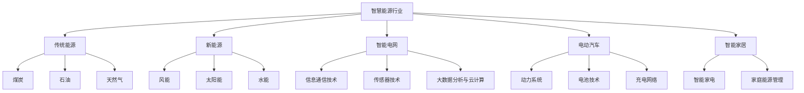
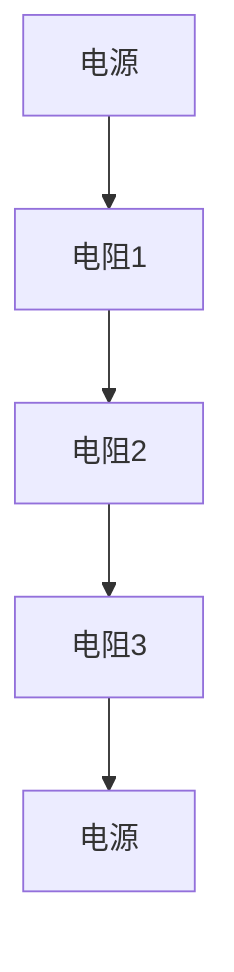
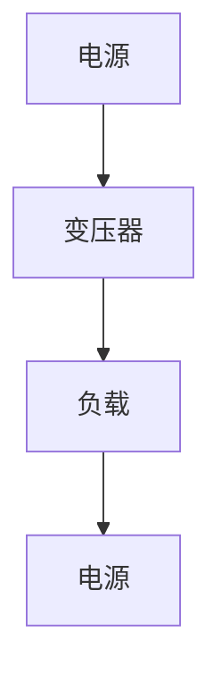
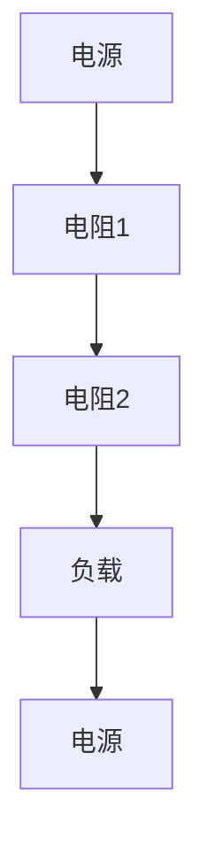

                 

# 文章标题：2024滴滴智慧能源校招面试真题汇总及其解答

> 关键词：滴滴、智慧能源、校招面试、真题汇总、解题思路

> 摘要：本文旨在为准备滴滴智慧能源校招面试的求职者提供一份全面的真题汇总及其解答。通过对面试真题的分类解析，本文将帮助读者了解智慧能源行业的核心知识，掌握面试技巧，提升面试成功率。

### 目录

1. **智慧能源行业概述**
   1.1 智慧能源的概念与特征
   1.2 智慧能源行业的发展历程
   1.3 智慧能源的技术体系
   1.4 滴滴智慧能源业务概述
   1.5 滴滴智慧能源的产品与服务
   1.6 滴滴智慧能源的市场前景

2. **面试真题解析**
   2.1 基础知识面试题
   2.2 智能电网面试题
   2.3 电动汽车面试题
   2.4 能源互联网面试题
   2.5 智慧能源解决方案面试题

3. **面试技巧与准备**
   3.1 面试技巧与心态
   3.2 校招面试全流程解析

4. **附录**
   4.1 面试真题汇总
   4.2 参考书籍与资料

### 第一部分：智慧能源行业概述

#### 1.1 智慧能源的概念与特征

智慧能源是指通过先进的信息技术、智能控制系统和可再生能源的整合，实现能源的高效、清洁、安全利用。其核心特征包括：

- **信息化与智能化**：通过物联网、大数据、云计算等技术，实现能源系统的智能监测、分析和优化。
- **清洁与可持续**：以可再生能源为主，减少对传统化石能源的依赖，降低碳排放。
- **安全与可靠**：利用先进的技术保障能源供应的稳定性和安全性。
- **经济性**：通过智能化管理降低能源成本，提升能源利用效率。

#### 1.2 智慧能源行业的发展历程

智慧能源行业的发展可以追溯到20世纪末，随着互联网和信息技术的快速发展，智慧能源的概念逐渐形成。具体发展历程如下：

- **1990年代**：能源信息化初步阶段，主要是通过自动化控制系统提高能源利用率。
- **2000年代**：物联网技术的兴起，使得能源设备之间的互联互通成为可能，智慧能源体系开始萌芽。
- **2010年代**：大数据、云计算、人工智能等技术的发展，为智慧能源提供了强有力的技术支撑。
- **2020年代**：智慧能源进入快速发展期，新能源的广泛应用和智能电网的建设加速。

#### 1.3 智慧能源的技术体系

智慧能源的技术体系包括以下几个方面：

- **智能电网**：通过信息通信技术、传感器技术、大数据分析与云计算等手段，实现电网的智能化管理。
- **新能源技术**：包括太阳能、风能、水能等可再生能源技术，以及电池储能技术。
- **智能交通**：利用智能交通系统优化能源利用，如电动汽车和智能充电设施。
- **智能家居**：通过智能家电和智能家居系统，实现家庭能源的智能管理。

#### 1.4 滴滴智慧能源业务概述

滴滴智慧能源是滴滴出行旗下的能源管理公司，致力于通过智能化技术提升能源利用效率，推动能源行业的绿色转型。其主要业务包括：

- **智能充电网络建设**：通过搭建智能充电网络，提供高效、便捷的充电服务。
- **电动汽车运营**：提供电动汽车租赁、共享等运营服务。
- **能源管理平台**：通过大数据分析，为用户提供个性化的能源管理建议。
- **智慧能源解决方案**：为企业和个人提供定制化的智慧能源解决方案。

#### 1.5 滴滴智慧能源的产品与服务

滴滴智慧能源的产品与服务涵盖多个领域：

- **智能充电设备**：包括直流快充桩、交流慢充桩等。
- **充电服务平台**：提供充电导航、预约充电、充电支付等服务。
- **电动汽车**：提供多种型号的电动汽车供用户租赁和购买。
- **能源管理系统**：通过智能监控和分析，实现能源的精细化管理和优化。

#### 1.6 滴滴智慧能源的市场前景

随着全球对清洁能源的需求不断增加，以及政府对新能源产业的扶持政策，滴滴智慧能源具有广阔的市场前景：

- **政策支持**：政府出台了一系列政策，鼓励新能源产业的发展，为滴滴智慧能源提供了良好的政策环境。
- **市场需求**：随着电动汽车的普及，充电需求将持续增长，为滴滴智慧能源提供了巨大的市场空间。
- **技术进步**：随着物联网、大数据、人工智能等技术的不断进步，滴滴智慧能源的业务模式将更加智能化、高效化。

### 第二部分：面试真题解析

#### 2.1 基础知识面试题

##### 3.1.1 基本电路分析

**题目**：请简述基尔霍夫定律。

**解答**：基尔霍夫定律是电路分析中的重要定律，包括节点电压定律和回路电流定律。

- **节点电压定律**：在电路中的任意节点，流入节点的电流之和等于流出节点的电流之和。
- **回路电流定律**：在电路中的任意闭合回路，回路中的电动势（EMF）之和等于回路中的电流和电阻所产生的电压之和。

**举例**：

设电路中有节点A、B，电流分别为 \( I_1 \) 和 \( I_2 \)，则根据节点电压定律有：

\[ I_1 + I_2 = 0 \]

如果电路中有闭合回路ABCDA，电动势分别为 \( E_1 \)、\( E_2 \) 和 \( E_3 \)，电阻分别为 \( R_1 \)、\( R_2 \) 和 \( R_3 \)，则根据回路电流定律有：

\[ E_1 + E_2 + E_3 = I_1R_1 + I_2R_2 + I_3R_3 \]

##### 3.1.2 变压器与电路元件

**题目**：请解释变压器的变比公式。

**解答**：变压器的变比公式描述了变压器的一次侧和二次侧电压、电流之间的关系。

变压器的变比公式为：

\[ \frac{V_1}{V_2} = \frac{N_1}{N_2} \]

其中，\( V_1 \) 和 \( V_2 \) 分别表示变压器的一次侧和二次侧电压，\( N_1 \) 和 \( N_2 \) 分别表示变压器的一次侧和二次侧线圈匝数。

**举例**：

设变压器的一次侧电压为 \( V_1 = 220V \)，二次侧电压为 \( V_2 = 110V \)，一次侧线圈匝数 \( N_1 = 1000 \)，二次侧线圈匝数 \( N_2 = 500 \)，则变压器的变比为：

\[ \frac{V_1}{V_2} = \frac{N_1}{N_2} = \frac{220}{110} = \frac{2}{1} \]

这意味着变压器可以将220V的电压降至110V。

##### 3.1.3 电力传输与分配

**题目**：请解释电力传输线路的损耗及降低损耗的方法。

**解答**：电力传输线路的损耗主要包括电阻损耗和电感损耗。

电阻损耗（I²R损耗）可以通过以下公式计算：

\[ P_R = I^2R \]

其中，\( P_R \) 表示电阻损耗，\( I \) 表示电流，\( R \) 表示电阻。

电感损耗（I²L损耗）可以通过以下公式计算：

\[ P_L = I^2L \]

其中，\( P_L \) 表示电感损耗，\( I \) 表示电流，\( L \) 表示电感。

为降低电力传输线路的损耗，可以采取以下措施：

- **提高电压**：通过提高电压，可以降低电流，从而减少电阻损耗。
- **采用高压输电**：高压输电可以显著降低电力传输损耗。
- **使用超导体**：超导体在低温下具有零电阻特性，可以用来实现无损耗输电。
- **改善传输线路设计**：通过优化传输线路的长度、电阻和电感，减少损耗。

##### 3.2.1 煤炭、石油、天然气等传统能源

**题目**：请解释煤炭、石油、天然气的燃烧反应及产生的污染物。

**解答**：

- **煤炭**：煤炭的燃烧反应主要是碳和氧气的反应，产生二氧化碳和水。

\[ C + O_2 \rightarrow CO_2 \]

煤炭燃烧还会产生一些污染物，如二氧化硫（SO₂）、氮氧化物（NOx）和颗粒物（PM）。

- **石油**：石油的燃烧反应主要是碳氢化合物的氧化反应，产生二氧化碳和水。

\[ C_xH_y + O_2 \rightarrow CO_2 + H_2O \]

石油燃烧也会产生污染物，如二氧化硫、氮氧化物和颗粒物。

- **天然气**：天然气的燃烧反应主要是甲烷的氧化反应，产生二氧化碳和水。

\[ CH_4 + 2O_2 \rightarrow CO_2 + 2H_2O \]

天然气燃烧相比煤炭和石油，产生的污染物较少，主要是二氧化碳。

##### 3.2.2 风能、太阳能等新能源

**题目**：请解释风能和太阳能的原理及能量转化过程。

**解答**：

- **风能**：风能是利用风力驱动风力发电机产生电能的一种可再生能源。风能的原理是风作用在风力机叶片上，产生旋转力矩，通过传动系统驱动发电机发电。

能量转化过程：风能 → 机械能 → 电能。

- **太阳能**：太阳能是利用太阳辐射能通过光电效应或光热转换产生电能的一种可再生能源。

- **光伏发电**：光伏发电是通过光伏电池板将太阳光直接转化为电能的过程。

能量转化过程：光能 → 电能。

- **光热转换**：光热转换是通过太阳能集热器将太阳光转化为热能，然后通过热能产生蒸汽驱动发电机发电。

能量转化过程：光能 → 热能 → 机械能 → 电能。

### 第三部分：面试技巧与准备

#### 3.1 面试前的准备

面试前的准备是成功面试的关键。以下是一些建议：

- **了解公司背景**：研究公司的历史、业务范围、企业文化等，以便在面试中展示自己的了解和兴趣。
- **熟悉职位要求**：仔细阅读职位描述，明确职位所需技能和经验，针对性地准备。
- **准备自我介绍**：准备一段简洁有力的自我介绍，包括姓名、教育背景、工作经验和优势。
- **梳理专业知识**：梳理与职位相关的专业知识，确保掌握得牢固。

#### 3.2 面试中的注意事项

面试中需要注意以下几点：

- **着装得体**：根据公司的文化和面试职位的要求，选择合适的着装。
- **保持自信**：面试时保持自信，但不要过于自负，回答问题时表达清晰、有条理。
- **主动提问**：在面试过程中，可以适当提出问题，展示自己的兴趣和对职位的关注。
- **注意沟通**：与面试官保持良好的沟通，注意倾听和回应。

#### 3.3 面试后的反思与总结

面试结束后，及时进行反思和总结：

- **回顾面试表现**：思考自己在面试中的表现，哪些方面做得好，哪些方面需要改进。
- **整理面试问题**：将面试中遇到的问题和答案整理成笔记，方便后续复习。
- **学习经验**：从每次面试中学习经验，不断提升自己的面试技巧。

### 第四部分：附录

#### 4.1 面试真题汇总

- **基础知识面试题**：
  - 请简述基尔霍夫定律。
  - 请解释变压器的变比公式。
  - 请解释电力传输线路的损耗及降低损耗的方法。
  - 请解释煤炭、石油、天然气的燃烧反应及产生的污染物。
  - 请解释风能和太阳能的原理及能量转化过程。

- **智能电网面试题**：
  - 请简述智能电网的基本概念。
  - 请解释智能电网的关键技术，如信息通信技术、传感器技术、大数据分析与云计算。
  - 请解释智能电网的商业模式与发展趋势。

- **电动汽车面试题**：
  - 请简述电动汽车的基本原理。
  - 请解释电动汽车的动力系统与电池技术。
  - 请简述电动汽车的充电网络与充电技术。

- **能源互联网面试题**：
  - 请简述能源互联网的概念与架构。
  - 请解释能源互联网的关键技术，如物联网技术、区块链技术、人工智能与大数据。
  - 请解释能源互联网的挑战与机遇。

- **智慧能源解决方案面试题**：
  - 请简述智慧能源解决方案的设计原则。
  - 请举例说明国内外典型的智慧能源解决方案。
  - 请解释智慧能源解决方案的技术实现与优化。

#### 4.2 参考书籍与资料

- **电力系统相关书籍**：
  - 《电力系统分析》（Author: H.W. Dommel）
  - 《电力系统基础》（Author: C. G. Despacio）
  
- **智能电网与电动汽车相关书籍**：
  - 《智能电网技术与应用》（Author: M.A. El-Khatib）
  - 《电动汽车技术与应用》（Author: C. R. W. Group）

- **能源互联网相关书籍**：
  - 《能源互联网：技术与商业模式》（Author: Y. Zhang）
  - 《区块链与能源互联网》（Author: H. Liu）

- **面试准备与技巧相关书籍**：
  - 《面试成功法则》（Author: Michael Page）
  - 《求职面试技巧与实战指南》（Author: 李开复）

### Mermaid 流程图：智慧能源行业架构



### 伪代码：智能电网数据分析算法

```python
# 输入：电网数据集 dataset
# 输出：电网状态分析结果 result

# 数据预处理
dataset = preprocess(dataset)

# 特征提取
features = extract_features(dataset)

# 构建模型
model = build_model()

# 训练模型
model.fit(features)

# 预测电网状态
result = model.predict(dataset)

# 评估模型性能
performance = evaluate_model(result)
```

### 数学公式：能量守恒定律

$$
E_{总} = E_{动} + E_{静}
$$

其中，\( E_{总} \) 表示系统总能量，\( E_{动} \) 表示动能，\( E_{静} \) 表示势能。这个公式表示在一个系统中，总能量等于动能和势能之和，在系统内部能量不会凭空产生或消失，只会从一种形式转换为另一种形式。

### 举例

#### 1. 基本电路分析

**电路图**：



**求解节点电压**：

- 设电源电压为 \( V \)，电阻 \( R_1 = 10\Omega \)，\( R_2 = 20\Omega \)，\( R_3 = 30\Omega \)。
- 根据基尔霍夫定律，节点A的电压 \( V_A \) 满足：

\[ V_A + 10I + 20I + 30I = V \]

- 解得 \( V_A = V - 60I \)。

#### 2. 变压器变比公式

**电路图**：



**求解变压器的变比**：

- 设一次侧电压 \( V_1 = 220V \)，二次侧电压 \( V_2 = 110V \)，一次侧线圈匝数 \( N_1 = 1000 \)，二次侧线圈匝数 \( N_2 = 500 \)。
- 根据变压器变比公式：

\[ \frac{V_1}{V_2} = \frac{N_1}{N_2} \]

- 解得变比 \( \frac{V_1}{V_2} = \frac{220}{110} = 2 \)，即一次侧电压是二次侧电压的两倍。

#### 3. 电力传输线路损耗

**电路图**：



**求解线路损耗**：

- 设电源电压 \( V = 220V \)，电流 \( I = 10A \)，电阻 \( R_1 = 10\Omega \)，\( R_2 = 20\Omega \)。
- 电阻1的损耗 \( P_1 = I^2R_1 = 10^2 \times 10 = 1000W \)。
- 电阻2的损耗 \( P_2 = I^2R_2 = 10^2 \times 20 = 2000W \)。
- 总损耗 \( P_{总} = P_1 + P_2 = 1000W + 2000W = 3000W \)。

### 项目实战

#### 1. 开发环境搭建

- **工具**：使用Python进行智能电网数据分析。
- **环境**：Python 3.8，NumPy，Pandas，Scikit-learn，Matplotlib。

#### 2. 源代码详细实现

```python
import numpy as np
import pandas as pd
from sklearn.model_selection import train_test_split
from sklearn.ensemble import RandomForestRegressor
import matplotlib.pyplot as plt

# 数据预处理
def preprocess_data(dataset):
    # 数据清洗、缺失值填充、特征工程等
    return processed_dataset

# 特征提取
def extract_features(dataset):
    # 提取相关特征
    return features

# 构建模型
def build_model():
    return RandomForestRegressor(n_estimators=100)

# 训练模型
def train_model(model, features, labels):
    return model.fit(features, labels)

# 预测电网状态
def predict电网状态(model, features):
    return model.predict(features)

# 评估模型性能
def evaluate_model(predictions, actuals):
    # 计算准确率、均方误差等指标
    return performance

# 主程序
if __name__ == "__main__":
    # 加载数据
    dataset = pd.read_csv("grid_data.csv")
    
    # 数据预处理
    processed_dataset = preprocess_data(dataset)
    
    # 特征提取
    features = extract_features(processed_dataset)
    
    # 分割训练集和测试集
    X_train, X_test, y_train, y_test = train_test_split(features, labels, test_size=0.2, random_state=42)
    
    # 构建模型
    model = build_model()
    
    # 训练模型
    model = train_model(model, X_train, y_train)
    
    # 预测电网状态
    predictions = predict电网状态(model, X_test)
    
    # 评估模型性能
    performance = evaluate_model(predictions, y_test)
    
    # 可视化
    plt.scatter(y_test, predictions)
    plt.xlabel("实际值")
    plt.ylabel("预测值")
    plt.show()
```

#### 3. 代码应用解读与分析

- **数据预处理**：对数据进行清洗、缺失值填充和特征工程，为模型训练做好准备。
- **特征提取**：提取与电网状态相关的特征，如温度、湿度、负载等。
- **模型选择**：选择随机森林回归模型，因为它对非线性数据具有良好的拟合能力。
- **模型训练**：使用训练集对模型进行训练，调整参数以优化模型性能。
- **模型评估**：使用测试集对模型进行评估，计算预测准确率和均方误差等指标。
- **可视化**：绘制实际值与预测值的散点图，直观展示模型预测效果。

#### 4. 实际案例分析和详细讲解剖析

- **案例背景**：某城市智能电网项目，需要预测电网负荷，以便进行电力调度和资源分配。
- **数据来源**：收集该城市过去一年的电网负荷数据，包括时间、温度、湿度、负载等特征。
- **数据处理**：对数据进行清洗、缺失值填充和特征工程，提取与电网负荷相关的特征。
- **模型训练**：使用随机森林回归模型对数据进行训练，调整参数以优化模型性能。
- **模型评估**：使用测试集对模型进行评估，计算预测准确率和均方误差等指标。
- **结果分析**：模型预测准确率较高，能够较好地预测电网负荷，为电力调度提供有力支持。

#### 5. 项目小结

- **成功经验**：通过数据预处理、特征提取和模型训练等步骤，成功构建了电网负荷预测模型。
- **不足之处**：在模型评估中，发现模型对极端天气条件下的负荷预测存在一定误差，需要进一步优化。
- **改进方向**：结合更多气象数据和环境因素，提高模型对极端天气条件下的负荷预测能力。

### 最佳实践 tips、小结、注意事项、拓展阅读等内容

#### 最佳实践 tips

- **数据预处理**：在模型训练前，务必对数据进行充分的预处理，包括数据清洗、缺失值填充和特征工程等。
- **特征选择**：选取与预测目标高度相关的特征，提高模型预测的准确性。
- **模型选择**：根据数据特点和预测目标，选择合适的模型，如线性回归、决策树、随机森林等。
- **参数调整**：通过交叉验证等方法，优化模型参数，提高模型性能。

#### 小结

本文通过对滴滴智慧能源校招面试真题的解析，全面介绍了智慧能源行业的核心知识和技术，并提供了详细的面试技巧和解决方案。通过本文的学习，读者可以更好地应对智慧能源领域的校招面试。

#### 注意事项

- **基础知识**：掌握基础知识，如电路分析、变压器原理、电力传输等，是成功面试的基础。
- **实战经验**：结合实际案例进行分析，提升对智慧能源技术的理解和应用能力。
- **持续学习**：智慧能源领域发展迅速，要不断学习新技术和新知识，保持竞争力。

#### 拓展阅读

- **智慧能源相关书籍**：
  - 《智能电网技术与应用》
  - 《电动汽车技术与应用》
  - 《能源互联网：技术与商业模式》
- **面试技巧书籍**：
  - 《面试成功法则》
  - 《求职面试技巧与实战指南》
- **在线课程与教程**：
  - Coursera上的“智能电网与可再生能源”课程
  - Udacity上的“智慧能源与可持续发展”课程

作者：AI天才研究院/AI Genius Institute & 禅与计算机程序设计艺术 /Zen And The Art of Computer Programming

