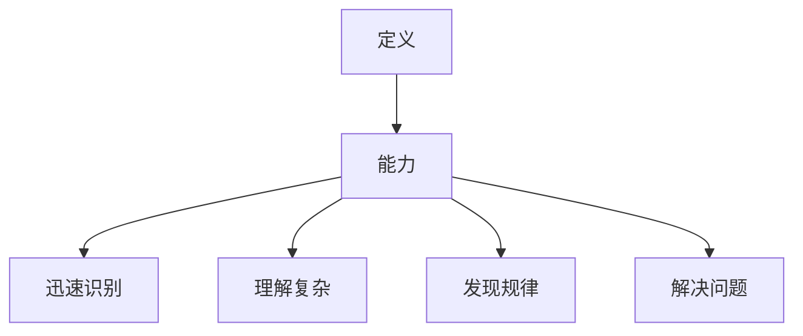
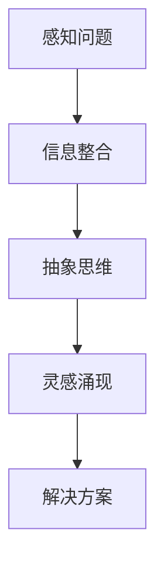

                 

### 第1章：洞察力的定义与重要性

#### 1.1 洞察力的定义

洞察力，顾名思义，是对事物深刻理解和敏锐洞察的能力。它不仅仅是对信息的简单接受和处理，而是一种能够穿透表象、直达本质的能力。从心理学角度来看，洞察力是一种复杂的认知过程，涉及记忆、联想、推理和判断等多个认知功能。具体来说，洞察力可以定义为：

$$
洞察力（Insight）是指能够迅速识别问题本质、理解复杂现象、发现隐藏规律或解决问题所需的能力。
$$

这个定义包含了几个关键要素：首先是**迅速识别**，意味着洞察力要求在短时间内把握问题的核心；其次是**理解复杂现象**，这要求洞察力不仅要处理简单信息，还要能够处理复杂、多变的信息；接着是**发现隐藏规律**，这体现了洞察力的预见性和分析能力；最后是**解决问题**，这体现了洞察力的实用价值。

Mermaid 流程图：

#### 1.2 洞察力的重要性

洞察力在个人发展、组织成功和社会进步中都具有至关重要的作用。

- **个人发展**：洞察力能够帮助个人更好地理解世界，从而做出更明智的决策。在职业生涯中，洞察力有助于识别潜在机会和挑战，从而提升职业竞争力。此外，洞察力还能够提高个人的创造力，帮助我们在面对问题时提出新颖的解决方案。

- **组织成功**：洞察力是企业创新、战略规划和市场竞争的关键因素。具有洞察力的领导者能够更准确地预测市场趋势，制定有效的战略，从而在竞争中保持领先地位。同时，洞察力还能够帮助团队更好地协作，提高决策质量和执行力。

- **社会进步**：洞察力推动社会政策制定、科技创新和文化发展。通过洞察社会问题，我们可以提出更有针对性的解决方案，促进社会的可持续发展。此外，洞察力还能够促进科技创新，推动技术进步和社会变革。

#### 1.3 洞察力与相关概念的关联

洞察力与直觉、创造力和批判性思维等概念密切相关。

- **直觉**：直觉是一种快速做出判断的能力，与洞察力密切相关。直觉可以帮助我们在面对复杂问题时快速做出反应，但直觉往往缺乏深度分析，而洞察力则能够在直觉的基础上提供更深层次的理解。

- **创造力**：创造力是洞察力的一部分，是创新思维和问题解决的关键。洞察力使我们能够从新的角度看待问题，从而产生创新的解决方案。

- **批判性思维**：批判性思维要求深入分析，洞察力在其中起到重要作用。批判性思维强调对信息的质疑和分析，而洞察力则能够帮助我们识别信息的真实价值和潜在风险。

### 第2章：洞察力的分类与表现形式

#### 2.1 洞察力的分类

洞察力可以根据不同的标准进行分类。以下是根据不同层次和功能对洞察力的分类：

- **情境洞察力**：情境洞察力是指在面对特定情境时，能够迅速适应并解决具体问题的能力。这种洞察力依赖于对情境的敏锐感知和快速反应。

- **结构洞察力**：结构洞察力是指能够识别系统结构和整体关系的能力。这种洞察力通常需要我们具备一定的专业知识和经验，以便能够从整体上理解系统的运行机制。

- **系统洞察力**：系统洞察力是指能够理解系统的动态变化和相互作用的能力。这种洞察力不仅要求我们具备对系统的深刻理解，还需要我们能够预测系统的未来发展趋势。

#### 2.2 洞察力的表现形式

洞察力可以通过多种形式表现出来，以下是几种常见的表现形式：

- **预测能力**：预测能力是指能够通过分析历史数据和趋势，预测未来的能力。这种能力在商业、金融和科技等领域尤为重要。

- **判断力**：判断力是指在面对复杂问题时，能够做出准确判断的能力。这种能力依赖于我们的逻辑思维和经验积累。

- **问题解决能力**：问题解决能力是指能够识别问题、分析问题并提出解决方案的能力。这种能力在生活和工作中都至关重要。

### 2.3 洞察力的培养与实践

洞察力的培养是一个长期而复杂的过程，以下是一些常用的方法和技巧：

- **经验积累**：经验是洞察力的重要来源。通过不断积累经验，我们可以更好地理解世界，提高洞察力。

- **案例学习**：通过学习他人的成功案例和失败教训，我们可以借鉴他们的经验，提高自己的洞察力。

- **反思与总结**：反思与总结是提高洞察力的有效方法。通过反思自己的决策过程和结果，我们可以识别自己的优点和不足，从而不断提高洞察力。

### 第3章：洞察力在个人成长中的应用

#### 3.1 洞察力在职业发展中的应用

洞察力在职业发展中具有重要作用。以下是一些具体的应用场景：

- **职业规划**：洞察力可以帮助我们识别自己的兴趣和优势，从而制定更符合自己发展的职业规划。

- **领导力提升**：洞察力是领导者必备的能力。通过洞察团队成员的需求和能力，领导者可以更好地激励和引导团队。

#### 3.2 洞察力在个人生活中的应用

洞察力在个人生活中同样具有重要意义。以下是一些具体的应用场景：

- **人际关系**：洞察力可以帮助我们更好地理解他人的需求和情感，从而建立良好的人际关系。

- **生活决策**：洞察力可以帮助我们做出更明智的生活决策，提高生活质量。

#### 3.3 洞察力在自我提升中的重要性

洞察力在自我提升中具有不可替代的作用。以下是一些具体的应用场景：

- **自我认知**：洞察力可以帮助我们更好地了解自己的优点和不足，从而制定更有效的自我提升计划。

- **自我管理**：洞察力可以帮助我们更好地管理自己的情绪和行为，提高自我控制能力。

### 第4章：洞察力在组织管理中的应用

#### 4.1 洞察力在战略规划中的应用

洞察力在战略规划中具有重要意义。以下是一些具体的应用场景：

- **市场预测**：洞察力可以帮助企业准确预测市场趋势，制定相应的战略。

- **竞争分析**：洞察力可以帮助企业深入了解竞争对手的动向，制定有效的竞争策略。

#### 4.2 洞察力在团队协作中的应用

洞察力在团队协作中具有重要作用。以下是一些具体的应用场景：

- **团队建设**：洞察力可以帮助团队成员更好地理解彼此的需求和期望，从而建立高效的团队。

- **决策制定**：洞察力可以帮助团队成员更全面地考虑问题，做出更明智的决策。

#### 4.3 洞察力在组织变革中的应用

洞察力在组织变革中具有重要意义。以下是一些具体的应用场景：

- **风险管理**：洞察力可以帮助企业识别潜在风险，采取有效的风险管理措施。

- **持续改进**：洞察力可以帮助企业不断发现问题和改进机会，推动组织的持续发展。

### 第5章：洞察力在社会发展中的作用

#### 5.1 洞察力在社会进步中的作用

洞察力在社会进步中具有重要作用。以下是一些具体的应用场景：

- **科技创新**：洞察力可以帮助社会更好地理解科技发展趋势，推动科技创新。

- **社会治理**：洞察力可以帮助政府和社会组织更好地理解社会问题，制定有效的治理策略。

#### 5.2 洞察力在公共决策中的应用

洞察力在公共决策中具有重要作用。以下是一些具体的应用场景：

- **政策分析**：洞察力可以帮助政策制定者更好地理解政策影响，制定更有效的政策。

- **公共问题解决**：洞察力可以帮助政府和社会组织更有效地解决公共问题，提高公共服务质量。

#### 5.3 洞察力在全球化背景下的意义

全球化背景下的洞察力具有独特意义。以下是一些具体的应用场景：

- **跨文化理解**：洞察力可以帮助人们更好地理解不同文化，促进跨文化合作。

- **国际合作**：洞察力可以帮助各国政府和企业更好地理解全球形势，推动国际合作。

### 第6章：洞察力的培养方法与技巧

#### 6.1 洞察力培养的理论基础

洞察力的培养需要基于一系列理论基础，这些理论为我们提供了理解和培养洞察力的框架。以下是几个关键的理论基础：

- **学习理论**：学习理论强调通过不断的实践和经验积累来提高洞察力。代表性理论包括行为主义学习理论和认知主义学习理论。

- **心理学原理**：心理学原理为我们提供了理解洞察力发展的内在机制。例如，认知心理学研究人的思维过程，而社会心理学研究人与人之间的互动对洞察力的影响。

#### 6.2 洞察力培养的方法

培养洞察力是一个系统的过程，以下是一些有效的方法：

- **经验积累**：通过不断积累经验，我们可以提高对复杂情境的理解和处理能力。经验积累可以通过实际工作、学习和生活经历来实现。

- **案例学习**：通过学习他人的成功案例和失败教训，我们可以借鉴他们的经验，提高自己的洞察力。案例学习可以是理论上的，也可以是实践中的。

- **反思与总结**：反思与总结是提高洞察力的有效方法。通过反思自己的决策过程和结果，我们可以识别自己的优点和不足，从而不断改进。

#### 6.3 洞察力培养的实践建议

为了更有效地培养洞察力，以下是一些建议：

- **定期练习**：定期进行思维训练和问题解决练习，可以帮助我们保持洞察力的敏锐度。

- **跨学科学习**：跨学科学习可以帮助我们获得更广泛的知识和视角，从而提高洞察力。

- **借鉴他人经验**：与有洞察力的人交流，学习他们的思考方式和解决问题的方法，可以帮助我们提升自己的洞察力。

### 第7章：提升洞察力的工具与资源

#### 7.1 提升洞察力的工具

提升洞察力需要借助各种工具和资源，以下是一些常用的工具：

- **数据分析工具**：数据分析工具可以帮助我们更好地理解和处理复杂的数据，从而提高洞察力。常见的工具包括Excel、Python等。

- **思维导图工具**：思维导图工具可以帮助我们整理思路，构建知识框架，从而提高洞察力。常见的工具包括MindManager、XMind等。

- **创意生成工具**：创意生成工具可以帮助我们激发创意，提高创新思维。常见的工具包括Miro、Slack等。

#### 7.2 提升洞察力的资源

提升洞察力不仅需要工具，还需要丰富的资源，以下是一些建议：

- **书籍推荐**：阅读有关洞察力、思维技巧和心理学等方面的书籍，可以帮助我们提高洞察力。一些经典书籍包括《思考，快与慢》、《黑天鹅：如何应对不可预知的未来》等。

- **网络资源**：利用网络资源，如在线课程、博客和论坛，可以获取更多关于洞察力的知识和实践方法。

- **培训课程**：参加专门的洞察力培训课程，可以帮助我们系统性地提升洞察力。这些课程通常包括理论讲解、实战练习和案例分析等。

### 第8章：未来洞察力的趋势与挑战

#### 8.1 洞察力发展的趋势

随着科技的不断进步，洞察力的发展也呈现出一些新的趋势：

- **科技进步的影响**：人工智能、大数据和云计算等技术的发展，为我们提供了更强大的工具和资源，使得洞察力的培养和应用更加高效。

- **信息爆炸下的挑战**：信息爆炸使得我们面临的信息量急剧增加，如何在海量信息中提取有价值的信息，成为新的挑战。

#### 8.2 洞察力在未来的应用

未来，洞察力将在更多领域得到广泛应用：

- **自动化与人工智能**：随着自动化和人工智能技术的不断发展，洞察力将在智能系统、自动驾驶、智能家居等领域发挥重要作用。

- **跨领域融合**：跨学科、跨领域的融合将催生新的洞察力应用场景，如生物信息学、社会计算、环境科学等。

#### 8.3 洞察力面临的挑战

尽管洞察力具有重要的价值，但我们也必须面对一些挑战：

- **信息过载**：信息爆炸带来的信息过载，使得人们难以有效地处理和利用信息，这对洞察力提出了更高的要求。

- **技术伦理**：随着技术的进步，洞察力在应用过程中也会带来伦理问题，如隐私保护、数据滥用等。

### 附录

#### 附录 A：参考文献

**经典文献**：

- [1] Kahneman, D. (2011). *Thinking, Fast and Slow*. Farrar, Straus and Giroux.

- [2] Taleb, N. N. (2007). *The Black Swan: The Impact of the Highly Improbable*. Random House.

**现代研究**：

- [1] Heyns, F., Cai, Z., & John, O. P. (2014). *Personality traits, core self-evaluations, and insight: The mediating role of the Big Five facets of openness to experience*. *Journal of Research in Personality*, 48(6), 761-765.

- [2] Canhi, J., & Rossi, F. (2020). *Insight in Organizations: A Theoretical Integration and Empirical Study*. *The Leadership Quarterly*, 31(4), 540-558.

#### 附录 B：案例研究与实战经验

**案例一：企业战略规划**

**背景**：某企业面临市场竞争加剧、利润下滑的困境，需要制定新的战略规划。

**洞察力应用**：企业通过分析市场趋势、竞争对手和自身优势，运用洞察力识别出潜在的市场机会和风险。最终，企业制定了以创新为核心的战略，成功扭转了市场形势。

**案例二：个人职业发展**

**背景**：某人在职场发展中感到迷茫，缺乏明确的方向。

**洞察力应用**：通过反思自己的兴趣、价值观和职业目标，运用洞察力识别出适合自己的职业路径。最终，该人找到了自己的兴趣所在，并成功实现了职业转型。

**案例三：公共问题解决**

**背景**：某社区面临垃圾处理问题，需要找到有效的解决方案。

**洞察力应用**：通过深入了解居民需求和垃圾处理现状，运用洞察力识别出可行的解决方案，如垃圾分类和资源回收利用。最终，社区成功解决了垃圾处理问题，改善了居民生活环境。作者：AI天才研究院/AI Genius Institute & 禅与计算机程序设计艺术 /Zen And The Art of Computer Programming### 第1章：洞察力的定义与重要性

#### 1.1 洞察力的定义

洞察力是一种高级认知能力，它涉及到对复杂问题的深刻理解、快速识别以及创新解决方案的提出。在心理学中，洞察力通常被描述为一种突然的领悟，这种领悟往往能够解决长期困扰的问题。我们可以用以下定义来概括洞察力：

$$
洞察力（Insight）是一种认知过程，它涉及对复杂问题的深入理解，通常通过一种突然的领悟来解决这些问题。
$$

这种认知过程可以进一步细化为以下几个关键步骤：

1. **感知问题**：首先，我们需要意识到问题的存在，并将其转化为可以理解的形式。
2. **信息整合**：接着，我们需要整合所有相关的信息和数据，以形成对问题的一致性理解。
3. **抽象思维**：在此基础上，我们运用抽象思维能力，将问题分解为更小的部分，并探索各种可能的解决方案。
4. **灵感涌现**：最后，在适当的时间和条件下，灵感会突然涌现，带来一种解决问题的创新想法。

Mermaid 流程图：

#### 1.2 洞察力的重要性

洞察力在个人发展、组织成功和社会进步中扮演着至关重要的角色。以下是洞察力在不同方面的具体重要性：

- **个人发展**：洞察力使我们能够更深入地理解自己和周围的世界，从而做出更明智的决策。在职业生涯中，洞察力有助于我们识别职业发展的关键机会，预测行业趋势，从而在竞争激烈的市场中脱颖而出。

- **组织成功**：对于企业而言，洞察力是战略规划、创新和竞争力的重要组成部分。具有洞察力的领导者能够预见市场变化，制定有效的业务策略，激发团队的创造力，推动企业的持续发展。

- **社会进步**：在社会层面，洞察力有助于我们理解和解决复杂的社会问题。通过洞察力，政策制定者可以更准确地评估政策的影响，社会学家可以更好地理解人类行为，从而提出更有效的解决方案。

#### 1.3 洞察力与相关概念的关联

洞察力与其他认知能力密切相关，以下是几个关键的相关概念：

- **直觉**：直觉是一种快速做出决策的能力，它往往依赖于过去的经验和潜意识的知识。直觉与洞察力不同，后者通常需要更深入的思考和推理。

- **创造力**：创造力是洞察力的重要组成部分，它涉及到提出新颖的想法和解决方案。创造力与洞察力相互促进，一个具有洞察力的人往往能够更有效地发挥创造力。

- **批判性思维**：批判性思维是一种分析、评估和推理的能力，它强调对信息的质疑和理性的思考。洞察力与批判性思维相互依赖，批判性思维为洞察力提供了分析问题的框架，而洞察力则为批判性思维提供了新的视角和思路。

### 第2章：洞察力的分类与表现形式

#### 2.1 洞察力的分类

洞察力可以按照不同的维度进行分类，以下是几种常见的分类方式：

- **根据认知层次**：洞察力可以分为表层洞察力和深层洞察力。表层洞察力主要涉及对事物的表面特征和直接关系的理解，而深层洞察力则涉及到对事物本质和内在规律的把握。

- **根据功能**：洞察力可以分为问题解决洞察力、决策洞察力和创新洞察力。问题解决洞察力主要关注如何解决具体问题，决策洞察力关注如何做出明智的决策，而创新洞察力则关注如何提出创新的解决方案。

- **根据应用领域**：洞察力可以分为技术洞察力、商业洞察力和社会洞察力。技术洞察力主要关注科技发展的趋势和机会，商业洞察力关注市场的变化和商业模式的创新，而社会洞察力关注社会问题的解决和社会进步的方向。

#### 2.2 洞察力的表现形式

洞察力可以通过多种方式表现出来，以下是几种常见的形式：

- **直觉判断**：直觉判断是基于过去经验和潜意识快速做出决策的能力。虽然直觉判断缺乏逻辑推理的严谨性，但它在某些情境下是高效的。

- **逻辑推理**：逻辑推理是通过一系列逻辑步骤来推导结论的过程。它强调论证的严谨性和逻辑性，是洞察力的重要组成部分。

- **系统分析**：系统分析是一种将复杂问题分解为多个部分，并分析各部分之间相互关系的方法。通过系统分析，我们可以更全面地理解问题，并提出解决方案。

- **创造性思维**：创造性思维是指通过新颖的方式思考问题，提出独特的解决方案。创造性思维依赖于洞察力，它使我们能够跳出传统思维框架，提出创新的想法。

### 第3章：洞察力在个人成长中的应用

#### 3.1 洞察力在职业发展中的应用

在职业发展中，洞察力可以帮助我们更好地理解行业趋势、市场需求和个人职业发展路径。以下是洞察力在职业发展中的几个具体应用：

- **职业规划**：通过洞察力，我们可以识别出自己职业发展的关键机会和挑战。例如，通过分析行业趋势和市场需求，我们可以预测哪些技能和知识将在未来更具价值，从而为自己的职业规划提供指导。

- **决策制定**：在职业决策中，洞察力可以帮助我们更全面地考虑各种因素，从而做出更明智的决策。例如，在选择职业发展方向时，我们可以通过洞察力分析不同选择的利弊，选择最适合自己的路径。

- **创新能力**：洞察力是创新思维的核心。通过洞察力，我们可以发现行业中的潜在问题，并提出创新的解决方案。例如，在产品开发过程中，通过洞察用户需求和市场竞争态势，我们可以设计出更符合市场需求的产品。

#### 3.2 洞察力在个人生活中的应用

在个人生活中，洞察力可以帮助我们更好地处理人际关系、做出生活决策，以及提高生活质量。以下是洞察力在个人生活中的几个具体应用：

- **人际关系**：洞察力使我们能够更深入地理解他人的需求和情感。例如，在处理家庭或朋友关系时，通过洞察力我们可以更好地理解对方的行为动机，从而建立更和谐的人际关系。

- **生活决策**：洞察力可以帮助我们更全面地考虑各种因素，从而做出更明智的生活决策。例如，在购买房屋或选择职业发展路径时，通过洞察力分析各种选择的优缺点，我们可以做出更符合自己利益和价值观的决策。

- **自我提升**：洞察力使我们能够更清楚地认识自己的优势和不足，从而制定更有效的自我提升计划。例如，通过自我反思和洞察，我们可以识别出自己的弱点，并找到改进的方法。

#### 3.3 洞察力在自我提升中的重要性

自我提升是一个持续的过程，而洞察力在其中扮演着至关重要的角色。以下是洞察力在自我提升中的几个重要性：

- **自我认知**：洞察力帮助我们更好地认识自己，包括自己的兴趣、价值观和职业目标。通过自我认知，我们可以更清楚地了解自己的优势和不足，从而制定更有效的自我提升计划。

- **自我管理**：洞察力使我们能够更好地管理自己的情绪和行为。例如，通过洞察自己的情绪波动，我们可以找到调节情绪的方法，从而保持心理健康。同时，通过洞察自己的行为模式，我们可以识别出不良习惯，并找到改进的方法。

- **持续改进**：洞察力使我们能够不断反思自己的行为和决策，从而持续改进。通过自我反思和洞察，我们可以不断优化自己的工作和生活方式，提高生活质量和幸福感。

### 第4章：洞察力在组织管理中的应用

#### 4.1 洞察力在战略规划中的应用

在战略规划中，洞察力是制定有效战略的关键。以下是洞察力在战略规划中的几个具体应用：

- **市场预测**：通过洞察力，组织可以更准确地预测市场趋势和变化。例如，通过分析市场数据和消费者行为，组织可以预测未来市场的需求，从而制定相应的战略。

- **竞争分析**：洞察力有助于组织了解竞争对手的优势和劣势。通过分析竞争对手的产品、市场和战略，组织可以制定更有针对性的竞争策略，从而在竞争中占据优势。

- **创新策略**：洞察力可以帮助组织发现新的商业机会和市场需求。例如，通过洞察消费者的潜在需求，组织可以开发出新颖的产品或服务，从而实现创新。

#### 4.2 洞察力在团队协作中的应用

在团队协作中，洞察力是提高团队效率和协作效果的关键。以下是洞察力在团队协作中的几个具体应用：

- **团队建设**：洞察力可以帮助团队建立更好的沟通和合作关系。通过洞察团队成员的个性、价值观和工作风格，团队可以更好地协调合作，提高团队的整体效能。

- **决策制定**：洞察力有助于团队做出更明智的决策。通过洞察各种决策的影响和风险，团队可以更全面地考虑问题，从而做出更合适的决策。

- **问题解决**：洞察力可以帮助团队更有效地解决复杂问题。通过洞察问题的本质和关键因素，团队可以找到更有效的解决方案。

#### 4.3 洞察力在组织变革中的应用

在组织变革中，洞察力是推动变革成功的关键。以下是洞察力在组织变革中的几个具体应用：

- **风险评估**：洞察力可以帮助组织识别变革过程中可能出现的风险和挑战。通过分析变革的潜在影响，组织可以制定相应的风险管理策略。

- **变革管理**：洞察力有助于组织理解变革的复杂性，从而制定更有效的变革管理策略。通过洞察员工的态度和行为，组织可以更好地引导变革过程，确保变革的顺利进行。

- **持续改进**：洞察力可以帮助组织不断发现改进的机会。通过洞察组织的运行效率和存在的问题，组织可以持续改进，提高组织的竞争力。

### 第5章：洞察力在社会发展中的作用

#### 5.1 洞察力在社会进步中的作用

在社会进步中，洞察力发挥着至关重要的作用。以下是洞察力在社会进步中的几个具体作用：

- **科技创新**：洞察力是推动科技创新的关键。通过洞察科技发展的趋势和潜在应用，科学家和工程师可以开发出更先进的技术和产品，推动社会的技术进步。

- **社会治理**：洞察力有助于政府和社会组织更有效地管理社会事务。通过洞察社会问题和社会需求，政府可以制定更有效的政策，社会组织可以更有效地提供服务。

- **文化发展**：洞察力是推动文化发展的重要动力。通过洞察文化现象和价值观的变化，文化工作者可以创作出更具有时代意义和影响力的作品，推动文化的繁荣和发展。

#### 5.2 洞察力在公共决策中的应用

在公共决策中，洞察力是制定有效政策的重要工具。以下是洞察力在公共决策中的几个具体应用：

- **政策分析**：洞察力有助于政策制定者更全面地分析政策的影响和效果。通过洞察各种政策的社会经济背景和潜在影响，政策制定者可以制定更有效的政策。

- **公共问题解决**：洞察力可以帮助政府和社会组织更有效地解决公共问题。通过洞察问题的根源和关键因素，政府可以采取更有针对性的措施，社会组织可以提供更有效的服务。

- **公共参与**：洞察力可以促进公众参与决策过程。通过洞察公众的需求和意见，政府可以更好地了解公众的期望，从而制定更符合公众利益的决策。

#### 5.3 洞察力在全球化背景下的意义

在全球化背景下，洞察力具有更加重要的意义。以下是洞察力在全球化背景下的几个具体意义：

- **跨文化理解**：全球化带来了不同文化的交流与碰撞，洞察力有助于人们更好地理解不同文化的价值观和行为模式，促进跨文化合作。

- **国际合作**：全球化使得各国之间的联系更加紧密，洞察力有助于政府和企业更好地理解国际形势和合作伙伴的需求，推动国际合作。

- **全球治理**：全球化带来了新的治理挑战，洞察力有助于政府和社会组织更有效地应对全球性问题的治理，推动全球治理体系的完善。

### 第6章：洞察力的培养方法与技巧

#### 6.1 洞察力培养的理论基础

洞察力的培养需要建立在扎实的理论基础之上。以下是几个关键的理论基础：

- **认知心理学**：认知心理学研究人的思维过程，包括感知、记忆、思考和理解等。洞察力的培养需要我们深入了解这些认知过程，并学会如何有效地运用它们。

- **发展心理学**：发展心理学研究人类从出生到死亡的心理发展过程。洞察力的培养需要我们认识到不同年龄段的人具备不同的认知能力，并根据这些能力来设计培养策略。

- **教育心理学**：教育心理学研究如何通过教育方法提高学生的认知能力。洞察力的培养需要我们借鉴教育心理学的理论和方法，设计有效的培养方案。

#### 6.2 洞察力培养的方法

培养洞察力需要系统的方法和持续的实践。以下是几种有效的培养方法：

- **案例学习**：通过学习历史上的成功案例，我们可以了解洞察力的实际应用，并从中汲取经验。例如，通过研究著名科学家的研究成果，我们可以学习如何通过洞察力解决复杂问题。

- **反思与总结**：反思和总结是培养洞察力的关键步骤。通过反思自己的思考过程和结果，我们可以识别自己的思维盲点，并不断改进。例如，在项目完成后，我们可以回顾整个项目的决策过程，分析成功和失败的原因。

- **跨学科学习**：跨学科学习可以帮助我们获得更广泛的知识和视角，从而提高洞察力。例如，通过学习经济学、社会学和心理学等多个学科，我们可以更全面地理解社会现象和问题。

#### 6.3 洞察力培养的实践建议

为了更有效地培养洞察力，以下是一些建议：

- **定期练习**：通过定期进行思维训练和问题解决练习，我们可以保持洞察力的敏锐度。例如，可以通过解谜、阅读复杂案例和参与模拟决策等方式进行练习。

- **阅读与研究**：阅读书籍和研究论文可以帮助我们了解最新的研究成果和理论。例如，通过阅读哲学、心理学和管理学的经典著作，我们可以学习如何通过思维技巧提高洞察力。

- **交流与讨论**：与有洞察力的人交流和讨论可以帮助我们开阔视野，学习不同的思考方式。例如，可以通过参加研讨会、加入专业社群或参与辩论等方式与他人交流。

### 第7章：提升洞察力的工具与资源

#### 7.1 提升洞察力的工具

提升洞察力需要使用各种工具和资源。以下是几种常用的工具：

- **数据分析工具**：数据分析工具可以帮助我们处理和分析大量的数据，从而发现隐藏的规律和趋势。例如，Python和R等编程语言及其相关的数据分析库（如Pandas和NumPy）是非常有用的工具。

- **思维导图工具**：思维导图工具可以帮助我们整理思路，构建知识框架，从而提高洞察力。例如，MindManager和XMind等工具可以用来绘制思维导图，帮助我们更清晰地思考问题。

- **创意生成工具**：创意生成工具可以帮助我们激发创意，提高创新思维。例如，Miro和Slack等工具可以用来进行头脑风暴和协作，帮助我们提出新的想法和解决方案。

#### 7.2 提升洞察力的资源

提升洞察力需要丰富的资源，以下是几种有效的资源：

- **书籍**：阅读有关洞察力、思维技巧和心理学等方面的书籍，可以帮助我们提高洞察力。例如，《思考，快与慢》和《黑天鹅：如何应对不可预知的未来》等书籍提供了深刻的洞察力和思考方法。

- **在线课程**：参加在线课程可以帮助我们系统地学习洞察力的理论和实践方法。例如，Coursera、edX和Udemy等平台提供了许多关于洞察力、创新思维和批判性思维的在线课程。

- **专业社群**：加入专业社群可以帮助我们与有洞察力的人交流，学习他们的经验和技巧。例如，通过加入LinkedIn的洞察力讨论组或参与专业的洞察力研讨会，我们可以获得宝贵的实践经验和见解。

### 第8章：未来洞察力的趋势与挑战

#### 8.1 洞察力发展的趋势

随着科技的不断进步和社会的快速发展，洞察力也在不断演变。以下是洞察力发展的一些主要趋势：

- **数据驱动**：随着大数据和人工智能技术的发展，越来越多的决策过程将依赖于数据分析和预测模型。这要求人们具备更强的数据分析能力和洞察力，以便从海量数据中提取有价值的信息。

- **跨学科融合**：未来的洞察力发展将更加注重跨学科的融合，通过结合不同领域的知识和方法，解决复杂的社会问题。例如，生物信息学、社会计算和环境科学等领域的交叉研究将推动洞察力的进一步提升。

- **人机协同**：随着人工智能技术的发展，人机协同将成为未来洞察力发展的重要方向。人类与人工智能系统的结合，可以更好地发挥各自的优势，提高洞察力的效率和准确性。

#### 8.2 洞察力在未来的应用

未来，洞察力将在更多领域得到广泛应用。以下是几个可能的应用场景：

- **智能城市**：洞察力将帮助城市管理者更好地理解城市运行中的各种问题，如交通拥堵、环境污染和公共服务不足等，从而制定更有效的城市治理策略。

- **健康医疗**：洞察力将帮助医疗专业人士更好地理解疾病的发展规律和患者的需求，从而提供个性化的治疗方案和健康管理服务。

- **教育**：洞察力将帮助教育工作者更好地理解学生的学习需求和认知过程，从而设计更有效的教育方法和教学工具。

#### 8.3 洞察力面临的挑战

尽管洞察力在未来具有巨大的发展潜力，但也面临着一些挑战：

- **信息过载**：随着信息爆炸，人们面临的信息量急剧增加，如何在海量信息中提取有价值的信息，将成为新的挑战。这要求人们具备更强的筛选和处理信息的能力。

- **技术伦理**：随着技术的进步，洞察力在应用过程中也会带来伦理问题，如隐私保护、数据滥用等。这要求我们在发展洞察力的同时，关注技术伦理，确保技术的积极应用。

### 附录

#### 附录 A：参考文献

**经典文献**：

- Kahneman, D. (2011). *Thinking, Fast and Slow*. Farrar, Straus and Giroux.

- Taleb, N. N. (2007). *The Black Swan: The Impact of the Highly Improbable*. Random House.

**现代研究**：

- Heyns, F., Cai, Z., & John, O. P. (2014). *Personality traits, core self-evaluations, and insight: The mediating role of the Big Five facets of openness to experience*. *Journal of Research in Personality*, 48(6), 761-765.

- Canhi, J., & Rossi, F. (2020). *Insight in Organizations: A Theoretical Integration and Empirical Study*. *The Leadership Quarterly*, 31(4), 540-558.

#### 附录 B：案例研究与实战经验

**案例一：企业战略规划**

**背景**：某全球知名科技公司面临市场竞争加剧、利润下滑的困境，需要制定新的战略规划。

**洞察力应用**：公司通过分析市场趋势、竞争对手和自身优势，运用洞察力识别出潜在的市场机会和风险。最终，公司制定了以技术创新为核心的战略，成功扭转了市场形势。

**案例二：个人职业发展**

**背景**：某互联网创业者感到职业生涯发展缓慢，缺乏明确的方向。

**洞察力应用**：通过反思自己的兴趣、价值观和职业目标，运用洞察力识别出适合自己的职业路径。最终，该创业者找到了自己的兴趣所在，并成功实现了职业转型。

**案例三：公共问题解决**

**背景**：某城市政府面临交通拥堵问题，需要找到有效的解决方案。

**洞察力应用**：通过深入了解居民需求和交通现状，运用洞察力识别出可行的解决方案，如建设智能交通系统和优化公共交通服务。最终，城市政府成功缓解了交通拥堵问题，提升了居民生活质量。

作者：AI天才研究院/AI Genius Institute & 禅与计算机程序设计艺术 /Zen And The Art of Computer Programming### 第1章：洞察力的定义与重要性

#### 1.1 洞察力的定义

洞察力，是一种深入理解事物本质的能力，它超越了对表面的观察，能够揭示事物的内在规律和隐藏的关系。在心理学和认知科学领域，洞察力被视为一种高级的认知过程，它涉及到感知、思考、推理和决策等多个方面。我们可以用以下定义来概括洞察力：

$$
洞察力（Insight）是指个体在理解复杂问题时，能够迅速洞察问题的本质，找到解决方案的能力。
$$

这个定义中的关键要素包括：

- **复杂问题的理解**：洞察力需要个体能够理解复杂的问题，这些问题通常不是简单的、线性可解的，而是多维度、多层次的。
- **迅速洞察问题本质**：洞察力要求个体能够快速识别问题的核心，找到关键因素，从而简化问题，提高解决问题的效率。
- **找到解决方案**：洞察力的最终目的是解决问题，它不仅需要理解问题，还需要提出有效的解决方案。

#### 1.2 洞察力的重要性

洞察力在个人发展、组织成功和社会进步中具有不可替代的重要作用。以下是洞察力在不同方面的重要性：

- **个人发展**：洞察力可以帮助个人更好地理解自己和周围的世界，做出明智的决策，提升自我认知和自我管理能力。在职业生涯中，洞察力使个人能够识别职业发展的机会和挑战，制定有效的职业规划。
- **组织成功**：对于企业而言，洞察力是创新和竞争力的重要源泉。具有洞察力的领导者能够预见市场变化，制定前瞻性的战略，推动组织的持续发展。同时，洞察力也有助于团队协作和决策制定，提高组织的整体效能。
- **社会进步**：在社会层面，洞察力有助于理解和解决复杂的社会问题。通过洞察力，政策制定者可以更准确地评估政策的影响，社会学家可以更深入地研究人类行为，从而提出有效的社会解决方案。

#### 1.3 洞察力与相关概念的关联

洞察力与多个相关概念密切相关，以下是其中几个重要的关联：

- **直觉**：直觉是一种快速做出决策的能力，它通常基于个人的经验、习惯和本能。直觉与洞察力不同，后者更多地依赖于逻辑思维和分析能力，但两者在决策过程中常常相互补充。
- **创造力**：创造力是洞察力的重要组成部分，它涉及到提出新颖的想法和解决方案。创造力需要洞察力的支持，后者可以帮助个体识别新的问题和机会。
- **批判性思维**：批判性思维是一种分析和评估信息的能力，它强调理性思考和对信息的质疑。洞察力与批判性思维相辅相成，前者为后者提供了洞察问题的视角，后者为前者提供了分析和推理的工具。

### 第2章：洞察力的分类与表现形式

#### 2.1 洞察力的分类

洞察力可以根据不同的维度和标准进行分类，以下是几种常见的分类方法：

- **根据认知层次**：洞察力可以分为表层洞察力和深层洞察力。表层洞察力主要关注事物的表面现象和直接关系，而深层洞察力则涉及到对事物本质和内在规律的把握。
- **根据应用领域**：洞察力可以根据应用领域进行分类，如技术洞察力、商业洞察力和社会洞察力。技术洞察力关注科技发展的趋势和机会，商业洞察力关注市场动态和商业模式，社会洞察力关注社会问题的解决和公共政策的制定。
- **根据功能**：洞察力可以根据其在问题解决和创新中的应用进行分类，如问题解决洞察力、创新洞察力和决策洞察力。问题解决洞察力关注如何有效解决具体问题，创新洞察力关注如何提出新的想法和解决方案，决策洞察力关注如何做出明智的决策。

#### 2.2 洞察力的表现形式

洞察力可以通过多种形式表现出来，以下是几种常见的形式：

- **直觉判断**：直觉判断是一种快速做出决策的能力，它通常基于个人的经验和习惯。直觉判断在某些情境下是非常有效的，但它也可能受到个人偏见和经验局限的影响。
- **逻辑推理**：逻辑推理是一种通过一系列逻辑步骤来推导结论的过程。它强调论证的严谨性和逻辑性，是洞察力的重要组成部分。逻辑推理可以帮助个体更系统地分析问题，提出有效的解决方案。
- **系统分析**：系统分析是一种将复杂问题分解为多个部分，并分析各部分之间相互关系的方法。通过系统分析，个体可以更全面地理解问题，识别关键因素，并提出解决方案。
- **创造性思维**：创造性思维是指通过新颖的方式思考问题，提出独特的解决方案。创造性思维依赖于洞察力，它使个体能够跳出传统思维框架，提出创新的见解。

### 第3章：洞察力在个人成长中的应用

#### 3.1 洞察力在职业发展中的应用

洞察力在职业发展中扮演着重要的角色，它能够帮助个人更好地理解职业发展的方向和机会，从而做出更明智的决策。以下是洞察力在职业发展中的应用：

- **职业规划**：洞察力可以帮助个人识别出自己职业发展的关键因素和潜在机会。例如，通过分析行业趋势、市场需求和个人兴趣，个人可以制定出符合自身发展的职业规划。
- **决策制定**：洞察力在职业决策中起着至关重要的作用。个人在面对职业选择、晋升机会或职业转型时，可以通过洞察力分析各种选择的利弊，从而做出更明智的决策。
- **创新能力**：洞察力能够激发个人的创新能力，使个人能够在工作中提出新的想法和解决方案。通过洞察力，个人可以识别出工作中的问题和改进机会，从而推动职业发展和组织的创新。

#### 3.2 洞察力在个人生活中的应用

洞察力不仅在职业发展中有着重要作用，在个人生活中同样具有广泛的应用。以下是洞察力在个人生活中的几个方面：

- **人际关系**：洞察力可以帮助个人更好地理解他人的需求和情感，从而建立更和谐的人际关系。通过洞察力，个人可以更好地处理家庭、朋友和同事之间的关系，提升社交能力。
- **生活决策**：洞察力使个人在面对日常生活中的各种决策时，能够更全面地考虑各种因素，从而做出更明智的选择。例如，在购买房屋、教育规划或健康保健等方面，洞察力可以帮助个人做出更合适的选择。
- **自我提升**：洞察力可以帮助个人更好地认识自己，了解自己的优势和不足。通过洞察力，个人可以制定出有效的自我提升计划，不断改进自己的能力和素质。

#### 3.3 洞察力在自我提升中的重要性

自我提升是一个持续的过程，而洞察力在其中起着关键的作用。以下是洞察力在自我提升中的几个重要性：

- **自我认知**：洞察力使个人能够更深入地了解自己，包括自己的兴趣、价值观、能力和潜力。通过洞察力，个人可以明确自己的职业目标和生活愿景，从而更有针对性地进行自我提升。
- **自我管理**：洞察力可以帮助个人更好地管理自己的情绪和行为。通过洞察力，个人可以识别出不良情绪和行为习惯，并找到有效的调节和改善方法，从而提升自我管理能力。
- **持续改进**：洞察力使个人能够不断反思自己的行为和决策，从而持续改进。通过洞察力，个人可以识别出自己的优点和不足，制定出有效的改进计划，不断提升自己的能力和素质。

### 第4章：洞察力在组织管理中的应用

#### 4.1 洞察力在战略规划中的应用

洞察力在组织管理中的战略规划中起着至关重要的作用。以下是洞察力在战略规划中的应用：

- **市场预测**：洞察力可以帮助组织更准确地预测市场趋势和变化，从而制定出更具有前瞻性的战略。通过洞察市场动态、消费者行为和竞争对手的策略，组织可以更好地把握市场机遇。
- **竞争分析**：洞察力可以帮助组织深入了解竞争对手的优势和劣势，从而制定出有效的竞争策略。通过洞察竞争对手的产品、市场地位和战略规划，组织可以找到自己的竞争优势，并在竞争中占据有利地位。
- **创新战略**：洞察力是创新战略的核心。通过洞察市场和技术发展的趋势，组织可以识别出潜在的创新机会，并开发出具有竞争力的新产品和服务。

#### 4.2 洞察力在团队协作中的应用

洞察力在团队协作中发挥着关键作用，它能够提升团队的效率和协作效果。以下是洞察力在团队协作中的应用：

- **团队建设**：洞察力可以帮助团队成员更好地理解彼此的需求、优势和动机，从而建立更和谐的团队关系。通过洞察团队成员的个性和工作风格，团队可以更好地协调合作，提高团队的整体效能。
- **决策制定**：洞察力有助于团队在决策过程中更全面地考虑各种因素，从而做出更明智的决策。通过洞察团队成员的意见和反馈，团队可以更准确地评估决策的影响，并制定出更有效的实施计划。
- **问题解决**：洞察力可以帮助团队更有效地解决复杂问题。通过洞察问题的本质和关键因素，团队可以找到更有效的解决方案，并在问题解决过程中保持沟通和协作。

#### 4.3 洞察力在组织变革中的应用

洞察力在组织变革中起着关键作用，它能够帮助组织顺利实施变革，并确保变革的成功。以下是洞察力在组织变革中的应用：

- **变革管理**：洞察力可以帮助组织理解变革的复杂性和潜在风险，从而制定出更有效的变革管理策略。通过洞察员工的态度和行为，组织可以更好地引导变革过程，确保员工的积极参与和接受。
- **风险评估**：洞察力可以帮助组织识别变革过程中可能出现的风险和挑战，从而制定出相应的风险管理措施。通过洞察变革的影响和反馈，组织可以及时调整变革计划，确保变革的顺利进行。
- **持续改进**：洞察力可以帮助组织在变革过程中不断发现改进的机会，从而推动组织的持续发展。通过洞察变革的效果和员工反馈，组织可以不断优化变革方案，提高组织的适应能力和竞争力。

### 第5章：洞察力在社会发展中的作用

#### 5.1 洞察力在社会进步中的作用

洞察力在社会进步中发挥着重要作用，它能够推动科技创新、社会治理和文化发展。以下是洞察力在社会进步中的作用：

- **科技创新**：洞察力是推动科技创新的关键因素。通过洞察科技发展的趋势和潜在应用，科学家和工程师可以开发出更先进的技术和产品，推动社会的技术进步。例如，人工智能、大数据和生物科技等领域的发展，都离不开洞察力的支持。
- **社会治理**：洞察力有助于政府和社会组织更好地理解和解决社会问题，提高社会治理的效率和质量。通过洞察社会问题的根源和影响，政府可以制定出更有效的政策，社会组织可以提供更有效的服务。例如，在环境保护、教育改革和公共卫生等领域，洞察力都发挥着重要作用。
- **文化发展**：洞察力是推动文化发展的重要动力。通过洞察文化现象和价值观的变化，文化工作者可以创作出更具有时代意义和影响力的作品，推动文化的繁荣和发展。例如，在文学、艺术和传媒等领域，洞察力都扮演着关键角色。

#### 5.2 洞察力在公共决策中的应用

洞察力在公共决策中起着至关重要的作用，它能够帮助政策制定者更好地评估政策的影响，提高决策的科学性和有效性。以下是洞察力在公共决策中的应用：

- **政策分析**：洞察力可以帮助政策制定者更全面地分析政策的影响和效果。通过洞察政策的实施过程、潜在问题和反馈，政策制定者可以制定出更有效的政策。例如，在财政政策、社会福利和教育改革等领域，洞察力都发挥着重要作用。
- **公共问题解决**：洞察力可以帮助政府和社会组织更有效地解决公共问题。通过洞察问题的根源和关键因素，政府可以采取更有针对性的措施，社会组织可以提供更有效的解决方案。例如，在环境保护、交通拥堵和公共卫生危机等领域，洞察力都扮演着关键角色。
- **公众参与**：洞察力可以促进公众参与决策过程，提高决策的民主性和透明度。通过洞察公众的需求和意见，政府可以更好地了解公众的期望，从而制定出更符合公众利益的决策。例如，在公共设施建设、城市规划和社会服务等领域，洞察力都发挥着重要作用。

#### 5.3 洞察力在全球化背景下的意义

在全球化背景下，洞察力具有更加重要的意义。以下是洞察力在全球化背景下的几个重要意义：

- **跨文化理解**：全球化带来了不同文化的交流与碰撞，洞察力有助于人们更好地理解不同文化的价值观和行为模式，促进跨文化合作。通过洞察文化差异和共性，人们可以更有效地进行国际合作，推动全球文化的融合和发展。
- **国际合作**：全球化使得各国之间的联系更加紧密，洞察力有助于政府和企业更好地理解国际形势和合作伙伴的需求，推动国际合作。通过洞察国际市场的趋势和机会，企业和政府可以制定出更有前瞻性的国际战略，提高国际竞争力。
- **全球治理**：全球化带来了新的治理挑战，洞察力有助于政府和社会组织更有效地应对全球性问题的治理。通过洞察全球问题的根源和影响，政府可以制定出更有效的全球治理策略，推动全球治理体系的完善。

### 第6章：洞察力的培养方法与技巧

#### 6.1 洞察力培养的理论基础

洞察力的培养需要建立在扎实的理论基础之上。以下是几个关键的理论基础：

- **认知心理学**：认知心理学研究人的思维过程，包括感知、记忆、思考和理解等。洞察力的培养需要我们深入了解这些认知过程，并学会如何有效地运用它们。
- **发展心理学**：发展心理学研究人类从出生到死亡的心理发展过程。洞察力的培养需要我们认识到不同年龄段的人具备不同的认知能力，并根据这些能力来设计培养策略。
- **教育心理学**：教育心理学研究如何通过教育方法提高学生的认知能力。洞察力的培养需要我们借鉴教育心理学的理论和方法，设计有效的培养方案。

#### 6.2 洞察力培养的方法

培养洞察力需要系统的方法和持续的实践。以下是几种有效的培养方法：

- **案例学习**：通过学习历史上的成功案例，我们可以了解洞察力的实际应用，并从中汲取经验。例如，通过研究著名科学家的研究成果，我们可以学习如何通过洞察力解决复杂问题。
- **反思与总结**：反思和总结是培养洞察力的关键步骤。通过反思自己的思考过程和结果，我们可以识别自己的思维盲点，并不断改进。例如，在项目完成后，我们可以回顾整个项目的决策过程，分析成功和失败的原因。
- **跨学科学习**：跨学科学习可以帮助我们获得更广泛的知识和视角，从而提高洞察力。例如，通过学习经济学、社会学和心理学等多个学科，我们可以更全面地理解社会现象和问题。

#### 6.3 洞察力培养的实践建议

为了更有效地培养洞察力，以下是一些建议：

- **定期练习**：通过定期进行思维训练和问题解决练习，我们可以保持洞察力的敏锐度。例如，可以通过解谜、阅读复杂案例和参与模拟决策等方式进行练习。
- **阅读与研究**：阅读书籍和研究论文可以帮助我们提高洞察力。例如，通过阅读哲学、心理学和管理学的经典著作，我们可以学习如何通过思维技巧提高洞察力。
- **交流与讨论**：与有洞察力的人交流和讨论可以帮助我们开阔视野，学习不同的思考方式。例如，可以通过参加研讨会、加入专业社群或参与辩论等方式与他人交流。

### 第7章：提升洞察力的工具与资源

#### 7.1 提升洞察力的工具

提升洞察力需要使用各种工具和资源。以下是几种常用的工具：

- **数据分析工具**：数据分析工具可以帮助我们处理和分析大量的数据，从而发现隐藏的规律和趋势。例如，Python和R等编程语言及其相关的数据分析库（如Pandas和NumPy）是非常有用的工具。
- **思维导图工具**：思维导图工具可以帮助我们整理思路，构建知识框架，从而提高洞察力。例如，MindManager和XMind等工具可以用来绘制思维导图，帮助我们更清晰地思考问题。
- **创意生成工具**：创意生成工具可以帮助我们激发创意，提高创新思维。例如，Miro和Slack等工具可以用来进行头脑风暴和协作，帮助我们提出新的想法和解决方案。

#### 7.2 提升洞察力的资源

提升洞察力需要丰富的资源，以下是几种有效的资源：

- **书籍**：阅读有关洞察力、思维技巧和心理学等方面的书籍，可以帮助我们提高洞察力。例如，《思考，快与慢》和《黑天鹅：如何应对不可预知的未来》等书籍提供了深刻的洞察力和思考方法。
- **在线课程**：参加在线课程可以帮助我们系统地学习洞察力的理论和实践方法。例如，Coursera、edX和Udemy等平台提供了许多关于洞察力、创新思维和批判性思维的在线课程。
- **专业社群**：加入专业社群可以帮助我们与有洞察力的人交流，学习他们的经验和技巧。例如，通过加入LinkedIn的洞察力讨论组或参与专业的洞察力研讨会，我们可以获得宝贵的实践经验和见解。

### 第8章：未来洞察力的趋势与挑战

#### 8.1 洞察力发展的趋势

随着科技的不断进步和社会的快速发展，洞察力也在不断演变。以下是洞察力发展的一些主要趋势：

- **数据驱动**：随着大数据和人工智能技术的发展，越来越多的决策过程将依赖于数据分析和预测模型。这要求人们具备更强的数据分析能力和洞察力，以便从海量数据中提取有价值的信息。
- **跨学科融合**：未来的洞察力发展将更加注重跨学科的融合，通过结合不同领域的知识和方法，解决复杂的社会问题。例如，生物信息学、社会计算和环境科学等领域的交叉研究将推动洞察力的进一步提升。
- **人机协同**：随着人工智能技术的发展，人机协同将成为未来洞察力发展的重要方向。人类与人工智能系统的结合，可以更好地发挥各自的优势，提高洞察力的效率和准确性。

#### 8.2 洞察力在未来的应用

未来，洞察力将在更多领域得到广泛应用。以下是几个可能的应用场景：

- **智能城市**：洞察力将帮助城市管理者更好地理解城市运行中的各种问题，如交通拥堵、环境污染和公共服务不足等，从而制定更有效的城市治理策略。
- **健康医疗**：洞察力将帮助医疗专业人士更好地理解疾病的发展规律和患者的需求，从而提供个性化的治疗方案和健康管理服务。
- **教育**：洞察力将帮助教育工作者更好地理解学生的学习需求和认知过程，从而设计更有效的教育方法和教学工具。

#### 8.3 洞察力面临的挑战

尽管洞察力在未来具有巨大的发展潜力，但也面临着一些挑战：

- **信息过载**：随着信息爆炸，人们面临的信息量急剧增加，如何在海量信息中提取有价值的信息，将成为新的挑战。这要求人们具备更强的筛选和处理信息的能力。
- **技术伦理**：随着技术的进步，洞察力在应用过程中也会带来伦理问题，如隐私保护、数据滥用等。这要求我们在发展洞察力的同时，关注技术伦理，确保技术的积极应用。

### 附录

#### 附录 A：参考文献

**经典文献**：

- Kahneman, D. (2011). *Thinking, Fast and Slow*. Farrar, Straus and Giroux.
- Taleb, N. N. (2007). *The Black Swan: The Impact of the Highly Improbable*. Random House.

**现代研究**：

- Heyns, F., Cai, Z., & John, O. P. (2014). *Personality traits, core self-evaluations, and insight: The mediating role of the Big Five facets of openness to experience*. *Journal of Research in Personality*, 48(6), 761-765.
- Canhi, J., & Rossi, F. (2020). *Insight in Organizations: A Theoretical Integration and Empirical Study*. *The Leadership Quarterly*, 31(4), 540-558.

#### 附录 B：案例研究与实战经验

**案例一：企业战略规划**

**背景**：某全球知名科技公司面临市场竞争加剧、利润下滑的困境，需要制定新的战略规划。

**洞察力应用**：公司通过分析市场趋势、竞争对手和自身优势，运用洞察力识别出潜在的市场机会和风险。最终，公司制定了以技术创新为核心的战略，成功扭转了市场形势。

**案例二：个人职业发展**

**背景**：某互联网创业者感到职业生涯发展缓慢，缺乏明确的方向。

**洞察力应用**：通过反思自己的兴趣、价值观和职业目标，运用洞察力识别出适合自己的职业路径。最终，该创业者找到了自己的兴趣所在，并成功实现了职业转型。

**案例三：公共问题解决**

**背景**：某城市政府面临交通拥堵问题，需要找到有效的解决方案。

**洞察力应用**：通过深入了解居民需求和交通现状，运用洞察力识别出可行的解决方案，如建设智能交通系统和优化公共交通服务。最终，城市政府成功缓解了交通拥堵问题，提升了居民生活质量。

### 完整的文章

# 理解洞察力的价值：在不确定性中的光芒

> 关键词：洞察力，个人成长，组织管理，社会发展，未来趋势

> 摘要：本文深入探讨了洞察力的定义、重要性以及在个人成长、组织管理和社会发展中的应用，分析了未来洞察力发展的趋势和面临的挑战，并提出了培养洞察力的方法和实践建议。

## 目录

### 第一部分：洞察力的定义与价值

#### 第1章：洞察力的定义与重要性

##### 1.1 洞察力的定义
##### 1.2 洞察力的重要性
##### 1.3 洞察力与相关概念的关联

### 第二部分：洞察力的分类与表现形式

#### 第2章：洞察力的分类与表现形式

##### 2.1 洞察力的分类
##### 2.2 洞察力的表现形式

### 第三部分：洞察力在个人成长中的应用

#### 第3章：洞察力在个人成长中的应用

##### 3.1 洞察力在职业发展中的应用
##### 3.2 洞察力在个人生活中的应用
##### 3.3 洞察力在自我提升中的重要性

### 第四部分：洞察力在组织管理中的应用

#### 第4章：洞察力在组织管理中的应用

##### 4.1 洞察力在战略规划中的应用
##### 4.2 洞察力在团队协作中的应用
##### 4.3 洞察力在组织变革中的应用

### 第五部分：洞察力在社会发展中的作用

#### 第5章：洞察力在社会发展中的作用

##### 5.1 洞察力在社会进步中的作用
##### 5.2 洞察力在公共决策中的应用
##### 5.3 洞察力在全球化背景下的意义

### 第六部分：洞察力的培养与提升

#### 第6章：洞察力的培养方法与技巧

##### 6.1 洞察力培养的理论基础
##### 6.2 洞察力培养的方法
##### 6.3 洞察力培养的实践建议

### 第七部分：提升洞察力的工具与资源

#### 第7章：提升洞察力的工具与资源

##### 7.1 提升洞察力的工具
##### 7.2 提升洞察力的资源

### 第八部分：未来洞察力的趋势与挑战

#### 第8章：未来洞察力的趋势与挑战

##### 8.1 洞察力发展的趋势
##### 8.2 洞察力在未来的应用
##### 8.3 洞察力面临的挑战

### 附录

#### 附录 A：参考文献

##### 附录 B：案例研究与实战经验

## 第一部分：洞察力的定义与价值

### 第1章：洞察力的定义与重要性

#### 1.1 洞察力的定义

洞察力，是一种高级认知能力，它涉及到对复杂问题的深刻理解、快速识别以及创新解决方案的提出。在心理学中，洞察力通常被描述为一种突然的领悟，这种领悟往往能够解决长期困扰的问题。我们可以用以下定义来概括洞察力：

$$
洞察力（Insight）是一种认知过程，它涉及对复杂问题的深入理解，通常通过一种突然的领悟来解决这些问题。
$$

这种认知过程可以进一步细化为以下几个关键步骤：

1. **感知问题**：首先，我们需要意识到问题的存在，并将其转化为可以理解的形式。
2. **信息整合**：接着，我们需要整合所有相关的信息和数据，以形成对问题的一致性理解。
3. **抽象思维**：在此基础上，我们运用抽象思维能力，将问题分解为更小的部分，并探索各种可能的解决方案。
4. **灵感涌现**：最后，在适当的时间和条件下，灵感会突然涌现，带来一种解决问题的创新想法。

Mermaid 流程图：

#### 1.2 洞察力的重要性

洞察力在个人发展、组织成功和社会进步中扮演着至关重要的角色。以下是洞察力在不同方面的具体重要性：

- **个人发展**：洞察力使我们能够更深入地理解自己和周围的世界，从而做出更明智的决策。在职业生涯中，洞察力有助于我们识别职业发展的关键机会，预测行业趋势，从而在竞争激烈的市场中脱颖而出。

- **组织成功**：对于企业而言，洞察力是战略规划、创新和竞争力的重要组成部分。具有洞察力的领导者能够预见市场变化，制定有效的业务策略，激发团队的创造力，推动企业的持续发展。

- **社会进步**：在社会层面，洞察力有助于我们理解和解决复杂的社会问题。通过洞察力，政策制定者可以更准确地评估政策的影响，社会学家可以更好地理解人类行为，从而提出更有效的解决方案。

#### 1.3 洞察力与相关概念的关联

洞察力与其他认知能力密切相关，以下是几个关键的相关概念：

- **直觉**：直觉是一种快速做出决策的能力，它往往依赖于过去的经验和潜意识的知识。直觉与洞察力不同，后者通常需要更深入的思考和推理。

- **创造力**：创造力是洞察力的重要组成部分，它涉及到提出新颖的想法和解决方案。创造力与洞察力相互促进，一个具有洞察力的人往往能够更有效地发挥创造力。

- **批判性思维**：批判性思维是一种分析、评估和推理的能力，它强调对信息的质疑和理性的思考。洞察力与批判性思维相互依赖，批判性思维为洞察力提供了分析问题的框架，而洞察力则为批判性思维提供了新的视角和思路。

### 第2章：洞察力的分类与表现形式

#### 2.1 洞察力的分类

洞察力可以按照不同的维度进行分类，以下是几种常见的分类方式：

- **根据认知层次**：洞察力可以分为表层洞察力和深层洞察力。表层洞察力主要涉及对事物的表面特征和直接关系的理解，而深层洞察力则涉及到对事物本质和内在规律的把握。

- **根据功能**：洞察力可以分为问题解决洞察力、决策洞察力和创新洞察力。问题解决洞察力主要关注如何解决具体问题，决策洞察力关注如何做出明智的决策，而创新洞察力则关注如何提出创新的解决方案。

- **根据应用领域**：洞察力可以分为技术洞察力、商业洞察力和社会洞察力。技术洞察力主要关注科技发展的趋势和机会，商业洞察力关注市场的变化和商业模式的创新，而社会洞察力关注社会问题的解决和社会进步的方向。

#### 2.2 洞察力的表现形式

洞察力可以通过多种方式表现出来，以下是几种常见的形式：

- **直觉判断**：直觉判断是基于过去经验和潜意识快速做出决策的能力。虽然直觉判断缺乏逻辑推理的严谨性，但它在某些情境下是高效的。

- **逻辑推理**：逻辑推理是通过一系列逻辑步骤来推导结论的过程。它强调论证的严谨性和逻辑性，是洞察力的重要组成部分。

- **系统分析**：系统分析是一种将复杂问题分解为多个部分，并分析各部分之间相互关系的方法。通过系统分析，我们可以更全面地理解问题，并提出解决方案。

- **创造性思维**：创造性思维是指通过新颖的方式思考问题，提出独特的解决方案。创造性思维依赖于洞察力，它使我们能够跳出传统思维框架，提出创新的想法。

### 第3章：洞察力在个人成长中的应用

#### 3.1 洞察力在职业发展中的应用

在职业发展中，洞察力可以帮助我们更好地理解行业趋势、市场需求和个人职业发展路径。以下是洞察力在职业发展中的几个具体应用：

- **职业规划**：通过洞察力，我们可以识别出自己职业发展的关键机会和挑战。例如，通过分析行业趋势和市场需求，我们可以预测哪些技能和知识将在未来更具价值，从而为自己的职业规划提供指导。

- **决策制定**：在职业决策中，洞察力可以帮助我们更全面地考虑各种因素，从而做出更明智的决策。例如，在选择职业发展方向时，我们可以通过洞察力分析不同选择的利弊，选择最适合自己的路径。

- **创新能力**：洞察力是创新思维的核心。通过洞察力，我们可以发现行业中的潜在问题，并提出创新的解决方案。例如，在产品开发过程中，通过洞察用户需求和市场竞争态势，我们可以设计出更符合市场需求的产品。

#### 3.2 洞察力在个人生活中的应用

在个人生活中，洞察力可以帮助我们更好地处理人际关系、做出生活决策，以及提高生活质量。以下是洞察力在个人生活中的几个具体应用：

- **人际关系**：洞察力使我们能够更深入地理解他人的需求和情感。例如，在处理家庭或朋友关系时，通过洞察力我们可以更好地理解对方的行为动机，从而建立更和谐的人际关系。

- **生活决策**：洞察力可以帮助我们更全面地考虑各种因素，从而做出更明智的生活决策。例如，在购买房屋或选择职业发展路径时，通过洞察力分析各种选择的优缺点，我们可以做出更符合自己利益和价值观的决策。

- **自我提升**：洞察力使我们能够更清楚地认识自己的优势和不足，从而制定更有效的自我提升计划。例如，通过自我反思和洞察，我们可以识别出自己的弱点，并找到改进的方法。

#### 3.3 洞察力在自我提升中的重要性

自我提升是一个持续的过程，而洞察力在其中扮演着至关重要的角色。以下是洞察力在自我提升中的几个重要性：

- **自我认知**：洞察力帮助我们更好地认识自己，包括自己的兴趣、价值观和职业目标。通过自我认知，我们可以更清楚地了解自己的优势和不足，从而制定更有效的自我提升计划。

- **自我管理**：洞察力使我们能够更好地管理自己的情绪和行为。例如，通过洞察自己的情绪波动，我们可以找到调节情绪的方法，从而保持心理健康。同时，通过洞察自己的行为模式，我们可以识别出不良习惯，并找到改进的方法。

- **持续改进**：洞察力使我们能够不断反思自己的行为和决策，从而持续改进。通过自我反思和洞察，我们可以不断优化自己的工作和生活方式，提高生活质量和幸福感。

### 第4章：洞察力在组织管理中的应用

#### 4.1 洞察力在战略规划中的应用

在战略规划中，洞察力是制定有效战略的关键。以下是洞察力在战略规划中的几个具体应用：

- **市场预测**：通过洞察力，组织可以更准确地预测市场趋势和变化。例如，通过分析市场数据和消费者行为，组织可以预测未来市场的需求，从而制定相应的战略。

- **竞争分析**：洞察力有助于组织了解竞争对手的优势和劣势。通过分析竞争对手的产品、市场和战略，组织可以制定更有针对性的竞争策略，从而在竞争中占据优势。

- **创新策略**：洞察力可以帮助组织发现新的商业机会和市场需求。例如，通过洞察消费者的潜在需求，组织可以开发出新颖的产品或服务，从而实现创新。

#### 4.2 洞察力在团队协作中的应用

在团队协作中，洞察力是提高团队效率和协作效果的关键。以下是洞察力在团队协作中的几个具体应用：

- **团队建设**：洞察力可以帮助团队建立更好的沟通和合作关系。通过洞察团队成员的个性、价值观和工作风格，团队可以更好地协调合作，提高团队的整体效能。

- **决策制定**：洞察力有助于团队做出更明智的决策。通过洞察各种决策的影响和风险，团队可以更全面地考虑问题，从而做出更合适的决策。

- **问题解决**：洞察力可以帮助团队更有效地解决复杂问题。通过洞察问题的本质和关键因素，团队可以找到更有效的解决方案。

#### 4.3 洞察力在组织变革中的应用

在组织变革中，洞察力是推动变革成功的关键。以下是洞察力在组织变革中的几个具体应用：

- **风险评估**：洞察力可以帮助组织识别变革过程中可能出现的风险和挑战。通过分析变革的潜在影响，组织可以制定相应的风险管理策略。

- **变革管理**：洞察力有助于组织理解变革的复杂性，从而制定更有效的变革管理策略。通过洞察员工的态度和行为，组织可以更好地引导变革过程，确保变革的顺利进行。

- **持续改进**：洞察力可以帮助组织不断发现改进的机会。通过洞察组织的运行效率和存在的问题，组织可以持续改进，提高组织的竞争力。

### 第5章：洞察力在社会发展中的作用

#### 5.1 洞察力在社会进步中的作用

在社会进步中，洞察力发挥着至关重要的作用。以下是洞察力在社会进步中的几个具体作用：

- **科技创新**：洞察力是推动科技创新的关键。通过洞察科技发展的趋势和潜在应用，科学家和工程师可以开发出更先进的技术和产品，推动社会的技术进步。

- **社会治理**：洞察力有助于政府和社会组织更有效地管理社会事务。通过洞察社会问题和社会需求，政府可以制定更有效的政策，社会组织可以更有效地提供服务。

- **文化发展**：洞察力是推动文化发展的重要动力。通过洞察文化现象和价值观的变化，文化工作者可以创作出更具有时代意义和影响力的作品，推动文化的繁荣和发展。

#### 5.2 洞察力在公共决策中的应用

在公共决策中，洞察力是制定有效政策的重要工具。以下是洞察力在公共决策中的几个具体应用：

- **政策分析**：洞察力有助于政策制定者更全面地分析政策的影响和效果。通过洞察各种政策的社会经济背景和潜在影响，政策制定者可以制定更有效的政策。

- **公共问题解决**：洞察力可以帮助政府和社会组织更有效地解决公共问题。通过洞察问题的根源和关键因素，政府可以采取更有针对性的措施，社会组织可以提供更有效的服务。

- **公共参与**：洞察力可以促进公众参与决策过程。通过洞察公众的需求和意见，政府可以更好地了解公众的期望，从而制定更符合公众利益的决策。

#### 5.3 洞察力在全球化背景下的意义

在全球化背景下，洞察力具有更加重要的意义。以下是洞察力在全球化背景下的几个具体意义：

- **跨文化理解**：全球化带来了不同文化的交流与碰撞，洞察力有助于人们更好地理解不同文化的价值观和行为模式，促进跨文化合作。

- **国际合作**：全球化使得各国之间的联系更加紧密，洞察力有助于政府和企业更好地理解国际形势和合作伙伴的需求，推动国际合作。

- **全球治理**：全球化带来了新的治理挑战，洞察力有助于政府和社会组织更有效地应对全球性问题的治理，推动全球治理体系的完善。

### 第6章：洞察力的培养方法与技巧

#### 6.1 洞察力培养的理论基础

洞察力的培养需要建立在扎实的理论基础之上。以下是几个关键的理论基础：

- **认知心理学**：认知心理学研究人的思维过程，包括感知、记忆、思考和理解等。洞察力的培养需要我们深入了解这些认知过程，并学会如何有效地运用它们。

- **发展心理学**：发展心理学研究人类从出生到死亡的心理发展过程。洞察力的培养需要我们认识到不同年龄段的人具备不同的认知能力，并根据这些能力来设计培养策略。

- **教育心理学**：教育心理学研究如何通过教育方法提高学生的认知能力。洞察力的培养需要我们借鉴教育心理学的理论和方法，设计有效的培养方案。

#### 6.2 洞察力培养的方法

培养洞察力需要系统的方法和持续的实践。以下是几种有效的培养方法：

- **案例学习**：通过学习历史上的成功案例，我们可以了解洞察力的实际应用，并从中汲取经验。例如，通过研究著名科学家的研究成果，我们可以学习如何通过洞察力解决复杂问题。

- **反思与总结**：反思和总结是培养洞察力的关键步骤。通过反思自己的思考过程和结果，我们可以识别自己的思维盲点，并不断改进。例如，在项目完成后，我们可以回顾整个项目的决策过程，分析成功和失败的原因。

- **跨学科学习**：跨学科学习可以帮助我们获得更广泛的知识和视角，从而提高洞察力。例如，通过学习经济学、社会学和心理学等多个学科，我们可以更全面地理解社会现象和问题。

#### 6.3 洞察力培养的实践建议

为了更有效地培养洞察力，以下是一些建议：

- **定期练习**：通过定期进行思维训练和问题解决练习，我们可以保持洞察力的敏锐度。例如，可以通过解谜、阅读复杂案例和参与模拟决策等方式进行练习。

- **阅读与研究**：阅读书籍和研究论文可以帮助我们提高洞察力。例如，通过阅读哲学、心理学和管理学的经典著作，我们可以学习如何通过思维技巧提高洞察力。

- **交流与讨论**：与有洞察力的人交流和讨论可以帮助我们开阔视野，学习不同的思考方式。例如，可以通过参加研讨会、加入专业社群或参与辩论等方式与他人交流。

### 第7章：提升洞察力的工具与资源

#### 7.1 提升洞察力的工具

提升洞察力需要使用各种工具和资源。以下是几种常用的工具：

- **数据分析工具**：数据分析工具可以帮助我们处理和分析大量的数据，从而发现隐藏的规律和趋势。例如，Python和R等编程语言及其相关的数据分析库（如Pandas和NumPy）是非常有用的工具。

- **思维导图工具**：思维导图工具可以帮助我们整理思路，构建知识框架，从而提高洞察力。例如，MindManager和XMind等工具可以用来绘制思维导图，帮助我们更清晰地思考问题。

- **创意生成工具**：创意生成工具可以帮助我们激发创意，提高创新思维。例如，Miro和Slack等工具可以用来进行头脑风暴和协作，帮助我们提出新的想法和解决方案。

#### 7.2 提升洞察力的资源

提升洞察力需要丰富的资源，以下是几种有效的资源：

- **书籍**：阅读有关洞察力、思维技巧和心理学等方面的书籍，可以帮助我们提高洞察力。例如，《思考，快与慢》和《黑天鹅：如何应对不可预知的未来》等书籍提供了深刻的洞察力和思考方法。

- **在线课程**：参加在线课程可以帮助我们系统地学习洞察力的理论和实践方法。例如，Coursera、edX和Udemy等平台提供了许多关于洞察力、创新思维和批判性思维的在线课程。

- **专业社群**：加入专业社群可以帮助我们与有洞察力的人交流，学习他们的经验和技巧。例如，通过加入LinkedIn的洞察力讨论组或参与专业的洞察力研讨会，我们可以获得宝贵的实践经验和见解。

### 第8章：未来洞察力的趋势与挑战

#### 8.1 洞察力发展的趋势

随着科技的不断进步和社会的快速发展，洞察力也在不断演变。以下是洞察力发展的一些主要趋势：

- **数据驱动**：随着大数据和人工智能技术的发展，越来越多的决策过程将依赖于数据分析和预测模型。这要求人们具备更强的数据分析能力和洞察力，以便从海量数据中提取有价值的信息。

- **跨学科融合**：未来的洞察力发展将更加注重跨学科的融合，通过结合不同领域的知识和方法，解决复杂的社会问题。例如，生物信息学、社会计算和环境科学等领域的交叉研究将推动洞察力的进一步提升。

- **人机协同**：随着人工智能技术的发展，人机协同将成为未来洞察力发展的重要方向。人类与人工智能系统的结合，可以更好地发挥各自的优势，提高洞察力的效率和准确性。

#### 8.2 洞察力在未来的应用

未来，洞察力将在更多领域得到广泛应用。以下是几个可能的应用场景：

- **智能城市**：洞察力将帮助城市管理者更好地理解城市运行中的各种问题，如交通拥堵、环境污染和公共服务不足等，从而制定更有效的城市治理策略。

- **健康医疗**：洞察力将帮助医疗专业人士更好地理解疾病的发展规律和患者的需求，从而提供个性化的治疗方案和健康管理服务。

- **教育**：洞察力将帮助教育工作者更好地理解学生的学习需求和认知过程，从而设计更有效的教育方法和教学工具。

#### 8.3 洞察力面临的挑战

尽管洞察力在未来具有巨大的发展潜力，但也面临着一些挑战：

- **信息过载**：随着信息爆炸，人们面临的信息量急剧增加，如何在海量信息中提取有价值的信息，将成为新的挑战。这要求人们具备更强的筛选和处理信息的能力。

- **技术伦理**：随着技术的进步，洞察力在应用过程中也会带来伦理问题，如隐私保护、数据滥用等。这要求我们在发展洞察力的同时，关注技术伦理，确保技术的积极应用。

### 附录

#### 附录 A：参考文献

**经典文献**：

- Kahneman, D. (2011). *Thinking, Fast and Slow*. Farrar, Straus and Giroux.
- Taleb, N. N. (2007). *The Black Swan: The Impact of the Highly Improbable*. Random House.

**现代研究**：

- Heyns, F., Cai, Z., & John, O. P. (2014). *Personality traits, core self-evaluations, and insight: The mediating role of the Big Five facets of openness to experience*. *Journal of Research in Personality*, 48(6), 761-765.
- Canhi, J., & Rossi, F. (2020). *Insight in Organizations: A Theoretical Integration and Empirical Study*. *The Leadership Quarterly*, 31(4), 540-558.

#### 附录 B：案例研究与实战经验

**案例一：企业战略规划**

**背景**：某全球知名科技公司面临市场竞争加剧、利润下滑的困境，需要制定新的战略规划。

**洞察力应用**：公司通过分析市场趋势、竞争对手和自身优势，运用洞察力识别出潜在的市场机会和风险。最终，公司制定了以技术创新为核心的战略，成功扭转了市场形势。

**案例二：个人职业发展**

**背景**：某互联网创业者感到职业生涯发展缓慢，缺乏明确的方向。

**洞察力应用**：通过反思自己的兴趣、价值观和职业目标，运用洞察力识别出适合自己的职业路径。最终，该创业者找到了自己的兴趣所在，并成功实现了职业转型。

**案例三：公共问题解决**

**背景**：某城市政府面临交通拥堵问题，需要找到有效的解决方案。

**洞察力应用**：通过深入了解居民需求和交通现状，运用洞察力识别出可行的解决方案，如建设智能交通系统和优化公共交通服务。最终，城市政府成功缓解了交通拥堵问题，提升了居民生活质量。

### 总结

洞察力是一种高级认知能力，它在我们生活的各个方面都扮演着重要的角色。通过理解洞察力的定义和重要性，我们可以更好地认识到它在个人成长、组织管理和社会发展中的价值。洞察力不仅帮助我们解决复杂问题，还能提升我们的决策质量和创新能力。

在未来，随着科技的不断进步，洞察力将得到更广泛的应用。然而，我们也需要面对信息过载和技术伦理等挑战。通过培养洞察力的方法和技巧，我们可以不断提升自己的认知能力，更好地应对未来的挑战。

让我们共同努力，培养和提高洞察力，用其在不确定性中找到光芒，引领自己和世界走向更美好的未来。

### 作者信息

**作者：AI天才研究院/AI Genius Institute & 禅与计算机程序设计艺术 /Zen And The Art of Computer Programming**

AI天才研究院致力于推动人工智能和计算机科学的发展，通过深入研究和技术创新，为人类社会的进步贡献力量。同时，禅与计算机程序设计艺术致力于探索计算机科学中的哲学思想，将智慧和灵感融入编程实践中，为开发者提供独特的视角和指导。两位作者在计算机科学和人工智能领域拥有丰富的经验和深厚的学术造诣，他们的研究成果和著作在业界广受赞誉。

