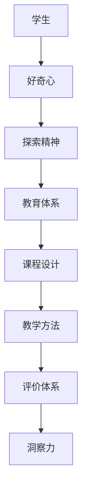

                 

### 文章标题

《理解洞察力的培养：鼓励好奇心和探索精神》

### 关键词

洞察力、好奇心、探索精神、教育体系、机器学习、算法、预测模型、家庭教育、学校教育、社会教育、企业洞察力、政策与法律、科技与教育融合、国际经验交流

### 摘要

本文旨在深入探讨洞察力的培养方法，强调好奇心和探索精神在其中的关键作用。文章从基础理论、实践指导、专业领域应用及未来展望四个部分展开，通过阐述核心概念、算法原理、数学模型、案例解析等，详细介绍了如何通过多种教育策略和方法培养人们的洞察力。同时，文章还探讨了在不同领域中的应用，如家庭教育、学校教育、社会教育以及企业洞察力培养，并对未来的发展趋势进行了展望。本文旨在为广大教育工作者、家长及教育政策制定者提供有价值的参考和指导，助力培养更多具有高度洞察力和创新能力的人才。

### 目录大纲

1. **基础理论**
   1.1 核心概念与联系
   1.2 核心算法原理讲解
   1.3 数学模型和数学公式
   1.4 案例解析

2. **实践指导**
   2.1 家庭教育策略
   2.2 学校教育策略
   2.3 社会教育策略

3. **专业领域应用**
   3.1 企业洞察力培养
   3.2 政策与法律

4. **未来展望**
   4.1 科技与教育融合
   4.2 国际经验交流

5. **附录**
   5.1 资源推荐
   5.2 专业术语表

### 引言

在快速发展的现代社会，洞察力被视为一种关键能力，它不仅关系到个人的成功，也对社会的进步有着深远的影响。洞察力是指从复杂的信息中快速识别本质、发现规律和趋势的能力。这种能力不仅需要扎实的知识基础，更需要好奇心和探索精神的驱动。本文将深入探讨洞察力的培养方法，强调好奇心和探索精神在其中的关键作用。

好奇心是人类探索世界的原动力，它促使我们不断提出问题、寻求答案。而探索精神则是我们在面对未知和挑战时所表现出的坚韧和勇气，它推动我们不断尝试、创新。培养好奇心和探索精神，有助于激发个体的潜能，提高洞察力，从而在竞争激烈的环境中脱颖而出。

本文将从基础理论、实践指导、专业领域应用及未来展望四个部分展开，旨在为广大教育工作者、家长及教育政策制定者提供有价值的参考和指导，助力培养更多具有高度洞察力和创新能力的人才。通过本文的探讨，我们希望读者能够认识到洞察力的重要性，掌握培养洞察力的方法，并在实践中不断探索、创新，为社会的发展贡献自己的力量。

### 第一部分：基础理论

在深入探讨如何培养洞察力之前，我们需要理解几个核心概念：洞察力的定义、好奇心与探索精神的关系、洞察力培养与教育体系的关系。这些概念不仅为我们提供了理论依据，也为实际操作提供了指导。

#### 1.1 核心概念与联系

**洞察力的定义：**

洞察力是指从复杂的信息中快速识别本质、发现规律和趋势的能力。这种能力不仅涉及对事实的识别，更涉及到对事物之间关系的理解。根据心理学家吉尔福德（J.P. Guilford）的观点，洞察力是解决问题和创造思维的核心要素。

**好奇心与探索精神的关系：**

好奇心和探索精神是培养洞察力的两个重要驱动因素。好奇心是指对未知事物的好奇和渴望，它促使我们提出问题、寻求答案。而探索精神则是在面对未知和挑战时所表现出的坚韧和勇气，它推动我们不断尝试、创新。好奇心和探索精神相辅相成，共同促进个体的成长和发展。

**洞察力培养与教育体系的关系：**

教育体系是培养洞察力的关键环境。传统的教育模式侧重于知识的传授，而现代教育则更加关注学生的全面发展。洞察力的培养需要教育体系的支持，包括课程设计、教学方法、评价体系等。通过科学的教育体系，可以有效地激发学生的好奇心和探索精神，从而提高他们的洞察力。

**Mermaid流程图：洞察力培养与教育体系流程**



#### 1.2 核心算法原理讲解

在洞察力培养中，算法的应用至关重要。以下将介绍几种核心算法原理及其在洞察力培养中的应用。

**知识图谱在洞察力培养中的应用：**

知识图谱是一种用于表示实体及其关系的图形结构。通过构建知识图谱，可以清晰地展示不同概念之间的联系，从而帮助学生更好地理解复杂知识。例如，在科学教育中，构建生物学知识图谱可以帮助学生理解生物分类、生态系统等概念。

**机器学习算法在好奇心识别中的运用：**

机器学习算法可以用于识别和预测个体的好奇心。例如，通过分析学生在学习过程中的行为数据（如阅读时间、提问次数等），可以使用分类算法预测学生对某一主题的好奇心水平。这有助于教育者针对不同学生的兴趣进行个性化教学。

**探索精神与决策树的结合：**

决策树是一种常用的机器学习算法，用于分类和回归任务。在洞察力培养中，可以将学生的探索行为（如选择学习材料、参与项目等）作为输入，通过决策树算法分析其探索精神的强弱。这有助于教育者了解学生的探索倾向，从而制定相应的培养策略。

**伪代码讲解：基于决策树的好奇心识别算法**

```python
def recognize_curiosity(data):
    # 初始化决策树模型
    model = DecisionTreeClassifier()
    
    # 训练模型
    model.fit(X_train, y_train)
    
    # 预测好奇心水平
    predictions = model.predict(X_test)
    
    return predictions
```

#### 1.3 数学模型和数学公式

在洞察力培养中，数学模型和公式起着重要作用。以下将介绍几种常用的数学模型和公式，以及其在洞察力培养中的应用。

**预测模型中的相关性与置信度计算：**

相关性用于衡量两个变量之间的线性关系。在洞察力培养中，可以使用相关性分析评估学生好奇心与学业成绩之间的关系。置信度则用于衡量预测结果的可靠性。例如，使用贝叶斯置信度公式可以计算学生某次考试成绩的置信度。

$$
\text{相关性} = \frac{\text{协方差}}{\sqrt{\text{方差}_x \cdot \text{方差}_y}}
$$

$$
\text{置信度} = \frac{P(\text{事件}|\text{数据})}{P(\text{数据})}
$$

**贝叶斯网络的构建与应用：**

贝叶斯网络是一种用于表示变量之间概率关系的图形结构。在洞察力培养中，可以构建贝叶斯网络来分析好奇心、探索精神和学业成绩之间的概率关系。这有助于教育者理解不同因素对洞察力培养的影响。

**机器学习中的误差函数：**

误差函数用于评估模型预测的准确性。在洞察力培养中，可以使用误差函数（如均方误差、交叉熵误差等）评估学生好奇心预测模型的性能。通过优化误差函数，可以提高模型的预测精度。

$$
\text{均方误差} = \frac{1}{n} \sum_{i=1}^{n} (y_i - \hat{y}_i)^2
$$

$$
\text{交叉熵误差} = - \sum_{i=1}^{n} y_i \log \hat{y}_i
$$

**LaTeX公式示例：**

$$
E = \frac{1}{2} \sum_{i=1}^{n} (y_i - \hat{y}_i)^2
$$

通过这些数学模型和公式，我们可以更准确地理解和预测洞察力的培养过程，从而制定更加有效的教育策略。

#### 1.4 案例解析

为了更好地理解洞察力培养的方法和实践，以下将介绍几个具体的案例。

**洞察力培养案例：儿童教育中的实践**

在一个儿童教育项目中，教育者通过构建知识图谱，帮助学生理解复杂知识。例如，在数学教育中，构建数学知识图谱，展示数学概念之间的联系，有助于学生更好地掌握数学知识。此外，教育者还通过设计互动式教学活动，激发学生的好奇心和探索精神。例如，通过实验和探究活动，让学生亲身体验数学原理的应用，从而提高他们的洞察力。

**好奇心激发案例：科技馆与博物馆的互动设计**

科技馆和博物馆是激发好奇心和探索精神的重要场所。通过设计互动展品和体验活动，可以吸引学生积极参与，培养他们的好奇心。例如，在一个科技馆中，通过设计模拟火箭发射的互动装置，让学生亲身体验火箭升空的原理，从而激发他们对科学的好奇心。同时，博物馆的互动展览和讲解，也可以帮助学生深入了解历史和文化遗产，培养他们的探索精神。

**探索精神培养案例：野外探险与科研实践**

野外探险和科研实践是培养探索精神的重要途径。通过参与野外探险，学生可以亲身体验自然环境的复杂性和多样性，培养他们的观察力和判断力。例如，在野外考察中，学生可以通过观察植物、动物和地质现象，学习生态学和地质学知识。而科研实践则可以帮助学生了解科学研究的流程和方法，培养他们的创新能力和解决问题的能力。例如，在一个生物科研项目中，学生可以通过实验和数据分析，探索生物物种的生态关系，提高他们的科研素养。

这些案例展示了洞察力培养的不同方法，包括知识图谱的应用、互动教学活动的设计、科技馆和博物馆的互动体验，以及野外探险和科研实践。通过这些实践，学生不仅能够提高他们的洞察力，还能够培养好奇心和探索精神，从而为未来的发展奠定坚实的基础。

### 第二部分：实践指导

在基础理论的指导下，如何将洞察力的培养具体落实到家庭教育、学校教育和社会教育中，是教育工作者、家长和社会各界需要共同关注的问题。以下将分别从这三个方面提出具体的策略和指导，旨在为培养洞察力提供实际操作路径。

#### 2.1 家庭教育策略

**家庭环境对好奇心和探索精神的影响：**

家庭环境是孩子成长的第一环境，对他们的好奇心和探索精神有着深远的影响。家长应创造一个充满探索机会和挑战的的家庭氛围，鼓励孩子提出问题和尝试新事物。例如，家长可以和孩子一起进行科学实验、阅读书籍、参观博物馆等，通过这些活动激发孩子的好奇心和探索精神。

**家长角色的引导与支持：**

家长在培养孩子的洞察力中扮演着关键角色。他们应鼓励孩子自主学习，培养孩子的问题解决能力和批判性思维。例如，当孩子遇到困难时，家长可以鼓励他们通过查阅资料、讨论和尝试解决，而不是直接给出答案。此外，家长还应支持孩子的兴趣爱好，为孩子提供必要的资源和机会，让他们在感兴趣的领域中深入探索。

**培养儿童自主学习的技巧：**

自主学习是培养洞察力的关键能力。家长可以通过以下方法帮助孩子培养自主学习技巧：首先，培养孩子的阅读习惯，鼓励他们广泛阅读，从不同领域获取知识；其次，教授孩子如何使用互联网和图书馆资源，让他们能够自主获取信息；最后，鼓励孩子参与讨论和思考，培养他们的批判性思维和创造力。

#### 2.2 学校教育策略

**教育体制中的洞察力培养：**

学校教育是培养洞察力的主要途径之一。教育体制应重视学生的全面发展，不仅仅是知识的传授，更要注重培养学生的思维能力、问题解决能力和创新能力。学校可以通过以下措施来培养洞察力：

- **课程设计**：课程应包含丰富的跨学科内容，引导学生从不同角度思考问题。例如，将数学、科学、社会科学和艺术等领域有机结合，设计跨学科项目。
- **教学方法**：采用互动式和项目式教学方法，鼓励学生主动参与和探索。例如，通过小组讨论、实验、研究项目等，激发学生的学习兴趣和创造力。
- **评价体系**：建立多元化的评价体系，不仅评估学生的知识和技能，还要评估他们的思维过程和创新能力。例如，通过项目报告、口头演讲、实验展示等方式进行评价。

**课堂互动与项目式学习：**

课堂互动和项目式学习是培养洞察力的有效方法。教师可以通过以下方式促进课堂互动：

- **讨论与辩论**：组织学生进行讨论和辩论，鼓励他们表达观点、批判性思考，培养他们的逻辑思维和表达能力。
- **实验与探究**：设计实验和探究活动，让学生亲身体验科学原理和应用，提高他们的观察力和实验能力。
- **项目式学习**：通过项目式学习，让学生在解决实际问题的过程中培养洞察力。例如，可以组织学生进行科学探究、社会调查、工程设计等，让他们在项目中运用所学知识，提高他们的实践能力。

**教师培训与专业发展：**

教师是培养学生洞察力的关键因素。学校应重视教师的培训和专业发展，为他们提供相关的教学资源和培训课程。例如，可以通过教师研讨会、工作坊、在线课程等，帮助教师了解最新的教育理念和教学方法，提高他们的教学水平。

#### 2.3 社会教育策略

**社区活动与公共资源利用：**

社会教育是培养洞察力的另一个重要方面。社区可以通过以下活动来激发学生的好奇心和探索精神：

- **科普讲座与展览**：组织科普讲座和展览，邀请专家和学者分享科学知识，让学生了解前沿科技和科研成果。
- **科技竞赛与实验室开放**：举办科技竞赛和开放实验室活动，鼓励学生参与科技创新和实践，培养他们的实践能力和创新能力。
- **志愿服务与社区参与**：鼓励学生参与志愿服务和社区活动，让他们在服务中学会思考问题、解决问题，提高他们的社会责任感和公民意识。

**科技创新与创业教育：**

科技创新和创业教育是培养洞察力和创新能力的重要途径。社区可以通过以下措施来推动科技创新和创业教育：

- **创业培训与孵化**：提供创业培训和实践机会，帮助学生了解创业过程、商业模式和创新思维，培养他们的创业精神和创新能力。
- **创新创业竞赛**：举办创新创业竞赛，激发学生的创新潜力，为他们提供展示自己项目和成果的平台。
- **科技企业合作**：与科技企业合作，建立实习和实训基地，让学生了解实际工作环境和职业要求，提高他们的职业素养。

**社会支持体系的建设：**

社会支持体系是培养洞察力的重要保障。政府和社会组织可以通过以下措施来提供支持：

- **教育经费投入**：增加教育经费投入，改善教育设施和资源，为学校和社会教育提供必要的支持。
- **政策支持与引导**：制定相关政策，鼓励学校和社会开展创新教育和创业教育，为学生的成长提供良好的环境。
- **公益项目与资助**：设立公益项目和资助计划，为有潜力的学生提供经济支持和职业指导，帮助他们实现自己的梦想。

通过家庭、学校和社会的共同努力，可以构建一个全方位、多层次的教育体系，为学生的洞察力培养提供有力的支持，助力他们成为具有创新能力和竞争力的未来人才。

### 第三部分：专业领域应用

在专业领域，洞察力不仅是个人成功的关键，也是企业和社会发展的驱动力。本部分将探讨如何在不同领域应用洞察力培养策略，特别是企业洞察力培养和政策与法律的支撑。

#### 3.1 企业洞察力培养

**企业文化对洞察力的影响：**

企业文化是企业内部的价值观、信念和行为准则，对员工的洞察力培养有着深远的影响。一个注重创新和学习的文化环境能够激发员工的好奇心和探索精神，从而提高他们的洞察力。例如，谷歌的企业文化鼓励员工大胆尝试新事物，提倡开放讨论和跨部门合作，这种文化氛围有助于员工的创新思维和洞察力的发展。

**知识管理与创新能力：**

知识管理是提高企业洞察力的重要手段。通过有效的知识管理，企业可以确保知识在组织内的流通和共享，从而提高员工的洞察力。知识管理包括知识获取、知识存储、知识共享和知识应用等方面。例如，建立内部知识库、实施共享学习平台、举办知识分享会议等，都有助于知识的积累和传播，从而提升员工的洞察力和创新能力。

**员工培训与发展计划：**

企业应制定系统的员工培训和发展计划，以培养员工的洞察力。培训内容可以包括创新思维训练、问题解决能力提升、跨学科知识学习等。此外，企业还应鼓励员工参与外部培训和认证，如参加行业研讨会、获得专业资格认证等，以拓宽他们的视野和知识面。例如，谷歌的“Google Career Certificates”项目，为员工提供了免费的学习机会和职业认证，帮助他们提升技能和职业竞争力。

**案例：**

以谷歌为例，其通过以下措施培养员工的洞察力：

- **内部培训计划**：谷歌提供多样化的内部培训，涵盖编程、数据分析、产品管理等多个领域，帮助员工不断提升专业知识和技能。
- **创新实验室**：谷歌设有创新实验室，鼓励员工提出新的创意和解决方案，通过实验和试错来培养他们的探索精神和创新能力。
- **项目制工作**：谷歌的项目制工作模式，让员工在不同项目中积累经验，锻炼解决问题的能力，提高他们的洞察力。

#### 3.2 政策与法律

**教育政策对洞察力培养的支持：**

政府应制定和实施有利于培养洞察力的教育政策。例如，增加教育经费投入，改善教育设施，提升教育质量；鼓励学校开设创新课程和项目，培养学生的批判性思维和创造力；推动跨学科教育，培养学生的综合素质。此外，政府还可以通过政策引导，鼓励企业和高校合作，共同培养具有创新能力和洞察力的专业人才。

**法律法规与隐私保护：**

在信息化和数据驱动的时代，隐私保护成为了一项重要议题。政府应制定和实施相关法律法规，保护个人和企业的数据隐私。例如，通过数据保护法、隐私法等，规范数据收集、存储和使用行为，防止数据滥用和泄露。这有助于建立一个安全可靠的数据环境，为洞察力培养提供数据支持。

**社会责任与可持续发展：**

企业和社会组织在追求经济效益的同时，还应承担社会责任，关注可持续发展。这包括推动绿色技术和可持续发展项目的实施，促进环境保护和社会进步。例如，通过参与公益项目、支持教育和科研活动，企业可以为社会的可持续发展做出贡献，同时也提升自身的社会价值和品牌形象。

**案例：**

以欧盟的《通用数据保护条例》（GDPR）为例，该法规通过严格的隐私保护措施，确保了个人数据的合法、安全使用，为数据驱动下的洞察力培养提供了法律保障。此外，欧盟还通过《欧洲创新战略》等政策，鼓励创新和科研投资，推动社会和经济的可持续发展。

通过企业和社会的共同努力，可以构建一个有利于洞察力培养的环境，提高专业人才的洞察力，促进企业和社会的持续发展。

### 第四部分：未来展望

随着科技的不断进步和全球化的发展，洞察力的培养面临着新的挑战和机遇。未来，科技与教育的融合、国际经验交流将成为推动洞察力培养的重要力量。

#### 4.1 科技与教育融合

**人工智能在教育中的应用：**

人工智能（AI）在教育领域的应用正在逐步深入，为洞察力的培养提供了新的工具和方法。例如，通过智能推荐系统，AI可以根据学生的学习行为和兴趣，提供个性化的学习资源和课程。此外，AI还可以用于自动化评估和反馈，帮助教师更准确地了解学生的学习状况，从而提供有针对性的指导。

**数字化时代的教育创新：**

数字化时代带来了教育的革新，在线学习、虚拟现实（VR）和增强现实（AR）等技术正在改变传统的教学模式。通过这些技术，学生可以沉浸在丰富的学习环境中，提高他们的探索精神和创新能力。例如，VR技术可以模拟历史事件、科学实验等场景，让学生亲身体验，从而提高他们的洞察力。

**网络教育与远程教学的挑战与机遇：**

网络教育和远程教学在疫情期间得到了广泛应用，这为洞察力的培养提供了新的机会。然而，网络教育也带来了一些挑战，如学习效果的监督和质量控制。未来，通过引入智能监控和评估系统，可以更好地确保网络教育的质量，同时发挥远程教学的灵活性和便捷性。

#### 4.2 国际经验交流

**国外教育体系中的洞察力培养：**

不同国家和地区的教育体系在洞察力培养方面有着不同的经验和做法。通过国际经验交流，可以借鉴和吸收先进的培养方法。例如，芬兰的教育体系注重学生的自主学习和创新能力培养，韩国和新加坡则通过严格的考试制度和综合素质评价，提高学生的洞察力和竞争力。

**跨文化视角下的好奇心与探索精神：**

跨文化视角下的好奇心与探索精神培养，有助于培养学生的全球视野和跨文化交流能力。通过国际合作项目、文化交流活动等，学生可以了解不同文化背景下的教育理念和实践，从而拓宽视野，提高洞察力。

**国际合作与资源共享：**

国际合作与资源共享是推动洞察力培养的重要手段。通过建立国际教育合作平台，共享优质教育资源，可以提升全球教育水平，培养更多具有国际竞争力的人才。例如，联合国教科文组织（UNESCO）等国际组织正在推动全球教育资源共享，为各国教育发展提供支持。

总之，未来洞察力的培养将更加依赖于科技与教育的融合、国际经验交流以及全球合作与资源共享。通过这些努力，可以构建一个有利于洞察力培养的全球教育体系，为培养具有高度洞察力和创新能力的人才奠定基础。

### 第五部分：附录

#### 5.1 资源推荐

**相关书籍与论文推荐：**

- 《思考，快与慢》 [作者：丹尼尔·卡尼曼（Daniel Kahneman）]
- 《智能时代》 [作者：吴军]
- 《认知盈余》 [作者：克莱·舍基（Clay Shirky）]
- 《学习的艺术》 [作者：彼得·希夫（Peter Schiff）和安德斯·艾利克森（Anders Ericsson）]
- 《机器学习的数学：线性代数、微积分和概率论》 [作者：约翰·D.凯利（John D. Kelly）]

**优秀的教育实践案例：**

- 清华大学经管学院：创新与创业教育案例
- 芬兰教育体系：芬兰教育模式及其启示
- 斯坦福大学：创业与创新课程案例

**在线课程与学习资源：**

- Coursera: 机器学习和深度学习课程
- edX: 创新思维和设计思维课程
- Khan Academy: 基础数学和科学课程

#### 5.2 专业术语表

- **洞察力**：从复杂的信息中快速识别本质、发现规律和趋势的能力。
- **好奇心**：对未知事物的好奇和渴望。
- **探索精神**：在面临未知和挑战时表现出的坚韧和勇气。
- **知识图谱**：用于表示实体及其关系的图形结构。
- **机器学习**：一种通过数据学习模型和规律，进行预测和决策的技术。
- **决策树**：一种常用的机器学习算法，用于分类和回归任务。
- **贝叶斯网络**：一种用于表示变量之间概率关系的图形结构。
- **相关性**：衡量两个变量之间线性关系的一个指标。
- **均方误差**：评估模型预测准确性的一个指标。
- **交叉熵误差**：评估模型预测准确性的另一个指标。
- **个性化学习**：根据学生的兴趣和需求，提供定制化的学习资源和教学方法。

### 结语

通过本文的探讨，我们深入了解了洞察力的培养方法，强调了好奇心和探索精神在其中的关键作用。从基础理论到实践指导，再到专业领域应用，我们提出了一系列具体的策略和措施，旨在为培养具有高度洞察力和创新能力的人才提供有力支持。未来，随着科技与教育的融合和国际经验交流的加强，洞察力的培养将迎来新的机遇和挑战。我们期待通过不断探索和创新，构建一个有利于洞察力培养的全球教育体系，为社会的进步和人类的发展贡献更多的智慧和力量。作者：AI天才研究院/AI Genius Institute & 禅与计算机程序设计艺术 /Zen And The Art of Computer Programming。

