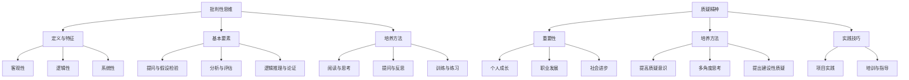

                 

### 文章标题

# 理解洞察力的培养：鼓励质疑和批判性思维

### 关键词

- 洞察力
- 批判性思维
- 质疑精神
- 个人成长
- 创新思维

### 摘要

在快速变化的数字化时代，洞察力成为个人和企业在竞争中取得优势的关键能力。本文探讨了洞察力的定义、重要性及其培养策略，特别强调了批判性思维和质疑精神在洞察力培养中的核心作用。通过详细阐述批判性思维和质疑精神的定义、特征、培养方法及其在实际中的应用，本文为读者提供了一套系统化的洞察力培养方案，旨在帮助读者提升自身认知水平，培养卓越的洞察力，从而在个人和职业发展中取得突破。同时，通过案例分析和实战技巧分享，本文进一步验证了这些策略的有效性，为读者提供了可操作的实践指南。

### 第一部分：引言与核心概念

#### 第1章：洞察力的定义与重要性

##### 1.1 洞察力的概念

**定义：** 洞察力是指个体对事物本质和内在联系的理解与识别能力，它超越了表面的现象，能够深入挖掘事物背后的逻辑和原因。

**内涵：** 洞察力不仅包括对信息的敏锐感知，还涉及对复杂问题的分析和解决能力。它是一种综合性认知能力，涵盖观察力、分析力、思考力和判断力等多方面。

**区别：** 与直觉和感知不同，洞察力更强调逻辑推理和深度分析。直觉和感知更多依赖于感性认知，而洞察力则需要理性思考和科学分析。

##### 1.2 洞察力的重要性

**个人发展：** 洞察力是个人成长和职业发展的关键能力。它帮助个体更好地理解自己和周围的世界，提升自我认知和自我管理能力。

**职业发展：** 在职场中，洞察力使个体能够迅速识别问题、找到解决方案，从而在竞争激烈的职场中脱颖而出。

**社会进步：** 洞察力在推动社会进步中发挥着重要作用。它促使个体和社会不断反思和改进，从而实现持续发展和创新。

##### 1.3 质疑与批判性思维的关系

**关系：** 质疑和批判性思维是洞察力培养的两个重要组成部分。质疑精神促使个体不断提出问题，挑战现有观念和假设，从而激发深层次的思考。批判性思维则是对质疑结果进行系统性分析和评估，确保思维过程的准确性和逻辑性。

**作用：** 质疑和批判性思维相互促进，共同增强个体的洞察力。质疑激发思考，批判性思维深化理解，两者相辅相成，形成了一套完整的认知过程。

#### 第2章：批判性思维的培养

##### 2.1 批判性思维的定义与特征

**定义：** 批判性思维是一种积极的思考方式，通过质疑、分析和评估信息，以形成准确、合理的结论和判断。

**特征：** 
- **客观性：** 批判性思维强调客观分析和理性判断，不受主观情感和偏见的影响。
- **逻辑性：** 批判性思维注重逻辑推理和论证，确保思维过程的连贯性和合理性。
- **系统性：** 批判性思维以系统性分析问题，考虑问题的各个方面和潜在影响。

##### 2.2 批判性思维的基本要素

**提问与假设检验：** 批判性思维从提出问题开始，通过假设检验，确定假设的有效性和合理性。

**分析与评估：** 分析与评估是批判性思维的核心，通过深入分析问题，评估信息的可靠性和有效性。

**逻辑推理与论证：** 逻辑推理和论证是确保批判性思维结论合理性的关键，通过逻辑推理，构建严密的论证体系。

##### 2.3 如何培养批判性思维

**提高批判性思维的方法：**
- **阅读与思考：** 阅读广泛的书籍和资料，培养思考问题的习惯。
- **提问与反思：** 常态化提问，反思自己的思维过程和结论。
- **训练与练习：** 通过案例分析、辩论等活动，训练批判性思维技能。

**批判性思维的练习与技巧：**
- **结构化思考：** 学习使用思维导图、SWOT分析等方法，提高思考的条理性。
- **辩证思维：** 学会从不同角度分析问题，避免片面和偏见的思考。

**批判性思维在教育中的应用：**
- **课程设计：** 在教育中融入批判性思维训练，培养学生的独立思考能力。
- **教学评价：** 通过开放性问题和多元评价方式，激发学生的批判性思维。

#### 第3章：质疑精神的培养

##### 3.1 质疑精神的重要性

**个人成长：** 质疑精神促使个体不断挑战自我，探索未知的领域，从而实现自我成长和突破。

**职业发展：** 在职业中，质疑精神使个体能够主动发现问题、提出改进意见，提升工作效率和质量。

**社会进步：** 质疑精神推动社会进步和变革，促使个体和社会不断反思和改进。

##### 3.2 如何培养质疑精神

**提高质疑意识：**
- **培养好奇心：** 培养对未知事物的好奇心，激发探索欲望。
- **保持开放心态：** 保持开放心态，接受不同观点和意见。

**质疑精神的实践技巧：**
- **提出问题：** 常态化提出问题，培养提问习惯。
- **多角度思考：** 从不同角度分析问题，避免片面和偏见的思考。

**质疑精神在团队合作中的培养：**
- **鼓励提问：** 鼓励团队成员提问，激发思维碰撞。
- **建立反馈机制：** 建立有效的反馈机制，鼓励成员提出质疑和建议。

##### 3.3 质疑与批判性思维的结合

**互补关系：** 质疑和批判性思维相辅相成，质疑激发思考，批判性思维深化理解。

**实践结合：** 在实际工作中，通过质疑发现问题，运用批判性思维分析和解决，实现问题的系统性解决。

**在创新中的应用：** 质疑和批判性思维在创新中发挥着重要作用，通过不断质疑和批判，激发创新思维，推动创新成果的产生。

#### 第4章：洞察力的培养策略

##### 4.1 培养洞察力的方法

**观察力的培养：**
- **主动观察：** 培养主动观察的习惯，提高对细节的敏感度。
- **系统观察：** 学会使用观察工具和方法，进行系统观察。

**分析力的培养：**
- **逻辑分析：** 培养逻辑分析能力，确保思考的条理性和系统性。
- **数据分析：** 学习数据分析方法，提高数据分析能力。

**思辨力的培养：**
- **辩证思考：** 学会辩证思考，避免片面和偏见的思考。
- **反思与总结：** 经常进行反思和总结，提高思维深度。

##### 4.2 提高洞察力的技巧

**提问与假设检验技巧：**
- **开放式提问：** 提出开放式问题，激发深度思考。
- **假设检验：** 培养假设检验能力，确保思考的准确性和合理性。

**分析与评估技巧：**
- **多角度分析：** 从不同角度分析问题，避免片面和偏见的思考。
- **评估标准：** 设定评估标准，确保评估的客观性和准确性。

**逻辑推理与论证技巧：**
- **逻辑结构：** 学会构建逻辑结构，确保论证的连贯性和合理性。
- **论证方法：** 掌握多种论证方法，提高论证的力度和效果。

##### 4.3 洞察力的培养与个人成长

**洞察力对个人成长的影响：**
- **提升认知水平：** 洞察力提升个体的认知水平，帮助个体更好地理解和应对复杂问题。
- **培养创新能力：** 洞察力激发个体的创新思维，促进个人在各个领域的创新和发展。

**洞察力在职业生涯中的应用：**
- **问题解决能力：** 洞察力使个体具备更强的问题解决能力，能够在职场中迅速识别和解决复杂问题。
- **战略规划能力：** 洞察力提升个体的战略规划能力，帮助个体在职业发展中制定更科学、更有效的战略。

**洞察力对社会发展的贡献：**
- **推动科技进步：** 洞察力促使个体不断探索和创新，推动科技的进步和发展。
- **促进社会变革：** 洞察力帮助个体和社会反思和改进，推动社会变革和进步。

#### 第5章：案例分析

##### 5.1 成功案例分享

**商业成功中的应用：**
- **苹果公司：** 苹果公司通过卓越的洞察力，不断推出具有创新性的产品，成为全球最具价值的科技公司之一。
- **特斯拉公司：** 特斯拉公司通过洞察力，引领电动汽车行业的变革，推动了全球能源结构的转型。

**科技创新中的应用：**
- **深度学习技术：** 通过深度学习技术，实现人工智能的突破，推动各行各业的数字化转型。
- **量子计算技术：** 通过量子计算技术的研发和应用，有望解决传统计算机无法解决的问题，引领新一轮科技革命。

##### 5.2 失败案例分析

**商业失败中的教训：**
- **诺基亚：** 诺基亚在手机市场竞争中失败，主要原因是缺乏对市场变化的洞察力，未能及时调整战略。
- **黑莓手机：** 黑莓手机在智能手机市场中的失败，同样是因为缺乏对市场趋势的洞察力，未能及时转型。

**科技创新中的挑战：**
- **区块链技术：** 尽管区块链技术具有巨大的潜力，但在实际应用中面临诸多挑战，如性能瓶颈、隐私保护等问题。
- **人工智能伦理：** 人工智能技术的快速发展引发了伦理问题，如隐私侵犯、算法偏见等，需要深入思考和解决。

##### 5.3 从案例中学习洞察力的培养

**成功经验：**
- **持续学习和创新：** 成功案例表明，持续学习和创新是培养洞察力的关键。只有不断更新知识和技能，才能在变化的市场中保持竞争力。
- **跨领域学习：** 跨领域学习能够帮助个体拓宽视野，提高对复杂问题的洞察力。

**失败教训：**
- **忽视市场变化：** 忽视市场变化是失败的主要原因之一。企业需要密切关注市场动态，及时调整战略。
- **缺乏创新思维：** 缺乏创新思维会限制企业的发展。企业需要培养员工的创新思维，鼓励尝试和探索。

### 第二部分：实践与应用

#### 第6章：批判性思维在日常工作中的应用

##### 6.1 如何运用批判性思维解决问题

**问题识别：**
- **明确问题：** 在解决问题之前，首先要明确问题的性质和范围，确保问题定义的准确性。
- **收集信息：** 收集与问题相关的各种信息，包括数据、文献、案例等，为问题分析提供基础。

**问题分析：**
- **多角度分析：** 从不同角度分析问题，考虑问题的各个方面和潜在影响。
- **逻辑推理：** 运用逻辑推理，确保问题分析的准确性和合理性。

**解决方案评估：**
- **评估方案：** 对各种解决方案进行评估，比较其优缺点和可行性。
- **选择最佳方案：** 根据评估结果，选择最佳方案，确保解决方案的科学性和有效性。

**实施与反馈：**
- **实施方案：** 将解决方案付诸实施，确保计划的执行和监督。
- **反馈与调整：** 收集实施过程中的反馈，及时调整方案，确保问题的彻底解决。

##### 6.2 批判性思维在决策过程中的作用

**决策前的准备：**
- **收集信息：** 在做出决策之前，充分收集与决策相关的信息，确保决策的准确性。
- **分析信息：** 对收集到的信息进行系统分析，识别其中的关键因素和潜在风险。

**决策过程中的思考：**
- **多方案比较：** 对不同方案进行比较，权衡其优缺点，选择最佳方案。
- **逻辑推理：** 运用逻辑推理，确保决策过程的连贯性和合理性。

**决策后的评估：**
- **评估效果：** 对决策结果进行评估，分析决策的成效和潜在问题。
- **反馈与改进：** 根据评估结果，进行反馈和改进，确保决策的科学性和有效性。

##### 6.3 提高工作效率的批判性思维技巧

**问题识别与解决：**
- **快速识别问题：** 培养敏锐的洞察力，快速识别工作中存在的问题。
- **有效解决问题：** 运用批判性思维，找到解决问题的最佳方法，提高工作效率。

**决策与规划：**
- **科学决策：** 通过批判性思维，确保决策的准确性和科学性，避免盲目决策。
- **合理规划：** 制定合理的计划和目标，确保工作有序进行，提高工作效率。

**沟通与协作：**
- **有效沟通：** 运用批判性思维，提高沟通的效果和准确性，确保信息传递的顺畅。
- **协同合作：** 通过批判性思维，促进团队合作，提高协作效率。

#### 第7章：质疑精神在工作中的培养

##### 7.1 如何在工作环境中培养质疑精神

**培养质疑意识：**
- **鼓励提问：** 鼓励员工提问，激发他们的思考能力，培养质疑精神。
- **建立反馈机制：** 建立有效的反馈机制，让员工能够自由表达质疑和建议，促进思考和成长。

**提高质疑技巧：**
- **多角度思考：** 培养从不同角度思考问题的习惯，避免片面和偏见的思考。
- **提出建设性质疑：** 提出具有建设性的质疑，不仅质疑问题本身，还要提出可能的解决方案。

**实践质疑精神：**
- **项目实践：** 在实际项目中，鼓励员工运用质疑精神，提出改进意见，推动项目进展。
- **培训与指导：** 通过培训和指导，提高员工的质疑技巧和思维能力，培养质疑精神。

##### 7.2 质疑精神的实践案例

**案例一：** 在软件开发项目中，团队通过运用质疑精神，不断提出问题，发现并解决了多个潜在的技术风险，确保了项目的顺利进行。

**案例二：** 在市场营销活动中，团队通过质疑现有策略，提出了创新的营销方案，成功提升了品牌知名度和市场份额。

**案例三：** 在企业管理中，通过质疑传统的管理模式，企业成功实现了管理优化，提高了运营效率和员工满意度。

##### 7.3 质疑精神对企业发展的影响

**促进创新：** 质疑精神激发员工的创新思维，推动企业持续创新，保持竞争力。

**提升效率：** 质疑精神促使企业不断反思和改进，提高工作效率和质量。

**增强团队协作：** 质疑精神促进团队之间的沟通和协作，提高团队整体执行力。

**企业文化建设：** 质疑精神有助于建立积极向上的企业文化，增强企业的凝聚力和竞争力。

#### 第8章：洞察力在创新中的角色

##### 8.1 创新中的洞察力

**定义：** 创新中的洞察力是指个体在创新过程中，对事物本质和内在联系的理解与识别能力，它帮助个体发现创新机会，推动创新成果的实现。

**重要性：** 
- **发现创新机会：** 洞察力使个体能够敏锐地发现市场变化和潜在需求，发现创新机会。
- **解决创新难题：** 洞察力帮助个体在创新过程中识别和解决复杂问题，推动创新成果的实现。

##### 8.2 洞察力与创新思维的关系

**关系：** 
- **相互促进：** 洞察力和创新思维相互促进，洞察力为创新思维提供方向和基础，创新思维则通过实践和验证，深化洞察力。
- **协同发展：** 在创新过程中，洞察力和创新思维相辅相成，共同推动创新成果的产生。

##### 8.3 培养洞察力以推动创新

**方法一：** 
- **跨领域学习：** 通过跨领域学习，拓宽视野，提高对复杂问题的洞察力。
- **持续学习：** 持续学习，更新知识和技能，增强自身的创新能力。

**方法二：** 
- **实践与反思：** 通过实践，不断反思和总结，提高对问题的洞察力。
- **培养批判性思维：** 通过培养批判性思维，提高思维的深度和广度，增强洞察力。

**方法三：** 
- **团队合作：** 通过团队合作，集思广益，提高对复杂问题的洞察力。
- **跨部门协作：** 通过跨部门协作，促进知识共享和经验交流，推动创新成果的产生。

#### 第9章：案例研究与实战

##### 9.1 实际案例研究

**案例一：** 
- **背景：** 一家传统制造业企业，面临市场竞争加剧和成本上升的压力。
- **洞察力应用：** 通过运用洞察力，企业发现市场对定制化产品的需求，转型为定制化生产，提升了市场竞争力。

**案例二：** 
- **背景：** 一家科技创新公司，面临技术突破和市场竞争的双重挑战。
- **洞察力应用：** 通过运用洞察力，公司成功研发出具有颠覆性的产品，引领了行业创新。

##### 9.2 实战技巧分享

**实战技巧一：** 
- **提问与反思：** 通过提问和反思，深入挖掘问题本质，提高洞察力。
- **多角度分析：** 从不同角度分析问题，避免片面和偏见的思考。

**实战技巧二：** 
- **跨领域学习：** 通过跨领域学习，拓宽视野，提高对复杂问题的洞察力。
- **实践与反思：** 通过实践，不断反思和总结，提高对问题的洞察力。

**实战技巧三：** 
- **团队合作：** 通过团队合作，集思广益，提高对复杂问题的洞察力。
- **跨部门协作：** 通过跨部门协作，促进知识共享和经验交流，推动创新成果的产生。

##### 9.3 洞察力培养的实战应用

**实战应用一：** 
- **项目管理：** 在项目管理中，通过运用洞察力，提前识别和解决潜在问题，确保项目顺利进行。

**实战应用二：** 
- **产品开发：** 在产品开发中，通过运用洞察力，发现市场需求和潜在用户，优化产品设计。

**实战应用三：** 
- **企业战略：** 在企业战略制定中，通过运用洞察力，分析市场趋势和竞争态势，制定科学、有效的战略。

### 第10章：结论与展望

#### 10.1 洞察力培养的总结

**核心要点：**
- **批判性思维和质疑精神：** 批判性思维和质疑精神是培养洞察力的关键，它们相互促进，共同增强个体的认知能力和创新思维。
- **实践与应用：** 实践和应用是洞察力培养的重要环节，通过实际案例研究和实战技巧分享，读者可以更好地理解和应用洞察力。

**重要意义：**
- **个人成长：** 洞察力提升了个体的认知水平，促进了个人成长和职业发展。
- **企业竞争：** 洞察力使企业能够更好地应对市场变化和竞争压力，保持竞争优势。
- **社会进步：** 洞察力推动社会进步和科技创新，促进了社会的发展和变革。

#### 10.2 未来发展方向

**趋势与挑战：**
- **人工智能：** 随着人工智能技术的快速发展，洞察力的培养将更加依赖于数据的处理和分析能力。
- **全球化：** 全球化背景下，跨文化和跨领域的洞察力培养将成为重要趋势。

**发展方向：**
- **技术创新：** 通过技术创新，提高洞察力的培养效率和质量。
- **跨领域合作：** 加强跨领域合作，促进知识的共享和融合，推动创新成果的产生。

#### 10.3 对个人和社会的意义

**对个人的意义：**
- **提升竞争力：** 洞察力使个人在职场中具备更强的竞争力，提高职业发展机会。
- **促进成长：** 洞察力激发了个体的成长潜力，促进了个人全面发展。

**对社会的影响：**
- **创新驱动：** 洞察力推动了社会创新，促进了科技进步和产业升级。
- **和谐发展：** 洞察力促进社会反思和改进，推动了社会的和谐发展。

### 附录

#### 附录A：批判性思维与质疑精神的工具与资源

**常用批判性思维工具：**
- **思维导图：** 通过构建思维导图，梳理思路，提高思维条理性。
- **SWOT分析：** 通过SWOT分析，全面评估问题的各个方面，提高分析的准确性。

**质疑精神培养的书籍推荐：**
- **《批判性思维工具箱》**
- **《质疑的力量》**
- **《如何思考：批判性思维指南》**

**在线批判性思维与质疑精神课程：**
- **Coursera上的《批判性思维与问题解决》课程**
- **Udemy上的《质疑精神：提升思考能力》课程**

#### 附录B：练习题与案例研究

**练习题：**
1. 请运用批判性思维，分析以下问题：如何提高企业的创新能力？
2. 请运用质疑精神，提出一个具有创新性的产品或服务。

**案例研究题目：**
1. 请分析一家成功企业的案例，阐述其如何运用洞察力推动企业持续发展。
2. 请分析一家失败企业的案例，探讨其失败原因，并给出改进建议。

---

作者：AI天才研究院/AI Genius Institute & 禅与计算机程序设计艺术 /Zen And The Art of Computer Programming

### Mermaid 流程图：批判性思维与质疑精神的培养



### 伪代码：批判性思维在问题解决中的应用

```python
def critical_thinking(problem):
    # 提问与假设检验
    questions = ["What is the problem?", "Are there any assumptions?", "What are the potential solutions?"]
    hypotheses = []
    
    for question in questions:
        answer = input(question)
        hypotheses.append(answer)
    
    # 分析与评估
    analysis = analyze(hypotheses)
    assessment = assess(analysis)
    
    # 逻辑推理与论证
    reasoning = []
    for hypothesis in hypotheses:
        reasoning.append(reason(hypothesis, analysis))
    
    # 选择最佳方案
    best_solution = select_best_solution(reasoning, assessment)
    
    return best_solution

def analyze(hypotheses):
    # 分析假设的可靠性
    analysis = []
    for hypothesis in hypotheses:
        reliability = reliability_of_hypothesis(hypothesis)
        analysis.append((hypothesis, reliability))
    return analysis

def assess(analysis):
    # 评估分析结果的准确性
    assessment = []
    for item in analysis:
        accuracy = accuracy_of_analysis(item)
        assessment.append((item, accuracy))
    return assessment

def reason(hypothesis, analysis):
    # 逻辑推理
    reasoning = []
    for item in analysis:
        if item[0] == hypothesis:
            reasoning.append(item[1])
    return reasoning

def select_best_solution(reasoning, assessment):
    # 选择最佳方案
    best_solution = None
    highest_accuracy = 0
    
    for item in assessment:
        if item[1] > highest_accuracy:
            highest_accuracy = item[1]
            best_solution = reasoning
    
    return best_solution
```

### 数学公式：批判性思维与质疑精神的关系

$$
批判性思维 = 提问与假设检验 + 分析与评估 + 逻辑推理与论证
$$

$$
质疑精神 = 提高质疑意识 + 多角度思考 + 提出建设性质疑
$$

$$
洞察力 = 批判性思维 + 质疑精神
$$

---

通过详细的章节内容和专业化的写作，本文旨在为读者提供一套系统化的洞察力培养方案，帮助读者在实际工作和生活中更好地运用批判性思维和质疑精神，提升个人认知水平和创新能力。希望本文能对您的成长和职业发展产生积极的影响。作者：AI天才研究院/AI Genius Institute & 禅与计算机程序设计艺术 /Zen And The Art of Computer Programming。

