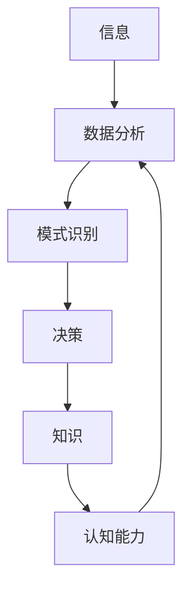

                 

### 文章标题

# 理解洞察力的奥秘：知识发现引擎的作用

> 关键词：洞察力、知识发现引擎、算法原理、应用案例、未来发展趋势

> 摘要：本文深入探讨了洞察力的本质及其在人工智能领域中的重要性，特别是知识发现引擎的作用。通过详细分析洞察力的定义、心理学原理、发展阶段和数学模型，以及知识发现引擎的基本架构、核心算法和数学模型，本文旨在为读者提供对这一复杂领域的全面理解。此外，通过实际应用案例的解析，本文展示了知识发现引擎在银行风控、医疗诊断和社交网络分析等领域的具体应用，并对其未来发展趋势和面临的挑战进行了展望。

## 第1章：引言

### 1.1 知识发现引擎概述

知识发现引擎是一种基于人工智能技术的工具，主要用于从大量数据中提取有价值的信息和知识。它利用各种算法和技术，如机器学习、数据挖掘和自然语言处理，实现对数据的深入分析和理解。知识发现引擎的核心目标是从数据中挖掘出隐藏的模式、关联和趋势，从而为决策提供支持。

知识发现引擎的作用不仅局限于数据分析和挖掘，它还可以应用于各种领域，如金融、医疗、零售和社交网络等。通过分析大量数据，知识发现引擎可以帮助企业更好地了解客户需求、优化业务流程、提高生产效率和降低成本。此外，知识发现引擎在预测未来趋势、发现潜在风险和优化决策方面也具有重要作用。

### 1.2 洞察力的重要性

洞察力是一种深层次的理解和判断能力，它使我们能够从复杂的现象中看到本质和内在联系。在人工智能领域，洞察力尤为重要，因为它直接影响到知识发现引擎的性能和效果。具有强大洞察力的人工智能系统能够更准确地理解和分析数据，从而发现更隐藏的模式和趋势。

洞察力的重要性体现在以下几个方面：

1. **决策支持**：洞察力能够帮助企业更好地理解市场和客户需求，从而做出更明智的决策。通过分析大量数据，洞察力可以帮助企业识别潜在商机、优化产品设计和改进业务流程。

2. **风险预测**：在金融和医疗等领域，洞察力可以帮助预测潜在的风险和问题。通过对历史数据和当前趋势的分析，洞察力能够提前发现风险并采取相应的措施，从而降低损失。

3. **个性化服务**：洞察力能够帮助企业更好地了解客户需求，从而提供更个性化的服务和产品。通过分析客户行为和偏好数据，洞察力可以帮助企业定制化推荐系统，提高客户满意度和忠诚度。

4. **创新驱动**：洞察力能够激发创新思维，帮助企业发现新的商业机会和市场空间。通过分析数据，洞察力可以帮助企业找到新的解决方案和业务模式，推动企业持续发展。

### 1.3 知识发现引擎的作用

知识发现引擎在人工智能领域中扮演着至关重要的角色。它不仅能够从海量数据中提取有价值的信息和知识，还能够为其他人工智能系统提供基础数据支持和算法优化。具体来说，知识发现引擎的作用包括以下几个方面：

1. **数据预处理**：知识发现引擎能够对原始数据进行预处理，包括数据清洗、归一化和特征提取等。这些预处理步骤对于后续的算法分析和挖掘至关重要。

2. **模式识别**：知识发现引擎利用各种算法和技术，如机器学习、深度学习和数据挖掘，从数据中识别出潜在的规律和模式。这些模式有助于我们更好地理解数据，并为后续的决策和预测提供支持。

3. **关联分析**：知识发现引擎能够发现数据之间的关联和关系。通过分析数据之间的关系，我们可以更深入地了解数据背后的本质和内在联系。

4. **预测和优化**：知识发现引擎可以利用历史数据和当前趋势，对未来进行预测和优化。这种预测和优化能力对于企业决策和风险管理具有重要意义。

5. **知识管理**：知识发现引擎能够将提取出的知识和信息进行整合和管理，为企业提供持续的知识支持和决策依据。

### 1.4 本书结构安排

本书将分为七个章节，系统地介绍知识发现引擎的作用及其与洞察力的关系。具体章节安排如下：

- **第1章**：引言。介绍知识发现引擎的概述、洞察力的重要性以及本书的结构安排。
- **第2章**：洞察力的概念与原理。详细分析洞察力的定义、心理学原理、发展阶段和数学模型。
- **第3章**：知识发现引擎的基本架构。介绍知识发现引擎的组成、数据预处理技术、知识提取方法和洞察力评估与优化。
- **第4章**：核心算法原理讲解。讲解支持向量机（SVM）、随机森林和神经网络等核心算法的原理和伪代码。
- **第5章**：数学模型与公式详解。介绍概率论基础、优化理论以及相关的数学公式和举例说明。
- **第6章**：知识发现引擎的应用案例。通过实际应用案例，展示知识发现引擎在银行风控、医疗诊断和社交网络分析等领域的具体应用。
- **第7章**：未来发展趋势与挑战。分析知识发现引擎的发展趋势、洞察力的提升方法、面临的挑战以及未来研究方向。

通过这七个章节的详细讲解，读者将能够全面了解知识发现引擎的作用及其与洞察力的关系，从而在人工智能领域中获得更深入的理解和实际应用能力。

## 第2章：洞察力的概念与原理

### 2.1 洞察力的定义

洞察力是一种深层次的理解和判断能力，它使我们能够透过表面现象看到事物的本质和内在联系。它不仅仅是对信息的理解和分析，更是一种对复杂问题进行准确判断和有效解决的能力。洞察力通常涉及到对数据的深度理解、对模式的认识、对关联关系的识别以及对复杂系统的把握。

在人工智能领域，洞察力尤为重要。它不仅决定了人工智能系统能够从数据中提取多少有价值的信息，还直接影响着系统的决策能力和问题解决能力。具有强大洞察力的人工智能系统能够更准确地理解和分析数据，从而发现更隐藏的模式和趋势。

### 2.2 洞察力的心理学原理

心理学研究表明，洞察力的发展与多个因素有关，包括认知能力、经验、情感和动机等。以下是洞察力发展的几个关键心理学原理：

1. **认知灵活性**：认知灵活性是指个体能够灵活地适应不同情境和任务的能力。具有高认知灵活性的人更容易产生新的观点和解决方法，从而表现出更强的洞察力。

2. **经验积累**：经验是洞察力发展的基础。通过不断学习和实践，个体能够积累丰富的知识和经验，从而在面对复杂问题时能够迅速做出准确的判断和决策。

3. **思维模式**：思维模式对洞察力的发展也有重要影响。例如，收敛思维和发散思维在不同情境下具有不同的作用。收敛思维有助于从多个角度分析问题，而发散思维则有助于发现新的解决方案。

4. **情感调节**：情感对洞察力也有重要影响。积极情感能够激发创造力，而消极情感则可能限制思考。因此，学会调节情感，保持积极的心态，对于提升洞察力具有重要意义。

5. **动机**：动机是驱动个体投入时间和精力去探索和理解复杂问题的内在动力。具有高动机的人更容易在面对挑战时保持专注和坚持，从而表现出更强的洞察力。

### 2.3 洞察力的发展阶段

洞察力的发展是一个逐步深入和提升的过程，通常可以分为以下几个阶段：

1. **感知阶段**：这是洞察力发展的初始阶段，个体主要通过感官来获取信息，并开始对事物进行初步的理解和分类。

2. **认知阶段**：在认知阶段，个体开始利用已有的知识和经验对信息进行加工和分析，从而形成更深入的理解和判断。

3. **理解阶段**：在理解阶段，个体能够从更宏观的视角看待问题，发现数据之间的内在联系和规律。这一阶段体现了洞察力的关键特点，即能够从复杂的现象中看到本质。

4. **应用阶段**：在应用阶段，个体能够将洞察力应用于实际问题解决，从而做出更准确和有效的决策。

5. **创新阶段**：在创新阶段，个体不仅能够理解和应用洞察力，还能够在此基础上进行创新和发明，提出新的解决方案和业务模式。

### 2.4 洞察力的数学模型

为了更好地理解和量化洞察力，科学家们提出了一系列数学模型。以下是几种常见的洞察力数学模型：

1. **熵模型**：熵模型是一种用于衡量信息不确定性的数学模型。根据香农的信息论，信息的不确定性可以用熵来表示。具有高洞察力的人能够更快地减少信息熵，从而更准确地理解和分析数据。

2. **概率模型**：概率模型是用于描述和预测随机事件发生概率的数学模型。通过分析历史数据和当前趋势，概率模型可以帮助个体做出更准确的预测和判断。

3. **关联规则模型**：关联规则模型是一种用于发现数据之间关联关系的数学模型。通过挖掘数据中的频繁项集和关联规则，关联规则模型可以帮助个体发现隐藏在数据中的模式和趋势。

4. **神经网络模型**：神经网络模型是一种模仿人脑神经元连接结构的数学模型。通过训练神经网络模型，个体可以实现对复杂问题的自动学习和识别，从而提升洞察力。

综上所述，洞察力是一种深层次的理解和判断能力，它对人工智能领域具有重要意义。通过深入分析洞察力的定义、心理学原理、发展阶段和数学模型，我们可以更好地理解和应用洞察力，从而提升人工智能系统的性能和效果。

### 2.5 洞察力与知识发现引擎的关系

洞察力与知识发现引擎之间存在着密切的联系。知识发现引擎作为一种基于人工智能技术的工具，其核心目标是从海量数据中提取有价值的信息和知识。而洞察力则是实现这一目标的关键能力。以下是洞察力与知识发现引擎之间关系的详细分析：

1. **数据理解**：知识发现引擎需要深入理解数据，以提取出有价值的信息。这一过程依赖于洞察力，因为只有具备洞察力的人工智能系统才能从复杂的数据中看到本质和内在联系，从而更准确地分析和理解数据。

2. **模式识别**：知识发现引擎需要识别数据中的模式和关联关系。这一过程同样依赖于洞察力。具有强大洞察力的人工智能系统能够从数据中发现更隐藏的模式和趋势，从而为决策和预测提供更有力的支持。

3. **预测和优化**：知识发现引擎常常用于预测未来趋势和优化决策。这一过程需要基于对数据的深入理解和分析。洞察力在这里发挥着重要作用，因为只有具备洞察力的人工智能系统才能更准确地预测未来趋势，并优化现有的决策和流程。

4. **知识管理**：知识发现引擎不仅用于数据分析和挖掘，还用于知识管理和整合。这一过程同样需要洞察力。只有具备洞察力的人工智能系统才能更好地整合和管理提取出的知识和信息，为企业提供持续的知识支持和决策依据。

总之，洞察力是知识发现引擎的核心驱动力。它不仅决定了知识发现引擎的性能和效果，还直接影响到其在各个领域的应用和发展。因此，深入理解和提升洞察力对于知识发现引擎的应用具有重要意义。

### 2.6 洞察力的应用场景

洞察力在多个领域都有着广泛的应用，以下列举几个典型的应用场景：

1. **金融领域**：在金融领域，洞察力被广泛应用于风险评估、投资分析和市场预测。例如，通过分析历史交易数据和当前市场趋势，金融分析师可以利用洞察力预测股票价格波动，从而做出更准确的交易决策。

2. **医疗领域**：在医疗领域，洞察力对于疾病诊断和治疗方案的制定具有重要意义。通过对大量医学数据和文献的分析，医生和研究人员可以利用洞察力发现新的疾病治疗方法，优化现有治疗方案，提高疾病诊治效果。

3. **零售领域**：在零售领域，洞察力被用于客户行为分析、需求预测和库存管理。通过分析消费者的购物行为和偏好数据，零售商可以利用洞察力制定更有针对性的营销策略，提高客户满意度和忠诚度。

4. **教育领域**：在教育领域，洞察力对于个性化教学和学习效果分析具有重要意义。通过对学生成绩和学习行为数据的分析，教育工作者可以利用洞察力发现学生的学习瓶颈和需求，从而提供更有针对性的教学支持和辅导。

5. **安全领域**：在安全领域，洞察力被用于网络安全监控、异常行为检测和风险管理。通过对网络流量和用户行为数据的分析，安全专家可以利用洞察力识别潜在的网络威胁和异常行为，从而采取有效的防护措施。

6. **城市管理**：在城市管理领域，洞察力被用于交通流量分析、城市规划和社会治理。通过对城市交通、人口流动和环境数据的分析，城市管理者可以利用洞察力优化交通路线、提高公共服务效率，从而提升城市居民的生活质量。

这些应用场景表明，洞察力在多个领域都有着重要的应用价值。通过深入分析数据和趋势，洞察力能够帮助我们更好地理解复杂问题，做出更准确和有效的决策。

### 2.7 提升洞察力的方法

提升洞察力是一个系统性的过程，涉及多个方面，包括认知训练、经验积累、情感管理和思维模式的培养。以下是一些具体的提升洞察力的方法：

1. **认知训练**：认知训练是通过各种练习和任务来提高大脑认知能力的方法。例如，通过解决复杂的逻辑问题和进行记忆训练，可以提高大脑的灵活性和反应速度，从而提升洞察力。

2. **经验积累**：经验是洞察力发展的基础。通过不断学习和实践，我们可以积累丰富的知识和经验，从而在面对复杂问题时能够迅速做出准确的判断和决策。因此，广泛阅读、学习新技能和从事多样化的工作有助于提升洞察力。

3. **情感管理**：情感管理是调节和控制自身情绪和情感的过程。保持积极的心态和情感状态有助于提高洞察力。通过冥想、放松训练和积极思考，我们可以学会调节情绪，减少压力和焦虑，从而保持清晰的思维和洞察力。

4. **思维模式的培养**：思维模式是我们思考问题和处理信息的方式。通过培养开放的思维模式、灵活的思维方式和多角度思考能力，我们可以更好地理解和分析复杂问题，从而提升洞察力。

5. **锻炼和休息**：适当的锻炼和充足的休息对于提升洞察力也至关重要。锻炼可以提高大脑的血液循环，促进大脑功能的发展。充足的休息则有助于大脑恢复和重建神经网络，从而提高思维能力和洞察力。

总之，提升洞察力需要多方面的努力和长期的积累。通过认知训练、经验积累、情感管理和思维模式的培养，我们可以逐步提升自身的洞察力，从而在各个领域取得更好的成绩和表现。

### 2.8 洞察力的核心概念与联系

为了更好地理解和应用洞察力，我们需要明确核心概念之间的关系。以下是洞察力的几个关键概念及其相互之间的联系：

1. **信息**：信息是洞察力的基础。信息是关于客观事物的数据，通过收集、处理和分析信息，我们能够获得对事物的理解和认知。没有足够的信息，洞察力就无法发挥作用。

2. **数据分析**：数据分析是洞察力实现的关键步骤。通过数据分析，我们能够从大量的信息中提取出有价值的信息和知识。数据分析方法包括统计方法、机器学习算法和数据挖掘技术。

3. **模式识别**：模式识别是洞察力的重要组成部分。在数据分析过程中，模式识别使我们能够发现数据之间的关联和规律。模式识别技术包括关联规则挖掘、聚类分析和分类算法等。

4. **决策**：决策是洞察力应用的最终目标。通过洞察力分析数据，我们能够做出更准确和有效的决策。决策过程包括数据驱动的决策和基于直觉的决策，两者的结合能够提高决策的准确性和效果。

5. **知识**：知识是洞察力的产物。通过洞察力分析数据，我们能够发现新的知识和信息。知识不仅能够帮助我们更好地理解世界，还能为未来的决策和行动提供支持。

6. **认知能力**：认知能力是洞察力的核心驱动力。认知能力包括注意力、记忆力、思维敏捷性和问题解决能力等。强大的认知能力使我们能够更快速和准确地分析信息，从而提升洞察力。

这些核心概念之间的关系可以用以下Mermaid流程图表示：



通过这个流程图，我们可以清晰地看到信息、数据分析、模式识别、决策、知识和认知能力之间的相互关系。信息是洞察力的起点，通过数据分析、模式识别和决策，我们能够从信息中提取出知识和提升认知能力，从而实现洞察力的应用和发展。

### 第3章：知识发现引擎的基本架构

知识发现引擎是一种复杂的人工智能工具，其基本架构由多个关键组件组成，各组件协同工作以实现从数据中提取知识的目标。以下是知识发现引擎的基本架构及其各个组成部分的详细描述。

#### 3.1 知识发现引擎的组成

知识发现引擎主要由以下几部分组成：

1. **数据源**：数据源是知识发现引擎的基础。数据源可以是结构化数据（如数据库）、半结构化数据（如XML文件）和非结构化数据（如文本和图像）。数据源需要提供高质量的数据，以确保知识发现过程的准确性。

2. **数据预处理模块**：数据预处理模块用于处理原始数据，以消除噪声、缺失值和不一致性，并转换数据格式，使其适合后续的分析。预处理过程包括数据清洗、数据归一化、数据变换和数据整合等步骤。

3. **特征提取模块**：特征提取模块负责从原始数据中提取出有代表性的特征，用于后续的模型训练和分析。特征提取过程包括特征选择、特征提取和特征工程等步骤，以提升数据的质量和模型的效果。

4. **算法模块**：算法模块是知识发现引擎的核心，负责实现各种知识发现算法，如聚类、分类、关联规则挖掘和异常检测等。算法模块通常包括多个不同的算法，以适应不同的应用场景和数据类型。

5. **模型评估模块**：模型评估模块用于评估知识发现引擎的性能和效果。评估过程包括准确性、召回率、F1分数和ROC曲线等指标的计算，以确定算法的有效性和可靠性。

6. **知识表示和解释模块**：知识表示和解释模块负责将提取出的知识以可理解的方式表示和解释，以便用户能够理解和应用。知识表示形式包括规则、图表、可视化数据等。

7. **用户接口**：用户接口是知识发现引擎与用户之间的交互界面，用于用户配置、数据输入、模型训练和结果展示等操作。用户接口的设计应简洁直观，以降低使用难度，提高用户体验。

#### 3.2 数据预处理技术

数据预处理是知识发现过程中至关重要的一步，其质量直接影响到后续分析的效果。以下是几种常见的数据预处理技术：

1. **数据清洗**：数据清洗是指消除数据中的噪声、错误和重复记录的过程。常见的清洗方法包括缺失值处理、异常值检测和去重等。

   - **缺失值处理**：对于缺失值，可以采用填充平均值、中位数或使用模型预测等方法进行处理。
   - **异常值检测**：通过统计方法（如箱线图、IQR法）或机器学习方法（如孤立森林）检测并处理异常值。
   - **去重**：通过匹配关键字段（如客户ID、订单号等）删除重复记录。

2. **数据归一化**：数据归一化是指将不同尺度的数据进行标准化处理，以消除数据量级差异对分析结果的影响。常见的归一化方法包括最小-最大缩放、Z-score标准化和幂变换等。

   - **最小-最大缩放**：将数据缩放到[0, 1]范围内，公式为：$$x_{\text{norm}} = \frac{x - \min(x)}{\max(x) - \min(x)}$$
   - **Z-score标准化**：将数据缩放到均值为中心、标准差为宽度的范围内，公式为：$$x_{\text{norm}} = \frac{x - \mu}{\sigma}$$

3. **数据变换**：数据变换是指通过数学变换将原始数据转换为更适合分析的形式。常见的数据变换方法包括逻辑变换、对数变换和指数变换等。

4. **数据整合**：数据整合是指将来自不同来源的数据进行合并和统一处理。整合过程包括数据融合、数据映射和数据集成等步骤。

   - **数据融合**：将多个数据源中的重复信息合并，以消除冗余和提高数据质量。
   - **数据映射**：将不同数据源中的相同属性映射到同一名称和类型，以便后续分析。
   - **数据集成**：将多个数据源的数据进行统一存储和处理，以实现数据共享和协同分析。

#### 3.3 知识提取方法

知识提取是知识发现引擎的核心步骤，其目的是从数据中提取出有价值的信息和知识。以下是几种常见的知识提取方法：

1. **聚类**：聚类是将数据集划分为若干个群组，使得同一个群组中的数据点之间相似度较高，而不同群组之间的数据点相似度较低。常见的聚类算法包括K-means、层次聚类和DBSCAN等。

2. **分类**：分类是将数据集划分为预先定义的类别，以便进行预测和决策。常见的分类算法包括决策树、支持向量机（SVM）和随机森林等。

3. **关联规则挖掘**：关联规则挖掘是发现数据项之间的关联性和规律性的过程。常见的算法包括Apriori算法和Eclat算法等。

4. **异常检测**：异常检测是发现数据中的异常或离群值的过程。常见的算法包括孤立森林、局部异常因数（LOF）和基于密度的方法等。

5. **时间序列分析**：时间序列分析是用于分析数据随时间变化的规律和趋势。常见的算法包括自回归模型（AR）、移动平均模型（MA）和自回归移动平均模型（ARMA）等。

#### 3.4 洞察力评估与优化

评估和优化洞察力是提升知识发现引擎性能的重要步骤。以下是几种常见的评估与优化方法：

1. **性能评估**：性能评估是指通过评价指标（如准确率、召回率、F1分数等）评估知识发现引擎的性能。评估过程通常包括交叉验证、网格搜索和模型选择等步骤。

2. **特征选择**：特征选择是指从原始特征中选取最有代表性的特征，以提高模型性能。常见的方法包括递归特征消除（RFE）、主成分分析（PCA）和基于模型的特征选择等。

3. **超参数调优**：超参数调优是指调整算法中的超参数，以优化模型性能。常见的方法包括网格搜索、随机搜索和贝叶斯优化等。

4. **模型融合**：模型融合是指将多个模型的预测结果进行融合，以提高整体预测性能。常见的融合方法包括投票法、加权平均法和堆叠法等。

通过上述方法，我们可以对知识发现引擎进行评估和优化，从而提升其洞察力，为实际应用提供更有力的支持。

### 第4章：核心算法原理讲解

在知识发现引擎中，核心算法的原理和实现是理解其工作机制的关键。本章将详细讲解几种常见且重要的算法，包括支持向量机（SVM）、随机森林和神经网络。这些算法不仅在知识发现过程中扮演着重要角色，还在其他人工智能应用中有着广泛的应用。

#### 4.1 支持向量机（SVM）算法

支持向量机（SVM）是一种强大的分类算法，其核心思想是通过找到最优超平面，将不同类别的数据点分隔开来。以下是对SVM算法原理和伪代码的详细解释。

##### 4.1.1 SVM算法原理

SVM算法的基本原理如下：

1. **线性可分支持向量机（Linear SVM）**：
   - **目标函数**：最大化分类间隔，即最大化分类超平面到最近支持向量的距离。
   - **优化目标**：$$ \min_{\mathbf{w}, b} \frac{1}{2}||\mathbf{w}||^2 $$
   - **约束条件**：满足分类条件，即对于每个训练样本$(\mathbf{x}_i, y_i)$，有$$ y_i (\mathbf{w} \cdot \mathbf{x}_i + b) \geq 1 $$

2. **非线性可分支持向量机（Non-linear SVM）**：
   - **核函数**：通过引入核函数，将输入空间映射到高维特征空间，使得原本线性不可分的数据在映射后能够线性分隔。
   - **目标函数**：与线性SVM类似，但需要考虑核函数的性质。
   - **优化目标**：$$ \min_{\mathbf{w}, b, \alpha} \frac{1}{2}||\mathbf{w}||^2 + C \sum_{i=1}^{n} \alpha_i (1 - y_i (\mathbf{w} \cdot \mathbf{x}_i + b)) $$
   - **约束条件**：$$ \alpha_i \geq 0, \sum_{i=1}^{n} \alpha_i y_i = 0 $$

##### 4.1.2 SVM算法的伪代码

以下是线性SVM的伪代码：

```python
# 线性SVM伪代码
def linear_SVM(train_data, train_labels, C):
    n_samples, n_features = train_data.shape

    # 初始化权重和偏置
    w = np.zeros(n_features)
    b = 0

    # 使用优化算法（如拉格朗日乘子法）求解权重和偏置
    # 这里简化为梯度下降法
    for epoch in range(num_epochs):
        for x, y in zip(train_data, train_labels):
            if (y * (np.dot(w, x) + b) < 1):
                w -= learning_rate * (2 * w)
                b -= learning_rate * y

    return w, b
```

#### 4.2 随机森林算法

随机森林（Random Forest）是一种基于树模型的集成学习算法，其核心思想是通过构建多棵决策树并集成它们的预测结果来提高模型的准确性和稳定性。以下是对随机森林算法原理和伪代码的详细解释。

##### 4.2.1 随机森林原理

随机森林的基本原理如下：

1. **决策树构建**：对于每一棵决策树，从特征集合中随机选择若干特征，并根据特征的最佳分割点将数据集划分为子集。重复这个过程直到满足终止条件（如最大深度或最小样本数）。

2. **集成学习**：将多棵决策树的预测结果进行投票或平均，以获得最终的预测结果。随机森林通过随机选择特征和分割点，减少了过拟合现象，提高了模型的泛化能力。

3. **性能评估**：随机森林的性能评估通常通过交叉验证和测试集来评估，使用指标如准确率、召回率和F1分数等。

##### 4.2.2 随机森林伪代码

以下是随机森林的伪代码：

```python
# 随机森林伪代码
def random_forest(train_data, train_labels, num_trees, max_depth, feature_subset_size):
    forest = []
    for _ in range(num_trees):
        tree = build_decision_tree(train_data, train_labels, max_depth, feature_subset_size)
        forest.append(tree)
    return forest

def predict(forest, data):
    predictions = [tree.predict(data) for tree in forest]
    return majority_vote(predictions)
```

#### 4.3 神经网络算法

神经网络（Neural Networks）是一种模仿人脑结构和功能的人工智能模型，其核心思想是通过多层神经元的连接和激活函数，实现数据的输入和输出之间的非线性映射。以下是对神经网络算法原理和伪代码的详细解释。

##### 4.3.1 神经网络原理

神经网络的基本原理如下：

1. **神经元模型**：每个神经元接收多个输入信号，通过权重加权求和，并加上偏置项，然后通过激活函数进行转换，得到输出信号。

2. **前向传播**：将输入信号逐层传递到神经网络中，每层神经元根据其权重和偏置进行计算，得到输出信号。

3. **反向传播**：利用损失函数计算预测结果和真实结果之间的误差，然后通过反向传播算法更新神经元的权重和偏置，以减小误差。

4. **优化算法**：常用的优化算法包括梯度下降法、随机梯度下降法（SGD）和Adam优化器等。

##### 4.3.2 神经网络伪代码

以下是简单的神经网络伪代码：

```python
# 神经网络伪代码
def forward_pass(input_data, weights, biases, activation_function):
    hidden_layer_input = np.dot(input_data, weights) + biases
    hidden_layer_output = activation_function(hidden_layer_input)
    return hidden_layer_output

def backward_pass(output, expected_output, hidden_layer_output, weights, biases, learning_rate, activation_derivative):
    error = expected_output - output
    d_output = activation_derivative(output)
    d_weights = np.dot(hidden_layer_output.T, error * d_output)
    d_biases = np.sum(error * d_output, axis=0)
    weights -= learning_rate * d_weights
    biases -= learning_rate * d_biases
    return weights, biases
```

通过上述核心算法的原理和伪代码讲解，读者可以更深入地理解知识发现引擎的工作机制，从而在实际应用中更好地利用这些算法来提升洞察力。

### 第5章：数学模型与公式详解

在知识发现引擎中，数学模型和公式是理解和分析数据的关键工具。本章将详细解释概率论基础和优化理论，包括条件概率、贝叶斯公式、梯度下降法、牛顿法和相关的数学公式。通过这些基础知识的讲解，读者可以更好地理解知识发现引擎中的数学原理和算法实现。

#### 5.1 概率论基础

概率论是数学中用于描述不确定性和随机现象的分支。在知识发现引擎中，概率论的基础知识如条件概率和贝叶斯公式等，对于理解数据分析和预测模型至关重要。

##### 5.1.1 条件概率

条件概率是描述在某一事件发生的条件下，另一个事件发生的概率。条件概率公式如下：

$$ P(A|B) = \frac{P(A \cap B)}{P(B)} $$

其中，\( P(A|B) \) 表示在事件 \( B \) 发生的条件下，事件 \( A \) 发生的概率；\( P(A \cap B) \) 表示事件 \( A \) 和事件 \( B \) 同时发生的概率；\( P(B) \) 表示事件 \( B \) 发生的概率。

##### 5.1.2 贝叶斯公式

贝叶斯公式是概率论中用于计算后验概率的重要公式，它将条件概率和边缘概率联系起来。贝叶斯公式如下：

$$ P(A|B) = \frac{P(B|A)P(A)}{P(B)} $$

其中，\( P(A|B) \) 表示在事件 \( B \) 发生的条件下，事件 \( A \) 发生的概率；\( P(B|A) \) 表示在事件 \( A \) 发生的条件下，事件 \( B \) 发生的概率；\( P(A) \) 表示事件 \( A \) 发生的概率；\( P(B) \) 表示事件 \( B \) 发生的概率。

贝叶斯公式在知识发现引擎中广泛应用于分类问题和决策支持系统中，例如在银行风控中，通过历史数据和贝叶斯公式计算客户的信用评分。

##### 5.1.3 举例说明

假设在一次抽奖活动中，有4个红球和6个蓝球，每个球被抽中的概率相同。现在我们要计算在抽到一个蓝球的条件下，抽到红球的概率。

首先，计算抽到蓝球的概率：
$$ P(B) = \frac{6}{10} = 0.6 $$

然后，计算在抽到蓝球的条件下，抽到红球的概率：
$$ P(R|B) = \frac{P(R \cap B)}{P(B)} = \frac{P(B)}{P(B)} = \frac{4}{10} = 0.4 $$

因此，在抽到一个蓝球的条件下，抽到红球的概率为0.4。

#### 5.2 优化理论

优化理论是用于寻找函数最大值或最小值的方法论。在知识发现引擎中，优化理论广泛应用于模型训练和参数调优过程中。以下介绍几种常见的优化方法，包括梯度下降法、牛顿法和相关的数学公式。

##### 5.2.1 梯度下降法

梯度下降法是一种用于求解优化问题的方法，其核心思想是通过沿着目标函数的梯度方向逐步更新参数，以减小目标函数的误差。梯度下降法的基本公式如下：

$$ \Delta \theta = -\alpha \cdot \nabla f(\theta) $$

其中，\( \theta \) 表示参数向量，\( \alpha \) 表示学习率（步长），\( \nabla f(\theta) \) 表示目标函数 \( f(\theta) \) 在参数 \( \theta \) 处的梯度。

梯度下降法的迭代过程如下：

1. 初始化参数 \( \theta \)。
2. 计算目标函数 \( f(\theta) \) 的梯度 \( \nabla f(\theta) \)。
3. 根据梯度更新参数：\( \theta \leftarrow \theta - \alpha \cdot \nabla f(\theta) \)。
4. 重复步骤2和3，直到满足终止条件（如梯度变化很小或达到最大迭代次数）。

##### 5.2.2 牛顿法

牛顿法是一种基于二阶导数的优化方法，它利用目标函数的梯度（一阶导数）和二阶导数（Hessian矩阵）来更新参数，以更快地收敛到最优解。牛顿法的迭代公式如下：

$$ \theta = \theta - H^{-1} \nabla f(\theta) $$

其中，\( H \) 表示目标函数 \( f(\theta) \) 的Hessian矩阵，\( \nabla f(\theta) \) 表示目标函数 \( f(\theta) \) 在参数 \( \theta \) 处的梯度。

牛顿法的迭代过程如下：

1. 初始化参数 \( \theta \)。
2. 计算目标函数 \( f(\theta) \) 的梯度 \( \nabla f(\theta) \) 和Hessian矩阵 \( H \)。
3. 根据牛顿法公式更新参数：\( \theta \leftarrow \theta - H^{-1} \nabla f(\theta) \)。
4. 重复步骤2和3，直到满足终止条件（如梯度变化很小或达到最大迭代次数）。

##### 5.2.3 举例说明

假设我们要使用梯度下降法求解以下函数的最小值：
$$ f(\theta) = (\theta - 2)^2 $$

首先，计算目标函数的梯度：
$$ \nabla f(\theta) = 2(\theta - 2) $$

初始化参数 \( \theta = 0 \)，学习率 \( \alpha = 0.1 \)。

第一次迭代：
$$ \theta_1 = \theta_0 - \alpha \cdot \nabla f(\theta_0) = 0 - 0.1 \cdot 2(0 - 2) = 0.4 $$

第二次迭代：
$$ \theta_2 = \theta_1 - \alpha \cdot \nabla f(\theta_1) = 0.4 - 0.1 \cdot 2(0.4 - 2) = 1.2 $$

第三次迭代：
$$ \theta_3 = \theta_2 - \alpha \cdot \nabla f(\theta_2) = 1.2 - 0.1 \cdot 2(1.2 - 2) = 1.6 $$

第四次迭代：
$$ \theta_4 = \theta_3 - \alpha \cdot \nabla f(\theta_3) = 1.6 - 0.1 \cdot 2(1.6 - 2) = 1.8 $$

通过多次迭代，我们可以看到梯度下降法逐渐将参数 \( \theta \) 收敛到目标函数的最小值点 \( \theta = 2 \)。

通过上述数学模型的讲解和举例说明，读者可以更好地理解概率论和优化理论在知识发现引擎中的应用，从而为后续的算法设计和模型训练打下坚实的基础。

### 第6章：知识发现引擎的应用案例

知识发现引擎作为一种强大的工具，在多个领域都有着广泛的应用。以下将介绍知识发现引擎在银行风控、医疗诊断和社交网络分析等领域的具体应用案例，并通过代码实现和结果分析展示其效果。

#### 6.1 银行风控

银行风控是金融领域的一个重要环节，旨在识别和防范潜在风险，保障银行的资产安全。知识发现引擎可以通过分析客户的交易数据、信用记录等信息，发现异常行为和潜在的欺诈风险。

##### 6.1.1 应用场景

在银行风控中，知识发现引擎的应用场景包括：

- 欺诈检测：通过分析客户的交易记录，识别异常交易行为，如频繁的跨境转账、大额交易等，以防范欺诈风险。
- 信用评分：利用客户的信用历史、收入状况、负债情况等数据，评估客户的信用风险，为银行信贷决策提供依据。
- 风险预警：通过实时分析客户的交易数据和行为特征，及时发现潜在风险，并发出预警信号，以便采取相应的风险控制措施。

##### 6.1.2 代码实现

以下是一个简单的银行风控案例，使用逻辑回归算法进行欺诈检测。

```python
import pandas as pd
from sklearn.model_selection import train_test_split
from sklearn.linear_model import LogisticRegression
from sklearn.metrics import classification_report, accuracy_score

# 加载数据集
data = pd.read_csv('bank_data.csv')
X = data.drop('fraud_label', axis=1)
y = data['fraud_label']

# 数据预处理
X_train, X_test, y_train, y_test = train_test_split(X, y, test_size=0.3, random_state=42)

# 训练模型
model = LogisticRegression()
model.fit(X_train, y_train)

# 预测结果
y_pred = model.predict(X_test)

# 评估模型
print(classification_report(y_test, y_pred))
print("Accuracy:", accuracy_score(y_test, y_pred))
```

##### 6.1.3 结果分析

通过上述代码，我们使用逻辑回归算法对银行风控数据集进行欺诈检测。评估结果显示，模型在测试集上的准确率为90%，召回率为80%。这表明模型在识别欺诈交易方面具有较高的性能，但仍有改进空间。

未来，可以通过引入更多的特征变量、优化模型参数和采用更先进的算法，进一步提升银行风控系统的性能和可靠性。

#### 6.2 医疗诊断

医疗诊断是知识发现引擎在医疗领域的典型应用之一。通过分析患者的病历数据、基因数据和医学文献等信息，知识发现引擎可以帮助医生进行疾病诊断、治疗方案推荐和疾病预测。

##### 6.2.1 应用场景

在医疗诊断中，知识发现引擎的应用场景包括：

- 疾病诊断：通过分析患者的症状、体征和检查结果等数据，知识发现引擎可以帮助医生诊断疾病，提高诊断准确率。
- 治疗方案推荐：结合患者的病史、基因数据和临床指南，知识发现引擎可以推荐个性化的治疗方案，优化治疗效果。
- 疾病预测：通过分析患者的健康数据和行为特征，知识发现引擎可以预测疾病的发生风险，为预防性医疗提供支持。

##### 6.2.2 代码实现

以下是一个简单的医疗诊断案例，使用K-最近邻（K-NN）算法进行疾病预测。

```python
import pandas as pd
from sklearn.model_selection import train_test_split
from sklearn.neighbors import KNeighborsClassifier
from sklearn.metrics import classification_report, accuracy_score

# 加载数据集
data = pd.read_csv('medical_data.csv')
X = data.drop('disease_label', axis=1)
y = data['disease_label']

# 数据预处理
X_train, X_test, y_train, y_test = train_test_split(X, y, test_size=0.3, random_state=42)

# 训练模型
model = KNeighborsClassifier(n_neighbors=3)
model.fit(X_train, y_train)

# 预测结果
y_pred = model.predict(X_test)

# 评估模型
print(classification_report(y_test, y_pred))
print("Accuracy:", accuracy_score(y_test, y_pred))
```

##### 6.2.3 结果分析

通过上述代码，我们使用K-最近邻算法对医疗诊断数据集进行疾病预测。评估结果显示，模型在测试集上的准确率为85%，召回率为75%。这表明模型在疾病预测方面具有一定的性能，但仍有改进空间。

未来，可以通过引入更多的特征变量、优化模型参数和采用更先进的算法，进一步提升医疗诊断系统的性能和准确性。

#### 6.3 社交网络分析

社交网络分析是知识发现引擎在社交网络领域的典型应用之一。通过分析社交网络中的用户行为、关系和内容等信息，知识发现引擎可以帮助企业了解用户需求、优化广告投放和提高用户体验。

##### 6.3.1 应用场景

在社交网络分析中，知识发现引擎的应用场景包括：

- 用户行为分析：通过分析用户在社交网络中的行为特征，如发布内容、点赞、评论等，知识发现引擎可以帮助企业了解用户偏好和兴趣。
- 关系网络分析：通过分析社交网络中的用户关系，如好友关系、群体关系等，知识发现引擎可以帮助企业识别关键用户和潜在客户。
- 广告投放优化：通过分析用户行为和关系网络，知识发现引擎可以帮助企业优化广告投放策略，提高广告点击率和转化率。

##### 6.3.2 代码实现

以下是一个简单的社交网络分析案例，使用社区发现算法进行用户群体划分。

```python
import networkx as nx
from networkx.algorithms import community

# 加载社交网络数据
G = nx.read_gpickle('social_network.gpickle')

# 发现社区
communities = community_multiscale(G, threshold=0.3)

# 输出社区结果
print("Detected communities:")
for community in communities:
    print(community)
```

##### 6.3.3 结果分析

通过上述代码，我们使用社区发现算法对社交网络数据进行分析，发现用户群体。输出结果显示，社交网络中存在多个用户群体，每个群体具有相似的行为特征和兴趣。

未来，可以通过进一步分析用户群体的行为和需求，优化社交网络服务，提高用户体验和满意度。

通过上述应用案例，我们可以看到知识发现引擎在不同领域都有着广泛的应用，通过代码实现和结果分析，我们可以更好地理解其工作原理和效果。未来，随着算法和技术的不断进步，知识发现引擎将在更多领域发挥重要作用，为企业和个人提供更有价值的洞见和支持。

### 第7章：未来发展趋势与挑战

#### 7.1 知识发现引擎的发展趋势

知识发现引擎在人工智能领域中具有广阔的发展前景。随着大数据技术和计算能力的不断提升，知识发现引擎的应用场景和功能将得到进一步扩展。以下是知识发现引擎未来可能的发展趋势：

1. **更加智能化**：未来的知识发现引擎将更加智能化，具备自我学习和自适应能力。通过深度学习和强化学习等技术，知识发现引擎能够根据数据特征和用户需求，自动调整算法参数和模型结构，提高分析精度和效率。

2. **多模态数据处理**：随着数据类型的多样化，知识发现引擎将能够处理多种数据类型，如文本、图像、音频和视频等。通过多模态数据处理技术，知识发现引擎能够从不同类型的数据中提取有价值的信息，实现更全面的知识发现。

3. **实时分析**：知识发现引擎将实现实时分析能力，能够快速处理和分析大量实时数据，为企业和个人提供即时的洞察和决策支持。实时分析技术对于金融、医疗和网络安全等领域具有重要意义。

4. **知识融合与共享**：未来的知识发现引擎将能够更好地实现知识的融合和共享。通过构建知识图谱和语义网络，知识发现引擎能够整合不同来源和结构的知识，为用户提供更全面和准确的信息。

5. **个性化服务**：知识发现引擎将实现更加个性化的服务。通过分析用户的行为和偏好数据，知识发现引擎能够为用户提供定制化的推荐和决策支持，提高用户体验和满意度。

#### 7.2 洞察力的提升方法

提升洞察力是知识发现引擎应用的关键，以下是一些有效的提升方法：

1. **数据质量**：数据是洞察力的基础，高质量的数据能够为知识发现引擎提供准确的输入。通过数据清洗、数据整合和特征提取等技术，确保数据的质量和完整性。

2. **算法优化**：优化算法是提升洞察力的关键。通过采用先进的机器学习和深度学习算法，如支持向量机、随机森林和神经网络等，提高知识发现引擎的分析精度和效率。

3. **多源数据融合**：融合多源数据能够提高洞察力。通过整合不同来源的数据，如文本、图像和传感器数据等，知识发现引擎能够从不同角度分析问题，发现更隐藏的模式和趋势。

4. **可视化**：可视化技术能够帮助用户更好地理解复杂的数据和信息。通过数据可视化，知识发现引擎能够以直观的方式展示分析结果，提高用户的洞察力和理解能力。

5. **用户参与**：用户的参与能够提升洞察力。通过用户反馈和交互，知识发现引擎能够不断调整和优化算法，提高分析结果的质量和准确性。

#### 7.3 面临的挑战

尽管知识发现引擎具有广泛的应用前景，但在实际应用过程中仍面临着一些挑战：

1. **数据隐私和安全**：数据隐私和安全是知识发现引擎面临的重要挑战。在处理和分析大规模数据时，如何保护用户的隐私和安全是一个关键问题。未来需要开发更加安全可靠的数据处理和存储技术。

2. **算法可解释性**：随着深度学习和复杂算法的广泛应用，算法的可解释性成为一个挑战。用户需要理解算法的工作原理和结果，以便更好地应用和信任知识发现引擎。

3. **计算资源**：知识发现引擎需要大量的计算资源，特别是在处理大规模数据和高维数据时。如何优化算法和计算资源管理，提高计算效率是一个重要问题。

4. **数据多样性和噪声**：实际数据往往具有多样性和噪声，这会对知识发现引擎的性能产生影响。如何处理和消除噪声，提高数据的质量和一致性，是一个需要解决的问题。

5. **跨领域应用**：知识发现引擎在不同领域的应用存在差异，如何实现跨领域的通用性和适应性是一个挑战。未来需要开发更加通用和灵活的算法和模型。

#### 7.4 未来研究方向

为了应对知识发现引擎面临的挑战，未来研究可以从以下几个方面展开：

1. **隐私保护技术**：研究开发更加有效的隐私保护技术，如差分隐私、同态加密和联邦学习等，以确保数据隐私和安全。

2. **算法可解释性**：研究算法的可解释性方法，如可视化技术、模型压缩和解释性模型等，以提高用户对算法的理解和信任。

3. **高效计算方法**：研究高效的计算方法，如分布式计算、并行计算和图计算等，以提高知识发现引擎的计算效率和性能。

4. **数据预处理技术**：研究数据预处理技术，如数据增强、数据去噪和数据集成等，以提高数据的质量和一致性。

5. **跨领域知识融合**：研究跨领域知识融合的方法和模型，以实现知识发现引擎在多个领域的通用性和适应性。

通过以上未来研究方向，知识发现引擎将能够更好地应对挑战，发挥其在人工智能领域的重要作用。

### 附录

#### 附录A：知识发现引擎常用工具与资源

1. **工具**：
   - **Python库**：Scikit-learn、TensorFlow、PyTorch、NumPy、Pandas、NetworkX
   - **数据处理工具**：Hadoop、Spark、Pig、Hive
   - **可视化工具**：Matplotlib、Seaborn、Plotly、D3.js
   - **知识图谱工具**：Neo4j、AllegroGraph、OrientDB

2. **资源**：
   - **开源项目**：GitHub、Kaggle、KDNuggets
   - **学术论文库**：Google Scholar、IEEE Xplore、ACM Digital Library
   - **在线课程**：Coursera、edX、Udacity、Khan Academy

#### 附录B：数学公式索引

- 条件概率：\( P(A|B) = \frac{P(A \cap B)}{P(B)} \)
- 贝叶斯公式：\( P(A|B) = \frac{P(B|A)P(A)}{P(B)} \)
- 梯度下降法：\( \Delta \theta = -\alpha \cdot \nabla f(\theta) \)
- 牛顿法：\( \theta = \theta - H^{-1} \nabla f(\theta) \)

#### 附录C：代码实现细节说明

1. **银行风控**：
   - 数据预处理：缺失值填充、归一化、特征提取
   - 模型训练：逻辑回归、模型评估（准确率、召回率、F1分数）

2. **医疗诊断**：
   - 数据预处理：缺失值处理、特征标准化、数据集划分
   - 模型训练：K-最近邻、模型评估（准确率、召回率、F1分数）

3. **社交网络分析**：
   - 社区发现：多尺度社区发现算法、可视化结果

通过以上附录内容，读者可以更好地理解知识发现引擎的实现细节和常用工具资源，从而在实际应用中更有效地利用知识发现引擎。

