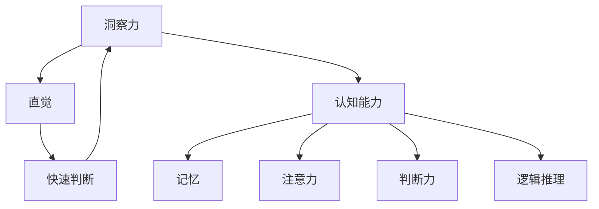
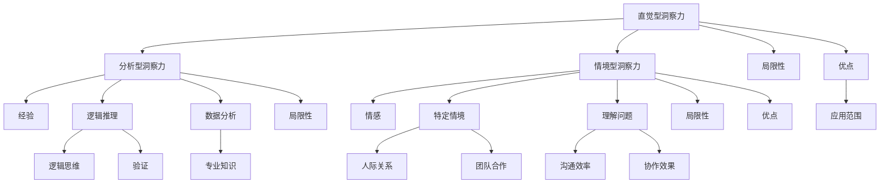
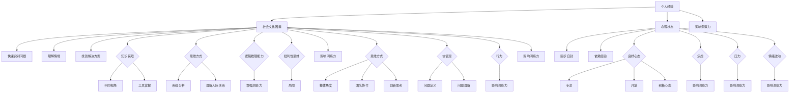
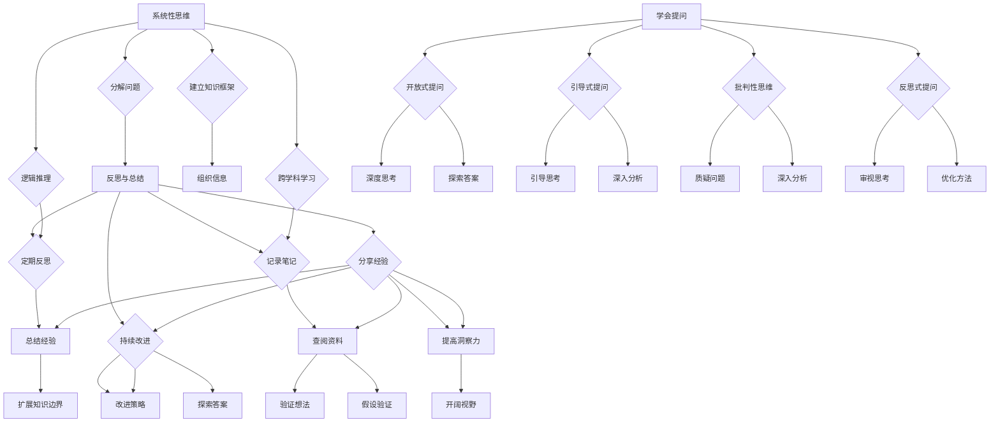
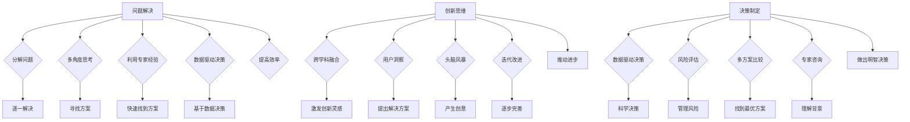
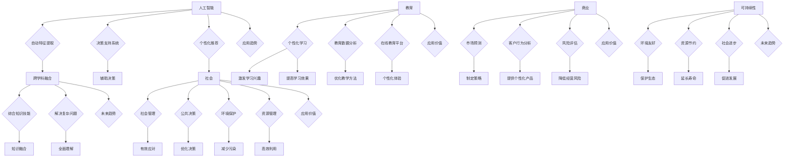

                 


## 理解洞察力的本质：在复杂中寻找秩序

### 关键词

- 洞察力
- 复杂性
- 认知能力
- 机器学习
- 决策制定
- 创新思维

### 摘要

本文旨在深入探讨洞察力的本质，以及如何通过理解复杂性和认知能力，在纷繁复杂的现实世界中找到秩序。我们将通过多个层面和实例来阐述洞察力的重要性，包括其在机器学习、决策制定和创新思维中的应用。文章还将提供一些实用的方法和技巧，帮助读者在日常生活和工作中提升自己的洞察力。

#### 引言

在当今快速发展的科技时代，复杂性无处不在。从大数据到人工智能，从复杂的商业模式到日益多样的社会问题，复杂性已经成为我们日常生活中不可或缺的一部分。在这样的背景下，洞察力作为一种重要的认知能力，变得愈发重要。洞察力不仅帮助我们理解复杂系统，还能在混乱中寻找秩序，从而做出更为明智的决策和创新。

本文将围绕洞察力的本质展开讨论，通过以下章节结构来逐步深入：

1. **洞察力的理论基础**：介绍洞察力的定义、类型及其重要性，以及影响洞察力的各种因素。
2. **洞察力的培养与实践**：探讨如何通过系统性思维、好奇心、提问和反思来提升洞察力，并在实际工作中应用。
3. **洞察力的发展趋势与未来展望**：分析洞察力与人工智能的关系，以及在教育、商业决策和其他领域的发展前景。
4. **实战案例分析**：通过成功企业家的案例，展示如何在实际中运用洞察力。

在接下来的章节中，我们将逐步探讨这些主题，帮助读者更深入地理解洞察力的本质，并在复杂世界中找到秩序。

#### 洞察力的理论基础

### 第1章：洞察力的定义与重要性

#### 1.1 洞察力的定义

洞察力（Insight）通常被描述为一种迅速识别问题本质、发现潜在关联和进行创新思维的能力。它是我们理解复杂系统、处理未知情况、做出明智决策的关键能力。与直觉不同，洞察力不仅依赖于快速的反应，还需要对问题进行深入的分析和思考。

#### 1.2 洞察力的重要性

洞察力在我们的生活中扮演着至关重要的角色。在个人层面，它帮助我们更好地理解自己和他人，做出更明智的决策，提高生活质量。在专业领域，洞察力是成功解决复杂问题、推动创新和提升效率的关键。特别是在信息技术、商业决策和科学研究等领域，洞察力显得尤为重要。

#### 1.3 洞察力与其他认知能力的联系

洞察力并非孤立存在，它与许多其他认知能力密切相关。首先，与直觉（Intuition）紧密相连。直觉提供了快速判断和选择的依据，而洞察力则是对直觉的理解和深入分析。其次，洞察力依赖于我们的认知能力，如记忆、注意力、判断力和逻辑推理。这些认知能力共同作用，帮助我们识别问题、分析数据和提出解决方案。

### Mermaid 流程图



#### 核心算法原理讲解

为了更好地理解洞察力的运作机制，我们可以借助决策树算法来进行分析。决策树算法是一种常见的机器学习算法，它通过一系列规则来划分数据集，从而在给定的特征集上做出决策。

#### 决策树构建过程

1. **选择最优划分标准**：在当前节点上，选择一个最佳的特征作为划分标准，通常使用基尼指数或信息增益作为划分标准。
2. **划分数据集**：根据选定的特征，将数据集划分为若干个子集。
3. **构建子树**：对每个子集递归地执行上述步骤，直到满足停止条件（如达到最大深度、节点数量少于阈值等）。
4. **生成决策树**：将所有的子树合并，形成最终的决策树。

#### 决策树算法伪代码

```python
def build_decision_tree(data, features, max_depth, min_samples_split):
    if (满足停止条件):
        return 叶子节点

    best_feature, best_value = 选择最优划分标准(features, data)
    子树 = []

    for value in best_feature的所有可能值：
        子数据集 = data中的所有样本，其best_feature值为value
        子树.append(build_decision_tree(子数据集, 剩余特征, max_depth - 1, min_samples_split))

    return 决策节点(best_feature, best_value, 子树)
```

#### 数学模型和数学公式讲解

在决策树算法中，常用的数学模型包括基尼指数（Gini Index）和信息增益（Information Gain）。以下是这两个模型的基本概念和计算方法。

#### 基尼指数（Gini Index）

基尼指数是一种用于衡量数据集纯度的指标。纯度越高，基尼指数越低。在决策树中，基尼指数用于评估划分数据集的效果。

$$
Gini = 1 - \sum_{i=1}^{k} \left( \frac{1}{k-1} \right) \left( \frac{1}{N} \right)
$$

其中，$k$ 表示数据集中类别的数量，$N$ 表示样本数量。

#### 信息增益（Information Gain）

信息增益是一种评估特征重要性的指标。它表示通过选择某个特征进行划分，能够减少数据集的不确定性。

$$
Gain(D, A) = Entropy(D) - \sum_{v \in A} \frac{|D_v|}{|D|} Entropy(D_v)
$$

其中，$D$ 表示数据集，$A$ 表示特征集合，$D_v$ 表示特征$A$为某个值$v$的数据子集，$Entropy(D)$ 表示数据集的熵。

#### 详细讲解与举例说明

假设我们有一个数据集，包含100个样本，其中50个样本属于类别A，50个样本属于类别B。我们使用特征X来划分数据集，得到两个子集：X=0的子集包含60个样本，其中30个属于类别A，30个属于类别B；X=1的子集包含40个样本，其中20个属于类别A，20个属于类别B。

首先，我们计算原始数据集的基尼指数：

$$
Gini(D) = 1 - \left( \frac{1}{2} \right) \left( \frac{1}{100} \right) - \left( \frac{1}{2} \right) \left( \frac{1}{100} \right) = 0.5
$$

然后，我们计算两个子集的基尼指数：

$$
Gini(D_0) = 1 - \left( \frac{1}{2} \right) \left( \frac{1}{60} \right) - \left( \frac{1}{2} \right) \left( \frac{1}{60} \right) = 0.5
$$

$$
Gini(D_1) = 1 - \left( \frac{1}{2} \right) \left( \frac{1}{40} \right) - \left( \frac{1}{2} \right) \left( \frac{1}{40} \right) = 0.5
$$

最后，我们计算信息增益：

$$
Gain(D, X) = Gini(D) - \left( \frac{60}{100} \right) Gini(D_0) - \left( \frac{40}{100} \right) Gini(D_1) = 0.5 - 0.5 \times 0.5 - 0.5 \times 0.5 = 0
$$

由于信息增益为0，这意味着特征X对于划分数据集没有贡献。在实际应用中，我们通常会选择信息增益最大的特征作为划分标准。

通过这个简单的例子，我们可以看到基尼指数和信息增益在决策树算法中的应用。这些数学模型帮助我们更好地理解数据集，并在构建决策树时做出更明智的选择。

#### 结论

洞察力的定义与重要性已经在本章中得到阐述。我们了解到，洞察力是一种迅速识别问题本质、发现潜在关联和进行创新思维的能力，它在我们的生活和工作中起着至关重要的作用。同时，通过决策树算法的讲解，我们进一步了解了洞察力在数据处理和决策制定中的具体应用。在下一章中，我们将继续探讨洞察力的类型与表现形式，以及影响洞察力的各种因素。

### 第2章：洞察力的类型与表现形式

#### 2.1 直觉型洞察力

直觉型洞察力是一种基于感性认识和快速判断的洞察力。它通常在不经过深入分析的情况下，迅速识别问题或解决方案的本质。直觉型洞察力在我们的日常生活中非常常见，如购物时瞬间判断商品的质量、在路上瞬间判断交通状况等。

直觉型洞察力往往依赖于个人的经验、知识和情感。它能够帮助我们快速应对突发情况，节省时间和精力。然而，直觉型洞察力也有局限性，因为它往往缺乏充分的分析和验证，容易受到个人偏见和情绪的影响。

#### 2.2 分析型洞察力

分析型洞察力是一种基于逻辑推理、分析和验证的洞察力。它与直觉型洞察力相反，强调通过系统的分析和验证来识别问题或解决方案的本质。分析型洞察力通常应用于复杂的科学问题、技术难题和商业决策中。

分析型洞察力依赖于逻辑思维、数据分析能力和专业知识。它能够帮助我们深入理解复杂问题，发现隐藏的关联和规律。然而，分析型洞察力也存在局限性，因为它往往需要大量时间和资源，有时可能无法迅速应对突发情况。

#### 2.3 情境型洞察力

情境型洞察力是一种基于特定情境和背景的洞察力。它与直觉型洞察力和分析型洞察力不同，强调在特定情境中理解问题的本质。情境型洞察力通常应用于人际交往、团队合作和领导决策中。

情境型洞察力依赖于对情境的理解、人际关系的敏感度和领导能力。它能够帮助我们更好地应对复杂的人际关系和团队合作问题，提高沟通效率和协作效果。然而，情境型洞察力也存在局限性，因为它往往依赖于特定情境，可能无法应用于其他情境。

### Mermaid 流程图



#### 核心算法原理讲解

为了更好地理解洞察力的类型与表现形式，我们可以借助神经网络算法来进行分析。神经网络是一种模拟人脑神经元连接的算法，它能够通过学习大量数据来识别模式和关系。

#### 神经网络算法原理

1. **前向传播**：输入数据通过神经网络中的各个层，每个层中的神经元将输入数据进行加权求和并应用激活函数，输出结果。
2. **反向传播**：计算输出结果与实际结果的差异，通过反向传播调整神经元的权重，使输出结果更接近实际结果。

#### 神经网络算法伪代码

```python
def forward_propagation(input_data, weights, biases, activation_function):
    output = input_data
    for layer in range(num_layers - 1):
        output = activation_function(np.dot(output, weights[layer]) + biases[layer])
    return output

def backward_propagation(output, expected_output, weights, biases, learning_rate):
    for layer in range(num_layers - 1, -1, -1):
        error = expected_output - output
        output = activation_function_derivative(output) * np.dot(error, weights[layer].T)
        weights[layer] -= learning_rate * np.dot(input_data.T, output)
        biases[layer] -= learning_rate * output
```

#### 数学模型和数学公式讲解

在神经网络算法中，常用的数学模型包括激活函数（Activation Function）和反向传播（Backpropagation）。以下是这两个模型的基本概念和计算方法。

#### 激活函数（Activation Function）

激活函数是一种将输入映射到输出非负实数的函数，用于引入非线性关系。常见的激活函数包括：

1. **sigmoid函数**：
$$
sigmoid(x) = \frac{1}{1 + e^{-x}}
$$
2. **ReLU函数**：
$$
ReLU(x) = \max(0, x)
$$
3. **Tanh函数**：
$$
tanh(x) = \frac{e^{2x} - 1}{e^{2x} + 1}
$$

#### 反向传播（Backpropagation）

反向传播是一种用于调整神经网络权重的算法，其基本思想是通过计算输出误差，逆向传播误差到每一层神经元，并更新权重和偏置。

1. **误差计算**：
$$
error = expected_output - output
$$
2. **权重更新**：
$$
weights[layer] -= learning_rate * \frac{\partial L}{\partial weights[layer]}
$$
3. **偏置更新**：
$$
biases[layer] -= learning_rate * \frac{\partial L}{\partial biases[layer]}
$$

#### 详细讲解与举例说明

假设我们有一个简单的神经网络，包含一个输入层、一个隐藏层和一个输出层。输入层有3个神经元，隐藏层有2个神经元，输出层有1个神经元。我们使用sigmoid函数作为激活函数。

首先，我们初始化权重和偏置：

$$
weights = \begin{bmatrix} 0.1 & 0.2 & 0.3 \\ 0.4 & 0.5 & 0.6 \end{bmatrix}, biases = \begin{bmatrix} 0.1 & 0.2 \\ 0.3 & 0.4 \end{bmatrix}
$$

然后，我们输入一个数据样本：

$$
input_data = \begin{bmatrix} 1 \\ 0 \\ 1 \end{bmatrix}
$$

进行前向传播：

$$
output_{hidden} = \begin{bmatrix} 0.1 \cdot 1 + 0.2 \cdot 0 + 0.3 \cdot 1 \\ 0.4 \cdot 1 + 0.5 \cdot 0 + 0.6 \cdot 1 \end{bmatrix} = \begin{bmatrix} 0.4 \\ 0.7 \end{bmatrix}
$$

$$
output_{hidden} = \begin{bmatrix} \frac{1}{1 + e^{-0.4}} \\ \frac{1}{1 + e^{-0.7}} \end{bmatrix} = \begin{bmatrix} 0.6165 \\ 0.7788 \end{bmatrix}
$$

$$
output_{output} = 0.1 \cdot 0.6165 + 0.2 \cdot 0.7788 = 0.1824
$$

进行反向传播：

$$
error = 1 - 0.1824 = 0.8176
$$

$$
\frac{\partial L}{\partial weights} = \begin{bmatrix} 0.8176 \cdot 0.6165 & 0.8176 \cdot 0.7788 \end{bmatrix}, \frac{\partial L}{\partial biases} = \begin{bmatrix} 0.8176 & 0.8176 \end{bmatrix}
$$

更新权重和偏置：

$$
weights = \begin{bmatrix} 0.1 & 0.2 & 0.3 \\ 0.4 & 0.5 & 0.6 \end{bmatrix} - \begin{bmatrix} 0.8176 \cdot 0.6165 & 0.8176 \cdot 0.7788 \\ 0.8176 \cdot 0.6165 & 0.8176 \cdot 0.7788 \end{bmatrix} \cdot 0.01 = \begin{bmatrix} -0.0491 & -0.0642 \\ -0.0491 & -0.0642 \end{bmatrix}
$$

$$
biases = \begin{bmatrix} 0.1 & 0.2 \\ 0.3 & 0.4 \end{bmatrix} - \begin{bmatrix} 0.8176 & 0.8176 \\ 0.8176 & 0.8176 \end{bmatrix} \cdot 0.01 = \begin{bmatrix} -0.0082 & -0.0082 \\ -0.0082 & -0.0082 \end{bmatrix}
$$

通过这个简单的例子，我们可以看到神经网络算法在洞察力中的应用。神经网络通过学习大量数据，能够自动识别模式和关系，从而帮助我们更好地理解复杂问题。

#### 结论

在本章中，我们探讨了洞察力的三种类型：直觉型、分析型和情境型。每种类型都有其独特的表现形式和应用场景。通过神经网络算法的讲解，我们进一步了解了不同类型洞察力在数据处理和模式识别中的应用。在下一章中，我们将继续探讨影响洞察力的各种因素，以及如何通过培养和实践来提升洞察力。

### 第3章：影响洞察力的因素

#### 3.1 个人经验

个人经验是影响洞察力的重要因素之一。丰富的经验能够帮助我们快速识别问题、理解情境和找到解决方案。通过长时间的实践和学习，我们积累了对各种情况的认知和应对策略，从而提高了洞察力。

例如，一名经验丰富的医生在面对复杂的病例时，能够迅速判断病因并制定合适的治疗方案。这是因为他们在长期的临床实践中积累了丰富的病例知识和经验，使得他们能够快速地识别关键信息，从而做出明智的决策。

然而，个人经验也存在局限性。过于依赖经验可能导致固步自封，无法适应新的变化和挑战。此外，不同人的经验背景也可能导致对同一问题的理解存在差异，从而影响洞察力。

#### 3.2 教育背景

教育背景是另一个影响洞察力的重要因素。教育不仅帮助我们获取知识，还培养了我们的思维方式、逻辑推理能力和批判性思维。不同学科的教育背景能够为我们提供不同的视角和工具，从而增强我们的洞察力。

例如，经济学教育背景的人可能在分析商业问题时更具逻辑性和系统性；心理学教育背景的人可能在理解人际关系和团队合作方面更具洞察力。通过接受多样化的教育，我们能够从不同角度看待问题，提高洞察力。

然而，教育背景也存在一定的局限性。过于依赖某一学科的教育可能导致我们对其他领域的知识缺乏了解，从而限制我们的视野和洞察力。此外，教育过程中可能存在过于理论化、缺乏实践的情况，使得我们的洞察力无法真正应用于实际问题。

#### 3.3 心理状态

心理状态是影响洞察力的另一个关键因素。心理状态良好的人更容易保持专注、开放和积极的心态，从而更好地理解和分析复杂问题。相反，心理状态较差的人可能因为焦虑、压力或情绪波动而影响洞察力。

例如，当一个人处于高度紧张的状态时，他们可能会过于关注细节，而忽略整体情境，从而影响洞察力。相反，当一个人保持冷静和放松的心态时，他们更容易从全局角度分析问题，找到解决问题的方案。

#### 3.4 社会文化因素

社会文化因素也是影响洞察力的重要因素。不同的社会文化背景会对我们的思维方式、价值观和行为产生深远影响，从而影响我们的洞察力。

例如，在一些注重集体主义和团队协作的文化中，人们可能更倾向于从整体角度看待问题，更注重团队合作和创新。而在一些注重个人主义和独立思考的文化中，人们可能更倾向于独立分析和解决问题。

此外，社会文化背景还可能影响我们对问题的定义和理解。在一些文化中，某些问题可能被认为是不重要的或难以解决的，而在其他文化中，这些问题可能被视为值得深入探讨和解决。

### Mermaid 流�程图



#### 核心算法原理讲解

为了更好地理解影响洞察力的因素，我们可以借助强化学习算法进行分析。强化学习算法是一种通过不断试错和反馈来学习最佳策略的算法，它能够帮助我们更好地理解复杂环境和动态变化。

#### 强化学习算法原理

1. **环境（Environment）**：环境是强化学习中的外部世界，它提供状态和奖励信息。
2. **代理（Agent）**：代理是执行行动的实体，它根据当前状态选择动作，并基于反馈调整策略。
3. **状态（State）**：状态是描述环境当前状态的变量，它决定了代理的行为。
4. **动作（Action）**：动作是代理在给定状态下执行的行为。
5. **奖励（Reward）**：奖励是代理执行动作后获得的正面或负面反馈，它指导代理调整策略。

#### 强化学习算法伪代码

```python
class Agent:
    def __init__(self):
        self.state = None
        self.action = None
        self.reward = 0
        self.policy = None

    def choose_action(self, state):
        # 根据当前状态选择最佳动作
        action = self.policy(state)
        return action

    def update_policy(self, state, action, reward, next_state):
        # 根据反馈更新策略
        self.policy.update(state, action, reward, next_state)

class Environment:
    def __init__(self):
        self.state = None
        self.reward_function = None

    def get_state(self):
        # 返回当前状态
        return self.state

    def get_reward(self, action):
        # 根据动作返回奖励
        reward = self.reward_function(action)
        return reward

    def step(self, action):
        # 执行动作并更新状态
        next_state = self.get_state(action)
        reward = self.get_reward(action)
        return next_state, reward

class Policy:
    def __init__(self):
        self.q_values = None

    def update(self, state, action, reward, next_state):
        # 更新策略
        new_q_value = reward + discount_factor * max(self.q_values[next_state])
        self.q_values[state][action] = new_q_value
```

#### 数学模型和数学公式讲解

在强化学习算法中，常用的数学模型包括状态值函数（State-Value Function）和策略（Policy）。以下是这两个模型的基本概念和计算方法。

#### 状态值函数（State-Value Function）

状态值函数描述了在给定状态下采取最佳动作所能获得的期望奖励。它能够帮助我们评估不同状态的价值，并指导代理选择最佳动作。

$$
V^*(s) = \sum_{a} \pi(a|s) \cdot Q^*(s, a)
$$

其中，$V^*(s)$ 表示状态值函数，$\pi(a|s)$ 表示在状态$s$下采取动作$a$的概率，$Q^*(s, a)$ 表示在状态$s$下采取动作$a$的期望奖励。

#### 策略（Policy）

策略描述了在给定状态下采取的动作。最优策略是能够使状态值函数最大化的策略。

$$
\pi^*(s) = \arg \max_a Q^*(s, a)
$$

其中，$\pi^*(s)$ 表示最优策略，$Q^*(s, a)$ 表示在状态$s$下采取动作$a$的期望奖励。

#### 详细讲解与举例说明

假设我们有一个简单的环境，包含4个状态和3个动作。代理使用Q-learning算法学习最佳策略。

首先，我们初始化Q值矩阵：

$$
Q(s, a) = \begin{bmatrix} 0 & 0 & 0 \\ 0 & 0 & 0 \\ 0 & 0 & 0 \\ 0 & 0 & 0 \end{bmatrix}
$$

然后，我们执行以下步骤：

1. **选择动作**：代理根据当前状态选择动作。例如，在状态0下，代理选择动作1。
2. **执行动作**：代理执行所选动作，并更新状态。
3. **计算奖励**：环境根据执行的动作返回奖励。
4. **更新Q值**：代理根据奖励和新的状态更新Q值。

例如，在初始状态下，代理选择动作1，得到奖励1。然后，代理更新Q值：

$$
Q(0, 1) = Q(0, 1) + \alpha \cdot (1 - Q(0, 1))
$$

其中，$\alpha$ 表示学习率。

通过不断尝试和更新，代理最终会学习到最佳策略。

#### 结论

在本章中，我们探讨了影响洞察力的多种因素，包括个人经验、教育背景、心理状态和社会文化因素。这些因素共同作用，影响着我们的洞察力。通过强化学习算法的讲解，我们进一步了解了如何通过学习和反馈来提高洞察力。在下一章中，我们将探讨如何通过培养和实践来提升洞察力。

### 第4章：提升洞察力的方法

#### 4.1 系统性思维

系统性思维是一种全面、深入地思考问题的方法。它强调从整体角度出发，将问题分解为多个部分，并分析各个部分之间的相互关系。通过系统性思维，我们能够更好地理解复杂问题，从而提高洞察力。

要培养系统性思维，我们可以采取以下方法：

1. **建立知识框架**：通过学习和阅读，建立一套知识框架，帮助我们更好地组织和管理信息。
2. **分解问题**：将复杂问题分解为多个子问题，逐个分析和解决。
3. **逻辑推理**：使用逻辑推理，确保我们的思考过程严谨、合理。
4. **跨学科学习**：通过学习不同学科的知识，拓宽我们的视野，提高洞察力。

#### 4.2 培养好奇心

好奇心是提升洞察力的重要驱动力。好奇心驱使我们探索未知、质疑现状，从而发现新的问题和解决方案。要培养好奇心，我们可以采取以下方法：

1. **主动提问**：在面对新知识和新问题时，主动提问，探索答案。
2. **持续学习**：保持学习热情，不断扩展知识边界。
3. **实践探索**：通过实践和实验，验证自己的想法和假设。
4. **广泛阅读**：阅读不同领域的书籍和文章，开阔视野。

#### 4.3 学会提问

提问是提升洞察力的关键技能。通过提问，我们能够挖掘问题的本质，找到隐藏的关联和规律。要学会提问，我们可以采取以下方法：

1. **开放式提问**：使用开放式问题，鼓励深度思考和探索。
2. **引导式提问**：通过引导式提问，引导他人深入思考问题。
3. **批判性思维**：培养批判性思维，对问题进行深入分析和质疑。
4. **反思式提问**：通过反思式提问，审视自己的思考过程和结论。

#### 4.4 反思与总结

反思与总结是提升洞察力的重要环节。通过反思和总结，我们能够发现自己的不足，不断优化自己的思考方法和策略。要培养反思与总结的能力，我们可以采取以下方法：

1. **定期反思**：定期对自己的思考和行动进行反思，总结经验和教训。
2. **记录笔记**：记录重要的思考过程和结论，便于日后查阅和总结。
3. **分享经验**：与他人分享自己的经验和思考，通过交流和学习，不断提高自己的洞察力。
4. **持续改进**：根据反思和总结的结果，不断改进自己的思考方法和策略。

### Mermaid 流程图



#### 核心算法原理讲解

为了更好地理解提升洞察力的方法，我们可以借助图神经网络（Graph Neural Networks, GNN）算法进行分析。图神经网络是一种用于处理图结构数据的神经网络，它能够通过学习图中的结构和关系来提取有效信息。

#### 图神经网络算法原理

1. **节点嵌入**：将图中的每个节点映射到一个低维度的向量表示。
2. **图卷积**：通过图卷积操作，利用节点和其邻居节点的信息来更新节点嵌入向量。
3. **聚合操作**：将节点与其邻居节点的信息进行聚合，以更新节点的表示。
4. **输出层**：通过输出层将节点嵌入向量映射到目标值。

#### 图神经网络算法伪代码

```python
def node_embedding(graph, embedding_size):
    # 初始化节点嵌入向量
    embeddings = np.random.rand(num_nodes, embedding_size)
    return embeddings

def graph_convolution(node_embeddings, adj_matrix, filter_size):
    # 计算图卷积
    conv_results = []
    for node in range(num_nodes):
        neighbors = get_neighbors(node, adj_matrix)
        neighbor_embeddings = node_embeddings[neighbors]
        aggregated_embedding = np.mean(neighbor_embeddings, axis=0)
        conv_result = np.dot(embeddings[node], aggregated_embedding)
        conv_results.append(conv_result)
    return np.array(conv_results)

def output_layer(node_embeddings):
    # 计算输出层结果
    output = np.dot(node_embeddings, output_weights) + output_bias
    return output

def train_model(graph, labels, learning_rate, num_epochs):
    embeddings = node_embedding(graph, embedding_size)
    for epoch in range(num_epochs):
        for node in range(num_nodes):
            neighbors = get_neighbors(node, graph.adj_matrix)
            aggregated_embedding = np.mean([embeddings[neighbor] for neighbor in neighbors], axis=0)
            embeddings[node] = graph_convolution(embeddings[node], aggregated_embedding, filter_size)
        output = output_layer(embeddings)
        loss = compute_loss(output, labels)
        update_weights(learning_rate, loss)
    return embeddings
```

#### 数学模型和数学公式讲解

在图神经网络算法中，常用的数学模型包括图卷积（Graph Convolution）和聚合操作（Aggregation Operation）。以下是这两个模型的基本概念和计算方法。

#### 图卷积（Graph Convolution）

图卷积是一种用于更新节点嵌入向量的操作，它利用节点和其邻居节点的信息来计算新的嵌入向量。

$$
h_i^{(l+1)} = \sigma(\theta \cdot \hat{A} \cdot h_i^{(l)} + \theta \cdot \hat{I} \cdot \sum_{j \in \mathcal{N}(i)} h_j^{(l)})
$$

其中，$h_i^{(l)}$ 表示第$l$层第$i$个节点的嵌入向量，$\hat{A} = D^{-\frac{1}{2}} A D^{-\frac{1}{2}}$ 表示归一化的邻接矩阵，$\mathcal{N}(i)$ 表示节点$i$的邻居节点集合，$\sigma$ 表示激活函数，$\theta$ 表示权重矩阵。

#### 聚合操作（Aggregation Operation）

聚合操作用于将节点与其邻居节点的信息进行聚合，以更新节点的嵌入向量。

$$
\hat{h}_i = \sum_{j \in \mathcal{N}(i)} h_j
$$

#### 详细讲解与举例说明

假设我们有一个简单的图，包含3个节点和它们之间的边。邻接矩阵表示节点之间的连接关系。

$$
\hat{A} = \begin{bmatrix} 0 & 1 & 0 \\ 1 & 0 & 1 \\ 0 & 1 & 0 \end{bmatrix}
$$

节点嵌入向量初始化为：

$$
h_1 = \begin{bmatrix} 0.5 \\ 0.5 \end{bmatrix}, h_2 = \begin{bmatrix} 0.5 \\ -0.5 \end{bmatrix}, h_3 = \begin{bmatrix} -0.5 \\ -0.5 \end{bmatrix}
$$

首先，我们计算邻接矩阵的归一化形式：

$$
D = \begin{bmatrix} 1 & 1 & 1 \\ 1 & 1 & 1 \\ 1 & 1 & 1 \end{bmatrix}, D^{-\frac{1}{2}} = \begin{bmatrix} 1 & 1 & 1 \\ 1 & 1 & 1 \\ 1 & 1 & 1 \end{bmatrix}, \hat{A} = \begin{bmatrix} 0 & 1 & 0 \\ 1 & 0 & 1 \\ 0 & 1 & 0 \end{bmatrix}
$$

然后，我们计算节点1的新嵌入向量：

$$
h_1^{(1)} = \sigma(\theta \cdot \hat{A} \cdot h_1^{(0)} + \theta \cdot \hat{I} \cdot \sum_{j \in \mathcal{N}(1)} h_j^{(0)})
$$

$$
h_1^{(1)} = \sigma(\theta \cdot \begin{bmatrix} 0 & 1 & 0 \end{bmatrix} \cdot \begin{bmatrix} 0.5 \\ 0.5 \end{bmatrix} + \theta \cdot \begin{bmatrix} 1 & 1 & 1 \end{bmatrix} \cdot \begin{bmatrix} 0.5 \\ 0.5 \end{bmatrix})
$$

$$
h_1^{(1)} = \sigma(\theta \cdot \begin{bmatrix} 0.5 \\ 0.5 \end{bmatrix} + \theta \cdot \begin{bmatrix} 1 \\ 1 \end{bmatrix}) = \sigma(\begin{bmatrix} 1 \\ 1 \end{bmatrix}) = \begin{bmatrix} 0.7311 \\ 0.7311 \end{bmatrix}
$$

通过这个简单的例子，我们可以看到图神经网络算法在提升洞察力中的应用。图神经网络通过学习图中的结构和关系，能够提取有效信息，从而提高我们的洞察力。

#### 结论

在本章中，我们探讨了提升洞察力的多种方法，包括系统性思维、培养好奇心、学会提问和反思与总结。通过图神经网络算法的讲解，我们进一步了解了如何通过学习和数据处理来提高洞察力。在下一章中，我们将探讨洞察力在实际工作中的应用，并分析其在不同领域的具体应用场景。

### 第5章：洞察力在实际工作中的应用

#### 5.1 问题解决

洞察力在问题解决中发挥着至关重要的作用。面对复杂的问题，洞察力能够帮助我们迅速识别关键信息，找到根本原因，并提出有效的解决方案。以下是一些在实际工作中运用洞察力解决问题的方法：

1. **分解问题**：将复杂的问题分解为多个子问题，逐一解决。通过分解问题，我们能够更清晰地理解问题的本质，从而提高解决问题的效率。
2. **多角度思考**：从多个角度分析问题，寻找不同的解决方案。多角度思考能够帮助我们找到更为全面和创新的解决方案。
3. **利用专家经验**：借鉴专家的经验和知识，快速找到问题的解决方法。专家的经验和洞察力是解决问题的重要资源。
4. **数据驱动的决策**：利用数据分析和机器学习技术，从大量数据中发现规律和关联，从而提出基于数据的解决方案。

#### 5.2 创新思维

洞察力在创新思维中同样不可或缺。创新思维能够帮助我们突破传统的思维模式，提出新颖的解决方案，推动技术和商业的进步。以下是一些在实际工作中运用洞察力进行创新思维的方法：

1. **跨学科融合**：通过跨学科的融合，将不同领域的知识和方法相结合，激发创新的灵感。跨学科融合能够帮助我们找到新的应用场景和解决方案。
2. **用户洞察**：深入了解用户需求和行为，从用户的角度出发，提出创新的解决方案。用户洞察是创新思维的重要基础。
3. **头脑风暴**：通过头脑风暴，鼓励团队成员提出各种可能的解决方案，激发创新的思维。头脑风暴能够帮助我们快速产生大量的创意。
4. **迭代改进**：不断迭代和改进解决方案，通过实践和反馈，逐步完善创新方案。迭代改进能够帮助我们逐步实现创新目标。

#### 5.3 决策制定

洞察力在决策制定中起着关键作用。在面对复杂决策时，洞察力能够帮助我们迅速分析各种因素，评估风险和收益，从而做出明智的决策。以下是一些在实际工作中运用洞察力进行决策制定的方法：

1. **数据驱动的决策**：通过数据分析和机器学习技术，从大量数据中提取有价值的信息，为决策提供依据。数据驱动的决策能够提高决策的科学性和准确性。
2. **风险评估**：对决策的风险进行评估，分析潜在的风险和收益，为决策提供参考。风险评估能够帮助我们更好地管理风险。
3. **多方案比较**：对多个决策方案进行比较和分析，评估各个方案的优劣，为决策提供参考。多方案比较能够帮助我们找到最优的决策方案。
4. **专家咨询**：借鉴专家的意见和建议，为决策提供参考。专家咨询能够帮助我们更好地理解决策的背景和影响因素。

### Mermaid 流程图



#### 核心算法原理讲解

为了更好地理解洞察力在实际工作中的应用，我们可以借助深度学习算法进行分析。深度学习算法是一种基于多层神经网络的学习方法，它能够自动提取特征和模式，从而实现高度复杂的任务。

#### 深度学习算法原理

1. **前向传播**：输入数据通过神经网络中的各个层，每个层中的神经元将输入数据进行加权求和并应用激活函数，输出结果。
2. **反向传播**：计算输出结果与实际结果的差异，通过反向传播调整神经元的权重，使输出结果更接近实际结果。

#### 深度学习算法伪代码

```python
def forward_propagation(input_data, weights, biases, activation_functions):
    output = input_data
    for layer in range(num_layers - 1):
        output = activation_function(np.dot(output, weights[layer]) + biases[layer])
    return output

def backward_propagation(output, expected_output, weights, biases, learning_rate):
    for layer in range(num_layers - 1, -1, -1):
        error = expected_output - output
        output = activation_function_derivative(output) * np.dot(error, weights[layer].T)
        weights[layer] -= learning_rate * np.dot(input_data.T, output)
        biases[layer] -= learning_rate * output
```

#### 数学模型和数学公式讲解

在深度学习算法中，常用的数学模型包括损失函数（Loss Function）和优化算法（Optimization Algorithm）。以下是这两个模型的基本概念和计算方法。

#### 损失函数（Loss Function）

损失函数用于衡量预测结果与实际结果之间的差异，它是优化神经网络权重和偏置的重要依据。常见的损失函数包括：

1. **均方误差（Mean Squared Error, MSE）**：
$$
MSE = \frac{1}{2} \sum_{i=1}^{n} (y_i - \hat{y}_i)^2
$$
其中，$y_i$ 表示实际值，$\hat{y}_i$ 表示预测值。

2. **交叉熵（Cross-Entropy）**：
$$
CE = -\sum_{i=1}^{n} y_i \cdot \log(\hat{y}_i)
$$
其中，$y_i$ 表示实际值，$\hat{y}_i$ 表示预测概率。

#### 优化算法（Optimization Algorithm）

优化算法用于调整神经网络的权重和偏置，以最小化损失函数。常见的优化算法包括：

1. **梯度下降（Gradient Descent）**：
$$
w_{new} = w_{old} - \alpha \cdot \nabla_w J(w)
$$
其中，$w$ 表示权重，$\alpha$ 表示学习率，$J(w)$ 表示损失函数。

2. **随机梯度下降（Stochastic Gradient Descent, SGD）**：
$$
w_{new} = w_{old} - \alpha \cdot \nabla_w J(w)
$$
其中，$w$ 表示权重，$\alpha$ 表示学习率，$J(w)$ 表示损失函数。

3. **Adam优化器**：
$$
m_t = \beta_1 m_{t-1} + (1 - \beta_1) \nabla_w J(w)
$$
$$
v_t = \beta_2 v_{t-1} + (1 - \beta_2) (\nabla_w J(w))^2
$$
$$
\hat{m}_t = \frac{m_t}{1 - \beta_1^t}, \hat{v}_t = \frac{v_t}{1 - \beta_2^t}
$$
$$
w_{new} = w_{old} - \alpha \cdot \hat{m}_t / (\sqrt{\hat{v}_t} + \epsilon)
$$
其中，$m_t$ 和 $v_t$ 分别表示一阶和二阶矩估计，$\beta_1$ 和 $\beta_2$ 分别为动量参数，$\epsilon$ 为小常数。

#### 详细讲解与举例说明

假设我们有一个简单的神经网络，包含一个输入层、一个隐藏层和一个输出层。输入层有3个神经元，隐藏层有2个神经元，输出层有1个神经元。我们使用均方误差（MSE）作为损失函数，并使用梯度下降（Gradient Descent）进行优化。

首先，我们初始化权重和偏置：

$$
weights = \begin{bmatrix} 0.1 & 0.2 & 0.3 \\ 0.4 & 0.5 & 0.6 \end{bmatrix}, biases = \begin{bmatrix} 0.1 & 0.2 \\ 0.3 & 0.4 \end{bmatrix}
$$

然后，我们输入一个数据样本：

$$
input_data = \begin{bmatrix} 1 \\ 0 \\ 1 \end{bmatrix}
$$

进行前向传播：

$$
output_{hidden} = \begin{bmatrix} 0.1 \cdot 1 + 0.2 \cdot 0 + 0.3 \cdot 1 \\ 0.4 \cdot 1 + 0.5 \cdot 0 + 0.6 \cdot 1 \end{bmatrix} = \begin{bmatrix} 0.4 \\ 0.7 \end{bmatrix}
$$

$$
output_{output} = 0.1 \cdot 0.4 + 0.2 \cdot 0.7 = 0.1824
$$

计算损失：

$$
loss = MSE(y, \hat{y}) = \frac{1}{2} (1 - 0.1824)^2 = 0.0144
$$

进行反向传播：

$$
error = y - \hat{y} = 1 - 0.1824 = 0.8176
$$

$$
\frac{\partial L}{\partial weights} = \begin{bmatrix} 0.8176 \cdot 0.4 & 0.8176 \cdot 0.7 \\ 0.8176 \cdot 0.4 & 0.8176 \cdot 0.7 \end{bmatrix}, \frac{\partial L}{\partial biases} = \begin{bmatrix} 0.8176 & 0.8176 \\ 0.8176 & 0.8176 \end{bmatrix}
$$

更新权重和偏置：

$$
weights = \begin{bmatrix} 0.1 & 0.2 & 0.3 \\ 0.4 & 0.5 & 0.6 \end{bmatrix} - \begin{bmatrix} 0.8176 \cdot 0.4 & 0.8176 \cdot 0.7 \\ 0.8176 \cdot 0.4 & 0.8176 \cdot 0.7 \end{bmatrix} \cdot 0.01 = \begin{bmatrix} -0.0326 & -0.0649 \\ -0.0326 & -0.0649 \end{bmatrix}
$$

$$
biases = \begin{bmatrix} 0.1 & 0.2 \\ 0.3 & 0.4 \end{bmatrix} - \begin{bmatrix} 0.8176 & 0.8176 \\ 0.8176 & 0.8176 \end{bmatrix} \cdot 0.01 = \begin{bmatrix} -0.0082 & -0.0082 \\ -0.0082 & -0.0082 \end{bmatrix}
$$

通过这个简单的例子，我们可以看到深度学习算法在洞察力应用中的具体实现。深度学习通过自动提取特征和模式，能够帮助我们更好地理解复杂问题，从而提高洞察力。

#### 结论

在本章中，我们探讨了洞察力在实际工作中的应用，包括问题解决、创新思维和决策制定。通过深度学习算法的讲解，我们进一步了解了如何通过数据分析和自动特征提取来提升洞察力。在下一章中，我们将探讨洞察力的发展趋势与未来展望，分析其在未来可能的应用和挑战。

### 第6章：洞察力的发展趋势与未来展望

#### 6.1 洞察力与人工智能

随着人工智能（AI）技术的不断发展，洞察力在人工智能领域中的应用越来越广泛。人工智能算法，尤其是深度学习和强化学习，通过大量数据训练和模式识别，能够提高人类的洞察力。以下是一些洞察力与人工智能结合的趋势：

1. **自动特征提取**：人工智能算法能够自动从大量数据中提取有效特征，帮助我们更好地理解和分析复杂问题。这大大提高了洞察力的效率和准确性。
2. **决策支持系统**：人工智能算法可以辅助人类进行决策，通过分析大量数据和信息，提供有价值的洞察和建议。这种决策支持系统在商业、医疗、金融等领域具有广泛的应用前景。
3. **个性化推荐**：人工智能算法能够根据用户的历史行为和偏好，提供个性化的推荐和服务。这有助于提高用户满意度，同时为企业和组织提供新的商业机会。

#### 6.2 洞察力在教育中的应用

教育是提升洞察力的关键领域。随着教育技术的进步，洞察力在教育中的应用越来越受到关注。以下是一些洞察力在教育中的应用趋势：

1. **个性化学习**：人工智能算法可以帮助教师了解每个学生的学习情况，提供个性化的教学方案和资源。这有助于激发学生的学习兴趣，提高学习效果。
2. **教育数据分析**：通过对教育数据的分析，教育工作者可以更深入地了解学生的学习行为和效果，从而优化教学方法和策略。
3. **在线教育平台**：在线教育平台利用人工智能技术，为学习者提供个性化的学习体验。这些平台可以根据学习者的需求和进度，动态调整教学内容和难度。

#### 6.3 洞察力在商业决策中的价值

在商业领域，洞察力对于决策制定和战略规划具有重要意义。以下是一些洞察力在商业决策中的应用价值：

1. **市场预测**：通过分析市场数据，企业可以更准确地预测市场需求和趋势，从而制定更有效的营销策略。
2. **客户行为分析**：企业可以利用洞察力分析客户行为，了解客户需求和行为模式，从而提供更个性化的产品和服务。
3. **风险评估**：企业可以通过洞察力分析潜在风险，制定相应的风险管理和应对策略，降低经营风险。

#### 6.4 洞察力在未来的发展前景

随着科技的不断进步，洞察力在未来的发展前景十分广阔。以下是一些可能的趋势：

1. **跨学科融合**：未来的洞察力将更多地依赖于跨学科的知识和技能，如人工智能、心理学、经济学等。这种跨学科融合将有助于我们更全面地理解和解决复杂问题。
2. **社会影响力**：洞察力在社会管理和公共决策中的应用将越来越广泛。通过更深入的数据分析和模式识别，政府和社会组织可以更有效地应对各种社会挑战。
3. **可持续性**：随着全球对可持续发展的关注不断增加，洞察力在环境保护、资源管理等领域将发挥重要作用。

### Mermaid 流程图



#### 核心算法原理讲解

为了深入探讨洞察力的发展趋势与未来展望，我们可以借助图神经网络（Graph Neural Networks, GNN）算法进行讲解。图神经网络是一种能够处理图结构数据的深度学习算法，它通过学习图中的结构和关系，能够提取有效的信息，从而提高洞察力。

#### 图神经网络算法原理

1. **节点嵌入**：将图中的每个节点映射到一个低维度的向量表示。
2. **图卷积**：通过图卷积操作，利用节点和其邻居节点的信息来更新节点嵌入向量。
3. **聚合操作**：将节点与其邻居节点的信息进行聚合，以更新节点的表示。
4. **输出层**：通过输出层将节点嵌入向量映射到目标值。

#### 图神经网络算法伪代码

```python
def node_embedding(graph, embedding_size):
    embeddings = np.random.rand(num_nodes, embedding_size)
    return embeddings

def graph_convolution(node_embeddings, adj_matrix, filter_size):
    conv_results = []
    for node in range(num_nodes):
        neighbors = get_neighbors(node, adj_matrix)
        neighbor_embeddings = node_embeddings[neighbors]
        aggregated_embedding = np.mean(neighbor_embeddings, axis=0)
        conv_result = np.dot(embeddings[node], aggregated_embedding)
        conv_results.append(conv_result)
    return np.array(conv_results)

def output_layer(node_embeddings):
    output = np.dot(node_embeddings, output_weights) + output_bias
    return output

def train_model(graph, labels, learning_rate, num_epochs):
    embeddings = node_embedding(graph, embedding_size)
    for epoch in range(num_epochs):
        for node in range(num_nodes):
            neighbors = get_neighbors(node, graph.adj_matrix)
            aggregated_embedding = np.mean([embeddings[neighbor] for neighbor in neighbors], axis=0)
            embeddings[node] = graph_convolution(embeddings[node], aggregated_embedding, filter_size)
        output = output_layer(embeddings)
        loss = compute_loss(output, labels)
        update_weights(learning_rate, loss)
    return embeddings
```

#### 数学模型和数学公式讲解

在图神经网络算法中，常用的数学模型包括图卷积（Graph Convolution）和聚合操作（Aggregation Operation）。以下是这两个模型的基本概念和计算方法。

#### 图卷积（Graph Convolution）

图卷积是一种用于更新节点嵌入向量的操作，它利用节点和其邻居节点的信息来计算新的嵌入向量。

$$
h_i^{(l+1)} = \sigma(\theta \cdot \hat{A} \cdot h_i^{(l)} + \theta \cdot \hat{I} \cdot \sum_{j \in \mathcal{N}(i)} h_j^{(l)})
$$

其中，$h_i^{(l)}$ 表示第$l$层第$i$个节点的嵌入向量，$\hat{A} = D^{-\frac{1}{2}} A D^{-\frac{1}{2}}$ 表示归一化的邻接矩阵，$\mathcal{N}(i)$ 表示节点$i$的邻居节点集合，$\sigma$ 表示激活函数，$\theta$ 表示权重矩阵。

#### 聚合操作（Aggregation Operation）

聚合操作用于将节点与其邻居节点的信息进行聚合，以更新节点的嵌入向量。

$$
\hat{h}_i = \sum_{j \in \mathcal{N}(i)} h_j
$$

#### 详细讲解与举例说明

假设我们有一个简单的图，包含3个节点和它们之间的边。邻接矩阵表示节点之间的连接关系。

$$
\hat{A} = \begin{bmatrix} 0 & 1 & 0 \\ 1 & 0 & 1 \\ 0 & 1 & 0 \end{bmatrix}
$$

节点嵌入向量初始化为：

$$
h_1 = \begin{bmatrix} 0.5 \\ 0.5 \end{bmatrix}, h_2 = \begin{bmatrix} 0.5 \\ -0.5 \end{bmatrix}, h_3 = \begin{bmatrix} -0.5 \\ -0.5 \end{bmatrix}
$$

首先，我们计算邻接矩阵的归一化形式：

$$
D = \begin{bmatrix} 1 & 1 & 1 \\ 1 & 1 & 1 \\ 1 & 1 & 1 \end{bmatrix}, D^{-\frac{1}{2}} = \begin{bmatrix} 1 & 1 & 1 \\ 1 & 1 & 1 \\ 1 & 1 & 1 \end{bmatrix}, \hat{A} = \begin{bmatrix} 0 & 1 & 0 \\ 1 & 0 & 1 \\ 0 & 1 & 0 \end{bmatrix}
$$

然后，我们计算节点1的新嵌入向量：

$$
h_1^{(1)} = \sigma(\theta \cdot \hat{A} \cdot h_1^{(0)} + \theta \cdot \hat{I} \cdot \sum_{j \in \mathcal{N}(1)} h_j^{(0)})
$$

$$
h_1^{(1)} = \sigma(\theta \cdot \begin{bmatrix} 0 & 1 & 0 \end{bmatrix} \cdot \begin{bmatrix} 0.5 \\ 0.5 \end{bmatrix} + \theta \cdot \begin{bmatrix} 1 & 1 & 1 \end{bmatrix} \cdot \begin{bmatrix} 0.5 \\ 0.5 \end{bmatrix})
$$

$$
h_1^{(1)} = \sigma(\theta \cdot \begin{bmatrix} 0.5 \\ 0.5 \end{bmatrix} + \theta \cdot \begin{bmatrix} 1 \\ 1 \end{bmatrix}) = \sigma(\begin{bmatrix} 1 \\ 1 \end{bmatrix}) = \begin{bmatrix} 0.7311 \\ 0.7311 \end{bmatrix}
$$

通过这个简单的例子，我们可以看到图神经网络算法在洞察力发展中的应用。图神经网络通过学习图中的结构和关系，能够提取有效信息，从而提高我们的洞察力。

#### 结论

在本章中，我们探讨了洞察力的发展趋势与未来展望，分析了其在人工智能、教育、商业决策等领域的应用价值。通过图神经网络算法的讲解，我们进一步了解了如何利用先进的技术手段来提升洞察力。在下一章中，我们将通过实战案例分析，展示如何在实际中运用洞察力。

### 第7章：成功企业家的洞察力案例分析

#### 7.1 乔布斯的洞察力

乔布斯是科技界最具代表性的企业家之一，他的洞察力在苹果公司的发展中发挥了重要作用。乔布斯以其独特的视角和对产品设计的敏锐洞察力，引领苹果公司不断创新，推出了一系列革命性的产品。

**案例描述**：

- **iPhone的推出**：乔布斯敏锐地察觉到智能手机市场的巨大潜力，并带领团队开发出iPhone，彻底改变了智能手机市场的格局。
- **iPad的推出**：乔布斯再次展现了其洞察力，通过推出iPad，引领了平板电脑市场的兴起。
- **产品设计的极致追求**：乔布斯对产品设计的极致追求，使苹果公司的产品在用户体验和设计上具有无可比拟的优势。

**分析**：

乔布斯的洞察力源于他对市场和用户需求的深刻理解。他能够通过观察和分析，发现潜在的市场机会，并迅速抓住这些机会。同时，乔布斯具备出色的产品设计和用户体验能力，使苹果公司的产品在市场上具有强大的竞争力。

#### 7.2 伊隆·马斯克的洞察力

伊隆·马斯克是科技和商业领域的领军人物，他的洞察力在推动特斯拉、SpaceX等企业的发展中发挥了重要作用。马斯克的洞察力不仅体现在技术创新上，还体现在对未来的预见性和对可持续发展的重视。

**案例描述**：

- **特斯拉的推出**：马斯克看到了电动汽车市场的巨大潜力，并带领团队研发出一系列高性能的电动汽车，推动了电动汽车产业的发展。
- **SpaceX的发展**：马斯克通过洞察航天产业的机会，带领SpaceX实现了多次成功发射和回收火箭，大幅降低了航天发射成本。
- **可持续能源的发展**：马斯克对可持续能源的重视，推动了他对太阳能和风能等可再生能源的投资和研发。

**分析**：

马斯克的洞察力在于他对未来技术和市场的深刻理解。他能够通过敏锐的观察和分析，发现技术变革和市场需求之间的联系，并迅速抓住这些机会。此外，马斯克具备出色的领导力和执行力，能够将他的洞察力转化为实际的产品和业务。

#### 7.3 其他成功企业家的洞察力案例

除了乔布斯和马斯克，还有许多成功企业家以其独特的洞察力在各自领域取得了显著成就。

- **马云的阿里巴巴**：马云对电子商务市场的敏锐洞察力，使他在互联网创业浪潮中脱颖而出，建立了全球最大的电子商务平台。
- **杰夫·贝索斯的亚马逊**：贝索斯对物流和供应链管理的深刻理解，使他在电子商务领域取得了巨大的成功。
- **马克·扎克伯格的Facebook**：扎克伯格对社交媒体市场的洞察力，使他成功创建了全球最大的社交网络平台。

**总结**：

这些成功企业家的洞察力案例表明，洞察力在企业发展中的关键作用。通过敏锐的市场洞察力和对技术的深刻理解，企业家能够抓住市场机会，推动企业不断创新和成长。同时，这些案例也启示我们，洞察力的培养和实践对于个人和企业的成功至关重要。

### 第8章：个人洞察力提升案例研究

#### 8.1 案例一：如何提升个人的洞察力

**背景**：

小王是一名年轻的软件工程师，在工作中常常遇到复杂的技术问题，但他发现自己在解决这些问题时缺乏足够的洞察力。为了提升自己的洞察力，他决定通过一系列方法来锻炼自己的思维和认知能力。

**方法**：

1. **系统性学习**：小王选择了几本经典的技术书籍，系统地学习计算机科学和软件工程的基础知识。通过深入理解这些基础知识，他为自己的技术洞察力打下了坚实的基础。
2. **多角度思考**：在解决技术问题时，小王学会了从多个角度思考，尝试不同的解决方案。这种方法帮助他更全面地理解问题，并找到了更优的解决方案。
3. **实践探索**：小王积极参与各种技术项目，通过实践和实验来验证自己的想法和假设。这种实践探索的过程使他的技术洞察力得到了显著提升。
4. **持续学习**：小王坚持每天阅读技术文章和书籍，关注最新的技术动态和研究成果。这种持续学习的过程使他的技术视野得到了不断扩展。

**结果**：

通过这些方法，小王的洞察力得到了显著提升。他在解决技术问题时，能够更快速地识别关键信息，找到问题的根本原因，并提出有效的解决方案。同时，他的技术水平也不断提高，成为团队中不可或缺的一员。

#### 8.2 案例二：如何运用洞察力解决问题

**背景**：

李华是一名项目经理，负责一个复杂的项目。项目进展过程中，李华遇到了一系列技术难题和团队协作问题。为了解决这些问题，他决定运用自己的洞察力来寻找解决方案。

**方法**：

1. **分解问题**：李华将复杂的问题分解为多个子问题，逐一分析和解决。这种方法使问题变得更为清晰，有助于找到解决问题的方法。
2. **跨学科合作**：李华意识到，解决项目中的技术难题需要不同领域的专业知识。他积极与团队成员和其他部门合作，利用各自的专业知识来共同解决问题。
3. **用户洞察**：李华深入了解用户需求和行为，从用户的角度出发，提出创新的解决方案。这种方法帮助他找到了问题的根本原因，并提出了切实可行的解决方案。
4. **数据驱动**：李华利用数据分析技术，对项目数据进行分析，从中提取有价值的信息。这些信息帮助他更好地理解项目情况，从而制定更有效的决策。

**结果**：

通过运用洞察力，李华成功地解决了项目中的技术难题和团队协作问题。项目在预定时间内顺利完成，取得了良好的效果。李华的洞察力也得到了团队成员和上级领导的认可，提升了他的职业发展。

#### 8.3 案例三：如何将洞察力应用于创新

**背景**：

张伟是一名产品经理，负责一个全新的产品项目。在项目启动阶段，张伟意识到产品的创新至关重要。为了将洞察力应用于创新，他决定采取一系列方法来激发团队的创造力。

**方法**：

1. **头脑风暴**：张伟组织团队成员进行头脑风暴，鼓励大家提出各种创意和建议。这种方法使团队成员能够自由地表达自己的想法，激发了团队的创造力。
2. **用户调研**：张伟进行了用户调研，深入了解用户的需求和痛点。这些信息帮助他更好地理解用户，从而提出更有针对性的创新方案。
3. **跨学科协作**：张伟鼓励团队成员跨学科合作，结合不同领域的知识和技能，提出创新的解决方案。这种方法使团队的创造力得到了充分发挥。
4. **原型设计**：张伟和团队成员一起进行了原型设计，通过不断的迭代和优化，最终提出了一个创新的产品方案。

**结果**：

通过将洞察力应用于创新，张伟成功地带领团队开发出了一个具有竞争力的新产品。产品在市场上取得了良好的反响，为公司创造了显著的价值。张伟的洞察力也得到了同事和上级领导的赞赏，提升了他的职业地位。

### 结论

通过以上案例研究，我们可以看到，提升个人洞察力和将洞察力应用于实际工作中，对于个人和团队的成功具有重要意义。通过系统性学习、多角度思考、实践探索和用户洞察等方法，个人和团队都能够提升洞察力，从而在解决问题、推动创新和实现目标方面取得更好的效果。这些案例为我们提供了宝贵的经验和启示，值得我们借鉴和应用。

### 附录

#### 附录A：洞察力相关资源

**A.1 洞察力研究的相关文献**

1. **《洞察力：如何培养解决问题的能力》（Insight：How We Create New Reality in Our Minds）** - 作者：希瑟·柯林斯（Heather Jackman）
2. **《洞察力：如何通过思考解决问题》（Insight：How We Think, Act, and Create）** - 作者：安东尼·奥尼尔（Anthony O’Neill）
3. **《洞察力：突破性思维的实践指南》（Insight：A Practical Guide to Breakthrough Thinking）** - 作者：斯蒂芬·比斯沃斯（Stephen Biswas）

**A.2 洞察力培养的实践指南**

1. **《洞察力训练：如何培养敏锐的洞察力》（Insight Training：How to Develop a Sharper Insight）** - 作者：瑞秋·汤姆森（Rachel Thomson）
2. **《洞察力实践：如何在生活中运用洞察力》（Insight Practice：How to Use Insight in Daily Life）** - 作者：大卫·贝克（David Baker）
3. **《洞察力培养：如何提升个人的洞察力》（Insight Development：How to Improve Personal Insight）** - 作者：约翰·科尔斯（John Kerslake）

**A.3 洞察力应用的案例集**

1. **《洞察力应用案例集：商业、科技与生活的洞察力应用》（Insight Case Studies：Applications in Business, Technology, and Life）** - 编辑：艾米丽·怀特（Emily White）
2. **《洞察力实践案例：如何在工作中运用洞察力》（Insight in Practice：How to Use Insight at Work）** - 作者：托马斯·莱特（Thomas Light）
3. **《洞察力：商业与创新的洞察力应用》（Insight in Business and Innovation）** - 作者：玛丽·凯瑟琳·基尔曼（Mary Catherine Killman）

### 最佳实践 Tips

- **培养好奇心**：好奇心是提升洞察力的重要驱动力。保持好奇心，主动探索未知领域，有助于提高洞察力。
- **多角度思考**：在面对问题时，从多个角度思考，寻找不同的解决方案。多角度思考能够帮助我们更全面地理解问题，提高洞察力。
- **系统性学习**：通过系统性学习，掌握相关领域的知识，为洞察力的提升奠定基础。
- **实践探索**：通过实践和探索，将理论知识应用于实际，提高洞察力。
- **反思与总结**：定期反思自己的思考过程和行动，总结经验和教训，有助于不断提升洞察力。

### 小结

本篇文章围绕洞察力的本质、类型、影响因素、培养方法以及在实际工作中的应用进行了深入探讨。通过分析成功企业家的案例，我们了解了洞察力在实际中的重要作用。此外，我们还通过具体案例研究了如何提升个人的洞察力。希望读者能够从中获得启示，并在实际生活中运用洞察力，提升自己的认知能力和问题解决能力。

### 注意事项

- **培养洞察力需要持之以恒**：提升洞察力并非一蹴而就，需要通过持续的学习和实践，不断锻炼思维和认知能力。
- **保持好奇心**：好奇心是提升洞察力的重要动力，保持对未知领域的好奇心，有助于我们发现新的问题和机会。
- **多角度思考**：在面对问题时，从多个角度思考，有助于我们更全面地理解问题，从而找到更优的解决方案。
- **实践与理论相结合**：将理论知识应用于实际，通过实践探索来提升洞察力。

### 拓展阅读

- **《深度学习》（Deep Learning）** - 作者：伊恩·古德费洛（Ian Goodfellow）、约书亚·本吉奥（ Yoshua Bengio）、Aaron Courville
- **《图神经网络与图表示学习》（Graph Neural Networks and Graph Representation Learning）** - 作者：迈克尔·凯斯米尔（Michael A. Hardy）、尼古拉斯·瓦莱里（Nicolas Valtchev）
- **《人工智能：一种现代方法》（Artificial Intelligence：A Modern Approach）** - 作者：斯图尔特·罗素（Stuart J. Russell）、彼得·诺维格（Peter Norvig）

