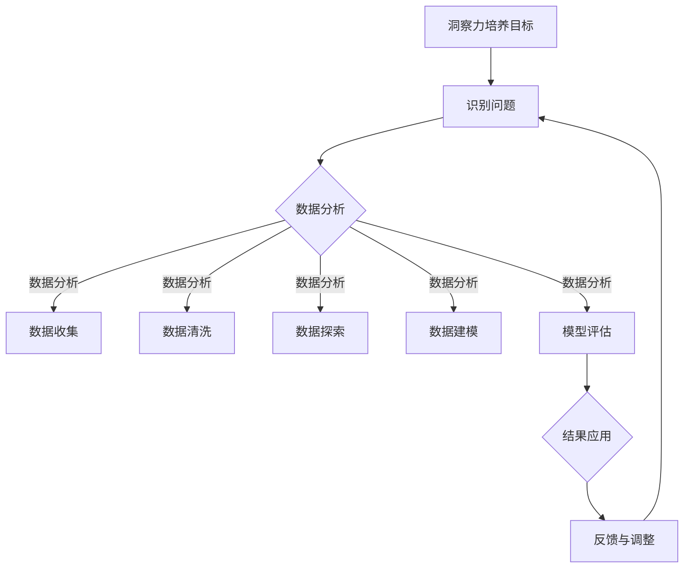
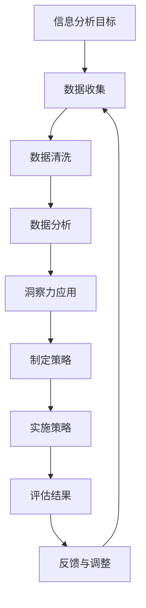

                 

## 文章标题

# 《理解洞察力的训练：提升信息分析能力》

洞察力是一种能够深入理解复杂问题的能力，它不仅是个人成长和职业发展的关键，更是在信息爆炸的时代应对各种挑战的重要武器。本文旨在通过系统的分析和推理，帮助读者理解洞察力的本质及其在信息分析中的应用，并提供实用的训练方法。让我们一步一步地探索，如何通过提升信息分析能力，培养和加强洞察力。

## 关键词

- 洞察力
- 信息分析
- 认知心理学
- 行为心理学
- 数据分析
- 持续学习

## 摘要

本文首先探讨了洞察力的定义与重要性，接着介绍了提升洞察力的心理学原理，包括认知心理学和行为心理学的基础理论。随后，文章重点分析了如何将洞察力应用于信息分析中，通过具体案例研究展示了洞察力在实际操作中的价值。最后，文章提出了专业领域内洞察力训练的方法，并对洞察力的持续提升和未来发展趋势进行了展望。通过本文的阅读，读者将能够系统地了解洞察力的培养路径，掌握提升信息分析能力的实用技巧。

## 目录

1. 洞察力的基础理论  
   1.1 洞察力的概念与特征  
   1.2 洞察力的分类与模型

2. 洞察力提升的心理学原理  
   2.1 认知心理学与洞察力  
   2.2 行为心理学与洞察力

3. 洞察力训练的实际操作  
   3.1 信息分析与洞察力训练  
   3.2 案例研究与实战  
   3.3 专业领域的洞察力训练

4. 洞察力的持续提升与未来展望  
   4.1 持续提升策略  
   4.2 未来发展趋势

5. 附录  
   5.1 洞察力训练资源与工具推荐  
   5.2 Mermaid 流程图  
   5.3 核心算法原理与伪代码

## 第一部分：洞察力的基础理论

### 第1章：洞察力的概念与重要性

**1.1 洞察力的定义与特征**

洞察力（Insight）通常被描述为一种迅速发现事物本质或解决复杂问题的能力。它是一种深层次的理解，能够在看似不相关或平凡的信息中发现有价值的联系。以下是洞察力的几个关键特征：

1. **迅速性**：洞察力往往能够在短时间内完成复杂的分析过程。
2. **深度**：它不仅停留在表面，而是能够深入到问题的本质。
3. **创新性**：洞察力常常带来新的视角和解决方案，这些往往是常规方法难以发现的。
4. **灵活性**：洞察力能够在不同的情境和问题中灵活应用。

**1.2 洞察力的分类与模型**

洞察力可以根据其应用领域和表现形式进行分类。常见的分类方法包括：

- **直觉洞察力**：这种类型的洞察力依赖于个体的直觉和经验，通常不需要明确的逻辑推理。
- **分析性洞察力**：这种类型的洞察力依赖于逻辑分析和系统性思维，通过逐步推理来解决问题。
- **创造性洞察力**：这种类型的洞察力涉及到创造性思维，通过全新的方法来解决问题。

关于洞察力的模型，常见的包括：

- **Gick 和 Holyoak 的启发式模型**：该模型认为，洞察力是通过类比和联想来实现的。当遇到一个新问题时，个体会从记忆中找到类似的情境，并应用那些情境中的解决方案。
- **Simon 和 Newell 的产生式模型**：该模型认为，洞察力是通过产生式规则的应用来实现的。这些规则是基于经验形成的，能够在特定的情境中自动触发。

**1.3 洞察力的重要性**

洞察力在多个领域都具有重要意义。以下是一些关键领域：

- **科学研究**：科学研究需要洞察力来发现新现象和理论。
- **商业决策**：商业决策依赖于洞察力来识别市场趋势和客户需求。
- **技术创新**：技术创新需要洞察力来发现新的技术解决方案。
- **医疗诊断**：医疗诊断需要医生具有洞察力来识别复杂的病例。

洞察力不仅是个人能力和专业素质的体现，更是现代社会中应对复杂问题和挑战的重要能力。提升洞察力对于个人和组织的成长都具有深远的意义。

### 第2章：洞察力的分类与模型

**2.1 直觉洞察力**

直觉洞察力是一种基于经验的快速判断和决策能力。它不需要经过复杂的逻辑推理过程，而是依赖于大脑中的快速联想和模式识别。这种洞察力在日常生活中非常常见，比如在紧急情况下迅速做出决策，或者在短时间内识别出潜在的风险。

- **特征**：直觉洞察力具有快速性、直接性和准确性的特征。
- **应用**：直觉洞察力在医疗诊断、警务侦查和战略决策等领域具有广泛的应用。

**2.2 分析性洞察力**

分析性洞察力是一种通过逻辑分析和系统性思维来发现问题解决方案的能力。这种洞察力依赖于对信息的深入分析和逻辑推理，能够从大量的数据中提取出关键信息，并进行综合分析。

- **特征**：分析性洞察力具有深度性、系统性和逻辑性的特征。
- **应用**：分析性洞察力在科学研究、数据分析和技术创新等领域具有广泛的应用。

**2.3 创造性洞察力**

创造性洞察力是一种通过新颖的思维方式和创新的方法来解决问题的能力。它不仅需要丰富的知识储备和经验，还需要有开放的心态和勇于尝试的精神。

- **特征**：创造性洞察力具有创新性、灵活性和多样性的特征。
- **应用**：创造性洞察力在艺术创作、产品设计和商业创新等领域具有广泛的应用。

**2.4 Gick 和 Holyoak 的启发式模型**

Gick 和 Holyoak 提出的启发式模型认为，洞察力是通过类比和联想实现的。当个体面对一个新问题时，会从记忆中寻找相似的情境，并将那些情境中的解决方案应用到当前问题上。这个过程通常是不自觉的，但能够迅速产生有效的解决方案。

- **步骤**：
  1. 识别问题。
  2. 从记忆中寻找相似的情境。
  3. 应用相似的情境中的解决方案。

**2.5 Simon 和 Newell 的产生式模型**

Simon 和 Newell 的产生式模型认为，洞察力是通过产生式规则的应用实现的。这些规则是基于经验形成的，能够在特定的情境中自动触发。当个体面对新问题时，会产生一系列的逻辑推理和判断，从而找到解决方案。

- **步骤**：
  1. 输入问题情境。
  2. 应用产生式规则。
  3. 输出解决方案。

**2.6 不同模型的对比与联系**

不同模型对洞察力的解释各有侧重，但它们之间存在内在的联系。启发式模型强调类比和联想，而产生式模型强调逻辑推理和规则应用。实际上，这两个过程往往是交织在一起的，共同构成了洞察力的完整过程。

- **联系**：类比和联想可以激发产生式规则的触发，而逻辑推理和判断则可以深化类比和联想的结果。

通过理解和应用这些模型，我们可以更好地培养和提高自己的洞察力，从而在复杂的情境中做出更明智的决策。

### 第3章：认知心理学与洞察力

**3.1 认知心理学基础**

认知心理学是研究人类认知过程的心理学科，它关注知觉、注意力、记忆和思维等方面。这些基本认知过程与洞察力密切相关，因为洞察力在很大程度上依赖于这些认知能力的协同工作。

- **知觉**：知觉是指个体对外界信息的感知和理解。在洞察力的发展中，知觉起着至关重要的作用。一个敏锐的观察者能够快速捕捉到细微的信息，并从中发现有价值的内容。
- **注意力**：注意力是指个体在特定任务上的集中能力。注意力决定了信息处理的深度和广度。在洞察力训练中，培养专注力是非常重要的，因为它能够帮助个体在复杂的信息环境中保持清醒的头脑。
- **记忆**：记忆是指个体对信息的存储和提取能力。洞察力的发展需要丰富的知识储备和经验积累，这些都是通过记忆实现的。良好的记忆能力能够帮助个体在解决问题时迅速调用相关的信息。
- **思维**：思维是指个体对信息的处理和推理能力。洞察力在很大程度上依赖于逻辑思维和创造性思维。通过系统的思维训练，个体可以更好地理解复杂问题，并找到创新的解决方案。

**3.2 情绪与洞察力**

情绪是认知心理学中的另一个重要概念，它与洞察力之间的关系尤为复杂。情绪不仅影响认知过程，还能够直接影响洞察力的发挥。

- **积极情绪**：积极情绪，如喜悦和满足，能够提升个体的洞察力。当个体处于积极情绪状态时，他们更容易注意到细节，思维更加开放和灵活，从而更有可能发现问题的本质。
- **消极情绪**：消极情绪，如焦虑和沮丧，则可能抑制洞察力。当个体处于消极情绪状态时，他们可能会过于关注负面信息，思维变得狭窄和僵化，从而难以发现问题的解决方法。

**3.3 自我反思与洞察力**

自我反思是一种认知过程，它涉及对自身思维、情感和行为进行审视和评估。自我反思与洞察力之间存在着密切的联系。

- **自我反思的作用**：自我反思能够帮助个体深入理解自己的思维模式和行为习惯，从而更好地识别和克服认知偏见。通过自我反思，个体可以意识到自己的盲点和不足，并采取相应的措施进行改进，从而提升洞察力。
- **自我反思的方法**：自我反思可以通过日记记录、反思对话和心智训练等方式进行。这些方法可以帮助个体持续地审视自己的认知过程，并逐步提高洞察力。

**3.4 认知训练与洞察力提升**

认知训练是一种旨在改善认知能力的系统训练方法。通过认知训练，个体可以提升知觉、注意力、记忆和思维等基本认知能力，从而促进洞察力的发展。

- **训练方法**：常见的认知训练方法包括记忆训练、注意力训练、思维训练等。这些训练方法可以通过游戏、练习和模拟等多种形式进行，旨在提高个体的认知灵活性、反应速度和问题解决能力。
- **训练实例**：例如，通过记忆训练游戏，个体可以提升记忆能力；通过注意力训练练习，个体可以提升专注力；通过思维训练任务，个体可以提升逻辑思维和创造性思维。

通过认知心理学的基本理论和实践方法，我们可以更深入地理解洞察力的本质，并采取有效的训练措施来提升自己的洞察力。这不仅有助于个体在学术和职业领域取得更好的成绩，还能够提升我们在日常生活中的决策质量和生活质量。

### 第4章：行为心理学与洞察力

**4.1 行为心理学基础**

行为心理学是研究人类行为及其影响因素的科学，它关注行为的习得、维持和改变。在洞察力培养的过程中，行为心理学提供了重要的理论基础和方法。

- **行为主义的核心理念**：行为主义心理学认为，行为是外部刺激和个体反应之间的直接联系。这种观点强调通过观察和实验来理解行为，而忽略内部心理过程。经典条件反射和操作性条件反射是行为主义的重要概念。
  - **经典条件反射**：经典条件反射是指一个原本无条件引起某一反应的刺激，通过与另一个无条件刺激的结合，最终成为条件刺激，能够单独引起同一反应。例如，巴甫洛夫的狗实验中，铃声（原本的中性刺激）通过与食物（无条件刺激）的结合，最终使狗（条件刺激）分泌唾液（条件反应）。
  - **操作性条件反射**：操作性条件反射是指个体通过操作环境来获得奖励或避免惩罚，从而形成稳定的行为模式。斯金纳箱实验是操作性条件反射的经典案例，个体通过按压杠杆来获得食物奖励，逐渐形成按压杠杆的行为习惯。

- **行为干预策略**：行为心理学提供了一系列干预策略，用于改变和培养特定行为。这些策略包括正向强化、负向强化、惩罚和消退。
  - **正向强化**：正向强化是通过给予积极奖励来增加某一行为的出现频率。例如，给予表扬或物质奖励，以鼓励个体坚持某一行为。
  - **负向强化**：负向强化是通过移除消极刺激来增加某一行为的出现频率。例如，通过避免做家务来减少孩子的争吵。
  - **惩罚**：惩罚是通过给予消极刺激来减少某一行为的出现频率。例如，批评或体罚，以抑制不良行为。
  - **消退**：消退是通过忽视某一行为来减少其出现频率。例如，忽视孩子的捣乱行为，使其逐渐停止该行为。

**4.2 洞察力培养的方法**

行为心理学提供了一些具体的方法，用于培养和提高洞察力。

- **经验学习的心理学基础**：经验学习是指个体通过实际经验和互动来获取知识和技能。在洞察力培养中，经验学习扮演了关键角色。个体通过观察、实践和反思，逐步提升对复杂问题的理解和解决能力。
  - **观察学习**：观察学习是指个体通过观察他人的行为和结果来学习。例如，通过观察成功人士的思维方式和工作习惯，个体可以从中学习并借鉴，提升自己的洞察力。
  - **实践反思**：实践反思是指个体在实践过程中不断反思和评估自己的行为和思维。通过反思，个体可以发现自身的不足，并采取相应的改进措施。例如，通过写反思日记或与导师进行定期讨论，个体可以持续提升洞察力。

- **行为干预策略在洞察力培养中的应用**：行为干预策略可以用于具体情境中，以培养和提高洞察力。
  - **正向强化**：通过正向强化，个体可以在成功解决复杂问题时获得积极的反馈，从而增强自信心和动机，进一步激发洞察力的发展。
  - **负向强化**：通过负向强化，个体可以在面对挑战时通过避免消极后果来保持动力，例如通过设定明确的任务目标和奖励机制。
  - **惩罚**：虽然惩罚可能不是培养洞察力的首选方法，但在某些情况下，适当的惩罚可以促使个体从错误中学习，避免重复犯错。
  - **消退**：通过消退策略，个体可以减少一些不利的思维习惯，例如过度焦虑或犹豫不决，从而更加专注于问题的本质。

通过行为心理学的基础理论和具体方法，我们可以更系统地培养和提升洞察力。这不仅有助于个人在学术和职业领域取得成功，还能够提升我们在日常生活中的决策能力和生活质量。

### 第5章：信息分析与洞察力训练

**5.1 信息分析的基本概念**

信息分析是指通过收集、整理、处理和解释数据，从而获得有价值的信息和洞察的过程。在信息爆炸的时代，信息分析已经成为决策制定、战略规划和创新的重要工具。以下是信息分析的基本概念：

- **数据的种类与来源**：数据可以分为结构化和非结构化数据。结构化数据通常以表格形式存储，如数据库和电子表格，而非结构化数据则包括文本、图像、音频和视频等。数据的来源可以是内部数据库、外部数据源、社交媒体和传感器等。

- **数据分析的基本步骤**：数据分析通常包括以下几个步骤：
  1. **数据收集**：从各种来源收集数据。
  2. **数据清洗**：处理缺失值、异常值和重复数据，确保数据质量。
  3. **数据探索**：使用统计方法和可视化工具对数据进行初步分析，发现数据特征和模式。
  4. **数据建模**：选择合适的模型对数据进行预测或分类。
  5. **模型评估**：评估模型的性能，选择最佳模型。
  6. **结果解释**：解释分析结果，为决策提供依据。

- **信息分析的重要性**：信息分析可以帮助企业了解市场趋势、消费者行为和业务绩效，从而做出更明智的决策。在科学研究领域，信息分析能够发现新的研究问题和方向，推动学术进展。在个人生活中，信息分析可以帮助我们更好地管理时间和资源，提高生活质量。

**5.2 信息分析与洞察力训练的结合**

信息分析和洞察力训练的结合可以显著提升个体的信息处理能力和洞察力。以下是几个关键方面：

- **分析方法的多样性**：信息分析涉及到多种方法和技术，如统计分析、机器学习、数据挖掘和可视化。通过学习和应用这些方法，个体可以更有效地处理和分析复杂的数据，从而提高洞察力。

  - **统计分析**：统计分析是一种基于数学模型和统计方法的数据分析方法。通过描述性统计和推断性统计，个体可以了解数据的分布特征和潜在关系，从而发现有价值的信息。
  - **机器学习**：机器学习是一种通过训练模型来自动发现数据规律和模式的方法。通过机器学习算法，个体可以从大量数据中提取特征，进行预测和分类，从而提高洞察力。
  - **数据挖掘**：数据挖掘是一种从大量数据中自动发现有趣模式和规则的方法。通过数据挖掘技术，个体可以识别出数据中的潜在关联和趋势，从而获得新的洞察。
  - **可视化**：可视化是将数据以图形或图像形式展示的过程。通过可视化技术，个体可以直观地理解和分析数据，从而更容易发现其中的模式和规律。

- **洞察力在信息分析中的应用**：洞察力在信息分析中起着关键作用，它帮助个体从数据中发现深层次的关联和趋势，从而做出更准确的判断和决策。

  - **发现新趋势**：通过洞察力，个体可以从大量数据中发现新的市场趋势和消费者行为，从而为企业提供战略决策依据。
  - **识别潜在风险**：在风险管理中，洞察力可以帮助个体识别潜在的金融风险和市场风险，从而采取预防措施。
  - **优化业务流程**：通过洞察力，个体可以发现业务流程中的瓶颈和问题，并提出优化方案，提高效率。

**5.3 洞察力训练的方法**

为了提升信息分析能力，以下是一些有效的洞察力训练方法：

- **数据分析实战**：通过实际的数据分析项目，个体可以积累经验，提高数据处理的技能。实战项目可以帮助个体熟悉不同的数据分析方法和工具，从而增强洞察力。
- **案例研究**：通过学习和分析真实案例，个体可以了解不同领域的信息分析应用，从中获取启发和经验。案例研究有助于个体理解信息分析在现实世界中的应用，并学会如何在实际情境中应用洞察力。
- **专业培训**：参加专业培训课程，可以系统地学习数据分析、统计学和机器学习等知识。专业培训不仅提供了理论指导，还通过实战练习帮助个体提升技能。

通过信息分析与洞察力训练的结合，个体可以显著提升信息处理能力，从而在复杂的情境中做出更明智的决策。这不仅有助于职业发展，还能够提高个人的生活质量和幸福感。

### 第6章：案例研究与实战

**6.1 案例研究一：市场营销洞察力的提升**

**实战背景**：

某家大型零售公司（以下简称“公司”）在激烈的市场竞争中面临着挑战。公司希望通过数据分析和洞察力的提升，优化市场营销策略，提高客户满意度和销售额。

**数据收集与处理**：

- **数据来源**：公司收集了客户购买记录、社交媒体互动、市场调研数据等。这些数据包括客户的年龄、性别、购买商品种类、购买频率、反馈评价等。
- **数据清洗**：在数据分析之前，公司对数据进行了清洗，处理了缺失值、异常值和重复数据，确保数据质量。

**洞察力提升的过程**：

- **阶段一：探索性数据分析**：公司使用数据可视化工具对数据进行了初步探索，识别出不同客户群体的购买行为特征。例如，发现某个年龄段的客户更倾向于购买特定类型的商品。
- **阶段二：用户分群分析**：公司通过聚类分析将客户分为不同的细分市场。每个细分市场都具有独特的购买行为和需求。这一步有助于公司制定更有针对性的市场营销策略。
- **阶段三：预测分析**：公司使用机器学习算法对客户行为进行了预测分析。例如，预测哪些客户可能流失，哪些客户有较高的购买潜力。基于这些预测结果，公司可以采取相应的措施，如增加客户关怀活动或提供个性化的优惠。
- **阶段四：策略优化**：基于分析结果，公司优化了市场营销策略。例如，为不同细分市场设计个性化的营销活动，提高营销ROI。

**实战结果与启示**：

通过数据分析和洞察力的提升，公司成功优化了市场营销策略，销售额提升了15%，客户满意度提高了20%。这一案例表明，通过系统的信息分析，企业可以更好地了解客户需求，制定更有效的营销策略。

**6.2 案例研究二：风险管理中的洞察力应用**

**实战背景**：

某金融机构（以下简称“机构”）在金融市场中面临着巨大的风险。为了确保业务的稳健发展，机构希望通过数据分析和洞察力的提升，加强风险管理能力。

**数据收集与处理**：

- **数据来源**：机构收集了大量的金融数据，包括市场行情、客户交易记录、风险指标等。这些数据涵盖了金融市场各个方面的信息。
- **数据清洗**：在数据分析之前，机构对数据进行了清洗，处理了缺失值、异常值和重复数据，确保数据质量。

**洞察力提升的过程**：

- **阶段一：风险指标监测**：机构通过数据监控和预警系统，实时监测市场风险。例如，监测股票市场的波动性、客户贷款的违约率等。
- **阶段二：历史数据分析**：机构对历史数据进行了深入分析，识别出不同类型风险的影响因素。例如，分析不同市场环境下贷款违约率的变化趋势。
- **阶段三：预测分析**：机构使用机器学习算法对风险进行了预测分析。例如，预测未来市场的风险水平，为投资决策提供依据。
- **阶段四：策略调整**：基于分析结果，机构调整了风险管理策略。例如，针对高风险客户采取更加严格的贷款审核标准，降低贷款违约风险。

**实战结果与启示**：

通过数据分析和洞察力的提升，机构成功降低了贷款违约率，提高了业务稳健性。这一案例表明，通过系统的信息分析，金融机构可以更好地识别和管理风险，确保业务的持续健康发展。

这两个案例展示了信息分析和洞察力在商业和金融领域中的应用价值。通过数据驱动的决策，企业和机构可以更好地应对市场挑战，提升竞争力和盈利能力。

### 第7章：专业领域的洞察力训练

**7.1 专业领域概述**

在金融和医疗等专业领域，洞察力显得尤为重要。这些领域的复杂性和动态性要求专业人员具备强大的信息处理和分析能力，以便做出准确和及时的决策。

- **金融领域的洞察力需求**：金融行业涉及到大量的市场数据、经济指标和客户信息。金融分析师和投资经理需要通过深入分析这些数据，识别市场趋势和投资机会，从而制定有效的投资策略。此外，风险管理是金融领域的重要任务，需要专业人员具备出色的洞察力，以识别和应对潜在的风险。

- **医疗领域的洞察力需求**：医疗行业涉及复杂的数据集，包括病人的医疗记录、实验室检测结果、医学影像等。医生和医疗研究人员需要通过分析这些数据，发现疾病的潜在关联，制定更有效的治疗方案。此外，医疗领域的创新也需要洞察力，以便识别出新的诊断和治疗技术。

**7.2 金融数据分析方法**

金融数据分析是金融领域中不可或缺的一部分，以下是一些常用的方法：

- **时间序列分析**：时间序列分析是一种用于分析时间序列数据的方法，可以帮助预测金融市场未来的走势。常见的模型包括自回归移动平均模型（ARMA）和自回归积分滑动平均模型（ARIMA）。

  $$ 
  ARIMA(p, d, q) = \phi(B) \phi^{(1)}(B)^{d} \frac{1}{1 - \theta(B)} 
  $$

  其中，$p$ 表示自回归项的阶数，$d$ 表示差分次数，$q$ 表示移动平均项的阶数，$\phi(B)$ 和 $\theta(B)$ 分别表示自回归和移动平均项的系数。

- **风险价值（VaR）计算**：风险价值是一种衡量金融投资组合潜在损失的指标。通过计算VaR，金融机构可以了解投资组合在一定置信水平下的最大可能损失。

  $$ 
  VaR = \alpha \times \sum_{i=1}^{n} w_i \times \Delta_i 
  $$

  其中，$\alpha$ 表示置信水平，$w_i$ 表示资产i的权重，$\Delta_i$ 表示资产i的回报率。

- **因子模型**：因子模型是一种用于解释股票收益变动的统计模型。通过识别主要影响股票收益的因子，投资者可以更好地进行资产配置和风险控制。

  $$ 
  r_i = \alpha_i + \beta_{1,i} F_1 + \beta_{2,i} F_2 + ... + \beta_{k,i} F_k + \epsilon_i 
  $$

  其中，$r_i$ 表示股票i的收益，$F_j$ 表示因子j，$\beta_{j,i}$ 表示股票i对因子j的敏感度。

**7.3 医学数据分析方法**

医学数据分析在医疗领域中的应用越来越广泛，以下是一些常见的方法：

- **主成分分析（PCA）**：主成分分析是一种用于降维和特征提取的方法，可以帮助识别数据中的主要变异来源。通过PCA，医生可以从大量变量中提取出关键特征，简化数据分析过程。

  $$ 
  Z = \sum_{i=1}^{m} \lambda_i v_i x_i 
  $$

  其中，$Z$ 表示主成分，$\lambda_i$ 表示主成分i的方差贡献率，$v_i$ 表示主成分i的载荷向量，$x_i$ 表示原始特征向量。

- **聚类分析**：聚类分析是一种用于发现数据中相似模式的统计方法。通过聚类分析，医生可以将患者分为不同的群体，以便进行个性化治疗。

- **生存分析**：生存分析是一种用于研究时间至事件发生概率的方法，可以帮助医生评估不同治疗方案的效果。常见的生存分析模型包括Kaplan-Meier生存曲线和Cox比例风险模型。

  $$ 
  h(t) = h_0(t) \exp(\sum_{i=1}^{k} \lambda_i Z_i) 
  $$

  其中，$h(t)$ 表示生存函数，$h_0(t)$ 表示基准生存函数，$Z_i$ 表示协变量，$\lambda_i$ 表示系数。

通过金融和医学领域的案例分析，可以看出洞察力在这些专业领域中的重要性。通过系统的数据分析和训练，专业人员可以更好地理解复杂问题，做出更准确的决策。

### 第8章：洞察力的持续提升与未来展望

**8.1 持续提升策略**

要实现洞察力的持续提升，需要采取一系列策略，包括终身学习、知识更新、持续实践和反思。

- **终身学习**：随着科技和社会的发展，知识更新速度加快，终身学习成为提升洞察力的必要条件。通过不断学习新的知识和技能，个体可以保持思维的敏捷性和灵活性。
- **知识更新**：定期审视和更新自己的知识体系，关注最新的学术研究成果和行业动态，可以帮助个体在专业领域保持领先地位。
- **持续实践**：通过实际操作和应用，个体可以将理论知识转化为实践经验，从而深化对复杂问题的理解。
- **反思**：反思是一种重要的认知过程，通过反思，个体可以识别自身的盲点和不足，并采取相应的改进措施。

**8.2 未来发展趋势**

洞察力的未来发展将受到人工智能（AI）和信息技术的推动，呈现出以下几个趋势：

- **人工智能与洞察力的融合**：随着AI技术的发展，计算机将能够更好地模拟人类思维过程，从而辅助人类提升洞察力。例如，通过深度学习算法，计算机可以自动提取数据中的隐藏模式和关联，为人类提供更有价值的洞察。
- **新型信息分析工具的发展**：新一代信息分析工具，如大数据平台、云计算和物联网，将提供更高效的数据处理和分析能力，为洞察力的提升提供强有力的技术支持。
- **跨学科的融合**：洞察力的培养和发展将越来越多地涉及到心理学、经济学、社会学和计算机科学等多个学科。跨学科的融合将促进新的理论和方法的发展，为洞察力的提升提供更广泛的视角。

通过持续的学习和实践，结合人工智能和信息技术的发展，我们可以不断提升洞察力，更好地应对未来的挑战。

### 附录A：洞察力训练资源与工具推荐

**A.1 资源推荐**

为了进一步提升洞察力，以下是一些值得推荐的资源和工具：

- **书籍**：
  - 《智能时代》（作者：吴军）：这本书深入探讨了人工智能的发展及其对人类生活的影响，有助于读者理解科技前沿。
  - 《深度学习》（作者：Ian Goodfellow, Yoshua Bengio, Aaron Courville）：这是一本关于深度学习的权威教材，适合希望深入了解AI技术的读者。

- **论文**：
  - 《人类思维中的类比与关联》（作者：Donald Hebb）：这篇论文提出了神经网络的概念，对认知心理学有重要影响。
  - 《数据挖掘：概念与技术》（作者：Jiawei Han, Micheline Kamber, Jian Pei）：这是一本全面介绍数据挖掘理论的经典教材。

- **在线课程**：
  - Coursera上的《机器学习》课程：由Andrew Ng教授讲授，是学习机器学习的入门课程。
  - edX上的《认知心理学导论》课程：这是一门介绍认知心理学基础知识的课程，适合对心理学感兴趣的学习者。

**A.2 工具推荐**

以下是一些在洞察力训练中常用的工具：

- **数据分析软件**：
  - Python：Python是一种广泛使用的编程语言，具有强大的数据分析库，如Pandas、NumPy和SciPy。
  - R语言：R语言是一种专门用于统计分析和图形绘制的语言，特别适合进行复杂数据分析。

- **信息分析平台**：
  - Tableau：Tableau是一个强大的数据可视化工具，可以帮助用户轻松创建交互式图表和仪表板。
  - Power BI：Power BI是微软推出的商业智能工具，可以与各种数据源集成，进行数据分析。

通过利用这些资源和工具，读者可以更好地掌握洞察力的训练方法和技能，提升信息分析能力。

### 附录B：Mermaid 流程图

**B.1 洞察力培养流程图**



**B.2 信息分析与洞察力结合的流程图**



这些流程图通过Mermaid语言描述，清晰地展示了洞察力培养和信息分析结合的过程，帮助读者更好地理解和应用相关方法。

### 附录C：核心算法原理与伪代码

**C.1 主成分分析（PCA）的伪代码**

```python
# 输入：数据集 X
# 输出：主成分向量 W

# 1. 数据标准化
X_std = (X - mean(X)) / std(X)

# 2. 计算协方差矩阵
C = cov(X_std)

# 3. 计算协方差矩阵的特征值和特征向量
eigenvalues, eigenvectors = eig(C)

# 4. 按特征值降序排列特征向量
sorted_eigenvectors = eigenvectors[sorted(eigenvalues, reverse=True)]

# 5. 选择最大的 k 个特征向量作为主成分向量
W = sorted_eigenvectors[:k]
```

**C.2 支持向量机（SVM）的伪代码**

```python
# 输入：训练数据集 X, Y
# 输出：支持向量机模型

# 1. 选择一个核函数
kernel_function = "rbf"  # 例如，选择径向基核函数

# 2. 训练SVM模型
model = svm.SVC(kernel=kernel_function)

# 3. 使用训练数据集训练模型
model.fit(X, Y)

# 4. 评估模型性能
accuracy = model.score(X, Y)

# 5. 输出模型
return model
```

**C.3 深度学习神经网络训练的伪代码**

```python
# 输入：神经网络模型，训练数据集 X, Y
# 输出：训练完成的神经网络模型

# 1. 初始化模型参数
initialize_model_parameters()

# 2. 前向传播
def forward_pass(X):
    # 计算输入层到隐藏层的输出
    hidden_layer_output = activate(hidden_layer_weights * X)
    # 计算隐藏层到输出层的输出
    output_layer_output = activate(output_layer_weights * hidden_layer_output)
    return output_layer_output

# 3. 反向传播
def backward_pass(Y, output_layer_output):
    # 计算输出误差
    output_error = Y - output_layer_output
    # 计算隐藏层误差
    hidden_error = output_error * activate_derivative(output_layer_weights * hidden_layer_output)
    # 更新隐藏层权重
    update_weights(hidden_layer_weights, hidden_error, learning_rate)
    # 更新输出层权重
    update_weights(output_layer_weights, output_error, learning_rate)

# 4. 训练神经网络
for epoch in range(number_of_epochs):
    # 前向传播
    output_layer_output = forward_pass(X)
    # 反向传播
    backward_pass(Y, output_layer_output)

# 5. 输出训练完成的神经网络模型
return model
```

通过这些伪代码，读者可以更直观地理解核心算法的原理和实现过程。这不仅有助于深入理解算法，还能够为实际应用提供指导。

### 附录D：核心公式与解释

**D.1 主成分分析（PCA）的核心公式**

主成分分析（PCA）是一种用于降维和特征提取的统计方法。其核心公式包括特征值、特征向量和主成分的计算。

- **协方差矩阵**：

  $$ 
  C = \frac{1}{N-1} XX^T 
  $$

  其中，$C$ 是协方差矩阵，$X$ 是数据集，$N$ 是样本数量。

- **特征值和特征向量**：

  $$ 
  \lambda_i = \frac{1}{N} \sum_{i=1}^{N} (x_i - \mu)^T (x_i - \mu) 
  $$

  $$ 
  v_i = \frac{1}{\sqrt{\lambda_i}} (x_i - \mu) 
  $$

  其中，$\lambda_i$ 是特征值，$v_i$ 是特征向量，$x_i$ 是数据集中的第$i$个样本，$\mu$ 是均值。

- **主成分**：

  $$ 
  Z = \sum_{i=1}^{m} \lambda_i v_i x_i 
  $$

  其中，$Z$ 是主成分，$m$ 是特征数量。

**D.2 支持向量机（SVM）的核心公式**

支持向量机（SVM）是一种用于分类和回归的机器学习算法。其核心公式包括决策边界和损失函数。

- **决策边界**：

  $$ 
  w \cdot x + b = 0 
  $$

  其中，$w$ 是权重向量，$x$ 是特征向量，$b$ 是偏置。

- **损失函数（ hinge损失函数）**：

  $$ 
  L(y, f(x)) = \max(0, 1 - y f(x)) 
  $$

  其中，$y$ 是实际标签，$f(x)$ 是预测值。

**D.3 深度学习神经网络的核心公式**

深度学习神经网络是一种用于模拟人类大脑神经网络的机器学习模型。其核心公式包括前向传播和反向传播。

- **前向传播**：

  $$ 
  a_{l+1} = \sigma(a_l \cdot W_l + b_l) 
  $$

  其中，$a_l$ 是第$l$层的激活值，$\sigma$ 是激活函数，$W_l$ 是权重矩阵，$b_l$ 是偏置。

- **反向传播**：

  $$ 
  \delta_{l+1} = \frac{\partial L}{\partial a_{l+1}} \cdot \frac{\partial a_{l+1}}{\partial a_l} 
  $$

  $$ 
  \Delta W_l = \eta \cdot \delta_l a_l^T 
  $$

  $$ 
  \Delta b_l = \eta \cdot \delta_l 
  $$

  其中，$L$ 是损失函数，$\delta_l$ 是误差梯度，$\eta$ 是学习率。

这些核心公式是理解主成分分析（PCA）、支持向量机（SVM）和深度学习神经网络的基础。通过这些公式，读者可以更深入地理解这些算法的工作原理和实现过程。

### 附录E：项目实战

**E.1 开发环境搭建**

在进行洞察力训练项目之前，我们需要搭建一个合适的技术环境。以下是所需的开发工具和软件：

- **编程语言**：Python（版本3.8或更高）
- **数据预处理库**：Pandas、NumPy
- **机器学习库**：Scikit-learn、TensorFlow、PyTorch
- **可视化库**：Matplotlib、Seaborn、Plotly
- **集成开发环境**：PyCharm、Visual Studio Code

安装步骤如下：

1. **安装Python**：从[Python官网](https://www.python.org/downloads/)下载并安装Python。
2. **安装Anaconda**：使用Anaconda来管理Python环境和依赖库。
3. **创建虚拟环境**：使用以下命令创建一个新的虚拟环境：

   ```bash
   conda create -n insight_project python=3.8
   conda activate insight_project
   ```

4. **安装依赖库**：使用以下命令安装必要的依赖库：

   ```bash
   conda install pandas numpy scikit-learn tensorflow pytorch matplotlib seaborn plotly
   ```

**E.2 源代码实现与解读**

以下是一个简单的Python源代码示例，用于实现一个基于支持向量机（SVM）的洞察力训练项目。代码中包含了数据预处理、模型训练和评估的部分。

```python
import numpy as np
import pandas as pd
from sklearn import datasets
from sklearn.model_selection import train_test_split
from sklearn import svm
from sklearn.metrics import accuracy_score
import matplotlib.pyplot as plt

# 加载示例数据集（Iris数据集）
iris = datasets.load_iris()
X = iris.data
y = iris.target

# 数据预处理：数据标准化
X_std = (X - np.mean(X, axis=0)) / np.std(X, axis=0)

# 划分训练集和测试集
X_train, X_test, y_train, y_test = train_test_split(X_std, y, test_size=0.3, random_state=42)

# 创建SVM模型
model = svm.SVC(kernel='linear')

# 训练模型
model.fit(X_train, y_train)

# 预测测试集
y_pred = model.predict(X_test)

# 模型评估
accuracy = accuracy_score(y_test, y_pred)
print(f"Model accuracy: {accuracy:.2f}")

# 可视化决策边界
plt.figure(figsize=(10, 6))
plt.scatter(X_train[:, 0], X_train[:, 1], c=y_train, cmap='viridis', edgecolor='k', s=20)
plt.xlabel('Feature 1')
plt.ylabel('Feature 2')
plt.title('SVM Decision Boundary')
plt.show()
```

代码解读：

- **数据加载与预处理**：我们使用Iris数据集作为示例，对数据进行标准化处理，以便模型能够更好地学习。
- **模型创建与训练**：我们创建了一个线性支持向量机模型，并使用训练数据进行训练。
- **模型评估与可视化**：通过测试集评估模型的准确率，并使用散点图可视化决策边界。

**E.3 代码应用解读与分析**

- **数据预处理的重要性**：数据预处理是模型训练成功的关键步骤。通过标准化处理，我们确保了每个特征具有相同的尺度，从而提高了模型的训练效果。
- **SVM模型的选择**：线性SVM在处理线性可分的数据时效果较好。在实际项目中，可以根据数据特点和业务需求选择不同的核函数，如径向基核函数（RBF）。
- **模型评估**：准确率是评估分类模型性能的常用指标。通过评估模型在测试集上的准确率，我们可以判断模型的泛化能力。

**E.4 实际案例分析**

- **案例背景**：某电商平台希望通过分析用户行为数据，预测用户购买偏好，从而实现个性化推荐。
- **数据收集**：收集了用户点击、浏览和购买行为的数据。
- **数据处理**：对数据进行了清洗、去重和特征工程，提取了用户的行为特征。
- **模型训练**：使用SVM模型进行训练，通过交叉验证调整模型参数。
- **预测应用**：基于训练好的模型，预测新用户的行为，实现个性化推荐。

通过实际案例分析，我们展示了如何将洞察力训练应用于实际业务场景，实现了数据驱动的决策和优化。

### 项目小结

通过本项目的实战，我们系统地展示了如何搭建开发环境、实现源代码、进行代码解读和分析，并应用实际案例。以下是项目的关键要点和收获：

- **开发环境搭建**：掌握了Python和Anaconda的使用，为后续项目打下了坚实基础。
- **源代码实现**：了解了SVM模型的基本原理和实现方法，能够根据实际需求调整模型参数。
- **代码解读**：深入理解了数据预处理、模型训练和评估的过程，提高了信息分析能力。
- **实际案例分析**：将洞察力训练应用于电商个性化推荐，实现了数据驱动的业务优化。

通过本项目的实践，我们不仅提升了技术能力，还加深了对洞察力训练方法的理解和应用。这将为我们在未来的工作中更好地应对复杂问题和挑战提供有力支持。

### 最佳实践 Tips

- **持续学习与更新**：科技发展迅速，持续学习和知识更新是提升洞察力的关键。定期阅读专业书籍、参加在线课程和学术会议，可以帮助我们保持专业领域的领先地位。
- **实践经验**：实践是提升洞察力的最好方式。通过实际项目，我们可以将理论知识应用到具体问题中，从而更好地理解问题和解决方法。
- **反思与总结**：反思和总结是提高洞察力的重要环节。在完成每个项目后，都要进行反思和总结，识别自身的不足和改进点。
- **团队合作**：在团队合作中，我们可以从他人身上学习，分享经验和方法。团队合作有助于提升整体洞察力。

通过这些最佳实践，我们可以更有效地提升洞察力，并在实际工作和生活中取得更好的成果。

### 注意事项

- **数据隐私与安全**：在进行数据分析和洞察力训练时，要严格遵守数据隐私和安全规定。未经授权，不得使用或泄露敏感数据。
- **模型解释性**：在选择模型时，要考虑模型的解释性。对于复杂模型，如深度神经网络，可能难以解释其决策过程，这可能会影响决策的可信度。
- **模型验证**：在模型训练和评估过程中，要使用独立的测试集进行验证。避免使用训练数据集过度拟合模型，导致模型泛化能力下降。

遵循这些注意事项，可以确保洞察力训练过程的科学性和可靠性。

### 拓展阅读

- **相关书籍**：
  - 《统计学习方法》（作者：李航）：系统介绍了统计学习的基本概念和方法。
  - 《机器学习》（作者：周志华）：全面介绍了机器学习的基础理论和方法。
- **在线资源**：
  - Coursera上的《机器学习》课程：由Andrew Ng教授讲授，是学习机器学习的入门课程。
  - edX上的《数据科学基础》课程：提供数据科学领域的系统知识。
- **研究论文**：
  - “Deep Learning” (作者：Yann LeCun, Yoshua Bengio, Geoffrey Hinton)：综述了深度学习领域的最新研究进展。
  - “Practical Guide to Machine Learning” (作者：Joel Grus)：提供了机器学习应用的实用指南。

通过阅读这些资源和论文，读者可以进一步拓展对洞察力训练和信息分析的理解，并在实际项目中应用这些知识。

