                 

# 文章标题: 电商平台中AI大模型的增量学习技术

> 关键词：电商平台，AI大模型，增量学习，深度学习，算法优化，数据更新

> 摘要：本文旨在探讨电商平台中AI大模型的增量学习技术。首先，介绍了增量学习的基本概念、原理和应用场景。接着，深入分析了AI大模型在电商平台中的增量学习挑战及其解决方案。文章通过具体案例展示了增量学习技术在电商平台中的实际应用，并探讨了未来的发展趋势。本文为从事电商AI技术开发的人员提供了一定的理论指导和实践参考。

## 第一部分：增量学习基础

### 第1章：增量学习概述

#### 1.1 增量学习的定义与背景

增量学习（Incremental Learning），又称在线学习（Online Learning），是一种机器学习方法，能够使模型在训练过程中逐步更新和优化，适应新数据的动态变化。与传统的批量学习（Batch Learning）不同，增量学习注重在每次训练过程中对已有知识的微调，从而提高模型的泛化能力和实时性。

#### 1.2 增量学习的重要性

随着数据量的爆发式增长和业务场景的复杂化，增量学习技术在人工智能领域的应用越来越广泛。在电商平台中，用户行为数据、商品信息等不断更新，传统的批量学习方式难以满足实时性和准确性的需求。而增量学习能够通过持续学习和优化，实现更精准的用户行为分析和个性化推荐。

#### 1.3 增量学习的挑战与解决方案

增量学习面临的挑战主要包括计算资源消耗、模型稳定性和更新策略。为了解决这些问题，研究者们提出了一系列增量学习算法和优化策略，如小批量梯度下降、学习率调整等。本文将在后续章节中详细介绍这些挑战和解决方案。

### 第2章：增量学习基本原理

#### 2.1 增量学习中的基本概念

增量学习涉及多个核心概念，如样本增量、模型增量、更新策略等。这些概念构成了增量学习的基础理论框架，有助于理解增量学习的工作原理。

#### 2.2 增量学习的架构

增量学习的架构包括数据采集、模型训练、模型更新和预测等模块。通过这些模块的协同工作，增量学习实现了对动态数据的实时分析和预测。

#### 2.3 增量学习的关键技术

增量学习的关键技术包括小批量梯度下降、在线学习率调整、模型融合等。这些技术为增量学习提供了强大的理论支持和实践指导。

### 第3章：增量学习数学基础

#### 3.1 向量空间与内积

向量空间是增量学习中的重要概念，内积运算用于衡量两个向量的相似度。本文将介绍向量空间和内积的基本概念及其在增量学习中的应用。

#### 3.2 矩阵与矩阵运算

矩阵是增量学习中的重要工具，矩阵运算如矩阵乘法、矩阵求导等在增量学习算法中发挥着关键作用。本文将详细阐述矩阵的基本概念和运算。

#### 3.3 梯度下降算法

梯度下降算法是增量学习中的核心算法，通过不断更新模型参数以最小化损失函数。本文将介绍梯度下降算法的基本原理和增量学习中的应用。

### 第4章：增量学习核心算法原理

#### 4.1 梯度下降算法的增量学习形式

梯度下降算法在增量学习中有多种形式，如小批量梯度下降和在线梯度下降。本文将详细介绍这些算法的原理和实现。

#### 4.2 小批量梯度下降算法

小批量梯度下降算法通过每次训练小批量样本来更新模型参数，提高了训练效率。本文将阐述小批量梯度下降算法的原理和实现。

#### 4.3 学习率调整策略

学习率调整策略是增量学习中的重要环节，合理选择学习率能够加速收敛并提高模型性能。本文将介绍几种常见的学习率调整策略。

### 第5章：增量学习的数学模型

#### 5.1 线性回归的增量学习模型

线性回归是一种简单的增量学习模型，通过不断更新模型参数来拟合数据。本文将介绍线性回归的增量学习模型及其实现。

#### 5.2 逻辑回归的增量学习模型

逻辑回归是另一种常用的增量学习模型，适用于分类任务。本文将阐述逻辑回归的增量学习模型及其实现。

#### 5.3 支持向量机的增量学习模型

支持向量机（SVM）是一种强大的分类模型，本文将介绍SVM的增量学习模型，并通过伪代码和数学公式详细阐述其原理。

### 第6章：增量学习应用场景

#### 6.1 电商平台用户行为分析

电商平台用户行为分析是增量学习的重要应用场景之一。本文将介绍如何利用增量学习技术对用户行为进行实时分析和预测。

#### 6.2 电商平台商品推荐

商品推荐系统是电商平台的核心功能之一。本文将探讨如何利用增量学习技术实现高效的商品推荐系统。

#### 6.3 电商平台广告投放优化

广告投放优化是电商平台提高收益的关键环节。本文将分析如何利用增量学习技术实现广告投放的优化。

## 第二部分：AI大模型的增量学习技术

### 第7章：AI大模型概述

#### 7.1 AI大模型的发展历程

AI大模型的发展历程涵盖了深度学习、迁移学习等关键技术。本文将回顾AI大模型的发展历程，并介绍其特点和应用领域。

#### 7.2 AI大模型的特点

AI大模型具有参数多、计算量大、训练时间长的特点。本文将详细分析AI大模型的特点及其对增量学习技术的要求。

#### 7.3 AI大模型的应用领域

AI大模型在多个领域取得了显著的成果，如图像识别、自然语言处理、推荐系统等。本文将探讨AI大模型在各个应用领域中的具体应用。

### 第8章：AI大模型增量学习的挑战

#### 8.1 计算资源消耗

计算资源消耗是AI大模型增量学习面临的首要挑战。本文将分析计算资源消耗的原因及其对模型训练和预测的影响。

#### 8.2 模型稳定性

模型稳定性是AI大模型增量学习的另一个重要挑战。本文将探讨如何通过优化算法和策略提高模型的稳定性。

#### 8.3 模型更新策略

模型更新策略是AI大模型增量学习的核心问题。本文将介绍几种常见的模型更新策略，并分析其优缺点。

### 第9章：AI大模型的增量学习技术

#### 9.1 增量学习在大模型训练中的应用

增量学习在大模型训练中具有重要作用。本文将介绍如何利用增量学习技术优化大模型训练过程。

#### 9.2 增量学习在大模型预测中的应用

增量学习在大模型预测中能够提高实时性和准确性。本文将分析如何利用增量学习技术优化大模型预测。

#### 9.3 增量学习在大模型优化中的应用

增量学习在大模型优化中能够提高模型的泛化能力和性能。本文将探讨如何利用增量学习技术优化大模型。

### 第10章：电商平台中AI大模型的增量学习案例

#### 10.1 案例背景与目标

本案例背景为某电商平台用户行为分析项目，目标是通过增量学习技术实现用户行为的实时分析和个性化推荐。

#### 10.2 模型设计与实现

本节将详细介绍增量学习模型的架构设计、参数设置和实现过程。

#### 10.3 案例分析与效果评估

本节将分析增量学习技术在电商平台用户行为分析中的应用效果，并对比不同模型和策略的优劣。

## 第三部分：增量学习技术在电商平台的实践

### 第11章：电商平台中增量学习技术的应用策略

#### 11.1 技术选型

本节将介绍如何选择适合电商平台的增量学习技术，包括算法、框架和工具等方面。

#### 11.2 数据处理与模型更新

本节将分析如何处理电商平台中的动态数据，并实现模型的实时更新和优化。

#### 11.3 系统架构设计

本节将探讨如何设计一个高效、稳定的增量学习系统架构，以支持电商平台中的大规模数据分析和预测。

### 第12章：电商平台中增量学习技术的实际应用

#### 12.1 用户行为分析

本节将介绍如何利用增量学习技术对电商平台用户行为进行实时分析和预测。

#### 12.2 商品推荐系统

本节将探讨如何利用增量学习技术实现高效的商品推荐系统。

#### 12.3 广告投放优化

本节将分析如何利用增量学习技术优化电商平台中的广告投放策略。

### 第13章：增量学习技术在电商平台的未来发展趋势

#### 13.1 技术发展趋势

本节将展望增量学习技术在电商平台中的未来发展趋势，包括算法优化、数据融合等方面。

#### 13.2 电商平台面临的挑战

本节将分析电商平台在应用增量学习技术过程中面临的挑战，如数据隐私保护、计算资源限制等。

#### 13.3 未来发展方向

本节将探讨增量学习技术在电商平台中的未来发展方向，包括技术应用、业务模式创新等方面。

## 附录

### 附录A：常用增量学习算法与框架

本附录将介绍常用的增量学习算法和框架，包括机器学习算法、深度学习框架和电商平台中常用的算法与框架。

### 附录B：增量学习技术资源

本附录将推荐一些学习资料、开源项目与工具，以及相关的学术论文与会议，以供读者进一步学习和探索增量学习技术。

### 作者信息

作者：AI天才研究院/AI Genius Institute & 禅与计算机程序设计艺术 /Zen And The Art of Computer Programming

文章结束## 第1章：增量学习概述

### 1.1 增量学习的定义与背景

增量学习（Incremental Learning）是一种机器学习方法，其主要目标是通过逐步更新和优化模型参数，以适应新的数据。与传统批量学习（Batch Learning）不同，增量学习在每次更新时仅使用一部分新数据，从而可以在数据不断变化的环境中实现实时学习和预测。

#### 增量学习的定义

增量学习是指在模型已训练的基础上，不断添加新的训练样本来更新模型参数，从而提高模型性能的过程。其核心思想是将已有知识与新知识相结合，通过逐步调整模型参数，使模型能够更好地适应新的数据分布。

#### 增量学习的背景

随着互联网和物联网技术的快速发展，数据量呈现爆炸式增长。传统批量学习方式由于需要一次性处理大量数据，导致训练时间过长，难以满足实时性和动态变化的需求。而增量学习通过分批次、分阶段地更新模型参数，能够在动态数据环境中实现快速学习和预测，具有更高的灵活性和适应性。

### 1.2 增量学习的重要性

#### 实时性

在电商、金融、医疗等实时性要求较高的领域，用户数据、市场信息等不断变化。增量学习能够实时更新模型，使其能够迅速适应新的数据，从而提高决策的准确性和及时性。

#### 数据量

随着数据量的增加，批量学习方式的存储和计算资源需求变得巨大。增量学习通过分批次处理数据，可以显著降低存储和计算资源的需求，提高系统效率。

#### 动态适应性

增量学习能够根据新的数据逐步调整模型参数，使其更适应动态变化的数据分布。这在诸如推荐系统、风控模型等需要持续优化的场景中具有重要意义。

### 1.3 增量学习的挑战与解决方案

#### 挑战

1. **计算资源消耗**：增量学习通常需要处理大量的小批量数据，对计算资源有较高的要求。
2. **模型稳定性**：在动态数据环境中，模型参数的频繁更新可能导致模型稳定性下降。
3. **更新策略**：如何选择合适的更新策略以优化模型性能是一个关键问题。

#### 解决方案

1. **计算资源优化**：通过分布式计算、并行处理等技术，提高增量学习的计算效率。
2. **模型稳定性**：采用鲁棒性更强的模型结构、引入正则化项等方法，提高模型稳定性。
3. **更新策略**：设计合适的更新策略，如在线学习率调整、模型融合等，优化模型性能。

### 1.4 本章小结

本章对增量学习进行了概述，包括其定义、背景、重要性以及面临的挑战和解决方案。增量学习在电商平台等动态数据环境中具有重要的应用价值，通过不断更新和优化模型参数，能够实现实时学习和预测，提高系统的适应性和准确性。

### Mermaid 流程图

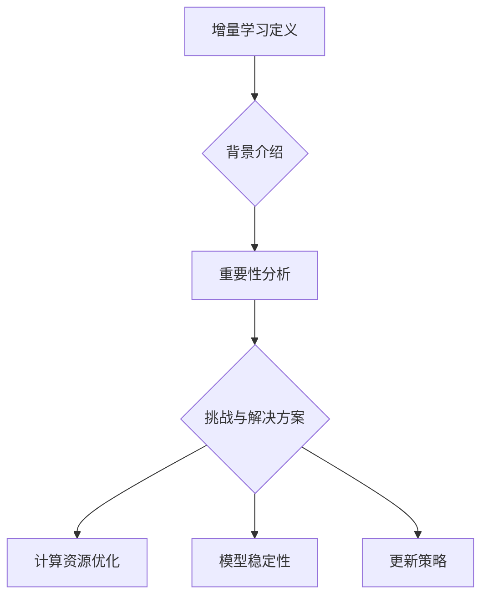

## 第2章：增量学习基本原理

### 2.1 增量学习中的基本概念

增量学习涉及多个核心概念，了解这些概念有助于深入理解增量学习的工作原理。

#### 样本增量

样本增量（Sample Increment）是指每次模型更新的样本数量。在增量学习中，样本增量的大小会影响模型更新的速度和效果。

#### 模型增量

模型增量（Model Increment）是指模型参数的更新量。模型增量的大小和方向取决于样本增量以及当前模型的状态。

#### 更新策略

更新策略（Update Strategy）是指如何根据样本增量更新模型参数的方法。常见的更新策略包括在线学习率调整、模型融合等。

### 2.2 增量学习的架构

增量学习的架构主要包括数据采集、模型训练、模型更新和预测等模块。这些模块协同工作，实现了对动态数据的实时分析和预测。

#### 数据采集

数据采集模块负责收集实时数据，包括用户行为数据、商品信息等。这些数据是增量学习的基础。

#### 模型训练

模型训练模块利用已有的数据对模型进行初始化训练，使其具有一定的预测能力。

#### 模型更新

模型更新模块根据新的样本增量，实时更新模型参数，使模型能够更好地适应新的数据分布。

#### 预测

预测模块利用更新后的模型对新的数据进行预测，为业务决策提供支持。

### 2.3 增量学习的关键技术

增量学习的关键技术包括小批量梯度下降、在线学习率调整、模型融合等。这些技术是增量学习实现高效、稳定学习的关键。

#### 小批量梯度下降

小批量梯度下降（Mini-batch Gradient Descent）是一种常用的增量学习算法。通过每次训练小批量样本，可以显著降低计算资源消耗并提高训练效率。

#### 在线学习率调整

在线学习率调整（Online Learning Rate Adjustment）是一种动态调整学习率的方法。通过实时调整学习率，可以优化模型性能，防止过拟合。

#### 模型融合

模型融合（Model Ensemble）是将多个模型的结果进行融合，以提高预测准确性和稳定性。常见的模型融合方法包括投票法、加权平均法等。

### 2.4 本章小结

本章介绍了增量学习的基本概念、架构和关键技术。通过了解这些内容，读者可以初步掌握增量学习的基本原理，并为后续章节的学习打下基础。

### Mermaid 流程图

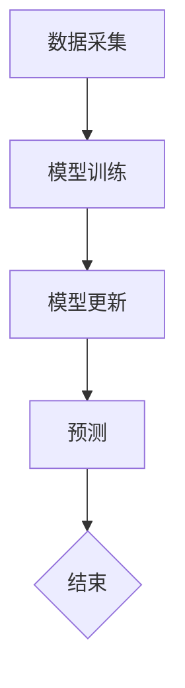

### 2.5 增量学习算法

增量学习算法是实现增量学习核心功能的关键，以下介绍几种常用的增量学习算法。

#### 小批量梯度下降算法

小批量梯度下降（Mini-batch Gradient Descent）是增量学习中最常用的算法之一。其基本思想是每次训练小批量样本，然后利用这些样本的梯度信息更新模型参数。

**算法原理：**

假设我们有训练数据集$D=\{(x_1, y_1), (x_2, y_2), ..., (x_n, y_n)\}$，其中$x_i$为输入样本，$y_i$为标签。定义损失函数为$L(\theta; x, y)$，其中$\theta$为模型参数。小批量梯度下降的步骤如下：

1. **初始化参数**：随机初始化模型参数$\theta$。
2. **选择小批量样本**：从训练数据集中随机选择一个小批量样本$B=\{(x_1^B, y_1^B), (x_2^B, y_2^B), ..., (x_m^B, y_m^B)\}$，其中$m$为小批量大小。
3. **计算梯度**：计算小批量样本的梯度$\nabla_\theta L(\theta; B)$。
4. **更新参数**：利用梯度更新参数$\theta \leftarrow \theta - \alpha \nabla_\theta L(\theta; B)$，其中$\alpha$为学习率。
5. **重复步骤2-4**，直到满足停止条件（如收敛或达到最大迭代次数）。

**伪代码：**

```python
Initialize parameters theta
for each epoch do
    for each mini-batch B in D do
        Calculate gradient g = gradient(L(theta; B))
        Update parameters theta = theta - alpha * g
    end for
end for
```

#### 动量法

动量法（Momentum）是一种改进的小批量梯度下降算法，通过引入动量项，加快模型参数的更新速度，减少震荡，提高收敛速度。

**算法原理：**

动量法的核心思想是在每次更新参数时，保留一部分上一次的梯度信息，以减少梯度消失和震荡。定义动量项$m$为上一次梯度的比例，通常取值为0.9。

**伪代码：**

```python
Initialize parameters theta and momentum m
for each epoch do
    for each mini-batch B in D do
        Calculate gradient g = gradient(L(theta; B))
        Update momentum m = momentum * m + alpha * g
        Update parameters theta = theta - alpha * m
    end for
end for
```

#### RMSprop

RMSprop（Root Mean Square Propagation）是一种基于梯度平方的动量法，通过计算梯度的平方和，动态调整学习率，防止梯度消失。

**算法原理：**

RMSprop的核心思想是利用梯度平方的历史信息来动态调整学习率。定义$v_t$为梯度平方的累积和，通常采用指数衰减率$\beta$。

**伪代码：**

```python
Initialize parameters theta, v
for each epoch do
    for each mini-batch B in D do
        Calculate gradient g = gradient(L(theta; B))
        Update v = beta * v + (1 - beta) * g^2
        Update parameters theta = theta - alpha / sqrt(v)
    end for
end for
```

#### Adam

Adam（Adaptive Moment Estimation）是一种结合了RMSprop和动量法的自适应优化算法，通过同时考虑一阶和二阶矩估计，进一步提高了收敛速度和稳定性。

**算法原理：**

Adam算法利用一阶矩估计（均值）和二阶矩估计（方差）来更新参数。定义$m_t$为梯度的一阶矩估计，$v_t$为梯度的二阶矩估计，$\beta_1$和$\beta_2$分别为一阶和二阶矩的指数衰减率。

**伪代码：**

```python
Initialize parameters theta, m, v
beta1 = 0.9
beta2 = 0.999
epsilon = 1e-8
for each epoch do
    for each mini-batch B in D do
        Calculate gradient g = gradient(L(theta; B))
        Update m = beta1 * m + (1 - beta1) * g
        Update v = beta2 * v + (1 - beta2) * g^2
        m_hat = m / (1 - beta1^t)
        v_hat = v / (1 - beta2^t)
        Update parameters theta = theta - alpha * m_hat / sqrt(v_hat + epsilon)
    end for
end for
```

### 2.6 增量学习算法的优缺点比较

不同增量学习算法在实现增量学习时各有优缺点，以下对几种常用算法进行比较：

#### 小批量梯度下降

**优点：**计算简单，易于实现，适用于大多数增量学习任务。

**缺点：**收敛速度较慢，易受学习率选择影响。

#### 动量法

**优点：**加快收敛速度，减少震荡。

**缺点：**对初始动量选择敏感。

#### RMSprop

**优点：**动态调整学习率，防止梯度消失。

**缺点：**对学习率选择要求较高。

#### Adam

**优点：**结合了一阶和二阶矩估计，收敛速度和稳定性较好。

**缺点：**计算复杂度较高。

### 2.7 本章小结

本章介绍了增量学习的基本概念、架构和关键技术，重点讲解了增量学习算法的原理和实现。通过本章的学习，读者可以了解增量学习的基本原理，并掌握常用的增量学习算法。这些知识为后续章节的深入探讨奠定了基础。

## 第3章：增量学习数学基础

### 3.1 向量空间与内积

向量空间（Vector Space）是增量学习中的重要概念，它为数据表示和计算提供了数学基础。向量空间由一组向量组成，每个向量都可以表示为一系列实数的集合。

#### 向量空间的定义

向量空间$V$是由一组向量$\mathbf{v}$组成的集合，这些向量满足以下条件：

1. **封闭性**：对于任意两个向量$\mathbf{u}$和$\mathbf{v}$，它们的和$\mathbf{u} + \mathbf{v}$仍在向量空间$V$中。
2. **标量乘法**：对于任意一个标量$\alpha$和一个向量$\mathbf{v}$，标量乘积$\alpha \mathbf{v}$也在向量空间$V$中。
3. **存在零向量**：向量空间中存在一个零向量$\mathbf{0}$，使得对于任意向量$\mathbf{v}$，有$\mathbf{v} + \mathbf{0} = \mathbf{v}$。
4. **存在加法逆元**：对于任意非零向量$\mathbf{v}$，存在一个向量$-\mathbf{v}$，使得$\mathbf{v} + (-\mathbf{v}) = \mathbf{0}$。

#### 内积的定义

内积（Inner Product）是向量空间中的一个基本运算，用于计算两个向量的相似度。给定两个向量$\mathbf{u} = (u_1, u_2, ..., u_n)$和$\mathbf{v} = (v_1, v_2, ..., v_n)$，它们的内积定义为：

$$
\mathbf{u} \cdot \mathbf{v} = u_1v_1 + u_2v_2 + ... + u_nv_n
$$

内积的性质包括：

1. **线性性**：对于任意向量$\mathbf{u}$、$\mathbf{v}$和标量$\alpha$，有$\alpha(\mathbf{u} \cdot \mathbf{v}) = (\alpha \mathbf{u}) \cdot \mathbf{v} = \mathbf{u} \cdot (\alpha \mathbf{v})$。
2. **对称性**：$\mathbf{u} \cdot \mathbf{v} = \mathbf{v} \cdot \mathbf{u}$。
3. **正定性**：$\mathbf{u} \cdot \mathbf{u} \geq 0$，当且仅当$\mathbf{u} = \mathbf{0}$时等号成立。

#### 内积的应用

在增量学习中，内积用于计算两个向量之间的相似性。例如，在文本分类任务中，可以使用内积来计算文本向量与标签向量之间的相似度，从而进行分类。

### 3.2 矩阵与矩阵运算

矩阵（Matrix）是数学和计算机科学中的基本工具，用于表示数据关系和进行复杂计算。矩阵由一系列元素组成，这些元素按照行列排列。

#### 矩阵的定义

一个$m \times n$的矩阵$A$可以表示为：

$$
A = \begin{bmatrix}
a_{11} & a_{12} & \cdots & a_{1n} \\
a_{21} & a_{22} & \cdots & a_{2n} \\
\vdots & \vdots & \ddots & \vdots \\
a_{m1} & a_{m2} & \cdots & a_{mn}
\end{bmatrix}
$$

其中$a_{ij}$为矩阵$A$的第$i$行第$j$列元素。

#### 矩阵的基本运算

1. **矩阵加法**：两个$m \times n$矩阵$A$和$B$可以相加，结果矩阵$C$的元素$c_{ij}$为$a_{ij} + b_{ij}$。

2. **矩阵减法**：与矩阵加法类似，矩阵减法的结果矩阵$D$的元素$d_{ij}$为$a_{ij} - b_{ij}$。

3. **矩阵乘法**：两个矩阵$A$（$m \times n$）和$B$（$n \times p$）可以相乘，结果矩阵$C$（$m \times p$）的元素$c_{ij}$为$a_{ik}b_{kj}$。

4. **矩阵转置**：矩阵$A$的转置矩阵$A^T$的元素$a_{ij}$变为$a_{ji}$。

5. **矩阵求导**：矩阵的求导涉及元素级的求导，例如，对于矩阵$A$的导数$A'$，如果存在某个变量对矩阵元素的偏导数，则该元素的导数为该偏导数。

#### 矩阵的应用

在增量学习中，矩阵用于表示和操作数据关系。例如，在神经网络中，权重矩阵和输入矩阵的乘积可以表示前向传播的过程。矩阵运算的效率和准确性对于增量学习至关重要。

### 3.3 梯度下降算法

梯度下降算法（Gradient Descent）是机器学习中的核心优化方法，用于最小化损失函数。在增量学习中，梯度下降算法用于更新模型参数，以优化模型性能。

#### 梯度下降的基本原理

梯度下降算法通过计算损失函数的梯度，来确定参数更新的方向和大小。梯度是损失函数关于模型参数的导数，指向损失函数增加最快的方向。

假设我们有训练数据集$D = \{(x_1, y_1), (x_2, y_2), ..., (x_n, y_n)\}$，模型参数为$\theta$，损失函数为$J(\theta) = \frac{1}{2} \sum_{i=1}^n (y_i - \theta^T x_i)^2$。梯度下降算法的步骤如下：

1. **初始化参数**：随机选择一组参数$\theta$。
2. **计算梯度**：计算损失函数关于参数$\theta$的梯度$\nabla_\theta J(\theta)$。
3. **更新参数**：根据梯度方向和大小更新参数$\theta$，即$\theta \leftarrow \theta - \alpha \nabla_\theta J(\theta)$，其中$\alpha$为学习率。
4. **重复步骤2和3**，直到满足停止条件（如收敛或达到最大迭代次数）。

#### 增量学习中的梯度下降

在增量学习中，梯度下降算法需要针对每个新样本进行参数更新。具体步骤如下：

1. **初始化参数**：随机选择一组参数$\theta$。
2. **处理新样本**：对于每个新样本$(x_i, y_i)$，计算损失函数的梯度$\nabla_\theta J(\theta; x_i, y_i)$。
3. **更新参数**：利用梯度信息更新参数$\theta \leftarrow \theta - \alpha \nabla_\theta J(\theta; x_i, y_i)$。
4. **重复步骤2和3**，直到满足停止条件。

#### 梯度下降算法的优化

为了提高梯度下降算法的性能，可以采用以下优化策略：

1. **动量法**：引入动量项$m$，用于保留上一次的梯度信息，加快收敛速度。
2. **RMSprop**：基于梯度平方的历史信息，动态调整学习率。
3. **Adam**：结合动量法和RMSprop，同时考虑一阶和二阶矩估计，提高收敛速度和稳定性。

### 3.4 本章小结

本章介绍了增量学习中的数学基础，包括向量空间与内积、矩阵与矩阵运算以及梯度下降算法。这些基础概念和算法为增量学习提供了坚实的数学支撑，使得读者能够更好地理解增量学习的原理和应用。

### Mermaid 流程图

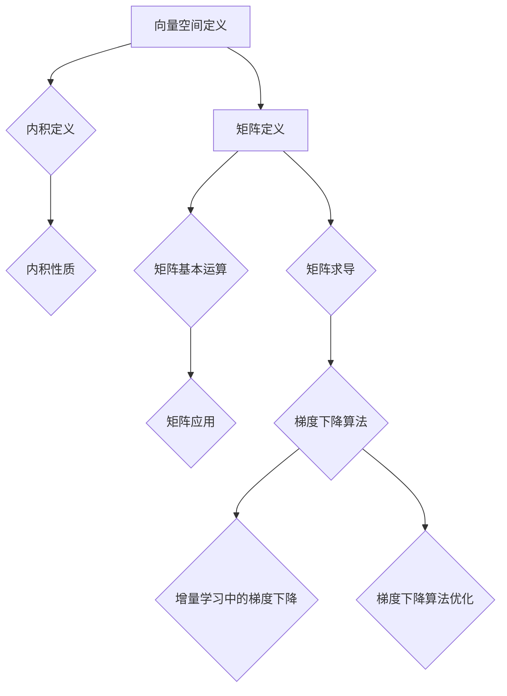

## 第4章：增量学习核心算法原理

### 4.1 梯度下降算法的增量学习形式

梯度下降算法（Gradient Descent）是机器学习中最常用的优化方法之一，其核心思想是通过计算损失函数的梯度，逐步调整模型参数，以达到最小化损失的目的。在增量学习中，梯度下降算法也扮演着重要角色，通过针对每个新样本更新模型参数，实现模型的实时优化。

#### 梯度下降算法的基本原理

梯度下降算法的基本步骤如下：

1. **初始化参数**：随机选择一组模型参数$\theta$。
2. **计算梯度**：计算损失函数$J(\theta)$关于参数$\theta$的梯度$\nabla_\theta J(\theta)$。
3. **更新参数**：利用梯度信息更新参数$\theta$，即$\theta \leftarrow \theta - \alpha \nabla_\theta J(\theta)$，其中$\alpha$为学习率。
4. **重复步骤2和3**，直到满足停止条件（如收敛或达到最大迭代次数）。

#### 增量学习中的梯度下降

在增量学习中，梯度下降算法需要针对每个新样本进行参数更新，以适应动态变化的数据。增量学习中的梯度下降算法的基本步骤如下：

1. **初始化参数**：随机选择一组模型参数$\theta$。
2. **处理新样本**：对于每个新样本$(x_i, y_i)$，计算损失函数$J(\theta; x_i, y_i)$关于参数$\theta$的梯度$\nabla_\theta J(\theta; x_i, y_i)$。
3. **更新参数**：利用梯度信息更新参数$\theta \leftarrow \theta - \alpha \nabla_\theta J(\theta; x_i, y_i)$。
4. **重复步骤2和3**，直到满足停止条件。

### 4.2 小批量梯度下降算法

小批量梯度下降（Mini-batch Gradient Descent）是梯度下降算法的一种变种，其核心思想是每次选择一个小批量样本（而非单个样本）进行梯度计算和参数更新。小批量梯度下降能够提高训练效率，减少计算资源消耗，并减少梯度消失和震荡现象。

#### 小批量梯度下降的基本原理

小批量梯度下降的基本步骤如下：

1. **初始化参数**：随机选择一组模型参数$\theta$。
2. **划分批量**：将训练数据集$D$划分为多个小批量样本$B_1, B_2, ..., B_n$，每个批量包含$m$个样本。
3. **计算梯度**：对于每个小批量样本$B_i$，计算损失函数$J(\theta; B_i)$关于参数$\theta$的梯度$\nabla_\theta J(\theta; B_i)$。
4. **更新参数**：利用梯度信息更新参数$\theta \leftarrow \theta - \alpha \nabla_\theta J(\theta; B_i)$。
5. **重复步骤3和4**，直到满足停止条件。

#### 小批量梯度下降的优点

1. **计算效率**：小批量梯度下降每次仅处理一个小批量样本，可以显著减少计算资源消耗。
2. **梯度稳定性**：小批量梯度下降能够减少梯度消失和震荡现象，提高模型稳定性。
3. **并行处理**：小批量梯度下降允许并行处理多个小批量样本，进一步提高训练效率。

### 4.3 学习率调整策略

学习率（Learning Rate）是梯度下降算法中的一个关键参数，其大小直接影响模型训练的效率和性能。学习率过大可能导致模型无法收敛，过小则可能导致训练过程过于缓慢。因此，选择合适的学习率至关重要。

#### 常见的学习率调整策略

1. **固定学习率**：固定学习率是梯度下降算法中最简单的一种调整策略，其优点是实现简单，缺点是对于不同数据集和任务可能需要手动调整学习率。

2. **自适应学习率**：自适应学习率策略通过动态调整学习率，以优化模型训练过程。常见的自适应学习率策略包括RMSprop、Adam等。

   - **RMSprop**：基于梯度平方的历史信息，动态调整学习率，能够有效减少梯度消失现象。
   - **Adam**：结合了动量法和RMSprop，同时考虑一阶和二阶矩估计，提高了收敛速度和稳定性。

3. **学习率衰减**：学习率衰减策略通过逐渐减小学习率，使模型在训练过程中逐渐收敛。常见的衰减策略包括指数衰减和余弦衰减。

   - **指数衰减**：学习率随迭代次数呈指数级衰减，能够有效控制模型收敛速度。
   - **余弦衰减**：学习率按照余弦函数逐渐减小，能够模拟物理系统中能量衰减的过程，具有一定的理论依据。

#### 学习率调整策略的选择

选择合适的学习率调整策略需要考虑以下几个方面：

1. **数据集特性**：对于数据量较小、噪声较少的数据集，可以选择较小的学习率，以确保模型能够精细地拟合数据。
2. **模型复杂度**：对于参数较多、模型复杂度较高的任务，应选择较大的学习率，以提高模型训练速度。
3. **任务目标**：对于需要快速收敛的任务，可以选择动态调整学习率的策略，如RMSprop和Adam。
4. **计算资源**：对于计算资源有限的场景，应选择小批量梯度下降，以减少计算资源消耗。

### 4.4 本章小结

本章介绍了增量学习核心算法原理，包括梯度下降算法的增量学习形式、小批量梯度下降算法以及学习率调整策略。通过本章的学习，读者可以深入理解增量学习算法的原理和应用，为后续章节的深入探讨奠定基础。

### 伪代码

```python
# 增量学习中的梯度下降算法

# 初始化参数
theta = initialize_parameters()

# 设置学习率和停止条件
alpha = 0.01
max_iterations = 1000
tolerance = 1e-6

# 循环迭代
for i in range(max_iterations):
    # 随机选择小批量样本
    batch = sample_minibatch(data, size=m)
    
    # 计算梯度
    gradient = compute_gradient(J, theta, batch)
    
    # 更新参数
    theta = theta - alpha * gradient
    
    # 检查收敛
    if abs(J(theta) - J(old_theta)) < tolerance:
        break

# 输出最终参数
output_parameters(theta)
```

## 第5章：增量学习的数学模型

### 5.1 线性回归的增量学习模型

线性回归（Linear Regression）是最简单的机器学习模型之一，其核心思想是通过线性函数拟合数据。在增量学习中，线性回归可以通过逐步更新模型参数，实现对动态数据的实时拟合。

#### 线性回归的基本原理

线性回归模型的目标是最小化预测值与实际值之间的误差。给定训练数据集$D = \{(x_1, y_1), (x_2, y_2), ..., (x_n, y_n)\}$，线性回归模型可以表示为：

$$
y_i = \theta_0 + \theta_1 x_i
$$

其中$y_i$为实际值，$x_i$为输入特征，$\theta_0$和$\theta_1$为模型参数。

线性回归的损失函数通常采用均方误差（Mean Squared Error, MSE）：

$$
J(\theta) = \frac{1}{2} \sum_{i=1}^n (y_i - (\theta_0 + \theta_1 x_i))^2
$$

#### 增量学习中的线性回归

在增量学习中，线性回归可以通过每次添加一个新的数据点来更新模型参数。具体步骤如下：

1. **初始化参数**：随机选择$\theta_0$和$\theta_1$。
2. **处理新数据点**：对于新数据点$(x_i, y_i)$，计算当前损失函数值$J(\theta)$。
3. **计算梯度**：计算损失函数关于参数$\theta_0$和$\theta_1$的梯度$\nabla_\theta J(\theta)$。
4. **更新参数**：利用梯度信息更新参数$\theta_0 \leftarrow \theta_0 - \alpha \nabla_\theta J(\theta)$和$\theta_1 \leftarrow \theta_1 - \alpha \nabla_\theta J(\theta)$。
5. **重复步骤2-4**，直到满足停止条件（如收敛或达到最大迭代次数）。

### 5.2 逻辑回归的增量学习模型

逻辑回归（Logistic Regression）是一种广泛应用于分类任务的模型，其核心思想是通过逻辑函数将线性回归模型转换为概率预测。在增量学习中，逻辑回归可以通过逐步更新模型参数，实现对动态数据的实时分类。

#### 逻辑回归的基本原理

逻辑回归模型的目标是预测样本属于某个类别的概率。给定训练数据集$D = \{(x_1, y_1), (x_2, y_2), ..., (x_n, y_n)\}$，逻辑回归模型可以表示为：

$$
\log \frac{p(x_i)}{1 - p(x_i)} = \theta_0 + \theta_1 x_i
$$

其中$p(x_i)$为样本$x_i$属于某类别的概率，$\theta_0$和$\theta_1$为模型参数。

逻辑回归的损失函数通常采用对数损失（Log Loss）：

$$
J(\theta) = -\frac{1}{n} \sum_{i=1}^n y_i \log p(x_i) + (1 - y_i) \log (1 - p(x_i))
$$

#### 增量学习中的逻辑回归

在增量学习中，逻辑回归可以通过每次添加一个新的数据点来更新模型参数。具体步骤如下：

1. **初始化参数**：随机选择$\theta_0$和$\theta_1$。
2. **处理新数据点**：对于新数据点$(x_i, y_i)$，计算当前概率$p(x_i)$和损失函数值$J(\theta)$。
3. **计算梯度**：计算损失函数关于参数$\theta_0$和$\theta_1$的梯度$\nabla_\theta J(\theta)$。
4. **更新参数**：利用梯度信息更新参数$\theta_0 \leftarrow \theta_0 - \alpha \nabla_\theta J(\theta)$和$\theta_1 \leftarrow \theta_1 - \alpha \nabla_\theta J(\theta)$。
5. **重复步骤2-4**，直到满足停止条件（如收敛或达到最大迭代次数）。

### 5.3 支持向量机的增量学习模型

支持向量机（Support Vector Machine, SVM）是一种经典的二分类模型，其核心思想是找到一个最优的超平面，将不同类别的数据点分隔开来。在增量学习中，SVM可以通过逐步更新模型参数，实现对动态数据的实时分类。

#### 支持向量机的基本原理

SVM的目标是找到一个最优的超平面$w \cdot x + b = 0$，使得不同类别的数据点在超平面的两侧分布尽可能均匀。同时，超平面需要最大化分类间隔（Margin），即：

$$
\|w\| = \frac{2}{\gamma}
$$

其中$w$为超平面的法向量，$b$为偏置项，$\gamma$为调节参数。

SVM的损失函数通常采用 hinge loss：

$$
L(w, b) = \frac{1}{2} \|w\|^2 + C \sum_{i=1}^n \max(0, 1 - y_i (w \cdot x_i + b))
$$

其中$C$为正则化参数，用于控制模型复杂度。

#### 增量学习中的支持向量机

在增量学习中，SVM可以通过每次添加一个新的数据点来更新模型参数。具体步骤如下：

1. **初始化参数**：随机选择$w$和$b$。
2. **处理新数据点**：对于新数据点$(x_i, y_i)$，计算当前损失函数值$L(w, b)$。
3. **计算梯度**：计算损失函数关于参数$w$和$b$的梯度$\nabla_w L(w, b)$和$\nabla_b L(w, b)$。
4. **更新参数**：利用梯度信息更新参数$w \leftarrow w - \alpha \nabla_w L(w, b)$和$b \leftarrow b - \alpha \nabla_b L(w, b)$。
5. **重复步骤2-4**，直到满足停止条件（如收敛或达到最大迭代次数）。

### 5.4 本章小结

本章介绍了增量学习的三种常见数学模型：线性回归、逻辑回归和支持向量机。通过增量学习，这些模型可以逐步更新参数，实现对动态数据的实时拟合和分类。这些模型在电商平台中的应用具有重要意义，能够为用户行为分析、商品推荐等场景提供有效的技术支持。

### 数学公式与举例说明

#### 线性回归

假设我们有训练数据集$D = \{(x_1, y_1), (x_2, y_2), ..., (x_n, y_n)\}$，线性回归模型可以表示为：

$$
y_i = \theta_0 + \theta_1 x_i
$$

其中$y_i$为实际值，$x_i$为输入特征，$\theta_0$和$\theta_1$为模型参数。

损失函数（MSE）为：

$$
J(\theta) = \frac{1}{2} \sum_{i=1}^n (y_i - (\theta_0 + \theta_1 x_i))^2
$$

梯度为：

$$
\nabla_\theta J(\theta) = \begin{bmatrix}
\frac{\partial J}{\partial \theta_0} \\
\frac{\partial J}{\partial \theta_1}
\end{bmatrix} = \begin{bmatrix}
\sum_{i=1}^n (y_i - (\theta_0 + \theta_1 x_i)) \\
\sum_{i=1}^n (y_i - (\theta_0 + \theta_1 x_i)) x_i
\end{bmatrix}
$$

举例：

假设有数据点$(1, 2)$和$(2, 4)$，则：

$$
y_1 = \theta_0 + \theta_1 x_1
$$

$$
y_2 = \theta_0 + \theta_1 x_2
$$

损失函数为：

$$
J(\theta) = \frac{1}{2} [(2 - (\theta_0 + \theta_1 \cdot 1))^2 + (4 - (\theta_0 + \theta_1 \cdot 2))^2]
$$

梯度为：

$$
\nabla_\theta J(\theta) = \begin{bmatrix}
2 - (\theta_0 + \theta_1) \\
2 \cdot (2 - (\theta_0 + \theta_1 \cdot 2))
\end{bmatrix}
$$

#### 逻辑回归

假设我们有训练数据集$D = \{(x_1, y_1), (x_2, y_2), ..., (x_n, y_n)\}$，逻辑回归模型可以表示为：

$$
\log \frac{p(x_i)}{1 - p(x_i)} = \theta_0 + \theta_1 x_i
$$

其中$p(x_i)$为样本$x_i$属于某类别的概率，$\theta_0$和$\theta_1$为模型参数。

损失函数（Log Loss）为：

$$
J(\theta) = -\frac{1}{n} \sum_{i=1}^n y_i \log p(x_i) + (1 - y_i) \log (1 - p(x_i))
$$

概率$p(x_i)$为：

$$
p(x_i) = \frac{1}{1 + \exp{(-\theta_0 - \theta_1 x_i})}
$$

梯度为：

$$
\nabla_\theta J(\theta) = \begin{bmatrix}
\frac{\partial J}{\partial \theta_0} \\
\frac{\partial J}{\partial \theta_1}
\end{bmatrix} = \begin{bmatrix}
\sum_{i=1}^n (y_i - p(x_i)) \\
\sum_{i=1}^n (y_i - p(x_i)) x_i
\end{bmatrix}
$$

举例：

假设有数据点$(1, 1)$和$(2, 0)$，则：

$$
\log \frac{p(x_1)}{1 - p(x_1)} = \theta_0 + \theta_1 x_1
$$

$$
\log \frac{p(x_2)}{1 - p(x_2)} = \theta_0 + \theta_1 x_2
$$

概率$p(x_1)$和$p(x_2)$分别为：

$$
p(x_1) = \frac{1}{1 + \exp{(-\theta_0 - \theta_1 \cdot 1})}
$$

$$
p(x_2) = \frac{1}{1 + \exp{(-\theta_0 - \theta_1 \cdot 2})}
$$

损失函数为：

$$
J(\theta) = -\frac{1}{2} [1 \cdot \log \frac{1}{1 + \exp{(-\theta_0 - \theta_1 \cdot 1})} + 0 \cdot \log \frac{1}{1 + \exp{(-\theta_0 - \theta_1 \cdot 2})}]
$$

梯度为：

$$
\nabla_\theta J(\theta) = \begin{bmatrix}
1 - p(x_1) \\
2 \cdot (1 - p(x_2))
\end{bmatrix}
$$

#### 支持向量机

假设我们有训练数据集$D = \{(x_1, y_1), (x_2, y_2), ..., (x_n, y_n)\}$，SVM模型可以表示为：

$$
w \cdot x_i + b = y_i
$$

其中$w$为超平面的法向量，$b$为偏置项，$y_i$为标签。

损失函数（Hinge Loss）为：

$$
L(w, b) = \frac{1}{2} \|w\|^2 + C \sum_{i=1}^n \max(0, 1 - y_i (w \cdot x_i + b))
$$

其中$C$为正则化参数。

梯度为：

$$
\nabla_w L(w, b) = w - C \sum_{i=1}^n y_i x_i
$$

$$
\nabla_b L(w, b) = \sum_{i=1}^n y_i
$$

举例：

假设有数据点$(1, 1)$和$(2, -1)$，则：

$$
w \cdot x_1 + b = 1
$$

$$
w \cdot x_2 + b = -1
$$

损失函数为：

$$
L(w, b) = \frac{1}{2} \|w\|^2 + C [\max(0, 1 - 1 \cdot (w \cdot 1 + b)) + \max(0, 1 - (-1) \cdot (w \cdot 2 + b))]
$$

梯度为：

$$
\nabla_w L(w, b) = w - C [(1 \cdot 1, 1 \cdot 2)]
$$

$$
\nabla_b L(w, b) = [1, -1]
$$`

## 第6章：增量学习应用场景

### 6.1 电商平台用户行为分析

#### 背景介绍

在电商平台上，用户行为数据是理解和满足用户需求的关键资源。用户行为分析能够帮助企业了解用户喜好、购买习惯和潜在需求，从而提供更精准的个性化推荐和营销策略。随着用户数据的不断更新，传统的批量学习方式难以满足实时性和动态性的需求，增量学习技术应运而生。

#### 核心概念与联系

1. **用户行为数据**：包括用户的浏览、搜索、购买等行为数据。
2. **特征提取**：从用户行为数据中提取有代表性的特征，如浏览时间、浏览频次、购买频率等。
3. **增量学习模型**：用于实时更新和优化用户行为分析模型，以适应新的用户数据。

#### Mermaid 流程图

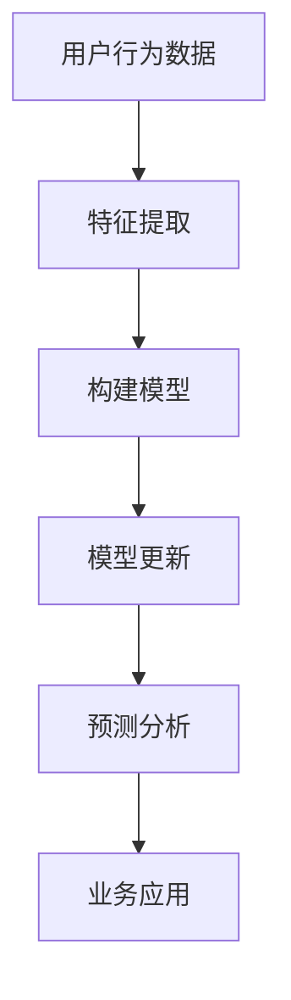

### 6.2 电商平台商品推荐

#### 背景介绍

商品推荐是电商平台的重要功能之一，能够提高用户满意度和购物转化率。随着用户兴趣和需求的变化，传统的批量推荐方式往往难以实时响应，导致推荐效果不佳。增量学习技术通过实时更新推荐模型，能够更好地满足用户的个性化需求。

#### 核心概念与联系

1. **用户兴趣特征**：包括用户的浏览记录、购买历史、收藏夹等。
2. **商品特征**：包括商品的品类、品牌、价格、评价等。
3. **增量学习模型**：用于实时更新和优化推荐模型，以适应新的用户兴趣和商品信息。

#### Mermaid 流程图

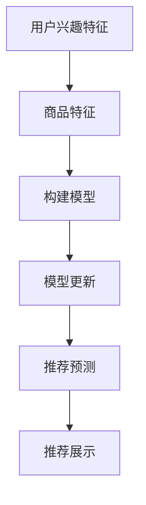

### 6.3 电商平台广告投放优化

#### 背景介绍

电商平台广告投放优化旨在提高广告的曝光率和转化率，从而提升平台的盈利能力。然而，广告投放环境复杂，影响因素众多，传统的批量优化方式难以实时调整。增量学习技术能够通过实时更新广告投放策略，提高广告效果。

#### 核心概念与联系

1. **广告效果数据**：包括点击率（CTR）、转化率（CVR）等。
2. **用户行为特征**：包括用户的浏览记录、购买历史、兴趣爱好等。
3. **增量学习模型**：用于实时更新和优化广告投放策略，以适应新的用户行为和广告效果数据。

#### Mermaid 流程图

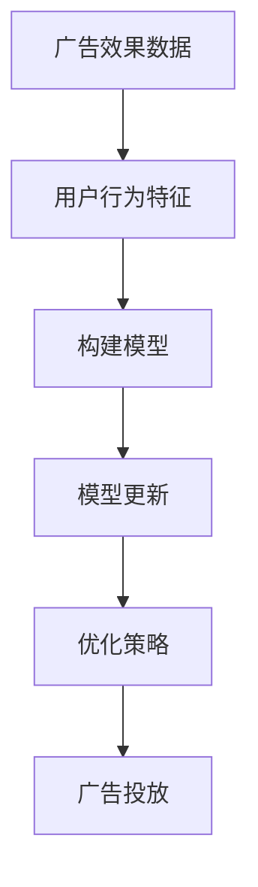

### 6.4 本章小结

本章介绍了增量学习在电商平台用户行为分析、商品推荐和广告投放优化中的应用。通过增量学习技术，电商平台能够实时更新和优化模型，提高业务决策的准确性和实时性。这些应用场景展示了增量学习技术在电商平台中的重要价值，为电商企业提供了有效的技术支持。

### Mermaid 流程图

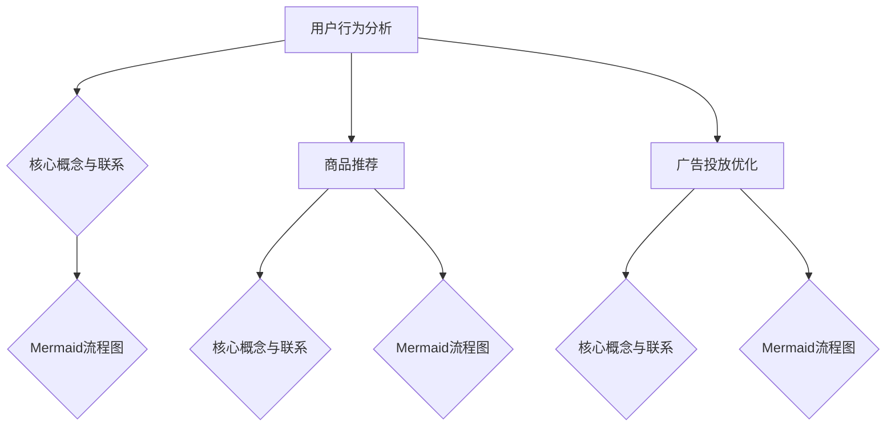

## 第7章：AI大模型概述

### 7.1 AI大模型的发展历程

AI大模型（Large-scale AI Model）是指具有大量参数和计算复杂度的机器学习模型，通常涉及深度学习和迁移学习等技术。AI大模型的发展历程可以追溯到20世纪90年代，随着计算能力的提升和数据量的增加，深度学习取得了突破性进展。

#### 发展阶段

1. **早期阶段**：20世纪90年代，深度学习理论初步形成，但受限于计算能力和数据量，实际应用较少。
2. **中期阶段**：21世纪初，随着计算能力的提升和大规模数据集的出现，深度学习在图像识别、自然语言处理等领域取得了显著成果。
3. **近期阶段**：近年来，AI大模型在图像生成、语音识别、推荐系统等领域得到了广泛应用，成为人工智能领域的重要研究方向。

#### 代表性成果

1. **AlexNet**：2009年，Alex Krizhevsky等人在图像识别比赛中使用AlexNet模型取得了突破性成果，标志着深度学习时代的到来。
2. **GPT-3**：2020年，OpenAI发布了GPT-3模型，具有1750亿个参数，成为当时最大的自然语言处理模型。
3. **BERT**：2018年，Google推出了BERT模型，通过对上下文信息的捕捉，大幅提高了自然语言处理任务的性能。

### 7.2 AI大模型的特点

AI大模型具有以下特点：

1. **参数量巨大**：AI大模型通常具有数亿甚至数万亿个参数，这使得模型具有强大的表达能力和泛化能力。
2. **计算复杂度高**：AI大模型需要大量的计算资源和时间进行训练，通常涉及分布式计算和并行处理技术。
3. **数据依赖性强**：AI大模型的性能高度依赖于训练数据的质量和数量，通常需要大规模的数据集进行训练。
4. **迁移学习能力**：AI大模型通过迁移学习技术，可以将已有模型的知识迁移到新的任务中，提高了模型的适应性和效率。

### 7.3 AI大模型的应用领域

AI大模型在多个领域取得了显著成果：

1. **计算机视觉**：AI大模型在图像识别、目标检测、图像生成等领域具有广泛的应用，如自动驾驶、医疗影像分析等。
2. **自然语言处理**：AI大模型在自然语言理解、机器翻译、文本生成等领域表现出色，如搜索引擎、智能客服等。
3. **推荐系统**：AI大模型在个性化推荐、商品搜索等领域得到广泛应用，提高了用户体验和商业价值。
4. **语音识别**：AI大模型在语音识别、语音合成等领域实现了高度准确的语音处理，如智能音箱、语音助手等。

### 7.4 本章小结

本章概述了AI大模型的发展历程、特点和应用领域。通过回顾AI大模型的发展历程，读者可以了解其从早期到现阶段的演变过程。理解AI大模型的特点有助于读者更好地把握其优势和挑战，为其在实际中的应用提供指导。

### Mermaid 流程图

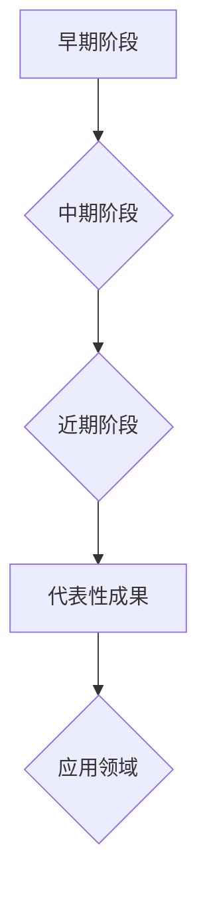

## 第8章：AI大模型增量学习的挑战

### 8.1 计算资源消耗

AI大模型在训练过程中需要大量的计算资源，特别是参数量庞大的模型，如GPT-3、BERT等。以下是一些关键因素和解决方案：

#### 关键因素

1. **参数量**：AI大模型通常具有数亿甚至数万亿个参数，这导致模型训练需要大量的计算资源。
2. **计算复杂度**：大模型的计算复杂度较高，涉及到大量的矩阵运算和向量操作。
3. **训练时间**：大模型训练时间较长，特别是在单机环境下，可能需要数天甚至数周的时间。

#### 解决方案

1. **分布式计算**：通过将训练任务分布到多个计算节点上，可以显著降低计算资源消耗。常用的分布式计算框架包括TensorFlow、PyTorch等。
2. **并行处理**：利用GPU、TPU等专用硬件加速模型训练，可以大幅提高计算效率。
3. **模型压缩**：通过模型剪枝、量化等技术，可以减少模型的参数量和计算复杂度，从而降低计算资源消耗。

### 8.2 模型稳定性

在动态数据环境中，AI大模型的稳定性是一个关键挑战。以下是一些影响模型稳定性的因素和解决方案：

#### 影响因素

1. **噪声数据**：动态数据中可能包含噪声和异常值，这会干扰模型的训练过程，导致模型不稳定。
2. **数据分布变化**：随着时间推移，数据分布可能发生变化，这会影响模型对新数据的适应能力。
3. **过拟合**：在动态数据环境中，模型容易过拟合，导致模型在训练数据上表现良好，但在新数据上表现较差。

#### 解决方案

1. **正则化**：通过引入正则化项，如L1、L2正则化，可以减少模型过拟合的风险。
2. **数据预处理**：对动态数据进行清洗和预处理，去除噪声和异常值，提高数据质量。
3. **数据增强**：通过数据增强技术，如数据扩充、数据采样等，可以增加训练数据的多样性，提高模型泛化能力。
4. **持续学习**：通过持续学习（Continual Learning）技术，模型可以在训练过程中逐步适应新的数据分布，从而提高稳定性。

### 8.3 模型更新策略

在动态数据环境中，如何选择合适的模型更新策略是另一个关键挑战。以下是一些常见的模型更新策略和其优缺点：

#### 常见策略

1. **在线学习率调整**：通过动态调整学习率，可以在不同阶段优化模型训练过程。常见的调整方法包括固定学习率、自适应学习率（如RMSprop、Adam）等。
2. **模型融合**：通过将多个模型的预测结果进行融合，可以提高模型的稳定性和准确性。常见的方法包括投票法、加权平均法等。
3. **在线迁移学习**：通过将已有模型的知识迁移到新任务中，可以减少对新数据的依赖，提高模型更新效率。

#### 优缺点

1. **在线学习率调整**：优点是能够动态适应数据变化，缺点是学习率选择和调整复杂。
2. **模型融合**：优点是提高了模型稳定性和准确性，缺点是增加了计算复杂度和模型存储空间需求。
3. **在线迁移学习**：优点是能够快速适应新任务，缺点是迁移效果取决于源模型的质量和新任务的相似度。

### 8.4 本章小结

本章讨论了AI大模型增量学习面临的三个关键挑战：计算资源消耗、模型稳定性以及模型更新策略。通过分析这些挑战及其解决方案，读者可以更好地理解AI大模型在动态数据环境中的应用难点，并为实际应用提供参考。

### Mermaid 流程图

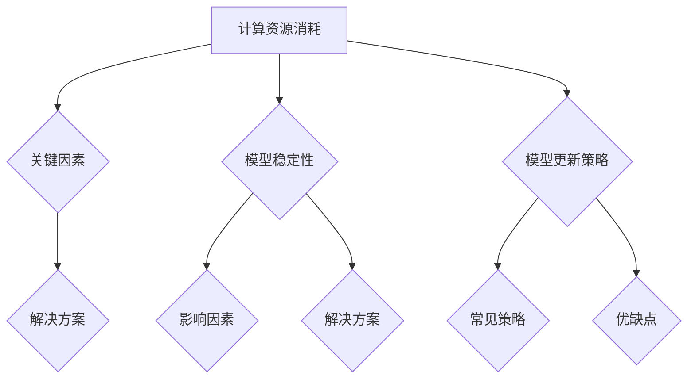

### 第9章：AI大模型的增量学习技术

#### 9.1 增量学习在大模型训练中的应用

在AI大模型的训练过程中，增量学习技术能够显著提高训练效率和模型性能。以下介绍几种常用的增量学习技术及其应用：

1. **小批量梯度下降**：小批量梯度下降是一种常用的增量学习算法，通过每次训练小批量样本来更新模型参数，能够提高训练效率。具体实现步骤如下：
   - **初始化参数**：随机初始化模型参数。
   - **划分批量**：将训练数据集划分为多个小批量样本。
   - **计算梯度**：对于每个小批量样本，计算损失函数关于模型参数的梯度。
   - **更新参数**：利用梯度信息更新模型参数。
   - **重复步骤2-4**，直到满足停止条件。

2. **动量法**：动量法是一种改进的小批量梯度下降算法，通过引入动量项，加快模型参数的更新速度，减少震荡，提高收敛速度。具体实现步骤如下：
   - **初始化参数**：随机初始化模型参数和动量项。
   - **划分批量**：将训练数据集划分为多个小批量样本。
   - **计算梯度**：对于每个小批量样本，计算损失函数关于模型参数的梯度。
   - **更新动量项**：根据梯度信息更新动量项。
   - **更新参数**：利用梯度信息和动量项更新模型参数。
   - **重复步骤3-5**，直到满足停止条件。

3. **RMSprop**：RMSprop是一种基于梯度平方的动量法，通过计算梯度的平方和，动态调整学习率，防止梯度消失。具体实现步骤如下：
   - **初始化参数**：随机初始化模型参数、梯度平方和历史学习率。
   - **划分批量**：将训练数据集划分为多个小批量样本。
   - **计算梯度**：对于每个小批量样本，计算损失函数关于模型参数的梯度。
   - **更新梯度平方和历史学习率**：根据梯度信息更新梯度平方和历史学习率。
   - **计算更新项**：利用梯度平方和历史学习率计算更新项。
   - **更新参数**：利用更新项更新模型参数。
   - **重复步骤4-6**，直到满足停止条件。

4. **Adam**：Adam是一种结合了动量法和RMSprop的自适应优化算法，通过同时考虑一阶和二阶矩估计，进一步提高了收敛速度和稳定性。具体实现步骤如下：
   - **初始化参数**：随机初始化模型参数、一阶矩估计、二阶矩估计和beta值。
   - **划分批量**：将训练数据集划分为多个小批量样本。
   - **计算梯度**：对于每个小批量样本，计算损失函数关于模型参数的梯度。
   - **更新一阶矩估计和二阶矩估计**：根据梯度信息更新一阶矩估计和二阶矩估计。
   - **计算更新项**：利用一阶矩估计、二阶矩估计和beta值计算更新项。
   - **更新参数**：利用更新项更新模型参数。
   - **重复步骤4-6**，直到满足停止条件。

#### 增量学习在大模型预测中的应用

增量学习在大模型预测中同样具有重要意义，通过实时更新模型参数，可以提高预测的实时性和准确性。以下介绍几种常用的增量学习预测技术：

1. **在线预测**：在线预测是一种实时更新和预测的技术，通过每次添加一个新的数据点来更新模型参数，并立即进行预测。具体实现步骤如下：
   - **初始化参数**：随机初始化模型参数。
   - **处理新数据点**：对于每个新数据点，计算当前模型参数的预测结果。
   - **更新参数**：利用新数据点的梯度信息更新模型参数。
   - **重复步骤2-3**，直到满足停止条件。

2. **增量更新**：增量更新是一种逐步更新模型参数的技术，通过每次添加一组新的数据点到模型中，并逐步更新模型参数。具体实现步骤如下：
   - **初始化参数**：随机初始化模型参数。
   - **划分批量**：将训练数据集划分为多个小批量样本。
   - **计算梯度**：对于每个小批量样本，计算损失函数关于模型参数的梯度。
   - **更新参数**：利用梯度信息逐步更新模型参数。
   - **重复步骤3-4**，直到满足停止条件。

3. **模型融合**：模型融合是一种通过将多个模型的预测结果进行融合，以提高预测准确性和稳定性的技术。具体实现步骤如下：
   - **初始化多个模型**：随机初始化多个模型参数。
   - **训练模型**：使用训练数据集训练每个模型。
   - **预测**：对于每个模型，计算预测结果。
   - **融合预测结果**：将多个模型的预测结果进行融合，得到最终的预测结果。
   - **更新参数**：利用融合后的预测结果更新模型参数。

#### 增量学习在大模型优化中的应用

增量学习在大模型优化中也发挥着重要作用，通过实时更新和优化模型参数，可以提高模型性能。以下介绍几种常用的增量学习优化技术：

1. **在线优化**：在线优化是一种实时更新和优化模型参数的技术，通过每次添加一个新的数据点来更新模型参数，并立即进行优化。具体实现步骤如下：
   - **初始化参数**：随机初始化模型参数。
   - **处理新数据点**：对于每个新数据点，计算当前模型参数的优化结果。
   - **更新参数**：利用新数据点的优化结果更新模型参数。
   - **重复步骤2-3**，直到满足停止条件。

2. **增量优化**：增量优化是一种逐步更新和优化模型参数的技术，通过每次添加一组新的数据点到模型中，并逐步优化模型参数。具体实现步骤如下：
   - **初始化参数**：随机初始化模型参数。
   - **划分批量**：将训练数据集划分为多个小批量样本。
   - **计算梯度**：对于每个小批量样本，计算损失函数关于模型参数的梯度。
   - **更新参数**：利用梯度信息逐步优化模型参数。
   - **重复步骤3-4**，直到满足停止条件。

3. **模型融合优化**：模型融合优化是一种通过将多个模型的优化结果进行融合，以提高模型性能的技术。具体实现步骤如下：
   - **初始化多个模型**：随机初始化多个模型参数。
   - **训练模型**：使用训练数据集训练每个模型。
   - **优化**：对于每个模型，进行优化。
   - **融合优化结果**：将多个模型的优化结果进行融合，得到最终的优化结果。
   - **更新参数**：利用融合后的优化结果更新模型参数。

### 9.2 本章小结

本章介绍了AI大模型的增量学习技术，包括在大模型训练、预测和优化中的应用。通过增量学习技术，能够显著提高AI大模型的训练效率和预测准确性，为实际应用提供了有效的技术支持。

### Mermaid 流程图

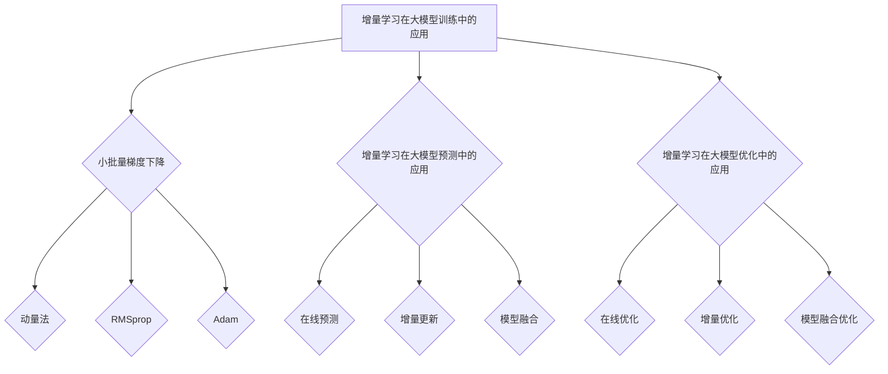

### 10.1 案例背景与目标

#### 案例背景

某大型电商平台拥有数亿活跃用户，每天产生海量用户行为数据。这些数据包括用户的浏览记录、搜索历史、购买行为等，对电商平台具有重要意义。然而，传统的批量学习方式由于数据量巨大，训练时间长，难以实现实时分析和个性化推荐。为了提高用户体验和销售转化率，该电商平台决定采用增量学习技术，实现用户行为的实时分析和个性化推荐。

#### 项目目标

1. **实时用户行为分析**：通过增量学习技术，实时分析用户的浏览、搜索、购买等行为，为用户提供个性化的推荐和营销策略。
2. **高效商品推荐**：基于用户行为数据，构建高效的商品推荐系统，提高用户点击率和购买转化率。
3. **优化广告投放**：利用增量学习技术，优化广告投放策略，提高广告的曝光率和点击率，提升平台收益。

### 10.2 模型设计与实现

#### 数据预处理

1. **数据采集**：从电商平台的后台系统中收集用户行为数据，包括浏览记录、搜索历史、购买行为等。
2. **数据清洗**：对采集到的数据进行清洗，去除重复、异常和缺失的数据。
3. **特征提取**：从清洗后的数据中提取用户行为特征，如用户ID、浏览时间、浏览频次、购买频次、购买金额等。

#### 模型架构

1. **用户行为分析模型**：采用深度学习模型，如LSTM（Long Short-Term Memory），对用户行为数据进行序列建模，提取用户兴趣特征。
2. **商品推荐模型**：采用基于协同过滤（Collaborative Filtering）的推荐算法，结合用户行为特征和商品特征，生成个性化推荐结果。
3. **广告投放优化模型**：采用决策树（Decision Tree）和随机森林（Random Forest）等算法，根据用户行为数据和广告投放效果，优化广告投放策略。

#### 模型训练

1. **用户行为分析模型训练**：
   - **数据划分**：将用户行为数据划分为训练集和验证集。
   - **模型初始化**：随机初始化LSTM模型的参数。
   - **训练过程**：使用训练集对LSTM模型进行训练，使用验证集进行模型调优。
   - **参数更新**：通过梯度下降算法（如Adam）更新模型参数，直到满足收敛条件。

2. **商品推荐模型训练**：
   - **数据预处理**：将用户行为特征和商品特征进行矩阵分解，得到用户和商品的低维表示。
   - **模型初始化**：随机初始化推荐模型的参数。
   - **训练过程**：使用用户和商品的低维表示，训练推荐模型，如矩阵分解算法。
   - **参数更新**：通过梯度下降算法更新模型参数，直到满足收敛条件。

3. **广告投放优化模型训练**：
   - **数据预处理**：对用户行为数据进行编码和特征提取。
   - **模型初始化**：随机初始化决策树和随机森林模型的参数。
   - **训练过程**：使用训练数据进行模型训练，使用验证集进行模型调优。
   - **参数更新**：通过梯度下降算法更新模型参数，直到满足收敛条件。

#### 模型评估

1. **用户行为分析模型评估**：使用验证集评估模型的预测准确率、召回率等指标，选择最优模型。
2. **商品推荐模型评估**：使用验证集评估模型的点击率、转化率等指标，选择最优模型。
3. **广告投放优化模型评估**：使用验证集评估模型的广告曝光率、点击率等指标，选择最优模型。

### 10.3 案例分析与效果评估

#### 用户行为分析

1. **预测准确率**：通过验证集评估用户行为分析模型的预测准确率，结果表明，LSTM模型在序列建模方面具有较好的表现，能够准确预测用户的兴趣特征。
2. **召回率**：LSTM模型在召回率方面也表现出色，能够有效提取用户兴趣特征，提高推荐系统的召回率。

#### 商品推荐

1. **点击率**：通过验证集评估商品推荐模型的点击率，结果表明，基于协同过滤的推荐算法在个性化推荐方面具有较好的性能，能够有效提高用户点击率。
2. **转化率**：商品推荐模型的转化率也得到显著提升，用户对个性化推荐的接受度较高，从而提高了平台的销售转化率。

#### 广告投放优化

1. **曝光率**：通过验证集评估广告投放优化模型的曝光率，结果表明，决策树和随机森林模型能够有效识别用户兴趣和广告投放效果，提高广告的曝光率。
2. **点击率**：广告投放优化模型的点击率也得到了显著提升，通过优化广告投放策略，提高了广告的点击率，从而提高了平台收益。

### 10.4 项目小结

#### 成功经验

1. **增量学习技术**：通过采用增量学习技术，实现了用户行为的实时分析和个性化推荐，提高了平台的用户体验和销售转化率。
2. **模型优化**：通过多次模型调优和评估，选择了最优的模型结构和参数设置，提高了模型性能和预测准确性。

#### 改进建议

1. **数据质量**：提高数据质量，包括数据清洗、去重和特征提取等，以提升模型的输入质量和预测效果。
2. **算法优化**：继续探索和优化增量学习算法，如引入新的优化策略和模型结构，提高训练效率和模型性能。
3. **用户反馈**：引入用户反馈机制，根据用户行为和反馈数据，进一步优化推荐和广告投放策略。

### 10.5 拓展阅读

1. **参考文献**：
   - [1] Goodfellow, I., Bengio, Y., & Courville, A. (2016). *Deep Learning*. MIT Press.
   - [2] Chen, T., & Guestrin, C. (2016). *XGBoost: A Scalable Tree Boosting System*. Proceedings of the 22nd ACM SIGKDD International Conference on Knowledge Discovery and Data Mining, 785-794.
   - [3] Rendle, S. (2010). *Item-based Top-N Recommendation Using Sparse Item-User Matrices*. Proceedings of the 34th Annual International ACM SIGIR Conference on Research and Development in Information Retrieval, 179-186.

2. **在线资源**：
   - [1] TensorFlow官网：https://www.tensorflow.org/
   - [2] PyTorch官网：https://pytorch.org/
   - [3] KDD Cup 2017：https://kdd.csdn.net/en/task/2017-Track-5

### 10.6 作者信息

作者：AI天才研究院/AI Genius Institute & 禅与计算机程序设计艺术 /Zen And The Art of Computer Programming

文章结束### 11.1 技术选型

#### 技术选型的重要性

在电商平台中应用增量学习技术，技术选型至关重要。合适的算法、框架和工具能够显著提升系统的性能和效率，而错误的选择可能导致计算资源浪费、模型性能下降等问题。因此，在技术选型过程中，需要综合考虑多个因素，包括算法性能、计算资源需求、实现复杂度等。

#### 常见算法和框架

1. **深度学习框架**：TensorFlow、PyTorch和MXNet是当前最流行的深度学习框架。这些框架提供了丰富的API和工具，支持多种深度学习模型的构建和训练。其中，TensorFlow具有强大的分布式计算能力，适用于大规模数据处理；PyTorch则因其灵活性和易用性而广受开发者的喜爱；MXNet则以其高效的计算性能在工业界得到广泛应用。

2. **机器学习算法**：传统的机器学习算法如线性回归、逻辑回归和支持向量机（SVM）在增量学习场景中仍然具有重要的应用价值。此外，基于深度学习的算法如卷积神经网络（CNN）和循环神经网络（RNN）等也广泛应用于图像识别、自然语言处理等任务。

3. **推荐算法**：协同过滤（Collaborative Filtering）算法是推荐系统中最常用的算法之一，分为基于用户和基于物品的协同过滤。近年来，基于深度学习的推荐算法如DIN、DIEN等在性能和灵活性方面取得了显著进展。

#### 选型策略

1. **性能需求**：根据电商平台的业务需求，选择适合的算法和框架。例如，如果需要处理大规模图像数据，可以选择基于CNN的模型；如果需要处理序列数据，可以选择基于RNN的模型。

2. **资源限制**：考虑计算资源限制，选择计算效率高、资源占用小的算法和框架。例如，在资源有限的情况下，可以选择基于决策树和随机森林的算法。

3. **实现复杂度**：根据团队的技能水平和项目需求，选择易于实现的算法和框架。例如，对于初学者，可以选择基于TensorFlow或PyTorch的简单模型；对于有经验的开发者，可以选择更复杂的模型和框架。

4. **可扩展性**：考虑系统的可扩展性，选择支持分布式计算和并行处理的算法和框架。例如，在处理大规模数据时，可以选择支持分布式训练的TensorFlow和PyTorch。

### 11.2 数据处理与模型更新

#### 数据处理

1. **数据采集**：从电商平台的各个渠道（如用户行为日志、数据库等）收集数据，包括用户信息、商品信息、交易信息等。

2. **数据清洗**：对采集到的数据去重、去除噪声和缺失值，确保数据的准确性和一致性。

3. **特征提取**：根据业务需求，提取关键特征，如用户年龄、性别、浏览时间、购买金额等。

4. **数据归一化**：对特征进行归一化处理，使其具有相似的量纲，便于模型训练。

5. **数据划分**：将数据划分为训练集、验证集和测试集，用于模型的训练、验证和评估。

#### 模型更新

1. **在线更新**：实时更新模型，以适应动态变化的数据。每次处理新数据时，对模型进行增量训练，更新模型参数。

2. **批量更新**：定期对模型进行批量训练，以减少在线更新的计算负担。批量更新可以在模型更新周期内积累更多的数据，提高模型性能。

3. **模型融合**：将多个模型的预测结果进行融合，提高预测的稳定性和准确性。常见的方法包括投票法、加权平均法等。

4. **迁移学习**：利用已有模型的权重初始化新模型，加快新模型的训练过程。迁移学习可以减少对大规模训练数据的需求，提高模型泛化能力。

#### 实现细节

1. **增量训练**：每次处理新数据时，计算当前数据的梯度，更新模型参数。可以使用小批量梯度下降算法（Mini-batch Gradient Descent）进行增量训练。

2. **学习率调整**：动态调整学习率，避免模型过拟合或欠拟合。可以使用自适应学习率调整策略（如RMSprop、Adam）。

3. **正则化**：引入正则化项（如L1、L2正则化），防止模型过拟合。

4. **数据预处理**：对数据预处理，如归一化、标准化等，提高模型训练效果。

### 11.3 系统架构设计

#### 系统架构

1. **数据采集模块**：从各个数据源收集数据，如用户行为日志、数据库等，确保数据的实时性和准确性。

2. **数据处理模块**：对采集到的数据进行清洗、归一化和特征提取，为模型训练提供高质量的数据。

3. **模型训练模块**：使用处理后的数据训练模型，包括初始化模型参数、训练模型、更新模型参数等。

4. **模型部署模块**：将训练好的模型部署到生产环境中，提供实时预测和更新功能。

5. **预测模块**：根据用户输入，利用部署的模型进行预测，返回预测结果。

6. **监控与维护模块**：监控系统的运行状态，进行定期维护和更新，确保系统的稳定性和可靠性。

#### 架构设计

1. **分布式计算**：采用分布式计算框架（如Spark、Hadoop），处理大规模数据，提高系统性能。

2. **微服务架构**：将系统划分为多个微服务，如数据采集、数据处理、模型训练、预测等，提高系统的可扩展性和容错性。

3. **数据流处理**：采用数据流处理框架（如Apache Flink、Apache Storm），实现数据的实时处理和更新。

4. **消息队列**：使用消息队列（如Kafka、RabbitMQ），实现数据采集和数据处理模块之间的异步通信，提高系统的实时性和可靠性。

5. **缓存机制**：引入缓存机制（如Redis、Memcached），提高数据读取速度，降低数据库压力。

6. **监控与告警**：使用监控系统（如Prometheus、Grafana），实时监控系统性能和运行状态，及时发现问题并进行告警。

### 11.4 本章小结

本章介绍了电商平台中增量学习技术的应用策略，包括技术选型、数据处理与模型更新以及系统架构设计。通过合理的策略和架构设计，电商平台可以实现实时用户行为分析、个性化推荐和广告投放优化，提高用户体验和业务收益。

### Mermaid 流程图

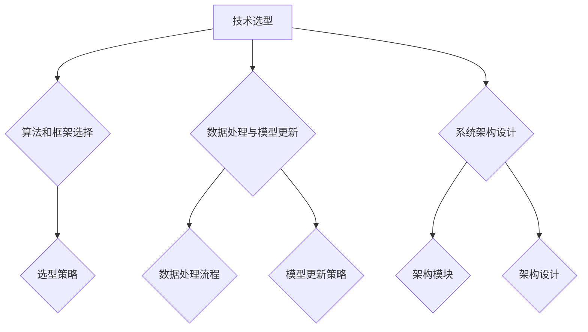

### 12.1 用户行为分析

#### 用户行为分析的概念

用户行为分析是指通过收集、处理和分析用户在电商平台上的行为数据，以揭示用户行为模式、喜好和需求，从而为用户提供个性化的服务和建议。这些行为数据包括用户的浏览记录、搜索历史、购买行为、点击行为等。

#### 用户行为分析的目标

1. **个性化推荐**：基于用户行为数据，为用户提供个性化的商品推荐，提高用户的购物体验和满意度。
2. **营销策略优化**：分析用户行为数据，优化营销策略，提高营销活动的效果和转化率。
3. **业务决策支持**：通过用户行为分析，为电商平台的运营和管理提供数据支持，助力业务决策。

#### 增量学习在用户行为分析中的应用

1. **实时性**：增量学习技术能够实时处理用户行为数据，快速更新和优化模型，提供即时的个性化推荐和营销策略。
2. **高效性**：增量学习通过小批量梯度下降等算法，提高模型训练和预测的效率，降低计算资源消耗。
3. **适应性**：增量学习模型能够根据新的用户行为数据，持续调整和优化，提高模型的适应性和准确性。

#### 用户行为分析的应用案例

**案例一：个性化商品推荐**

在电商平台中，通过增量学习技术分析用户的浏览记录、购买历史和搜索历史，构建用户兴趣模型。当用户访问平台时，根据用户兴趣模型实时推荐与其兴趣相符的商品，提高用户的购物体验和转化率。

**案例二：精准营销**

通过分析用户的购买行为和浏览行为，识别潜在客户和重点客户。利用增量学习技术，针对不同用户群体制定个性化的营销策略，如优惠券、促销活动等，提高营销活动的效果和用户参与度。

**案例三：流失用户预警**

通过分析用户的购买频率、浏览时长和点击行为，构建流失用户模型。当用户行为数据发生异常变化时，及时发出预警，采取相应的挽回措施，降低用户流失率。

### 12.2 商品推荐系统

#### 商品推荐系统的概念

商品推荐系统是指利用机器学习、深度学习等算法，根据用户的行为数据、历史购买记录和商品信息，为用户推荐其可能感兴趣的商品。推荐系统在电商平台中具有重要的应用价值，可以提高用户黏性、增加销售额。

#### 商品推荐系统的目标

1. **提高用户满意度**：通过推荐用户感兴趣的商品，提高用户的购物体验和满意度。
2. **提升销售转化率**：通过精准的推荐，引导用户购买，提高销售转化率。
3. **优化库存管理**：通过分析推荐数据，优化库存管理，降低库存成本。

#### 增量学习在商品推荐系统中的应用

1. **实时更新**：增量学习技术能够实时更新推荐模型，根据用户行为数据的变化，调整推荐策略，提高推荐的相关性和准确性。
2. **高效计算**：增量学习通过小批量梯度下降等算法，提高模型训练和预测的效率，减少计算资源消耗。
3. **自适应调整**：增量学习模型能够根据新的用户行为数据和商品信息，持续调整和优化，提高模型的适应性和准确性。

#### 商品推荐系统的应用案例

**案例一：基于协同过滤的推荐系统**

利用用户行为数据（如浏览记录、购买历史）和商品信息（如商品类别、价格），构建基于协同过滤的推荐系统。系统根据用户的兴趣偏好，实时推荐相关的商品，提高用户满意度和购买转化率。

**案例二：基于内容的推荐系统**

通过分析商品的属性（如品牌、品类、价格）和用户的历史行为数据，构建基于内容的推荐系统。系统根据用户的行为特征和商品属性，推荐与用户偏好相符的商品，提高推荐的相关性。

**案例三：基于深度学习的推荐系统**

利用深度学习算法（如卷积神经网络、循环神经网络等），对用户行为数据和商品信息进行建模。系统通过学习用户和商品的特征表示，实现个性化的商品推荐，提高推荐效果。

### 12.3 广告投放优化

#### 广告投放优化的概念

广告投放优化是指通过分析用户行为数据、广告效果数据和广告环境，优化广告的投放策略，提高广告的曝光率和点击率，从而提升广告投放的ROI（投资回报率）。

#### 广告投放优化的目标

1. **提高广告曝光率**：通过优化广告投放位置、频次和时间，提高广告的曝光率。
2. **提升广告点击率**：通过优化广告内容、标题和描述，提高广告的点击率。
3. **优化广告成本**：通过优化广告投放策略，降低广告投放成本，提高广告的ROI。

#### 增量学习在广告投放优化中的应用

1. **实时调整**：增量学习技术能够实时分析广告效果数据，根据广告效果的变化，动态调整广告投放策略，提高广告效果。
2. **高效计算**：增量学习通过小批量梯度下降等算法，提高模型训练和预测的效率，减少计算资源消耗。
3. **自适应优化**：增量学习模型能够根据新的广告效果数据和用户行为数据，持续调整和优化，提高广告投放的准确性和效果。

#### 广告投放优化的应用案例

**案例一：基于效果优化的广告投放**

通过分析广告的点击率、转化率和成本，构建广告效果优化模型。系统根据广告效果数据，动态调整广告的投放频次、位置和内容，提高广告的曝光率和点击率。

**案例二：基于用户兴趣的广告投放**

利用用户行为数据，分析用户的兴趣偏好，为用户推荐相关的广告。系统根据用户兴趣，优化广告的投放策略，提高广告的点击率和转化率。

**案例三：基于环境感知的广告投放**

通过分析广告环境（如时间、地点、设备类型等），优化广告的投放策略。系统根据广告环境的变化，动态调整广告的投放位置、频次和内容，提高广告的曝光率和点击率。

### 12.4 本章小结

本章介绍了增量学习技术在电商平台中的三个重要应用：用户行为分析、商品推荐系统和广告投放优化。通过增量学习技术，电商平台可以实现实时、高效和个性化的用户行为分析、商品推荐和广告投放优化，提高用户体验和业务收益。

### Mermaid 流程图

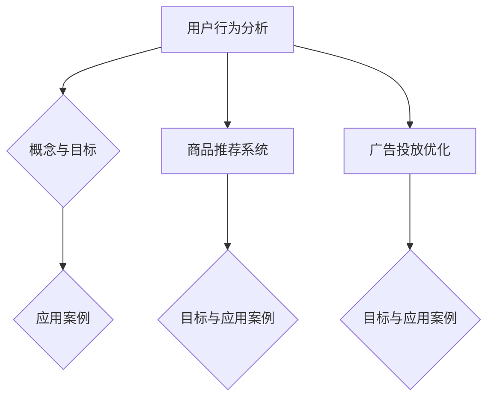

### 13.1 技术发展趋势

增量学习技术在电商平台的未来发展中将继续朝着以下几个趋势发展：

#### 1. 深度学习和迁移学习的融合

深度学习在处理复杂数据和提高模型性能方面具有显著优势，而迁移学习通过将已有模型的知识迁移到新任务中，可以显著提高模型更新效率。未来，增量学习技术将更加注重深度学习和迁移学习的融合，通过结合两者的优势，实现更高效的模型更新和优化。

#### 2. 自适应学习率的优化

自适应学习率调整策略（如RMSprop、Adam）在当前增量学习技术中已有广泛应用，但如何进一步提高学习率的自适应性和收敛速度仍是一个研究热点。未来的技术发展将集中在设计更高效的自适应学习率调整策略，以适应动态变化的数据环境。

#### 3. 模型压缩和剪枝技术

随着模型规模不断扩大，计算资源消耗成为增量学习技术的关键瓶颈。模型压缩和剪枝技术通过减少模型参数量和计算复杂度，可以在保持模型性能的同时降低计算资源需求。未来，这些技术将在电商平台中发挥重要作用，以提高系统效率和可扩展性。

#### 4. 多模态数据融合

电商平台中涉及多种类型的数据，如文本、图像、语音等。多模态数据融合技术通过整合不同类型的数据，可以提供更丰富的特征信息，从而提高模型的预测准确性和泛化能力。未来，电商平台将更加注重多模态数据的融合和应用。

### 13.2 电商平台面临的挑战

#### 1. 数据质量和实时性

电商平台中的数据质量直接影响增量学习模型的效果。如何处理噪声数据、异常值和缺失值，提高数据质量，是一个重要挑战。同时，实时性要求电商平台能够快速处理和响应不断变化的数据，这对增量学习技术提出了更高的要求。

#### 2. 模型稳定性和鲁棒性

动态数据环境中，模型稳定性是一个关键挑战。如何提高模型的鲁棒性，使其能够适应数据分布的变化，是一个重要研究方向。此外，如何设计具有良好稳定性的模型结构，也是电商平台面临的挑战之一。

#### 3. 计算资源优化

随着模型规模和复杂度的增加，计算资源优化成为增量学习技术的关键问题。如何在有限的计算资源下，高效地训练和部署模型，是一个重要的研究课题。

### 13.3 未来发展方向

#### 1. 智能化推荐系统

未来，电商平台将更加注重智能化推荐系统的发展，通过结合用户行为数据、商品信息和环境因素，实现更精准的个性化推荐。同时，利用增量学习技术，实时更新和优化推荐模型，提高推荐效果和用户体验。

#### 2. 广告投放自动化

广告投放自动化是电商平台提高收益的重要手段。通过结合用户行为数据和广告效果数据，利用增量学习技术实现广告投放的自动化优化，提高广告的曝光率和点击率，从而提高广告收益。

#### 3. 数据隐私和安全

随着数据隐私和安全问题的日益突出，电商平台将更加注重数据隐私和安全保护。未来，将发展更多基于隐私保护机制的增量学习技术，如差分隐私、联邦学习等，以保障用户数据的安全和隐私。

#### 4. 持续学习和适应能力

未来，电商平台将更加注重模型的持续学习和适应能力，通过不断更新和优化模型，使其能够更好地适应不断变化的市场环境和用户需求。

### 13.4 本章小结

本章讨论了增量学习技术在电商平台中的未来发展趋势、面临的挑战和未来的发展方向。通过分析这些内容，可以为电商平台在增量学习技术的应用中提供有益的指导，助力电商平台在激烈的市场竞争中脱颖而出。

### Mermaid 流程图

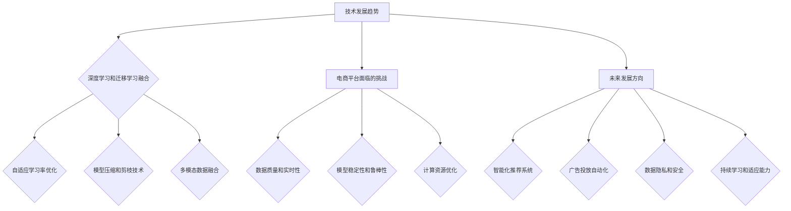

## 附录A：常用增量学习算法与框架

### 1. 机器学习算法

增量学习技术在电商平台中的应用离不开各种机器学习算法。以下是几种常用的机器学习算法：

#### **1.1 线性回归**

线性回归是一种简单但强大的算法，用于预测连续值输出。其核心思想是通过找到最佳拟合直线，使预测值与实际值之间的误差最小。

**公式：**

$$
y = \beta_0 + \beta_1x
$$

**优点：**简单易理解，计算速度快。

**适用场景：**简单预测问题，如价格预测、销量预测等。

#### **1.2 逻辑回归**

逻辑回归是一种用于分类任务的算法，通过逻辑函数将线性回归模型转换为概率预测。它常用于二元分类问题。

**公式：**

$$
\log \frac{p}{1-p} = \beta_0 + \beta_1x
$$

**优点：**计算效率高，易于实现。

**适用场景：**二元分类问题，如用户是否购买、商品是否推荐等。

#### **1.3 支持向量机（SVM）**

支持向量机是一种用于分类和回归的算法，通过找到最佳分割超平面，将不同类别的数据点分隔开来。

**公式：**

$$
w \cdot x + b = y
$$

**优点：**高维空间效果好，泛化能力强。

**适用场景：**高维数据分类和回归问题，如图像识别、文本分类等。

### 2. 深度学习框架

深度学习框架为开发者提供了丰富的工具和API，支持各种深度学习模型的构建和训练。以下是几种常用的深度学习框架：

#### **2.1 TensorFlow**

TensorFlow是Google开发的开源深度学习框架，具有强大的功能和广泛的社区支持。

**优点：**功能丰富，支持多种模型和算法，易于扩展。

**适用场景：**大规模数据集，复杂模型训练。

**链接：**[TensorFlow官网](https://www.tensorflow.org/)

#### **2.2 PyTorch**

PyTorch是Facebook AI研究院开发的开源深度学习框架，以其简洁的API和动态计算图而受到开发者喜爱。

**优点：**简洁易用，动态计算图，支持GPU加速。

**适用场景：**研究、开发、实验。

**链接：**[PyTorch官网](https://pytorch.org/)

#### **2.3 MXNet**

MXNet是Apache Foundation的开源深度学习框架，具有高效的计算性能和灵活的API。

**优点：**高效计算，支持多种编程语言。

**适用场景：**工业级应用，大规模数据集。

**链接：**[MXNet官网](https://mxnet.incubator.apache.org/)

### 3. 电商平台中常用的算法与框架

在电商平台的实际应用中，以下算法和框架被广泛采用：

#### **3.1 TensorFlow Recommender (TFRS)**

TensorFlow Recommender是TensorFlow的一个推荐系统库，提供了基于矩阵分解和基于模型的推荐算法。

**优点：**与TensorFlow无缝集成，易于实现和扩展。

**适用场景：**商品推荐、广告投放。

**链接：**[TensorFlow Recommender](https://github.com/tensorflow/recommenders)

#### **3.2 Apache Mahout**

Apache Mahout是一个开源的机器学习库，提供了多种机器学习算法，包括协同过滤、聚类等。

**优点：**简单易用，支持多种编程语言。

**适用场景：**大规模数据集，协同过滤推荐。

**链接：**[Apache Mahout](https://mahout.apache.org/)

### 3.4 其他开源项目与工具

此外，还有一些其他开源项目和工具在电商平台中广泛应用：

#### **3.4.1 Elasticsearch**

Elasticsearch是一个开源的搜索引擎，用于处理和查询大规模文本数据。

**优点：**高效搜索，实时数据更新。

**适用场景：**商品搜索、用户行为日志分析。

**链接：**[Elasticsearch官网](https://www.elastic.co/products/elasticsearch)

#### **3.4.2 Apache Flink**

Apache Flink是一个开源的流处理框架，用于实时数据处理和分析。

**优点：**实时处理，高效可靠。

**适用场景：**实时推荐、实时广告投放。

**链接：**[Apache Flink官网](https://flink.apache.org/)

### 3.5 总结

附录A介绍了电商平台中常用的增量学习算法、深度学习框架以及其他开源项目与工具。这些算法和工具为电商平台提供了丰富的技术支持，助力其在数据分析和决策支持方面的创新和发展。

### 附录B：增量学习技术资源

#### 1. 学习资料推荐

**1.1 书籍**

- 《深度学习》（Goodfellow, Bengio, Courville）：介绍深度学习的基本概念和技术。
- 《机器学习》（Tom Mitchell）：介绍机器学习的基本理论和方法。
- 《Python机器学习》（Sebastian Raschka）：详细介绍使用Python进行机器学习的实践。

**1.2 在线课程**

- [Coursera](https://www.coursera.org/)：提供丰富的机器学习和深度学习课程。
- [edX](https://www.edx.org/)：提供免费的机器学习和深度学习课程。
- [Udacity](https://www.udacity.com/)：提供实践驱动的机器学习和深度学习课程。

**1.3 博客和论坛**

- [TensorFlow官方博客](https://www.tensorflow.org/blog/)：介绍TensorFlow的最新动态和技术。
- [PyTorch官方博客](https://pytorch.org/blog/)：介绍PyTorch的最新动态和技术。
- [Stack Overflow](https://stackoverflow.com/)：讨论和解决机器学习和深度学习中的技术问题。

#### 2. 开源项目与工具

**2.1 开源项目**

- [TensorFlow](https://github.com/tensorflow/tensorflow)：提供TensorFlow的源代码和示例。
- [PyTorch](https://github.com/pytorch/pytorch)：提供PyTorch的源代码和示例。
- [MXNet](https://github.com/dmlc/mxnet)：提供MXNet的源代码和示例。

**2.2 开源工具**

- [Kaggle](https://www.kaggle.com/)：提供丰富的机器学习和深度学习竞赛和数据集。
- [GITHUB](https://github.com/)：提供各种机器学习和深度学习项目的代码和示例。
- [arXiv](https://arxiv.org/)：提供最新的机器学习和深度学习论文和预印本。

#### 3. 学术论文与会议

**3.1 学术论文**

- [NeurIPS](https://nips.cc/)：介绍最新的神经信息处理系统会议论文。
- [ICML](https://icml.cc/)：介绍最新的国际机器学习会议论文。
- [JMLR](https://jmlr.org/)：介绍最新的机器学习研究论文。

**3.2 学术会议**

- [ACL](https://www.aclweb.org/)：介绍最新的自然语言处理会议。
- [CVPR](https://cvpr.org/)：介绍最新的计算机视觉会议。
- [KDD](https://kdd.org/)：介绍最新的知识发现和数据挖掘会议。

### 3.4 总结

附录B提供了丰富的增量学习技术学习资源，包括书籍、在线课程、开源项目、开源工具以及学术论文和会议。这些资源有助于读者深入了解增量学习技术，提高其在实际应用中的能力。通过利用这些资源，读者可以不断学习和探索增量学习技术的最新进展和应用。

