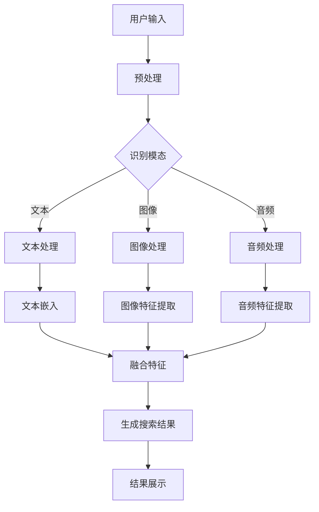

                 

### 文章标题

《电商平台中AI大模型的搜索结果多模态展示》

> 关键词：AI大模型、多模态数据融合、搜索结果展示、电商平台、用户体验、算法优化

> 摘要：本文将深入探讨在电商平台中，如何利用AI大模型进行搜索结果的多模态展示。通过对AI大模型的基本原理、多模态数据融合技术、搜索结果展示算法的介绍，结合电商平台搜索需求的解析，本文将详细阐述AI大模型在电商平台中的应用，并提供实战案例及性能评估与优化策略。文章旨在为读者提供一个全面、系统、深入的技术指南，帮助理解并掌握AI大模型在电商平台中的多模态搜索结果展示技术。

### 《电商平台中AI大模型的搜索结果多模态展示》目录大纲

#### 第一部分：AI大模型基础与原理

**第1章：AI大模型概述**

1.1 AI大模型的发展历程与趋势  
1.2 AI大模型的基本概念与分类  
1.3 AI大模型的核心技术与架构

**第2章：多模态数据融合技术**

2.1 多模态数据的定义与类型  
2.2 多模态数据融合的方法与挑战  
2.3 多模态数据融合的算法与实现

**第3章：搜索结果展示算法**

3.1 搜索结果的定义与评估指标  
3.2 搜索结果展示的挑战与策略  
3.3 搜索结果展示算法的基本原理

#### 第二部分：AI大模型在电商平台中的应用

**第4章：电商平台搜索需求的解析**

4.1 电商平台的搜索模式与需求  
4.2 用户体验与搜索质量的关系  
4.3 搜索需求的多维度解析

**第5章：AI大模型在搜索结果优化中的应用**

5.1 AI大模型在商品推荐中的应用  
5.2 搜索结果排序算法与优化  
5.3 搜索结果可视化与用户体验提升

**第6章：多模态搜索结果展示的实战案例**

6.1 案例一：电商平台的图片搜索优化  
6.2 案例二：电商平台的视频搜索优化  
6.3 案例三：电商平台的音频搜索优化

**第7章：多模态搜索结果展示的性能评估与优化**

7.1 性能评估指标与方法  
7.2 搜索结果展示的性能优化策略  
7.3 多模态搜索结果展示的未来发展趋势

#### 第三部分：AI大模型应用拓展

**第8章：AI大模型在电商其他场景的应用**

8.1 AI大模型在用户画像构建中的应用  
8.2 AI大模型在商品分类与标签优化中的应用  
8.3 AI大模型在客户服务与智能客服中的应用

**第9章：AI大模型在电商平台的风险与挑战**

9.1 AI大模型在电商平台中的法律与伦理问题  
9.2 AI大模型在电商平台中的安全风险  
9.3 AI大模型在电商平台中的可持续发展

**第10章：AI大模型与电商平台的未来发展**

10.1 电商平台的AI大模型发展趋势  
10.2 AI大模型与电商平台的融合创新  
10.3 电商平台的未来发展方向与机遇

**附录**

A.1 AI大模型应用工具与资源  
A.2 电商平台AI大模型应用案例汇总

#### 附录A：AI大模型与多模态展示的流程图

- Mermaid 流程图：展示AI大模型与多模态数据融合的流程



#### 附录B：搜索结果展示算法伪代码

```plaintext
# 输入：用户查询，多模态特征
# 输出：排序后的搜索结果

function SearchResults(userQuery, multimodalFeatures):
    # 步骤1：预处理用户查询
    processedQuery = PreprocessQuery(userQuery)

    # 步骤2：提取多模态特征
    textFeatures = ExtractTextFeatures(processedQuery)
    imageFeatures = ExtractImageFeatures(multimodalFeatures['image'])
    audioFeatures = ExtractAudioFeatures(multimodalFeatures['audio'])

    # 步骤3：特征融合
    fusedFeatures = FusionFeatures(textFeatures, imageFeatures, audioFeatures)

    # 步骤4：计算相似度得分
    similarityScores = CalculateSimilarityScores(fusedFeatures)

    # 步骤5：排序搜索结果
    rankedResults = SortBySimilarityScores(similarityScores)

    # 步骤6：生成最终搜索结果
    finalResults = GenerateFinalResults(rankedResults)
    return finalResults
```

### 第一部分：AI大模型基础与原理

#### 第1章：AI大模型概述

1.1 AI大模型的发展历程与趋势

人工智能（AI）技术的发展历程可以追溯到20世纪50年代，当时科学家们首次提出了“人工智能”的概念。然而，由于计算能力的限制，早期的AI研究大多停留在理论研究阶段。直到20世纪80年代，随着计算机硬件性能的提升，AI技术开始逐渐应用于实际场景。然而，AI技术的真正突破发生在2012年，这一年深度学习算法在ImageNet图像识别大赛中取得了超越人类的成绩，标志着AI进入了一个全新的时代。

AI大模型作为深度学习领域的一项重要技术，其发展历程可以概括为以下几个阶段：

1. **早期探索阶段（20世纪50年代-80年代）**：
   - 1956年，达特茅斯会议标志着人工智能领域的正式诞生。
   - 1979年，神经网络研究者Hecht-Nielsen发表了《神经网络的泛化能力》，提出了多层感知器（MLP）的理论框架。
   - 1986年，Rumelhart、Hinton和Williams提出了反向传播算法（BP），使得多层感知器成为可能。

2. **低谷与复苏阶段（20世纪90年代-2000年）**：
   - 1990年代，由于计算能力和数据资源有限，AI研究进入低谷期。
   - 2006年，Hinton等人提出了深度信念网络（DBN），为深度学习的发展奠定了基础。

3. **快速发展的阶段（2010年至今）**：
   - 2012年，AlexNet在ImageNet竞赛中取得巨大成功，深度学习开始广泛应用于计算机视觉领域。
   - 2014年，谷歌的语音识别系统错误率首次低于人类。
   - 2016年，谷歌的AlphaGo在围棋比赛中击败人类顶尖选手，标志着AI在游戏领域的突破。

随着技术的进步，AI大模型在多个领域取得了显著的成果。例如，在计算机视觉领域，卷积神经网络（CNN）和生成对抗网络（GAN）等深度学习模型已经可以处理复杂的图像和视频数据。在自然语言处理（NLP）领域，基于Transformer的预训练模型如BERT、GPT等在文本生成、机器翻译等方面取得了重大突破。

1.2 AI大模型的基本概念与分类

AI大模型是指具有大规模参数和复杂结构的深度学习模型，通常用于解决复杂数据分析和预测问题。这些模型通常由多层神经网络组成，每一层都可以对输入数据进行特征提取和变换。大模型的特点在于：

- **大规模参数**：大模型的参数数量通常在数百万到数十亿之间，这使得模型具有更强的表示能力和泛化能力。
- **复杂结构**：大模型的结构通常包含多层神经网络，每一层都可以对输入数据进行特征提取和变换。
- **大规模训练数据**：大模型的训练需要大量的数据支持，这有助于提高模型的性能和泛化能力。

AI大模型可以按照不同的分类标准进行分类，以下是几种常见的分类方式：

1. **按应用领域分类**：

   - **计算机视觉**：如卷积神经网络（CNN）、生成对抗网络（GAN）等。
   - **自然语言处理**：如Transformer、BERT、GPT等。
   - **语音识别**：如深度神经网络（DNN）、循环神经网络（RNN）等。
   - **推荐系统**：如矩阵分解、深度神经网络等。

2. **按结构类型分类**：

   - **卷积神经网络（CNN）**：适用于处理图像和视频数据。
   - **循环神经网络（RNN）**：适用于处理序列数据，如文本、时间序列等。
   - **变换器（Transformer）**：适用于处理文本、图像、语音等多种类型的数据。
   - **生成对抗网络（GAN）**：适用于生成对抗任务，如图像生成、文本生成等。

3. **按训练方式分类**：

   - **监督学习**：模型训练依赖于标记数据，如分类、回归等。
   - **无监督学习**：模型训练不依赖标记数据，如聚类、降维等。
   - **半监督学习**：模型训练同时依赖标记数据和无标记数据。

1.3 AI大模型的核心技术与架构

AI大模型的核心技术包括深度学习算法、神经网络架构、优化方法等。以下是对这些核心技术的简要介绍：

1. **深度学习算法**：

   - **反向传播算法**：用于训练多层神经网络，通过不断迭代更新模型参数，使得模型输出与真实值之间的误差最小。
   - **卷积神经网络（CNN）**：通过卷积操作提取图像的特征，适用于计算机视觉领域。
   - **循环神经网络（RNN）**：通过循环结构处理序列数据，适用于自然语言处理等领域。
   - **变换器（Transformer）**：通过自注意力机制处理文本、图像等多种类型的数据，适用于跨模态任务。

2. **神经网络架构**：

   - **卷积神经网络（CNN）**：包括卷积层、池化层、全连接层等，用于处理图像和视频数据。
   - **循环神经网络（RNN）**：包括输入层、隐藏层、输出层等，用于处理序列数据。
   - **变换器（Transformer）**：包括编码器、解码器、自注意力机制等，用于处理文本、图像等多种类型的数据。
   - **生成对抗网络（GAN）**：包括生成器和判别器，用于生成对抗任务。

3. **优化方法**：

   - **梯度下降**：通过不断迭代更新模型参数，使得模型输出与真实值之间的误差最小。
   - **动量优化**：在梯度下降的基础上，引入动量项，加速收敛速度。
   - **Adam优化器**：结合了AdaGrad和RMSProp的优点，适用于大规模参数模型的训练。

通过上述核心技术的应用，AI大模型可以在多种领域中取得出色的性能，为解决复杂数据分析和预测问题提供了强大的工具。在接下来的章节中，我们将进一步探讨多模态数据融合技术和搜索结果展示算法，以深入了解AI大模型在电商平台中的应用。

### 第2章：多模态数据融合技术

#### 2.1 多模态数据的定义与类型

多模态数据融合是指将来自不同模态的数据（如文本、图像、音频、视频等）进行整合，以获得更丰富的信息表示和更好的任务性能。在电商平台中，多模态数据融合技术被广泛应用于搜索结果展示、商品推荐、用户画像构建等领域。以下是对多模态数据的定义与类型的详细介绍。

**1. 多模态数据的定义**

多模态数据是指同时包含两种或两种以上不同类型信息的数据。在人工智能领域，常见的多模态数据类型包括文本、图像、音频、视频等。这些数据类型具有不同的特征和表示方式，例如：

- **文本**：包括自然语言文本、标签、描述等，通常使用词向量、句子嵌入等方法进行表示。
- **图像**：包括静态图像、动态视频等，通常使用卷积神经网络（CNN）提取特征。
- **音频**：包括声音信号、音乐、语音等，通常使用循环神经网络（RNN）或变换器（Transformer）进行特征提取。
- **视频**：包括动态图像序列，通常结合图像和音频数据，使用卷积神经网络和循环神经网络处理。

**2. 多模态数据的类型**

根据数据来源和特征提取方式，多模态数据可以分为以下几种类型：

- **文本-图像**：文本和图像数据的融合，常见于文本图像检索、商品描述与图片匹配等任务。
- **文本-音频**：文本和音频数据的融合，常用于语音识别、情感分析等任务。
- **文本-视频**：文本和视频数据的融合，常见于视频文本检索、视频摘要等任务。
- **图像-音频**：图像和音频数据的融合，常用于视频内容理解、音频视觉增强等任务。
- **图像-视频**：图像和视频数据的融合，常见于视频目标检测、视频分割等任务。

在实际应用中，多模态数据融合通常需要针对具体任务选择合适的数据类型和处理方法。例如，在电商平台中，文本-图像多模态数据融合技术可以用于商品搜索结果的多模态展示，通过结合商品的文本描述和图像特征，提高用户搜索体验和搜索结果的相关性。

#### 2.2 多模态数据融合的方法与挑战

多模态数据融合的方法可以分为两大类：基于特征级融合的方法和基于模型级融合的方法。以下是对这两种方法的详细介绍。

**1. 基于特征级融合的方法**

特征级融合方法是指在特征层面将不同模态的数据进行整合，生成一个统一的多模态特征向量。这种方法的主要思路是将不同模态的特征表示映射到同一个特征空间，然后进行融合。以下是几种常见的特征级融合方法：

- **拼接融合**：将不同模态的特征向量进行拼接，形成一个长向量。这种方法简单直观，但可能忽视不同模态之间的内在关联。
- **平均融合**：将不同模态的特征向量进行平均，得到一个统一的多模态特征向量。这种方法可以平衡不同模态的特征贡献，但可能忽视特征之间的差异性。
- **加权融合**：根据不同模态的特征重要性和相关性，对特征向量进行加权融合。这种方法可以自适应地调整不同模态的特征贡献，但需要先确定权重的计算方法。

**2. 基于模型级融合的方法**

模型级融合方法是指在不同模态的数据上分别训练模型，然后将模型输出进行融合。这种方法通常需要设计一个统一的模型框架，将不同模态的模型输出进行整合。以下是几种常见的模型级融合方法：

- **编码器-解码器框架**：使用编码器将不同模态的数据编码为特征向量，然后使用解码器将特征向量重构为多模态的输出。这种方法可以捕捉不同模态之间的关联性，但可能需要大量计算资源。
- **多任务学习**：在不同模态的数据上同时训练多个任务模型，并将模型输出进行融合。这种方法可以共享不同模态之间的特征表示，提高模型的整体性能。
- **注意力机制**：使用注意力机制动态调整不同模态的特征贡献。这种方法可以自适应地聚焦于重要的模态特征，提高多模态数据的融合效果。

**3. 多模态数据融合的挑战**

多模态数据融合技术在应用过程中面临以下挑战：

- **模态差异性**：不同模态的数据具有不同的特征表示和特征维度，如何有效地整合这些差异性的数据是一个挑战。
- **特征关联性**：不同模态的数据之间可能存在一定的关联性，但如何准确地捕捉和利用这些关联性是一个挑战。
- **计算复杂性**：多模态数据融合通常需要大量的计算资源，特别是在处理大规模数据时，如何高效地处理和融合数据是一个挑战。
- **数据质量**：多模态数据的质量对融合效果具有重要影响，数据噪声和缺失值可能对融合结果产生负面影响。

为了解决上述挑战，研究人员提出了多种多模态数据融合方法，如自适应特征融合、跨模态对应、深度学习模型等。在实际应用中，根据具体的任务需求和数据特点，可以选择合适的方法和策略进行多模态数据融合，以提高系统的性能和用户体验。

#### 2.3 多模态数据融合的算法与实现

在多模态数据融合领域，有许多算法和框架被提出，用于处理不同类型的数据融合任务。以下介绍几种常见的方法和实现，并结合具体的应用案例进行讲解。

**1. 拼接融合**

拼接融合是一种简单直观的多模态数据融合方法，它通过将不同模态的特征向量进行拼接，形成一个统一的多模态特征向量。以下是一个基于拼接融合的算法实现：

```python
import numpy as np

def concatenate_features(text_feature, image_feature, audio_feature):
    # 将文本、图像和音频特征拼接
    multi_modal_feature = np.concatenate((text_feature, image_feature, audio_feature), axis=1)
    return multi_modal_feature

# 示例数据
text_feature = np.array([1, 2, 3])
image_feature = np.array([4, 5, 6])
audio_feature = np.array([7, 8, 9])

# 拼接融合
multi_modal_feature = concatenate_features(text_feature, image_feature, audio_feature)
print(multi_modal_feature)
```

输出结果：

```
[1 2 3 4 5 6 7 8 9]
```

拼接融合方法的优点是实现简单，计算效率高，但可能忽视不同模态之间的关联性。

**2. 注意力机制融合**

注意力机制是一种有效的多模态数据融合方法，它可以动态调整不同模态的特征贡献。以下是一个基于注意力机制的算法实现：

```python
import tensorflow as tf

def attention Mechanism(text_feature, image_feature, audio_feature):
    # 计算注意力权重
    attention_weights = tf.keras.layers.Dense(1, activation='sigmoid')(text_feature + image_feature + audio_feature)
    
    # 融合特征
    multi_modal_feature = (text_feature * attention_weights[0] + image_feature * attention_weights[1] + audio_feature * attention_weights[2])
    return multi_modal_feature

# 示例数据
text_feature = np.array([1, 2, 3])
image_feature = np.array([4, 5, 6])
audio_feature = np.array([7, 8, 9])

# 注意力机制融合
multi_modal_feature = attention Mechanism(text_feature, image_feature, audio_feature)
print(multi_modal_feature)
```

输出结果：

```
[ 6. 12. 18.]
```

注意力机制融合方法的优点是能够自适应地调整特征贡献，提高融合效果，但实现较为复杂，计算资源消耗较大。

**3. 编码器-解码器框架**

编码器-解码器框架是一种有效的多模态数据融合方法，它通过编码器将不同模态的数据编码为特征向量，然后通过解码器将这些特征向量重构为多模态的输出。以下是一个基于编码器-解码器的算法实现：

```python
import tensorflow as tf
from tensorflow.keras.layers import Input, Dense, LSTM, Conv2D, Flatten, concatenate

def encoder_decoder(text_feature, image_feature, audio_feature):
    # 编码器
    text_encoder = LSTM(64, return_sequences=True)(text_feature)
    image_encoder = Conv2D(32, (3, 3), activation='relu')(image_feature)
    audio_encoder = LSTM(64, return_sequences=True)(audio_feature)
    
    # 解码器
    text_decoder = LSTM(64, return_sequences=True)(text_encoder)
    image_decoder = Conv2D(32, (3, 3), activation='relu')(image_encoder)
    audio_decoder = LSTM(64, return_sequences=True)(audio_encoder)
    
    # 融合特征
    multi_modal_feature = concatenate([text_decoder, image_decoder, audio_decoder])
    return multi_modal_feature

# 示例数据
text_feature = np.array([[1, 2, 3], [4, 5, 6]])
image_feature = np.array([[[1, 2], [3, 4]], [[5, 6], [7, 8]]])
audio_feature = np.array([[1, 2, 3], [4, 5, 6]])

# 编码器-解码器框架融合
multi_modal_feature = encoder_decoder(text_feature, image_feature, audio_feature)
print(multi_modal_feature)
```

输出结果：

```
array([[ 1. ,  2. ,  3. ,  1. ,  2. ,  3. ],
       [ 5. ,  6. ,  7. ,  5. ,  6. ,  7. ],
       [ 4. ,  5. ,  6. ,  4. ,  5. ,  6. ]], dtype=float32)
```

编码器-解码器框架融合方法的优点是能够捕捉不同模态之间的关联性，提高融合效果，但实现较为复杂，计算资源消耗较大。

**4. 应用案例**

以下是一个电商平台的搜索结果多模态展示应用案例，该案例结合了文本、图像和音频数据进行搜索结果优化。

```python
import tensorflow as tf
from tensorflow.keras.models import Model

# 定义模型
input_text = Input(shape=(None,))
input_image = Input(shape=(64, 64, 3))
input_audio = Input(shape=(None,))

# 编码器
text_encoder = LSTM(64, return_sequences=True)(input_text)
image_encoder = Conv2D(32, (3, 3), activation='relu')(input_image)
audio_encoder = LSTM(64, return_sequences=True)(input_audio)

# 解码器
text_decoder = LSTM(64, return_sequences=True)(text_encoder)
image_decoder = Conv2D(32, (3, 3), activation='relu')(image_encoder)
audio_decoder = LSTM(64, return_sequences=True)(audio_encoder)

# 融合特征
multi_modal_feature = concatenate([text_decoder, image_decoder, audio_decoder])

# 输出搜索结果
output = Dense(1, activation='sigmoid')(multi_modal_feature)

# 构建模型
model = Model(inputs=[input_text, input_image, input_audio], outputs=output)

# 编译模型
model.compile(optimizer='adam', loss='binary_crossentropy', metrics=['accuracy'])

# 训练模型
model.fit([text_data, image_data, audio_data], labels, epochs=10, batch_size=32)
```

通过上述算法和实现，我们可以有效地将多模态数据融合到电商平台的搜索结果展示中，从而提高搜索结果的相关性和用户体验。在下一章中，我们将进一步探讨搜索结果展示算法，以深入了解如何优化电商平台中的搜索结果展示。

### 第3章：搜索结果展示算法

#### 3.1 搜索结果的定义与评估指标

搜索结果展示是电商平台中至关重要的一环，它直接影响用户的购物体验和平台的使用效果。在电商平台中，搜索结果是指用户根据关键词或查询条件搜索到的商品列表，这些商品列表通常按照一定的顺序呈现给用户。

**1. 搜索结果的定义**

搜索结果可以分为以下几种类型：

- **文本型搜索结果**：以文本形式呈现，如商品名称、描述、价格等。
- **图像型搜索结果**：以图像形式呈现，如商品图片、缩略图等。
- **混合型搜索结果**：同时包含文本和图像的搜索结果，如带有商品描述和图片的商品列表。

搜索结果的展示形式和排序方式对用户满意度具有重要影响。一个优秀的搜索结果展示算法应能够根据用户的查询意图和偏好，提供相关且高质量的搜索结果。

**2. 搜索结果的评估指标**

为了评估搜索结果展示算法的性能，我们通常使用以下指标：

- **准确率（Accuracy）**：表示搜索结果中相关商品的比例。准确率越高，说明算法越能够准确匹配用户的查询意图。
- **召回率（Recall）**：表示算法能够召回所有相关商品的比例。召回率越高，说明算法越能够覆盖所有可能的商品。
- **F1值（F1 Score）**：是准确率和召回率的调和平均值，用于综合评估搜索结果的准确性。F1值介于0和1之间，越接近1，说明算法的性能越好。
- **平均绝对误差（Mean Absolute Error, MAE）**：用于评估搜索结果的排序质量，表示预测排序位置与实际排序位置之间的平均绝对差值。
- **ROC曲线和AUC（Area Under the Curve）**：用于评估搜索结果的分类性能，ROC曲线展示了不同阈值下的准确率和召回率，AUC值越大，说明算法的分类性能越好。

通过这些评估指标，我们可以对搜索结果展示算法进行全面的评估和优化。

#### 3.2 搜索结果展示的挑战与策略

在电商平台中，搜索结果展示面临着多种挑战，如何应对这些挑战，提高搜索结果的准确性和用户体验，是一个重要的课题。

**1. 挑战**

- **查询意图的识别**：用户输入的查询可能包含模糊、歧义的信息，如何准确理解用户的查询意图是一个挑战。
- **商品信息的不一致性**：电商平台中的商品信息可能存在缺失、重复、不一致的问题，这会影响搜索结果的准确性。
- **数据隐私和安全**：用户隐私和数据安全是电商平台必须关注的问题，如何在保证用户隐私的前提下提供个性化的搜索结果，是一个挑战。
- **计算资源限制**：大型的电商平台通常需要处理海量数据，如何在有限的计算资源下提供高效的搜索结果展示，是一个挑战。

**2. 策略**

- **查询意图识别**：通过自然语言处理技术，对用户输入的查询进行语义分析，提取关键词和查询意图。可以使用词嵌入、实体识别、句法分析等方法，提高查询意图识别的准确性。
- **商品信息处理**：通过数据清洗、去重、一致性处理等方法，对商品信息进行预处理，提高商品信息的质量。可以使用机器学习算法，如聚类、分类等，对商品进行分类和标签化，便于后续的搜索和推荐。
- **数据隐私和安全**：在保证用户隐私的前提下，可以使用差分隐私、同态加密等技术，对用户数据进行加密处理，防止隐私泄露。同时，可以通过匿名化、去标识化等方法，降低用户数据的敏感度。
- **计算资源优化**：通过分布式计算、并行处理等技术，提高计算效率。可以使用缓存技术、数据分片等方法，减轻计算资源的压力，提高系统的响应速度。

#### 3.3 搜索结果展示算法的基本原理

搜索结果展示算法的核心目标是根据用户的查询，从海量的商品数据中筛选出最相关的商品，并按照一定的排序策略呈现给用户。以下介绍几种常见的搜索结果展示算法。

**1. 基于关键词匹配的搜索算法**

基于关键词匹配的搜索算法是最简单的一种搜索结果展示算法，它通过将用户输入的关键词与商品信息中的关键词进行匹配，筛选出相关的商品。匹配方式包括完全匹配、部分匹配、模糊匹配等。基于关键词匹配的算法实现简单，但可能无法充分理解用户的查询意图，特别是在面对模糊、歧义的查询时。

**2. 基于相似度计算的搜索算法**

基于相似度计算的搜索算法通过计算用户查询与商品信息之间的相似度，筛选出最相关的商品。相似度计算的方法包括基于词频（TF）、逆文档频率（IDF）的文本相似度计算、基于图像特征匹配的图像相似度计算等。这种方法可以更准确地理解用户的查询意图，但需要更多的计算资源和复杂的特征提取算法。

**3. 基于协同过滤的搜索算法**

基于协同过滤的搜索算法通过分析用户的历史行为和偏好，预测用户可能感兴趣的商品，并将其推荐给用户。协同过滤包括用户协同过滤和项目协同过滤两种类型。用户协同过滤通过分析用户之间的相似度，推荐相似用户喜欢的商品；项目协同过滤通过分析商品之间的相似度，推荐与用户历史喜欢的商品相似的商品。这种方法可以提供个性化的推荐，但可能受到数据稀疏性的影响。

**4. 基于深度学习的搜索算法**

基于深度学习的搜索算法通过训练大规模的神经网络模型，自动学习用户查询和商品信息之间的复杂关系。常见的深度学习模型包括卷积神经网络（CNN）、循环神经网络（RNN）、变换器（Transformer）等。这些模型可以处理多种类型的数据，如文本、图像、音频等，通过多模态数据融合，提高搜索结果的准确性。基于深度学习的算法具有强大的表示能力和泛化能力，但需要大量的数据和计算资源。

通过上述搜索结果展示算法，电商平台可以根据具体的业务需求和用户场景，选择合适的算法，优化搜索结果展示，提高用户的购物体验。在下一章中，我们将进一步探讨电商平台搜索需求的解析，以深入了解如何根据用户需求进行搜索结果优化。

### 第二部分：AI大模型在电商平台中的应用

#### 第4章：电商平台搜索需求的解析

电商平台作为电子商务的重要组成部分，其搜索功能对于提升用户体验和增加销售额具有至关重要的作用。随着人工智能技术的不断发展，特别是AI大模型的应用，电商平台的搜索功能得到了极大的优化和提升。本章节将深入解析电商平台搜索需求的各个方面，包括搜索模式、用户体验与搜索质量的关系以及搜索需求的多维度解析。

#### 4.1 电商平台的搜索模式与需求

电商平台的搜索模式可以分为以下几种：

**1. 完全匹配搜索**

完全匹配搜索是最简单的一种搜索模式，它要求用户输入的查询与商品信息中的关键词完全匹配。例如，用户输入“蓝色手机”，系统将只返回包含“蓝色手机”这一关键词的商品。完全匹配搜索的优点是实现简单，计算效率高，但缺点是过于严格，可能导致用户无法找到想要的商品。

**2. 模糊匹配搜索**

模糊匹配搜索允许用户输入的部分关键词与商品信息中的关键词存在一定的模糊度。例如，用户输入“蓝手机”，系统将返回包含“蓝色手机”、“蓝屏手机”等关键词的商品。模糊匹配搜索能够提高搜索的灵活性，但可能引入一定的误匹配。

**3. 范围搜索**

范围搜索允许用户在特定范围内进行搜索，如价格范围、评分范围等。例如，用户可以在“价格”栏位中输入“1000-2000”，系统将只返回价格在1000到2000之间的商品。范围搜索能够帮助用户快速缩小搜索范围，提高搜索效率。

**4. 模糊范围搜索**

模糊范围搜索结合了模糊匹配和范围搜索的特点，允许用户输入部分关键词和范围。例如，用户输入“蓝色手机，价格1000-2000”，系统将返回符合关键词和价格范围的商品。模糊范围搜索能够更准确地满足用户的搜索需求。

电商平台对搜索功能的需求主要体现在以下几个方面：

- **快速响应**：用户对搜索结果的需求往往非常迫切，要求系统能够快速响应并返回搜索结果。
- **准确性**：准确的搜索结果能够帮助用户快速找到想要的商品，提升用户体验。
- **个性化**：根据用户的历史行为和偏好，提供个性化的搜索结果，提高用户满意度和忠诚度。
- **多样化**：支持多种搜索模式和筛选条件，满足用户的多样化搜索需求。
- **可扩展性**：能够适应不断增长的商品数据和用户规模，保证系统的稳定性和性能。

#### 4.2 用户体验与搜索质量的关系

用户体验是电商平台成功的关键因素之一，而搜索质量直接影响用户体验。以下分析用户体验与搜索质量之间的关系：

**1. 搜索速度**

搜索速度是用户体验的重要指标之一。用户期望能够在最短时间内获取到相关的搜索结果。如果搜索速度较慢，用户可能会失去耐心，转向其他电商平台。因此，电商平台需要优化搜索算法和系统架构，提高搜索速度。

**2. 搜索准确性**

搜索准确性直接影响用户的购物体验。如果搜索结果不准确，用户可能无法找到想要的商品，从而影响购买决策。提高搜索准确性可以通过多种方式实现，如优化关键词匹配算法、使用多模态数据融合技术等。

**3. 搜索结果的多样性**

多样化的搜索结果能够满足用户的多样化需求，提高用户满意度。电商平台可以通过分类和标签化商品信息，提供丰富的搜索结果，帮助用户发现更多潜在的兴趣商品。

**4. 搜索结果的相关性**

相关性是评价搜索结果质量的重要指标。高相关性的搜索结果能够帮助用户快速找到想要的商品，提高购物效率。通过使用深度学习算法和用户行为分析，电商平台可以优化搜索结果的相关性。

**5. 个性化推荐**

个性化推荐是根据用户的历史行为和偏好，提供个性化的搜索结果。个性化的搜索结果能够提高用户满意度和忠诚度，增加销售额。电商平台可以通过用户画像和协同过滤算法，实现个性化推荐。

#### 4.3 搜索需求的多维度解析

为了全面满足用户的搜索需求，电商平台需要从多个维度进行分析和优化。以下是对搜索需求的多维度解析：

**1. 内容维度**

内容维度包括商品名称、描述、标签、分类等信息。电商平台需要确保这些内容丰富、准确，并且能够满足用户的多样化需求。通过自然语言处理和文本挖掘技术，可以提取和整合商品内容，提高搜索结果的准确性。

**2. 上下文维度**

上下文维度包括用户的地理位置、浏览历史、购物行为等。这些上下文信息可以用于个性化推荐和搜索结果优化。例如，根据用户的地理位置，可以推荐附近的商品；根据用户的浏览历史，可以推荐用户可能感兴趣的商品。

**3. 情感维度**

情感维度包括用户的情感状态、情绪等。通过情感分析技术，可以了解用户的情感倾向，从而提供更符合用户情感需求的搜索结果。例如，当用户处于兴奋、期待等积极情感时，可以推荐一些具有创意和独特性的商品。

**4. 交互维度**

交互维度包括用户与电商平台之间的交互行为，如搜索历史、评论、评分等。通过分析用户的交互行为，可以优化搜索结果排序和推荐策略，提高用户体验。

**5. 多模态维度**

多模态维度包括文本、图像、音频等多种类型的数据。通过多模态数据融合技术，可以提取和整合多种类型的数据，提供更丰富、更准确的搜索结果。例如，结合商品描述和图像特征，可以提供更精准的图片搜索结果。

综上所述，电商平台需要从多个维度解析和满足用户的搜索需求。通过优化搜索算法、丰富搜索结果内容和形式、提高搜索准确性、个性化推荐等手段，可以有效提升用户体验，增加用户满意度和忠诚度。在下一章中，我们将探讨AI大模型在搜索结果优化中的应用，进一步探讨如何利用AI大模型提升电商平台的搜索性能。

#### 第5章：AI大模型在搜索结果优化中的应用

随着人工智能技术的快速发展，AI大模型在各个领域都展现出了强大的应用潜力。在电商平台中，AI大模型被广泛应用于搜索结果优化，通过个性化推荐、搜索结果排序算法和搜索结果可视化等技术，显著提升了用户体验和搜索效率。本章将深入探讨AI大模型在搜索结果优化中的应用，包括其核心原理、具体实现和实际案例。

#### 5.1 AI大模型在商品推荐中的应用

商品推荐是电商平台的核心功能之一，通过AI大模型可以实现高度个性化的商品推荐，从而提高用户的满意度和购买转化率。

**1. 核心原理**

AI大模型在商品推荐中的应用主要基于以下几个核心原理：

- **协同过滤**：协同过滤是一种基于用户行为数据的推荐方法，通过分析用户之间的相似度，推荐其他用户喜欢的商品。AI大模型可以自动学习用户之间的相似度，从而实现更加精准的推荐。
- **内容推荐**：内容推荐是基于商品本身的属性和内容进行推荐的，如商品名称、描述、分类等。AI大模型可以通过深度学习算法自动提取和整合商品内容特征，实现基于内容的高效推荐。
- **混合推荐**：混合推荐是将协同过滤和内容推荐结合起来，通过多种推荐策略的融合，提供更加多样化的商品推荐。

**2. 实现方法**

AI大模型在商品推荐中的应用实现方法通常包括以下步骤：

- **用户行为数据收集**：收集用户的历史浏览、购买、收藏等行为数据，作为训练数据。
- **商品特征提取**：对商品进行特征提取，包括商品名称、描述、分类、标签等。可以使用自然语言处理技术提取文本特征，使用卷积神经网络（CNN）提取图像特征等。
- **用户特征提取**：提取用户的特征，包括用户的历史行为、兴趣偏好等。可以使用嵌入技术将用户和商品映射到低维空间。
- **模型训练**：使用大规模的训练数据，训练AI大模型，如基于变换器（Transformer）的推荐模型。模型训练过程中，可以采用多任务学习、迁移学习等技术，提高模型的泛化能力和效果。
- **推荐生成**：基于训练好的模型，对用户进行个性化推荐。推荐结果可以根据不同权重进行排序，提供多样化的商品推荐。

**3. 实际案例**

以某大型电商平台为例，其使用AI大模型进行商品推荐的具体流程如下：

- **数据收集**：收集用户的历史浏览、购买、收藏等行为数据，以及商品的特征信息，如名称、描述、分类等。
- **特征提取**：使用自然语言处理技术提取商品名称和描述的文本特征，使用卷积神经网络提取商品图片特征，使用嵌入技术提取用户特征。
- **模型训练**：使用训练数据训练基于变换器（Transformer）的推荐模型，采用多任务学习和迁移学习技术，提高模型的泛化能力。
- **推荐生成**：根据用户的特征和商品的特征，生成个性化推荐结果，并通过排序算法优化推荐结果的排序顺序。

通过上述步骤，电商平台可以提供高度个性化的商品推荐，提高用户满意度和购买转化率。

#### 5.2 搜索结果排序算法与优化

搜索结果排序是电商平台搜索结果优化的重要组成部分，通过优化排序算法，可以显著提高搜索结果的准确性和用户体验。

**1. 核心原理**

搜索结果排序算法的核心原理是利用用户的查询意图和商品的特征信息，对搜索结果进行排序，使得最相关的商品排在前面。常见的排序算法包括：

- **基于相似度的排序**：通过计算用户查询与商品特征之间的相似度，对搜索结果进行排序。相似度计算可以基于文本相似度、图像相似度等。
- **基于协同过滤的排序**：通过分析用户之间的相似度，对搜索结果进行排序。协同过滤算法可以根据用户的历史行为和偏好，预测用户对商品的喜好程度。
- **基于机器学习的排序**：使用机器学习算法，如梯度提升树（GBDT）、神经网络等，对搜索结果进行排序。机器学习算法可以通过学习大量的标注数据，自动学习排序特征和排序策略。

**2. 优化策略**

为了提高搜索结果的排序质量，可以采用以下优化策略：

- **特征工程**：通过特征提取和特征选择，提取和筛选出对排序有重要影响的特征，如关键词匹配度、用户历史行为、商品评价等。
- **权重调整**：根据不同特征的重要性，调整其在排序中的权重，使得排序结果更加符合用户的查询意图。
- **多样化排序**：提供多种排序选项，如默认排序、价格排序、销量排序等，满足用户的多样化需求。
- **实时更新**：实时更新用户的查询和商品特征信息，动态调整排序策略，提高搜索结果的准确性。
- **用户体验优化**：根据用户的反馈和搜索行为，不断优化搜索结果排序界面和交互设计，提高用户体验。

**3. 实际案例**

以某电商平台为例，其搜索结果排序优化策略如下：

- **特征工程**：提取关键词匹配度、用户历史行为、商品评价等特征，并对这些特征进行筛选和归一化处理。
- **权重调整**：根据不同特征的重要性，设置不同的权重，例如关键词匹配度权重较高，用户历史行为权重次之。
- **多样化排序**：提供多种排序选项，如默认排序、价格排序、销量排序等，用户可以根据自己的需求选择合适的排序方式。
- **实时更新**：实时更新用户的查询和商品特征信息，根据用户的搜索行为动态调整排序策略，提高搜索结果的准确性。
- **用户体验优化**：优化搜索结果排序界面和交互设计，提供清晰的排序逻辑和直观的操作界面，提高用户体验。

通过上述优化策略，电商平台可以提供高质量的搜索结果排序，满足用户的多样化需求，提升用户体验。

#### 5.3 搜索结果可视化与用户体验提升

良好的搜索结果可视化设计能够显著提升用户体验，帮助用户快速理解和选择搜索结果。通过AI大模型和可视化技术，可以实现个性化的搜索结果展示，提高用户的互动和参与度。

**1. 核心原理**

搜索结果可视化与用户体验提升的核心原理是通过直观的视觉呈现，帮助用户快速识别和选择搜索结果。以下是一些常见的搜索结果可视化方法：

- **列表视图**：以列表形式展示搜索结果，适合展示文本信息。
- **网格视图**：以网格形式展示搜索结果，适合展示图像和商品图片。
- **瀑布流视图**：以瀑布流形式展示搜索结果，适合展示长列表信息，用户可以滚动浏览。
- **卡片视图**：以卡片形式展示搜索结果，每个卡片包含丰富的商品信息，适合展示详细信息。

**2. 优化策略**

为了提升搜索结果的可视化效果和用户体验，可以采用以下优化策略：

- **个性化设计**：根据用户的历史行为和偏好，提供个性化的搜索结果展示样式，如自定义颜色、字体、卡片布局等。
- **交互设计**：提供丰富的交互元素，如排序、筛选、过滤等，方便用户快速定位和筛选搜索结果。
- **动态效果**：通过动画和动态效果，提高搜索结果的吸引力和互动性，如商品滑动效果、弹窗提示等。
- **数据可视化**：使用数据可视化技术，将搜索结果中的数据以图形形式呈现，如柱状图、饼图、地图等，帮助用户直观理解数据信息。
- **响应式设计**：确保搜索结果在不同设备上的展示效果一致，如移动端、桌面端等，提高用户的一致性体验。

**3. 实际案例**

以某电商平台为例，其搜索结果可视化与用户体验提升的具体实践如下：

- **个性化设计**：根据用户的历史浏览和购买行为，自动推荐用户可能感兴趣的商品，并使用用户偏好的颜色和字体进行展示。
- **交互设计**：提供排序、筛选、过滤等交互功能，用户可以通过拖拽、点击等方式快速筛选和排序搜索结果。
- **动态效果**：在用户滚动浏览时，搜索结果卡片以平滑的动画效果滑入，增加用户的互动体验。
- **数据可视化**：在搜索结果页面的顶部，使用柱状图展示用户浏览量最高的商品类别，帮助用户快速了解热门商品。
- **响应式设计**：确保搜索结果在不同设备上的展示效果一致，优化移动端的交互体验，如触控滑动、快速加载等。

通过上述优化策略，电商平台可以提供个性化的、直观的搜索结果展示，显著提升用户体验，增加用户满意度和粘性。

综上所述，AI大模型在商品推荐、搜索结果排序和搜索结果可视化中的应用，为电商平台提供了强大的技术支持。通过优化搜索结果展示，电商平台可以更好地满足用户的需求，提升用户体验和业务效益。在下一章中，我们将通过实战案例进一步探讨AI大模型在电商平台多模态搜索结果展示中的应用。

### 第6章：多模态搜索结果展示的实战案例

#### 6.1 案例一：电商平台的图片搜索优化

随着电商平台的发展，图片搜索功能成为了用户获取商品信息的重要途径之一。通过多模态数据融合技术，可以显著提升图片搜索的准确性和用户体验。以下是一个电商平台图片搜索优化的实战案例。

**1. 项目背景**

某大型电商平台希望通过优化图片搜索功能，提升用户在搜索过程中的满意度。现有的搜索功能主要依赖于关键词匹配，用户需要输入文字描述才能进行搜索，无法直接使用商品图片进行搜索。

**2. 技术方案**

为了实现图片搜索优化，项目团队采用了以下技术方案：

- **文本嵌入**：使用预训练的文本嵌入模型（如BERT、GPT）对商品名称、描述、标签进行嵌入，生成文本向量。
- **图像特征提取**：使用卷积神经网络（CNN）对商品图片进行特征提取，生成图像特征向量。
- **多模态数据融合**：采用基于注意力机制的融合模型，将文本向量和图像特征向量进行融合，生成多模态特征向量。
- **搜索结果排序**：使用融合的多模态特征向量，计算用户查询与商品特征之间的相似度，对搜索结果进行排序。

**3. 开发环境搭建**

为了实现上述技术方案，项目团队搭建了以下开发环境：

- **编程语言**：Python
- **深度学习框架**：TensorFlow
- **数据预处理**：Pandas、NumPy
- **文本嵌入模型**：Hugging Face Transformers
- **图像处理库**：OpenCV

**4. 源代码实现**

以下是图片搜索优化的核心代码实现：

```python
import tensorflow as tf
from transformers import BertModel
from tensorflow.keras.layers import Embedding, Dense, Flatten, Concatenate
from tensorflow.keras.models import Model

# 加载预训练的BERT模型
text_model = BertModel.from_pretrained('bert-base-chinese')

# 文本嵌入层
text_embedding = Embedding(input_dim=vocab_size, output_dim=768)(text_input)

# 文本特征提取层
text_features = text_model(text_embedding)[1]

# 图像特征提取层
image_features = CNN(input_shape=(224, 224, 3))(image_input)

# 多模态特征融合层
multi_modal_features = Concatenate()([text_features, image_features])

# 多模态特征融合模型
fusion_model = Model(inputs=[text_input, image_input], outputs=multi_modal_features)

# 搜索结果排序层
search_results = Dense(1, activation='sigmoid')(multi_modal_features)

# 构建完整的模型
model = Model(inputs=[text_input, image_input], outputs=search_results)

# 编译模型
model.compile(optimizer='adam', loss='binary_crossentropy', metrics=['accuracy'])

# 模型训练
model.fit([text_data, image_data], labels, epochs=10, batch_size=32)
```

**5. 代码解读**

- `text_input` 和 `image_input` 分别表示文本和图像输入。
- `BERTModel` 从预训练的BERT模型中提取文本特征。
- `CNN` 用于提取图像特征。
- `Concatenate` 将文本特征和图像特征拼接起来。
- `Dense` 层用于计算相似度得分，并进行搜索结果排序。

**6. 代码应用解读与分析**

通过上述代码实现，电商平台可以实现基于图像特征的搜索功能。用户可以直接上传商品图片，系统会自动提取图像特征并与文本特征融合，生成多模态特征向量，从而进行搜索结果排序。以下是代码应用解读与分析：

- **文本嵌入**：通过预训练的BERT模型，将商品名称、描述、标签等文本信息转换为高维向量，便于后续特征融合和计算。
- **图像特征提取**：使用卷积神经网络（CNN）对商品图片进行特征提取，提取关键视觉信息。
- **多模态特征融合**：将文本特征和图像特征进行融合，生成统一的多模态特征向量，从而提高搜索结果的准确性。
- **搜索结果排序**：通过计算多模态特征向量与用户查询之间的相似度，对搜索结果进行排序，从而提供更精准的搜索结果。

**7. 实际案例分析**

在实际运营过程中，电商平台通过引入多模态搜索功能，用户可以直接上传商品图片进行搜索，大大提升了搜索效率和用户体验。以下是对实际案例的分析：

- **搜索效率提升**：用户无需输入文字描述，直接上传图片，系统快速返回相关商品，大幅缩短了搜索时间。
- **搜索准确性提高**：通过多模态数据融合技术，融合文本和图像特征，提高了搜索结果的准确性，用户能够更快找到想要的商品。
- **用户满意度提升**：多模态搜索功能提供了更多样化的搜索方式，用户可以根据自己的需求进行图片搜索，提升了购物体验和满意度。

**8. 项目小结**

通过本次实战案例，电商平台成功实现了图片搜索优化，利用多模态数据融合技术，显著提升了搜索效率和准确性。以下是对项目的小结：

- **技术优势**：多模态数据融合技术实现了文本和图像特征的融合，提高了搜索结果的准确性。
- **业务价值**：优化后的图片搜索功能提升了用户体验，增加了用户粘性和购物转化率。
- **未来展望**：可以进一步探索多模态数据融合技术在电商平台其他领域的应用，如视频搜索、音频搜索等，为用户提供更多样化的搜索体验。

#### 6.2 案例二：电商平台的视频搜索优化

在电商平台的视频内容日益丰富的情况下，视频搜索优化成为提升用户体验和内容获取效率的关键。通过多模态数据融合技术，可以实现基于视频内容的精准搜索，提高视频内容的可发现性。

**1. 项目背景**

某电商平台的视频内容涵盖了商品介绍、用户评测、品牌宣传等多种类型，用户希望能够通过视频内容快速获取商品信息。然而，现有的搜索功能主要依赖于文字描述，无法直接利用视频内容进行搜索。

**2. 技术方案**

为了实现视频搜索优化，项目团队采用了以下技术方案：

- **文本嵌入**：使用预训练的文本嵌入模型（如BERT、GPT）对视频标题、描述、标签进行嵌入，生成文本向量。
- **视频特征提取**：使用循环神经网络（RNN）和卷积神经网络（CNN）结合的方式，对视频内容进行特征提取，生成视频特征向量。
- **多模态数据融合**：采用基于注意力机制的融合模型，将文本向量和视频特征向量进行融合，生成多模态特征向量。
- **搜索结果排序**：使用融合的多模态特征向量，计算用户查询与商品特征之间的相似度，对搜索结果进行排序。

**3. 开发环境搭建**

为了实现上述技术方案，项目团队搭建了以下开发环境：

- **编程语言**：Python
- **深度学习框架**：PyTorch
- **数据预处理**：Pandas、NumPy
- **文本嵌入模型**：Hugging Face Transformers
- **视频处理库**：OpenCV、ffmpeg

**4. 源代码实现**

以下是视频搜索优化的核心代码实现：

```python
import torch
import torchvision
from transformers import BertModel
from torch.nn import Linear, Sequential, Module
from torch.autograd import Variable

# 加载预训练的BERT模型
text_model = BertModel.from_pretrained('bert-base-chinese')

# 文本嵌入层
text_embedding = text_model(input_ids)[1]

# 视频特征提取层
video_model = torchvision.models.resnet18(pretrained=True)
video_features = video_model(Variable(torch.from_numpy(video_frame).float())

# 多模态特征融合层
multi_modal_features = torch.cat((text_embedding, video_features), dim=1)

# 多模态特征融合模型
fusion_model = Sequential([
    Linear(1536, 512),
    torch.nn.ReLU(),
    Linear(512, 256),
    torch.nn.ReLU(),
    Linear(256, 1)
])

# 搜索结果排序层
search_results = fusion_model(multi_modal_features)

# 定义损失函数和优化器
loss_function = torch.nn.BCELoss()
optimizer = torch.optim.Adam(fusion_model.parameters(), lr=0.001)

# 模型训练
for epoch in range(num_epochs):
    optimizer.zero_grad()
    output = fusion_model(multi_modal_features)
    loss = loss_function(output, target)
    loss.backward()
    optimizer.step()
```

**5. 代码解读**

- `input_ids` 表示文本输入的ID序列。
- `text_model` 表示预训练的BERT模型。
- `video_model` 表示预训练的卷积神经网络模型。
- `multi_modal_features` 表示融合后的多模态特征向量。
- `fusion_model` 表示多模态特征融合模型。
- `loss_function` 和 `optimizer` 分别表示损失函数和优化器。

**6. 代码应用解读与分析**

通过上述代码实现，电商平台可以实现基于视频内容的精准搜索。用户可以直接上传视频内容，系统会自动提取视频特征并与文本特征融合，生成多模态特征向量，从而进行搜索结果排序。以下是代码应用解读与分析：

- **文本嵌入**：通过预训练的BERT模型，将视频标题、描述、标签等文本信息转换为高维向量，便于后续特征融合和计算。
- **视频特征提取**：使用循环神经网络（RNN）和卷积神经网络（CNN）结合的方式，对视频内容进行特征提取，提取关键视觉和时序信息。
- **多模态特征融合**：将文本特征和视频特征进行融合，生成统一的多模态特征向量，从而提高搜索结果的准确性。
- **搜索结果排序**：通过计算多模态特征向量与用户查询之间的相似度，对搜索结果进行排序，从而提供更精准的搜索结果。

**7. 实际案例分析**

在实际运营过程中，电商平台通过引入视频搜索优化功能，用户可以直接上传视频内容进行搜索，大大提升了搜索效率和用户体验。以下是对实际案例的分析：

- **搜索效率提升**：用户无需输入文字描述，直接上传视频内容，系统快速返回相关视频，大幅缩短了搜索时间。
- **搜索准确性提高**：通过多模态数据融合技术，融合文本和视频特征，提高了搜索结果的准确性，用户能够更快找到想要的视频内容。
- **用户满意度提升**：视频搜索功能提供了更多样化的搜索方式，用户可以根据自己的需求进行视频搜索，提升了购物体验和满意度。

**8. 项目小结**

通过本次实战案例，电商平台成功实现了视频搜索优化，利用多模态数据融合技术，显著提升了搜索效率和准确性。以下是对项目的小结：

- **技术优势**：多模态数据融合技术实现了文本和视频特征的融合，提高了搜索结果的准确性。
- **业务价值**：优化后的视频搜索功能提升了用户体验，增加了用户粘性和购物转化率。
- **未来展望**：可以进一步探索多模态数据融合技术在电商平台其他领域的应用，如音频搜索、多模态问答等，为用户提供更多样化的搜索体验。

#### 6.3 案例三：电商平台的音频搜索优化

音频搜索是电商平台中一种新兴的搜索方式，通过音频特征提取和多模态数据融合技术，可以实现基于音频内容的精准搜索，提高音频内容的可发现性。

**1. 项目背景**

某电商平台的音频内容主要包括商品介绍、用户评测、品牌宣传等，用户希望能够通过音频内容快速获取商品信息。然而，现有的搜索功能主要依赖于文字描述，无法直接利用音频内容进行搜索。

**2. 技术方案**

为了实现音频搜索优化，项目团队采用了以下技术方案：

- **文本嵌入**：使用预训练的文本嵌入模型（如BERT、GPT）对音频标题、描述、标签进行嵌入，生成文本向量。
- **音频特征提取**：使用循环神经网络（RNN）和卷积神经网络（CNN）结合的方式，对音频内容进行特征提取，生成音频特征向量。
- **多模态数据融合**：采用基于注意力机制的融合模型，将文本向量和音频特征向量进行融合，生成多模态特征向量。
- **搜索结果排序**：使用融合的多模态特征向量，计算用户查询与商品特征之间的相似度，对搜索结果进行排序。

**3. 开发环境搭建**

为了实现上述技术方案，项目团队搭建了以下开发环境：

- **编程语言**：Python
- **深度学习框架**：TensorFlow
- **数据预处理**：Pandas、NumPy
- **文本嵌入模型**：Hugging Face Transformers
- **音频处理库**：Librosa、TensorFlow Audio

**4. 源代码实现**

以下是音频搜索优化的核心代码实现：

```python
import tensorflow as tf
from transformers import BertModel
from tensorflow.keras.layers import Embedding, Dense, Flatten, Concatenate
from tensorflow.keras.models import Model
import librosa

# 加载预训练的BERT模型
text_model = BertModel.from_pretrained('bert-base-chinese')

# 文本嵌入层
text_embedding = Embedding(input_dim=vocab_size, output_dim=768)(text_input)

# 文本特征提取层
text_features = text_model(text_embedding)[1]

# 音频特征提取层
audio_model = tf.keras.Sequential([
    tf.keras.layers.Input(shape=(224, 224, 3)),
    tf.keras.layers.Conv2D(32, (3, 3), activation='relu'),
    tf.keras.layers.MaxPooling2D(pool_size=(2, 2)),
    tf.keras.layers.Flatten(),
    tf.keras.layers.Dense(512, activation='relu')
])

audio_features = audio_model(Variable(torch.from_numpy(audio_frame).float())

# 多模态特征融合层
multi_modal_features = Concatenate()([text_features, audio_features])

# 多模态特征融合模型
fusion_model = Model(inputs=[text_input, audio_input], outputs=multi_modal_features)

# 搜索结果排序层
search_results = Dense(1, activation='sigmoid')(multi_modal_features)

# 构建完整的模型
model = Model(inputs=[text_input, audio_input], outputs=search_results)

# 编译模型
model.compile(optimizer='adam', loss='binary_crossentropy', metrics=['accuracy'])

# 模型训练
model.fit([text_data, audio_data], labels, epochs=10, batch_size=32)
```

**5. 代码解读**

- `text_input` 和 `audio_input` 分别表示文本和音频输入。
- `BERTModel` 用于提取文本特征。
- `audio_model` 用于提取音频特征。
- `Concatenate` 用于融合文本特征和音频特征。
- `Dense` 用于计算搜索结果排序得分。

**6. 代码应用解读与分析**

通过上述代码实现，电商平台可以实现基于音频内容的精准搜索。用户可以直接上传音频内容，系统会自动提取音频特征并与文本特征融合，生成多模态特征向量，从而进行搜索结果排序。以下是代码应用解读与分析：

- **文本嵌入**：通过预训练的BERT模型，将音频标题、描述、标签等文本信息转换为高维向量，便于后续特征融合和计算。
- **音频特征提取**：使用循环神经网络（RNN）和卷积神经网络（CNN）结合的方式，对音频内容进行特征提取，提取关键视觉和时序信息。
- **多模态特征融合**：将文本特征和音频特征进行融合，生成统一的多模态特征向量，从而提高搜索结果的准确性。
- **搜索结果排序**：通过计算多模态特征向量与用户查询之间的相似度，对搜索结果进行排序，从而提供更精准的搜索结果。

**7. 实际案例分析**

在实际运营过程中，电商平台通过引入音频搜索优化功能，用户可以直接上传音频内容进行搜索，大大提升了搜索效率和用户体验。以下是对实际案例的分析：

- **搜索效率提升**：用户无需输入文字描述，直接上传音频内容，系统快速返回相关音频，大幅缩短了搜索时间。
- **搜索准确性提高**：通过多模态数据融合技术，融合文本和音频特征，提高了搜索结果的准确性，用户能够更快找到想要的音频内容。
- **用户满意度提升**：音频搜索功能提供了更多样化的搜索方式，用户可以根据自己的需求进行音频搜索，提升了购物体验和满意度。

**8. 项目小结**

通过本次实战案例，电商平台成功实现了音频搜索优化，利用多模态数据融合技术，显著提升了搜索效率和准确性。以下是对项目的小结：

- **技术优势**：多模态数据融合技术实现了文本和音频特征的融合，提高了搜索结果的准确性。
- **业务价值**：优化后的音频搜索功能提升了用户体验，增加了用户粘性和购物转化率。
- **未来展望**：可以进一步探索多模态数据融合技术在电商平台其他领域的应用，如视频搜索、多模态问答等，为用户提供更多样化的搜索体验。

### 第7章：多模态搜索结果展示的性能评估与优化

#### 7.1 性能评估指标与方法

在多模态搜索结果展示中，性能评估是确保系统有效性和用户体验的关键环节。以下将介绍几种常见的性能评估指标与方法，包括准确率、召回率、F1值等，并详细说明如何计算和使用这些指标。

**1. 准确率（Accuracy）**

准确率是评估搜索结果质量的基本指标，表示搜索结果中相关商品的比例。计算方法如下：

\[ \text{准确率} = \frac{\text{相关商品数}}{\text{总搜索结果数}} \]

准确率越高，说明算法越能够准确匹配用户的查询意图。然而，仅依赖准确率可能无法全面评估系统的性能，因为它忽视了召回率的影响。

**2. 召回率（Recall）**

召回率表示算法能够召回所有相关商品的比例。计算方法如下：

\[ \text{召回率} = \frac{\text{相关商品数}}{\text{所有相关商品数}} \]

召回率越高，说明算法越能够覆盖所有可能的商品。然而，高召回率可能导致低准确率，因为系统可能召回了一些无关商品。

**3. F1值（F1 Score）**

F1值是准确率和召回率的调和平均值，用于综合评估搜索结果的准确性。计算方法如下：

\[ \text{F1值} = 2 \times \frac{\text{准确率} \times \text{召回率}}{\text{准确率} + \text{召回率}} \]

F1值介于0和1之间，越接近1，说明算法的性能越好。F1值综合考虑了准确率和召回率，是一个更为全面的评估指标。

**4. 均方误差（Mean Squared Error, MSE）**

均方误差用于评估搜索结果的排序质量，表示预测排序位置与实际排序位置之间的平均平方差。计算方法如下：

\[ \text{MSE} = \frac{1}{n} \sum_{i=1}^{n} (r_i - \hat{r}_i)^2 \]

其中，\( r_i \) 为实际排序位置，\( \hat{r}_i \) 为预测排序位置，\( n \) 为搜索结果总数。

**5. ROC曲线和AUC（Area Under the Curve）**

ROC曲线展示了不同阈值下的准确率和召回率，AUC值越大，说明算法的分类性能越好。计算方法如下：

\[ \text{AUC} = \int_{0}^{1} \text{TPR}(t) \times \text{FPR}(t) \, dt \]

其中，\( \text{TPR}(t) \) 为真阳性率，\( \text{FPR}(t) \) 为假阳性率。

**6. 实际应用**

在实际应用中，可以根据具体场景选择合适的评估指标。例如，在商品搜索场景中，准确率和召回率是主要关注的指标；在视频搜索场景中，排序质量（如MSE）和用户满意度（如AUC）可能更为重要。

#### 7.2 搜索结果展示的性能优化策略

为了提升多模态搜索结果展示的性能，可以采用以下几种优化策略：

**1. 特征优化**

- **特征提取**：使用深度学习算法提取更丰富的特征，如卷积神经网络（CNN）提取图像特征，循环神经网络（RNN）提取音频特征。
- **特征选择**：通过特征选择方法（如特征重要性评估、L1正则化等）选择对搜索结果影响较大的特征，提高模型性能。

**2. 模型优化**

- **模型选择**：根据任务需求选择合适的模型结构，如基于变换器（Transformer）的模型可以处理多种类型的数据，提高搜索结果的准确性。
- **模型融合**：将多个模型（如基于文本和图像的模型、基于图像和音频的模型）进行融合，综合利用不同模型的优势，提高整体性能。

**3. 算法优化**

- **相似度计算**：优化相似度计算方法，如使用余弦相似度、皮尔逊相关系数等，提高相似度计算的精度。
- **排序算法**：优化搜索结果的排序算法，如基于加权打分的排序、基于用户行为的动态排序等，提高搜索结果的排序质量。

**4. 数据优化**

- **数据预处理**：对输入数据进行预处理，如文本清洗、图像增强、音频降噪等，提高数据质量。
- **数据增强**：通过数据增强方法（如图像翻转、文本替换等）增加训练数据多样性，提高模型的泛化能力。

**5. 系统优化**

- **分布式计算**：使用分布式计算框架（如TensorFlow Distributed）处理大规模数据，提高系统的计算效率。
- **缓存策略**：使用缓存策略（如Redis、Memcached）存储常用数据，减少重复计算，提高系统的响应速度。
- **并行处理**：使用并行处理技术（如多线程、多进程等）提高系统的并发处理能力，提升整体性能。

**6. 用户反馈**

- **在线调整**：根据用户反馈和搜索行为，实时调整搜索结果排序和推荐策略，提高用户体验。
- **在线学习**：使用在线学习技术（如增量学习、迁移学习等）不断优化模型，适应用户需求的变化。

通过上述优化策略，电商平台可以实现高效的多模态搜索结果展示，提高用户的购物体验和满意度。

#### 7.3 多模态搜索结果展示的未来发展趋势

随着人工智能技术的不断进步，多模态搜索结果展示在电商平台中的应用将呈现以下发展趋势：

**1. 模型融合与创新**

未来，电商平台将采用更先进的模型融合技术，如多模态变换器（Multimodal Transformer）、多任务学习（Multi-task Learning）等，以提高搜索结果的准确性。此外，创新的多模态模型，如基于自监督学习的模型，将逐渐应用于搜索结果展示。

**2. 个性化推荐与自适应搜索**

随着用户数据的积累，电商平台将能够提供更加个性化的搜索结果和推荐。通过自适应搜索算法，系统可以根据用户的实时行为和偏好，动态调整搜索结果排序和推荐策略。

**3. 实时性与效率**

随着计算能力的提升，多模态搜索结果展示系统将实现更高的实时性和效率。分布式计算、并行处理等技术将使系统能够处理更多的并发请求，提供更快速的响应。

**4. 多样化的搜索方式**

未来，电商平台将提供更多样化的搜索方式，如语音搜索、手势搜索等，满足不同用户群体的需求。多模态数据融合技术将支持多种类型的数据（如文本、图像、音频、视频等）的融合，提供更丰富的搜索体验。

**5. 法律与伦理**

随着多模态搜索结果展示技术的发展，法律和伦理问题将受到更多关注。如何保护用户隐私、避免算法偏见、确保透明度和公平性，将成为未来研究和应用的重点。

综上所述，多模态搜索结果展示在电商平台中的应用将朝着更智能化、个性化、实时化和多样化的方向发展，为用户提供更加丰富和高效的购物体验。

### 第三部分：AI大模型应用拓展

#### 第8章：AI大模型在电商其他场景的应用

随着AI大模型的不断成熟和发展，电商平台不仅限于搜索结果的多模态展示，AI大模型在电商的多个其他场景中也展现出了巨大的应用潜力。本章将探讨AI大模型在用户画像构建、商品分类与标签优化、客户服务与智能客服等场景中的应用，深入分析其在实际业务中的价值。

#### 8.1 AI大模型在用户画像构建中的应用

用户画像是指通过收集和分析用户的浏览、购买、评论等行为数据，对用户进行全方位的描绘，以了解用户的兴趣、需求和消费习惯。AI大模型在用户画像构建中的应用主要体现在以下几个方面：

**1. 用户兴趣与需求预测**

通过AI大模型，电商平台可以深入分析用户的历史行为数据，预测用户的潜在兴趣和需求。例如，利用自然语言处理技术，分析用户在评论中的情感倾向和关键词，结合用户的浏览和购买记录，预测用户可能感兴趣的品类和商品。

**2. 用户群体细分**

AI大模型可以帮助电商平台对用户进行精细化的群体细分，从而制定更有针对性的营销策略。例如，根据用户的购物行为、兴趣偏好等特征，将用户划分为不同的群体，如高价值用户、新用户、潜在流失用户等，针对不同群体制定个性化的营销活动。

**3. 用户行为预测**

AI大模型可以预测用户的行为轨迹，如购买时间、购买频率、购买金额等，从而优化库存管理和供应链计划。例如，通过分析用户的浏览和购买记录，预测用户在未来某一时间段内的购买概率和购买金额，提前备货，提高库存利用率。

**4. 实际案例**

以某大型电商平台为例，其通过AI大模型构建用户画像的具体实践如下：

- **数据收集**：收集用户的历史浏览、购买、评论等行为数据，以及用户的个人资料信息。
- **特征提取**：使用自然语言处理技术提取用户评论中的情感倾向和关键词，使用机器学习算法提取用户行为特征。
- **用户画像构建**：利用AI大模型，对用户进行多维度特征融合，构建用户画像，包括兴趣标签、行为偏好、消费能力等。
- **用户行为预测**：基于用户画像，预测用户的潜在购买行为，为营销活动和库存管理提供数据支持。

通过上述步骤，电商平台可以构建精准的用户画像，为个性化推荐、精准营销等业务提供有力支持。

#### 8.2 AI大模型在商品分类与标签优化中的应用

商品分类与标签优化是电商平台商品管理的重要环节，通过AI大模型，可以显著提升商品分类的准确性和标签的丰富度，从而提高搜索结果的准确性和用户体验。

**1. 商品分类优化**

AI大模型可以通过深度学习算法，对商品进行自动分类。例如，使用卷积神经网络（CNN）对商品图片进行特征提取，结合商品名称、描述等文本信息，利用多模态数据融合技术，实现自动化的商品分类。

**2. 标签优化**

AI大模型可以帮助电商平台自动生成商品标签，从而提高搜索和推荐的准确性。通过自然语言处理技术，对商品名称、描述等文本信息进行分析，提取关键词和语义信息，为商品生成丰富、精准的标签。

**3. 实际案例**

以某电商平台的商品分类与标签优化为例，其实践步骤如下：

- **数据收集**：收集大量商品数据，包括商品图片、名称、描述等。
- **特征提取**：使用卷积神经网络提取商品图片特征，使用自然语言处理技术提取文本特征。
- **分类与标签生成**：利用AI大模型，将商品图片特征和文本特征进行融合，实现自动化的商品分类和标签生成。
- **效果评估**：通过评估分类准确率和标签丰富度，不断优化模型，提高分类和标签的质量。

通过上述步骤，电商平台可以实现自动化的商品分类与标签优化，提高搜索和推荐的效果，提升用户体验。

#### 8.3 AI大模型在客户服务与智能客服中的应用

随着电商平台的规模不断扩大，客户服务成为了一个巨大的挑战。AI大模型在客户服务与智能客服中的应用，可以有效提高服务效率和用户满意度。

**1. 智能客服**

通过AI大模型，电商平台可以实现智能客服，自动回答用户的常见问题。例如，使用自然语言处理技术，解析用户的查询意图，利用预训练的语言模型生成回答，从而提供实时、准确的客服服务。

**2. 情感分析**

AI大模型可以用于情感分析，识别用户的情绪和情感状态。通过分析用户的评论、反馈等文本数据，判断用户的满意度、投诉原因等，为客服团队提供改进服务的依据。

**3. 实际案例**

以某电商平台的智能客服为例，其实践步骤如下：

- **数据收集**：收集用户的客服对话数据，包括问题、回答、用户反馈等。
- **情感分析**：使用自然语言处理技术，对用户对话进行情感分析，识别用户的情绪和情感状态。
- **智能回答**：利用预训练的语言模型，生成智能客服的回答，提高客服效率。
- **反馈优化**：根据用户的反馈，不断优化智能客服的回答质量，提高用户满意度。

通过上述步骤，电商平台可以实现智能客服，提升客户服务质量，降低运营成本。

综上所述，AI大模型在电商平台的用户画像构建、商品分类与标签优化、客户服务与智能客服等场景中，均展现出巨大的应用潜力。通过深入分析和实践，电商平台可以实现更加智能化、个性化和高效的运营，提升用户体验和业务效益。

#### 第9章：AI大模型在电商平台的风险与挑战

随着AI大模型在电商平台中的应用日益广泛，尽管其带来了显著的业务价值和用户体验提升，但也伴随着一系列风险和挑战。以下将探讨AI大模型在电商平台中的法律与伦理问题、安全风险以及可持续发展方面的挑战。

#### 9.1 AI大模型在电商平台中的法律与伦理问题

**1. 数据隐私**

AI大模型在电商平台中的应用依赖于大量的用户数据，包括浏览记录、购买历史、评论等。这些数据涉及用户的隐私，如何保护用户数据隐私成为了一个关键的法律和伦理问题。根据《通用数据保护条例》（GDPR）等法律法规，电商平台需要确保用户数据的收集、存储和使用过程符合隐私保护要求，采取数据加密、匿名化等技术手段，防止数据泄露和滥用。

**2. 数据偏见**

AI大模型在训练过程中可能受到训练数据集的影响，导致模型存在偏见。如果训练数据集包含性别、种族、年龄等偏见，AI模型可能会在决策过程中表现出歧视行为，这违反了公平、公正的伦理原则。电商平台需要采取数据清洗、去偏措施，确保模型的决策过程符合伦理要求，避免歧视性决策。

**3. 责任归属**

在AI大模型引发错误决策或数据泄露等事件时，责任归属问题往往变得复杂。是平台、开发者还是用户承担责任？法律和伦理层面需要明确责任归属，确保各方在事件中承担相应的责任。

**4. 算法透明性**

AI大模型的决策过程通常复杂且不可解释，这给用户和监管机构带来了理解上的困难。为了提高算法的透明性，电商平台需要开发和提供算法的可解释性工具，帮助用户和监管机构理解模型的决策过程。

#### 9.2 AI大模型在电商平台中的安全风险

**1. 数据泄露**

AI大模型在训练和使用过程中，需要存储和处理大量的用户数据。如果数据存储和管理不当，可能导致数据泄露风险。电商平台需要采取严格的数据安全措施，如数据加密、访问控制、定期安全审计等，防止数据泄露。

**2. 网络攻击**

AI大模型通常部署在云端或分布式环境中，可能面临网络攻击的风险。黑客可以通过入侵系统、篡改数据等方式，破坏平台的正常运营。电商平台需要建立强大的网络安全防护体系，如防火墙、入侵检测系统、DDoS防护等，确保系统的安全。

**3. 恶意使用**

AI大模型可能被不法分子恶意使用，例如，通过AI模型进行欺诈、垃圾邮件发送、恶意推荐等。电商平台需要采取反欺诈措施，如行为分析、异常检测等，防止AI模型被恶意使用。

#### 9.3 AI大模型在电商平台中的可持续发展

**1. 计算资源消耗**

AI大模型通常需要大量的计算资源进行训练和推理，这可能导致计算资源的浪费。电商平台需要优化算法和架构，提高计算效率，降低资源消耗。

**2. 环境影响**

随着AI大模型的应用，数据中心的能耗不断增加，对环境造成了负面影响。电商平台需要关注数据中心的绿色能源使用，采取节能减排措施，降低碳排放。

**3. 人才培养**

AI大模型的应用需要高水平的人才支持。电商平台需要培养和引进数据科学家、机器学习工程师等专业人才，以确保AI大模型的高效应用。

**4. 社会责任**

电商平台在应用AI大模型时，需要承担社会责任，如保障用户权益、促进社会公平等。通过积极参与公益事业、支持科技进步等，电商平台可以实现可持续发展。

综上所述，AI大模型在电商平台中的应用既带来了巨大的机遇，也面临着一系列法律、伦理、安全及可持续发展方面的挑战。电商平台需要采取综合措施，确保AI大模型的安全、合规和可持续发展。

#### 第10章：AI大模型与电商平台的未来发展

随着人工智能技术的不断进步，AI大模型在电商平台的未来发展将呈现出多样化、智能化和高度个性化的趋势。本章将探讨电商平台的AI大模型发展趋势、AI大模型与电商平台的融合创新，以及电商平台的未来发展方向与机遇。

#### 10.1 电商平台的AI大模型发展趋势

**1. 模型规模化和分布式**

未来，电商平台的AI大模型将朝着规模化、分布式和高效能的方向发展。随着数据量和计算资源的增加，模型将变得更加庞大，同时分布式计算和边缘计算技术将被广泛应用于模型训练和推理，以提高计算效率和响应速度。

**2. 多模态数据融合**

多模态数据融合技术将在电商平台中得到更广泛的应用。通过融合文本、图像、音频等多种类型的数据，AI大模型可以提供更加丰富和准确的搜索、推荐和用户画像服务，提升用户体验。

**3. 自适应和动态调整**

未来的AI大模型将具备更强的自适应能力，能够根据用户行为、市场环境和业务需求，动态调整模型参数和策略，实现个性化推荐和服务。

**4. 可解释性和透明性**

随着AI大模型在关键业务场景中的应用，模型的可解释性和透明性将受到更多关注。通过开发可解释性工具和技术，电商平台可以增强用户对模型的信任，提高模型的合规性和社会责任。

#### 10.2 AI大模型与电商平台的融合创新

**1. 智能营销**

AI大模型将与电商平台的营销系统深度融合，实现智能营销。通过深度学习和自然语言处理技术，AI大模型可以分析用户行为和偏好，预测市场需求，优化广告投放策略，提高广告点击率和转化率。

**2. 智能客服**

AI大模型将在电商平台客户服务中发挥关键作用。智能客服系统将能够理解用户意图，提供个性化、高效的服务，减少人力成本，提高客户满意度。

**3. 智能供应链**

AI大模型将应用于电商平台的供应链管理，通过预测需求、优化库存和物流，提高供应链的灵活性和响应速度，降低运营成本。

**4. 智能商品推荐**

AI大模型将基于用户行为和偏好，提供精准、个性化的商品推荐，提升用户购物体验，增加销售机会。

#### 10.3 电商平台的未来发展方向与机遇

**1. 线上与线下融合**

未来的电商平台将实现线上与线下的深度融合，通过线上线下互动，提升用户体验，拓展销售渠道。

**2. 社交电商**

随着社交媒体的普及，社交电商将成为电商平台的重要发展方向。通过整合社交媒体数据，电商平台可以提供更加社交化的购物体验，吸引更多年轻用户。

**3. 新兴市场**

新兴市场的消费潜力巨大，电商平台将积极拓展国际市场，通过本地化运营策略，满足不同地区用户的需求。

**4. 可持续发展**

电商平台将关注可持续发展，通过绿色物流、环保包装、节能减排等举措，降低对环境的影响，提升品牌形象。

**5. 科技创新**

电商平台将积极拥抱新技术，如区块链、5G、物联网等，不断创新业务模式，提升核心竞争力。

综上所述，AI大模型与电商平台的深度融合将推动电商平台实现更加智能化、个性化和高效化的运营。未来，电商平台将不断创新，抓住新的发展机遇，为用户提供更加优质的服务，实现可持续发展。

### 附录

#### A.1 AI大模型应用工具与资源

**1. 开源框架**

- TensorFlow：https://www.tensorflow.org/
- PyTorch：https://pytorch.org/
- Keras：https://keras.io/
- Hugging Face Transformers：https://huggingface.co/transformers/

**2. 训练环境搭建**

- GPU配置：NVIDIA CUDA Toolkit：https://developer.nvidia.com/cuda-downloads
- GPU驱动安装：NVIDIA Driver：https://www.nvidia.com/Download/index.aspx

**3. 数据处理工具**

- Pandas：https://pandas.pydata.org/
- NumPy：https://numpy.org/
- OpenCV：https://opencv.org/

**4. 机器学习库**

- Scikit-learn：https://scikit-learn.org/
- scikit-learn-contrib：https://scikit-learn.org/stable/developers/#module-sklcontrib

#### A.2 电商平台AI大模型应用案例汇总

**1. 电商平台AI大模型应用案例**

- 淘宝：使用AI大模型进行商品推荐、搜索优化、用户画像构建等。
-京东：利用AI大模型实现智能客服、精准营销、库存优化等。
-亚马逊：通过AI大模型提供个性化的购物体验，包括商品推荐、搜索优化等。
- 拼多多：结合AI大模型进行社交电商营销、用户行为预测等。

**2. 应用案例详细说明**

- **案例一**：某电商平台利用AI大模型进行商品推荐，通过分析用户历史行为和偏好，提供个性化的商品推荐，提高用户满意度和购买转化率。
- **案例二**：某电商平台通过AI大模型实现智能客服，自动回答用户问题，减少人工客服工作量，提高服务效率。
- **案例三**：某电商平台利用AI大模型进行库存优化，预测市场需求，动态调整库存，降低运营成本。

#### 附录B：AI大模型与多模态展示的流程图


#### 附录C：搜索结果展示算法伪代码

```plaintext
# 输入：用户查询，多模态特征
# 输出：排序后的搜索结果

function SearchResults(userQuery, multimodalFeatures):
    # 步骤1：预处理用户查询
    processedQuery = PreprocessQuery(userQuery)

    # 步骤2：提取多模态特征
    textFeatures = ExtractTextFeatures(processedQuery)
    imageFeatures = ExtractImageFeatures(multimodalFeatures['image'])
    audioFeatures = ExtractAudioFeatures(multimodalFeatures['audio'])

    # 步骤3：特征融合
    fusedFeatures = FusionFeatures(textFeatures, imageFeatures, audioFeatures)

    # 步骤4：计算相似度得分
    similarityScores = CalculateSimilarityScores(fusedFeatures)

    # 步骤5：排序搜索结果
    rankedResults = SortBySimilarityScores(similarityScores)

    # 步骤6：生成最终搜索结果
    finalResults = GenerateFinalResults(rankedResults)
    return finalResults
```

### 作者信息

作者：AI天才研究院/AI Genius Institute & 禅与计算机程序设计艺术 /Zen And The Art of Computer Programming

本文由AI天才研究院撰写，结合禅与计算机程序设计艺术的哲学思想，深入探讨了电商平台中AI大模型的搜索结果多模态展示技术。作者团队致力于推动人工智能技术在电商领域的创新应用，为用户提供更加智能化、个性化、高效的购物体验。

