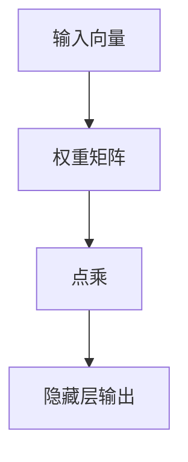
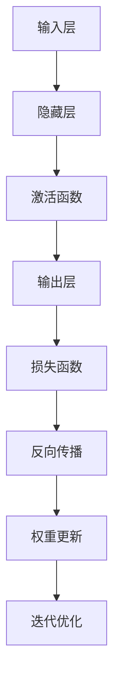
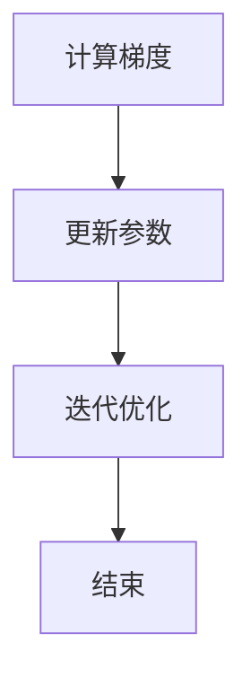
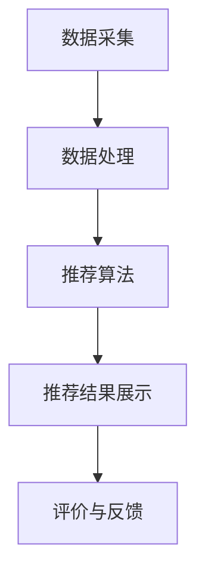
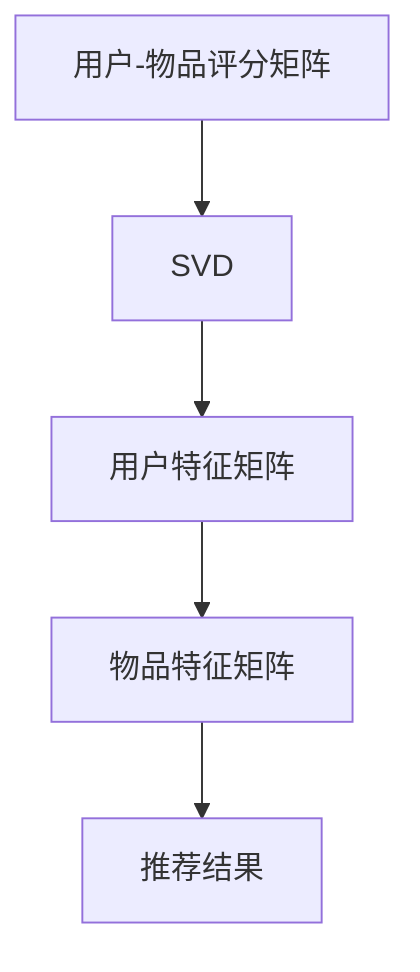
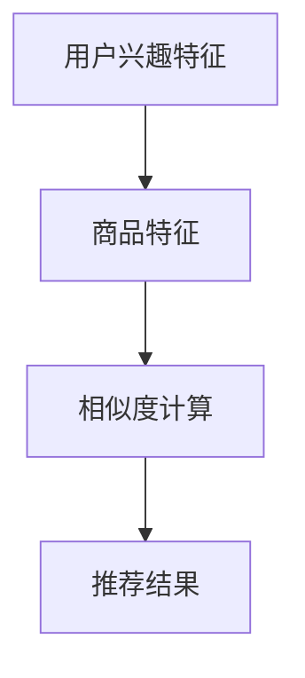
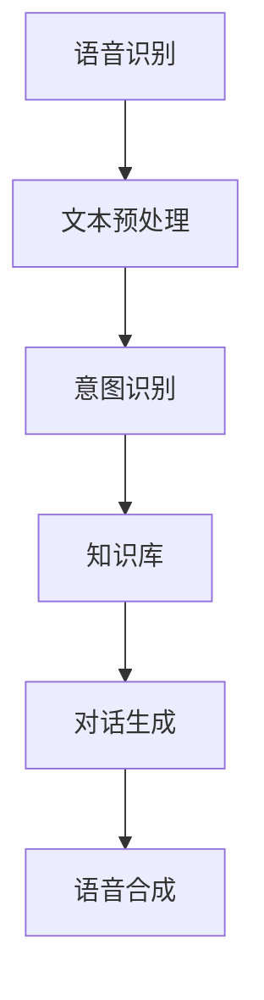
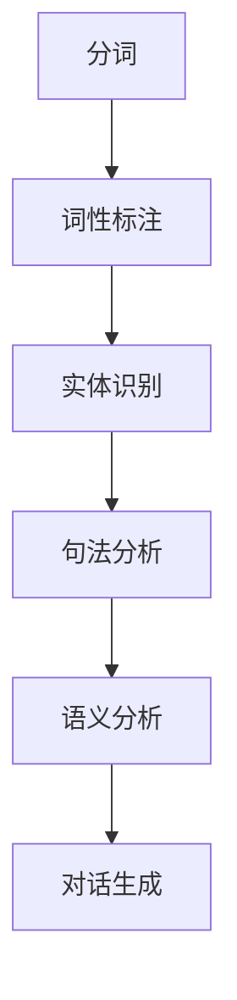

                 

### 文章标题

#### 电商平台中的AI大模型：从离线批处理到实时流处理

> 关键词：电商平台、AI大模型、离线批处理、实时流处理、深度学习、自然语言处理、用户画像、推荐系统、智能客服

> 摘要：本文旨在探讨电商平台中AI大模型的应用，从离线批处理到实时流处理的转变。文章首先介绍了电商平台中的AI大模型基础，包括概述、核心技术、数学模型和应用。接着，深入分析了离线批处理和实时流处理在电商平台中的应用，以及从离线批处理到实时流处理的迁移挑战和策略。最后，通过最佳实践案例分析，总结了AI大模型在电商平台中的成功应用，为实际项目提供了参考和启示。本文旨在为IT从业人员和研究者提供一份全面的技术参考，帮助他们更好地理解和应用AI大模型在电商平台中的价值。

---

### 第一部分: 电商平台中的AI大模型基础

#### 第1章: AI大模型基础与概述

##### 1.1 电商平台的AI大模型概述

###### 1.1.1 电商平台AI大模型的发展历程

电商平台作为数字经济的重要组成部分，其发展历程可以追溯到20世纪90年代末。随着互联网的普及，电商平台从最早的线上商品展示和交易逐步演变成为集购物、支付、物流、售后服务为一体的综合服务平台。AI大模型在电商平台的发展历程中起到了至关重要的作用，为电商平台提供了更加智能化和个性化的服务。

在初期，电商平台主要依赖于传统的数据分析和业务逻辑来实现商品推荐和用户画像。然而，随着用户数据的爆炸式增长和复杂度的增加，传统方法逐渐暴露出处理能力不足、效率低下等局限性。为了应对这些挑战，AI大模型应运而生，通过深度学习、自然语言处理等技术，对海量用户数据进行处理和分析，实现更精准、更高效的推荐和个性化服务。

近年来，随着AI技术的不断进步，电商平台中的AI大模型在性能和智能化程度方面都得到了显著提升。例如，基于GPT系列模型的智能客服系统，可以高效处理用户的查询和需求，提供即时、准确的回应。基于BERT模型的推荐系统，能够根据用户的历史行为和偏好，推荐出更符合用户需求的商品。

###### 1.1.2 AI大模型在电商平台的应用

AI大模型在电商平台中的应用非常广泛，主要包括以下几个方面：

1. **用户画像构建**：通过分析用户的行为数据、购买记录、浏览历史等信息，构建用户的画像。这些画像可以帮助电商平台更好地了解用户的需求和偏好，为个性化推荐和精准营销提供基础。

2. **推荐系统**：基于用户画像和商品信息，利用协同过滤、基于内容的推荐等算法，为用户提供个性化的商品推荐。这不仅可以提升用户的购物体验，还可以增加平台的销售额。

3. **智能客服**：通过自然语言处理技术，智能客服系统可以理解用户的查询和需求，并提供即时、准确的回应。这不仅可以减轻客服人员的工作负担，还可以提高客服效率和用户满意度。

4. **商品销量预测**：通过对历史销售数据、用户行为数据等进行分析，预测商品的销量。这有助于电商平台制定合理的库存管理策略，避免库存过剩或短缺。

5. **价格优化**：通过分析市场数据、用户行为数据等，动态调整商品的价格，以最大化销售额和利润。

###### 1.1.3 电商平台AI大模型的核心概念

电商平台AI大模型的核心概念主要包括以下几个方面：

1. **深度学习**：深度学习是AI大模型的核心技术之一，通过多层神经网络，对数据进行分析和特征提取。在电商平台中，深度学习可以用于构建用户画像、推荐系统等。

2. **自然语言处理（NLP）**：自然语言处理是AI大模型中用于处理和理解自然语言的技术。在电商平台中，NLP可以用于智能客服系统、商品评价分析等。

3. **协同过滤**：协同过滤是推荐系统的一种常用算法，通过分析用户的历史行为和偏好，为用户推荐相似的商品。

4. **基于内容的推荐**：基于内容的推荐算法通过分析商品的属性和内容，为用户推荐相似的物品。

5. **用户画像**：用户画像是对用户的行为、偏好、需求等进行建模和描述，以便为用户提供个性化的服务。

##### 1.2 AI大模型的核心技术

###### 1.2.1 人工智能技术概述

人工智能（Artificial Intelligence，AI）是指模拟、延伸和扩展人类智能的科学和技术。在电商平台中，人工智能技术主要用于数据分析和决策支持，包括数据挖掘、机器学习、深度学习等。

1. **数据挖掘**：数据挖掘是从大量数据中提取有价值信息的过程。在电商平台中，数据挖掘可以用于用户行为分析、商品销量预测等。

2. **机器学习**：机器学习是一种利用数据自动发现规律和模式的技术。在电商平台中，机器学习可以用于构建用户画像、推荐系统等。

3. **深度学习**：深度学习是机器学习的一种重要分支，通过多层神经网络，对数据进行分析和特征提取。在电商平台中，深度学习可以用于构建用户画像、推荐系统、智能客服等。

4. **自然语言处理（NLP）**：自然语言处理是AI大模型中用于处理和理解自然语言的技术。在电商平台中，NLP可以用于智能客服系统、商品评价分析等。

###### 1.2.2 深度学习技术原理

深度学习是一种基于多层神经网络的机器学习方法，通过反向传播算法，不断调整网络中的权重，以达到对数据的拟合。

1. **神经网络**：神经网络是一种由多个神经元组成的计算模型，每个神经元都与其他神经元相连，并接受输入信号。

2. **前向传播**：在前向传播过程中，输入信号通过神经网络的每个层，每一层的神经元都计算出输出信号。

3. **反向传播**：在反向传播过程中，根据输出误差，反向调整网络中的权重，以优化网络性能。

4. **激活函数**：激活函数用于将神经元的线性输出转换为非线性输出，常见的激活函数包括Sigmoid、ReLU等。

5. **损失函数**：损失函数用于衡量网络预测结果与真实结果之间的差异，常见的损失函数包括均方误差（MSE）、交叉熵等。

###### 1.2.3 自然语言处理技术

自然语言处理（NLP）是AI大模型中用于处理和理解自然语言的技术，主要包括以下几个关键环节：

1. **分词**：将自然语言文本分割成单词或短语。

2. **词性标注**：对文本中的每个单词或短语进行词性标注，例如名词、动词、形容词等。

3. **句法分析**：对文本进行句法分析，以理解文本的句法结构和语义关系。

4. **情感分析**：通过对文本的情感倾向进行分析，判断文本的情感是正面、负面还是中性。

5. **实体识别**：从文本中识别出具有特定意义的实体，如人名、地名、组织名等。

6. **机器翻译**：将一种自然语言翻译成另一种自然语言。

7. **问答系统**：通过理解用户的查询，提供相应的回答。

##### 1.3 主流AI大模型介绍

###### 1.3.1 GPT系列模型

GPT（Generative Pre-trained Transformer）是由OpenAI开发的预训练语言模型，其核心思想是使用Transformer架构进行大规模预训练，从而获得强大的语言理解能力。

1. **GPT-2**：GPT-2是GPT的升级版，通过引入更大的模型规模和更多训练数据，取得了更好的性能。

2. **GPT-3**：GPT-3是GPT系列的最新版本，拥有1750亿个参数，是目前最大的语言模型之一，其表现几乎达到了人类水平。

3. **应用场景**：GPT系列模型在电商平台中可以用于智能客服、商品评价分析、文本生成等。

###### 1.3.2 BERT及其变体

BERT（Bidirectional Encoder Representations from Transformers）是由Google开发的预训练语言模型，其核心思想是使用Transformer架构进行双向编码，从而获得更好的语言理解能力。

1. **BERT**：BERT是原始的双向编码模型，通过在大规模语料库上进行预训练，获得强大的语言理解能力。

2. **RoBERTa**：RoBERTa是BERT的变体，通过改进训练策略和数据预处理，取得了更好的性能。

3. **应用场景**：BERT及其变体在电商平台中可以用于用户画像构建、推荐系统、文本分类等。

###### 1.3.3 其他主流AI大模型

除了GPT系列和BERT及其变体，还有其他一些主流的AI大模型，如：

1. **T5**：T5（Text-to-Text Transfer Transformer）是由DeepMind开发的预训练语言模型，其核心思想是将任何自然语言任务转换为文本到文本的转换任务。

2. **XLNet**：XLNet是由Google开发的预训练语言模型，其核心思想是利用双向注意力机制和自回归解码策略，取得更好的性能。

3. **应用场景**：其他主流AI大模型在电商平台中可以用于文本生成、问答系统、机器翻译等。

##### 1.4 电商平台中AI大模型的数学模型

###### 1.4.1 电商平台中AI大模型的数学基础

电商平台中AI大模型的数学基础主要包括以下几个核心概念：

1. **矩阵与向量运算**：矩阵和向量是AI大模型中最基本的数学工具，用于表示数据和计算模型参数。

2. **神经网络数学模型**：神经网络是通过矩阵运算和激活函数实现的，其核心思想是通过多层非线性变换，对输入数据进行特征提取和分类。

3. **损失函数与优化算法**：损失函数用于衡量模型预测结果与真实结果之间的差异，优化算法用于调整模型参数，以优化模型性能。

###### 1.4.2 矩阵与向量运算

1. **矩阵**：矩阵是一个二维数组，用于表示多个向量的组合。

2. **向量**：向量是一个一维数组，用于表示一个多维空间中的一个点。

3. **矩阵运算**：矩阵运算包括矩阵乘法、矩阵加法、矩阵转置等。

4. **向量运算**：向量运算包括向量加法、向量减法、向量点乘等。

###### 1.4.3 神经网络数学模型

1. **神经网络**：神经网络由多个层组成，包括输入层、隐藏层和输出层。

2. **前向传播**：前向传播是将输入数据通过神经网络，从输入层到输出层进行传递，得到输出结果。

3. **反向传播**：反向传播是根据输出结果和真实结果之间的差异，反向调整神经网络中的参数。

4. **激活函数**：激活函数用于将神经元的线性输出转换为非线性输出，常见的激活函数包括Sigmoid、ReLU等。

###### 1.4.4 损失函数与优化算法

1. **损失函数**：损失函数用于衡量模型预测结果与真实结果之间的差异，常见的损失函数包括均方误差（MSE）、交叉熵等。

2. **优化算法**：优化算法用于调整模型参数，以优化模型性能，常见的优化算法包括梯度下降、随机梯度下降（SGD）等。

#### 第2章: 电商平台中AI大模型的数学模型

##### 2.1 电商平台中AI大模型的数学基础

在电商平台中，AI大模型的应用需要依赖于数学模型的理解和应用。这些数学模型为AI大模型提供了理论基础和计算工具，使得我们可以有效地处理和分析大量数据，实现精准的推荐、用户画像构建和智能客服等功能。本节将详细介绍电商平台中AI大模型所依赖的数学基础，包括矩阵与向量运算、神经网络数学模型和损失函数与优化算法。

###### 2.1.1 矩阵与向量运算

矩阵和向量是线性代数中的基本概念，在AI大模型中有着广泛的应用。矩阵是一个二维数组，由行和列组成，用于表示多个向量的组合。而向量是一个一维数组，用于表示一个多维空间中的一个点。矩阵与向量运算包括矩阵乘法、矩阵加法、矩阵转置等。

1. **矩阵乘法**：两个矩阵相乘的结果是一个新的矩阵，其元素是原矩阵对应元素乘积的和。矩阵乘法满足结合律和分配律，但不满足交换律。

2. **矩阵加法**：两个矩阵相加的结果是一个新的矩阵，其元素是原矩阵对应元素的和。

3. **矩阵转置**：矩阵转置是将矩阵的行和列互换，形成一个新的矩阵。

4. **向量运算**：向量运算包括向量加法、向量减法、向量点乘等。向量加法和减法遵循向量加法的平行四边形法则，而向量点乘用于计算两个向量的夹角和长度。

向量与矩阵的运算在AI大模型中起着核心作用。例如，在神经网络中，权重矩阵和输入向量的点乘用于计算隐藏层的输出。这些运算为AI大模型提供了强大的计算能力。



###### 2.1.2 神经网络数学模型

神经网络是一种基于数学模型的计算网络，通过多层非线性变换，对输入数据进行特征提取和分类。神经网络由输入层、隐藏层和输出层组成，每个层由多个神经元（或节点）组成。神经元的输出通过激活函数进行非线性变换，从而实现数据的非线性处理。

1. **前向传播**：前向传播是将输入数据通过神经网络，从输入层到输出层进行传递，得到输出结果。前向传播的过程可以分为以下几个步骤：

   a. **输入层到隐藏层**：输入数据通过输入层传递到隐藏层，每个神经元的输出是输入数据的线性组合，再加上一个偏置项。

   b. **激活函数**：隐藏层的输出通过激活函数进行非线性变换，以实现数据的非线性处理。

   c. **隐藏层到输出层**：隐藏层的输出作为输入传递到输出层，输出层的输出是隐藏层输出的线性组合，同样通过激活函数进行非线性变换。

2. **反向传播**：反向传播是根据输出结果和真实结果之间的差异，反向调整神经网络中的参数。反向传播的过程可以分为以下几个步骤：

   a. **计算梯度**：根据输出误差，计算每个神经元的梯度。

   b. **权重更新**：使用梯度下降算法或其他优化算法，调整神经网络的权重，以减少输出误差。

   c. **迭代优化**：重复进行反向传播和权重更新，直到网络性能达到期望值。

3. **激活函数**：激活函数是神经网络中的关键组件，用于将线性输出转换为非线性输出。常见的激活函数包括Sigmoid、ReLU等。



神经网络数学模型为AI大模型提供了强大的特征提取和分类能力，使得我们可以从大量的数据中提取出有用的信息，从而实现精准的推荐和用户画像构建。

###### 2.1.3 损失函数与优化算法

在AI大模型中，损失函数用于衡量模型预测结果与真实结果之间的差异，而优化算法用于调整模型参数，以优化模型性能。常见的损失函数包括均方误差（MSE）、交叉熵等，常见的优化算法包括梯度下降、随机梯度下降（SGD）等。

1. **损失函数**：

   a. **均方误差（MSE）**：均方误差是衡量预测结果与真实结果之间差异的一种常用损失函数，计算公式为：

   $$MSE = \frac{1}{n}\sum_{i=1}^{n}(y_i - \hat{y}_i)^2$$

   其中，$y_i$为真实结果，$\hat{y}_i$为预测结果，$n$为样本数量。

   b. **交叉熵**：交叉熵是衡量两个概率分布差异的一种常用损失函数，计算公式为：

   $$H(p, q) = -\sum_{i} p_i \log q_i$$

   其中，$p$为真实分布，$q$为预测分布。

2. **优化算法**：

   a. **梯度下降**：梯度下降是一种常用的优化算法，其核心思想是沿着损失函数的梯度方向调整模型参数，以减少损失。梯度下降的公式为：

   $$\theta = \theta - \alpha \nabla_{\theta} J(\theta)$$

   其中，$\theta$为模型参数，$\alpha$为学习率，$J(\theta)$为损失函数。

   b. **随机梯度下降（SGD）**：随机梯度下降是对梯度下降算法的一种改进，其核心思想是在每个迭代过程中，使用随机样本的梯度来更新模型参数。随机梯度下降的公式为：

   $$\theta = \theta - \alpha \nabla_{\theta} J(\theta; \xi)$$

   其中，$\xi$为随机样本。

   c. **批量梯度下降（BDG）**：批量梯度下降是对梯度下降算法的另一种改进，其核心思想是在每个迭代过程中，使用整个训练集的梯度来更新模型参数。批量梯度下降的公式为：

   $$\theta = \theta - \alpha \nabla_{\theta} J(\theta; X, y)$$

   其中，$X$为输入数据集，$y$为输出数据集。

损失函数与优化算法为AI大模型提供了评估和改进模型性能的工具，使得我们可以通过不断调整模型参数，提高模型预测的准确性和鲁棒性。

##### 2.2 电商平台中AI大模型的训练方法

在电商平台中，AI大模型的训练方法对于模型的性能和应用效果至关重要。本节将介绍电商平台中AI大模型的常见训练方法，包括梯度下降算法、随机梯度下降（SGD）和批量梯度下降（BDG）等。

###### 2.2.1 梯度下降算法

梯度下降算法是一种常见的优化算法，用于最小化损失函数。其核心思想是沿着损失函数的梯度方向调整模型参数，以减少损失。梯度下降算法的公式为：

$$\theta = \theta - \alpha \nabla_{\theta} J(\theta)$$

其中，$\theta$为模型参数，$\alpha$为学习率，$J(\theta)$为损失函数。

1. **计算梯度**：首先，计算损失函数关于模型参数的梯度。对于均方误差（MSE）损失函数，梯度的计算公式为：

$$\nabla_{\theta} J(\theta) = -2 \frac{1}{n} \sum_{i=1}^{n} (y_i - \hat{y}_i) x_i$$

其中，$y_i$为真实结果，$\hat{y}_i$为预测结果，$x_i$为输入特征。

2. **更新参数**：然后，使用学习率乘以梯度，更新模型参数。学习率的选择对梯度下降算法的性能有很大影响，通常需要通过实验进行优化。

3. **迭代优化**：重复计算梯度、更新参数的过程，直到达到预设的优化目标，如损失函数值达到最小值或迭代次数达到上限。

###### 2.2.2 随机梯度下降（SGD）

随机梯度下降是对梯度下降算法的一种改进，其核心思想是在每个迭代过程中，使用随机样本的梯度来更新模型参数。随机梯度下降的公式为：

$$\theta = \theta - \alpha \nabla_{\theta} J(\theta; \xi)$$

其中，$\xi$为随机样本。

1. **随机抽样**：首先，从训练数据集中随机选择一个样本。

2. **计算梯度**：然后，计算损失函数关于模型参数的梯度。对于均方误差（MSE）损失函数，梯度的计算公式为：

$$\nabla_{\theta} J(\theta; \xi) = -2 (y - \hat{y}) x$$

其中，$y$为真实结果，$\hat{y}$为预测结果，$x$为输入特征。

3. **更新参数**：使用学习率乘以梯度，更新模型参数。

4. **迭代优化**：重复随机抽样、计算梯度、更新参数的过程，直到达到预设的优化目标。

随机梯度下降算法可以加快收敛速度，减少计算时间，但对于某些问题可能收敛不稳定。

###### 2.2.3 批量梯度下降（BDG）

批量梯度下降是对梯度下降算法的另一种改进，其核心思想是在每个迭代过程中，使用整个训练集的梯度来更新模型参数。批量梯度下降的公式为：

$$\theta = \theta - \alpha \nabla_{\theta} J(\theta; X, y)$$

其中，$X$为输入数据集，$y$为输出数据集。

1. **计算梯度**：首先，计算损失函数关于模型参数的梯度。对于均方误差（MSE）损失函数，梯度的计算公式为：

$$\nabla_{\theta} J(\theta; X, y) = -2 \frac{1}{n} \sum_{i=1}^{n} (y_i - \hat{y}_i) x_i$$

其中，$y_i$为真实结果，$\hat{y}_i$为预测结果，$x_i$为输入特征。

2. **更新参数**：然后，使用学习率乘以梯度，更新模型参数。

3. **迭代优化**：重复计算梯度、更新参数的过程，直到达到预设的优化目标。

批量梯度下降算法可以保证收敛到全局最小值，但计算时间较长。

在实际应用中，根据问题的规模和特点，可以选择合适的训练方法。对于大规模数据集，随机梯度下降和批量梯度下降通常更为高效。而对于小规模数据集，梯度下降算法可以提供更稳定的收敛性能。



#### 第3章: 电商平台中AI大模型的应用

##### 3.1 电商平台用户画像构建

用户画像构建是电商平台AI大模型应用的重要环节，通过对用户行为、偏好、需求等数据进行深入分析，为电商平台提供个性化的服务和精准营销。本节将介绍电商平台用户画像构建的概念、流程及案例分析。

###### 3.1.1 用户画像的概念

用户画像（User Profile）是对用户在互联网平台上的行为、偏好、需求等信息进行系统化的建模和描述，从而形成对用户全面、立体的认知。用户画像可以包括以下几个方面：

1. **基础信息**：包括用户的性别、年龄、地理位置、职业等基本信息。
2. **行为特征**：包括用户的浏览历史、购买记录、搜索历史、评论等行为数据。
3. **偏好信息**：包括用户的偏好类别、价格敏感度、品牌偏好等。
4. **需求特征**：包括用户在特定情境下的需求，如节假日购物偏好、促销活动关注等。

用户画像的目的是为电商平台提供个性化的服务和精准的营销策略，提高用户满意度和转化率。

###### 3.1.2 用户画像构建流程

用户画像构建通常包括以下几个步骤：

1. **数据采集**：通过电商平台的用户行为数据、用户信息、交易数据等，进行数据采集。
2. **数据清洗**：对采集到的数据进行处理，去除重复、缺失、异常等数据，确保数据质量。
3. **特征提取**：从原始数据中提取出有用的特征，如用户活跃度、购买频次、浏览深度等。
4. **模型构建**：利用机器学习算法，如聚类、分类等，对用户特征进行分析和建模，构建用户画像。
5. **画像评估**：对构建的用户画像进行评估，通过A/B测试等方法，验证画像的有效性和准确性。
6. **应用与优化**：将用户画像应用于电商平台的服务和营销策略中，如个性化推荐、精准广告投放等，并根据应用效果进行优化。

###### 3.1.3 用户画像案例分析

以下是一个用户画像构建的案例：

**案例背景**：某电商平台希望通过用户画像构建，为用户提供个性化的商品推荐，提高用户购物体验和转化率。

**数据采集**：平台收集了用户的浏览历史、购买记录、搜索关键词等数据。

**数据清洗**：对收集到的数据进行处理，去除重复和异常数据，确保数据质量。

**特征提取**：从原始数据中提取出用户活跃度、购买频次、浏览深度等特征。

**模型构建**：利用聚类算法，将用户分为不同的群体，如高价值用户、潜力用户等。

**画像评估**：通过A/B测试，验证个性化推荐对用户转化率的影响。

**应用与优化**：根据用户画像，为高价值用户推荐热门商品，为潜力用户推送促销信息，提高用户购物体验和转化率。同时，根据用户反馈和转化数据，不断优化用户画像模型。

通过用户画像构建，电商平台可以实现个性化推荐、精准广告投放等功能，提升用户体验和转化率，从而实现商业价值。

##### 3.2 电商平台推荐系统设计

电商平台推荐系统是电商平台AI大模型应用的核心之一，通过分析用户行为和偏好，为用户推荐符合其需求的商品。推荐系统的设计包括基本架构、算法选择和性能优化等方面。本节将详细介绍电商平台推荐系统的设计。

###### 3.2.1 推荐系统的基本架构

电商平台推荐系统的基本架构包括以下几个主要模块：

1. **数据采集模块**：负责采集用户行为数据，如浏览记录、购买记录、搜索关键词等。
2. **数据处理模块**：对采集到的数据进行处理，包括数据清洗、特征提取等，为推荐算法提供高质量的输入数据。
3. **推荐算法模块**：根据用户行为数据和商品信息，利用推荐算法生成推荐结果。
4. **推荐结果展示模块**：将推荐结果展示给用户，如推荐列表、商品详情页等。
5. **评价与反馈模块**：收集用户对推荐结果的反馈，用于评估推荐系统的效果和优化推荐算法。



###### 3.2.2 基于协同过滤的推荐算法

基于协同过滤（Collaborative Filtering）的推荐算法是推荐系统中最常用的算法之一，其核心思想是利用用户的行为数据，发现用户之间的相似性，从而为用户推荐相似用户喜欢的商品。

1. **用户基于的协同过滤**：用户基于的协同过滤通过计算用户之间的相似度，为用户推荐与目标用户相似的邻居用户喜欢的商品。常用的相似度计算方法包括余弦相似度、皮尔逊相关系数等。

2. **物品基于的协同过滤**：物品基于的协同过滤通过计算物品之间的相似度，为用户推荐与目标物品相似的物品。常用的相似度计算方法包括TF-IDF、余弦相似度等。

3. **矩阵分解**：矩阵分解（Matrix Factorization）是一种常用的协同过滤算法，通过将用户-物品评分矩阵分解为用户特征矩阵和物品特征矩阵，从而得到推荐结果。矩阵分解算法包括Singular Value Decomposition（SVD）和Alternating Least Squares（ALS）等。



###### 3.2.3 基于内容的推荐算法

基于内容的推荐算法（Content-based Filtering）通过分析用户对特定商品的兴趣，利用商品的特征信息为用户推荐相似的商品。基于内容的推荐算法主要包括以下几个方面：

1. **特征提取**：从商品信息中提取出关键词、类别、品牌等特征。
2. **相似度计算**：计算用户对商品的兴趣特征与商品特征之间的相似度，常用的相似度计算方法包括TF-IDF、余弦相似度等。
3. **推荐生成**：根据用户对商品的兴趣特征和商品特征之间的相似度，为用户推荐相似的商品。

基于内容的推荐算法可以有效地解决数据稀疏性问题，但在推荐多样性方面可能存在一定的局限性。



###### 3.2.4 推荐系统的性能优化

推荐系统的性能优化是提高推荐效果和用户体验的重要环节，主要包括以下几个方面：

1. **算法优化**：针对不同的业务场景和数据特点，选择合适的推荐算法，并通过参数调整和算法改进提高推荐效果。
2. **数据预处理**：对用户行为数据进行清洗、去噪、特征提取等预处理，提高数据质量。
3. **模型更新**：定期更新用户画像和商品特征，以适应用户和商品的变化。
4. **实时推荐**：通过实时流处理技术，快速响应用户行为变化，提供实时推荐。
5. **推荐多样性**：通过多样化推荐策略，如基于上下文的推荐、基于兴趣的推荐等，提高推荐结果的多样性。

##### 3.3 电商平台智能客服系统

电商平台智能客服系统是电商平台AI大模型应用的重要方面，通过自然语言处理（NLP）技术，实现与用户的智能对话，提供即时、准确的客服服务。本节将介绍智能客服系统的基本架构、基于NLP的智能客服和智能客服系统的性能评估。

###### 3.3.1 智能客服系统的基本架构

智能客服系统的基本架构包括以下几个主要模块：

1. **语音识别模块**：将用户的语音输入转换为文本输入。
2. **文本预处理模块**：对文本输入进行分词、词性标注、实体识别等预处理，提取出有用的信息。
3. **意图识别模块**：通过NLP技术，识别用户的意图，如咨询、投诉、查询等。
4. **知识库模块**：存储常用问答、业务规则等知识，用于回答用户的问题。
5. **对话生成模块**：根据用户的意图和知识库，生成合适的回答。
6. **语音合成模块**：将生成的文本回答转换为语音输出，回应用户。



###### 3.3.2 基于自然语言处理（NLP）的智能客服

基于自然语言处理的智能客服系统利用NLP技术，实现与用户的智能对话。NLP的关键技术包括：

1. **分词**：将文本输入分割成单个词或短语。
2. **词性标注**：为每个词分配词性，如名词、动词、形容词等。
3. **实体识别**：识别文本中的关键实体，如人名、地名、组织名等。
4. **句法分析**：分析文本的句法结构，理解句子的组成和语义关系。
5. **语义分析**：通过语义分析，理解用户的意图和情感，为对话生成提供依据。



基于NLP的智能客服系统可以处理复杂、多变的用户问题，提供即时、准确的客服服务，减轻人工客服的工作负担，提高客服效率和用户满意度。

###### 3.3.3 智能客服系统的性能评估

智能客服系统的性能评估是保证系统质量和用户满意度的重要环节，主要包括以下几个方面：

1. **响应速度**：评估智能客服系统处理用户请求的响应时间，响应速度越快，用户体验越好。
2. **准确率**：评估智能客服系统识别用户意图和回答问题的准确率，准确率越高，用户满意度越高。
3. **多样性**：评估智能客服系统生成回答的多样性，避免回答单一、机械，提高用户兴趣。
4. **用户体验**：通过用户调查、反馈等方式，评估智能客服系统对用户的实际影响，如用户满意度、使用频率等。
5. **业务指标**：评估智能客服系统对业务指标的影响，如客服成本降低、用户转化率提高等。

通过性能评估，可以识别智能客服系统的优点和不足，为系统的优化和改进提供依据。

#### 第4章: 离线批处理在电商平台中的应用

##### 4.1 离线批处理技术概述

离线批处理（Batch Processing）是一种数据处理方式，它将数据处理任务分成多个批次，在每个批次中处理一定数量的数据，然后批量输出结果。在电商平台中，离线批处理技术被广泛应用于数据分析和处理，例如用户行为分析、商品销量预测、用户画像构建等。

###### 4.1.1 离线批处理的定义

离线批处理是指在数据处理过程中，将数据集分成多个批次进行处理，每个批次的数据是独立处理的，不需要实时响应。离线批处理通常用于处理大规模数据，具有较高的效率和可靠性。

###### 4.1.2 离线批处理的优势与局限性

离线批处理技术具有以下优势：

1. **处理效率高**：离线批处理可以将数据处理任务分解为多个批次，每个批次独立处理，提高了数据处理效率。
2. **可靠性高**：离线批处理在处理数据时，可以确保数据的完整性和一致性，降低数据丢失的风险。
3. **易于管理**：离线批处理系统通常具有较好的可扩展性和可维护性，便于管理和维护。

然而，离线批处理也存在一定的局限性：

1. **延迟较高**：由于离线批处理需要将数据集分成多个批次进行处理，因此处理时间较长，导致数据延迟较高。
2. **实时性较差**：离线批处理无法实时响应数据变化，无法及时调整处理策略。
3. **资源利用不充分**：离线批处理系统在处理数据时，可能会出现资源闲置或资源竞争的情况。

###### 4.1.3 离线批处理在电商平台的实际应用场景

在电商平台中，离线批处理技术被广泛应用于以下几个方面：

1. **用户行为分析**：电商平台通过对用户浏览、购买、评价等行为数据进行分析，可以了解用户偏好和行为模式，从而优化推荐算法和营销策略。
2. **商品销量预测**：电商平台通过对历史销售数据进行分析，可以预测未来商品的销量，为库存管理和促销活动提供数据支持。
3. **用户画像构建**：电商平台通过对用户行为数据进行处理，可以构建用户的画像，为个性化推荐和精准营销提供基础。
4. **数据报表生成**：电商平台需要定期生成各种数据报表，如销售报表、财务报表等，离线批处理技术可以高效地完成这些任务。

##### 4.2 离线批处理算法

离线批处理算法是离线批处理系统中的核心组件，用于对大批量数据进行处理。常见的离线批处理算法包括机器学习算法、数据预处理技术和优化策略等。

###### 4.2.1 机器学习算法在离线批处理中的应用

在离线批处理中，机器学习算法用于对大批量数据进行建模和分析，常见的机器学习算法包括分类算法、回归算法和聚类算法等。

1. **分类算法**：分类算法用于将数据划分为不同的类别，常见的分类算法包括决策树、支持向量机（SVM）和朴素贝叶斯等。

   ```python
   from sklearn.tree import DecisionTreeClassifier
   clf = DecisionTreeClassifier()
   clf.fit(X_train, y_train)
   predictions = clf.predict(X_test)
   ```

2. **回归算法**：回归算法用于预测连续值，常见的回归算法包括线性回归、决策树回归和支持向量回归等。

   ```python
   from sklearn.linear_model import LinearRegression
   reg = LinearRegression()
   reg.fit(X_train, y_train)
   predictions = reg.predict(X_test)
   ```

3. **聚类算法**：聚类算法用于将数据分为不同的簇，常见的聚类算法包括K均值聚类、层次聚类和DBSCAN等。

   ```python
   from sklearn.cluster import KMeans
   kmeans = KMeans(n_clusters=3)
   kmeans.fit(X)
   predictions = kmeans.predict(X)
   ```

###### 4.2.2 数据预处理技术

数据预处理是离线批处理中非常重要的一步，它包括数据清洗、特征提取和特征选择等。

1. **数据清洗**：数据清洗是处理数据缺失、异常值和重复数据等问题的过程，常见的清洗方法包括删除缺失值、填充缺失值和去重等。

   ```python
   import pandas as pd
   df = pd.read_csv('data.csv')
   df.dropna(inplace=True)
   df.drop_duplicates(inplace=True)
   ```

2. **特征提取**：特征提取是从原始数据中提取出有用的特征，常见的特征提取方法包括词频统计、TF-IDF和词嵌入等。

   ```python
   from sklearn.feature_extraction.text import TfidfVectorizer
   vectorizer = TfidfVectorizer()
   X = vectorizer.fit_transform(corpus)
   ```

3. **特征选择**：特征选择是选择对模型性能有显著影响的特征，常见的特征选择方法包括特征选择算法、基于模型的特征选择和基于特征重要性的特征选择等。

   ```python
   from sklearn.feature_selection import SelectKBest
   from sklearn.feature_selection import f_classif
   X = SelectKBest(f_classif, k=10).fit_transform(X, y)
   ```

###### 4.2.3 离线批处理的优化策略

为了提高离线批处理系统的性能和效率，可以采用以下优化策略：

1. **并行处理**：利用多线程、多进程或多机分布式计算技术，提高数据处理速度。
2. **内存优化**：合理分配内存资源，避免内存溢出和资源浪费。
3. **缓存技术**：使用缓存技术，减少重复计算和数据传输，提高数据处理效率。
4. **批处理窗口**：调整批处理窗口大小，平衡处理延迟和数据处理效率。

```python
# Example of using multiprocessing for parallel processing
import multiprocessing
import time

def process_data(data):
    # Process data
    pass

if __name__ == '__main__':
    start_time = time.time()
    pool = multiprocessing.Pool(processes=4)
    results = pool.map(process_data, data)
    pool.close()
    pool.join()
    end_time = time.time()
    print(f"Total time: {end_time - start_time} seconds")
```

通过以上优化策略，可以显著提高离线批处理系统的性能和效率，满足电商平台对数据处理的需求。

##### 4.3 离线批处理案例分析

在本节中，我们将通过两个实际案例分析来探讨离线批处理技术在电商平台的实际应用。

###### 4.3.1 案例一：用户行为数据分析

**背景**：某电商平台希望通过对用户行为数据进行分析，了解用户的行为模式和偏好，从而优化推荐算法和营销策略。

**数据处理流程**：

1. **数据采集**：收集用户的浏览记录、购买记录、搜索关键词等行为数据。

2. **数据预处理**：清洗数据，去除重复和缺失的数据，对数据类型进行统一处理。

3. **特征提取**：提取用户的行为特征，如浏览深度、购买频次、搜索关键词频次等。

4. **模型训练**：利用分类算法，如决策树、随机森林等，对用户行为数据进行建模，预测用户的下一步行为。

5. **结果分析**：分析用户行为数据，提取用户画像，为推荐算法和营销策略提供数据支持。

**案例效果**：通过用户行为数据分析，电商平台能够更好地理解用户的需求和偏好，提高了推荐算法的准确性和营销策略的有效性，从而提升了用户满意度和转化率。

###### 4.3.2 案例二：商品销量预测

**背景**：某电商平台需要预测商品的销量，以便进行库存管理和促销活动策划。

**数据处理流程**：

1. **数据采集**：收集历史销售数据，包括商品ID、销售数量、销售时间等。

2. **数据预处理**：清洗数据，去除重复和缺失的数据，对数据类型进行统一处理。

3. **特征提取**：提取销售数据的相关特征，如商品种类、季节、促销活动等。

4. **模型训练**：利用回归算法，如线性回归、决策树回归等，对销售数据进行建模，预测未来销量。

5. **结果分析**：分析预测结果，制定库存管理和促销活动策略。

**案例效果**：通过商品销量预测，电商平台能够更好地掌握市场趋势，合理安排库存和促销活动，提高了销售额和库存周转率。

通过以上案例分析，我们可以看到离线批处理技术在电商平台中的应用价值。离线批处理技术能够高效地处理大规模数据，为电商平台提供数据分析和预测能力，从而优化运营策略和提高业务效率。

### 实时流处理在电商平台中的应用

实时流处理（Real-time Stream Processing）是数据处理领域的一种新兴技术，它能够对实时产生的海量数据进行实时分析、处理和反应。在电商平台中，实时流处理技术被广泛应用于实时用户行为分析、实时商品销售预测和实时推荐系统等场景，为电商平台提供了高效、灵活的数据处理能力。本节将介绍实时流处理技术的基本概念、优势与挑战，以及其在电商平台中的实际应用场景。

#### 5.1 实时流处理技术概述

实时流处理技术是指对实时产生的大量数据进行快速处理和分析，以实现对数据的实时响应。与传统的离线批处理不同，实时流处理能够实时接收和处理数据流，从而提供即时的分析和决策支持。

###### 5.1.1 实时流处理的定义

实时流处理是指对实时产生的数据流进行实时分析、处理和反应，以实现对数据的实时洞察和实时决策。实时流处理通常涉及以下几个关键环节：

1. **数据采集**：实时流处理系统从各种数据源（如传感器、Web服务器日志、社交网络等）采集数据，并确保数据实时传输到处理系统。
2. **数据预处理**：对采集到的数据进行清洗、转换和聚合等预处理操作，确保数据的质量和一致性。
3. **实时分析**：对预处理后的数据进行实时分析，提取关键特征和模式，实现对数据的实时洞察。
4. **实时处理**：根据分析结果，对数据进行实时处理，如实时计算、实时更新、实时决策等。
5. **数据存储与反馈**：将实时处理的结果存储到数据库或数据仓库中，并实时反馈给相关系统或用户。

实时流处理技术的核心目标是提供高效、实时、准确的数据分析和处理能力，以支持电商平台在数据密集型业务场景中的决策和优化。

###### 5.1.2 实时流处理的优势与挑战

实时流处理技术在电商平台中具有显著的优势，同时也面临一些挑战。

**优势：**

1. **实时性**：实时流处理能够对实时产生的数据进行实时分析和处理，提供即时的洞察和决策支持。
2. **高效性**：实时流处理能够处理海量数据流，支持大规模数据实时处理，提高数据处理效率。
3. **灵活性**：实时流处理可以根据业务需求实时调整处理逻辑，灵活应对数据变化和业务需求。
4. **可扩展性**：实时流处理技术支持水平扩展，可以轻松应对数据量和处理需求的变化。

**挑战：**

1. **处理能力**：实时流处理需要处理海量数据流，对计算资源和处理能力提出了高要求。
2. **数据一致性问题**：实时流处理涉及多个数据源和数据处理环节，确保数据一致性和准确性是一个挑战。
3. **系统稳定性**：实时流处理系统需要具备高可用性和稳定性，以避免数据丢失或处理失败。
4. **数据安全问题**：实时流处理涉及敏感数据，确保数据安全是关键挑战。

###### 5.1.3 实时流处理在电商平台的实际应用场景

在电商平台中，实时流处理技术广泛应用于以下几个方面：

1. **实时用户行为分析**：实时分析用户的浏览、点击、购买等行为，识别用户偏好和潜在需求，为个性化推荐和精准营销提供支持。
2. **实时商品销售预测**：实时分析销售数据，预测商品未来的销售趋势，优化库存管理和促销活动策划。
3. **实时推荐系统**：根据实时用户行为和商品信息，实时生成推荐结果，提高用户的购物体验和转化率。
4. **实时广告投放**：实时分析用户行为和广告效果，动态调整广告投放策略，提高广告效果和用户满意度。

#### 5.2 实时流处理算法

实时流处理算法是实时流处理系统的核心组件，用于对实时数据流进行高效、准确的处理和分析。常见的实时流处理算法包括实时推荐算法、实时数据预处理技术和基本算法等。

###### 5.2.1 实时流处理中的基本算法

实时流处理中的基本算法主要包括以下几个方面：

1. **实时窗口算法**：实时窗口算法用于对实时数据流进行窗口划分，对每个窗口内的数据进行处理和分析。常见的实时窗口算法包括滑动窗口、固定窗口和膨胀窗口等。

   ```python
   def sliding_window(data_stream, window_size):
       window = []
       for data in data_stream:
           window.append(data)
           if len(window) > window_size:
               window.pop(0)
           yield window
   ```

2. **实时过滤算法**：实时过滤算法用于对实时数据流进行过滤，根据预定的规则筛选出符合条件的数据。常见的实时过滤算法包括基于阈值的过滤、基于规则的过滤等。

   ```python
   def threshold_filter(data_stream, threshold):
       for data in data_stream:
           if data > threshold:
               yield data
   ```

3. **实时聚合算法**：实时聚合算法用于对实时数据流进行聚合操作，如求和、求平均、求最大值等。常见的实时聚合算法包括实时求和、实时求平均等。

   ```python
   def real_time_sum(data_stream):
       total = 0
       for data in data_stream:
           total += data
       return total
   ```

###### 5.2.2 实时推荐算法

实时推荐算法是实时流处理中常用的算法之一，用于根据实时用户行为和商品信息，实时生成推荐结果。常见的实时推荐算法包括基于内容的推荐、基于协同过滤的推荐和基于模型的推荐等。

1. **基于内容的推荐**：基于内容的推荐算法通过分析商品的特征信息，为用户推荐具有相似特征的商品。常见的基于内容的推荐算法包括基于TF-IDF的推荐、基于词嵌入的推荐等。

   ```python
   def content_based_recommendation(user_behavior, item_features):
       user_interests = extract_user_interests(user_behavior)
       similar_items = find_similar_items(user_interests, item_features)
       return similar_items
   ```

2. **基于协同过滤的推荐**：基于协同过滤的推荐算法通过分析用户之间的行为相似性，为用户推荐其他用户喜欢的商品。常见的基于协同过滤的推荐算法包括基于用户的协同过滤和基于物品的协同过滤等。

   ```python
   def collaborative_filtering(user_behavior, user_similarity, item_ratings):
       user_item_similarity = calculate_user_item_similarity(user_behavior, user_similarity)
       predicted_ratings = predict_ratings(user_item_similarity, item_ratings)
       recommended_items = find_top_rated_items(predicted_ratings)
       return recommended_items
   ```

3. **基于模型的推荐**：基于模型的推荐算法通过训练机器学习模型，根据用户行为和商品特征生成推荐结果。常见的基于模型的推荐算法包括基于深度学习的推荐、基于强化学习的推荐等。

   ```python
   def model_based_recommendation(user_behavior, model):
       user_representation = generate_user_representation(user_behavior, model)
       predicted_ratings = predict_ratings(user_representation, model)
       recommended_items = find_top_rated_items(predicted_ratings)
       return recommended_items
   ```

###### 5.2.3 实时数据预处理技术

实时数据预处理技术是实时流处理中的重要环节，用于确保实时数据的质量和一致性。常见的实时数据预处理技术包括数据清洗、特征提取和特征选择等。

1. **数据清洗**：实时数据清洗是处理实时数据中的缺失值、异常值和重复值等问题的过程。常见的实时数据清洗方法包括缺失值填充、异常值处理和去重等。

   ```python
   def real_time_data_cleaning(data_stream):
       cleaned_data = []
       for data in data_stream:
           if is_valid_data(data):
               cleaned_data.append(data)
       return cleaned_data
   ```

2. **特征提取**：实时特征提取是从实时数据中提取出有用的特征，用于后续的数据分析和建模。常见的实时特征提取方法包括词频统计、词嵌入和时间序列特征提取等。

   ```python
   def real_time_feature_extraction(data_stream):
       extracted_features = []
       for data in data_stream:
           features = extract_features(data)
           extracted_features.append(features)
       return extracted_features
   ```

3. **特征选择**：实时特征选择是从实时特征中选出对模型性能有显著影响的特征，以减少特征维度和计算复杂度。常见的实时特征选择方法包括基于模型的特征选择、基于特征重要性的特征选择等。

   ```python
   def real_time_feature_selection(features, model):
       selected_features = select_k_best_features(features, model)
       return selected_features
   ```

通过实时流处理算法和实时数据预处理技术，电商平台可以实现对海量实时数据的快速、准确的处理和分析，从而为用户提供个性化的服务、精准的推荐和高效的营销策略。

##### 5.3 实时流处理案例分析

在本节中，我们将通过两个实际案例分析来探讨实时流处理技术在电商平台的实际应用。

###### 5.3.1 案例一：实时用户行为分析

**背景**：某电商平台希望通过实时用户行为分析，了解用户的实时浏览、点击和购买行为，从而优化推荐算法和营销策略。

**数据处理流程**：

1. **数据采集**：实时采集用户的浏览、点击和购买等行为数据。

2. **数据预处理**：对采集到的行为数据进行实时清洗和预处理，包括去除缺失值、异常值和重复值等。

3. **实时特征提取**：提取用户的实时行为特征，如浏览深度、点击频次、购买频次等。

4. **实时分析**：利用实时流处理算法，对用户实时行为特征进行分析，识别用户的偏好和潜在需求。

5. **实时决策**：根据实时分析结果，动态调整推荐算法和营销策略，为用户提供个性化的服务和推荐。

**案例效果**：通过实时用户行为分析，电商平台能够及时了解用户的需求和偏好，优化推荐算法和营销策略，提高了用户的购物体验和转化率。

###### 5.3.2 案例二：实时商品销售预测

**背景**：某电商平台希望通过实时商品销售预测，优化库存管理和促销活动策划，提高销售额和库存周转率。

**数据处理流程**：

1. **数据采集**：实时采集商品的历史销售数据、用户行为数据等。

2. **数据预处理**：对采集到的销售数据进行实时清洗和预处理，包括去除缺失值、异常值和重复值等。

3. **实时特征提取**：提取商品的实时销售特征，如销售量、销售频次、用户评价等。

4. **实时预测**：利用实时流处理算法和机器学习模型，对商品的销售量进行实时预测。

5. **实时决策**：根据实时预测结果，动态调整库存管理和促销活动策略，确保商品供应充足和库存周转高效。

**案例效果**：通过实时商品销售预测，电商平台能够及时掌握商品销售趋势，优化库存管理和促销活动策划，提高了销售额和库存周转率。

通过以上案例分析，我们可以看到实时流处理技术在电商平台中的实际应用价值。实时流处理技术能够高效地处理实时数据，为电商平台提供实时分析和决策支持，从而优化运营策略和提高业务效率。

#### 第6章: 从离线批处理到实时流处理的迁移

##### 6.1 从离线批处理到实时流处理的挑战

在电商平台中，从离线批处理到实时流处理的迁移面临一系列的挑战，这些挑战涉及数据一致性、处理能力与效率、系统稳定性等方面。以下将详细分析这些挑战，并探讨相应的解决方案。

###### 6.1.1 数据一致性问题

数据一致性是实时流处理面临的一个关键挑战。在离线批处理中，数据可以在一段时间内累积，然后批量处理，这样有助于确保数据的完整性和一致性。而在实时流处理中，数据是实时到达的，并且需要立即处理。由于网络延迟、系统故障等原因，可能导致部分数据丢失或重复处理，从而影响数据一致性。

**解决方案**：

1. **数据同步机制**：在实时流处理系统中，可以引入数据同步机制，确保数据的实时传输和同步。例如，使用消息队列（如Kafka、RabbitMQ）来传输数据，并确保消息的顺序性和可靠性。

2. **去重算法**：在实时流处理过程中，可以引入去重算法，检测和去除重复的数据。例如，使用哈希函数对数据内容进行哈希，并设置一个滑动窗口，检测窗口内是否有重复的哈希值。

3. **数据校验**：在数据传输和处理过程中，引入数据校验机制，如校验和、数字签名等，以确保数据的完整性和正确性。

###### 6.1.2 处理能力与效率问题

实时流处理需要对大规模数据进行实时处理，这通常比离线批处理要求更高的处理能力和效率。处理能力的不足会导致延迟增加，影响实时性。同时，实时流处理系统需要能够高效地处理不同类型的数据，如文本、图像、视频等。

**解决方案**：

1. **分布式架构**：采用分布式架构，将处理任务分配到多个节点上，以提高处理能力和效率。例如，使用Apache Flink、Apache Spark Streaming等分布式流处理框架。

2. **并行处理**：利用多线程、多进程等技术，实现并行处理，提高数据处理速度。例如，在处理数据流时，使用多线程处理不同的数据流，或在处理数据块时使用并行计算。

3. **数据压缩与优化**：对数据进行压缩和优化，减少数据传输和处理的开销。例如，使用高效的编码算法，如Hadoop的HDFS、Apache Parquet等。

4. **资源调度**：合理分配资源，确保处理能力与数据量的匹配。例如，使用资源调度器（如Apache Mesos、Kubernetes）来动态调整资源分配。

###### 6.1.3 系统稳定性问题

实时流处理系统需要具备高可用性和稳定性，以避免数据丢失或处理失败。在实时流处理中，系统可能会遇到各种异常情况，如网络中断、硬件故障等，这要求系统具有强大的容错能力和恢复能力。

**解决方案**：

1. **容错机制**：引入容错机制，确保系统的稳定性。例如，使用分布式系统中的主从架构，实现故障转移和数据备份。

2. **故障恢复**：在系统发生故障时，能够快速恢复，确保数据处理不受影响。例如，使用分布式存储系统（如HDFS）的副本机制，实现数据的快速恢复。

3. **监控与告警**：引入实时监控和告警机制，及时发现和处理系统故障。例如，使用监控工具（如Prometheus、Grafana）来监控系统性能和资源使用情况。

4. **弹性伸缩**：根据数据处理需求，动态调整系统规模，确保系统在负载变化时能够保持稳定。例如，使用容器化技术（如Docker、Kubernetes）实现系统的弹性伸缩。

通过解决数据一致性、处理能力与效率、系统稳定性等挑战，电商平台可以顺利实现从离线批处理到实时流处理的迁移，从而提供更加实时、高效和稳定的数据处理能力。

##### 6.2 从离线批处理到实时流处理的策略

为了从离线批处理成功迁移到实时流处理，电商平台需要制定一系列策略，以确保数据的实时性、准确性和一致性。以下将详细探讨数据同步策略、架构优化策略和性能优化策略。

###### 6.2.1 数据同步策略

数据同步策略是确保实时流处理系统与离线批处理系统数据一致性的关键。以下是一些有效的数据同步策略：

1. **增量同步**：实时流处理系统可以通过增量同步的方式，从离线批处理系统中获取新增的数据。具体方法包括使用时间戳、数据ID等来标识和同步增量数据。

   ```python
   def incremental_sync(prev_data, new_data):
       sync_data = []
       for data in new_data:
           if data['timestamp'] > prev_data['timestamp']:
               sync_data.append(data)
       return sync_data
   ```

2. **双写机制**：实时流处理系统和离线批处理系统可以同时写入数据，确保数据的冗余备份。当其中一个系统发生故障时，可以快速切换到另一个系统，保证数据的连续性和一致性。

3. **日志系统**：使用日志系统记录实时流处理系统的操作日志，以便在出现数据不一致时进行回滚和修复。

   ```python
   def log_operations(operations):
       with open('operations.log', 'a') as f:
           for operation in operations:
               f.write(str(operation) + '\n')
   ```

###### 6.2.2 架构优化策略

架构优化策略是提升实时流处理系统性能和稳定性的重要手段。以下是一些常见的架构优化策略：

1. **分布式架构**：采用分布式架构，将数据处理任务分配到多个节点上，以提高系统的处理能力和容错性。例如，使用Apache Flink、Apache Kafka等分布式流处理框架。

2. **微服务架构**：将实时流处理系统拆分为多个微服务，每个微服务负责不同的数据处理任务，提高系统的灵活性和可维护性。例如，使用Spring Boot、Docker等微服务框架。

3. **缓存机制**：引入缓存机制，减少数据访问延迟。例如，使用Redis、Memcached等缓存系统存储常用的数据，减少数据库访问压力。

4. **负载均衡**：使用负载均衡器（如Nginx、HAProxy）来分配处理任务，确保系统资源得到充分利用。例如，使用轮询算法、最小连接数算法等来实现负载均衡。

###### 6.2.3 性能优化策略

性能优化策略是提高实时流处理系统处理速度和效率的关键。以下是一些有效的性能优化策略：

1. **数据压缩**：对数据进行压缩，减少数据传输和处理的开销。例如，使用GZIP、LZ4等压缩算法。

2. **并行处理**：利用多线程、多进程等技术，实现并行处理，提高数据处理速度。例如，使用Python的multiprocessing模块或多线程处理数据。

3. **缓存预加载**：提前加载常用的数据到缓存中，减少数据访问延迟。例如，在处理任务开始前，将相关数据预先加载到Redis缓存中。

4. **异步处理**：采用异步处理技术，提高系统的并发处理能力。例如，使用异步编程框架（如Python的asyncio）。

5. **资源监控与调整**：实时监控系统资源使用情况，根据负载情况动态调整资源分配。例如，使用Prometheus、Grafana等监控工具来监控系统性能。

通过数据同步策略、架构优化策略和性能优化策略的综合应用，电商平台可以实现从离线批处理到实时流处理的成功迁移，提高数据处理能力、效率和实时性，从而为用户提供更好的服务和体验。

##### 6.3 从离线批处理到实时流处理的案例分析

在本节中，我们将通过两个实际案例，深入探讨电商平台从离线批处理到实时流处理的迁移过程，以及所面临的挑战和解决方案。

###### 6.3.1 案例一：电商平台日志数据的实时处理

**背景**：某电商平台希望将传统的日志数据处理方式从离线批处理迁移到实时流处理，以便实时监控和分析用户行为，提高用户体验和运营效率。

**挑战与解决方案**：

1. **数据一致性**：由于日志数据量庞大，实时传输可能导致数据丢失或重复处理。解决方案：引入Kafka消息队列，实现日志数据的实时传输和消息持久化，确保数据的一致性和可靠性。

2. **处理能力与效率**：日志数据实时处理要求更高的计算资源和处理速度。解决方案：采用Apache Flink分布式流处理框架，将数据处理任务分配到多个节点，提高处理能力和效率。

3. **系统稳定性**：日志数据传输和处理过程中可能发生故障，影响系统稳定性。解决方案：采用主从架构，实现故障转移和数据备份，确保系统的稳定性和可用性。

**实施过程**：

1. **数据采集**：使用Flume等工具，从不同数据源（如Web服务器、数据库）采集日志数据，并将其发送到Kafka。

2. **数据预处理**：在Kafka中，对日志数据进行实时解析和清洗，提取出有用的特征，如用户ID、事件类型、时间戳等。

3. **实时分析**：利用Apache Flink，对预处理后的日志数据进行实时分析，包括用户行为分析、异常检测等，并将分析结果存储到实时数据库中。

4. **实时监控**：使用Grafana等监控工具，实时监控系统的性能指标，如处理延迟、资源利用率等，确保系统的稳定性和效率。

**效果**：通过实时流处理，电商平台能够及时了解用户行为，优化推荐算法和运营策略，提高了用户体验和运营效率。

###### 6.3.2 案例二：电商平台的实时推荐系统

**背景**：某电商平台希望将传统的推荐系统从离线批处理迁移到实时流处理，以便实时响应用户行为变化，提供个性化推荐，提高用户满意度和转化率。

**挑战与解决方案**：

1. **数据实时性**：实时推荐系统要求实时处理和分析用户行为数据，确保推荐结果的及时性。解决方案：使用Apache Kafka和Apache Flink，实现用户行为数据的实时采集、处理和分析。

2. **处理能力与效率**：实时推荐系统需要高效地处理大规模数据流，提高推荐速度和准确性。解决方案：采用分布式计算框架（如Apache Flink），将数据处理任务分配到多个节点，提高处理能力和效率。

3. **系统稳定性**：实时推荐系统需要保证高可用性和稳定性，避免推荐失败或数据丢失。解决方案：采用主从架构，实现故障转移和数据备份，确保系统的稳定性和可用性。

**实施过程**：

1. **数据采集**：使用Flume等工具，从不同数据源（如Web服务器、数据库）采集用户行为数据，并将其发送到Kafka。

2. **数据预处理**：在Kafka中，对用户行为数据进行实时解析和清洗，提取出有用的特征，如用户ID、事件类型、时间戳等。

3. **实时推荐**：利用Apache Flink，基于用户行为数据和商品信息，实时生成推荐结果。推荐算法包括基于内容的推荐、基于协同过滤的推荐等。

4. **实时反馈**：将推荐结果实时反馈给用户，并通过A/B测试等方法，评估推荐效果，优化推荐算法。

5. **实时监控**：使用Grafana等监控工具，实时监控推荐系统的性能指标，如处理延迟、推荐准确率等，确保系统的稳定性和效率。

**效果**：通过实时推荐系统，电商平台能够及时响应用户行为变化，提供个性化的推荐，提高了用户满意度和转化率，增强了用户体验。

通过以上两个案例分析，我们可以看到电商平台从离线批处理到实时流处理的迁移过程中，面临数据一致性、处理能力与效率、系统稳定性等挑战。通过引入实时流处理技术和合理的解决方案，电商平台能够实现高效的实时数据处理和分析，提升业务效率和用户体验。

### 第三部分: AI大模型在电商平台中的最佳实践

#### 第7章: 电商平台中AI大模型的应用实践

##### 7.1 电商平台中AI大模型的应用策略

AI大模型在电商平台中的应用，需要结合实际业务需求和数据特点，制定合理的应用策略。以下是一些关键的应用策略：

1. **数据驱动**：以数据为基础，全面收集和分析用户行为、商品特征等数据，确保AI大模型有足够的训练数据。

2. **用户画像**：构建精准的用户画像，为个性化推荐和精准营销提供基础。通过分析用户的历史行为和偏好，对用户进行细分和标签化。

3. **推荐系统**：基于用户画像和商品特征，设计高效的推荐系统，提高用户购物体验和转化率。推荐系统可以采用基于协同过滤、基于内容和基于深度学习的算法。

4. **智能客服**：利用自然语言处理技术，构建智能客服系统，提供24/7的在线客服服务。智能客服系统可以处理用户咨询、投诉、售后等服务场景。

5. **智能营销**：通过AI大模型分析用户行为和需求，实现精准的营销活动策划和投放。例如，个性化广告、限时促销等。

6. **商品销量预测**：利用历史销售数据和用户行为数据，预测商品未来的销量，优化库存管理和促销活动策划。

7. **风险管理**：通过AI大模型分析用户行为和交易数据，识别异常行为和潜在风险，提高风险控制能力。

##### 7.1.1 电商平台AI大模型应用的原则

在电商平台中，应用AI大模型需要遵循以下原则：

1. **数据质量**：确保数据质量，包括数据的完整性、准确性和一致性。高质量的数据是AI大模型应用的基础。

2. **用户体验**：以用户体验为核心，通过AI大模型的应用，提高用户购物体验和满意度。

3. **持续优化**：不断迭代和优化AI大模型，提高模型性能和准确性。通过A/B测试和用户反馈，持续优化推荐算法和智能客服系统。

4. **合规与隐私**：严格遵守相关法律法规和隐私保护政策，确保用户数据的安全和隐私。

5. **成本控制**：在保证模型性能和用户体验的前提下，控制AI大模型的应用成本，提高经济效益。

##### 7.1.2 电商平台AI大模型应用的实施步骤

以下是电商平台AI大模型应用的实施步骤：

1. **需求分析**：明确业务需求和目标，确定AI大模型的应用场景和预期效果。

2. **数据收集**：收集用户行为、商品特征、交易数据等，确保数据的完整性和准确性。

3. **数据预处理**：对数据进行清洗、去噪、归一化等预处理操作，提高数据质量。

4. **模型设计**：根据业务需求和数据特点，选择合适的AI大模型，如GPT、BERT、深度学习模型等。

5. **模型训练**：使用预处理后的数据，对AI大模型进行训练，调整模型参数，提高模型性能。

6. **模型评估**：通过交叉验证、A/B测试等方法，评估AI大模型的性能和准确性。

7. **模型部署**：将训练好的AI大模型部署到生产环境中，实现实时数据处理和分析。

8. **监控与优化**：持续监控AI大模型的应用效果，根据用户反馈和业务需求，不断优化模型和算法。

##### 7.1.3 电商平台AI大模型应用的成功案例

以下是一个电商平台AI大模型应用的成功案例：

**案例背景**：某大型电商平台希望通过AI大模型提高用户推荐精度和购物体验。

**实施过程**：

1. **需求分析**：明确业务需求，提高用户推荐精度和个性化程度。

2. **数据收集**：收集用户行为、商品特征、历史交易数据等，确保数据的完整性和准确性。

3. **数据预处理**：对数据进行清洗、去噪、归一化等预处理操作，提高数据质量。

4. **模型设计**：选择GPT-3作为推荐模型，基于用户行为和商品特征，生成个性化的推荐列表。

5. **模型训练**：使用预处理后的数据，对GPT-3模型进行训练，调整模型参数，提高模型性能。

6. **模型评估**：通过交叉验证和A/B测试，评估GPT-3模型的性能和准确性。

7. **模型部署**：将训练好的GPT-3模型部署到生产环境中，实现实时数据处理和分析。

8. **监控与优化**：持续监控模型性能和用户体验，根据用户反馈和业务需求，不断优化模型和算法。

**效果**：通过引入GPT-3模型，电商平台实现了更高的用户推荐精度和个性化程度，提高了用户购物体验和满意度，从而增加了销售额和用户留存率。

##### 7.2 电商平台中AI大模型的应用效果评估

评估AI大模型在电商平台中的应用效果，是确保其价值的关键步骤。以下是一些常见的效果评估方法和指标：

1. **准确率**：评估推荐系统或分类模型的准确性，通常使用准确率（Accuracy）或精确率（Precision）等指标。

   ```python
   def accuracy(true_labels, predicted_labels):
       correct = sum([1 for true, predicted in zip(true_labels, predicted_labels) if true == predicted])
       return correct / len(true_labels)
   ```

2. **召回率**：评估推荐系统或分类模型的召回率，通常使用召回率（Recall）或查全率（Recall）等指标。

   ```python
   def recall(true_labels, predicted_labels):
       true_positives = sum([1 for true, predicted in zip(true_labels, predicted_labels) if true == predicted])
       return true_positives / len(true_labels)
   ```

3. **F1分数**：综合评估准确率和召回率，使用F1分数（F1 Score）作为指标。

   ```python
   def f1_score(true_labels, predicted_labels):
       precision = precision_score(true_labels, predicted_labels)
       recall = recall_score(true_labels, predicted_labels)
       return 2 * (precision * recall) / (precision + recall)
   ```

4. **用户满意度**：通过用户调查和反馈，评估用户对推荐系统或智能客服的满意度。

5. **业务指标**：根据业务需求，评估AI大模型对业务指标（如销售额、用户留存率等）的影响。

6. **A/B测试**：通过A/B测试，比较不同模型或算法的效果，选择最优方案。

```python
# Example of A/B testing
import random

def experiment(A, B, n):
    results_A = []
    results_B = []

    for i in range(n):
        if random.random() < 0.5:
            results_A.append(A())
        else:
            results_B.append(B())

    return {
        'A': sum(results_A) / len(results_A),
        'B': sum(results_B) / len(results_B)
    }
```

通过综合使用上述评估方法和指标，可以全面评估AI大模型在电商平台中的应用效果，为模型优化和业务决策提供依据。

### 结语

本文系统地探讨了电商平台中AI大模型的应用，从基础概念、数学模型、应用实践到实时流处理的迁移策略，全面分析了AI大模型在电商平台中的价值和应用前景。通过案例分析和最佳实践分享，展示了AI大模型在提升用户推荐精度、优化库存管理、提高客服效率和精准营销等方面的实际效果。

在未来，随着AI技术的不断进步和电商平台的持续创新，AI大模型将在电商平台中发挥越来越重要的作用。然而，数据安全、隐私保护、算法公平性等问题也需要引起重视。我们期待AI大模型在电商领域的深入研究和广泛应用，为电商平台带来更多商业价值和用户体验的提升。让我们共同期待AI大模型在电商领域创造更多奇迹。**作者：AI天才研究院/AI Genius Institute & 禅与计算机程序设计艺术 /Zen And The Art of Computer Programming**

