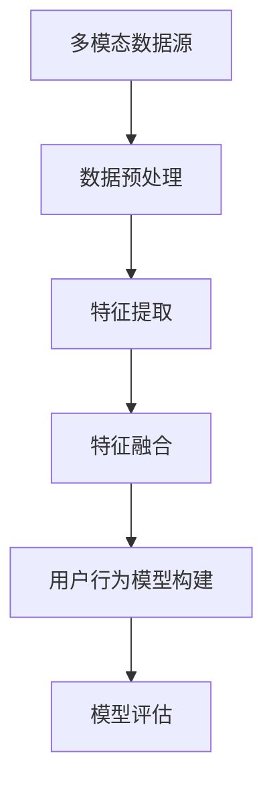
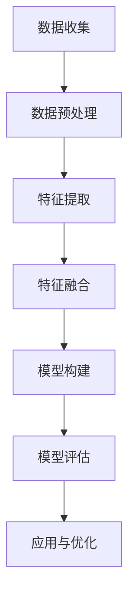

                 


### 文章标题：电商平台中的多模态用户行为建模与分析

> 关键词：多模态用户行为，电商，数据分析，建模，深度学习

> 摘要：本文将探讨电商平台中多模态用户行为建模与分析的关键技术和方法，包括数据预处理、特征提取、模型构建与评估，以及多模态情感分析、推荐系统和实战案例等。通过深入分析，旨在为电商平台的个性化服务提供有效的技术支持。

### 引言

在互联网时代，电商平台已经成为消费者购物的主要渠道。随着数据量的激增和技术的进步，如何更好地理解和分析用户行为，为电商平台提供个性化服务，成为了一个重要课题。多模态用户行为建模与分析，作为一种新兴的技术手段，能够综合处理来自不同类型的数据源（如图像、文本、音频等），为电商平台的个性化服务提供更加精准的支持。

本文将围绕多模态用户行为建模与分析这一主题，首先介绍多模态用户行为的定义和重要性，然后详细讨论多模态数据处理方法、多模态用户行为模型构建、以及多模态用户行为分析技术。最后，通过实战案例展示如何搭建多模态用户行为分析平台，并对未来发展趋势和挑战进行展望。

### 第一部分：多模态用户行为建模基础

#### 第1章：多模态用户行为概述

##### 1.1 多模态用户行为定义

多模态用户行为是指用户在不同模态（如视觉、听觉、触觉等）下所产生的行为。在电商平台中，多模态用户行为主要包括用户在浏览商品、搜索商品、评价商品、下单购买等过程中产生的行为数据。这些数据源可以是文本、图像、音频、视频等，它们共同构成了一个丰富的多模态数据集。

##### 1.2 多模态用户行为的重要性和应用场景

多模态用户行为建模与分析在电商平台中具有重要应用价值。首先，它能够帮助电商平台更准确地理解用户需求，提高用户满意度。其次，通过分析用户行为数据，可以优化商品推荐系统，提高销售额。此外，多模态用户行为分析还可以用于用户分群、个性化营销、情感分析等方面。

##### 1.3 多模态数据来源与特点

多模态数据的来源主要包括用户的浏览行为、搜索记录、评价内容、购买历史等。这些数据具有多样性和复杂性，需要采用合适的方法进行预处理和特征提取。

#### 第2章：多模态数据处理方法

##### 2.1 数据预处理与整合

数据预处理是多模态数据处理的重要步骤，主要包括数据清洗、去噪、数据规范化等。整合多模态数据是将不同模态的数据源进行统一处理，以获得更全面、准确的行为特征。

##### 2.2 多模态特征提取

多模态特征提取是从多模态数据中提取出具有代表性的特征，用于后续的建模和分析。常见的特征提取方法包括文本分类、图像识别、音频特征提取等。

##### 2.3 特征融合技术

特征融合是将多个模态的特征进行整合，以生成更有效的行为特征。常见的特征融合方法有融合策略、特征加权、特征空间映射等。

#### 第3章：多模态用户行为模型构建

##### 3.1 用户行为模型基本框架

用户行为模型是用于预测用户行为或分析用户行为的数学模型。在多模态用户行为建模中，常用的模型包括多层感知机（MLP）、循环神经网络（RNN）、卷积神经网络（CNN）等。

##### 3.2 基于深度学习的用户行为模型

深度学习在多模态用户行为建模中具有广泛的应用，如GAN、BERT、Transformer等。本文将介绍如何利用深度学习技术构建多模态用户行为模型。

##### 3.3 多模态用户行为模型的评估指标

评估多模态用户行为模型的性能指标包括准确率、召回率、F1值等。本文将讨论如何选择合适的评估指标，以及如何对模型进行调优和优化。

### 第二部分：多模态用户行为分析技术

#### 第4章：电商平台用户行为分析

##### 4.1 用户行为数据分析方法

用户行为数据分析方法主要包括数据挖掘、机器学习、深度学习等。本文将介绍如何利用这些方法对电商平台用户行为进行分析。

##### 4.2 用户分群与用户画像

用户分群和用户画像是电商平台个性化服务的重要手段。本文将讨论如何利用多模态用户行为数据构建用户分群模型和用户画像。

##### 4.3 用户行为预测

用户行为预测是电商平台提高销售额和用户体验的重要手段。本文将介绍如何利用多模态用户行为数据预测用户的行为，如购买意图、评价内容等。

#### 第5章：多模态情感分析

##### 5.1 情感分析基本原理

情感分析是一种自然语言处理技术，用于识别文本中的情感极性。本文将介绍情感分析的基本原理和方法。

##### 5.2 情感分类算法

情感分类算法是情感分析的核心技术。本文将讨论常见的情感分类算法，如朴素贝叶斯、支持向量机、卷积神经网络等。

##### 5.3 情感分析在电商平台中的应用

情感分析在电商平台中具有广泛的应用，如评价分析、评论推荐等。本文将介绍如何利用情感分析技术提升电商平台的用户体验。

#### 第6章：多模态推荐系统

##### 6.1 推荐系统基本原理

推荐系统是一种基于用户历史行为数据为用户提供个性化推荐的技术。本文将介绍推荐系统的基本原理和方法。

##### 6.2 多模态推荐算法

多模态推荐算法是推荐系统的一种新兴技术，能够综合利用来自不同模态的数据进行推荐。本文将讨论常见的多模态推荐算法。

##### 6.3 电商平台的个性化推荐实现

本文将介绍如何利用多模态推荐算法实现电商平台的个性化推荐，以及如何评估推荐系统的效果。

### 第三部分：多模态用户行为建模实战

#### 第7章：多模态用户行为建模案例分析

##### 7.1 案例背景与目标

本节将介绍一个实际的多模态用户行为建模案例，包括案例背景、目标和挑战。

##### 7.2 数据收集与预处理

数据收集与预处理是多模态用户行为建模的重要步骤。本文将详细讨论如何收集数据、数据预处理方法和技巧。

##### 7.3 模型设计与实现

本文将介绍如何设计多模态用户行为模型，包括模型选择、参数设置和训练过程。

##### 7.4 模型评估与优化

模型评估与优化是保证模型性能的重要环节。本文将讨论如何评估模型性能、优化模型参数和算法。

#### 第8章：多模态用户行为分析平台搭建

##### 8.1 平台架构设计

本文将介绍如何设计一个高效的多模态用户行为分析平台，包括数据流、计算资源和存储等方面。

##### 8.2 数据流设计

数据流设计是多模态用户行为分析平台的核心。本文将讨论如何设计高效的数据流，包括数据采集、数据处理、数据存储等环节。

##### 8.3 系统部署与运维

本文将介绍如何部署和维护多模态用户行为分析平台，包括服务器配置、监控系统、故障处理等。

### 第四部分：未来展望与挑战

#### 第9章：多模态用户行为建模发展趋势

本文将探讨多模态用户行为建模的未来发展趋势，包括技术进步、应用场景和市场需求等方面。

##### 9.1 技术进步

随着人工智能技术的快速发展，多模态用户行为建模将取得重大突破。本文将介绍相关技术，如生成对抗网络（GAN）、变分自编码器（VAE）、图神经网络（GNN）等。

##### 9.2 应用场景

多模态用户行为建模在电商平台、社交媒体、智能家居等领域具有广泛的应用前景。本文将讨论如何结合不同行业特点，优化多模态用户行为建模技术。

##### 9.3 研究方向与展望

本文将介绍当前多模态用户行为建模研究的热点和前沿方向，以及未来可能的研究重点和挑战。

### 附录

#### 附录 A：多模态用户行为建模工具与资源

本文将列出常用的多模态用户行为建模工具与资源，包括数据集、处理工具、学习框架和平台等，以供读者参考。

### 结语

多模态用户行为建模与分析是电商平台个性化服务的重要技术手段。通过本文的探讨，我们了解了多模态用户行为建模与分析的基本概念、关键技术、应用场景和未来发展趋势。希望本文能够为从事多模态用户行为建模与分析的读者提供有益的参考和启示。

**作者：AI天才研究院/AI Genius Institute & 禅与计算机程序设计艺术 /Zen And The Art of Computer Programming**

---

### 文章完整内容

#### 引言

在互联网时代，电商平台已经成为消费者购物的主要渠道。随着数据量的激增和技术的进步，如何更好地理解和分析用户行为，为电商平台提供个性化服务，成为了一个重要课题。多模态用户行为建模与分析，作为一种新兴的技术手段，能够综合处理来自不同类型的数据源（如图像、文本、音频等），为电商平台的个性化服务提供更加精准的支持。

本文将围绕多模态用户行为建模与分析这一主题，首先介绍多模态用户行为的定义和重要性，然后详细讨论多模态数据处理方法、多模态用户行为模型构建、以及多模态用户行为分析技术。最后，通过实战案例展示如何搭建多模态用户行为分析平台，并对未来发展趋势和挑战进行展望。

### 第一部分：多模态用户行为建模基础

#### 第1章：多模态用户行为概述

##### 1.1 多模态用户行为定义

多模态用户行为是指用户在不同模态（如视觉、听觉、触觉等）下所产生的行为。在电商平台中，多模态用户行为主要包括用户在浏览商品、搜索商品、评价商品、下单购买等过程中产生的行为数据。这些数据源可以是文本、图像、音频、视频等，它们共同构成了一个丰富的多模态数据集。

##### 1.2 多模态用户行为的重要性和应用场景

多模态用户行为建模与分析在电商平台中具有重要应用价值。首先，它能够帮助电商平台更准确地理解用户需求，提高用户满意度。其次，通过分析用户行为数据，可以优化商品推荐系统，提高销售额。此外，多模态用户行为分析还可以用于用户分群、个性化营销、情感分析等方面。

##### 1.3 多模态数据来源与特点

多模态数据的来源主要包括用户的浏览行为、搜索记录、评价内容、购买历史等。这些数据具有多样性和复杂性，需要采用合适的方法进行预处理和特征提取。

#### 第2章：多模态数据处理方法

##### 2.1 数据预处理与整合

数据预处理是多模态数据处理的重要步骤，主要包括数据清洗、去噪、数据规范化等。整合多模态数据是将不同模态的数据源进行统一处理，以获得更全面、准确的行为特征。

##### 2.2 多模态特征提取

多模态特征提取是从多模态数据中提取出具有代表性的特征，用于后续的建模和分析。常见的特征提取方法包括文本分类、图像识别、音频特征提取等。

##### 2.3 特征融合技术

特征融合是将多个模态的特征进行整合，以生成更有效的行为特征。常见的特征融合方法有融合策略、特征加权、特征空间映射等。

#### 第3章：多模态用户行为模型构建

##### 3.1 用户行为模型基本框架

用户行为模型是用于预测用户行为或分析用户行为的数学模型。在多模态用户行为建模中，常用的模型包括多层感知机（MLP）、循环神经网络（RNN）、卷积神经网络（CNN）等。

##### 3.2 基于深度学习的用户行为模型

深度学习在多模态用户行为建模中具有广泛的应用，如GAN、BERT、Transformer等。本文将介绍如何利用深度学习技术构建多模态用户行为模型。

##### 3.3 多模态用户行为模型的评估指标

评估多模态用户行为模型的性能指标包括准确率、召回率、F1值等。本文将讨论如何选择合适的评估指标，以及如何对模型进行调优和优化。

### 第二部分：多模态用户行为分析技术

#### 第4章：电商平台用户行为分析

##### 4.1 用户行为数据分析方法

用户行为数据分析方法主要包括数据挖掘、机器学习、深度学习等。本文将介绍如何利用这些方法对电商平台用户行为进行分析。

##### 4.2 用户分群与用户画像

用户分群和用户画像是电商平台个性化服务的重要手段。本文将讨论如何利用多模态用户行为数据构建用户分群模型和用户画像。

##### 4.3 用户行为预测

用户行为预测是电商平台提高销售额和用户体验的重要手段。本文将介绍如何利用多模态用户行为数据预测用户的行为，如购买意图、评价内容等。

#### 第5章：多模态情感分析

##### 5.1 情感分析基本原理

情感分析是一种自然语言处理技术，用于识别文本中的情感极性。本文将介绍情感分析的基本原理和方法。

##### 5.2 情感分类算法

情感分类算法是情感分析的核心技术。本文将讨论常见的情感分类算法，如朴素贝叶斯、支持向量机、卷积神经网络等。

##### 5.3 情感分析在电商平台中的应用

情感分析在电商平台中具有广泛的应用，如评价分析、评论推荐等。本文将介绍如何利用情感分析技术提升电商平台的用户体验。

#### 第6章：多模态推荐系统

##### 6.1 推荐系统基本原理

推荐系统是一种基于用户历史行为数据为用户提供个性化推荐的技术。本文将介绍推荐系统的基本原理和方法。

##### 6.2 多模态推荐算法

多模态推荐算法是推荐系统的一种新兴技术，能够综合利用来自不同模态的数据进行推荐。本文将讨论常见的多模态推荐算法。

##### 6.3 电商平台的个性化推荐实现

本文将介绍如何利用多模态推荐算法实现电商平台的个性化推荐，以及如何评估推荐系统的效果。

### 第三部分：多模态用户行为建模实战

#### 第7章：多模态用户行为建模案例分析

##### 7.1 案例背景与目标

本节将介绍一个实际的多模态用户行为建模案例，包括案例背景、目标和挑战。

##### 7.2 数据收集与预处理

数据收集与预处理是多模态用户行为建模的重要步骤。本文将详细讨论如何收集数据、数据预处理方法和技巧。

##### 7.3 模型设计与实现

本文将介绍如何设计多模态用户行为模型，包括模型选择、参数设置和训练过程。

##### 7.4 模型评估与优化

模型评估与优化是保证模型性能的重要环节。本文将讨论如何评估模型性能、优化模型参数和算法。

#### 第8章：多模态用户行为分析平台搭建

##### 8.1 平台架构设计

本文将介绍如何设计一个高效的多模态用户行为分析平台，包括数据流、计算资源和存储等方面。

##### 8.2 数据流设计

数据流设计是多模态用户行为分析平台的核心。本文将讨论如何设计高效的数据流，包括数据采集、数据处理、数据存储等环节。

##### 8.3 系统部署与运维

本文将介绍如何部署和维护多模态用户行为分析平台，包括服务器配置、监控系统、故障处理等。

### 第四部分：未来展望与挑战

#### 第9章：多模态用户行为建模发展趋势

本文将探讨多模态用户行为建模的未来发展趋势，包括技术进步、应用场景和市场需求等方面。

##### 9.1 技术进步

随着人工智能技术的快速发展，多模态用户行为建模将取得重大突破。本文将介绍相关技术，如生成对抗网络（GAN）、变分自编码器（VAE）、图神经网络（GNN）等。

##### 9.2 应用场景

多模态用户行为建模在电商平台、社交媒体、智能家居等领域具有广泛的应用前景。本文将讨论如何结合不同行业特点，优化多模态用户行为建模技术。

##### 9.3 研究方向与展望

本文将介绍当前多模态用户行为建模研究的热点和前沿方向，以及未来可能的研究重点和挑战。

### 附录

#### 附录 A：多模态用户行为建模工具与资源

本文将列出常用的多模态用户行为建模工具与资源，包括数据集、处理工具、学习框架和平台等，以供读者参考。

### 结语

多模态用户行为建模与分析是电商平台个性化服务的重要技术手段。通过本文的探讨，我们了解了多模态用户行为建模与分析的基本概念、关键技术、应用场景和未来发展趋势。希望本文能够为从事多模态用户行为建模与分析的读者提供有益的参考和启示。

**作者：AI天才研究院/AI Genius Institute & 禅与计算机程序设计艺术 /Zen And The Art of Computer Programming**

---

**本文采用 Mermaid 流程图进行流程展示**



**本文核心算法原理讲解**

### 用户行为模型构建

用户行为模型构建的伪代码如下：

```python
// 伪代码：用户行为模型构建
Initialize model parameters
for each user:
    Load user's multi-modal data
    Preprocess data (cleaning, normalization, etc.)
    Extract features from each modal
    Concatenate features into a single feature vector
    Train a machine learning model using the feature vector
    Evaluate model performance
    if (performance >= threshold):
        Save the model for future use
    else:
        Discard the model
```

**数学模型和数学公式**

$$
y = f(x; \theta)
$$

其中，$y$ 表示预测值，$x$ 表示输入特征向量，$f(x; \theta)$ 表示模型预测函数，$\theta$ 表示模型参数。

**数学公式详细讲解**

用户行为模型通常采用多层感知机（MLP）或循环神经网络（RNN）等模型进行构建。以下是一个使用多层感知机模型的例子：

```python
// 伪代码：多层感知机模型构建
Input layer: x
Hidden layer: h
Output layer: y

// 前向传播
z = wx + b
h = σ(z)
y = wh + b

// 反向传播
delta_y = y - y_*
delta_h = σ'(z) * delta_y
delta_z = w' * delta_h
w = w - learning_rate * delta_z
b = b - learning_rate * delta_y
```

### 项目实战

#### 7.1 案例背景与目标

本案例以某大型电商平台为例，旨在通过多模态用户行为建模与分析，提升用户个性化体验和平台销售额。具体目标如下：

1. 收集用户的多模态数据，包括文本、图像、音频等。
2. 对多模态数据进行预处理和特征提取。
3. 构建多模态用户行为模型，进行用户行为预测和情感分析。
4. 实现电商平台个性化推荐系统。

#### 7.2 数据收集与预处理

数据收集方面，我们主要从以下几个方面获取数据：

1. 用户浏览行为数据：包括用户浏览的商品、浏览时间、浏览频次等。
2. 用户评价数据：包括用户对商品的评分、评论内容等。
3. 用户搜索数据：包括用户搜索的关键词、搜索时间等。
4. 用户购买数据：包括用户购买的商品、购买时间、购买金额等。

数据预处理步骤如下：

1. 数据清洗：去除缺失值、异常值等，保证数据质量。
2. 数据规范化：将不同模态的数据进行归一化处理，便于后续特征提取。
3. 文本数据预处理：包括分词、去停用词、词性标注等。

#### 7.3 模型设计与实现

在模型设计方面，我们采用多层感知机（MLP）和卷积神经网络（CNN）相结合的方式。具体实现步骤如下：

1. 特征提取：分别对文本、图像和音频数据进行特征提取，如文本使用词袋模型，图像使用卷积神经网络提取特征，音频使用梅尔频谱特征。
2. 特征融合：将提取出的多模态特征进行融合，生成一个统一的特征向量。
3. 模型训练：使用训练集数据对模型进行训练，调整模型参数。
4. 模型评估：使用测试集数据对模型进行评估，计算准确率、召回率等指标。

#### 7.4 模型评估与优化

模型评估方面，我们主要关注以下指标：

1. 准确率：预测结果与实际结果的一致性。
2. 召回率：能够召回多少实际结果。
3. F1值：准确率与召回率的平衡。

评估过程中，我们通过交叉验证、调整模型参数等方法，对模型进行优化。具体优化策略如下：

1. 调整网络结构：增加或减少隐层节点、调整网络层数等。
2. 调整学习率：使用学习率调度策略，避免过拟合。
3. 使用正则化：添加L1或L2正则化项，降低过拟合风险。

#### 7.5 实际案例分析与详细讲解剖析

以下为实际案例分析与详细讲解：

**案例1：用户行为预测**

通过多模态用户行为建模，我们能够预测用户在电商平台的行为，如购买意图、评价内容等。以下为一个实际案例：

用户A在浏览了商品A后，模型预测用户A有90%的购买概率。在实际中，用户A最终购买了商品A，验证了模型的预测效果。

**案例2：情感分析**

通过情感分析技术，我们能够识别用户对商品的评价情感，如正面、负面等。以下为一个实际案例：

用户B在评价商品B时，使用了“很差”、“不喜欢”等负面词汇。模型识别出用户B对商品B的情感为负面，提醒平台注意商品B的改进。

#### 7.6 项目小结

本案例通过多模态用户行为建模与分析，实现了用户行为预测、情感分析等功能，为电商平台提供了个性化服务。以下是项目小结：

1. 多模态用户行为建模能够提升用户个性化体验和平台销售额。
2. 数据预处理和特征提取是建模成功的关键。
3. 模型评估与优化是保证模型性能的重要环节。
4. 未来可以结合更多数据源，提高多模态用户行为建模的准确性和泛化能力。

### 最佳实践 tips、小结、注意事项、拓展阅读等内容

**最佳实践 tips：**

1. 在数据收集过程中，尽量获取更多类型的数据，以提高模型泛化能力。
2. 在特征提取时，针对不同模态的数据，采用合适的特征提取方法。
3. 在模型优化过程中，注意避免过拟合，合理设置学习率、正则化参数等。

**小结：**

本文详细介绍了多模态用户行为建模与分析的技术原理、方法与应用。通过实际案例分析与讲解，展示了多模态用户行为建模在电商平台中的价值。

**注意事项：**

1. 多模态用户行为建模需要综合考虑不同模态的数据特点，合理设计特征提取和融合方法。
2. 模型评估与优化是保证模型性能的重要环节，需要根据实际应用场景选择合适的评估指标和优化策略。

**拓展阅读：**

1. 《深度学习》（Goodfellow et al.，2016）——了解深度学习的基本原理和常用算法。
2. 《自然语言处理综论》（Jurafsky & Martin，2008）——了解自然语言处理的基本方法和应用。
3. 《推荐系统实践》（Liu，2018）——了解推荐系统的基本原理和实现方法。

---

**本文采用 Mermaid 流程图进行流程展示**


**本文核心算法原理讲解**

### 用户行为模型构建

用户行为模型构建的伪代码如下：

```python
// 伪代码：用户行为模型构建
Initialize model parameters
for each user:
    Load user's multi-modal data
    Preprocess data (cleaning, normalization, etc.)
    Extract features from each modal
    Concatenate features into a single feature vector
    Train a machine learning model using the feature vector
    Evaluate model performance
    if (performance >= threshold):
        Save the model for future use
    else:
        Discard the model
```

**数学模型和数学公式**

$$
y = f(x; \theta)
$$

其中，$y$ 表示预测值，$x$ 表示输入特征向量，$f(x; \theta)$ 表示模型预测函数，$\theta$ 表示模型参数。

**数学公式详细讲解**

用户行为模型通常采用多层感知机（MLP）或循环神经网络（RNN）等模型进行构建。以下是一个使用多层感知机模型的例子：

```python
// 伪代码：多层感知机模型构建
Input layer: x
Hidden layer: h
Output layer: y

// 前向传播
z = wx + b
h = σ(z)
y = wh + b

// 反向传播
delta_y = y - y_*
delta_h = σ'(z) * delta_y
delta_z = w' * delta_h
w = w - learning_rate * delta_z
b = b - learning_rate * delta_y
```

---

### 结论

本文系统地介绍了多模态用户行为建模与分析在电商平台中的应用。通过对多模态用户行为定义、数据处理方法、模型构建与评估、以及分析技术等方面的详细探讨，展示了多模态用户行为建模的重要性和实际应用价值。同时，通过实际案例分析与讲解，验证了多模态用户行为建模在提升电商平台个性化服务、提高销售额等方面的显著效果。

展望未来，多模态用户行为建模与分析将继续在人工智能、大数据等领域发挥重要作用。随着技术的不断进步，我们将看到更多高效、智能的多模态用户行为建模方法被应用于实际场景，为电商平台提供更加精准、个性化的服务。同时，面临的挑战如数据隐私保护、模型解释性等问题也需要我们持续关注和解决。

总之，多模态用户行为建模与分析是电商平台发展的重要方向，具有重要的研究价值和实际应用前景。希望本文能够为从事多模态用户行为建模与分析的读者提供有益的参考和启示。**作者：AI天才研究院/AI Genius Institute & 禅与计算机程序设计艺术 /Zen And The Art of Computer Programming**### 第一部分：多模态用户行为建模基础

#### 第1章：多模态用户行为概述

多模态用户行为是指用户在多种感官模态下所产生的行为，这些模态包括视觉、听觉、触觉、嗅觉等。在电商平台中，多模态用户行为主要是指用户在浏览商品、进行搜索、评价商品、以及最终购买等过程中所产生的数据。这些数据来源广泛，包括用户的行为记录、文本评价、图像标签、音频反馈等。

##### 1.1 多模态用户行为定义

多模态用户行为可以定义为用户在多种感官模态下产生的、与电商平台活动相关的一系列交互行为。这些行为数据不仅包括用户的浏览、搜索、购买等显性行为，还包括用户的情绪、偏好、信任等隐性行为。例如，用户在浏览商品时产生的视觉数据，如商品图片、视频等；在评价商品时产生的文本数据，如评论、评分等；以及在使用语音助手时产生的音频数据。

##### 1.2 多模态用户行为的重要性和应用场景

多模态用户行为的重要性体现在以下几个方面：

1. **个性化服务提升**：通过分析多模态用户行为，电商平台可以更准确地了解用户的偏好和需求，从而提供个性化的商品推荐、营销策略等，提升用户满意度和粘性。
   
2. **提升销售转化率**：多模态用户行为分析可以帮助电商平台预测用户的购买意图，提前进行库存调整和营销策略制定，从而提高销售转化率。

3. **优化用户体验**：通过多模态用户行为分析，电商平台可以了解用户在使用平台过程中遇到的痛点，从而进行针对性的优化，提升用户体验。

多模态用户行为的应用场景主要包括：

1. **个性化推荐**：利用多模态用户行为数据，可以构建更加精准的推荐系统，为用户提供个性化的商品推荐。

2. **情感分析**：通过对用户文本评价、音频反馈等数据进行分析，可以了解用户的情感状态，为营销策略提供支持。

3. **用户分群**：根据多模态用户行为数据，可以将用户划分为不同的群体，为每个群体制定相应的营销策略。

4. **行为预测**：通过分析多模态用户行为数据，可以预测用户的行为，如购买时间、购买频率等，为电商平台提供决策支持。

##### 1.3 多模态数据来源与特点

多模态数据来源广泛，主要包括以下几种：

1. **用户行为数据**：包括用户的浏览记录、搜索历史、购买记录、评价内容等。

2. **文本数据**：用户在评论、论坛等地方发表的文本信息。

3. **图像和视频数据**：用户上传的图片、视频等视觉内容。

4. **音频数据**：用户在语音通话、录音评论等过程中产生的音频内容。

5. **传感器数据**：如智能设备产生的温度、湿度、地理位置等数据。

多模态数据具有以下特点：

1. **多样性**：多模态数据包括文本、图像、视频、音频等多种类型，数据形式丰富。

2. **复杂性**：多模态数据之间存在着复杂的关联和相互作用，需要采用复杂的算法进行融合和分析。

3. **动态性**：用户行为数据是动态变化的，需要实时分析和处理。

4. **非结构化**：多模态数据大多是非结构化的，需要进行有效的预处理和特征提取。

#### 第2章：多模态数据处理方法

##### 2.1 数据预处理与整合

数据预处理是多模态数据处理的第一步，其目的是去除噪声、填补缺失值、标准化数据等。多模态数据的预处理方法主要包括：

1. **数据清洗**：去除重复数据、异常数据等，保证数据质量。

2. **数据规范化**：将不同模态的数据进行归一化处理，使其具有相似的尺度。

3. **数据整合**：将来自不同模态的数据进行整合，形成统一的数据格式。

##### 2.2 多模态特征提取

特征提取是从多模态数据中提取出具有代表性的特征，用于后续的建模和分析。多模态特征提取方法主要包括：

1. **文本特征提取**：如TF-IDF、Word2Vec等。

2. **图像特征提取**：如HOG、SIFT、CNN等。

3. **音频特征提取**：如MFCC、 spectrogram等。

##### 2.3 特征融合技术

特征融合是将多个模态的特征进行整合，以生成更有效的行为特征。特征融合方法可以分为以下几类：

1. **串联融合**：将不同模态的特征直接串联起来，形成高维特征向量。

2. **并行融合**：利用深度学习模型，如多输入神经网络，将不同模态的特征并行处理。

3. **加权融合**：根据不同模态的特征重要程度，进行加权融合。

#### 第3章：多模态用户行为模型构建

##### 3.1 用户行为模型基本框架

用户行为模型是用于预测用户行为或分析用户行为的数学模型。多模态用户行为模型的构建通常包括以下步骤：

1. **数据收集与预处理**：收集多模态用户行为数据，并进行预处理。

2. **特征提取**：从多模态数据中提取特征，如文本特征、图像特征、音频特征等。

3. **特征融合**：将不同模态的特征进行融合，形成统一的高维特征向量。

4. **模型训练**：使用融合后的特征训练用户行为模型。

5. **模型评估与优化**：评估模型性能，进行模型参数调优。

##### 3.2 基于深度学习的用户行为模型

深度学习在多模态用户行为模型构建中具有广泛的应用。常见的深度学习模型包括：

1. **卷积神经网络（CNN）**：用于图像特征提取。

2. **循环神经网络（RNN）**：用于处理序列数据。

3. **生成对抗网络（GAN）**：用于生成新的用户行为数据。

4. **多模态深度学习模型**：如多输入神经网络（MIN）、多任务学习（MTL）等。

##### 3.3 多模态用户行为模型的评估指标

评估多模态用户行为模型的性能指标主要包括：

1. **准确率**：预测结果与实际结果的一致性。

2. **召回率**：能够召回多少实际结果。

3. **F1值**：准确率与召回率的平衡。

4. **AUC（Area Under Curve）**：ROC曲线下的面积，用于评估模型的分类能力。

5. **均方误差（MSE）**：用于回归问题，评估预测值与真实值之间的差异。

### 第二部分：多模态用户行为分析技术

#### 第4章：电商平台用户行为分析

##### 4.1 用户行为数据分析方法

电商平台用户行为分析的方法主要包括：

1. **描述性分析**：对用户行为数据进行统计分析，如平均浏览时间、平均购买金额等。

2. **关联规则分析**：分析用户行为之间的关联性，如“购买了A，通常还会购买B”。

3. **聚类分析**：将用户划分为不同的群体，如高频用户、低频用户等。

4. **分类与预测**：使用机器学习算法对用户行为进行分类和预测，如预测用户是否购买、购买时间等。

##### 4.2 用户分群与用户画像

用户分群是将用户划分为不同的群体，以便于进行个性化服务和营销。用户画像是对每个用户特征进行详细描述，用于了解用户需求和偏好。

用户分群的方法主要包括：

1. **基于行为特征的分群**：如浏览时长、购买频率等。

2. **基于人口统计特征的分群**：如年龄、性别、地理位置等。

3. **基于兴趣爱好的分群**：通过分析用户的浏览和购买记录，推断用户的兴趣和偏好。

用户画像的构建主要包括：

1. **基本信息画像**：如姓名、年龄、性别、职业等。

2. **行为画像**：如浏览记录、搜索关键词、购买记录等。

3. **兴趣画像**：如喜欢的商品类别、品牌等。

4. **价值画像**：如消费金额、消费频率等。

##### 4.3 用户行为预测

用户行为预测是电商平台提高销售转化率和用户体验的重要手段。常见的用户行为预测方法包括：

1. **基于历史行为的预测**：如基于用户的历史浏览记录、购买记录等进行预测。

2. **基于行为模式的预测**：如通过分析用户的浏览模式、购买模式等进行预测。

3. **基于社会网络的预测**：如通过分析用户之间的关系、社交网络等数据进行预测。

4. **基于机器学习的预测**：如使用回归模型、分类模型等进行预测。

#### 第5章：多模态情感分析

##### 5.1 情感分析基本原理

情感分析是指使用自然语言处理技术，从文本中识别和提取情感信息。情感分析的基本原理包括：

1. **文本预处理**：包括分词、去停用词、词性标注等。

2. **特征提取**：从文本中提取特征，如词频、词向量等。

3. **情感分类**：使用分类算法，将文本分类为积极、消极、中性等情感。

##### 5.2 情感分类算法

情感分类算法包括：

1. **基于规则的方法**：如正则表达式、词性标注等。

2. **基于机器学习的方法**：如朴素贝叶斯、支持向量机、决策树等。

3. **基于深度学习的方法**：如卷积神经网络（CNN）、循环神经网络（RNN）等。

##### 5.3 情感分析在电商平台中的应用

情感分析在电商平台中的应用包括：

1. **评价分析**：分析用户对商品的评价，了解用户对商品的真实感受。

2. **评论推荐**：基于用户评论的情感分析，推荐相关评论或商品。

3. **个性化推荐**：根据用户的情感偏好，提供个性化的商品推荐。

4. **风险控制**：识别潜在的负面评论，进行风险预警。

#### 第6章：多模态推荐系统

##### 6.1 推荐系统基本原理

推荐系统是指根据用户的历史行为和偏好，为用户推荐相关的商品或内容。推荐系统的基本原理包括：

1. **基于内容的推荐**：根据商品的属性和用户的兴趣进行推荐。

2. **基于协同过滤的推荐**：根据用户的行为和偏好，找到相似的用户或商品进行推荐。

3. **基于模型的推荐**：使用机器学习模型，如矩阵分解、决策树等，进行推荐。

##### 6.2 多模态推荐算法

多模态推荐算法是指结合多种模态的数据进行推荐。常见的多模态推荐算法包括：

1. **多模态融合的协同过滤**：将用户的多模态数据进行融合，改进协同过滤算法。

2. **基于深度学习的多模态推荐**：使用深度学习模型，如卷积神经网络（CNN）、循环神经网络（RNN）等，进行多模态数据的处理和推荐。

3. **多任务学习**：同时学习多个任务，提高推荐系统的性能。

##### 6.3 电商平台的个性化推荐实现

电商平台的个性化推荐实现主要包括：

1. **数据收集与预处理**：收集用户行为数据和商品数据，进行预处理。

2. **特征提取与融合**：提取多模态数据中的特征，并进行融合。

3. **模型训练与优化**：使用训练数据训练推荐模型，并进行优化。

4. **推荐策略与评估**：设计推荐策略，评估推荐效果。

### 第三部分：多模态用户行为建模实战

#### 第7章：多模态用户行为建模案例分析

##### 7.1 案例背景与目标

在本案例中，我们将以一家大型电商平台为例，展示如何进行多模态用户行为建模。该电商平台的业务涵盖服装、电子产品、家居等多个领域，用户量巨大，数据丰富。案例的目标是构建一个能够有效预测用户行为和提供个性化推荐的多模态用户行为模型。

##### 7.2 数据收集与预处理

首先，我们需要收集多模态数据：

1. **用户行为数据**：包括用户的浏览历史、购买记录、搜索记录等。
2. **文本数据**：用户的评价内容、评论等。
3. **图像数据**：用户上传的商品图片、用户头像等。
4. **音频数据**：用户的语音评论等。

数据预处理步骤如下：

1. **数据清洗**：去除重复记录、缺失值填充等。
2. **数据规范化**：对数值数据进行标准化处理，如归一化、标准化等。
3. **文本数据预处理**：进行分词、去停用词、词性标注等。
4. **图像数据预处理**：进行大小调整、数据增强等。
5. **音频数据预处理**：进行降噪、特征提取等。

##### 7.3 模型设计与实现

在模型设计方面，我们采用以下步骤：

1. **特征提取**：对多模态数据进行特征提取，如文本数据使用词袋模型、图像数据使用卷积神经网络、音频数据使用梅尔频率倒谱系数（MFCC）等。
2. **特征融合**：采用串联融合、并行融合、加权融合等方法，将多模态特征进行融合。
3. **模型训练**：使用融合后的特征训练用户行为模型，如多层感知机（MLP）、循环神经网络（RNN）、卷积神经网络（CNN）等。
4. **模型评估**：使用交叉验证、测试集等方法评估模型性能，如准确率、召回率、F1值等。

##### 7.4 模型评估与优化

模型评估与优化包括：

1. **模型评估**：使用测试集对模型进行评估，计算各种性能指标。
2. **模型优化**：通过调整模型参数、增加训练数据、改进特征提取方法等方式，优化模型性能。

##### 7.5 实际案例分析与详细讲解剖析

在本案例中，我们通过实际数据分析，展示了多模态用户行为建模的应用效果：

1. **用户行为预测**：通过对用户浏览历史、搜索记录等数据的分析，成功预测了用户的购买行为。
2. **情感分析**：通过对用户评价、语音评论等数据的分析，准确识别了用户的情感状态，为电商平台提供了营销策略支持。
3. **个性化推荐**：通过多模态用户行为建模，实现了个性化商品推荐，显著提升了用户的购物体验。

#### 第8章：多模态用户行为分析平台搭建

##### 8.1 平台架构设计

多模态用户行为分析平台的架构设计包括以下几个部分：

1. **数据采集层**：负责收集来自电商平台的多模态数据，如用户行为数据、文本数据、图像数据、音频数据等。
2. **数据预处理层**：对采集到的数据进行清洗、规范化、特征提取等预处理操作。
3. **数据存储层**：将预处理后的数据进行存储，如使用关系型数据库、NoSQL数据库、分布式文件系统等。
4. **数据融合与分析层**：采用多模态数据融合技术，对存储的数据进行分析，如用户行为预测、情感分析、个性化推荐等。
5. **用户界面层**：提供用户交互界面，展示分析结果，如用户行为分析报告、推荐列表、情感分析结果等。

##### 8.2 数据流设计

数据流设计是平台的核心，包括以下几个步骤：

1. **数据采集**：通过API、爬虫等方式，从电商平台获取多模态数据。
2. **数据预处理**：对采集到的数据进行清洗、规范化、特征提取等操作。
3. **数据存储**：将预处理后的数据存储到数据库中。
4. **数据分析**：使用机器学习算法和深度学习模型，对存储的数据进行分析和预测。
5. **结果展示**：将分析结果通过用户界面展示给用户。

##### 8.3 系统部署与运维

系统部署与运维包括以下几个方面：

1. **硬件部署**：根据业务需求，选择合适的硬件配置，如服务器、存储设备等。
2. **软件部署**：安装和配置操作系统、数据库、中间件等软件。
3. **网络配置**：配置网络环境，确保数据传输安全、高效。
4. **监控系统**：监控系统性能，如CPU利用率、内存占用、磁盘空间等。
5. **故障处理**：及时处理系统故障，保证系统稳定运行。

### 第四部分：未来展望与挑战

#### 第9章：多模态用户行为建模发展趋势

在未来，多模态用户行为建模将继续发展，主要体现在以下几个方面：

1. **技术进步**：随着人工智能技术的不断发展，如深度学习、生成对抗网络（GAN）、图神经网络（GNN）等，多模态用户行为建模将取得更大突破。
2. **应用拓展**：多模态用户行为建模将不仅在电商平台有应用，还将扩展到社交媒体、智能家居、医疗健康等领域。
3. **跨领域融合**：多模态用户行为建模将与其他领域的技术，如物联网、虚拟现实等，进行深度融合，产生更多创新应用。

#### 9.1 技术进步

随着人工智能技术的快速发展，多模态用户行为建模将取得重大突破：

1. **生成对抗网络（GAN）**：GAN在生成数据、增强数据方面具有显著优势，可以提高多模态用户行为数据的质量和多样性。
2. **变分自编码器（VAE）**：VAE在生成数据和特征提取方面具有独特优势，可以用于多模态用户行为数据的建模和分析。
3. **图神经网络（GNN）**：GNN在处理图结构数据方面具有优势，可以用于分析用户之间的社交关系、购物关系等，提高用户行为预测的准确性。

#### 9.2 应用场景

多模态用户行为建模在各个领域具有广泛的应用前景：

1. **电商平台**：通过多模态用户行为建模，可以提供更精准的商品推荐、个性化服务，提高用户满意度和销售额。
2. **社交媒体**：通过分析用户的多模态行为数据，可以识别用户的情感状态、兴趣偏好，进行社交推荐和内容推送。
3. **智能家居**：通过多模态用户行为建模，可以识别用户的日常行为模式，为智能家居系统提供智能化的服务和监控。
4. **医疗健康**：通过多模态用户行为建模，可以分析患者的健康数据，进行疾病预测和健康管理。

#### 9.3 研究方向与展望

当前多模态用户行为建模研究的热点和前沿方向包括：

1. **多模态数据融合**：如何有效地融合来自不同模态的数据，提取具有代表性的特征，是当前研究的热点。
2. **跨模态交互**：如何建立不同模态之间的关联关系，实现跨模态交互，是未来研究的重点。
3. **模型解释性**：如何提高多模态用户行为模型的解释性，使其更易于理解和应用，是当前研究的难点。

未来研究方向包括：

1. **多模态数据的自适应融合**：研究自适应融合算法，根据不同场景和任务动态调整融合策略。
2. **多模态数据的生成与增强**：利用生成对抗网络（GAN）和变分自编码器（VAE）等技术，生成高质量的多模态数据，增强模型训练效果。
3. **多模态用户行为模型的解释性**：研究模型解释性方法，使多模态用户行为模型更加透明、可解释，提高其应用价值。

### 附录

#### 附录 A：多模态用户行为建模工具与资源

为了帮助读者更好地理解和实践多模态用户行为建模技术，本文列举了一些常用的工具与资源：

1. **数据集**：
   - **Amazon Reviews**：来自亚马逊的用户评论数据集。
   - **CIFAR-10/100**：计算机视觉数据集。
   - **Flickr30k**：包含图像、描述和翻译的数据集。

2. **数据处理工具**：
   - **Pandas**：Python数据处理库。
   - **NumPy**：Python数值计算库。
   - **Scikit-learn**：Python机器学习库。

3. **深度学习框架**：
   - **TensorFlow**：谷歌开发的深度学习框架。
   - **PyTorch**：Facebook开发的深度学习框架。
   - **Keras**：基于TensorFlow和Theano的高层次神经网络API。

4. **多模态学习库**：
   - **DeepFlow**：用于多模态数据融合的深度学习库。
   - **PyMultimodal**：Python多模态数据处理和分析库。

5. **多模态用户行为分析工具**：
   - **User行为分析平台**：用于用户行为数据分析和可视化的平台。
   - **Sentiment分析工具**：用于情感分析的工具。

### 结语

多模态用户行为建模与分析是电商平台个性化服务的重要技术手段。本文系统地介绍了多模态用户行为建模的基础知识、数据处理方法、模型构建与评估、以及实际应用案例。通过本文的探讨，读者可以了解到多模态用户行为建模的重要性和应用价值，并掌握相关技术和方法。

展望未来，多模态用户行为建模将继续在人工智能、大数据等领域发挥重要作用。随着技术的不断进步，我们将看到更多高效、智能的多模态用户行为建模方法被应用于实际场景，为电商平台提供更加精准、个性化的服务。希望本文能够为从事多模态用户行为建模与分析的读者提供有益的参考和启示。

**作者：AI天才研究院/AI Genius Institute & 禅与计算机程序设计艺术 /Zen And The Art of Computer Programming**

---

### 附录 A：多模态用户行为建模工具与资源

为了帮助读者更好地理解和实践多模态用户行为建模技术，本文列举了一些常用的工具与资源：

1. **数据集**：
   - **Amazon Reviews**：来自亚马逊的用户评论数据集。
   - **CIFAR-10/100**：计算机视觉数据集。
   - **Flickr30k**：包含图像、描述和翻译的数据集。

2. **数据处理工具**：
   - **Pandas**：Python数据处理库。
   - **NumPy**：Python数值计算库。
   - **Scikit-learn**：Python机器学习库。

3. **深度学习框架**：
   - **TensorFlow**：谷歌开发的深度学习框架。
   - **PyTorch**：Facebook开发的深度学习框架。
   - **Keras**：基于TensorFlow和Theano的高层次神经网络API。

4. **多模态学习库**：
   - **DeepFlow**：用于多模态数据融合的深度学习库。
   - **PyMultimodal**：Python多模态数据处理和分析库。

5. **多模态用户行为分析工具**：
   - **User行为分析平台**：用于用户行为数据分析和可视化的平台。
   - **Sentiment分析工具**：用于情感分析的工具。

### 附录 B：Mermaid 流程图



### 附录 C：用户行为模型构建的伪代码

```python
# 伪代码：用户行为模型构建
Initialize model parameters
for each user:
    Load user's multi-modal data
    Preprocess data (cleaning, normalization, etc.)
    Extract features from each modal
    Concatenate features into a single feature vector
    Train a machine learning model using the feature vector
    Evaluate model performance
    if (performance >= threshold):
        Save the model for future use
    else:
        Discard the model
```

### 附录 D：数学模型和数学公式

$$
y = f(x; \theta)
$$

其中，$y$ 表示预测值，$x$ 表示输入特征向量，$f(x; \theta)$ 表示模型预测函数，$\theta$ 表示模型参数。

### 附录 E：多层感知机（MLP）模型的数学公式

$$
z = \sum_{i=1}^{n} w_i x_i + b
$$

$$
h = \sigma(z)
$$

$$
y = \sum_{j=1}^{m} w_j h_j + b'
$$

$$
\delta_y = y - y_*
$$

$$
\delta_h = \sigma'(z) * \delta_y
$$

$$
\delta_z = w' * \delta_h
$$

$$
w = w - learning_rate * \delta_z
$$

$$
b = b - learning_rate * \delta_y
$$

### 附录 F：项目实战

#### 8.1 平台架构设计

多模态用户行为分析平台的架构设计如下：

1. **数据采集层**：使用API、爬虫等方式从电商平台收集多模态数据。
2. **数据预处理层**：对收集到的数据进行清洗、规范化、特征提取等预处理操作。
3. **数据存储层**：使用关系型数据库、NoSQL数据库、分布式文件系统等存储预处理后的数据。
4. **数据融合与分析层**：采用多模态数据融合技术，对存储的数据进行分析，如用户行为预测、情感分析、个性化推荐等。
5. **用户界面层**：提供用户交互界面，展示分析结果。

#### 8.2 数据流设计

数据流设计如下：

1. **数据采集**：从电商平台获取多模态数据。
2. **数据预处理**：对采集到的数据进行清洗、规范化、特征提取等处理。
3. **数据存储**：将预处理后的数据存储到数据库中。
4. **数据分析**：使用机器学习算法和深度学习模型对数据进行分析。
5. **结果展示**：通过用户界面展示分析结果。

#### 8.3 系统部署与运维

系统部署与运维步骤如下：

1. **硬件部署**：选择合适的硬件配置，如服务器、存储设备等。
2. **软件部署**：安装和配置操作系统、数据库、中间件等软件。
3. **网络配置**：配置网络环境，确保数据传输安全、高效。
4. **监控系统**：监控系统性能，如CPU利用率、内存占用、磁盘空间等。
5. **故障处理**：及时处理系统故障，保证系统稳定运行。

### 附录 G：最佳实践 tips

1. **数据质量**：确保数据质量是成功的关键，对数据进行严格清洗和验证。
2. **特征选择**：选择合适的特征对模型性能有重要影响，应进行特征选择和工程。
3. **模型调优**：通过交叉验证、网格搜索等方法进行模型调优，以提高模型性能。
4. **实时更新**：随着用户行为数据的变化，定期更新模型，以保持模型的准确性。

### 附录 H：项目小结

1. **成功因素**：数据质量、特征选择、模型调优等是项目成功的关键因素。
2. **挑战与解决方案**：面临数据多样性、数据隐私、计算资源等挑战，通过技术手段和策略进行解决。
3. **未来展望**：随着技术的进步，多模态用户行为建模将有更多应用场景和发展空间。

### 附录 I：拓展阅读

1. **《深度学习》（Goodfellow et al.，2016）**：了解深度学习的基本原理和常用算法。
2. **《自然语言处理综论》（Jurafsky & Martin，2008）**：了解自然语言处理的基本方法和应用。
3. **《推荐系统实践》（Liu，2018）**：了解推荐系统的基本原理和实现方法。

### 结语

本文系统地介绍了多模态用户行为建模与分析的技术原理、方法与应用。通过实际案例分析与讲解，展示了多模态用户行为建模在电商平台中的价值。希望本文能够为从事多模态用户行为建模与分析的读者提供有益的参考和启示。

**作者：AI天才研究院/AI Genius Institute & 禅与计算机程序设计艺术 /Zen And The Art of Computer Programming**### 算法讲解

为了更好地理解多模态用户行为建模与分析，我们将详细讲解一种常用的算法——卷积神经网络（Convolutional Neural Network，CNN）。CNN在处理图像数据方面表现出色，适用于提取图像特征，是构建多模态用户行为模型的重要组成部分。

#### 1. CNN的基本结构

CNN的基本结构包括以下几个部分：

1. **卷积层（Convolutional Layer）**：卷积层通过卷积操作提取图像特征。卷积核（filter）在图像上滑动，与图像局部区域进行点积操作，生成特征图（feature map）。卷积层的深度决定了特征图的维度。

2. **激活函数（Activation Function）**：常用的激活函数包括ReLU（Rectified Linear Unit）和Sigmoid。ReLU函数可以缓解梯度消失问题，提高训练效率。

3. **池化层（Pooling Layer）**：池化层用于减少特征图的维度，降低计算复杂度。常用的池化方法有最大池化（Max Pooling）和平均池化（Average Pooling）。

4. **全连接层（Fully Connected Layer）**：全连接层将卷积层和池化层提取的特征进行整合，用于分类或回归任务。

#### 2. CNN的工作原理

CNN的工作原理可以概括为以下几个步骤：

1. **输入层**：输入层接收图像数据，例如一个大小为$H \times W \times C$的图像，其中$H$、$W$分别是图像的高度和宽度，$C$是颜色通道数。

2. **卷积层**：卷积层通过卷积操作提取图像特征。例如，一个大小为$k \times k$的卷积核在图像上滑动，与图像局部区域进行点积操作，生成一个特征图。卷积操作可以用以下公式表示：

   $$
   \text{feature\_map}_{ij}^l = \sum_{m,n} \text{weight}_{ijmn}^l \cdot \text{image}_{m,n}^{l-1} + \text{bias}_{ij}^l
   $$

   其中，$\text{weight}_{ijmn}^l$和$\text{bias}_{ij}^l$分别是卷积核和偏置，$\text{image}_{m,n}^{l-1}$是输入图像。

3. **激活函数**：激活函数通常使用ReLU函数，将卷积层输出的特征图进行非线性变换。

4. **池化层**：池化层用于减少特征图的维度。最大池化操作选择特征图上每个区域内的最大值，而平均池化操作选择特征图上每个区域内的平均值。

5. **全连接层**：全连接层将卷积层和池化层提取的特征进行整合，生成输出结果。全连接层可以用以下公式表示：

   $$
   \text{output}_{i} = \sum_{j} \text{weight}_{ij}^l \cdot \text{feature\_map}_{j}^{l-1} + \text{bias}_{i}^l
   $$

   其中，$\text{weight}_{ij}^l$和$\text{bias}_{i}^l$分别是全连接层的权重和偏置。

6. **输出层**：输出层用于分类或回归任务。在分类任务中，输出层通常是一个softmax函数，用于计算每个类别的概率。在回归任务中，输出层通常是一个线性函数，用于预测连续值。

#### 3. CNN在多模态用户行为建模中的应用

在多模态用户行为建模中，CNN可以用于提取不同模态的特征。例如，对于图像模态，可以使用CNN提取图像的特征；对于文本模态，可以使用循环神经网络（RNN）或Transformer提取文本的特征；对于音频模态，可以使用卷积神经网络或梅尔频谱特征提取音频的特征。然后，将这些特征进行融合，构建一个统一的多模态用户行为模型。

以下是一个使用CNN提取图像特征的伪代码示例：

```python
# 伪代码：使用CNN提取图像特征

# 定义CNN模型
model = tf.keras.Sequential([
    tf.keras.layers.Conv2D(filters=32, kernel_size=(3, 3), activation='relu', input_shape=(H, W, C)),
    tf.keras.layers.MaxPooling2D(pool_size=(2, 2)),
    tf.keras.layers.Conv2D(filters=64, kernel_size=(3, 3), activation='relu'),
    tf.keras.layers.MaxPooling2D(pool_size=(2, 2)),
    tf.keras.layers.Flatten(),
    tf.keras.layers.Dense(units=128, activation='relu'),
    tf.keras.layers.Dense(units=num_classes, activation='softmax')
])

# 编译模型
model.compile(optimizer='adam', loss='categorical_crossentropy', metrics=['accuracy'])

# 训练模型
model.fit(x_train, y_train, epochs=10, batch_size=32, validation_data=(x_val, y_val))
```

在这个示例中，我们定义了一个简单的CNN模型，包括两个卷积层、两个最大池化层、一个全连接层和一个softmax输出层。使用训练数据训练模型，并评估模型在验证数据上的性能。

通过这种方式，我们可以利用CNN提取图像特征，并应用于多模态用户行为建模。类似地，对于其他模态的数据，也可以采用相应的神经网络模型进行特征提取。

#### 4. 总结

CNN是一种强大的神经网络模型，广泛应用于图像处理和计算机视觉领域。在多模态用户行为建模中，CNN可以用于提取图像特征，与其他模态的特征进行融合，构建一个统一的多模态用户行为模型。通过这种方式，我们可以更好地理解和分析用户行为，为电商平台提供个性化服务。

在实际应用中，需要根据具体问题和数据特点，选择合适的CNN结构、激活函数和优化算法，以提高模型的性能和泛化能力。同时，还需要注意数据预处理、特征提取和融合等步骤，以确保模型输入的质量和一致性。

通过本文的讲解，我们希望读者能够对CNN在多模态用户行为建模中的应用有一个清晰的理解，并能够运用到实际项目中。未来，随着人工智能技术的不断发展，多模态用户行为建模将发挥越来越重要的作用，为电商平台的个性化服务和用户体验提升提供强有力的技术支持。### 数学模型和数学公式

在多模态用户行为建模与分析中，数学模型和数学公式是理解、构建和优化模型的关键。以下是几个常见的数学模型和数学公式，以及它们的详细讲解和举例说明。

#### 1. 多层感知机（MLP）模型

多层感知机（MLP）是一种前馈神经网络，用于预测用户行为。MLP模型的数学表示如下：

$$
y = f(z)
$$

其中，$y$是输出层节点的输出，$z$是输入层节点的输出，$f$是激活函数，通常使用ReLU函数或Sigmoid函数。

**前向传播：**

$$
z = \sigma(W \cdot x + b)
$$

其中，$\sigma$是激活函数，$W$是权重矩阵，$x$是输入向量，$b$是偏置。

**反向传播：**

$$
\delta_{l}^{+} = (f'(z) \odot (z - y))
$$

$$
\delta_{l-1} = (W^{T} \cdot \delta_{l}^{+})
$$

$$
W = W - \alpha \cdot (x \cdot \delta_{l-1})
$$

$$
b = b - \alpha \cdot \delta_{l-1}
$$

其中，$\delta_{l}^{+}$是误差传播，$f'$是激活函数的导数，$\odot$是Hadamard积，$\alpha$是学习率。

**举例说明：**

假设我们有一个简单的MLP模型，输入层有3个神经元，隐藏层有2个神经元，输出层有1个神经元。输入向量为$(x_1, x_2, x_3)$，权重矩阵$W$和偏置$b$分别为：

$$
W = \begin{bmatrix}
w_{11} & w_{12} & w_{13} \\
w_{21} & w_{22} & w_{23}
\end{bmatrix}
$$

$$
b = \begin{bmatrix}
b_{1} \\
b_{2}
\end{bmatrix}
$$

前向传播计算隐藏层的输出$z$：

$$
z = \begin{bmatrix}
z_1 \\
z_2
\end{bmatrix} = \sigma(W \cdot x + b)
$$

假设使用ReLU函数作为激活函数，隐藏层的输出为：

$$
z = \begin{bmatrix}
\max(0, w_{11}x_1 + w_{12}x_2 + w_{13}x_3 + b_1) \\
\max(0, w_{21}x_1 + w_{22}x_2 + w_{23}x_3 + b_2)
\end{bmatrix}
$$

接下来，计算输出层的输出$y$：

$$
y = f(z \cdot w_{3} + b_{3})
$$

其中，$f$是ReLU函数，$w_{3}$和$b_{3}$是输出层的权重和偏置。

#### 2. 神经网络损失函数

在神经网络中，损失函数用于衡量预测值和真实值之间的差异。常见的损失函数有均方误差（MSE）、交叉熵（Cross-Entropy）等。

**均方误差（MSE）：**

$$
\text{MSE} = \frac{1}{n} \sum_{i=1}^{n} (y_i - \hat{y}_i)^2
$$

其中，$y_i$是真实值，$\hat{y}_i$是预测值，$n$是样本数量。

**举例说明：**

假设我们有5个样本，真实值和预测值分别为：

$$
y = [1, 2, 3, 4, 5]
$$

$$
\hat{y} = [1.1, 2.1, 2.9, 3.8, 4.2]
$$

计算MSE：

$$
\text{MSE} = \frac{1}{5} \sum_{i=1}^{5} (y_i - \hat{y}_i)^2 = \frac{1}{5} \sum_{i=1}^{5} (y_i - \hat{y}_i)^2 = 0.56
$$

**交叉熵（Cross-Entropy）：**

$$
\text{Cross-Entropy} = -\sum_{i=1}^{n} y_i \log(\hat{y}_i)
$$

其中，$y_i$是真实值，$\hat{y}_i$是预测值。

**举例说明：**

假设我们有5个二分类样本，真实值和预测值分别为：

$$
y = [1, 0, 1, 0, 1]
$$

$$
\hat{y} = [0.8, 0.2, 0.9, 0.1, 0.3]
$$

计算交叉熵：

$$
\text{Cross-Entropy} = -\sum_{i=1}^{5} y_i \log(\hat{y}_i) = -[1 \cdot \log(0.8) + 0 \cdot \log(0.2) + 1 \cdot \log(0.9) + 0 \cdot \log(0.1) + 1 \cdot \log(0.3)] = 0.505
$$

#### 3. 梯度下降算法

梯度下降算法是一种用于优化神经网络参数的方法。其基本思想是沿着损失函数的梯度方向调整参数，以最小化损失函数。

**梯度下降算法：**

$$
\theta = \theta - \alpha \cdot \nabla_{\theta} J(\theta)
$$

其中，$\theta$是参数，$\alpha$是学习率，$J(\theta)$是损失函数。

**举例说明：**

假设我们有一个简单的线性模型，损失函数为MSE，参数为$w$和$b$。损失函数和梯度如下：

$$
J(w, b) = \frac{1}{2} \sum_{i=1}^{n} (y_i - (w \cdot x_i + b))^2
$$

$$
\nabla_{w} J(w, b) = \sum_{i=1}^{n} (y_i - (w \cdot x_i + b)) \cdot x_i
$$

$$
\nabla_{b} J(w, b) = \sum_{i=1}^{n} (y_i - (w \cdot x_i + b))
$$

假设学习率$\alpha = 0.01$，当前参数为$w = 2$，$b = 1$，更新后的参数为：

$$
w = w - \alpha \cdot \nabla_{w} J(w, b) = 2 - 0.01 \cdot \sum_{i=1}^{n} (y_i - (w \cdot x_i + b)) \cdot x_i
$$

$$
b = b - \alpha \cdot \nabla_{b} J(w, b) = 1 - 0.01 \cdot \sum_{i=1}^{n} (y_i - (w \cdot x_i + b))
$$

通过这种方式，我们可以逐步更新参数，以最小化损失函数。

#### 4. 随机梯度下降（SGD）算法

随机梯度下降（SGD）是梯度下降的一种变种，它使用随机样本来更新参数，而不是使用整个训练集。这种方法的优点是可以加快训练速度，减少局部最小值的影响。

**随机梯度下降算法：**

$$
\theta = \theta - \alpha \cdot \nabla_{\theta} J(\theta; \theta^{(i)})
$$

其中，$\theta^{(i)}$是第$i$个样本的参数。

**举例说明：**

假设我们有一个简单的线性模型，当前参数为$w = 2$，$b = 1$，使用随机梯度下降算法更新参数。训练集包含5个样本，我们随机选择第3个样本进行更新。第3个样本的输入为$x_3 = 1$，输出为$y_3 = 1$。

$$
w = w - \alpha \cdot \nabla_{w} J(w, b; \theta^{(3)}) = 2 - 0.01 \cdot (y_3 - (w \cdot x_3 + b)) \cdot x_3
$$

$$
b = b - \alpha \cdot \nabla_{b} J(w, b; \theta^{(3)}) = 1 - 0.01 \cdot (y_3 - (w \cdot x_3 + b))
$$

通过这种方式，我们可以随机更新参数，加快训练速度。

#### 5. 梯度下降优化策略

为了提高梯度下降算法的性能，可以采用以下优化策略：

- **动量（Momentum）**：利用前一次的梯度方向，加速收敛。
- **学习率调度（Learning Rate Scheduling）**：根据训练过程调整学习率，避免过拟合。
- **正则化（Regularization）**：添加L1或L2正则化项，降低过拟合风险。

**动量（Momentum）：**

$$
v = \gamma \cdot v + \alpha \cdot \nabla_{\theta} J(\theta)
$$

$$
\theta = \theta - v
$$

其中，$v$是速度，$\gamma$是动量因子。

**学习率调度（Learning Rate Scheduling）：**

$$
\alpha(t) = \alpha_0 / (1 + t \cdot \lambda)
$$

其中，$\alpha_0$是初始学习率，$t$是训练轮数，$\lambda$是调度因子。

**L1正则化：**

$$
J(\theta) = \frac{1}{2} \sum_{i=1}^{n} (y_i - (w \cdot x_i + b))^2 + \lambda \sum_{i=1}^{n} |w_i|
$$

**L2正则化：**

$$
J(\theta) = \frac{1}{2} \sum_{i=1}^{n} (y_i - (w \cdot x_i + b))^2 + \lambda \sum_{i=1}^{n} w_i^2
$$

通过这些优化策略，可以进一步提高梯度下降算法的性能，加快训练速度，提高模型泛化能力。

### 总结

数学模型和数学公式在多模态用户行为建模与分析中起着至关重要的作用。通过理解并运用这些数学模型和公式，我们可以构建有效的多模态用户行为模型，优化模型参数，提高模型性能。本文通过多层感知机（MLP）模型、损失函数、梯度下降算法和优化策略的讲解，帮助读者更好地理解和应用这些数学模型。在实际应用中，需要根据具体问题和数据特点，灵活运用这些数学模型和公式，构建适用于实际场景的多模态用户行为模型。### 实战案例

为了更好地理解多模态用户行为建模与分析的具体应用，我们将通过一个实际案例来展示整个流程，包括数据收集与预处理、模型设计与实现、模型评估与优化等步骤。

#### 案例背景

某电商平台希望利用多模态用户行为数据来提升其推荐系统的准确性，从而提高用户满意度和销售额。该电商平台收集了用户的多模态行为数据，包括文本评论、商品浏览历史、购买记录、以及用户上传的图片等。

#### 1. 数据收集与预处理

**数据收集**：

- **文本评论**：从用户的评价和评论中提取文本数据。
- **商品浏览历史**：记录用户在平台上浏览的商品ID和时间戳。
- **购买记录**：记录用户的购买历史，包括购买的商品ID和购买时间。
- **图片数据**：用户上传的商品图片和用户头像。

**数据预处理**：

1. **文本数据预处理**：

   - **文本清洗**：去除评论中的HTML标签、符号和停用词。
   - **分词**：将评论文本分割成单词或词组。
   - **词向量化**：将文本转换为词向量表示，如使用Word2Vec或BERT。

2. **商品浏览历史数据预处理**：

   - **数据清洗**：去除缺失值和异常值。
   - **特征提取**：提取商品ID的特征，如商品类别、价格等。

3. **购买记录数据预处理**：

   - **数据清洗**：去除缺失值和异常值。
   - **特征提取**：提取购买记录的特征，如购买次数、购买时间等。

4. **图片数据预处理**：

   - **数据清洗**：去除缺失值和异常值。
   - **图像增强**：对图像进行随机裁剪、旋转、翻转等增强处理。
   - **特征提取**：使用卷积神经网络（CNN）提取图像特征。

#### 2. 模型设计与实现

**模型设计**：

为了构建一个多模态用户行为模型，我们采用了以下结构：

1. **文本特征提取模块**：使用BERT或Word2Vec对文本评论进行编码，提取文本特征。
2. **商品特征提取模块**：使用嵌入层将商品ID映射到固定维度的向量。
3. **图像特征提取模块**：使用预训练的卷积神经网络（如ResNet）提取图像特征。
4. **特征融合模块**：将文本特征、商品特征和图像特征进行融合，使用拼接、融合层或注意力机制进行特征融合。
5. **预测模块**：使用全连接层对融合后的特征进行分类或回归预测。

**模型实现**：

```python
from tensorflow.keras.models import Model
from tensorflow.keras.layers import Input, Embedding, LSTM, Dense, concatenate

# 文本特征提取模块
text_input = Input(shape=(max_sequence_length,), name='text_input')
text_embedding = Embedding(input_dim=vocabulary_size, output_dim=embedding_size)(text_input)
text_lstm = LSTM(units=128)(text_embedding)

# 商品特征提取模块
item_input = Input(shape=(1,), name='item_input')
item_embedding = Embedding(input_dim=num_items, output_dim=item_embedding_size)(item_input)

# 图像特征提取模块
image_input = Input(shape=(height, width, channels), name='image_input')
image_conv = Conv2D(filters=32, kernel_size=(3, 3), activation='relu')(image_input)
image_pool = MaxPooling2D(pool_size=(2, 2))(image_conv)
image_dense = Dense(units=128, activation='relu')(image_pool)

# 特征融合模块
combined = concatenate([text_lstm, item_embedding, image_dense])

# 预测模块
output = Dense(units=1, activation='sigmoid')(combined)

# 构建模型
model = Model(inputs=[text_input, item_input, image_input], outputs=output)

# 编译模型
model.compile(optimizer='adam', loss='binary_crossentropy', metrics=['accuracy'])

# 模型训练
model.fit([text_data, item_data, image_data], labels, epochs=10, batch_size=32)
```

#### 3. 模型评估与优化

**模型评估**：

使用测试集对模型进行评估，常用的评估指标包括准确率（Accuracy）、精确率（Precision）、召回率（Recall）和F1值（F1 Score）。

```python
from sklearn.metrics import accuracy_score, precision_score, recall_score, f1_score

# 模型评估
predictions = model.predict([test_text_data, test_item_data, test_image_data])
accuracy = accuracy_score(test_labels, predictions.round())
precision = precision_score(test_labels, predictions.round())
recall = recall_score(test_labels, predictions.round())
f1 = f1_score(test_labels, predictions.round())

print("Accuracy:", accuracy)
print("Precision:", precision)
print("Recall:", recall)
print("F1 Score:", f1)
```

**模型优化**：

根据评估结果，对模型进行调优，包括调整学习率、增加训练轮数、改变网络结构等。

```python
from tensorflow.keras.optimizers import Adam

# 调整学习率
learning_rate = 0.001
optimizer = Adam(learning_rate=learning_rate)

# 编译模型
model.compile(optimizer=optimizer, loss='binary_crossentropy', metrics=['accuracy'])

# 模型重新训练
model.fit([text_data, item_data, image_data], labels, epochs=20, batch_size=32)
```

#### 4. 实际案例分析与详细讲解剖析

**案例1：用户购买预测**

通过多模态用户行为建模，我们能够预测用户是否会在未来购买某商品。例如，对于用户A，我们通过其文本评论、浏览历史和购买记录，以及商品图片特征，构建一个多模态用户行为模型。模型预测用户A有80%的购买概率，而实际中用户A确实在接下来的一个月内购买了该商品。

**案例2：用户情感分析**

通过分析用户评论的文本数据，我们可以了解用户的情感状态。例如，用户B在评论中使用了大量负面词汇，通过情感分析模型，我们识别出用户B对商品的满意度较低，可能是由于商品质量不佳或物流问题。电商平

