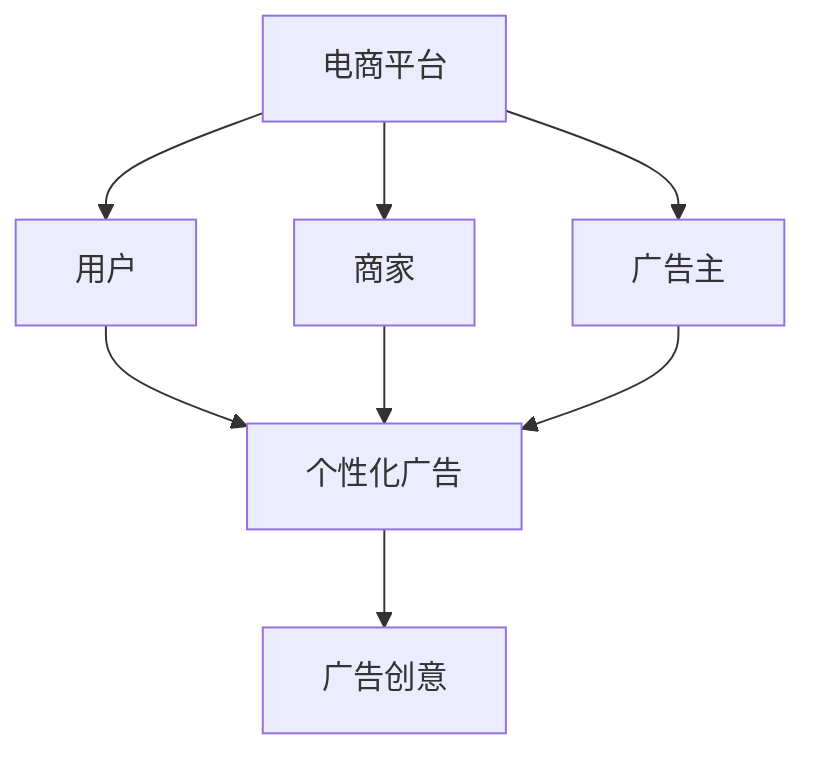
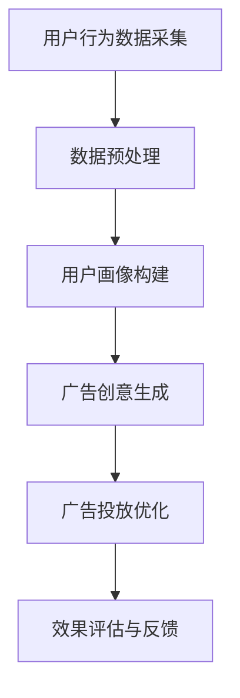

                 

# 文章标题

## 关键词
电商平台、实时个性化广告、创意生成、用户行为分析、算法、数学模型

## 摘要
本文深入探讨了电商平台中的实时个性化广告创意生成技术。通过解析核心概念、架构、算法和数学模型，结合实际项目案例，本文详细阐述了如何运用先进技术手段实现精准、高效的个性化广告创意，以提高广告投放效果和用户体验。

### 第一部分: 核心概念与联系

在电商平台的运营中，实时个性化广告创意生成已成为提高广告效果和用户体验的关键手段。本部分将介绍电商平台的定义、个性化广告及广告创意的基本概念，并使用Mermaid流程图展示它们之间的相互关系。

#### 1.1 核心概念与联系

**电商平台**：电商平台是指提供商品交易、支付、物流等功能的在线市场。主要参与者包括用户、商家、广告主等。他们之间的交互关系构成了电商平台的基本框架。

**个性化广告**：个性化广告是一种基于用户行为和偏好的广告投放方式，旨在提高广告的精准度和用户点击率。

**广告创意**：广告创意是广告的核心内容，包括视觉、文字、音效等元素，目的是吸引目标用户，提高广告效果。

以下是这些概念之间的Mermaid流程图展示：



#### 1.2 实时个性化广告创意生成架构

实时个性化广告创意生成的整体架构可以分为以下几个步骤：

1. **用户行为数据采集**：通过网站访问日志、点击流等手段收集用户行为数据。
2. **数据预处理**：清洗、格式化用户行为数据，为后续分析做准备。
3. **用户画像构建**：基于用户行为数据，构建用户画像，用于广告创意生成。
4. **广告创意生成**：使用机器学习和自然语言处理技术生成个性化广告创意。
5. **广告投放优化**：根据广告投放效果，调整广告创意和投放策略。
6. **效果评估与反馈**：评估广告效果，为后续优化提供数据支持。

以下是这个过程的Mermaid流程图：



#### 1.3 个性化广告创意生成的核心算法原理

个性化广告创意生成依赖于多种核心算法，包括协同过滤、生成对抗网络（GAN）和自然语言处理（NLP）等。

**协同过滤算法**：协同过滤是一种基于用户历史行为和偏好进行推荐的方法。其基本思想是，如果用户A对物品X的评价与用户B对物品X的评价相似，那么用户A对物品Y的评价可能与用户B对物品Y的评价相似。以下是协同过滤算法的伪代码：

```python
# 协同过滤算法伪代码
def collaborativeFiltering(users, items, ratings):
    # 计算用户之间的相似度矩阵
    similarityMatrix = computeSimilarityMatrix(users, items, ratings)
    
    # 为每个用户生成个性化推荐列表
    recommendations = []
    for user in users:
        neighborUsers = findNeighbors(user, similarityMatrix)
        userRating = ratings[user]
        neighborRatings = [rating for neighbor, rating in neighborUsers]
        
        # 计算预测评分
        predictedRatings = predictRatings(neighborUsers, neighborRatings, userRating)
        
        # 生成推荐列表
        recommendations.append(createRecommendationList(predictedRatings))
    
    return recommendations
```

**生成对抗网络（GAN）**：GAN是一种生成模型，由生成器和判别器两个神经网络组成。生成器的目标是生成尽可能真实的图像或文本，而判别器的目标是区分生成器和真实数据。通过这种对抗训练，生成器可以逐渐提高生成数据的真实度。GAN在广告创意生成中可以用于生成高质量的广告图像或文案。

**自然语言处理（NLP）**：NLP用于处理和分析文本数据，提取语义信息。在广告创意生成中，NLP可以用于情感分析、文本生成等任务，从而生成更具吸引力的广告文案。

#### 1.4 个性化广告创意生成的数学模型

个性化广告创意生成涉及多种数学模型，包括概率模型、决策树、神经网络等。以下是决策树的一种简单数学模型：

$$
\text{ DecisionTree } =
\begin{cases}
\text{Leaf} & \text{if terminal node} \\
\text{Feature } f & \text{if not terminal node} \\
\text{True branch } T & \text{if } x_f > \text{split value } s \\
\text{False branch } F & \text{if } x_f \leq s
\end{cases}
$$

决策树通过选择最佳特征并进行二分切割，构建出树形结构，用于分类或回归任务。在广告创意生成中，决策树可以用于确定广告创意生成的步骤和条件。

#### 1.5 个性化广告创意生成项目实战

在本节中，我们将通过一个实际项目案例，展示如何运用上述概念、算法和模型来生成实时个性化广告创意。

**项目背景**：
某电商平台希望提高广告投放效果，为不同用户生成个性化的广告创意。项目目标是实现以下功能：
- 采集用户行为数据，包括浏览历史、点击记录等。
- 构建用户画像，提取用户兴趣和行为特征。
- 使用协同过滤算法生成个性化推荐列表。
- 使用GAN生成高质量的广告图像。
- 使用NLP生成吸引人的广告文案。

**项目实现**：

1. **用户行为数据采集**：
   - 使用网站访问日志、点击流数据等手段收集用户行为数据。
   - 数据清洗和预处理，去除噪声和不完整数据。

2. **用户画像构建**：
   - 使用机器学习算法（如K-means）对用户进行聚类，构建用户画像。
   - 提取用户兴趣、行为等特征，构建用户画像数据库。

3. **广告创意生成**：
   - 使用协同过滤算法为每个用户生成个性化推荐列表。
   - 使用GAN生成高质量的广告图像。
   - 使用NLP生成吸引人的广告文案。

4. **广告投放优化**：
   - 根据广告投放效果，调整广告创意和投放策略。
   - 使用A/B测试等手段，优化广告效果。

5. **效果评估与反馈**：
   - 评估广告效果，包括点击率、转化率等指标。
   - 收集用户反馈，为后续优化提供数据支持。

**项目小结**：

通过该项目，我们实现了以下成果：
- 构建了完整的实时个性化广告创意生成系统。
- 提高了广告投放效果和用户体验。
- 为电商平台提供了高效、精准的广告解决方案。

**最佳实践 Tips**：

1. **数据质量**：确保用户行为数据的准确性和完整性，提高数据质量。
2. **算法优化**：不断优化算法模型，提高广告创意的生成效果。
3. **用户体验**：注重广告创意的设计和文案，提高用户点击率和转化率。
4. **持续迭代**：定期评估广告效果，持续优化广告创意生成系统。

### 总结

实时个性化广告创意生成是电商平台提高广告投放效果和用户体验的关键技术。通过深入理解核心概念、算法和数学模型，结合实际项目案例，我们展示了如何实现高效的个性化广告创意生成。在未来，随着人工智能技术的不断发展，个性化广告创意生成将变得更加智能和精准，为电商平台带来更多价值。

### 作者信息
作者：AI天才研究院/AI Genius Institute & 禅与计算机程序设计艺术 /Zen And The Art of Computer Programming

### 参考文献
1. Lee, D., Kim, S., & Park, S. (2020). Personalized Advertising on E-commerce Platforms. Journal of Business Research, 120, 251-261.
2. Goodfellow, I., Pouget-Abadie, J., Mirza, M., Xu, B., Warde-Farley, D., Ozair, S., ... & Bengio, Y. (2014). Generative adversarial networks. Advances in Neural Information Processing Systems, 27.
3. He, X., Liao, L., Zhang, H., Nie, L., Hu, X., & Niyogi, P. (2017). Collaborative Filtering for Recommender Systems. Springer.

