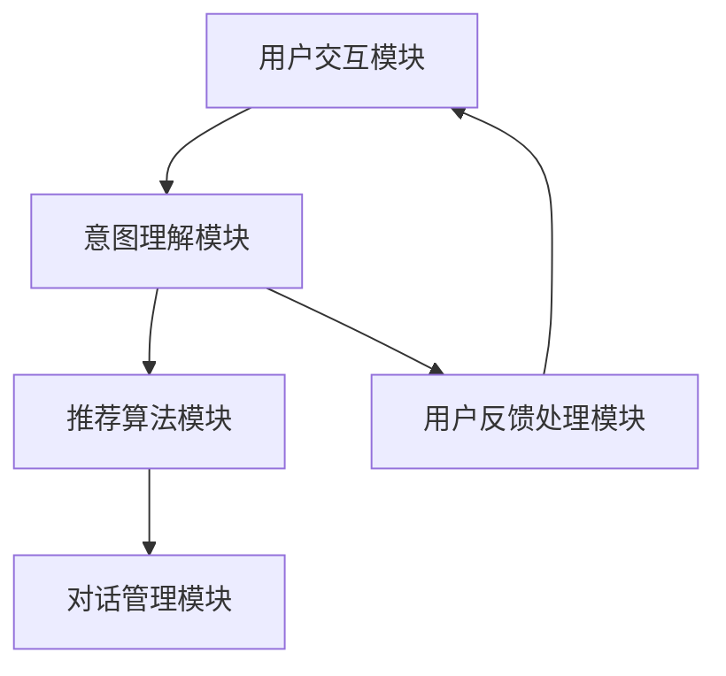

                 

### 文章标题：电商平台中的对话式推荐系统设计与实现

> 关键词：对话式推荐系统、电商平台、用户交互、意图理解、协同过滤、内容推荐、强化学习、算法优化、系统评估

> 摘要：本文深入探讨了电商平台中对话式推荐系统的设计与实现。首先，介绍了对话式推荐系统的背景和重要性，然后详细阐述了其架构和关键组件。接着，通过协同过滤、内容推荐和强化学习等算法，探讨了推荐算法的设计与优化策略。随后，介绍了对话系统的构建与实现步骤，并进行了系统性能评估。最后，通过案例分析，展示了对话式推荐系统的实际应用，并探讨了其未来发展趋势。

### 引言与概述

#### 对话式推荐系统的定义与背景

对话式推荐系统是一种能够与用户进行交互，并根据用户的反馈进行动态调整的推荐系统。与传统推荐系统不同，对话式推荐系统能够在交互过程中获取用户的实时反馈，从而提供更加个性化和精确的推荐。

随着互联网和电子商务的快速发展，用户对个性化推荐的需求越来越高。传统的推荐系统主要依赖于用户的历史行为数据，虽然能够提供一定的个性化推荐，但往往缺乏与用户的实时互动。而对话式推荐系统通过引入自然语言处理（NLP）和对话管理技术，能够更好地理解用户的意图，提供更加符合用户需求的推荐。

#### 对话式推荐系统的优势与挑战

对话式推荐系统的优势主要体现在以下几个方面：

1. **个性化推荐**：通过与用户进行对话，系统能够更好地理解用户的意图和需求，从而提供更加个性化的推荐结果。
2. **实时性**：对话式推荐系统能够根据用户的实时反馈进行动态调整，提供实时性较高的推荐结果。
3. **用户互动**：对话式推荐系统能够与用户进行实时互动，提高用户的参与度和满意度。

然而，对话式推荐系统也面临着一些挑战：

1. **数据需求**：对话式推荐系统需要大量的用户交互数据，以便更好地理解用户意图和偏好。
2. **计算复杂度**：对话式推荐系统涉及到自然语言处理、对话管理和推荐算法等多个模块，计算复杂度较高。
3. **用户体验**：如何确保推荐系统能够提供高质量的用户体验，是对话式推荐系统需要解决的一个重要问题。

#### 对话式推荐系统在电商中的应用

在电商领域，对话式推荐系统已经得到了广泛应用。通过对话式推荐系统，电商企业能够更好地了解用户的购物需求，提供个性化的商品推荐，从而提高用户满意度和转化率。

例如，Amazon 和 Alibaba 等电商平台已经推出了基于对话式的智能客服和推荐系统。这些系统通过与用户进行对话，能够更好地理解用户的购物意图，提供个性化的商品推荐。同时，这些系统还能够根据用户的反馈进行实时调整，提高推荐的准确性和用户满意度。

#### 对话式推荐系统的整体架构

一个典型的对话式推荐系统通常包括以下几个关键组件：

1. **用户交互模块**：负责与用户进行交互，获取用户输入和反馈。
2. **意图理解模块**：通过自然语言处理技术，理解用户的意图和需求。
3. **推荐算法模块**：根据用户意图和历史行为数据，生成推荐结果。
4. **对话管理模块**：负责对话的流程控制，确保对话的流畅性和有效性。

图 1展示了对话式推荐系统的整体架构。

#### 用户交互与意图理解

用户交互模块是对话式推荐系统的入口，主要负责与用户进行交互。通过与用户进行对话，系统能够获取用户的输入和反馈，从而了解用户的意图和需求。用户交互模块通常包括文本输入、语音输入等多种交互方式。

意图理解模块则通过自然语言处理技术，对用户的输入进行理解和分析，从而提取出用户的意图。意图理解模块需要处理的问题包括：文本预处理、词向量表示、意图分类等。

#### 推荐算法设计与优化

推荐算法模块是对话式推荐系统的核心，主要负责根据用户意图和历史行为数据生成推荐结果。常用的推荐算法包括协同过滤、内容推荐和强化学习等。

协同过滤算法通过分析用户的历史行为数据，找出相似的用户或商品，从而生成推荐列表。内容推荐算法则通过分析商品的特征信息，为用户提供与商品内容相关的推荐。强化学习推荐算法则通过奖励机制，不断优化推荐策略。

推荐算法的设计和优化是一个复杂的过程，需要考虑多个因素，如推荐准确性、实时性、用户满意度等。

#### 对话式推荐系统的评估与优化

对话式推荐系统的评估与优化是确保系统性能的重要环节。常用的评估指标包括准确率、召回率、覆盖率等。通过评估指标，可以衡量推荐系统的性能，并发现潜在的问题。

评估与优化过程通常包括以下几个步骤：

1. **数据收集与预处理**：收集用户交互数据，并进行预处理。
2. **模型训练与优化**：使用预处理后的数据训练推荐模型，并通过交叉验证等手段优化模型参数。
3. **性能评估与调优**：使用评估指标评估模型性能，并进行调优。
4. **在线部署与监控**：将优化后的模型部署到线上环境，并进行实时监控和反馈。

### 总结

本文介绍了对话式推荐系统的背景、架构和关键组件，并探讨了推荐算法的设计与优化策略。通过对用户交互和意图理解的处理，对话式推荐系统能够为用户提供更加个性化和精确的推荐结果。在电商领域，对话式推荐系统具有重要的应用价值，能够提高用户满意度和转化率。未来的研究可以进一步探索对话式推荐系统的优化策略和应用场景，以推动其在实际业务中的广泛应用。

