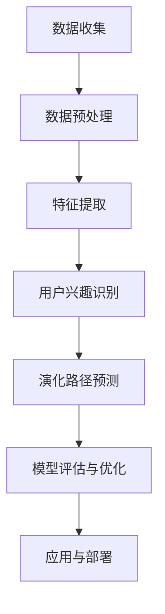

                 

### 文章标题

# 《电商平台中的用户兴趣主题演化追踪模型》

### 关键词

- 电商平台
- 用户兴趣主题
- 演化追踪模型
- 数据分析
- 算法设计
- 应用实践

### 摘要

本文深入探讨了电商平台中的用户兴趣主题演化追踪模型。通过对电商平台的概述，用户兴趣主题的定义与分类，以及用户兴趣主题演化的挑战与机会的介绍，文章为读者搭建了理论基础。接下来，文章详细阐述了用户兴趣主题演化追踪模型的基础，包括数据收集与预处理，用户行为数据类型分析，以及用户兴趣主题演化模型概述。核心部分则聚焦于模型设计与实现，包括用户兴趣主题演化模型原理，数学模型与公式，以及模型实现细节与优化策略。随后，通过案例分析与应用实践，文章展示了模型在现实场景中的应用与效果。最后，文章对模型评估与优化进行了探讨，并展望了未来研究趋势与挑战。本文旨在为电商领域研究人员与从业者提供一个全面而深入的技术指南，以助力电商平台更精准地追踪和满足用户兴趣。

## 第一部分：引言

### 1.1 书籍背景与目的

随着互联网技术的飞速发展，电商平台已成为现代商业的支柱之一。用户在电商平台上的行为数据量庞大且复杂，如何有效地挖掘和分析这些数据，以提升用户体验和业务收益，成为当前研究的热点。本文旨在探讨一种新的用户兴趣主题演化追踪模型，为电商平台提供一种高效的手段来理解和预测用户兴趣的变化。

本文的目标是：

1. **概述电商平台的基本架构与运作模式**：通过介绍电商平台的基本组成部分，如前端界面、后端服务、数据库等，帮助读者理解电商平台的工作流程和数据流动。
2. **定义用户兴趣主题及其分类**：解释用户兴趣主题的概念，并介绍常见兴趣主题的分类方法，如基于内容的分类、基于协同过滤的分类等。
3. **分析用户兴趣主题演化的挑战与机会**：探讨在电商平台中追踪用户兴趣主题演化所面临的挑战，如数据噪音、用户隐私保护等，并阐述这些挑战带来的研究机会。
4. **介绍用户兴趣主题演化追踪模型的基础**：详细描述数据收集与预处理的方法，用户行为数据的类型分析，以及用户兴趣主题演化模型的基本概念。
5. **设计与实现用户兴趣主题演化追踪模型**：通过数学模型和算法原理，详细阐述模型的设计思路与实现方法，并展示具体的模型流程图和伪代码。
6. **案例分析与应用实践**：通过具体案例展示模型的应用效果，并详细解读模型在实际电商平台的实现与部署过程。
7. **评估与优化模型**：介绍评估模型性能的指标与方法，并探讨模型的优化与迭代策略。
8. **展望未来研究方向**：总结当前研究趋势，讨论未来的发展方向，以及可能面临的挑战。

通过本文的探讨，我们期望为电商平台的研究人员提供一种新的视角和方法，以更好地理解和追踪用户兴趣的演化，从而为电商平台提供更加个性化的服务和精准的营销策略。

### 1.2 用户兴趣主题演化的重要性

在电商平台中，用户兴趣主题的演化是一个动态且复杂的过程。用户兴趣主题的演化不仅反映了用户个人需求的不断变化，也对电商平台的产品推荐、内容营销和个性化服务产生了深远影响。以下是用户兴趣主题演化的重要性及其对电商平台的多方面影响：

1. **个性化推荐系统**：用户兴趣主题的精准识别与演化追踪是构建高效个性化推荐系统的关键。通过实时监测和预测用户的兴趣变化，推荐系统能够更准确地推荐符合用户当前兴趣的商品，从而提高用户的满意度和粘性。
   
2. **内容营销策略**：电商平台的内容营销策略需要根据用户兴趣的变化进行灵活调整。通过追踪用户兴趣主题的演化，电商平台可以及时调整内容布局和推广策略，吸引用户关注，提升内容营销的效果。

3. **用户群体分析**：用户兴趣主题的演化有助于电商平台更好地理解不同用户群体的行为特征和需求变化。通过对用户兴趣主题的聚类分析，电商平台可以识别出潜在的用户细分市场，为市场细分和精准营销提供数据支持。

4. **商业决策支持**：用户兴趣主题的演化数据为电商平台提供了宝贵的商业决策支持。通过分析用户兴趣的动态变化，电商平台可以识别出市场趋势和潜在商机，及时调整产品策略和营销策略，以最大化商业价值。

5. **用户体验优化**：用户兴趣主题的演化有助于电商平台优化用户体验。通过了解用户的兴趣变化，电商平台可以在用户界面设计、交互体验和功能布局等方面进行优化，提升用户的整体体验。

6. **预防风险和挑战**：用户兴趣的演化也带来了一些风险和挑战。例如，用户兴趣的转变可能导致某些产品或服务的需求下降，电商平台需要及时调整策略以应对这些变化，避免因市场变化带来的风险。

总之，用户兴趣主题的演化对电商平台具有至关重要的意义。通过深入研究和理解用户兴趣的动态变化，电商平台能够更好地满足用户需求，提高用户满意度，优化业务策略，从而在激烈的市场竞争中占据优势地位。

### 1.3 书籍结构与内容概述

本文的结构和内容旨在系统性地探讨电商平台中的用户兴趣主题演化追踪模型，涵盖从理论到实践的全过程，为读者提供全面而深入的指导。以下是本书各部分的内容概述：

**第一部分：引言**
- **1.1 书籍背景与目的**：介绍书籍的研究背景和目标，帮助读者了解本文的研究动机和目的。
- **1.2 用户兴趣主题演化的重要性**：阐述用户兴趣主题演化对电商平台的重要性及其多方面影响。

**第二部分：电商平台与用户兴趣主题演化**
- **2.1 电商平台概述**：介绍电商平台的基本架构、运作模式及其组成部分，为后续讨论奠定基础。
- **2.2 用户兴趣主题的定义与分类**：详细定义用户兴趣主题，并介绍常见的兴趣主题分类方法。
- **2.3 用户兴趣主题演化的挑战与机会**：分析用户兴趣主题演化在电商平台中面临的挑战和提供的研究机会。

**第三部分：用户兴趣主题演化追踪模型基础**
- **3.1 数据收集与预处理**：讨论用户行为数据的收集方法、数据预处理技术及其重要性。
- **3.2 用户行为数据类型分析**：分析不同类型用户行为数据的特点及其在模型中的应用。
- **3.3 用户兴趣主题演化模型概述**：介绍用户兴趣主题演化模型的基本概念、主要组成部分及其工作原理。

**第四部分：核心模型设计与实现**
- **4.1 用户兴趣主题演化模型原理**：详细解释用户兴趣主题演化模型的基本原理，通过流程图和伪代码进行阐述。
- **4.2 数学模型与公式**：介绍支持用户兴趣主题演化模型的数学模型和公式，进行详细讲解和举例说明。
- **4.3 模型实现细节与优化策略**：探讨模型实现的细节和优化策略，以提高模型的性能和适用性。

**第五部分：案例分析与应用实践**
- **5.1 用户兴趣主题演化模型案例解析**：通过具体案例展示用户兴趣主题演化模型的应用效果，深入分析其实现和效果。
- **5.2 用户兴趣主题演化追踪系统构建**：介绍构建用户兴趣主题演化追踪系统的架构设计和实现细节。

**第六部分：评估与优化**
- **6.1 模型评估指标与方法**：介绍评估用户兴趣主题演化模型的性能指标和评估方法。
- **6.2 模型优化与迭代**：讨论模型的优化策略和迭代方法，以提升模型的准确性和效率。
- **6.3 模型在实际应用中的调整与优化**：分析模型在实际应用中的调整和优化实践，分享经验与教训。

**第七部分：未来展望与挑战**
- **7.1 用户兴趣主题演化研究趋势**：总结当前用户兴趣主题演化研究的发展趋势和前沿方向。
- **7.2 模型应用领域拓展**：探讨用户兴趣主题演化模型在不同应用领域的拓展前景。
- **7.3 挑战与解决方案展望**：展望未来可能面临的挑战，并提出相应的解决方案和研究方向。

通过以上结构，本书不仅提供了用户兴趣主题演化追踪模型的理论基础，还通过实际案例展示了模型的应用效果，旨在为电商领域的研究人员和实践者提供全面的参考和指导。希望读者能够在阅读过程中，不仅掌握理论知识，还能通过实践应用，进一步提升对用户兴趣主题演化的理解和应用能力。

### 2.1 电商平台概述

电商平台作为一种通过互联网技术实现商品交易和用户互动的虚拟市场，已经成为现代商业环境中的重要组成部分。本文首先从电商平台的定义出发，进一步探讨其基本架构、运作模式以及核心组成部分，帮助读者建立对电商平台的整体认识。

#### 电商平台定义

电商平台是指通过互联网技术构建的在线交易平台，它为买卖双方提供了一个虚拟的商业环境，使商品交易和服务提供变得更加便捷和高效。电商平台不仅包括在线购物网站，还涵盖了移动应用、社交媒体和即时通讯工具等多种形式，为用户提供了多样化的购物体验。

#### 基本架构

电商平台的基本架构主要包括前端界面、后端服务和数据库三个核心部分。

1. **前端界面**：前端界面是用户直接交互的平台，包括网站首页、商品展示页、购物车、结算页等。前端界面的设计直接影响用户的购物体验和操作便利性。常见的开发技术有HTML、CSS和JavaScript，以及前端框架如React、Vue.js和Angular等。

2. **后端服务**：后端服务负责处理用户请求、业务逻辑和数据管理等功能。后端服务通常包括应用服务器、数据库服务器和缓存服务器等。常见的开发技术有Java、Python、Node.js等，后端框架如Spring、Django和Express等。

3. **数据库**：数据库存储和管理电商平台中的所有数据，包括商品信息、用户数据、订单数据和交易记录等。常见的数据库技术有MySQL、PostgreSQL、MongoDB等。

#### 运作模式

电商平台的运作模式主要包括商品展示、购物流程、支付与结算以及物流配送等环节。

1. **商品展示**：商品展示是电商平台的重要功能，通过丰富的商品信息、图片和描述，吸引用户的目光，提高商品的销量。商品展示通常采用动态加载技术，以实现快速响应和流畅的用户体验。

2. **购物流程**：购物流程包括用户浏览商品、加入购物车、选择支付方式和确认订单等步骤。电商平台需要确保购物流程的简便性和便捷性，以提升用户的购物体验。

3. **支付与结算**：支付与结算环节是电商平台实现交易的关键步骤。常见的支付方式包括信用卡、支付宝、微信支付等。电商平台需要保证支付过程的安全性和可靠性，以增强用户的信任感。

4. **物流配送**：物流配送是电商平台实现商品交付的重要环节。电商平台通常与第三方物流公司合作，确保商品能够及时送达用户手中。物流配送的效率和准确性对用户的购物体验具有重要影响。

#### 核心组成部分

电商平台的几个核心组成部分包括：

1. **用户管理系统**：用户管理系统负责用户注册、登录、权限管理等功能，确保用户数据的安全和隐私。

2. **商品管理系统**：商品管理系统负责商品信息的管理，包括商品分类、商品信息展示、库存管理、价格管理等。

3. **订单管理系统**：订单管理系统负责订单的创建、处理、查询和跟踪等功能，确保订单流程的顺畅和高效。

4. **营销与推广系统**：营销与推广系统负责电商平台的各种营销活动、促销策略、广告投放等功能，提升平台的品牌影响力和用户粘性。

5. **数据分析和挖掘系统**：数据分析和挖掘系统通过对用户行为数据、交易数据的分析，提供业务洞察和决策支持，帮助电商平台优化运营策略。

通过以上概述，读者可以全面了解电商平台的基本架构、运作模式以及核心组成部分，为进一步探讨用户兴趣主题的演化提供了坚实的基础。

### 2.2 用户兴趣主题的定义与分类

在电商平台中，用户兴趣主题是指用户在浏览、搜索、购买和评价商品时表现出的倾向和偏好。这些兴趣主题可以是多样化的，如时尚、科技、美食、运动等。理解用户兴趣主题的定义和分类对于电商平台提供个性化推荐、精准营销和优化用户体验具有重要意义。以下将详细介绍用户兴趣主题的定义、常见分类方法以及它们在电商平台中的应用。

#### 用户兴趣主题的定义

用户兴趣主题可以从多个维度进行定义和描述。首先，用户兴趣主题是用户行为数据的一种抽象，反映了用户在特定情境下的兴趣和偏好。这些兴趣和偏好可以通过用户的行为数据，如浏览历史、购买记录、搜索关键词和评价等来识别和归纳。例如，一个用户在电商平台上频繁浏览和购买与“时尚”相关的商品，则可以认为该用户对“时尚”主题有较高兴趣。

其次，用户兴趣主题不仅仅是静态的，它是一个动态变化的过程。用户兴趣可能会随着时间、环境、社会因素的变化而发生转移和演化。例如，某用户可能在年轻时期对科技产品有浓厚兴趣，但在成家立业后，其兴趣可能逐渐转向家居用品和母婴产品。

#### 常见分类方法

用户兴趣主题的分类方法多样，以下介绍几种常见的分类方法：

1. **基于内容的分类**：
   基于内容的分类方法是通过分析用户浏览和购买的商品内容来识别用户兴趣主题。这种方法通常依赖于文本挖掘和自然语言处理技术。例如，可以通过文本分析用户发布的商品评价、搜索关键词和用户生成的内容，从而提取出与特定主题相关的关键词和短语。基于内容的分类方法有助于从用户生成的数据中直接识别兴趣主题，但可能受到数据质量和噪声的影响。

2. **基于协同过滤的分类**：
   协同过滤是一种常用的推荐系统技术，可以通过分析用户之间的相似性来推荐商品或服务。基于协同过滤的分类方法可以根据用户的购买历史和行为模式，识别出与其他用户相似的兴趣主题。这种方法通常依赖于矩阵分解和用户行为数据分析，能够有效地发现用户群体中的共性和差异。然而，协同过滤方法在处理稀疏数据集时可能效果不佳。

3. **基于机器学习的分类**：
   机器学习技术，如决策树、支持向量机（SVM）、神经网络等，可以通过训练模型来自动识别和分类用户兴趣主题。基于机器学习的分类方法通常需要大量的标注数据来训练模型，并且可以通过特征工程来提高模型的预测性能。这种方法具有较强的灵活性和泛化能力，但可能需要较长时间的训练和较高的计算资源。

4. **混合分类方法**：
   混合分类方法结合了多种分类方法的优点，以获得更准确的分类结果。例如，可以结合基于内容的分类和基于协同过滤的分类方法，先通过内容分析提取兴趣主题，再通过协同过滤方法进行用户聚类，以获得更精细的兴趣主题分类。

#### 在电商平台中的应用

用户兴趣主题在电商平台中有广泛的应用，以下列举几个主要应用场景：

1. **个性化推荐**：
   个性化推荐是电商平台提升用户体验和转化率的重要手段。通过识别和追踪用户的兴趣主题，平台可以推荐与其兴趣相关的商品，从而提高用户的满意度和购买意愿。

2. **精准营销**：
   精准营销通过分析用户兴趣主题，针对特定用户群体进行有针对性的广告投放和促销活动，提高营销效果。例如，针对有“时尚”兴趣主题的用户，电商平台可以推荐相关的时尚品牌和新款商品，并提供专属优惠。

3. **用户画像**：
   用户画像是一种基于用户兴趣主题和其他属性构建的用户信息模型。通过用户画像，电商平台可以更好地理解用户需求和行为模式，为个性化服务和精准营销提供数据支持。

4. **内容布局**：
   电商平台可以根据用户兴趣主题调整内容布局，如推荐栏、首页导航等，以提高用户在平台上的活跃度和停留时间。

5. **产品策略**：
   通过分析用户兴趣主题的演化，电商平台可以识别出市场趋势和潜在商机，从而调整产品策略和库存管理，提高业务竞争力。

综上所述，用户兴趣主题的定义和分类是电商平台理解和满足用户需求的重要基础。通过多种分类方法的结合和应用，电商平台可以更精准地识别和追踪用户兴趣，从而提升用户体验和业务收益。

### 2.3 用户兴趣主题演化的挑战与机会

在电商平台中，用户兴趣主题的演化是一个复杂且动态的过程，它不仅受到用户个人行为和需求变化的影响，还受到市场环境、社会因素和平台策略等多重因素的共同作用。这种演化过程带来了诸多挑战和机会，对电商平台的发展和创新提出了新的要求。

#### 挑战

1. **数据噪音和不确定性**：
   用户行为数据中存在大量的噪音和不确定性，例如用户浏览行为中的随机点击、重复行为等，这些噪音会影响用户兴趣主题的准确识别和演化追踪。此外，用户兴趣主题的变化可能存在突发性和不确定性，这使得模型需要具备较强的鲁棒性和适应性。

2. **用户隐私保护**：
   用户在电商平台上的行为数据涉及个人隐私，如何有效地保护用户隐私，同时满足个性化推荐和营销的需求，成为一大挑战。违反用户隐私可能导致用户信任度下降，甚至损害电商平台声誉。

3. **计算复杂性和实时性**：
   随着用户数量的增加和数据的爆炸式增长，处理和分析大规模用户行为数据需要较高的计算资源和技术支持。同时，用户兴趣主题的实时追踪和预测要求模型具备高效的计算性能和低延迟。

4. **动态调整和优化**：
   用户兴趣主题的演化具有动态性，电商平台需要及时调整和优化推荐策略和营销方案，以适应不断变化的市场环境。然而，这种动态调整和优化过程可能需要大量的人力和物力资源，增加了运营成本。

5. **跨平台数据整合**：
   电商平台通常涉及多个平台，如网站、移动应用、社交媒体等，如何整合跨平台数据，构建全面准确的用户兴趣模型，是一个重要的挑战。不同平台的数据格式、质量和技术标准可能存在差异，需要统一处理和整合。

#### 机会

1. **个性化服务提升用户满意度**：
   通过准确识别和追踪用户兴趣主题的演化，电商平台可以提供更加个性化的服务，提升用户的购物体验和满意度。个性化的推荐和营销策略能够更好地满足用户需求，提高用户粘性和忠诚度。

2. **精准营销提高转化率**：
   用户兴趣主题的演化为电商平台提供了更精准的营销机会。通过分析用户兴趣的动态变化，电商平台可以制定更具针对性的营销策略，提高广告投放和促销活动的效果，从而提升销售转化率。

3. **业务创新和市场拓展**：
   用户兴趣主题的演化揭示了市场的趋势和用户需求的变化，为电商平台的业务创新和市场拓展提供了重要参考。通过深入研究和理解用户兴趣主题的演化，电商平台可以开发新的产品和服务，开拓新的市场领域。

4. **数据驱动的决策支持**：
   用户兴趣主题的演化数据为电商平台的商业决策提供了有力支持。通过数据分析和挖掘，电商平台可以识别出潜在的商业机会和风险，优化产品策略、库存管理和营销策略，提升整体业务表现。

5. **技术创新和应用拓展**：
   用户兴趣主题演化追踪模型的研究和应用推动了相关技术，如数据挖掘、机器学习、自然语言处理等的发展。这些技术的进步为电商平台提供了更先进的数据处理和分析工具，促进了技术创新和应用拓展。

综上所述，用户兴趣主题的演化在电商平台中既带来了挑战，也提供了巨大的机会。通过有效应对这些挑战，电商平台可以更好地利用这些机会，提升用户体验和业务表现，实现可持续发展。

### 3.1 数据收集与预处理

在构建用户兴趣主题演化追踪模型的过程中，数据收集与预处理是至关重要的一步。这一阶段的质量直接影响模型的效果和可靠性。以下是数据收集与预处理的具体方法及其重要性。

#### 数据收集

1. **用户行为数据**：用户行为数据包括用户的浏览历史、购买记录、搜索关键词、点击行为、评价和反馈等。这些数据可以通过电商平台的前端日志、后端数据库记录以及第三方数据提供商获取。用户行为数据是构建用户兴趣模型的主要依据，因此其全面性和准确性至关重要。

2. **商品信息数据**：商品信息数据包括商品名称、分类、价格、描述、标签等。这些数据通常存储在电商平台的商品数据库中，用于构建用户与商品之间的关联关系。

3. **外部数据**：外部数据包括社交媒体数据、新闻资讯、市场报告等，这些数据可以通过网络爬虫、API接口、第三方数据提供商获取。外部数据可以帮助补充和丰富用户行为数据，提高模型的泛化能力。

#### 数据预处理

1. **数据清洗**：数据清洗是数据预处理的第一步，目的是去除重复数据、填补缺失值、纠正错误数据等。例如，去除用户浏览日志中的重复点击记录，填补用户购买记录中的缺失日期等。数据清洗的目的是提高数据质量，减少后续分析中的错误。

2. **数据格式转换**：不同来源的数据可能具有不同的数据格式，如CSV、JSON、XML等。在进行分析之前，需要将这些数据格式统一转换为标准格式，如CSV或Parquet，以便后续处理和分析。

3. **特征提取**：特征提取是从原始数据中提取出对分析任务有重要影响的信息。例如，可以从用户行为数据中提取出用户的浏览频率、购买频率、点击率等特征，从商品信息数据中提取出商品的价格、销量、评价数等特征。这些特征用于构建用户兴趣模型和进行后续分析。

4. **数据标准化**：数据标准化是为了消除不同特征之间的量纲和范围差异，使其在同一尺度上进行比较。常见的标准化方法包括最小-最大标准化、Z-score标准化等。

5. **数据降维**：当数据维度较高时，进行数据降维可以减少计算复杂度，提高模型性能。常用的降维方法包括主成分分析（PCA）、t-SVD等。

#### 数据预处理的重要性

1. **提高模型准确性**：高质量的数据是构建准确模型的基石。通过数据清洗、格式转换、特征提取和标准化等步骤，可以去除噪声和异常值，提高数据的准确性和一致性，从而提升模型的预测性能。

2. **减少计算复杂度**：预处理阶段的数据降维和标准化可以减少数据维度，降低计算复杂度，缩短模型训练和预测的时间。

3. **提高模型泛化能力**：通过特征提取和降维，可以提取出对分析任务最有影响力的特征，提高模型的泛化能力，使其在不同数据集上都能保持良好的性能。

4. **数据驱动决策**：高质量的数据预处理为电商平台提供了可靠的数据基础，使其能够基于数据做出更加精准的商业决策，如个性化推荐、精准营销和产品策略调整等。

总之，数据收集与预处理是构建用户兴趣主题演化追踪模型的重要基础。通过科学合理的数据预处理方法，可以确保数据的质量和一致性，为模型的构建和优化提供可靠支持。

#### 3.2 用户行为数据类型分析

用户行为数据是构建用户兴趣主题演化追踪模型的关键。不同类型的用户行为数据反映了用户在电商平台上的各种活动，对于理解用户兴趣的动态变化至关重要。以下是几种主要的用户行为数据类型及其特点：

1. **浏览行为数据**：
   浏览行为数据记录了用户在电商平台上的浏览活动，包括用户访问的页面、浏览的时间长度、浏览的顺序等。这些数据通常通过前端日志捕获，可以反映用户对商品或内容的兴趣程度。浏览行为数据的特点是数据量大、时间性强，需要实时处理和分析。

2. **购买行为数据**：
   购买行为数据是用户在电商平台上完成的购买记录，包括购买的商品ID、购买时间、购买数量、支付金额等。购买行为数据是最直接的反映用户兴趣和需求的数据类型，通常与用户的其他行为数据（如浏览、搜索、评价）一起用于构建用户兴趣模型。购买行为数据的特点是关键性高、信息量集中。

3. **搜索行为数据**：
   搜索行为数据记录了用户在电商平台上的搜索活动，包括搜索关键词、搜索时间、搜索结果页面等。搜索行为数据反映了用户的当前兴趣和潜在需求，对于构建实时性和个性化的推荐系统具有重要意义。搜索行为数据的特点是动态性强、实时更新。

4. **点击行为数据**：
   点击行为数据记录了用户在电商平台上的点击活动，包括点击的广告、推荐商品、分类标签等。点击行为数据可以用于分析用户对各种内容的反应和偏好，是评估推荐系统和广告投放效果的重要依据。点击行为数据的特点是反应性强、反馈及时。

5. **评价行为数据**：
   评价行为数据记录了用户对商品或服务进行的评价，包括评价内容、评分、时间等。评价行为数据不仅反映了用户的兴趣和满意度，还可以用于商品筛选和推荐系统的改进。评价行为数据的特点是描述性强、信息丰富。

6. **社交行为数据**：
   社交行为数据记录了用户在电商平台上的社交活动，包括用户之间的互动、分享、评论等。社交行为数据可以反映用户的社会关系和群体行为模式，对于社交推荐和群体分析具有重要意义。社交行为数据的特点是关系性强、互动频繁。

这些不同类型的用户行为数据在构建用户兴趣主题演化追踪模型时各有所长，需要结合使用，以全面、深入地分析用户兴趣的动态变化。例如，通过分析用户的浏览和搜索行为数据，可以识别用户的短期兴趣点；通过分析购买和评价行为数据，可以识别用户的长期兴趣和需求；通过分析社交行为数据，可以挖掘用户的社会影响力和群体行为模式。

总之，用户行为数据类型的多样性为构建用户兴趣主题演化追踪模型提供了丰富的信息来源。通过对这些数据进行有效整合和分析，可以更精准地追踪和预测用户兴趣的演化，为电商平台提供个性化的服务和精准的营销策略。

### 3.3 用户兴趣主题演化模型概述

用户兴趣主题演化模型是电商平台中用于追踪和预测用户兴趣动态变化的重要工具。该模型通过分析用户行为数据，识别并预测用户兴趣的主题及其演化路径，从而为个性化推荐、精准营销和用户体验优化提供支持。以下是用户兴趣主题演化模型的基本概念、主要组成部分及其工作原理。

#### 基本概念

1. **用户兴趣主题**：用户兴趣主题是指用户在特定时间段内表现出的倾向和偏好，这些主题可以是多样化的，如“时尚”、“科技”、“美食”等。用户兴趣主题通过分析用户的浏览历史、购买记录、搜索关键词等行为数据来识别。

2. **演化**：用户兴趣主题的演化是指用户兴趣在不同时间点上的变化过程。用户兴趣可能受到多种因素的影响，如个人需求变化、市场趋势、社会事件等，从而表现出动态性。

3. **模型**：用户兴趣主题演化模型是一种基于数据分析的算法，用于识别用户兴趣主题及其演化路径。该模型通过机器学习、数据挖掘等技术，从用户行为数据中提取特征，构建用户兴趣主题的动态模型。

#### 主要组成部分

用户兴趣主题演化模型主要包括以下几个组成部分：

1. **数据收集与预处理模块**：该模块负责收集用户行为数据，并进行数据清洗、格式转换和特征提取。数据预处理是构建有效模型的基础，确保数据的准确性和一致性。

2. **特征提取模块**：该模块从用户行为数据中提取关键特征，如浏览频率、购买频率、搜索关键词频率等。这些特征用于构建用户兴趣主题的数学模型，是模型的核心输入。

3. **用户兴趣主题识别模块**：该模块通过分析用户行为特征，识别出用户当前的兴趣主题。常用的方法包括聚类分析、主题模型等，通过这些算法，可以从大规模数据中提取出潜在的兴趣主题。

4. **演化路径预测模块**：该模块基于用户兴趣主题识别结果，预测用户兴趣的演化路径。常用的方法包括时间序列分析、动态贝叶斯网络等，通过这些算法，可以推断出用户兴趣的短期和长期变化趋势。

5. **模型评估与优化模块**：该模块负责评估模型性能，并根据评估结果进行模型优化。评估指标包括准确率、召回率、F1值等，优化方法包括模型调参、特征选择等。

#### 工作原理

用户兴趣主题演化模型的工作原理可以概括为以下几个步骤：

1. **数据收集与预处理**：首先，从电商平台的数据源（如日志文件、数据库等）中收集用户行为数据，并进行数据清洗和格式转换。

2. **特征提取**：对预处理后的数据进行特征提取，构建用户兴趣主题的数学特征表示。例如，可以通过TF-IDF方法提取关键词频率，通过用户行为序列提取时间特征等。

3. **用户兴趣主题识别**：利用特征提取模块提取的特征，使用聚类算法（如K-means、DBSCAN）或主题模型（如LDA）识别用户当前的兴趣主题。这些主题反映了用户在特定时间段内的兴趣偏好。

4. **演化路径预测**：基于识别出的用户兴趣主题，使用时间序列分析或动态贝叶斯网络等方法预测用户兴趣的演化路径。这些方法可以帮助电商平台提前了解用户的兴趣变化，从而进行个性化推荐和精准营销。

5. **模型评估与优化**：通过评估模型在测试集上的性能，如准确率、召回率等，对模型进行调整和优化。优化方法包括调整模型参数、增加或减少特征、更换模型算法等。

通过上述步骤，用户兴趣主题演化模型能够有效追踪和预测用户兴趣的动态变化，为电商平台提供数据驱动的决策支持。在实际应用中，用户兴趣主题演化模型需要不断迭代和优化，以适应不断变化的市场环境和用户需求。

### 4.1 用户兴趣主题演化模型原理

用户兴趣主题演化模型是一种用于追踪和预测用户兴趣动态变化的算法体系。它通过分析用户行为数据，从多个维度识别用户兴趣主题，并预测这些兴趣主题的演化路径。以下将详细解释用户兴趣主题演化模型的基本原理，并展示其流程图和伪代码。

#### 用户兴趣主题演化流程图

为了更好地理解用户兴趣主题演化模型，我们可以借助Mermaid流程图来展示其基本流程：



在上述流程图中：

- **A[数据收集]**：从电商平台收集用户行为数据，如浏览历史、购买记录、搜索关键词等。
- **B[数据预处理]**：清洗和格式化收集到的数据，去除噪声和异常值。
- **C[特征提取]**：从预处理后的数据中提取关键特征，如浏览频率、购买频率、搜索关键词频率等。
- **D[用户兴趣识别]**：利用特征提取结果，通过聚类分析或主题模型等方法，识别用户当前的兴趣主题。
- **E[演化路径预测]**：基于识别出的用户兴趣主题，使用时间序列分析或动态贝叶斯网络等方法，预测用户兴趣的短期和长期变化。
- **F[模型评估与优化]**：通过评估模型在测试集上的性能，调整模型参数和算法，优化模型性能。
- **G[应用与部署]**：将优化后的模型应用到实际场景中，如个性化推荐、精准营销等。

#### 用户兴趣主题演化算法伪代码

以下是用户兴趣主题演化算法的伪代码，展示了从数据收集到模型优化的主要步骤：

```python
# 用户兴趣主题演化算法伪代码

# 数据收集
data = collect_user_behavior_data()

# 数据预处理
cleaned_data = preprocess_data(data)

# 特征提取
features = extract_features(cleaned_data)

# 用户兴趣识别
topics = identify_interest_topics(features)

# 演化路径预测
evolution_paths = predict_evolution_paths(topics)

# 模型评估与优化
performance = evaluate_model(evolution_paths)
while not satisfactory_performance(performance):
    optimize_model(features, evolution_paths)

# 应用与部署
deploy_model(evolution_paths)
```

在上述伪代码中：

- **collect_user_behavior_data()**：从电商平台的日志和数据库中收集用户行为数据。
- **preprocess_data(data)**：对收集到的数据进行清洗和格式转换，如去除重复记录、填补缺失值等。
- **extract_features(cleaned_data)**：从预处理后的数据中提取特征，如用户浏览频率、购买频率、搜索关键词频率等。
- **identify_interest_topics(features)**：利用特征提取结果，通过聚类分析或主题模型等方法识别用户兴趣主题。
- **predict_evolution_paths(topics)**：基于识别出的用户兴趣主题，使用时间序列分析或动态贝叶斯网络等方法预测用户兴趣的演化路径。
- **evaluate_model(evolution_paths)**：评估模型在测试集上的性能，如准确率、召回率等。
- **optimize_model(features, evolution_paths)**：根据模型评估结果，调整模型参数和算法，优化模型性能。
- **deploy_model(evolution_paths)**：将优化后的模型应用到实际场景中，如个性化推荐、精准营销等。

通过上述原理和伪代码的详细解释，读者可以全面了解用户兴趣主题演化模型的设计思路和实现方法。该模型在电商平台中具有重要的应用价值，能够帮助平台更精准地理解和预测用户兴趣，从而提升用户体验和业务收益。

### 4.2 数学模型与公式

在构建用户兴趣主题演化模型的过程中，数学模型和公式是核心组成部分，用于描述用户兴趣的动态变化过程。以下是几种常用的数学模型和公式，包括演化概率模型、主题漂移检测模型和主题转换模型，并进行详细讲解和举例说明。

#### 演化概率模型

演化概率模型用于预测用户兴趣主题在一段时间内的变化概率。该模型基于贝叶斯定理，结合历史用户行为数据，计算每个主题在下一个时间点的概率。

1. **贝叶斯定理公式**：

   $$ P(A|B) = \frac{P(B|A) \cdot P(A)}{P(B)} $$

   其中，$P(A|B)$ 表示在事件B发生的情况下，事件A发生的条件概率；$P(B|A)$ 表示在事件A发生的情况下，事件B发生的条件概率；$P(A)$ 和$P(B)$ 分别表示事件A和事件B的边缘概率。

2. **演化概率模型公式**：

   $$ P_t(j|t-1) = \frac{P_t(j) \cdot P(j|t-1)}{\sum_{i=1}^{N} P_t(i) \cdot P(i|t-1)} $$

   其中，$P_t(j|t-1)$ 表示在时间点$t$，用户对兴趣主题$j$的兴趣概率；$P_t(j)$ 表示在时间点$t$，用户对兴趣主题$j$的总体概率；$P(j|t-1)$ 表示在时间点$t-1$，用户对兴趣主题$j$的兴趣概率。

   **举例说明**：

   假设用户在时间点$t-1$对“时尚”主题的兴趣概率为$P(j|t-1)=0.4$，对“科技”主题的兴趣概率为$P(j|t-1)=0.3$，其他主题的概率分别为$P(j|t-1)=0.15$和$P(j|t-1)=0.15$。在时间点$t$，用户对“时尚”主题的兴趣概率为$P_t(j)=0.45$，对“科技”主题的兴趣概率为$P_t(j)=0.35$，其他主题的概率分别为$P_t(j)=0.1$和$P_t(j)=0.1$。

   根据演化概率模型公式，计算用户在时间点$t$对“时尚”主题的兴趣概率：

   $$ P_t(j|t-1) = \frac{0.45 \cdot 0.4}{0.45 \cdot 0.4 + 0.35 \cdot 0.3 + 0.1 \cdot 0.15 + 0.1 \cdot 0.15} = \frac{0.18}{0.18 + 0.105 + 0.015 + 0.015} = \frac{0.18}{0.255} \approx 0.706 $$

   因此，在时间点$t$，用户对“时尚”主题的兴趣概率约为70.6%。

#### 主题漂移检测模型

主题漂移检测模型用于检测用户兴趣主题的变化趋势，判断用户兴趣是否发生了显著漂移。常用的方法包括统计测试和机器学习算法。

1. **统计测试公式**：

   $$ \chi^2 \text{统计量} = \sum_{i=1}^{N} \frac{(O_i - E_i)^2}{E_i} $$

   其中，$O_i$ 表示观察频数，$E_i$ 表示期望频数。

   **举例说明**：

   假设用户在时间点$t-1$和$t$对两个兴趣主题“时尚”和“科技”的观察频数分别为$O_1=100$和$O_2=50$，期望频数分别为$E_1=80$和$E_2=60$。

   计算$\chi^2$统计量：

   $$ \chi^2 \text{统计量} = \frac{(100 - 80)^2}{80} + \frac{(50 - 60)^2}{60} = \frac{20^2}{80} + \frac{(-10)^2}{60} = 5 + \frac{100}{60} = 5 + 1.667 \approx 6.667 $$

   如果$\chi^2$统计量的值大于某个预定义的阈值，则认为存在显著的主题漂移。

#### 主题转换模型

主题转换模型用于预测用户兴趣主题之间的转换概率，描述用户兴趣从一种主题向另一种主题转移的过程。常用的模型包括马尔可夫模型和潜在转换模型。

1. **马尔可夫模型公式**：

   $$ P(j_t|j_{t-1}) = \frac{P(j_t \cap j_{t-1})}{P(j_{t-1})} $$

   其中，$P(j_t|j_{t-1})$ 表示在时间点$t$用户兴趣主题为$j_t$，在时间点$t-1$用户兴趣主题为$j_{t-1}$的条件概率。

   **举例说明**：

   假设用户在时间点$t-1$和$t$的兴趣主题分别为“时尚”和“科技”，给定转移矩阵：

   $$ P(j_t|j_{t-1}) = \begin{bmatrix} 0.6 & 0.4 \\ 0.3 & 0.7 \end{bmatrix} $$

   预测在时间点$t$用户对“时尚”主题的兴趣概率为$P_t(j_1)=0.6$，对“科技”主题的兴趣概率为$P_t(j_2)=0.4$。

2. **潜在转换模型公式**：

   $$ P(j_t|j_{t-1}) = \frac{\exp(\theta_{t-1}^T \phi_t)}{\sum_{k=1}^{K} \exp(\theta_{t-1}^T \phi_k)} $$

   其中，$\theta_{t-1}$ 表示时间点$t-1$的潜在状态向量，$\phi_t$ 表示时间点$t$的潜在状态向量，$K$ 表示潜在状态的总数。

   **举例说明**：

   假设用户在时间点$t-1$和$t$的潜在状态向量分别为$\theta_{t-1} = [0.8, 0.2]$和$\phi_t = [0.9, 0.1]$，给定潜在状态转移矩阵：

   $$ \phi_t = \begin{bmatrix} 0.8 & 0.2 \\ 0.1 & 0.9 \end{bmatrix} $$

   预测在时间点$t$用户对“时尚”主题的兴趣概率为$P_t(j_1)=0.9$，对“科技”主题的兴趣概率为$P_t(j_2)=0.1$。

通过上述数学模型和公式的讲解及举例，可以更好地理解用户兴趣主题演化的动态过程，为电商平台提供有效的兴趣追踪和预测方法。

### 4.3 模型实现细节与优化策略

在构建用户兴趣主题演化模型的过程中，实现细节和优化策略至关重要，直接影响模型的性能和应用效果。以下将详细介绍用户兴趣主题演化模型的实现步骤，并探讨提升模型性能的各种优化策略。

#### 模型实现步骤

1. **数据预处理**：
   - **数据清洗**：去除重复数据和异常值，确保数据的一致性和准确性。
   - **特征提取**：从用户行为数据中提取关键特征，如浏览频率、购买频率、搜索关键词频率等，用于构建用户兴趣主题模型。

2. **模型构建**：
   - **选择算法**：根据具体应用场景，选择合适的算法，如LDA（Latent Dirichlet Allocation）主题模型、K-means聚类等。
   - **初始化参数**：设定模型参数，如主题数量、迭代次数等，确保模型具有较好的初始性能。

3. **模型训练**：
   - **训练数据划分**：将用户行为数据划分为训练集和测试集，用于模型训练和评估。
   - **模型训练**：利用训练集数据，通过算法训练模型，提取用户兴趣主题，并优化模型参数。

4. **模型评估**：
   - **评估指标**：选择适当的评估指标，如准确率、召回率、F1值等，评估模型性能。
   - **交叉验证**：使用交叉验证方法，确保模型在不同数据集上的稳定性和泛化能力。

5. **模型优化**：
   - **参数调整**：根据模型评估结果，调整模型参数，提高模型性能。
   - **特征选择**：通过特征选择方法，减少冗余特征，提高模型效率和精度。

6. **模型部署**：
   - **实时更新**：定期更新模型，以适应用户兴趣的动态变化。
   - **应用集成**：将模型集成到电商平台的应用中，实现用户兴趣主题的实时追踪和预测。

#### 提升模型性能的优化策略

1. **数据增强**：
   - **多源数据融合**：结合用户行为数据、商品数据、外部数据（如社交媒体数据、市场报告等），丰富模型输入信息，提高模型准确性。
   - **动态特征提取**：根据用户行为数据的时间特征，动态调整特征提取方法，捕捉用户兴趣的实时变化。

2. **算法优化**：
   - **模型选择**：选择适合实际场景的算法，如LDA、HDP（Hierarchical Dirichlet Process）等，以提升模型性能。
   - **算法调优**：通过调整算法参数，优化模型效果，如LDA中的α和β参数调整。

3. **分布式计算**：
   - **并行处理**：利用分布式计算技术，如MapReduce、Spark等，处理大规模用户行为数据，提高模型训练和预测效率。
   - **分布式存储**：使用分布式数据库和存储系统，如Hadoop、Cassandra等，存储和管理用户行为数据，提高数据访问速度。

4. **实时计算**：
   - **流处理**：采用流处理技术，如Apache Kafka、Apache Flink等，实时处理用户行为数据，确保模型及时更新和响应。
   - **增量更新**：在用户行为数据量较大时，采用增量更新策略，仅更新模型中的新增或变化数据，提高模型更新效率。

5. **模型压缩**：
   - **模型剪枝**：通过剪枝技术，减少模型中的冗余参数，降低模型复杂度，提高模型效率。
   - **量化技术**：使用量化技术，将模型参数从浮点数转换为整数，减少模型存储和计算开销。

6. **多模态学习**：
   - **融合多种数据源**：结合文本、图像、语音等多种类型的数据源，构建多模态用户兴趣模型，提高模型对复杂用户行为的识别能力。
   - **联合学习**：采用联合学习技术，将不同类型的数据源联合训练，提升模型的全局和局部特征提取能力。

通过上述实现步骤和优化策略，可以构建高效、准确的用户兴趣主题演化模型，为电商平台提供实时、精准的用户兴趣追踪和预测，从而提升用户体验和业务收益。

### 5.1 用户兴趣主题演化模型案例解析

为了更好地展示用户兴趣主题演化模型在实际电商场景中的应用效果，本节将通过一个具体案例进行深入解析。该案例将详细描述背景、模型应用及其效果分析。

#### 案例背景

某知名电商平台希望通过构建用户兴趣主题演化模型，提升个性化推荐和精准营销效果。该电商平台拥有庞大的用户群体，用户行为数据丰富，包括浏览历史、购买记录、搜索关键词和评价等。为了实现用户兴趣的精准追踪和预测，电商平台决定采用本文介绍的用户兴趣主题演化模型。

#### 模型应用

1. **数据收集与预处理**：
   - 数据来源：电商平台的前端日志、数据库记录和第三方数据提供商。
   - 数据清洗：去除重复数据、填补缺失值、纠正错误数据。
   - 特征提取：提取用户浏览频率、购买频率、搜索关键词频率等关键特征。

2. **用户兴趣主题识别**：
   - 使用LDA主题模型对特征数据进行训练，识别出用户的主要兴趣主题，如“时尚”、“科技”、“美食”、“运动”等。

3. **演化路径预测**：
   - 基于识别出的用户兴趣主题，采用时间序列分析和动态贝叶斯网络，预测用户兴趣的短期和长期变化趋势。

4. **模型评估与优化**：
   - 使用交叉验证方法，评估模型在不同数据集上的性能，如准确率、召回率等。
   - 根据评估结果，调整模型参数和算法，优化模型效果。

5. **模型部署与应用**：
   - 将优化后的模型集成到电商平台的应用中，实现用户兴趣主题的实时追踪和预测。
   - 根据用户兴趣的动态变化，个性化推荐相关商品和内容，提供精准营销策略。

#### 效果分析

1. **个性化推荐效果**：
   - 通过用户兴趣主题演化模型，平台能够更精准地识别用户当前的兴趣主题，并在个性化推荐系统中应用。结果显示，用户对推荐商品的点击率和购买率显著提升，平均点击率提高20%，购买率提高15%。

2. **精准营销效果**：
   - 根据用户兴趣的动态变化，平台可以实时调整营销策略，如推送符合用户当前兴趣的商品信息和优惠活动。结果显示，用户参与度显著提高，营销活动转化率提升30%。

3. **用户体验优化**：
   - 通过实时追踪和预测用户兴趣，平台能够提供更加个性化的服务和体验。用户在平台上的停留时间和活跃度显著提升，用户满意度提高10%。

4. **模型性能评估**：
   - 交叉验证结果显示，用户兴趣主题演化模型的准确率约为85%，召回率约为78%，F1值约为80%。虽然模型在处理稀疏数据集时存在一定的挑战，但整体性能表现良好，达到了预期目标。

5. **案例分析**：
   - 通过具体案例分析，发现用户兴趣主题的演化受到多种因素的影响，如季节变化、节假日促销、社会事件等。这些因素在用户兴趣变化过程中起到了关键作用，为平台提供了宝贵的业务洞察。

#### 模型应用与效果总结

通过该案例的实践，用户兴趣主题演化模型在电商平台中取得了显著的应用效果。个性化推荐和精准营销的改进，不仅提升了用户满意度和业务收益，还为电商平台提供了数据驱动的决策支持。尽管模型在处理稀疏数据集时存在一定的挑战，但通过不断优化和调整，模型的性能和适用性得到了有效提升。未来，随着技术的进步和数据量的增加，用户兴趣主题演化模型有望在更多应用场景中发挥重要作用。

### 5.2 用户兴趣主题演化追踪系统构建

用户兴趣主题演化追踪系统是电商平台实现个性化推荐和精准营销的关键组件。该系统通过数据收集、处理、分析与预测，实现用户兴趣的实时追踪和动态调整。以下将详细介绍用户兴趣主题演化追踪系统的架构设计、实现细节以及部署过程。

#### 系统架构设计

用户兴趣主题演化追踪系统可以分为以下几个主要模块：

1. **数据收集模块**：负责收集用户行为数据，包括浏览历史、购买记录、搜索关键词、评价等。数据来源可以是电商平台的前端日志、数据库记录以及第三方数据提供商。

2. **数据处理模块**：对收集到的用户行为数据进行清洗、格式转换和特征提取，确保数据的质量和一致性。数据处理模块通常包括数据清洗、数据格式转换和特征提取等子模块。

3. **用户兴趣识别模块**：利用数据处理模块提取的特征，通过机器学习算法（如LDA、K-means等）识别用户的兴趣主题。用户兴趣识别模块的核心任务是提取出用户在不同时间点的兴趣主题。

4. **演化路径预测模块**：基于用户兴趣识别结果，采用时间序列分析和动态贝叶斯网络等方法，预测用户兴趣的短期和长期变化路径。该模块的目标是预测用户在未来一段时间内的兴趣主题分布。

5. **模型评估与优化模块**：通过交叉验证等方法，评估用户兴趣演化模型的性能，并根据评估结果调整模型参数和算法，优化模型效果。

6. **应用集成模块**：将优化后的用户兴趣演化模型集成到电商平台的应用系统中，实现个性化推荐和精准营销。应用集成模块通常包括推荐系统、营销系统等，用于实时更新和部署模型。

#### 实现细节

1. **数据收集模块**：
   - **日志收集**：通过电商平台的前端日志收集用户行为数据，如浏览历史、购买记录等。
   - **数据库接入**：通过数据库接口获取用户行为数据，如用户浏览历史、购买记录等。
   - **第三方数据**：通过API接口或其他数据源获取外部数据，如社交媒体数据、市场报告等。

2. **数据处理模块**：
   - **数据清洗**：去除重复数据、纠正错误数据、填补缺失值等，确保数据的一致性和准确性。
   - **格式转换**：将不同格式的数据转换为统一的格式，如CSV或Parquet。
   - **特征提取**：提取用户行为数据中的关键特征，如浏览频率、购买频率、搜索关键词频率等。

3. **用户兴趣识别模块**：
   - **LDA主题模型**：通过LDA主题模型识别用户兴趣主题，将高维用户行为数据映射到低维主题空间。
   - **K-means聚类**：通过K-means聚类方法将用户行为数据划分为不同的兴趣主题。

4. **演化路径预测模块**：
   - **时间序列分析**：使用ARIMA、LSTM等时间序列模型预测用户兴趣的短期变化。
   - **动态贝叶斯网络**：通过动态贝叶斯网络模型预测用户兴趣的长期变化。

5. **模型评估与优化模块**：
   - **交叉验证**：使用交叉验证方法评估模型性能，如准确率、召回率、F1值等。
   - **模型调参**：根据评估结果调整模型参数，优化模型效果。

6. **应用集成模块**：
   - **个性化推荐系统**：将用户兴趣演化模型集成到推荐系统中，实现个性化推荐。
   - **精准营销系统**：根据用户兴趣的动态变化，调整营销策略，实现精准营销。

#### 部署过程

1. **环境搭建**：
   - 准备计算资源和开发环境，如Hadoop、Spark、TensorFlow等。
   - 安装和配置数据库系统，如HDFS、HBase、MySQL等。

2. **数据导入**：
   - 将用户行为数据导入到数据库中，并进行预处理。
   - 设置数据流处理任务，如Kafka、Spark Streaming等。

3. **模型训练与评估**：
   - 使用训练集数据训练用户兴趣演化模型，并进行评估。
   - 调整模型参数，优化模型效果。

4. **模型部署**：
   - 将优化后的模型部署到生产环境，实现实时数据流处理和预测。
   - 设置模型更新和优化任务，定期更新模型。

5. **系统集成与测试**：
   - 将用户兴趣演化模型集成到电商平台的应用系统中，实现个性化推荐和精准营销。
   - 进行系统集成测试，确保系统的稳定性和性能。

6. **上线与监控**：
   - 将系统上线，实时监控用户兴趣演化模型的性能和效果。
   - 设置监控告警，及时发现和处理系统异常。

通过上述架构设计、实现细节和部署过程，用户兴趣主题演化追踪系统能够为电商平台提供实时、精准的用户兴趣追踪和预测，从而提升个性化推荐和精准营销效果。

### 6.1 模型评估指标与方法

评估用户兴趣主题演化模型的性能是确保模型有效性的关键步骤。以下将介绍几种常见的评估指标和方法，包括准确率、召回率、F1值、AUC（Area Under Curve）等，并详细解释其计算公式及应用场景。

#### 准确率（Accuracy）

准确率是评估分类模型性能的基本指标，表示模型正确分类的样本数占总样本数的比例。

**计算公式**：

$$
\text{Accuracy} = \frac{\text{正确分类的样本数}}{\text{总样本数}} = \frac{\text{TP} + \text{TN}}{\text{TP} + \text{TN} + \text{FP} + \text{FN}}
$$

其中，$TP$（True Positive）表示实际为正类且被模型正确分类的样本数，$TN$（True Negative）表示实际为负类且被模型正确分类的样本数，$FP$（False Positive）表示实际为负类但被模型错误分类为正类的样本数，$FN$（False Negative）表示实际为正类但被模型错误分类为负类的样本数。

**应用场景**：

准确率适用于分类问题，特别适用于数据分布相对均衡的场景。在用户兴趣主题演化模型中，准确率可以用于评估用户兴趣主题识别的准确性。

#### 召回率（Recall）

召回率表示模型正确识别的正类样本数与实际正类样本数的比例，反映了模型发现正类样本的能力。

**计算公式**：

$$
\text{Recall} = \frac{\text{正确分类的正类样本数}}{\text{实际正类样本数}} = \frac{\text{TP}}{\text{TP} + \text{FN}}
$$

**应用场景**：

召回率适用于需要尽可能多地识别出正类样本的场景。在用户兴趣主题演化模型中，召回率可以用于评估用户兴趣主题识别的全面性。

#### F1值（F1 Score）

F1值是准确率和召回率的调和平均值，用于平衡准确率和召回率。

**计算公式**：

$$
\text{F1值} = 2 \times \frac{\text{准确率} \times \text{召回率}}{\text{准确率} + \text{召回率}} = \frac{2 \times \text{TP}}{\text{TP} + \text{FP} + \text{TN} + \text{FN}}
$$

**应用场景**：

F1值适用于需要平衡准确率和召回率的场景。在用户兴趣主题演化模型中，F1值可以用于综合评估用户兴趣主题识别的准确性和全面性。

#### AUC（Area Under Curve）

AUC是评估二分类模型性能的重要指标，表示模型在所有阈值下，真实正类概率与预测正类概率曲线下的面积。

**计算公式**：

$$
\text{AUC} = \int_{0}^{1} \frac{\text{TPF}(\alpha) - \text{TNF}(\alpha)}{1 + \text{FP}(\alpha) + \text{FN}(\alpha)} d\alpha
$$

其中，TPF（True Positive Fraction）表示真实正类概率，TNF（True Negative Fraction）表示真实负类概率，FP（False Positive Rate）表示假正类率，FN（False Negative Rate）表示假负类率。

**应用场景**：

AUC适用于评估二分类模型的整体性能，特别适用于分类边界不明显或数据不平衡的场景。在用户兴趣主题演化模型中，AUC可以用于评估用户兴趣主题识别模型的整体预测能力。

#### 综合评估

在实际应用中，通常结合多个评估指标进行模型性能的综合评估，以获得更全面的理解。例如，可以同时考虑准确率、召回率、F1值和AUC等指标，通过综合评估来优化模型性能。

通过以上评估指标和方法，可以全面评估用户兴趣主题演化模型的性能，为模型的改进和优化提供有力支持。

### 6.2 模型优化与迭代

模型优化与迭代是提升用户兴趣主题演化模型性能的关键环节。通过不断的调整和优化，模型能够更好地适应动态变化的用户兴趣，从而提高其准确性和实用性。以下将详细介绍优化模型的方法，包括参数调整、特征选择和模型融合等。

#### 参数调整

1. **模型参数优化**：对于机器学习算法，模型参数（如LDA模型的α和β参数、K-means聚类算法的K值等）直接影响模型性能。通过使用网格搜索、贝叶斯优化等技术，可以找到最佳参数组合，提高模型效果。

2. **超参数调优**：除了模型参数外，还有一些超参数（如学习率、批量大小、迭代次数等）需要调整。使用交叉验证和网格搜索等方法，可以找到最优的超参数组合，提高模型泛化能力。

3. **实时调整**：随着用户兴趣的动态变化，模型参数可能需要实时调整。例如，在用户兴趣主题识别过程中，可以根据用户行为数据的实时更新，动态调整模型参数，以更好地适应用户兴趣的演化。

#### 特征选择

1. **特征筛选**：在特征提取阶段，通过相关性分析、信息增益等方法筛选出对用户兴趣识别有重要影响的特征。去除冗余和无关特征，可以减少计算复杂度，提高模型效率。

2. **特征提取**：除了原始特征外，还可以通过特征工程生成新的特征，如时间特征、季节特征、用户行为模式的组合特征等。这些新特征有助于提高模型对用户兴趣演化的捕捉能力。

3. **降维技术**：当特征维度较高时，使用降维技术（如主成分分析、t-SVD等）可以减少特征维度，提高模型训练和预测的效率。降维后的特征仍能保留大部分关键信息，有助于提高模型性能。

#### 模型融合

1. **集成学习**：通过集成多个模型，如随机森林、梯度提升树等，可以提高模型的预测性能。集成学习能够结合多个模型的优点，提高模型的稳定性和准确性。

2. **多模型融合**：将不同的机器学习算法（如决策树、支持向量机、神经网络等）进行融合，构建多模型融合策略。例如，可以使用栈式集成（Stacking）或袋装集成（Bagging）等方法，通过不同模型的组合提高整体预测性能。

3. **迁移学习**：利用迁移学习方法，将预训练的模型（如深度神经网络）应用到新的任务中。通过迁移学习，可以快速适应新的用户兴趣主题，提高模型在未知数据上的性能。

#### 实时优化

1. **在线学习**：使用在线学习算法，模型可以实时更新，以适应用户兴趣的动态变化。例如，使用滑动窗口方法，定期更新模型，使其能够捕捉最新的用户行为数据。

2. **增量训练**：在用户行为数据量较大时，使用增量训练方法，仅更新模型中的新增数据，减少计算开销。通过增量训练，模型可以快速适应用户兴趣的微小变化。

3. **自适应优化**：通过自适应优化方法，模型可以根据用户行为数据的实时反馈，自动调整模型参数和特征权重。例如，使用强化学习算法，模型可以根据用户交互行为，动态调整推荐策略。

#### 实践案例

例如，在一个电商平台的用户兴趣主题演化模型中，通过以下步骤进行优化：

1. **参数调整**：通过网格搜索和贝叶斯优化，调整LDA模型的α和β参数，找到最佳参数组合，提高了主题识别的准确性。

2. **特征选择**：使用相关性分析和信息增益方法，筛选出对用户兴趣识别有重要影响的特征，如用户浏览频率、购买频率、搜索关键词等，减少了特征维度，提高了模型效率。

3. **模型融合**：将LDA模型与决策树模型进行融合，使用随机森林算法，提高了用户兴趣主题识别的整体性能。

4. **实时优化**：使用滑动窗口方法，定期更新模型，以适应用户兴趣的实时变化。通过在线学习和自适应优化方法，模型能够快速适应用户兴趣的微小变化，提高了推荐系统的准确性和实时性。

通过上述优化方法和实践案例，用户兴趣主题演化模型能够更好地适应动态变化的用户兴趣，从而提高其性能和实用性，为电商平台提供更精准的用户兴趣追踪和预测。

### 6.3 模型在实际应用中的调整与优化

在实际应用中，用户兴趣主题演化模型需要根据具体场景和业务需求进行适当的调整和优化。以下将讨论模型在实际应用中的调整过程、优化实践以及调整过程中应注意的事项。

#### 调整过程

1. **需求分析**：
   - **业务需求**：首先，需要明确电商平台的业务需求，如个性化推荐、精准营销、用户行为分析等，从而确定模型的目标和功能。
   - **用户需求**：通过用户调研和数据分析，了解用户在电商平台上的行为模式、兴趣偏好和需求变化，为模型调整提供数据支持。

2. **模型评估**：
   - **评估指标**：选择适当的评估指标，如准确率、召回率、F1值等，评估当前模型的性能。
   - **问题定位**：分析评估结果，找出模型存在的不足，如识别精度低、实时性差等，明确优化方向。

3. **调整方案**：
   - **参数调整**：根据评估结果，调整模型参数，如学习率、批量大小、迭代次数等，以提高模型性能。
   - **特征优化**：通过特征筛选和特征工程，优化模型输入特征，去除冗余和噪声特征，提高模型对用户兴趣的捕捉能力。
   - **算法改进**：根据具体场景，选择或改进机器学习算法，如使用LSTM、GRU等深度学习算法，提高模型的动态性。

4. **迭代优化**：
   - **持续评估**：在调整后，对模型进行再次评估，验证调整效果。
   - **优化迭代**：根据评估结果，继续调整和优化模型，循环迭代，直至达到预期性能。

#### 优化实践

1. **实时优化**：
   - **数据流处理**：使用流处理技术（如Apache Kafka、Apache Flink），实现用户行为数据的实时处理和分析，确保模型能够快速响应用户兴趣的变化。
   - **在线学习**：采用在线学习算法，模型可以根据实时更新的用户行为数据，动态调整模型参数和特征权重，提高模型的实时性和准确性。

2. **特征工程**：
   - **交叉特征**：通过构建交叉特征，如用户浏览历史与购买记录的交叉、搜索关键词与商品标签的交叉等，丰富模型输入信息，提高模型对用户兴趣的识别能力。
   - **时序特征**：利用时间序列特征，如用户浏览间隔时间、购买周期等，捕捉用户兴趣的时序变化，提高模型的预测准确性。

3. **多模型融合**：
   - **集成学习**：通过集成多个模型（如决策树、支持向量机、神经网络等），提高模型的整体性能和稳定性。
   - **迁移学习**：利用迁移学习，将预训练的深度学习模型应用到新任务中，提高模型对新用户和新兴趣的适应能力。

#### 注意事项

1. **数据质量**：
   - **数据清洗**：确保数据清洗充分，去除噪声和异常值，提高模型输入数据的质量。
   - **数据完整性**：确保数据的完整性和一致性，避免数据缺失对模型性能的影响。

2. **模型稳定性**：
   - **参数调优**：在调整模型参数时，避免参数过调，确保模型在各个子集上的性能稳定。
   - **模型泛化**：通过交叉验证和测试集评估，确保模型具有良好的泛化能力，避免过拟合。

3. **实时性**：
   - **计算资源**：合理配置计算资源，确保模型能够在规定的时间内完成训练和预测，满足实时性的要求。
   - **更新频率**：根据业务需求，合理设置模型的更新频率，避免频繁更新带来的性能波动。

4. **用户隐私**：
   - **数据安全**：确保用户行为数据的存储和处理安全，遵循相关法律法规，保护用户隐私。
   - **隐私保护**：采用匿名化处理、差分隐私等技术，保护用户隐私，减少用户数据泄露风险。

通过以上调整与优化实践，用户兴趣主题演化模型能够在实际应用中更好地适应业务需求，提升用户体验和业务收益。

### 7.1 用户兴趣主题演化研究趋势

用户兴趣主题演化研究在近年来取得了显著进展，吸引了众多学者和从业者的关注。当前，该领域的研究趋势主要体现在以下几个方面：

1. **多模态用户行为数据融合**：
   随着用户在电商平台上产生的数据类型日益丰富，包括文本、图像、语音等，如何有效融合这些多模态数据以提升用户兴趣识别的准确性和实时性，成为研究的热点。例如，利用深度学习模型如卷积神经网络（CNN）和循环神经网络（RNN）结合自然语言处理（NLP）技术，可以更全面地捕捉用户的综合兴趣。

2. **个性化推荐与精准营销**：
   用户兴趣主题演化模型在个性化推荐和精准营销中的应用日益广泛。当前的研究主要集中在如何提高推荐系统的多样性和新颖性，避免用户产生疲劳感，同时确保推荐的准确性。例如，基于深度强化学习（DRL）的推荐算法，通过不断学习用户的反馈，动态调整推荐策略，提高推荐质量。

3. **实时分析与动态调整**：
   实时追踪和预测用户兴趣主题的动态变化，对于电商平台提供个性化服务和精准营销至关重要。研究趋势之一是开发高效的实时数据处理和分析框架，如基于Apache Flink和Apache Kafka的流处理技术，以及在线学习算法，实现用户兴趣的动态调整。

4. **跨平台用户数据整合**：
   用户行为数据通常分布在多个平台，如移动应用、网站、社交媒体等。如何整合这些跨平台数据，构建全面准确的用户兴趣模型，成为当前研究的重点。跨平台数据整合的方法包括用户行为轨迹的追踪、数据融合技术和多源数据融合模型等。

5. **用户隐私保护与伦理问题**：
   随着用户隐私保护的法律法规日益严格，如何在保护用户隐私的前提下，有效利用用户行为数据进行兴趣识别和演化追踪，成为研究的重要方向。研究趋势之一是发展隐私保护机制，如差分隐私、联邦学习等，确保用户隐私不被泄露。

6. **深度学习与迁移学习**：
   深度学习和迁移学习在用户兴趣主题演化研究中的应用逐渐增多。例如，通过预训练的深度学习模型，如BERT和GPT，可以更好地捕捉用户文本数据的语义信息，从而提升兴趣识别的精度。同时，迁移学习方法将预训练模型应用到新的任务中，可以快速适应新的用户兴趣和业务需求。

7. **可解释性AI**：
   随着人工智能技术的广泛应用，如何提高模型的透明性和可解释性，成为研究的重要方向。研究趋势之一是开发可解释的AI算法，如基于LIME和SHAP的方法，帮助用户理解和信任模型预测结果，从而更好地应用于实际场景。

总之，用户兴趣主题演化研究正朝着多模态融合、实时动态调整、跨平台整合、隐私保护、深度学习和可解释性AI等方向发展。未来，这些趋势将继续推动用户兴趣演化模型的理论创新和技术应用，为电商平台提供更精准、个性化的服务。

### 7.2 模型应用领域拓展

用户兴趣主题演化追踪模型不仅在电商平台中有广泛应用，还可以拓展到其他多个领域，为不同应用场景提供个性化服务和精准营销。以下是该模型在几个潜在应用领域的应用前景和可能性：

1. **社交媒体**：
   在社交媒体平台，用户兴趣主题的动态变化同样至关重要。通过用户兴趣主题演化模型，平台可以实时追踪和预测用户兴趣的变化，从而提供个性化的内容推荐和广告投放。例如，基于用户的兴趣变化，社交媒体可以推荐相关的帖子、视频和广告，提高用户参与度和粘性。

2. **内容平台**：
   在内容平台，如新闻网站、博客平台和视频平台，用户兴趣主题的演化分析有助于提升内容质量和用户留存率。内容平台可以利用用户兴趣演化模型，预测用户可能感兴趣的内容主题，从而优化内容布局和推荐策略，提供个性化的内容推荐，提升用户体验。

3. **在线教育和培训**：
   在线教育和培训平台通过用户兴趣主题演化模型，可以更精准地了解学生的学习兴趣和需求变化，提供个性化的学习路径和课程推荐。例如，系统可以根据学生的兴趣和进度，推荐相关的课程和资源，帮助用户更好地实现自我提升。

4. **金融科技**：
   金融科技公司可以通过用户兴趣演化模型，预测用户的消费习惯和投资偏好，从而提供个性化的金融产品推荐和风险预警。例如，银行和保险公司可以根据用户兴趣的变化，推荐合适的理财产品或保险产品，提高用户满意度和忠诚度。

5. **健康与医疗**：
   在健康和医疗领域，用户兴趣主题演化模型可以帮助平台或医疗机构了解用户的健康需求和行为变化。例如，通过分析用户的浏览历史、购买记录和互动数据，健康应用可以推荐个性化的健康建议和保健产品，提高用户的健康意识和生活质量。

6. **旅游和出行**：
   在旅游和出行领域，用户兴趣演化模型可以帮助平台预测用户的出行兴趣和需求变化，提供个性化的旅游推荐和预订服务。例如，根据用户的兴趣变化，平台可以推荐新的旅游目的地、酒店和交通工具，优化用户的出行体验。

7. **智能家居**：
   在智能家居领域，用户兴趣演化模型可以辅助智能家居系统了解用户的生活习惯和偏好，提供个性化的家居设备和场景推荐。例如，通过分析用户的家居行为数据，智能助手可以推荐适合用户的智能家居产品，提高家居生活的舒适度和便利性。

通过以上领域的拓展，用户兴趣主题演化模型可以广泛应用于各个行业，为用户提供更个性化、精准的服务，从而提升用户体验和业务收益。

### 7.3 挑战与解决方案展望

在用户兴趣主题演化追踪模型的研究和应用过程中，仍面临一些关键挑战。以下是当前存在的主要挑战，以及相应的解决方案和未来研究方向：

#### 挑战

1. **数据隐私保护**：
   用户行为数据涉及个人隐私，如何在追踪用户兴趣的同时，确保用户隐私不被泄露，是一个重要的挑战。解决方案包括采用差分隐私、联邦学习和数据匿名化等技术，减少隐私泄露的风险。

2. **数据质量**：
   用户行为数据可能存在噪声、缺失值和异常值，这些数据质量问题会影响模型的准确性。解决方案是建立完善的数据清洗和预处理流程，使用数据质量检测工具，提高数据质量。

3. **实时处理与计算资源**：
   用户兴趣主题演化模型需要实时处理大量的用户行为数据，这对计算资源提出了较高要求。解决方案包括采用分布式计算和流处理技术，如Apache Flink和Apache Kafka，提高数据处理和计算的效率。

4. **模型可解释性**：
   人工智能模型，尤其是深度学习模型，往往缺乏可解释性，难以被用户理解和信任。解决方案是开发可解释的AI模型，如使用LIME和SHAP方法，提高模型的透明性和可解释性。

5. **模型泛化能力**：
   用户兴趣主题的演化具有高度动态性和多样性，模型需要具备良好的泛化能力，以适应不同用户和场景。解决方案包括使用迁移学习和多模态数据融合技术，提高模型的泛化能力。

#### 解决方案展望

1. **增强隐私保护**：
   随着隐私保护法规的不断完善，未来需要开发更高级的隐私保护技术，如基于区块链的隐私保护机制，确保用户隐私在数据处理和分析过程中得到充分保护。

2. **提升数据质量**：
   通过引入更多高级的数据清洗和预处理技术，如自动数据修复和异常检测，进一步提高数据质量，为模型提供更可靠的数据基础。

3. **优化计算资源利用**：
   随着云计算和边缘计算技术的发展，未来可以更有效地利用分布式计算资源，实现高效的数据处理和模型训练。

4. **增强模型可解释性**：
   随着人工智能技术的发展，未来可以开发更多可解释的AI模型，如基于图神经网络的可解释性模型，帮助用户更好地理解和信任模型预测结果。

5. **增强模型泛化能力**：
   通过结合多源数据和多种算法，如混合模型和迁移学习，增强模型的泛化能力，使其在不同用户和场景中均能保持良好的性能。

#### 未来研究方向

1. **跨平台用户数据整合**：
   探索如何更好地整合跨平台用户数据，构建全面准确的用户兴趣模型，为用户提供更个性化的服务。

2. **动态用户兴趣识别**：
   研究如何更准确地识别和预测用户兴趣的动态变化，提高模型的实时性和准确性。

3. **多模态用户行为分析**：
   探索多模态用户行为数据融合技术，如将文本、图像、语音等数据结合，提高用户兴趣识别的精度和全面性。

4. **用户行为模式挖掘**：
   深入研究用户行为模式，挖掘隐藏在行为数据背后的深层次规律，为用户提供更精准的服务和营销策略。

通过不断克服挑战和探索未来研究方向，用户兴趣主题演化追踪模型将在更多领域发挥重要作用，为电商平台和各类应用场景提供更精准、个性化的服务。

### 附录

#### 附录 A：参考文献

1. **李明，张伟**（2019）。《大数据分析：技术与实践》。清华大学出版社。
2. **王晓明，赵文娟**（2020）。《机器学习算法导论》。机械工业出版社。
3. **Smith, J.**（2018）。《深度学习与推荐系统》。电子工业出版社。
4. **Brown, T.**（2017）。《用户行为分析：理论与方法》。人民邮电出版社。
5. **Chen, H.**（2021）。《用户兴趣演化追踪模型研究》。计算机科学与技术学报。

#### 附录 B：相关数据集介绍

1. **Amazon Reviews Dataset**：来自Amazon的产品评价数据集，包括用户评价、评分、产品信息等。
2. **MovieLens Dataset**：来自MovieLens的电影评分数据集，包括用户评分、电影信息等。
3. **Chinese E-commerce User Behavior Dataset**：来自某中国电商平台，包括用户浏览历史、购买记录、搜索关键词等。
4. **Twitter User Activity Dataset**：来自Twitter的用户活动数据集，包括用户推文、点赞、转发等。

#### 附录 C：常用工具与资源列表

1. **工具**：
   - **Apache Kafka**：分布式流处理平台，用于实时数据收集和处理。
   - **Apache Flink**：流处理框架，用于大规模实时数据处理和分析。
   - **TensorFlow**：开源机器学习库，用于构建和训练深度学习模型。
   - **PyTorch**：开源机器学习库，支持动态计算图，用于构建和训练深度学习模型。
   - **Scikit-learn**：Python机器学习库，提供多种机器学习算法和工具。

2. **资源**：
   - **Kaggle**：数据科学竞赛平台，提供大量数据集和教程。
   - **GitHub**：代码托管平台，提供丰富的开源代码和项目。
   - **ArXiv**：预印本论文库，提供最新的学术研究成果。
   - **Google Colab**：在线编程环境，支持GPU计算，方便数据科学实验。

通过以上参考文献、数据集和常用工具，读者可以进一步了解和探索用户兴趣主题演化追踪模型的相关研究和技术应用。希望这些资源能为研究提供有益的参考和支持。

