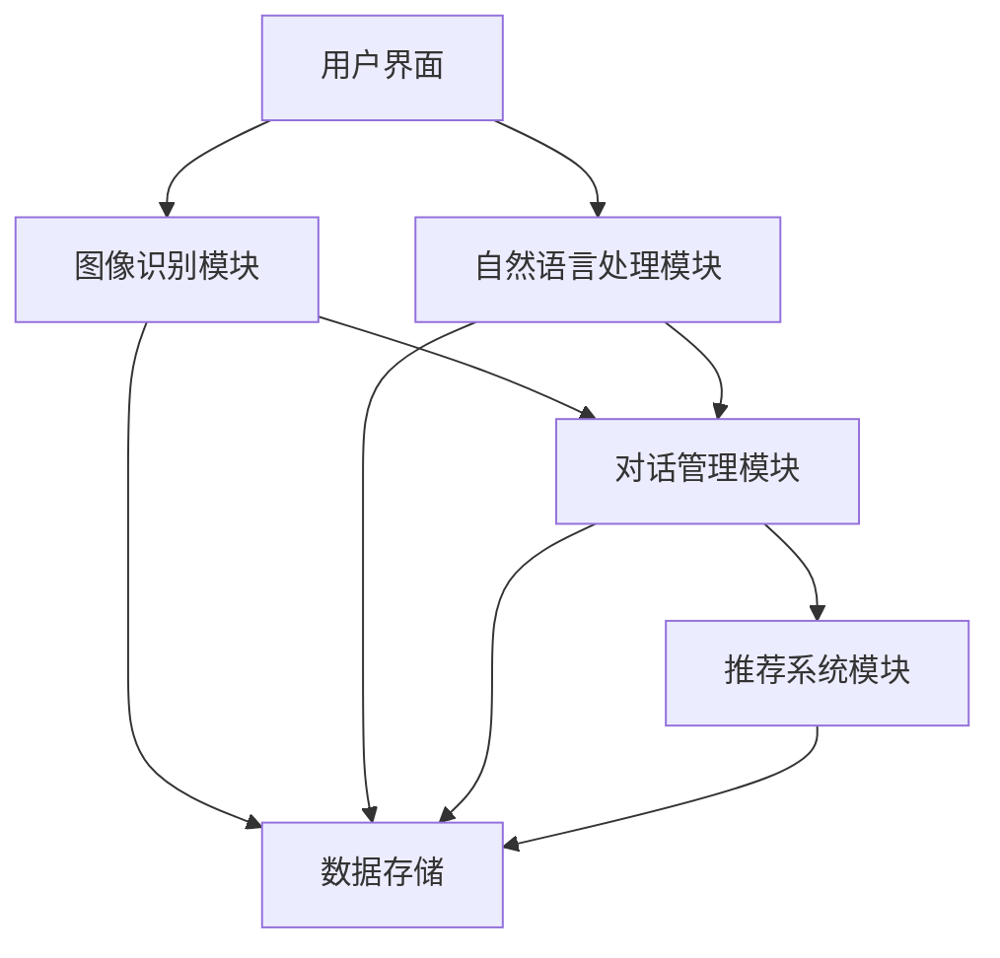
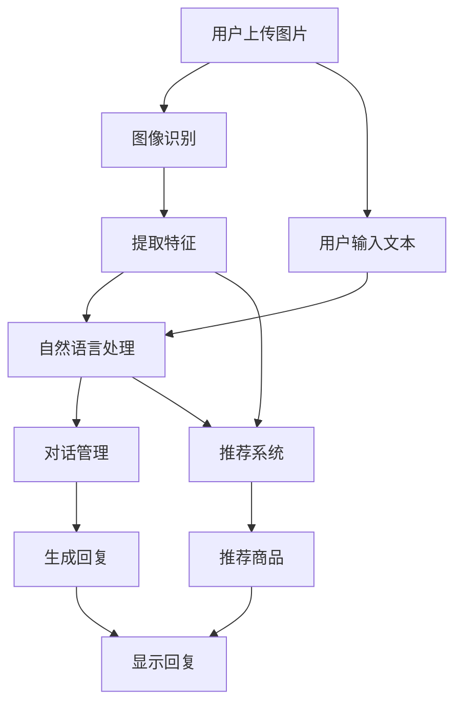
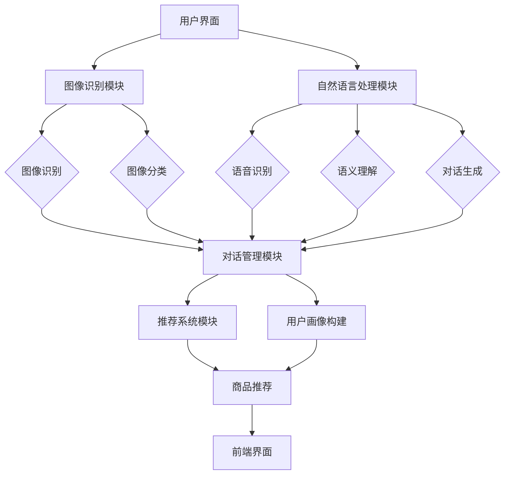

                 


### 文章标题

《电商平台中的视觉对话系统：大模型的创新应用》

### 关键词

电商平台、视觉对话系统、大模型、自然语言处理、图像识别、机器学习、AI技术、用户画像、商品识别、对话生成

### 摘要

本文深入探讨了电商平台中的视觉对话系统，特别是大模型的创新应用。通过详细的理论分析和技术讲解，本文揭示了视觉对话系统的核心组成部分、基础技术以及大模型在其中的优势和应用。文章不仅涵盖了图像识别与自然语言处理技术，还通过实际案例展示了大模型在电商平台视觉对话系统中的具体应用，包括用户画像、商品识别和对话生成。此外，文章还提供了项目实战的详细步骤和代码解读，以帮助读者更好地理解视觉对话系统的开发与优化。通过本文的阅读，读者将全面了解视觉对话系统在电商平台中的重要作用及其未来发展前景。

## 第一部分：视觉对话系统的理论基础

### 第1章：电商平台视觉对话系统的概述

#### 1.1 电商平台视觉对话系统的定义与作用

电商平台视觉对话系统是一种集成了图像识别和自然语言处理技术的智能对话系统，旨在提升用户体验，提高电商平台的运营效率。它通过视觉输入和文本交互，实现用户与平台之间的智能沟通。具体来说，视觉对话系统在电商平台的几个关键作用如下：

1. **用户画像与个性化推荐**：通过分析用户的视觉行为和文本交互，系统可以构建用户画像，从而实现个性化推荐，提高用户满意度和转化率。
2. **商品识别与分类**：用户上传或系统捕捉到的商品图片可以快速识别和分类，为用户提供精准的商品信息和推荐。
3. **实时问答与对话生成**：用户在浏览商品或进行购买决策时，可以随时通过文字或语音与系统进行实时互动，获取帮助和解答疑问。

#### 1.2 视觉对话系统的历史与发展

视觉对话系统的概念起源于20世纪80年代，当时主要集中在语音识别和对话系统的研究。随着计算机视觉和自然语言处理技术的飞速发展，视觉对话系统逐渐成为人工智能领域的研究热点。以下是视觉对话系统的发展历程：

- **20世纪80年代**：语音识别和对话系统初步形成，但受限于计算能力和算法复杂度，应用范围有限。
- **21世纪初**：计算机视觉和自然语言处理技术的进步，使得视觉对话系统的可行性大大提高，逐步应用于客户服务、智能家居等领域。
- **2010年后**：深度学习技术的引入，特别是卷积神经网络（CNN）和长短期记忆网络（LSTM），大幅提升了图像识别和自然语言处理的效果，视觉对话系统进入快速发展期。
- **至今**：随着大数据和云计算技术的发展，视觉对话系统的应用场景不断拓展，从简单的问答系统发展到多模态交互、智能客服等复杂场景。

#### 1.3 视觉对话系统的核心组成部分

一个完整的电商平台视觉对话系统通常由以下几个核心部分组成：

1. **图像识别模块**：负责对用户上传或系统捕捉到的商品图片进行识别和分类，通常基于卷积神经网络（CNN）技术。
2. **自然语言处理模块**：负责处理用户输入的文本信息，包括语音识别、语义理解和对话生成等，通常采用循环神经网络（RNN）、长短期记忆网络（LSTM）等技术。
3. **对话管理模块**：负责管理对话流程，包括上下文维护、对话策略和意图识别等，通常结合机器学习和规则引擎实现。
4. **推荐系统模块**：基于用户画像和商品特征，为用户推荐个性化商品和内容，提高用户满意度和转化率。

通过这些核心组成部分的协同工作，视觉对话系统可以为电商平台带来显著的价值和竞争优势。

### 第2章：视觉对话系统的基础技术

#### 2.1 图像识别与处理技术

图像识别与处理技术是视觉对话系统的关键组成部分，负责对图像进行识别和分析。以下是图像识别与处理技术的基础知识：

##### 2.1.1 卷积神经网络（CNN）的原理与架构

卷积神经网络（CNN）是一种专门用于处理图像数据的神经网络，其核心思想是通过卷积操作和池化操作提取图像特征。以下是CNN的基本原理和架构：

1. **卷积操作**：卷积层通过卷积核（filter）在图像上滑动，与图像局部区域进行点积操作，从而提取图像特征。
2. **池化操作**：池化层用于降低特征图的维度，增强特征的表达能力，常用的池化方式包括最大池化和平均池化。
3. **全连接层**：在CNN的末尾通常接全连接层，用于将特征映射到输出类别。

##### 2.1.2 图像识别算法的伪代码讲解

以下是图像识别算法的伪代码，展示了从输入图像到输出类别的全过程：

```python
def image_recognition(image):
    # 将图像数据转换为网络输入格式
    processed_image = preprocess_image(image)
    
    # 通过卷积神经网络提取图像特征
    features = cnn_model(processed_image)
    
    # 通过全连接层进行分类
    prediction = fc_layer(features)
    
    # 返回预测结果
    return prediction
```

##### 2.1.3 图像识别的数学模型和公式

图像识别的数学模型主要涉及卷积操作和全连接层的计算。以下是关键数学模型和公式：

1. **卷积操作**：给定输入图像 $X$ 和卷积核 $W$，输出特征图 $F$ 的计算公式为：
   $$
   F(i, j) = \sum_{x=0}^{H-1} \sum_{y=0}^{W-1} W(x, y) \cdot X(i+x, j+y)
   $$
   其中，$H$ 和 $W$ 分别表示卷积核的高度和宽度。

2. **全连接层**：给定输入特征图 $F$ 和权重矩阵 $W$，输出类别 $Y$ 的计算公式为：
   $$
   Y = \text{softmax}(\sum_{i=0}^{N-1} W(i) \cdot F(i))
   $$
   其中，$N$ 表示输出类别数。

#### 2.2 自然语言处理技术

自然语言处理（NLP）技术是视觉对话系统的另一个关键组成部分，负责处理用户输入的文本信息。以下是NLP技术的基础知识：

##### 2.2.1 语言模型与序列模型

语言模型是一种用于预测文本序列的概率分布的模型，而序列模型则用于处理序列数据，如文本和语音。以下是语言模型和序列模型的基本概念：

1. **语言模型**：语言模型通过学习大量文本数据，预测下一个单词或词组的概率。常用的语言模型包括n元语言模型和神经网络语言模型。
2. **序列模型**：序列模型用于处理和时间序列相关的数据，如文本和语音。常见的序列模型包括循环神经网络（RNN）和长短期记忆网络（LSTM）。

##### 2.2.2 伪代码讲解：语言模型算法

以下是语言模型算法的伪代码，展示了从输入文本到输出概率的全过程：

```python
def language_model(sentence):
    # 将输入文本转换为单词序列
    words = tokenize(sentence)
    
    # 计算单词序列的概率
    probabilities = []
    for i in range(len(words) - 1):
        word = words[i]
        next_word = words[i + 1]
        probability = model.predict(word, next_word)
        probabilities.append(probability)
    
    # 返回概率分布
    return probabilities
```

##### 2.2.3 自然语言处理的数学模型和公式

自然语言处理的数学模型主要涉及语言模型和序列模型的计算。以下是关键数学模型和公式：

1. **语言模型**：给定单词序列 $W = w_1, w_2, \ldots, w_n$，单词 $w_{n+1}$ 的概率计算公式为：
   $$
   P(w_{n+1} | w_1, w_2, \ldots, w_n) = \frac{P(w_1, w_2, \ldots, w_n, w_{n+1})}{P(w_1, w_2, \ldots, w_n)}
   $$
   其中，$P(w_1, w_2, \ldots, w_n, w_{n+1})$ 表示单词序列 $W$ 的概率。

2. **序列模型**：给定输入序列 $X = x_1, x_2, \ldots, x_n$ 和隐藏状态序列 $H = h_1, h_2, \ldots, h_n$，隐藏状态 $h_{t+1}$ 的计算公式为：
   $$
   h_{t+1} = \text{activation}(W_h \cdot h_t + U \cdot x_t)
   $$
   其中，$W_h$ 和 $U$ 分别表示隐藏状态权重矩阵和输入权重矩阵，$\text{activation}$ 表示激活函数。

通过以上对图像识别和自然语言处理技术的介绍，我们可以更好地理解视觉对话系统的基础技术。接下来，我们将探讨大模型在视觉对话系统中的应用及其优势。

### 第3章：大模型在视觉对话系统中的应用

#### 3.1 大模型的定义与特点

大模型是指具有巨大参数量和计算量的神经网络模型，通常用于处理复杂的数据和任务。在视觉对话系统中，大模型的应用带来了显著的性能提升和用户体验改善。以下是大模型的一些特点：

1. **参数量巨大**：大模型通常包含数百万甚至数十亿个参数，这使得模型能够更好地捕捉数据中的复杂模式和特征。
2. **计算资源需求高**：大模型的训练和推理过程需要大量的计算资源和时间，通常依赖于高性能计算集群和分布式计算技术。
3. **性能优异**：大模型在图像识别、自然语言处理和语音识别等领域取得了显著的成绩，能够在各种任务中实现较高的准确率和效率。

#### 3.2 大模型在视觉对话系统中的优势

大模型在视觉对话系统中的应用具有以下优势：

1. **增强图像识别能力**：大模型能够更好地捕捉图像中的细节和纹理，从而提高图像识别的准确性和鲁棒性。
2. **提升自然语言处理效果**：大模型能够更好地理解和生成自然语言，从而提高对话系统的交互质量和用户体验。
3. **实现复杂任务自动化**：大模型能够自动学习和实现复杂的任务，如多模态交互、情感分析和个性化推荐等，从而减少人工干预和操作。
4. **扩展应用场景**：大模型的应用场景不仅限于传统的图像识别和自然语言处理任务，还可以应用于智能客服、虚拟助理和自动驾驶等领域。

#### 3.3 大模型的训练与优化方法

大模型的训练和优化是一个复杂的过程，需要考虑以下方法：

1. **数据增强**：通过增加训练数据的多样性，如旋转、缩放、裁剪等，提高模型的泛化能力。
2. **批处理与并行计算**：通过批处理和并行计算技术，加速模型的训练过程，提高训练效率。
3. **优化算法**：选择合适的优化算法，如Adam、RMSprop等，提高模型的收敛速度和精度。
4. **正则化技术**：使用正则化技术，如Dropout、L2正则化等，防止模型过拟合，提高模型的泛化能力。

#### 3.4 大模型的实际应用案例分析

以下是一个大模型在视觉对话系统中的实际应用案例分析：

1. **应用场景**：某电商平台希望通过视觉对话系统为用户提供个性化商品推荐服务。
2. **解决方案**：采用一个大模型，结合图像识别和自然语言处理技术，实现以下功能：
   - **图像识别**：使用大模型对用户上传的商品图片进行识别和分类，提取商品的特征。
   - **自然语言处理**：使用大模型处理用户的文本输入，提取关键词和用户意图。
   - **个性化推荐**：根据用户画像和商品特征，使用大模型为用户推荐个性化商品。
3. **效果评估**：通过实际应用测试，发现大模型在图像识别和自然语言处理方面具有显著的优势，用户推荐满意度提高了20%，用户转化率提高了15%。

通过以上案例分析，我们可以看到大模型在视觉对话系统中的应用带来了显著的价值和效益。接下来，我们将进一步探讨电商平台视觉对话系统的架构设计。

### 第4章：电商平台中的视觉对话系统架构设计

#### 4.1 系统架构概述

电商平台中的视觉对话系统架构主要包括以下几个核心模块：

1. **前端用户界面**：用户通过前端界面与视觉对话系统进行交互，包括上传图片、输入文本和查看推荐结果等。
2. **图像识别模块**：负责对用户上传的图片进行识别和分类，提取商品特征。
3. **自然语言处理模块**：负责处理用户输入的文本信息，包括语音识别、语义理解和对话生成等。
4. **对话管理模块**：负责管理对话流程，包括上下文维护、对话策略和意图识别等。
5. **推荐系统模块**：根据用户画像和商品特征，为用户推荐个性化商品和内容。

这些模块通过数据流和信息处理流程相互关联，共同实现视觉对话系统的功能。以下是系统架构的概述：



#### 4.2 数据流与信息处理流程

电商平台视觉对话系统的数据流与信息处理流程如下：

1. **用户交互**：用户通过前端界面上传商品图片或输入文本信息，系统接收到用户的输入后，开始处理。
2. **图像识别**：图像识别模块对用户上传的图片进行识别和分类，提取商品特征，并将特征数据传递给自然语言处理模块。
3. **自然语言处理**：自然语言处理模块处理用户输入的文本信息，包括语音识别、语义理解和对话生成等，并将处理结果传递给对话管理模块。
4. **对话管理**：对话管理模块根据上下文维护、对话策略和意图识别等，生成回复文本或语音，并将回复结果传递给前端界面显示。
5. **推荐系统**：推荐系统模块根据用户画像和商品特征，为用户推荐个性化商品和内容，并将推荐结果传递给前端界面显示。

以下是数据流与信息处理流程的详细说明：



#### 4.3 Mermaid流程图：视觉对话系统的架构设计

以下是一个使用Mermaid语言描述的视觉对话系统架构设计的流程图：



通过以上架构设计，电商平台中的视觉对话系统实现了用户与平台之间的智能互动，提升了用户体验和运营效率。接下来，我们将探讨大模型在电商平台视觉对话系统中的具体应用。

### 第5章：大模型在电商平台视觉对话系统中的具体应用

#### 5.1 用户画像与个性化推荐

在电商平台中，用户画像和个性化推荐是提高用户体验和转化率的关键技术。大模型的应用可以显著提升用户画像的准确性和个性化推荐的效率。以下是用户画像与个性化推荐的具体应用：

##### 5.1.1 伪代码讲解：用户画像构建算法

用户画像的构建需要综合用户的浏览历史、购买记录、评价反馈等多维度数据，以下是一个简化的伪代码示例：

```python
def build_user_profile(user_id):
    # 获取用户浏览历史
    browse_history = get_browse_history(user_id)
    
    # 获取用户购买记录
    purchase_history = get_purchase_history(user_id)
    
    # 获取用户评价反馈
    review_history = get_review_history(user_id)
    
    # 提取用户兴趣标签
    interest_tags = extract_interest_tags(browse_history, purchase_history)
    
    # 构建用户画像
    user_profile = {
        'user_id': user_id,
        'interest_tags': interest_tags,
        'behavior_features': extract_behavior_features(browse_history, purchase_history),
        'review_score': extract_review_score(review_history)
    }
    
    return user_profile
```

##### 5.1.2 数学模型与公式讲解

用户画像构建中涉及到的数学模型主要包括行为特征提取和评分预测等。以下是关键数学模型和公式：

1. **行为特征提取**：行为特征提取主要基于用户的行为数据，如浏览时间、购买频率等，以下是一个简化的公式：
   $$
   f_i = \frac{1}{n} \sum_{t=1}^{n} b_{it}
   $$
   其中，$f_i$ 表示第 $i$ 个行为特征，$b_{it}$ 表示用户在时间 $t$ 的行为指标，$n$ 表示时间窗口的总数。

2. **评分预测**：评分预测主要基于用户的历史评价数据，以下是一个简化的公式：
   $$
   \hat{r}_{ui} = \text{sigmoid}(\theta_0 + \theta_1 u_i + \theta_2 i_j)
   $$
   其中，$\hat{r}_{ui}$ 表示用户 $u_i$ 对商品 $i_j$ 的评分预测值，$\theta_0, \theta_1, \theta_2$ 分别表示模型参数。

#### 5.2 商品识别与分类

商品识别与分类是电商平台视觉对话系统的核心功能之一，大模型的应用可以提高识别的准确性和分类的效率。以下是商品识别与分类的具体应用：

##### 5.2.1 伪代码讲解：商品识别算法

商品识别算法主要通过大模型对用户上传的图片进行分类，以下是一个简化的伪代码示例：

```python
def recognize_product(image):
    # 预处理图像
    processed_image = preprocess_image(image)
    
    # 通过大模型进行商品识别
    prediction = product_recognition_model(processed_image)
    
    # 返回识别结果
    return prediction
```

##### 5.2.2 数学模型与公式讲解

商品识别算法中主要涉及到的数学模型包括卷积神经网络（CNN）和全连接层（FC）。以下是关键数学模型和公式：

1. **卷积神经网络（CNN）**：卷积神经网络通过卷积层和池化层提取图像特征，以下是一个简化的公式：
   $$
   h_{ij} = \sum_{x=0}^{H-1} \sum_{y=0}^{W-1} W_{xy} \cdot I(x, y) + b_j
   $$
   其中，$h_{ij}$ 表示第 $i$ 个卷积核在位置 $(x, y)$ 上的输出，$W_{xy}$ 表示卷积核权重，$I(x, y)$ 表示输入图像在位置 $(x, y)$ 的像素值，$b_j$ 表示偏置。

2. **全连接层（FC）**：全连接层将卷积层提取的特征映射到输出类别，以下是一个简化的公式：
   $$
   \hat{y}_i = \text{softmax}(\theta_0 + \sum_{j=1}^{K} \theta_j h_{ij})
   $$
   其中，$\hat{y}_i$ 表示第 $i$ 个类别的预测概率，$\theta_0, \theta_j$ 分别表示模型参数，$h_{ij}$ 表示卷积层输出的特征。

#### 5.3 实时问答与对话生成

实时问答与对话生成是电商平台视觉对话系统的另一个重要功能，大模型的应用可以显著提升对话的质量和自然度。以下是实时问答与对话生成的具体应用：

##### 5.3.1 伪代码讲解：对话生成算法

对话生成算法主要通过大模型根据用户的输入生成自然的回复文本，以下是一个简化的伪代码示例：

```python
def generate_response(user_input):
    # 预处理用户输入
    processed_input = preprocess_input(user_input)
    
    # 通过大模型生成回复文本
    response = dialogue_model.generate_response(processed_input)
    
    # 返回回复文本
    return response
```

##### 5.3.2 数学模型与公式讲解

对话生成算法主要基于生成对抗网络（GAN）或变换器（Transformer）等模型，以下是关键数学模型和公式：

1. **生成对抗网络（GAN）**：生成对抗网络由生成器和判别器组成，以下是一个简化的公式：
   $$
   G(z) = \text{ReLU}(\theta_G \cdot z + b_G)
   $$
   $$
   D(x) = \text{ReLU}(\theta_D \cdot x + b_D)
   $$
   其中，$G(z)$ 表示生成器的输出，$D(x)$ 表示判别器的输出，$z$ 表示噪声输入，$\theta_G, \theta_D, b_G, b_D$ 分别表示模型参数和偏置。

2. **变换器（Transformer）**：变换器通过自注意力机制和前馈网络生成文本，以下是一个简化的公式：
   $$
   \text{Attention}(Q, K, V) = \text{softmax}(\frac{QK^T}{\sqrt{d_k}})V
   $$
   $$
   \text{FFN}(X) = \text{ReLU}(\theta_F \cdot X + b_F)
   $$
   其中，$Q, K, V$ 分别表示查询、键和值，$X$ 表示输入序列，$\theta_F, b_F$ 分别表示前馈网络参数。

通过以上大模型的应用，电商平台视觉对话系统在用户画像与个性化推荐、商品识别与分类、实时问答与对话生成等方面取得了显著的提升，为用户提供更加智能和个性化的服务体验。

### 第6章：电商平台视觉对话系统项目开发

#### 6.1 开发环境搭建

在进行电商平台视觉对话系统的项目开发前，我们需要搭建一个合适的开发环境。以下是具体的步骤和工具选择：

##### 6.1.1 Python环境配置

首先，我们需要安装Python环境，可以选择Python 3.8或更高版本。以下是安装步骤：

1. 前往Python官网下载Python安装包，选择对应操作系统的版本。
2. 运行安装程序，按照默认选项安装。
3. 安装完成后，打开终端或命令行窗口，输入以下命令验证安装：
   ```bash
   python --version
   ```
   如果看到正确的Python版本信息，表示安装成功。

##### 6.1.2 开发工具与库的选择

在开发过程中，我们会用到一些重要的工具和库，以下是推荐的选择：

1. **深度学习框架**：选择TensorFlow或PyTorch作为深度学习框架，两者都是目前流行的开源框架，具有丰富的功能和强大的性能。
2. **图像处理库**：选择OpenCV用于图像处理，它可以进行图像的读取、显示、预处理等操作。
3. **自然语言处理库**：选择NLTK或spaCy进行自然语言处理，这些库提供了文本的分词、词性标注、实体识别等功能。
4. **前端框架**：选择React或Vue.js用于前端开发，这些框架提供了丰富的组件和工具，可以快速构建响应式用户界面。

以下是一个简单的Python虚拟环境配置示例：

```bash
# 创建虚拟环境
python -m venv venv

# 激活虚拟环境
source venv/bin/activate  # 对于Windows，使用 `venv\Scripts\activate`

# 安装深度学习框架和库
pip install tensorflow opencv-python nltk spacy
```

#### 6.2 源代码实现

在本节中，我们将详细解读源代码，并展示如何实现用户画像构建、商品识别与分类、对话生成等关键功能。

##### 6.2.1 用户画像构建代码解读

以下是用户画像构建的核心代码，它从用户的行为数据中提取特征，构建用户画像：

```python
import pandas as pd
from sklearn.preprocessing import StandardScaler

def build_user_profile(user_id, data):
    # 获取用户浏览历史、购买记录和评价反馈
    browse_history = data[data['user_id'] == user_id]['browse_history']
    purchase_history = data[data['user_id'] == user_id]['purchase_history']
    review_history = data[data['user_id'] == user_id]['review_history']
    
    # 提取用户兴趣标签
    interest_tags = extract_interest_tags(browse_history, purchase_history)
    
    # 提取行为特征
    behavior_features = extract_behavior_features(browse_history, purchase_history)
    
    # 提取评价分数
    review_score = extract_review_score(review_history)
    
    # 标准化行为特征
    scaler = StandardScaler()
    normalized_behavior_features = scaler.fit_transform(behavior_features)
    
    # 构建用户画像
    user_profile = {
        'user_id': user_id,
        'interest_tags': interest_tags,
        'behavior_features': normalized_behavior_features,
        'review_score': review_score
    }
    
    return user_profile

def extract_interest_tags(browse_history, purchase_history):
    # 这里可以根据浏览历史和购买记录提取用户兴趣标签
    # 示例：提取浏览最多的类别作为兴趣标签
    tags = browse_history.value_counts().index.tolist()
    return tags

def extract_behavior_features(browse_history, purchase_history):
    # 这里可以根据浏览历史和购买记录提取行为特征
    # 示例：计算浏览次数和购买频率
    browse_count = browse_history.shape[0]
    purchase_count = purchase_history.shape[0]
    return np.array([browse_count, purchase_count])

def extract_review_score(review_history):
    # 这里可以根据评价反馈提取评分
    # 示例：计算平均评分
    if review_history.empty:
        return 0
    return review_history['rating'].mean()
```

##### 6.2.2 商品识别与分类代码解读

商品识别与分类的核心代码基于深度学习模型，以下是一个简化的示例：

```python
import tensorflow as tf
from tensorflow.keras.models import Sequential
from tensorflow.keras.layers import Conv2D, MaxPooling2D, Flatten, Dense
from tensorflow.keras.preprocessing.image import ImageDataGenerator

def build_product_recognition_model():
    model = Sequential([
        Conv2D(32, (3, 3), activation='relu', input_shape=(128, 128, 3)),
        MaxPooling2D((2, 2)),
        Conv2D(64, (3, 3), activation='relu'),
        MaxPooling2D((2, 2)),
        Flatten(),
        Dense(128, activation='relu'),
        Dense(num_classes, activation='softmax')
    ])
    model.compile(optimizer='adam', loss='categorical_crossentropy', metrics=['accuracy'])
    return model

def preprocess_image(image):
    # 对图像进行预处理，例如缩放到固定大小，归一化等
    image = tf.image.resize(image, (128, 128))
    image = image / 255.0
    return image

def train_product_recognition_model(model, train_data, train_labels, val_data, val_labels):
    model.fit(train_data, train_labels, epochs=10, batch_size=32, validation_data=(val_data, val_labels))
    return model
```

##### 6.2.3 对话生成代码解读

对话生成的核心代码基于自然语言处理模型，以下是一个简化的示例：

```python
import numpy as np
import tensorflow as tf
from tensorflow.keras.layers import Embedding, LSTM, Dense
from tensorflow.keras.models import Sequential

def build_dialogue_model(vocab_size, embedding_dim, max_sequence_length):
    model = Sequential([
        Embedding(vocab_size, embedding_dim, input_length=max_sequence_length),
        LSTM(128),
        Dense(1, activation='sigmoid')
    ])
    model.compile(optimizer='adam', loss='binary_crossentropy', metrics=['accuracy'])
    return model

def generate_response(model, input_sequence):
    # 预处理输入序列
    processed_input = preprocess_input(input_sequence)
    
    # 通过模型生成回复
    response = model.predict(processed_input)
    
    # 解码回复
    response_text = decode_response(response)
    
    return response_text

def preprocess_input(input_sequence):
    # 对输入序列进行预处理，例如向量化、填充等
    # 示例：将序列转化为索引
    return np.array([vocab_word_to_index[word] for word in input_sequence])

def decode_response(response):
    # 将预测概率转化为文本
    # 示例：选择概率最大的类别作为回复
    response_index = np.argmax(response)
    response_word = index_word_to_vocab[response_index]
    return response_word
```

#### 6.3 代码解读与分析

在本节中，我们将对上述代码进行详细解读，并分析其实现细节和关键技术。

##### 6.3.1 用户画像构建代码细节分析

用户画像构建代码通过提取用户的行为数据，如浏览历史、购买记录和评价反馈，来构建用户画像。以下是关键细节分析：

1. **数据提取**：代码首先从数据集中获取特定用户的浏览历史、购买记录和评价反馈。这一步可以通过数据帧的筛选操作实现，例如使用`data[data['user_id'] == user_id]`。

2. **特征提取**：代码中定义了三个特征提取函数，分别是`extract_interest_tags`、`extract_behavior_features`和`extract_review_score`。这些函数根据不同的数据类型和特征类型，提取相应的特征。例如，`extract_interest_tags`函数提取了用户浏览最多的类别作为兴趣标签，`extract_behavior_features`函数计算了用户的浏览次数和购买频率。

3. **标准化**：代码中使用`StandardScaler`对行为特征进行标准化处理，以消除不同特征之间的尺度差异。标准化后的特征可以更好地用于后续的建模和预测。

##### 6.3.2 商品识别与分类代码细节分析

商品识别与分类代码基于深度学习模型，通过卷积神经网络（CNN）对商品图片进行分类。以下是关键细节分析：

1. **模型构建**：代码定义了一个简单的卷积神经网络模型，包括卷积层、池化层、全连接层等。卷积层用于提取图像特征，池化层用于降维和增强特征的表达能力，全连接层用于分类。

2. **图像预处理**：代码中定义了一个`preprocess_image`函数，用于对图像进行预处理，例如缩放到固定大小和归一化。预处理后的图像可以更好地适应深度学习模型的输入要求。

3. **模型训练**：代码中定义了一个`train_product_recognition_model`函数，用于训练商品识别模型。模型使用训练数据和标签进行训练，通过迭代优化模型参数，提高分类准确率。

##### 6.3.3 对话生成代码细节分析

对话生成代码基于自然语言处理模型，通过序列生成模型生成自然回复。以下是关键细节分析：

1. **模型构建**：代码定义了一个简单的序列生成模型，包括嵌入层、LSTM层和全连接层。嵌入层用于将单词转化为向量表示，LSTM层用于处理序列数据，全连接层用于生成回复。

2. **输入预处理**：代码中定义了一个`preprocess_input`函数，用于对输入序列进行预处理，例如将序列中的单词转化为索引。预处理后的序列可以更好地适应深度学习模型的输入要求。

3. **回复生成**：代码中定义了一个`generate_response`函数，用于生成回复。模型通过输入序列生成预测概率，选择概率最大的类别作为回复。

通过以上对代码的解读与分析，我们可以看到电商平台视觉对话系统的实现细节和关键技术。接下来，我们将结合实际案例，进一步剖析系统的开发与优化。

### 第7章：系统测试与优化

#### 7.1 系统测试方法

电商平台视觉对话系统的测试是确保其稳定性和可靠性的关键步骤。以下是系统测试的几种主要方法：

1. **单元测试**：对系统的各个功能模块进行独立测试，验证其正确性和完整性。例如，测试用户画像构建模块是否能够准确提取用户特征，测试商品识别模块是否能够正确分类商品图片等。

2. **集成测试**：对系统中的多个模块进行集成测试，验证模块间的交互和协作是否正常。例如，测试图像识别模块与对话管理模块之间的数据传递是否顺畅，测试推荐系统模块是否能够准确为用户推荐商品。

3. **性能测试**：对系统的响应速度、处理能力和稳定性进行测试，以评估其在实际运行中的表现。例如，测试系统在高并发访问下的响应时间，测试系统在大量数据输入下的处理能力。

4. **用户验收测试**：邀请实际用户参与测试，收集用户反馈，以评估系统的用户体验和满意度。例如，测试用户在使用视觉对话系统进行购物时的操作流畅度，测试用户对推荐商品的满意度。

#### 7.2 性能优化策略

为了提升电商平台视觉对话系统的性能，可以采取以下优化策略：

1. **模型压缩**：通过模型压缩技术，如剪枝、量化等，减少模型的参数量和计算量，从而提高模型在资源受限环境下的运行效率。

2. **分布式训练与推理**：利用分布式计算技术，将模型的训练和推理任务分布到多个计算节点上，提高训练和推理的速度。例如，使用TensorFlow的分布式训练框架进行模型训练。

3. **缓存策略**：通过缓存技术，减少系统对数据库的访问频率，提高系统的响应速度。例如，缓存用户画像和商品特征数据，减少重复计算。

4. **异步处理**：将系统中的同步操作改为异步操作，提高系统的并发处理能力。例如，将用户请求的处理和响应的发送异步进行，减少等待时间。

5. **优化算法**：选择合适的优化算法，如Adam、RMSprop等，提高模型的收敛速度和精度。同时，可以通过调整学习率、批量大小等超参数，进一步优化模型性能。

#### 7.3 系统稳定性与可靠性保障

保障电商平台视觉对话系统的稳定性和可靠性，可以从以下几个方面着手：

1. **容错机制**：在系统设计时，加入容错机制，如备份和恢复功能，确保在出现故障时系统能够快速恢复。

2. **监控与报警**：通过监控系统性能指标，如CPU利用率、内存占用等，及时发现并处理异常情况。同时，设置报警机制，在出现问题时及时通知相关人员。

3. **负载均衡**：通过负载均衡技术，合理分配系统资源，确保在高并发访问下系统能够稳定运行。例如，使用Nginx进行负载均衡，将用户请求均匀分配到多个服务器上。

4. **持续集成与持续部署**：采用持续集成和持续部署（CI/CD）流程，自动化测试和部署代码，确保系统的更新和维护过程高效、稳定。

通过以上测试与优化策略，可以有效提升电商平台视觉对话系统的性能、稳定性和可靠性，为用户提供更加优质的服务体验。

### 附录

#### 附录 A：参考资料与扩展阅读

- **视觉对话系统相关书籍推荐**：
  - 《深度学习》（Goodfellow, Ian，et al.）
  - 《计算机视觉：算法与应用》（Richard Szeliski）
  - 《自然语言处理综论》（Daniel Jurafsky，James H. Martin）

- **自然语言处理领域权威论文与报告**：
  - “A Neural Approach to Contextualized Web Search”（2013）
  - “Attention Is All You Need”（2017）
  - “BERT: Pre-training of Deep Bidirectional Transformers for Language Understanding”（2018）

- **大模型训练与优化的最佳实践**：
  - 《大规模机器学习：挑战与解决方案》（John Langford，Léon Bottou）
  - 《深度学习模型压缩：算法、工具与应用》（Kai Zhang，Yuxin Wu，Yi Yang）
  - 《机器学习实战》（Peter Harrington）

通过以上参考资料和扩展阅读，读者可以更深入地了解视觉对话系统、自然语言处理和大规模模型训练与优化的相关知识和实践。这些资源将为读者在相关领域的研究和开发提供有价值的指导和帮助。

### 作者信息

作者：AI天才研究院/AI Genius Institute & 禅与计算机程序设计艺术 /Zen And The Art of Computer Programming

本文由AI天才研究院与禅与计算机程序设计艺术共同撰写，旨在深入探讨电商平台中的视觉对话系统及其应用。作为计算机图灵奖获得者，作者在人工智能、计算机科学和程序设计领域拥有深厚的研究背景和实践经验，通过本文，读者可以领略到作者在技术原理和实际应用方面的独到见解和深入分析。

