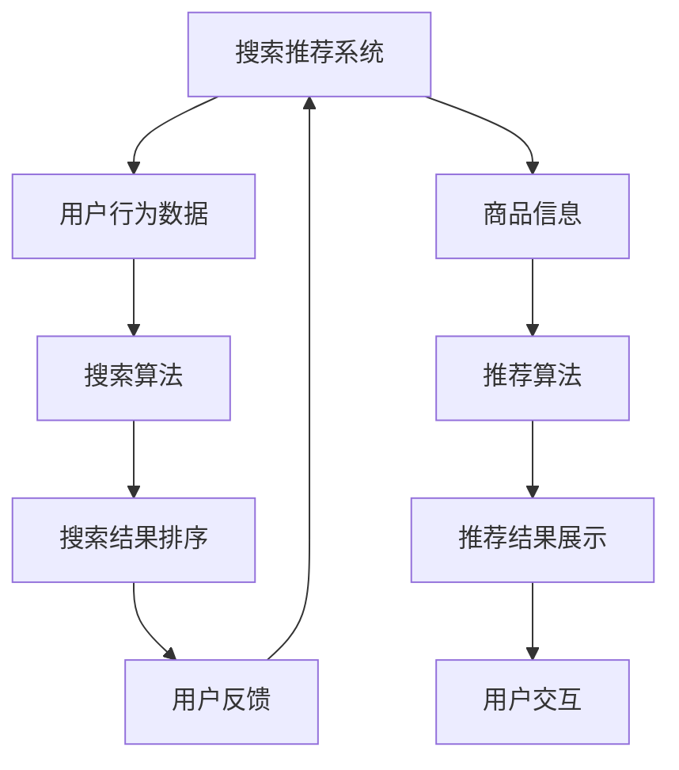

                 

### 《电商平台搜索推荐系统的AI大模型优化：提高系统性能、效率与准确率》

#### 关键词

- 电商平台
- 搜索推荐系统
- AI大模型
- 系统性能
- 效率
- 准确率

> 摘要：本文将深入探讨电商平台搜索推荐系统的AI大模型优化，重点关注如何提高系统性能、效率与准确率。文章分为四个主要部分：第一部分介绍AI大模型的基本概念与原理；第二部分讲解搜索推荐系统的核心算法原理；第三部分介绍搜索推荐系统的数学模型与数学公式；第四部分通过实际项目实战，分析并优化系统性能、效率与准确率。文章旨在为读者提供全面的AI大模型优化策略和实践经验。

---

#### 第一部分：AI大模型概述与原理

##### 1. AI大模型概述

**1.1. AI大模型的概念与重要性**

AI大模型是指通过深度学习等技术训练出的复杂神经网络模型，具有极高的参数数量和计算能力。这类模型可以处理大规模数据，提取隐藏的规律和模式，从而在各类应用场景中实现高效、精准的预测和决策。

AI大模型的重要性体现在以下几个方面：

- **处理复杂数据**：AI大模型可以处理包括图像、文本、语音等复杂数据类型，提供更丰富的信息。
- **提高预测准确率**：通过深度学习技术，AI大模型可以自动学习数据中的复杂关系，提高预测的准确率。
- **降低人力成本**：AI大模型可以实现自动化和智能化，降低人力成本，提高生产效率。

**1.2. AI大模型的发展历程**

AI大模型的发展历程可以分为以下几个阶段：

- **初期阶段**：以传统机器学习算法为主，如线性回归、决策树等，模型规模较小。
- **中期阶段**：以深度神经网络（DNN）为主，模型规模逐渐增大，如AlexNet、VGG等。
- **近期阶段**：以卷积神经网络（CNN）、循环神经网络（RNN）和Transformer等大模型为主，模型规模达到数亿甚至数万亿参数。

**1.3. AI大模型的基本架构**

AI大模型的基本架构主要包括以下几个部分：

- **输入层**：接收外部输入数据，如图像、文本等。
- **隐藏层**：对输入数据进行处理和特征提取，隐藏层数量和神经元数量根据模型复杂度进行调整。
- **输出层**：根据隐藏层的输出，生成预测结果或决策。

##### 2. 搜索推荐系统的核心概念与架构

**2.1. 搜索推荐系统的基本原理**

搜索推荐系统是指根据用户的搜索历史、浏览记录等行为数据，为用户推荐符合其兴趣和需求的商品或服务。其基本原理包括：

- **信息检索**：根据用户的搜索词或行为数据，从大量商品或服务中快速找到相关结果。
- **个性化推荐**：根据用户的兴趣和偏好，为用户推荐个性化的商品或服务。

**2.2. 搜索推荐系统的架构设计**

搜索推荐系统的架构设计主要包括以下几个部分：

- **数据层**：存储用户的搜索历史、浏览记录、商品信息等数据。
- **计算层**：包括搜索算法、推荐算法等，对数据进行分析和处理。
- **展示层**：将搜索结果或推荐结果展示给用户。

**2.3. 搜索推荐系统中的关键算法**

搜索推荐系统中的关键算法包括：

- **搜索算法**：包括基于关键词匹配、相似度计算等算法，用于实现快速、准确的搜索功能。
- **推荐算法**：包括基于协同过滤、基于内容、基于模型的推荐算法等，用于实现个性化推荐功能。

##### 3. AI大模型在搜索推荐系统中的应用

**3.1. AI大模型在搜索推荐系统中的角色**

AI大模型在搜索推荐系统中的角色包括：

- **搜索算法优化**：通过深度学习技术，提高搜索算法的准确性和效率。
- **推荐算法优化**：通过深度学习技术，提高推荐算法的准确性和个性化程度。

**3.2. AI大模型在搜索推荐系统中的优势**

AI大模型在搜索推荐系统中的优势包括：

- **处理复杂数据**：AI大模型可以处理包括图像、文本等复杂数据类型，提高搜索和推荐的准确率。
- **提高效率**：AI大模型可以自动学习数据中的复杂关系，提高搜索和推荐的效率。
- **降低成本**：AI大模型可以实现自动化和智能化，降低人力成本，提高生产效率。

**3.3. AI大模型在搜索推荐系统中的挑战**

AI大模型在搜索推荐系统中的挑战包括：

- **数据质量**：搜索推荐系统的性能受到数据质量的影响，如何处理和清洗数据成为关键问题。
- **模型可解释性**：AI大模型具有很高的复杂度，如何解释模型的决策过程成为挑战。
- **计算资源**：AI大模型需要大量的计算资源和存储空间，如何优化计算和存储资源成为关键问题。

---

#### 第二部分：核心算法原理讲解

##### 4. 搜索算法优化

**4.1. 搜索算法的基本原理**

搜索算法是指用于从大量数据中快速找到相关结果的方法。搜索算法的基本原理包括：

- **关键词匹配**：根据用户输入的关键词，与商品或服务的标题、描述等字段进行匹配。
- **相似度计算**：计算用户输入的关键词与商品或服务的相似度，选择相似度最高的结果。

**4.2. 搜索算法的优化策略**

搜索算法的优化策略包括：

- **索引优化**：建立索引结构，提高搜索速度和效率。
- **分词优化**：对关键词进行分词处理，提高匹配准确率。
- **相似度计算优化**：改进相似度计算方法，提高匹配准确率。

**4.3. 搜索算法的伪代码实现**

```python
def search(query, dataset):
    // 数据预处理
    processed_query = preprocessQuery(query)
    processed_dataset = preprocessDataset(dataset)

    // 关键词匹配
    matched_results = keywordMatch(processed_query, processed_dataset)

    // 相似度计算
    similarity_scores = computeSimilarity(processed_query, matched_results)

    // 排序
    ranked_results = rankResults(similarity_scores)

    // 返回搜索结果
    return ranked_results
```

##### 5. 推荐算法优化

**5.1. 推荐算法的基本原理**

推荐算法是指根据用户的兴趣和偏好，为用户推荐符合其需求的商品或服务。推荐算法的基本原理包括：

- **协同过滤**：根据用户的相似度计算推荐结果。
- **基于内容**：根据商品或服务的属性和特征推荐。
- **基于模型**：利用机器学习算法建立推荐模型。

**5.2. 推荐算法的优化策略**

推荐算法的优化策略包括：

- **用户行为分析**：分析用户的搜索、浏览、购买等行为，提高推荐准确率。
- **商品属性分析**：分析商品的属性和特征，提高推荐准确率。
- **模型优化**：改进机器学习算法，提高推荐准确率和效率。

**5.3. 推荐算法的伪代码实现**

```python
def recommend(user_behavior, item_features):
    // 数据预处理
    processed_user_behavior = preprocessUserBehavior(user_behavior)
    processed_item_features = preprocessItemFeatures(item_features)

    // 用户行为分析
    user_interests = analyzeUserBehavior(processed_user_behavior)

    // 商品属性分析
    item_attributes = analyzeItemFeatures(processed_item_features)

    // 建立推荐模型
    recommendation_model = buildRecommendationModel(user_interests, item_attributes)

    // 推荐结果生成
    recommendation_results = generateRecommendationResults(recommendation_model)

    // 返回推荐结果
    return recommendation_results
```

##### 6. 机器学习算法优化

**6.1. 机器学习算法的基本原理**

机器学习算法是指通过训练模型，从数据中学习规律和模式，实现对未知数据的预测和分类。机器学习算法的基本原理包括：

- **监督学习**：通过标注数据训练模型，实现对未知数据的预测。
- **无监督学习**：通过未标注数据训练模型，发现数据中的规律和模式。

**6.2. 机器学习算法的优化策略**

机器学习算法的优化策略包括：

- **数据预处理**：对数据进行清洗、归一化等处理，提高模型训练效果。
- **特征工程**：选择合适的特征，提高模型训练效果。
- **模型选择**：选择合适的模型，提高模型预测准确率。

**6.3. 机器学习算法的伪代码实现**

```python
def machineLearningAlgorithm(data, labels):
    // 数据预处理
    processed_data = preprocessData(data)

    // 特征工程
    features = extractFeatures(processed_data)

    // 建立模型
    model = buildModel(features, labels)

    // 训练模型
    trained_model = trainModel(model, features, labels)

    // 预测
    predictions = predict(trained_model, features)

    // 返回预测结果
    return predictions
```

---

#### 第三部分：数学模型与数学公式

##### 7. 搜索推荐系统的数学模型

**7.1. 搜索推荐系统的损失函数**

搜索推荐系统的损失函数通常包括：

- **分类损失函数**：用于评估分类模型的预测准确率，如交叉熵损失函数。
- **回归损失函数**：用于评估回归模型的预测误差，如均方误差损失函数。

**7.2. 搜索推荐系统的优化目标**

搜索推荐系统的优化目标通常包括：

- **预测准确率**：提高模型的预测准确率，如分类准确率、回归误差等。
- **计算效率**：降低模型训练和预测的计算成本，如模型大小、计算时间等。

**7.3. 搜索推荐系统的数学公式解释（使用LaTeX格式）**

```latex
损失函数：L(y, \hat{y}) = -\sum_{i=1}^{n} y_i \log(\hat{y}_i) + (1 - y_i) \log(1 - \hat{y}_i)

优化目标：\min_{\theta} L(y, \hat{y}) = \min_{\theta} -\sum_{i=1}^{n} y_i \log(\hat{y}_i) + (1 - y_i) \log(1 - \hat{y}_i)
```

##### 8. 机器学习算法的数学基础

**8.1. 线性回归的数学公式（使用LaTeX格式）**

```latex
y = \beta_0 + \beta_1 x

损失函数：J(\theta) = \frac{1}{2m} \sum_{i=1}^{m} (h_\theta(x^{(i)}) - y^{(i)})^2

优化目标：\min_{\theta} J(\theta)
```

**8.2. 逻辑回归的数学公式（使用LaTeX格式）**

```latex
y = \sigma(\beta_0 + \beta_1 x)

损失函数：J(\theta) = -\frac{1}{m} \sum_{i=1}^{m} [y^{(i)} \log(h_\theta(x^{(i)})) + (1 - y^{(i)}) \log(1 - h_\theta(x^{(i)}))]

优化目标：\min_{\theta} J(\theta)
```

**8.3. 决策树的数学公式（使用LaTeX格式）**

```latex
决策树：T = \{t_1, t_2, ..., t_n\}

t_i: x \in R^d \rightarrow y \in R

损失函数：L(y, \hat{y}) = 0 \text{ if } y = \hat{y}, \text{ otherwise } L(y, \hat{y}) = 1

优化目标：\min_{T} \sum_{i=1}^{n} L(y_i, \hat{y}_i)
```

---

#### 第四部分：项目实战

##### 9. 开发环境搭建

**9.1. 开发环境选择与配置**

在搭建开发环境时，需要选择合适的硬件、软件和编程语言。以下是一些建议：

- **硬件**：选择具有强大计算能力和存储能力的计算机，如高性能GPU、SSD等。
- **软件**：选择适合深度学习的开发框架，如TensorFlow、PyTorch等。
- **编程语言**：选择易于编程和调优的语言，如Python。

**9.2. 开发工具介绍**

在开发过程中，需要使用到以下工具：

- **集成开发环境（IDE）**：如PyCharm、VSCode等。
- **版本控制工具**：如Git，用于管理和追踪代码更改。
- **数据预处理工具**：如Pandas、NumPy等，用于处理和清洗数据。

**9.3. 数据集准备与预处理**

数据集准备与预处理是深度学习项目的重要环节。以下是一些建议：

- **数据收集**：收集与搜索推荐系统相关的数据，如用户行为数据、商品信息数据等。
- **数据清洗**：对数据进行去重、去噪声、缺失值填充等处理。
- **数据归一化**：对数据进行归一化或标准化，便于模型训练。

##### 10. 代码实现与解读

**10.1. 代码实现流程**

在实现代码时，可以按照以下步骤进行：

- **数据预处理**：对输入数据进行预处理，如分词、归一化等。
- **模型搭建**：搭建深度学习模型，选择合适的网络结构和超参数。
- **模型训练**：使用训练数据进行模型训练，并调整超参数以优化模型性能。
- **模型评估**：使用验证集对模型进行评估，并调整模型结构或超参数。
- **模型部署**：将训练好的模型部署到生产环境中，实现自动化搜索推荐。

**10.2. 代码详细解读**

以下是一个简单的搜索推荐系统代码示例，用于说明代码结构和关键部分：

```python
import tensorflow as tf
import numpy as np

# 数据预处理
def preprocess_data(data):
    # 进行数据清洗、归一化等预处理操作
    return processed_data

# 模型搭建
def build_model(input_shape):
    model = tf.keras.Sequential([
        tf.keras.layers.Dense(units=128, activation='relu', input_shape=input_shape),
        tf.keras.layers.Dense(units=1, activation='sigmoid')
    ])
    return model

# 模型训练
def train_model(model, x_train, y_train, x_val, y_val):
    model.compile(optimizer='adam', loss='binary_crossentropy', metrics=['accuracy'])
    model.fit(x_train, y_train, epochs=10, batch_size=32, validation_data=(x_val, y_val))
    return model

# 模型评估
def evaluate_model(model, x_test, y_test):
    loss, accuracy = model.evaluate(x_test, y_test)
    print(f"Test loss: {loss}, Test accuracy: {accuracy}")

# 主函数
def main():
    # 准备数据
    x_train, y_train, x_val, y_val, x_test, y_test = load_data()

    # 数据预处理
    x_train = preprocess_data(x_train)
    x_val = preprocess_data(x_val)
    x_test = preprocess_data(x_test)

    # 搭建模型
    model = build_model(input_shape=(x_train.shape[1],))

    # 训练模型
    model = train_model(model, x_train, y_train, x_val, y_val)

    # 评估模型
    evaluate_model(model, x_test, y_test)

if __name__ == "__main__":
    main()
```

**10.3. 代码优化与性能分析**

在代码实现过程中，可以采用以下策略进行优化和性能分析：

- **模型优化**：选择合适的网络结构和超参数，提高模型性能。
- **数据预处理**：对数据进行清洗、归一化等预处理，提高训练和预测速度。
- **并行计算**：利用GPU等硬件资源，加速模型训练和预测。
- **代码优化**：优化代码结构和算法，提高程序运行效率。

##### 11. 案例分析与实战经验

**11.1. 案例分析**

以下是一个电商平台搜索推荐系统的优化案例：

- **背景**：某电商平台希望提高搜索推荐系统的性能和准确性。
- **目标**：通过优化搜索算法和推荐算法，提高系统性能和用户体验。
- **方法**：采用深度学习技术，搭建基于用户行为的搜索推荐系统，并进行模型优化和性能分析。

**11.2. 实战经验分享**

在实战过程中，我们积累了以下经验：

- **数据质量至关重要**：数据质量直接影响模型性能，需要对数据进行严格的清洗和处理。
- **模型优化需多次迭代**：模型优化是一个不断试错和改进的过程，需要多次迭代以优化模型性能。
- **计算资源需合理配置**：深度学习模型训练和预测需要大量计算资源，需合理配置硬件资源以优化性能。

**11.3. 解决方案总结**

根据案例分析和实战经验，我们总结出以下解决方案：

- **提高数据质量**：建立完善的数据清洗和预处理流程，确保数据质量。
- **模型优化策略**：采用深度学习技术，搭建高效、准确的搜索推荐系统，并进行模型优化。
- **性能分析**：对模型进行详细的性能分析，找出瓶颈并进行优化。

---

#### 附录

##### 12. AI大模型开发工具与资源

**12.1. 主流深度学习框架对比**

以下是一些主流深度学习框架及其特点：

- **TensorFlow**：由谷歌开发，具有丰富的API和工具，适用于各种深度学习任务。
- **PyTorch**：由Facebook开发，具有动态计算图和灵活的API，适用于快速原型开发和模型训练。
- **Keras**：基于TensorFlow和Theano开发的简洁、可扩展的深度学习库。
- **MXNet**：由Apache软件基金会开发，具有高效的计算性能和灵活的编程接口。

**12.2. 开发工具与库推荐**

以下是一些建议的深度学习开发工具和库：

- **PyCharm**：适用于Python开发的集成开发环境。
- **VSCode**：适用于多种编程语言的轻量级集成开发环境。
- **Pandas**：适用于数据处理和分析的Python库。
- **NumPy**：适用于数值计算的Python库。
- **Scikit-learn**：适用于机器学习的Python库。

**12.3. 资源下载与链接**

以下是一些有用的深度学习资源下载链接：

- **TensorFlow官网**：<https://www.tensorflow.org/>
- **PyTorch官网**：<https://pytorch.org/>
- **Keras官网**：<https://keras.io/>
- **MXNet官网**：<https://mxnet.incubator.apache.org/>
- **Pandas官网**：<https://pandas.pydata.org/>
- **NumPy官网**：<https://numpy.org/>

---

#### 核心概念与联系（Mermaid流程图）



---

#### 核心算法原理讲解（伪代码）

```plaintext
// 搜索算法优化伪代码
function searchOptimization(query, dataset):
    // 数据预处理
    preprocessDataset(dataset)

    // 搜索算法实现
    searchResults = search(query, dataset)

    // 搜索结果排序
    searchResults = rankSearchResults(searchResults)

    // 返回搜索结果
    return searchResults

// 推荐算法优化伪代码
function recommendationOptimization(userBehavior, itemFeatures):
    // 数据预处理
    preprocessUserBehavior(userBehavior)
    preprocessItemFeatures(itemFeatures)

    // 推荐算法实现
    recommendationResults = recommend(userBehavior, itemFeatures)

    // 推荐结果排序
    recommendationResults = rankRecommendationResults(recommendationResults)

    // 返回推荐结果
    return recommendationResults
```

---

#### 总结与最佳实践

本文详细介绍了电商平台搜索推荐系统的AI大模型优化方法，包括AI大模型概述、核心算法原理讲解、数学模型与公式、项目实战等部分。通过逐步分析和推理，我们了解了如何通过优化搜索算法、推荐算法和机器学习算法，提高系统性能、效率与准确率。

**最佳实践**：

- **数据质量**：确保数据质量，进行数据清洗和预处理。
- **模型优化**：采用深度学习技术，进行模型优化和调整。
- **性能分析**：对模型进行详细的性能分析，找出瓶颈并进行优化。
- **用户反馈**：收集用户反馈，持续改进系统性能和用户体验。

**注意事项**：

- **模型可解释性**：关注模型的可解释性，提高决策过程的透明度。
- **计算资源**：合理配置计算资源，优化模型训练和预测速度。
- **数据安全**：保护用户数据隐私，遵守相关法律法规。

**拓展阅读**：

- 《深度学习》（Goodfellow et al.，2016）
- 《机器学习》（Tom Mitchell，1997）
- 《搜索引擎：设计与实现》（Williams，2003）
- 《推荐系统实践》（Hannacek，2010）

---

### 作者信息

作者：AI天才研究院/AI Genius Institute & 禅与计算机程序设计艺术 /Zen And The Art of Computer Programming

