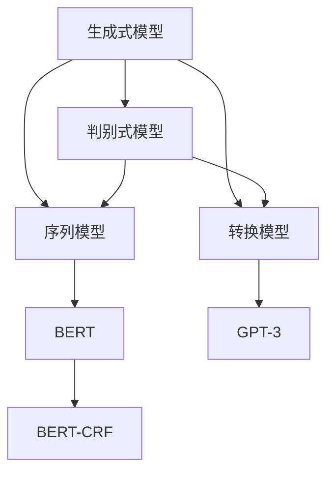
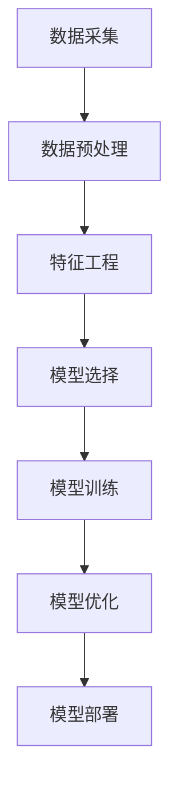
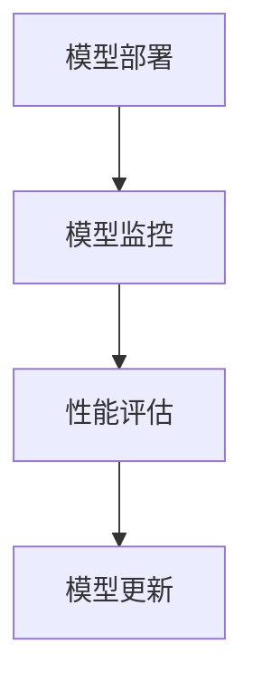
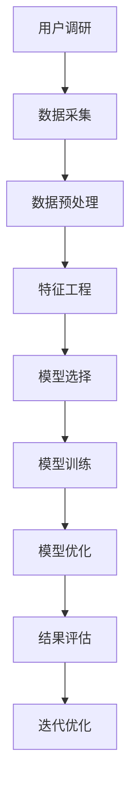

                 

# 文章标题

《电商平台的AI大模型转型：搜索推荐系统是核心，用户体验优化是关键》

> 关键词：电商平台，AI大模型，搜索推荐系统，用户体验优化

> 摘要：本文探讨了电商平台如何通过AI大模型转型，特别是搜索推荐系统的应用和用户体验优化，来实现业务增长和用户满意度的提升。文章首先概述了AI大模型在电商平台的应用背景和转型必要性，然后详细介绍了AI大模型的核心概念与架构，搜索推荐系统的原理与架构，以及用户体验优化的方法与实践。最后，文章分析了AI大模型在搜索推荐系统的应用与优化策略，并探讨了电商平台AI大模型转型的挑战与解决方案。

## 第一部分：AI大模型转型概述

### 1. 引言

随着人工智能技术的发展，AI大模型已成为电商平台提升搜索推荐质量和用户体验的重要工具。AI大模型是一种能够处理大量数据、自主学习和优化结果的模型，通过大规模预训练和迁移学习，能够实现更高的准确性和鲁棒性。

#### 1.1 AI大模型在电商平台的应用背景

电商平台的核心竞争力在于为用户提供个性化的商品推荐和高效的搜索服务。传统的搜索推荐系统主要依赖规则和简单的统计方法，难以满足用户日益增长的需求。AI大模型的出现，为电商平台带来了以下应用背景：

- **个性化推荐**：通过分析用户行为和兴趣，AI大模型能够提供更加精准的个性化推荐，提升用户满意度。
- **搜索优化**：AI大模型能够处理复杂的搜索查询，提升搜索结果的准确性和相关性。
- **智能客服**：AI大模型能够自动回答用户的问题，提高客服效率，降低人力成本。

#### 1.2 电商平台的AI大模型转型必要性

随着市场竞争的加剧，电商平台需要不断创新和优化服务，以满足用户的多样化需求。AI大模型转型具有以下必要性：

- **提高业务效率**：AI大模型能够自动化处理大量数据，减少人力成本，提高业务效率。
- **提升用户体验**：通过个性化推荐和智能搜索，提升用户满意度和忠诚度。
- **增强竞争力**：AI大模型能够为电商平台提供差异化竞争优势，吸引更多用户。

#### 1.3 电商平台的AI大模型转型目标

电商平台的AI大模型转型目标主要包括：

- **提升搜索推荐质量**：通过优化搜索推荐系统，提高搜索结果的准确性和相关性。
- **增强用户体验**：通过优化用户界面和交互，提升用户的使用体验。
- **降低运营成本**：通过自动化处理数据和业务流程，降低运营成本。

## 2. AI大模型核心概念与架构

### 2.1 AI大模型的定义与类型

AI大模型是指那些能够处理大规模数据、自主学习和优化结果的模型。根据功能和应用场景，AI大模型可以分为以下类型：

- **生成式模型**：能够生成新的数据和内容，如生成文本、图像和语音等。
- **判别式模型**：能够对输入的数据进行分类和预测，如分类模型和回归模型。
- **序列模型**：能够处理序列数据，如自然语言处理和时间序列分析等。
- **转换模型**：能够将一种数据形式转换为另一种数据形式，如编码器-解码器模型。

### 2.2 AI大模型的工作原理

AI大模型的工作原理主要包括以下几个方面：

- **基本架构**：AI大模型通常由输入层、隐藏层和输出层组成。输入层接收外部数据，隐藏层进行数据处理和特征提取，输出层生成最终结果。
- **大规模预训练**：通过在大规模数据集上进行预训练，AI大模型能够自动学习数据的底层特征和模式。
- **迁移学习与微调**：通过迁移学习和微调，AI大模型能够在新的数据集上快速适应，提高性能。

### 2.3 AI大模型的实例

以下是几个常见的AI大模型实例：

- **BERT**：一种基于转换器的预训练语言模型，用于自然语言处理任务。
- **GPT-3**：一种基于生成式的语言模型，能够生成高质量的文本。
- **BERT-CRF**：结合BERT模型和条件随机场（CRF），用于命名实体识别任务。

### 2.4 AI大模型之间的关系与联系

AI大模型之间的关系与联系可以表示为以下Mermaid流程图：

## 3. 搜索推荐系统原理与架构

### 3.1 搜索推荐系统概述

搜索推荐系统是指通过分析用户行为和兴趣，为用户提供个性化搜索结果和商品推荐的系统。它主要包括以下组成部分：

- **用户行为数据**：包括用户的浏览、购买、搜索等行为数据。
- **商品数据**：包括商品的信息、属性、价格等。
- **推荐算法**：根据用户行为数据和商品数据，生成个性化的推荐结果。

### 3.2 搜索推荐系统的工作流程

搜索推荐系统的工作流程主要包括以下步骤：

1. **数据采集与预处理**：采集用户行为数据和商品数据，并进行数据清洗、去噪和预处理。
2. **特征工程**：从原始数据中提取有用的特征，如用户兴趣、商品属性等。
3. **模型选择与优化**：选择合适的推荐算法，并通过交叉验证和超参数调整，优化模型性能。
4. **结果生成与排序**：根据用户兴趣和商品特征，生成推荐结果并进行排序。

### 3.3 搜索推荐系统的性能评估

搜索推荐系统的性能评估主要包括以下指标：

- **准确率**：预测正确的样本占总样本的比例。
- **召回率**：预测为正类的实际正类样本数占总正类样本数的比例。
- **F1值**：准确率和召回率的调和平均值。

### 3.4 搜索推荐系统的优化方法

搜索推荐系统的优化方法主要包括以下几个方面：

- **数据质量优化**：提高数据的质量和多样性，如去除噪声数据、引入外部数据等。
- **算法适应性优化**：根据用户行为和商品特性的变化，调整推荐算法，提高推荐结果的准确性。
- **用户体验优化**：优化用户界面和交互，提高用户的使用体验，如界面设计、交互体验等。

### 3.5 搜索推荐系统的实例

以下是几个常见的搜索推荐系统实例：

- **淘宝推荐**：基于用户的浏览和购买历史，为用户推荐相关的商品。
- **京东搜索**：基于用户的搜索关键词，为用户推荐相关的商品。
- **美团点评**：基于用户的评价和搜索历史，为用户推荐相关的餐厅和商品。

## 4. 用户体验优化方法与实践

### 4.1 用户体验概述

用户体验是指用户在使用产品或服务过程中所感受到的整体感受。在电商平台中，用户体验直接影响到用户的满意度和忠诚度。以下是对用户体验的概述：

#### 4.1.1 用户体验的定义与重要性

用户体验是指用户在使用产品或服务过程中所感受到的整体感受。在电商平台中，用户体验直接影响到用户的满意度和忠诚度。以下是对用户体验的概述：

- **定义**：用户体验是指用户在使用产品或服务过程中所感受到的整体感受。
- **重要性**：用户体验对电商平台的业务增长和用户满意度有重要影响。良好的用户体验能够提升用户满意度和忠诚度，从而促进业务增长。

#### 4.1.2 用户体验评估方法

用户体验评估方法主要包括以下几个方面：

- **用户调研**：通过问卷调查、访谈等方式，了解用户的反馈和建议。
- **用户行为分析**：通过分析用户在平台上的行为数据，如浏览、搜索、购买等，评估用户体验。
- **A/B测试**：通过对比不同设计方案的实验结果，评估用户体验的差异。

### 4.2 用户体验优化策略

用户体验优化策略主要包括以下几个方面：

#### 4.2.1 搜索推荐系统界面优化

- **界面设计**：优化界面布局和风格，提高用户视觉体验。
- **搜索框优化**：提供智能搜索建议，提高搜索效率。

#### 4.2.2 搜索推荐系统交互优化

- **交互设计**：简化用户操作流程，提高用户操作体验。
- **响应速度**：优化系统响应速度，提高用户满意度。

#### 4.2.3 搜索推荐系统内容优化

- **内容个性化**：根据用户兴趣和行为，提供个性化的搜索结果和推荐。
- **内容丰富度**：增加商品信息、用户评价等内容，提高用户对商品的了解。

### 4.3 用户体验优化实践案例

#### 4.3.1 案例一：电商平台A的搜索推荐系统优化实践

电商平台A通过以下措施优化搜索推荐系统：

- **界面设计**：采用扁平化设计，提高用户视觉体验。
- **智能搜索建议**：提供智能搜索建议，提高搜索效率。
- **内容个性化**：根据用户兴趣和行为，提供个性化的搜索结果和推荐。

#### 4.3.2 案例二：电商平台B的搜索推荐系统优化实践

电商平台B通过以下措施优化搜索推荐系统：

- **交互设计**：简化用户操作流程，提高用户操作体验。
- **响应速度**：优化系统响应速度，提高用户满意度。
- **内容丰富度**：增加商品信息、用户评价等内容，提高用户对商品的了解。

## 5. AI大模型在电商平台搜索推荐系统的应用

### 5.1 AI大模型在搜索推荐系统中的应用场景

AI大模型在搜索推荐系统中的应用场景主要包括以下几个方面：

#### 5.1.1 搜索功能优化

- **智能搜索**：利用AI大模型对用户的搜索意图进行理解，提供更加准确的搜索结果。
- **搜索词自动补全**：利用AI大模型预测用户可能输入的搜索词，提高搜索效率。

#### 5.1.2 推荐算法优化

- **个性化推荐**：利用AI大模型分析用户的兴趣和行为，提供更加个性化的推荐结果。
- **跨平台推荐**：利用AI大模型分析用户在不同平台的行为，提供跨平台的推荐服务。

#### 5.1.3 搜索与推荐系统的融合

- **一体化推荐**：将搜索和推荐系统整合，提供统一的搜索和推荐服务。
- **智能交互**：利用AI大模型实现智能问答和交互，提高用户的使用体验。

### 5.2 AI大模型在搜索推荐系统的实施步骤

AI大模型在搜索推荐系统的实施步骤主要包括以下几个方面：

#### 5.2.1 数据采集与预处理

- **数据采集**：采集用户的搜索历史、浏览记录、购买记录等数据。
- **数据预处理**：对数据进行清洗、去噪和预处理，提取有用的特征。

#### 5.2.2 特征工程

- **特征提取**：从原始数据中提取用户特征、商品特征等。
- **特征选择**：选择对搜索推荐系统有重要影响的特征。

#### 5.2.3 模型选择与优化

- **模型选择**：选择合适的AI大模型，如BERT、GPT-3等。
- **模型优化**：通过交叉验证和超参数调整，优化模型性能。

#### 5.2.4 模型部署与监控

- **模型部署**：将训练好的模型部署到生产环境，实现实时搜索推荐服务。
- **模型监控**：监控模型性能和稳定性，及时发现和解决问题。

## 6. 搜索推荐系统在电商平台的优化策略

### 6.1 数据驱动的优化策略

数据驱动的优化策略是指通过分析大量数据，找出影响搜索推荐系统性能的关键因素，并针对性地进行优化。以下是一些常见的数据驱动优化策略：

#### 6.1.1 数据质量优化

- **数据清洗**：去除噪声数据和异常值，提高数据的准确性和一致性。
- **数据整合**：整合不同来源的数据，构建统一的数据视图。

#### 6.1.2 数据多样性优化

- **引入外部数据**：引入用户行为数据、商品数据等外部数据，丰富数据来源。
- **数据增强**：通过数据增强技术，生成更多的训练数据，提高模型泛化能力。

#### 6.1.3 数据实时性优化

- **实时数据采集**：实时采集用户行为数据，提高数据更新的频率。
- **实时数据处理**：对实时数据进行实时处理和分析，实现实时搜索推荐。

### 6.2 算法驱动的优化策略

算法驱动的优化策略是指通过改进搜索推荐算法，提高系统性能。以下是一些常见的算法驱动优化策略：

#### 6.2.1 算法适应性优化

- **自适应调整**：根据用户行为和商品特性的变化，自适应调整推荐算法。
- **算法迭代**：不断迭代和优化算法，提高算法的适应性和准确性。

#### 6.2.2 算法稳定性优化

- **算法稳定性分析**：分析算法在不同数据集和场景下的稳定性。
- **算法调优**：通过调优算法参数，提高算法的稳定性和鲁棒性。

#### 6.2.3 算法高效性优化

- **算法并行化**：将算法并行化，提高计算效率。
- **算法优化**：通过算法优化技术，提高算法的运行速度和资源利用率。

### 6.3 用户体验驱动的优化策略

用户体验驱动的优化策略是指通过优化用户体验，提高搜索推荐系统的满意度和忠诚度。以下是一些常见的人性化优化策略：

#### 6.3.1 用户体验反馈机制

- **用户调研**：定期进行用户调研，了解用户的需求和反馈。
- **用户反馈**：及时收集用户的反馈，并针对性地优化系统。

#### 6.3.2 个性化推荐策略

- **个性化推荐**：根据用户兴趣和行为，提供个性化的推荐结果。
- **个性化展示**：根据用户偏好，个性化展示搜索结果和推荐内容。

#### 6.3.3 社交推荐策略

- **社交推荐**：利用用户社交关系，推荐用户可能感兴趣的商品。
- **社交互动**：鼓励用户在平台上互动，提高用户的参与度和粘性。

## 7. 电商平台的AI大模型转型挑战与解决方案

### 7.1 技术挑战

电商平台在AI大模型转型过程中面临以下技术挑战：

#### 7.1.1 大模型训练与优化挑战

- **计算资源需求**：大模型训练需要大量的计算资源和时间。
- **数据质量要求**：需要高质量、多样化的数据支持。
- **模型优化难度**：大模型优化需要反复迭代和调参，难度较大。

#### 7.1.2 搜索推荐系统实时性挑战

- **实时数据处理**：需要实时处理大量用户行为数据，保证系统实时性。
- **低延迟搜索**：需要优化搜索算法，降低搜索延迟。

#### 7.1.3 数据隐私与安全挑战

- **数据隐私保护**：需要确保用户数据的安全性和隐私性。
- **安全防护**：需要加强对系统安全的防护，防止数据泄露和攻击。

### 7.2 业务挑战

电商平台在AI大模型转型过程中还面临以下业务挑战：

#### 7.2.1 业务流程整合挑战

- **业务流程调整**：需要调整现有业务流程，适应AI大模型的应用。
- **人员培训**：需要培训员工掌握AI技术，提升业务能力。

#### 7.2.2 人员培训与团队协作挑战

- **技能提升**：需要培养AI技术和业务领域的复合型人才。
- **团队协作**：需要加强跨部门合作，提高团队执行力。

#### 7.2.3 资源投入与成本控制挑战

- **成本控制**：需要在资源投入和成本控制之间找到平衡点。
- **预算规划**：需要合理规划预算，确保AI大模型转型顺利进行。

### 7.3 解决方案与未来展望

针对上述挑战，电商平台可以采取以下解决方案：

#### 7.3.1 技术解决方案

- **计算资源优化**：采用分布式计算和云计算技术，提高计算效率。
- **数据隐私保护**：采用加密技术和隐私保护算法，确保用户数据安全。

#### 7.3.2 业务解决方案

- **业务流程重构**：重新设计业务流程，优化搜索推荐系统。
- **团队协作机制**：建立跨部门协作机制，提升团队执行力。

#### 7.3.3 电商平台的AI大模型转型趋势与展望

- **个性化推荐**：随着AI技术的进步，个性化推荐将更加精准。
- **实时搜索**：实时搜索技术将不断提升，满足用户实时需求。
- **数据驱动**：电商平台将更加注重数据驱动的决策和优化。

## 附录

### 附录A：电商平台AI大模型转型相关资源

#### A.1 开源框架与工具

- **TensorFlow**：一种开源的机器学习框架，支持多种AI模型训练和部署。
- **PyTorch**：一种开源的深度学习框架，支持动态计算图，便于模型开发和调试。
- **Hugging Face**：一个开源社区，提供丰富的预训练模型和工具。

#### A.2 学术论文与报告

- **《大规模预训练语言模型》**：介绍BERT、GPT-3等大规模预训练模型的原理和应用。
- **《电商平台的AI大模型应用》**：探讨AI大模型在电商平台搜索推荐系统中的应用实践。

#### A.3 电商平台AI大模型转型成功案例

- **淘宝**：通过AI大模型实现个性化推荐和智能搜索，提升用户体验和销售额。
- **京东**：利用AI大模型优化搜索推荐系统，提高用户转化率和满意度。

### 附录B：电商平台的AI大模型转型流程图

#### B.1 模型训练流程图

#### B.2 模型部署与监控流程图

#### B.3 搜索推荐系统优化流程图

### 附录C：电商平台的AI大模型转型常见问题与解答

#### C.1 模型训练相关问题

**Q：如何优化模型训练速度？**

A：采用分布式训练、GPU加速等技术，提高模型训练速度。

**Q：如何处理训练数据不平衡问题？**

A：采用数据增强、过采样或欠采样等技术，平衡训练数据分布。

#### C.2 搜索推荐系统相关问题

**Q：如何保证搜索推荐结果的准确性？**

A：采用多种算法和策略，如协同过滤、基于内容的推荐等，提高推荐准确性。

**Q：如何处理搜索词歧义问题？**

A：采用自然语言处理技术，如词义消歧、实体识别等，提高搜索结果的相关性。

#### C.3 用户体验相关问题

**Q：如何评估用户体验？**

A：采用用户调研、行为分析和A/B测试等方法，评估用户体验。

**Q：如何优化用户体验？**

A：通过界面设计、交互优化和内容丰富度提升等方式，优化用户体验。

#### C.4 数据隐私与安全相关问题

**Q：如何保护用户隐私？**

A：采用数据加密、匿名化等技术，保护用户隐私。

**Q：如何防止数据泄露？**

A：建立完善的数据安全管理制度，加强数据安全防护。

