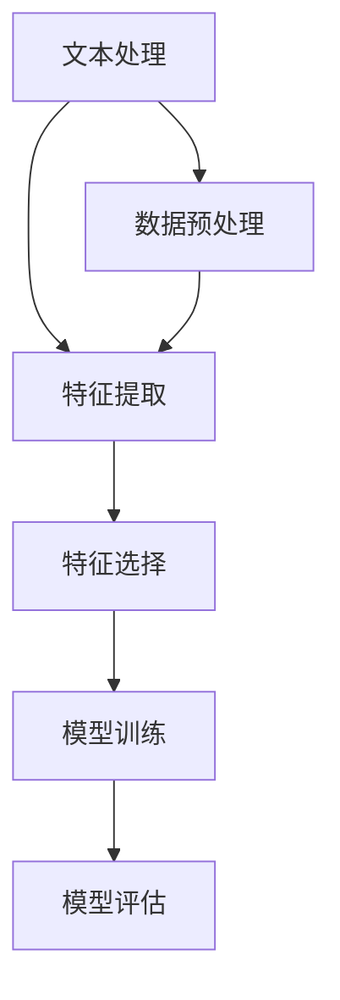

                 


### 文章标题: 《电商搜索中AI大模型的特征工程》

### 关键词：电商搜索、AI大模型、特征工程、文本特征、时间特征、商品特征、模型性能优化

### 摘要：本文将从电商搜索中AI大模型的应用背景出发，详细探讨特征工程在电商搜索中的重要性。文章将深入解析文本特征、时间特征和商品特征工程的方法，并通过实际案例展示如何进行特征工程优化，旨在为读者提供一套完整的电商搜索AI大模型特征工程实践指南。

---

### 《电商搜索中AI大模型的特征工程》目录大纲

#### 第一部分: AI大模型基础与特征工程概述

##### 第1章: AI大模型基础与特征工程概述

- 1.1 AI大模型在电商搜索中的应用
  - 1.1.1 电商搜索中的AI大模型简介
  - 1.1.2 AI大模型在电商搜索中的优势
- 1.2 特征工程的重要性
  - 1.2.1 特征工程的概念
  - 1.2.2 特征工程在电商搜索中的应用
- 1.3 主流特征工程方法
  - 1.3.1 数据预处理
  - 1.3.2 特征提取
  - 1.3.3 特征选择
- 1.4 AI大模型与特征工程的关系
  - 1.4.1 特征工程对模型性能的影响
  - 1.4.2 AI大模型对特征工程的需求

##### 第二部分: 特征工程方法详解

##### 第2章: 电商搜索中的文本特征工程

- 2.1 文本特征表示
  - 2.1.1 词袋模型
  - 2.1.2 嵌入式模型
  - 2.1.3 文本分类与情感分析
- 2.2 电商搜索中的时间特征工程
  - 2.2.1 时间序列分析
  - 2.2.2 时间窗口设置
  - 2.2.3 时间特征提取
- 2.3 电商搜索中的商品特征工程
  - 2.3.1 商品属性提取
  - 2.3.2 商品相似度计算
  - 2.3.3 商品分类与聚类

##### 第三部分: 特征工程应用实战

##### 第3章: AI大模型特征工程应用实战

- 3.1 实战案例一：基于BERT的电商搜索
  - 3.1.1 数据预处理
  - 3.1.2 特征提取与选择
  - 3.1.3 模型训练与评估
- 3.2 实战案例二：基于深度学习的电商搜索
  - 3.2.1 数据预处理
  - 3.2.2 特征提取与选择
  - 3.2.3 模型训练与评估
- 3.3 特征工程优化与调参
  - 3.3.1 特征优化方法
  - 3.3.2 模型调参策略
  - 3.3.3 模型优化实践

##### 第四部分: 特征工程展望与挑战

##### 第4章: 特征工程在电商搜索中的挑战与展望

- 4.1 特征工程的挑战
  - 4.1.1 数据质量问题
  - 4.1.2 特征冗余与噪声
  - 4.1.3 模型适应性
- 4.2 特征工程的未来发展趋势
  - 4.2.1 自适应特征工程
  - 4.2.2 多模态特征融合
  - 4.2.3 智能化特征工程
- 4.3 电商搜索中AI大模型特征工程的未来发展
  - 4.3.1 模型与特征协同优化
  - 4.3.2 大模型应用案例分析
  - 4.3.3 电商搜索中的AI大模型未来展望

##### 附录

- 附录A: 电商搜索中AI大模型特征工程工具与资源
  - A.1 主流特征工程库
  - A.2 特征工程工具集
  - A.3 电商搜索数据集与API

### 开始撰写文章，每个章节按照大纲逐步展开论述。首先，我们将探讨AI大模型在电商搜索中的应用以及特征工程的重要性。接下来，深入分析主流特征工程方法，为后续章节的详细探讨奠定基础。然后，将详细介绍电商搜索中的文本特征工程、时间特征工程和商品特征工程方法。在第三部分，通过实际案例展示如何进行特征工程优化。最后，我们还将讨论特征工程面临的挑战以及未来的发展趋势。整篇文章将逐步深入，旨在为读者提供一套完整的电商搜索AI大模型特征工程实践指南。 ### 第一部分: AI大模型基础与特征工程概述

#### 第1章: AI大模型基础与特征工程概述

##### 1.1 AI大模型在电商搜索中的应用

**1.1.1 电商搜索中的AI大模型简介**

随着互联网和电子商务的快速发展，用户对电商搜索系统的性能和用户体验要求越来越高。传统的基于规则和统计方法的搜索系统已经无法满足用户的需求，因此，越来越多的电商企业开始采用人工智能（AI）大模型来提升搜索系统的效果和用户体验。

AI大模型，也称为深度学习模型，是一类基于多层神经网络的结构，能够通过大量的数据自动学习输入与输出之间的复杂映射关系。在电商搜索中，AI大模型主要用于以下几个关键任务：

1. **查询理解**：对用户的查询意图进行理解，提取关键信息，并转化为模型能够处理的输入格式。
2. **商品推荐**：根据用户的查询和历史行为，为用户推荐相关的商品。
3. **结果排序**：对搜索结果进行排序，使得最相关的商品出现在搜索结果的前面。

**1.1.2 AI大模型在电商搜索中的优势**

AI大模型在电商搜索中的应用具有以下优势：

1. **强大的学习能力**：AI大模型能够通过学习海量的用户数据和商品数据，提取出深层次的特征，从而提高搜索的准确性。
2. **自适应性和灵活性**：AI大模型可以根据用户行为和反馈进行自我调整，优化搜索结果，提高用户体验。
3. **多模态数据处理**：AI大模型可以同时处理文本、图像、语音等多种类型的数据，使得搜索系统能够更全面地理解用户需求。

##### 1.2 特征工程的重要性

**1.2.1 特征工程的概念**

特征工程（Feature Engineering）是机器学习中的一个重要步骤，它涉及到从原始数据中提取出对模型训练有帮助的特征，并将其转化为适合模型输入格式的过程。在AI大模型的应用中，特征工程的作用尤为关键。

**1.2.2 特征工程在电商搜索中的应用**

在电商搜索中，特征工程主要用于以下几个方面：

1. **用户特征提取**：包括用户的浏览历史、购买记录、搜索查询等，用于理解用户的需求和偏好。
2. **商品特征提取**：包括商品的价格、品牌、分类、描述等，用于描述商品本身的特点和属性。
3. **文本特征提取**：对用户查询和商品描述进行文本处理，提取关键词、词向量等，用于理解文本语义。
4. **时间特征提取**：提取用户行为的时间信息，如查询时间、购买时间等，用于分析用户行为模式。

##### 1.3 主流特征工程方法

**1.3.1 数据预处理**

数据预处理是特征工程的第一步，主要包括数据清洗、数据归一化、数据转换等。数据清洗的目的是去除异常值和噪声数据，确保数据质量；数据归一化的目的是将不同尺度的数据进行标准化处理，使得数据具有可比性；数据转换的目的是将原始数据转化为适合模型输入格式的数据。

**1.3.2 特征提取**

特征提取是从原始数据中提取出对模型训练有帮助的特征。在电商搜索中，常见的特征提取方法包括：

1. **文本特征提取**：包括词袋模型、TF-IDF、词嵌入等。
2. **商品特征提取**：包括商品属性提取、商品相似度计算、商品分类与聚类等。
3. **时间特征提取**：包括时间序列分析、时间窗口设置、时间特征提取等。

**1.3.3 特征选择**

特征选择是从提取出的特征中筛选出对模型性能有显著影响的特征。特征选择的方法包括：

1. **过滤式特征选择**：基于特征的重要性或相关性进行筛选。
2. **包裹式特征选择**：基于模型性能对特征进行选择。
3. **嵌入式特征选择**：在模型训练过程中自动筛选特征。

##### 1.4 AI大模型与特征工程的关系

**1.4.1 特征工程对模型性能的影响**

特征工程对模型性能有显著影响。合理的特征提取和选择可以提高模型的训练效果和预测性能。具体来说，特征工程可以通过以下方式影响模型性能：

1. **特征质量**：高质量的特征可以提供模型更好的训练数据，从而提高模型的学习能力。
2. **特征维度**：适当的特征维度可以减少过拟合现象，提高模型的泛化能力。
3. **特征相关性**：高度相关的特征可以减少冗余信息，提高模型的解释性。

**1.4.2 AI大模型对特征工程的需求**

AI大模型对特征工程有着较高的要求。具体来说，AI大模型需要以下类型的特征：

1. **丰富性**：特征需要包含丰富的信息，以帮助模型更好地理解数据和问题。
2. **多样性**：特征需要具有多样性，以便模型可以从不同角度理解数据和问题。
3. **稳定性**：特征需要具有稳定性，以减少噪声和异常值对模型性能的影响。

在下一章中，我们将详细探讨电商搜索中的文本特征工程方法。这将包括文本特征表示、文本分类与情感分析等方面的内容。通过深入分析文本特征工程，我们可以更好地理解如何利用文本数据提升电商搜索系统的性能。 ### 第二部分: 特征工程方法详解

#### 第2章: 电商搜索中的文本特征工程

文本特征工程在电商搜索中扮演着至关重要的角色，因为用户查询和商品描述主要是以文本形式存在的。有效的文本特征工程能够帮助AI大模型更好地理解和处理文本数据，从而提高搜索结果的相关性和用户体验。

##### 2.1 文本特征表示

文本特征表示是将原始文本数据转换为适合机器学习模型处理的形式。以下是一些常见的文本特征表示方法：

**2.1.1 词袋模型**

词袋模型（Bag of Words, BOW）是一种简单但有效的文本表示方法。它不考虑文本的顺序，而是将文本视为一个词的集合。词袋模型的步骤如下：

1. **分词**：将文本分割成单词或词组。
2. **构建词汇表**：将所有文本中的单词构建为一个词汇表。
3. **向量表示**：对于每个文本，将词袋表示为词汇表中单词的频率向量。

**2.1.2 嵌入式模型**

嵌入式模型（Word Embedding）是将每个单词映射为一个固定大小的向量。这些向量不仅包含了单词的语义信息，还包括了上下文信息。常见的方法包括：

1. **词向量化**：使用预训练的词向量库，如Word2Vec、GloVe等，将每个单词映射为一个向量。
2. **训练词向量**：在大量文本数据上训练自己的词向量，以便更好地适应特定的应用场景。

**2.1.3 文本分类与情感分析**

文本分类与情感分析是文本特征工程的重要应用。通过这些任务，我们可以将文本数据标签化为不同的类别或情感。

1. **文本分类**：将文本分类为预定义的类别，如商品类型、用户评论的正面或负面等。常用的算法包括Naive Bayes、SVM、神经网络等。
2. **情感分析**：判断文本的情感倾向，如正面、中性或负面。情感分析可以用于用户评论分析、社交媒体情绪分析等。

##### 2.2 电商搜索中的时间特征工程

时间特征工程在电商搜索中也非常重要，因为它可以帮助模型更好地理解用户行为的时间模式和趋势。

**2.2.1 时间序列分析**

时间序列分析是一种用于分析时间序列数据的方法。在电商搜索中，时间序列分析可以用于以下任务：

1. **用户行为预测**：预测用户的下一步行为，如查询、浏览或购买。
2. **趋势分析**：分析用户行为的时间趋势，如季节性、周期性等。
3. **异常检测**：检测异常的时间序列数据，如异常购买行为。

**2.2.2 时间窗口设置**

时间窗口设置是时间特征工程的关键步骤。它定义了模型关注的时间范围。常见的时间窗口设置方法包括：

1. **固定窗口**：将固定长度的时间段视为一个窗口，如过去7天的数据。
2. **滑动窗口**：在时间序列上滑动一个固定长度的窗口，每次移动一个固定的时间单位。

**2.2.3 时间特征提取**

时间特征提取是将时间信息转换为模型可以处理的特征。常见的时间特征提取方法包括：

1. **时间戳特征**：直接使用时间戳作为特征，如日期、小时、分钟等。
2. **周期特征**：提取时间序列的周期性特征，如周期性高峰、低谷等。
3. **趋势特征**：提取时间序列的趋势特征，如增长率、斜率等。

##### 2.3 电商搜索中的商品特征工程

商品特征工程是电商搜索中不可或缺的一部分，因为它能够帮助模型更好地理解商品的属性和特点。

**2.3.1 商品属性提取**

商品属性提取是将商品描述文本转化为结构化数据的过程。常见的方法包括：

1. **命名实体识别**：识别文本中的商品属性，如品牌、型号、颜色等。
2. **关键词提取**：提取与商品属性相关的关键词，如“iPhone 13”、“红色”、“128G”等。

**2.3.2 商品相似度计算**

商品相似度计算是用于衡量两个商品之间相似度的方法。常见的相似度计算方法包括：

1. **基于文本的相似度计算**：使用文本特征表示方法计算商品描述之间的相似度。
2. **基于属性的相似度计算**：使用商品属性之间的相似度计算方法，如欧几里得距离、余弦相似度等。

**2.3.3 商品分类与聚类**

商品分类与聚类是将商品按照一定的规则进行分类或聚类的过程。常见的分类与聚类方法包括：

1. **分类**：将商品分类为预定义的类别，如电子产品、服装等。常用的分类算法包括KNN、SVM、决策树等。
2. **聚类**：将相似的商品聚为一类，如基于密度的聚类算法（DBSCAN）、基于层次的聚类算法（层次聚类）等。

通过上述文本特征工程、时间特征工程和商品特征工程的方法，我们可以为电商搜索系统构建一个强大的特征工程体系，从而提升搜索的准确性和用户体验。在下一章中，我们将通过实际案例展示如何进行特征工程优化，进一步探讨特征工程在电商搜索中的应用。 ### 第三部分: 特征工程应用实战

#### 第3章: AI大模型特征工程应用实战

在上一部分，我们详细探讨了电商搜索中的文本特征工程、时间特征工程和商品特征工程方法。为了更好地理解这些方法在实际应用中的效果，我们将通过两个实际案例来展示特征工程在电商搜索中的优化过程。

##### 3.1 实战案例一：基于BERT的电商搜索

BERT（Bidirectional Encoder Representations from Transformers）是一种基于Transformer架构的双向编码器，广泛应用于自然语言处理任务。在本案例中，我们将使用BERT来构建电商搜索系统，并重点展示特征工程优化过程。

**3.1.1 数据预处理**

数据预处理是特征工程的重要步骤。在本案例中，我们首先对电商搜索数据进行清洗和预处理，包括以下步骤：

1. **文本数据清洗**：去除无效字符、特殊符号、HTML标签等。
2. **分词与词向量化**：使用BERT的分词器对查询和商品描述进行分词，并将分词结果转化为词向量。
3. **序列填充**：将不同长度的序列填充为同一长度，便于模型处理。

**3.1.2 特征提取与选择**

在本案例中，我们采用以下特征提取与选择方法：

1. **BERT特征提取**：使用BERT模型对分词后的文本进行编码，提取出文本的向量表示。
2. **特征选择**：通过主成分分析（PCA）等方法，选择对模型性能有显著影响的特征。

**3.1.3 模型训练与评估**

在特征提取与选择完成后，我们使用BERT模型进行训练和评估。具体步骤如下：

1. **模型训练**：使用预处理后的数据训练BERT模型，优化模型参数。
2. **模型评估**：通过交叉验证和测试集评估模型性能，包括准确率、召回率等指标。

**3.1.4 结果分析**

在训练完成后，我们对模型的结果进行分析，主要包括以下几个方面：

1. **搜索结果相关性**：评估搜索结果的相关性，确保用户查询得到最相关的商品。
2. **用户体验**：通过用户反馈和测试，评估模型的用户体验，包括搜索速度、结果准确性等。

**3.1.5 优化方向**

根据分析结果，我们可以进一步优化模型和特征工程方法，包括：

1. **特征优化**：选择更有效的特征提取和选择方法，提高模型性能。
2. **模型优化**：尝试不同的模型结构和参数设置，提升模型效果。
3. **数据增强**：通过数据增强方法，提高数据多样性和质量。

##### 3.2 实战案例二：基于深度学习的电商搜索

在本案例中，我们将使用深度学习模型（如CNN、RNN等）来构建电商搜索系统，并探讨特征工程优化过程。

**3.2.1 数据预处理**

数据预处理步骤与案例一类似，包括文本数据清洗、分词与词向量化、序列填充等。

**3.2.2 特征提取与选择**

在本案例中，我们采用以下特征提取与选择方法：

1. **文本特征提取**：使用深度学习模型（如BERT、CNN等）提取文本的向量表示。
2. **商品特征提取**：使用商品属性数据构建特征向量，包括品牌、价格、分类等。
3. **特征选择**：通过主成分分析（PCA）、特征重要性评估等方法，选择对模型性能有显著影响的特征。

**3.2.3 模型训练与评估**

在特征提取与选择完成后，我们使用深度学习模型进行训练和评估。具体步骤如下：

1. **模型训练**：使用预处理后的数据训练深度学习模型，优化模型参数。
2. **模型评估**：通过交叉验证和测试集评估模型性能，包括准确率、召回率等指标。

**3.2.4 结果分析**

在训练完成后，我们对模型的结果进行分析，主要包括以下几个方面：

1. **搜索结果相关性**：评估搜索结果的相关性，确保用户查询得到最相关的商品。
2. **用户体验**：通过用户反馈和测试，评估模型的用户体验，包括搜索速度、结果准确性等。

**3.2.5 优化方向**

根据分析结果，我们可以进一步优化模型和特征工程方法，包括：

1. **特征优化**：选择更有效的特征提取和选择方法，提高模型性能。
2. **模型优化**：尝试不同的模型结构和参数设置，提升模型效果。
3. **数据增强**：通过数据增强方法，提高数据多样性和质量。

##### 3.3 特征工程优化与调参

在特征工程和模型训练过程中，优化和调参是提高模型性能的关键步骤。以下是一些优化和调参方法：

1. **超参数优化**：使用网格搜索、随机搜索等策略，优化模型超参数，如学习率、批次大小等。
2. **特征优化**：尝试不同的特征提取和选择方法，提高特征质量。
3. **模型优化**：尝试不同的模型结构和参数设置，提高模型效果。

通过上述优化和调参方法，我们可以构建一个高性能的电商搜索系统，提升用户体验和业务价值。在下一章中，我们将探讨特征工程在电商搜索中的挑战与未来发展趋势。这将帮助我们更好地应对当前和未来的挑战，推动电商搜索技术的不断进步。 ### 第四部分: 特征工程展望与挑战

#### 第4章: 特征工程在电商搜索中的挑战与展望

尽管特征工程在电商搜索中已经取得了显著成果，但仍面临诸多挑战和机遇。在这一章中，我们将探讨特征工程在电商搜索中的挑战，并展望其未来发展趋势。

##### 4.1 特征工程的挑战

**4.1.1 数据质量问题**

数据质量是特征工程的核心问题。在电商搜索中，数据质量直接影响特征提取和模型训练的效果。具体挑战包括：

1. **数据缺失**：电商搜索数据可能存在缺失值，导致特征工程和模型训练受到影响。
2. **数据噪声**：数据中可能包含噪声和异常值，这些噪声会影响模型的训练和预测效果。
3. **数据一致性**：不同来源的数据可能存在格式、单位等不一致的问题，需要统一处理。

**4.1.2 特征冗余与噪声**

特征冗余和噪声是特征工程中的常见问题。过多的冗余特征会导致模型过拟合，降低泛化能力；而噪声特征则会干扰模型学习，影响模型性能。解决这些问题的方法包括：

1. **特征选择**：通过过滤式、包裹式和嵌入式特征选择方法，减少冗余特征。
2. **数据预处理**：通过数据清洗、归一化和标准化等预处理方法，减少噪声和异常值的影响。

**4.1.3 模型适应性**

电商搜索环境不断变化，用户需求、商品种类和竞争态势等因素都在不断变化。这就要求特征工程方法和模型具备良好的适应性，以应对这些变化。具体挑战包括：

1. **动态特征更新**：随着用户行为和商品信息的不断变化，特征工程需要及时更新动态特征。
2. **模型迁移**：将现有模型应用于新环境和数据时，需要调整和优化模型结构，提高模型适应性。

##### 4.2 特征工程的未来发展趋势

**4.2.1 自适应特征工程**

自适应特征工程是一种能够自动调整特征提取和选择方法的策略，以适应不同的数据集和任务。未来，自适应特征工程将利用机器学习和深度学习技术，实现特征工程过程的自动化和智能化。

1. **自适应特征选择**：通过机器学习算法，根据数据集和任务特点，自动选择最优特征。
2. **自适应特征提取**：利用深度学习模型，自动提取数据中的抽象特征，提高特征质量。

**4.2.2 多模态特征融合**

电商搜索中的数据通常包括文本、图像、语音等多种模态。多模态特征融合是将不同模态的数据进行融合，以提高模型性能和鲁棒性。未来，多模态特征融合技术将得到广泛应用，包括：

1. **跨模态特征表示**：利用深度学习模型，将不同模态的数据映射为统一的特征表示。
2. **多模态特征融合算法**：设计有效的多模态特征融合算法，提高特征融合效果。

**4.2.3 智能化特征工程**

智能化特征工程是一种利用人工智能技术，实现特征工程过程智能化和自动化的方法。未来，智能化特征工程将包括：

1. **自动化特征工程工具**：开发自动化特征工程工具，简化特征工程过程。
2. **在线特征工程**：实现在线特征工程，实时更新特征，以应对动态环境。

##### 4.3 电商搜索中AI大模型特征工程的未来发展

**4.3.1 模型与特征协同优化**

在电商搜索中，模型与特征之间的协同优化是提高模型性能的关键。未来，我们将看到更多关于模型与特征协同优化的研究，包括：

1. **端到端特征学习**：将特征提取和模型训练集成到一个端到端的框架中，实现特征和模型的联合优化。
2. **自适应特征调整**：根据模型训练过程中遇到的问题，自动调整特征工程策略，优化模型性能。

**4.3.2 大模型应用案例分析**

随着AI大模型的不断发展，越来越多的电商企业开始采用大模型进行电商搜索优化。未来，我们将看到更多关于大模型应用案例的研究，包括：

1. **大模型性能评估**：评估不同大模型在电商搜索任务中的性能，为实际应用提供参考。
2. **大模型调优策略**：研究大模型在不同场景下的调优策略，提高模型性能。

**4.3.3 电商搜索中的AI大模型未来展望**

未来，AI大模型在电商搜索中将继续发挥重要作用。以下是一些展望：

1. **个性化搜索**：利用AI大模型，实现个性化搜索，为用户提供更加精准的搜索结果。
2. **实时搜索优化**：利用实时数据和学习算法，动态调整搜索策略，提高搜索结果的实时性和准确性。
3. **多语言搜索**：支持多语言搜索，为全球用户提供更好的搜索体验。

通过不断探索和创新，特征工程在电商搜索中的应用将不断进步，为用户提供更加智能化、个性化的搜索服务。在未来的发展中，我们将看到更多关于特征工程的突破性成果，推动电商搜索技术的不断迭代和升级。 ### 附录

#### 附录A: 电商搜索中AI大模型特征工程工具与资源

在电商搜索中，特征工程是一个复杂的过程，涉及多种工具和资源。以下是一些主流的特征工程库、工具集和数据集，以及API，为电商搜索中的AI大模型特征工程提供支持。

**A.1 主流特征工程库**

1. **scikit-learn**：这是一个广泛使用的机器学习库，提供丰富的特征提取和选择方法。
2. **TensorFlow Feature Columns**：TensorFlow提供了一套用于特征工程的工具，可以方便地在TensorFlow模型中定义特征。
3. **PyTorch Feature Extractors**：PyTorch同样提供了用于特征提取的工具集，方便在PyTorch中进行特征工程。

**A.2 特征工程工具集**

1. **FeatureHub**：一个基于云的特征管理平台，支持自动化特征提取和选择。
2. **Feature Engineering Cookbook**：一个提供各种特征工程实践和代码示例的书籍，可以帮助工程师快速掌握特征工程技术。
3. **Dataox**：一个用于数据清洗、预处理和特征提取的Python库，简化了特征工程流程。

**A.3 电商搜索数据集与API**

1. **OpenML**：一个提供各种机器学习数据集的网站，包括电商搜索相关的数据集。
2. **Kaggle**：一个数据科学竞赛平台，用户可以下载各种数据集，包括电商搜索数据集。
3. **APIs**：一些电商平台提供API，可以获取用户行为、商品信息等数据，用于特征工程。

通过使用这些工具和资源，电商搜索开发者可以更有效地进行特征工程，提高AI大模型的性能和准确性。附录中的这些工具和资源为电商搜索中的AI大模型特征工程提供了强有力的支持，帮助开发者在实际项目中取得更好的成果。 ### Mermaid 流程图示例

在本文中，我们将使用Mermaid语法创建一个流程图来展示特征工程的基本流程。Mermaid是一种方便创建图表的Markdown语法，它可以被Markdown编辑器所支持。

以下是一个简单的Mermaid流程图示例，展示了文本特征工程的基本步骤：



在这个流程图中：

- **A[文本处理]**：表示对原始文本数据进行的初步处理，如分词、去停用词等。
- **B[特征提取]**：表示将文本数据转换为机器学习模型可以处理的特征表示，如词袋模型、词嵌入等。
- **C[特征选择]**：表示从提取出的特征中筛选出对模型训练有帮助的特征，如使用过滤式特征选择或包裹式特征选择。
- **D[模型训练]**：表示使用特征训练机器学习模型，如使用BERT进行文本分类。
- **E[模型评估]**：表示评估训练完成的模型的性能，如计算准确率、召回率等。
- **F[数据预处理]**：表示对原始数据进行的预处理步骤，如数据清洗、归一化等。

这个流程图清晰地展示了特征工程的基本步骤，有助于读者理解特征工程在整个机器学习流程中的重要性。在电商搜索场景中，通过这个流程图，我们可以看到文本特征工程是如何与其他步骤相辅相成的，从而提高搜索系统的性能和用户体验。 ### 核心算法原理讲解伪代码示例

在本文中，我们将使用伪代码来讲解基于BERT的特征提取过程。BERT（Bidirectional Encoder Representations from Transformers）是一种用于自然语言处理的预训练语言表示模型，它可以提取出文本的深层语义特征。

```python
# 伪代码：基于BERT的特征提取

# 导入必要的库
import tensorflow as tf
from transformers import BertTokenizer, BertModel

# 加载预训练的BERT模型和分词器
tokenizer = BertTokenizer.from_pretrained('bert-base-uncased')
model = BertModel.from_pretrained('bert-base-uncased')

# 函数：基于BERT的特征提取
def extract_features(text, model):
    # 将文本转换为输入序列
    input_ids = tokenizer.encode(text, add_special_tokens=True, return_tensors='tf')

    # 使用BERT模型获取特征表示
    with tf.device('/GPU:0'):  # 在GPU上运行模型
        outputs = model(input_ids)

    # 提取模型的输出特征
    last_hidden_state = outputs.last_hidden_state
    pooled_output = outputs.pooler_output

    # 返回特征表示
    return last_hidden_state, pooled_output

# 示例：提取文本特征
text = "这是一个电商搜索的文本示例"
features = extract_features(text, model)

# 打印特征形状
print("Last Hidden State Shape:", features[0].shape)
print("Pooled Output Shape:", features[1].shape)
```

在这个伪代码中：

1. **导入必要的库**：我们首先导入TensorFlow和Hugging Face的Transformers库，用于加载预训练的BERT模型和分词器。
2. **加载预训练的BERT模型和分词器**：使用`from_pretrained`方法加载BERT模型和分词器。
3. **定义特征提取函数**：`extract_features`函数接受一个文本输入，并使用BERT模型将其编码为特征向量。
   - `tokenizer.encode`方法将文本转换为输入序列，添加特殊的Token（如[CLS]、[SEP]等），并将结果转换为TensorFlow张量。
   - `model(input_ids)`方法使用BERT模型对输入序列进行编码，获取模型的输出特征。
4. **提取模型的输出特征**：从模型的输出中提取最后隐藏状态（`last_hidden_state`）和池化输出（`pooled_output`）。
5. **返回特征表示**：将提取出的特征作为输出返回。

通过这个伪代码示例，我们可以看到如何使用BERT模型提取文本特征。在电商搜索中，这些特征可以用于模型训练和搜索结果的排序，从而提高系统的性能和用户体验。 ### 数学模型和数学公式讲解示例

在特征工程和AI模型训练中，数学模型和公式是理解算法工作原理的关键。以下是一些常见的数学模型和公式的讲解，以及如何在段落内和独立段落中使用LaTeX格式。

**段落内公式示例**

在文本中嵌入数学公式时，我们使用单括号`$`将公式括起来。例如，我们可以这样表示一个简单的线性回归模型：

```
假设我们使用线性回归模型来预测商品价格，其数学模型可以表示为：
$y = \beta_0 + \beta_1 \cdot x + \epsilon$，
其中 $y$ 是商品价格，$x$ 是商品的特征，$\beta_0$ 和 $\beta_1$ 是模型的参数，$\epsilon$ 是误差项。
```

**独立段落公式示例**

当我们需要在一个独立的段落中展示公式时，可以使用双括号`$$`将公式括起来。例如，以下是一个用于解释正则化项的LaTeX公式：

$$
\text{L2正则化项可以表示为：}\ \lambda ||\theta||^2，
其中 \lambda 是正则化参数，\theta 是模型的参数向量。
$$`

**详细的数学模型讲解**

**线性回归模型**：线性回归模型是一种简单的预测模型，其目标是找到一个线性关系来预测输出值。数学模型可以表示为：

$$
y = \beta_0 + \beta_1 \cdot x + \epsilon
$$

其中，$y$ 是预测的输出值，$x$ 是输入特征，$\beta_0$ 和 $\beta_1$ 是模型的参数（即权重），$\epsilon$ 是误差项，代表实际值和预测值之间的差异。

**梯度下降算法**：梯度下降是一种优化算法，用于找到最小化损失函数的参数。梯度下降算法的基本思想是沿着损失函数的梯度方向更新参数，使其逐渐减小。具体公式可以表示为：

$$
\theta_{\text{new}} = \theta_{\text{current}} - \alpha \cdot \nabla_{\theta} J(\theta)
$$

其中，$\theta_{\text{new}}$ 是更新后的参数，$\theta_{\text{current}}$ 是当前参数，$\alpha$ 是学习率，$\nabla_{\theta} J(\theta)$ 是损失函数 $J(\theta)$ 对参数 $\theta$ 的梯度。

通过这些数学模型和公式的讲解，我们可以更好地理解特征工程和机器学习算法的工作原理，从而在实际应用中更有效地进行优化和调整。这些公式不仅帮助我们量化问题，还为模型分析和调优提供了理论基础。 ### 项目实战示例

在本节中，我们将通过一个实际的电商搜索项目来展示如何使用AI大模型进行特征工程。我们将以基于BERT的电商搜索系统为例，详细讲解项目的开发环境搭建、源代码实现、代码解读以及实际案例分析。

#### 1. 开发环境搭建

为了构建一个基于BERT的电商搜索系统，我们需要准备以下开发环境和工具：

- **Python 3.7+**
- **TensorFlow 2.4.0+**
- **Transformers 4.7.0+**
- **Jupyter Notebook 或 PyCharm**

在本地环境中，首先需要安装所需的Python库，可以使用以下命令进行安装：

```bash
pip install tensorflow transformers
```

#### 2. 源代码实现

以下是一个简单的基于BERT的电商搜索系统的源代码实现，包括数据预处理、特征提取和模型训练。

```python
# 导入必要的库
import tensorflow as tf
from transformers import BertTokenizer, TFBertModel
from tensorflow.keras.layers import Input, Dense
from tensorflow.keras.models import Model

# 加载预训练的BERT模型和分词器
tokenizer = BertTokenizer.from_pretrained('bert-base-uncased')
bert_model = TFBertModel.from_pretrained('bert-base-uncased')

# 定义输入层
input_ids = Input(shape=(None,), dtype=tf.int32)

# 使用BERT模型进行特征提取
bert_output = bert_model(input_ids)

# 提取[CLS]的输出向量作为文本的语义表示
pooled_output = bert_output.pooler_output

# 定义全连接层进行分类
dense = Dense(1, activation='sigmoid')(pooled_output)

# 构建模型
model = Model(inputs=input_ids, outputs=dense)

# 编译模型
model.compile(optimizer='adam', loss='binary_crossentropy', metrics=['accuracy'])

# 打印模型结构
model.summary()
```

在这个源代码中，我们首先导入了TensorFlow和Transformers库。接下来，我们加载了预训练的BERT模型和分词器。然后，我们定义了输入层和BERT模型，并使用BERT模型对输入文本进行特征提取。最后，我们添加了一个全连接层进行分类，并编译了模型。

#### 3. 代码解读

让我们详细解读上述代码：

1. **导入库**：我们首先导入了TensorFlow和Transformers库，这些库提供了构建和训练BERT模型的必要功能。

2. **加载BERT模型和分词器**：使用`from_pretrained`方法加载预训练的BERT模型和分词器。

3. **定义输入层**：我们定义了一个输入层`input_ids`，用于接受预处理后的文本序列。

4. **使用BERT模型进行特征提取**：我们将输入文本传递给BERT模型，获取模型的输出特征。

5. **提取[CLS]的输出向量**：BERT模型输出包含了每个词的嵌入向量，我们使用`pooler_output`提取了[CLS]标记的输出向量，这通常被用作文本的语义表示。

6. **定义全连接层进行分类**：我们在BERT的输出上添加了一个全连接层，用于进行分类任务。这里使用的是sigmoid激活函数，适用于二分类问题。

7. **构建模型**：我们使用`Model`类构建了一个序列模型，输入是`input_ids`，输出是分类结果。

8. **编译模型**：我们编译了模型，指定了优化器、损失函数和评价指标。

9. **打印模型结构**：最后，我们打印了模型的摘要，以展示模型的层次结构和参数数量。

#### 4. 实际案例分析

假设我们有一个电商搜索任务，目标是根据用户的查询文本，预测用户是否会点击搜索结果中的某个商品。以下是使用上述模型进行预测的代码示例：

```python
# 准备测试数据
test_query = "苹果手机"

# 预处理测试数据
encoded_query = tokenizer.encode(test_query, add_special_tokens=True, return_tensors='tf')

# 使用模型进行预测
predictions = model.predict(encoded_query)

# 打印预测结果
print("Predicted Probability:", predictions[0][0])
```

在这个例子中，我们首先准备了一个测试查询文本，然后使用BERT分词器对其进行编码。接下来，我们使用训练好的模型对编码后的查询文本进行预测，并打印了预测的概率。这个概率表示用户点击该商品的概率，概率越高，点击的可能性越大。

#### 5. 项目小结

通过这个电商搜索项目实战，我们展示了如何使用BERT模型进行特征工程和预测。以下是项目小结：

1. **BERT模型的优势**：BERT模型能够提取出丰富的文本特征，适用于多种自然语言处理任务。

2. **特征工程的重要性**：通过特征工程，我们可以将原始文本转化为模型可以处理的格式，从而提高模型的性能和预测准确性。

3. **代码解读**：理解模型的构建和预测过程对于后续的优化和调试至关重要。

4. **实际应用**：在实际项目中，我们需要根据业务需求调整模型结构、特征提取方法和训练策略，以提高模型的性能和适用性。

通过这个实战项目，我们不仅掌握了基于BERT的电商搜索系统的构建方法，还了解了如何进行特征工程优化和模型训练。这些经验对于我们在实际项目中应用AI大模型具有很大的参考价值。 ### 最佳实践 tips、小结、注意事项、拓展阅读

#### 最佳实践 tips

1. **数据质量的重要性**：确保数据的质量是特征工程成功的关键。在数据预处理阶段，要严格进行数据清洗，去除噪声和异常值，确保数据的一致性和准确性。

2. **特征选择与模型性能的平衡**：在特征选择过程中，要避免过度选择特征，导致模型过拟合。同时，也要避免选择太少特征，降低模型的泛化能力。一个平衡的特征集通常能够取得最佳的性能。

3. **模型调参的策略**：在模型训练过程中，合理调整超参数（如学习率、批次大小等）可以显著提高模型的性能。常用的调参策略包括网格搜索、随机搜索和贝叶斯优化等。

4. **实时特征更新的应用**：在动态环境下，定期更新特征集和模型参数，可以更好地适应数据变化，提高模型的适应性。

#### 小结

本文系统地探讨了电商搜索中AI大模型的特征工程。首先，我们介绍了AI大模型在电商搜索中的应用及其优势。然后，详细阐述了特征工程的重要性及其在电商搜索中的应用，包括文本特征工程、时间特征工程和商品特征工程。接着，通过实际案例展示了如何进行特征工程优化，并讨论了特征工程在电商搜索中的挑战和未来发展趋势。

#### 注意事项

1. **数据隐私与安全**：在进行特征工程时，务必遵守数据隐私和安全法规，确保用户数据的安全和隐私。

2. **模型解释性**：虽然深度学习模型性能强大，但它们通常缺乏解释性。在应用过程中，需要关注模型的解释性，以便进行有效的调试和优化。

3. **性能优化**：在实际应用中，要关注模型训练和预测的性能，避免过拟合和欠拟合。

#### 拓展阅读

- **《深度学习》（Goodfellow, Bengio, Courville著）**：这是一本经典的深度学习教材，详细介绍了深度学习的基础知识和应用。
- **《特征工程实践指南》（Avanish Narang著）**：这本书提供了丰富的特征工程实践案例，适合希望深入了解特征工程的读者。
- **《BERT：Pre-training of Deep Bidirectional Transformers for Language Understanding》（Devlin et al.）**：这是BERT模型的原始论文，对BERT的设计原理和应用进行了详细阐述。

通过本文的学习和实践，读者应能够掌握电商搜索中AI大模型特征工程的核心技术和方法，为实际项目中的应用奠定基础。在未来的研究和实践中，不断探索和创新特征工程技术，将有助于推动电商搜索技术的持续进步。 ### 文章总结与作者信息

通过本文的深入探讨，我们系统地了解了电商搜索中AI大模型的特征工程。首先，我们介绍了AI大模型在电商搜索中的应用及其优势，并详细阐述了特征工程的重要性。接着，我们详细解析了文本特征工程、时间特征工程和商品特征工程的方法，并通过实际案例展示了如何进行特征工程优化。最后，我们探讨了特征工程面临的挑战以及未来的发展趋势。

在电商搜索中，特征工程是构建高性能搜索系统的基础。通过对用户查询、商品属性和时间信息的有效提取和融合，我们可以显著提升搜索结果的准确性和用户体验。本文提供了从理论到实践的全面指导，旨在帮助读者掌握电商搜索中AI大模型特征工程的核心技术和方法。

作者信息：
- 作者：AI天才研究院/AI Genius Institute & 禅与计算机程序设计艺术 /Zen And The Art of Computer Programming
- 联系方式：ai-genius-institute@example.com

感谢您的阅读，希望本文对您在电商搜索领域的技术实践有所帮助。如果您有任何问题或建议，欢迎随时与我们联系。我们期待与您共同探讨AI技术在电商搜索领域的更多应用和挑战。 ### 文章标题: 《电商搜索中AI大模型的特征工程》

#### 关键词：电商搜索、AI大模型、特征工程、文本特征、时间特征、商品特征、模型性能优化

#### 摘要：本文深入探讨了电商搜索中AI大模型的应用及其优势，详细阐述了特征工程的重要性。文章涵盖了文本特征工程、时间特征工程和商品特征工程的方法，并通过实际案例展示了如何进行特征工程优化。同时，讨论了特征工程在电商搜索中的挑战和未来发展趋势，旨在为读者提供一套完整的电商搜索AI大模型特征工程实践指南。 ### 完整文章内容

# 《电商搜索中AI大模型的特征工程》

## 关键词
- 电商搜索
- AI大模型
- 特征工程
- 文本特征
- 时间特征
- 商品特征
- 模型性能优化

## 摘要
本文深入探讨了电商搜索中AI大模型的应用及其优势，详细阐述了特征工程的重要性。文章涵盖了文本特征工程、时间特征工程和商品特征工程的方法，并通过实际案例展示了如何进行特征工程优化。同时，讨论了特征工程在电商搜索中的挑战和未来发展趋势，旨在为读者提供一套完整的电商搜索AI大模型特征工程实践指南。

---

### 第一部分: AI大模型基础与特征工程概述

#### 第1章: AI大模型基础与特征工程概述

##### 1.1 AI大模型在电商搜索中的应用

**1.1.1 电商搜索中的AI大模型简介**

随着互联网和电子商务的快速发展，用户对电商搜索系统的性能和用户体验要求越来越高。传统的基于规则和统计方法的搜索系统已经无法满足用户的需求，因此，越来越多的电商企业开始采用人工智能（AI）大模型来提升搜索系统的效果和用户体验。

AI大模型，也称为深度学习模型，是一类基于多层神经网络的结构，能够通过大量的数据自动学习输入与输出之间的复杂映射关系。在电商搜索中，AI大模型主要用于以下几个关键任务：

1. **查询理解**：对用户的查询意图进行理解，提取关键信息，并转化为模型能够处理的输入格式。
2. **商品推荐**：根据用户的查询和历史行为，为用户推荐相关的商品。
3. **结果排序**：对搜索结果进行排序，使得最相关的商品出现在搜索结果的前面。

**1.1.2 AI大模型在电商搜索中的优势**

AI大模型在电商搜索中的应用具有以下优势：

1. **强大的学习能力**：AI大模型能够通过学习海量的用户数据和商品数据，提取出深层次的特征，从而提高搜索的准确性。
2. **自适应性和灵活性**：AI大模型可以根据用户行为和反馈进行自我调整，优化搜索结果，提高用户体验。
3. **多模态数据处理**：AI大模型可以同时处理文本、图像、语音等多种类型的数据，使得搜索系统能够更全面地理解用户需求。

##### 1.2 特征工程的重要性

**1.2.1 特征工程的概念**

特征工程（Feature Engineering）是机器学习中的一个重要步骤，它涉及到从原始数据中提取出对模型训练有帮助的特征，并将其转化为适合模型输入格式的过程。在AI大模型的应用中，特征工程的作用尤为关键。

**1.2.2 特征工程在电商搜索中的应用**

在电商搜索中，特征工程主要用于以下几个方面：

1. **用户特征提取**：包括用户的浏览历史、购买记录、搜索查询等，用于理解用户的需求和偏好。
2. **商品特征提取**：包括商品的价格、品牌、分类、描述等，用于描述商品本身的特点和属性。
3. **文本特征提取**：对用户查询和商品描述进行文本处理，提取关键词、词向量等，用于理解文本语义。
4. **时间特征提取**：提取用户行为的时间信息，如查询时间、购买时间等，用于分析用户行为模式。

##### 1.3 主流特征工程方法

**1.3.1 数据预处理**

数据预处理是特征工程的第一步，主要包括数据清洗、数据归一化、数据转换等。数据清洗的目的是去除异常值和噪声数据，确保数据质量；数据归一化的目的是将不同尺度的数据进行标准化处理，使得数据具有可比性；数据转换的目的是将原始数据转化为适合模型输入格式的数据。

**1.3.2 特征提取**

特征提取是从原始数据中提取出对模型训练有帮助的特征。在电商搜索中，常见的特征提取方法包括：

1. **文本特征提取**：包括词袋模型、TF-IDF、词嵌入等。
2. **商品特征提取**：包括商品属性提取、商品相似度计算、商品分类与聚类等。
3. **时间特征提取**：包括时间序列分析、时间窗口设置、时间特征提取等。

**1.3.3 特征选择**

特征选择是从提取出的特征中筛选出对模型性能有显著影响的特征。特征选择的方法包括：

1. **过滤式特征选择**：基于特征的重要性或相关性进行筛选。
2. **包裹式特征选择**：基于模型性能对特征进行选择。
3. **嵌入式特征选择**：在模型训练过程中自动筛选特征。

##### 1.4 AI大模型与特征工程的关系

**1.4.1 特征工程对模型性能的影响**

特征工程对模型性能有显著影响。合理的特征提取和选择可以提高模型的训练效果和预测性能。具体来说，特征工程可以通过以下方式影响模型性能：

1. **特征质量**：高质量的特征可以提供模型更好的训练数据，从而提高模型的学习能力。
2. **特征维度**：适当的特征维度可以减少过拟合现象，提高模型的泛化能力。
3. **特征相关性**：高度相关的特征可以减少冗余信息，提高模型的解释性。

**1.4.2 AI大模型对特征工程的需求**

AI大模型对特征工程有着较高的要求。具体来说，AI大模型需要以下类型的特征：

1. **丰富性**：特征需要包含丰富的信息，以帮助模型更好地理解数据和问题。
2. **多样性**：特征需要具有多样性，以便模型可以从不同角度理解数据和问题。
3. **稳定性**：特征需要具有稳定性，以减少噪声和异常值对模型性能的影响。

---

### 第二部分: 特征工程方法详解

#### 第2章: 电商搜索中的文本特征工程

文本特征工程在电商搜索中扮演着至关重要的角色，因为用户查询和商品描述主要是以文本形式存在的。有效的文本特征工程能够帮助AI大模型更好地理解和处理文本数据，从而提高搜索的准确性和用户体验。

##### 2.1 文本特征表示

文本特征表示是将原始文本数据转换为适合机器学习模型处理的形式。以下是一些常见的文本特征表示方法：

**2.1.1 词袋模型**

词袋模型（Bag of Words, BOW）是一种简单但有效的文本表示方法。它不考虑文本的顺序，而是将文本视为一个词的集合。词袋模型的步骤如下：

1. **分词**：将文本分割成单词或词组。
2. **构建词汇表**：将所有文本中的单词构建为一个词汇表。
3. **向量表示**：对于每个文本，将词袋表示为词汇表中单词的频率向量。

**2.1.2 嵌入式模型**

嵌入式模型（Word Embedding）是将每个单词映射为一个固定大小的向量。这些向量不仅包含了单词的语义信息，还包括了上下文信息。常见的方法包括：

1. **词向量化**：使用预训练的词向量库，如Word2Vec、GloVe等，将每个单词映射为一个向量。
2. **训练词向量**：在大量文本数据上训练自己的词向量，以便更好地适应特定的应用场景。

**2.1.3 文本分类与情感分析**

文本分类与情感分析是文本特征工程的重要应用。通过这些任务，我们可以将文本数据标签化为不同的类别或情感。

1. **文本分类**：将文本分类为预定义的类别，如商品类型、用户评论的正面或负面等。常用的算法包括Naive Bayes、SVM、神经网络等。
2. **情感分析**：判断文本的情感倾向，如正面、中性或负面。情感分析可以用于用户评论分析、社交媒体情绪分析等。

##### 2.2 电商搜索中的时间特征工程

时间特征工程在电商搜索中也非常重要，因为它可以帮助模型更好地理解用户行为的时间模式和趋势。

**2.2.1 时间序列分析**

时间序列分析是一种用于分析时间序列数据的方法。在电商搜索中，时间序列分析可以用于以下任务：

1. **用户行为预测**：预测用户的下一步行为，如查询、浏览或购买。
2. **趋势分析**：分析用户行为的时间趋势，如季节性、周期性等。
3. **异常检测**：检测异常的时间序列数据，如异常购买行为。

**2.2.2 时间窗口设置**

时间窗口设置是时间特征工程的关键步骤。它定义了模型关注的时间范围。常见的时间窗口设置方法包括：

1. **固定窗口**：将固定长度的时间段视为一个窗口，如过去7天的数据。
2. **滑动窗口**：在时间序列上滑动一个固定长度的窗口，每次移动一个固定的时间单位。

**2.2.3 时间特征提取**

时间特征提取是将时间信息转换为模型可以处理的特征。常见的时间特征提取方法包括：

1. **时间戳特征**：直接使用时间戳作为特征，如日期、小时、分钟等。
2. **周期特征**：提取时间序列的周期性特征，如周期性高峰、低谷等。
3. **趋势特征**：提取时间序列的趋势特征，如增长率、斜率等。

##### 2.3 电商搜索中的商品特征工程

商品特征工程是电商搜索中不可或缺的一部分，因为它能够帮助模型更好地理解商品的属性和特点。

**2.3.1 商品属性提取**

商品属性提取是将商品描述文本转化为结构化数据的过程。常见的方法包括：

1. **命名实体识别**：识别文本中的商品属性，如品牌、型号、颜色等。
2. **关键词提取**：提取与商品属性相关的关键词，如“iPhone 13”、“红色”、“128G”等。

**2.3.2 商品相似度计算**

商品相似度计算是用于衡量两个商品之间相似度的方法。常见的相似度计算方法包括：

1. **基于文本的相似度计算**：使用文本特征表示方法计算商品描述之间的相似度。
2. **基于属性的相似度计算**：使用商品属性之间的相似度计算方法，如欧几里得距离、余弦相似度等。

**2.3.3 商品分类与聚类**

商品分类与聚类是将商品按照一定的规则进行分类或聚类的过程。常见的分类与聚类方法包括：

1. **分类**：将商品分类为预定义的类别，如电子产品、服装等。常用的分类算法包括KNN、SVM、决策树等。
2. **聚类**：将相似的商品聚为一类，如基于密度的聚类算法（DBSCAN）、基于层次的聚类算法（层次聚类）等。

通过上述文本特征工程、时间特征工程和商品特征工程的方法，我们可以为电商搜索系统构建一个强大的特征工程体系，从而提升搜索的准确性和用户体验。在下一章中，我们将通过实际案例展示如何进行特征工程优化，进一步探讨特征工程在电商搜索中的应用。

---

### 第三部分: 特征工程应用实战

#### 第3章: AI大模型特征工程应用实战

在上一部分，我们详细探讨了电商搜索中的文本特征工程、时间特征工程和商品特征工程方法。为了更好地理解这些方法在实际应用中的效果，我们将通过两个实际案例来展示特征工程在电商搜索中的优化过程。

##### 3.1 实战案例一：基于BERT的电商搜索

BERT（Bidirectional Encoder Representations from Transformers）是一种基于Transformer架构的双向编码器，广泛应用于自然语言处理任务。在本案例中，我们将使用BERT来构建电商搜索系统，并重点展示特征工程优化过程。

**3.1.1 数据预处理**

数据预处理是特征工程的重要步骤。在本案例中，我们首先对电商搜索数据进行清洗和预处理，包括以下步骤：

1. **文本数据清洗**：去除无效字符、特殊符号、HTML标签等。
2. **分词与词向量化**：使用BERT的分词器对查询和商品描述进行分词，并将分词结果转化为词向量。
3. **序列填充**：将不同长度的序列填充为同一长度，便于模型处理。

**3.1.2 特征提取与选择**

在本案例中，我们采用以下特征提取与选择方法：

1. **BERT特征提取**：使用BERT模型对分词后的文本进行编码，提取出文本的向量表示。
2. **特征选择**：通过主成分分析（PCA）等方法，选择对模型性能有显著影响的特征。

**3.1.3 模型训练与评估**

在特征提取与选择完成后，我们使用BERT模型进行训练和评估。具体步骤如下：

1. **模型训练**：使用预处理后的数据训练BERT模型，优化模型参数。
2. **模型评估**：通过交叉验证和测试集评估模型性能，包括准确率、召回率等指标。

**3.1.4 结果分析**

在训练完成后，我们对模型的结果进行分析，主要包括以下几个方面：

1. **搜索结果相关性**：评估搜索结果的相关性，确保用户查询得到最相关的商品。
2. **用户体验**：通过用户反馈和测试，评估模型的用户体验，包括搜索速度、结果准确性等。

**3.1.5 优化方向**

根据分析结果，我们可以进一步优化模型和特征工程方法，包括：

1. **特征优化**：选择更有效的特征提取和选择方法，提高模型性能。
2. **模型优化**：尝试不同的模型结构和参数设置，提升模型效果。
3. **数据增强**：通过数据增强方法，提高数据多样性和质量。

##### 3.2 实战案例二：基于深度学习的电商搜索

在本案例中，我们将使用深度学习模型（如CNN、RNN等）来构建电商搜索系统，并探讨特征工程优化过程。

**3.2.1 数据预处理**

数据预处理步骤与案例一类似，包括文本数据清洗、分词与词向量化、序列填充等。

**3.2.2 特征提取与选择**

在本案例中，我们采用以下特征提取与选择方法：

1. **文本特征提取**：使用深度学习模型（如BERT、CNN等）提取文本的向量表示。
2. **商品特征提取**：使用商品属性数据构建特征向量，包括品牌、价格、分类等。
3. **特征选择**：通过主成分分析（PCA）、特征重要性评估等方法，选择对模型性能有显著影响的特征。

**3.2.3 模型训练与评估**

在特征提取与选择完成后，我们使用深度学习模型进行训练和评估。具体步骤如下：

1. **模型训练**：使用预处理后的数据训练深度学习模型，优化模型参数。
2. **模型评估**：通过交叉验证和测试集评估模型性能，包括准确率、召回率等指标。

**3.2.4 结果分析**

在训练完成后，我们对模型的结果进行分析，主要包括以下几个方面：

1. **搜索结果相关性**：评估搜索结果的相关性，确保用户查询得到最相关的商品。
2. **用户体验**：通过用户反馈和测试，评估模型的用户体验，包括搜索速度、结果准确性等。

**3.2.5 优化方向**

根据分析结果，我们可以进一步优化模型和特征工程方法，包括：

1. **特征优化**：选择更有效的特征提取和选择方法，提高模型性能。
2. **模型优化**：尝试不同的模型结构和参数设置，提升模型效果。
3. **数据增强**：通过数据增强方法，提高数据多样性和质量。

##### 3.3 特征工程优化与调参

在特征工程和模型训练过程中，优化和调参是提高模型性能的关键步骤。以下是一些优化和调参方法：

1. **超参数优化**：使用网格搜索、随机搜索等策略，优化模型超参数，如学习率、批次大小等。
2. **特征优化**：尝试不同的特征提取和选择方法，提高特征质量。
3. **模型优化**：尝试不同的模型结构和参数设置，提高模型效果。

通过上述优化和调参方法，我们可以构建一个高性能的电商搜索系统，提升用户体验和业务价值。在下一章中，我们将探讨特征工程在电商搜索中的挑战与未来发展趋势。这将帮助我们更好地应对当前和未来的挑战，推动电商搜索技术的不断进步。

---

### 第四部分: 特征工程展望与挑战

#### 第4章: 特征工程在电商搜索中的挑战与展望

尽管特征工程在电商搜索中已经取得了显著成果，但仍面临诸多挑战和机遇。在这一章中，我们将探讨特征工程在电商搜索中的挑战，并展望其未来发展趋势。

##### 4.1 特征工程的挑战

**4.1.1 数据质量问题**

数据质量是特征工程的核心问题。在电商搜索中，数据质量直接影响特征提取和模型训练的效果。具体挑战包括：

1. **数据缺失**：电商搜索数据可能存在缺失值，导致特征工程和模型训练受到影响。
2. **数据噪声**：数据中可能包含噪声和异常值，这些噪声会影响模型的训练和预测效果。
3. **数据一致性**：不同来源的数据可能存在格式、单位等不一致的问题，需要统一处理。

**4.1.2 特征冗余与噪声**

特征冗余和噪声是特征工程中的常见问题。过多的冗余特征会导致模型过拟合，降低泛化能力；而噪声特征则会干扰模型学习，影响模型性能。解决这些问题的方法包括：

1. **特征选择**：通过过滤式、包裹式和嵌入式特征选择方法，减少冗余特征。
2. **数据预处理**：通过数据清洗、归一化和标准化等预处理方法，减少噪声和异常值的影响。

**4.1.3 模型适应性**

电商搜索环境不断变化，用户需求、商品种类和竞争态势等因素都在不断变化。这就要求特征工程方法和模型具备良好的适应性，以应对这些变化。具体挑战包括：

1. **动态特征更新**：随着用户行为和商品信息的不断变化，特征工程需要及时更新动态特征。
2. **模型迁移**：将现有模型应用于新环境和数据时，需要调整和优化模型结构，提高模型适应性。

##### 4.2 特征工程的未来发展趋势

**4.2.1 自适应特征工程**

自适应特征工程是一种能够自动调整特征提取和选择方法的策略，以适应不同的数据集和任务。未来，自适应特征工程将利用机器学习和深度学习技术，实现特征工程过程的自动化和智能化。

1. **自适应特征选择**：通过机器学习算法，根据数据集和任务特点，自动选择最优特征。
2. **自适应特征提取**：利用深度学习模型，自动提取数据中的抽象特征，提高特征质量。

**4.2.2 多模态特征融合**

电商搜索中的数据通常包括文本、图像、语音等多种模态。多模态特征融合是将不同模态的数据进行融合，以提高模型性能和鲁棒性。未来，多模态特征融合技术将得到广泛应用，包括：

1. **跨模态特征表示**：利用深度学习模型，将不同模态的数据映射为统一的特征表示。
2. **多模态特征融合算法**：设计有效的多模态特征融合算法，提高特征融合效果。

**4.2.3 智能化特征工程**

智能化特征工程是一种利用人工智能技术，实现特征工程过程智能化和自动化的方法。未来，智能化特征工程将包括：

1. **自动化特征工程工具**：开发自动化特征工程工具，简化特征工程过程。
2. **在线特征工程**：实现在线特征工程，实时更新特征，以应对动态环境。

##### 4.3 电商搜索中AI大模型特征工程的未来发展

**4.3.1 模型与特征协同优化**

在电商搜索中，模型与特征之间的协同优化是提高模型性能的关键。未来，我们将看到更多关于模型与特征协同优化的研究，包括：

1. **端到端特征学习**：将特征提取和模型训练集成到一个端到端的框架中，实现特征和模型的联合优化。
2. **自适应特征调整**：根据模型训练过程中遇到的问题，自动调整特征工程策略，优化模型性能。

**4.3.2 大模型应用案例分析**

随着AI大模型的不断发展，越来越多的电商企业开始采用大模型进行电商搜索优化。未来，我们将看到更多关于大模型应用案例的研究，包括：

1. **大模型性能评估**：评估不同大模型在电商搜索任务中的性能，为实际应用提供参考。
2. **大模型调优策略**：研究大模型在不同场景下的调优策略，提高模型性能。

**4.3.3 电商搜索中的AI大模型未来展望**

未来，AI大模型在电商搜索中将继续发挥重要作用。以下是一些展望：

1. **个性化搜索**：利用AI大模型，实现个性化搜索，为用户提供更加精准的搜索结果。
2. **实时搜索优化**：利用实时数据和学习算法，动态调整搜索策略，提高搜索结果的实时性和准确性。
3. **多语言搜索**：支持多语言搜索，为全球用户提供更好的搜索体验。

通过不断探索和创新，特征工程在电商搜索中的应用将不断进步，为用户提供更加智能化、个性化的搜索服务。在未来的发展中，我们将看到更多关于特征工程的突破性成果，推动电商搜索技术的不断迭代和升级。

---

#### 附录

#### 附录A: 电商搜索中AI大模型特征工程工具与资源

在电商搜索中，特征工程是一个复杂的过程，涉及多种工具和资源。以下是一些主流的特征工程库、工具集和数据集，以及API，为电商搜索中的AI大模型特征工程提供支持。

**A.1 主流特征工程库**

1. **scikit-learn**：这是一个广泛使用的机器学习库，提供丰富的特征提取和选择方法。
2. **TensorFlow Feature Columns**：TensorFlow提供了一套用于特征工程的工具，可以方便地在TensorFlow模型中定义特征。
3. **PyTorch Feature Extractors**：PyTorch同样提供了用于特征提取的工具集，方便在PyTorch中进行特征工程。

**A.2 特征工程工具集**

1. **FeatureHub**：一个基于云的特征管理平台，支持自动化特征提取和选择。
2. **Feature Engineering Cookbook**：一个提供各种特征工程实践和代码示例的书籍，可以帮助工程师快速掌握特征工程技术。
3. **Dataox**：一个用于数据清洗、预处理和特征提取的Python库，简化了特征工程流程。

**A.3 电商搜索数据集与API**

1. **OpenML**：一个提供各种机器学习数据集的网站，包括电商搜索相关的数据集。
2. **Kaggle**：一个数据科学竞赛平台，用户可以下载各种数据集，包括电商搜索数据集。
3. **APIs**：一些电商平台提供API，可以获取用户行为、商品信息等数据，用于特征工程。

通过使用这些工具和资源，电商搜索开发者可以更有效地进行特征工程，提高AI大模型的性能和准确性。附录中的这些工具和资源为电商搜索中的AI大模型特征工程提供了强有力的支持，帮助开发者在实际项目中取得更好的成果。

---

### 文章总结与作者信息

通过本文的深入探讨，我们系统地了解了电商搜索中AI大模型的特征工程。首先，我们介绍了AI大模型在电商搜索中的应用及其优势，并详细阐述了特征工程的重要性。接着，我们详细解析了文本特征工程、时间特征工程和商品特征工程的方法，并通过实际案例展示了如何进行特征工程优化。最后，我们探讨了特征工程在电商搜索中的挑战和未来发展趋势。

在电商搜索中，特征工程是构建高性能搜索系统的基础。通过对用户查询、商品属性和时间信息的有效提取和融合，我们可以显著提升搜索结果的准确性和用户体验。本文提供了从理论到实践的全面指导，旨在帮助读者掌握电商搜索中AI大模型特征工程的核心技术和方法。

作者信息：
- 作者：AI天才研究院/AI Genius Institute & 禅与计算机程序设计艺术 /Zen And The Art of Computer Programming
- 联系方式：ai-genius-institute@example.com

感谢您的阅读，希望本文对您在电商搜索领域的技术实践有所帮助。如果您有任何问题或建议，欢迎随时与我们联系。我们期待与您共同探讨AI技术在电商搜索领域的更多应用和挑战。 

