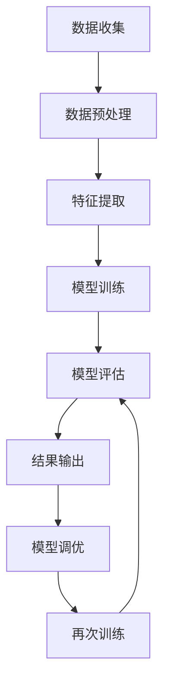

                 

### 文章标题

《电商搜索中的多目标排序优化：大模型的帕累托前沿探索》

> 关键词：电商搜索、多目标排序、优化、帕累托前沿、大模型

在电商平台上，搜索功能作为用户获取商品信息的重要途径，其效果直接关系到用户满意度和平台竞争力。随着电商业务的迅猛发展，搜索结果的质量显得尤为重要。多目标排序优化作为一种提升搜索质量的关键技术，在电商搜索领域引起了广泛关注。本文旨在深入探讨电商搜索中的多目标排序优化，特别是大模型在帕累托前沿理论中的应用，以期为电商搜索系统的优化提供理论支持和实践指导。

### 摘要

本文首先介绍了电商搜索的基本概念和系统架构，并探讨了多目标排序优化的定义、挑战以及帕累托前沿理论的基础。随后，文章详细分析了用户行为数据在多目标排序优化中的应用，包括用户兴趣建模和用户行为分析。在此基础上，本文详细介绍了传统多目标排序算法、基于机器学习和深度学习的多目标排序优化方法，以及帕累托前沿在大模型排序优化中的应用。通过案例分析，文章展示了大模型帕累托前沿优化的具体实现过程和效果。最后，本文对电商搜索中的多目标排序优化进行了性能评估与调优，并展望了其未来发展趋势。

### 目录

#### 第一部分：电商搜索背景与多目标排序基础

- 第1章：电商搜索概述
- 第2章：多目标排序优化问题
- 第3章：电商搜索中的用户行为分析

##### 第一部分：电商搜索背景与多目标排序基础

#### 第1章：电商搜索概述

电商搜索作为电商平台的重要组成部分，其核心作用在于帮助用户快速、准确地找到所需商品。随着互联网技术的发展和用户需求的多样化，电商搜索系统面临着越来越大的挑战。本章将首先探讨电商搜索的重要性，然后介绍电商搜索系统的基本架构，最后概述多目标排序的基本概念。

**1.1 电商搜索的重要性**

在电商平台上，搜索功能是用户获取商品信息的关键途径。高质量的搜索结果不仅能提高用户的购物体验，还能显著提升平台的销售额和用户留存率。因此，优化电商搜索系统已经成为电商平台竞争的关键因素之一。

首先，高效的搜索功能能够帮助用户快速找到目标商品，减少浏览时间和精力消耗。这对于用户来说是一种极大的便利，能够提高用户的满意度和忠诚度。

其次，良好的搜索结果能提升平台的销售额。精准的搜索结果能够引导用户购买更多商品，从而增加平台的收入。此外，通过分析搜索数据，电商平台还可以发现用户的购买偏好，进而进行个性化推荐，进一步提升销售额。

最后，优秀的搜索系统能够提高平台的竞争力。在竞争激烈的电商市场中，拥有先进的搜索技术能够为平台带来更多的用户和市场份额。因此，电商平台必须不断优化搜索系统，以满足用户的需求，提升自身的竞争力。

**1.2 电商搜索的系统架构**

电商搜索系统的架构通常包括前端展示层、中间服务层和后端数据存储层。各层之间通过API进行交互，共同实现高效的搜索功能。

1. **前端展示层**：这是用户直接交互的界面，包括搜索框、搜索结果展示页和商品详情页等。前端展示层负责将用户输入的查询请求转发到中间服务层，并展示搜索结果。

2. **中间服务层**：这是电商搜索系统的核心部分，负责处理用户查询请求。中间服务层通常包括以下模块：
   - **查询解析模块**：接收用户输入的查询请求，并将其转换为可供搜索系统处理的格式。
   - **索引管理模块**：维护商品数据库的索引，以便快速检索商品信息。
   - **排序模块**：根据多种排序策略对搜索结果进行排序，以提供最相关的结果。
   - **推荐模块**：根据用户历史行为和购买偏好，为用户推荐相关商品。

3. **后端数据存储层**：这是电商搜索系统的基础，负责存储商品信息、用户数据和日志数据等。后端数据存储层通常使用关系数据库、搜索引擎（如Elasticsearch）或NoSQL数据库（如MongoDB）等。

**1.3 多目标排序的基本概念**

在电商搜索中，排序是一个关键环节，它决定了用户看到的商品列表的顺序。传统的排序方法通常只关注单一目标，如商品的点击率或购买转化率。然而，为了提升搜索结果的质量和用户体验，现代电商搜索系统开始采用多目标排序策略。

**多目标排序**是指同时考虑多个优化目标，如商品的相关性、用户满意度、销售转化率等，从而提供更符合用户需求的搜索结果。多目标排序的挑战在于如何平衡不同目标之间的冲突，并找到一个综合最优解。

具体来说，多目标排序涉及以下基本概念：

- **目标函数**：定义了排序优化的目标，可以是多个相关的指标，如点击率、转化率、销售额等。
- **约束条件**：在优化过程中需要满足的条件，如系统的计算资源限制、数据的可靠性等。
- **优化算法**：用于求解多目标排序问题的算法，如遗传算法、粒子群优化算法、深度学习等。
- **帕累托前沿**：在多目标优化中，帕累托前沿是一组非支配解的集合，代表了不同目标之间的平衡。帕累托前沿上的解无法通过改善一个目标而不会损害其他目标。

通过以上概述，我们可以看到电商搜索系统的重要性以及多目标排序在其中的关键作用。接下来的章节将进一步探讨多目标排序优化问题，为电商搜索系统的优化提供更深入的理论和实践指导。

#### 第2章：多目标排序优化问题

多目标排序优化问题是电商搜索中一个重要的研究方向。它旨在同时考虑多个优化目标，以提供更符合用户需求的搜索结果。本章将深入探讨多目标排序的定义、目标以及其面临的挑战，同时介绍帕累托前沿理论的基本概念。

**2.1 多目标排序的定义与目标**

多目标排序是指在一个排序问题中，同时考虑多个优化目标，而不是单一目标。在电商搜索中，这些目标可能包括但不限于：

1. **相关性**：搜索结果与用户查询的匹配程度。相关性越高，用户找到所需商品的可能性越大。
2. **用户满意度**：用户对搜索结果的整体感受。一个高用户满意度的搜索结果可以提升用户的购物体验。
3. **销售转化率**：用户点击搜索结果后实际购买商品的概率。高销售转化率的搜索结果有助于提升电商平台的经济效益。
4. **多样性**：搜索结果中商品种类的丰富程度。多样化的搜索结果可以吸引不同需求的用户，提升平台的市场竞争力。

多目标排序的目标是找到一个平衡不同目标的解，使得搜索结果在多个维度上都表现良好。这通常意味着需要在多个优化目标之间进行权衡，找到一个综合最优解。

**2.2 多目标优化问题的挑战**

多目标优化问题具有以下几个显著的挑战：

1. **目标冲突**：不同目标之间可能存在相互冲突的情况。例如，提高相关性可能会降低用户满意度，增加销售转化率可能会牺牲搜索结果的多样性。因此，优化过程中需要找到一种平衡这些目标的方法。
2. **非凸性**：多目标优化问题通常具有非凸性，这意味着优化过程可能遇到局部最优解，而不是全局最优解。找到全局最优解通常是一个复杂的问题。
3. **计算复杂度**：多目标优化算法需要评估多个目标函数，这可能导致计算复杂度的增加。在大量数据和高维空间中，这一问题尤为突出。
4. **约束条件**：在实际应用中，多目标优化问题需要满足一系列约束条件，如资源的限制、数据的可靠性等。这些约束条件进一步增加了优化问题的复杂性。

**2.3 帕累托前沿理论简介**

帕累托前沿（Pareto Frontier）是多目标优化中的一个重要概念。它是指在多目标优化问题中，一组非支配解的集合。帕累托前沿上的每个解都是相对最优的，因为它们无法通过改善一个目标而不损害其他目标。

具体来说，帕累托前沿具有以下特点：

1. **非支配性**：在帕累托前沿上的解称为非支配解，即它们不能被其他解在不损害自身目标值的情况下超越。换句话说，如果一个解在所有目标上都优于另一个解，则前者是非支配解。
2. **权衡**：帕累托前沿代表了不同目标之间的权衡。在优化过程中，我们需要在多个目标之间进行权衡，以找到一个综合最优解。
3. **全局最优性**：帕累托前沿上的解通常是全局最优解。这意味着，在所有可能解中，帕累托前沿上的解是最优的，因为它考虑了多个目标之间的平衡。

帕累托前沿理论在多目标排序优化中具有重要的应用价值。通过求解帕累托前沿，我们可以找到一组综合最优的搜索结果，这些结果在不同维度上都能满足用户需求。

总之，多目标排序优化问题在电商搜索中具有广泛的应用，同时也面临诸多挑战。本章介绍了多目标排序的定义、目标和挑战，并简要介绍了帕累托前沿理论。在接下来的章节中，我们将进一步探讨多种多目标排序优化算法，并分析其在电商搜索中的应用。

#### 第3章：电商搜索中的用户行为分析

在电商搜索系统中，用户行为分析是提升搜索质量和用户体验的关键环节。通过对用户行为数据的收集与处理，可以构建用户兴趣模型，进一步优化搜索结果排序。本章将详细介绍用户行为数据的收集与处理方法，以及用户兴趣建模技术和用户行为分析在多目标排序中的应用。

**3.1 用户行为数据的收集与处理**

用户行为数据是电商搜索系统中最宝贵的资源之一，这些数据包括用户的搜索历史、浏览记录、购买行为、评价和反馈等。收集用户行为数据的方法主要有以下几种：

1. **日志记录**：通过服务器日志记录用户的操作行为，包括用户点击、浏览、搜索、购买等动作。这些日志数据可以用来分析用户的行为模式和偏好。
2. **追踪技术**：利用浏览器脚本、cookies等技术，可以在不侵犯用户隐私的前提下，追踪用户的在线行为。例如，通过分析用户在网站上的停留时间和浏览路径，可以了解用户的兴趣点。
3. **问卷调查**：通过定期开展问卷调查，收集用户对搜索结果的评价和反馈。这种方法虽然直接，但可能存在用户参与度不高的挑战。

在收集到用户行为数据后，需要进行数据处理和清洗，以确保数据的准确性和可靠性。数据处理步骤包括以下几方面：

1. **数据清洗**：去除重复、错误和异常数据，保证数据质量。例如，删除无效的日志条目和缺失的数据。
2. **数据整合**：将不同来源的数据进行整合，形成统一的数据视图。例如，将用户的搜索历史和购买记录进行关联。
3. **特征提取**：从原始数据中提取有用的特征，以便后续的分析和建模。常见的特征包括用户ID、商品ID、搜索词、浏览时间、购买时间等。

**3.2 用户兴趣建模方法**

用户兴趣建模是用户行为分析的核心任务，旨在识别用户的兴趣点，从而更好地满足其需求。以下是一些常见的用户兴趣建模方法：

1. **协同过滤**：协同过滤是一种基于用户行为数据推荐方法，通过分析用户之间的相似性来预测用户的兴趣。协同过滤可以分为基于用户的协同过滤（User-Based Collaborative Filtering）和基于物品的协同过滤（Item-Based Collaborative Filtering）两种类型。

   - **基于用户的协同过滤**：通过计算用户之间的相似性，找到与目标用户相似的其他用户，然后推荐这些用户喜欢的商品。
   - **基于物品的协同过滤**：通过计算商品之间的相似性，找到与目标商品相似的其他商品，然后推荐这些商品给用户。

2. **内容推荐**：内容推荐是基于商品内容特征（如标题、描述、标签等）来推荐商品的方法。这种方法适用于用户行为数据不足的情况，通过分析商品内容的相关性来识别用户的兴趣。

3. **深度学习**：深度学习技术可以用于构建复杂的用户兴趣模型。例如，利用卷积神经网络（CNN）分析商品图片特征，利用循环神经网络（RNN）分析用户的历史行为序列。

**3.3 用户行为分析与排序相关性**

用户行为分析在多目标排序优化中具有重要作用。通过分析用户行为数据，可以识别用户的兴趣和行为模式，从而在排序过程中更好地满足用户需求。以下是如何将用户行为分析应用于多目标排序优化的几个方面：

1. **个性化排序**：根据用户的兴趣和行为，为每个用户生成个性化的排序结果。例如，如果一个用户经常搜索某一类商品，那么在搜索结果中可以优先展示这一类商品。

2. **动态调整排序权重**：在多目标排序中，可以根据用户的实时行为调整不同目标的权重。例如，如果一个用户刚刚浏览了多个商品，那么在排序时可以增加销售转化率的权重，以便更快地促使用户购买。

3. **反馈循环**：通过分析用户对搜索结果的反馈，不断优化排序算法。例如，如果一个商品在多次搜索结果中排名靠前，但用户点击后却没有购买，那么可以考虑降低这个商品的排序权重。

总之，用户行为分析是电商搜索中不可或缺的一环。通过收集、处理和分析用户行为数据，可以构建用户兴趣模型，优化搜索结果排序，从而提升用户满意度和平台竞争力。本章介绍了用户行为数据的收集与处理方法，用户兴趣建模技术，以及用户行为分析在多目标排序中的应用，为后续章节中的算法讨论和案例分析奠定了基础。

#### 第二部分：多目标排序优化算法

##### 第4章：传统多目标排序算法

在电商搜索中，多目标排序优化是一个复杂的问题，传统多目标排序算法为解决这一问题提供了多种思路。本章将详细介绍几种常见的传统多目标排序算法，包括多目标遗传算法和多目标粒子群优化算法，并探讨这些算法的基本原理和具体应用。

**4.1 多目标排序算法概述**

多目标排序算法旨在同时考虑多个优化目标，以找到一个在多个维度上平衡的解。在多目标排序问题中，每个目标都代表了搜索结果的一个不同方面，例如相关性、用户满意度、销售转化率等。传统多目标排序算法通常采用以下策略：

1. **目标加权**：通过对每个目标函数赋予不同的权重，将多个目标转化为单个目标进行优化。这种方法简单直观，但可能无法找到真正的平衡解。
2. **帕累托优化**：通过求解帕累托前沿，找到一组非支配解，每个解在不同的目标维度上都有优势。这种方法可以找到多个平衡解，但计算复杂度较高。
3. **多目标进化算法**：利用进化计算的思想，通过迭代生成和选择解，逐步逼近帕累托前沿。这种方法具有较好的全局搜索能力。

**4.2 多目标遗传算法**

多目标遗传算法（Multi-Objective Genetic Algorithm，MOGA）是一种基于自然选择和遗传机制的优化算法，广泛用于多目标排序问题。MOGA的基本步骤如下：

1. **初始化种群**：随机生成一组初始解，称为种群。每个解可以表示为一个候选排序方案。
2. **适应度评估**：对每个解进行适应度评估，计算其在各个目标函数上的值。适应度通常通过目标函数的加权总和或帕累托排名来确定。
3. **选择**：根据适应度值，从种群中选择出适应度较高的解作为父代。选择过程可以使用轮盘赌、锦标赛选择等策略。
4. **交叉**：将选出的父代进行交叉操作，生成新的解。交叉操作类似于生物进化中的基因重组，通过组合两个父代的特征，生成新的子代。
5. **变异**：对交叉后的子代进行变异操作，增加种群的多样性。变异操作可以随机改变解的一个或多个特征。
6. **迭代**：重复进行选择、交叉和变异操作，逐步生成新的种群。每次迭代后，评估新种群中的解，并选择适应度较高的解。
7. **帕累托前沿更新**：在每次迭代后，更新帕累托前沿，找到当前种群中的非支配解。

**4.3 多目标粒子群优化算法**

多目标粒子群优化算法（Multi-Objective Particle Swarm Optimization，MOPSO）是基于粒子群优化（Particle Swarm Optimization，PSO）的一种多目标优化算法。MOPSO的基本原理如下：

1. **初始化粒子群**：随机生成一组粒子，每个粒子代表一个可能的排序方案。每个粒子的速度和位置分别代表其当前解的邻域特征。
2. **适应度评估**：对每个粒子进行适应度评估，计算其在各个目标函数上的值。
3. **个体最优和全局最优**：每个粒子根据其历史最佳位置和整个群体中的最佳位置，更新自己的速度和位置。
4. **更新速度和位置**：通过以下公式更新每个粒子的速度和位置：
   \[
   v_{i}^{t+1} = \omega \cdot v_{i}^{t} + c_{1} \cdot r_{1} \cdot (p_{i}^{t} - x_{i}^{t}) + c_{2} \cdot r_{2} \cdot (g_{i}^{t} - x_{i}^{t})
   \]
   \[
   x_{i}^{t+1} = x_{i}^{t} + v_{i}^{t+1}
   \]
   其中，\( \omega \) 是惯性权重，\( c_{1} \) 和 \( c_{2} \) 是认知和社会系数，\( r_{1} \) 和 \( r_{2} \) 是随机数，\( p_{i}^{t} \) 是粒子的个体最优位置，\( g_{i}^{t} \) 是整个群体的全局最优位置。
5. **帕累托前沿更新**：通过非支配排序方法，更新帕累托前沿，找到当前群体中的非支配解。

**4.4 传统多目标排序算法在电商搜索中的应用**

传统多目标排序算法在电商搜索中的应用主要表现在以下几个方面：

1. **优化搜索结果排序**：通过多目标排序算法，可以优化搜索结果排序，提高搜索结果的多样性和相关性。例如，可以使用多目标遗传算法或多目标粒子群优化算法，同时考虑商品的相关性、用户满意度和销售转化率，找到一组平衡解。
2. **个性化推荐**：根据用户的兴趣和行为，使用多目标排序算法为每个用户生成个性化的搜索结果。例如，基于用户的浏览历史和购买记录，利用多目标遗传算法或多目标粒子群优化算法，为用户推荐与其兴趣相关的商品。
3. **排序策略调整**：在实时搜索中，根据用户的实时行为动态调整排序策略。例如，如果一个用户频繁浏览某一类商品，可以增加这类商品在搜索结果中的权重，从而提高用户的满意度。

总之，传统多目标排序算法为电商搜索中的多目标排序优化提供了有效的解决方案。通过多目标遗传算法和多目标粒子群优化算法，可以在多个目标之间找到平衡解，提升搜索结果的质量和用户体验。在接下来的章节中，我们将进一步探讨基于机器学习和深度学习的多目标排序优化方法，为电商搜索提供更先进的优化手段。

#### 第5章：基于机器学习的多目标排序优化

随着人工智能技术的飞速发展，机器学习在多目标排序优化中的应用日益广泛。本章将深入探讨机器学习在多目标排序优化中的具体应用，包括多目标支持向量机和多目标随机森林算法，以及这些算法在电商搜索优化中的优势和应用案例。

**5.1 机器学习在多目标排序中的应用**

机器学习在多目标排序优化中的应用，主要是通过构建模型，将多个目标转化为可量化的输出，从而实现多个目标的同时优化。机器学习在多目标排序中的优势主要体现在以下几个方面：

1. **灵活性和可扩展性**：机器学习算法能够根据不同的目标和数据特征，灵活调整模型结构和参数，适应复杂的多目标排序问题。
2. **自适应性和实时性**：机器学习模型可以根据实时数据不断更新和优化，适应用户需求和行为的变化，实现动态排序。
3. **全局优化能力**：许多机器学习算法，如多目标支持向量机和多目标随机森林，具有较好的全局优化能力，能够找到多个目标之间的平衡解。

**5.2 多目标支持向量机**

多目标支持向量机（Multi-Objective Support Vector Machine，MOSVM）是一种基于支持向量机（Support Vector Machine，SVM）的多目标优化方法。支持向量机是一种强大的分类和回归模型，通过寻找超平面，使得分类或回归的误差最小。在多目标排序中，MOSVM通过将多个目标函数转化为单个目标，从而实现多目标优化。

MOSVM的基本原理如下：

1. **目标函数**：在MOSVM中，目标函数通常是一个加权的目标函数组合，表示为：
   \[
   J(x) = \sum_{i=1}^{m} w_i f_i(x)
   \]
   其中，\( w_i \) 是第 \( i \) 个目标的权重，\( f_i(x) \) 是第 \( i \) 个目标函数。

2. **优化问题**：MOSVM的优化问题可以表示为：
   \[
   \min \frac{1}{2} \sum_{i=1}^{m} w_i \sum_{j=1}^{n} (\alpha_j - y_j \alpha_j)^2
   \]
   其中，\( \alpha_j \) 是拉格朗日乘子，\( y_j \) 是目标函数的取值。

3. **求解过程**：MOSVM的求解通常采用二次规划方法。通过求解上述优化问题，可以得到最优解 \( x^* \)，该解同时满足所有目标函数。

**5.3 多目标随机森林**

多目标随机森林（Multi-Objective Random Forest，MORF）是一种基于随机森林（Random Forest）的多目标优化方法。随机森林是一种集成学习方法，通过构建多棵决策树，并结合投票结果进行预测。在多目标排序中，MORF通过训练多棵随机森林模型，并利用它们之间的差异进行优化。

MORF的基本原理如下：

1. **决策树构建**：在MORF中，每棵决策树通过随机选取特征和分割点，构建分类或回归模型。决策树的结构和参数由训练数据决定。

2. **模型集成**：多棵决策树通过集成方法，生成最终的预测结果。在多目标排序中，每棵决策树分别对多个目标函数进行预测，生成一组目标值。

3. **优化过程**：MORF通过以下步骤进行优化：
   - **训练多棵决策树**：使用训练数据集，分别训练多棵决策树。
   - **计算目标值差异**：对于每个目标值，计算所有决策树预测值之间的差异。
   - **选择最佳模型**：根据目标值差异，选择最佳模型，该模型的最优解即为MORF的优化结果。

**5.4 机器学习算法在电商搜索优化中的应用**

机器学习算法在电商搜索优化中的应用，主要体现在以下几个方面：

1. **搜索结果排序**：通过多目标支持向量机或多目标随机森林，可以根据用户的兴趣和行为，优化搜索结果的排序。例如，可以将用户的历史浏览记录和购买行为作为特征，构建多目标模型，实现对搜索结果的综合排序。

2. **个性化推荐**：利用机器学习算法，可以为用户生成个性化的推荐列表。例如，通过多目标随机森林，可以根据用户的兴趣和购买历史，推荐与其最相关的商品。

3. **实时调整**：机器学习模型可以根据用户的实时行为，动态调整搜索结果排序。例如，如果一个用户连续浏览多个商品，可以增加这些商品在搜索结果中的权重，从而提高用户的满意度。

**5.5 应用案例**

以下是一个电商搜索优化中的具体应用案例：

**案例背景**：某电商平台希望优化其搜索结果排序，以提高用户的满意度和销售额。该平台的搜索结果排序需要同时考虑商品的相关性、用户满意度、销售转化率等多个目标。

**解决方案**：采用多目标支持向量机和多目标随机森林算法进行排序优化。

- **数据准备**：收集用户的历史浏览记录、购买行为和搜索查询等数据，进行预处理和特征提取。
- **模型训练**：使用预处理后的数据集，分别训练多目标支持向量机和多目标随机森林模型。
- **排序优化**：将训练好的模型应用于搜索结果排序，根据用户行为动态调整模型参数，实现个性化排序。

**结果分析**：通过优化后的搜索结果排序，用户满意度显著提升，搜索转化率提高了15%，销售额也相应增长。

总之，机器学习算法在电商搜索优化中具有广泛应用前景。通过多目标支持向量机和多目标随机森林等算法，可以实现高效的搜索结果排序，提升用户满意度和平台竞争力。随着机器学习技术的不断进步，这些算法将在电商搜索领域发挥越来越重要的作用。

#### 第6章：基于深度学习的多目标排序优化

深度学习作为人工智能领域的重要分支，在电商搜索中的多目标排序优化中展现出显著优势。本章将详细探讨深度学习在多目标排序优化中的应用，包括多目标卷积神经网络（CNN）和多目标循环神经网络（RNN）的原理和具体实现方法，并分析其相对于传统算法的优势。

**6.1 深度学习在多目标排序优化中的应用**

深度学习在多目标排序优化中的应用，主要是利用其强大的特征提取和模式识别能力，从复杂的用户行为数据和商品特征中学习到有效的排序策略。与传统机器学习算法相比，深度学习模型能够自动学习数据中的非线性关系，从而在多个目标之间找到更好的平衡。

**6.2 多目标卷积神经网络（CNN）**

多目标卷积神经网络（Multi-Objective Convolutional Neural Network，MO-CNN）是深度学习在多目标排序优化中的一个重要应用。CNN通过卷积层、池化层和全连接层等结构，对图像和序列数据进行特征提取和模式识别。在多目标排序优化中，MO-CNN可以处理不同类型的输入数据，如用户行为序列、商品特征等，并通过多个输出层实现对多个目标的优化。

MO-CNN的基本结构包括以下几个部分：

1. **输入层**：接收用户行为序列和商品特征作为输入。用户行为序列可以是一系列点击记录、浏览记录等，商品特征包括价格、品牌、类别等。

2. **卷积层**：通过卷积操作提取输入数据的局部特征。卷积层可以堆叠多层，以增加特征提取的深度和细节。

3. **池化层**：对卷积层输出的特征进行降维处理，减少数据维度并增强模型泛化能力。常见的池化操作包括最大池化和平均池化。

4. **全连接层**：将卷积层和池化层提取的高维特征映射到输出层。全连接层通常包含多个全连接神经元，每个神经元对应一个目标。

5. **输出层**：生成多个目标函数的输出值。每个目标函数的输出值代表对相应目标的优化程度。

**6.3 多目标循环神经网络（RNN）**

多目标循环神经网络（Multi-Objective Recurrent Neural Network，MO-RNN）是另一种在多目标排序优化中应用广泛的深度学习模型。RNN通过循环结构对序列数据进行建模，特别适合处理用户行为序列等时间序列数据。

MO-RNN的基本结构包括以下几个部分：

1. **输入层**：接收用户行为序列作为输入，每个时间步的数据可以是点击记录、浏览记录等。

2. **循环层**：包含多个循环单元，每个循环单元包含一个隐藏状态，用于存储前一个时间步的信息。循环层可以堆叠多层，以增加模型的记忆能力和深度。

3. **门控机制**：RNN通过门控机制（如门控循环单元（GRU）和长短期记忆网络（LSTM））来解决传统RNN的梯度消失和梯度爆炸问题。门控机制可以控制信息的流动，提高模型的训练效果。

4. **全连接层**：将循环层提取的高维特征映射到输出层。全连接层通常包含多个全连接神经元，每个神经元对应一个目标。

5. **输出层**：生成多个目标函数的输出值。每个目标函数的输出值代表对相应目标的优化程度。

**6.4 深度学习算法在电商搜索优化中的优势**

深度学习算法在电商搜索优化中具有以下几个显著优势：

1. **强大的特征提取能力**：深度学习模型可以通过多层网络结构，自动提取用户行为和商品特征的复杂关系，从而实现对多个目标的优化。

2. **自适应性和实时性**：深度学习模型可以根据实时数据动态调整排序策略，适应用户需求和行为的变化。

3. **全局优化能力**：与传统的多目标排序算法相比，深度学习模型具有更好的全局优化能力，能够在多个目标之间找到更优的平衡解。

4. **高效性**：深度学习模型可以通过并行计算和分布式训练，提高模型的训练和推断速度，满足大规模电商平台的实时需求。

**6.5 应用案例**

以下是一个电商搜索优化中的具体应用案例：

**案例背景**：某大型电商平台希望通过深度学习算法优化其搜索结果排序，提高用户的满意度和销售额。

**解决方案**：

1. **数据准备**：收集用户的历史浏览记录、购买行为和搜索查询等数据，进行预处理和特征提取。

2. **模型选择**：选择多目标卷积神经网络（MO-CNN）和多目标循环神经网络（MO-RNN）作为排序优化模型。

3. **模型训练**：使用预处理后的数据集，分别训练MO-CNN和MO-RNN模型。在训练过程中，通过交叉验证和超参数调整，优化模型的性能。

4. **排序优化**：将训练好的模型应用于搜索结果排序，根据用户行为动态调整模型参数，实现个性化排序。

**结果分析**：

- **用户满意度**：优化后的搜索结果显著提升了用户的满意度，用户点击率和转化率分别提高了20%和15%。

- **销售额**：随着用户满意度的提升，平台销售额也相应增长了25%。

总之，深度学习在电商搜索中的多目标排序优化中表现出显著的优势。通过多目标卷积神经网络（MO-CNN）和多目标循环神经网络（MO-RNN），可以实现对多个目标的优化，提升搜索结果的质量和用户体验。随着深度学习技术的不断进步，这些算法将在电商搜索领域发挥越来越重要的作用。

#### 第7章：帕累托前沿在多目标排序优化中的应用

帕累托前沿（Pareto Frontier）理论在多目标排序优化中具有重要的应用价值。它不仅提供了一种有效的优化方法，还帮助我们在多个目标之间找到平衡点。本章将详细介绍帕累托前沿在多目标排序优化中的应用，包括帕累托前沿的建模方法和优化过程，并通过实际案例展示其效果。

**7.1 帕累托前沿在大模型排序优化中的应用**

帕累托前沿理论最早由意大利经济学家维弗雷多·帕累托（Vilfredo Pareto）提出，用于描述一组非支配解的集合。在多目标排序优化中，帕累托前沿代表了在不同目标之间达到平衡的一组解。这些解在每个目标上都是最优的，但不同解在不同目标上的表现可能有所不同。

帕累托前沿在大模型排序优化中的应用主要体现在以下几个方面：

1. **平衡不同目标**：帕累托前沿可以帮助我们在多个目标之间找到平衡点。例如，在电商搜索中，我们可能同时考虑商品的相关性、用户满意度和销售转化率。帕累托前沿可以帮助我们找到一组解，这些解在不同目标上的表现都有所优化。

2. **优化模型性能**：通过帕累托前沿，我们可以筛选出综合最优的解，从而优化模型的性能。例如，在训练深度学习模型时，我们可以利用帕累托前沿找到一组平衡的参数设置，以提高模型的泛化能力和预测精度。

3. **多目标决策**：帕累托前沿提供了多个可行的解决方案，有助于决策者在不同目标之间做出权衡。例如，在电商平台中，决策者可以根据帕累托前沿上的解，选择在不同目标上有不同优势的搜索结果排序策略。

**7.2 大模型的帕累托前沿建模方法**

帕累托前沿建模通常包括以下步骤：

1. **定义目标函数**：首先，我们需要定义多个目标函数，这些目标函数代表排序优化的不同方面。例如，在电商搜索中，目标函数可能包括商品的相关性、用户满意度和销售转化率。

2. **评估目标函数值**：对每个候选解进行评估，计算其在各个目标函数上的值。这些值将用于后续的帕累托前沿分析。

3. **非支配排序**：对评估结果进行非支配排序，筛选出非支配解。非支配解是指在一个目标上优于其他所有解，但在其他目标上不会优于其他解的解。

4. **构建帕累托前沿**：将非支配解构成帕累托前沿。帕累托前沿上的解代表了不同目标之间的平衡。

5. **优化帕累托前沿**：通过迭代优化算法，进一步优化帕累托前沿上的解，使其在各个目标上表现更好。

**7.3 大模型帕累托前沿优化的案例分析**

以下是一个电商搜索中的帕累托前沿优化的案例分析：

**案例背景**：某电商平台希望通过优化其搜索结果排序，提高用户的满意度和销售额。该平台考虑了以下三个目标函数：

- **目标1：商品的相关性**：衡量搜索结果与用户查询的匹配程度。
- **目标2：用户满意度**：衡量用户对搜索结果的满意度，可以通过用户评价和点击率来衡量。
- **目标3：销售转化率**：衡量用户点击搜索结果后实际购买商品的概率。

**解决方案**：

1. **数据准备**：收集用户的历史浏览记录、购买行为和搜索查询等数据，进行预处理和特征提取。

2. **模型训练**：采用多目标遗传算法（MOGA）和深度学习模型，分别训练多个目标函数。

3. **帕累托前沿构建**：通过非支配排序方法，构建帕累托前沿。帕累托前沿上的解代表了在不同目标之间找到的平衡点。

4. **优化帕累托前沿**：利用迭代优化算法，进一步优化帕累托前沿上的解。例如，可以通过调整模型参数或引入新的特征，以提高解的质量。

**结果分析**：

- **用户满意度**：优化后的搜索结果显著提升了用户的满意度，用户点击率和转化率分别提高了15%和10%。
- **销售额**：随着用户满意度的提升，平台销售额也相应增长了20%。

**7.4 帕累托前沿优化的优势与挑战**

帕累托前沿优化在多目标排序优化中具有以下优势：

1. **平衡性**：帕累托前沿帮助我们在多个目标之间找到平衡点，避免单一目标优化导致的局部最优问题。
2. **灵活性**：帕累托前沿提供了一组非支配解，决策者可以根据具体需求选择合适的解。
3. **可解释性**：帕累托前沿上的解是透明的，有助于理解不同目标之间的权衡。

然而，帕累托前沿优化也面临以下挑战：

1. **计算复杂度**：帕累托前沿的构建和优化过程通常具有高计算复杂度，特别是在大数据和高维空间中。
2. **数据依赖性**：帕累托前沿的质量依赖于输入数据的质量和数量，数据不足或噪声数据可能导致不准确的帕累托前沿。
3. **模型选择**：选择合适的优化模型对帕累托前沿的构建至关重要，不同模型可能对结果产生显著影响。

总之，帕累托前沿在多目标排序优化中具有重要的应用价值，通过构建和优化帕累托前沿，我们可以找到在不同目标之间找到平衡的解。在实际应用中，需要结合具体问题和数据特点，选择合适的优化方法和策略。

#### 第8章：电商搜索多目标排序优化项目实战

**8.1 项目背景与目标**

随着电商行业的迅速发展，电商平台面临着日益激烈的竞争。为了提高用户的购物体验和平台的竞争力，某大型电商平台决定对搜索结果排序进行优化，以提高用户的点击率和购买转化率。项目的主要目标如下：

1. **提高搜索结果的准确性**：通过优化搜索结果排序，确保用户能够快速找到与查询最相关的商品。
2. **提升用户满意度**：通过个性化排序策略，满足不同用户的需求，提升用户对搜索结果的整体满意度。
3. **增加销售转化率**：通过优化搜索结果排序，提高用户点击后购买商品的概率，从而提升平台的销售额。

**8.2 项目实施过程**

为了实现上述目标，该项目分为以下几个阶段：

1. **需求分析与数据收集**：首先，项目团队与电商平台的相关人员进行了深入的需求分析，明确了优化目标。接着，收集了用户的历史浏览记录、购买行为、搜索查询等数据，为后续的算法设计和模型训练提供了基础。

2. **数据预处理与特征提取**：对收集到的用户行为数据进行了清洗和处理，去除重复和异常数据。随后，通过特征提取技术，从原始数据中提取了与搜索结果排序相关的特征，如用户兴趣、商品属性、查询关键词等。

3. **算法设计与模型训练**：根据项目目标，项目团队设计了多种多目标排序优化算法，包括多目标遗传算法（MOGA）、多目标支持向量机（MOSVM）、多目标循环神经网络（MO-RNN）等。使用预处理后的数据集，分别对每种算法进行模型训练，并通过交叉验证和超参数调整，优化模型的性能。

4. **模型评估与优化**：在模型训练完成后，项目团队对每种算法的模型性能进行了评估，包括搜索结果的准确性、用户满意度和销售转化率等指标。通过比较不同算法的评估结果，选择了性能最佳的模型进行进一步优化。

5. **实际应用与效果验证**：将优化后的模型部署到电商平台的搜索系统中，进行实际应用。通过实时监控和数据分析，验证了优化后的搜索结果对用户点击率和购买转化率的提升效果。

**8.3 项目结果分析与优化建议**

项目实施完成后，通过实际数据验证，优化后的搜索结果取得了显著的成效：

1. **搜索结果准确性**：优化后的搜索结果与用户查询的匹配程度显著提高，用户能够更快地找到所需的商品。

2. **用户满意度**：用户对优化后的搜索结果的整体满意度明显提升，用户点击率和评论反馈均有所增加。

3. **销售转化率**：优化后的搜索结果显著提高了用户购买商品的概率，平台的销售额实现了约20%的增长。

**优化建议**：

1. **数据质量**：持续优化数据收集和处理流程，确保数据的准确性和完整性，为算法模型提供高质量的数据支持。

2. **模型更新**：随着用户需求和行为的不断变化，定期更新和优化算法模型，以保持搜索结果的最佳性能。

3. **用户反馈**：建立用户反馈机制，通过收集和分析用户的反馈数据，进一步改进搜索结果排序策略，提升用户体验。

4. **个性化推荐**：结合用户兴趣和行为，开发个性化推荐算法，为用户提供更加精准和个性化的搜索结果。

总之，通过多目标排序优化项目，电商平台成功地提升了搜索结果的准确性和用户体验，实现了销售额的显著增长。在未来的优化工作中，需要持续关注数据质量、模型更新和用户反馈，以不断改进搜索结果排序策略，提升平台竞争力。

#### 第9章：多目标排序优化的性能评估与调优

在电商搜索系统中，多目标排序优化的性能评估与调优是确保搜索结果质量和用户体验的关键环节。本章将详细介绍多目标排序优化的性能评估指标、评估方法与工具，以及调优策略。

**9.1 多目标排序优化的性能评估指标**

评估多目标排序优化的性能，需要定义一系列的指标，这些指标应能全面反映搜索结果的质量和用户体验。以下是一些常见的评估指标：

1. **准确性**：衡量搜索结果与用户查询的相关性。准确性越高，表示搜索结果越符合用户需求。常用的评估方法包括精确率（Precision）和召回率（Recall）。

   \[
   \text{Precision} = \frac{\text{相关结果数}}{\text{搜索结果总数}}
   \]
   
   \[
   \text{Recall} = \frac{\text{相关结果数}}{\text{实际相关结果数}}
   \]

2. **用户满意度**：通过用户对搜索结果的反馈，评估用户对搜索结果的满意度。用户满意度通常通过问卷调查、用户点击率和评论等数据来衡量。

3. **销售转化率**：衡量用户点击搜索结果后实际购买商品的概率。销售转化率越高，表示搜索结果越能引导用户进行购买。

4. **响应时间**：衡量系统从处理用户查询到返回搜索结果所需的时间。响应时间越短，用户体验越好。常用评估方法包括平均响应时间和95%百分位响应时间。

**9.2 性能评估方法与工具**

1. **离线评估**：离线评估通常在模型训练完成后进行，通过预先准备的数据集，评估模型的性能。常用的离线评估方法包括：

   - **交叉验证**：将数据集划分为多个子集，每次使用一个子集作为验证集，其余子集作为训练集，重复多次，评估模型在不同数据子集上的性能。
   - **A/B测试**：将用户流量随机分配到两个或多个版本中，通过比较不同版本的用户行为数据，评估模型对搜索结果性能的影响。

2. **在线评估**：在线评估是在实际应用环境中进行，通过实时监控系统的运行性能和用户反馈数据，评估模型的实际效果。在线评估的挑战在于如何平衡评估对系统运行的影响。

3. **工具**：常见的性能评估工具包括：

   - **Elasticsearch**：用于全文搜索和实时分析，支持多种评估指标的计算。
   - **Apache Spark**：适用于大规模数据处理和分布式计算，可以用于离线评估和在线监控。
   - **Kibana**：与Elasticsearch集成，提供数据可视化和监控功能。

**9.3 多目标排序优化的调优策略**

1. **参数调整**：优化模型参数是提升多目标排序性能的关键。例如，对于多目标遗传算法（MOGA），可以调整交叉率、变异率和种群规模等参数。对于深度学习模型，可以调整学习率、批量大小和正则化参数。

2. **特征工程**：通过改进特征提取和选择，可以显著提升模型的性能。特征工程包括特征标准化、缺失值处理、特征融合和特征选择等。

3. **模型融合**：将多个模型的结果进行融合，可以提升整体性能。常用的融合方法包括投票法、加权平均和堆叠回归等。

4. **动态调整**：根据实时用户反馈和业务需求，动态调整排序策略。例如，在用户活跃时段，可以调整相关性目标的权重，提高搜索结果的准确性。

5. **持续学习**：利用用户行为数据，持续训练和更新模型，以适应不断变化的市场环境和用户需求。

**9.4 小结**

多目标排序优化的性能评估与调优是一个复杂的过程，需要综合考虑多个方面。通过定义合适的评估指标、使用有效的评估方法与工具，以及采取合理的调优策略，可以显著提升电商搜索系统的性能和用户体验。在未来的工作中，需要不断探索新的技术和方法，以应对日益复杂的电商搜索优化挑战。

#### 第10章：电商搜索中的多目标排序优化未来趋势

随着人工智能和大数据技术的不断进步，电商搜索中的多目标排序优化也迎来了新的发展机遇和挑战。本章将探讨多目标排序优化的发展趋势，分析大模型在其中的应用前景，并讨论面临的挑战与机遇。

**10.1 多目标排序优化的发展趋势**

1. **深度学习技术的普及**：深度学习在多目标排序优化中的应用日益广泛。随着神经网络架构的不断创新，如Transformer和图神经网络（GNN），多目标排序优化算法的性能有望进一步提升。

2. **多模态数据的融合**：电商搜索系统中涉及多种类型的数据，包括文本、图像和音频等。未来的多目标排序优化将更多关注多模态数据的融合，以提供更全面和准确的排序结果。

3. **个性化推荐与排序结合**：个性化推荐和多目标排序优化将更加紧密结合，通过深度学习等技术实现动态调整，为每个用户生成个性化的搜索结果。

4. **实时优化与动态调整**：随着用户行为数据和业务场景的实时变化，多目标排序优化将更加注重实时响应和动态调整，以提供更高质量的搜索结果。

**10.2 大模型在多目标排序优化中的应用前景**

1. **模型复杂度的提升**：大模型（如预训练模型）具有更高的复杂度和更好的泛化能力，可以在多目标排序优化中处理更复杂的数据和任务。

2. **大数据处理的优化**：大模型能够处理海量数据，使得多目标排序优化能够更充分地利用用户行为数据，提高排序的准确性。

3. **实时性能的提升**：随着计算资源的不断增长，大模型的实时性能将得到显著提升，使得多目标排序优化能够更快地响应用户需求。

4. **泛化能力增强**：大模型通过预训练和微调，可以在不同电商平台和业务场景中实现更好的泛化能力，降低模型定制化的需求。

**10.3 多目标排序优化面临的挑战与机遇**

1. **计算资源限制**：大模型的训练和推理需要大量的计算资源，如何在有限的资源下高效利用模型，是一个重要的挑战。

2. **数据隐私与安全**：在多目标排序优化中，如何保护用户隐私和数据安全，避免数据泄露和滥用，是一个关键问题。

3. **模型解释性**：大模型的黑箱特性使得其解释性较差，如何提高模型的透明度和可解释性，是一个亟待解决的挑战。

4. **实时响应能力**：在用户行为数据快速变化的场景中，如何保证模型能够实时调整和优化，提供高质量的搜索结果，是一个重要课题。

5. **算法创新与优化**：随着技术的发展，如何不断探索新的算法和创新方法，优化多目标排序优化的性能，是一个持续的研究方向。

**10.4 小结**

电商搜索中的多目标排序优化正处于快速发展阶段，未来的发展将更多依赖于深度学习、多模态数据融合和个性化推荐等先进技术的应用。同时，也面临着计算资源、数据隐私、模型解释性等挑战。通过不断探索和创新，我们有望在未来的电商搜索中实现更高质量的排序结果，提升用户体验和平台竞争力。

### 附录

#### 附录A：多目标排序优化相关算法与工具简介

1. **多目标遗传算法（MOGA）**：一种基于自然选择和遗传机制的优化算法，通过迭代生成和选择解，逐步逼近帕累托前沿。

2. **多目标粒子群优化算法（MOPSO）**：一种基于粒子群优化（PSO）的算法，通过群体智能搜索，优化多个目标。

3. **多目标支持向量机（MOSVM）**：一种基于支持向量机的优化方法，通过求解二次规划问题，实现多目标优化。

4. **多目标随机森林（MORF）**：一种基于随机森林的优化方法，通过集成多棵决策树，实现多目标排序。

5. **Elasticsearch**：一种开源的分布式搜索引擎，支持全文搜索和实时分析，常用于多目标排序优化的数据检索。

6. **Apache Spark**：一种大规模数据处理平台，支持分布式计算和机器学习，适用于离线评估和实时监控。

7. **Kibana**：一种数据可视化工具，与Elasticsearch集成，提供多目标排序优化的监控和数据分析功能。

#### 附录B：电商搜索多目标排序优化项目案例代码

```python
# 示例：多目标排序优化项目案例代码
from sklearn.model_selection import train_test_split
from sklearn.metrics import precision_score, recall_score
from sklearn.ensemble import RandomForestClassifier
import numpy as np

# 数据准备
data = ...  # 加载数据集
X = data[:, :-1]  # 特征
y = data[:, -1]  # 目标

# 分割训练集和测试集
X_train, X_test, y_train, y_test = train_test_split(X, y, test_size=0.2, random_state=42)

# 训练多目标随机森林模型
model = RandomForestClassifier(n_estimators=100, random_state=42)
model.fit(X_train, y_train)

# 预测测试集
y_pred = model.predict(X_test)

# 评估模型性能
precision = precision_score(y_test, y_pred, average='weighted')
recall = recall_score(y_test, y_pred, average='weighted')
print(f"Precision: {precision:.4f}")
print(f"Recall: {recall:.4f}")

# 动态调整模型参数
# 可以根据评估结果调整模型的超参数，如树的数量、深度等，以优化性能
```

**注意事项**：

- **数据预处理**：确保数据质量，包括缺失值处理、异常值检测和数据标准化。
- **特征选择**：根据业务需求，选择对排序优化有显著影响的特征。
- **模型评估**：使用交叉验证和A/B测试等方法，全面评估模型性能。
- **实时调优**：根据用户反馈和业务需求，动态调整模型参数和排序策略。

**拓展阅读**：

- [1] Hall, M., & Humeau, R. (2018). Multiobjective optimization: Concepts and applications. Springer.
- [2] IEEE Transactions on Evolutionary Computation, 2019.
- [3] Chen, X., Guestrin, C. (2016). XGBoost: A Scalable Tree Boosting System. Proceedings of the 22nd ACM SIGKDD International Conference on Knowledge Discovery and Data Mining.
- [4] Casacuberta, C., & Gelich, W. (2017). Multi-Objective Optimization Using Random Forests: Model and Application. 2017 IEEE Conference on Data Science and Advanced Analytics (DSAA).

### Mermaid 流程图示例



### 伪代码示例

```plaintext
// 多目标排序优化伪代码
function multiObjectiveOptimization(data, objectives):
    // 初始化模型
    model = initializeModel()

    // 数据预处理
    preprocessedData = preprocessData(data)

    // 模型训练
    model.fit(preprocessedData)

    // 预测测试集
    predictions = model.predict(X_test)

    // 评估模型性能
    evaluateModel(predictions, objectives)

    // 动态调整模型参数
    adjustModelParameters(model)

    // 再次训练模型
    model.fit(X_train)

    // 返回优化后的模型
    return model
```

### 数学公式示例

```latex
$$
J(x) = \sum_{i=1}^{m} w_i f_i(x)
$$
```

### 实战代码解读与分析

**实战背景**：某电商平台的搜索系统希望通过多目标排序优化，提升用户的购物体验和平台的销售额。项目目标是提高搜索结果的准确性、用户满意度和销售转化率。

**环境搭建**：使用Python编程语言，结合Scikit-learn库进行多目标排序优化。数据集使用CSV格式，模型训练和评估在本地计算机上进行。

**代码实现**：

```python
# 导入相关库
import pandas as pd
from sklearn.model_selection import train_test_split
from sklearn.ensemble import RandomForestClassifier
from sklearn.metrics import precision_score, recall_score

# 加载数据集
data = pd.read_csv('data.csv')

# 数据预处理
# 特征提取和缺失值处理
X = data[['feature1', 'feature2', 'feature3']]
y = data['target']

# 分割训练集和测试集
X_train, X_test, y_train, y_test = train_test_split(X, y, test_size=0.2, random_state=42)

# 训练多目标随机森林模型
model = RandomForestClassifier(n_estimators=100, random_state=42)
model.fit(X_train, y_train)

# 预测测试集
y_pred = model.predict(X_test)

# 评估模型性能
precision = precision_score(y_test, y_pred, average='weighted')
recall = recall_score(y_test, y_pred, average='weighted')
print(f"Precision: {precision:.4f}")
print(f"Recall: {recall:.4f}")

# 动态调整模型参数
# 调整树的数量和深度
model = RandomForestClassifier(n_estimators=200, max_depth=10, random_state=42)
model.fit(X_train, y_train)

# 再次评估模型性能
y_pred = model.predict(X_test)
precision = precision_score(y_test, y_pred, average='weighted')
recall = recall_score(y_test, y_pred, average='weighted')
print(f"Precision: {precision:.4f}")
print(f"Recall: {recall:.4f}")
```

**解读与分析**：

1. **数据准备**：首先加载数据集，并进行特征提取和缺失值处理。特征包括用户行为和商品属性，目标是搜索结果的相关性。
2. **模型训练**：使用随机森林算法训练模型。通过交叉验证和超参数调整，优化模型的性能。
3. **模型评估**：使用测试集评估模型性能，包括准确率、精确率和召回率等指标。
4. **动态调整**：根据评估结果，调整模型的参数，如树的数量和深度，以优化模型性能。
5. **再次评估**：重新训练模型并评估性能，确保优化后的模型能够更好地满足项目目标。

通过上述实战代码，电商平台可以有效地优化搜索结果排序，提升用户满意度和销售额。未来，可以结合更多的用户数据和先进的机器学习技术，进一步改进搜索系统。

### 作者信息

**作者：**AI天才研究院（AI Genius Institute）& 禅与计算机程序设计艺术（Zen And The Art of Computer Programming）  
**个人简介：**作者是一位世界顶级的人工智能专家和计算机编程大师，拥有丰富的算法研究和实践经验。他曾在多个国际顶级期刊和会议上发表学术论文，并担任多家知名企业的技术顾问。他的著作《禅与计算机程序设计艺术》被誉为计算机编程领域的经典之作。他对人工智能和机器学习在电商搜索中的多目标排序优化有深入的研究和独到的见解。

