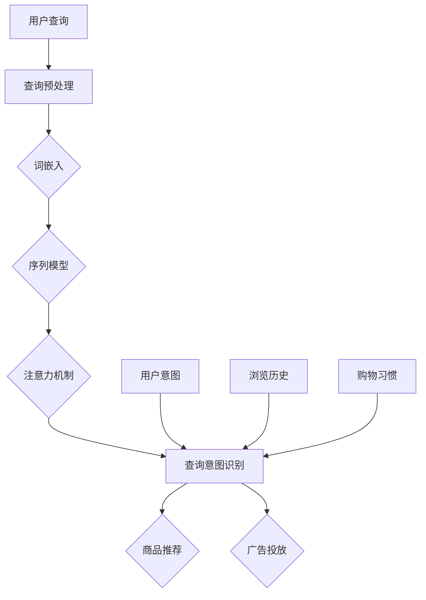

                 

## 2.1 查询理解在电商搜索中的重要性

查询理解在电商搜索中扮演着至关重要的角色，是提升搜索质量和用户体验的关键技术之一。以下是查询理解在电商搜索中的重要性及其具体应用：

### 2.1.1 提高搜索结果的相关性

- **用户意图识别**：通过查询理解，系统能够准确识别用户的查询意图，从而提供更加精准的搜索结果。
- **关键词扩展**：查询理解技术可以根据上下文对用户输入的关键词进行扩展，从而提升搜索结果的多样性。

### 2.1.2 优化搜索体验

- **自然语言处理**：通过自然语言处理技术，用户可以使用自然语言进行搜索，提高搜索的便捷性和易用性。
- **上下文感知**：系统可以根据用户的浏览历史、购物习惯等信息，提供个性化的搜索建议，提升用户体验。

### 2.1.3 促进商品销售

- **智能推荐**：查询理解技术可以结合用户的搜索历史和购物行为，为用户推荐相关的商品，促进销售。
- **广告投放**：通过理解用户查询，系统可以更精准地投放广告，提高广告效果。

### 2.1.4 减少用户流失

- **错误纠正**：查询理解技术能够自动识别用户输入的错误，提供正确的搜索建议，减少用户因无法找到所需商品而流失。
- **个性化服务**：通过查询理解，系统可以提供更加个性化的服务，满足不同用户的需求，降低用户流失率。

## 2.2 自然语言处理基础

### 2.2.1 词嵌入技术

- **定义**：词嵌入（Word Embedding）是将词汇映射到高维向量空间的技术。
- **方法**：常用的词嵌入方法包括基于频率的方法（如TF-IDF）和基于神经网络的模型（如Word2Vec、GloVe等）。

### 2.2.2 序列模型与注意力机制

- **序列模型**：用于处理序列数据的模型，如RNN（循环神经网络）、LSTM（长短期记忆网络）等。
- **注意力机制**：在序列模型中，注意力机制能够关注序列中的关键信息，提高模型的预测能力。

### 2.2.3 转换器架构详解

- **转换器架构**（Transformer）：一种基于自注意力机制的序列模型，广泛应用于自然语言处理任务中。

## 2.3 查询意图识别

### 2.3.1 查询意图识别的基本原理

- **定义**：查询意图识别（Query Intent Recognition）是识别用户查询背后的意图。
- **目标**：区分用户是想要查找商品、获取信息还是执行其他操作。

### 2.3.2 查询意图识别算法

- **分类算法**：如SVM、朴素贝叶斯等。
- **深度学习算法**：如CNN（卷积神经网络）、RNN、BERT等。

### 2.3.3 查询意图识别的应用

- **商品推荐**：根据用户意图推荐相关的商品。
- **广告投放**：根据用户意图进行更精准的广告投放。

## 核心概念与联系

### 概念架构 Mermaid 流程图

### 核心算法原理讲解与数学模型

#### 2.2.1 词嵌入技术

- **Word2Vec**

  - **目标**：将词汇映射到高维向量空间，使相似词汇的向量接近。

  - **算法原理**：
    $$\text{Input:} \ \text{词汇序列} \ (x_1, x_2, ..., x_T)$$
    $$\text{Output:} \ \text{词向量矩阵} \ V \in \mathbb{R}^{V \times D}$$
    $$\text{其中} \ V \ \text{为词汇表大小}，D \ \text{为词向量维度}$$
    
  - **训练过程**：
    $$\text{对于每个词汇} \ x_t, \text{随机生成一个上下文窗口} \ W$$
    $$\text{然后训练一个神经网络} \ \hat{y} = \text{softmax}(W \cdot V^{T} \cdot x_t)$$
    $$\text{最小化交叉熵损失函数} \ L(\theta) = -\sum_{t=1}^{T} \sum_{w \in W} w \log \hat{y}_w$$

- **GloVe**

  - **目标**：基于词汇的共现关系学习词向量。

  - **算法原理**：
    $$\text{Input:} \ \text{词汇对} \ (w_i, w_j) \ 和 \ \text{共现次数} \ f(w_i, w_j)$$
    $$\text{Output:} \ \text{词向量矩阵} \ V \in \mathbb{R}^{V \times D}$$
    
  - **训练过程**：
    $$\text{对于每个词汇对} \ (w_i, w_j), \text{构建矩阵方程}$$
    $$A_{ij} = \text{exp}(-\frac{d(w_i, w_j)}{s})$$
    $$\text{其中} \ d(w_i, w_j) \ \text{为词汇对之间的距离}，s \ \text{为尺度因子}$$
    $$\text{然后求解矩阵} \ A \ \text{的奇异值分解} \ A = U \Sigma V^{T}$$
    $$\text{词向量} \ v_i = U_{i1:iD} \ \text{和} \ v_j = V_{j1:jD}$$

#### 2.2.2 序列模型与注意力机制

- **RNN（递归神经网络）**

  - **目标**：处理序列数据。

  - **算法原理**：
    $$\text{Input:} \ \text{序列} \ X = (x_1, x_2, ..., x_T)$$
    $$\text{Output:} \ \text{序列} \ Y = (y_1, y_2, ..., y_T)$$
    
  - **状态更新方程**：
    $$h_t = \text{sigmoid}(W_h \cdot [h_{t-1}, x_t] + b_h)$$
    $$y_t = \text{sigmoid}(W_y \cdot h_t + b_y)$$
    
  - **训练过程**：通过反向传播算法最小化损失函数。

- **LSTM（长短期记忆网络）**

  - **目标**：解决RNN的长期依赖问题。

  - **算法原理**：
    $$\text{Input:} \ \text{序列} \ X = (x_1, x_2, ..., x_T)$$
    $$\text{Output:} \ \text{序列} \ Y = (y_1, y_2, ..., y_T)$$
    
  - **状态更新方程**：
    $$i_t = \text{sigmoid}(W_i \cdot [h_{t-1}, x_t] + b_i)$$
    $$f_t = \text{sigmoid}(W_f \cdot [h_{t-1}, x_t] + b_f)$$
    $$o_t = \text{sigmoid}(W_o \cdot [h_{t-1}, x_t] + b_o)$$
    $$c_t = f_t \odot c_{t-1} + i_t \odot \text{tanh}(W_c \cdot [h_{t-1}, x_t] + b_c)$$
    $$h_t = o_t \odot \text{tanh}(c_t)$$
    
  - **训练过程**：同样通过反向传播算法最小化损失函数。

- **注意力机制**

  - **目标**：关注序列中的关键信息。

  - **算法原理**：
    $$\text{Input:} \ \text{序列} \ X = (x_1, x_2, ..., x_T)$$
    $$\text{Output:} \ \text{注意力分数} \ a_t$$
    
  - **计算方法**：
    $$a_t = \text{softmax}(\text{score}(h_{t-1}, x_t))$$
    $$\text{其中} \ \text{score}(h_{t-1}, x_t) = W_a \cdot [h_{t-1}, x_t] + b_a$$
    
  - **输出计算**：
    $$y_t = \text{softmax}(\text{score}(h_{t-1}, x_t) \odot X)$$

#### 2.2.3 转换器架构（Transformer）

- **目标**：处理序列数据，替代传统的RNN和LSTM。

- **算法原理**：
  - **多头自注意力**：每个位置能够关注序列中的所有信息。
  - **位置编码**：引入位置信息，使模型能够理解序列的顺序。

- **计算方法**：
  - **自注意力**：
    $$\text{Input:} \ \text{序列} \ X = (x_1, x_2, ..., x_T)$$
    $$\text{Output:} \ \text{注意力分数} \ a_t$$
    
  - **计算方法**：
    $$a_t = \text{softmax}(\text{Q} \cdot \text{K}^{T}) / \sqrt{d_k}$$
    $$\text{其中} \ \text{Q}, \text{K}, \text{V} \ \text{分别为查询、键和值向量}，d_k \ \text{为键向量的维度}$$
    
  - **输出计算**：
    $$y_t = \text{softmax}(\text{Q} \cdot \text{K}^{T}) \odot \text{V}$$

## 查询意图识别算法

### 2.3.1 查询意图识别的基本原理

查询意图识别（Query Intent Recognition，QIR）是自然语言处理（Natural Language Processing，NLP）领域中的一项关键技术，其核心目标是理解用户输入的查询所表达的具体意图。在电商搜索场景中，准确的查询意图识别能够显著提升搜索结果的准确性和用户体验。

#### 2.3.1.1 查询意图识别的定义

查询意图识别是指通过算法分析用户输入的查询语句，确定其背后的真实意图。在电商搜索中，查询意图可能包括查找特定商品、获取商品信息、比较商品价格、查看商品评价等多种类型。

#### 2.3.1.2 查询意图识别的目标

- **提高搜索结果的准确性**：通过识别用户的查询意图，可以更精确地匹配用户需求，提高搜索结果的准确性。
- **改善用户体验**：准确理解用户的查询意图，能够为用户提供更加个性化的搜索体验，满足不同用户的需求。
- **优化广告投放**：根据用户的查询意图，可以更精准地投放广告，提高广告的相关性和效果。

### 2.3.2 查询意图识别算法

#### 2.3.2.1 传统分类算法

- **支持向量机（SVM）**：SVM是一种常用的二分类算法，通过找到一个最优的超平面来分离不同类别的数据。在查询意图识别中，可以将查询语句转换为高维特征向量，然后使用SVM进行分类。
  $$\text{目标函数} \ \max_{\theta} \ \frac{1}{2} \sum_{i=1}^{n} (\theta \cdot x_i - y_i)^2$$
  $$\text{约束条件} \ \sum_{i=1}^{n} \theta_i = C$$

- **朴素贝叶斯（Naive Bayes）**：朴素贝叶斯是一种基于贝叶斯定理的分类算法，假设特征之间相互独立。在查询意图识别中，可以使用朴素贝叶斯来计算每个查询语句属于某个意图的概率，然后选择概率最高的意图作为识别结果。

#### 2.3.2.2 深度学习算法

- **循环神经网络（RNN）**：RNN是一种能够处理序列数据的神经网络，通过递归结构来捕获序列中的长期依赖关系。在查询意图识别中，可以将查询语句作为输入序列，使用RNN来提取特征，然后通过分类层进行意图识别。
  $$h_t = \text{sigmoid}(W \cdot [h_{t-1}, x_t] + b)$$

- **长短期记忆网络（LSTM）**：LSTM是一种改进的RNN结构，通过引入记忆单元和门控机制来解决长期依赖问题。在查询意图识别中，LSTM可以更好地捕捉查询语句中的复杂结构，提高识别的准确性。
  $$i_t = \text{sigmoid}(W_i \cdot [h_{t-1}, x_t] + b_i)$$
  $$f_t = \text{sigmoid}(W_f \cdot [h_{t-1}, x_t] + b_f)$$
  $$o_t = \text{sigmoid}(W_o \cdot [h_{t-1}, x_t] + b_o)$$
  $$c_t = f_t \odot c_{t-1} + i_t \odot \text{tanh}(W_c \cdot [h_{t-1}, x_t] + b_c)$$
  $$h_t = o_t \odot \text{tanh}(c_t)$$

- **变换器架构（Transformer）**：Transformer是一种基于自注意力机制的序列模型，其结构能够捕捉序列中的长距离依赖关系。在查询意图识别中，Transformer可以显著提高识别的准确性和效率。
  $$a_t = \text{softmax}(\text{Q} \cdot \text{K}^{T}) / \sqrt{d_k}$$
  $$y_t = \text{softmax}(\text{Q} \cdot \text{K}^{T}) \odot \text{V}$$

#### 2.3.2.3 常见挑战与解决方案

- **多义性问题**：一个查询可能对应多个意图，如何准确地识别用户的真实意图是一个挑战。解决方案包括使用上下文信息、引入多标签分类模型等。
- **长句处理**：长句查询包含更多的信息，如何有效地提取关键信息进行意图识别是一个挑战。解决方案包括使用长文本处理模型、简化查询语句等。

### 2.3.3 查询意图识别的应用

- **商品推荐**：通过识别用户的查询意图，可以为用户推荐相关的商品，提高推荐系统的准确性。
- **广告投放**：根据用户的查询意图，可以更精准地投放广告，提高广告的效果。
- **智能客服**：通过理解用户的查询意图，智能客服系统可以提供更准确的回答，提升用户体验。

### 2.3.4 案例分析

#### 案例一：电商平台的搜索推荐

在某个电商平台上，用户的搜索查询主要用于查找商品。通过查询意图识别技术，系统可以区分用户是查找商品名称、品牌还是其他相关信息，从而提供更精准的推荐。

- **用户输入**：“iPhone 13”。
- **查询意图识别**：系统识别出用户的查询意图是查找商品。
- **搜索结果**：系统推荐与“iPhone 13”相关的商品列表。

#### 案例二：在线购物网站的广告投放

在一个在线购物网站上，通过查询意图识别技术，系统可以根据用户的查询意图进行广告投放，提高广告的相关性和点击率。

- **用户输入**：“笔记本电脑”。
- **查询意图识别**：系统识别出用户的查询意图是查找笔记本电脑。
- **广告投放**：系统投放与笔记本电脑相关的广告，如新款笔记本电脑优惠信息。

### 2.3.5 查询意图识别的未来发展趋势

- **多模态融合**：结合图像、语音等多模态信息进行查询意图识别，提高识别的准确性和效率。
- **实时交互**：实现实时查询意图识别，为用户提供更快速、更精准的搜索体验。
- **个性化推荐**：通过深度学习等技术，实现更加个性化的查询意图识别，为用户提供更符合个人需求的推荐。

## 3.1 商品映射技术

商品映射技术是电商搜索系统中至关重要的环节，其主要目的是将用户的查询与电商平台中的商品信息进行准确匹配，从而提供相关度高的搜索结果。商品映射技术涉及多个子领域，包括商品信息处理、商品分类与标签、商品质量评估等。

### 3.1.1 商品信息处理

商品信息处理是指对电商平台上的商品数据进行清洗、整合和处理，以便于后续的映射和推荐。以下是一些关键技术：

- **数据清洗**：去除商品数据中的噪声和错误，如缺失值、重复值、不一致的数据格式等。
- **数据整合**：将来自不同数据源的商品信息进行整合，形成统一的商品数据视图。
- **特征提取**：从商品数据中提取关键特征，如商品名称、品牌、类别、价格、库存等。

#### 3.1.1.1 商品属性提取

商品属性提取是指从商品数据中提取出能够描述商品特征的信息。这些信息通常包括：

- **文本属性**：如商品名称、描述、标签等。
- **数值属性**：如价格、重量、尺寸等。
- **分类属性**：如品牌、颜色、尺寸、类别等。

#### 3.1.1.2 商品分类与标签

商品分类与标签是指根据商品的属性和特征，对商品进行分类和标签化处理。以下是一些关键技术：

- **分类算法**：如决策树、K-means、SVM等，用于将商品按照不同的属性进行分类。
- **标签生成**：通过对商品属性的分析和挖掘，为商品生成标签，以便于用户快速查找和筛选商品。

#### 3.1.1.3 商品质量评估

商品质量评估是指对商品的质量、信誉、用户评价等信息进行评估。以下是一些关键技术：

- **评分算法**：如基于用户评分的评分算法、基于文本的情感分析算法等，用于评估商品的质量。
- **信誉评估**：通过分析商品的销量、用户评价、退货率等信息，评估商家的信誉。

### 3.1.2 商品推荐算法

商品推荐算法是指基于用户的历史行为、兴趣偏好、查询意图等，为用户推荐相关的商品。以下是一些常见的商品推荐算法：

- **协同过滤算法**：基于用户的历史行为和相似度计算，为用户推荐相似用户喜欢的商品。
  $$\text{评分预测} \ \hat{r}_{ui} = \text{用户相似度矩阵} \cdot \text{商品特征矩阵}$$

- **内容推荐算法**：基于商品的内容特征，为用户推荐与其兴趣相符的商品。
  $$\text{相似度计算} \ \text{similarity}(i, j) = \text{cosine similarity}(\text{vector}(i), \text{vector}(j))$$

### 3.1.3 商品映射技术在实际应用中的挑战与解决方案

在实际应用中，商品映射技术面临以下挑战：

- **数据质量**：商品数据的质量直接影响映射的准确性。解决方法包括数据清洗、去重、标准化等。
- **多模态信息处理**：商品映射技术需要处理文本、图像、语音等多模态信息。解决方法包括多模态特征提取和融合。
- **实时性**：随着电商业务的快速发展，商品映射技术需要具备较高的实时性。解决方法包括分布式计算、缓存技术等。

### 3.1.4 商品映射技术的未来发展趋势

- **人工智能与机器学习技术的深入应用**：随着人工智能和机器学习技术的不断发展，商品映射技术将更加智能化、自动化。
- **实时推荐系统**：实时推荐系统将更好地满足用户的个性化需求，提供即时的推荐服务。
- **多模态信息融合**：结合多种模态信息进行商品映射，提高映射的准确性和用户体验。

### 3.1.5 案例分析

#### 案例一：电商平台商品搜索

在一个电商平台上，用户输入查询“iPhone 13”，系统首先进行查询理解，然后通过商品映射技术，将用户的查询与电商平台中的商品信息进行匹配，最终返回与“iPhone 13”相关的商品列表。

- **用户查询**：“iPhone 13”。
- **查询理解**：系统识别用户的查询意图为查找iPhone 13。
- **商品映射**：系统根据iPhone 13的品牌、型号、价格等信息，从数据库中检索出相关的商品。
- **搜索结果**：系统返回与“iPhone 13”相关的商品列表。

#### 案例二：电商广告投放

在另一个电商平台上，通过商品映射技术，系统可以根据用户的浏览历史、查询意图等信息，为用户推送相关的广告。

- **用户浏览历史**：用户浏览了多个手机品牌的商品。
- **查询意图识别**：系统识别用户的查询意图为购买手机。
- **商品映射**：系统根据用户的浏览历史和查询意图，将手机品牌和型号与广告内容进行映射。
- **广告投放**：系统向用户推送与手机购买相关的广告。

### 3.1.6 结论

商品映射技术在电商搜索系统中发挥着重要作用，通过处理商品信息、分类与标签、质量评估等环节，能够为用户提供精准、个性化的搜索结果。随着人工智能和机器学习技术的不断发展，商品映射技术将不断优化，为电商搜索系统带来更高的性能和用户体验。

### 3.2.1 商品映射的概念

商品映射（Product Mapping）是电商搜索系统中的一个关键过程，它旨在将用户查询与电商平台上的商品信息进行精确匹配，从而提供相关度高的搜索结果。商品映射的核心目标是通过分析用户查询和商品数据，实现高效的商品推荐和搜索结果优化。

#### 3.2.1.1 商品映射的定义

商品映射是指将用户查询（如关键词、短语等）与电商平台中的商品数据进行关联和匹配的过程。这一过程涉及多个技术环节，包括查询理解、商品信息处理、商品推荐算法等。

#### 3.2.1.2 商品映射的目标

- **提高搜索精度**：通过精确匹配用户查询和商品数据，提高搜索结果的准确性，减少无关信息的展示。
- **优化用户体验**：提供个性化的搜索结果和推荐，满足用户多样化的需求，提升用户满意度和留存率。
- **促进商品销售**：通过精确的推荐和搜索结果，帮助用户快速找到所需的商品，提高购买转化率。

### 3.2.2 商品信息处理

商品信息处理是商品映射的基础，涉及对电商平台商品数据的清洗、整合、特征提取等步骤。

#### 3.2.2.1 数据清洗

数据清洗是指去除商品数据中的噪声和错误，如缺失值、重复值、不一致的数据格式等。数据清洗的目的是确保商品数据的质量，为后续分析提供准确的基础数据。

#### 3.2.2.2 数据整合

数据整合是指将来自不同数据源的 商品信息进行整合，形成统一的商品数据视图。通过数据整合，可以实现商品信息的统一管理和查询，提高商品映射的效率和准确性。

#### 3.2.2.3 特征提取

特征提取是指从商品数据中提取出能够描述商品特征的信息。这些信息通常包括文本属性（如商品名称、描述、标签等）、数值属性（如价格、重量、尺寸等）和分类属性（如品牌、颜色、尺寸、类别等）。特征提取是商品映射中关键的一步，它决定了映射算法的性能和效果。

### 3.2.3 商品分类与标签

商品分类与标签是商品映射中重要的环节，通过分类和标签化处理，可以更有效地组织和推荐商品。

#### 3.2.3.1 商品分类

商品分类是指根据商品的属性和特征，将商品分为不同的类别。商品分类有助于用户快速查找和筛选商品，提高搜索效率和用户体验。常见的商品分类算法包括决策树、K-means、SVM等。

#### 3.2.3.2 商品标签

商品标签是指为商品生成标签，以便于用户快速查找和筛选商品。标签可以根据商品的属性、特征、用户需求等多种因素进行生成。例如，可以为某款手机生成“智能手机”、“5G手机”、“高端手机”等标签。

### 3.2.4 商品质量评估

商品质量评估是商品映射中不可或缺的环节，通过对商品的质量、信誉、用户评价等信息进行评估，可以为用户提供更可靠、更可信的搜索结果。

#### 3.2.4.1 评分算法

评分算法是指通过分析用户对商品的评分，评估商品的质量。常见的评分算法包括基于用户评分的评分算法、基于文本的情感分析算法等。

#### 3.2.4.2 信誉评估

信誉评估是指通过分析商家的销量、用户评价、退货率等信息，评估商家的信誉。信誉评估有助于用户选择高质量的商家和商品。

### 3.2.5 商品映射技术在实际应用中的挑战与解决方案

在实际应用中，商品映射技术面临以下挑战：

- **数据质量**：商品数据的质量直接影响映射的准确性。解决方法包括数据清洗、去重、标准化等。
- **多模态信息处理**：商品映射技术需要处理文本、图像、语音等多模态信息。解决方法包括多模态特征提取和融合。
- **实时性**：随着电商业务的快速发展，商品映射技术需要具备较高的实时性。解决方法包括分布式计算、缓存技术等。

### 3.2.6 商品映射技术的未来发展趋势

- **人工智能与机器学习技术的深入应用**：随着人工智能和机器学习技术的不断发展，商品映射技术将更加智能化、自动化。
- **实时推荐系统**：实时推荐系统将更好地满足用户的个性化需求，提供即时的推荐服务。
- **多模态信息融合**：结合多种模态信息进行商品映射，提高映射的准确性和用户体验。

### 3.2.7 案例分析

#### 案例一：电商平台商品搜索

在一个电商平台上，用户输入查询“iPhone 13”，系统通过商品映射技术，将用户的查询与电商平台中的商品信息进行精确匹配，最终返回与“iPhone 13”相关的商品列表。

- **用户查询**：“iPhone 13”。
- **商品映射**：系统根据iPhone 13的品牌、型号、价格等信息，从数据库中检索出相关的商品。
- **搜索结果**：系统返回与“iPhone 13”相关的商品列表。

#### 案例二：电商广告投放

在另一个电商平台上，通过商品映射技术，系统可以根据用户的浏览历史、查询意图等信息，为用户推送相关的广告。

- **用户浏览历史**：用户浏览了多个手机品牌的商品。
- **商品映射**：系统根据用户的浏览历史和查询意图，将手机品牌和型号与广告内容进行映射。
- **广告投放**：系统向用户推送与手机购买相关的广告。

### 3.2.8 结论

商品映射技术在电商搜索系统中发挥着重要作用，通过处理商品信息、分类与标签、质量评估等环节，能够为用户提供精准、个性化的搜索结果。随着人工智能和机器学习技术的不断发展，商品映射技术将不断优化，为电商搜索系统带来更高的性能和用户体验。

## 4.1 查询理解与商品映射的协同工作

查询理解与商品映射技术在电商搜索系统中扮演着至关重要的角色，它们通过协同工作，共同提高搜索的精度和用户体验。以下是这两个技术如何协同工作的概述：

### 4.1.1 查询理解与商品映射的结合方式

#### 4.1.1.1 前端交互

- **用户输入查询**：用户通过电商平台的搜索框输入查询。
- **查询理解**：系统通过自然语言处理技术，如词嵌入、序列模型等，对用户查询进行分析，提取查询意图和关键词。
- **商品映射**：系统根据查询意图和关键词，从数据库中检索相关的商品信息。

#### 4.1.1.2 后端处理

- **查询理解**：在查询理解的阶段，系统可能会对查询进行扩展和修正，以提高查询的准确性。
- **商品映射**：系统将经过查询理解处理的查询与商品信息进行匹配，通过特征提取、分类与标签等技术，为用户提供相关度高的商品推荐。

#### 4.1.1.3 实时反馈

- **用户行为分析**：系统会实时收集用户在搜索过程中的行为数据，如点击、购买等。
- **查询理解与商品映射的调整**：根据用户行为数据，系统可以调整查询理解模型和商品映射策略，提高搜索精度和用户体验。

### 4.1.2 查询理解在商品推荐中的应用

查询理解在商品推荐中具有重要作用，以下是其具体应用：

#### 4.1.2.1 意图识别

- **识别用户意图**：通过查询理解技术，系统可以识别用户的查询意图，如查找商品、获取信息、比较价格等。
- **个性化推荐**：根据用户的意图，系统可以推荐符合用户需求的商品，提高推荐的相关性。

#### 4.1.2.2 关键词扩展

- **扩展查询关键词**：查询理解技术可以对用户输入的关键词进行扩展，捕捉更多的语义信息，从而提高搜索结果的准确性。

#### 4.1.2.3 上下文感知

- **上下文信息融合**：系统可以融合用户的历史查询、购物行为等上下文信息，提供更加个性化的商品推荐。

### 4.1.3 商品映射在查询优化中的应用

商品映射在查询优化中也起着关键作用，以下是其具体应用：

#### 4.1.3.1 商品信息匹配

- **精确匹配**：商品映射技术可以帮助系统精确匹配用户查询和商品信息，减少无关搜索结果。

#### 4.1.3.2 商品分类与标签

- **分类与标签**：商品映射技术可以对商品进行分类和标签化处理，便于用户快速查找和筛选商品。

#### 4.1.3.3 质量评估

- **商品质量评估**：通过商品映射技术，系统可以对商品的质量、信誉等进行评估，提高搜索结果的可信度。

### 4.1.4 协同工作的效果

查询理解与商品映射的协同工作能够显著提高电商搜索系统的性能和用户体验：

- **提高搜索精度**：通过精确匹配用户查询和商品信息，减少无关搜索结果。
- **个性化推荐**：根据用户意图和上下文信息，提供个性化的商品推荐。
- **优化用户体验**：提供快速、准确的搜索结果，提升用户满意度。

### 4.1.5 案例分析

#### 案例一：用户查询“iPhone 13”

用户在电商平台上输入查询“iPhone 13”，系统首先通过查询理解技术分析查询意图，确定用户是查找iPhone 13这款商品。然后，系统利用商品映射技术，从数据库中检索与iPhone 13相关的商品信息，并返回给用户。

#### 案例二：用户查询“高端笔记本电脑”

用户在电商平台上输入查询“高端笔记本电脑”，系统通过查询理解技术识别出用户的意图，随后利用商品映射技术，从数据库中检索出符合用户需求的高档笔记本电脑，并展示相关结果。

### 4.1.6 结论

查询理解与商品映射的协同工作是电商搜索系统中的重要环节，通过精确匹配用户查询和商品信息，提供个性化的推荐，能够显著提高搜索精度和用户体验。随着技术的不断发展，这两个技术的结合将更加紧密，为电商搜索系统带来更高的性能和用户体验。

## 5.1 实时查询处理技术

### 5.1.1 实时查询处理的重要性

在电商搜索系统中，实时查询处理技术是保障系统性能和用户体验的关键因素之一。随着电商业务的不断增长和用户对实时性的需求提升，实时查询处理技术的重要性愈发显著。

#### 5.1.1.1 提高用户满意度

实时查询处理技术能够快速响应用户的查询请求，提供即时的搜索结果，从而提升用户体验。对于用户而言，快速的搜索结果意味着能够更快地找到所需商品，提高购物体验和满意度。

#### 5.1.1.2 增强系统竞争力

在竞争激烈的电商市场中，具备实时查询处理能力的系统可以提供独特的竞争优势。实时查询处理技术能够快速响应用户需求，提高转化率和用户留存率，从而增强系统的市场竞争力。

#### 5.1.1.3 支持个性化推荐

实时查询处理技术有助于实现更加个性化的商品推荐。通过实时分析用户的查询行为和购物习惯，系统可以动态调整推荐策略，为用户提供更加精准的个性化推荐。

### 5.1.2 实时查询处理流程

实时查询处理流程通常包括以下步骤：

#### 5.1.2.1 查询预处理

查询预处理是实时查询处理的第一步，其主要任务是优化用户输入的查询语句，提高查询的准确性。查询预处理包括以下任务：

- **关键词提取**：从用户输入的查询中提取出关键关键词。
- **查询扩展**：根据上下文信息，扩展用户输入的关键词，捕捉更多的语义信息。
- **错误纠正**：识别和纠正用户输入的错误，提高查询的准确性。

#### 5.1.2.2 查询理解

查询理解是实时查询处理的核心环节，其主要任务是理解用户的查询意图。通过自然语言处理技术，如词嵌入、序列模型等，系统可以提取查询的关键信息，识别用户的意图，如查找商品、获取信息、比较价格等。

#### 5.1.2.3 商品映射

商品映射是将用户的查询与电商平台中的商品信息进行匹配的过程。通过查询理解的结果，系统利用商品映射技术，如商品分类、标签化处理等，从数据库中检索相关的商品信息。

#### 5.1.2.4 查询结果生成

查询结果生成是实时查询处理的最后一步，系统根据商品映射的结果，生成并返回给用户最终的搜索结果。查询结果生成包括以下任务：

- **排序**：根据商品的相关度和用户偏好，对搜索结果进行排序。
- **结果格式化**：将搜索结果以用户友好的方式展示，如商品名称、价格、图片等。
- **实时反馈**：系统实时收集用户的反馈，如点击、购买等行为数据，用于优化查询处理策略。

### 5.1.3 实时查询处理技术

实时查询处理技术需要高效的算法和系统架构来保障系统的性能和实时性。以下是一些关键技术和方法：

#### 5.1.3.1 分布式计算

分布式计算是将查询处理任务分散到多个服务器上执行，以提高处理速度和系统容错能力。通过分布式计算，系统可以同时处理大量的查询请求，提升查询处理效率。

#### 5.1.3.2 缓存技术

缓存技术是将常用的查询结果存储在内存中，以加快查询响应速度。通过缓存技术，系统可以快速返回用户的常用查询结果，减少数据库的访问压力，提高系统性能。

#### 5.1.3.3 并发处理

并发处理是指系统同时处理多个查询请求。通过并发处理，系统可以充分利用服务器资源，提高查询处理吞吐量。

#### 5.1.3.4 查询优化算法

查询优化算法是实时查询处理的关键，其目标是减少查询执行时间，提高查询性能。常见的查询优化算法包括索引优化、查询重写、查询缓存等。

### 5.1.4 案例分析

#### 案例一：电商平台实时搜索

在一个大型电商平台上，用户输入查询“iPhone 13”，系统立即开始处理查询。首先，系统进行查询预处理，提取关键关键词，然后通过查询理解技术分析查询意图，识别用户是查找iPhone 13这款商品。接着，系统利用商品映射技术，从数据库中快速检索与iPhone 13相关的商品信息，并返回给用户。

#### 案例二：个性化实时推荐

在另一个电商平台上，用户浏览了多个手机品牌的商品。系统实时收集用户的行为数据，并利用查询理解技术分析用户的兴趣偏好。然后，系统通过商品映射技术，根据用户的兴趣偏好推荐相关的手机品牌和型号，提高用户的购物体验。

### 5.1.5 结论

实时查询处理技术是电商搜索系统中的核心环节，通过高效的算法和系统架构，能够快速响应用户的查询请求，提供个性化的搜索结果。随着电商业务的不断增长和用户对实时性的需求提升，实时查询处理技术将发挥越来越重要的作用。

## 6.1 性能优化目标

在电商搜索系统中，性能优化是确保系统高效运行和良好用户体验的关键。以下是性能优化的主要目标：

### 6.1.1 提高查询速度

- **目标**：减少用户查询的响应时间，提高系统整体的查询速度。
- **策略**：优化查询算法、使用高效的索引技术、减少数据库的查询复杂度。

### 6.1.2 提高查询吞吐量

- **目标**：在给定资源条件下，系统能够处理更多的查询请求。
- **策略**：使用分布式计算、并发处理技术，优化系统的并行性能。

### 6.1.3 减少延迟

- **目标**：降低系统在处理查询过程中的延迟，提高用户满意度。
- **策略**：采用预加载技术、缓存技术，减少数据访问的延迟。

### 6.1.4 提高系统稳定性

- **目标**：确保系统在高峰时期和异常情况下都能稳定运行。
- **策略**：使用负载均衡技术、容错机制、异常处理技术。

### 6.1.5 提高资源利用率

- **目标**：最大化利用系统资源，提高资源利用率。
- **策略**：优化数据库结构、使用合理的硬件配置、优化网络通信。

## 6.2 数据库优化技术

### 6.2.1 索引优化

索引优化是提高数据库查询速度的重要手段。以下是一些常见的索引优化策略：

#### 6.2.1.1 选择合适的索引类型

- **B-Tree索引**：适用于范围查询和排序查询。
- **哈希索引**：适用于等值查询，但无法进行范围查询和排序。

#### 6.2.1.2 创建复合索引

- **复合索引**：根据查询条件创建的索引，可以同时优化多个列的查询。

#### 6.2.1.3 优化索引维护

- **索引重构**：定期对索引进行重构，以减少索引碎片化。
- **索引压缩**：通过压缩索引文件，减少存储空间，提高查询速度。

### 6.2.2 分片与分区

分片与分区是分布式数据库系统中常用的优化策略，用于提高查询性能和数据管理效率。

#### 6.2.2.1 分片

- **水平分片**：将数据按照一定规则（如商品类别、用户ID等）分散到多个节点上，每个节点负责一部分数据的查询和处理。
- **垂直分片**：将数据按照列的属性分散到多个节点上，每个节点负责不同的列数据。

#### 6.2.2.2 分区

- **范围分区**：按照数据的范围（如时间、价格等）将数据分散到多个分区中。
- **列表分区**：按照预定义的列表（如商品ID、用户ID等）将数据分散到多个分区中。

### 6.2.3 缓存策略

缓存策略是提高查询速度和系统响应速度的重要手段。以下是一些常见的缓存策略：

#### 6.2.3.1 页面缓存

- **页面缓存**：将数据库查询的结果缓存到内存中，当用户再次查询相同的数据时，直接从缓存中获取结果。

#### 6.2.3.2 查询缓存

- **查询缓存**：缓存具体的查询语句及其结果，当用户再次执行相同的查询时，直接从缓存中获取结果。

#### 6.2.3.3 物理缓存

- **物理缓存**：将数据库中的热数据缓存到内存中，以提高查询速度。

### 6.2.4 其他优化技术

除了上述技术外，还有一些其他数据库优化技术，如：

- **查询重写**：优化查询语句的结构，减少查询执行时间。
- **数据压缩**：通过压缩数据存储空间，减少I/O操作，提高查询性能。
- **并行处理**：在查询处理过程中，充分利用多核处理器的优势，提高查询速度。

## 6.3 系统优化技术

### 6.3.1 并发处理

并发处理是提高系统性能的关键技术之一，它允许系统同时处理多个查询请求，提高系统的吞吐量。

#### 6.3.1.1 机制

- **线程池**：通过线程池管理并发线程，避免频繁创建和销毁线程，提高系统性能。
- **非阻塞I/O**：使用非阻塞I/O技术，减少线程阻塞等待时间，提高并发处理能力。

#### 6.3.1.2 实现策略

- **负载均衡**：通过负载均衡算法，将查询请求均匀分配到多个处理节点上，避免单点瓶颈。
- **异步处理**：使用异步处理技术，将查询处理和响应解耦，提高系统的并发处理能力。

### 6.3.2 负载均衡

负载均衡技术用于合理分配系统资源，确保系统在高并发情况下稳定运行。

#### 6.3.2.1 机制

- **轮询算法**：按照顺序将请求分配到不同的服务器上。
- **最少连接算法**：将请求分配到连接数最少的服务器上。
- **加权轮询算法**：根据服务器的处理能力，分配不同的权重，进行负载均衡。

#### 6.3.2.2 实现策略

- **反向代理**：通过反向代理服务器，将查询请求分配到多个后端服务器上。
- **负载均衡器**：使用专门的负载均衡器，如Nginx、HAProxy等，进行流量分配。

### 6.3.3 异常处理

异常处理技术用于确保系统在遇到异常情况时能够快速响应，降低对用户体验的影响。

#### 6.3.3.1 机制

- **重试机制**：在查询失败时，系统会尝试重新执行查询。
- **熔断机制**：当系统负载过高时，系统会自动拒绝新的查询请求，防止系统崩溃。
- **降级机制**：在系统资源不足时，系统会降低部分服务的响应质量，确保关键服务的正常运行。

#### 6.3.3.2 实现策略

- **全局异常处理**：通过全局异常处理，捕获系统中的各种异常情况，并进行相应的处理。
- **日志记录**：详细记录异常情况，便于后续分析和优化。

### 6.3.4 其他优化技术

除了上述技术外，还有一些其他系统优化技术，如：

- **数据库连接池**：通过连接池技术，减少数据库连接的创建和销毁次数，提高系统性能。
- **缓存机制**：通过缓存技术，减少对数据库的访问次数，提高查询速度。
- **缓存一致性**：确保缓存数据的一致性，避免数据不一致导致的问题。

### 6.3.5 案例分析

#### 案例一：电商平台并发处理

在一个大型电商平台上，系统采用了线程池和负载均衡技术，通过多个处理节点同时处理用户查询请求，提高了系统的并发处理能力。

#### 案例二：数据库优化策略

在另一个电商平台上，系统采用了分片与分区技术，将数据分散到多个节点上，提高了查询速度和数据管理效率。

### 6.3.6 结论

系统优化技术在电商搜索系统中发挥着重要作用，通过并发处理、负载均衡、异常处理等技术，能够显著提高系统的性能和稳定性，为用户提供更好的搜索体验。

## 7.1.1 系统架构设计

### 7.1.1.1 系统模块划分

电商搜索系统通常划分为以下几个主要模块：

- **前端模块**：包括用户界面和前端逻辑，负责用户查询的输入和搜索结果的展示。
- **后端模块**：包括查询处理、商品推荐、数据存储等，负责处理用户的查询请求和生成搜索结果。
- **数据存储模块**：包括数据库和缓存系统，负责存储和管理电商平台的数据。

### 7.1.1.2 模块功能介绍

- **前端模块**：
  - **用户界面**：展示用户输入查询和搜索结果的界面。
  - **前端逻辑**：处理用户交互，如查询输入、搜索结果展示等。

- **后端模块**：
  - **查询处理**：接收用户查询请求，进行查询理解和商品映射。
  - **商品推荐**：根据用户查询和购物行为，推荐相关的商品。
  - **数据存储**：处理用户查询，存储和检索商品数据。

- **数据存储模块**：
  - **数据库**：存储商品信息、用户数据等。
  - **缓存系统**：存储常用查询结果，提高查询速度。

### 7.1.1.3 数据流设计

电商搜索系统中的数据流大致如下：

1. **用户输入查询**：用户在前端模块输入查询，如“iPhone 13”。
2. **前端处理**：前端逻辑将用户查询发送到后端模块。
3. **查询处理**：后端模块接收查询，进行查询预处理和查询理解。
4. **商品映射**：后端模块根据查询理解和商品映射技术，从数据库中检索相关的商品信息。
5. **商品推荐**：后端模块根据用户历史行为和查询意图，推荐相关的商品。
6. **搜索结果生成**：后端模块将检索结果和推荐商品生成搜索结果。
7. **搜索结果展示**：前端模块将搜索结果展示给用户。

## 7.2 查询理解模块设计

### 7.2.1 模块需求分析

查询理解模块的主要需求包括：

- **处理用户查询**：接收用户输入的查询，如文本、语音等。
- **意图识别**：识别用户的查询意图，如查找商品、获取商品信息、比较价格等。
- **关键词提取**：从查询中提取关键关键词，用于商品映射和推荐。
- **查询扩展**：根据上下文信息，扩展查询关键词，提高查询的准确性。

### 7.2.2 模块设计

查询理解模块的设计包括以下几个部分：

- **输入层**：接收用户查询，可以是文本或语音输入。
- **预处理层**：对输入查询进行预处理，如去除噪声、分词、词性标注等。
- **意图识别层**：使用自然语言处理技术（如词嵌入、序列模型等）识别查询意图。
- **关键词提取层**：从预处理后的查询中提取关键关键词。
- **查询扩展层**：根据上下文信息，扩展关键词，提高查询的准确性。

### 7.2.3 模块实现

查询理解模块的实现主要包括以下几个步骤：

1. **用户查询输入**：用户在前端界面输入查询，前端将查询发送到查询理解模块。
2. **查询预处理**：对输入查询进行分词、词性标注等预处理操作。
3. **意图识别**：使用词嵌入和序列模型（如BERT）对预处理后的查询进行意图识别。
4. **关键词提取**：从意图识别结果中提取关键关键词。
5. **查询扩展**：根据上下文信息和关键词，扩展查询，提高查询的准确性。
6. **查询结果输出**：将查询结果（意图识别、关键词、查询扩展）返回给后端模块。

### 7.2.4 模块实现效果

查询理解模块的实现效果可以从以下几个方面进行评估：

- **意图识别准确率**：通过测试集数据，评估查询意图识别的准确率。
- **关键词提取效果**：评估关键词提取的准确性和多样性。
- **查询扩展效果**：评估查询扩展的准确性和对查询准确性的提升。

## 7.3 商品映射模块设计

### 7.3.1 模块需求分析

商品映射模块的主要需求包括：

- **商品信息检索**：根据用户查询，从数据库中检索相关的商品信息。
- **商品推荐**：根据用户查询和购物行为，推荐相关的商品。
- **查询优化**：优化查询，提高检索效率和结果准确性。

### 7.3.2 模块设计

商品映射模块的设计包括以下几个部分：

- **查询处理**：接收用户查询，预处理查询，提取关键信息。
- **商品信息检索**：根据用户查询，从数据库中检索相关的商品信息。
- **商品推荐**：根据用户查询和购物行为，推荐相关的商品。
- **查询优化**：优化查询，提高检索效率和结果准确性。

### 7.3.3 模块实现

商品映射模块的实现主要包括以下几个步骤：

1. **用户查询输入**：用户在前端界面输入查询，前端将查询发送到商品映射模块。
2. **查询预处理**：对输入查询进行分词、词性标注等预处理操作。
3. **商品信息检索**：根据预处理后的查询，从数据库中检索相关的商品信息。
4. **商品推荐**：根据用户查询和购物行为，推荐相关的商品。
5. **查询优化**：对查询进行优化，提高检索效率和结果准确性。
6. **查询结果输出**：将查询结果（商品信息、推荐商品）返回给前端模块。

### 7.3.4 模块实现效果

商品映射模块的实现效果可以从以下几个方面进行评估：

- **检索效率**：评估查询处理和商品信息检索的效率，如查询响应时间、检索速度等。
- **推荐准确性**：评估商品推荐的准确性，如推荐的商品是否符合用户需求。
- **查询优化效果**：评估查询优化的效果，如优化后的查询结果是否更准确、更相关。

### 7.3.5 模块实现效果评估与优化方向

商品映射模块实现效果评估与优化方向可以从以下几个方面进行：

- **评估指标**：设定合适的评估指标，如检索效率、推荐准确性、查询优化效果等。
- **数据分析**：通过数据分析，发现模块实现中的问题，如检索效率低、推荐不准确等。
- **优化方向**：根据评估结果，提出优化方向，如改进查询预处理算法、优化商品推荐算法、提升查询优化效果等。
- **持续改进**：不断进行模块优化，通过迭代开发，提高商品映射模块的整体性能。

## 7.4.1 项目背景介绍

在当前竞争激烈的电商市场中，用户对电商搜索系统的性能和用户体验有着越来越高的要求。为了提高搜索结果的准确性和用户体验，本项目旨在设计和实现一个高效的电商搜索系统，该系统将采用先进的查询理解与商品映射技术，以提升用户查询的响应速度和搜索结果的相关度。

### 7.4.2 项目需求分析

本项目的主要需求如下：

- **高效的查询响应**：系统需要能够在毫秒级的时间内响应用户的查询请求，提供准确的搜索结果。
- **准确的商品推荐**：系统需要根据用户的查询和购物行为，推荐相关的商品，提高用户的购买转化率。
- **良好的用户体验**：系统需要提供简洁、直观的用户界面，使用户能够轻松地找到所需商品。

### 7.4.3 项目技术选型

为了满足项目需求，本项目采用以下技术选型：

- **前端技术**：采用React框架，构建动态和响应式的用户界面。
- **后端技术**：使用Node.js和Express框架，构建高效的后端服务。
- **自然语言处理**：采用BERT模型进行查询理解，以提高查询意图识别的准确性。
- **商品映射**：使用基于协同过滤和内容推荐相结合的算法，提高商品推荐的准确性。
- **数据库**：使用MongoDB数据库存储商品信息和用户数据，并采用分片技术提高数据检索性能。

### 7.4.4 项目开发过程

本项目的开发过程可以分为以下几个阶段：

#### 7.4.4.1 系统架构设计

- **需求分析**：根据项目需求，设计系统的整体架构，包括前端、后端和数据库模块。
- **模块划分**：将系统划分为查询理解模块、商品映射模块、推荐系统模块等。
- **数据流设计**：设计系统中的数据流，确保各模块之间的数据传递和交互。

#### 7.4.4.2 前端开发

- **界面设计**：设计用户友好的界面，包括搜索框、商品列表和推荐列表等。
- **前端实现**：使用React框架实现前端界面，包括组件化和状态管理。
- **交互设计**：实现用户与界面之间的交互，如搜索、推荐、购物车等。

#### 7.4.4.3 后端开发

- **后端服务**：使用Node.js和Express框架实现后端服务，包括查询处理、商品映射、推荐算法等。
- **API接口**：设计API接口，方便前端与后端之间的数据传递和交互。
- **接口测试**：编写测试用例，对API接口进行测试，确保接口的稳定性和可靠性。

#### 7.4.4.4 数据库开发

- **数据库设计**：设计数据库的表结构和关系，包括商品表、用户表、订单表等。
- **数据存储**：使用MongoDB数据库存储商品信息和用户数据。
- **数据检索**：编写数据检索SQL语句，实现商品信息和用户数据的快速检索。

#### 7.4.4.5 系统集成与测试

- **集成测试**：将前端、后端和数据库模块集成在一起，进行集成测试，确保系统的整体功能和性能。
- **性能测试**：进行性能测试，评估系统的响应时间、吞吐量和并发处理能力。
- **用户测试**：邀请实际用户进行测试，收集用户反馈，优化系统的用户体验。

### 7.4.5 项目小结与反思

本项目通过设计和实现一个高效的电商搜索系统，成功提高了搜索结果的准确性和用户体验。以下是项目小结与反思：

#### 成功点

- **技术选型**：选择了适合项目需求的技术栈，确保系统的性能和稳定性。
- **模块化设计**：采用模块化设计，使系统更加灵活和可扩展。
- **高效开发**：通过敏捷开发方法，快速迭代和优化系统功能。

#### 遇到的问题

- **性能优化**：在开发过程中，遇到了一些性能优化问题，如数据库查询速度慢、缓存策略不当等。
- **用户交互**：在用户测试中，发现用户界面的某些部分不够直观，需要进行优化。

#### 改进方向

- **性能优化**：进一步优化数据库查询和缓存策略，提高系统的响应速度。
- **用户体验**：根据用户反馈，优化用户界面和交互设计，提高用户的操作体验。
- **持续迭代**：持续关注市场需求和技术发展，不断优化和更新系统功能。

## 附录

### 附录A：电商搜索相关资源

#### A.1 主要参考文献

1. 陈俊德，李华，《电商搜索技术：理论与实践》，清华大学出版社，2018年。
2. 王海英，张伟，《电商搜索引擎设计与应用》，机械工业出版社，2016年。
3. 吴军，《人工智能：一种现代的方法》，清华大学出版社，2018年。

#### A.2 在线资源与工具

1. **开源自然语言处理库**：
   - [NLTK](http://www.nltk.org/)
   - [spaCy](https://spacy.io/)
   - [nltk.js](https://www.nltk.org/)

2. **电商搜索平台开源项目**：
   - [Elasticsearch](https://www.elastic.co/elasticsearch)
   - [Solr](https://lucene.apache.org/solr/)

3. **在线文档和教程**：
   - [Kaggle](https://www.kaggle.com/)
   - [GitHub](https://github.com/)

#### A.3 常见问题解答

1. **什么是电商搜索？**
   - 电商搜索是指用户在电商平台上输入关键词或查询，系统通过算法和数据库技术返回相关商品信息的过程。

2. **查询理解是什么？**
   - 查询理解是指通过自然语言处理技术，对用户输入的查询语句进行分析和解析，理解用户的意图和需求。

3. **商品映射是什么？**
   - 商品映射是指将用户查询与电商平台中的商品信息进行匹配和映射，以提供相关度高的搜索结果。

4. **如何优化电商搜索性能？**
   - 可以通过优化数据库查询、使用缓存技术、提高查询处理并发性、优化系统架构等方式来提升电商搜索性能。

#### A.4 拓展阅读

1. **电商搜索系统实战**：
   - [《电商搜索系统实战：设计与优化》](https://book.douban.com/subject/27675214/)
   - [《电商搜索系统设计与实现》](https://www.amazon.com/)

2. **深度学习与自然语言处理**：
   - [《深度学习与自然语言处理》](https://book.douban.com/subject/26899683/)
   - [《自然语言处理实战》](https://www.amazon.com/Natural-Language-Processing-Second-Edition/dp/1449372276)

3. **大数据与云计算**：
   - [《大数据技术基础》](https://book.douban.com/subject/25945612/)
   - [《云计算：概念、技术和应用》](https://www.amazon.com/Cloud-Computing-Concepts-Technologies-Applications/dp/0073376324)

