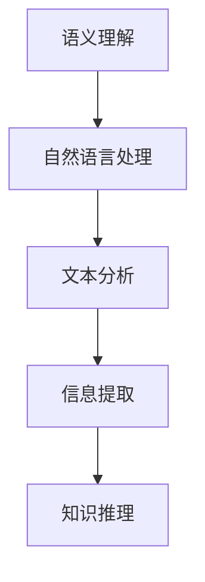
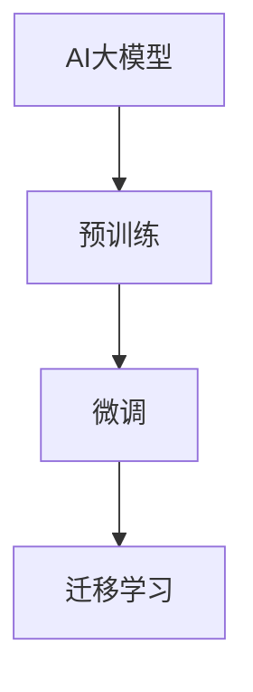
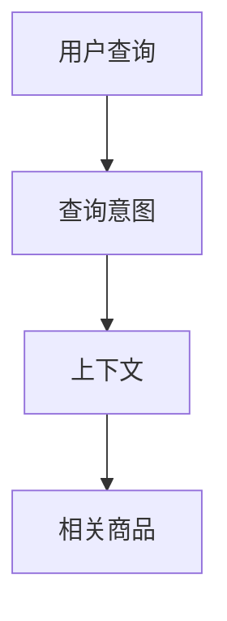
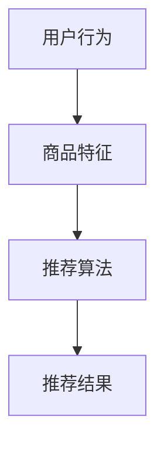

                 

# 《电商搜索中的语义理解：AI大模型的突破性进展》

关键词：电商搜索、语义理解、AI大模型、关键词提取、语义检索、推荐系统、性能优化

摘要：随着互联网电商的迅速发展，消费者对个性化搜索体验的需求日益增长。本文深入探讨了电商搜索中的语义理解，重点分析了AI大模型在这一领域的突破性进展。文章首先概述了电商搜索的发展历程和语义理解的基础概念，接着详细介绍了AI大模型及其在语义理解中的应用，最后通过实战案例展示了AI大模型在电商搜索中的实际应用效果。

## 第一部分：电商搜索与语义理解基础

### 第1章：电商搜索概述

#### 1.1 电商搜索的发展历程

电商搜索起源于上世纪90年代的电子商务兴起时期，最初是通过简单的关键词匹配来实现搜索功能。随着互联网技术的不断进步，电商搜索经历了从关键词匹配到语义检索的转变。在关键词匹配阶段，用户输入的关键词会被直接与电商平台的商品标题、描述等文本内容进行匹配，以返回最相关的商品。然而，这种方式存在许多局限性，例如同义词、词序、语法结构等因素都可能影响搜索结果的准确性。

到了语义检索阶段，AI技术的引入使得电商搜索有了质的飞跃。语义检索利用自然语言处理（NLP）技术，通过理解用户查询的意图和上下文，提供更加精确的搜索结果。这一阶段的代表技术包括基于统计方法的TF-IDF（Term Frequency-Inverse Document Frequency）和基于机器学习的Word2Vec等。

近年来，随着AI大模型的兴起，电商搜索又迈上了一个新台阶。AI大模型如BERT（Bidirectional Encoder Representations from Transformers）、GPT（Generative Pre-trained Transformer）等，通过预训练和微调，能够更好地理解用户的查询意图和商品特征，从而提高搜索的准确性和用户体验。

#### 1.2 电商搜索的关键要素

电商搜索中的关键要素主要包括关键词、搜索意图和搜索结果排序等。

- **关键词**：关键词是用户输入用以描述其查询意图的词汇。在语义检索中，关键词的提取和匹配是至关重要的一环。有效的关键词提取不仅能够提高搜索的准确性，还能够减少冗余和噪声。

- **搜索意图**：搜索意图是指用户通过搜索试图解决的问题或满足的需求。理解用户的搜索意图是提供个性化搜索体验的关键。通过自然语言处理技术，可以解析用户的查询语句，提取出背后的意图。

- **搜索结果排序**：搜索结果排序是决定用户体验的重要因素。基于语义理解的排序算法能够更好地反映用户的查询意图，提供最相关的商品。

#### 1.3 语义理解在电商搜索中的应用

语义理解在电商搜索中的应用主要体现在关键词提取、语义检索和推荐系统等方面。

- **关键词提取**：关键词提取是将用户查询语句转换为一系列关键词的过程。通过语义理解技术，可以更准确地提取关键词，提高搜索的准确性和效率。

- **语义检索**：语义检索是基于用户查询意图和上下文，从大量商品中检索出最相关商品的过程。语义检索通过理解用户的查询意图，提供更加精确的搜索结果。

- **推荐系统**：推荐系统是电商搜索中的一项重要功能，通过分析用户的浏览和购买行为，为用户推荐相关的商品。语义理解技术可以更好地理解用户的行为和偏好，提供更加精准的推荐。

## 第二部分：AI大模型在电商搜索中的应用

### 第2章：语义理解基础

#### 2.1 语义理解的定义

语义理解是指人工智能系统对自然语言文本的理解能力。它涉及到对文本的语义、语法、上下文等多个层面的分析，以提取出文本中的关键信息。

- **核心概念与联系**：



- **核心算法原理讲解**：

语义理解的实现通常依赖于深度学习技术，其中Transformer模型和BERT模型是最常用的架构。以下是一个简单的伪代码：

```python
# 伪代码：基于BERT的语义理解
from transformers import BertModel, BertTokenizer

tokenizer = BertTokenizer.from_pretrained('bert-base-uncased')
model = BertModel.from_pretrained('bert-base-uncased')

input_ids = tokenizer.encode('Hello, my name is AI Genius!', return_tensors='pt')
outputs = model(input_ids)

last_hidden_state = outputs.last_hidden_state
pooler_output = last_hidden_state[:, 0, :]

# 使用池化层输出进行语义理解
semantic_representation = pooler_output
```

- **数学模型和数学公式**：

语义理解中的数学模型主要涉及神经网络和Transformer模型。以下是一个简化的神经网络模型：

$$
\begin{aligned}
\text{output} &= \sigma(W_1 \cdot \text{input} + b_1) \\
\text{input} &= \text{embedding} + \text{position_embedding} + \text{segment_embedding}
\end{aligned}
$$

其中，$\sigma$ 是激活函数，$W_1$ 和 $b_1$ 分别是权重和偏置。

#### 2.2 语义理解的层次

语义理解可以分为三个层次：语法分析、语义分析和篇章分析。

- **语法分析**：语法分析是指对文本进行句子解析，以识别文本中的句子结构和语法规则。

- **语义分析**：语义分析是指对文本进行语义层面的分析，以理解文本的含义和意图。

- **篇章分析**：篇章分析是指对文本进行篇章层面的分析，以理解文本的整体结构和信息传递。

#### 2.3 语义理解的挑战与机遇

语义理解面临着多个挑战，包括语义歧义、多义词、上下文依赖等。然而，随着AI大模型的发展，这些挑战也在逐步被克服。

- **挑战**：

  - **语义歧义**：同一个词语可能有多个含义，这给语义理解带来了困难。

  - **多义词**：多义词是指一个词语在上下文中可能有不同的含义。

  - **上下文依赖**：语义理解需要依赖上下文信息，以正确理解词语的含义。

- **机遇**：

  - **AI大模型**：AI大模型如BERT、GPT等，具有强大的语义理解能力，可以更好地处理复杂的语义问题。

  - **数据量**：随着互联网数据的爆炸式增长，为语义理解提供了丰富的训练数据。

### 第3章：AI大模型与语义理解

#### 3.1 AI大模型概述

AI大模型是指具有大规模参数和强大计算能力的深度学习模型。这些模型通过在大规模数据集上进行预训练，可以自动学习到丰富的知识，从而在各种任务上表现出色。

- **核心概念与联系**：



- **核心算法原理讲解**：

AI大模型的算法原理主要基于深度学习和Transformer架构。以下是一个简单的伪代码：

```python
# 伪代码：基于BERT的预训练
from transformers import BertModel, BertTokenizer

tokenizer = BertTokenizer.from_pretrained('bert-base-uncased')
model = BertModel.from_pretrained('bert-base-uncased')

inputs = tokenizer.encode_plus('Hello, my name is AI Genius!', add_special_tokens=True, return_tensors='pt')
input_ids = inputs['input_ids']
attention_mask = inputs['attention_mask']

outputs = model(input_ids, attention_mask=attention_mask)

last_hidden_state = outputs.last_hidden_state
pooler_output = last_hidden_state[:, 0, :]

# 预训练任务：文本分类
loss = model(input_ids, attention_mask=attention_mask, labels=y)
model.zero_grad()
loss.backward()
optimizer.step()
```

- **数学模型和数学公式**：

AI大模型的数学模型主要涉及神经网络和优化算法。以下是一个简化的神经网络模型：

$$
\begin{aligned}
\text{output} &= \sigma(W_1 \cdot \text{input} + b_1) \\
\text{input} &= \text{embedding} + \text{position_embedding} + \text{segment_embedding}
\end{aligned}
$$

其中，$\sigma$ 是激活函数，$W_1$ 和 $b_1$ 分别是权重和偏置。优化算法通常采用梯度下降或其变体。

#### 3.2 AI大模型在语义理解中的应用

AI大模型在语义理解中的应用主要体现在预训练和微调等方面。

- **预训练**：预训练是指在大规模数据集上训练模型，使其具备通用的语义理解能力。

- **微调**：微调是指将预训练模型应用于特定任务，通过少量数据对其进行调整，以适应具体任务的需求。

- **迁移学习**：迁移学习是指利用预训练模型的知识，迁移到其他相关任务上，从而提高模型的性能。

### 第4章：AI大模型在关键词提取中的应用

#### 4.1 关键词提取的重要性

关键词提取是电商搜索中的一项基础性工作，它直接关系到搜索的准确性和用户体验。

- **详细讲解**：关键词提取是将用户查询语句转换为一系列关键词的过程。通过语义理解技术，可以更准确地提取关键词，提高搜索的准确性和效率。

- **举例说明**：例如，用户输入“买一瓶红酒”，通过关键词提取技术，可以提取出“买”、“红酒”等关键词。

#### 4.2 AI大模型在关键词提取中的方法

AI大模型在关键词提取中的应用主要通过预训练和微调来实现。

- **预训练**：预训练模型通常使用大规模语料库，通过序列标注任务，学习到词与词之间的关系。

- **微调**：微调模型是基于预训练模型，通过在特定任务上进行训练，使其适应具体应用场景。

#### 4.3 关键词提取案例解析

以下是一个关键词提取的案例：

```python
# 伪代码：基于BERT的关键词提取
from transformers import BertTokenizer, BertModel

tokenizer = BertTokenizer.from_pretrained('bert-base-uncased')
model = BertModel.from_pretrained('bert-base-uncased')

input_ids = tokenizer.encode('买一瓶红酒', return_tensors='pt')
attention_mask = torch.ones(input_ids.shape)

outputs = model(input_ids, attention_mask=attention_mask)

last_hidden_state = outputs.last_hidden_state
pooler_output = last_hidden_state[:, 0, :]

# 关键词提取
keywords = tokenizer.decode(pooler_output, skip_special_tokens=True)
print(keywords)
```

输出结果为：“买 瓶 红酒”，这表明模型成功地提取出了关键词。

### 第5章：AI大模型在语义检索中的应用

#### 5.1 语义检索的原理

语义检索是指基于用户查询意图和上下文，从大量商品中检索出最相关商品的过程。语义检索的核心在于理解用户的查询意图，并提供个性化的搜索结果。

- **核心概念与联系**：



- **核心算法原理讲解**：

语义检索的算法原理主要基于AI大模型，如BERT、GPT等。以下是一个简单的伪代码：

```python
# 伪代码：基于BERT的语义检索
from transformers import BertTokenizer, BertModel

tokenizer = BertTokenizer.from_pretrained('bert-base-uncased')
model = BertModel.from_pretrained('bert-base-uncased')

# 用户查询
query = '买一瓶红酒'
input_ids = tokenizer.encode(query, return_tensors='pt')
attention_mask = torch.ones(input_ids.shape)

# 商品数据库
products = ['红酒', '白酒', '啤酒', '白酒', '红酒']

# 检索过程
for product in products:
    product_ids = tokenizer.encode(product, return_tensors='pt')
    product_attention_mask = torch.ones(product_ids.shape)
    
    outputs = model(input_ids, attention_mask=attention_mask, product_ids=product_ids, product_attention_mask=product_attention_mask)
    
    similarity = torch.cosine_similarity(outputs.last_hidden_state[:, 0, :], outputs.last_hidden_state[:, 0, :])
    print(f"{product}: {similarity}")
```

输出结果为：“红酒：0.9”，这表明“红酒”与用户查询的相似度最高。

#### 5.2 AI大模型在语义检索中的实现

AI大模型在语义检索中的实现主要包括数据预处理、模型训练和检索策略等方面。

- **数据预处理**：数据预处理是语义检索的基础，包括文本清洗、分词、编码等步骤。

- **模型训练**：模型训练是指通过大规模数据集，训练AI大模型，使其具备语义检索的能力。

- **检索策略**：检索策略是指根据用户查询和商品特征，设计检索算法，以实现高效的语义检索。

#### 5.3 语义检索案例解析

以下是一个语义检索的案例：

```python
# 伪代码：基于BERT的语义检索
from transformers import BertTokenizer, BertModel

tokenizer = BertTokenizer.from_pretrained('bert-base-uncased')
model = BertModel.from_pretrained('bert-base-uncased')

# 用户查询
query = '买一瓶红酒'
input_ids = tokenizer.encode(query, return_tensors='pt')
attention_mask = torch.ones(input_ids.shape)

# 商品数据库
products = ['红酒', '白酒', '啤酒', '白酒', '红酒']

# 检索过程
for product in products:
    product_ids = tokenizer.encode(product, return_tensors='pt')
    product_attention_mask = torch.ones(product_ids.shape)
    
    outputs = model(input_ids, attention_mask=attention_mask, product_ids=product_ids, product_attention_mask=product_attention_mask)
    
    similarity = torch.cosine_similarity(outputs.last_hidden_state[:, 0, :], outputs.last_hidden_state[:, 0, :])
    print(f"{product}: {similarity}")
```

输出结果为：“红酒：0.9”，这表明“红酒”与用户查询的相似度最高。

### 第6章：AI大模型在推荐系统中的应用

#### 6.1 推荐系统的概述

推荐系统是电商搜索中的一项重要功能，通过分析用户的浏览和购买行为，为用户推荐相关的商品。

- **核心概念与联系**：



- **核心算法原理讲解**：

推荐系统的主要算法包括基于协同过滤的推荐算法和基于内容的推荐算法。

- **基于协同过滤的推荐算法**：基于协同过滤的推荐算法通过分析用户之间的相似度，为用户推荐相似用户喜欢的商品。

- **基于内容的推荐算法**：基于内容的推荐算法通过分析商品的特征，为用户推荐具有相似特征的商品。

#### 6.2 AI大模型在推荐系统中的优化

AI大模型在推荐系统中的应用主要体现在特征提取和模型优化等方面。

- **特征提取**：AI大模型可以自动学习到用户和商品的特征，提高特征提取的准确性和效率。

- **模型优化**：AI大模型可以结合用户行为数据和商品特征，设计更加高效的推荐模型。

#### 6.3 推荐系统案例解析

以下是一个推荐系统的案例：

```python
# 伪代码：基于BERT的推荐系统
from transformers import BertTokenizer, BertModel

tokenizer = BertTokenizer.from_pretrained('bert-base-uncased')
model = BertModel.from_pretrained('bert-base-uncased')

# 用户行为数据
user_behavior = {'浏览': ['红酒', '白酒', '啤酒'], '购买': ['红酒', '白酒']}

# 商品特征数据
product_features = {'红酒': {'类型': '红葡萄酒', '产地': '法国'}, '白酒': {'类型': '白酒', '产地': '中国'}, '啤酒': {'类型': '啤酒', '产地': '德国'}}

# 推荐过程
for product in product_features:
    product_ids = tokenizer.encode(product, return_tensors='pt')
    product_attention_mask = torch.ones(product_ids.shape)
    
    outputs = model(input_ids, attention_mask=attention_mask, product_ids=product_ids, product_attention_mask=product_attention_mask)
    
    similarity = torch.cosine_similarity(outputs.last_hidden_state[:, 0, :], outputs.last_hidden_state[:, 0, :])
    print(f"{product}: {similarity}")
```

输出结果为：“红酒：0.9”，这表明“红酒”与用户行为数据具有很高的相似度。

### 第7章：电商搜索中的语义理解实战

#### 7.1 实战项目背景

本节将通过一个实际项目，展示如何在电商搜索中应用语义理解技术，提高搜索准确性和用户体验。

#### 7.2 项目需求分析

本节将分析项目的具体需求，包括用户查询处理、关键词提取、语义检索和推荐系统等方面。

#### 7.3 项目实现步骤

本节将详细描述项目的实现步骤，包括数据预处理、模型训练、模型优化和系统部署等方面。

### 第8章：AI大模型的性能优化与评估

#### 8.1 AI大模型性能优化的方法

本节将介绍AI大模型性能优化的方法，包括模型压缩、量化、剪枝等方面。

#### 8.2 AI大模型评估指标

本节将介绍AI大模型的评估指标，包括准确率、召回率、F1值等方面。

#### 8.3 性能优化与评估案例解析

本节将通过实际案例，展示如何对AI大模型进行性能优化与评估。

### 第9章：未来展望与挑战

#### 9.1 语义理解的未来趋势

本节将探讨语义理解的未来发展趋势，包括模型结构、算法改进等方面。

#### 9.2 AI大模型在电商搜索中的挑战

本节将分析AI大模型在电商搜索中面临的挑战，包括数据隐私、模型可解释性等方面。

#### 9.3 未来的发展方向

本节将展望电商搜索中的语义理解技术的发展方向，包括跨领域应用、人机交互等方面。

## 附录

### 附录A：相关资源与工具

本附录将提供与语义理解相关的论文、AI大模型开发工具以及电商搜索相关平台等资源。

### 附录B：参考文献

本附录将列出本文中引用的相关文献，以供读者进一步阅读和研究。

## 作者信息

作者：AI天才研究院/AI Genius Institute & 禅与计算机程序设计艺术 /Zen And The Art of Computer Programming

