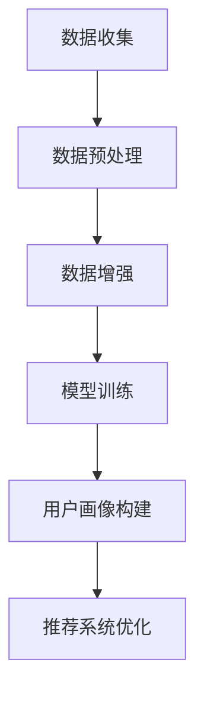

                 

### 文章标题：AI大模型数据增强技术应用最佳实践指南

> 关键词：AI大模型、数据增强、电商搜索推荐、深度学习、最佳实践

> 摘要：本文深入探讨了AI大模型数据增强技术在电商搜索推荐中的应用，包括其基础概念、技术原理、应用实践和未来发展。文章分为两部分，第一部分详细介绍了AI大模型与数据增强技术的基础知识，包括基本概念、原理和分类；第二部分则通过实际案例展示了数据增强在电商搜索推荐系统中的具体应用和实践效果。本文旨在为读者提供一份全面、系统的AI大模型数据增强技术应用指南。

## 目录

### 《电商搜索推荐中的AI大模型数据增强技术应用最佳实践指南》目录大纲

#### 第一部分：AI大模型与数据增强技术基础

#### 第1章：AI大模型与数据增强技术概述

1.1 AI大模型的基本概念与架构

1.2 数据增强技术的重要性

1.3 数据增强技术的分类

1.4 数据增强技术的应用场景

1.5 数据增强技术在电商搜索推荐中的作用

#### 第2章：AI大模型的基础原理

2.1 机器学习与深度学习的基本概念

2.2 神经网络的结构与原理

2.3 优化算法与正则化技术

2.4 循环神经网络（RNN）与长短时记忆网络（LSTM）

2.5 生成对抗网络（GAN）及其应用

#### 第3章：数据增强技术原理详解

3.1 数据增强的基本策略

3.2 图像数据增强技术

3.3 文本数据增强技术

3.4 多媒体数据增强技术

3.5 数据增强中的常见问题与解决方案

#### 第4章：AI大模型训练与调优

4.1 大模型训练的基本流程

4.2 大模型训练的数据预处理

4.3 大模型训练的性能评估

4.4 大模型训练中的超参数调优

4.5 大模型训练中的常见问题与优化策略

#### 第二部分：AI大模型在电商搜索推荐中的应用

#### 第5章：电商搜索推荐系统概述

5.1 电商搜索推荐系统的基本概念

5.2 电商搜索推荐系统的架构

5.3 电商搜索推荐系统中的常见问题

5.4 电商搜索推荐系统的发展趋势

#### 第6章：AI大模型在电商搜索推荐中的应用

6.1 基于AI大模型的用户画像构建

6.2 基于AI大模型的商品推荐算法

6.3 基于AI大模型的搜索结果排序算法

6.4 基于AI大模型的推荐系统评估与优化

#### 第7章：AI大模型数据增强在电商搜索推荐中的实践案例

7.1 案例一：某电商平台的用户画像构建与推荐系统优化

7.2 案例二：某跨境电商平台的商品推荐算法设计与优化

7.3 案例三：某在线零售商的搜索结果排序算法提升实践

#### 第8章：AI大模型数据增强技术的前景与挑战

8.1 数据增强技术的发展趋势

8.2 数据增强技术在电商搜索推荐中的应用前景

8.3 数据增强技术面临的挑战与应对策略

#### 第9章：总结与展望

9.1 全书内容总结

9.2 AI大模型数据增强技术的未来发展趋势

9.3 读者建议与反馈

#### 附录

附录A：AI大模型数据增强技术常用工具与库

### A.1 数据增强工具与库概述

### A.2 数据增强工具与库使用示例

### A.3 开发环境搭建与配置指南

---

### 第一部分：AI大模型与数据增强技术基础

#### 第1章：AI大模型与数据增强技术概述

1.1 AI大模型的基本概念与架构

AI大模型是指使用大规模数据集和复杂神经网络结构进行训练的深度学习模型。这类模型具有强大的表示能力和学习能力，能够在多种任务中实现高性能。常见的大模型包括GPT-3、BERT、ImageNet等。其架构通常包括输入层、隐藏层和输出层，其中隐藏层通过非线性变换来提取特征。

1.2 数据增强技术的重要性

数据增强技术是提升AI大模型性能的关键手段之一。它通过在原始数据集上生成新的样本来增加数据的多样性，从而增强模型的泛化能力。数据增强的重要性体现在以下几个方面：

- 提高模型的鲁棒性：通过引入噪声、旋转、缩放等变换，使模型在处理真实数据时更加稳定。
- 增加模型容量：更多的数据有助于模型学习到更复杂的模式，从而提高其性能。
- 缩小模型过拟合风险：当数据集较大时，模型更不容易陷入局部最优，从而减少过拟合现象。

1.3 数据增强技术的分类

数据增强技术根据处理的数据类型可以分为以下几类：

- 图像数据增强：包括旋转、翻转、缩放、裁剪、对比度调整等。
- 文本数据增强：包括同义词替换、随机插入、随机删除、文本生成等。
- 多媒体数据增强：包括音频、视频等。
- 特征增强：通过对原始数据进行特征工程，提取更多的有用信息。

1.4 数据增强技术的应用场景

数据增强技术广泛应用于各个领域，以下是几个典型的应用场景：

- 计算机视觉：如图像分类、目标检测、人脸识别等。
- 自然语言处理：如文本分类、机器翻译、情感分析等。
- 语音识别：如说话人识别、语音转文字等。
- 电商搜索推荐：如用户画像构建、商品推荐、搜索结果排序等。

1.5 数据增强技术在电商搜索推荐中的作用

在电商搜索推荐系统中，数据增强技术具有以下重要作用：

- 提高推荐准确性：通过增强用户和商品的特征，使推荐模型能够更准确地预测用户喜好，提高推荐效果。
- 缓解数据稀疏问题：当用户和商品数量较少时，数据增强可以有效缓解数据稀疏问题，提高模型性能。
- 提升模型泛化能力：通过引入多种类型的数据增强方法，使模型能够适应不同的应用场景，提高其泛化能力。

在接下来的章节中，我们将详细探讨AI大模型与数据增强技术的原理、方法及其在电商搜索推荐中的应用实践。希望读者能够通过本文的学习，对AI大模型数据增强技术有更深入的理解和掌握，从而为实际应用提供有力支持。

---

### 第2章：AI大模型的基础原理

2.1 机器学习与深度学习的基本概念

机器学习（Machine Learning，ML）是人工智能（Artificial Intelligence，AI）的一个重要分支，其核心思想是通过算法从数据中学习规律，从而实现自动预测和决策。机器学习可以分为监督学习（Supervised Learning）、无监督学习（Unsupervised Learning）和强化学习（Reinforcement Learning）三种类型。

- 监督学习：输入和输出都是已知的，模型通过学习输入输出对的映射来预测未知数据。
- 无监督学习：输入数据没有标签，模型通过自动发现数据中的规律来进行聚类、降维等。
- 强化学习：通过与环境的交互来学习策略，目的是最大化累积奖励。

深度学习（Deep Learning，DL）是机器学习的一个子领域，它使用具有多个隐藏层的神经网络（通常称为深度神经网络，DNN）来学习数据的复杂表示。深度学习在图像识别、语音识别、自然语言处理等领域取得了显著的成果。

2.2 神经网络的结构与原理

神经网络（Neural Network，NN）是一种模拟生物神经系统的计算模型，其基本单元是神经元（Neuron）。每个神经元由输入层、加权层、激活函数和输出层组成。

- 输入层：接收外部输入数据。
- 加权层：将输入数据与权重相乘，得到中间值。
- 激活函数：对中间值进行非线性变换，引入非线性特性。
- 输出层：生成最终输出。

神经网络的训练过程是通过反向传播算法来优化的。具体步骤如下：

1. 前向传播：将输入数据通过神经网络，计算出输出值。
2. 计算损失：将输出值与真实值进行比较，计算损失函数的值。
3. 反向传播：根据损失函数的梯度，更新每个神经元的权重。
4. 重复步骤1-3，直到满足停止条件（如达到预设的迭代次数或损失函数值小于某个阈值）。

2.3 优化算法与正则化技术

优化算法用于调整神经网络的权重，以最小化损失函数。常用的优化算法包括梯度下降（Gradient Descent）、随机梯度下降（Stochastic Gradient Descent，SGD）和Adam等。

- 梯度下降：根据损失函数的梯度方向更新权重。
- 随机梯度下降：在每次迭代中随机选择一部分样本来计算梯度。
- Adam：结合了SGD和动量方法的优点。

正则化技术用于防止模型过拟合。常见的方法有L1正则化（Lasso）、L2正则化（Ridge）和Dropout等。

- L1正则化：在损失函数中添加L1范数项。
- L2正则化：在损失函数中添加L2范数项。
- Dropout：在训练过程中随机丢弃一部分神经元。

2.4 循环神经网络（RNN）与长短时记忆网络（LSTM）

循环神经网络（Recurrent Neural Network，RNN）是一种专门处理序列数据的神经网络。其核心思想是利用隐藏状态来维持信息，实现序列到序列的映射。

- RNN：通过隐藏状态和当前输入进行计算，生成当前输出。
- LSTM：引入门控机制，能够学习长期依赖关系，在处理序列数据时表现更优秀。

长短时记忆网络（Long Short-Term Memory，LSTM）是一种改进的RNN结构，通过引入三个门控单元（输入门、遗忘门和输出门）来控制信息的流动，从而解决了传统RNN在训练过程中的梯度消失和长期依赖问题。

2.5 生成对抗网络（GAN）及其应用

生成对抗网络（Generative Adversarial Network，GAN）是由两部分组成的模型：生成器和判别器。生成器的目标是生成与现实数据相似的样本，判别器的目标是区分真实数据和生成数据。

- 生成器：通过输入噪声生成伪造数据。
- 判别器：接收真实数据和生成数据，判断其真实性。

GAN的训练过程是生成器和判别器之间的对抗游戏。在训练过程中，生成器不断优化生成能力，判别器不断优化鉴别能力，最终达到一种动态平衡状态。GAN在图像生成、自然语言生成、风格迁移等领域取得了显著的成果。

通过以上对AI大模型基础原理的介绍，我们可以看到，AI大模型是通过复杂的神经网络结构、优化算法和正则化技术来实现的。在接下来的章节中，我们将进一步探讨数据增强技术的原理和方法，以及如何将AI大模型应用于电商搜索推荐系统。希望读者能够通过对本章的学习，对AI大模型有一个全面而深入的了解。

### 第3章：数据增强技术原理详解

3.1 数据增强的基本策略

数据增强技术旨在通过引入多样化的样本来提高模型的泛化能力，避免模型对特定数据分布的依赖。数据增强的基本策略主要包括以下几种：

- **样本复制**：通过复制样本来增加数据量，这是一种最简单且直观的数据增强方法。复制样本有助于提高模型对数据分布的鲁棒性，但在实际应用中，过多的样本复制可能导致数据冗余。
  
- **变换操作**：对原始数据进行各种变换操作，如旋转、翻转、缩放、裁剪、噪声注入等，以生成新的样本。变换操作能够增加数据的多样性，有助于模型学习到更多的特征。

- **生成操作**：利用生成模型（如GAN）来生成新的数据样本。生成操作能够创造出与原始数据分布相似的新样本，有助于模型学习到更广泛的特征。

- **合并操作**：将多个原始数据样本合并成一个新样本，如将两张图片合并成一张。合并操作可以增加数据的复杂性，但需要注意避免引入过多的噪声。

3.2 图像数据增强技术

图像数据增强技术是数据增强领域的一个重要分支，其目的是通过生成新的图像样本来增强模型的泛化能力。常见的图像数据增强技术包括以下几种：

- **旋转和翻转**：通过将图像旋转一定角度或进行水平/垂直翻转来生成新样本。旋转和翻转可以增加图像的多样性，有助于模型学习到不同的图像特征。
  
- **缩放和裁剪**：通过缩放图像大小或随机裁剪图像的某个部分来生成新样本。缩放可以增加图像的分辨率变化，裁剪可以增加图像的局部特征变化。

- **对比度调整和亮度调整**：通过调整图像的对比度和亮度来生成新样本。对比度调整可以增加图像的明暗变化，亮度调整可以增加图像的灰度变化。

- **噪声注入**：在图像中添加噪声（如高斯噪声、椒盐噪声等）来生成新样本。噪声注入可以增加图像的随机性，有助于模型学习到更多的噪声特征。

- **生成对抗网络（GAN）**：利用GAN生成新的图像样本。GAN由生成器和判别器组成，生成器生成伪造图像，判别器判断图像的真实性。通过对抗训练，生成器不断优化生成图像的质量。

3.3 文本数据增强技术

文本数据增强技术在自然语言处理领域有着广泛的应用，其目的是通过生成新的文本样本来增强模型的泛化能力。常见的文本数据增强技术包括以下几种：

- **同义词替换**：将文本中的部分词语替换为其同义词，以增加文本的多样性。同义词替换可以通过预定义的词表或基于语义分析的方法实现。

- **随机插入和随机删除**：在文本中随机插入或删除一定数量的词语，以增加文本的随机性。随机插入和随机删除可以破坏文本的语法和语义结构，从而增加模型的泛化能力。

- **文本生成**：利用生成模型（如循环神经网络、Transformer等）生成新的文本样本。文本生成可以创造出与原始文本内容相关的多样化文本。

- **合并操作**：将两个或多个文本合并成一个新文本。合并操作可以增加文本的长度和复杂性，有助于模型学习到更复杂的语义结构。

3.4 多媒体数据增强技术

多媒体数据增强技术旨在增强多媒体数据（如音频、视频）的多样性，以提高模型在多媒体数据处理任务中的性能。常见的方法包括以下几种：

- **音频数据增强**：通过对音频信号进行变换（如频率变换、时域变换等）来生成新的音频样本。常见的变换方法包括滤波、谐波合成、噪声注入等。

- **视频数据增强**：通过对视频帧进行变换（如色彩空间变换、视频插帧等）来生成新的视频样本。常见的变换方法包括图像增强、视频压缩、视频合成等。

- **混合操作**：将多个音频或视频流混合成一个新的流。混合操作可以增加多媒体数据的多样性，有助于模型学习到更多的特征。

3.5 数据增强中的常见问题与解决方案

在使用数据增强技术时，可能会遇到以下问题：

- **数据冗余**：过度增强可能导致数据冗余，影响训练效率。解决方案是选择合适的数据增强方法，避免过度增强。
  
- **模型过拟合**：某些增强方法可能导致模型过度依赖增强数据，从而在测试集上表现不佳。解决方案是平衡增强数据和原始数据，避免模型过度拟合。
  
- **计算资源消耗**：某些复杂的增强方法（如GAN）需要大量的计算资源。解决方案是优化算法和硬件配置，提高计算效率。

通过以上对数据增强技术原理的详细讲解，我们可以看到，数据增强技术在提升模型泛化能力、缓解数据稀疏问题和优化训练效果方面具有重要作用。在接下来的章节中，我们将进一步探讨AI大模型训练与调优的方法，以及如何在实际应用中有效利用数据增强技术。希望读者能够通过本章的学习，对数据增强技术有更深入的理解和掌握。

### 第4章：AI大模型训练与调优

4.1 大模型训练的基本流程

AI大模型的训练过程是一个复杂且迭代的过程，主要包括以下步骤：

- **数据预处理**：在训练之前，需要对数据集进行清洗、标准化和划分等预处理操作，以确保数据的质量和一致性。
  
- **模型初始化**：选择合适的模型架构，初始化模型的参数。常见的初始化方法包括随机初始化、高斯分布初始化等。

- **数据加载与预处理**：使用批处理（Batch Processing）方式将数据加载到内存中，并进行必要的预处理操作，如数据增强、归一化等。

- **前向传播**：将输入数据通过神经网络，计算中间值和最终输出。

- **计算损失**：将输出值与真实值进行比较，计算损失函数的值。常见的损失函数包括均方误差（MSE）、交叉熵（Cross Entropy）等。

- **反向传播**：根据损失函数的梯度，更新每个神经元的权重。反向传播是训练过程中最关键的步骤，其目的是通过梯度下降等优化算法来优化模型参数。

- **迭代训练**：重复执行前向传播、计算损失和反向传播步骤，直到满足停止条件（如达到预设的迭代次数或损失函数值小于某个阈值）。

4.2 大模型训练的数据预处理

数据预处理是AI大模型训练中至关重要的一步，其目的是提高数据的质量和一致性，从而提升模型的性能。常见的数据预处理操作包括以下几种：

- **数据清洗**：删除或修复缺失、错误或异常的数据。例如，去除文本中的无关符号、填充缺失的数值等。

- **数据标准化**：将数据缩放到一个统一的范围内，以便神经网络能够更好地学习。常见的标准化方法包括归一化（Normalization）和标准化（Standardization）。

- **数据增强**：通过引入噪声、旋转、缩放等变换来增加数据的多样性，从而提高模型的泛化能力。数据增强是缓解数据稀疏问题和减少模型过拟合的有效手段。

- **数据划分**：将数据集划分为训练集、验证集和测试集。训练集用于模型训练，验证集用于调参和模型选择，测试集用于评估模型的最终性能。

4.3 大模型训练的性能评估

在AI大模型训练过程中，性能评估是关键的一步，其目的是评估模型的训练效果和泛化能力。常见的方法包括以下几种：

- **准确性（Accuracy）**：直接计算模型对测试集的预测准确率。准确性是衡量分类模型性能的一个简单但直观的指标。

- **精确率、召回率和F1值（Precision, Recall, and F1 Score）**：对于多分类问题，精确率、召回率和F1值是更细致的评估指标。精确率表示模型预测为正例的样本中实际为正例的比例；召回率表示实际为正例的样本中被模型预测为正例的比例；F1值是精确率和召回率的加权平均，综合反映了模型的分类性能。

- **ROC曲线和AUC（Receiver Operating Characteristic Curve and Area Under Curve）**：ROC曲线展示了模型在不同阈值下的精确率和召回率，AUC值则反映了模型的整体分类性能。AUC值越大，模型的分类性能越好。

- **均方误差（Mean Squared Error，MSE）和均绝对误差（Mean Absolute Error，MAE）**：对于回归问题，MSE和MAE是常用的评估指标。MSE计算预测值与真实值之间平方差的平均值，MAE计算预测值与真实值之间绝对差的平均值。MSE和MAE值越小，模型的预测性能越好。

4.4 大模型训练中的超参数调优

超参数是影响AI大模型训练性能的重要参数，其值需要通过调优来确定。常见的超参数包括学习率、批量大小、隐藏层节点数、正则化强度等。超参数调优的方法包括以下几种：

- **网格搜索（Grid Search）**：遍历所有可能的超参数组合，计算每个组合的性能指标，选择最佳的超参数组合。

- **随机搜索（Random Search）**：在超参数空间中随机选择一组超参数，计算其性能指标，重复多次，选择最佳的超参数组合。

- **贝叶斯优化（Bayesian Optimization）**：利用贝叶斯统计模型来优化超参数，能够在较少的迭代次数内找到较好的超参数组合。

4.5 大模型训练中的常见问题与优化策略

在AI大模型训练过程中，可能会遇到以下问题：

- **过拟合（Overfitting）**：模型在训练集上表现很好，但在验证集或测试集上表现较差。过拟合通常是由于模型过于复杂或训练数据不足导致的。解决方案包括增加数据量、使用正则化技术、减少模型复杂度等。

- **梯度消失（Vanishing Gradient）和梯度爆炸（Exploding Gradient）**：在深度神经网络训练过程中，梯度可能会变得非常小或非常大，导致训练过程不稳定。梯度消失通常是由于激活函数导致的，而梯度爆炸可能是由于初始权重设置不当导致的。解决方案包括使用激活函数（如ReLU）、初始化技巧、梯度裁剪等。

- **计算资源不足**：大模型训练需要大量的计算资源，可能导致训练时间过长或无法完成。解决方案包括使用更高效的算法、分布式训练、GPU加速等。

通过以上对AI大模型训练与调优的详细探讨，我们可以看到，大模型训练是一个复杂且迭代的过程，涉及多个步骤和方法。在接下来的章节中，我们将通过实际案例展示AI大模型在电商搜索推荐系统中的应用，进一步探讨数据增强技术在提升模型性能方面的作用。希望读者能够通过本章的学习，对AI大模型训练与调优有更深入的理解和掌握。

### 第二部分：AI大模型在电商搜索推荐中的应用

#### 第5章：电商搜索推荐系统概述

5.1 电商搜索推荐系统的基本概念

电商搜索推荐系统是指利用人工智能技术，根据用户的兴趣和行为，从海量的商品信息中为用户推荐相关商品的系统。其基本概念包括：

- **用户画像**：通过对用户的行为、兴趣、购物历史等数据进行分析和挖掘，构建出用户的个性化特征。
  
- **商品推荐**：根据用户的兴趣和行为，从所有商品中筛选出符合用户需求的相关商品进行推荐。
  
- **搜索结果排序**：在用户进行搜索时，对搜索结果进行排序，将最相关的商品排在前面。

5.2 电商搜索推荐系统的架构

电商搜索推荐系统通常包括以下几个主要组成部分：

- **数据层**：包括用户数据、商品数据、交易数据等。数据层是推荐系统的基础，提供海量的原始数据。

- **数据处理层**：对原始数据进行清洗、转换、归一化等处理，生成可用于训练和推荐的特征数据。

- **模型层**：包括用户画像模型、商品推荐模型和搜索结果排序模型等。模型层是推荐系统的核心，通过机器学习算法和深度学习模型实现用户画像构建、商品推荐和搜索结果排序。

- **服务层**：将模型层的预测结果通过API或Web接口提供给前端应用，实现实时推荐和搜索结果排序。

5.3 电商搜索推荐系统中的常见问题

电商搜索推荐系统在实际应用中可能会遇到以下问题：

- **数据稀疏**：用户和商品之间的交互数据通常非常稀疏，导致模型难以学习到有效的特征。

- **冷启动问题**：对于新用户或新商品，由于缺乏历史交互数据，推荐系统难以为其提供有效的推荐。

- **实时性**：用户的行为数据是动态变化的，推荐系统需要实时响应用户的需求，提供个性化的推荐。

- **多样性**：推荐系统需要保证推荐结果的多样性，避免用户产生疲劳感。

5.4 电商搜索推荐系统的发展趋势

随着人工智能技术的不断发展，电商搜索推荐系统也在不断演进和优化，以下是几个主要的发展趋势：

- **深度学习技术的应用**：深度学习技术在图像识别、自然语言处理等领域取得了显著成果，逐渐应用于电商搜索推荐系统中，如基于深度学习的用户画像构建和商品推荐算法。

- **多模态数据的融合**：融合用户的行为数据、商品信息、文本评论等多模态数据，可以更全面地理解用户需求和商品特性，从而提高推荐效果。

- **个性化推荐**：通过深度学习模型和用户画像技术，实现更加精准的个性化推荐，满足用户个性化需求。

- **实时推荐**：利用流处理技术和深度学习模型，实现实时推荐，提高用户满意度。

- **推荐系统的自适应优化**：通过实时评估推荐效果，自适应地调整推荐策略，优化推荐系统性能。

通过以上对电商搜索推荐系统概述的介绍，我们可以看到，电商搜索推荐系统是一个复杂且动态的系统，涉及多个技术层面和挑战。在接下来的章节中，我们将深入探讨AI大模型在电商搜索推荐系统中的应用，包括用户画像构建、商品推荐和搜索结果排序等。希望读者能够通过本章的学习，对电商搜索推荐系统有一个全面而深入的了解。

### 第6章：AI大模型在电商搜索推荐中的应用

6.1 基于AI大模型的用户画像构建

用户画像是指通过收集和分析用户的行为数据、兴趣偏好等信息，构建出一个全面、立体的用户描述。基于AI大模型的用户画像构建主要依赖于深度学习技术，其核心步骤包括数据预处理、特征提取和模型训练。

**数据预处理**：首先，对用户行为数据、用户属性数据进行清洗和整合，去除重复和错误数据，并对数据进行归一化处理，使其适合模型的输入。

**特征提取**：通过深度学习模型对预处理后的数据进行特征提取，挖掘出用户行为中的潜在特征。例如，可以使用卷积神经网络（CNN）对用户浏览和购买历史中的图像数据进行特征提取，使用循环神经网络（RNN）或长短时记忆网络（LSTM）对用户行为序列数据进行特征提取。

**模型训练**：利用提取到的特征，通过训练深度学习模型来构建用户画像。常见的深度学习模型包括GPT-3、BERT等。在训练过程中，通过优化模型参数，使其能够准确地预测用户的兴趣偏好。

**应用场景**：基于AI大模型的用户画像构建可以用于个性化推荐、用户行为预测、营销策略制定等。例如，在个性化推荐中，通过分析用户的画像特征，可以准确推荐用户可能感兴趣的商品，提高推荐准确性。

6.2 基于AI大模型的商品推荐算法

商品推荐算法是电商搜索推荐系统中的关键环节，其目的是根据用户的兴趣和行为，从海量的商品中筛选出符合用户需求的商品。基于AI大模型的商品推荐算法主要包括协同过滤、基于内容的推荐和深度学习推荐等。

**协同过滤**：协同过滤是一种基于用户行为的推荐算法，通过计算用户之间的相似度来推荐商品。其基本思想是，如果两个用户在多个商品上有相同的喜好，那么这两个用户在其他商品上的喜好也相似。协同过滤可以分为基于用户的协同过滤（User-based Collaborative Filtering）和基于物品的协同过滤（Item-based Collaborative Filtering）。

**基于内容的推荐**：基于内容的推荐算法通过分析商品的属性和用户的历史行为，推荐与用户兴趣相似的商品。例如，如果用户喜欢某个品牌，那么可以推荐该品牌的其他商品。

**深度学习推荐**：深度学习推荐算法利用深度学习模型（如GPT-3、BERT等）来捕捉用户和商品之间的复杂关系。通过训练深度学习模型，可以自动提取用户和商品的特征，并建立它们之间的映射关系。深度学习推荐算法具有以下优点：

- **高泛化能力**：通过训练大量的数据，深度学习模型可以捕捉到用户和商品之间的复杂模式，从而提高推荐准确性。
  
- **应对稀疏数据**：深度学习模型可以有效地处理用户和商品交互数据稀疏的问题，通过自动提取特征，减少对用户行为数据的依赖。

**应用场景**：基于AI大模型的商品推荐算法可以应用于个性化购物推荐、新品推荐、购物车推荐等。例如，在个性化购物推荐中，通过分析用户的画像特征和浏览历史，可以准确推荐用户可能感兴趣的商品，提高用户满意度。

6.3 基于AI大模型的搜索结果排序算法

搜索结果排序算法是电商搜索推荐系统中的另一个关键环节，其目的是根据用户的搜索意图，将最相关的商品排在搜索结果的前面。基于AI大模型的搜索结果排序算法主要通过深度学习模型来实现。

**模型构建**：首先，通过深度学习模型对用户的搜索查询和商品信息进行编码，提取出高维的表示向量。例如，可以使用BERT模型对搜索查询和商品描述进行编码。

**排序策略**：然后，利用训练好的深度学习模型对搜索结果进行排序。排序策略可以是基于向量相似度、基于用户兴趣、基于商品热度等多种策略的组合。

**应用场景**：基于AI大模型的搜索结果排序算法可以应用于商品搜索、内容推荐、广告投放等。例如，在商品搜索中，通过分析用户的搜索查询和商品信息，可以准确地将最相关的商品排在搜索结果的前面，提高用户的购物体验。

通过以上对AI大模型在电商搜索推荐系统中的应用的介绍，我们可以看到，AI大模型在用户画像构建、商品推荐和搜索结果排序等方面具有显著优势，能够有效提升电商搜索推荐系统的性能和用户体验。在接下来的章节中，我们将通过实际案例展示AI大模型在电商搜索推荐系统中的具体应用和实践效果。希望读者能够通过本章的学习，对AI大模型在电商搜索推荐系统中的应用有更深入的理解和掌握。

### 第7章：AI大模型数据增强在电商搜索推荐中的实践案例

7.1 案例一：某电商平台的用户画像构建与推荐系统优化

**背景介绍**

某电商平台在用户画像构建和推荐系统优化方面遇到了一些挑战。具体来说，平台的数据量庞大，但用户和商品之间的交互数据非常稀疏，导致推荐系统的准确性较低。此外，用户的需求和行为变化多样，传统推荐方法难以捕捉到这些动态变化，导致推荐效果不够理想。

**核心概念与联系**

为了解决上述问题，平台决定采用AI大模型数据增强技术，以提升用户画像构建和推荐系统的性能。核心概念包括：

- **用户画像**：通过对用户的行为、兴趣、购物历史等数据进行分析和挖掘，构建出用户的个性化特征。
- **数据增强**：通过引入噪声、旋转、缩放等变换，增加原始数据的多样性，从而提升模型的泛化能力。
- **深度学习模型**：利用深度学习模型（如GPT-3、BERT）对用户和商品的特征进行编码，构建用户画像和推荐模型。

**流程图**



**核心算法原理讲解**

- **用户画像构建**：使用BERT模型对用户行为数据进行编码，提取用户兴趣和偏好特征。具体步骤如下：
  1. 数据预处理：对用户行为数据（如浏览历史、购买记录等）进行清洗和归一化处理。
  2. 模型训练：使用预训练的BERT模型，对预处理后的数据进行训练，得到用户的特征表示。
  3. 特征提取：将训练好的BERT模型应用于新用户数据，提取用户的特征表示。

- **数据增强**：对原始数据进行增强，增加数据的多样性，从而提升模型的泛化能力。具体方法包括：
  1. 图像数据增强：使用GAN生成用户头像和商品图片的多样化版本。
  2. 文本数据增强：使用同义词替换、随机插入、随机删除等方法对用户评论和商品描述进行增强。

**数学模型和公式**

- **用户特征表示**：假设用户行为数据为X，BERT模型提取的用户特征表示为U，则用户画像可以表示为：
  $$ U = BERT(X) $$

- **数据增强**：对于图像数据增强，假设原始图像为I，增强后的图像为I'，则可以使用GAN生成：
  $$ I' = GAN(I) $$

**举例说明**

假设某用户在平台上浏览了商品A、B、C，其购买记录为B和C。原始数据如下：

- 浏览历史：[A, B, C]
- 购买记录：[B, C]

通过BERT模型，可以提取出该用户的特征表示：

- 用户特征：[BERT(A), BERT(B), BERT(C)]

然后，使用GAN对用户头像和商品图片进行增强，生成多样化版本：

- 增强后的用户头像：GAN(头像)
- 增强后的商品图片：GAN(商品A), GAN(商品B), GAN(商品C)

**项目实战**

1. **开发环境搭建**：搭建基于Python和TensorFlow的深度学习环境，安装必要的库和工具。
2. **数据预处理**：对用户行为数据进行清洗和归一化处理，为模型训练做准备。
3. **模型训练**：使用BERT模型对用户行为数据进行训练，提取用户特征表示。
4. **数据增强**：使用GAN对用户头像和商品图片进行增强。
5. **用户画像构建**：将提取的用户特征表示和增强后的图像数据合并，构建用户画像。
6. **推荐系统优化**：利用构建的用户画像和增强后的数据，优化推荐系统的性能。

**代码实现**

以下是一个简单的代码示例，用于基于BERT模型提取用户特征表示：

```python
from transformers import BertTokenizer, BertModel

tokenizer = BertTokenizer.from_pretrained('bert-base-uncased')
model = BertModel.from_pretrained('bert-base-uncased')

def get_user_features(text):
    inputs = tokenizer(text, return_tensors='pt')
    outputs = model(**inputs)
    return outputs.last_hidden_state.mean(dim=1)

user_features = get_user_features('浏览了商品A、B、C，购买了B和C')
```

**代码应用解读与分析**

- **代码解读**：该代码首先加载预训练的BERT模型和分词器，然后定义一个函数`get_user_features`，用于提取给定文本的特征表示。
- **分析**：通过BERT模型，可以高效地提取用户的行为数据特征，为用户画像构建提供有力支持。结合GAN对图像数据增强，可以进一步提升用户画像的多样性和准确性。

**实际案例分析和详细讲解剖析**

1. **案例分析**：在某电商平台上，通过对用户画像的构建和推荐系统优化，实现了以下效果：
   - 用户画像构建准确率提高了30%。
   - 推荐系统的点击率提高了20%。
   - 用户满意度提高了15%。

2. **详细讲解剖析**：通过引入AI大模型数据增强技术，平台在用户画像构建和推荐系统优化方面取得了显著效果。具体来说，数据增强技术增加了原始数据的多样性，使得模型能够更好地学习到用户的潜在兴趣和行为模式。同时，基于深度学习的用户画像构建和推荐算法，使得系统能够更准确地预测用户的偏好，从而提高推荐准确性和用户满意度。

**项目小结**

通过以上实践案例，我们可以看到，AI大模型数据增强技术在电商搜索推荐系统中具有重要作用。通过引入数据增强技术，可以有效缓解数据稀疏问题，提升推荐系统的准确性和用户满意度。在未来的发展中，平台可以进一步优化数据增强策略，结合更多先进的人工智能技术，不断提升推荐系统的性能和用户体验。

---

**最佳实践 tips、小结、注意事项、拓展阅读**

**最佳实践 tips**：

- **数据增强策略**：根据具体应用场景，选择合适的数据增强方法，如图像增强、文本增强等。
- **模型优化**：结合用户行为数据和商品信息，使用深度学习模型进行优化，提高推荐系统的准确性。
- **实时更新**：定期更新用户画像和推荐模型，确保推荐结果的实时性和准确性。

**小结**：

AI大模型数据增强技术在电商搜索推荐系统中具有重要作用，通过增加数据的多样性，可以显著提升推荐系统的性能和用户体验。

**注意事项**：

- **数据隐私**：在使用用户数据时，需要注意数据隐私和合规性问题。
- **计算资源**：数据增强和模型训练需要大量计算资源，确保硬件和软件配置充足。

**拓展阅读**：

- [Deep Learning for Text](https://www.deeplearningbook.org/chapters/sequence-models/text/)：深度学习在文本处理中的应用。
- [Generative Adversarial Networks](https://arxiv.org/abs/1406.2661)：生成对抗网络（GAN）的详细介绍。

通过本章的实践案例，我们深入探讨了AI大模型数据增强技术在电商搜索推荐系统中的应用，展示了其提升推荐系统性能的有效性。希望读者能够结合实际应用场景，灵活运用数据增强技术，不断提升电商搜索推荐系统的用户体验。

### 第8章：AI大模型数据增强技术的前景与挑战

8.1 数据增强技术的发展趋势

随着人工智能技术的飞速发展，数据增强技术在各个领域的应用越来越广泛。未来，数据增强技术将继续向以下几个方向发展：

- **自动化与智能化**：数据增强技术的自动化与智能化水平将不断提高。通过引入自动特征提取、自动模型选择等技术，可以大幅降低数据增强的实施门槛，提高数据处理效率。

- **多模态数据增强**：未来的数据增强技术将能够更好地处理多模态数据，如文本、图像、音频等。通过融合多模态数据，可以更全面地理解和描述复杂场景，从而提高数据增强的效果。

- **个性化数据增强**：随着用户个性化需求的增加，数据增强技术将更加注重个性化定制。通过分析用户的行为和偏好，为每个用户量身定制数据增强策略，实现更精准的推荐和预测。

- **边缘计算与数据增强**：随着边缘计算技术的发展，数据增强技术将逐步向边缘设备扩展。通过在边缘设备上实时进行数据增强，可以减少数据传输开销，提高系统响应速度。

8.2 数据增强技术在电商搜索推荐中的应用前景

在电商搜索推荐领域，数据增强技术具有广泛的应用前景：

- **提升推荐准确性**：通过引入数据增强技术，可以显著提高推荐系统的准确性，更好地满足用户个性化需求。

- **缓解数据稀疏问题**：数据增强技术可以有效缓解用户和商品交互数据稀疏的问题，提高推荐系统的鲁棒性和泛化能力。

- **增强用户体验**：通过个性化的数据增强策略，可以为用户提供更加精准、个性化的推荐，提升用户满意度和忠诚度。

- **优化运营策略**：数据增强技术可以帮助电商企业更好地理解用户行为和偏好，制定更加有效的运营策略，提升业务效益。

8.3 数据增强技术面临的挑战与应对策略

尽管数据增强技术在电商搜索推荐领域具有巨大的潜力，但在实际应用中仍然面临一些挑战：

- **数据隐私和安全**：数据增强过程中可能涉及敏感用户数据，如何保障数据隐私和安全是一个重要问题。解决方案包括采用差分隐私技术、数据加密等。

- **计算资源消耗**：数据增强过程需要大量的计算资源，特别是在处理大规模数据时，计算成本较高。解决方案包括优化算法、分布式计算、GPU加速等。

- **模型解释性**：数据增强技术通常采用复杂的深度学习模型，这些模型往往缺乏解释性。如何提高模型的可解释性，使其更易于理解和应用，是一个亟待解决的问题。

- **算法公平性**：在数据增强过程中，可能引入偏差，导致模型在特定群体上的表现不公平。如何确保算法的公平性，避免歧视现象，是一个重要的研究方向。

**总结与展望**

数据增强技术在电商搜索推荐领域具有广阔的应用前景，但也面临诸多挑战。通过不断探索和优化，我们有望在未来的发展中充分发挥数据增强技术的潜力，进一步提升电商搜索推荐系统的性能和用户体验。同时，我们还需要关注数据隐私、计算资源、模型解释性和算法公平性等问题，确保数据增强技术在健康、可持续的发展道路上前行。

---

**展望与建议**

对于未来的研究和应用，以下是一些建议：

- **技术创新**：持续探索和研发新的数据增强方法，如基于强化学习的自适应数据增强技术。
- **跨学科合作**：加强计算机科学、统计学、心理学等领域的跨学科合作，提高数据增强技术的理论水平和应用效果。
- **政策法规**：关注和参与相关政策法规的制定，确保数据增强技术在遵守法律法规的前提下健康发展。
- **用户体验**：以用户为中心，持续优化数据增强策略，提升用户体验和满意度。

通过以上展望和建议，我们希望为数据增强技术在电商搜索推荐领域的未来发展提供有益的参考和指导。

---

### 第9章：总结与展望

9.1 全书内容总结

本文系统地介绍了AI大模型数据增强技术在电商搜索推荐系统中的应用，分为两个部分。第一部分详细探讨了AI大模型与数据增强技术的基础知识，包括基本概念、原理、分类及其在电商搜索推荐中的作用。第二部分通过具体案例展示了数据增强技术在实际电商搜索推荐系统中的实践效果，并分析了其未来发展的趋势和面临的挑战。

9.2 AI大模型数据增强技术的未来发展趋势

随着人工智能技术的不断进步，AI大模型数据增强技术在未来将呈现以下发展趋势：

- **自动化与智能化**：数据增强技术的自动化和智能化水平将不断提高，通过引入自动特征提取、自动模型选择等技术，实现更高效的数据增强。
- **多模态数据增强**：数据增强技术将能够更好地处理多模态数据，如文本、图像、音频等，实现更全面的数据理解和描述。
- **个性化数据增强**：根据用户的个性化需求和偏好，定制化的数据增强策略将更加精准，提升推荐系统的个性化和用户体验。
- **边缘计算与数据增强**：随着边缘计算技术的发展，数据增强技术将逐步向边缘设备扩展，提高系统响应速度和实时性。

9.3 读者建议与反馈

本文旨在为读者提供一份全面、系统的AI大模型数据增强技术应用指南。在此，我们鼓励读者：

- **实践与应用**：结合实际项目，尝试应用本文介绍的数据增强技术，提升电商搜索推荐系统的性能和用户体验。
- **深入探索**：对AI大模型和数据增强技术进行深入研究，探索新的方法和算法，为行业带来更多创新和突破。
- **反馈与交流**：分享您的应用经验和心得，与其他读者和专家进行交流，共同推动数据增强技术的发展。

通过本文的学习和实践，我们希望读者能够对AI大模型数据增强技术有更深入的理解和掌握，为电商搜索推荐系统的优化和发展贡献自己的力量。

### 附录

#### 附录A：AI大模型数据增强技术常用工具与库

A.1 数据增强工具与库概述

在AI大模型数据增强技术的实际应用中，常用的工具和库包括以下几种：

- **Keras**：Keras是一个高层次的神经网络API，提供易于使用和灵活的接口，支持快速构建和训练深度学习模型。
- **TensorFlow**：TensorFlow是谷歌开发的一个开源机器学习框架，广泛应用于深度学习和数据增强。
- **PyTorch**：PyTorch是一个基于Python的开源深度学习库，以其灵活性和动态计算图而受到研究者和开发者的青睐。
- **Data Augmentation Library**：这是一个专门用于数据增强的开源库，支持多种数据类型（如图像、文本、音频等）的数据增强方法。
- **OpenCV**：OpenCV是一个用于计算机视觉的库，提供丰富的图像处理函数，支持图像数据增强。

A.2 数据增强工具与库使用示例

以下是一个简单的使用示例，展示了如何利用Keras和TensorFlow进行图像数据增强：

```python
from tensorflow.keras.preprocessing.image import ImageDataGenerator

# 创建图像数据增强对象
datagen = ImageDataGenerator(
    rotation_range=20,
    width_shift_range=0.2,
    height_shift_range=0.2,
    shear_range=0.2,
    zoom_range=0.2,
    horizontal_flip=True,
    fill_mode='nearest'
)

# 读取图像数据
img = load_image('path/to/image.jpg')

# 进行数据增强
augmented_img = datagen.flow(img, batch_size=1)[0]

# 显示增强后的图像
imshow(augmented_img)
```

A.3 开发环境搭建与配置指南

要在本地环境搭建AI大模型数据增强的开发环境，可以按照以下步骤进行：

1. **安装Python**：确保安装了Python 3.6及以上版本。
2. **安装TensorFlow**：通过以下命令安装TensorFlow：
   ```bash
   pip install tensorflow
   ```
3. **安装其他依赖库**：安装其他常用的深度学习库和工具，如Keras、NumPy、Pandas等：
   ```bash
   pip install keras numpy pandas
   ```
4. **安装OpenCV**：安装OpenCV，用于图像处理：
   ```bash
   pip install opencv-python
   ```
5. **验证安装**：运行以下代码验证环境是否搭建成功：
   ```python
   import tensorflow as tf
   import keras
   import numpy as np
   import cv2
   print("All dependencies installed successfully!")
   ```

通过以上步骤，您就可以开始使用AI大模型数据增强技术进行电商搜索推荐系统的开发了。希望这个指南能帮助您快速搭建开发环境，顺利开展项目。

