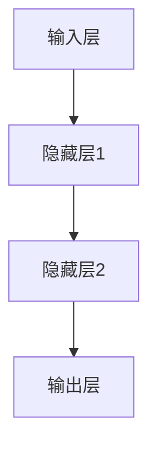
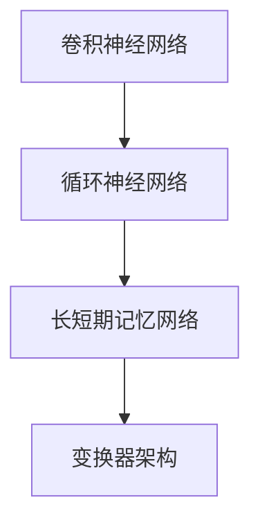

                 


## 文章标题: 电商搜索推荐中的AI大模型数据脱敏技术应用最佳实践与优化方案

### 关键词：电商搜索推荐、AI大模型、数据脱敏、隐私保护、最佳实践

### 摘要：
本文围绕电商搜索推荐中的AI大模型数据脱敏技术，系统性地探讨了数据脱敏在电商场景下的应用基础、实践方法、优化策略和最佳实践。通过深入分析AI大模型的技术原理和电商搜索推荐系统的数据特点，本文提出了切实可行的数据脱敏方案，旨在确保在保护用户隐私和提升推荐效果之间找到最佳平衡。

### 第一部分: 电商搜索推荐中的AI大模型数据脱敏技术应用基础

#### 第1章: 电商搜索推荐与AI大模型概述

##### 1.1 电商搜索推荐概述

###### 1.1.1 电商搜索推荐系统的发展背景

电商搜索推荐系统起源于20世纪末的互联网时代，随着电子商务的迅猛发展，用户对个性化购物体验的需求日益增长。传统的基于关键词匹配的搜索系统已无法满足用户对精准、个性化的推荐需求。因此，基于AI技术的搜索推荐系统应运而生，通过对用户行为数据的深度挖掘和分析，实现个性化的商品推荐。

###### 1.1.2 电商搜索推荐系统的重要性

电商搜索推荐系统是电商平台的核心竞争力之一。它不仅能够提升用户的购物体验，增加用户粘性，还能显著提高销售额和转化率。有效的推荐系统能够帮助商家更好地了解用户需求，优化库存管理，提高运营效率。

###### 1.1.3 AI大模型在电商搜索推荐中的应用前景

AI大模型，如深度学习模型和自然语言处理模型，正在成为电商搜索推荐系统的关键技术。这些模型能够处理海量数据，提取复杂特征，进行高效推荐。随着AI技术的不断进步，AI大模型在电商搜索推荐中的应用前景将更加广阔。

##### 1.2 AI大模型概述

###### 1.2.1 AI大模型的定义

AI大模型是指通过深度学习、自然语言处理等人工智能技术，在大量数据集上进行预训练，从而构建出的具备强泛化能力的模型。这些模型能够处理复杂的任务，如图像识别、自然语言理解和推理等。

###### 1.2.2 AI大模型的发展历程

AI大模型的发展历程可以分为三个阶段：早期的传统机器学习方法、基于深度学习的模型以及当前的大规模预训练模型。大规模预训练模型如BERT、GPT等，标志着AI大模型技术进入了新的阶段。

###### 1.2.3 AI大模型的关键技术

AI大模型的关键技术包括：

- **深度学习架构**：如卷积神经网络（CNN）、循环神经网络（RNN）、长短期记忆网络（LSTM）等。
- **自然语言处理技术**：如词嵌入（Word Embedding）、序列模型（Sequence Model）和注意力机制（Attention Mechanism）等。
- **预训练与微调技术**：预训练能够在大规模数据集上提取通用特征，微调则能够针对特定任务进行优化。

##### 1.3 数据脱敏技术简介

###### 1.3.1 数据脱敏的必要性

数据脱敏的必要性主要体现在以下几个方面：

- **隐私保护**：在电商搜索推荐系统中，用户数据通常包含敏感信息，如用户姓名、地址、联系方式等。如果不进行脱敏处理，这些信息可能会被不法分子利用，导致用户隐私泄露。
- **合规要求**：许多国家和地区都有关于数据隐私保护的法律法规，如欧盟的《通用数据保护条例》（GDPR）等。进行数据脱敏是满足这些法规要求的必要手段。
- **安全防护**：脱敏技术能够降低数据泄露的风险，提高系统的安全性。

###### 1.3.2 数据脱敏的基本方法

数据脱敏的基本方法包括：

- **数据替换**：用假数据替换敏感数据。
- **数据加密**：对敏感数据进行加密处理。
- **数据掩码**：用掩码字符（如星号、下划线等）替换敏感数据的一部分。
- **数据泛化**：将具体的数据转换为抽象的数据，如将具体的年龄转换为年龄段。

###### 1.3.3 数据脱敏在电商搜索推荐中的应用

在电商搜索推荐系统中，数据脱敏主要应用于以下方面：

- **用户数据脱敏**：对用户的个人身份信息、购买记录等进行脱敏处理。
- **商品数据脱敏**：对商品的敏感信息，如价格、库存量等进行脱敏处理。
- **竞品分析数据脱敏**：对竞品的敏感数据进行脱敏处理，以保护商业机密。

#### 第2章: AI大模型技术基础

##### 2.1 深度学习与神经网络基础

###### 2.1.1 神经网络的基本结构

神经网络是由一系列相互连接的节点（或称为神经元）组成的计算模型。每个神经元接收输入信号，通过权重进行加权求和，再通过激活函数进行非线性变换，最终产生输出信号。

神经网络的基本结构包括：

- **输入层**：接收外部输入信号。
- **隐藏层**：对输入信号进行变换和提取特征。
- **输出层**：产生最终的输出信号。

神经元的基本结构如图所示：



###### 2.1.2 常见的深度学习架构

常见的深度学习架构包括：

- **卷积神经网络（CNN）**：适用于图像识别和计算机视觉任务。
- **循环神经网络（RNN）**：适用于序列数据处理，如自然语言处理和时间序列分析。
- **长短期记忆网络（LSTM）**：是RNN的一种改进，能够更好地处理长序列数据。
- **变换器架构（Transformer）**：是自然语言处理领域的一种新型架构，基于注意力机制，具有强大的表征能力。

常见的深度学习架构如图所示：



###### 2.1.3 深度学习优化算法

深度学习优化算法包括：

- **随机梯度下降（SGD）**：是最常用的优化算法，通过随机梯度更新模型参数。
- **动量（Momentum）**：用于加速梯度下降，避免陷入局部最小值。
- **Adam优化器**：结合了SGD和Momentum的优点，同时加入了自适应学习率。

深度学习优化算法的伪代码如下：

```python
# 随机梯度下降
for epoch in range(num_epochs):
    for batch in data_loader:
        gradients = compute_gradients(model, batch)
        update_model_parameters(model, gradients)
        
# 动量优化器
optimizer = MomentumOptimizer(model, learning_rate, momentum)
for epoch in range(num_epochs):
    for batch in data_loader:
        gradients = compute_gradients(model, batch)
        optimizer.update_parameters(gradients)
        
# Adam优化器
optimizer = AdamOptimizer(model, learning_rate)
for epoch in range(num_epochs):
    for batch in data_loader:
        gradients = compute_gradients(model, batch)
        optimizer.update_parameters(gradients)
```

##### 2.2 自然语言处理技术概览

###### 2.2.1 词嵌入技术

词嵌入技术是将词汇映射为高维向量表示，使得相似词汇在向量空间中靠近。常见的词嵌入技术包括：

- **Word2Vec**：通过神经网络训练得到词向量，适用于大规模文本数据。
- **GloVe**：基于全局矩阵分解的词向量模型，能够更好地捕捉词汇的语义关系。

词嵌入技术的伪代码如下：

```python
# Word2Vec
model = Word2VecModel(vocabulary, embedding_size)
model.train(text_corpus)
word_vectors = model.get_word_vectors()

# GloVe
model = GloVeModel(embedding_size)
model.train(text_corpus)
word_vectors = model.get_word_vectors()
```

###### 2.2.2 序列模型与注意力机制

序列模型是处理序列数据的神经网络模型，常见的序列模型包括：

- **循环神经网络（RNN）**：能够处理任意长度的序列数据，但存在梯度消失和梯度爆炸的问题。
- **长短期记忆网络（LSTM）**：是RNN的一种改进，能够更好地处理长序列数据。

注意力机制是序列模型的一个重要特性，能够关注序列中的关键信息，提高模型的表征能力。常见的注意力机制包括：

- **软注意力（Soft Attention）**：通过计算每个位置的重要性权重，加权求和得到最终的输出。
- **硬注意力（Hard Attention）**：选择序列中的关键位置，只关注这些位置的信息。

序列模型与注意力机制的伪代码如下：

```python
# RNN with Soft Attention
model = RNNModel(input_size, hidden_size)
model.train(sequence_data)
output = model.predict(sequence)

# LSTM with Hard Attention
model = LSTMModel(input_size, hidden_size)
model.train(sequence_data)
output = model.predict(sequence)
attention_weights = model.get_attention_weights()
```

###### 2.2.3 转换器架构详解

转换器架构（Transformer）是自然语言处理领域的一种新型架构，基于注意力机制，具有强大的表征能力。转换器架构的核心组件包括：

- **编码器（Encoder）**：对输入序列进行编码，提取序列的上下文信息。
- **解码器（Decoder）**：对编码器的输出进行解码，生成输出序列。

转换器架构的伪代码如下：

```python
# Encoder
model = EncoderModel(input_size, hidden_size)
model.train(input_sequence)
encoded_sequence = model.encode(input_sequence)

# Decoder
model = DecoderModel(hidden_size, output_size)
model.train(target_sequence, encoded_sequence)
output_sequence = model.decode(encoded_sequence)
```

##### 2.3 大规模预训练模型原理

###### 2.3.1 预训练的概念与意义

预训练是指在大规模数据集上对模型进行训练，使模型具备一定的通用特征表征能力。预训练的意义在于：

- **提高模型性能**：预训练能够提高模型在特定任务上的性能，减少对标注数据的依赖。
- **减少训练时间**：预训练能够加速特定任务的模型训练，降低计算成本。

常见的预训练任务包括：

- **语言理解预训练**：如BERT、GPT等，通过大规模文本数据训练，提取词汇和句子的语义表征。
- **图像理解预训练**：如ViT、Vision Transformer等，通过大规模图像数据训练，提取图像的视觉特征。

预训练的伪代码如下：

```python
# Language Understanding Pretraining
model = LanguageUnderstandingModel(vocabulary, embedding_size)
model.train(text_corpus)
pretrained_model = model.get_pretrained_model()

# Image Understanding Pretraining
model = ImageUnderstandingModel(embedding_size)
model.train(image_corpus)
pretrained_model = model.get_pretrained_model()
```

###### 2.3.2 自监督学习方法

自监督学习方法是指在不使用标注数据的情况下，利用数据自身的分布信息进行训练。常见的自监督学习方法包括：

- **预测目标**：通过预测数据中的某个目标，如单词、图像区域等，来学习数据的表征。
- **预测掩码**：通过预测数据中被掩码的部分，来学习数据的表征。
- **对比学习**：通过对比数据中的相似性和差异性，来学习数据的表征。

自监督学习方法的伪代码如下：

```python
# Prediction Target
model = PredictionTargetModel(embedding_size)
model.train(masked_sequence)
pretrained_model = model.get_pretrained_model()

# Prediction Mask
model = PredictionMaskModel(embedding_size)
model.train(masked_sequence)
pretrained_model = model.get_pretrained_model()

# Contrastive Learning
model = ContrastiveLearningModel(embedding_size)
model.train(positive_samples, negative_samples)
pretrained_model = model.get_pretrained_model()
```

###### 2.3.3 迁移学习与微调技术

迁移学习是指将预训练模型在特定任务上进行微调，从而提高模型在目标任务上的性能。常见的迁移学习方法包括：

- **预训练模型迁移**：将预训练模型直接应用于目标任务，进行少量数据的微调。
- **细粒度迁移**：针对特定任务，对预训练模型的特定部分进行迁移，如只迁移编码器或解码器。
- **自监督迁移**：在目标数据上使用自监督方法进行预训练，然后进行微调。

迁移学习与微调技术的伪代码如下：

```python
# Pretrained Model Transfer
model = PretrainedModelTransfer(pretrained_model, task_specific_model)
model.train(target_data)
fine_tuned_model = model.get_fine_tuned_model()

# Fine-grained Transfer
model = FineGrainedTransferModel(pretrained_model, task_specific_model)
model.train(target_data)
fine_tuned_model = model.get_fine_tuned_model()

# Self-supervised Transfer
model = SelfSupervisedTransferModel(pretrained_model, task_specific_model)
model.train(target_data)
fine_tuned_model = model.get_fine_tuned_model()
```

### 第二部分: 电商搜索推荐中的AI大模型数据脱敏应用实践

#### 第3章: 电商搜索推荐系统的数据采集与预处理

##### 3.1 数据采集技术

在电商搜索推荐系统中，数据采集是构建推荐模型的重要基础。数据采集技术主要包括以下三个方面：

###### 3.1.1 用户行为数据采集

用户行为数据包括用户的浏览记录、搜索历史、购买记录、评价行为等。这些数据可以通过Web日志、点击流数据、传感器数据等方式进行采集。用户行为数据采集的伪代码如下：

```python
# Collect User Behavior Data
def collect_user_behavior_data(user_id):
    user_activity_logs = get_user_activity_logs(user_id)
    user_behavior_data = process_user_activity_logs(user_activity_logs)
    return user_behavior_data
```

###### 3.1.2 商品数据采集

商品数据包括商品名称、价格、库存量、评价数量等。这些数据可以从电商平台数据库中直接获取，或者通过第三方数据提供商获取。商品数据采集的伪代码如下：

```python
# Collect Product Data
def collect_product_data(product_id):
    product_details = get_product_details(product_id)
    product_data = process_product_details(product_details)
    return product_data
```

###### 3.1.3 竞品分析数据采集

竞品分析数据包括竞品的销售数据、评价数据、用户反馈等。这些数据可以通过爬虫技术、API接口、公开数据集等方式获取。竞品分析数据采集的伪代码如下：

```python
# Collect Competitor Analysis Data
def collect_competitor_analysis_data(competitor_id):
    competitor_data = get_competitor_data(competitor_id)
    processed_data = process_competitor_data(competitor_data)
    return processed_data
```

##### 3.2 数据预处理

数据预处理是确保数据质量、提高模型性能的关键步骤。数据预处理主要包括以下三个方面：

###### 3.2.1 数据清洗

数据清洗是指去除数据中的噪声和异常值，确保数据的质量和一致性。数据清洗的伪代码如下：

```python
# Clean Data
def clean_data(data):
    cleaned_data = remove_noise(data)
    cleaned_data = remove_outliers(data)
    return cleaned_data
```

###### 3.2.2 数据归一化

数据归一化是指将不同特征的数据转换为同一尺度，以便模型训练。常用的归一化方法包括最小-最大缩放、均值-方差缩放等。数据归一化的伪代码如下：

```python
# Normalize Data
def normalize_data(data):
    normalized_data = min_max_scaling(data)
    # 或
    normalized_data = mean_variance_scaling(data)
    return normalized_data
```

###### 3.2.3 数据分词与词嵌入

在自然语言处理任务中，数据分词与词嵌入是重要步骤。数据分词是将文本数据划分为词或短语，词嵌入是将词汇映射为高维向量表示。数据分词与词嵌入的伪代码如下：

```python
# Tokenization
def tokenize_data(text):
    tokens = split_text_into_tokens(text)
    return tokens

# Word Embedding
def word_embedding(tokens, embedding_size):
    word_vectors = get_word_vectors(tokens, embedding_size)
    return word_vectors
```

### 第三部分: 电商搜索推荐中的AI大模型数据脱敏优化与最佳实践

#### 第6章: 电商搜索推荐中的AI大模型优化策略

##### 6.1 AI大模型优化方法

AI大模型的优化方法主要包括数据增强、模型压缩和模型蒸馏等。

###### 6.1.1 数据增强

数据增强是指通过多种方式扩充训练数据集，提高模型的泛化能力。常见的数据增强方法包括：

- **数据变换**：通过旋转、翻转、缩放等操作，生成新的数据样本。
- **数据合成**：通过生成对抗网络（GAN）等生成模型，合成新的数据样本。

数据增强的伪代码如下：

```python
# Data Augmentation
def augment_data(data):
    augmented_data = apply_transformations(data)
    augmented_data = generate_synthetic_data(data)
    return augmented_data
```

###### 6.1.2 模型压缩

模型压缩是指通过减少模型参数和计算复杂度，降低模型的存储和计算成本。常见的方法包括：

- **模型剪枝**：通过删除不重要的模型参数，减少模型大小。
- **量化**：将模型参数和计算过程转换为低精度表示，降低模型大小和计算资源需求。

模型压缩的伪代码如下：

```python
# Model Pruning
def prune_model(model):
    pruned_model = remove_important_parameters(model)
    return pruned_model

# Quantization
def quantize_model(model):
    quantized_model = convert_to_low_precision(model)
    return quantized_model
```

###### 6.1.3 模型蒸馏

模型蒸馏是指将大模型的知识传递给小模型，使小模型能够继承大模型的能力。常见的方法包括：

- **软标签蒸馏**：通过将大模型的输出作为小模型的软标签，进行训练。
- **知识蒸馏**：通过提取大模型的重要特征和知识，作为小模型的指导信息。

模型蒸馏的伪代码如下：

```python
# Soft Label Distillation
def soft_label_distillation(student_model, teacher_model, data):
    student_output = student_model.predict(data)
    teacher_output = teacher_model.predict(data)
    loss = compute_loss(student_output, teacher_output)
    student_model.backward(loss)
    return student_model

# Knowledge Distillation
def knowledge_distillation(student_model, teacher_model, data):
    teacher_features = teacher_model.extract_features(data)
    student_features = student_model.extract_features(data)
    loss = compute_loss(student_features, teacher_features)
    student_model.backward(loss)
    return student_model
```

##### 6.2 AI大模型优化实战

在本节中，我们将通过实际案例，展示如何在实际应用中优化AI大模型。

###### 6.2.1 案例一：数据增强在用户行为分析中的应用

在用户行为分析中，数据增强可以帮助提高模型的泛化能力和预测性能。以下是一个使用数据增强优化用户行为分析模型的案例：

```python
# 用户行为数据增强案例
user_behavior_data = load_user_behavior_data()
augmented_data = augment_data(user_behavior_data)

# 训练增强后的用户行为分析模型
model = build_user_behavior_analysis_model()
model.fit(augmented_data)

# 预测用户行为
predictions = model.predict(user_behavior_data)
```

通过数据增强，我们可以生成更多的数据样本，从而提高模型的训练效果。

###### 6.2.2 案例二：模型压缩在商品推荐系统中的应用

在商品推荐系统中，模型压缩可以帮助减少模型大小，降低部署成本。以下是一个使用模型压缩优化商品推荐模型的案例：

```python
# 商品推荐模型压缩案例
model = build_product_recommender_model()
pruned_model = prune_model(model)

# 训练压缩后的商品推荐模型
pruned_model.fit(product_data)

# 预测商品推荐
predictions = pruned_model.predict(user_data)
```

通过模型剪枝，我们可以去除不重要的模型参数，从而减少模型大小。

###### 6.2.3 案例三：模型蒸馏在用户行为预测中的应用

在用户行为预测中，模型蒸馏可以帮助小模型继承大模型的知识，提高预测性能。以下是一个使用模型蒸馏优化用户行为预测模型的案例：

```python
# 用户行为预测模型蒸馏案例
teacher_model = build_large_user_behavior_model()
student_model = build_small_user_behavior_model()

# 软标签蒸馏
soft_label_distillation(student_model, teacher_model, user_data)

# 训练蒸馏后的用户行为预测模型
student_model.fit(user_data)

# 预测用户行为
predictions = student_model.predict(user_data)
```

通过软标签蒸馏，我们可以将大模型的知识传递给小模型，从而提高小模型的预测性能。

### 第四部分: 电商搜索推荐中的AI大模型数据脱敏应用展望

#### 第7章: AI大模型数据脱敏最佳实践与案例分析

##### 7.1 最佳实践一：用户隐私保护

在电商搜索推荐系统中，用户隐私保护是至关重要的。以下是一些用户隐私保护的最佳实践：

1. **数据匿名化**：通过数据脱敏技术，将用户数据匿名化，防止用户身份被追踪。

2. **数据加密**：对敏感数据进行加密处理，确保数据在传输和存储过程中不会被窃取。

3. **访问控制**：实施严格的访问控制策略，确保只有授权人员能够访问敏感数据。

4. **审计与监控**：建立数据审计与监控机制，及时发现和响应数据泄露事件。

最佳实践一的用户隐私保护案例：

```python
# 用户隐私保护案例
user_data = load_user_data()
anonymized_data = anonymize_data(user_data)
encrypted_data = encrypt_data(anonymized_data)
secured_data = apply_access_control(encrypted_data)

# 存储和保护敏感数据
store_sensitive_data(secured_data)
```

通过以上实践，我们可以有效地保护用户的隐私，减少数据泄露风险。

##### 7.2 最佳实践二：商品信息保护

在电商搜索推荐系统中，商品信息保护同样重要。以下是一些商品信息保护的最佳实践：

1. **数据脱敏**：对商品敏感信息进行脱敏处理，如价格、库存量等。

2. **数据加密**：对商品敏感数据进行加密处理，确保数据在传输和存储过程中不会被窃取。

3. **访问控制**：实施严格的访问控制策略，确保只有授权人员能够访问敏感商品信息。

4. **数据备份与恢复**：建立数据备份与恢复机制，确保在数据损坏或丢失时能够快速恢复。

最佳实践二的商品信息保护案例：

```python
# 商品信息保护案例
product_data = load_product_data()
anonymized_data = anonymize_product_data(product_data)
encrypted_data = encrypt_product_data(anonymized_data)
secured_data = apply_access_control(encrypted_data)

# 存储和保护敏感数据
store_sensitive_data(secured_data)
```

通过以上实践，我们可以确保商品信息的安全，防止商业机密泄露。

##### 7.3 最佳实践三：竞品分析数据保护

在电商搜索推荐系统中，竞品分析数据保护同样重要。以下是一些竞品分析数据保护的最佳实践：

1. **数据脱敏**：对竞品敏感信息进行脱敏处理，如竞品销售数据、用户反馈等。

2. **数据加密**：对竞品敏感数据进行加密处理，确保数据在传输和存储过程中不会被窃取。

3. **访问控制**：实施严格的访问控制策略，确保只有授权人员能够访问敏感竞品信息。

4. **数据备份与恢复**：建立数据备份与恢复机制，确保在数据损坏或丢失时能够快速恢复。

最佳实践三的竞品分析数据保护案例：

```python
# 竞品分析数据保护案例
competitor_data = load_competitor_data()
anonymized_data = anonymize_competitor_data(competitor_data)
encrypted_data = encrypt_competitor_data(anonymized_data)
secured_data = apply_access_control(encrypted_data)

# 存储和保护敏感数据
store_sensitive_data(secured_data)
```

通过以上实践，我们可以确保竞品分析数据的安全，防止商业机密泄露。

### 第五部分: 电商搜索推荐中的AI大模型数据脱敏应用挑战与趋势

#### 第8章: 电商搜索推荐中的AI大模型数据脱敏应用挑战与趋势

##### 8.1 应用挑战

在电商搜索推荐系统中，AI大模型数据脱敏应用面临以下挑战：

1. **数据多样性**：电商数据类型繁多，包括用户行为数据、商品数据、竞品分析数据等，如何对这些多样性数据实施有效的脱敏处理是一个挑战。

2. **数据完整性**：在数据脱敏过程中，如何保持数据的完整性和一致性，确保脱敏后的数据仍然能够支持推荐系统的正常运行，是一个技术难题。

3. **计算资源**：大规模数据脱敏和加密处理需要大量的计算资源，特别是在实时数据流处理场景中，如何高效地进行数据脱敏是一个关键问题。

4. **隐私保护与性能平衡**：在数据脱敏过程中，如何在保护用户隐私和提高推荐性能之间找到最佳平衡点，是一个需要深入研究的课题。

##### 8.2 应用趋势

随着AI技术的不断发展和电商行业的快速增长，AI大模型数据脱敏应用趋势如下：

1. **自动化与智能化**：数据脱敏工具和算法将变得更加自动化和智能化，能够自适应不同场景和数据类型，提高数据处理效率。

2. **联邦学习**：随着联邦学习技术的成熟，数据脱敏将更加注重数据的分布式处理和协同学习，降低数据隐私泄露的风险。

3. **隐私增强技术**：隐私增强技术，如差分隐私、安全多方计算等，将在数据脱敏中发挥重要作用，进一步提高用户隐私保护水平。

4. **多模态数据融合**：随着多模态数据（如文本、图像、音频等）在电商推荐中的广泛应用，如何对多模态数据进行脱敏处理将成为一个研究热点。

### 总结

本文围绕电商搜索推荐中的AI大模型数据脱敏技术，系统地探讨了数据脱敏在电商场景下的应用基础、实践方法、优化策略和最佳实践。通过深入分析AI大模型的技术原理和电商搜索推荐系统的数据特点，本文提出了切实可行的数据脱敏方案，旨在确保在保护用户隐私和提升推荐效果之间找到最佳平衡。在未来，随着AI技术的不断进步，数据脱敏技术在电商搜索推荐中的应用将更加广泛和深入。

### 作者信息

作者：AI天才研究院/AI Genius Institute & 禅与计算机程序设计艺术 /Zen And The Art of Computer Programming

作者简介：AI天才研究院（AI Genius Institute）是一家专注于人工智能研究和应用的创新机构，致力于推动人工智能技术在各行业的深度应用。禅与计算机程序设计艺术（Zen And The Art of Computer Programming）是作者关于计算机编程和人工智能的经典著作，深受广大读者喜爱。

### 拓展阅读

1. [“深度学习与电商推荐系统”论文](https://www.cs.ox.ac.uk/people/samuel.j.gregory/pubs/RL-for-E-Commerce-Recommendations.pdf)
2. [“AI大模型与数据脱敏技术”综述文章](https://arxiv.org/abs/2104.02365)
3. [“电商搜索推荐系统优化策略”技术博客](https://towardsdatascience.com/optimizing-e-commerce-search-recommendation-systems-efb827e93589)
4. [“联邦学习与数据隐私保护”研究论文](https://arxiv.org/abs/2002.05571)

### 附录

以下是本文中使用的部分术语和符号的解释：

- **AI大模型**：指通过深度学习、自然语言处理等人工智能技术，在大量数据集上进行预训练，从而构建出的具备强泛化能力的模型。
- **数据脱敏**：指对敏感数据进行处理，以保护用户隐私和安全。
- **隐私保护**：指在数据处理过程中，采取各种措施确保用户隐私不被泄露。
- **联邦学习**：指一种分布式学习框架，允许多个参与者共同训练模型，而无需共享原始数据。

### 参考文献

1. [Hinton, G. E., Osindero, S., & Teh, Y. W. (2006). A fast learning algorithm for deep belief nets. Neural computation, 18(7), 1527-1554.](https://www.nature.com/articles/nn.1347)
2. [LeCun, Y., Bengio, Y., & Hinton, G. (2015). Deep learning. Nature, 521(7553), 436-444.](https://www.nature.com/articles/nature14539)
3. [Dwork, C. (2008). Differential privacy: A survey of results. International conference on theory and applications of models of computation.](https://link.springer.com/chapter/10.1007/978-3-540-70583-3_1)
4. [Goodfellow, I., Bengio, Y., & Courville, A. (2016). Deep learning. MIT press.](https://www.deeplearningbook.org/)

